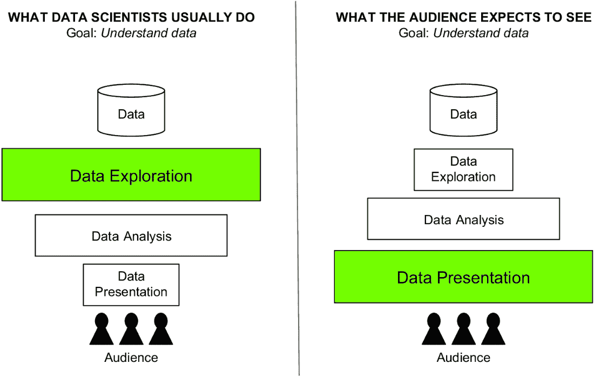
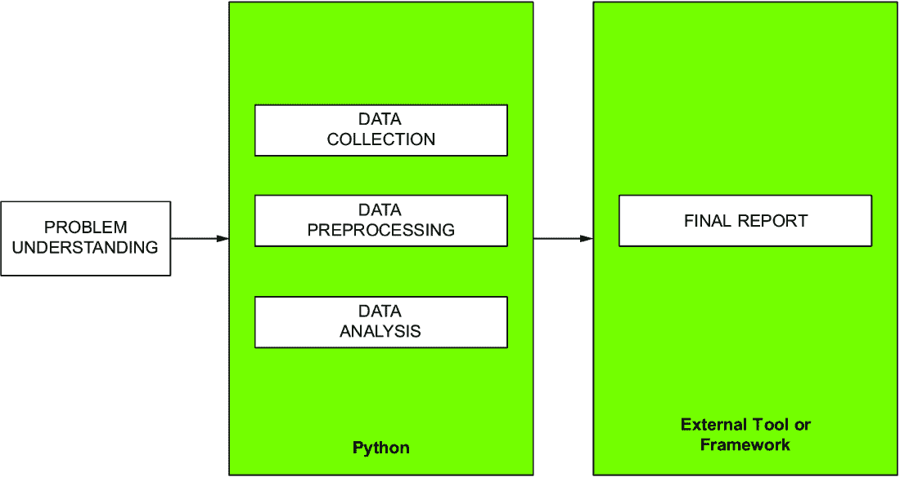
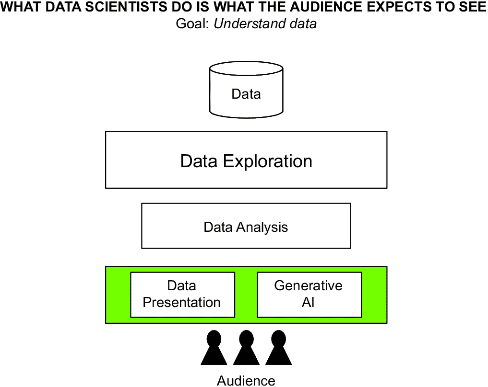
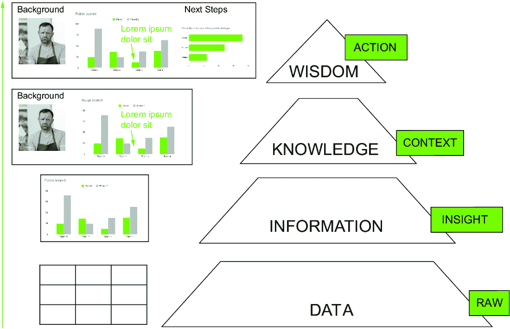
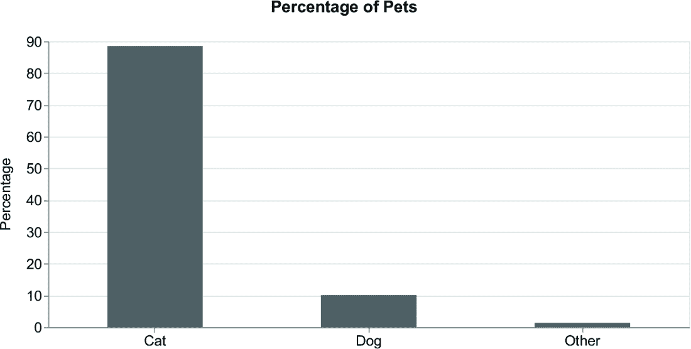
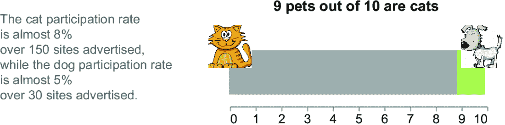

# 1 数据故事讲述简介

### 本章涵盖

+   什么是数据故事讲述

+   数据故事讲述的重要性

+   为什么您应该使用 Python Altair 和生成式 AI 工具进行数据故事讲述

+   当 Altair 和生成式 AI 工具对数据故事讲述没有帮助时

+   如何阅读这本书

+   数据、信息、知识、智慧（DIKW）金字塔

通过购买这本书，您已经决定踏上将数据故事讲述、Python 和生成式 AI 相结合的刺激之路。很可能，您已经对数据可视化有所了解，并希望学习新的技术来改进您的图表，以及如何在图表创建过程中使用生成式 AI。简单来说，通过阅读这本书，您希望学习如何使用生成式 AI 进行数据故事讲述。我马上告诉您，这本书不仅仅是那样——它不仅仅是数据故事讲述和生成式 AI 的背景知识。实际上，在整本书中，您还将学习一种方法论，这将使您能够系统地创建自己的基于数据的叙事。所以，这不会是一本又一本的代码和示例实现的书，但在这里和那里，我会为您提供实现您自己的数据驱动故事的理论基础。这本书是理论与实践的结合，这将使您能够在其他环境中应用所学的技术。

您将在整本书——以及本章——中遇到的示例将至关重要，因为它们旨在尽可能简单易懂地理解一种工作方法。在书的结尾，您将意识到，您将不仅仅实现了示例，您还将学会一种工作方法论。因此，我请求您不要因为示例的简单而感到失望，而要看看它们背后的方法论以及您如何在您的工作中应用它，这肯定比书中描述的示例要复杂得多。所以，让我们开始我们的旅程！

## 1.1 数据故事讲述的艺术

*数据故事讲述*是通过将数据转化为叙事故事来分享数据洞察的有力方式。这是一种您可以在任何行业中使用的艺术，例如政府、教育、金融、娱乐和医疗保健。数据故事讲述不仅针对数据科学家和分析师；它是针对任何曾经想要用数据讲故事的人。

要从数据可视化过渡到数据叙事，你需要改变视角。不是从你的角度看待数据，而是要从你将要告诉的人的角度看待数据——换句话说，就是*观众*。图 1.1 展示了通过熟练的数据科学家（左侧代表）和热切期待的观众（右侧代表）的眼睛看数据到预期观众的过程。流程包括三个主要阶段：数据探索、分析和展示。每个方框的大小反映了分配给其相应阶段的时间量。虽然数据科学家和观众有共同的目标（即真正掌握数据的本质），但他们实现这一目标的方式各不相同。数据科学家在数据探索阶段理解数据，而观众在数据展示阶段成为焦点。



##### 图 1.1 从数据科学家的视角（左侧）和观众视角（右侧）看数据科学流程

数据叙事可以帮助数据科学家和分析师向观众展示和传达数据。你可以将数据叙事视为数据科学生命周期的压轴大戏。它包括将前几个阶段的结果转化为一个叙事，有效地将数据分析的结果传达给观众。而不是依赖于枯燥的图表，数据叙事使你能够让你的数据生动起来，并有力、有说服力地传达见解。数据叙事给观众提供了一个机会，在追求目标的过程中感受情绪，体验成功和挫折。

更正式地说，数据叙事构建引人入胜的故事，这些故事以数据为支撑，使得分析师和数据科学家能够有趣且互动地展示和分享他们的见解。数据叙事的最终目标是吸引观众并激发他们做出决策。在某些情况下，包括商业场景，数据并非第一步；首先，你心中有一个叙事或假设。然后，你寻找证实或否定它的数据。在这种情况下，你仍然可以进行数据叙事，但必须注意不要为了支持你的假设而篡改你的数据。知名的故事讲述培训顾问布伦特·戴克斯（Brent Dykes）提出了以下方法：“无论何时，如果你从叙事而不是数据开始，就需要自律和开放的心态。在这些场景中，风险的一个来源将是确认偏差。你可能会倾向于挑选证实你观点的数据，而忽略与你观点相冲突的数据。”（戴克斯，2023）请记住，在构建你的数据故事时，要基于准确和无偏见的数据分析。此外，始终考虑你正在分析的数据。

不久前，我有机会参与一个文化遗产项目，该项目要求我自动分析从大约 1700-1800 年间的名字登记册的转录文本中的实体。目标是计算登记册中人物的某些统计数据，例如最常见的名字、每年出生人数等。坐在我的电脑前，我计算并可视化了数据统计。该项目还涉及将这些人物与他们的坟墓联系起来，以构建一个交互式墓地地图。在项目进行到某个阶段时，我有机会参观了墓地。当我走过那里时，一排排的墓碑让我停下脚步。这让我感到震惊：那些刻在石头上的每一个名字都代表了一个生命。突然间，我一直在数据集中仔细研究的数据和统计数据不再仅仅是数据点——它们是真实人物的 stories。这是一个强大的认识，改变了我对待工作的方式。那时，我发现了数据故事讲述的真正力量。这不仅仅是创建花哨的图表和图表——这是让数据背后的人活过来。我们有一个使命，给这些人一个声音，确保他们的故事被听到。这正是数据故事讲述所做的事情；它给那些通常深埋在数字中的人一个声音。作为数据故事讲述者，我们的使命是将这些故事带到前台，确保它们被清晰地听到。

在这本书中，你将学习两种将数据转化为故事的技术：Python Vega-Altair（或简称 Altair）([`altair-viz.github.io/`](https://altair-viz.github.io/))和生成式 AI 工具。Python Altair 是一个用于数据可视化的 Python 库。与最知名的 Python 库（如 Matplotlib 和 Seaborn）不同，Altair 是一个声明性库，其中你只需指定你想要在可视化中看到的内容。这个方面对于快速构建数据故事而无需关心如何构建可视化是有益的。Altair 还支持图表交互性，因此用户可以直接探索数据和与之交互。

生成式 AI 是你在本书中构建数据故事的第二种技术。我们将重点关注 ChatGPT 生成文本、DALL-E 生成图像和 GitHub Copilot 自动生成 Altair 代码。我选择使用 GitHub Copilot 生成代码，而不是 ChatGPT，因为 Copilot 是用特定领域的文本训练的，包括 GitHub 和 Stack Overflow 代码。相反，ChatGPT 更通用。在撰写本文时，生成式 AI 是一项非常新的技术，仍在发展中，它将规格说明或操作的描述翻译成文本。

数据叙事不仅仅是关于传达数据；它是关于激励你的听众并邀请他们采取行动。良好的数据叙事需要艺术和科学的结合。艺术在于找到合适的故事，而科学在于理解如何使用数据来支持这个故事。当做得好时，数据叙事可以成为变革的有力工具。在本节的剩余部分，我们将简要介绍关于数据叙事的三个基本问题。

### 1.1.1 为什么你应该使用数据叙事？

数据叙事使你能够通过易于被听众理解的叙事来传达你的数据分析过程的结果。在本书中，我们将看到许多示例和案例研究。例如，你将看到如何将图 1.2 中的原始图表转化为图 1.3 中所示的数据故事。


##### 图 1.2 原始图表的一个示例


##### 图 1.3 将图 1.2 中的原始图表转化为数据故事

数据叙事允许你填补仅仅可视化数据和向听众传达数据之间的差距。数据叙事可以提高你的沟通技巧，并使传达结果的过程标准化和简化，使人们更容易理解和记住信息。数据叙事还有助于你学会更有效地与他人沟通，改善个人和职业关系。

如果你想要做以下任何一项，请使用数据叙事：

+   专注于你想要传达的信息，并使数据更易于理解和相关。

+   以清晰和有说服力的方式将你的发现传达给他人。

+   在情感层面上与你的听众建立联系，这会使他们更有可能采取行动。

+   通过帮助他们更深入地理解你的数据，激励听众做出更好的决策。

### 1.1.2 数据叙事可以解决哪些问题？

如果你想要以撰写报告、做演示或构建仪表板的形式向听众传达某些信息，请使用数据叙事。

#### 撰写报告

想象你必须为一家零售公司撰写一份销售报告。与其展示原始数据和图表，不如编织一个关于不同产品类别表现的数据故事。首先，确定数据中最关键的部分，例如最畅销的产品、新兴趋势或季节性波动。然后，结合可视化、轶事和逻辑叙事流程来呈现信息。

你可以围绕你的数据构建一个故事，例如通过介绍问题、建立悬念并以可操作的推荐作为结论。在撰写报告时，使用数据叙事来突出你数据中最重要的一部分，使你的报告更具吸引力和易于理解。

#### 做演示

考虑一个市场营销演示，你必须展示各种营销活动的有效性。与其用众多图表和统计数据轰炸观众，不如专注于创建一个引人入胜的叙述，引导他们了解活动的展开过程及其对目标受众的影响。最后，展示可能的下一步行动。在演示中，使用数据叙事来吸引观众的注意力，并帮助他们更好地理解你的信息。

#### 构建仪表板

让我们假设你正在为一家零售公司开发销售绩效仪表板。与其展示一个杂乱无章的界面和压倒性的数据，不如专注于引导用户通过一个叙述，突出关键洞察。在构建仪表板时，使用数据叙事来构建更用户友好和富有信息量的仪表板。

### 1.1.3 数据叙事的挑战有哪些？

构建引人入胜的数据故事并非易事。这需要*时间*来确保充满有价值信息的引人入胜的叙述。此外，它是一个*团队努力*，因为它涉及到将来自不同背景的个人聚集在一起，每个人都有自己的专业知识和观点，共同合作。这种合作可能具有挑战性，但对于编织一个统一且具有影响力的数据故事至关重要。

创建数据故事涉及两个关键挑战：时间和团队合作。在这些领域进行投资对于吸引观众和有效传达洞察力至关重要。

现在我们已经讨论了何时使用数据叙事，它可以解决的问题以及它独特之处，我们准备考虑与我们的两个工具相关的问题：Python Altair 和生成式 AI 工具。我们将在下一节中这样做。

## 1.2 为什么你应该使用 Python Altair 和生成式 AI 进行数据叙事？

Python 为您提供了许多数据可视化库。其中许多，包括 Matplotlib 和 Seaborn，都是*命令式库*，这意味着你必须精确地定义你想要如何构建可视化。Python Altair 相反，是一个*声明式库*，这意味着你只需指定要可视化的内容。使用 Python Altair 进行数据叙事而不是其他命令式库，可以使你快速构建可视化。

例如，要使用 Matplotlib 绘制折线图，你必须明确指定 x 和 y 坐标，设置图表标题和标签，并自定义外观。

##### 列表 1.1 命令式库

```py
import matplotlib.pyplot as plt

x = [1, 2, 3, 4, 5]
y = [1, 4, 9, 16, 25]

plt.plot(x, y)
plt.title('Square Numbers')
plt.xlabel('X')
plt.ylabel('Y')

plt.show()
```

注意：该图表在 Matplotlib 中构建折线图。您必须定义构建图表的单个步骤：（1）设置标题，（2）设置 x 轴，（3）设置 y 轴。

声明式可视化库，如 Altair，使您能够定义所需的输出，而不必指定实现它的确切步骤。例如，使用 Altair，您可以简单地定义数据，定义 *x* 和 *y* 变量，然后让库处理其余部分，包括轴、标签和样式，从而实现更简洁和直观的代码。

##### 列表 1.2 声明式库

```py
import altair as alt
import pandas as pd

df = pd.DataFrame({'x': [1, 2, 3, 4, 5], 'y': [1, 4, 9, 16, 25]})

chart = alt.Chart(df).mark_line().encode(
    x='x',
    y='y'
).properties(
    title='Square Numbers'
)

chart.save('chart.png')
```

注意：该图表使用 Altair 构建折线图。您必须定义图表类型（`mark_line`）、变量和标题。

在命令式 Matplotlib 中，您必须以某种方式定义坐标轴，然后让库处理它；然而，在声明式库中，您使用带有坐标轴标签和样式的 *x* 和 *y* 变量来定义代码，这样，作为创作者，您可以在您打算创建的图表中更加具体和有方向性，并扩展您的图表。

生成式 AI 是人工智能技术的一个子集，涉及根据现有数据中的模式和示例创建新的、原创的内容。它使计算机能够生成逼真且有意义的结果，如文本、图像甚至代码。在这本书中，我们将重点关注 ChatGPT 生成文本，DALL-E 生成图像，以及 GitHub Copilot 在编码时的辅助：

+   *ChatGPT*—由 OpenAI 开发的高级语言模型。由 GPT-3.5 或 GPT-4 模型驱动，旨在进行类似人类的对话并提供智能响应。

+   *DALL-E*—由 OpenAI 创建的生成式 AI 模型。它结合了 GPT-3 的强大功能和图像生成能力，使其能够根据文本描述创建独特且逼真的图像。

+   *GitHub Copilot*—由 OpenAI Codex 驱动的全新工具，在您编写代码时提供辅助。在 GitHub Copilot 中，您描述软件必须运行的序列动作，GitHub Copilot 将其转换为您的首选编程语言的可运行代码。使用 GitHub Copilot 的能力包括学习如何描述动作序列。GitHub Copilot 是一个付费工具，但您可以将本书中描述的概念应用于其他流行的 AI 代码助手。

结合 Python Altair 和生成式 AI 工具将使您能够更快速、直接地在 Python 中编写引人入胜的数据故事。例如，我们可以使用 Copilot 帮助我们生成必要的代码片段，例如导入所需的库、设置绘图和标注坐标轴。此外，Copilot 的上下文理解能力有助于它提出相关的定制选项，例如添加图例或更改配色方案，从而节省在查找文档或示例上的时间和精力。

尽管生成式 AI 工具仍处于早期阶段，但一些有希望的统计数据表明它们提高了工人的生产力。Duolingo（最大的语言学习应用之一）的一项研究表明，他们公司使用 Copilot 后，开发者的速度提高了 25%（Duolingo 和 GitHub Enterprise，2022）。Compass UOL（一家数字媒体和技术公司）进行了一项另一项研究，要求经验丰富的开发者测量在三个不同时期完成用例任务（分析、设计、实施、测试和部署）所需的时间：在没有使用 AI 的情况下；在 AI 的可用性广泛之前；利用 2022 年可用的 AI 工具；以及使用现代生成式 AI 工具，如 ChatGPT。结果显示，开发者在使用 AI 之前需要 78 小时完成任务，使用 2022 年 AI 工具需要 56 小时，而使用新的生成式 AI 只需要 36 小时。与 AI 之前的时代相比，使用新的生成式 AI 的速度提高了 53.85%（图 1.4）。


##### 图 1.4 Compass UOL 进行的测试结果

### 1.2.1 在数据科学项目生命周期的所有步骤中使用 Python 的好处

许多数据科学家和分析员使用 Python 来分析他们的数据。因此，在 Python 中构建基于分析数据的最终报告应该是自然而然的。然而，数据科学家和分析员通常只在数据科学项目生命周期的核心阶段使用 Python。然后，他们转向其他工具，如 Tableau 和 Power BI，来构建最终报告，如图 1.5 所示。这需要添加其他工作，包括从 Python 导出数据并将其导入外部应用程序。这种导出/导入操作本身并不昂贵，但如果在构建报告的过程中你意识到你犯了一个错误，你需要修改 Python 中的数据，然后再次导出数据。如果这个过程重复多次，可能会显著增加开销，直到变得难以管理。



##### 图 1.5 在传统方法中，数据科学家在数据科学项目生命周期的不同阶段使用不同的技术。

本书使数据科学家和分析员能够在 Python 中运行数据科学项目生命周期的每个步骤，填补了在项目生命周期的最后阶段将数据导出到外部工具或框架的空白，如图 1.6 所示。仅使用 Python 的优势在于，程序员可以在实验的中间阶段构建他们的报告，而无需浪费时间将数据传输到其他工具，如 Tableau 或 Power BI。


##### 图 1.6 在本书提出的方法中，数据科学家在整个数据科学项目生命周期的所有阶段使用相同的技术。

### 1.2.2 使用生成式 AI 进行数据故事讲述的好处

通常，您可以在数据科学项目的整个生命周期中使用生成式 AI 作为辅助工具。然而，在这本书中，我们将仅关注数据展示阶段的生成式 AI，这对应于数据故事讲述阶段。

将生成式 AI 工具引入数据展示阶段，可以帮助您将节省下来的努力和时间投入到数据展示阶段，从而获得更好的结果。多亏了生成式 AI 工具，您可以让观众理解您的数据（图 1.7）。现在我们已经讨论了本书中选择的工具的优点，接下来我们将简要讨论这些工具不太有效的情境。



##### 图 1.7 在数据展示阶段引入生成式 AI 可以帮助您在更短的时间内构建更好的图表，使观众能够理解您的信息。

## 1.3 当 Altair 和生成式 AI 工具对数据故事讲述无益时

虽然 Python Altair 和生成式 AI 工具在快速构建数据故事方面很方便，但它们在分析大数据（如数 GB 的数据）时并不有用。您不应将它们用于以下任务：

+   *复杂的数据探索性分析* — 数据探索性分析帮助数据分析师总结数据集的主要特征，识别变量之间的关系，并检测异常值。这种方法通常用于处理大型数据集或具有许多变量的数据集。

+   *大数据分析* — 大数据分析通过分析大型数据集来揭示模式和趋势。为了有效，大数据分析需要访问大量数据、用于处理这些数据的强大计算机以及用于分析这些数据的专用软件。

+   *复杂的大数据分析报告* — 生成详细报告需要强大的数据处理能力和先进的报告工具，尤其是在处理大数据时。

Altair 使您能够快速使用最多 5,000 行的数据集构建图表。如果行数超过 5,000，Altair 仍然会构建图表，但速度会变慢。对于复杂的数据分析，请使用更高级的分析平台，例如 Tableau 和 Power BI。尽管我们说这个组合不适合大数据，但如果通过数据预处理将数据量降至 5,000 行以下是可行的，那么 Altair 和生成式 AI 可以成为您讲述故事的不错组合。此外，考虑到您需要支付费用来使用生成式 AI 工具，所以如果您预算不足，请避免使用它们。

## 1.4 使用数据、信息、知识、智慧金字塔进行数据故事讲述

本书的主要焦点是一个重要的概念，称为*数据、信息、知识、智慧*（DIKW）金字塔（图 1.8），我们认为它为数据科学家和分析师提供了构建数据故事的宏观步骤。我们将在第五章更详细地介绍 DIKW 金字塔。我们在这里介绍 DIKW 金字塔，是因为使用它来构建数据故事是本文的基本概念。



##### 图 1.8 DIKW 金字塔

DIKW 金字塔提供了将数据转化为智慧的宏观步骤，遵循其他中间步骤，包括信息和知识。它由以下元素组成：

+   *数据*——金字塔底部的基石。通常，我们从大量数据开始，或多或少已经清洗过。

+   *信息*——涉及从数据中提取见解。信息代表经过组织和处理、易于理解的数据。

+   *知识*——通过定义数据背景的上下文解释和理解的信息。

+   *智慧*——富含特定伦理知识的知识，邀请你以某种方式采取行动。智慧还提出了在理解数据之后的下一步行动。

本书描述了如何使用 DIKW 金字塔的元素作为渐进步骤，将你的数据转化为引人入胜的数据故事。这个想法在数据故事讲述中并不新颖；Berengueres 和 Sandell 在 2019 年提出了这种方法。本书的新颖之处在于 DIKW 金字塔、Python Altair 和生成式 AI 的结合使用。在本节中，我们将介绍本书将应用的基础 DIKW 知识，并探讨如何攀登金字塔的每一层。

### 1.4.1 从数据到信息

要将数据转化为信息，从数据中提取见解。考虑以下场景：一个专门针对宠物的活动的组织者正在收集将参与活动的宠物的类型。对于每个宠物类别，组织者在专门针对该类别的特定网站上宣传活动。组织者要求你构建一份关于当前情况的快速报告。表 1.1 显示了按类型划分的参与者和宣传网站的数量。首先，你关注参与者的数量，并构建以下条形图（图 1.9）。



##### 图 1.9 展示参与活动宠物数量的条形图

##### 表 1.1 活动中涉及的宠物相关数据

| 宠物 | 参与者数量 | 宣传网站数量 |
| --- | --- | --- |
| 猫 | 1138 | 150 |
| 狗 | 130 | 28 |
| 其他 | 17 | 147 |

图 1.9 并没有为表 1.1 增加任何见解。它只是表格的视觉表示。对于某些数据，表格甚至比条形图更清晰。

要将数据转化为信息，首先要理解数据。提出以下问题：

+   我的故事的受众是谁？

+   他们需要什么信息？

+   所有数据都与回答上述问题相关吗？

让我们来回答这些问题。活动的组织者是故事的受众。他们想了解参与活动的动物当前的情况。我们可以假设他们想制定一个推广计划，以增加参与活动的宠物数量。

观察表中的原始数据，你会发现猫类别有最多的参与者，其次是相对较少的狗。根据几乎完全没有参与者的情况来看，其他宠物的所有者似乎对活动不感兴趣。你可以利用这个洞察力来关注以下选项之一：

+   删除“其他”类别，因为它与主题无关。

+   专注于“其他”类别，并提出增加其参与度的策略。

让我们关注第一种可能的行动方案：删除“其他”类别。首先计算每个类别的参与者百分比，如表 1.2 所示。

##### 表 1.2 与活动相关的宠物数据，重点关注参与者数量的百分比

| 宠物 | 参与者数量 | 百分比 |
| --- | --- | --- |
| 猫 | 1,138 | 88.56 |
| 犬 | 130 | 10.12 |

注意到 88.56%的宠物是猫，10.12%是狗。通常，最终观众不会对更详细的细节感兴趣，因此可以将猫近似为 90%，狗近似为 10%。提取的信息——你数据中的洞察力——是每 10 只宠物中有一只是狗，而有 9 只是猫。

考虑以下描述该情况的堆积柱状图（图 1.10）。该图是自我解释的，因为观众可以立即理解情况。你已经从数据中提取了信息（因此，洞察力）。


##### 图 1.10 展示了当前参与活动的宠物百分比堆积柱状图

### 1.4.2 从信息到知识

要将信息转化为知识，添加上下文。上下文包括围绕数据的所有环境，如事件、情况和其他细节。添加上下文有助于观众更好地理解数据。

考虑之前关于狗和猫的例子。你已经知道猫的百分比大于狗的百分比。在此处添加上下文可能包括，例如，描述那些有动机的狗主人不参加的活动和情况。让我们关注数据集的第三列，这在表 1.1 中描述过，并在表 1.3 中回顾过：宣传网站的数量。对于猫，这个数字是 150，对于狗，这个数字是 28。这些信息被认为是上下文，因为它帮助观众理解为什么猫的数量高于狗的数量。

计算参与人数与宣传网站数量的比率，以了解参与率。表 1.3 显示了计算出的值。

##### 表 1.3 与活动相关的宠物数据，重点关注参与率

| 宠物 | 参与者数量 | 百分比 | 宣传网站数量 | 参与者到网站比率（参与者/网站数量） |
| --- | --- | --- | --- | --- |
| 猫 | 1138 | 88.56 | 150 | 7.59 |
| 犬 | 130 | 10.12 | 28 | 4.64 |

猫的参与率到网站的比例是 7.59，几乎接近 8。狗的参与率是 4.64，几乎接近 5。参与率有助于观众了解与活动参与人数相关的背景信息。

图 1.11 显示了图 1.10 的堆叠柱状图，并丰富了背景信息。背景信息包括以下要素：

+   *标题*——总结图表内容

+   *标题*——描述了广告网站的数量

+   *两张图片*——一张用于猫，另一张用于狗，以方便阅读



##### 图 1.11 一个堆叠柱状图，显示了当前参与活动的宠物百分比，并丰富了背景信息

图 1.11 中的图表所描述的内容比图 1.9 中的图表更容易阅读和理解。向图表中添加背景信息使我们能够将信息转化为知识。

### 1.4.3 从知识到智慧

将知识转化为智慧意味着添加行动号召，邀请观众利用所发现的知识采取行动。行动号召是帮助推动转化的一种非常有效的方式。以下是一些例子：

+   我们可以做出哪些改变？

+   我们有哪些机会？

+   我们的项目有哪些优势？

+   我们可以概述哪些场景？

+   有哪些场景的例子？

或者，你可以提出对这些问题的可能解决方案，或者邀请观众讨论并听取他们对这些问题的建议和答案。讨论就发生在这里。

你的观众经常需要机会表达他们的意见和提出建议。有时，他们甚至可能有一个或多个问题。

再次考虑猫和狗的例子。为了添加行动号召，将标题从*10 只宠物中有 9 只是猫*改为*增加与狗相关的网站上的广告活动!* 图 1.12 显示了结果图表，其中在标题中添加了行动号召。


##### 图 1.12 一个堆叠柱状图，显示了当前参与活动的宠物百分比，并添加了行动号召

宠物场景演示了如何将数据转化为智慧。首先，我们取了包含活动参与人数原始数据的资料。然后，我们提取了告诉我们 10 个参与者中有 1 个是狗，其余 9 个是猫的信息。接下来，我们添加了一个背景信息，解释了为什么狗主人对活动不感兴趣。动机是狗的广告活动做得不好。最后，我们添加了一个行动号召，邀请观众增加狗的广告活动。

在本章中，你已经学习了数据故事讲述背后的基本概念以及如何使用 DIKW 金字塔将数据转化为故事。在下一章中，你将看到如何使用 Python Altair 和生成式 AI 来实现 DIKW 金字塔方法。

## 摘要

+   数据叙事是一个强大的工具，帮助你更有效地传达你的数据。当正确使用时，数据叙事使复杂的数据更具相关性，更容易理解。

+   数据叙事需要改变你的视角，从你的观点转变为受众的观点。

+   Python Altair 和生成式 AI 是创建令人惊叹的数据故事的优秀工具。

+   如果你想进行大数据分析或编写总结大数据的复杂报告，不要使用 Python Altair 和生成式 AI。

+   使用 DIKW 金字塔将你的数据转化为智慧。从原始数据开始，通过给数据添加意义来提取信息。接下来，添加上下文来定义知识。最后，包括行动来提供智慧。

## 参考文献

+   Berengueres, J. 和 Sandell, M. (2019). *数据可视化与叙事入门：数据科学家的指南*. 自出版。

+   Compass UOL (2023). *生成式 AI 加速软件开发：Compass UOL 研究*. Compass. [`blog.compass.uol/noticias/generative-ai-speeds-up-software-development-compass-uol-study/`](https://blog.compass.uol/noticias/generative-ai-speeds-up-software-development-compass-uol-study/).

+   Duolingo 和 GitHub Enterprise (2022). *Duolingo 通过 GitHub Copilot 赋予工程师成为专业知识倍增器的力量*. Codespaces. [`github.com/customer-stories/duolingo`](https://github.com/customer-stories/duolingo).

+   Dykes, B. (2023). 在 LinkedIn 上讨论数据故事是否可以从叙事而不是数据开始：[`www.linkedin.com/feed/update/urn:li:activity:7061798908565336065/`](https://www.linkedin.com/feed/update/urn:li:activity:7061798908565336065/).
