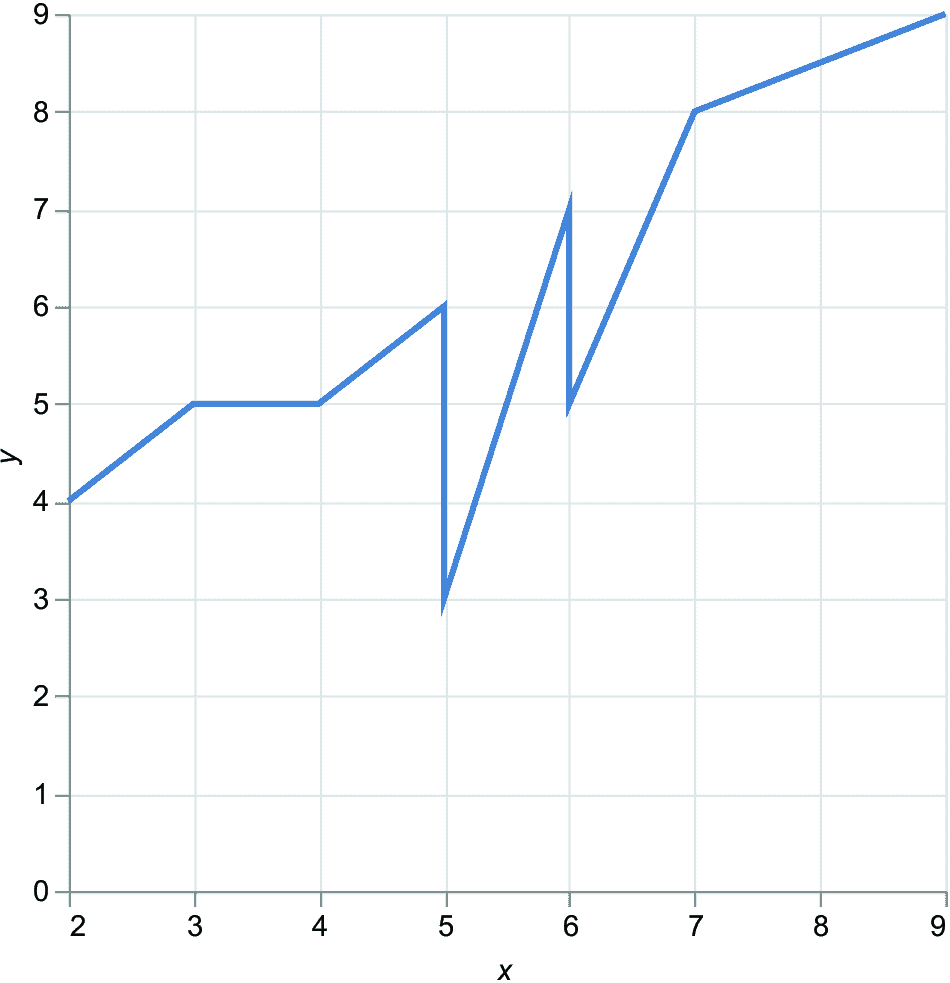
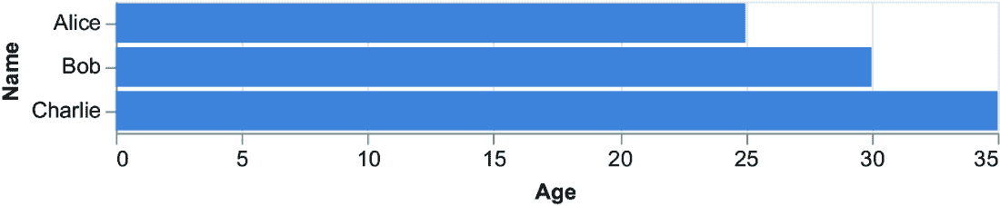
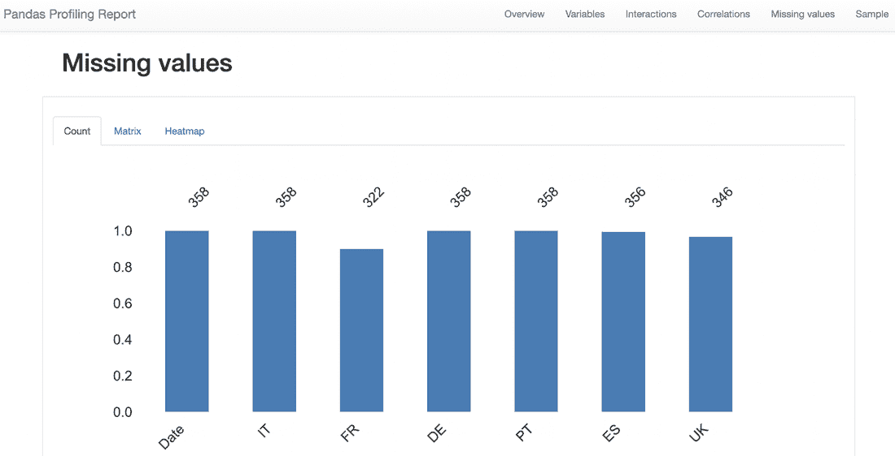
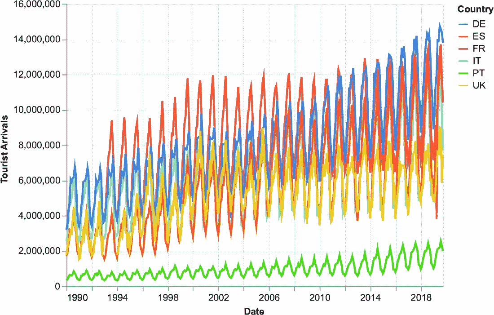
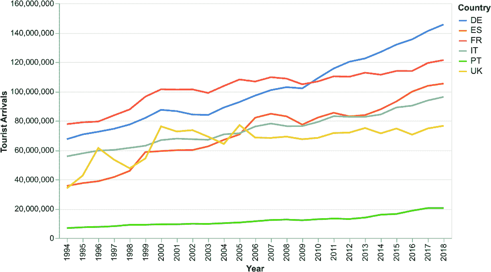
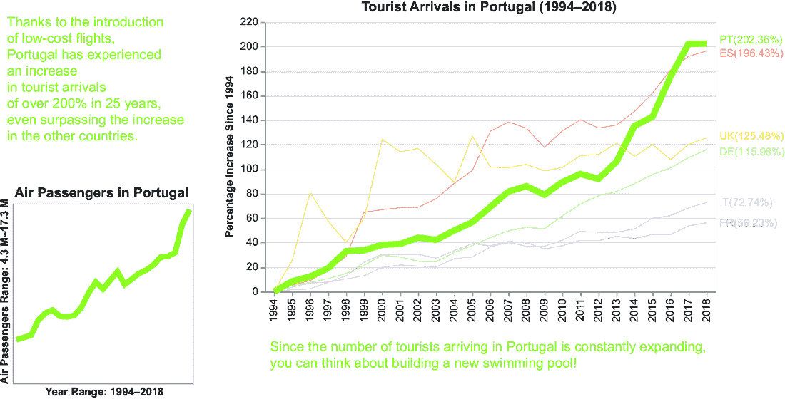
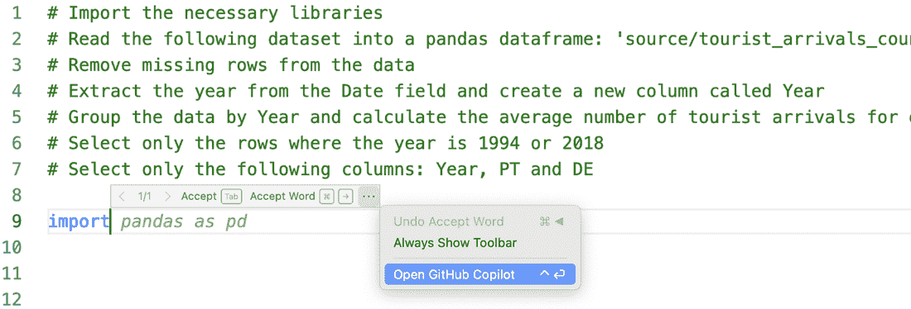

# 在 Altair 和 GitHub Copilot 中运行您的第一个数据故事

### 本章涵盖

+   介绍 Altair

+   相关用例：描述场景

+   使用 Altair

+   使用 Copilot

我的独特之处在于立即动手实践。如果我没有立即感受到，我就不会开心。要开始使用软件或任何其他东西，我立即会去“入门”部分。当我需要更多细节时，我会查阅文档。这一章节也是基于同样的想法产生的：立即了解事物的工作原理。我们将查看书中将要学习的大致但完整的草图。在本章中，我们将探讨 Altair 背后的基本概念，然后我们将实现一个实际的应用案例，这将使我们能够将原始数据集转化为故事。我们将逐步应用数据、信息、知识、智慧（DIKW）金字塔原则于 Altair，并逐步查看所取得的结果。在章节的第二部分，我们将使用 Copilot 自动化故事创建过程的一些步骤。我们将只关注 Copilot 作为生成式 AI 工具，以保持章节简单且流程易于理解。在接下来的章节中，我们将介绍 ChatGPT 和 DALL-E 到 DIKW 金字塔。

## 2.1 介绍 Altair

Vega-Altair 库（简称 Altair）是一个基于 Vega 和 Vega-Lite 可视化语法的声明式 Python 库，用于统计可视化。Vega 是一个用于创建表达性和交互式数据可视化的可视化语法。Vega-Lite 是建立在 Vega 之上的高级声明式语言，旨在通过简洁直观的语法简化常见数据可视化的创建。我们将在下一章中讨论 Vega 和 Vega-Lite。

Altair 是一个声明式库，这意味着您可以描述预期的图表结果，而不是需要手动编程每个步骤，定义一个简洁直观的语法来创建交互式可视化。我们使用声明式库来指定我们希望在图表中看到的内容。我们可以指定我们想要的数据和可视化类型，然后库会为我们自动创建可视化。声明式库与命令式库形成对比，后者更侧重于手动构建可视化（例如，指定所需的轴、大小、图例和标签）。Matplotlib 是命令式库的一个例子。

每个 Altair 图表至少包含三个主要元素：图表、标记和编码。我们将在接下来的页面中简要介绍这些内容。有关安装 Altair 和本章中描述的其他 Python 库的说明，请参阅附录 A。有关本章中使用到的 pandas DataFrame 方法的更多详细信息，请参阅附录 B。

### 2.1.1 图表

在 Altair 中，图表是一个对象，它作为在 Altair 中构建和自定义交互式可视化的起点。使用`alt.Chart()`方法输入您想要可视化的数据集，如列表 2.1 所示。您可以在本书的 GitHub 仓库中找到此示例（02/bar-chart.py）。首先，克隆本书的 GitHub 仓库：[`mng.bz/PZVP`](https://mng.bz/PZVP)。要开始使用 GitHub，请遵循本书附录 A 中描述的程序或 GitHub 官方文档（[`mng.bz/1Geg`](https://mng.bz/1Geg)）。

##### 列表 2.1 Altair 中的图表

```py
import altair as alt
import pandas as pd

data = {'Name': ['Alice', 'Bob', 'Charlie'],
'Age': [25, 30, 35],
'City': ['New York', 'Paris', 'London']
}                                        #1

df = pd.DataFrame(data)     #2

print(df)          #3

chart = alt.Chart(df)     #4
```

#1 为 DataFrame 创建数据

#2 从数据创建 DataFrame

#3 打印 DataFrame

#4 创建图表

注意：首先，导入所需的库，然后构建包含您的数据的 DataFrame。最后，将 DataFrame 传递给`alt.Chart()`。此示例没有创建任何可视化，因为我们没有指定我们想要表示的内容。请注意，代码仍然不完整，所以如果您尝试运行它，它将不会工作。请耐心等待。在下一节中，您将添加其他部分以运行它！

### 2.1.2 标记

标记定义了如何表示数据。标记的示例包括柱状图、线状图、面积图等。要指定标记，将其附加到 Altair 图表。例如，在下面的列表中，我们将指定我们想要使用柱状图。

##### 列表 2.2 在 Altair 中标记

```py
chart = alt.Chart(df).mark_bar()
```

注意：使用`mark_bar()`在 Altair 中创建柱状图。

图表尚未准备好，因为您需要其他部分才能显示它。然而，为了有一个概念，图 2.1 显示了最终图表将如何看起来。


##### 图 2.1 柱状图的示例

还有其他标记的示例，如`mark_line()`，用于绘制线状图（图 2.2）。此外，`mark_circle()`绘制散点图（图 2.3）。



##### 图 2.2 线状图的示例


##### 图 2.3 散点图的示例

### 2.1.3 编码

编码指定 DataFrame 列与其在 Altair 图表中的视觉表示之间的映射。在实践中，编码定义了数据在哪里在图表中表示，例如它们的位置、大小和颜色。在实践中，编码定义了数据属性如何映射到图表中的视觉属性。例如，您可以将数据集的*x*值编码为*x*轴上的位置，将*y*值编码为 y 轴上的位置。在 Altair 中，*通道*指的是一个视觉属性，如`x`、`y`、`color`、`size`和`shape`，可以用来在图表中表示数据属性。

每个通道都与一种数据类型相关联，它描述了属性包含的数据类型，例如对于数值数据使用*定量*，对于有序分类数据使用*有序*，或者对于无固有顺序的分类数据使用*名义*。例如，在下面的列表中，我们使用编码来指定 DataFrame 中必须用于 x 轴和 y 轴的列。

##### 列表 2.3 Altair 中的编码

```py
import pandas as pd
import altair as alt

data = {'Name': ['Alice', 'Bob', 'Charlie'],
        'Age': [25, 30, 35],
        'City': ['New York', 'Paris', 'London']
}                                   #1

df = pd.DataFrame(data)      #2

# Create the chart
chart = alt.Chart(df).mark_bar(
).encode(
    x = 'Age:Q',     
    y = 'Name:N' 
)

chart.save('bar-chart.xhtml')
```

#1 创建 DataFrame 的数据

#2 从数据创建 DataFrame

注意：在 Altair 中使用`encode()`定义编码。将`df`的`Age`变量放在 x 轴上，将`df`的`Name`变量放在 y 轴上。将`Age`解释为数量（`Q`），将`Name`解释为名义值（`N`）。要显示图表，请使用`save()`方法将其保存为 HTML 文件。或者，如果你使用的是 Jupyter Notebook，只需写出图表变量的名称即可在行内显示图表。

图 2.4 显示了列表 2.4 中代码生成的图表。现在你已经学习了 Altair 背后的基本概念，我们将回顾在 Altair 和 Copilot 中实现实际场景的先决条件。



##### 图 2.4 由列表 2.3 生成的图表

#### 练习 1

使用列表 2.4 中的 DataFrame 绘制图 2.2（折线图）和图 2.3（散点图）。

##### 列表 2.4

```py
df = pd.DataFrame({
   'X' : [2,3,5,6,7,9,4,5,5,6],
   'Y' : [4,5,6,7,8,9,5,6,3,5]
})
```

练习的解答可以在本书的 GitHub 仓库下的 02/line-chart.py 和 02/scatter-plot.py 找到。

## 2.2 用例：描述场景

假设我们是在 2019 年底，在 COVID-19 大流行之前。你是一名葡萄牙酒店的数据分析师。你的老板经历了酒店游客到达人数的增加，并希望投资建造一个新的游泳池。在投资之前，他们要求你研究这一现象，以了解他们的投资是否会成功。你的任务是查看葡萄牙在近年来相对于全球趋势是否看到了游客到达人数的增加。

你开始搜索并找到一个关于旅游住宿设施到达情况的数据库（[`mng.bz/2KOX`](https://mng.bz/2KOX)），这是由欧盟统计局发布的公开数据。为了简化，在本章中，你只考虑一个数据集，但在实际应用场景中，你应该考虑更多的数据，包括访问葡萄牙的游客中游泳池的受欢迎程度、在酒店新建游泳池的成本以及新游泳池可能为酒店带来的潜在收入。

该数据集包含了自 2019 年以来所有欧洲国家旅游住宿设施到达的数量。为了简化，只需关注以下国家：葡萄牙、法国、意大利、德国、西班牙和英国。本章中描述的代码可以在 GitHub 仓库的 CaseStudies/tourist-arrivals 下找到，数据集在 CaseStudies/tourist-arrivals/source 下。

### 2.2.1 数据集

表 2.1 展示了我们将要分析的样本数据集。该数据集包含了意大利（IT）、法国（FR）、德国（DE）、葡萄牙（PT）、西班牙（ES）和英国（UK）从 1994 年到 2019 年的旅游接待设施到达情况。

##### 表 2.1 自 1994 年以来旅游接待设施到达情况

| 日期 | IT | FR | DE | PT | ES | UK |
| --- | --- | --- | --- | --- | --- | --- |
| 1990-01-01  | 2,543,920  |  | 3,185,877  | 325,138  | 1723,786  | 1,776,000  |
| 1990-02-01  | 2,871,632  |  | 3,588,879  | 381,539  | 1,885,718  | 2,250,000  |
| 1990-03-01  | 3,774,702  |  | 4,272,437  | 493,957  | 2,337,847  | 2,662,000  |
| …  | …  | …  | …  | …  | …  | …  |
| 2019-08-01  | 11,649,500  | 13,692,822  | 14,570,339  | 2,531,809  | 12,893,366  | 8,889,049  |
| 2019-09-01  | 9,888,817  | 11,684,845  | 14,373,815  | 2,263,748  |  | 5,858,984  |
| 2019-10-01  | 7,692,388  | 10,401,793  | 13,780,441  | 1,995,942  |  | 7,455,781  |

表格中某些国家和某些年份存在一些缺失值，因此如果我们想按年份合并数据，例如，我们应该注意，因为汇总不完整的年份可能会导致错误的结果。按照书中 GitHub 仓库中 from-data-to-information/raw-chart.py 文件中的描述，将数据集作为 pandas DataFrame 加载。

##### 列表 2.5 将数据集作为 pandas DataFrame 加载

```py
import pandas as pd

df = pd.read_csv('../source/tourist_arrivals_countries.csv', parse_dates=['Date'])
```

注意：使用 pandas 将数据集作为 DataFrame 加载。使用`parse_dates`参数将`Date`字段加载为日期。

现在，你已经准备好进行基本的数据探索。

### 2.2.2 数据探索

EDA（探索性数据分析）是提取数据洞察的必经阶段，但你不能使用其输出构建原始数据故事。实际上，EDA 的目的是分析和可视化数据以提取洞察并理解其潜在的模式、分布和关系。你甚至可以使用生成式 AI 进行 EDA。本书的范围不包括进行完整的数据探索。你可以参考本章末尾的参考文献，了解如何进行 EDA。然而，你可以使用现有的 EDA 库进行快速数据探索，例如 ydata-profiling ([`pypi.org/project/ydata-profiling/`](https://pypi.org/project/ydata-profiling/)) 或 sweetviz ([`pypi.org/project/sweetviz/`](https://pypi.org/project/sweetviz/))。在本章中，我们将使用 ydata-profiling。导入库，创建一个`ProfileReport()`对象，并将 pandas DataFrame 作为输入参数传递。最后，通过调用`to_file()`方法生成报告。

##### 列表 2.6 构建摘要报告

```py
from ydata_profiling import ProfileReport
import pandas as pd

df = pd.read_csv('../source/tourist_arrivals_countries.csv', parse_dates=['Date'])

eda = ProfileReport(df)
eda.to_file(output_file='eda.xhtml')
```

注意：使用 ydata-profiling 构建数据集的摘要报告。

因此，`to_file()`方法生成一个包含报告的 HTML 文件。图 2.5 显示了生成的报告快照。


##### 图 2.5 ydata-profiling 生成的报告快照

报告包含许多部分，如图 2.5 右上角的菜单所示。报告可以帮助你完成以下任务：

+   *理解数据。* 报告提供了数据集的概述，包括观测值数量、变量和缺失值。使用这些信息来了解数据质量。

+   *识别数据类型。* 报告确定了每个变量的数据类型，并提供了它们分布的摘要，包括均值、中位数、标准差和范围等指标。使用这些信息来识别可能需要进一步预处理的变量。

+   *识别相关性。* 报告提供了一个相关矩阵、热图和散点图矩阵，可以帮助识别高度相关或相关的变量。

+   *识别分布。* 报告提供了分布图，包括直方图和密度图，以帮助识别每个变量的分布形状和范围。使用这些信息来理解数据中的潜在模式、趋势和数据质量问题。

在你的情况下，缺失值部分描述了一些国家（法国、西班牙和联合王国）的缺失值，如图 2.6 所示。



##### 图 2.6 报告突出了法国、西班牙和联合王国的缺失值。

现在我们已经快速探索了数据集，你准备好从该数据集中构建一个数据故事了。让我们从第一种方法开始：使用 Altair。

## 2.3 第一种方法：Altair

为了将数据转化为故事，我们将逐步进行。首先，我们将构建一个基本图表，然后我们将逐步丰富它，添加将图表转化为独立故事的必要元素。我们将使用 DIKW 金字塔的原则来实现这种渐进式丰富：

+   从数据到信息

+   从信息到知识

+   从知识到智慧

让我们从 DIKW 金字塔的第一步开始：将数据转化为信息。在本节中，我们将使用书中 GitHub 仓库 CaseStudies/tourist-arrivals 下的代码。

### 2.3.1 从数据到信息

将数据转化为信息意味着从数据中提取一些见解。首先，绘制以下代码中的原始图表和文件 from-data-to-information/ raw-chart.py。

##### 列表 2.7 在 Altair 中构建原始图表

```py
import altair as alt
import pandas as pd
from ydata_profiling import ProfileReport

df = pd.read_csv('../source/tourist_arrivals_countries.csv', parse_dates=['Date'])

df = pd.melt(df, id_vars='Date', value_name='Tourist Arrivals', var_name='Country')

chart = alt.Chart(df).mark_line().encode(
    x = 'Date:T',                       #1
    y = 'Tourist Arrivals:Q',       #2
    color=alt.Color('Country:N')    #3
)

chart.save('raw-chart.xhtml')
```

#1 使用符号：:T 来指定数据类型是时间的

#2 使用符号：:Q 来指定数据类型是定量的

#3 使用符号：:N 来指定数据类型是名义的

注意：使用`mark_line()`属性在 Altair 中构建原始图表。在 y 轴上绘制游客到达数量，在 x 轴上绘制日期。

使用`melt()`函数将数据集进行转置（即，将数据行转换为列）。有关`melt()`函数的更多详细信息，请参阅附录 B。然后，构建图表。该图表使用三个通道：`x`和`y`描述轴，`color`按国家分组。对于每个通道，指定数据集中的列（例如，`Date`用于`x`通道）和数据类型（`T`用于时间数据，`Q`用于定量数据，`N`用于名义数据）。图 2.7 显示了生成的图表。



##### 图 2.7 Altair 中生成的原始图表，没有任何操作

由于所有国家重叠，图表难以阅读。然而，你可以提取以下亮点：所有趋势线自 1990 年以来都在增加。这是一个可以向老板传达的积极信息。从 1990 年到 2019 年，游客数量的增加是渐进的。让我们更多地关注这个信息。

在所有情况下，你都不关心了解中间数据，因为没有异常值，只有时间序列的起点（1990）和终点（2019）。然而，我们注意到对于一些国家，1990 年没有数据，而 2019 年的数据不完整（数据截止到 10 月）。在这种情况下，问题是，在存在缺失值的情况下我们应该怎么办？答案是，这取决于。在你的情况下，你处理的是一个逐渐增长的时间序列（排除季节性），因此你可以将分析范围仅限于你有数据的日期。因此，你将搜索范围缩小到 1994–2018 年。

让我们在 Altair 中实施这个策略。首先，根据脚本 from-data-to-information/grouped-chart.py 和以下列表中的描述，从数据集中过滤掉缺失年份。

##### 列表 2.8 从数据集中删除缺失年份

```py
df.loc[:, 'Year'] = df['Date'].dt.year   #1
df = df[(df['Year'] >= 1994) & (df['Year'] <= 2018)]   #2
```

#1 从日期中提取年份。

#2 过滤掉 1994 年之前和 2018 年之后的年份。

注释：首先，从日期列中提取年份，然后过滤掉 1994 年之前和 2018 年之后的年份。使用`loc`通过标签访问一组行和列，使用`iloc`通过数值索引访问组行和列。

然后，按年份分组数据并计算总和。

##### 列表 2.9 按年份分组并计算总和

```py
df = df.groupby(['Year', 'Country'])['Tourist Arrivals'].sum().reset_index() #1
```

#1 按年份和国家分组。

注释：使用`group_by()`按年份和国家分组数据，并通过`sum()`函数计算总和。最后，重置索引以检索年份。

使用`reset_index()`函数创建一个新的索引列，从 0 开始，并将当前索引值移动到新列。

最后，在 Altair 中构建图表。

##### 列表 2.10 在 Altair 中构建图表

```py
chart = alt.Chart(df).mark_line().encode(
    x = 'Year:O',
    y = 'Tourist Arrivals:Q',
    color=alt.Color('Country:N')
)

chart.save(‘chart.xhtml’)
```

注释：使用 Altair 的`mark_line()`属性构建折线图。

图 2.8 显示了生成的图表。



##### 图 2.8 计算每年总和并过滤边界年份后生成的图表

该图表比图 2.7 中的图表更清晰；你可以轻松地区分每个国家的趋势线。然而，过多的颜色和国家存在并不传达信息。你的目标是专注于葡萄牙，这是你老板要求你提供信息的国家。

其他国家随时间游客数量的增加大于葡萄牙。然而，你并不关心知道绝对值，而是关心每个国家随时间的百分比增加。如果我们使用绝对值，那么我们无法立即回答以下问题：

+   对于每个国家，自 1994 年以来百分比增长是多少？

+   两个国家中哪个国家的百分比增长更大？

如果你使用百分比增长，我们可以将两个国家置于更可比的水平，然后你可以回答之前的问题。让我们计算每个国家自 1994 年以来的百分比增长，然后绘制百分比增长的图表而不是绝对值的图表。

使用以下公式计算百分比增长：

百分比增长 = (最终值 – 初始值) / 初始值 * 100

在你的情况下，按照以下列表和`from-data-to-information/chart.py`脚本中的说明计算每个国家的百分比增长。

##### 列表 2.11 计算每个国家的百分比增长

```py
for country in df['Country'].unique():
    current = df[df['Country'] == country]['Tourist Arrivals']
    base = df[(df['Country'] == country) & (df['Year'] == 1994)]['Tourist Arrivals'].values[0]
    df.loc[df['Country'] == country, 'PI'] = (current - base)/ base*100   #1
```

#1 添加一个新列，包含每个国家当前年份和 1994 年游客到达人数之间的差异。

备注：对于每个国家，计算每年游客到达人数与 1994 年的差异。

现在，再次构建图表。

##### 列表 2.12 绘制百分比增长的图表

```py
base = alt.Chart(df).encode(
    x = alt.X('Year:O', title=''),
    y = alt.Y('PI:Q', title='Percentage Increase since 1994'),
    color=alt.Color('Country:N',
                    scale=alt.Scale(scheme='set2'), 
                    legend=None),
    strokeWidth=alt.condition(alt.datum.Country == 'PT', alt.value(7), alt.value(0.5))
).properties(
    title='Tourist Arrivals in Portugal (1994-2018)'
)

chart = base.mark_line()

chart.save('chart.xhtml')
```

备注：首先，创建一个新的包含所需值的 DataFrame。然后，绘制图表。使用`title`修改 y 轴的标题。使用`scale`属性选择颜色范围。在你的情况下，你使用了默认方案（`set2`）。对于方案列表的完整列表，你可以参考 D3 文档（[`observablehq.com/@d3/color-schemes`](https://observablehq.com/@d3/color-schemes)）。该图表还使用了`strokeWidth`通道，这使得我们可以配置每条线的宽度。我们使用条件语句来设置宽度。要在条件语句内直接访问列值，使用`alt.datum.<column>`。要将值设置为特定的字符串或数字，使用`alt.value()`。

为了编码`x`通道，你使用了`alt.X()`对象——而不是像之前那样使用简单的字符串——与`y`和`color`通道相同。当你想要指定通道细节时，可以使用通道对象而不是简单的字符串。例如，你可以使用`alt.Y()`为`y`通道，`alt.Color()`为`color`通道，等等。在通道对象内，你可以设置依赖于通道的不同属性。例如，对于`x`和`y`通道，你可以设置轴属性。你可以在通道内为每个属性定义一个值或额外的对象。在实践中，相同的通道策略也适用于通道属性。例如，`axis`是`x`和`y`通道的属性。你可以使用`alt.Axis()`来设置轴的额外属性。在示例中，你设置了`color`通道的`legend`属性。

为了构建这个图表，你也使用了`properties()`函数，该函数配置了图表的一般属性，例如标题。图 2.9 显示了生成的图表。


##### 图 2.9 计算百分比增长并突出显示葡萄牙后的图表

你自愿移除了图例，因为你将在每条线后添加注释。该图表显示葡萄牙的游客到达量百分比增长超过了其他国家。这是一个非凡的发现，并且回答了你老板的问题。你已经从数据中提取了信息。为了突出你的发现，向图表添加一个注释，精确描述与 2018 年对应的百分比增长值。

##### 列表 2.13 向图表添加注释

```py
annotation = base.mark_text(
    dx=10,               #1
    align='left',     #2
    fontSize=12       #3
).encode(

    text='label:N'
).transform_filter(
    alt.datum.Year == 2018
).transform_calculate(
    label='datum.Country + "(" + format(datum.PI, ".2f") + "%)"'   #4
)

chart = (chart + annotation
)

chart.save('chart.xhtml')
```

#1 设置从 x 坐标偏移的像素值

#2 设置文本对齐方式

#3 设置文本字体大小

#4 格式化文本，仅显示两位小数并添加百分号

注意：使用 `mark_text()` 属性来绘制文本。接下来，通过 `+` 运算符将之前的图表和文本注释结合起来。使用 `transform_filter()` 来选择仅 2018 年（你想要放置注释的位置）和 `transform_calculate()` 来向数据集中添加一个包含格式化百分比的新的列。

`mark_text()` 函数（以及其他 `mark_*()` 函数）可以作为输入接收一些参数，这些参数定义了图表的一些静态属性。例如，如果你想为图表中的所有文本使用静态颜色，请在 `mark_*()` 函数中设置颜色。如果文本的颜色取决于 DataFrame 中的某一列，请在 `encode()` 函数中设置。图 2.10 显示了第一步结束时生成的图表，将数据转化为信息。


##### 图 2.10 第一步结束时生成的图表，将数据转化为信息

该图表清晰易懂。添加信息意味着只提取相关的数据，并以一种便于观众理解的方式表示，无需进一步计算。现在你已经将数据转化为信息，是时候进入 DIKW 金字塔的下一步：将信息转化为知识。

#### 练习 2

按以下方式修改图 2.10 的图表：

1.  构建一个斜率图，它是一种仅显示第一和最后值（1994 年和 2018 年）的折线图。

1.  在 y 轴上显示游客到达量，而不是百分比增长。

作为输出，你应该生成图 2.11 所示的图表。你可以在 CaseStudies/tourist-arrivals/exercises/exercise1.py 下找到练习的解决方案。


##### 图 2.11 练习 1 的输出

#### 练习 3

将图 2.11 的斜率图转换为堆积柱状图。该练习的解决方案在 CaseStudies/tourist-arrivals/exercises/exercise2.py 下。

### 2.3.2 从信息到知识

将信息转化为知识意味着为提取的信息添加上下文。通常，上下文回答以下问题：这种情况为什么会发生？如果可能，扩展你的搜索，或者查看相同的数据库来回答这个问题。在我们的案例中，问题是这样的：为什么葡萄牙在 25 年内经历了如此惊人的游客数量增长？为了回答这个问题，你进行了研究并发现葡萄牙（以及其他国家）在 20 世纪 90 年代初引入了许多低成本航班（Dobruszkes，2013）。这促进了旅游业的极大发展。

这个发现是图表的上下文；多亏了低成本航班的引入，葡萄牙在 25 年内游客数量增长了超过 200%，甚至超过了其他国家的增长。按照脚本 from-information-to-knowledge/chart.py 中的描述，将这个发现作为注释添加到图表中。

##### 列表 2.14 向图表添加上下文

```py
text_comm = f"""Thanks to the introduction 
of low-cost flights, 
Portugal has experienced 
an increase 
in tourist arrivals 
of over 200% in 25 years, 
even surpassing the increase 
in the other countries."""

df_commentary = pd.DataFrame([{'text' : text_comm}])

commentary = alt.Chart(df_commentary
).mark_text(
    lineBreak='\n',
    align='left',
    fontSize=20,
    y=0,
    x=0,
    color='#81c01e'
).encode(
    text='text:N'
).properties(
    width=200
)
```

注意：首先，创建一个包含要添加到图表中的文本的 DataFrame。然后，使用`mark_text()`来绘制文本。还要指定换行符号（`lineBreak='\n'`）、文本对齐方式（`align='left'`）、字体大小（`fontSize=20`）、位置（`y=100`）和颜色（`color='orange'`）。最后，通过加号运算符将文本与之前的图表结合。

为了加强图表中插入的文本，让我们添加一个额外的、非常简洁的图表，展示葡萄牙随时间变化的客流量。使用世界银行关于世界各国航空交通的数据集（[`mng.bz/RZRP`](https://mng.bz/RZRP)，在 CC BY-4.0 许可下发布）。以下列表显示了如何将折线图添加到主图表中。

##### 列表 2.15 向图表添加行动号召

```py
df_airports = pd.read_csv('../source/airports.csv')

df_airports = df_airports.melt(id_vars='Country Name', var_name='Year', value_name='Value')
df_airports.dropna(inplace=True)
df_airports = df_airports[df_airports['Country Name'] == 'Portugal']

airports = alt.Chart(df_airports).mark_line(
    color='#81c01e',
    strokeWidth=6
).encode(
    x=alt.X('Year', axis=alt.Axis(labels=False, ticks=False, grid=False), title='Year range: 1994-2018'),
    y=alt.Y('Value', axis=alt.Axis(labels=False, ticks=False, grid=False), title='Air Passengers range: 4.3M-17.3M')
).properties(
    title='Air passengers in Portugal',
    width=200,
    height=200
)

chart = ((commentary & airports) | (chart + annotation)
)

chart.save('chart.xhtml')
```

注意：首先，将机场数据集作为 pandas DataFrame 加载。接下来，格式化数据集以便 Altair 可以使用。然后，使用`mark_line()`方法构建趋势线。从 x 轴和 y 轴移除标签、刻度和网格。最后，通过`&`运算符将机场图表和文本结合，这对应于垂直对齐。同时，使用`|`运算符水平组合图表。

图 2.12 显示了第二步：将信息转化为知识后生成的图表。


##### 图 2.12 第二步：将信息转化为知识后生成的图表

多亏了上下文，图表回答了为什么会发生这种情况。现在你已经将信息转化为知识，是时候进入 DIKW 金字塔的最终步骤：将知识转化为智慧。

### 2.3.3 从知识到智慧

将知识转化为智慧意味着在图表中添加行动号召并提出下一步行动。在本章中，我们只关注添加行动号召。我们将在接下来的章节中看到如何添加下一步行动。行动号召邀请观众采取行动。在你的情况下，行动号召应该回答你老板的原始问题：我应该建造一个新的游泳池吗？

根据先前分析的结果，制定以下行动号召：由于到达葡萄牙的游客数量持续增长，你可以考虑建造一个新的游泳池！将行动号召添加到主图表下方，如以下列表和 from-knowledge-to-wisdom/chart.py 脚本所示。

##### 列表 2.16 将行动号召添加到图表中

```py
text_cta = f"""Since the number of tourists arriving in Portugal is constantly expanding, 
you can think about building a new swimming pool!"""
df_cta = pd.DataFrame([{'text' : text_cta}])

cta = alt.Chart(df_cta
).mark_text(
    lineBreak='\n',
    align='left',
    fontSize=20,
    y=0,
    x=0,
    color='#81c01e'
).encode(
    text='text:N'
).properties(
    width=200
)

final_chart = ((commentary & airports) | ((chart + annotation) & cta)
)

final_chart.save('chart.xhtml')
```

备注  在图表中添加新的文本注释以制定行动号召。

如果你的代码包含图像（我们将在下一章中看到），你可以在本地或 Web 服务器上运行它。如果你没有 Web 服务器，你可以从命令行运行一个本地和临时的 Web 服务器，在包含生成的 HTML 文件的目录中运行以下命令：`python` `-m` `http.server.` 服务器应该监听 8000 端口，并应该从它启动的目录中提供所有文件。将你的浏览器指向 http://localhost:8000/chart.xhtml 以访问 chart.xhtml 文件。图 2.13 显示了通过最终步骤，将知识转化为智慧所生成的图表。



##### 图 2.13 最终步骤产生的图表：将知识转化为智慧

图表包含了你老板问题的答案。如果你将这个图表与图 2.5 进行比较，你可能会注意到很大的不同：图 2.9 和图 2.10 中的图表显示，观众不需要进行任何计算或处理。他们只需阅读结果即可。相反，如果他们查看图 2.5 中的图表，观众必须自己提取信息。

有些人可能会争论在过程中丢失了很多信息，比如其他欧洲国家发生了什么，以及 1994 年至 2018 年之间发生了什么。因此，老板不会仅仅基于图表中显示的数字做出重大投资。这个观察是正确的。然而，我们简化了这个例子，以展示将数据转化为故事的工作流程。在更复杂的情况下，你必须考虑额外的因素，并构建一个适当的故事，其中每个因素都是你数据故事的单个场景。

为了了解 Altair 和 Matplotlib 之间的差异，我们将在下一节中使用 Matplotlib 构建相同的图表。如果你不熟悉 Matplotlib，可以直接跳转到 2.4 节，该节涵盖了第二种方法：使用 Copilot。

### 2.3.4 比较 Altair 和 Matplotlib

你可能会想知道为什么在一本关于 Altair 的书中会有关于 Matplotlib 的章节。答案很简单：本书中描述的方法，包括使用生成式 AI 技术和 DIKW 金字塔的技术，可以应用于所有数据可视化库，而不仅仅是 Altair。实际上，你也可以考虑在其他语言中使用它们，例如 R。作为例子，在本节中，我们简要比较了 Altair 和 Matplotlib，突出了它们之间的差异和相似之处。

Matplotlib 是一个流行的 Python 数据可视化库。很可能，它是你用来快速绘制数据的第一个 Python 库。如果你将 Matplotlib 作为 Altair 的替代品，请考虑 Matplotlib 是一个命令式库，因此你必须定义所有生成图表的步骤。在 Altair 中，你只需关注期望的输出。无论如何，本书中描述的所有与数据叙事相关的概念也适用于 Matplotlib，所以如果你更喜欢命令式方法，可以使用它。

你可以在本书的 GitHub 仓库 CaseStudies/tourist-arrivals/matplotlib/chart.py 中找到 Matplotlib 的完整代码，以及在下述列表中。

##### 列表 2.17 在 Matplotlib 中生成图表

```py
import matplotlib.pyplot as plt

df = pd.read_csv('../source/tourist_arrivals_countries.csv', parse_dates=['Date'])
df = pd.melt(df, id_vars='Date', value_name='Tourist Arrivals', var_name='Country')

df.loc[:, 'Year'] = df['Date'].dt.year     #1

df = df.groupby(['Year', 'Country'])['Tourist Arrivals'].sum().reset_index() #2

df = df[(df['Year'] >= 1994) & (df['Year'] <= 2018)]    #3

for country in df['Country'].unique():
    current = df[df['Country'] == country]['Tourist Arrivals']
    base = df[(df['Country'] == country) & (df['Year'] == 1994)]['Tourist Arrivals'].values[0]
    df.loc[df['Country'] == country, 'PI'] = (current - base)/ base*100    #4

fig, ax = plt.subplots(figsize=(10, 6))   #5

for country in df['Country'].unique():
    current = df[df['Country'] == country]['Tourist Arrivals']
    base = df[(df['Country'] == country) & (df['Year'] == 1994)]['Tourist Arrivals'].values[0]
    pi = (current - base)/ base*100
    ax.plot(df[df['Country'] == country]['Year'], pi, label=country)   #6

ax.set_title('Tourist Arrivals in Portugal (1994-2018)')    #7
ax.set_xlabel('')                                           #7
ax.set_ylabel('Percentage Increase since 1994')             #7

ax.legend()       #8

plt.savefig('chart.png', dpi=300)     #9
```

#1 从日期中提取年份

#2 按年份和国家分组

#3 过滤出 1994 年之前和 2018 年之后的年份

#4 添加一个新列，包含每个国家当前年份与 1994 年之间游客到达人数的差异

#5 创建图形和轴

#6 绘制数据

#7 设置标题和轴标签

#8 添加图例

#9 保存图表

备注：为每个国家构建单独的行。

图 2.14 显示了 Matplotlib 生成的图表。通过添加图表线条、数据点或标签，可以使图表更易于阅读和展示。


##### 图 2.14 Matplotlib 生成的图表

Altair 的代码比 Matplotlib 的代码更冗长。然而，在 Matplotlib 中，你必须单独绘制每条线或文本，而在 Altair 中，你只需传递 DataFrame，库就会为你绘制线条或标记。现在你已经通过手工将数据转化为智慧，并看到了 Altair 和 Matplotlib 之间的差异，我们将转向另一种方法：使用 GitHub Copilot 半自动地构建图表。

## 2.4 第二种方法：Copilot

Copilot 允许你编写代码来自动实现某些功能。我们将通过 Visual Studio Code (VSC)的扩展来启用 Copilot。要安装 VSC，请参考其官方文档([`code.visualstudio.com/docs/introvideos/basics`](https://code.visualstudio.com/docs/introvideos/basics))，并配置 Copilot，请参阅附录 A。

要使用 Copilot，只需有序地描述要实现的操作序列，Copilot 就会为我们完成剩余的工作，甚至提出不同的实现选项。在本节中，我们将使用 Copilot 构建图表的框架（即其主要部分）。然后，我们将手动添加细节，使用颜色和字体大小。使用 Copilot 的主要困难是用自然语言描述代码需要实现的内容。文本越清晰，Copilot 在实现上就越一致。

在本节中，我们将描述如何将前几节中编写的代码翻译成 Copilot 能理解的文本序列。我们将只关注将图表框架翻译成自然语言，而不考虑细节，如字体大小和颜色。在本书的仓库 CaseStudies/tourist-arrivals/copilot/chart.py 下找到 GitHub Copilot 生成的代码。

我们将把问题分解成步骤：

1.  加载和清理数据集

1.  计算百分比增加

1.  在 Altair 中绘制基本图表

1.  丰富图表

我们将在接下来的章节中详细讲解每个步骤。

### 2.4.1 加载和清理数据集

在使用数据集之前，你必须加载所需的库，以 pandas DataFrame 的形式打开数据集，并计算百分比增加。想法是为构建图 2.13 所示的图表准备数据。

打开 VSC，并写下以下注释。

##### 列表 2.18 加载和过滤数据集

```py
# Import the necessary libraries.
# Read the following dataset into a pandas DataFrame, '../source/tourist_
arrivals_countries.csv', and parse the Date field as a date.
# Filter out rows before 1994 and after 2018.
# Extract the year from the Date field and create a new column called Year.
# Group the data by Year and calculate the sum of tourist arrivals for each year.
```

注意：描述加载和过滤数据集的操作序列。

如果你按下最后一个注释的 Enter 键并开始输入`import`，Copilot 将建议完成该语句。只需按下 Enter 键接受生成的代码。或者，将鼠标悬停在建议的文本上，打开 Copilot，如图 2.15 所示。



##### 图 2.15 如何在 VSC 中打开 Copilot

根据生成的代码，Copilot 可能会提出不同的解决方案，如图 2.16 所示。点击“接受解决方案”以接受一个解决方案。在我们的例子中，第二个解决方案实现了所描述的步骤。请注意，每次运行 Copilot 时，它可能会生成不同的解决方案，即使你重新运行相同的文本。


##### 图 2.16 Copilot 在 VSC 中提出的不同解决方案

### 2.4.2 计算百分比增加

下一步涉及从之前清理过的数据集开始构建一个新的数据集。新的数据集将包含葡萄牙和德国的百分比增加值。写下以下操作。

##### 列表 2.19 使用百分比增加构建新的 DataFrame

```py
# Add a new column to the DataFrame called PI containing the difference for each country between the number of tourist arrivals in the year and 1994.
```

注意：描述如何计算百分比增加。

与前一个案例一样，Copilot 可以提出多个解决方案。打开 Copilot 检查可能的解决方案，并接受最能实现你操作的方案。如果你找不到任何实现你文本的解决方案，通过添加更多细节重写文本。如果在重写文本后，你仍然找不到实现你操作的解决方案，接受最接近你要求的解决方案并根据你的需要进行修改。

### 2.4.3 在 Altair 中绘制基本图表

现在，我们将指导 Copilot 构建一个类似于我们在图 2.12 中看到的图表（除了机场数据集图表），关于百分比增加。

##### 列表 2.20 在 Altair 中构建图表

```py
# Use the Altair library to plot the PI column for each country versus the Year.
```

备注  描述图表应该如何看起来。

Copilot 可以提出多个解决方案。打开 Copilot 检查可能的解决方案，并接受最能实现你操作的方案。

### 2.4.4 丰富图表

指导 Copilot 添加上下文。此外，将生成的图表保存为名为 output.xhtml 的 HTML 文件。

##### 列表 2.21 丰富图表

```py
# Create a new chart with the following text: 'Thanks to the introduction\n of low-cost flights,\nPortugal has experienced\\nan increase\\nin tourist arrivals\nof over 200% in 25 years,\\neven surpassing the increase\\nin the other countries.' Use the \n as a line break to format the text. Set the font size to 14\. 
# Place the two graphs side by side. Set title to 'Tourist Arrivals in Portugal (1994-2018)'.
# Save the chart as an HTML. Name the file chart.xhtml.
```

备注  写上注释和标题，以便在图表中显示。

一旦代码完成，保存并运行脚本。图 2.17 显示了生成的图表。


##### 图 2.17 Copilot 生成的图表

图表是一个好的起点，但仍需改进。为了改进图表，你可以手动运行以下步骤：

1.  增加注释的字体大小。

1.  增加 PT 线的笔画宽度。

使用 Copilot 可能看似没有意义，因为一些元素仍然需要手动管理。然而，随着实践，你会意识到 Copilot 对于加快你代码中最简单部分的编写速度是多么有价值。Copilot 会记住你之前的代码，并在你使用它时适应你的编程风格。随着实践，它很可能会成为你的编程伴侣，就像对我一样！

在本章中，你学习了如何使用 Altair 和 Copilot 将原始数据集转化为数据故事。在下一章，我们将回顾 Altair 的基本概念。

## 摘要

+   Altair 是一个用于数据操作和可视化的声明式库。它提供了三个主要元素来构建图表：图表、标记和编码。使用图表元素来指定要绘制的数据集。使用标记来指定要绘制的图表类型，并使用编码来设置通道，如 x 轴和 y 轴。

+   要将原始数据转化为数据故事，逐步使用 DIKW 原则。首先清理你的数据集，然后只提取有意义的信息。绘制提取的信息。然后，添加上下文和行动号召作为注释。

+   Copilot 是一个用于加快代码生成的强大工具。要使 Copilot 生成你的代码，将问题分解成小步骤，并使用自然语言描述每个步骤。尽管 Copilot 并不完美，但它可以帮助你构建代码的框架。

+   使用 Copilot 自动生成你代码的框架，然后手动改进代码。

## 参考文献

### EDA

#### 通用方法

+   Gupta, D., Bhattacharyya, S., Khanna, A., and Sagar, K. (Eds.). (2020). *Intelligent Data Analysis: From Data Gathering to Data Comprehension*. John Wiley & Sons.

+   Rasmussen, R., Gulati, H., Joseph, C., Stanier, C., and Umegbolu, O. (2019). *Data Analyst: Careers in Data Analysis*. BCS Publishing.

+   Khalil, M. (2024). *Effective Data Analysis: Hard and Soft Skills*. Manning Publications.

#### Python

+   Mukhiya, S. K. and Ahmed, U. (2020). *Hands-On Exploratory Data Analysis with Python*. Packt Publishing.

+   Oluleye, A. (2023). *Exploratory Data Analysis with Python Cookbook*. Packt Publishing.

### 工具和库

+   *Altair: Declarative Visualization in Python*. (n.d.). [`altair-viz.github.io/`](https://altair-viz.github.io/)

+   *GitHub*. (n.d.). *GitHub Copilot: Your AI Pair Programmer*. [`github.com/features/copilot`](https://github.com/features/copilot).

### 其他

+   Dobruszkes, F. (2013). The Geography of European Low-Cost Airline Networks: A Contemporary Analysis. *Journal of Transport Geography*, *28*, 75–88\.
