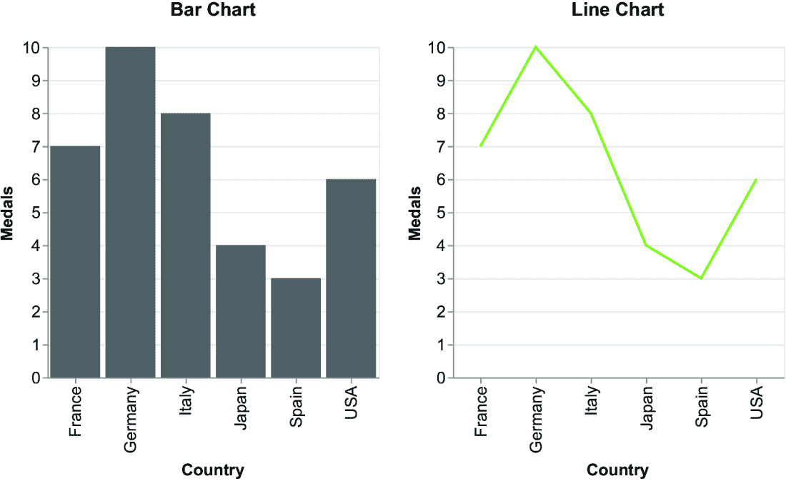
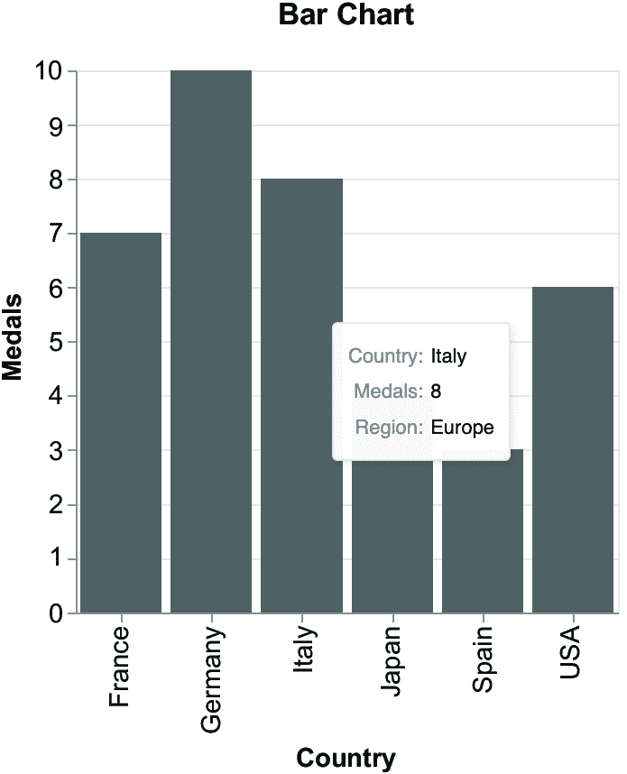
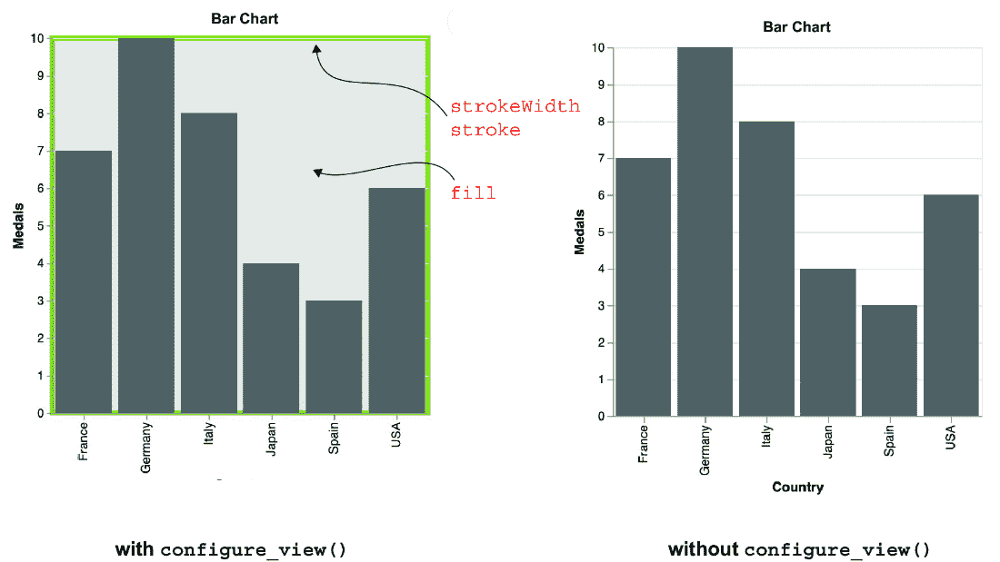
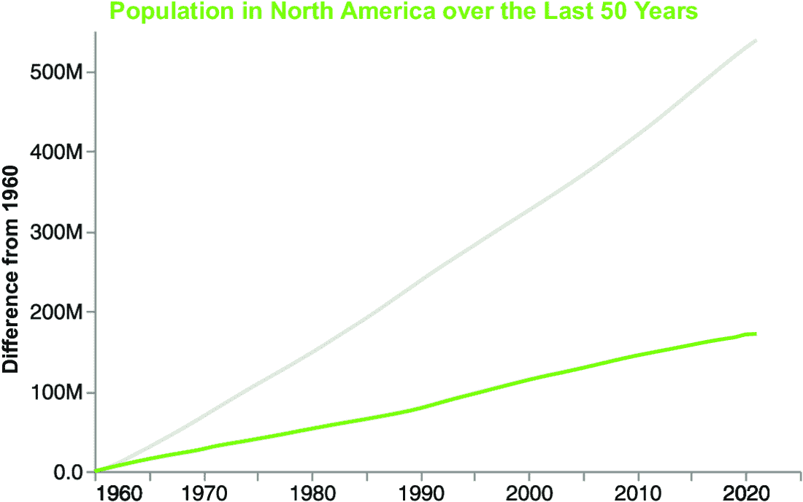
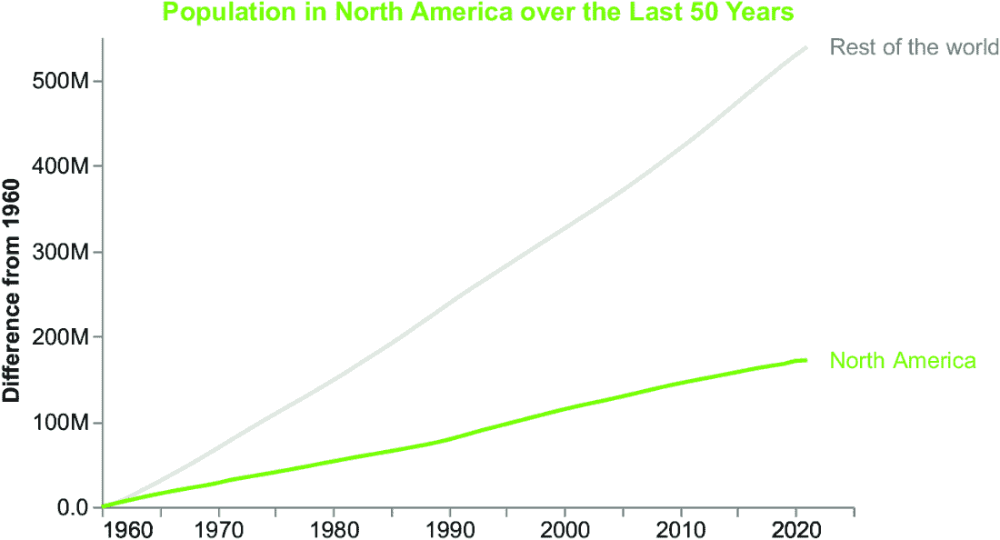
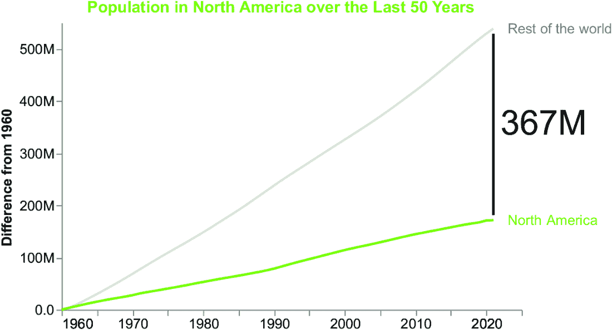
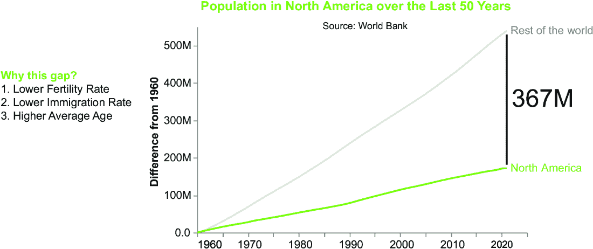
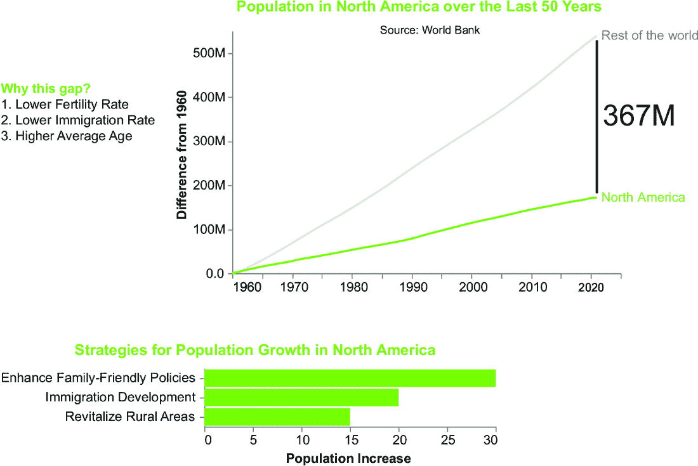

# 3. 审查 Altair 的基本概念

### 本章涵盖

+   Vega 和 Vega-Lite

+   Altair 图表的基本组件

+   一个相关的案例研究

初看之下，似乎在介绍 Altair（第二章）如何运行数据故事之前，先讲解 Altair 的基础知识（第三章）是不合常理的。原因在于，现在你对 Altair 的工作原理有了基本的了解，你就可以开始深入了解所有细节了。如果你一开始就读了这一章，你可能会感到无聊并跳过它。相反，现在，你已经准备好平静地阅读它了。在本章中，我们将回顾 Vega 和 Vega-Lite 的基本概念，这些是 Altair 所构建的可视化语法的基础。然后，我们将重点关注 Altair 的主要组件：编码、标记、条件、复合图表和交互性。在章节的最后部分，我们将实现一个实际案例。

## 3.1 Vega 和 Vega-Lite

Vega 和 Vega-Lite 是 Altair 使用的可视化语法。*可视化语法*是一套规则和原则，用于定义如何以视觉方式表示数据，就像语法在口语中的作用一样。可视化语法包括一系列视觉元素，如点、线和条形，以及组合和排列这些元素以创建有意义的可视化规则。使用可视化语法可以使你创建清晰有效的数据可视化，传达洞察力并讲述故事。

Vega 和 Vega-Lite 提供了创建交互式可视化的声明性语言。在学习 Altair 之前先学习 Vega 和 Vega-Lite 非常重要，因为 Altair 是建立在这两个可视化库之上的。通过首先掌握这些基础工具，你可以更深入地理解 Altair 的工作原理，并充分利用其全部潜力。此外，学习 Vega 和 Vega-Lite 还使你能够创建仅使用 Altair 无法实现的自定义可视化，从而在数据探索和沟通中提供更多的灵活性和创造力。在下一节中，我们将探讨 Vega 和 Vega-Lite 规范的主要组件。

### 3.1.1 Vega

*Vega*是一种通过在 JSON 格式中编写代码来定义图表的视觉方面和交互功能的可视化语法。Vega 建立在 D3.js（[`d3js.org/`](https://d3js.org/)）之上，这是一个非常流行的 JavaScript 库，用于数据可视化。使用 Vega，你可以生成基于 Web 的视图，利用 HTML5 Canvas 或 SVG 来显示生成的图表。HTML5 Canvas 是一种基于位图的绘图技术，它使你能够在 Web 上渲染动态图形和动画。SVG 是一种基于矢量的图形格式，用于构建可缩放和分辨率无关的图形。

Vega JSON 文件包含图表视觉外观和交互行为的规范。列表 3.1 展示了 JSON 规范的基本结构。为了测试，您可以使用 Vega 编辑器（[`vega.github.io/editor/#/`](https://vega.github.io/editor/#/)) 来渲染 Vega 生成的图表。在本节中，我们将逐步生成一个基本的 Vega 线形图表。

##### 列表 3.1 Vega JSON 文件的基本结构

```py
{
  "$schema": "https://vega.github.io/schema/vega/v5.json",
  "description": "A basic example in Vega",
  "width": 600,
  "height": 400,

  "data": [],
  "scales": [],
  "axes": [],
  "marks": [],
  "signals": []
}
```

注意：首先，定义模式版本（`$schema`）、`description`、图表的 `width` 和 `height`。然后，指定主要部分（`signals`、`data` 等）。列表 3.1 仅显示 Vega JSON 文件的结构，如果粘贴到 Vega 编辑器中，则不会生成任何图表。

Vega JSON 文件的主要部分包括 `data`、`scales`、`axes`、`marks` 和 `signals`。在本节的剩余部分，我们将描述 Vega 规范的主要部分的概述。有关更多详细信息，请参阅 Vega 官方文档。([`vega.github.io/vega/docs/`](https://vega.github.io/vega/docs/))。

#### 数据

本节定义了要使用的数据源。它指定了数据格式、数据所在位置以及如何加载和转换数据。以下列表展示了 `data` 部分的示例。

##### 列表 3.2 `data` 部分的示例

```py
"data": [
    {
      "name": "myData",
      "values": [
        {"x": 10, "y": 20},
        {"x": 40, "y": 60},
        {"x": 70, "y": 40},
        {"x": 90, "y": 80},
      ]
    }
  ],
```

注意：指定用于可视化的数据列表。对于数据中的每个元素，指定名称和内容。我们将使用 `myData` 来引用规范中相关的数据。可以指定多个数据源。示例直接指定数据值。然而，您也可以通过指定 URL 和格式从 CSV 文件中检索数据，如下所示：`"url": "/path/to/csv/myfile.csv", "format": {"type": "csv"}`。或者，您可以从其他格式检索数据或将它们直接嵌入 JSON 中。

#### 刻度

本节定义了将数据映射到视觉属性的刻度。刻度将数据域（输入范围）映射到视觉范围（输出范围）。以下列表展示了 `scales` 部分的示例。

##### 列表 3.3 `scales` 部分的示例

```py
"scales": [
    {
      "name": "xScale",
      "type": "linear",
      "domain": {"data": "myData", "field": "x"},
      "range": "width"
    },
    {
      "name": "yScale",
      "type": "linear",
      "domain": {"data": "myData", "field": "y"},
      "range": "height"
    }
  ],
```

注意：指定用于可视化的 `scales` 列表。对于每个刻度，指定至少名称、范围和域。示例定义了两个刻度，一个用于 x 轴，另一个用于 y 轴。指定作为域属性值的要使用的数据。

#### 轴

本节定义了图表的轴。使用 `axes` 定义轴上的刻度和标签。以下列表展示了 `axes` 部分的示例。

##### 列表 3.4 `axes` 部分的示例

```py
"axes": [
    { "orient": "bottom", "scale": "xScale" },
    { "orient": "left", "scale": "yScale" }
]
```

注意：指定用于可视化的 `axes` 列表。对于每个轴，指定至少刻度和如何定位它。示例定义了两个轴，一个用于 x 轴，另一个用于 y 轴。

#### 标记

本节定义了表示数据的视觉 `marks`。标记包括点、线、矩形、区域和其他形状。使用视觉属性，如大小、颜色、不透明度和形状，来设置标记样式。以下列表显示了一个 `marks` 部分的示例。

##### 列表 3.5 `marks` 示例部分

```py
"marks": [
    {
      "type": "line",
      "from": {"data": "myData"},
      "encode": {
        "enter": {
          "x": {"scale": "xScale", "field": "x"},
          "y": {"scale": "yScale", "field": "y"},
          "stroke": {"value": "red"}
        }
      }
    }
  ],
```

注意：指定在可视化中使用的 `marks` 列表。对于每个 `mark`，指定至少 `type`（线、符号、矩形等）、数据源（`from`）以及如何编码数据（`encode`）。使用 `enter` 块定义可视化的初始属性。示例定义了一个表示 `data` 部分中 `myData` 变量包含的数据的折线图。它还定义了两个编码通道 `x` 和 `y`，以及线条的颜色。

#### 信号

本节定义了可以用来修改可视化的交互式信号，例如滑块、下拉菜单和复选框。每个信号由两部分组成：*监听器*，由 `signals` 部分标识，和*处理器*，由 `marks` 部分的 `signal` 关键字定义。信号监听器响应信号变化，而信号处理器确定可视化如何响应。例如，信号处理器可能会根据信号值更改数据点的颜色或大小。以下列表提供了一个示例，当用户将鼠标悬停在条形上时（图 3.1），它会更改图表中选定元素的颜色。

##### 列表 3.6 信号示例部分

```py
"signals": [{
     "name": "changeColor",
     "on": [
        {"events": "mouseover", "update": "datum"},
        {"events": "mouseout", "update": "null"}
      ]
}]
```

注意：`signals` 用于捕获可视化中的事件或变化。对于每个信号，指定其名称（例如示例中的 `changeColor`），要修改的属性（例如示例中的 `value`），以及要监听的事件列表（例如示例中的 `on`）。

要使用信号，您必须在 `mark` 部分中指定一个 `update` 块。记住，您使用了 `enter` 块来指定图表的初始条件。现在，您可以使用 `update` 块来指定一个更改。以下列表指定了线条颜色的更改。

##### 列表 3.7 更新示例部分

```py
"marks": [{
      "encode": {
        "enter": {
           ...
       },
        "update": {
          "stroke": {
              "signal": "changeColor === datum ? 'red' : 'blue'" 
              }
          }
        }
      }],
```

注意：在 `marks` 部分下，指定与信号关联的处理程序。当与信号关联的指定事件（如鼠标悬停）发生时，将触发此处理程序。在 `marks` 部分的 `update` 属性中定义了一个处理程序。此处理程序检查信号是否对应于鼠标悬停事件（例如，`changeColor` `===` `datum`）。如果条件满足（即鼠标位于线上），则处理程序执行操作，例如相应地更改线条颜色。有关更多详细信息，请参阅 Vega 文档（[`vega.github.io/vega/docs/signals/`](https://vega.github.io/vega/docs/signals/))。

图 3.1 展示了生成的折线图。您可以在书籍的 GitHub 仓库 03/vega/json/line-chart.json 下找到完整的示例。


##### 图 3.1 使用 Vega 编写的折线图

#### 练习 1

按照以下方式在 Vega 中绘制折线图：

1.  从以下 URL 加载数据：[`mng.bz/ZEyZ`](https://mng.bz/ZEyZ)。

1.  在线上添加点。为此，添加一个新的标记（除了线之外），使用 `symbol` 作为类型。

您可以在书籍的 GitHub 仓库中找到这个练习的解决方案，位于 03/vega/json/spec.json。

#### 练习 2

按照以下方式在 Vega 中绘制柱状图：

1.  从以下 URL 加载数据：[`mng.bz/Ad6W`](https://mng.bz/Ad6W)。

1.  将 `band` 作为 `X` 尺度的类型。

1.  使用 `rect` 作为 `mark` 类型。

1.  可选地，设置一个在鼠标悬停时改变条形图颜色的信号。

您可以在书籍的 GitHub 仓库中找到这个练习的解决方案，位于 03/vega/json/spec2.json。现在您已经了解了 Vega 的基本概念，让我们继续下一步：Vega-Lite。

### 3.1.2 Vega-Lite

*Vega-Lite* 是 Vega 可视化的简洁 JSON。Vega-Lite 仍然保留了 Vega 中已定义的规范，但它通过更紧凑的语法来表示。与 Vega 相比，Vega-Lite 提供了更简洁的语法，适合快速生成简单可视化，代码复杂度更低，使得它对寻求快速创建常见图表的用户更加易于使用。虽然 Vega-Lite 为创建可视化提供了高级抽象，但它可能缺乏定制可视化每个方面的灵活性。它可能也比 Vega 的性能差。Vega-Lite JSON 规范的基本部分是 `data`、`encoding`、`mark` 和 `layer`。

#### data

本节指定了可视化的数据源。以下列表提供了 Vega-Lite 中 `data` 部分的示例。

##### 列表 3.8 一个 `data` 部分的示例

```py
"data": {
      "values": [
        {"x": 10, "y": 20},
        {"x": 40, "y": 60},
        {"x": 70, "y": 40},
        {"x": 90, "y": 80}
      ]
    },
```

注意：这指定了在可视化中使用的源数据。有关更多详细信息，请参阅 Vega-Lite 文档（[`vega.github.io/vega-lite/docs/data.xhtml`](https://vega.github.io/vega-lite/docs/data.xhtml)）。

#### encoding

本节将数据字段映射到视觉属性，例如位置、颜色和大小。以下列表展示了 Vega-Lite 中 `encoding` 部分的示例。使用 Vega 编辑器在 Vega-Lite 中测试您的代码，确保您从左上角的下拉菜单中选择 Vega-Lite。

##### 列表 3.9 一个 `encoding` 部分的示例

```py
"encoding": {
      "x": {"field": "X", "type": "quantitative"},
      "y": {"field": "Y", "type": "quantitative"}
    },
```

注意：指定在可视化中使用的编码。示例定义了两个通道，`x` 和 `y`，并指定数据类型为 `quantitative`。Vega 和 Vega-Lite 还支持其他数据类型，例如 `ordinal` 用于顺序数据；`nominal` 用于文本；以及 `time` 用于时间数据。

#### mark

本节定义了视觉标记的类型，例如 `bars`、`points` 或 `lines`。以下列表展示了 Vega-Lite 中 `mark` 部分的示例。

##### 列表 3.10 一个 `mark` 部分的示例

```py
"mark": {"type": "line"},
```

注意：指定在可视化中使用的 `mark`。示例定义了一个折线图。

#### layer

本节在一个图表中组合多个标记。下一个列表展示了 Vega-Lite 中 `layer` 部分的示例。

##### 列表 3.11 一个示例 `layer` 部分

```py
"layer": [
   {"mark": {"type": "line", }},
   {"mark": {"type": "point", "shape": "circle", "size": 100}}
]
```

注意：指定要组合的标记列表。这组合了两个图表：一个折线图和一个点图。

#### 交互性

Vega-Lite 通过使用 `params` 简化了管理信号的方式。你不需要定义一个信号，而是定义一个 `param`。

##### 列表 3.12 如何在 Vega-Lite 中指定 `params`

```py
"params": [
      {
        "name": "changeColor",
        "select": {"type": "point", "on": "mouseover"}
      },
      {
        "name" : "default",
        "select": {"type": "point", "on": "mouseout"}

      }
    ],
```

注意：使用 `params` 关键字指定每个信号的名字。对于每个 `param`，指定名字和如何触发它。类型可以设置为 `point`，以在图表或区间中选择一个单独的点。

在定义了 `params` 之后，你可以在标记中使用它们，如以下列表中指定。你可以在本书的 GitHub 仓库 03/vega-lite/json/line-chart.json 下找到完整的示例。

##### 列表 3.13 在 Vega-Lite 中如何使用 `params` 在 `mark` 中

```py
"stroke": {
            "condition": [
            {
                "param": "changeColor",
                "empty": false,
                "value": "red"
            },
            {
                "param": "default",
                "empty": false,
                "value": "blue"
            }
            ],
            "value" : "blue"
        }
```

注意：列表 3.13 中的示例使用列表 3.12 中定义的 `params` 来根据条件设置线条颜色。如果触发 `changeColor` `param`，则线条颜色设置为 `red`；如果触发 `default` `param`，则线条颜色设置为 `blue`。默认线条颜色是 `blue`。

#### 练习 3

将练习 1 的结果转换为 Vega-Lite。该练习的解决方案在本书的 GitHub 仓库的 03/vega-lite/json/spec.json 下提供。

现在你已经了解了 Vega 和 Vega-Lite 的基本概念，让我们看看如何使用 HTML 和 JavaScript 渲染 Vega/Vega-Lite 可视化。如果你不熟悉 HTML 和 JavaScript，你可以跳过下一节，直接进入 3.2 节。

### 3.1.3 如何渲染 Vega 或 Vega-Lite 可视化

Vega 和 Vega-Lite 都是 JSON 对象，需要渲染器才能显示，例如外部 JavaScript 库，以便从 HTML 页面渲染可视化。Vega-Lite 提供了一个 JavaScript API，可以自动构建 Vega 和 Vega-Lite 可视化。

要渲染 Vega 或 Vega-Lite JSON，请将以下 JavaScript 库导入到你的 HTML 文件中：

+   [`cdn.jsdelivr.net/npm/vega@5.22.1`](https://cdn.jsdelivr.net/npm/vega@5.22.1)

+   [`cdn.jsdelivr.net/npm/vega-lite@5.6.0`](https://cdn.jsdelivr.net/npm/vega-lite@5.6.0)

+   [`cdn.jsdelivr.net/npm/vega-embed@6.21.0`](https://cdn.jsdelivr.net/npm/vega-embed@6.21.0)

库的版本可能不同。在我们的例子中，我们导入 Vega 的 5.22.1 版本，Vega-Lite 的 5.6.0 版本，以及 Vega-Embed 的 6.21.0 版本，就像我们通常导入 JavaScript 库一样。然后，你可以将列表 3.11 中描述的代码包装起来，以渲染你的 Vega/Vega-Lite JSON 文件。

#### 渲染 Vega 或 Vega-Lite JSON 规范的 JavaScript 代码

例如，要渲染列表 3.7 中描述的图表，请使用以下 HTML 规范。

##### 列表 3.14 完整的 HTML 文件

```py
<!DOCTYPE html>
<html>
  <head>          #1
    <script src="https://cdn.jsdelivr.net/npm/vega@5.22.1"></script>
    <script src="https://cdn.jsdelivr.net/npm/vega-lite@5.6.0"></script>
    <script src="https://cdn.jsdelivr.net/npm/vega-embed@6.21.0"></script>
  </head>
  <body>
    <div id="vis"></div>             #2
    <script type="text/javascript">            #3
      var request = new XMLHttpRequest();
      request.open(‘GET’, ‘/path/to/json/file’, false);
      request.send(null)
      var data = JSON.parse(request.responseText);
      vegaEmbed('#vis', data);
    </script>
  </body>
</html>
```

#1 导入 Vega 和 Vega-Lite 库

#2 创建一个 div 来包含图表

#3 构建图表

注意：首先，在头部部分导入 Vega 和 Vega-Lite 库。然后，创建一个将包含图表的 `div`。最后，构建图表。使用外部 JSON 文件来定义图表规范。在 `script` 主体中，指定导入您的 Vega JSON 文件的 JavaScript 代码。打开一个新的 `XMLHttpRequest()` 来加载 JSON 文件，然后使用 `vegaEmbed()` 函数来渲染 JSON。请注意，您必须向请求对象提供一个有效的外部 URL。您不能使用本地 JSON 文件。

您可以在本书 GitHub 仓库的 03/vega ([`mng.bz/x2NB`](https://mng.bz/x2NB)) 和 03/vega-lite ([`mng.bz/Vxj5`](https://mng.bz/Vxj5)) 部分找到完整的示例和其他示例。现在您已经了解了 Vega 和 Vega-Lite 的基本概念，让我们转向下一个主题：Altair 图表的基本组件。

## 3.2 Altair 图表的基本组件

在本书中，我们主要使用 *即时教学* 方法论，该方法将理论与实际相结合，在您需要时立即教授概念。然而，在本章中，我们将不使用这种方法。这是因为我们希望在深入探讨书中后面章节的更高级主题之前，先建立一个关于 Altair 的基本概念坚实基础。通过偏离本章的即时教学方法，我们可以提供一个全面的概述和深入理解基础原理，这些原理将作为后续材料的构建块。Altair 建立在 Vega-Lite 之上，并提供一个用户友好的 API 来构建图表。您在第二章中学习了如何在 Altair 中构建基本图表，在本章中，我们将深入探讨 Altair 图表的基本组件。

基本的 Altair 组件包括以下内容：

+   *编码* — 这些定义了数据如何映射到视觉属性，例如颜色、形状和大小。

+   *标记* — 这些指的是代表数据的视觉元素，例如条形、点和线条。

+   *条件* — 这些使我们能够通过指定何时使用某些编码或标记的规则来创建更复杂的可视化。

+   *复合图表* — 这些将多个视觉元素组合起来，创建更复杂且信息丰富的可视化。

+   *交互性* — 这使我们能够与可视化交互并探索数据。

+   *配置* — 这些定义了复合图表的一般属性。

让我们分别分析每个组件，从第一个开始：编码。您可以在本书 GitHub 仓库的 03/altair 目录中找到一些示例代码（[`mng.bz/rVXX`](https://mng.bz/rVXX)）。

### 3.2.1 编码

Altair 使用 *编码* 来指示数据在哪里显示。编码定义了数据集中某一列与编码通道之间的映射。每个编码通道对应于 DataFrame 的一个特定列，可以映射到图表的视觉特征。编码过程确定根据所选通道类型在哪里显示数据。Altair 识别了以下几种关键类型的通道，包括以下内容：

+   *位置* — 这指定了图表中数据的位置。

+   *标记属性* — 这决定了图表的外观，如颜色、大小和形状。

+   *文本和工具提示* — 这些为图形提供补充注释。

表 3.1 提供了主要编码的简要描述。更多详细信息，请参阅 Altair 文档 ([`mng.bz/d6RQ`](https://mng.bz/d6RQ)).

请参阅第二章使用编码构建图表。

##### 表 3.1 Altair 中的主要编码

| 类型 | 通道 | 描述 |
| --- | --- | --- |
| 位置  | `x, y`  | 水平和垂直位置  |
|  | `longitude, latitude`  | 地理坐标  |
|  | `xError, xError`  | `x` 和 `y` 的误差值  |
|  | `x2,y2, longitude2, latitude2`  | 范围的第二个位置  |
|  | `theta, theta2`  | 起始和结束弧角度  |
| 标记属性  | `angle, radius`  | 标记的角度和半径  |
|  | `color, fill`  | 标记的颜色和填充  |
|  | `opacity, fillOpacity`  | 标记的不透明度和填充不透明度  |
|  | `shape, size`  | 标记的形状和大小  |
|  | `stroke, strokeDash, strokeOpacity, strokeWidth`  | 标记的描边属性  |
| 文本和工具提示  | `text`  | 标记的文本  |
|  | `tooltip`  | 标记的工具提示  |

数据集中的每一列都与一个数据类型相关联，这定义了变量可以存储的数据类型。数据类型包括原始类型，如整数和字符，以及复杂类型，如数组和对象。Altair 支持以下数据类型：

+   *名义* — 可以分为不同类别，但没有特定顺序的数据，例如数据集中不同水果的名称

+   *有序* — 可以分为具有内在顺序的不同类别，例如一周中的日子，其中日子的顺序至关重要

+   *定量* — 数值和连续数据，例如产品销售数量

+   *时间* — 带有时间（即日期或时间）成分的数据，例如销售发生的日期

+   *Geojson* — 带有地理成分的数据，例如经纬度坐标

当我们在 Altair 中创建图表时，必须将图表中涉及的每一列与数据类型关联起来。Altair 定义了两种指定数据类型的方式：

+   通道的类型属性，例如 `x=alt.X('category', `type= 'quantitative')`，其中 `category` 是列名

+   在列名之后，冒号 `:` 符号后面的缩写代码，`x=alt.X ('category:Q')`

现在您已经学习了编码的概念，让我们继续学习下一个概念，标记。

### 3.2.2 标记

*标记* 使您能够在可视化中表示数据。标记的例子包括条形图、折线图、热图和箱线图等。要指定标记类型，请使用 `mark_<type>()` 函数，其中 `<type>` 代表特定的标记类型。例如，要创建一个条形图，请使用 `mark_bar()`。此外，您还可以为表 3.1 中定义的每个标记属性提供属性列表作为输入参数。当在 `mark_<type>()` 函数中使用标记属性时，该属性的值固定为常量值。例如，`mark_circle(size=5)` 将绘制大小为 5 的圆形。然而，如果您想根据 DataFrame 的特定列来改变圆形的大小，请使用编码函数中的 `size` 通道。表 3.2 展示了 Altair 提供的主要标记类型。

##### 表 3.2 Altair 提供的主要标记类型

| 方法 | 描述 |
| --- | --- |
| `mark_arc()`  | 饼图  |
| `mark_area()`  | 填充区域图  |
| `mark_bar()`  | 条形图  |
| `mark_circle()`  | 填充点的散点图  |
| `mark_geoshape()`  | 地理形状  |
| `mark_line()`  | 折线图  |
| `mark_point()`  | 可配置点的散点图  |
| `mark_rect()`  | 热图中的填充矩形  |
| `mark_rule()`  | 横跨轴的垂直或水平线  |
| `mark_text()`  | 文本  |

请参考第二章使用标记构建图表。

### 3.2.3 条件

Altair 提供了多种在可视化中创建 *条件* 的方式，这使您可以根据特定标准自定义和控制图表的外观。在 Altair 中创建条件的一种常见方法是在图表的编码通道中使用 *if-else* *语句*。要在 Altair 中定义一个条件，请使用 `alt.condition()` 方法，该方法接受三个参数：

+   条件

+   当条件为真时使用的值

+   当条件为假时使用的值

例如，如果我们想根据特定条件改变条形图的颜色，请编写以下列表中的代码和书中 03/altair/condition.py 的 GitHub 仓库。最终的图表在 03/altair/condition.xhtml 中渲染。

##### 列表 3.15 使用 `alt.condition()` 方法

```py
import altair as alt
import pandas as pd

df = pd.DataFrame(
    {"Country": ["Japan", "USA", "Germany", "Spain", "France", "Italy"], 
     "Medals": [4, 6, 10, 3, 7, 8], 
     "Region":["Asia","Americas","Europe","Europe","Europe","Europe"]}) 

chart = alt.Chart(df).mark_bar().encode(
    x='Medals',
    y='Country',
    color=alt.condition(
        alt.datum.Region == 'Europe',
        alt.value('red'),      #1
        alt.value('blue')      #2
    )
)

chart.save('chart.xhtml')
```

#1 条件为真时使用的颜色

#2 条件为假时使用的颜色

注意：示例中的条件检查区域是否为欧洲。如果条件为真，条形图将变为红色，如果条件为假，条形图将变为蓝色。使用 datum 变量可以直接在条件中访问 DataFrame 列名。

除了使用 `alt.condition()` 方法中的 if-else 语句和类型检查函数外，Altair 还提供了两种在可视化中创建条件的方法：*转换* 和 *选择*。您将在第五章中看到转换，在第六章中看到选择。您可以使用转换和选择来构建相互关联的图表，这些图表可以同步更新。

### 3.2.4 复合图表

*复合图表* 允许您在单个图表中组合可视化。Altair 支持以下类型的复合图表：分层、水平连接、垂直连接和重复图表。为了解释每种类型的复合图表如何工作，请考虑以下列表和 03/altair/layering.py 中描述的两个图表。

##### 列表 3.16 在 Altair 中构建两个图表

```py
base = alt.Chart(df
).encode(
    x='Country',
    y='Medals'
).properties(
    width=300
)

chart1 = base.mark_bar(
    color='#636466'
).properties(
    title='A bar chart'
) 

chart2 = base.mark_line(
    color='#80C11E'
).properties(
    title='A line chart'
)
```

注意：构建一个基础图表，其中包含所有图表共享的编码和属性，然后使用它来构建其他图表，一个条形图（`chart1`）和一个折线图（`chart2`）。使用 `properties()` 设置图表属性，例如宽度和标题。

#### 分层

*分层* 允许您将图表堆叠在一起，如图 3.2 所示。在 Altair 中，使用 `alt.layer(chart1,chart2)` 函数分层两个图表，或者使用 `+` 操作符（`chart1` `+` `chart2`）。如果每个图表都有一个标题，并且您没有为复合图表指定任何通用标题，则分层将设置分层图表的标题为第一个图表的标题。


##### 图 3.2 堆叠条形图和折线图

#### 水平连接

*水平连接* 允许您水平连接图表，如图 3.3 所示。在 Altair 中，使用 `alt.hconcat(chart1,chart2)` 函数分层两个图表，或者使用 `|` 操作符。请参阅 03/altair/hconcat.py 以获取完整示例。



##### 图 3.3 水平连接的条形图和折线图

#### 垂直连接

*垂直连接* 允许您垂直连接图表，如图 3.4 所示。在 Altair 中，使用 `alt.vconcat(chart1,chart2)` 函数分层两个图表，或者使用 `&` 操作符。请参阅 03/altair/vconcat.py 以获取完整示例。


##### 图 3.4 垂直连接条形图和折线图

#### 重复图表

*重复图表* 在单个可视化中显示类似的数据视图。使用重复图表，您可以通过重复使用不同的数据子集或更改视觉编码来创建一组图表，每个图表显示数据的一个子集。

使用 `repeat()` 函数在 Altair 中创建重复的图表。此函数接受重复的字段列表，如以下列表和 03/altair/repeat.py 中所示。

##### 列表 3.17 在 Altair 中构建重复图表

```py
import pandas as pd
import altair as alt

df = pd.DataFrame({
'X' : [1,2,3,4],
'Y' : [2,4,5,6],
'Z' : [3,4,5,6],
'H' : [5,6,8,9],
'M' : [3,4,5,3],
'Country' : ['USA', 'EU', 'EU', 'USA']
})

fields = df.columns.tolist()
fields.remove('Country')

chart = alt.Chart(df).mark_circle(color='#80C11E').encode(
    alt.X(alt.repeat("column"), type='quantitative'),
    alt.Y(alt.repeat("row"), type='quantitative')
).properties(
    width=100,
    height=100
).repeat(
    row=fields,
    column=fields
)

chart.save('repeat.xhtml')
```

注意：首先，创建 pandas DataFrame。然后，提取要重复的字段列表并将它们存储在 `fields` 变量中。接下来，定义 `repeat()` 方法，指定要重复的行和列。最后，使用刚刚定义的 `row` 和 `column` 变量作为图表编码的变量。

图 3.5 显示了列表 3.17 的输出。Altair 已构建了 25 个图表，每个图表对应于 `fields` 变量中指定的 DataFrame 列的每个组合。


##### 图 3.5 通过编码变化的重复图表

### 3.2.5 交互性

*交互性* 指的是通过用户输入（如悬停在数据点上、点击图例或拖动滑块）来操作可视化的能力。在 Altair 中，使用 `interactive()` 方法来启用缩放、平移和数据点悬停以显示工具提示的功能。列表 3.18 展示了如何使图表交互的示例，图 3.6 显示了生成的图表。您也可以在 03/altair/interactive.py 下找到完整的示例。

##### 列表 3.18 在 Altair 中构建交互式图表

```py
import altair as alt
import pandas as pd

df = pd.DataFrame(
    {"Country": ["Japan", "USA", "Germany", "Spain", "France", "Italy"], 
     "Medals": [4, 6, 10, 3, 7, 8], 
     "Region":["Asia","Americas","Europe","Europe","Europe","Europe"]}) 

chart = alt.Chart(df).mark_bar(color='#636466').encode(
    x='Country',
    y='Medals',
    tooltip=['Country', 'Medals', 'Region']
).properties(
    width=300, 
    title='A bar chart'
).interactive()

chart.save('interactive.xhtml')
```

注意：首先，创建 pandas DataFrame。然后，构建 Altair 图表，在末尾附加 `interactive()` 方法。另外，添加一个工具提示，它接收要显示的 DataFrame 列的列表。



##### 图 3.6 启用交互性的条形图

### 3.2.6 配置

要配置单个图表的基本属性，请使用 `properties()` 方法。对于更复杂的属性和配置复合图表，您必须使用 *全局配置*。Altair 支持许多全局配置。在本节中，我们将描述轴、标题和视图。我们将等到书中稍后需要它们时再描述其他配置。

为了展示配置如何工作，我们将从图 3.7 中描述的图表开始，并通过以下列表中的代码生成。

##### 列表 3.19 定义基本图表

```py
import pandas as pd
import altair as alt

df = pd.DataFrame(
    {"Country": ["Japan", "USA", "Germany", "Spain", "France", "Italy"], 
     "Medals": [4, 6, 10, 3, 7, 8], 
     "Region":["Asia","Americas","Europe","Europe","Europe","Europe"]}) 

chart = alt.Chart(df).mark_bar(color='#636466').encode(
    x='Country',
    y='Medals'
).properties(width=300, title='A bar chart')

chart.save('chart.xhtml')
```


##### 图 3.7 默认配置构建的基本条形图

现在，让我们通过配置轴来开始修改基本图表。

#### 配置轴

要在全局级别配置轴，Altair 支持三种方法：

+   `configure_axis()`—配置两个轴。

+   `configure_axisX()`—配置 x 轴。

+   `configure_axisY()`—配置 y 轴。

配置轴允许您自定义多个属性，例如标签、刻度和比例。以下列表显示了一个示例，您也可以在 03/altair/configure-axis.py 下找到。

##### 列表 3.20 配置轴

```py
chart = chart.configure_axis(
    labelAngle=0,         #1
    titleFontSize=14,      #2
    labelFontSize=12    #3
)

chart.save('configure-axis.xhtml')
```

#1 设置标签角度

#2 设置轴标题的字体大小

#3 设置轴标签的字体大小

注意：使用 `configure_axis()` 来配置轴的标签和标题。作为替代，使用 `configure_axisX()` 来配置 x 轴，而 `configure_axisY()` 来配置 y 轴。

图 3.8 显示了使用 `configure_axis()`（在左侧）和不使用 `configure_axis()`（在右侧）时的布局差异。


##### 图 3.8 使用 `configure_axis()` 和不使用 `configure_axis()` 的布局之间的差异

#### 配置标题

使用 `configure_title()` 方法自定义图表的标题属性，如颜色、字体大小和字体族。以下列表显示了如何使用 `configure_title()` 方法的示例，你还可以在 03/altair/configure-title.py 下找到。

##### 列表 3.21 配置 `title`

```py
chart = chart.configure_title(
    fontSize=20,             #1
    color='#80C11E',     #2
    offset=30,         #3
    anchor='start'     #4
)

chart.save('configure-title.xhtml')
```

#1 设置标题字体大小

#2 设置标题颜色

#3 设置标题与图表之间的距离

#4 设置标题锚点位置

注意：使用 `configure_title()` 配置标题属性。锚点必须是 `None`、`start`、`middle` 或 `end`。

图 3.9 显示了使用 `configure_title()`（左侧）和不使用 `configure_title()`（右侧）的布局之间的差异。


##### 图 3.9 使用 `configure_title()` 和不使用 `configure_title()` 的布局之间的差异

#### 配置视图

使用 `configure_view()` 方法自定义图表的一般视图。以下列表显示了 `configure_view()` 方法的使用示例，你还可以在 03/altair/configure-view.py 下找到。

##### 列表 3.22 配置 `view`

```py
chart = chart.configure_view(
    strokeWidth=0,           #1
    stroke='#80C11E',    #2
    fill='#E0E0E0'    #3
)

chart.save('configure-view.xhtml')
```

#1 设置边框描边宽度

#2 设置边框描边颜色

#3 设置背景颜色

注意：使用 `configure_view()` 配置图表的一般视图。

图 3.10 显示了使用 `configure_view()`（左侧）和不使用 `configure_view()`（右侧）的布局之间的差异。



##### 图 3.10 使用 `configure_view()` 和不使用 `configure_view()` 的布局之间的差异

现在你已经学习了 Altair 图表的基本组件，让我们继续下一步：实现一个案例研究。

## 3.3 案例研究

让我们假设你在全球人口分析中心（GDAC）工作，该中心希望研究北美的人口增长。为此研究，你将使用世界银行的 _population_ 数据集（在 CC BY-4.0 许可下发布，[`data.worldbank.org/indicator/SP.POP.TOTL`](https://data.worldbank.org/indicator/SP.POP.TOTL)）；你可以在本书的 GitHub 仓库的 CaseStudies/population/source/population.csv 中找到数据集的清洗版本。该数据集包含从 1960 年到 2021 年所有国家的数据，如表 3.3 所示。国家名称列还包含大洲。你可以在本书的 GitHub 仓库的 CaseStudies/population/population.ipynb 下找到此案例研究的完整代码。在这种情况下，只需执行包含图表变量的单元格即可可视化 Altair 图表。

##### 表 3.3 人口数据集

| 国家名称 | 1960 | … | 2021 |
| --- | --- | --- | --- |
| 阿鲁巴 | 54,608 |  | 106,537 |
| … |  |  |  |
| 津巴布韦 | 3,806,310 |  | 15,993,524 |

你首先在以下列表中绘制一个原始图表，显示从 1960 年到 2021 年所有国家和大陆的趋势线。国家名称列很脏，所以生成的图表非常混乱，如图 3.11 所示。

##### 列表 3.23 绘制原始图表

```py
import pandas as pd
import altair as alt
alt.data_transformers.disable_max_rows()    #1

df = pd.read_csv('data/population.csv')
df = df.melt(id_vars='Country Name',       #2
             var_name='Year', 
             value_name='Population')
df['Year'] = df['Year'].astype('int')     

chart = alt.Chart(df).mark_line().encode(
    x = 'Year:Q',
    y = 'Population:Q',
    color = 'Country Name:N'
)               #3

chart
```

#1 使用此 Altair 函数处理超过 5,000 行的数据集

#2 将数据集展开成非透视表形式

#3 绘制图表

注意：使用 `mark_line()` 绘制图表。要绘制不同的国家，使用 `color` 通道。


##### 图 3.11 原始数据的图表

该图表非常混乱，因为它提出了以下问题：国家太多，颜色太多，且没有专注于北美。为了解决这些问题，让我们使用 DIKW 金字塔，从第一步开始：将数据转化为信息。

### 3.3.1 从数据到信息

将数据转化为信息涉及从数据中提取洞察力。从图表的角度来看，这意味着使图表可读且易于理解。首先按大陆分组国家。数据集已经包含大陆的值。使用 pandas DataFrame 提供的 `unique()` 方法列出国家。有关 `unique()` 方法的更多详细信息，请参阅附录 B。请注意，国家列表中也包含大陆，因此我们可以构建一个大陆列表并基于该列表过滤 DataFrame。然后，绘制生成的图表。

##### 列表 3.24 清理图表

```py
continents = ['Africa Eastern and Southern',
             'Africa Western and Central',
             'Middle East & North Africa',
             'Sub-Saharan Africa',
             'Europe & Central Asia',
             'Latin America & Caribbean',
             'North America',
             'Pacific island small states',
             'East Asia & Pacific']       #1

df = df[df['Country Name'].isin(continents)]   #2

chart = alt.Chart(df).mark_line().encode(
    x = 'Year:Q',
    y = 'Population:Q',
    color = 'Country Name:N'
)         #3

chart
```

#1 定义大陆列表

#2 根据列表过滤 DataFrame

#3 绘制图表

注意：按大陆分组数据以减少线条数量。

图 3.12 显示了生成的图表，它更易于阅读。然而，它仍然存在一些问题：颜色太多，且没有专注于北美。在实践中，很难将北美与其他大陆进行比较。


##### 图 3.12 专注于大陆的图表

通过专注于北美并将其他大陆按其平均值分组来更改图表，如下列表所示。

##### 列表 3.25 专注于北美

```py
mask = df['Country Name'].isin(['North America'])                 #1
df_mean = df[~mask].groupby(by='Year').mean().reset_index()    #2

df_grouped = pd.DataFrame({ 
    'Year' : df[mask]['Year'].values,
    'North America' : df[mask]['Population'].values, 
    'World': df_mean['Population'].values
})    #3

df_melt = df_grouped.melt(id_vars='Year', var_name='Continent', value_name='Population')
```

#1 定义一个仅选择北美的掩码

#2 计算掩码外大陆的平均值

#3 创建一个新的包含北美和其他大陆平均值的 DataFrame

注意：专注于北美，并计算其他大陆的平均值。

然后，绘制图表。

##### 列表 3.26 绘制图表

```py
colors=['#80C11E', 'grey']

chart = alt.Chart(df_melt).mark_line().encode(
    x = alt.X('Year:Q',
              title=None, 
              axis=alt.Axis(format='.0f',tickMinStep=10)),   #1
    y = alt.Y('Population:Q', 
              title='Difference of population from 1960',
              axis=alt.Axis(format='.2s')),    #2
    color = alt.Color('Continent:N', 
                      scale=alt.Scale(range=colors),       #3
                      legend=None),    #4
    opacity = alt.condition(alt.datum['Continent'] == 'North America', alt.value(1), alt.value(0.3))
).properties(
    title='Population in the North America over the last 50 years',
    width=400,
    height=250
).configure_axis(
    grid=False,           #5
    titleFontSize=14,
    labelFontSize=12
).configure_title(
    fontSize=16,
    color='#80C11E'
).configure_view(
    strokeWidth=0
)

chart
```

#1 格式化 x 标签

#2 格式化 y 标签

#3 设置颜色范围

#4 不显示图例

#5 禁用网格

注意：为了格式化 x 轴标签，使用 `format` 参数。使用 `.0f` 来仅显示整数部分。同时，使用 `tickMinStep` 参数来设置两个标签之间的距离。示例中将值设置为 `10`，因此标记了十年。为了格式化 y 轴标签，将格式参数设置为 `.2s`，使用两位有效数字的科学记数法。

图 3.13 显示了结果图表。我们目前省略了图例，稍后会添加。图表更清晰；然而，观众需要做一些计算才能理解两条线之间的差异。


##### 图 3.13 突出显示北美的图表

当绘制图表时，为观众进行计算，为他们提供现成的菜肴。让我们计算两条线从起始年份（1960 年）的差异，从而使它们具有可比性。以下列表显示了如何计算差异。

##### 列表 3.27 计算差异

```py
baseline = df_melt[df_melt['Year'] == 1960]

continents = ['North America', 'World']
for continent in continents:
    baseline_value = baseline[baseline['Continent'] == continent]['Population'].values[0]
    m = df_melt['Continent'] == continent
    df_melt.loc[m, 'Diff'] = df_melt.loc[m,'Population'] - baseline_value
```

注意：计算 1960 年的基线值，然后对每个大陆，计算每年与基线之间的差异。

计算完差异后，绘制图表。代码与列表 3.23 中的类似。只需更改 y 轴列到 `Diff`。图 3.14 显示了结果图表。



##### 图 3.14 突出显示 1960 年人口差异的图表

图表清楚地显示了两条线之间的差异，尽管这不是很明确。为了完成图表，为每条线添加一个标签作为额外的文本标记。

##### 列表 3.28 添加标签

```py
mask = df_melt['Year'] == 2021
na = df_melt[mask]['Diff'].values[0]
oth = df_melt[mask]['Diff'].values[1]

df_text = pd.DataFrame({'text' : ['Rest of the world','North America'],
       'x' : [2023,2023],   #1
       'y' : [oth,na]})     #2

text = alt.Chart(df_text).mark_text(fontSize=14, align='left').encode(
    x = 'x',
    y = 'y',
    text = 'text',
    color = alt.condition(alt.datum.text == 'North America', alt.value('#80C11E'), alt.value('grey'))
)
```

#1 设置 x 位置

#2 设置 y 位置

注意：使用 `mark_text()` 来设置线条标签。我们通过在每个线条旁边放置文本注释来标记线条。我们本来可以使用图例来标记线条，但正如 Cole Nussbaumer Knaflic 在她的书《用数据讲故事：商业专业人士的数据可视化指南》（John Wiley & Sons, 2015）中所说，使用文本注释可以使内容更清晰。要设置 y 文本位置，使用每条线条最后一个点的坐标。对于 x 轴，相反，稍微增加每条线条最后一个点的坐标（例如，示例中的 2023，而最后一个点是 2021）。

现在，将文本标记和原始图表结合起来。

##### 列表 3.29 合并图表和文本标签

```py
total = (chart + text).configure_axis(
    grid=False,
    titleFontSize=14,
    labelFontSize=12
).configure_title(
    fontSize=16,
    color='#80C11E'
).configure_view(
    strokeWidth=0
)

total
```

注意：使用 `+` 来合并两层。然后，使用 `configure_axis()`、`configure_title()` 和 `configure_view()` 来设置全局图表配置。

图 3.15 展示了信息步骤结束时的结果图表。



##### 图 3.15 信息步骤结束时的图表

DIKW 金字塔的下一步是将信息转化为知识。让我们继续。

### 3.3.2 从信息到知识

将信息转化为知识涉及向图表添加上下文。我们添加了三种类型的上下文：显示两条线之间差距的注释、包含数据源的注释以及解释此差距原因的文本。

#### 图表注释

*图表注释*旨在通过明确两条线之间的差距来简化观众的生活。图 3.16 显示了我们将添加到图表中的注释。该注释包含两个元素：一条显示两条线之间差距的垂直线和“大数字”（BAN），它包含差距值。



##### 图 3.16 在北美与世界其他地区之间的差距上具有明确注释的图表

要绘制图表注释，使用`mark_line()`绘制垂直线，使用`mark_text()`绘制文本。以下列表描述了如何渲染前面的注释。

##### 列表 3.30 添加注释

```py
offset = 10000000                            #1
mask = df_melt['Year'] == 2021
na = df_melt[mask]['Diff'].values[0]     #2
oth = df_melt[mask]['Diff'].values[1]     #3

df_vline = pd.DataFrame({'y' : [oth - offset,na + offset], 
                         'x' : [2021,2021]})

line = alt.Chart(df_vline).mark_line(color='black').encode(
    y = 'y',
    x = 'x'
)     #4

df_ann = pd.DataFrame({'text' : ['367M'],
       'x' : [2022],
       'y' : [na + (oth-na)/2]})     #5

ann = alt.Chart(df_ann).mark_text(fontSize=30, align='left').encode(
    x = 'x',
    y = 'y',
    text = 'text'
)                  #6

total = chart + text + line + ann     #7
total = total.configure_axis(
    grid=False,
    titleFontSize=14,
    labelFontSize=12
).configure_title(
    fontSize=16,
    color='#80C11E'
).configure_view(
    strokeWidth=0
)

total
```

#1 定义了垂直线与国家线最后一个点之间的距离

#2 计算北美线的最后一个值

#3 计算其他线的最后一个值

#4 绘制垂直线

#5 将 BAN 放置在垂直线的中间

#6 绘制 BAN

#7 合并图表

注意：使用大陆线的最后数据点的 y 坐标作为垂直线和 BAN 的 y 坐标。为了简单起见，我们硬编码了 BAN 值。然而，在复杂场景中，您可以动态计算它。

#### 数据源

将数据源作为文本注释立即放置在标题下方。

##### 列表 3.31 添加数据源

```py
df_subtitle= pd.DataFrame({'text' : ['source: World Bank'], 
                            'href' : ' https://data.worldbank.org/indicator/SP.POP.TOTL' })

subtitle = alt.Chart(df_subtitle
                    ).mark_text(
                        y=0
                    ).encode(
                        text='text',
                        href='href'
                    )
```

注意：使用`mark_text()`标记向图表添加文本。同时，将`href`通道设置为数据源的链接。

#### 文本注释

将文本注释放置在图表左侧，为观众准备图表。文本解释了北美与其他大陆之间差距的可能原因。以下列表描述了如何向图表添加文本注释。

##### 列表 3.32 添加文本注释

```py
df_context = pd.DataFrame({'text' : ['Why this gap?',
                            '1\. Lower Fertility Rate', 
                            '2\. Lower Immigration Rate', 
                            '3\. Higher Average Age'],
                           'y': [0,1,2,3]})

context = alt.Chart(df_context).mark_text(fontSize=14, align='left', dy=50).encode(
    y = alt.Y('y:O', axis=None),
    text = 'text',
    stroke = alt.condition(alt.datum.y == 0, alt.value('#80C11E'), alt.value('black')),
    strokeWidth = alt.condition(alt.datum.y == 0, alt.value(1), alt.value(0))
)

total = (context | (chart + text + line + ann + subtitle)).configure_axis(
    grid=False,
    titleFontSize=14,
    labelFontSize=12
).configure_title(
    fontSize=16,
    color='#80C11E'
).configure_view(
    strokeWidth=0
)

total.show()
```

注意：使用`mark_text()`绘制文本。然后，将文本注释与图表结合。

图 3.17 显示了知识步骤结束时的结果图表。



##### 图 3.17 知识步骤结束时的图表

图表几乎准备好了。让我们进行最后一步：将知识转化为智慧。

### 3.3.3 从知识到智慧

将知识转化为智慧涉及添加行动号召。在前面的章节中，我们在标题中添加了一个简单的行动号召，邀请观众做某事。然而，在实际场景中，行动号召必须包括对可能下一步的提议，并辅以适当的资源进行论证。下一步邀请观众做具体的事情；因此，图表所描述的情况发生了变化。例如，你可以添加行动号召作为额外的图表，描述每个可能替代方案的成功率。在我们的例子中，我们可以添加一个条形图，描述提高北美人口增长的可能策略。示例中的百分比是虚构的，并不反映现实——我们只是添加它们来展示行动号召是如何工作的。以下列表展示了如何构建行动号召作为条形图并将其添加到主图表中。

##### 列表 3.33 添加行动号召

```py
df_cta = pd.DataFrame({
    'Strategy': ['Immigration Development', 'Enhance Family-Friendly Policies', 'Revitalize Rural Areas'],
    'Population Increase': [20, 30, 15]  # Sample population increase percentages
})

cta = alt.Chart(df_cta).mark_bar(color='#80C11E').encode(
    x='Population Increase:Q',
    y=alt.Y('Strategy:N', sort='-x', title=None),
    tooltip=['Strategy', 'Population Increase']
).properties(
    title='Strategies for population growth in North America',
)

total = alt.vconcat((context | (chart + text + line + ann)), cta,center=True).configure_axis(
    grid=False,
    titleFontSize=14,
    labelFontSize=12
).configure_title(
    fontSize=20,
    color='#80C11E',
    offset=10
).configure_view(
    strokeWidth=0
).configure_concat(
    spacing=50
)

total.show()
```

备注：绘制一个图表，指定可能的替代方案及其成功率。

图 3.18 展示了最终图表。按照 DIKW 的步骤，我们将图 3.11 的原始图表转换成了数据故事。



##### 图 3.18 智慧步骤结束时的最终图表

在本章中，你学习了 Altair 的基本概念。在下一章，你将复习生成式 AI 的基本概念。

## 摘要

+   Vega 和 Vega-Lite 是可视化语法，通过在 JSON 格式中编写代码来定义图表的视觉方面和交互功能。

+   Altair 建立在 Vega-Lite 之上，提供了一个用户友好的 API 来构建图表。Altair 图表的基本组件包括编码、标记、条件、复合图表、交互性和配置。

+   编码定义了数据属性（如 x 坐标、y 坐标、颜色和大小）如何在图表中视觉表示。

+   标记是图表中的视觉元素，如条形、点、线或区域。

+   条件指定了根据不同标准如何将数据属性映射到视觉属性。

+   复合图表涉及将多个图表组合成一个单一视图。

+   交互性指的是图表根据用户输入或交互做出响应或改变的能力。

+   配置包括各种设置，用于改变图表的外观，例如调整坐标轴、刻度或布局，以更好地传达预期的信息或美学。

## 参考文献

### 数据可视化

+   Belorkar, A., Guntuku, S. C., Hora, S., 和 Kumar, A. (2020). *使用 Python 进行交互式数据可视化*. Packt Publishing.

+   Abbott, D. (2024). *日常数据可视化*. Manning Publications.

### Vega, Vega-Lite, 和 D3.js

+   Kats, P. 和 Katz, D. (2019). *通过构建数据科学应用学习 Python*. Packt Publications.

+   Meeks, E. 和 Dufour, A.M. (2024). *D3.js 实战*. Manning Publications.

+   *Vega：可视化语法*. (n.d.). [`vega.github.io/vega/`](https://vega.github.io/vega/).

+   *Vega-Lite：交互式图形语法*. (n.d.). [`vega.github.io/vega-lite/`](https://vega.github.io/vega-lite/).

### 其他

+   Knaflic, C. N. (2015). 数据讲故事：商业专业人士的数据可视化指南. 约翰·威利与儿子公司。
