# 4 生成式 AI 工具用于数据叙事

### 本章涵盖

+   基本概念，包括人工智能、机器学习、深度学习和生成式 AI

+   ChatGPT 提示的基本结构

+   DALL-E 提示的基本结构

+   GitHub Copilot

我们终于到了这个阶段：如何使用 ChatGPT 和 DALL-E 进行数据叙事。你可能想知道为什么你直到现在才看到这些工具的实际应用。我将在本章中给出答案，其中我们将回顾生成式 AI 工具背后的基本概念以及如何在数据叙事的背景下使用它们。本章不描述生成式 AI 的基础。相反，第一部分快速概述了 AI、生成式 AI 和生成式 AI 工具。接下来，本章描述了如何将三个主要工具融入数据叙事：ChatGPT、DALL-E 和 GitHub Copilot。最后，它展示了一个实际用例，展示了如何快速结合这三个工具来构建数据故事。

## 4.1 生成式 AI 工具：站在巨人的肩膀上

之前，我参加了一个名为《关于 GPT 技术的考虑》（*Considerazioni sulla tecnologia GPT*，2023 年，[`www.youtube.com/watch?v=So48YMYyl58`](https://www.youtube.com/watch?v=So48YMYyl58)）的网络研讨会，与会者讨论了生成式 AI 带来的（可能的）好处。在讨论中，米歇尔·蒙特博士（Dr. Michele Monti）的一个特别干预引起了我的注意。他提出了一个有趣的类比，即使用 ChatGPT 在写作时帮助你，就像在智能手机上使用卫星导航器去目的地时帮助你一样。

在过去，当卫星导航器并不容易获得时，旅行者依赖纸质地图来达到目的地，值得注意的是，纸质地图不需要任何基础设施或能源即可运行。然而，随着卫星导航器的出现，它们提供的便利性和效率使得纸质地图几乎变得过时。如今，当人们可以选择使用卫星导航器时，很少有人会考虑使用纸质地图。

可以对生成式 AI 工具进行类似的分析，尤其是 ChatGPT。在生成式 AI 工具出现之前，人们需要手动编写文本，这可能会耗费大量时间和劳动力。随着生成式 AI 的进步，它可能会在写作和生成图像时越来越成为主要的辅助模式，尽管人们永远不应该完全依赖它。

在我的原始想法中，这本书本应只描述如何使用 Altair 和 DIKW 金字塔进行数据讲故事。是我在撰写本书时，鉴于生成式人工智能的快速出现，我的编辑（我真诚地感谢他）建议也包括生成式人工智能。最初，我只考虑了 Copilot，但随着我编写示例，我越来越多地使用了其他新出现的生成式人工智能工具来完成数据故事。这就是我决定在书中也描述如何使用生成式人工智能工具进行数据讲故事的原因。

你可能想知道为什么你必须等到第四章才能读到关于 ChatGPT 和 DALL-E 的内容。真实的原因是，为了正确应用生成式人工智能工具，首先必须了解你工作的背景。如果我立即介绍了 ChatGPT 和 DALL-E，我就会冒读者将一切委托给这些工具而不建立坚实基础的风险。对如何在 Python 中进行数据讲故事的了解必然是肤浅的。想象一下本书中描述的概念就像一座房子，其基础是数据讲故事的概念，楼层是 Altair，屋顶和墙壁是生成式人工智能。就像你不能从屋顶和墙壁开始建造房子一样，你也不能立即开始使用生成式人工智能。然而，为了不在前几章让你对生成式人工智能感到饥饿，我仍然想提到 GitHub Copilot，因为正如他们所说，“食欲伴随着进食”。

本书不描述如何自动化数据讲故事，而是描述如何使用生成式人工智能工具作为我们想法开发的助手。在了解如何使用这些工具进行数据讲故事之前，让我们先尝试理解生成式人工智能概念背后的内容。

生成式人工智能（AI）是人工智能的一个子领域；更确切地说，它是深度学习的一个子领域。描述生成式人工智能的基础超出了本书的范围，但在深入探讨其应用之前，对其快速概述是必要的。在撰写本书时，关于生成式人工智能工具的使用存在很多争议。一方面，有些人认为这些工具是危险的，因为它们可能会取代人类的工作，导致大规模失业。此外，它们常常产生有害的、有偏见的和幻觉的结果，以及其他问题。人们对人工智能决策的伦理影响以及这些工具被恶意滥用或操纵的担忧。另一方面，其他人强调它们的益处，认识到在负责任用户的监督下，这些工具引入的自动化水平。在本书中，我不采取任何立场，将使用这些工具的自觉责任留给你。

在这本书中，我们将尝试对生成式 AI 工具持保守和负责任的态度。我们将把它们用作助手，帮助我们更好地定义我们的内容，但它们永远不会取代我们的监督和想法。所谓“保守和负责任的态度”，意味着我们不会将生成式 AI 工具产生的输出作为绝对真理。相反，我们将采用人机协同策略，始终检查产生的输出。

本节简要概述了 AI、机器学习、深度学习和生成式 AI 是什么。如果你感到不耐烦，想直接进入主题——数据故事中的生成式 AI，可以跳过本节，直接跳到下一节。

### 4.1.1 什么是人工智能？

*人工智能* 是一个旨在构建能够进行独立推理、学习和决策的智能代理的学科。AI 专注于开发理论和方法论，以创建能够模仿人类思维和行为代理。图 4.1 显示了 AI 的主要子领域。


##### 图 4.1 AI 的主要子领域，重点关注生成式 AI

该图还突出了生成式 AI 所属的子领域。生成式 AI 是深度学习的一个子领域，深度学习是机器学习的一个子领域，机器学习是人工智能的一个子领域。现在你已经了解了 AI 的主要子领域，让我们专注于机器学习。

### 4.1.2 什么是机器学习？

*机器学习*（ML）是 AI 的一个子领域，它使计算机能够通过学习示例来获取知识并提高性能。以评估一套服装是否时尚为例。如果没有 ML，你将不得不为每一条描述编写代码。相反，使用 ML 将需要收集和标记大量的服装描述和时尚元素数据集。然后，你将使用它来训练一个 ML 模型，以识别这套服装是否时尚。与必须逐行编写代码以提供指令的传统编程不同，ML 允许机器从数据中学习，并根据所学信息进行预测或采取行动。这种方法使机器能够发现可能对人类程序员来说并不立即明显的模式、关系和见解。ML 依赖于不同类型的学习。最受欢迎的是监督学习和无监督学习。

#### 监督学习

*监督学习*从需要解决的问题和包含标签数据的集合开始，其中已经包含了一组样本的已解决问题的数据。首先，在标签数据中，必须提取输入特征。输入特征代表数据中模型将分析以学习模式和关系的独特属性。在监督学习中，有一个初步阶段，称为*训练*，在此期间算法从标签数据中学习。在训练过程中，训练数据集中的每个样本都与相应的标签或输出配对。算法通过从提供的标签数据中泛化来学习如何将输入特征映射到相应的输出。在训练阶段，算法优化其参数以最小化预测输出与真实标签之间的差异。一旦完成训练阶段，算法就可以根据从标签数据中学到的模式对新实例进行预测或分类。使用此技术进行图像分类、情感分析、垃圾邮件检测和语音识别等任务。

在监督学习中，主要有两种类型的任务：

+   *分类*——这涉及预测输入的类别或离散类标签。例如，给定一个输入（如图像或一组特征），算法预测它属于哪个类别或类。这些类别是不同的且预先定义的。例如包括垃圾邮件检测（将电子邮件分类为垃圾邮件或非垃圾邮件）和图像识别（在图像中识别像猫或狗这样的对象）。

+   *回归*——在这里，目标是预测一个连续的数值。与预测类标签不同，回归算法预测一个数量。例如，根据大小、位置和房间数量等特征预测房价是一个回归问题。输出是一个值范围，而不是不同的类别。

分类和回归都是监督学习的一部分，因为它们依赖于标签数据，其中算法在输入-输出对上进行训练以学习输入与其对应输出之间的关系。

##### 挑战：在医疗保健中区分分类与回归

考虑以下场景。一个医疗系统旨在根据各种医疗检测结果预测患者是否患有特定疾病。该系统以血压、胆固醇水平和其他健康指标作为输入，并输出患者是否被诊断为该疾病。你能确定这个场景是分类还是回归的例子吗？

图 4.2 展示了分类模型的一个例子。首先，模型必须使用样本数据和类标签进行训练。训练过程的结果是，模型学会了如何区分两个类别：圆形和正方形。当模型接收到新的数据作为输入时，它预测每个样本的类别作为输出。


##### 图 4.2 分类模型的一个示例

#### 无监督学习

在*无监督学习*中，算法在未标记的数据中识别隐藏的结构和模式，在训练过程中没有提供特定的输出或标签。常见的无监督学习技术包括聚类、降维和异常检测。

图 4.3 展示了聚类模型的一个示例。该模型之前没有用数据进行过训练。相反，它应用一个内部公式来分组数据。模型接收一个包含正方形和圆形的数据集作为输入，并将它们分为两个簇，每个形状一个。


##### 图 4.3 聚类模型的一个示例

你现在已经学习了机器学习的主要类型。接下来，让我们更进一步，专注于深度学习。

### 4.1.3 什么是深度学习？

*深度学习*（DL）是机器学习的一个子领域，专注于训练人工神经网络来处理和理解复杂数据。受人类大脑的启发，深度学习模型由多个相互连接的节点组成，这些节点被称为*人工神经元*或*单元*。层数越多，网络可以识别的数据结构就越复杂。深度学习非常资源密集，因为它需要高性能的 GPU 和大量的训练数据。你可以使用深度学习模型来解决图像和语音识别、自然语言处理，甚至游戏等任务。

图 4.4 展示了具有一个包含三个节点的输入层、三个隐藏层和两个输出的深度学习网络示例。

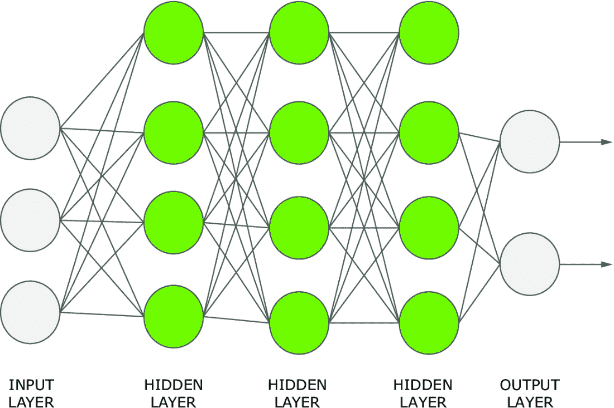

##### 图 4.4 深度学习网络的一个示例

让我们分解一下：

+   *输入层*——这是深度学习网络的第一层，数据被输入到网络中。在这种情况下，有一个包含三个节点的输入层。每个节点代表一个特征或输入变量。

+   *隐藏层*——这些是输入层和输出层之间的中间层，网络在这里从输入数据中学习模式和表示。在这个网络中，有三个隐藏层，每个层有四个节点。每个隐藏层中的节点数量可以显著影响网络的学习能力和性能。

+   *输出层*——这是网络的最后一层，产生输出。在这种情况下，有两个输出节点，这意味着网络被设计成产生两个输出。

现在你已经看到了深度学习的概述，让我们继续下一步：定义生成式 AI。

### 4.1.4 什么是生成式 AI？

*生成式 AI*是深度学习的一个子领域，旨在根据从现有内容中学到的内容创建新的内容。从现有内容的学习过程的结果是一个统计模型（生成模型），用于生成新的内容。

生成模型试图理解数据分布。假设我们有一个包含圆形和方形图片的数据集。生成模型学习圆形和方形整体的模式和特征。然后，利用这种理解，它们生成看起来与它们所见相似的新的图片。

图 4.5 展示了一个生成模型的例子。该模型以一些文本作为输入，要求它生成一个新的圆形，并产生一个新的圆形作为输出。


##### 图 4.5 生成模型的例子

图 4.5 中展示的从文本到图像/代码的模型是本书特定生成模型的例子。一般来说，*生成*意味着我们可以在特征空间中进行一些插值，并在标签空间中得到一些有意义的输出。

生成模型以*提示*作为输入。提示是一段用于指导输出质量的文本。它作为生成模型的指南，以生成与特定预期结果一致的响应或输出。基本的提示是要求工具执行特定操作的文本。在第二章中，你已经编写了一些基本的提示，让 Copilot 生成构建 Altair 图表的代码。

*提示工程*是一门旨在精心设计和完善提示以实现预期结果的学科。提示工程的目标是引发连贯、相关且与预期结果一致的响应，同时最大限度地减少任何未预期的偏见或不良行为。既然你已经了解了什么是生成式 AI，那么让我们继续描述生成式 AI 工具景观。

### 4.1.5 生成式 AI 工具景观

你可以在多个场景中使用生成式 AI，包括用于生成文本、图像、代码、语音等等。对于每个具体任务，你可以使用不同的工具。在所有情况下，你从一个文本提示开始，该工具根据其特定性质将其转换为所需的输出（文本、图像、代码等等）。对于大多数服务，你必须支付费用才能使用生成式 AI 工具。然而，一些生成式 AI 工具提供免费版本，但功能有所降低。

图 4.6 显示了生成式 AI 工具的主要应用领域（Madhvani，2023）。如果不正确使用，这些工具可能会产生错误或带有偏见的信息。因此，你必须仔细监控和调整生成的输出，以确保准确性和公平性。

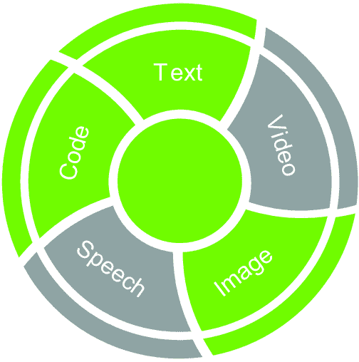

##### 图 4.6 生成式 AI 工具的主要应用领域。在这本书中，我们将重点关注代码、文本和图像。

该图还突出了本书中使用的应用领域：

+   *文本到文本工具*——使用它们来生成文本，例如用于内容创作、聊天机器人、虚拟助手、创意写作，以及自动化重复性任务，如撰写电子邮件或生成报告。文本到文本工具的例子包括 Open AI ChatGPT、Google Bard 和 Anthropic 开发的 Claude AI。在这本书中，我们将重点关注 ChatGPT。

+   *文本到图像工具*—使用它们根据文本输入生成视觉表示。在这本书中，我们将使用 Open AI DALL-E。如果你在 2023 年 4 月 6 日之前注册了 DALL-E，你将获得免费积分。新用户必须支付少量费用才能使用该服务。

+   *文本到代码工具*—使用它们来生成代码。在这本书中，我们将重点关注 GitHub Copilot，它需要一个有效的订阅。

你可能会问为什么你应该付费使用一个工具。主要答案是，高质量的生成式 AI 工具仅通过付费才能获得；免费工具要么质量不高，要么在付费或订阅之前非常有限。幸运的是，费用相当小。完全开源的工具是免费的，但它们所需的计算资源并不是免费的。另一方面，付费的生成式 AI 工具价格昂贵，但计算成本已包含在价格中。

我们可以使用 ChatGPT 生成代码。然而，我们更倾向于使用 Copilot，主要原因如下：

+   *代码特定专业知识*—Copilot 是专门为编码任务设计的，并在 GitHub 仓库的大量代码上进行训练。

+   *VSC 集成*—Copilot 直接集成到 Visual Studio Code (VSC) 中，允许开发者在他们的编程编辑器内处理项目时访问其建议和代码补全功能。

+   *专注于代码生成*—Copilot 主要专注于生成代码片段并协助开发者进行编码过程。它经过优化，以辅助编写函数、类以及整个代码块，根据正在编写的代码的上下文提供快速建议。

虽然 ChatGPT 可以在编程任务上提供帮助，但其主要功能并不是专门针对编码的。它是为通用用途设计的，可以协助广泛的任务，而不仅仅是编程。此外，根据我的个人经验，ChatGPT 有时会有发明一个虚构的 Python 方法或函数的倾向（这是一个幻觉的案例），如图 4.7 所示。

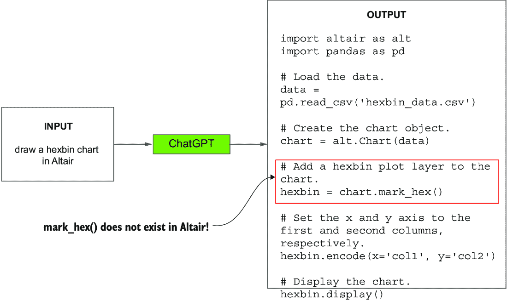

##### 图 4.7 ChatGPT 生成代码时产生的一个不良输出示例

我们要求 ChatGPT 生成一个六边形图表，ChatGPT 使用了 `mark_hex()` 方法，但这个方法目前在 Altair 中尚未实现。这是一个 *幻觉* 的例子，我们将在第十章中更深入地讨论这个话题。目前，只需知道生成式 AI 模型可以产生幻觉，这意味着它可以生成令人信服地类似于真实数据的输出，尽管这些输出可能并没有在现实中明确地得到证实。

我们已经选择了特定的工具来生成用于数据讲述的文本、图像和代码。然而，你可以轻松地将描述的概念适应到其他工具上，几乎不需要任何努力。在所有情况下，提供准确和简洁的指令至关重要，以确保工具生成正确的输出。写具体且明确的指令，使用简单语言，避免复杂术语。此外，写关于语法、语言和格式的连贯指令。不一致的指令可能会使工具困惑，导致错误的输出。

现在我们已经快速定义了生成式 AI 工具的背景，我们可以继续下一步：使用生成式 AI 工具进行数据讲述。我们将从 ChatGPT 开始；然后描述 DALL-E；最后，涵盖 GitHub Copilot。

## 4.2 ChatGPT 提示的基本结构

要与 ChatGPT 互动，你必须编写一个输入文本（提示），以定义要执行的指令。你可以使用 ChatGPT 的网页界面或 Open AI API，如附录 A 所述。

有几种不同的方式来构建 ChatGPT 的提示。在这本书中，我们认为一个提示由三个主要连续的文本组成：

+   *告诉 ChatGPT 扮演一个特定的角色。* 例如，“你是一位正在审阅高中生英语论文的考官。”

+   *告诉 ChatGPT 根据目标受众调整其输出。* 例如，“用高中生能理解的方式解释你的评分。”

+   *定义任务。* 例如，“评估这篇文本，并解释你的理由。”

关于提示工程的更多细节，请参阅本章末尾参考文献中概述的资源。

尽管我们已经测试了这种提示结构，但有时它不会产生预期的输出，因此你可以通过不同的迭代来完善提示。在本节的剩余部分，我们将分别描述提示的所有部分。尽管提示的结构应该是*角色*、*受众*、*任务*，但我们将首先描述要执行的任务，以展示当角色和受众变化时产生的提示是如何变化的。

我们将展示一些生成的文本示例。如果你尝试自己的工具，你将获得不同的结果，因为每次使用 ChatGPT 时，它都会生成新的内容。

### 4.2.1 定义任务

任务是 ChatGPT 必须完成的特定目标。任务包括明确的指令，以引导 ChatGPT 生成与给定任务相关的响应。任务的例子包括回答问题、生成创意内容、翻译语言等。在数据讲述的背景下，我们将关注以下任务：

+   生成标题

+   生成副标题

+   总结文本

+   翻译文本

+   提出想法

我们将在下一章中更详细地分析每个任务。

想象一个场景，你必须吸引那些在个人和职业生活中追求成功的人群。你已经准备了以下文本，它展示了表现出强大和完美与展示脆弱之间的对比：

> 在一个赞美力量和完美的世界中，记住脆弱是我们人性的本质。我们的挣扎和不完美使我们成为人类，但我们常常因为恐惧和羞愧而隐藏它们。然而，那些勇敢而真诚地拥抱自己弱点的人培养了非凡的韧性。那些害怕自己脆弱性的人可能会变得僵化，被困在无法达到的完美假象中。因为正是在我们的脆弱中，我们成长并真正地生活。（改编自 Oliani，2023，“Ho Paura di Essere Debole [我害怕软弱]，《圣安东尼奥使者》，第 6 期，第 53 页）。*

假设你的任务是为一篇关于脆弱和脆弱性的文本生成标题。为 ChatGPT 制定以下提示：*为以下文本生成标题<text>.* 将单词*text*替换为关于脆弱和脆弱性的上一段文本。ChatGPT 可能生成的以下标题示例：

+   *拥抱脆弱：通往非凡韧性和真实生活的道路*

+   *在追求完美的世界中，脆弱是通往真实和韧性的门户*

+   *脆弱：拥抱不完美，以实现真实的韧性和成长*

所有这些标题都是通用目的。下一步是向提示中添加一个角色，以便 ChatGPT 生成更具体的输出。

### 4.2.2 扮演一个角色

当传达信息时，你可能会有一个以下的目标：

+   *娱乐*—重点是提供乐趣、娱乐或放松。你可能想让人们发笑或唤起情感。

+   *教育*—重点是向观众提供知识、见解或技能，以拓宽观众的知识基础并鼓励学习。

+   *信息*—重点是让观众了解特定主题，如新闻更新或当前事件。

+   *灵感*—重点是激励观众，例如激发创造力或鼓励个人成长。励志信息通常分享成功故事或展示榜样。

+   *行动邀请*—重点是激励观众参与特定的行为或活动。

+   *建立关系*—重点是通过对个人轶事和共同经历的分享与观众建立联系。信息旨在建立信任、加强现有关系或培养社区感。

根据目标的不同，你将扮演不同的角色，这些角色使用特定的叙事技巧。在某些情况下，在相同的情况下，你可能扮演不同的角色，但通常，角色取决于目标受众。

再次考虑这样一个场景，你必须吸引那些在个人和职业生活中追求成功的受众。使用 ChatGPT 来调整文本以适应你的角色。使用以下语法来为 ChatGPT 制定提示：*扮演一个[角色]。在尖括号<text>中生成文本的标题。* 表 4.1 显示了为所有描述的角色产生的输出。

##### 表 4.1 所有角色的提示结果

| 角色 | 输出 |
| --- | --- |
| 娱乐者 | 揭示我们的人性：拥抱脆弱，在不完美中蓬勃发展 |
| 教育者 | 培养韧性：拥抱脆弱和不完美，促进个人成长和福祉 |
| 通知者 | 拥抱脆弱的力量：庆祝不完美，培养韧性 |
| 激励者 | 拥抱你的脆弱力量：释放韧性，拥抱不完美，过上充实的生活 |
| 行动邀请者 | 拥抱你的脆弱人性：克服恐惧，拥抱不完美，释放你的韧性潜力 |
| 关系建立者 | 一起拥抱脆弱：培养真诚的连接和建立有弹性的关系 |

每个输出都有相同的结构([标题] [冒号] [副标题])，但它们的目标根据角色而变化。现在你已经学会了如何使用不同的角色来影响输出，让我们继续了解如何根据不同的目标受众来影响输出。

### 4.2.3 适应受众

根据你讲述数据故事时的上下文，你的受众会发生变化。例如，你可能有利益相关者、商人、儿童，甚至是哲学家等受众。更普遍地说，有以下类型的受众：

+   *一般受众*—一个具有多样化兴趣、背景和人口统计数据的广泛群体

+   *目标受众*—一个具有明确兴趣、背景和其他因素的特定群体

+   *小众群体*—一个相对较小的群体，他们有特定的兴趣、偏好或需求，例如特定爱好或特定领域的专业人士

+   *大众群体*—一个庞大且多样化的群体，他们消费吸引人的内容。与一般受众相比，大众群体是媒体和广告活动的目标。

再次考虑这样一个场景，你必须吸引那些在个人和职业生活中追求成功的受众。使用 ChatGPT 来调整文本以适应你的受众。使用以下语法来为 ChatGPT 制定提示：*扮演一个[角色]，针对[受众]*。*在尖括号<text>中设置文本的标题。* 表 4.2 显示了关系建立者角色所有描述的受众类型的输出。

##### 表 4.2 关系建立者角色所有受众类型的提示结果

| 受众 | 输出 |
| --- | --- |
| 一般受众 | 拥抱脆弱：通往弹性和真诚生活的道路 |
| 目标受众：商人 | 接受脆弱：在商业关系中的真诚与韧性之力 |
| 精准受众：足球爱好者 | 美丽的游戏：庆祝脆弱作为足球热情之核心 |
| 大众受众：年轻人 | 接受你的不完美：作为年轻人释放你内心的力量 |

所有输出都具有相同的结构（[标题] [冒号] [副标题]），但它们的含义根据特定受众进行了调整。再次考虑仅指定角色的标题：*共同接受脆弱：培养真诚的联系和建立韧性关系*。这个标题与为普通受众生成的标题相似。当你添加特定受众时，标题会根据它进行定制。现在你已经学习了定义 ChatGPT 提示词的基本概念，让我们继续下一步：定义 DALL-E 的提示词。

## 4.3 DALL-E 提示的基本结构

要与 DALL-E 互动，你必须编写一个指定指令的提示词。你可以使用 DALL-E 的 Web 界面或附录 A 中描述的 Open AI API。

为 DALL-E 构建提示词有几种不同的方式。在这本书中，我们考虑由以下组成的提示词：

+   *一个主题*

+   *一种风格*

在本节的剩余部分，我们将分别描述提示词的所有部分，从主题开始。记住，如果输出不满意，你可以对其进行细化或使用本节后面描述的编辑图像工具。

### 4.3.1 主题

图像的主题是吸引观众注意力的主要焦点。主题的例子包括人物、物体或场景。在定义图像的主题时，尽可能具体。一个通用的主题将生成一个通用的图像。对于每个输入，DALL-E 生成四个输出图像。在本节的剩余部分，我们将展示一些生成的图像示例。如果你亲自尝试这个工具，你会得到不同的示例。

图 4.8 展示了 DALL-E 对于提示词“一个人”生成的输出。由于输入非常通用，输出也是通用的。四个生成的图像彼此不同。


##### 图 4.8 提示词“一个人”的输出

为了提高图像的焦点，你可以添加以下元素：

+   一个形容词

+   一种情感

+   上下文

+   颜色

让我们从添加一个限定主题的形容词开始。我们将给出一个与“穷人”相关的图像生成的具体示例。我选择这个主题是为了展示将图像插入数据故事中激发观众情感的可能性。实际上，数据故事讲述也为数据背后的人发声。

图 4.9 展示了对于提示词“一个穷人”的输出，其中“穷人”是限定形容词。所有生成的图像都包含一个手放在头上的人，但不一定是穷人。然而，与通用输出相比，我们得到了更好的结果。


##### 图 4.9 输入提示“穷人”的输出

更具体地说，添加一个描述人物情绪的情感。图 4.10 显示了由提示“一个悲伤、贫穷的人”产生的输出。


##### 图 4.10 输入提示“穷人”的输出

图像仍需改进。让我们添加一个背景，为主题创造上下文。图 4.11 显示了由提示“一个悲伤、贫穷的人，背景有垃圾”产生的输出。


##### 图 4.11 输入提示“一个悲伤、贫穷的人，背景有垃圾”的输出

最后，让我们添加颜色。图 4.12 显示了输入提示“一个悲伤、贫穷的人，穿着破旧的棕色衬衫，背景有垃圾”的输出（要查看彩色版本，请访问电子书版本）。


##### 图 4.12 输入提示“一个悲伤、贫穷的人，穿着破旧的棕色衬衫，背景有垃圾”的输出

现在，输出看起来令人满意。我们可以进行下一步：添加风格。

### 4.3.2 风格

风格定义了输出的艺术类型，包括照片、数字艺术、铅笔素描等等。此外，您还可以指定特定艺术家的风格，例如梵高或卡拉瓦乔。您只需尽情发挥您的想象力！

图 4.13 显示了输入提示“一个悲伤、贫穷的人，背景有垃圾，数字艺术”的输出，而图 4.14 显示了输入提示“一个悲伤、贫穷的人，背景有垃圾，黑白照片”的输出。


##### 图 4.13 输入提示“一个悲伤、贫穷的人，穿着破旧的棕色衬衫，背景有垃圾，数字艺术”的输出


##### 图 4.14 输入提示“一个悲伤、贫穷的人，穿着破旧的棕色衬衫，背景有垃圾，黑白照片”的输出

本章中描述的提示结构仅是使用 DALL-E 绘制图像的入门点。您还可以定义环境（室内或室外）、一天中的时间、角度等等。您可以在《DALL·E 2 提示手册》中找到更多信息（[`mng.bz/0GNx`](https://mng.bz/0GNx)）。

### 4.3.3 编辑图像工具

如果您对生成的图像完全不满意，可以使用 DALL-E 界面提供的编辑图像工具进行修改。要访问此工具，请选择图像，然后点击编辑。您可以擦除图像的一部分（如图 4.15 所示），添加新的生成框架或上传图像。


##### 图 4.15 使用橡皮擦

然后，您可以针对所选部分编写新的提示。让我们使用以下提示将一只小狗添加到图 4.15 的图像中：“一只小黑狗正在吃一片面包，黑白照片”。图 4.16 显示了产生的输出。

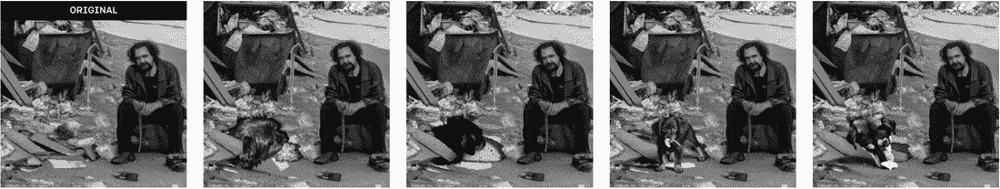

##### 图 4.16 使用橡皮擦修改后的图像输出

我们终于有了所有部件：ChatGPT、DALL-E 和 GitHub Copilot（来自上一章）。现在，是时候实施一个实际示例，使用所有这些工具。但在那之前，让我们先来激活 GitHub Copilot，定义一个更系统的方法，以便更好地利用它。

## 4.4 使用 Copilot 构建 Altair 图表的组件

当为 Copilot 编写指令时，将它们拆分为单个步骤。同时，提供您希望 Copilot 执行的上下文，并具体说明您正在编写的代码的要求。最后，请记住，Copilot 是一个旨在协助开发者的工具，而不是取代他们。Copilot 功能强大，但它不能取代您作为开发者的角色。始终使用您的专业知识来评估 Copilot 提供的代码建议，并确保它们适合您的特定需求。

在本节中，您将了解如何编写指令让 Copilot 构建 Altair 图表。我们将重点关注先决条件、标记、编码、条件、复合图表和交互性。

### 4.4.1 先决条件

在绘制图表之前，请让 Copilot 导入所需的库并将数据集作为 pandas DataFrame 加载。

##### 列表 4.1 导入所需的库和加载数据集

```py
# Import the required libraries.
# Load the file '/path/to/data.csv' into a pandas DataFrame.
```

注意：第一条指令指定导入所需的库。Copilot 将根据后续指令自动计算需要导入哪些库。第二条指令指定要加载的数据集的精确路径。

#### 练习 1

编写指令让 Copilot 加载位于本书 GitHub 仓库 04/data/data.csv 下的 data.csv 文件。您可以在本节 04/copilot/example.py 下找到本练习和下一个练习的解决方案。

### 4.4.2 标记

要定义一个标记，只需指示 Copilot 在 Altair 中绘制它。

##### 列表 4.2 定义标记

```py
# Draw a <type of mark> named chart in Altair
```

注意：使用关键词 `Draw` 和 `Altair` 来指定您想要在 Altair 中构建图表。将 `<type of mark>` 替换为您想要构建的标记类型。例如，如果您想构建柱状图，请写 `bar chart`。

### 4.4.3 编码

要设置编码，请向列表 4.2 中定义的指令中添加关键词 `with:`。此外，为每个要定义的编码通道添加一个项目符号。

##### 列表 4.3 设置编码

```py
# Draw a bar chart named bar in Altair with:
# * The category column as the x-axis 
# * The value column as the y-axis
# * The country column as the color.
```

注意：在定义标记后，使用关键词 `with:` 后跟一个编码通道列表。对于每个编码通道，指定要使用的数据集列和通道。

#### 练习 2

编写指令让 Copilot 使用之前练习中加载的数据集在 Altair 中绘制折线图。指定使用 `X` 列作为 `x` 通道，`Y` 列作为 `y` 通道。

### 4.4.4 条件

要设置与特定编码通道相关的条件，请使用以下列表中指定的指令。

##### 列表 4.4 定义条件

```py
# * The country column as the color. Set the color to:
#   - 'red' for 'IT'
#   - 'green' for 'FR'
```

注意：将条件附加到选定的编码通道。使用列表指定条件的内容。示例中，如果国家是`IT`，则将颜色设置为`red`；如果国家是`FR`，则设置为`green`。

#### 练习 3

为 Copilot 编写指令，执行以下操作：

1.  加载数据集 data3.csv，位于 04/data/data3.csv 下。

1.  在`x`通道中绘制具有类别列的条形图，在`y`通道中绘制值列。

1.  如果国家列等于`IT`，则将条形图的颜色设置为`red`；否则，设置为`green`。

### 4.4.5 复合图表

分别构建每个图表。然后，要构建复合图表，请编写特定的指令，如以下列表所示。务必为每个图表赋予不同的名称。

##### 列表 4.5 构建复合图表

```py
# Build a compound chart named chart with the line and bar charts aligned vertically
```

注意：指定你想要绘制的组合类型。示例中垂直排列了图表。

#### 练习 4

为 Copilot 编写指令，使其垂直对齐之前练习中绘制的折线图和条形图。

### 4.4.6 交互性

要使图表交互式，请按照以下列表中的简单指令编写。

##### 列表 4.6 使图表交互式

```py
# Make the chart interactive.
```

注意：编写简单明了的指令以使图表交互式。

#### 练习 5

为 Copilot 编写指令，使其条形图交互式。注意，你可以在生成的代码上方或下方插入新的 Copilot 指令。

现在你已经学会了如何编写基本指令使 Copilot 在 Altair 中构建图表，让我们转向一个结合 Altair 和 Copilot 的实际案例研究。

## 4.5 案例研究：你的训练团队

让我们想象你在一个体育公司工作。你正在训练一支在各个项目中的年轻运动员团队。对于每个项目，你都已经记录了世界纪录以及你团队达到的最佳时间，以便进行比较。不幸的是，你的公司可用的投资资金有限。你的老板要求你区分哪些项目值得继续训练，以期望在即将到来的比赛中取得好成绩。你可以在本书的 GitHub 仓库 CaseStudies/competitions 目录下找到这个示例的代码。该目录包含不同的 Python 脚本，每个脚本对应本节剩余部分描述的每个步骤。

表 4.3 显示了每个项目，你的团队达到的记录和最佳时间。在你的情况下，目标是显示每个训练类型中你团队的时间和记录之间的差异，然后选择你应该继续投资的训练类型。

##### 表 4.3 案例研究的数据集显示了每个训练类型的记录、记录保持者、记录时间和你团队的最好时间。

| 训练类型 | 打破记录 | 记录保持者 | 记录时间（秒） | 团队最佳时间 |
| --- | --- | --- | --- | --- |
| **短跑** | 100 米 | 爆发力 | 9.58 | 15.07 |
| **长跑** | 马拉松 | 艾利乌德·基普乔格 | 7,299 | 13,261.76 |
| **游泳** | 100 m 自由泳 | César Cielo | 46.91 | 88.01 |
| **自行车** | 个人计时赛 (ITT) | Rohan Dennis | 1,963.49 | 2,795.22 |
| **划船** | 2,000 m | Josh Dunkley-Smith | 335.8 | 462.33 |

我们将使用 DIKW 金字塔将此数据集转化为智慧。让我们从金字塔的第一步开始：将数据转化为信息。

### 4.5.1 将数据转换为信息

用于此目的的最简单图形是堆叠条形图，它将两列显示为堆叠系列。让我们使用 GitHub Copilot 生成这个简单的图表。首先，编写生成图表的注释列表。

##### 列表 4.7 生成堆叠条形图

```py
# Import the required libraries.
# Load '../data/competitions.csv' as pandas dataframe.
# Select only the columns Training Type, Record Time (Seconds), Our Best Time.
# Use melt to transform the dataframe into a long format, with the parameter id_vars set to 'Training Type'.
# Draw a bar chart named chart in Altair with:
# * The Training Type column as the x-axis
# * The value column as the y-axis
# * The variable column as the color
# Save the chart as 'competitions.xhtml'.
```

注意：描述加载、操作和绘制数据集的操作顺序。

Copilot 将生成几个代码选项。选择以下列表中显示的代码。

##### 列表 4.8 Copilot 生成的堆叠条形图

```py
import pandas as pd
import altair as alt

df = pd.read_csv('data/competitions.csv')
df = df[['Training Type', 'Record Time (Seconds)', 'Our Best Time']]
df = pd.melt(df, id_vars='Training Type')

chart = alt.Chart(df).mark_bar().encode(
    x='Training Type',
    y='value',
    color='variable'
)

chart.save('competitions.xhtml')
```

注意：首先，加载并操作数据集。然后，使用 `mark_bar()` 绘制堆叠条形图。

图 4.17 显示了生成的条形图。除了非常窄之外，生成的图表还呈现了一个基本问题：我们无法从图表中确定应该关注哪些学科。这可以归因于图表的清晰度不足，这使得我们难以有效地解释数据。在实践中，问题是变量之间的比例差异。短跑在 10 秒的范围内，而长跑在数千秒的范围内。因此，我们需要修改图表设计以易于传达信息。

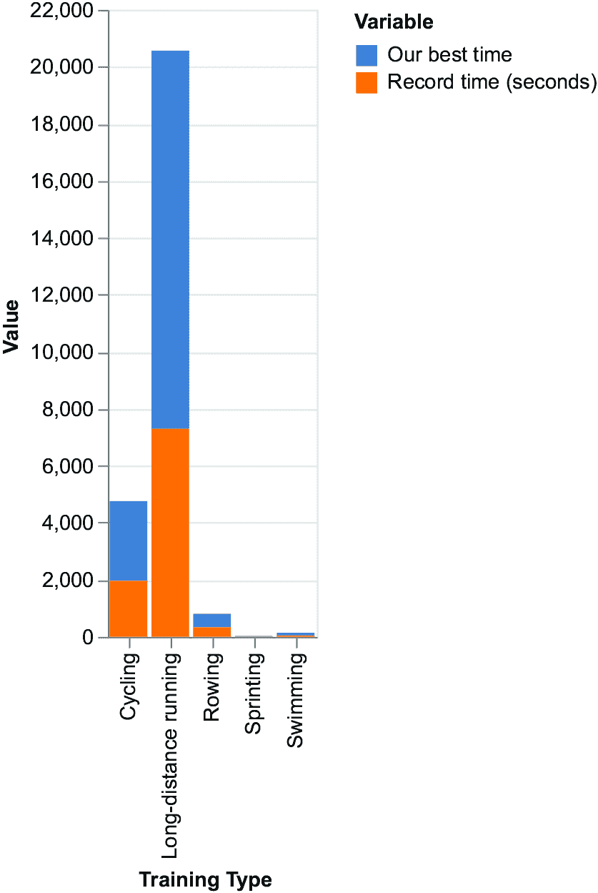

##### 图 4.17 Copilot 生成的堆叠条形图

通常，当我们想要在多个类别中比较两个变量时，计算每个类别的变量相对于另一个变量的百分比差异或百分比增加量，然后显示出来，这可能很有用。这种方法使我们能够比较两个变量，并识别数据中的任何模式或趋势。要生成此类图表，我们还可以再次利用 Copilot，它可以帮助我们编写必要的代码。编写以下列表中指定的指令列表。粗体指令显示了与列表 4.7 的不同之处。

##### 列表 4.9 生成带有百分比差异的条形图

```py
# Import the required libraries.
# Load '../data/competitions.csv' as pandas dataframe.
# Select only the columns Training Type, Record Time (Seconds), Our Best Time.
# Calculate the percentage difference between columns Our Best Time and Record Time (Seconds), and store it in a new column called Percentage Difference.
# Draw a bar chart with the following encodings:
# * The Percentage Difference on the y-axis with the following properties:
#   - The domain of the Y scale to [0,100]
# * Training Type on the x-axis with the following properties:
#   - The values sorted in descending order (-y)
# Set the following properties of the bar chart:
# * width to 300 pixels
# Save the chart as 'competitions.xhtml'.
```

注意：描述加载、操作和绘制数据集的操作顺序。还要指定按降序排序数据，并将 `Y` 轴的范围设置为 `[0,100]` 以使图表更清晰。由于图表比之前的更复杂，请在请求 Copilot 绘制图表时添加指令 `with` `the` `following` `encodings`。同样，对于标记属性也要这样做。还要注意嵌套列表，以将特定属性值添加到编码通道中。

Copilot 将生成几个代码选项。选择以下列表中显示的代码。

##### 列表 4.10 Copilot 生成的条形图

```py
import pandas as pd
import altair as alt

df = pd.read_csv('data/competitions.csv')
df = df[['Training Type', 'Record Time (Seconds)', 'Our Best Time']]
df['Percentage Difference'] = (df['Our Best Time'] - df['Record Time (Seconds)']) / df['Record Time (Seconds)'] * 100

chart = alt.Chart(df).mark_bar().encode(
    x=alt.X('Training Type', sort='-y'),
    y=alt.Y('Percentage Difference', scale=alt.Scale(domain=[0,100]))
).properties(
    width=300
)

chart.save('competitions.xhtml')
```

注意：首先，加载并操作数据集。然后，向数据集中添加一个名为`Percentage Difference`（百分比差异）的列，包含百分比差异。最后，使用`mark_bar()`绘制堆叠条形图。Copilot 可能不会生成完整的代码，因此我们需要根据所需的输出进行调整。

图 4.18 显示了生成的图表。


##### 图 4.18 Copilot 生成的带有百分比差异的条形图

该图表突出显示的是我们的最佳时间和记录时间之间百分比差异最大的运动是游泳和长跑。然而，该图表可能具有误导性，因为它不直观，因为最大的条形实际上是表现最差的。为了提高图表的可读性和直观性，并更好地传达每个运动中运动员的实际表现，我们可以计算百分比提高。

##### 列表 4.11 计算百分比提高

```py
df['Percentage Improvement'] = 100 - 
(df['Our Best Time'] - df['Record Time (Seconds)']) / df['Record Time (Seconds)'] * 100
```

注意：计算相似度百分比：100 减去百分比差异。将列表 4.10 的第 5 行和第 6 行替换为列表 4.11 中显示的代码。

百分比提高表示我们的最佳时间与记录时间相比的性能提高的比例。百分比提高越高，表明运动员的表现越接近或优于记录保持者，而百分比提高较低则表明运动员的表现距离记录保持者的表现越远。这更直观，因为较大的条形现在表示最佳表现。图 4.19 显示了百分比提高。划船和自行车是表现更好的运动；因此，你可以选择那些运动进行进一步投资。


##### 图 4.19 带有百分比提高的条形图

现在我们已经从数据中提取了信息，我们可以进入 DIKW 金字塔的下一步。在下一节中，我们将深入探讨如何将信息转化为知识。

### 4.5.2 将信息转化为知识

此步骤涉及向信息添加上下文。在这种情况下，上下文可能涉及三个方面：

+   突出显示你想要投资的两个运动

+   添加一个强调前两个运动的图片

+   例如，添加一个基准，比如提高 50%，显示为什么选择那些运动

让我们从第一个点开始，突出显示你想要投资的两个运动。

#### 突出显示前两个运动

在之前生成的代码中，在`y`通道之后立即添加以下列表中显示的注释，以使用 Copilot 生成代码。

##### 列表 4.12 突出显示表现最佳的运动

```py
# Add the color encoding. Set the color to:
    # - #80C11E if the Percentage Improvement is greater than 50, 
    # - lightgray otherwise
```

注意：描述如何突出显示表现更好的运动。

以下列表显示了生成的代码。

##### 列表 4.13 突出显示表现最佳运动的生成代码

```py
color=alt.condition(
        alt.datum['Percentage Improvement'] > 50,
        alt.value('#80C11E'),
        alt.value('lightgray')
    )
```

注意：Copilot 生成的代码使用条件语句来选择应用于每个条形的颜色。

图 4.20 显示了生成的图表。现在，我们已经突出显示了前两名运动，我们可以继续向图表中添加图像。

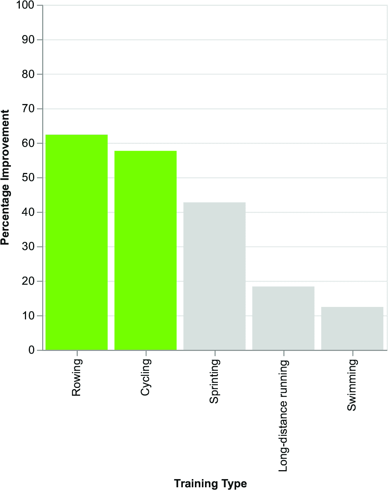

##### 图 4.20 显示了突出显示前两名运动的条形图

#### 添加执行图像

要为前两名运动中的每一项生成图像，向 DALL-E 提供以下提示：“一位热情的运动员在白色背景上练习[sport]，卡通风格”。图 4.21 和 4.22 分别显示了 *划船* 和 *自行车* 的输出。

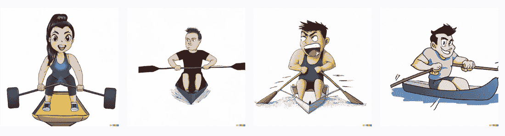

##### 图 4.21 呈现的划船输出

我们选择图 4.21 中的第二幅图像和图 4.22 中的第一幅图像。如果你发现图像中存在一些不完美的地方，你可以使用编辑工具进行改进。要将图像包含在 Altair 图表中，你必须将其保存到远程仓库中，例如 GitHub，并向 Altair 提供远程 URL。

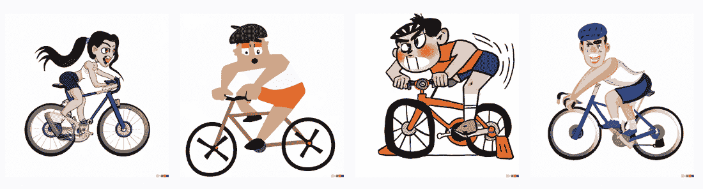

##### 图 4.22 呈现的自行车骑行输出

现在，让我们让 Copilot 编写将图像添加到图表中的代码。下面的列表描述了 Copilot 的指令。

##### 列表 4.14 向图表添加图像

```py
# Add a new column to df called 'url' with the following value:
# * 'https://[..]/cycling.png' for Training Type = 'Cycling'
# * 'https://[..]/rowing.png' for Training Type = 'Rowing'
# * '' for all other Training Types
# Add the following image to the chart:
# * The image is a 35x35 pixel image.
# * The image is located at x='Training Type', y='Percentage Improvement'.
```

注意：首先，向 DataFrame 中添加一个包含图像 URL 的列。然后，指定如何将图像添加到图表中。

下面的列表显示了输出结果。

##### 列表 4.15 添加图像的代码

```py
df['url'] = ''
df.loc[df['Training Type'] == 'Cycling', 'url'] = 'https://[..]/cycling.png'
df.loc[df['Training Type'] == 'Rowing', 'url'] = 'https://[..]/rowing.png'
chart = chart + alt.Chart(df).mark_image(width=35, height=35).encode(
    x=alt.X('Training Type', sort='-y'),
    y=alt.Y('Percentage Improvement'),
    url='url'
)
```

注意：首先，Copilot 建议通过添加新列来操作 DataFrame。然后，Copilot 建议使用 `mark_image()` 标记。

图 4.23 显示了添加到前两名运动列中的图像。现在，我们可以继续到下一步：生成基线。

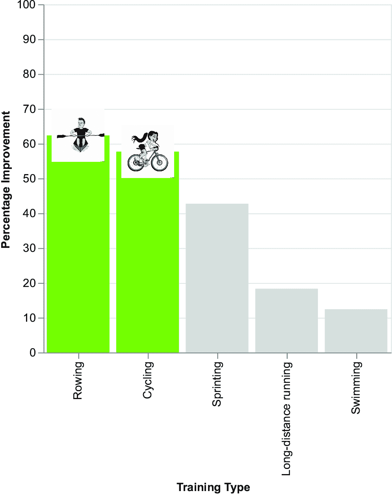

##### 图 4.23 添加图像后的条形图

#### 添加基线

添加基线意味着在图表中添加一条水平红色线以进行比较。例如，我们可以将水平线的值设置为 `50`，这对应于 50%。下面的列表显示了 Copilot 的指令。

##### 列表 4.16 生成基线

```py
# Add a horizontal red line to the chart at y=50.
# Add the line to the chart.
```

注意：描述如何在 50% 改进处生成基线。

下面的列表显示了生成的代码。

##### 列表 4.17 创建基线的生成代码

```py
line = alt.Chart(pd.DataFrame({'y': [50]})).mark_rule(color='red').encode(y='y')
chart = chart + line
```

注意：Copilot 生成的代码使用 `mark_rule()` 生成水平线，并使用 `+` 运算符叠加两个图表。

图 4.24 显示了最终的图表。与图 4.19 相比，你添加了帮助读者立即了解应该投资哪些运动的上下文。

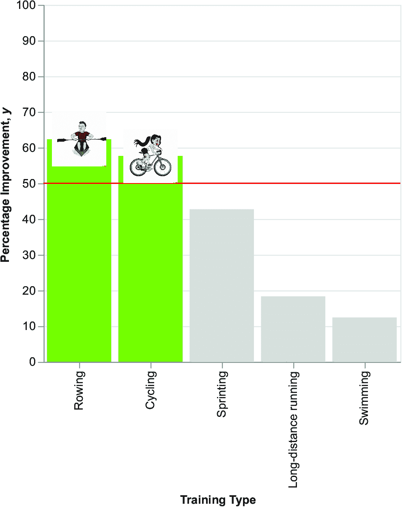

##### 图 4.24 显示了表现优于基线的两种运动的条形图

我们可以通过调整坐标轴标题和应用整理来进一步改进图 4.24 中的图表。我们将在下一章中看到如何做到这一点。现在，我们已经为图表添加了上下文，我们可以继续到 DIKW 金字塔的下一步：将知识转化为智慧。

### 4.5.3 将知识转化为智慧

此步骤涉及向图表添加一个动作。让我们添加一个邀请受众投资划船和骑自行车的标题。我们可以使用 ChatGPT 来生成标题。写下以下提示：

+   *扮演行动邀请者。*

+   *针对体育公司老板定制。*

+   *为以下文本生成一个引人注目的标题（在尖括号内：<您应该投资划船和骑自行车的资金，这些是最常练习的运动>）。*

生成的一个标题示例是：解锁潜力：投资划船和骑自行车以获得最大回报！如果您对生成的标题不满意，可以要求 ChatGPT 生成另一个或一组*n*个标题。

一旦我们定义了标题，我们就可以为 Copilot 编写添加标题的说明，如下所示。在图表的`properties()`方法中添加注释。

##### 列表 4.18 添加标题

```py
# Add the following properties to the chart:
    # * title to 'Unlock the Potential: Invest in Rowing and Cycling for Maximum Returns!'
```

注意：在图表的属性函数中添加此指令。

下面的列表显示了生成的代码。

##### 列表 4.19 添加标题的生成代码

```py
title='Unlock the Potential: Invest in Rowing and Cycling for Maximum Returns!'
```

注意：Copilot 生成的代码使用`title`属性。

图 4.25 显示了最终的图表。要渲染此图表，您应该从 Web 服务器运行生成的 HTML。如果您没有 Web 服务器，可以使用以下命令从您的目录中运行一个临时 Web 服务器：`python` `-m` `http.server`。


##### 图 4.25 带有行动呼吁标题的条形图

现在，您可以最终确定图表。首先，旋转 x 轴标签并移除标题。通过添加`axis`属性和`label`角度（`axis=alt .Axis(title=None,` `labelAngle=0`）修改`x`通道。接下来，将所有图表的标题设置为`Percentage` `Improvement`（百分比改进）（主图表、图像和注释）。最后，如列表 4.20 所示，在红线上方添加注释文本。

##### 列表 4.20 添加文本注释

```py
annotation_df = pd.DataFrame({'text': ['Use 50% as the benchmark for sports selection']})
annotation = alt.Chart(annotation_df
        ).mark_text(
            size=10, 
            align='left', 
            color='red',
            x=170,
            y=150,
            dy=-10
        ).encode(
            text='text'
        )

chart = (chart + annotation)
```

注意：首先，定义注释 DataFrame，然后将其用作图表的输入。

您可以在本书的 GitHub 仓库下的 04/case-study/7-bar-chart.py 中找到此示例的完整代码。图 4.26 显示了生成的图表。

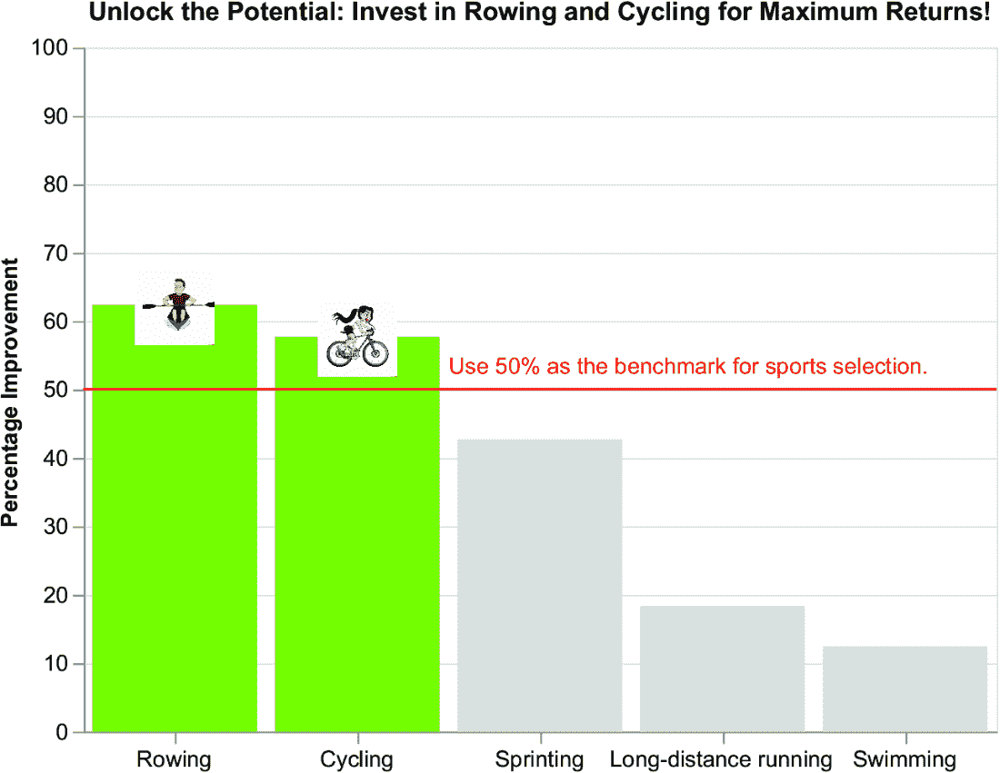

##### 图 4.26 最终的条形图，带有旋转的标签、调整后的标题和注释

在本章中，您已经了解了生成式 AI 工具背后的基本概念，特别是专注于 ChatGPT、DALL-E 和 Copilot。在下一章中，您将看到如何结合 Altair 和生成式 AI 工具，使用 DIKW 金字塔构建引人入胜的数据故事。

## 摘要

+   生成式 AI 是人工智能的一个子领域，旨在根据训练数据生成新的内容。您可以使用生成式 AI 用于不同的目的，包括文本、图像、代码、视频和语音生成。

+   提示是一个包含生成式 AI 工具指令的输入文本。

+   ChatGPT 是一种文本到文本的生成式 AI 工具。为了为 ChatGPT 编写有效的提示，请将提示分为三个部分：角色、受众和主题。

+   DALL-E 是一个文本到图像的生成式 AI 工具。为了为 DALL-E 编写有效的提示，定义主题和风格。

+   Copilot 是一个文本到代码的生成式 AI 工具。为了使 Copilot 高效地编写代码建议，请使用具体且明确的指令，使用简单语言并避免复杂术语。

+   不要将 Copilot 作为你作为开发者的替代品。相反，使用它来辅助编程。

+   总要记住，生成式 AI 不能替代你的创造力和推理能力。

## 参考文献

### 提示工程

+   Barber, T. (2023). *Dall-E 提示技巧与窍门*。[`torybarber.com/dall-e-prompting-tips-tricks/`](https://torybarber.com/dall-e-prompting-tips-tricks/)

+   *DALL·E 2 提示手册*。（2022）。https://mng.bz/0GNx。

+   Fulford, I. 和 Ng, A. （未注明）。*为开发者设计的 ChatGPT 提示工程*。[`www.deeplearning.ai/short-courses/ChatGPT-prompt-engineering-for-developers/`](https://www.deeplearning.ai/short-courses/ChatGPT-prompt-engineering-for-developers/)

+   Kemper, J. (2023). *ChatGPT 指南：使用这些提示策略最大化你的结果*。[`the-decoder.com/ChatGPT-guide-prompt-strategies/`](https://the-decoder.com/ChatGPT-guide-prompt-strategies/)

+   Madhvani, N. (2023).*生成式 AI 工具在创意领域：权力与压力游戏正在进行！* 2023 年 3 月。[`www.rapidops.com/blog/generative-ai-tools/`](https://www.rapidops.com/blog/generative-ai-tools/)

### 其他

+   *监督式机器学习*。（未注明）。Javatpoint。[`www.javatpoint.com/supervised-machine-learning`](https://www.javatpoint.com/supervised-machine-learning)
