# 5 使用 DIKW 金字塔制作数据故事

### 本章涵盖

+   无家可归者的故事，本章的情景

+   数据故事是什么以及它与 DIKW 金字塔的关系

+   如何将生成式 AI 融入 DIKW 金字塔

创作故事是数据故事讲述中最激动人心的部分。这实际上是在跟随一个有开头、主要观点和结论的情节——就像在电影院或剧院的故事一样。然而，这里受到数据的约束。在本章中，我们将通过描述两个例子来关注使用 DIKW 金字塔。第一个例子将分析意大利无家可归者的问题，第二个将检查一个假设网站上的虚假新闻问题。我们还将描述数据故事的概念以及它与之前章节中已讨论的 DIKW 金字塔的关系。最后，我们将描述一些策略，基于如何为 ChatGPT 编写特定的提示来生成图表的上下文，以及为 DALL-E 生成用于图表的上下文图像，以将生成式 AI 融入 DIKW 金字塔。

## 5.1 打破僵局：无家可归者的故事

假设安吉丽卡为一家希望申请基金会资金以帮助减少意大利无家可归者人数的人道主义组织工作。人道主义干预可以应用于意大利多达四个地区。资金申请要求准备一个数据可视化图表，以激励选定的地区并详细说明资助提案的原因。

安吉丽卡的上司要求她完成一项关于投资哪些地区的研究，并激励她做出选择。安吉丽卡开始在网上搜索关于意大利无家可归者数据的可能数据集。经过几番搜索，她发现了 2021 年无家可归者数据的 ISTAT 数据集（[`mng.bz/Bd6J`](https://mng.bz/Bd6J)）。她下载了数据集并开始分析它。表 5.1 显示了无家可归者数据集的一个简化版本。原始数据集的列名是意大利语，为了提高可读性，它们被翻译成了英语。

##### 表 5.1 2021 年 ISTAT 无家可归者数据集的摘录

| ITTER107 | 地区 | 性别 | 年龄 | 国籍 | 价值 |
| --- | --- | --- | --- | --- | --- |
| ITC1  | 皮埃蒙特  | M  | 总计  | ITL  | 4,218  |
| ITC1  | 皮埃蒙特  | F  | 总计  | ITL  | 1,496  |
| ITC2  | 瓦莱达奥斯塔  | M  | 总计  | ITL  | 41  |
| ITC2  | 瓦莱达奥斯塔  | F  | 总计  | ITL  | 17  |

##### ISTAT 无家可归者数据集

数据集有以下列：

+   *ITTER107*—地区 ID

+   *地区*—地区名称

+   *性别*—男性（M）、女性（F）或总计（T）

+   *年龄*—所有年龄之和（总计）、17 岁以下（Y_UN17）、18 至 34 岁（Y18-34）、35 至 54 岁（Y35-54）和 55 岁以上（'Y_GE55）

+   *国籍*—意大利（ITL）、外国（FRGAPO）或总计（总计）

+   *价值*—无家可归者的实际人数

在分析结束时，安吉丽卡通过以下列表中的代码使用 Altair 编写代码，生成了图 5.1 所示的图表。您可以在 GitHub 仓库的 CaseStudies/homeless-people/raw-chart.py 中找到完整的代码。

##### 列表 5.1 Altair 中的地图

```py
import pandas as pd
import altair as alt

df = pd.read_csv('source/homeless.csv')

df['Territory'] = df['Territory'].str.replace('Trentino Alto Adige', 'Trentino-Alto Adige/Südtirol')     #1

df = df[(df['Age'] == 'TOTAL') & (df['Sex'] == 'T') &  (df['Citizenship'] == 'TOTAL')]            #2

url = "https://raw.githubusercontent.com/openpolis/geojson-italy/master/topojson/limits_IT_regions.topo.json"
map = alt.topo_feature(url, "regions")    #3

chart = alt.Chart(map).mark_geoshape().encode(
    tooltip='properties.reg_name:N',
    color=alt.Color('Value:Q')
).project('mercator').properties(
    width=500,
    height=500
).transform_lookup(
    lookup='properties.reg_name',
    from_=alt.LookupData(df, 'Territory', ['Territory', 'Value'])
).properties(title='Homeless in Italy in 2021')

chart.save('raw-chart.xhtml')
```

#1 数据清洗

#2 关注总年龄、总性别和总国籍。

#3 通过 URL 加载 TopoJSON 文件。


##### 图 5.1 2021 年意大利无家可归者的地图

备注：该图表使用包含意大利地图的底层`topoJSON`对象构建地图。要构建地图，请使用`mark_geoshape()`标记，并通过`project(`)方法指定投影。此外，通过`transform_lookup()`方法将`topoJSON`文件的`properties.reg_name`变量与`df` DataFrame 的`Territory`变量进行映射。我们将在下一章更深入地讨论如何构建地理地图。

安吉丽卡向她的上司展示了图表，上司要求她回答以下问题：*我们需要申请资金的四个地区是哪些？* 安吉丽卡查看图表，并给出以下答案：*颜色较深的地区*。她的答案非常含糊，因为从她生成的图表来看，并不立即清楚哪些地区颜色最深。此外，选择这四个地区的原因也不明确。安吉丽卡不得不承认，她的图表未能完成其使命。

### 5.1.1 图表有什么问题？

图表的主要问题是安吉丽卡的上司（观众）期望在图表中看到的内容与图表实际显示的内容之间存在很大差异。在实践中，安吉丽卡的图表没有回答她请求的问题（图 5.2）。


##### 图 5.2 安吉丽卡的上司（观众）要求回答一个具体的问题（在左侧）。实际上，图表回答了通用问题（在右侧）。

建立图表的第一条规则是：图表必须准确回答目标观众提出的问题。尽量不要让观众去解读答案。为他们做这项工作！

安吉丽卡的老板要求她重新绘制图表。她低头回到办公室，再次分析她的数据集。安吉丽卡明白问题不在于数据分析，而在于如何有效地表示数据。她尝试这样的推理：*观众必须一眼就能理解这四个地区以申请资金。这四个地区可能是什么？可能是拥有最多无家可归者数量的那些地区*。她之前图表中缺少的是*可能*的部分。她考虑制作一个条形图，按无家可归者数量降序显示地区。经过一番努力，她制作了图 5.3 中的图表，并在列表 5.2 中编写了代码。您也可以在 GitHub 仓库中找到该书的代码，位于 CaseStudies/homeless-people/bar-chart.py。


##### 图 5.3 展示了 2021 年按地区划分的意大利无家可归者数量的条形图

##### 列表 5.2 Altair 中的条形图

```py
chart = alt.Chart(df).mark_bar(
    color='#80C11E'
).encode(
    y = alt.Y('Territory', 
              sort='-x', 
              axis=alt.Axis(title='')),
    x = alt.X('Value', 
              axis=alt.Axis(tickCount=4,title='Number of homeless people'))
).properties(
    width=500,
    title='Homelessness in Italy in 2021'
)

).properties(title='Homeless in Italy in 2021')

chart = chart.configure_title(
    fontSize=20,
    offset=25
).configure_axis(
    grid=False
).configure_view(
    strokeWidth=0
)

chart.save('bar-chart.xhtml')
```

注释：该代码使用`mark_bar()`方法构建条形图。它还使用`color`参数设置条的颜色。为了按降序对条进行排序，在`y`通道中使用`sort`参数，并指定按`x`编码通道的降序排序。使用`configure_title()`配置标题参数，例如字体大小（`fontSize`）和标题与图表之间的`offset`。

该图表回答了老板的问题：这四个区域是拉齐奥、伦巴第、皮埃蒙特和坎帕尼亚。安吉丽卡注意到这四个区域中的三个也对应着意大利人口最多的地区。当安吉丽卡反思这一点时，她注意到她的图表中存在一个潜在的错误。人口最多的地区也拥有最多的无家可归者，这正是因为它们的人口更多。

因此，该图表没有以相关的方式展示情况。她需要根据人口对数据进行归一化——或者根据人口规模调整数字。如果没有任何归一化，数据可能会存在偏差。例如，考虑一个有 100 人口、其中 30 人是无家可归者的地区。再考虑一个有 10 人口、其中 8 人是无家可归者的地区。如果你表示绝对值，你可能会得出结论，在第一种情况下，无家可归者比第二种情况下多。但如果你更关注场景，在第二种情况下，80%的人口是无家可归的，而在第一种情况下，只有 30%的人口是无家可归的。

图 5.4 显示了经过归一化处理后的结果图表，重点关注拥有最多无家可归者人口的四个地区。列表 5.3 描述了绘制图表所编写的代码（脚本 CaseStudies/homeless-people/story-chart.py）。

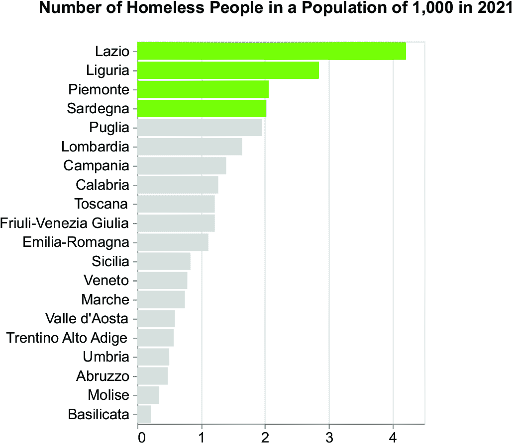

##### 图 5.4 展示了 2021 年人口为 1000 人的地区无家可归者数量的条形图

##### 列表 5.3 列表 5.3 Altair 中的改进条形图

```py
import pandas as pd
import altair as alt

df = pd.read_csv('source/homeless.csv')

df['Territory'] = df['Territory'].str.replace('Trentino Alto Adige', 
↪ 'Trentino-Alto Adige/Südtirol')         #1

df = df[(df['Age'] == 'TOTAL') & (df['Sex'] == 'T') &  (df['Citizenship'] 
↪ == 'TOTAL')]                   #2
df = df[['Value', 'ITTER107']] 

df_pop = pd.read_csv('source/population.csv')
df_pop = df_pop[(df_pop['Age'] == 'TOTAL') & (df_pop['Sex'] == 'T')]    #3

df_pop = df_pop[['Value', 'ITTER107','Territory']]

df_tot = df_pop.set_index('ITTER107').join(df.set_index('ITTER107'),
↪ lsuffix='_pop', rsuffix='_hom').reset_index()
df_tot['Ratio'] = df_tot['Value_hom']/df_tot['Value_pop']*1000

chart = alt.Chart(df_tot).mark_bar().encode(
    y = alt.Y('Territory', 
              sort='-x', 
              axis=alt.Axis(title='')),
    x = alt.X('Ratio', 
              axis=alt.Axis(tickCount=4,title='')),
    color=alt.condition(alt.datum.Ratio > 2, 
                        alt.value('#80C11E'), 
                        alt.value('lightgray'))

).properties(
    width=500,
    title='Number of homeless people in a population of 1,000'
)
```

#1 数据清洗

#2 关注总年龄、总性别和总公民身份。

#3 按人口标准化值。

备注：代码加载了包含与无家可归者数据集相同字段的人口数据集，除了值列，该列表示实际人口。代码将两个数据集（人口`df_pop`和无家可归者`df`）合并，并计算无家可归者与人口之间的比率。然后，图表使用比率作为`x`编码通道构建条形图。

Angelica 的图表最终回答了她老板的问题：四个地区是拉齐奥、利古里亚、皮埃蒙特和萨丁岛。最后，Angelica 向她的老板展示了她的图表，她的老板对她结果非常满意。

为了申请资金，Angelica 必须将她的图表发送到一个委员会，该委员会将决定是否资助她组织的提案。然而，经过仔细评估后，基金委员会决定不资助她的项目，因为图表缺乏动力。

### 5.1.2 展示中有什么问题？

要了解为什么基金委员会拒绝资助 Angelica 的提案，让我们回顾她所遵循的路径。她从原始数据开始，进行分析，提取洞察，并通过图表来表示，在将图表发送给基金委员会之前（图 5.5）。

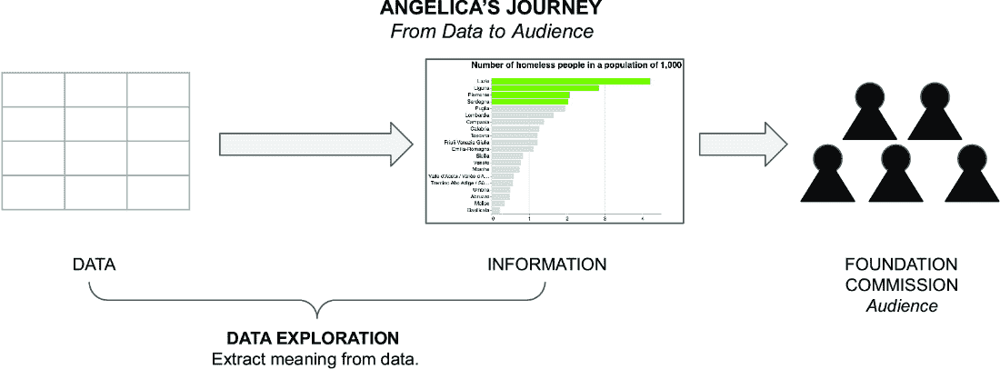

##### 图 5.5 Angelica 的图表生成之旅。Angelica 直接向她的观众展示了数据探索的结果。

她的图表所缺乏的是没有上下文，也没有推动基金委员会接受她提案的动力。Angelica 应该在数据探索阶段之后添加一个解释阶段，在那里她可以用她的数据吸引观众，并激励他们接受她的提案。Angelica 可以使用 DIKW 模型将她数据的探索阶段转移到解释阶段（图 5.6）。

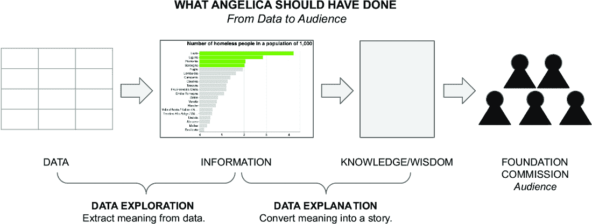

##### 图 5.6 Angelica 应该将她的数据探索阶段转化为数据解释阶段。

换句话说，Angelica 还没有将数据转化为故事。在他的书籍《有效数据叙事》中，Brent Dykes 说：“数据故事的形成始于使用探索性数据可视化来发现洞察。一旦发现有意义的洞察，就使用解释性数据可视化来讲述故事。”（Dykes，2019）Angelica 构建的图表仅构成了数据故事的主要观点。然而，为了有一个完整的故事，Angelica 还应该包括背景和下一步行动（图 5.7）。基金委员会期望 Angelica 的图表能够回答这个问题：*为什么我们应该资助你的项目？*将图表组织成一个故事将增加她获得资助的机会。


##### 图 5.7 基金委员会期望看到一个包含背景、主要观点和下一步行动的故事，邀请他们资助 Angelica 的提案。

现在，你理解了将数据转化为故事以有效地向观众传达信息的紧迫性。接下来，让我们进入下一步：数据故事是什么及其主要组成部分。

## 5.2 揭示叙事：数据故事是什么

根据《剑桥词典》，故事是“对一系列事件的真实或虚构描述。”故事是通过一个结构化、连贯的叙述来分享信息或娱乐，从而吸引观众的方式。故事的目标始终是吸引观众以传达信息。

在他的著作《诗学》中，古希腊哲学家亚里士多德提出了一种构建悲剧的框架，也称为“三幕结构”。该结构由三个主要部分组成：设置、对抗和解决（图 5.8）。

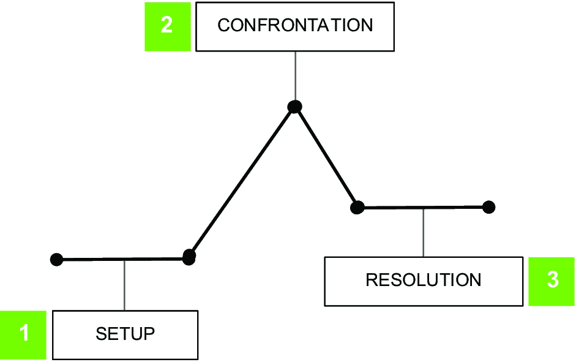

##### 图 5.8 亚里士多德提出的三幕结构来构建悲剧

本节设置向观众介绍了故事的角色、背景和基本冲突。在对抗中，主要角色面临障碍并努力克服它们。最后，在解决阶段，故事达到冲突得以解决的点。亚里士多德的悲剧结构至今仍在文学、电影和其他叙事形式中得到广泛应用。其有效性在于其构建紧张和悬念的能力，从而为观众带来令人满意的结局。

在《有效数据叙事》一书中，Dykes 提出了一种三幕悲剧的更新版本，适用于数据叙事场景（图 5.9）。Dykes 称之为“数据故事结构弧”。


##### 图 5.9 Dykes 提出的数据故事结构弧

数据故事首先通过（a）定义数据背后的背景和（b）激发观众的兴趣来开始。Dykes 还建议在此初始阶段加入一个钩子。钩子是“一个作为故事转折点的显著观察，开始揭示问题或机会”（Dykes，2019）。然后，数据故事通过（c）揭示洞察力、（d）给观众一些思考时间以及（e）通过提出下一步行动来结束。

图 4.9 中提出的结构在构建图表时可能看似抽象且难以应用。使用第一章中介绍的 DIKW 金字塔，你可以将简单的图表转变为故事。

### 5.2.1 使用 DIKW 金字塔简化数据故事

在第一章中，我们介绍了数据、信息、知识、智慧（DIKW）金字塔，并在宠物活动等实际案例中用它将数据转化为智慧。我们可以概括第二章中描述的例子，并使用 DIKW 来构建任何数据故事。图 5.10 显示了如何将数据故事结构弧映射到 DIKW 金字塔上：

+   从数据中提取洞察力对应于数据故事的主要点。

+   将背景添加到提取的信息中相当于定义背景并提高观众的兴趣。

+   添加行动号召相当于邀请观众思考和跟随下一步。


##### 图 5.10 数据讲述弧与 DIKW 金字塔的映射

在数据之前拥有知识可能看起来很奇怪。然而，在这里，我们所说的“知识”是指理解故事并将其置于特定背景所需的所有元素。所描述的映射表明了构建数据故事时的自然流程（图 5.11）。首先，确定故事的主要观点；然后设置背景；最后，设置下一步。


##### 图 5.11 构建数据故事的流程

### 5.2.2 DIKW 在行动：完成无家可归者故事

本章开头描述的无家可归者例子停留在 DIKW 金字塔的信息层面，从数据故事的角度来看，它只包括主要观点。向图表添加背景涉及吸引观众的注意力，并使他们对你所描述的问题产生兴趣。在第二章中，你学习了在 Altair 中，你可以向图表添加文本注释，将信息转化为知识。此外，还有其他方法可以向图表添加背景，包括标签、标题、来源、图像、描述和比较。我们将在第六章中更详细地描述这些内容。

在无家可归者问题的案例中，你可以添加描述这些人们情况的文本，以及可能给涉及的人一个面孔的照片。我们将在第六章中看到如何将英雄添加到故事中。现在，只需给数据背后的人一个面孔就足够了。

在列表 5.4 中，我们将描述背景的文本作为图表副标题添加。使用 `TitleParams()` 函数来指定标题属性，包括副标题。将副标题设置为

```py
Homelessness is a heartbreaking reality that leaves individuals and families without a stable home, leading to devastating consequences such as poor health and social isolation.
```

此外，添加简短描述，帮助读者关注数据：

```py
The chart describes the number of homeless people in Italy per 1,000 inhabitants, organized by region. The data is from 2021, the most recent year available (Source: ISTAT).
```

##### 列表 5.4 将背景作为副标题添加

```py
# Add context
chart = chart.properties(width=500,title=alt.TitleParams(
    text=["Together, Let's Make a Difference:","Support Our Project to Help the Homeless!"],
    subtitle=['Homelessness is a heartbreaking reality that leaves individuals and families without a stable home,','leading to devastating consequences such as poor health and social isolation.', 'The chart describes the number of homeless people in Italy per 1,000 inhabitants, organized by region. ', 'The data is from 2021, the most recent year available (Source: ISTAT).']],
    subtitleFontSize=18,
))
```

注意：在 `properties()` 方法中，使用 `title` 参数来设置图表标题。使用 `TitleParams()` 函数定义标题，该函数可以接收多个参数作为输入。示例传递了以下参数：标题（`text`）、副标题（`subtitle`）、副标题字体大小（`subTitleFontSize`）、标题字体大小（`titleFontSize`）。

列表 5.5 展示了如何向图表添加两张照片，并将它们与原始图表结合来构建仪表板。你必须在一个网络服务器上运行代码才能使其工作。如果你没有网络服务器，你可以从命令行运行一个本地和临时的网络服务器，在包含生成的 HTML 文件的目录中运行以下命令：`python` `-m` `http.server.` 服务器应在端口 8000 上监听，并从启动它的目录中提供所有文件。将你的浏览器指向 http://localhost:8000/chart.xhtml 以访问文件 chart.xhtml。

##### 列表 5.5 添加上下文作为图像

```py
image1 = alt.Chart(pd.DataFrame({'image_url': ['source/homeless1.png']})).mark_image(
    width=200,
    height=200,
).encode(
    url='image_url',
    x=alt.value(0),  # pixels from left
    y=alt.value(50)  # pixels from the top
)           #1

image2 = alt.Chart(pd.DataFrame({'image_url': ['source/homeless2.png']})).mark_image(
    width=200,
    height=200,
).encode(
    url='image_url',
    x=alt.value(0),  # pixels from left
    y=alt.value(300)
)                     #2

image1 + image2 | chart
```

#1 构建第一个图像。

#2 构建第二个图像

备注：使用`mark_image()`向图表添加图像。在传递给图表的 DataFrame 中设置图像文件的路径。使用`x`和`y`通道设置图像在图表中的位置。使用相同的图表绘制`image1`和`image2`（`+`运算符），并将主图表相对于`image1` `+` `image2`绘制在右侧。

为了完成无家可归的故事，添加一个行动号召，包括下一步。在这个例子中，我们首先修改标题：*一起，让我们做出改变：支持我们的项目，帮助无家可归者!* 我们将在第九章中看到如何向图表添加行动号召的不同策略。图 5.12 显示了结果图表。

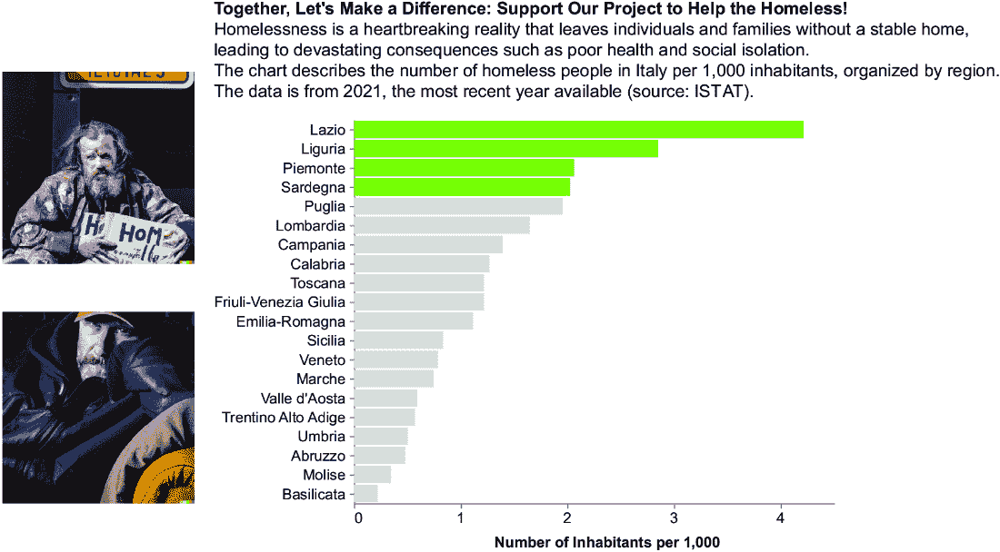

##### 图 5.12 无家可归图表通过上下文（图像和副标题）得到丰富。

然后，我们在图表中添加一个新的部分，描述我们将如何使用资金（图 5.13）。例如，我们将用 35%的资金用于庇护和住房，25%用于职业培训，等等。


##### 图 5.13 解释我们将如何使用资金的下一个步骤

以下列表显示了我们在图 5.13 中实现图表的方法。我们假设我们有一个 DataFrame 存储每个类别的资金（分配）百分比。

##### 列表 5.6 添加下一步

```py
import pandas as pd
import altair as alt

donuts = None

for index, row in ns.iterrows():
    curr_ns = pd.DataFrame(
        {'Category': ['A', 'B'],
         'Value': [row['Allocation'], 100-row['Allocation']]
        }                             #1
    )

    donut = alt.Chart(curr_ns).mark_arc(outerRadius=30, innerRadius=20).encode(
        theta=alt.Theta("Value:Q", stack=True),
        color=alt.Color("Category:N", scale=alt.Scale(range=['green', 'lightgray']), legend=None)         #2
    )

    title = alt.Chart(curr_ns).mark_text(text=row['Category'], y=0, size=16) #3

    text = alt.Chart(curr_ns).mark_text(text=f"{row['Allocation']}%", color=iColor, size=16)          #4

    donut = donut.properties(
        height=100,
        width=100
    )          #5

 #6
    if index == 0:
 #7
        donuts = title + donut + text
    else:
 #8
        donuts = alt.hconcat(donuts, title + donut + text)

 #9
donuts = donuts.properties(title='Our visionary plan to harness the funds')
```

#1 为当前行创建一个 DataFrame，用作图表的数据

#2 使用 Altair 生成饼图

#3 为饼图创建标题

#4 为饼图创建文本注释

#5 设置饼图的大小

#6 结合标题、饼图和文本注释

#7 如果是第一次迭代，则将组合图表分配给饼图

#8 如果不是第一次迭代，则将组合图表水平连接到现有的饼图中

#9 为最终的饼图设置标题

备注：使用`mark_arc()`将每个饼图实现为一个单独的图表。对于每个饼图，构建一个临时的 DataFrame（`current_ns`），其中包含实际分配值及其互补值（100 - 实际分配值）。然后，使用不同的颜色绘制当前分配值及其互补值。

图 5.14 显示了结果图表。如果 Angelica 将图 5.14 中的图表提交给委员会基金会，她可能会有更多获得资助的机会。现在你已经完成了无家可归的故事，让我们描述如何将生成式 AI 的力量融入 DIKW 金字塔。

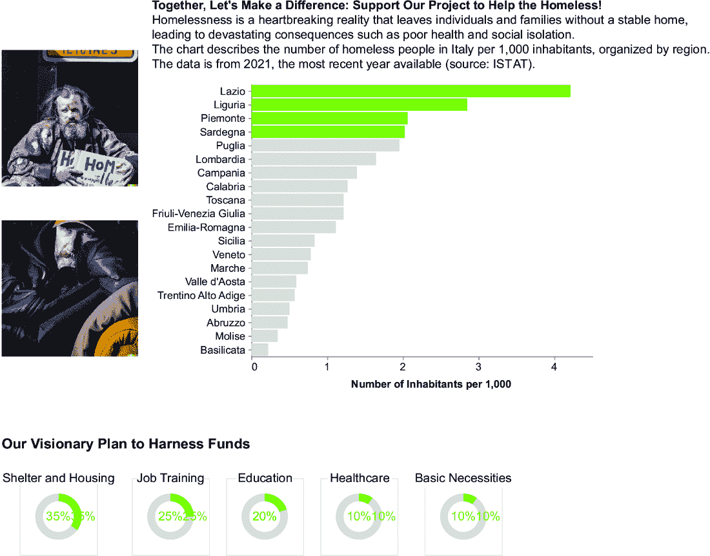

##### 图 5.14 无家可归故事的最终图表

## 5.3 将生成式 AI 融入 DIKW 金字塔

正如我们在第四章中讨论的，生成式 AI 可以帮助我们更进一步，通过使创建复杂和逼真的计算机生成内容成为可能，从而改变各个行业和领域。现在，有了这些知识，我们可以利用生成式 AI 的能力来增强人类创造力并自动化内容生成过程。

图 5.15 显示了我们可以将生成式 AI 工具融入 DIKW 金字塔的每个步骤：

+   *洞察提取* — 使用生成算法自动化构建图表的代码生成。

+   *添加背景* — 使用文本生成将基本文本转换为更吸引观众的文本。添加由 AI 生成的图像、声音和视频，为观众提供额外的背景信息。

+   *行动号召* — 使用文本生成来提出新想法和吸引人的文本。

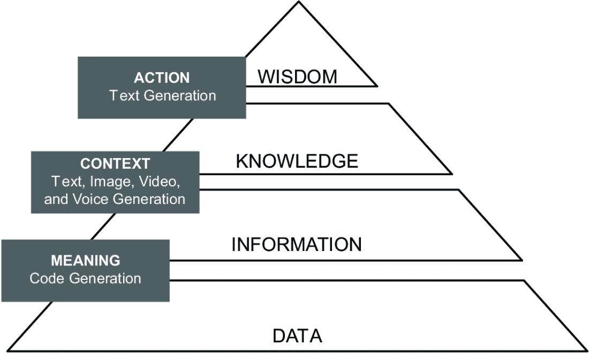

##### 图 5.15 我们如何将生成式 AI 工具融入 DIKW 金字塔

重要的是要注意，列出的例子只是你可以将生成式 AI 融入 DIKW 金字塔的几种方式之一。还有无数其他方式可以利用这些工具，例如综合大量数据、开发个性化的预测模型，以及根据数据构建个性化的推荐。然而，在这本书中，我们将专注于将生成式 AI 融入 DIKW 金字塔的技术，因为它有助于构建数据故事。无论如何，我鼓励你跳出思维定式，探索将生成式 AI 应用于工作中的新方法和创新方式。随着如此多的潜力等待被解锁，可能性确实是无限的！现在，你已经学会了如何将生成式 AI 工具融入 DIKW 金字塔，让我们将这种策略应用于我们的案例研究：无家可归者的故事。

## 5.4 背后故事：无家可归者的故事

在前面的章节中，你看到了如何使用 GitHub Copilot 生成构建图表的代码。现在，是时候更进一步了。

再次考虑无家可归者的故事，特别是图 5.12。该图包含一个标题，定义了行动号召；一个副标题，设定背景；以及两张照片，增加了背景信息。虽然你可能认为我们提出了标题并创建或下载了图像，但实际上是 ChatGPT 和 DALL-E 共同合作生成内容！让我们看看我们是如何使用 ChatGPT 生成副标题以及 DALL-E 生成照片的。在接下来的章节中，我们将看到如何使用更深入的生成式 AI 工具进行数据叙事。

### 5.4.1 创建引人入胜的副标题

我们与 ChatGPT 进行了一次对话，以提取描述无家可归者生活状况的可能情境。这个情境应该是一个简短且引人入胜的句子。图 5.16 展示了对话中涉及的步骤。"Q"代表用户问题（这些将成为我们提示的基础），而"A"代表 ChatGPT 的回答。您可以在 05/genAI/SubtitleConversation.txt 中阅读完整的对话。


##### 图 5.16 生成用于情境的文本的步骤

ChatGPT 在四个步骤后生成了文本。我们使用了以下策略来让 ChatGPT 生成所需的文本：

1.  *描述* — 要求 ChatGPT 一般性地描述您的问题。在这种情况下，要求 ChatGPT 一般性地描述无家可归的状况。作为回答，ChatGPT 生成了一段长文本。

1.  *缩短* — 要求 ChatGPT 对生成的文本进行摘要。

1.  *转换* — 要求 ChatGPT 使摘要对观众更具吸引力。

1.  *缩短* — 如果文本仍然很长，要求 ChatGPT 进一步缩减。

在没有意识到的情况下，我们将 DIKW 模型应用于 ChatGPT 的使用。从一段长文本（数据）开始，我们提取了信息（摘要），然后将其转化为知识和智慧（引人入胜的文本）。换句话说，当您与 ChatGPT 生成情境时，将对话组织成一个故事（图 5.17）。


##### 图 5.17 数据故事结构与 ChatGPT 对话生成情境之间的映射

您可以将描述的过程推广到生成各种可能的副标题，然后选择适合您需求的那个。此外，您还可以添加特定的关键词，这有助于吸引目标受众并提高文本的可见性。我们将在第六章中看到如何将关键词添加到 ChatGPT 对话中。

### 5.4.2 生成图像

在您的图表中添加一张或多张图片或照片可以帮助给图表的主题赋予一个面孔。然而，图片常常受到版权保护，这意味着在没有获得所有者许可的情况下使用它们可能会导致法律后果。我们可以使用 DALL-E 和其他 AI 工具来创建独特且不受版权限制的图像。

在关于无家可归者的图表中，我们添加了两张代表无家可归者的照片。我们使用以下简单的提示来生成 DALL-E 的照片："一张无家可归者的照片"。DALL-E 生成了四张图片，我们选择了其中两张（图 5.18）。在第六章中，我们将看到更多高级的图像生成技术。

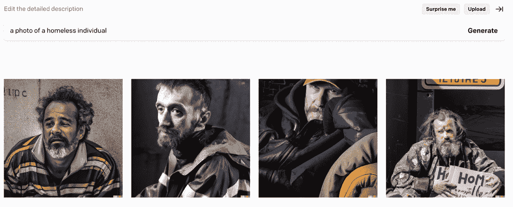

##### 图 5.18 当提示 DALL-E 展示无家可归者照片时生成的照片

现在您已经学会了如何使用生成式 AI 工具将您的原始数据可视化图表转换为数据故事，让我们来看另一个例子，以巩固这些概念。

## 5.5 另一个例子：假新闻

想象一下 LatestNews 是一个重要的网站，它发布来自不同贡献者的新闻。在某个时刻，主编收到了不同读者的投诉，因为他们阅读了大量的虚假新闻。主编联系你分析 LatestNews 网站上的虚假新闻数量，并建议网站编辑注意那些最有可能为虚假的新闻类别。你已经收集了数据，并且你有表 5.2 所示的数据集。

##### 表 5.2 示例数据集的摘录

| 类别 | 虚假文章数量 | 文章总数 |
| --- | --- | --- |
| 政治  | 1,235  | 1,300  |
| 经济  | 1,456  | 1,678  |
| 司法  | 300  | 570  |
| 宗教  | 30  | 100  |

数据集显示了每个新闻类别的虚假新闻故事数量和文章总数。你首先绘制一个初步图表，注意每个类别的虚假文章百分比。图 5.19 显示了初步图表，列表 5.7 显示了相关的代码。你还可以在 GitHub 仓库的 CaseStudies/fake-news/raw-chart.py 下找到该代码。

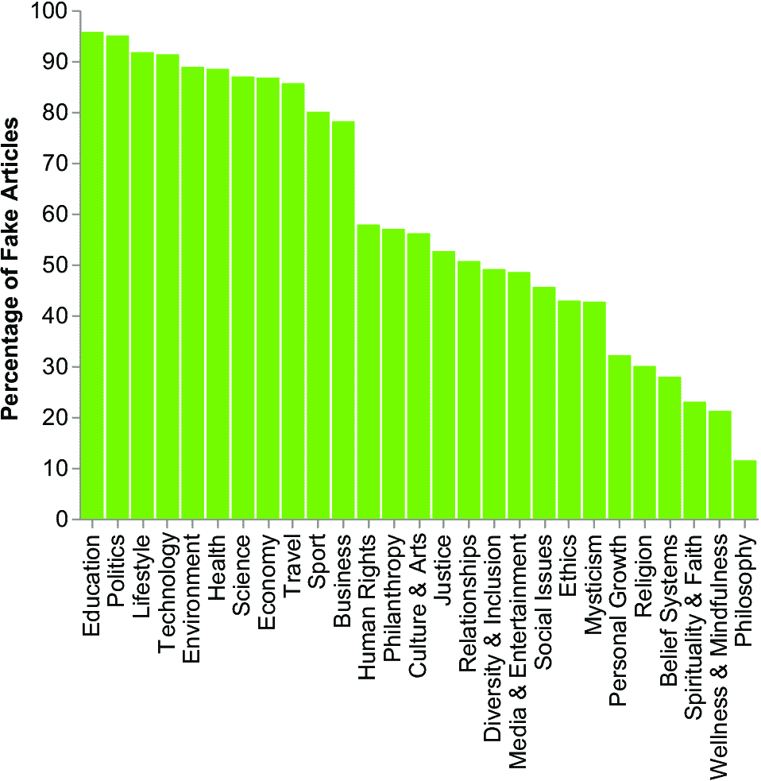

##### 图 5.19 显示按类别划分的虚假文章数量的原始图表

##### 列表 5.7 构建原始图表

```py
import pandas as pd
import altair as alt

# Load the dataset data/fakenews.csv.
df = pd.read_csv('data/fakenews.csv')

# Create a column chart of the number of articles per category:   #1
# - Use the `Category` column for x channel.
# - Use the `Number of Articles` for y channel.

chart = alt.Chart(df).mark_bar(
    color='#81c01e'
).encode(
    x=alt.X('Category:N', 
            sort='-y',
            title=None,
            axis=alt.Axis(labelFontSize=14)
            ),
    y=alt.Y('Percentage of Fake Articles:Q',
            axis=alt.Axis(labelFontSize=14, titleFontSize=14)
            )
).properties(
    width=400,
    height=300
).configure_axis(    #2
    grid=False        #3
).configure_view(
    strokeWidth=0
).transform_calculate(
    'Percentage of Fake Articles', alt.datum['Number of Fake Articles']/alt.datum['Number of Articles']*100
)

chart.save('raw-chart.xhtml')
```

#1 使用 Copilot 注释来加速图表生成过程

#2 使用 configure_axis()配置轴的一般属性

#3 完全移除网格

注意：使用`transform_calculate()`动态向 DataFrame 添加新列。此方法接收新列名称作为第一个参数（例如，虚假文章百分比）和计算新列的表达式作为第二个参数。

在本节的剩余部分，我们将应用 DIKW 金字塔将图表转化为数据故事。让我们从第一步开始：将数据转化为信息。

### 5.5.1 从数据到信息

将数据转化为信息意味着从数据中提取一些洞察，这种洞察是重要的，有助于你的编辑听众理解哪种新闻最有可能为虚假。让我们尝试旋转策略。这种策略最初由 Berengueres 在他的先前引用的书中描述，涉及旋转图表以获得金字塔，并寻找一些金字塔框架，如道德、经济和其他类似框架。图 5.20 显示了旋转过程。

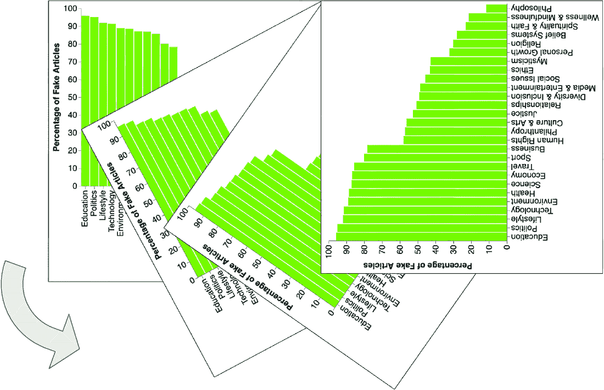

##### 图 5.20 图 5.19 中图表的旋转过程

接下来，我们可以水平翻转图表，得到图 5.21 中的图表，并修正了标签。你还可以直接重写 Altair 代码来绘制柱状图而不是条形图（代码在 GitHub 仓库的 CaseStudies/fake-news/bar-chart.py 下）。我们更喜欢展示旋转过程而不是直接绘制图表，以展示旋转策略是如何工作的。

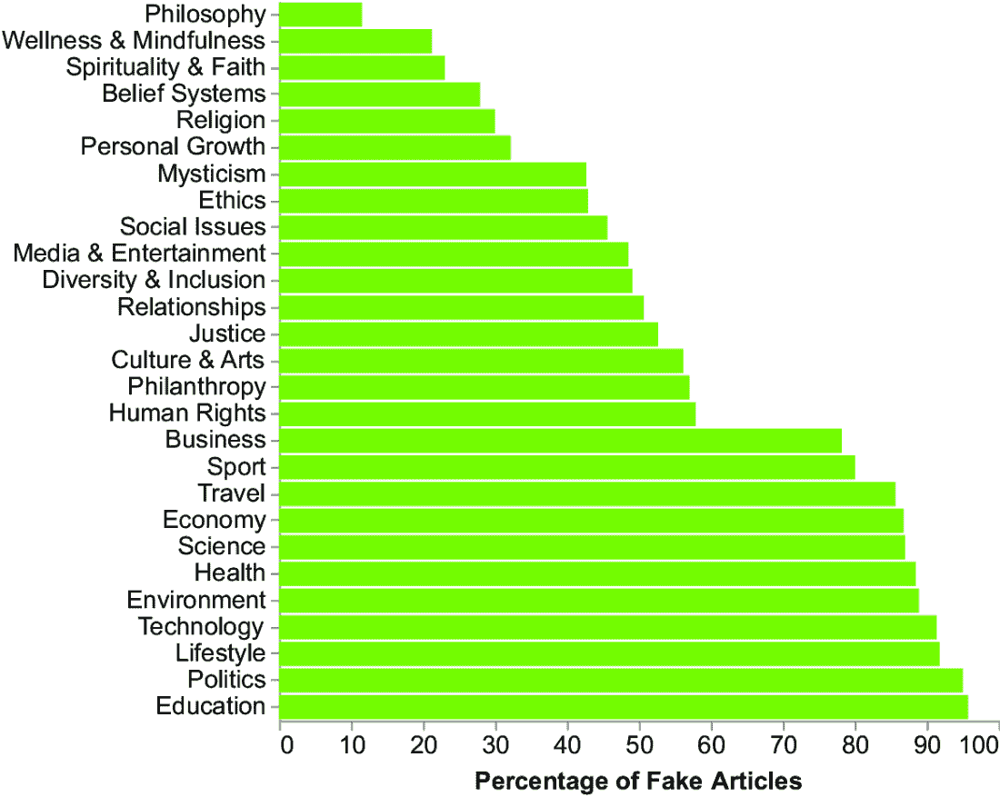

##### 图 5.21 旋转过程，水平翻转图 5.19 中的图表

如果你仔细查看标签，可能会注意到在金字塔底部有与物质生活相关的类别（从教育到商业）。在金字塔的中间有与道德生活相关的类别（从人权到伦理）。在金字塔的顶部有与精神生活相关的类别（从神秘主义到哲学）。这意味着大多数假新闻都与物质生活（超过 70%）和道德生活（超过 30%的假新闻但不到 60%）相关。你可以在图表中根据新闻所属的不同宏类别使用不同的颜色来突出模型物质-道德-精神生活。

首先，使用 Copilot 生成宏类别列表，如列表 5.8 和 GitHub 仓库中书籍的 CaseStudies/fake-news/story-chart.py 所示。列表仅显示了如何生成物质生活宏类别，但你也可以应用相同的策略来处理其他宏类别。

##### 列表 5.8 使用 Copilot 生成列表

```py
# Build a Python list with the following categories and name it material_life:
# Technology
# Environment
# Health
# Science
# Education
# Business
# Lifestyle
# Travel
# Politics
# Economy
# Sport

material_life = ['Technology', 'Environment', 'Health', 'Science', 'Education', 'Business', 'Lifestyle', 'Travel', 'Politics', 'Economy', 'Sport']    #1
```

#1 Copilot 生成的输出

注意：描述要包含在列表中的元素。

现在，让 Copilot 生成代码，向 DataFrame 添加一个包含宏类别的新的列。以下列表显示了 Copilot 的指令。

##### 列表 5.9 使用 Copilot 向 DataFrame 添加新列

```py
# Add a new column to the dataframe df called Macro Category that contains the following values:
# - If the Category is in material_life, then the value is Material Life.
# - If the Category is in moral_life, then the value is Moral Life.
# - If the Category is in spiritual_life, then the value is Spiritual Life.

df['Macro Category'] = df['Category'].apply(lambda x: 'Material Life' if x in material_life else ('Moral Life' if x in moral_life else 'Spiritual Life')) #1
```

#1 Copilot 生成的输出

注意：描述如何构建 DataFrame 的新类别。

接下来，使用新的“宏类别”列来设置图表中条形的颜色。

##### 列表 5.10 使用新列为条形颜色设置

```py
chart = alt.Chart(df).mark_bar(
).encode(
    y=alt.Y('Category:N', 
            sort='x',
            title=None,
            axis=alt.Axis(labelFontSize=14)
            ),
    x=alt.X('Percentage of Fake Articles:Q',
            axis=alt.Axis(labelFontSize=14, 
                          titleFontSize=14),
    ),
    color=alt.Color('Macro Category:N',
                    scale=alt.Scale(
                        range=['#991111', '#f38f8f','lightgray'],
                        domain=['Material Life', 'Moral Life', 'Spiritual Life']
                    ),
                    legend=None
            )
).properties(
    width=400,
    height=400
).transform_calculate(
    'Percentage of Fake Articles', alt.datum['Number of Fake Articles']/alt.datum['Number of Articles']*100
)
```

注意：添加颜色通道以设置条形的颜色。

图 5.22 显示了生成的图表。我们使用了两种色调的红来突出关注物质生活和道德生活的紧迫性。

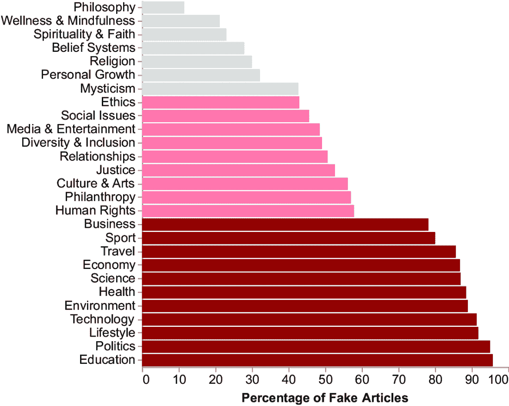

##### 图 5.22 显示了带有宏类别高亮的图 5.21 图表

我们可以通过简化图表来改进它，例如，通过分组类别。然而，我们的受众是专家（编辑），他们需要非常详细的信息，因为他们必须确切知道他们必须深入分析的类别。因此，我们保持图表非常详细。我们已经从图表中移除了图例，因为我们想用一些图像来替换它，这些图像也充当我们故事的环境。让我们看看如何在下一步中添加这些图像：将信息转化为知识。

### 5.5.2 从信息到知识

想法是为每个宏类别添加一个图像，更具体地说，是一个图标。我们可以使用 DALL-E 生成三个图像。使用以下提示生成精神生活图标：黑白祈祷手势的图标。DALL-E 将生成四个图像，如图 5.23 所示。


##### 图 5.23 与精神生活相关的 DALL-E 生成的图像

类似地，你可以生成与其它类别相关的图标。我们使用了以下提示：

+   *一个黑白图标，代表道德生活的平衡符号*

+   *一个黑白图标，以圆形代表世界*

如果你没有想法如何生成图像，可以使用 ChatGPT 来获取一些想法。例如，你可以在 ChatGPT 中写下以下提示：*你将如何通过图标来代表物质生活？* 在其他建议中，ChatGPT 建议以下：*一个代表世界或宇宙的圆形，其中包含各种较小的图标或符号，以代表物质生活的不同方面。*

一旦生成了图像，你就可以将其合并到图表中。以下列表描述了如何添加精神生活的图像。你也可以采用相同的策略来处理其他图像。同时，记得在 Web 服务器上加载生成的 HTML 图表。

##### 列表 5.11 向图表添加图标

```py
spiritual_image = alt.Chart(
    pd.DataFrame({'image_url': ['media/spiritual-life.png']})
).mark_image(
    width=80,
    height=80,
).encode(
    url='image_url',
    x=alt.value(270),  # pixels from left
    y=alt.value(50)
)           #1
```

#1 向图表添加图像。

注意：根据图表显示情况，手动校准 x 和 y 位置。

在图标附近添加描述宏观类别的文本。

##### 列表 5.12 向图表添加文本

```py
spiritual_text = alt.Chart(
    pd.DataFrame({'text': ['Spiritual Life']})
).mark_text(
    fontSize=30,
    color='black',
    align='center',
    baseline='middle',
    font='Monotype',
    fontStyle='italic'
).encode(
    x=alt.value(420),  # pixels from left
    y=alt.value(50),
    text='text'
)
```

注意：根据图表显示情况，手动校准 x 和 y 位置。

最后，合并所有图表。

##### 列表 5.13 合并图像、文本和图表

```py
chart = chart + spiritual_image  + spiritual_text + moral_image + moral_text + material_image + material_text

chart = chart.configure_axis(
    grid=False
).configure_view(
    strokeWidth=0
)
chart.save('story-chart.xhtml')
```

注意：使用+运算符组合图表的所有元素

图 5.24 显示了生成的图表。图标和文本充当图例。此外，它们是我们故事的角色。

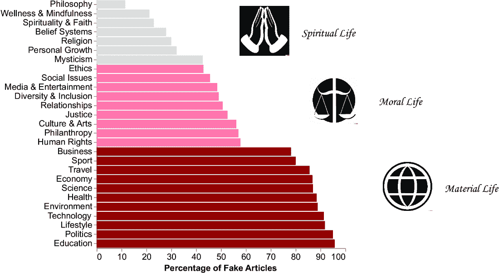

##### 图 5.24 向图表添加与精神生活、道德生活和物质生活相关的图像

下一步涉及向我们的图表添加文本背景并设置上下文。我们可以将其作为图表的副标题。让我们使用 ChatGPT 来生成一些想法。写下以下提示：

*扮演一个讲故事的人。描述一个视觉图表的上下文，显示在 LatestNews 网站上，虚假新闻数量最多的是与物质生活相关，其次是道德生活，最后是精神生活。请使用最多 150 个字符。*

我们指定了三个主要元素：

+   ChatGPT 的角色（我们将在下一章中更详细地介绍）

+   场景

+   可使用的最大字符数

ChatGPT 可能会产生以下输出：*在引人入胜的图表中，描绘 LatestNews 网站上虚假新闻的趋势，物质生活占据了最显眼的份额，其次是道德生活，最后是精神生活。我们可以直接使用它，也可以对其进行修改，甚至可以要求一个新的副标题。在我们的情况下，我们将使用这个输出作为图表的上下文。*

让我们通过简单地在图表属性中设置副标题来将其添加到我们的图表中。

##### 列表 5.14 向图表添加副标题

```py
chart = chart.properties(width=500,title=alt.TitleParams(
    subtitle=['The LatestNews website is a popular source of news and information, but it is also a source of fake news.'],
    subtitleFontSize=18,
    fontSize=30,
    offset=40
))
```

注意：使用`TitleParams()`指定标题和副标题参数。

现在我们已经将信息转化为知识，接下来进行最后一步：将知识转化为智慧。

### 5.5.3 从知识到智慧

智慧在于在故事中添加一个行动号召。在我们的例子中，我们可以简单地告诉观众注意物质和道德新闻，因为它们有很高的虚假新闻比例。让我们使用 ChatGPT 生成一个吸引人的标题。使用以下提示：*将以下文本转换为一个吸引人的标题：注意物质和道德新闻，因为它们有很高的虚假新闻比例。生成 5 个标题.* 图 5.25 显示了 ChatGPT 可能生成的输出。


##### 图 5.25 ChatGPT 生成的一个可能输出

生成的标题不包含行动号召。为了添加它，让我们通过为 ChatGPT 编写以下新提示来改进标题，在同一聊天中：*将标题转换为行动号召，邀请观众关注与物质和道德生活相关的新闻*。图 5.26 显示了 ChatGPT 可能生成的输出。


##### 图 5.26 当被要求添加行动号召时，ChatGPT 生成的一个可能输出

例如，选择第三个标题，*你的真理守护者：在物质和道德叙事中对抗虚假新闻*，并将其添加到图表中，只需设置文本参数，如以下列表所示。图 5.27 显示了最终的图表。

##### 列表 5.15 向图表添加标题

```py
chart = chart.properties(width=500,title=alt.TitleParams(
    text=['Your Truth Guardian:', 'Take a Stand Against Fake News in Material and 
↪ Moral Narratives'],
    subtitle=['The LatestNews website is a popular source of news and information, but it 
↪ is also a source of fake news.'],
    subtitleFontSize=18,
    fontSize=30,
    offset=40)
)
```


##### 图 5.27 最终的图表

注意：使用`text`参数向图表添加标题。

在本章中，你已经学习了使用 DIKW 金字塔构建数据故事的主要概念以及如何将生成式 AI 工具融入流程中。我们已经对将 DIKW 金字塔作为我们数据故事的一部分以及融入生成式 AI 工具以进一步增强内容进行了高级概述。在接下来的几章中，我们将更详细地探讨穿越 DIKW 金字塔，首先从*数据*转向*信息*。

## 摘要

+   *故事*是一个吸引其观众以传达信息并促使他们采取行动的叙述。

+   *数据故事讲述弧*确定了故事中的五个时刻：背景、激发兴趣、主要观点、观众思考以及下一步行动。

+   使用 DIKW 金字塔来实际实施数据故事讲述弧。

+   使用生成式 AI 来协助你在扩展 DIKW 金字塔时，通过提示生成你想要的内容（文本或图像）。

## 参考文献

+   Dykes, B. (2019). *有效数据故事讲述：如何用数据、叙事和视觉驱动变革*。John Wiley & Sons。

+   剑桥词典。 (n.d.). *故事*。[`dictionary.cambridge.org/dictionary/english/story`](https://dictionary.cambridge.org/dictionary/english/story)。
