# 6 从数据到信息：提取洞察

### 本章涵盖

+   介绍洞察

+   选择故事的角色

+   选择合适的图表

一个*洞察*是在数据中具有显著性的东西——一些你希望通过故事来传达的东西。从数据中提取洞察是每个数据分析师必须应对的最困难的任务。在前几章中，你学习了要将数据转化为信息，你必须从数据中提取洞察。你也学习了洞察是在你的数据中找到的相关内容。在这本书中，我们将不会专注于如何从数据中提取洞察。关于这个主题有大量的书籍，你可以参考它们以获得详细的描述（例如，参见 Guja 等，2024 年；De Mauro 等，2021 年）。在这一章中，我们将采用更基于直觉的方法来提取洞察，描述你在探索数据时的指导动机。我希望这种方法能帮助你拓宽数据分析旅程中的视野。因此，本章的目标是理解在 DIKW 金字塔的底层，是洞察的提取，将其转化为故事的角色，并通过图表来表示。首先，我们将关注如何使用直觉方法从数据中提取洞察。接下来，我们将描述如何选择数据故事的角色以及如何选择合适的图表。故事角色和合适的图表有助于将你的洞察传达给听众。最后，你将学习如何在 Altair 中实现一些最受欢迎的数据可视化图表。我们将利用 Copilot 的力量来加速图表构建过程，并提供实现整洁图表的代码，以便将其添加到数据故事中。

## 6.1 提取洞察的直觉方法

在儒勒·凡尔纳的《地球中心之旅》一书中，奥托·利登布鲁克教授（1864 年）通过运用他敏锐的智力和对探索的热情，仔细地从一份中世纪冰岛手稿中提取信息。凭借对语言、历史和地质的深刻理解，他解读了神秘的线索，交叉引用古代文本，并应用科学知识来揭示页面中隐藏的秘密。手稿提供了关于旅程路线和他们在途中可能遇到的地质标志的细节。换句话说，奥托·利登布鲁克教授将古老手稿中的数据转化为信息。

与儒勒·凡尔纳讲述的故事相似，你可以从将数据转化为信息开始，来讲述任何数据故事。在本节中，我们将描述一些可以帮助你将数据转化为信息的策略。

在他的书《看到别人看不到的东西》（Klein，2017 年）中，Gary Klein 确定了四种主要策略来帮助你识别洞察：

+   联系

+   偶然事件

+   好奇心

+   矛盾

让我们分别分析这四种提出的策略，首先是：连接。请记住，你可以同时应用多种策略。

### 6.1.1 连接策略

此策略涉及识别数据的主要点，然后将它们连接起来以识别一个故事。在书中，克莱因说，有时当你看到以新的方式组合不同数据的方式时，你会提取到一个洞见。有时，你只需以不同的方式查看你已有的数据，就可以提取到一个洞见。为了解释连接策略是如何工作的，考虑以下场景。安吉丽卡是一位为电子商务网站工作的数据分析师。有一天，安吉丽卡收到了一份关于网站上每个产品的客户评论和评分的报告。每个产品都是按 1 到 5 的比例评分的，并且客户可以留下文本评论。表 6.1 显示了安吉丽卡必须分析的销售数据集。

##### 表 6.1 安吉丽卡分析的销售数据集

| **`product_id`** | **`number_of_orders`** | **`product_rating`** | **`product_category`** | **`returns`** | **`number_of_reviews`** |
| --- | --- | --- | --- | --- | --- |
| P1001  | 30  | 4.5  | 电子产品  | 0  | 3  |
| P1002  | 12  | 3.2  | 家居与厨房  | 6  | 6  |
| …  | …  | …  | …  |  | …  |
| P1006  | 24  | 4.2  | 电子产品  | 0  | 4  |
| P1006  | 22  | 2.1  | 电子产品  | 18  | 20  |

这里是对数据集列的解释：

+   `product_id`—数据集中每个产品的唯一标识符。

+   `number_of_orders`—特定产品被订购的次数。

+   `product_rating`—客户或用户为每个产品分配的评分。评分可以是按比例（例如，1 到 5 星）的，并反映产品的满意度或感知质量。

+   `product_category`—此列将产品分类到不同的组或类型。

+   `returns`—客户退货产品的次数。这提供了对客户不满率或导致退货的产品问题的洞察。

+   `number_of_reviews`—每个产品收到的评论数量。

安吉丽卡首先绘制了产品评分与评论数量以及产品评分与退货百分比的关系图（图 6.1）。你可以在这个书的 GitHub 仓库下的 06/connections 找到这个例子。

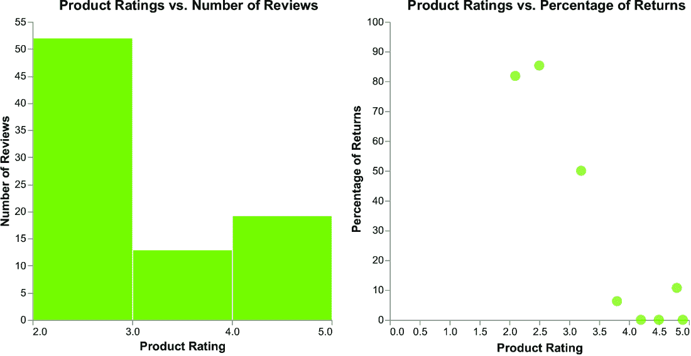

##### 图 6.1 安吉丽卡绘制的图表

安吉丽卡发现了以下主要点：

+   一些产品评分高但评论相对较少。

+   其他产品评分较低但评论数量较多。

安吉丽卡通过她的直觉将点连接起来，发现负面评论与高退货率相关。这可能会损害整体客户体验和品牌声誉。

之前的例子表明，一旦我们确定了“点”，提取洞察力只是将它们连接起来。然而，这个策略的主要问题在于识别“非点”，或者说无关的信息。在之前的场景中，一个非点的例子是产品类别与产品评分。

### 6.1.2 巧合策略

巧合是指由于随机性同时发生的事件，尽管它们似乎有一些联系——两个或多个表面上看似重要的情况的意外汇聚，即使它们可能是不相关的。巧合的范围可以从日常事件，比如在意想不到的地方遇到某人，到看似极不可能的非凡事件。然而，虽然巧合很吸引人，但它们并不一定表明超出了偶然。它们可能是由于它们奇特的对齐而吸引我们注意的罕见或时间安排不寻常的事件。

在他的书《看到别人看不到的东西》中，Gary Klein 说：“观察到一个巧合意味着我们发现了某些事件，它们似乎彼此相关，尽管它们之间似乎没有明显的因果关系。”当你遇到一个孤立的事件，且数据点很少，无法证明两个变量之间关系时，你应该采取怀疑的态度，将其视为巧合（因此忽略它）。另一方面，当事件或趋势在多次场合重复出现时，它们不太可能是巧合，因此值得进一步调查。

要确定一个重复事件是巧合还是不是，你可以用一种故意怀疑的心态来处理数据，忽略孤立的事件，同时寻找长期模式，这些模式可能会表明存在某种关系。相关因素的存在可能表明存在潜在的因果关系。例如，通过分析时间序列数据，你可能会发现某些变量先于重复事件出现，这暗示着因果关系。通过因果关系，你可以区分纯粹的巧合和有意义的联系，解释支配观察现象的机制。

让我们考虑以下例子来解释如何应用巧合策略。想象一下，Angelica 在一家销售电子设备配件的商店工作，例如耳机、USB 线、智能手机壳等等。同时，想象一下 Angelica 想要监控她的订单。她得到了表 6.2 中所示的数据库。

##### 表 6.2 电子商店的销售数据集

| 日期 | 耳机 | USB 线 | 智能手机壳 |
| --- | --- | --- | --- |
| 2023-01-01  | 14  | 34  | 32  |
| 2023-01-02  | 17  | 54  | 45  |
| …  | …  | …  | …  |
| 2023-01-30  | 16  | 34  | 34  |
| 2023-01-31  | 20  | 23  | 5  |

为了简化，数据集包含了 2023 年 1 月份三种产品的订单数量：耳机、USB 线和智能手机壳。图 6.2 展示了数据集的视觉表示。您可以在书的 GitHub 仓库下的 06/coincidences 找到完整的代码（https://mng.bz/lMmy）。


##### 图 6.2 电子商店订单，重点关注耳机

该图突出了耳机订单。值得注意的是，耳机订单每周五达到峰值。这可能是一个巧合，但事件的重复性应该被考虑。例如，安吉丽卡可能会发现每周五都有一个令人兴奋的广播节目，导致人们争相购买新的耳机。或者她可能会发现她所在的城市周五有一条法律，不允许打开扬声器。无论如何，这种事件的重复性需要进一步分析。

观察图 6.2 的 x 轴，您会发现一个奇怪的标签策略：首先，年份；然后是工作日；最后是月份。这是 Altair 的默认日期标签。您可以在 Altair 官方文档中了解更多关于如何格式化日期的详细信息（https://mng.bz/lMmy）。

碰巧洞察与联系洞察在发现方式上有所不同。在联系洞察中，我们关注重要细节，而在碰巧洞察中，我们关注重复事件。此外，当您有聚合度量时，联系是有帮助的，而巧合最好应用于像随时间变化的原始销售数字这样的东西。

### 6.1.3 好奇心

在 1928 年，苏格兰细菌学家亚历山大·弗莱明爵士在研究葡萄球菌细菌时发现了青霉素。有一天，当他仔细检查装满这些微生物的平板时，他注意到一些奇怪的现象。一个不小心被留下的平板被霉菌污染了。弗莱明对这种意想不到的情况感到好奇，他仔细检查了平板。令他惊讶的是，他观察到霉菌周围的细菌正在逐渐恶化。霉菌释放出的某种物质正在击败它们。出于好奇心，弗莱明开始了一系列实验来探索这一现象。他小心地隔离了霉菌并提取了它产生的物质，他将其命名为青霉素。好奇心促使弗莱明进一步调查这个问题，最终导致了青霉素的发现，这是世界上第一种抗生素，拯救了无数生命，并永远改变了医学。

好奇心是一种推动力，它能激发惊奇，推动发现，并激发创新，推动我们质疑、寻求答案，并扩展知识的边界。好奇心是我们可以应用来提取洞察力的一种策略。对数据的兴趣可能由各种现象触发，包括异常值、缺失数据、时间或空间上的数据缺口、突然的变动或趋势、意外的模式等等。当我们注意到数据中的奇怪之处时，我们会深入挖掘，提出问题，并探索导致观察到的模式的潜在因素。这种好奇心驱使我们从不同的角度分析数据，揭示隐藏的洞察力，并最终对现象有更深入的理解。

让我们考虑以下例子来解释我们如何应用好奇心策略。再次考虑前一小节中电子设备的例子。现在，想象一下你有 3 月份的不同趋势线，如图 6.3 所示。

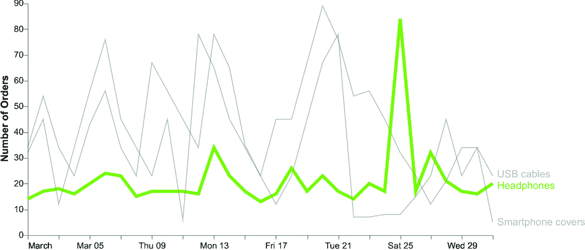

##### 图 6.3 3 月份的电子产品订单，重点关注耳机

该图显示了 3 月 25 日的销售高峰。这一事件可能会引起一些好奇心，促使我们进行进一步调查。好奇心可以帮助我们在头脑风暴过程中。例如，它可能引导我们寻找可能促成这一波峰的各种因素，如营销努力、特别促销或外部事件。随着我们继续研究，好奇心可能会促使我们添加其他因素，如这一时期的客户人口统计。这项调查不仅会满足我们的好奇心，还会帮助我们提取洞察力。

### 6.1.4 矛盾

*矛盾*是指两种或更多信念或证据冲突的情况，从而产生不一致性。根据加里·克莱因的说法，要从矛盾中提取洞察力，你必须以怀疑的心态处理数据。与基于巧合的方法不同，我们寻找重复的事件，而在基于矛盾的战略中，我们寻找看似冲突的事件。从矛盾中提取的洞察力可以颠覆传统思维，挑战既定观念，并提供促进创造性问题解决的替代视角。通过接受矛盾中的内在张力，你可以获得宝贵的洞察力，从而实现突破、创新和增长。

考虑图 6.4，展示了随着时间的推移产品销售和价格。您可以在本书的 GitHub 仓库下的 06/contradictions 找到生成的图表代码。

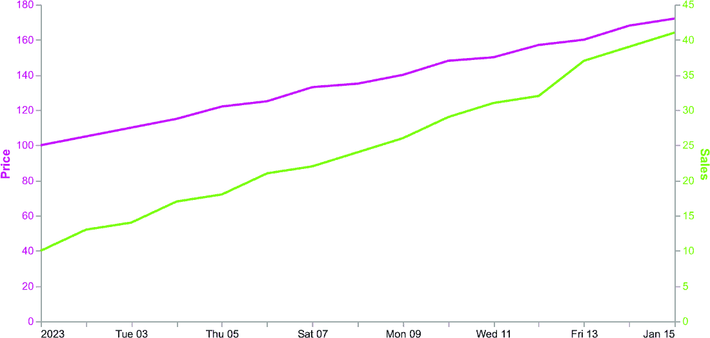

##### 图 6.4 展示产品销售和价格的图表

图表显示，价格上涨与销售额增加相对应。这一现象相当矛盾，因为普遍的假设是价格上涨应该与销售额下降相对应。然而，为了理解这一现象，你可以戴上怀疑的透镜，更深入地分析这一矛盾现象。你可能发现的一个可能动机是感知价值。当价格上涨时，顾客可能会认为你的产品更独特、高质量或更受欢迎。这种增加价值的感知可以使顾客愿意支付更多，从而导致销售额增加。另一种解释可能是消费者的紧迫感。消费者可能担心错过产品，认为更高的价格意味着稀缺或供应有限。另一个原因可能是通货膨胀。在通货膨胀的背景下，当价格上涨时，人们可能会因为担心价格会进一步上涨而购买更多，从而使产品变得难以获得。

所有的策略、联系、巧合、好奇心和矛盾都定义了一些可能的技巧来提取意义。无论你采取哪种方法，都要始终依靠你的经验和深入的探索性分析阶段来从数据中提取意义。现在你已经学会了如何从数据中提取洞察力，让我们继续探讨如何选择故事的角色。

## 6.2 选择故事的角色

在电影《印第安纳·琼斯与圣战奇兵》中，印第安纳·琼斯，一位杰出的考古学家，踏上了一场惊心动魄的冒险之旅，追寻着一件古老的圣物——约柜。故事背景设定在 20 世纪 30 年代，印第安纳与时间赛跑，试图在纳粹分子将其据为己用之前找到这个神圣的遗物。这部电影以及印第安纳·琼斯系列的其他电影都是引人入胜的故事的例子，其中英雄渴望得到某物。

每个故事都是从英雄渴望得到某物开始的。没有英雄和要实现的目标，就没有故事。在数据故事中也应该是这样。虽然“英雄”这个词可能过于夸张，用来定义我们故事的主题，然而，在我们的情况下，我们确实想强调数据故事与真实故事之间的相似性。在任何故事中，总有一个英雄与主要角色相对应。我们的想法是将要被代表的主题看作是我们故事中的英雄，即使它只是一个简单的产品。采用这种观点，构建故事也会更容易：

+   **每个数据故事都应该有一个** **英雄**。这可能是一个产品、一个客户，或者任何其他东西。

+   **英雄必须** **渴望得到某物**。这可能是一个销售增长、满意度提高，或者其他任何东西。

请记住，故事中的英雄不是你自己。英雄是你的数据故事的主要主题。它取决于你提取的洞察力。英雄的例子包括人、物和地方。

一旦你确定了故事中的英雄，下一步就是向观众提出以下问题：*英雄会得到他们想要的吗？* 在他的书中，《构建故事品牌：明确你的信息，让客户愿意倾听》（2017），唐纳德·米利根说：“在知道英雄想要什么之前，观众对她命运的兴趣很小。这就是为什么编剧必须在电影开始的前九分钟左右定义角色的抱负。”

除了有一个英雄之外，你的故事还应该至少有两个其他角色：向导和对手。向导通常是一位聪明而有经验的导师，帮助英雄实现他们的目标。对手可以是

+   一个试图阻碍或反对英雄进步的竞争者

+   一个比较角色，它允许你衡量英雄的进步

+   在不同的时间（例如，将英雄现在的状况与一年前进行比较）或不同的空间（例如，将这里的英雄与其他地点进行比较）的同一英雄

让我们回顾前几章中看到的所有例子，并确定每个故事中的英雄。为了方便起见，图 6.5 总结了分析的例子。尝试搜索每个例子中的英雄、英雄类型、英雄想要什么和对手。

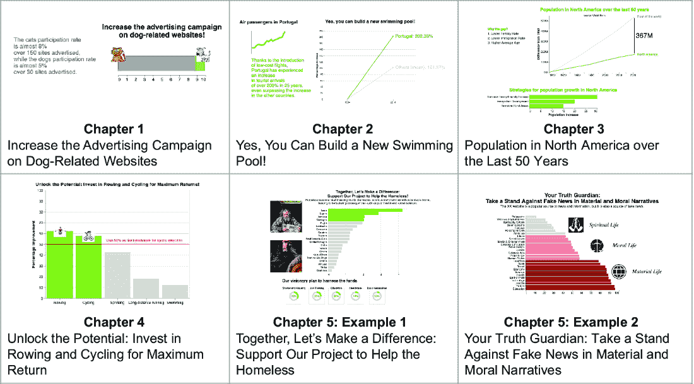

##### 图 6.5 总结了前几章中描述的所有例子

表 6.3 显示了图 6.5 中每个案例研究的英雄和对手。对于每个案例研究，表格还显示了英雄的类型和英雄想要什么。在第二章的例子——“是的，你可以建造一个新的游泳池！”中，存在这样的隐含假设：游客到访量的增加与建造新游泳池的可能性相对应。这显然是一个简化的假设，但我们简化了这个例子只是为了开始，并展示 DIKW 金字塔是如何工作的。

##### 表 6.3 前几章分析的案例研究的英雄和对手

| 案例研究 | 英雄 | 英雄类型 | 英雄想要什么 | 对手 |
| --- | --- | --- | --- | --- |
| 第一章：增加与狗相关的网站的广告活动 | 与狗相关的网站 | 事物 | 增加观看次数 | 与猫相关的网站 |
| 第二章：是的，你可以建造一个新的游泳池！ | 葡萄牙游客到访流量 | 流程 | 游客到访量的增加 | 德国游客到访流量 |
| 第三章：过去 50 年北美的人口 | 北美人口 | 人们 | 解释趋势 | 世界其他地区的人口 |
| 第五章，示例 1：一起，让我们做出改变：支持我们的项目以帮助无家可归者 | 拉齐奥、皮埃蒙特、利古里亚和撒丁岛的无家可归者人数 | 人们 | 减少这个数字 | 其他意大利地区的无家可归者人数 |
| 第五章，示例 2：你的真理守护者：在物质和道德叙事中对抗假新闻 | 物质和道德生活的新闻 | 事物 | 确定它们是真实的还是假的 | 精神生活的新闻 |

在表 6.3 中展示的所有示例中，对手总是与英雄不同的角色，尽管它们与英雄属于同一类型。在某些情况下，对手可以是之前条件下的同一英雄，例如过去的产品销售或另一个地理区域内的销售。现在你已经学会了如何选择故事的角色，让我们继续选择适合你的数据故事的正确图表。

## 6.3 选择正确的图表

最佳图表取决于你想展示的洞察力、你想传达的信息以及你针对的受众。图 6.6 展示了洞察力、信息和受众在图表中的相互关系。如果你只考虑洞察力，你的图表效果就是提供信息。

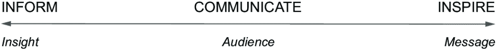

##### 图 6.6 洞察力、受众和信息之间的关系

在讲述故事时，有三个层次：

+   *提供信息*—在这个层面，你描述你在数据中发现的洞察力。与受众没有接触。

+   *传达*—你通过提供关于你的数据的详细信息来涉及受众，但他们在听完你的故事后并没有被激励去做任何事情。

+   *激励*—基于你的数据，你提出一个信息，激励受众去做某事。受众高度参与，并将在其他情境中重述你的故事。

换句话说，如果你只考虑洞察力，你的图表效果就是提供信息。如果你将你的洞察力校准到你的受众，你可以有效地传达它。最后，如果你在你的图表中添加信息，你可以激励你的受众。我们将在本章的剩余部分看到如何展示洞察力，如何在第七章中将图表校准到目标受众，以及如何在第九章中向图表添加信息。

让我们关注如何在图表中展示洞察力。图表的选择由你的具体目标驱动。不同类型的图表根据数据的性质和你要传达的信息有不同的用途。表 6.4 描述了根据你要传达的信息选择哪种图表。请注意，所描述的图表列表并不全面，你可以发挥你的想象力和专业知识来构建新的图表。此外，你可以遵循阿贝拉博士的图表选择器（2020 年；[`mng.bz/DdnE`](https://mng.bz/DdnE)）来选择最适合你的图表。

##### 表 6.4 根据要传达的信息建议的图表

| 要传达的信息 | 描述 | 建议的图表 |
| --- | --- | --- |

| 一条信息 | 代表关键信息的单个数字 | • 大数字（BAN）• 饼图

• 100% 堆积柱状图

• 雪花图

|

| 整体的部分 | 贡献于系统、物体或概念整体性的组成部分。所有组成部分的总和必须是 100%。 | • 饼图 • 100%堆积车图

• 多维饼图

• 饼图

|

| 实体间的比较 | 多个实体之间的相似性和差异性，以建立关系和区分 | • 条形图 • 柱状图

• 斜率图

• 拉力图

• 表格

|

| 趋势 | 实体随时间的变化行为 | • 折线图 • 小多折线图

• 堆积面积图

• 堆积柱状图

|

| 调查或问卷的结果 | 调查或问卷中包含的问题的答案 | • 堆积条形图 • 柱状图

• 多维条形图

|

| 分布 | 数据集中值的分布，表示不同值出现的频率 | • 直方图 • 金字塔

• 箱线图

|

| 关系 | 不同实体之间的关联、连接或相关性，用于识别模式、趋势和依赖关系 | • 散点图 • 气泡图

• 热力图

|

| 空间信息 | 实体在空间中的行为 | • 彩色地图 • 点密度图

• 比例符号地图

• 热力图

|

| 流程 | 表示一个过程 | • 沙漏图（不支持 Altair 5.0.1）• 弦图（不支持 Altair 5.0.1）

|

如您从表中可以看到，您可以使用相同的图表用于不同的目的。此外，您可以使用许多不同的图表达到相同的目的。您选择的图表取决于受众，正如我们在第七章中将要看到的。在本节的剩余部分，我们将描述如何在 Altair 和 Copilot 中实现一些最重要的图表，按图表家族分组。

我们将关注以下图表家族：

+   烹饪图表

+   条形图

+   折线图

+   地理地图

+   点图

让我们从第一个家族开始：烹饪图表。您可以在本书的 GitHub 仓库下的第六部分中找到每个图表相关的代码。对于每个图表家族，我们将只展示一个代表性图表。您可以在附录 C 中找到更多图表。

### 6.3.1 烹饪图表家族

“烹饪图表”系列包括饼图和环形图。仅使用此类图表来表示数值。最近，我在社交媒体和网络上看到了对这些图表类型的不合理反对。主要论点是这些图表过于通用，不能正确传达结果。我曾经也是这种情绪的受害者，一度也避免使用这种图表。然后，在一个美好的日子里，在 LinkedIn 上，我读到了布伦特·戴克斯关于重新评估烹饪图表，特别是饼图的帖子([`mng.bz/NRpD`](https://mng.bz/NRpD))。在他的帖子中，戴克斯指出，饼图在表示切片的精确尺寸方面并不出色，但它们确实表示了整体的部分。戴克斯明确表示：“我知道每个人都喜欢规则。‘永远不要使用这种图表类型 ...’，‘总是使用这种图表类型来...’，等等。然而，在数据故事讲述中并不总是这么简单。这不仅仅是如何显示某种类型的数据，而是如何最好地向您的受众传达一个特定的观点。”

按照戴克斯的建议，您可以在三种主要情况下使用烹饪图表：

+   您必须表示整体的一部分。所有切片的总和必须是 100%。

+   最多有两到三个块来表示（如果它们的大小不是非常相似的话；否则，很难确定哪个比其他的大）。

+   您不希望传达数据的细节，而只是提供一个概述。这可能适用于一般受众，不包括技术专家。

在本节的剩余部分，我们将了解如何实现饼图。对于环形图，请参阅附录 C。饼图是一种圆形数据可视化类型，通过将圆分割成若干块来显示数据，每一块代表整体的一个比例或百分比。

假设我们想使用饼图来表示 70%的值。首先，创建一个包含您的数字及其补充值（30%）的 pandas DataFrame。

##### 列表 6.1 包含数字的 DataFrame

```py
import pandas as pd
import altair as alt

data = {
    'percentage': [0.7,0.3], 
    'label'     : ['70%','30%'],  #1
    'color'     : ['#81c01e','lightgray']  #2
}

df = pd.DataFrame(data)
```

#1 要显示的标签

#2 使用中性颜色（浅灰色）表示补充数字。

注意：创建一个包含要表示的数字及其补充值的 pandas DataFrame。

接下来，请 GitHub Copilot 为您绘制图表。饼图没有经典的`x`和`y`通道来编码数据。相反，饼图使用`Theta`和`Color`通道。`Theta`通道指定极坐标图中数据点的角度位置。`Color`通道指的是使用不同颜色来编码数据。

列表 6.2 显示了 GitHub Copilot 的起始提示。

##### 列表 6.2 如何在 Copilot 中生成基本饼图

```py
# Draw a pie chart in Altair with the following options:
# - Use the `percentage` column for theta channel
# - Use the `label` column for tooltip
# - Use the `color` column for color
# Save chart to `chart` variable.
# Save chart as 'pie-chart.xhtml'.
```

注意：Copilot 绘制饼图的基本指令。

因此，Copilot 将生成以下列表中显示的代码。图 6.7 显示了生成的图表。

##### 列表 6.3 生成基本饼图的代码

```py
chart = alt.Chart(df).mark_arc(
).encode(
    theta=alt.Theta('percentage', stack=True),  #1
    color=alt.Color('color', scale=None),
    tooltip='label'
).properties(
    width=300,
    height=300
)
chart.save('pie-chart.xhtml')
```

#1 stack=True 不是由 Copilot 直接生成的。


##### 图 6.7 Altair 中的基本饼图

注意：列表 6.3 是生成 Altair 基本饼图的代码。使用`mark_arc()`方法绘制饼图。我们手动添加`stack=True`属性以进行下一步。这个属性意味着图表内的各个切片将堆叠在一起，而不是并排显示。

我们可以通过在每个切片旁边添加标签来改进图表。要求 Copilot 绘制包含标签的文本，如以下列表所示。

##### 列表 6.4 在 Copilot 中如何给图表添加标签

```py
# Add text near to each slice of the pie chart.
# - Use the `label` column for text channel.
# - Use the `color` column for color.

# Combine the pie chart and the text chart.
# - Use `+` operator to combine the charts.
# - Save the combined chart to `chart` variable.
```

注意：这是 Copilot 生成饼图旁边标签的提示。

因此，Copilot 将生成一些部分代码，这些代码没有显示期望的输出。按照以下列表中的描述进行修改。图 6.8 显示了最终的图表。

##### 列表 6.5 生成标签的代码

```py
text = chart.mark_text( #1
    size = 20, #2
    radius=180 #3
).encode(
    text='label',
    color=alt.Color('color', scale=None)
).properties(
    width=300,
    height=300
)

chart = (chart + text
).configure_view(
    strokeWidth=0    #4
) 
```

#1 Copilot 使用 alt.Chart(df)来绘制图表。请使用 chart 代替。

#2 添加 size 属性来设置字体大小。

#3 添加 radius 来设置切片的距离。

#4 使用 strokeWidth=0 从图表中移除边框。

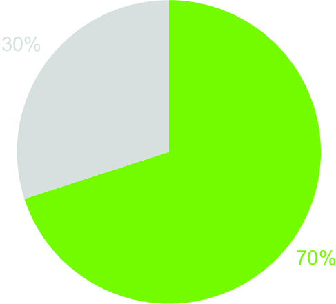

##### 图 6.8 Altair 中的带标签的饼图

注意：列表 6.5 是生成 Altair 基本饼图标签的代码。使用`mark_text()`方法写入文本。

现在你已经学会了如何实现饼图，让我们继续学习下一个图表系列。在接下来的部分，我们将讨论柱状图。

### 6.3.2 柱状图系列

*柱状图*系列包括各种类型的图表，其中每个数据系列都通过矩形条进行可视化。这些条可以是垂直的，称为*柱状图*，或者水平的，称为*条形图*。除了经典的柱状图和条形图之外，这个系列还包括堆叠柱状图/条形图、金字塔图和直方图。使用这些图表来表示分类数据或通过在水平或垂直轴上显示相应的值来比较不同的类别。

在某种程度上，与对饼图的反对类似，最近在网页和社交媒体上，我注意到条形图被过度滥用。虽然这些图表在传达信息方面具有简单和有效的优点，但反复使用相同的图表给同一受众可能会令受众感到厌烦，这可能是针对这些图表的困惑的原因。

你已经在之前的章节中学习了如何绘制柱状图和条形图。在本节中，你将学习如何通过 Copilot 提高柱状图的易读性。对于属于这个系列的其它图表，请参考附录 C。

柱状图是一种使用矩形条来表示数据值的图表，其中每根条的长度对应于它所代表的数量。使用此图表来表示不同类别中的数据。考虑表 6.5 中显示的数据集，描述了每种餐食类型的点赞数。

##### 表 6.5 示例数据集

| 餐食类型 | 点赞数 |
| --- | --- |
| 披萨 | 120 |
| 汉堡 | 95 |
| 意面 | 80 |
| 寿司 | 60 |
| 沙拉 | 50 |
| 牛排 | 70 |
| 墨西哥卷饼 | 90 |
| 冰淇淋 | 110 |
| 咖喱 | 40 |
| 三明治 | 75 |

以下列表显示了在 Altair 中生成表示先前数据集的简单柱状图的代码，图 6.9 显示了生成的图表。

##### 列表 6.6 创建柱状图的代码

```py
import pandas as pd
import altair as alt
df = pd.read_csv('data/meals.csv')

chart = alt.Chart(df).mark_bar(
    color='#81c01e'
).encode(
    y=alt.Y('Meal Type', sort='-x'),
    x='Number of Likes'
).properties(
    width=300,
    height=300
)

chart.save('bar-chart.xhtml')
```

注意：使用`color`属性设置柱子颜色，并设置`y`通道的`sort`属性，根据`x`的降序值对类别进行排序。

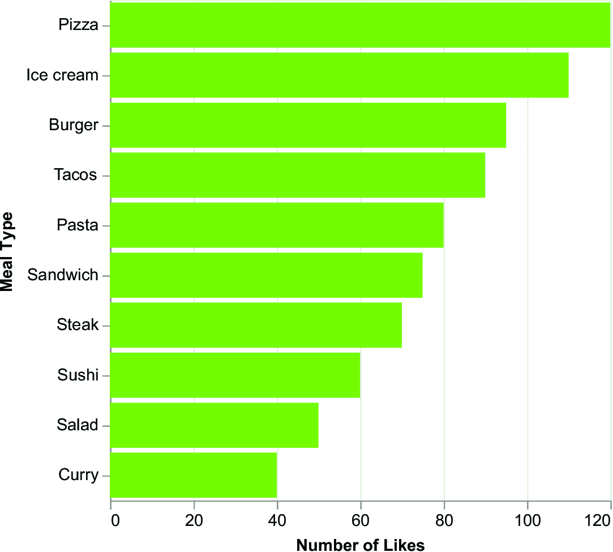

##### 图 6.9 如果您开始编写，Copilot 将建议下一步。

图表需要简化，因此我们应该删除不必要的元素，例如 y 轴标题（餐食类型）、网格等。例如，我们可以在每根柱子的末尾添加其值，并完全删除 x 轴标签。使用 Copilot 来帮助您构建图表。当您使用 Copilot 时，您会发现它会根据您之前编写的代码提出更多适合您编码风格的建议。如果您开始编写某些内容，Copilot 将根据您之前编写的代码建议下一步。这意味着您不仅可以使用预定义的提示，还可以在提示中建议下一步。

要在每根柱子的末尾添加其值，开始为 Copilot 编写一个提示，按 Enter 键，Copilot 将建议如何实现，如图 6.10 所示。


##### 图 6.10 Copilot 建议的一个示例

简单地按 Enter 键，Copilot 将继续提出如何添加文本。以下列表显示了 Copilot 提出的完整提示。

##### 列表 6.7 Copilot 生成的提示

```py
# Add text to the end of each bar.
# - Use the `Number of Likes` column for text channel.
# - Use the `Meal Type` column for y channel and sort by the number of likes.
# - Set the color of the text to '#81c01'.
# - Set the text alignment to 'left'.
# - Set the text baseline to 'middle'.
# - Set font size to 14.
```

注意：使用 Copilot 生成构建您图表的提示，然后按 Enter 键让 Copilot 生成代码。

在最终提示后，按 Enter 键，Copilot 将生成代码。

##### 列表 6.8 生成标签的代码

```py
text = chart.mark_text(
    align='left',
    baseline='middle',
    dx=3,
    color='#81c01',
    fontSize=14
).encode(
    text='Number of Likes',
    y=alt.Y('Meal Type', sort='-x', title=None)
)
```

注意：将`mark_text()`方法应用于图表以生成标签。您可以使用为`chart`变量设置的列。

现在，向图表中添加五条垂直线以简化观众的比较过程。请 Copilot 为您生成代码。开始编写以下提示：`# Add five vertical lines to the chart`。Copilot 将生成以下列表中显示的提示。

##### 列表 6.9 生成垂直线的提示

```py
# Add five vertical lines to the chart.
# - Use alt.Chart(pd.DataFrame({'x': [20, 40, 60, 80, 100]})) to create a dataframe with six rows.
# - Use alt.Chart().mark_rule() to draw vertical lines.
# - Set the color of the lines to 'white'.
# - Set the line width to 1.
# - Set opacity to 0.5.
```

注意：Copilot 生成生成代码的提示。

按 Enter 键，Copilot 将生成以下列表中显示的代码。

##### 列表 6.10 生成垂直线的代码

```py
lines = alt.Chart(pd.DataFrame({'x': [20, 40, 60, 80, 100]})).mark_rule(
    color='white',
    strokeWidth=1,
    opacity=0.5
).encode(
    x='x:Q'
)
```

注意：使用`mark_rule()`标记向图表添加垂直线。

最后，从列表 6.6 中的原始图表中删除 x 轴（`x=alt.X('Number of Likes',axis=None)`），从 y 轴中删除标题（`y=alt.Y('Meal Type', sort='-x', title=None)`），并将三个图表合并，如下所示列表。图 6.11 显示了生成的图表。

##### 列表 6.11 合并图表以生成最终图表

```py
chart = (chart + text + lines
).configure_view(
    strokeWidth=0
).configure_axis(
    grid=False
)

chart.save('bar-chart.xhtml')
```

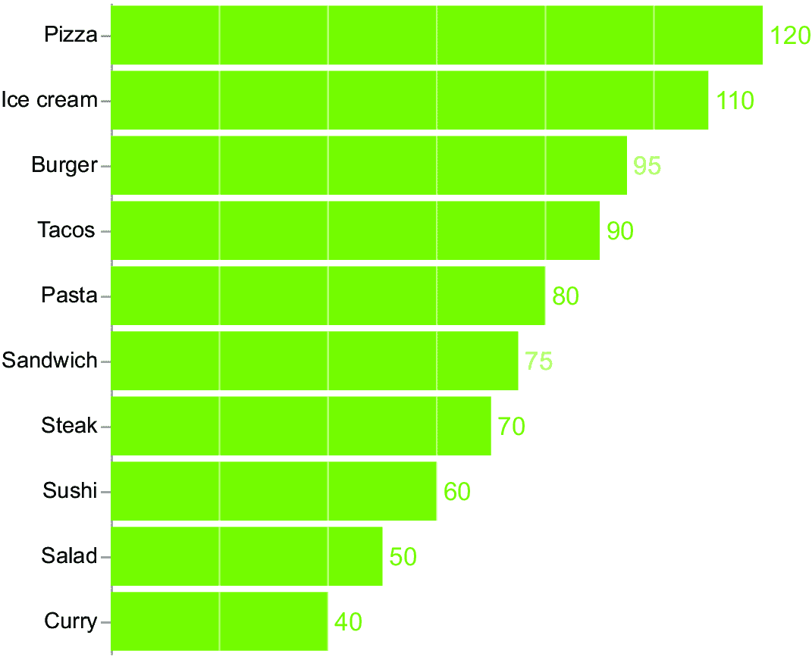

##### 图 6.11 一个去杂的柱状图

注意：使用 `+` 操作符。

现在你已经知道如何在 Altair Copilot 中绘制一个去杂的柱状图。接下来，让我们继续到折线图系列。

### 6.3.3 折线图系列

*折线图*系列包括所有使用连续线来展示给定时间段内不同数据点之间关系或趋势的图表。常见的折线图类型包括基本折线图、面积图、斜率图和哑铃图。在本节中，我们将分析折线图。面积图、斜率图和哑铃图将在附录 C 中讨论。

*折线图*，也称为 *线图* 或 *折线图*，用于可视化时间序列数据。它们通过直线连接数据点，这使得很容易看到数据随时间的变化。折线图特别适用于显示数据中的趋势和模式，以及比较多个数据序列。

假设你有一个数据集，显示了每年每个月披萨和意大利面的订单数量。该数据集包含三列：月份、餐点类型和订单数量。在她的书《数据故事讲述》（Knaflic，2015）中，Cole Nussbaumer Knaflic 提议用每个线条附近的标签替换折线图的图例。为了遵循 Knaflic 的建议，我们可以在 Altair 中分三步构建一个折线图。首先，我们构建一个具有基本结构的基础图表。它包括一般的编码和属性，如下所示。

##### 列表 6.12 如何构建折线图的基础图表

```py
base = alt.Chart(df).encode(
    x=alt.X('Month',
            axis=alt.Axis(title=None,
                            labelAngle=0,
            ),
            sort=months
    ),
    y=alt.Y('Number of Orders'),
    color=alt.Color('Meal Type',scale=alt.Scale(range=['#81c01e','gray']),legend=None)
).properties(
    width=600,
    height=300
)
```

注意：在构建基础图表时，不要指定标记。

接下来，我们通过将 `mark_line()` 方法应用于基础图表来绘制折线图。最后，我们通过将 `mark_text()` 方法应用于基础图表来绘制标签。

##### 列表 6.13 如何构建折线图和标签

```py
chart = base.mark_line()

text = base.mark_text(
    fontSize=14,
    baseline='middle',
    align='left',
    dx=10
).encode(
    text=alt.Text('Meal Type:N'),
).transform_filter(
    alt.datum['Month'] == 'December'
)

chart = chart + text  #1

chart = chart.configure_view(
    strokeWidth=0
).configure_axis(
    grid=False
)
chart.save('line-chart.xhtml')
```

#1 将折线图和文本标记合并为单个图表

注意：在定义基础图表后，通过仅指定 `mark_line()` 方法来构建折线图。使用 `transform_filter()` 方法来选择仅部分数据。在我们的例子中，选择数据集的最后值（`alt.datum['Month']` `==` `'December'`）来将标签放置在线的末端。

图 6.12 显示了生成的图表。现在，是时候转向下一个图表系列：地理地图。


##### 图 6.12 一个折线图

### 6.3.4 地理地图系列

地理地图显示了地球表面上不同数据点的位置，如国家、大陆、海洋和河流。地理地图还显示了感兴趣区域的资源和数据分布。

最受欢迎的地理地图包括以下几种：

+   *渐变地图*——这些使用颜色来显示不同区域之间值的差异（图 6.13）。

+   *点密度地图*——这些使用点来显示一个区域内某个值的浓度（图 6.14）。

+   *比例符号地图*——这些地图使用根据它们所代表的值来定制的符号（图 6.15）。

你可以在本书的 GitHub 仓库中找到每种类型地理地图的相关代码。

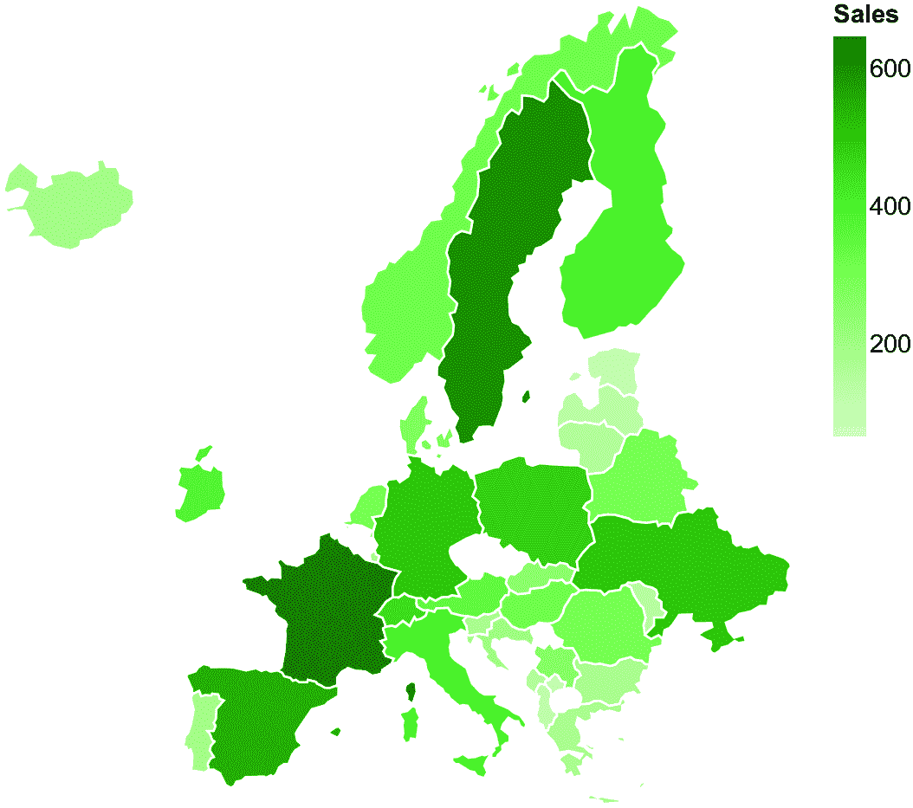

##### 图 6.13 一个面状图


##### 图 6.14 一个点密度图

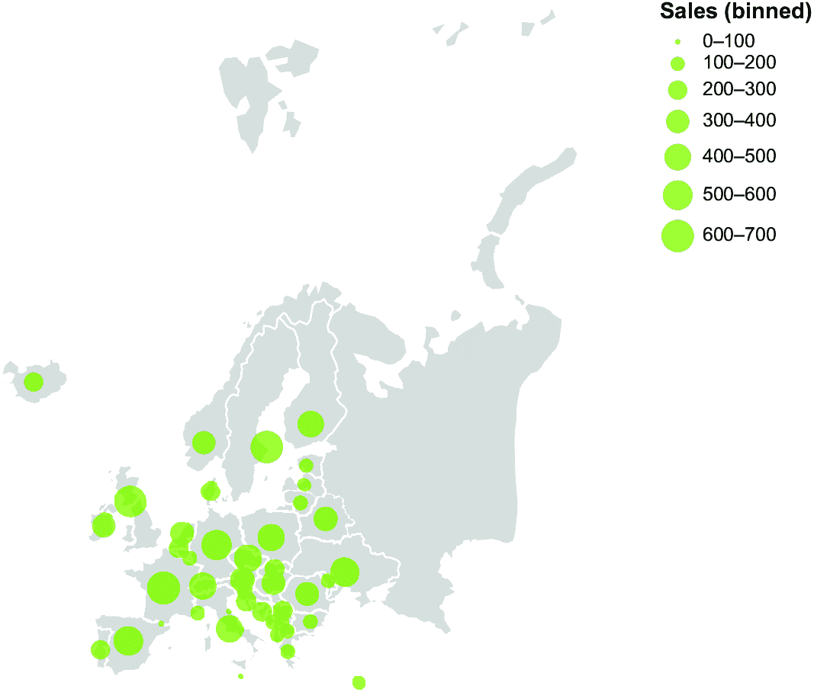

##### 图 6.15 一个比例符号地图

当你构建地理地图时，你必须设置要使用的投影。最受欢迎的投影地图之一是墨卡托投影地图。尽管这个地图非常流行，但它并不能正确地表示世界。例如，在地图上，格陵兰看起来几乎和非洲一样大，而实际上，非洲大约是 14 倍大！这种扭曲发生是因为在平面上很难准确地表示地球的曲面。现在你已经学习了最流行的地理地图，让我们继续学习点图系列。

### 6.3.5 点图系列

*点图*系列包括使用`x`和`y`轴上的点来表示数据点的图表，以显示两个变量之间的关系。最流行的点图系列包括散点图和气泡图。使用`mark_point()`标记来绘制点图。

*散点图*可视化两个数值变量之间的关系。使用它们来识别数据中的模式和趋势，并基于这些趋势进行预测。图 6.16 展示了散点图的一个示例。你可以在本书的 GitHub 仓库中找到相关的代码。

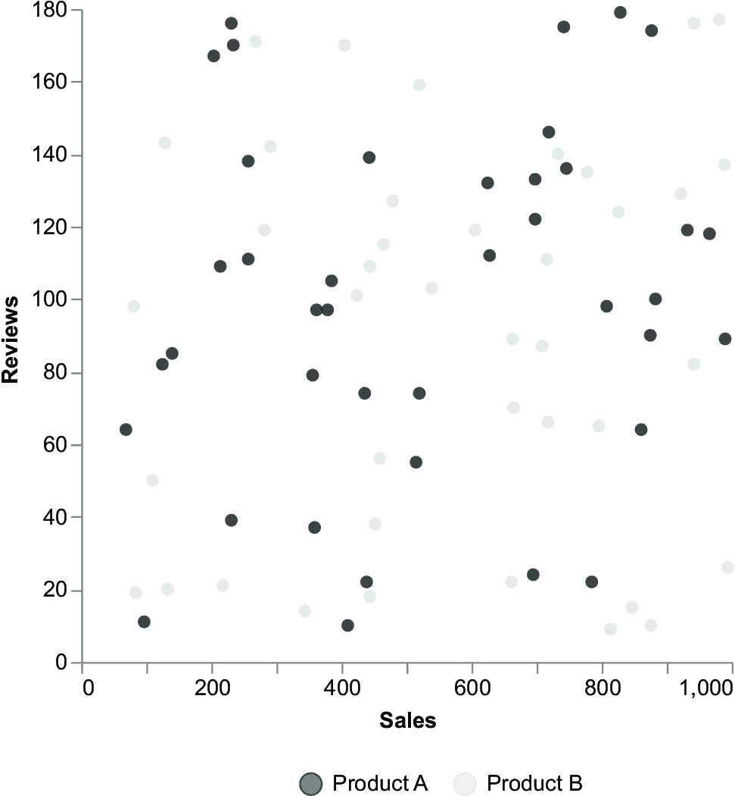

##### 图 6.16 一个散点图

*气泡图*是散点图，它使用数据点的尺寸来编码一个额外的变量。在 Altair 中，你可以使用`size`通道来设置气泡大小：`size=alt.Size('Ranking:Q',scale=alt.Scale(range=[1,200]),legend=None)`。图 6.17 展示了气泡图的一个示例。现在你已经学习了基本的图表系列，让我们继续进行一个实际案例研究。

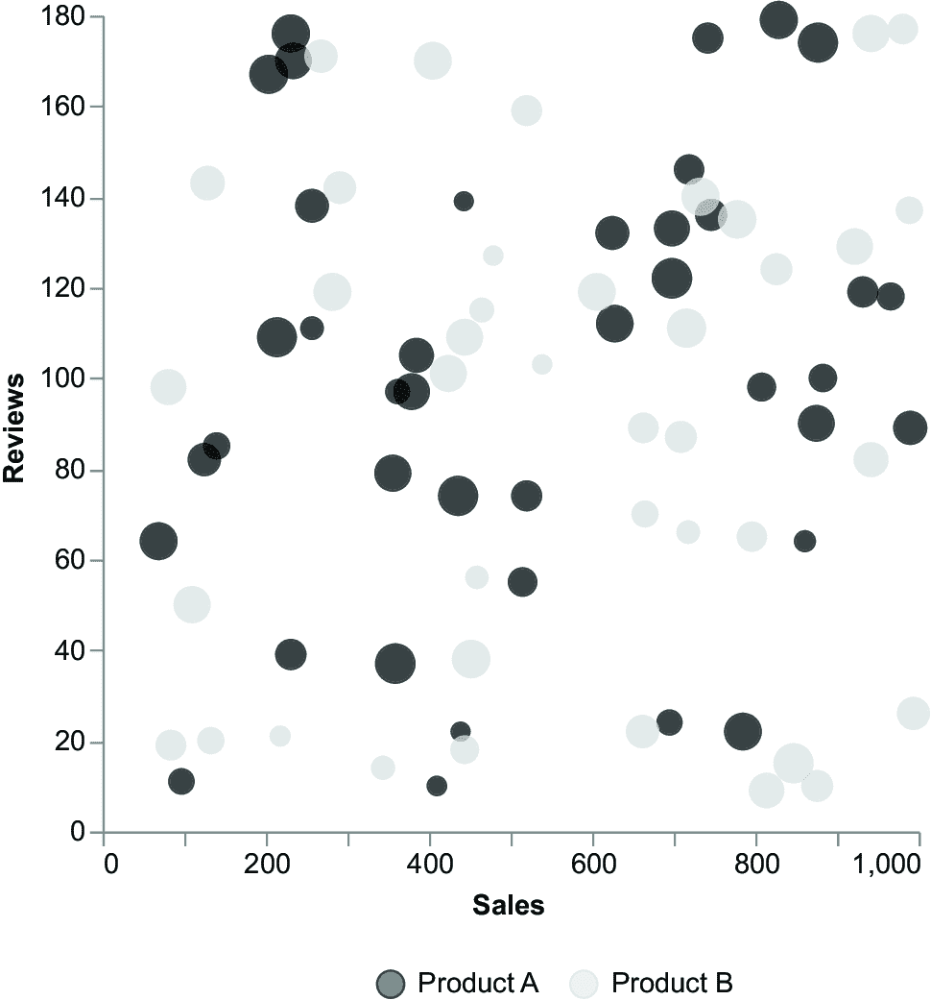

##### 图 6.17 一个气泡图

## 6.4 案例研究：鲑鱼养殖业

想象一下，你想要研究美国鲑鱼养殖业的安全问题。你有美国农业部经济研究服务提供的养殖数据集([`data.world/agriculture/aquaculture-data`](https://data.world/agriculture/aquaculture-data))，该数据集描述了每个鱼类类别随时间出口的千克数和赚取的美元数，如表 6.6 所示。

##### 表 6.6 水产养殖数据集快照

| SOURCE_ID | HS_CODE | COMMODITY_DESC | GEOGRAPHY_CODE | GEOGRAPHY_DESC | ATTRIBUTE_DESC | UNIT_DESC | YEAR_ID | TIMEPERIOD_ID | AMOUNT |
| --- | --- | --- | --- | --- | --- | --- | --- | --- | --- |
| 63  | 302110000  | 鲑鱼（鲑鱼、S. CLARKI 等）鲜、冷藏  | 1  | 世界  | 美国出口，数量  | 千克  | 1989  | 2  | 17,183  |
| 63  | 1604112000  | 鲑鱼，整条/块，油封罐装  | 2740  | 特立尼达和多巴哥  | 美国出口，VLU  | 美元  | 1989  | 2  | 4,329  |

数据集包含以下列：

+   `SOURCE_ID`—数据来源

+   `HS_CODE`—商品的协调制度代码

+   `COMMODITY_DESC`—商品的描述

+   `GEOGRAPHY_CODE`—来源或目的地的国家或地区代码

+   `GEOGRAPHY_DESC`—来源或目的地的国家或地区名称

+   `ATTRIBUTE_DESC`—数据类型，无论是 US Export，QTY 还是 US Export，VLU

+   `UNIT_DESC`—计量单位，无论是 KG 还是美元

+   `YEAR_ID`—数据的年份

+   `TIMEPERIOD_ID`—数据的月份

+   `AMOUNT`—数据的价值

你的研究目标是确定迄今为止在鲑鱼养殖业中采用的预防措施是否足够，或者是否应该改进。为了简化，你基于这个数据集进行研究。然而，在实际情况中，你也应该考虑其他方面，例如维持这些措施的成本和其他类似的分析。

你决定绘制鲑鱼养殖业销售趋势线与其他类型养殖业的对比图。你可以在本书的 GitHub 仓库 CaseStudies/aquaculture/下找到与此案例研究相关的代码。请 Copilot 为你生成图表。使用以下列表中描述的指令列表构建基本图表。

##### 列表 6.14 Copilot 的说明

```py
# import required libraries
# load the dataset '../source/Aquaculture_Exports.csv' as a pandas dataframe
# apply the following filters to the dataframe:
#   - select only the rows where the 'GEOGRAPHY_DESC' column is 'World'
#   - select only the rows where the 'UNIT_DESC' column is 'U.S.$'
# add a new column to the dataframe called 'DATE' which is a date object build as follows:
#   - the year is the 'YEAR_ID' column
#   - the month is the 'TIMEPERIOD_ID' column
#   - the day is 1
# plot the dateframe using altair as follows:
#   - the x axis is the 'DATE' column
#   - the y axis is the 'AMOUNT' column
#   - the color is the 'COMMODITY_DESC' column
# save the plot as 'chart.xhtml'
```

备注：在导入所需的库后，请 Copilot 导入数据集并应用一些过滤器，仅选择以美元计的世界出口。接下来，从`YEAR_ID`和`TIMEPEROID_ID`列计算日期。最后，在 Altair 中绘制趋势线。

之前的说明帮助你构建基本图表。在此基础上工作，以生成图 6.18 所示的图表。

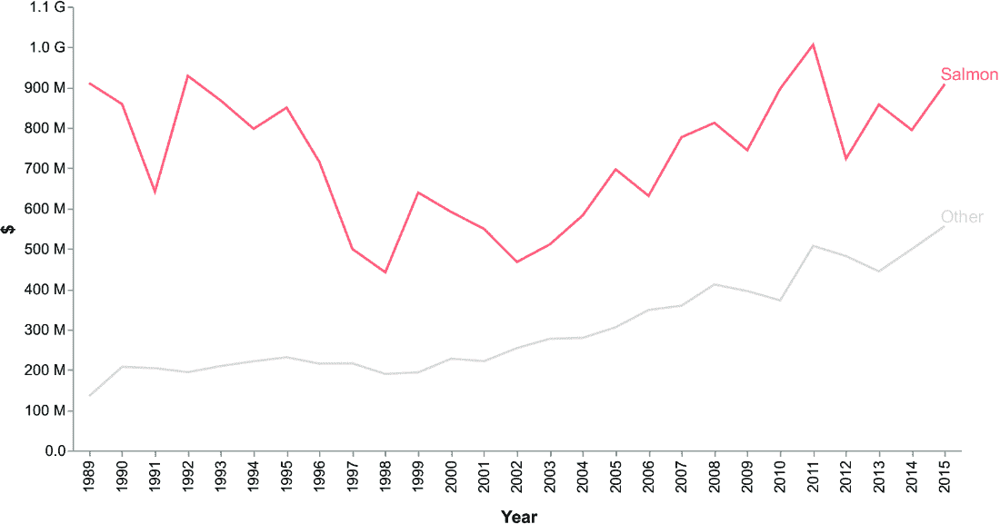

##### 图 6.18 水产养殖案例研究

你可以在本书的 GitHub 仓库 CaseStudies/aquaculture/from-data-to-information/chart.py 下找到生成的代码。作为一个洞见，你发现自 1998 年以来，销售额有所增加，这是在 1992 年至 1998 年销售额下降后的结果。受到对下降期的好奇心的驱使，你进行了一些研究，发现下降期部分是由于鲑鱼养殖业的一些健康问题。

在这一步骤结束时，你已经将数据转化为信息。在下一个图表中，我们将继续通过将提取的信息转化为知识来实施这个案例研究。

本章描述了如何将数据转化为信息。首先，我们描述了一些提取洞察力的技术。接下来，我们看到了如何选择故事的角色。最后，我们学习了如何使用 Copilot 在 Altair 中实现一些最受欢迎的图表。您可以在本书的 GitHub 仓库下的 06/other-charts 部分找到其他图表。在下一章中，您将学习如何将信息转化为知识。

## 摘要

+   将数据转化为信息意味着从数据中提取意义，这是一个对您有重要意义的洞察。

+   提取洞察力的技术包括连接、巧合、好奇心和矛盾。

+   连接涉及在您的数据中寻找细节并将它们联系起来。

+   巧合涉及寻找重复或随机事件，这些事件似乎有一些联系。

+   好奇心是寻找奇怪的事件，例如缺失值和异常值。

+   矛盾是寻找显然相互冲突的事件。

+   每个故事至少应该有三个角色：英雄、向导和对手。

+   用来讲述故事的正确图表取决于要传达的信息。

+   有不同的图表家族，例如柱状图、折线图、地理图表和烹饪图表。

## 参考文献

+   De Mauro, A., Marzoni, F., and Walter, A. J. (2021). *数据分析变得简单.* Packt Ltd.

+   Dorfer, T. A. (2022). *反对饼图的理由.*[`towardsdatascience.com/the-case-against-the-pie-chart-43f4c3fccc6`](https://towardsdatascience.com/the-case-against-the-pie-chart-43f4c3fccc6).

+   Guja, A., Siwiak, M., and Siwiak, M. (2024). *数据分析中的生成式 AI.* Manning Publications.

+   Khalil, M. (2024). *有效数据分析：硬技能和软技能.* Manning Publications.

+   Klein, G. (2017). *看到别人看不到的东西：我们获得洞察力的非凡方式.* Nicholas Brealey Publishing.

+   Miller, D. (2017). *构建故事品牌：清晰你的信息，让客户愿意倾听.* Thomas Nelson.

+   Moses, B., Gavish, L., and Vorwerck, M. (2022). *数据质量基础：构建可信数据管道的实践指南.* O’Reilly Media.

+   Nussbaumer Knaflic, C. (2015) *用数据讲故事：商业专业人士的数据可视化指南.* Wiley.
