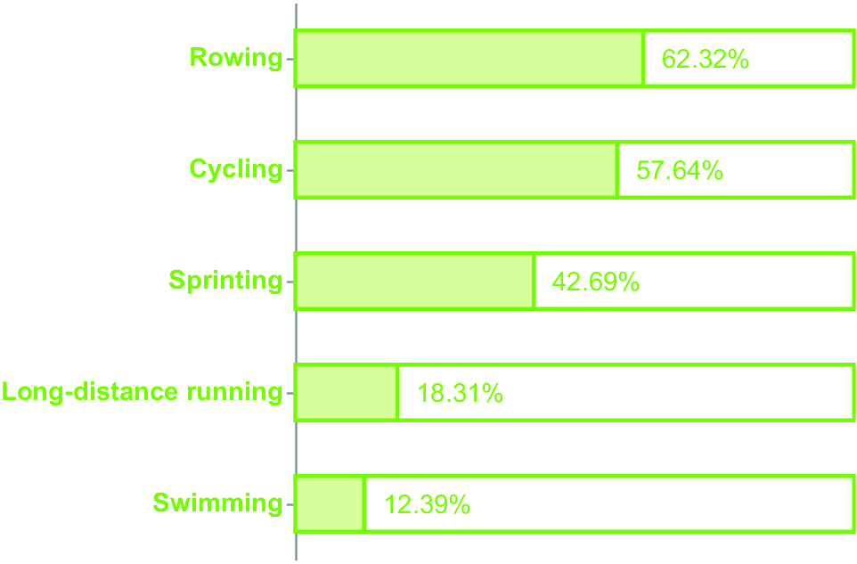
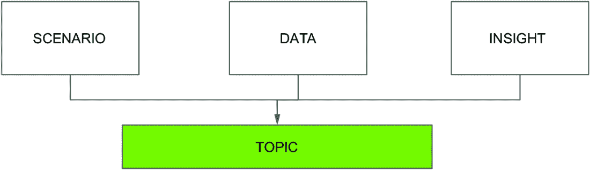
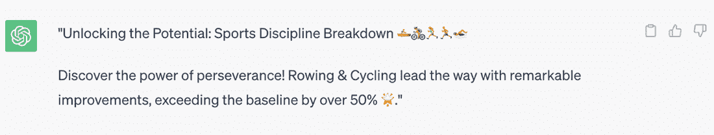
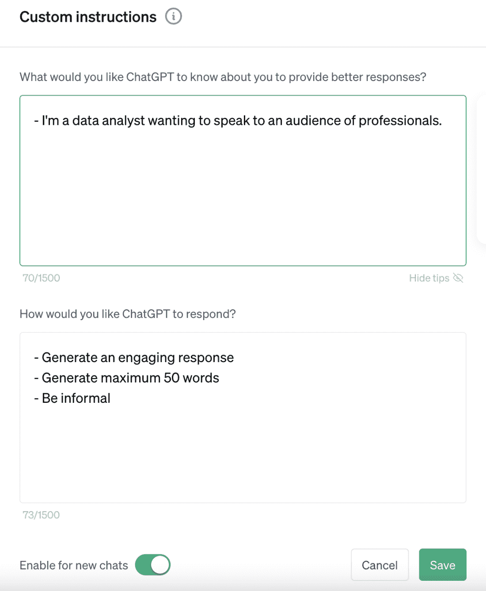
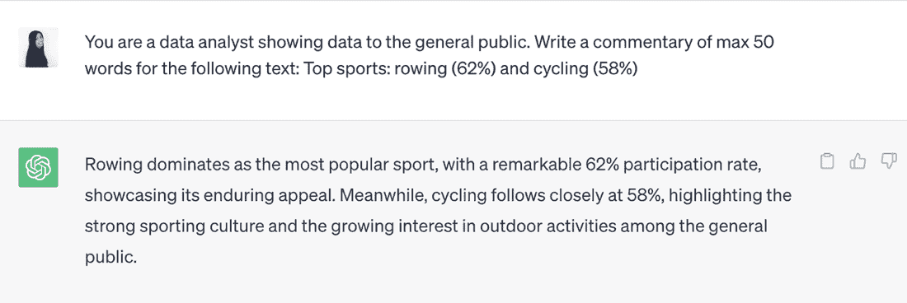
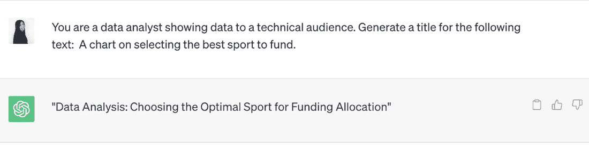
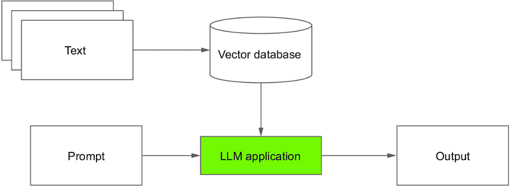
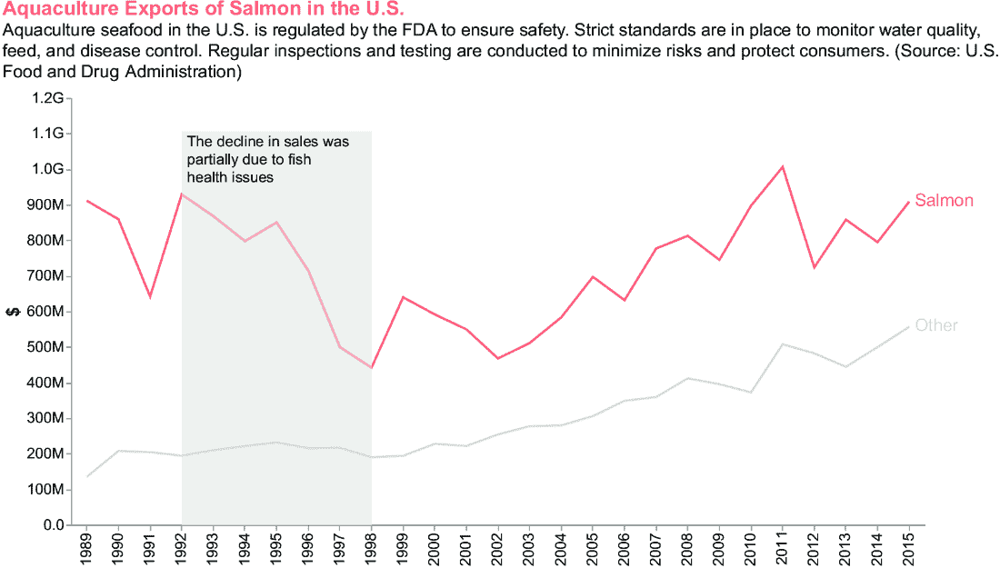

# 第七章：从信息到知识：构建文本上下文

### 本章涵盖内容

+   介绍上下文

+   调整故事以适应受众

+   使用 ChatGPT 进行评论和注释

+   使用大型语言模型进行文本上下文处理

+   案例研究：从信息到知识（第一部分）

在计算机科学书籍中谈论知识可能显得完全不合适。单词“知识”可能会激发哲学概念，甚至让人感到畏惧。但在这章（以及下一章），我们不会谈论哲学知识，而是谈论帮助读者理解故事背景的知识。因此，这是应用于我们的数据故事背景的知识，而不是一般知识。在这些章节中，我们将回顾数据故事中上下文的基本概念以及如何根据受众进行调整。首先，我们将在本章中关注文本上下文，而在下一章中，我们将涵盖图像。我们将介绍大型语言模型（LLMs），并以 ChatGPT 作为 LLM 在数据故事中的应用实例。最后，我们将探讨一个实际案例。

## 7.1 介绍上下文

当我还是个孩子的时候，我经常听到我的父母讨论某个话题，却什么都不懂。他们的言语在我耳边回响，毫无意义，直到我渴望了解他们在谈论什么，我加入了对话并请求解释。然后，我的父亲或母亲，非常耐心地向我解释他们在谈论什么，调整他们的成人推理以适应我的孩子思维，这样我也能理解。多年以后，我发现我自己处于同样的情况，作为一个母亲。我的孩子们经常要求我用他们能理解的话来解释更复杂的言语。当我看到他们的脸上发光，理解我在说什么时，我感到无比的满足。

描述的例子告诉我们，根据我们面向的受众调整我们使用的语言是必要的。如果我们忽视了谁将接收我们的故事，我们可能会以对我们自己来说完全合理的方式说话，但这样可能会排除我们的受众，使他们无法理解我们想要传达的信息。

在上一章中，我们探讨了如何通过图表提取和表示洞察力。下一步是丰富图表的上下文（文本和图像），使参考受众的阅读更加容易。“上下文”指的是周围元素，使受众能够理解显示的信息，如文本、图像和符号。数据上下文应该为你的数据故事场景做好准备，并在受众中激发兴趣。在本章中，我们将主要处理文本上下文，而在下一章中，我们将更多地关注视觉上下文。

情境取决于您要面对的受众类型。例如，如果您与成年人谈论您为产品支付了多少钱，您不需要解释金钱是如何运作的。另一方面，如果您与您的孩子们谈论相同的话题，您可能需要解释不同钞票的面额以及货币体系是如何运作的。

您可以使用生成式 AI 工具，例如 ChatGPT 用于文本和 DALL-E 用于图像，以简化情境构建。您已经学习了使用生成式 AI 工具构建情境的基本技术。本章将重点介绍更高级的技术，以编写针对受众的具有影响力的情境。

我们将考虑以下类型的情境：

+   *评论* — 在您的见解之前的文本。它包括帮助观众设定场景和理解见解的背景。在向孩子们解释产品成本示例中，评论包括钞票面额和货币体系是如何运作的。

+   *注释* — 解释图表细节的简短文本，例如异常点或趋势线。仅在必要时添加注释。不要让图表因不必要的注释而负担过重。

+   *图像* — 强调评论或注释的图片。在产品成本示例中，您可以添加钞票图片以帮助孩子们理解不同的面额。

+   *符号* — 箭头、圆圈、线条等，结合注释。它们有助于观众关注图表的特定点。

在本章的剩余部分，我们将使用 ChatGPT 进行评论和注释。在下一章中，我们将专注于 DALL-E 用于图像和符号。此外，我们将介绍 LLMs 以及如何使用它们进行评论和注释。但首先，让我们描述如何调整故事以适应我们的受众。

## 7.2 调整故事以适应受众

几年前，我被邀请为研究生举办一次研讨会。研讨会的主题是关于构建数据新闻项目网络应用的实施。不幸的是，我发现我面临一个有些尴尬的情况。我的研讨会主题非常技术性，甚至评论了一些代码片段。当我开始讲话时，我意识到观众无法跟上我，因为他们没有理解所需的技术技能。我的演示在技术上正确，但由于对非技术受众讲得过于技术性，我的演讲结果是观众学到的很少。我从这次事件中获得的经验教会了我，在传达任何信息之前，一定要了解我将要面对的受众。

*受众* 是阅读您数据故事的个人或群体。理解目标受众对于构建能够有效传达信息的数据故事至关重要。在前一章中，我们了解到您可以使用多种类型的图表来传达信息（表 6.4）。一旦您选择了回答您问题的图表集，您就可以进一步细化选择，根据受众调整图表。

在第四章中，您了解到有不同类型的受众。为了简单起见，在本章中，我们将它们分为三种常见的受众类型：

+   普通公众

+   高管

+   专业人士

让我们分别调查每种类型的受众。为了解释您如何调整图表以适应目标受众，我们将使用第四章中描述的案例研究。这个案例研究的目的是了解我们的假设团队需要继续训练哪些运动项目才能在即将到来的比赛中取得最佳成绩。为了方便起见，图 7.1 显示了我们所实施的数据故事的完整内容：从数据到智慧。


##### 图 7.1 第四章中描述的使用案例

### 7.2.1 普通公众

这个受众包括来自不同背景和知识水平的个人。他们可能对您的话题知之甚少或一无所知。在为普通公众制作数据故事时，使用精确的语言，避免用过多信息使他们感到不知所措，并专注于以视觉和吸引人的方式呈现最相关的见解。普通公众可能会发现图 7.1 中的图表复杂，有不必要的基线。作为图 7.1 中图表的替代方案，您可以考虑绘制图 7.2 中的图表，某些受众可能会觉得它更有吸引力。


##### 图 7.2 适应普通公众的使用案例

这个图表被称为多层饼图。我们本可以将图像放置在相关的条形旁边，但在这个案例中，空间不足，所以我们把它们放在图表的中心。在其他情况下，您可能考虑将图像放在条形旁边。您可以在本书的 GitHub 仓库下的 07/general-public 找到生成此图表的完整代码。

### 7.2.2 高管

高管通常是组织中高级决策者，他们依赖数据驱动的洞察来做出关键的商业选择。他们通常时间有限，需要简洁且可操作的信息。在为高管创建数据故事时，提前展示关键发现、趋势和建议是至关重要的。

使用突出显示最关键数据点的可视化，并直接将数据与战略目标联系起来。提供额外的背景或行业标准以支持你的分析也可能很有帮助。图 7.1 所示的图表对于高管来说可能很好，因为它不包含很多细节，并描述了我们为什么选择某些运动，这得益于其 50%的基线。

### 7.2.3 专业人士

这个受众群体包括具有特定领域专业知识或专业背景的个人。他们对数据的理解更深入，需要更多分析信息。在为专业人士创建数据故事时，解释数据分析的方法、假设和局限性。考虑包括额外的支持数据和参考文献，使专业人士能够进一步探索数据。

作为 7.1 图中图表的替代方案，你可以绘制图 7.3 所示的图表，某些受众可能很容易理解。该图只显示了图表，没有任何注释或背景。你可以在本书的 GitHub 仓库下的 07/professionals 中找到生成此图表的完整代码。



##### 图 7.3 适用于专业人士的使用案例

表 7.1 总结了根据受众类型在图表中应表示的内容。现在你已经学会了如何根据受众类型调整你的图表，让我们继续下一步：使用 ChatGPT 进行评论和注释。

##### 表 7.1 根据受众类型在图表中应表示的内容

| 受众类型 | 需求 | 应表示的内容 |
| --- | --- | --- |
| 普通公众 | 理解数据 | 吸引人的见解概述 |
| 高管 | 高层次的数据趋势概述，以辅助战略决策 | 突出关键指标和影响业务成果的趋势。 |
| 专业人士 | 深入理解数据背后的现象的详细见解 | 添加数字、统计和有用信息以深入理解见解。 |

## 7.3 使用 ChatGPT 进行评论和注释

在他的小说《变形记》中，弗朗茨·卡夫卡讲述了格里高尔·萨姆沙的故事，他是一位旅行推销员，一天早上醒来发现自己变成了一个巨大的昆虫。萨姆沙被困在这个昆虫的外壳中，无法与家人互动或传达他的想法。萨姆沙的家人努力接受他的转变，导致他们与萨姆沙的关系恶化，萨姆沙变得越来越孤立。这部小说揭示了当一个人的内心世界对他人不可接近时出现的根本孤立。数据分析师可能会发现自己处于与卡夫卡小说中格里高尔·萨姆沙相似的情况，当他们不得不向数据可视化图表添加文本时。数据分析师本质上是一名技术人员，可能会在撰写引人入胜的文本时遇到一些困难。

ChatGPT 可以帮助你在你的数据可视化图表中添加文本上下文。你已经了解到，ChatGPT 的提示的基本结构包括三个主要元素：角色、受众和任务。

例如，你可以写上*扮演一个表演者*（角色）*，为决策者写作*（受众）*。为<主题>写 5 个标题*（任务）。主题可以是任何你想要的内容。主要问题是如何构建主题，以便 ChatGPT 产生正确的上下文。为了将主题包含在 ChatGPT 的提示中，我们将根据图 7.4 所示的方案生成上下文。


##### 图 7.4 生成上下文所使用的方案

在提示中，我们指定以下四个主要元素：

+   *角色* — 你希望 ChatGPT 扮演的角色。在第四章中，你已经学习了多种角色类型，包括表演者、教育者、信息提供者、激励者、行动邀请者和关系构建者。

+   *受众* — 你图表的受众。有不同类型的受众，例如公众、高管和专业人士。

+   *主题* — 你图表的主题。

+   *类型* — 要生成的文本类型，包括注释和评论。

生成上下文的过程是迭代的，这意味着如果你对产生的结果不满意，你可以多次生成上下文。例如，你可以调整一个或多个元素，使 ChatGPT 收敛到期望的输出。

在本节的剩余部分，我们将关注如何编写方案的主题和类型元素，同时保持角色和受众简单。然而，你可以将描述主题和受众的策略适应到其他元素。

作为构建上下文的例子，我们将关注第四章中描述并在图 7.1 中展示的案例研究。以下文本为了方便起见总结了场景：*想象你在一个体育公司工作。你正在训练一支在各个学科领域的年轻运动员队伍。对于每个学科，你都记录了世界纪录和你的队伍达到的最佳时间以供比较。不幸的是，你的公司可用的投资资金有限。你的老板要求你了解哪些学科值得训练，希望在下一次比赛中取得好成绩。*

### 7.3.1 描述主题

*描述主题*意味着组成简单的词汇，精确地描述给 ChatGPT 你在图表中发现和展示的内容。你越精确，输出结果就越好。

描述主题时，关注三个方面的内容：场景、数据和洞察，如图 7.5 所示。让我们更详细地探讨这三个方面。



##### 图 7.5 描述主题所使用的元素

#### 场景

描述你场景的概述，包括分析的背景和目标。对于图 7.1 中的场景，我们可以为 ChatGPT 编写以下提示：*我们正在训练一支在各个运动项目中都有参与的年轻运动员队伍。对于每个项目，我们计算了每个项目与该项目世界纪录相比的百分比提升。目标是寻找两个最佳项目进行资助。*

#### 数据

提供你数据的概述。这可能包括解释数据的类型、来源以及你进行的任何操作。

使用你自己的话描述数据，提供更个性化的描述。通过手动描述数据，你可以突出通过自动化方法本身可能不明显的重要模式、趋势或相关性。此外，通过手动描述，你可以融入领域专业知识观察。

对于图 7.1 中的场景，编写以下提示文本：*有五种运动项目：划船（百分比提升=62.32%），自行车（57.64%），短跑（42.69%），长距离跑（18.31%），和游泳（12.38%）。现在你已经学会了如何描述数据，接下来让我们进入最后一步：描述见解。*

#### 见解

描述你从分析中得出的主要见解，例如你发现的关键模式、趋势、相关性或关系。对于图 7.2 中的场景，包括以下文本：*划船和自行车的百分比比 50%的基线更为重要。在我们展示如何构建观众描述之前，让我们在 ChatGPT 上测试到目前为止构建的提示。

#### 测试

我们编写以下提示：*扮演一个启发者。为以下主题编写 5 个标题。有五种运动项目：划船（百分比提升=62.32%），自行车（57.64%），短跑（42.69%），长距离跑（18.31%），和游泳（12.38%）。划船和自行车的百分比高于 50%的基线。图 7.6 显示了 ChatGPT 可能生成的输出。*


##### 图 7.6 ChatGPT 生成的五个标题

作为一种替代方案，你可以要求 ChatGPT 生成以下内容：*扮演一个启发者。使用 30 个词为以下主题编写图表的上下文。有五种运动项目：划船（百分比提升=62.32%），自行车（57.64%），短跑（42.69%），*长距离跑（18.31%），和游泳（12.38%）。划船和自行车的百分比高于 50%的基线。图 7.7 显示了 ChatGPT 可能生成的输出。



##### 图 7.7 ChatGPT 生成的上下文

现在您已经学会了如何描述主题，尝试为第一章中描述的案例研究生成上下文：宠物场景。例如，您可以扮演信息提供者的角色。为了方便，我们总结了场景：*一个专门为宠物举办的活动组织者正在收集将参加活动的宠物类型。对于每个宠物类别，组织者在专门针对该类别的网站上宣传活动。组织者要求您构建一份关于当前情况的快速报告。*

更多详情请参阅第一章。您可以在此处找到生成的上下文的提示：[`mng.bz/EZvJ`](https://mng.bz/EZvJ)。为了进一步练习，请为前几章中描述的其他场景编写主题。现在您已经学会了如何描述主题，让我们继续到下一个元素：描述类型。

### 7.3.2 描述类型

我们考虑以下类型：评论和注释。在前几节中，您已经看到了不同的方法来指导 ChatGPT 生成上下文类型，例如使用 30 个单词编写图表的上下文。

在描述类型时，尽可能精确，指定以下方面：

+   类型（评论、注释或普通文本）

+   生成单词的最大数量

我的建议是尝试不同的类型，并根据您的需求评估结果。

### 7.3.3 设置自定义指令

ChatGPT 使您可以为所有新聊天配置自定义指令。例如，如果我们为同一受众类型构建图表并扮演相同的角色，我们可以将此属性用作 ChatGPT 的默认配置。

要启用自定义指令，访问 ChatGPT 网页界面，点击您个人资料附近的三个点，然后点击“自定义指令”。在新窗口中，编写自定义指令。例如，您可以使用第一个框来配置您的角色以及目标受众，第二个框用于更多详细信息，例如要生成的单词数、语气和风格，如图 7.8 所示。



##### 图 7.8 自定义指令对话框

点击“保存”按钮以启用新聊天的自定义指令。如果您想禁用此属性，请在对话框中取消选中“为新聊天启用”属性。然后，点击“保存”按钮。

让我们尝试使用前面的文本（我们已移除要生成的单词数，因为我们已在自定义指令中进行了配置）：*为以下主题编写图表的上下文。有五种运动项目：划船（百分比提升=62.32%），自行车（57.64%），短跑（42.69%），长跑（18.31%）和游泳（12.38%）。划船和自行车的百分比高于 50%的基线。*

图 7.9 展示了可能的一个输出。注意，例如，我们在自定义指令中设定的非正式语气。


##### 图 7.9 配置自定义指令时可能产生的输出

为了在数据叙事中最佳地使用自定义指令，我建议使用它们来配置角色和受众。此外，你可以配置与你的工作或数据相关的其他特定细节，如 ChatGPT 文档中所述（[`mng.bz/8wAP`](https://mng.bz/8wAP)）。

现在你已经学会了如何使用 ChatGPT 进行评论和注释，让我们继续下一步：以不同的方式使用大型语言模型。到目前为止，你已经使用了 OpenAI 提供的 Web 界面来为 ChatGPT 编写提示。现在，我们将介绍基于 API 调用的 LLM 的高级使用。

## 7.4 使用大型语言模型进行上下文处理

到目前为止，你已经使用了三个生成式人工智能工具：Copilot 用于代码生成，ChatGPT 用于文本生成，DALL-E 用于图像生成。所有这些工具都是*大型语言模型*（LLM）应用使用的例子。LLM 是一种旨在预测合理语言的机器学习（ML）模型。自 2017 年谷歌研究人员引入了 transformers 的概念以来，LLM 的受欢迎程度急剧上升，这是一种革命性的架构，它允许在大型语言模型上进行训练，例如基于生成预训练的 transformers（GPTs），ChatGPT 就是基于此，以及双向编码器表示的 transformers（BERT）。Transformers 使得在大量数据集上训练 LLM 成为可能，从而产生了具有令人难以置信的语言生成能力的模型。

在这本书中，我们不会关注 LLM 是如何工作的。相反，我们旨在展示你如何有效地使用它们进行数据叙事。然而，如果你对深入了解技术方面感兴趣，关于这个主题有大量的参考文献可供查阅（Vaswani，2017；Koenigstein，2024）。

在你开始使用大型语言模型（LLM）构建你的数据驱动故事之前，问自己模型是否需要了解与你工作领域相关的特定信息，如图 7.10 所示。如果答案是“否”，那么你可以安全地继续使用 ChatGPT。然而，如果你的答案是“是”，那么你可以应用以下技术之一：

+   *微调* — 这种技术通过在特定任务数据上更新其参数，将预训练的 LLM 适应特定领域，优化其在该领域的性能。

+   *检索增强生成* — 这种技术结合了信息检索和语言生成，使大型语言模型（LLMs）能够在生成过程中整合外部知识源。


##### 图 7.10 建立是否扩展 LLM 的标准

在本节的剩余部分，我们假设你的答案是肯定的，并且你必须根据你的特定领域定制你的大型语言模型。微调有用的实际案例可能包括当你必须为同一类型的受众或甚至同一受众生成不同的数据故事时。在这种情况下，你可以使用相同的注释结构构建你的数据库，以便所有新的注释都与之前的注释具有相同的结构。当你的受众阅读你的数据故事时，这可能会产生一些熟悉感。在其他情况下，你可能需要使用 RAG，例如，当你有一个长文档，你想要基于它为你的数据故事构建一个简短的注释时。使用 RAG 可以帮助你构建文本摘要。现在你已经了解了扩展 LLM 的潜在好处，让我们首先分析第一种策略：微调。

### 7.4.1 微调

GPT-3 在 17GB 的数据上进行了训练，而 OpenAI 的最新模型 GPT-4 有 45GB 的训练数据。这意味着它们包含几乎在所有情况下都可以使用的信息。然而，在某些情况下，微调你的模型可能会提供更好的结果。

微调是在特定数据集上进一步训练预训练语言模型的过程，该数据集与你的特定领域更相关。在微调过程中，你使用一个较小的数据集，该数据集通常包含与你的任务相关的示例和特定的输入-输出对。在实践中，数据集是一组样本的集合，每个样本包含提示和建议的完成内容。

当你将微调应用于数据叙事时，你可以为每种受众类型构建不同的数据集，从而获得更好的结果。例如，你可以为公众构建一个数据集，为专业人士构建一个，为决策者构建另一个。你甚至可以为每个你工作的场景（产品、主题等）以及你想要生成的每种文本类型（标题、注释和评论）创建不同的数据集。你的数据集越具体，你的结果就会越好。

准备数据集是微调过程中的最大努力。在本节的剩余部分，我们将描述两种准备数据集的策略：手动构建和从来源构建。在两种情况下，我们都会使用 OpenAI API。有关安装的更多详细信息，请参阅附录 A。

#### 手动构建

手动构建涉及手动定义每个对（提示，完成）。这种解决方案使你能够获得最佳结果，因为你指定了模型在特定输入下的确切行为。例如，考虑以下对：

+   *提示* — 为关于主题 X 的公众生成一个标题。

+   *完成* — X 向你揭示了！

现在，假设您已经使用这对数据对模型进行了微调，并想使用您的模型为公众生成标题。如果您将相对论主题作为输入提供给您的微调模型，它可能会生成以下类似的标题：*相对论揭秘给你！* 这种策略的缺点是它耗时，因为您必须手动编写每一对。

首先，您可以定义一个最小数量的精选样本，涵盖所有可能的案例。OpenAI 模型要求您至少表示 10 个样本。接下来，训练模型。然后，通过将原始模型（即，没有微调）作为参考，进行模型评估。向原始模型和微调模型提供相同的提示，并比较产生的输出。如果您的微调模型比原始模型表现更好，则使用您的新模型。相反，如果它表现不如或与原始模型表现相同，则尝试添加新的样本或改进现有的样本。重复此过程，直到达到良好的结果。

为了展示手动构建的工作原理，我们将构建一个针对公众的定制数据集，并生成一个输出作为评论。在前一章中，您看到应根据您想要传达的信息使用不同的图表。在这里，我们将根据需要传达的信息构建不同的输出。我们将为每种类型的信息构建一个或多个（提示-完成）对。表 7.2 显示了表示所述场景的可能数据集。您可以在本书的 GitHub 仓库下的 07/manual-ChatGPT-fine-tuning 部分找到本节中描述的代码。

##### 表 7.2 基于需要传达的信息的样本

| 需要传达的信息 | 提示 | 完成 ^a |
| --- | --- | --- |
| 整体部分 | 会议参与者类型百分比（研究人员 5%，学生 30%，教授 65%） | 参与会议的教授比例较高（65%）。研究人员对此次活动不感兴趣（5%）。 |
| 实体之间的比较 | 红色（80%）、黄色和绿色性能的比较 | 与黄色和绿色相比，红色在性能上提高了 80%。 |
| 趋势 | 上一个 12 个月内的销售变化（–12%），由于订阅者和视频观看次数减少。 | 在过去 12 个月内，基于各种指标（包括订阅者和视频观看次数），销售下降了 12%。 |
| 调查或问卷的结果 | 问卷：3 个正面回答，7 个负面回答 | 在 10 个人中，有 3 个人对问卷给出了正面回答。 |
| 分布 | 产品 A（+30%）和产品 B 在过去 12 个月的销售 | 与产品 B 相比，产品 A 在过去 12 个月的销售增长了 30%。 |
| 空间信息 | 与南欧相比，北欧的销售（+23%） | 与南欧相比，北欧的销售增长了 23%。 |
| 关系  | 1990 年至 2020 年的销售趋势线增长了 120%。  | 在 1990 年至 2020 年间，销售额增长了 120%。  |
| 实体比较  | 我们食谱的主要成分：糖和盐  | 我们食谱所选的成分是糖和盐。  |
| 实体比较  | 金（30）、银（20）和铜（40）之间的比较  | 铜以 40% 的比例击败了银和金。  |
| 分布  | 家庭事务分配（烹饪 35%，清洁 30%，洗衣 20%，和园艺工作 15%）  | 烹饪占据了最大的比例，达到 35%。清洁紧随其后，为 30%，而洗衣和园艺工作分别占 20% 和 15%。  |
| a. 单词 *completion* 可能会令人困惑，但这是 OpenAI API 使用的术语。*Completion* 指的是模型产生的输出。 |

一旦构建了数据集，你必须将其格式化为 JSONL 文件。此文件包含一条消息列表。将每条消息视为一个单独的聊天，你可以指定一个通用配置、用户提示和助手（模型）输出，如下所示。

##### 列表 7.1 JSONL 文件的结构

```py
{
  "messages": [
     {
    "role": "system",
  "content": "You are a data analyst showing data to the general public."
     },
     {
         "role": "user",
         "content": "Distribution of household chores 
                                  (Cooking 35% Cleaning 30% Laundry 20%, Yard work 15%)"
     },
     {
          "role": "assistant",
           "content": "Cooking takes up the largest portion at 35%. 
                      Cleaning follows at 30% while laundry 
                      and yard work accounts for 20% and 15% respectively."

     }
  ]
}
```

注意  使用关键字 `messages` 定义样本列表。想象每个样本都是一个单独的聊天，你可以指定模型角色：`system` 用于通用配置；`user` 用于用户提示；`assistant` 用于模型输出。

如果你的数据集以 CSV 文件保存，请使用以下列表中显示的代码进行转换，该代码也包含在 prepare-data.py 中，以将其转换为 JSONL。

##### 列表 7.2 如何将 CSV 文件转换为 JSONL

```py
import pandas as pd
import json

df = pd.read_csv('general-public.csv')

json_list = []

for index, row in df.iterrows():
    json_object = {
        "messages": [
            {
                "role": "system",
                "content": "You are a data analyst showing data to the general public."
            },
            {
                "role": "user",
                "content": row['prompt']
            },
            {
                "role": "assistant",
                "content": row['completion']
            }
        ]
    }
    json_list.append(json_object)

with open('general-public.jsonl', 'w') as outfile:
    for json_object in json_list:
        json.dump(json_object, outfile)
        outfile.write('\n')
```

注意  首先，将数据集作为 pandas DataFrame 加载。接下来，按照列表 7.1 中描述的格式将其格式化为 JSONL 格式，最后保存生成的 JSONL 文件。

现在，我们已经准备好微调我们的模型。我们需要一个 `OPENAI_API_KEY`，如附录 A 中所述。如果你从免费计划转换到付费计划，你可能需要生成一个新的 API 密钥，因为初始密钥在切换到付费计划后不再有效。打开终端，并将你的 `OPENAI_API_KEY` 作为环境变量导出（`export OPENAI_API_KEY='my key'`）。接下来，将生成的文件上传到 OpenAI 服务器，上传过程完成后，创建一个用于微调的任务。以下列表显示了执行这些操作的代码。或者，阅读 GitHub 仓库中的 tune-model.py 脚本。请记住，此选项仅适用于付费版本。

##### 列表 7.3 如何微调模型

```py
import os
import openai
import time

openai.api_key = os.getenv('OPENAI_API_KEY')     #1

dataset = openai.File.create(file=open('general-public.jsonl', 
[CA]'rb'), purpose='fine-tune')          #2
print('Uploaded file id', dataset.id)

while True:      #3
    print('Waiting while file is processed...')
    file_handle = openai.File.retrieve(id=dataset.id)
    if len(file_handle) and file_handle.status == 'processed':
        print('File processed')
        break
    time.sleep(3)

job = openai.FineTuningJob.create(training_file=dataset.id, model="gpt-3.5-turbo")      #4

while True:
    print('Waiting while fine-tuning is completed...')
    job_handle = openai.FineTuningJob.retrieve(id=job.id)
    if job_handle.status == 'succeeded':
        print('Fine-tuning complete')
        print('Fine-tuned model info', job_handle)
        print('Model id', job_handle.fine_tuned_model)     #5
        break
    time.sleep(3)
```

#1 获取密钥的另一种方法：openai.api_key = 'MY_KEY'

#2 创建一个新的数据集并将其上传到 OpenAI 服务器

#3 进入循环，直到模型微调完成

#4 创建一个新的微调任务

#5 打印模型 ID

注意：首先，使用`openai.File.create()`方法创建一个新的数据集并将其上传到 OpenAI 服务器。接下来，使用`openai.FineTuningJob.create()`方法创建一个使用 GPT-3.5 Turbo 的微调作业。等待作业完成。这可能会花费很长时间，具体取决于数据集的大小。一旦模型训练完成，使用`fine_tuned_model`变量来打印与微调模型相关的信息。

以下列表显示了在执行 fine-tune-model.py 脚本后的输出示例。这次微调大约需要 0.05 美元。

##### 列表 7.4 与微调模型相关的信息示例

```py
fine-tuned model info {
  "object": "fine_tuning.job",
  "id": "your model id",
  "model": "gpt-3.5-turbo-0613",
  "created_at": 1693347869,
  "finished_at": 1693348340,
  "fine_tuned_model": "ft:gpt-3.5-turbo-0613:personal::7t1Xuct5",
  "organization_id": "org-jWkYw8hPpaNwkesXezsWOwK8",
  "result_files": [
    "file-ro0BoeariIjOl7NSGRC80v8r"
  ],
  "status": "succeeded",
  "validation_file": null,
  "training_file": "file-InGnigMTto3YLrsiLuIUr7ty",
  "hyperparameters": {
    "n_epochs": 10
  },
  "trained_tokens": 5930
}
```

注意：提供了一些有用的信息，包括模型类型、模型 ID、使用的超参数等。

现在，我们可以使用微调模型来生成针对普通公众的新评论。使用前一个列表中`fine_tuned_model`键对应的值来引用你的模型（例如，示例中的`"ft:gpt-3.5-turbo-0613:personal::7t1Xuct5"`）。

要生成新的评论，请使用`openai.ChatCompletion.create()`方法开始一个新的聊天会话，如以下列表和 GitHub 仓库中该书的 generate-description.py 脚本所示。作为一个用例，再次考虑图 7.1 的例子。

##### 列表 7.5 如何生成新的评论

```py
import os
import openai

openai.api_key = os.getenv("OPENAI_API_KEY")

model_id = "ft:gpt-3.5-turbo-0613:personal::7t1Xuct5"

completion = openai.ChatCompletion.create(
    model=model_id,
    messages=[
        {
            'role': 'system',
            'content': 'You are a data analyst showing data to the general public.',
        },
        {
            'role': 'user', 
            'content': 'Top sports: rowing (62%) and cycling (58%)'
        },
    ],
)

print(completion.choices[0].message)
```

注意：通过指定模型 ID 和消息列表创建一个新的`ChatCompletion`实例。示例中定义了一个消息，其系统角色与微调数据集相同，用户角色有一个简短的情景描述。

以下列表显示了一个示例输出。

##### 列表 7.6 一个示例输出

```py
{
  "role": "assistant",
  "content": " \"The most popular sports are rowing and cycling with 62% and 58% of people practicing them respectively.\""
}
```

注意：输出包含角色（助手）和内容。

将生成的内文作为评论纳入你的图表中。这个例子展示了如何使用手动数据集进行模型微调。在例子中，输出是直接的。如果你想让你的模型产生更复杂的输出，你必须使你的微调数据集更复杂——例如，通过添加专门为你的受众或主题设计的新对（提示-完成）。

为了与微调模型进行比较，图 7.11 显示了 ChatGPT（未微调）在类似输入下的输出。现在你已经学会了如何手动构建你的数据集，让我们继续到下一个策略，从来源构建。



##### 图 7.11 ChatGPT 未微调产生的输出

#### 从来源构建

这种策略涉及从外部来源构建您的数据集，例如您的公司网站或特定领域的博客。例如，如果您在医疗领域工作，您可以下载关于健康的科学论文的标题和摘要。这使您能够构建一个具有非常特定领域语言的数据集。或者，如果您在 ICT 领域工作，您可以从馈送中下载博客文章的标题和副标题来构建您的技术数据集。无论如何，您必须在所有情况下注意数据许可。如果许可证明确禁止使用，则不能使用这些来源，并且您必须寻找其他数据来源。在某些情况下，直接联系数据作者可能就足够了——例如，如果您想下载他们的数据。

在本节的剩余部分，我们将通过从我的 Medium 博客中提取内容来构建一个针对技术受众的数据集。目标是构建与博客标题相对应的图表标题，并将博客副标题作为输入。您可以在本书的 GitHub 仓库下的 07/from-source-ChatGPT-fine-tuning 目录中找到示例。

首先，下载数据。要求 Copilot 为您生成代码。以下列表显示了 Copilot 的指令。

##### 列表 7.7 Copilot 的指令

```py
# import required libraries
# extract the title and link from the following rss/feed url: https://alod83.medium.com/feed
# for each extracted link, extract the subheading from the article
# create a dataframe with the following columns: 'prompt', ‘completion’
# save the dataframe to a csv file called 'medium-articles.csv'
```

注意：指定每个条目的馈送 URL 和要提取的信息。还要求 Copilot 生成代码以将提取的项目保存到 CSV 文件中。

Copilot 将生成类似于列表 7.8 中所示的结果。将提示设置为副标题，将完成设置为标题。保存脚本，并运行它。您可以在本书的 GitHub 仓库中的 download-raw-data.py 脚本中找到 Copilot 生成的代码。您应该在您的当前工作目录中看到 medium-articles.csv 文件。

##### 列表 7.8 如何从馈送中提取数据

```py
import feedparser
import pandas as pd
import requests
from bs4 import BeautifulSoup

url = 'https://alod83.medium.com/feed'
feed = feedparser.parse(url)

titles = []
links = []
subheadings = []

for entry in feed.entries:
    titles.append(entry.title)
    links.append(entry.link)
    print(entry.link)
    response = requests.get(entry.link)
    soup = BeautifulSoup(response.content, 'html.parser')
    subheading = soup.find('h2', attrs={'class': 'pw-subtitle-paragraph'}).text
    subheadings.append(subheading)

df = pd.DataFrame({'prompt': subheadings,'completion': titles})
df.to_csv('medium-articles.csv', index=False)
```

注意：使用`feedparser`、`requests`和`bs4`库。如果您在环境中没有它们，请使用 pip 包管理器进行安装。

一旦构建了数据集，请按照 7.4.1 节中描述的程序微调数据集（列表 7.2–7.6）。您可以在本书的 GitHub 仓库中找到完整的示例。

要测试微调后的模型，请提供以下提示作为输入：*选择最佳资助运动项目的图表*。模型生成的输出类似于以下内容：*如何选择最佳资助运动项目：一种数据驱动的方法*。尝试使用 ChatGPT 进行类似的提示。图 7.12 显示了可能的输出。由于 ChatGPT 未进行微调，您必须在提示中指定更多细节，如之前所见。相反，对于您的微调模型，在提示中描述内容就足够了。现在您已经学会了如何进行数据故事讲述的微调，让我们继续学习将模型适应特定上下文的下一个策略：增强检索生成。



##### 图 7.12 ChatGPT 生成的输出

### 7.4.2 增强检索生成

到目前为止，你已经看到了如何通过构建一个专用的数据集来适应一个 LLM 的上下文。在这种情况下，努力的工作在于准备数据集。想象一下，如果能够直接将文本传递给 LLM 而不需要将其转换为特定格式，那会多么方便。好消息是，这确实可能，多亏了检索增强生成（RAG）。

RAG 是一种高级自然语言处理（NLP）技术，它结合了信息检索和文本生成的元素。首先，RAG 执行一个检索步骤，查询外部知识源，如庞大的文本语料库或结构化数据库。接下来，RAG 使用这个知识源来增强其响应生成。RAG 将检索到的事实整合到其生成的文本中。

在数据故事讲述领域，你可以使用 RAG 来适应你的 LLM 到你的主题，例如产品、实时数据、客户评论或其他相关信息。例如，通过查询知识库以获取特定产品的详细信息，你可以生成专用的评论和注释。

假设你想构建一个基于 RAG 的系统，从你的公司网站上检索有关产品的信息。图 7.13 展示了我们将要实现的 RAG 系统的架构。



##### 图 7.13 基于 RAG 的系统

首先，我们将从指定的 URL 下载文本，将其分割，并以我们存储在向量数据库中的向量形式表示。我们将向量数据库作为 LLM 应用程序的输入，该应用程序可以通过查询向量数据库来回答查询。我们将实现一个示例，根据包含在 HTML 页面中的描述生成特定智能手机的评论。在实践中，我们将加载 HTML 页面到向量数据库中，然后我们将实现一个 LLM 应用程序来查询它。我们将使用 LangChain 来实现 LLM 应用程序，使用 Chroma 作为向量数据库，使用 OpenAI 作为 LLM，以便一切都能正常工作。有关如何安装这些工具的更多详细信息，请参阅附录 A。

在本节的剩余部分，你将学习如何实现所描述的系统。我们将首先介绍 LangChain。接下来，我们将看到如何将数据存储在 Chroma 中。最后，你将学习如何查询构建的系统。

#### LangChain 介绍

LangChain ([`www.langchain.com/`](https://www.langchain.com/)) 是一个框架，它使你能够创建将 LLM 连接到其他来源的应用程序。LangChain 支持多个提供商，包括 OpenAI、Google、Microsoft、Hugging Face 以及更多。在这本书中，我们将专注于 OpenAI 提供的数据模型。

LangChain 背后的核心思想是链的概念，它由来自不同模块的几个组件组成。有三个主要组件：

+   *LLM 包装器* — 由外部提供商提供的 LLM 包装器，例如 OpenAI 和 Hugging Face

+   *提示模板* — 不同提示的模板，例如聊天机器人和问答

+   *索引* — 你可以使用的外部结构，为 LLM 提供额外的上下文

基于 LangChain 的应用程序是 *上下文感知* 的，因为它们将 LLM 连接到外部来源。此外，此类应用程序很有用，因为它们可以根据提供的上下文、采取的行动等问题进行回答。

最直接的链仅由一个 LLM 和一个允许你查询模型的提示组成。在本节的剩余部分，我们将实现一个由图 7.14 中显示的组件组成的 LangChain：向量数据库（Chroma）、提示模板、LLM 模型（OpenAI 的 GPT-3.5 Turbo）和检索接口。


##### 图 7.14 实现的架构

你可以在本书的 GitHub 仓库中找到本例中描述的完整代码，位于 07/rag 目录下。我们需要一个 `OPENAI_API_KEY`，如附录 A 中指定。打开终端，并将你的 `OPENAI_API_KEY` 作为环境变量导出（`export OPENAI_API_KEY='my key'`）。

Chroma ([`www.trychroma.com/`](https://www.trychroma.com/)) 是一个嵌入数据库，你可以将其用作 LangChain 的索引器。要安装和配置 Chroma，请参阅附录 A。*嵌入* 是数据的数值表示，易于索引和检索，通常用于实时任务（Lane 和 Dyshel，2024）。在将文本存储到 Chroma 之前，我们必须将其转换为向量嵌入。有关嵌入的更多详细信息，请参阅本章的参考文献部分。

考虑一个假设网站上的产品描述，如图 7.15 所示。我们任务的目标是将图 7.15 中显示的产品描述存储在 Chroma 中。


##### 图 7.15 包含产品描述的 HTML 页面

第一步涉及从 URL 加载数据，如下所示列表。由于 Chroma 完全集成于 LangChain，我们将使用它来完成我们的任务。LangChain 支持多种格式，包括 PDF、URL 等。

##### 列表 7.9 在 LangChain 中如何加载 HTML 文档

```py
from langchain_community.document_loaders.xhtml import UnstructuredHTMLLoader
from langchain.text_splitter import RecursiveCharacterTextSplitter
from langchain_community.vectorstores import Chroma
from langchain_openai import OpenAIEmbeddings
from langchain.chains import RetrievalQA
from langchain.prompts import PromptTemplate
from langchain_openai import ChatOpenAI

loader = UnstructuredHTMLLoader('product.xhtml')    #1
data = loader.load()
```

#1 加载数据

注意  — 要在 LangChain 中加载 HTML 文档，请构建一个 `UnstructuredHTMLLoader()` 对象。

接下来，将数据分成 20 个块，如下所示列表。我们本可以选择小于总文本大小的任何数字作为块大小。

##### 列表 7.10 如何将文本分割成块

```py
text_splitter = RecursiveCharacterTextSplitter(
    chunk_size = 100,
    chunk_overlap  = 20,
    length_function = len,
    is_separator_regex = False,
)

splitted_data = text_splitter.split_documents(data)
```

注意  — 创建一个 `RecursiveCharacterTextSplitter()` 对象来将文本分割成块。

然后，将分割的文本转换为嵌入并将它们存储在 Chroma 中。

##### 列表 7.11 如何在 Chroma 中生成嵌入

```py
embeddings = OpenAIEmbeddings()

store = Chroma.from_documents(
    splitted_data, 
    embeddings, 
    ids = [f"{item.metadata['source']}-{index}" for index, item in enumerate(splitted_data)],
    collection_name='Product-Info', 
persist_directory='db',
)
store.persist()
```

注意  — 首先，创建一个新的 `OpenAIEmbeddings()` 对象。然后，创建一个包含分割数据和嵌入的 Chroma 存储，并将其与集合 `Product-Info` 关联。最后，使用 `persist()` 方法将 Chroma 存储在文件系统中。

现在，我们的向量存储已准备就绪，因此我们可以继续下一步：定义一个提示模板。

#### 定义提示模板

提示模板是用于生成 LLM 提示的预定义文本。提示模板可能包括适合您任务的说明、示例、上下文和问题。以下列表显示了一个我们可以作为系统输入的提示示例。

##### 列表 7.12 如何构建提示模板

```py
template = """You are a bot that answers questions about the product New SmartX 2023, using only the context provided.
If you don't know the answer, simply state that you don't know.

{context}

Question: {question}"""

prompt = PromptTemplate(
    template=template, input_variables=['context', 'question']
)
```

注意：首先，定义你的模板结构。使用括号定义输入变量。在示例中，有两个变量：`context` 和 `question`。接下来，创建一个新的 `PromptTemplate()` 对象，并将模板和输入变量作为参数传递给它。

一旦我们构建了提示模板，我们就准备好进行最后一步：检索和查询。

#### 检索接口

*检索接口* 是一个使我们能够结合存储在 Chroma 数据库和 OpenAI LLM 中的数据的接口。我们可以使用检索来查询我们的系统，并生成评论和注释以包含在我们的图表中。以下列表显示了一个检索使用示例。

##### 列表 7.13 如何构建检索

```py
llm = ChatOpenAI(temperature=0, model='gpt-3.5-turbo')

qa = RetrievalQA.from_chain_type(
    llm=llm,
    chain_type='stuff',
    retriever=store.as_retriever(),
    chain_type_kwargs={'prompt': prompt, },
    return_source_documents=True,
)

print(
    qa.invoke({"query": 'Describe the product New SmartX 2023 using 30 words'})
)
```

注意：首先，使用 `ChatOpenAI()` 创建一个 LLM 实例。将温度设置为 0 以获得保守的输出。温度范围从 0（低创造力）到 1（高创造力）。将模型设置为 `GPT-3.5-turbo`。接下来，通过指定 LLM、向量存储（`retriever`）、提示和其他参数，使用 `RetrievalQA()` 创建一个检索接口。将 `chain_type` 设置为 `stuff`，这是一个预包装的文档链，它将文档列表插入到提示中，然后传递给 LLM。最后，提出问题。

下面的列表显示了生成的输出。您可以将生成的文本（粗体）插入到您的图表中。

##### 列表 7.14 生成的输出

```py
{'query': 'Describe the product New SmartX 2023 using 30 words', 
    'result': 'The New SmartX 2023 is a cutting-edge smartphone with a 5.7-inch Super AMOLED display and a high-quality camera that captures breathtaking landscapes and detailed close-ups.', 
    'source_documents': 
    [Document(page_content='© 2023 SmartX Technologies. All rights reserved.', 
        metadata={'source': 'product.xhtml'}), 
        Document(page_content='Get ready to experience the future with the all-new SmartX 2023\. This cutting-edge smartphone', 
        metadata={'source': 'product.xhtml'}), 
        Document(page_content='Introducing the New SmartX 2023\n\\nKey Features:\n\\n5.7-inch Super AMOLED Display', 
            metadata={'source': 'product.xhtml'}), 
        Document(page_content="you're taking breathtaking landscapes or detailed close-ups, the SmartX 2023's camera delivers", 
            metadata={'source': 'product.xhtml'})
    ]
}
```

注意：输出包含要插入图表中的文本（粗体）和其他有用信息，例如原始查询和源文档。

现在您已经学会了如何将 LLM 应用于构建数据故事中的上下文，让我们继续到一个实际例子。

## 7.5 案例研究：从信息到知识（第一部分）

在上一章中，我们分析了如何在水产养殖案例研究中将数据转化为信息。作为一个快速提醒，该案例研究涉及围绕美国鲑鱼养殖安全问题构建故事。我们决定将鲑鱼养殖的销售趋势线与其他类型的养殖进行比较。作为一个洞察，我们发现自 1998 年以来，销售有所增加，而 1992 年至 1998 年期间销售下降。我们发现下降期部分是由于鲑鱼养殖中的一些健康问题。图 7.16 显示了 DIKW 金字塔第一步结束时生成的图表：从数据到信息。


##### 图 7.16 数据到信息阶段结束时生成的图表

要将图表转化为数据故事，下一步涉及将信息转化为知识。我们将通过以下方式完成：

+   调整图表以适应受众的一些设计考虑因素

+   添加描述水产养殖安全一般情况的注释

+   添加注释和符号以突出销售下降的时期

让我们从第一个要点开始：根据受众调整图表。

### 7.5.1 根据受众调整图表

该场景要求我们向高管受众展示数据故事，这意味着我们需要一个图表足够简单，他们可以快速根据其信息做出决策。一般来说，高管熟悉趋势线，因此我们不需要修改图表。此外，图表既不太详细也不太简单。它包含适当的信息量，使受众不会被信息淹没。此外，图表没有显得稀疏。因此，我们可以得出结论，图表类型非常适合我们的受众。

我们还假设我们的受众熟悉 y 轴上的$符号和 x 轴上的“年份”标签，因此我们不需要添加任何进一步的说明。我们可以保留鲑鱼趋势线与其他趋势线的比较，因为这有助于我们的受众了解鲑鱼销售与其他类别相比的行为。不需要添加更多细节。

##### 挑战：你如何调整图表以适应普通公众或专业人士的受众？

对于普通公众，您可以考虑简化图表——例如，通过减少年份的数量。您可能还需要更好地解释 y 轴的含义。对于专业人士，您可以添加更多细节，例如每年都有值的点，或者甚至可以展示其他水产养殖类别。

现在我们已经讨论了一些设计考虑因素，以根据受众调整图表，让我们继续下一步：添加注释。我们将使用 RAG 生成注释。

### 7.5.2 使用 RAG 添加注释

我们将在标题下方立即添加注释。我们的注释应该解释美国水产养殖中的安全机制。我们将基于“养殖海鲜”（[`mng.bz/WEW0`](https://mng.bz/WEW0)），一份官方 FDA 事实说明书。这份文件描述了包括水产养殖海鲜的安全水平在内的多个主题。

您可以实施一个基于 RAG 的系统，使用第 7.4.2 节中实现的代码构建所需的注释。您只需要提供以下提示：“*描述*美国水产养殖海鲜的安全性”。实现的 RAG 系统代码也可在本书的 GitHub 仓库中找到，位于 CaseStudies/aquaculture/from-information-to-knowledge/rag.py。以下列表显示了生成的输出，包含所需的注释。

##### 列表 7.15 生成的输出

```py
{'query': 'Describe Safety of Aquaculture Seafood in the U.S.', 'result': 'Aquaculture seafood in the U.S. is regulated by the FDA to ensure safety. Strict standards are in place to monitor water quality, feed, and disease control. Regular inspections and testing are conducted to minimize risks and protect consumers.', 'source_documents': [Document(page_content='Safety of Aquaculture Seafood', metadata={'source': 'aquaculture.xhtml'}), Document(page_content='Regulatory Requirements for Aquacultured Seafood', metadata={'source': 'aquaculture.xhtml'}), Document(page_content='Domestic Aquaculture Seafood', metadata={'source': 'aquaculture.xhtml'}), Document(page_content='for additional information on how the FDA ensures the safety of imported seafood products.', metadata={'source': 'aquaculture.xhtml'})]}
```

注意：使用生成的输出作为图表的注释。

现在，我们可以将此文本作为图表的注释添加。列表 7.16 仅显示了包括注释在内的原始图表的修改。您可以在 GitHub 仓库中找到完整的代码，位于 CaseStudies/aquaculture/ 从信息到知识/chart.py。

##### 列表 7.16 注释

```py
commentary = ['Aquaculture seafood in the U.S. is regulated by the FDA to ensure safety. Strict standards are in place to monitor water quality, feed, and disease control.',
'Regular inspections and testing are conducted to minimize risks and protect consumers. (Source: U.S. Food and Drug Administration)'
]

base = alt.Chart(df).encode(
    x=alt.X('YEAR_ID:O', title=''),
    y=alt.Y('AMOUNT', title='$',axis=alt.Axis(format='.2s')),
    color=alt.Color('CATEGORY', 
        legend=None,
        scale=alt.Scale(range=range, domain=domain)
    )
).properties(
    width=800,
    height=400,
    title=alt.TitleParams(
        text='Aquaculture Exports of Salmon in the U.S.',
        subtitle=commentary,
        fontSize=20,
        subtitleFontSize=14,
        align='left',
        anchor='start',
        offset=20,
        color=color,
        subtitleColor='black'
    )
)
```

注意：使用 `title` 属性在标题之前添加注释，并为图表添加一个临时标题。

下一步是突出显示销售额下降的时期。让我们继续。

### 7.5.3 突出显示销售额下降的时期

销售额下降的时期从 1992 年到 1998 年。我们想突出显示它，让观众知道在这个时期，鲑鱼养殖业存在健康问题。这将让观众考虑尊重安全规则，以避免未来出现同样的问题。我们将添加两个元素来突出这个下降时期：

+   覆盖下降时期的浅灰色矩形

+   描述健康问题的文本注释

以下列表显示了构建矩形的代码。

##### 列表 7.17 矩形

```py
N = 100000000           #1
y = df['AMOUNT'].max() + N

rect_df = pd.DataFrame({'x': [1992], 
            'x2': [1998],
            'y' : [0],
            'y2': [y]
        })

rect = alt.Chart(rect_df).mark_rect(
    color='lightgrey',
    opacity=0.5
).encode(
    x='x:O',
    x2='x2:O',
    y= 'y:Q',
    y2= 'y2:Q'
)
```

#1 一个用于设置图表上部的魔法数字

注意：首先，使用矩形的坐标构建一个 DataFrame。接下来，使用 `mark_rect()` 绘制矩形。

##### 挑战：您可以为 Copilot 编写哪些指令来加快编码过程？

您可以尝试添加以下指令来生成矩形：`#` `添加` `一个` `从` `1993` `到` `2000` 的 `矩形`。您会得到什么输出？

以下列表显示了添加注释的代码。销售额下降的部分原因是鱼类健康问题。

##### 列表 7.18 注释

```py
ann_df = pd.DataFrame({'x': [1992, 1992, 1992],
            'y': [y, y-N/3*2, y-N/3*4],
            'text': ['The decline in sales was',
            'partially due to fish',
            'health issues']
            })

annotation = alt.Chart(ann_df
).mark_text(
    align='left',
    baseline='middle',
    fontSize=14,
    dx=5,
    dy=10
).encode(
    x='x:O',
    y='y:Q',
    text='text:N'
)

chart = (chart + text + rect + annotation
).configure_axis(
    labelFontSize=14,
    titleFontSize=16,
    grid=False
).configure_view(
    strokeWidth=0
)
chart.save('chart.xhtml')
```

注意：首先，使用注释文本及其位置信息构建一个 DataFrame。接下来，使用 `mark_text()` 绘制注释。最后，绘制并保存图表。

图 7.17 展示了添加上下文后的最终图表，我们将信息转化为知识。在下一章中，我们将通过添加一些图片来进一步丰富上下文，而在第九章中，我们将通过添加下一步：智慧来完成故事。



##### 图 7.17 信息到知识阶段结束时的图表

您现在已经实现了一个将信息转化为知识的实际例子。在进入下一章之前，让我们通过完成一个实际练习来进一步巩固这个概念。

### 7.5.4 练习

按照以下方式修改之前的图表：

1.  将图表调整到专业人士的受众。

    1.  向鲑鱼折线图添加点。建议：将 `point=True` 作为 `mark_line()` 的参数。

    1.  为每个点添加值。建议：使用 `mark_text()` 为每个点添加值。

1.  实现一个基于 RAG 的系统，从*缅因州海洋水产养殖规划与发展委员会报告和建议*（第 28-32 页，[`mng.bz/jXqx`](https://mng.bz/jXqx)）中提取下降期的注释。建议：使用`PDFMinerLoader()`从 PDF 中提取数据。你可能需要安装一些额外的 Python 包，包括 pdf2image、pdfminer 和 pdfminer.six。你可以在本书的 GitHub 仓库下的 CaseStudies/aquaculture/from-information-to-knowledge/rag-annotation.py 中找到解决方案。

在本章的第一部分，你学习了如何通过为你的数据可视化图表添加上下文来将信息转化为知识。你看到上下文取决于阅读你图表的受众。例如，如果你的图表将由公众阅读，请避免技术细节并使用吸引人的可视化。另一方面，如果你的图表将由技术专家阅读，请尽可能添加细节，同时保持图表易于阅读。在章节的第二部分，你看到了如何使用生成式 AI 工具作为助手来构建你的上下文。最后，你学习了在哪里放置你的图表中的文本上下文。在下一章中，你将看到如何向你的图表添加图像以丰富上下文。

## 摘要

+   在你的数据可视化中添加上下文对于将信息转化为知识至关重要。文本上下文包括所有对观众理解数据有用的相关事实和事件。

+   当你构建图表时，请根据受众进行定制。一般来说，有三种类型的受众：公众、专业人士和行政人员。

+   使用生成式 AI 工具作为助手来为你的数据创建上下文。特别是，使用 ChatGPT 来生成评论和注释。

+   如果 ChatGPT 需要了解自定义数据或主题，可以通过微调或 RAG 扩展你的 LLM。

+   微调使你能够根据提示-完成对的数据集优化预训练的 LLM。

+   检索增强生成使用一个称为*向量数据库*的外部数据库，通过特定领域的主题扩展 LLM 的知识。

## 参考文献

### 嵌入

+   Lane, H. 和 Dyshel, M. (2024). *《自然语言处理实战》（第 2 版）*。Manning Publications.

+   OpenAI. (n.d.). *嵌入*。[`platform.openai.com/docs/guides/embeddings`](https://platform.openai.com/docs/guides/embeddings).

### 微调

+   Bantilan, N. (2023). *微调与提示工程大型语言模型比较*。[`mlops.community/fine-tuning-vs-prompt-engineering-llms/`](https://mlops.community/fine-tuning-vs-prompt-engineering-llms/).

+   Jolley, E. (2023). *检索增强生成简介*。[`arize.com/blog-course/introduction-to-retrieval-augmented-generation/`](https://arize.com/blog-course/introduction-to-retrieval-augmented-generation/).

+   Marcelo, X. (2023). *如何微调 OpenAI GPT*。[`medium.com/@marceloax.br/how-to-fine-tune-openai-gpt-3-d06741f915f4`](https://medium.com/@marceloax.br/how-to-fine-tune-openai-gpt-3-d06741f915f4).

+   OpenAI. (n.d.). *微调*。[`platform.openai.com/docs/guides/fine-tuning`](https://platform.openai.com/docs/guides/fine-tuning).

### LangChain

+   Biswas, A. (2023). *如何使用 LangChain Python 模块*。[`www.packtpub.com/article-hub/how-to-work-with-langchain-python-modules`](https://www.packtpub.com/article-hub/how-to-work-with-langchain-python-modules).

+   Geeks for Geeks. (2024). *LangChain 简介*。[`www.geeksforgeeks.org/introduction-to-langchain/`](https://www.geeksforgeeks.org/introduction-to-langchain/).

+   Pinecone. (n.d.). *LangChain：简介和入门*。[`www.pinecone.io/learn/series/langchain/langchain-intro/`](https://www.pinecone.io/learn/series/langchain/langchain-intro/).

### LLM

+   De Angelis, L.，Baglivo, F.，Arzilli, G.，Privitera, G. P.，Ferragina, P.，Tozzi, A. E.，和 Rizzo, C. (2023). *ChatGPT 和大型语言模型的兴起：公共卫生中的新 AI 驱动的信息流行病威胁*。《公共卫生前沿》，*11*，1166120。 [`doi.org/10.3389/fpubh.2023.1166120`](https://doi.org/10.3389/fpubh.2023.1166120).

+   Google Developers. (n.d.). *大型语言模型简介*。[`developers.google.com/machine-learning/resources/intro-llms?hl=en`](https://developers.google.com/machine-learning/resources/intro-llms?hl=en).

### RAG

+   Jolley, E. (2023). *检索增强生成简介*。[`arize.com/blog-course/introduction-to-retrieval-augmented-generation`](https://arize.com/blog-course/introduction-to-retrieval-augmented-generation).

+   Needham, M. (2023). *用 Mark 学习数据*。[`github.com/mneedham/LearnDataWithMark/tree/main`](https://github.com/mneedham/LearnDataWithMark/tree/main).

+   ———. (2023). *使用 OpenAI/GPT 和 Chroma 进行检索增强生成*。[`www.youtube.com/watch?v=Cim1lNXvCzY`](https://www.youtube.com/watch?v=Cim1lNXvCzY).

+   Routu, V. (2023). *使用 OpenAI 和 LangChain 回答问题：利用检索增强生成（RAG）的潜力*。[`www.linkedin.com/pulse/transforming-question-answering-openai-langchain-harnessing-routu/`](https://www.linkedin.com/pulse/transforming-question-answering-openai-langchain-harnessing-routu/).

+   Schwaber-Cohen, R. (2023). *什么是向量数据库？*。[`www.pinecone.io/learn/vector-database`](https://www.pinecone.io/learn/vector-database).

### 为观众思考

+   Bettes, S. (2019). *技术和专业写作体裁*。[`open.library.okstate.edu/technicalandprofessionalwriting/chapter/chapter-2/`](https://open.library.okstate.edu/technicalandprofessionalwriting/chapter/chapter-2/).

+   Emery, A. K. (2021). *为什么“了解您的受众”是糟糕的数据可视化建议——以及您应该做什么代替.* [`depictdatastudio.com/why-know-your-audience-is-terrible-dataviz-advice-what-to-do-instead/`](https://depictdatastudio.com/why-know-your-audience-is-terrible-dataviz-advice-what-to-do-instead/).

+   QuantHub. (2023). *如何确定您的受众以进行有影响力的数据故事讲述.* [`www.quanthub.com/how-to-identify-your-audience-for-impactful-data-storytelling/`](https://www.quanthub.com/how-to-identify-your-audience-for-impactful-data-storytelling/).

+   LinkedIn AI 社区. (n.d.). *您如何吸引和培养您的技术受众，建立信任和权威？* [`www.linkedin.com/advice/0/how-do-you-engage-nurture-your-technical-audience`](https://www.linkedin.com/advice/0/how-do-you-engage-nurture-your-technical-audience).

+   无线局域网专业人士. (n.d.). *如何向技术受众进行展示.* [`wlanprofessionals.com/how-to-present-to-a-technical-audience/`](https://wlanprofessionals.com/how-to-present-to-a-technical-audience/).

### 变换器

+   Koenigstein, N. (2024). *变换器实战*. Manning 出版公司.

+   Vaswani, A., Shazeer, N., Parmar, N., Uszkoreit, J., Jones, L., Gomez, A. N., Kaiser, Ł., and Polosukhin, I. (2017). “Attention Is All You Need.” *Advances in Neural Information Processing Systems*, *30*.
