# 9 从知识到智慧：添加下一步

### 本章涵盖

+   介绍智慧和下一步

+   回顾所有案例研究

+   下一步的战略放置

如果你正在阅读本章，你几乎已经爬到了 DIKW 金字塔的顶部，并建立了一个精彩的图表。你应该对你的工作感到满意，可能已经向同事甚至朋友和亲戚展示了它。然而，我必须告诉你，你的工作还不完整。最后一块缺失了，那就是将你的图表变成真实故事的那一块：智慧。智慧是非常深刻的东西，不能简单地从数据中提取出来。智慧也来自个人的文化背景、经验和良好的判断力。在本章中，我们不会对智慧进行哲学上的探讨。然而，我们将考虑智慧作为在观众与我们的故事互动后提出下一步行动的能力。我们还将利用生成式 AI 作为文化背景和共享经验来帮助我们定义下一步。

在本章中，我们将从智慧及其下一步的基本概念开始（在数据叙事的 DIKW 金字塔的顶部）。接下来，我们将根据定义的智慧概念回顾本书中描述的所有案例研究。最后，我们将描述如何在故事中战略性地放置下一步。

## 9.1 介绍智慧

《柯林斯词典》将“智慧”定义为“运用经验和知识做出明智决策或判断的能力。”应用于数据叙事，智慧使我们能够根据我们的数据做出更好的决策。智慧帮助我们继续在故事结束后继续讲述。

智慧不仅仅是知识转换的结果。它还需要其他依赖于我们生活经历方面的因素。智慧是几个不同成分的结果：

+   *知识* — 这为智慧构建的基础。没有对我们数据的广泛理解，我们无法做出明智的决策。

+   *经验* — 这为我们应用知识提供了背景。它加深了我们对于世界的理解，并帮助我们看到书籍或讲座中无法学到的细微差别和复杂性。经验包括我们经历过的所有时刻、我们面临的挑战以及我们学到的教训。

+   *良好的判断力* — 这是权衡情况利弊、分析风险和收益，并做出明智决策的能力。它需要从多个角度评估情况并理解每个选择可能产生的潜在结果的能力。

图 9.1 展示了如何修改 DIKW 金字塔以正确地包含智慧。

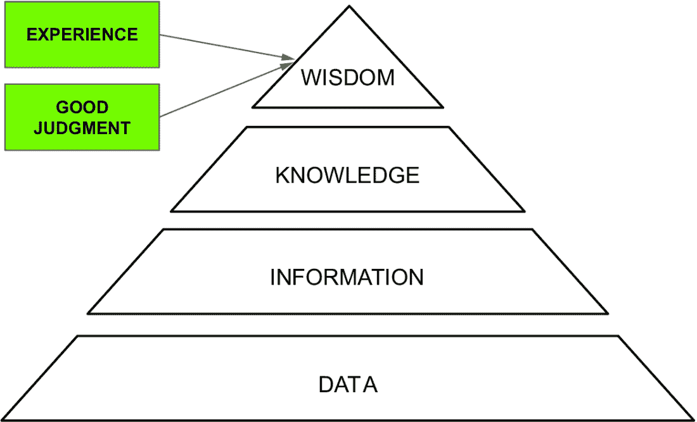

##### 图 9.1 增加了智慧成分的 DIKW 金字塔

总结来说，我们可以这样说，智慧由三个主要元素组成：知识综合、经验和良好的判断。让我们分别调查这三个元素，从知识综合开始。

### 9.1.1 将知识转化为智慧：下一步骤

每个值得尊重的故事都包含一个*信息*，这是在阅读故事后留在观众心中的东西。这是将智慧添加到故事中的体现。智慧使观众能够被故事所吸引，被打动，并在阅读故事后准备好采取行动。然而，信息本身是不够的。观众在阅读故事后必须采取行动。

将知识转化为智慧涉及将*下一步骤*添加到数据故事中。下一步骤是我们数据故事的解决方案，并定义听众在阅读故事后应该做什么。

每个故事都以一个*结局*结束，无论是好是坏，但必须有一个。即使在数据讲述故事的情况下，故事的结尾也被设想为开放式的。与小说不同，小说的结尾结束了故事，数据讲述故事应该是一个开放的故事，即在故事本身结束之后，还应该期待听众在阅读故事后有所行动。

为了更好地理解问题，让我们考虑一个例子。想象你开始阅读一本美丽的小说。当你读到主角的冒险时，突然，小说结束了，没有揭示主角是否克服了挑战或解决了问题。好吧，如果你只将你的图表限制在知识阶段，就像一本没有结尾的小说。你不应该只是展示你的数据发现；你应该告诉观众你认为他们应该如何根据这些发现采取行动。有句众所周知的话说，“知识不是力量；当用于行动时，它是潜在的力量。”那么，在你的图表中，你必须添加我们所说的*下一步骤*。这些作为行动呼吁被实施，邀请你的听众采取行动。

下一步骤并非来自天外，或者更糟糕的是，并非理论上的东西。它们是你研究和分析的结果。它们向你的听众提出在看到你的图表之后应该做什么——例如，关于可能的替代方案或前进的具体步骤。

下一步骤绝不能仅仅是通过数据获得的知识果实。它们必须与更广泛的东西挂钩，通常被称为*智慧*。智慧是从经验（从分析的数据中）和与他人分享的知识中得来的文化宝藏。

根据你生活的环境、观众类型和你的价值观，下一步必须基于一个道德框架。你不能仅仅基于你自己的信念或经验来提出一个通用的下一步方案。如果它们要得到广泛的应用，就必须将下一步方案锚定在你所生活的社会的价值观上。这些价值观因社区而异，但必须尊重基本的原则，并且下一步方案必须基于这些原则。

表 9.1 展示了最受欢迎的下一步分类。我们为每个分类提供了一个简短的描述、目的和示例。

##### 表 9.1 最受欢迎的下一步分类

| 类别 | 描述 | 目的 | 示例 |
| --- | --- | --- | --- |
| **寻求支持**  | 请求观众以某种方式支持故事。  | 利用观众的专业技能来解决故事中突出的问题。  | 邀请观众参与调查的文本  |
| **提供不同选项**  | 为观众提供可能的替代方案。  | 帮助观众做出决策。  | 可能的替代下一步行动列表：A，B，C  |
| **自由互动**  | 允许观众自由与故事互动。  | 让观众分析数据并得出结论。  | 一个交互式图表  |
| **深入了解**  | 鼓励观众深入探讨数据故事中呈现的主题或见解。  | 指导观众访问额外的资源、文章、研究或参考文献，以获得更全面的理解。  | 深度分析报告的链接  |
| **提出计划**  | 提出一个概述将要采取的行动顺序的计划。  | 让观众在故事结束后继续工作。  | 可能的顺序下一步行动列表  |
| **分享**  | 鼓励观众分享数据故事，例如，在他们的社交网络上。  | 利用观众的社交网络，促进讨论，并提高可见性，以扩大数据故事的影响力。  | 使用社交媒体按钮分享故事  |

现在，你已经学习了不同的下一步分类。接下来，让我们看看定义智慧、经验以及我们如何使用 ChatGPT 来帮助我们生成它的第二个要素。

### 9.1.2 将 ChatGPT 作为经验来源

传统上，经验来源于我们个人的背景，这有一定的局限性，特别是如果我们在一个特定领域没有太多经验的话。除了我们的个人经验外，我们可以使用生成式 AI 的知识来构建“集体背景”，以生成智慧。到目前为止，我们只使用生成式 AI 来生成内容。现在，是时候将其用作助手、队友，帮助我们思考和阐述概念了。在使用生成式 AI 的这种方式时，要小心它可能引发的一些伦理问题和其它问题，我们将在下一章讨论。在实践中，我们将使用 ChatGPT 作为经验来源。除了使用我们个人的经验来提出下一步行动外，我们还将使用 ChatGPT 作为另一个经验来源。

更具体地说，在本章中，我们将以两种方式使用生成式 AI：

+   作为内容生成者，正如我们在本书中已经做的那样

+   作为一名助手，帮助我们思考，将知识转化为智慧

在本节中，我们将只关注第 2 点，因为你在上一章已经学习了如何使用生成式 AI 来生成内容。特别是，我们将专注于 ChatGPT。

想象 ChatGPT 是你的个人思考助手。我们将使用 ChatGPT 作为助手，特别是它通过交互式聊天进行互动的能力，其中它记得之前的对话。我们可以将 ChatGPT 用作一个自然的对话者，帮助我们思考和制定策略。在本章中，我们只将使用 ChatGPT 来提出下一步行动，但一般来说，你可以使用 ChatGPT 的所有文化背景来生成新想法。为了使 ChatGPT 帮助我们解决问题，我们需要制定一个提示，以便 ChatGPT 能够理解它。

制定一个由三个部分组成的提示：

1.  对场景的定义

1.  一个问题

1.  生成多个可能的答案

我们实际上可以将第 2 点和第 3 点合并为一个单独的点。在这个初始提示之后，我们可以与 ChatGPT 进行讨论，并要求它深化一个或多个生成的答案。

我们将在本章后面看到这个提示结构的许多应用。目前，记住这一点就足够了：场景、问题、答案数量。

一旦我们从 ChatGPT 中提取出一个想法，我们就可以通过查看额外的外部材料来进一步研究这个主题。ChatGPT 只是第一步。它作为想法的来源。接下来，我们需要通过咨询外部材料和来源来验证 ChatGPT 建议的可行性。现在，你已经从概念上学习了如何将 ChatGPT 的文化背景作为经验来源，接下来让我们进入下一步：良好的判断力。

### 9.1.3 良好的判断力：将行动锚定在伦理框架中

*良好判断* 是准确评估情况并做出符合个人价值观和目标的决定。在本章中，我们将通过将我们的信息锚定在伦理框架上来实施良好判断。伦理框架作为基于指导道德行为的原理的决策指南。它提供了一个框架来评估我们行为的潜在后果，并帮助我们根据正确和公正来确定最佳行动方案。

缺乏伦理考虑的行为可能导致意想不到的后果，甚至可能造成伤害。以下是一些最受欢迎的伦理框架（Berengueres，2019）：

+   *功利主义* — 这个框架基于最大化效用或幸福来做出伦理决策。根据这种观点，如果一个行为能带来最大多数人的最大幸福，那么这个行为就是正确的。

+   *义务论* — 这个框架侧重于遵循道德规则或义务。它认为某些行为本身是善的或恶的，无论其后果如何。

+   *美德伦理学* — 这个框架强调培养诸如勇气、诚实和同情等美德的重要性。它认为，善良的人比遵循规则或最大化幸福更重要。

+   *关怀伦理学* — 这个框架强调关系和同理心的重要性。它基于对他人关怀和回应他们需求的伦理决策。

无论选择哪种伦理框架，如果你希望确保你的行动呼吁不被误解或滥用，下一步必须基于其中之一。这意味着考虑我们的行为对他人可能产生的影响，并确保它们与我们的价值观和原则一致。通过这样做，我们可以超越仅仅基于便利性做出决策，转向基于伦理考虑创造积极变化。

为了将下一步行动适应到特定的伦理框架中，我们可以实施以下两个阶段：

+   使用 ChatGPT 生成初步文本

+   修订产生的内容

在接下来的几节中，我们将看到如何实施这两个阶段。现在，你已经学习了与智慧三个组成部分（知识综合、经验和良好判断）相关的主要概念，让我们将这些概念应用到本书中实施的所有案例研究中。

## 9.2 案例研究

在本节中，我们将根据更具体的下一步行动，回顾本书中实施的所有案例研究。作为快速提醒，图 9.2 总结了前几章中实施的案例研究。让我们从第一个案例研究，即狗和猫活动开始。


##### 图 9.2 前几章中描述的所有例子的总结

### 9.2.1 第一章：狗和猫活动

考虑我们在第一章中分析的案例研究，狗和猫活动。作为复习，该案例研究专注于一个针对宠物的活动（狗和猫）。对于每个宠物类别，组织者战略性地在该特定宠物类别的专业网站上宣传活动。结果，参加活动的 10 只宠物中有 9 只是猫。下一步包括改善与狗网站相关的活动，以增加狗参与者的数量。图 9.3 显示了与该案例研究相关的最终数据故事。

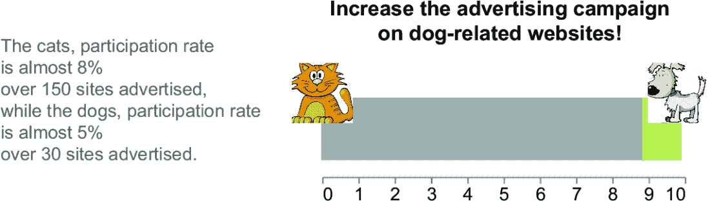

##### 图 9.3 与狗和猫案例研究相关的最终数据故事

第一章中描述的案例研究包含一个通用的下一步，邀请观众增加与狗相关的网站活动。让我们实施一个更具体的下一步，使用共享类别。为了获得一些实际实施的思路，让我们询问 ChatGPT 如何实际改进这些共享机会。让我们制定以下提示：*考虑以下场景：一个案例研究专注于一个针对宠物的活动（狗和猫）。对于每个宠物类别，组织者战略性地在该特定宠物类别的专业网站上宣传活动。结果，参加活动的 10 只宠物中有 9 只是猫。提出 5 种邀请观众分享与狗网站相关的活动信息的方法，以增加狗参与者的数量。* ChatGPT 将列出五个共享选项。以下是 ChatGPT 生成的一个可能的选项列表：

+   互动竞赛或挑战

+   互动社交媒体活动

+   博客推广和合作

+   定制的电子邮件活动

+   社区参与和论坛

在这里，我们只报告了选项列表。您可以在 ChatGPT 网站上找到完整的答案（[`ChatGPT.com/share/75475a1d-7dab-4487-858d-8288f7408737`](https://ChatGPT.com/share/75475a1d-7dab-4487-858d-8288f7408737)）。我们可以对前面的选项进行阐述，例如，将它们重新制定为三个选项：在线活动、影响者参与和社交媒体推广。

让我们实施前面的步骤。我们将实现共享选项，作为通过线条连接的三个矩形，如图 9.4 所示。

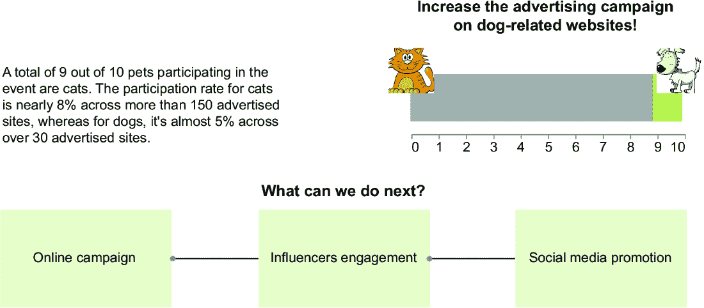

##### 图 9.4 狗和猫案例研究可视化路线图

实现的代码可在本书的 GitHub 仓库中找到，位于 09/awareness-and-campaigns/pets-visualized-roadmap.py。我们将只关注下一步（图表的底部部分）。首先定义矩形的大小。我们使用参数值使代码尽可能通用。以下列表显示了生成位置为 0、15 和 30 的三个矩形的代码。

##### 列表 9.1 设置矩形的定位

```py
import pandas as pd

width = 10
space = 5
N = 3
x = [i*(width+space) for i in range(N)]
y = [0 for i in range(N)]
x2 = [(i+1)*width+i*space for i in range(N)]
y2 = [10 for i in range(N)]
text = ['Online Campaign', 'Influencers Engagement', 'Social Media Promotion']

df_rect = pd.DataFrame(
    {   'x': x,
        'y': y,
        'x2': x2,
        'y2': y2,
        'text' : text
    }
)
```

注意：我们假设我们想要生成`N`（例如 3）个矩形，并且每个矩形都有一个大的`width`（10）和两个矩形之间的空间`space`（5）。然后，我们使用`x`、`x2`、`y`和`y2`作为顶点生成矩形坐标。我们还为每个矩形包含标签文本。最后，我们创建一个包含定义变量的 DataFrame。

接下来，在 Altair 中绘制矩形。

##### 列表 9.2 绘制矩形

```py
import altair as alt 

rect = alt.Chart(df_rect).mark_rect(
    color='#80C11E',
    opacity=0.2
).encode(
    x=alt.X('x:Q', axis=None),
    y=alt.Y('y:Q', axis=None),
    x2='x2:Q',
    y2='y2:Q'
).properties(
    width=700,
    height=100,
    title=alt.TitleParams(
        text=['What can we do next?'],
        fontSize=20,
        offset=10
    )
)
```

注意：使用`mark_rect()`标记绘制矩形。使用`x`、`y`、`x2`和`y2`通道并移除坐标轴（`axis=None`）。最后，设置图表大小和标题。使用`alt.TitleParams()`指定标题字体大小（`fontSize`）和标题与图表的偏移量。

现在，我们准备在矩形中绘制标签，如下所示。

##### 列表 9.3 绘制标签

```py
text = alt.Chart(df_rect).mark_text(
    fontSize=14,
    align='left',
    dx=10,
).encode(
    text='text:N',
    x=alt.X('x:Q', axis=None),
    y=alt.Y('y_half:Q', axis=None),
).transform_calculate(
    y_half='datum.y2/2'
)
```

注意：使用`mark_text()`标记绘制标签。使用`transform_calculate()`方法设置每个标签的 y 坐标。

下一步涉及定义线条坐标。我们必须绘制`N-1`条线，第一条从位置 10 开始，到位置 15 结束，第二条从位置 25 开始，到位置 30 结束。使用公式来计算这些位置。

##### 列表 9.4 定义线条坐标

```py
x = [width*i+space*(i-1) for i in range(1,N)]
y = [5 for i in range(N-1)]
y2 = [5 for i in range(N-1)]
x2 = [(width+space)*i for i in range(1,N)]

df_line = pd.DataFrame(
    {   'x': x,
        'y': y,
        'x2': x2,
        'y2': y2
    }
)
```

注意：使用公式计算 x 坐标，并将 y 坐标设置为常数。

绘制线条。

##### 列表 9.5 绘制线条

```py
line = alt.Chart(df_line).mark_line(
    point=True,
    strokeWidth=2
).encode(
    x=alt.X('x:Q', axis=None),
    y=alt.Y('y:Q', axis=None),
    x2='x2:Q',
    y2='y2:Q'
)
```

注意：使用`mark_line()`标记绘制线条。将`point=True`设置为显示点。

如果我们已经绘制了狗和猫图表的前几个元素，我们就可以构建最终的图表。

##### 列表 9.6 构建最终图表

```py
chart = ((context | (chart + annotation + img)) & (rect + line + text)
).configure_view(
    strokeWidth=0
).resolve_scale(
    color='independent',
    x='independent',
    y='independent'
).configure_axis(
    grid=False
)

chart.save('pets-visualized-roadmap.xhtml')
```

注意：最终的图表包括左侧的`上下文`；主要条形图（`chart`）；右侧的`注释`（狗和猫的文本）和图像（`img`）；以及下面的下一步（`rect`、`line`和`text`）。在`resolve_scale()`方法中将`color`、`x`和`y`设置为`独立`以独立渲染图表刻度。

现在我们已经完成了这个例子，让我们尝试同一主题的练习。

#### 练习 1

再次考虑狗和猫案例研究，并实施下一步到 Facebook 和 Instagram，使用社交媒体*分享*选项。使用`href`通道包含指向外部网站的链接。图 9.5 显示了可能的结果。您可以在本书的 GitHub 仓库中找到此练习的解决方案，位于 09/awareness-and-campaigns/pets-social-sharing.py。


##### 图 9.5 狗和猫案例研究，增加了社交媒体分享行动呼吁

### 9.2.2 第二章：游客到达情况

考虑我们在第二章中分析的游泳池案例研究。作为一个快速提醒，该案例研究集中在在葡萄牙酒店建设新游泳池的可能性。数据故事显示了近年来葡萄牙游客数量的增加，如图 9.6 所示。


##### 图 9.6 与游泳池案例研究相关的最终数据故事

第二章中描述的案例研究包含了一个通用的下一步，邀请观众建造游泳池。让我们让 ChatGPT 提出关于不同选项的可能下一步建议。让我们使用以下提示：*考虑一个专注于在葡萄牙酒店建造新游泳池可能性的案例研究。数据故事显示了近年来葡萄牙游客数量的增加。提供 5 个选项以进一步调查游泳池的可行性*。以下是可能的 ChatGPT 回答列表：

1.  市场研究和需求分析

1.  竞争分析

1.  财务可行性研究

1.  监管和环境评估

1.  季节性和利用率分析

你可以在 ChatGPT 的网站上找到完整的对话：[`ChatGPT.com/share/28f05921-b548-4edc-938d-ccfcb2d5bba6`](https://ChatGPT.com/share/28f05921-b548-4edc-938d-ccfcb2d5bba6)。例如，我们可以详细阐述 ChatGPT 的建议，并提出以下下一步：

+   向其他酒店业者询问他们的经验。

+   邀请行政团队计算成本。

让我们实施前面的下一步，如图 9.7 所示。


##### 图 9.7 带有社交分享行动号召的狗和猫案例研究

首先，使用 DALL-E 生成下一步部分数据故事底部的两个黑色图标。对于第一个图标，使用以下提示：*客户体验，黑白图标*。图 9.8 展示了 DALL-E 生成的一个可能结果。选择一张图片并下载。


##### 图 9.8 使用以下提示生成的 DALL-E 可能输出：客户体验，黑白图标

对于第二个，使用以下提示：*美元袋，黑白图标*。图 9.9 展示了 DALL-E 生成的一个可能结果。选择一张图片并下载。

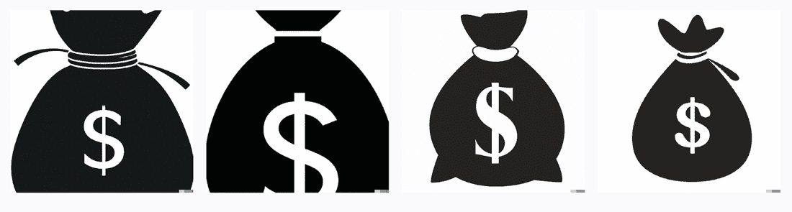

##### 图 9.9 使用以下提示生成的 DALL-E 可能输出：美元袋，黑白图标

现在，我们准备编写生成下一步部分的代码。你可以在本书的 GitHub 仓库 09/collaborative-efforts/actionable-recommendations.py 下找到代码。让我们专注于代码中的行动号召部分。首先创建包含文本和要包含在 CTA 中的图像的 DataFrame。

##### 列表 9.7 CTA DataFrame

```py
df_cta = pd.DataFrame(
    {'text' : [['Ask other hoteliers', 'for their experience'], ['Invite the administrative team', 'to calculate the costs']],
    'x' : [0,9.8],
    'img' : ['img/experience.png', 'img/costs.png']})
```

备注：创建一个新的 DataFrame，包含 CTA 文本、它们在 x 轴上的位置以及图像的路径。

接下来，让我们使用 ChatGPT 为 CTA 生成标题。给 ChatGPT 以下提示：*作为行动邀请者针对高管。从以下文本中生成四个标题：下一步：向其他酒店业者询问他们的经验。邀请行政团队计算成本*。图 9.10 展示了一个可能的结果。

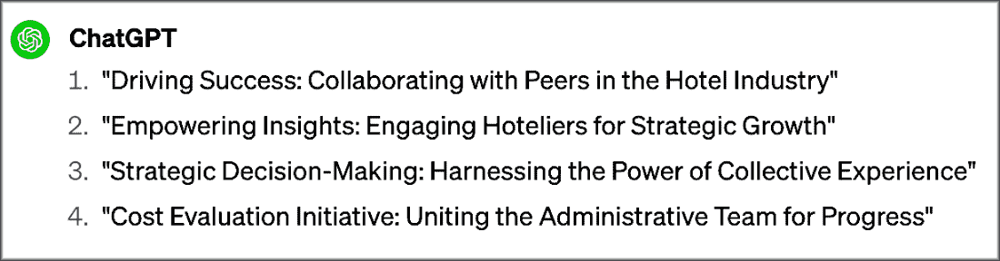

##### 图 9.10ChatGPT 生成四个 CTA 标题的可能输出

让我们选择第三个标题，“战略决策：利用集体经验的力量”，作为故事下一步部分的标题。从视觉上讲，我们将下一步实现为两个图表的组合：文本图表和图像图表。由于两个图表有一些共同的部分，让我们先绘制一个基本图表。

##### 列表 9.8 为下一步构建基本图表

```py
base_cta = alt.Chart(df_cta
).encode(
    x=alt.X('x:Q', axis=None)
).properties(
    title=alt.TitleParams(
        text=['Strategic Decision-Making:', 'Harnessing the Power of Collective Experience'],
        fontSize=18,
        anchor='start'
    )
)
```

注意：在不指定任何标记的情况下构建图表的基本结构。仅指定输入 DataFrame（`df_cta`）、共享编码通道（`X`）和属性（`title`）。使用`TitleParams()`指定标题细节。

一旦我们定义了基本图表，我们就可以分别定义每个图表的细节。以下列表描述了如何实现文本。

##### 列表 9.9 绘制文本图表

```py
text_cta = base_cta.mark_text(
    lineBreak='\n',
    align='left',
    fontSize=20,
    y=0,
    dx = 40,
    color='#81c01e'
).encode(
    text='text:N'
)
```

注意：文本图表通过添加文本标记属性（`mark_text`）和文本的特定编码（`text`通道）来详细说明`base_cta` `chart`。在`mark_text()`属性中，指定一些文本属性，例如换行字符（`lineBreak`）、如何对齐文本（`align`）、字体大小（`fontSize`）、y 位置（`y`）、从 x 位置的 x 轴偏移（`dx`）和文本颜色（`color`）。

接下来，绘制图像，如下所示。

##### 列表 9.10 绘制图像图表

```py
img_cta = base_cta.mark_image(
    width=50,
    height=50,
    y=10
).encode(
    url='img'  
)
```

注意：图像图表通过添加图像标记属性（`mark_image`）和图像的特定编码（`url`通道）来详细说明`base_cta` `chart`。在`mark_image()`属性中，指定一些图像属性，例如图像宽度（`width`）、高度（`height`）和 y 位置（`y`）。

现在，我们可以构建最终的图表。我们假设我们已经实现了数据故事的前一部分（图表、注释、评论和机场图表）。以下列表显示了如何分层图表以渲染最终的数据故事。

##### 列表 9.11 构建最终数据故事

```py
chart = ((commentary & airports) | ((chart + annotation) & img_cta + text_cta)
).resolve_scale(
    x='independent',
).configure_view(
    strokeWidth=0
)

chart.save('actionable-recommendations.xhtml')
```

注意：最终图表包括上下文（`commentary`和`airport`）、主要图表（`chart`和`annotation`）和下一步（`image_cta`和`text_cta`）。

#### 练习 2

再次考虑游泳池案例研究，并实施*学习更多*的下一步。使用`href`通道包含指向外部网站的链接。图 9.11 显示了可能的结果。您可以在书籍的 GitHub 仓库中找到此练习的解决方案，位于 09/collaborative-efforts/learn-more.py。


##### 图 9.11 与游泳池案例研究相关的最终数据故事

### 9.2.3 第三章：北美人口

考虑我们在第三章中分析的案例研究，即过去 50 年北美的人口，该研究旨在研究北美的人口增长。案例研究发现，北美人口增长与世界其他地区之间存在差距。故事作为下一步，提出了增加美国人口增长的一些策略，如图 9.12 所示。


##### 图 9.12 与北美人口案例研究相关的最终数据故事

本案例研究已经包含了一些可能的下一步行动选项。我们可以通过提出一个按顺序执行的计划来修改它们。让我们用以下提示与 ChatGPT 开始对话：*考虑一个专注于北美人口增长的案例研究。该研究发现了北美人口增长与世界其他地区之间的差距。这里有三种可能的选择来增加北美的人口增长：加强家庭友好政策、发展移民和激活乡村地区。根据你将先应用哪个选项以及之后应用哪个选项，按顺序排列这三个选项。* ChatGPT 通过排列这三个选项并解释为什么选择这个顺序来回答。在我的情况下，它提供了以下顺序：

1.  加强家庭友好政策。

1.  发展移民。

1.  激活乡村地区。

我们也可以通过提供以下提示来优先考虑一个特定的选项，例如激活乡村地区：*如果你首先激活乡村地区会怎样？* 在我的情况下，答案并不有趣。我们可以通过向 ChatGPT 提出以下问题来进一步细化主题：*在执行之前，哪个选项最容易？* 根据 ChatGPT 的说法，最容易执行的选项是加强家庭友好政策。对话可以继续，直到我们找到我们想要的东西。您可以在 ChatGPT 的网站上找到本例中使用的完整对话（[`chat.openai.com/share/78c6c6a1-f468-4271-aa60-ac0d410ce117`](https://chat.openai.com/share/78c6c6a1-f468-4271-aa60-ac0d410ce117)）。一旦我们从 ChatGPT 中提取了这些信息，我们就可以通过查看额外的外部材料来进一步调查这个主题。ChatGPT 只是第一步。它作为一个经验。接下来，我们需要验证 ChatGPT 提议的可行性。

本案例研究提供了一个与 ChatGPT 进行对话并将其作为队友的例子。不要害怕向 ChatGPT 提问。无论你问什么问题，即使是令你感到不舒服的问题，它都会始终回答你。

### 9.2.4 第四章：体育项目

考虑我们在第四章中分析的案例研究，该研究涉及选择最佳体育项目进行训练以在即将到来的比赛中取得好成绩（图 9.13）。作为我们故事的下一步，我们提出了投资自行车和赛艇。这一步过于笼统，因此我们可以改进它。

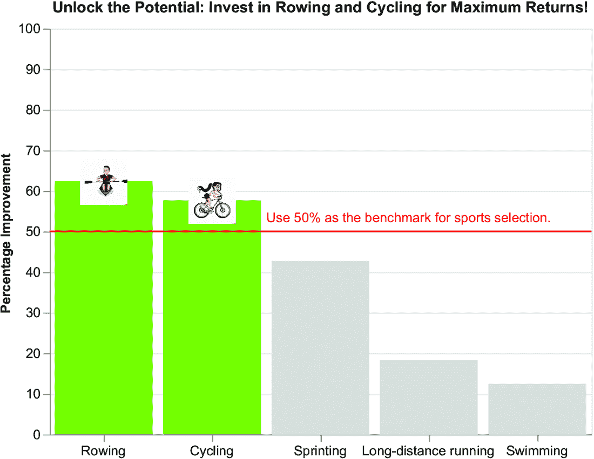

##### 图 9.13 第四章中的案例研究

在这个例子中，我们将下一步骤嵌入到了标题中。让我们通过详细说明我们可以投入的改善划船和骑自行车的投资来提高它们。让我们询问 ChatGPT 提高前两个项目成绩所需的技术技能。使用以下提示：*考虑一个与体育项目相关的场景，以在即将到来的比赛中训练并取得好成绩。作为我们故事的下一步，我们提出了投资自行车和划船。提出提高这两个项目的所需技术技能.* ChatGPT 为这两个项目中的每一个都生成了一份详细的技术技能列表，例如，骑自行车的操控和定位，划船的划水技巧，以及划船的平衡和稳定性。您可以在 ChatGPT 的网站上找到完整的答案（[`chat.openai.com/share/9a28714f-dca3-4bbd-9c11-72aa9e371959`](https://chat.openai.com/share/9a28714f-dca3-4bbd-9c11-72aa9e371959)）。现在，我们可以通过询问 ChatGPT 将这些技能分组到更一般的类别中来继续对话。使用以下提示：*将提出的技能分为四个一般类别*。可能生成的输出包括以下类别：

+   技术技能

+   体能技能

+   战术技能

+   营养和心理技能

我们可以使用生成的技能作为可能的下一步。我们只将营养和心理技能修改为心理技能。图 9.14 显示了修改后的故事。一旦我们找到这些信息，我们可以通过寻找额外的材料来进一步深入这个主题，例如，每个技能对最终结果的估计贡献。

我们假设每个运动的表现由四个因素决定：体能、心理、战术和技术。每个因素根据体育项目不同，对表现有不同的贡献。图 9.14 显示了某些假设值。此外，数据故事设想我们想要专注于技术因素以提高运动员的表现。表 9.2 显示了包含每个因素对体育表现贡献的数据集结构。

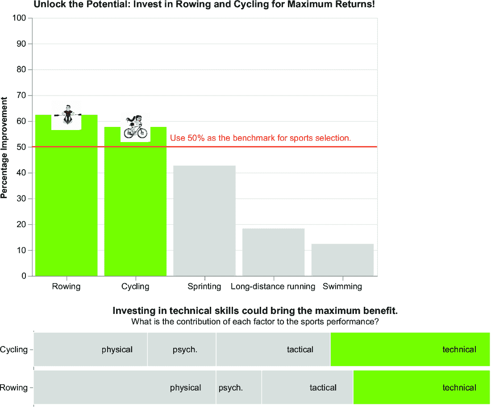

##### 图 9.14 运动员案例研究，包括一个可操作的建议作为下一步

##### 表 9.2 因子数据集

| 划船 | 自行车 | 因子 |
| --- | --- | --- |
| 40  | 25  | 体能  |
| 30  | 35  | 技术  |
| 20  | 25  | 战术  |
| 10  | 15  | 心理  |

我们将使用堆叠条形图和分层文本来实现下一步。您可以在本书的 GitHub 仓库下的 09/training-and-development/support-and-assistance.py 中找到这个示例的代码。让我们首先定义基本图表，包括条形图和文本共享的编码和属性。

##### 列表 9.12 构建基本图表

```py
df_cta = pd.read_csv('source/factors.csv')

df_cta = df_cta.melt('Factor', var_name='Sport', value_name='Value')

base_cta = alt.Chart(df_cta).encode(
    y=alt.Y('Sport', title=''),
    x=alt.X('Value', axis=None, title='',  stack=True),
).properties(
    title=alt.TitleParams(
        text='Investing in technical skills could bring the maximum benefit',
        subtitle='What is the contribution of each factor to the sports performance?'
    ),
    width=600,
    height=100
)
```

注意：首先，读取因素数据集，并使用`melt()`将 DataFrame 从宽格式转换为长格式。接下来，通过定义输入数据集（`alt.Chart(df_cta)`）、编码（`x`和`y`）和属性（`title`、`width`和`height`）来创建基础图表（`base_cta`）。对于`x`通道，指定`stack=True`以创建堆叠图表。

现在，我们可以构建堆叠条形图。

##### 列表 9.13 构建堆叠条形图

```py
cta = base_cta.mark_bar(
    strokeWidth=3,
    stroke='white'
).encode(
    color=alt.Color('Factor', 
              scale=alt.Scale(
                      range=['lightgrey', '#80C11E', 
                          'lightgrey', 'lightgrey'], 
                      domain=['physical', 'technical', 
                          'taktical', 'psycol.']
              ),
              legend=None),
)
```

注意：使用基础图表来构建堆叠条形图。设置标记属性（`mark_bar`）和颜色通道。

最后，绘制文本并将其与其他数据故事的部分结合起来，如下所示。

##### 列表 9.14 绘制文本

```py
text_cta = base_cta.mark_text(
    xOffset=-35,
    fontSize=14,
    color='black'
).encode(
    text = 'Factor:N',
)
chart = ((chart + annotation) & (cta + text_cta)
).configure_view(
    strokeWidth=0
)
```

注意：使用基础图表来构建文本图表。添加标记属性（`mark_text`）和文本通道。接下来，绘制最终的图表，包括主要图表（`chart`）、注释（`annotation`）和下一步（`cta`和`text_cta`）。

##### 挑战：改进下一步

通过用主图表中显示的相同图标替换图 9.14 中的`y`标签（自行车和划船）来改进图 9.14 中的下一步。

现在你已经学会了如何实现培训和发展的下一步，让我们继续到下一个类别：战略行动。

### 9.2.5 第五章：无家可归

考虑我们在第五章中分析的关于意大利地区无家可归的案例研究，如图 9.15 所示。该案例研究专注于寻找资金来资助关于无家可归者的项目。在下一步骤部分，它提出了实施一些战略行动来减轻无家可归问题。


##### 图 9.15 第五章中描述的无家可归案例研究

##### 挑战：选择另一个下一步

在以下下一步骤中选择一个关于无家可归案例研究的方案，并解释你选择它的原因：寻求支持、自由互动、了解更多、提出计划、分享。

### 9.2.6 第五章：假新闻

考虑我们在第五章中分析的关于假新闻的案例研究，如图 9.16 所示。该案例研究专注于识别最可能包含假新闻的新闻类别。我们在标题中包括了下一步。


##### 图 9.16 前几章中描述的所有示例的总结

我们可以通过添加一个交互式框来改进我们的下一步，该框在观众点击特定条形时显示一个示例文章标题和标题，如图 9.17 所示。在这个例子中，我们不会使用 ChatGPT。具体来说，我们使用自由互动的号召性用语来实现本例的下一步。

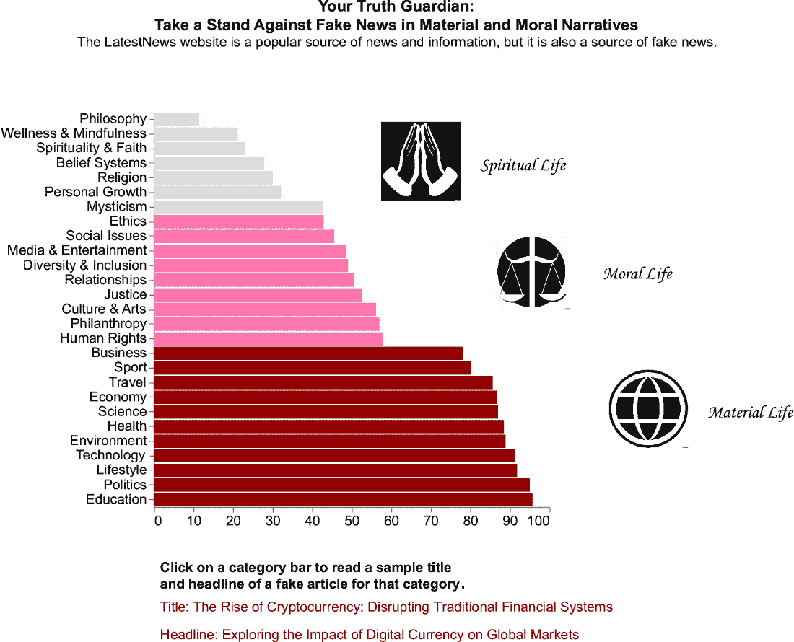

##### 图 9.17 前几章中描述的所有示例的总结

我们将包含标题和标题的文本作为根据所选条形变化的文本图表实现，最初不显示任何文本。你可以在这个例子相关的代码在书的 GitHub 仓库下的 09/engagement-and-communication/engagement-and-interaction.py 中找到。

我们将构建一个选择点，并将其连接到条形图的`Category`字段。接下来，我们将使用选择点过滤下一部分要显示的文本。我们将假设包含每个类别的文章标题和副标题的数据集，如表 9.3 所示。

##### 表 9.3 文章数据集

| 类别 | 标题 | 副标题 |
| --- | --- | --- |
| 政治  | 全球外交的未来：应对 21 世纪挑战  | 国际关系如何塑造我们今天的世界  |
| 经济  | 加密货币的崛起：颠覆传统金融系统  | 探索数字货币对全球市场的影响  |
| 正义  | 改革刑事司法：走向公平和公正的系统  | 解决各国法律体系中的不平等问题  |
| 宗教  | 现代社会中的宗教对话：在差异中搭建桥梁  | 理解宗教信仰和实践的多样性  |

首先创建一个图表的选择点。将数据集的`Category`字段添加为交互元素的作业字段，如下所示。

##### 列表 9.15 定义选择点

```py
click = alt.selection_point(name='Select', 
                            fields=['Category'], empty=False)
```

注意  定义一个名为`Select`的选择点，允许用户根据其`Category`值选择数据点。将`empty`参数设置为`False`确保至少选择一个数据点。

现在，使用定义的选择点设置所选条形图的颜色，如下所示。来自第五章原始版本实现的代码以粗体显示。

##### 列表 9.16 构建交互式条形图

```py
color=alt.Color('Macro Category:N',
        scale=alt.Scale(
            range=['#991111', '#f38f8f','gray'],
            domain=['Material Life', 'Moral Life', 'Spiritual Life']
        ),
        legend=None
    )

chart = alt.Chart(df).mark_bar(
).encode(
    y=alt.Y('Category:N', 
            sort='x',
            title=None,
            axis=alt.Axis(labelFontSize=14)
            ),
    x=alt.X('Percentage of Fake Articles:Q',
            title=None,
            axis=alt.Axis(labelFontSize=14, 
                          titleFontSize=14),
    ),
    color=alt.condition(click | ~click, color, alt.value('lightgray')
    )
).properties(
    width=400,
    height=400
).transform_calculate(
    'Percentage of Fake Articles', alt.datum['Number of Fake Articles']/alt.datum['Number of Articles']*100
).add_params(
 click
)
```

注意  首先，将颜色通道定义为变量（我们将在文本图表中也要使用它，因此将其定义为变量以避免重复编写）。接下来，通过定义`y`和`x`通道来构建条形图。同时，将颜色通道定义为依赖于`click`选择点的。使用表达式`click` `|` `~click` 设置颜色，当`click`为`True`时（这发生在选中条形图时）和当它为`False`时（这发生在没有选中条形图时，因为我们已将`empty`设置为`False`）。然后，设置属性并通过`add_params`方法添加点击交互性。

现在，我们可以将文本图表绘制为两个图表的组合：标题和副标题。首先，构建基础图表，两个图表之间共享详细信息。

##### 列表 9.17 构建基本图表

```py
df_cta = pd.read_csv('source/articles.csv')
df_cta['Macro Category'] = df_cta['Category'].apply(lambda x: 'Material Life' if x in material_life else ('Moral Life' if x in moral_life else 'Spiritual Life'))

base_cta = alt.Chart(df_cta).mark_text(
    fontSize=20,
    align='left',
).encode(
    color=color
).transform_filter(
    click
)
```

注意  首先读取文章数据集。然后，添加用于着色文本的宏类别。最后，通过指定标记属性（`mark_text`）、颜色通道和用于动态选择文本的过滤器来定义基本图表。

现在，让我们继续处理文章标题。

##### 列表 9.18 构建文章标题

```py
title_cta = base_cta.encode(
    text='Label:N',
).properties(
    title=alt.TitleParams(
        text=['Click on a category bar to read a sample title', 'and headline of a fake article for that category'],
        fontSize=25,
        offset=20,
        anchor='start'
    )
).transform_calculate(
    Label= 'Title: ' + alt.datum.Title
)
```

注意  使用基础图表绘制标题文章文本。指定`text`通道，使用通过`transform_calculate`方法生成的`Label`列。同时，设置图表属性。

最后，构建文章标题，使用与文章标题类似的程序。

##### 列表 9.19 构建文章标题

```py
headline_cta = base_cta.encode(
    text='Label:N'
).transform_calculate(
    Label= 'Headline: ' + alt.datum.Headline
)

chart = (chart & (title_cta & headline_cta)).configure_axis(
    grid=False
).configure_view(
    strokeWidth=0
)
chart.save('engagement-and-interaction.xhtml')
```

注意：使用基础图表绘制标题文章文本。然后，将图表组合起来以获得最终的数据故事（假设图表包含主要图表）。使用`configure_axis(grid=False)`从图表中移除网格。

到目前为止，你已经学会了如何实施各种后续步骤。在最后一个案例研究中，你将学习如何将你的故事锚定到伦理框架中。让我们将这种策略应用到之前章节中实施的鲑鱼养殖业案例研究中。

### 9.2.7 第 6-8 章：鲑鱼养殖业案例研究

考虑鲑鱼养殖业案例研究。作为一个快速回顾，鲑鱼养殖业案例研究旨在研究美国鲑鱼养殖业的安全问题。到目前为止，我们已经表示了美国从鲑鱼出口中获得的美元收入。我们考虑了两种情景：一种积极的情景，我们关注收入的增加，另一种消极的情景，我们关注疾病时期。在本章中，我们只关注积极的情景，但你也可以轻松地将描述的概念应用到消极情景中。图 9.18 显示了上一章结束时产生的数据故事：将信息转化为知识。

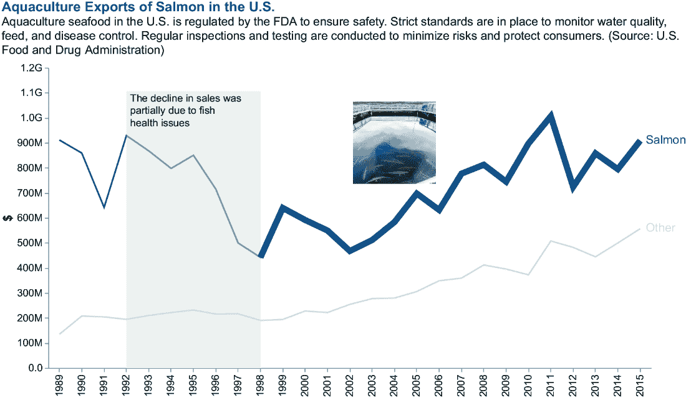

##### 图 9.18 将信息转化为知识后产生的故事

让我们假设，作为我们数据故事的下一步，我们想要提出一些战略性行动来继续美元趋势线的积极增长。我们提出以下下一步：

+   强调鲑鱼安全措施。

+   提高鲑鱼养殖业实践。

+   推广可持续鲑鱼消费。

让我们使用 ChatGPT 来调整提出的下一步到不同的伦理框架中。为 ChatGPT 生成基于功利主义文本的以下提示：*考虑以下伦理框架：功利主义。*这个框架基于最大化效用或幸福来做出伦理决策。根据这种观点，如果一个行为能带来最大多数人的最大幸福，那么这个行为就是正确的。

重新制定以下下一步以适应功利主义框架：

+   强调鲑鱼安全措施。

+   提高鲑鱼养殖业实践。

+   推广可持续鲑鱼消费。

图 9.19 显示了 ChatGPT 可能产生的一个输出。


##### 图 9.19 ChatGPT 可能生成的一个输出

现在，让我们通过以下问题进行复习：这个输出是否真的锚定到功利主义框架中？如果答案是肯定的，我们就可以将输出纳入我们的故事中；否则，我们必须在将其添加到我们的故事之前进行纠正。在下一章中，我们将看到更多关于与 ChatGPT 和通用生成 AI 相关的伦理问题的细节。现在，控制产生的输出就足够了。

在我们的案例中，生成的输出包含诸如*福利*、*社会福祉*和*总体幸福*等词语，这与功利主义框架相符。

将相同的程序应用于其他伦理框架。表 9.4 显示了 ChatGPT 的一些可能输出。

##### 表 9.4 ChatGPT 为每个伦理框架生成的输出

| 伦理框架 | 强调鲑鱼安全措施 | 提高鲑鱼养殖实践 | 促进可持续鲑鱼消费 |
| --- | --- | --- | --- |
| 功利主义 | 通过鲑鱼安全措施最大化公众福祉 | 通过增强型鲑鱼养殖实践提高社会福祉 | 通过促进可持续鲑鱼消费培养更大的总体幸福 |
| 义务论 | 维护鲑鱼安全措施 | 遵守增强型鲑鱼养殖实践 | 倡导道德和可持续的鲑鱼消费 |
| 德性伦理 | 培养鲑鱼福祉的道德管理 | 促进鲑鱼健康的优良养殖实践 | 通过可持续鲑鱼消费提升美德 |
| 关怀伦理 | 优先考虑鲑鱼福祉：实施安全措施 | 培育鲑鱼：用同理心改善养殖实践 | 关怀消费：培养可持续鲑鱼选择 |

一旦你选择了特定的伦理框架，你就可以用它来实施你的案例研究中的下一步。

#### 练习 3

考虑 ChatGPT 为功利主义伦理框架生成的输出，并将其实施为可操作的建议。例如，你可以生成图 9.20 中描述的最终数据故事。你可以在本书的 GitHub 仓库 CaseStudies/aquaculture/from-knowledge-to-wisdom/chart.py 中找到这个练习的解决方案。


##### 图 9.20 水产养殖案例研究的最终数据故事

现在你已经学会了如何将你的下一步行动与一个伦理框架联系起来，让我们继续本章的最后一部分：如何在你的数据故事中战略性地放置你的下一步行动。

## 9.3 下一步战略定位

下一步必须遵循你数据故事的主要观点。因此，我建议你在数据可视化图表的以下三个主要位置之一放置你的下一步：在标题中、在右侧或图表下方。在本节的剩余部分，我们将分别研究每个下一步位置。

### 9.3.1 标题位置

在标题中添加下一步意味着将其添加到图表的顶部，如图 9.21 所示。使用标题来声明观众应该如何处理数据故事。

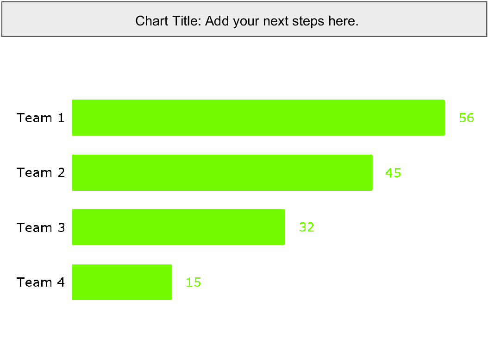

##### 图 9.21 图表顶部的下一步位置

##### 挑战：标题中的下一步

考虑第 1-5 章中描述的案例研究（图 9.2）。哪些在标题中添加了下一步？

### 9.3.2 正确位置

在图表右侧添加下一步涉及立即在图表后添加，如图 9.22 所示。


##### 图 9.22 图表右侧的下一步位置

使用图表的正确部分添加深入细节，例如文本描述。使用其他图表向观众解释在阅读前几部分之后应该做什么。

##### 挑战：图表右侧的下一步

考虑第 1-5 章中描述的案例研究（图 9.2）。哪些在图表右侧添加了下一步？

### 9.3.3 下方放置

图表下方的下一步与之前的案例仅在位置上有所不同，如图 9.23 所示。

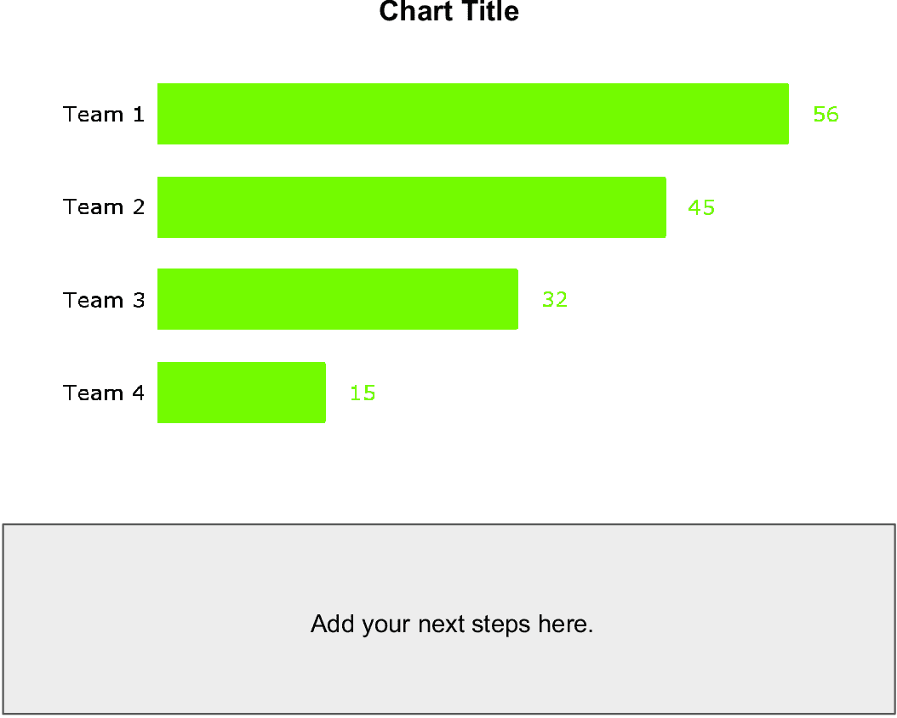

##### 图 9.23 图表下方的下一步位置

##### 挑战：图表下方的下一步

考虑第 1-5 章中描述的案例研究（图 9.2）。哪些在图表下方添加了下一步？

在本章的第一部分，你学习了智慧的概念和下一步。接下来，你学习了如何将 ChatGPT 作为经验替代来源使用。然后，你看到了如何将你的下一步锚定在伦理框架上。最后，你看到了如何在故事中战略性地放置下一步。在下一章中，你将看到如何发布你的数据故事以及生成式 AI 在数据故事讲述中的伦理影响可能有哪些。

## 摘要

+   智慧是利用你的经验和知识做出明智的决定或判断的能力。

+   将知识转化为智慧涉及在数据故事中添加下一步。下一步是我们数据故事的解决方案，并定义了在阅读故事后观众应该做什么。

+   根据它们旨在实现的目标将下一步分类到不同的类别：寻求支持、提供不同选项、自由互动、了解更多、提出计划或分享。

+   使用 ChatGPT 的知识帮助你生成可能包含在你故事中的下一步。然而，你必须始终手动检查和细化建议的下一步。

+   伦理框架作为基于指导道德行为的原理的决策指南。下一步必须基于伦理框架来确立。

## 参考文献

+   Berengueres, J. and Sandell, M. (2019). *《数据可视化与故事讲述入门：数据科学家指南（视觉思维）》*。自出版。

+   McDowell, K. (2021). Storytelling Wisdom: Story, Information, and DIKW. *《信息科学和技术的协会杂志》*，*72* (10)，1223–1233。
