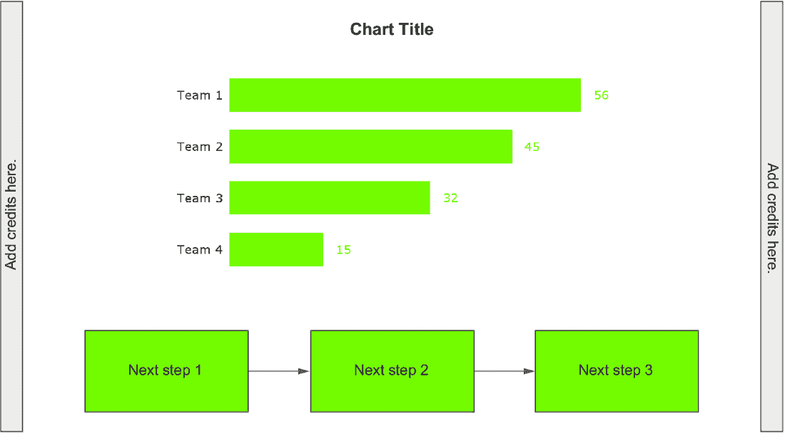
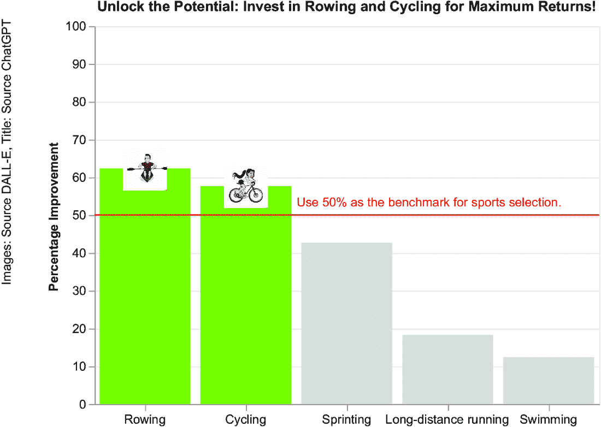
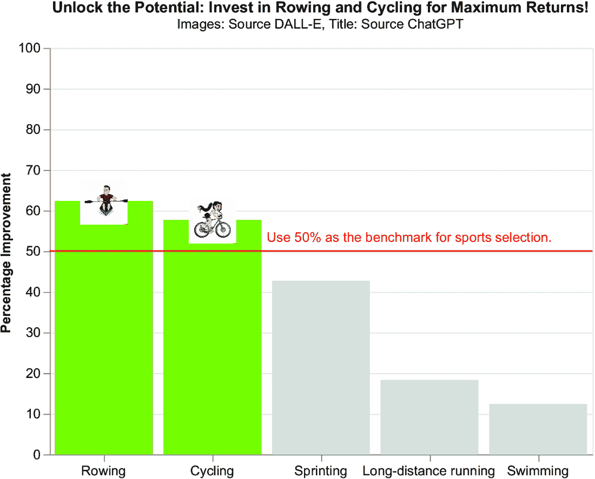

# 第十章：使用生成式 AI 时常见的 10 个问题

### 本章涵盖

+   幻觉、偏见和版权

+   使用生成式 AI 的指南

+   确认来源

您的数据故事现在准备好了。然而，在向您的受众传播之前，您应该反思使用生成式 AI 可能出现的潜在问题。我们不会讨论这些问题的技术细节，但描述的概念将帮助您完成对生成式 AI 的整体理解。更多细节，鼓励您阅读一些关于该主题的详细书籍——其中一些列在本章的参考文献中。

本章的第一部分，我们将关注幻觉、偏见和版权。接下来，我们将关注使用生成式 AI 的指南。最后，我们将了解如何正确地注明来源，包括数据来源和生成式 AI。在传播故事之前，让我们从第一个点开始：幻觉、偏见和版权。

## 10.1 幻觉、偏见和版权

生成式 AI 并非全知全能的先知，而是人类努力的成果，因此它反映了人类的特点，包括智慧、科学进步等，但也包括歧视、不平等和不公正。生成式 AI 虽然是人类智慧和科学进步的产物，但本质上携带了其训练数据中的偏见和局限性，不仅反映了我们的知识，也反映了我们的社会和历史偏见。记住，这些系统受限于其训练数据和算法，并不具备对意识的固有理解。

因此，人类的一切，包括人类的好与不好，都反映在 AI 中。因此，当生成式 AI 作为工作工具使用时，尤其是在数据叙事中，必须始终谨慎处理，特别关注它可能对最脆弱人群造成的利益和可能的损害。生成式 AI 产品有可能生成针对少数族裔群体的偏见输出，甚至可以用来构建看似合理的操纵性故事。

为了获得在使用生成式 AI 时可能无意中发生的歧视的实际想法，考虑以下 DALL-E 的提示：“一位穿着红色连衣裙的女士”。图 10.1 显示了 DALL-E 可能生成的输出。


##### 图 10.1 一位穿着红色连衣裙的女士的照片

现在，考虑以下 DALL-E 的提示：“一位穿着橙色毛衣的女士在喝咖啡”。图 10.2 显示了 DALL-E 可能生成的输出。


##### 图 10.2 一位穿着橙色毛衣的女士在喝咖啡

最后，考虑以下提示：“一位坐在黄色椅子上的男士”。图 10.3 显示了 DALL-E 可能生成的输出。


##### 图 10.3 一位坐在黄色椅子上的男士

我们可能会继续生成越来越多的图像，但我们可能始终得到相似的结果。图 10.1、10.2 和 10.3 有什么共同之处？问题是几乎所有的代表人物都有深色头发（可能例外的是图 10.2 中编号 4 的女性）。如果我们生成少量图像，这可能是一个小问题。然而，如果我们使用 DALL-E 在大规模生成图像，仅使用深色头发的人可能会对浅色头发的人产生一种偏见。

这个例子展示了生成式 AI 存在偏见的简单情况。问题可能在于用于训练生成模型的数据库，其中可能包含比金发人士更多的深色头发人士。这是一个相对温和的例子，但它清楚地说明了您可能需要留意 AI 输出的偏见和偏颇。

##### 挑战 1：其他类型的歧视

在使用 DALL-E 生成包含人物的图像时，您能找到其他类型的歧视吗？例如，尝试生成一位金发女性的图像。您会得到什么样的刻板印象？

##### 挑战 2：色彩和情绪

DALL-E 将色彩和情绪关联起来。例如，尝试以下提示：（1）一位穿着黄色毛衣的女性，（2）一位穿着蓝色连衣裙的女性。尽管您没有指定任何情绪，您是否得到了不同的情绪？

由生成式 AI 引起的问题取决于不同的原因，例如 AI 幻觉、偏见和版权。我们不会深入探讨与这些问题相关的技术细节；您可以阅读本章参考文献中描述的资源以获取更多信息。在本节的剩余部分，我们将简要描述生成式 AI 可能引入的潜在问题。让我们从幻觉开始。

### 10.1.1 AI 幻觉

*幻觉*发生在生成式 AI 生成的内容与现实不符时。AI 内部的幻觉可以创建误导性或完全虚构的数据。幻觉是生成式 AI 设计带来的问题，从某种意义上说，生成式 AI 背后的大型语言模型（LLMs）是在没有任何意图交流的情况下生成的。它只是根据训练数据集生成统计上更可能的文本。此外，例如，如果一个生成式 AI 模型主要在包含英语文本的数据集上训练，它可能在准确理解或生成在代表性较弱的语种内容时遇到困难，反映出对英语的统计偏见。幻觉可能导致伦理问题，因为它们可能被用于生成用于用户操纵的内容。

生成式 AI 中的幻觉可以以各种方式表现出来。例如，完全由 AI 生成的数据故事可能会描述一个不存在的政治丑闻，这可能会误导公众并影响基于错误信息的决策。为了减轻幻觉问题，我们始终建议进行*人工验证*。在将任何 AI 生成的内容纳入你的故事之前，请对其进行判断和审查。

##### 挑战 3：与生成式 AI 开玩笑

为了娱乐，考虑第二章中的游泳池案例研究。作为一个快速提醒，该案例研究关注在葡萄牙酒店建造新游泳池的可能性。使用以下提示生成下一步：*考虑以下场景：案例研究关注在葡萄牙酒店建造新游泳池的可能性。数据故事显示近年来葡萄牙的游客数量不断增加。编写一些幻觉的下一步行动。*你得到了什么？

为了减轻幻觉，你可以在你的提示中尝试设置以下参数：

+   *温度*——温度控制输出生成过程中应用的随机程度。它允许用户调整生成内容的创造性和不可预测性水平。范围从 0（更结构化和可预测的输出）到 2（更创造性和意外的结果）。默认值是 1。要在你的提示中引入温度，只需添加文本*设置温度 = N*（例如，*使用温度 = 2*）。我们可以使用较低的温度值来降低模型幻觉的概率。

+   *Top P*——Top P 也称为核采样或无惩罚采样。它有助于控制生成文本的多样性。使用此技术生成不偏离主题的响应。范围在 0 到 1 之间。较高的 top P 使输出更加多样化，而较低的值使模型更加确定。默认值是 1。要在你的提示中引入 top P，请添加文本*设置 top P = N*（例如，*使用 top P = 1*）。

通常，你每个提示设置一个参数。

##### 挑战 4：设置温度和 P 值

在挑战 3 的提示中将温度或 top P 值设置为 0，然后比较新的结果与挑战 3 的原始输出。你注意到有什么不同吗？

你可以在我的博客文章“如何使用配置参数提高 ChatGPT 输出”中找到如何设置温度和 top P 参数的详细描述（[`mng.bz/pp4G`](https://mng.bz/pp4G)）。现在我们已经讨论了幻觉，让我们转向下一个问题：偏差。

### 10.1.2 偏差

*偏差*是一种系统性和通常是无意识的倾向、偏见或倾向，它会影响决策、行动、感知或判断，有利于或不利于某个特定的人、群体、物体或思想。偏差依赖于人类的信念、刻板印象或歧视。由于 LLMs 是在主要由人类创建的数据集上训练的，因此不可避免地，这些数据集中包含偏差。偏差是人类的固有属性，所以我们无法从我们的数据集中将其移除。

即使在人们平等自由、没有歧视和战争的假设场景中，偏差也可能发生。事实上，*偏差是多方面的*。AI 中的偏差不仅限于负面话题，如歧视或战争。偏差也可以是文化偏好、习语表达，甚至是被认为是“正常”的东西。一个在理想世界数据上训练的 LLM，仍然可能基于数据中的普遍或主导因素发展出偏差。

此外，即使数据理想，LLMs 也可能仍然发展出偏差，这可能是由于它们的设计、使用的算法或理解和处理人类语言的固有局限性。换句话说，即使在这个假设场景中，我们的 LLM 也可能仍然表现出偏差。

对于偏差的分类，存在不同的观点，例如 Baer 在他的著作《理解、管理和预防算法偏差》（Apress，2019 年）中提出的。一种可能的方法将偏差分为以下几种类型：

+   *数据偏差*—这指的是训练集中存在偏差。它源于不同的原因，例如某些群体在训练集中的代表性不足。LLMs 是用从互联网提取的数据进行训练的。然而，网络上的文本是由一小部分人类撰写的。代表从人类知识开始到今天所有人类知识的书籍堆满了图书馆，而互联网上却无法获取。这意味着尽管大数据被用来训练 LLMs，但规模并不能保证多样性。

+   *算法偏差*—这种偏差源于在设计、编码或实现机器学习（ML）算法过程中所做的假设和决策。这种偏差可能由于特征选择、模型复杂度以及其他与算法相关的技术问题而产生。

+   *测量偏差*—这发生在用于收集数据的方法或工具系统地错误表示或扭曲所收集的信息时。这种偏差可能源于不同的因素，如仪器、人类观察者等。

在本书写作时，尚无确切的解决方案来消除生成式 AI 工具中的偏见。然而，可能的技术来减轻偏见包括数据清洗和平衡、在中间插入人类、模型评估等等。从生成式 AI 中消除偏见也意味着首先从人类中消除它，这将是对世界的重大进步，但不太可能很快发生。无论如何，我们可以通过始终关注生成的输出并将我们的数据故事锚定在道德框架中（如前一章所述）来减轻偏见。在考虑了偏见问题后，让我们转向下一个问题：版权。

### 10.1.3 版权

生成式 AI 模型是在大量数据上训练的，特别是来自公共空间中免费共享的内容。然而，用于训练模型的原始数据集的创作者不允许访问它们，因此我们不知道是否也使用了专有数据来训练模型。因此，AI 生成的内容可能会引发关于知识产权和所有权的问题。版权问题可能与生成式 AI 模型是黑盒以及用于训练它们的数据不可用的事实有关。

例如，考虑一个在广泛的音乐数据库上训练的 AI 系统，它生成了一首与现有受版权保护的歌曲相似的曲子。确定原始创作者变得复杂，引发了关于 AI 生成内容的所有权和知识产权正确归属的问题，可能导致创作者和 AI 系统之间的法律纠纷。在使用生成式 AI 之前，您应该始终了解版权法，为数据来源使用清晰的许可协议，创建原始数据集，强调归属和认可，实施版权过滤器，并寻求定期法律咨询。

本书所描述的所有问题在写作时仍未得到解决。因此，我建议在使用生成式 AI 进行数据叙事以及所有应用领域时，始终一致地控制生成式 AI 产生的输出。使用生成式 AI 的道德责任在于确保每个人都受到平等对待，少数群体不会被代表性不足，等等。为了帮助您控制生成式 AI 的输出并在必要时进行修改，您可以应用使用生成式 AI 的道德指南。那么，让我们继续前进，学习它们吧！

## 10.2 使用生成式 AI 的指南

许多倡议旨在规范所有领域的 AI 和生成式 AI 的使用，例如欧盟 AI 法案（欧洲委员会，2021 年）和白宫关于安全、可靠和值得信赖的人工智能开发和使用行政命令（白宫，2023 年）。您可以在本章末尾的参考文献部分找到这些文件的链接。

参考数据故事领域的这些指南意味着尊重人类价值观。联合国教科文组织 AI 道德指南强调四个核心价值观：

+   *人权和尊严*—每个数据故事，包括通过生成式 AI 生成的部分，都必须尊重人权和尊严。联合国教科文组织指南明确指出，“在任何 AI 系统生命周期的任何阶段，都不应伤害或使任何人类或人类群体受到损害或从属，无论是身体上、经济上、社会上、政治上、文化上还是精神上。”

+   *和平与公正的社会*—AI 应用于促进社区内的和谐与公平，促进决策过程中的公平、透明和问责制。

+   *多样性和包容性*—AI 应尊重人类多样性的丰富性，包括但不限于种族、性别、民族、文化等。

+   *环境繁荣*—AI 应优先考虑可持续性，并为环境保护做出积极贡献。

我们可以将之前的指南应用于检查 AI 生成的内内容是否道德正确。对于所有 AI 生成的内内容，我们应该回答以下问题：

+   AI 生成的内内容是否尊重人权？

+   AI 生成的内内容是否尊重社会？

+   AI 生成的内内容是否尊重多样性和包容性？

+   AI 生成的内内容是否尊重环境？

为了了解如何将这些指南应用于实际的数据故事，考虑我们在第四章中分析的案例研究，相关于选择最佳体育学科进行训练以在即将到来的比赛中取得好成绩。作为下一步，我们提出了投资自行车和划船。图 10.4 显示了最终的数据故事。


##### 图 10.4 第四章中描述的体育学科数据故事

让我们看看 AI 生成的每个部分：

+   *一般标题*—释放潜力：投资划船和自行车以获得最大回报！

+   *图像 1*—正在练习划船的白人男子

+   *图像 2*—正在练习骑自行车的白人女子

对于这个场景的 AI 生成的内内容，唯一的问题是多样性和包容性。实际上，这两张图片描述的是两个白皮肤的个人。为了使数据故事符合道德规范，我们可以用另一个种族的个人替换这两张图片中的一张。

#### 练习 1

考虑第五章中关于无家可归的案例研究，如图 10.5 所示。该案例研究侧重于寻找资金来资助一个旨在减少意大利无家可归问题的项目。现在，按照以下步骤进行：

1.  识别 AI 生成的内内容。

1.  对于每个由 AI 生成的内容的元素，回答以下问题：

    1.  AI 生成的内内容是否尊重人权？

    1.  AI 生成的内内容是否尊重社会？

    1.  AI 生成的内内容是否尊重多样性和包容性？

    1.  AI 生成的内内容是否尊重环境？


##### 图 10.5 第五章中描述的无家可归案例研究

现在你已经学习了使用生成式 AI 的道德准则，让我们继续下一步：确定在使用它时的角色。

## 10.3 引用来源

*引用来源*意味着在数据故事中引用所使用的来源。这尤其重要，因为它允许你认可他人的工作。它还增加了故事的可信度，因为观众可以亲自检查故事中使用的来源。应该引用哪些类型的来源？一般来说，用于制作故事的任何来源都应该被引用，但特别以下来源：

+   数据来源

+   使用生成式 AI 的事实

+   任何用于微调或检索增强生成（RAG）的文档

虽然你可以发挥创意将引用放置在任何你想的地方，但传统上，我们在数据故事中将其添加到以下四个位置之一：

+   在标题/副标题下

+   在主图表下

+   在下一步骤下

+   横向

让我们分别调查这些。

### 10.3.1 在标题或副标题下

在标题或副标题下放置引用从故事开始就给观众一种信任感。图 10.6 展示了在标题或副标题下放置引用的示例。


##### 图 10.6 一个在标题或副标题下带有引用的数据故事示例

如果你想让你的观众从故事开始就知道来源，请使用这种放置方式。尽管这种放置可能会产生信任感，但它也可能分散观众的注意力，因为观众可能会离开你的故事去寻找来源。

### 10.3.2 在主图表下

将引用放在主图表下意味着在故事的主要观点上添加一个细节。这有助于加强故事的基本要点。图 10.7 展示了在主图表下放置引用的示例。如果你想加强图表的主要信息，请使用这种放置方式。


##### 图 10.7 一个在主图表下带有引用的数据故事示例

### 10.3.3 在下一步骤下

在这种情况下，在故事的末尾引用来源，作为下一步骤的附录，如图 10.8 所示。如果你想加强故事的下一步，请使用这种放置方式。


##### 图 10.8 一个在下一步骤下带有引用的数据故事示例

### 10.3.4 横向

横向放置引用意味着将其视为主要数据故事工作流程之外的内容。你可以将其放置在左侧或右侧，如图 10.9 所示。



##### 图 10.9 一个在左侧和右侧带有引用的数据故事示例

使用这种放置方式以保持引用在主要数据故事工作流程之外，并使观众专注于故事。现在我们已经考虑了你可以放置引用的各种位置，让我们继续探讨如何实际实现引用。

### 10.3.5 在 Altair 中实现引用

要在 Altair 中实现致谢，请使用比主故事中使用的字体更小的`mark_text()`。可选地，你可以包括指向原始来源的超链接。

考虑第四章中描述并在图 10.4 中展示的体育学科案例研究。让我们为图像致谢 DALL-E，为标题致谢 ChatGPT。添加以下文本作为致谢：*图像：来源 DALL-E。标题：来源 ChatGPT*。

我们将在左侧放置致谢。你可以在书籍的 GitHub 仓库中找到实现的代码，位于 10/crediting/left-sideways。以下列表显示了在左侧实现致谢部分的代码。

##### 列表 10.1 在左侧添加致谢

```py
credits_df = pd.DataFrame({'text': ['Images: source DALL-E, Title: source ChatGPT']})
credits = alt.Chart(credits_df
        ).mark_text(
            size=10, 
            align='left', 
            color='black',
 angle=270,
            x=-70,
            y=200

        ).encode(
            text='text'
        )

chart = (credits + chart + annotation)
```

备注  使用`mark_text()`添加致谢。使用`angle`属性将文本旋转 270 度。调整`x`和`y`以适应图表。尝试不同的值以获得最佳结果。

如往常一样，你可以要求 Copilot 为你生成代码。图 10.10 显示了生成的图表。



##### 图 10.10 描述在第四章中，左侧带有致谢的体育学科案例研究

#### 练习 2

通过在标题下实现致谢，修改前面的示例，如图 10.11 所示。



##### 图 10.11 描述在第四章中，标题下带有致谢的体育学科案例研究

你可以在书籍的 GitHub 仓库中找到这个练习的解决方案，位于 10/crediting/under-the-title。

##### 挑战 5：比较阅读流程

比较图 10.10 和 10.11。你能否在阅读流程方面区分出任何差异？

到目前为止，你已经学会了如何在你的数据故事中注明来源。在下一章中，你将看到如何导出最终的故事。

## 摘要

+   在任何应用中使用生成式人工智能可能会暴露出不同的问题，例如偏见和歧视。因此，审查生成式人工智能提供的内容非常重要。

+   根据联合国教科文组织原则，道德地使用生成式人工智能意味着尊重人、社会和环境。

+   在发布你的数据故事之前，确保要注明来源。这是认可他人工作并增强受众对你信任感的一种方式。

## 参考文献

### 生成式人工智能问题

+   Baer, T. (2019). *理解、管理和预防算法偏差*. Apress.

+   Tomczak, J. M. (2022). *深度生成建模*. Springer.

### 伦理与人工智能

+   欧盟人工智能法案。 (2021). [`eur-lex.europa.eu/legal-content/EN/TXT/HTML/?uri=CELEX:52021PC0206`](https://eur-lex.europa.eu/legal-content/EN/TXT/HTML/?uri=CELEX:52021PC0206)。

+   美国白宫关于人工智能安全、可靠和值得信赖的开发与使用的行政命令。（2023 年）[`www.whitehouse.gov/briefing-room/presidential-actions/2023/10/30/executive-order-on-the-safe-secure-and-trustworthy-development-and-use-of-artificial-intelligence/`](https://www.whitehouse.gov/briefing-room/presidential-actions/2023/10/30/executive-order-on-the-safe-secure-and-trustworthy-development-and-use-of-artificial-intelligence/).

+   联合国教科文组织关于人工智能伦理的建议。（2022 年）[`unesdoc.unesco.org/ark:/48223/pf0000381137`](https://unesdoc.unesco.org/ark:/48223/pf0000381137) .
