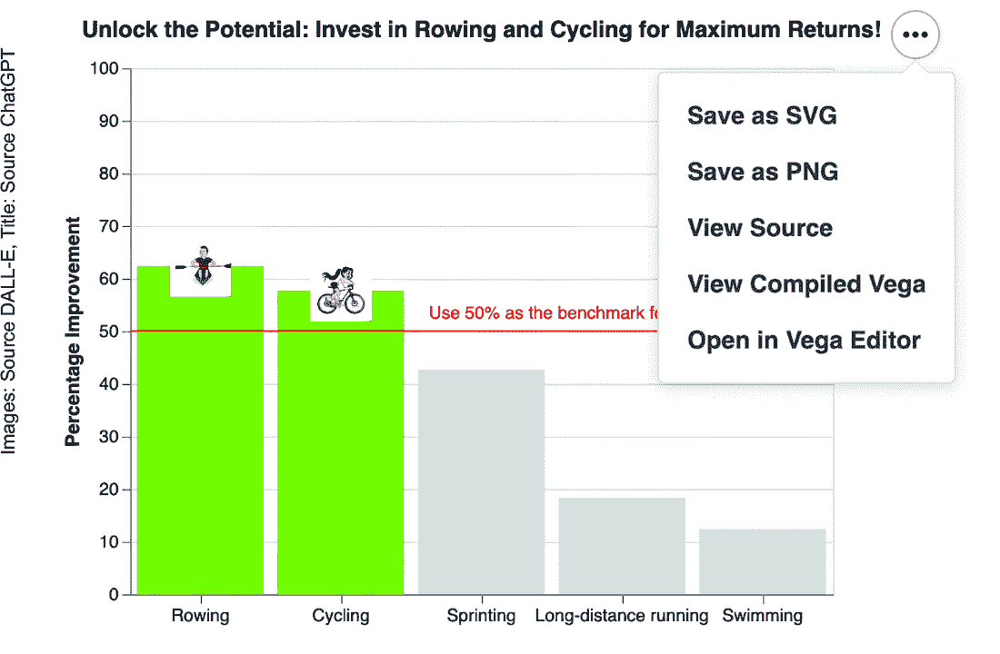
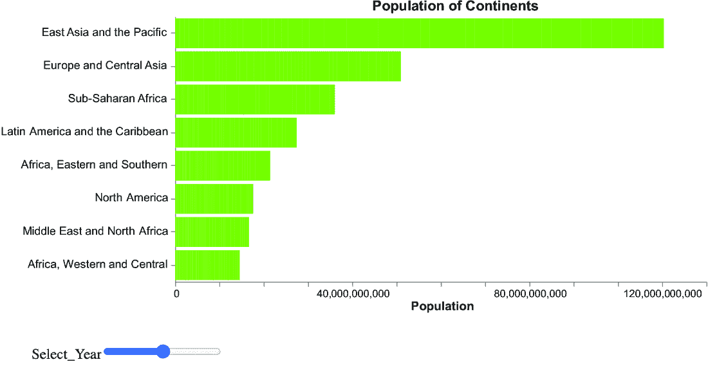
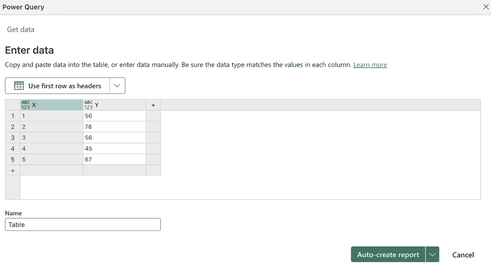
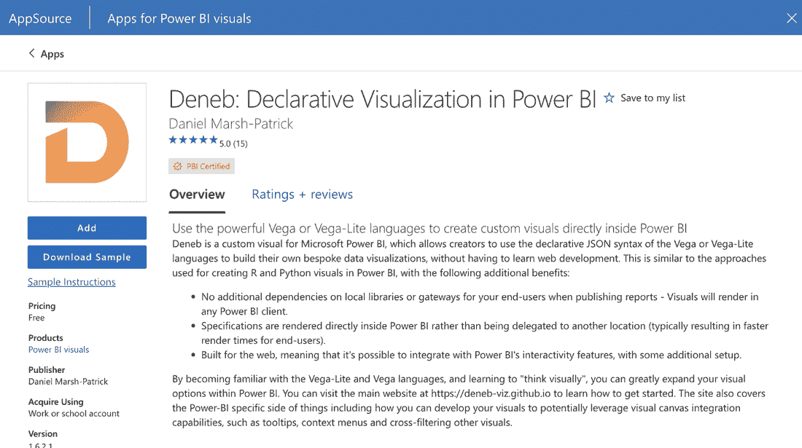
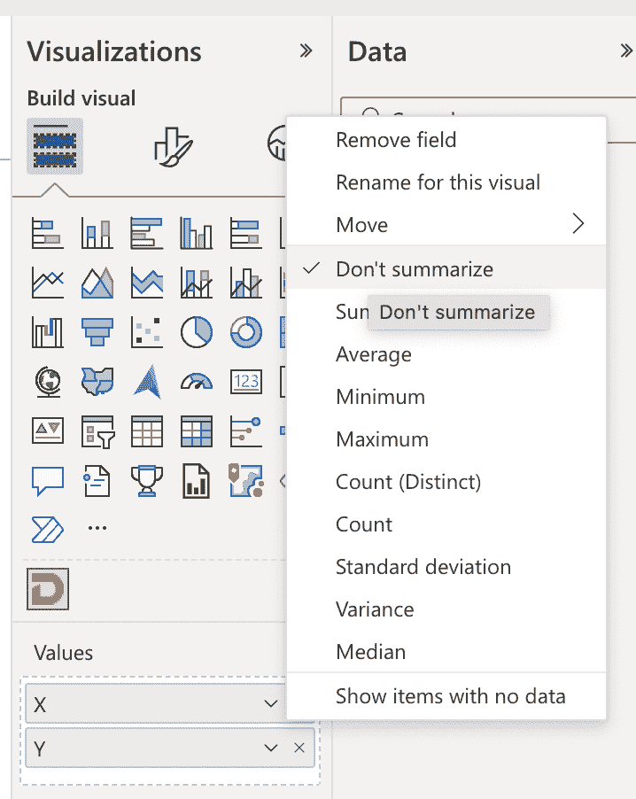
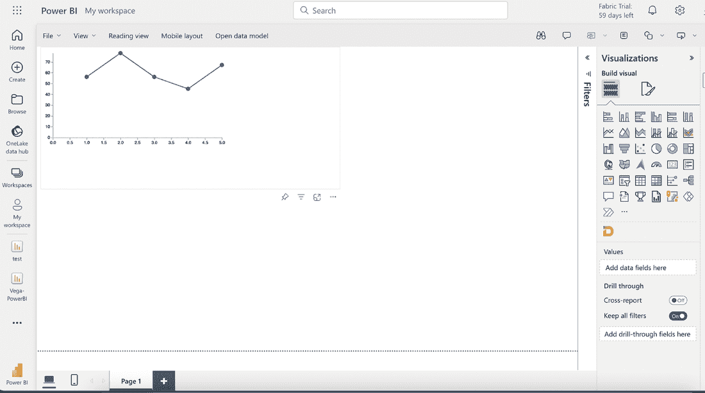
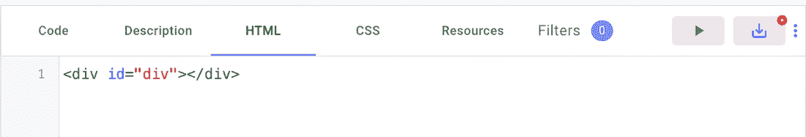
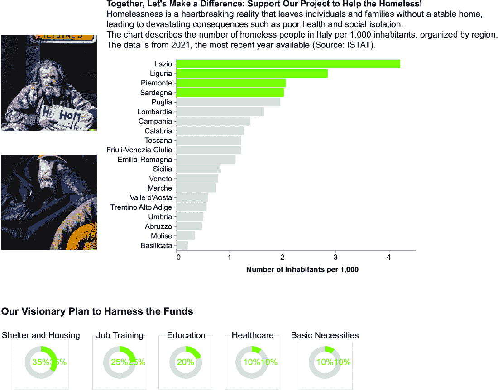
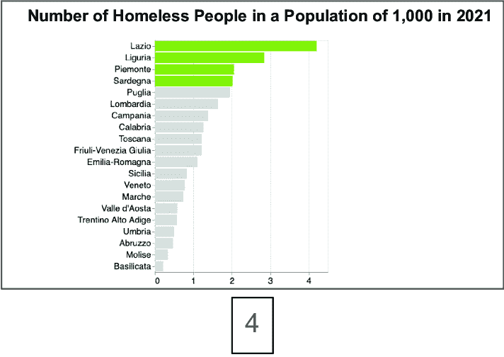

# 11 发布数据故事

### 本章涵盖

+   导出故事

+   使用 Streamlit 发布故事

+   发布故事的替代方法：Tableau、Power BI 和 Comet

+   通过幻灯片展示您的数据故事

在这本书的整个过程中，我们构建了我们的数据故事。现在，在本书的最后一章，是时候向我们的观众展示它了。本章全部关于如何将您的数据故事传达给观众，并且以道德的方式进行。在本章的第一部分，我们将关注不同的导出数据故事的技术。接下来，我们将描述 Streamlit，这是一个与 Altair 完全集成的 Python 库。Streamlit 可以帮助您构建一个完整的独立网站，托管您的 Python 代码。然后，我们将探讨一些发布故事的替代方法，包括将其集成到一些流行的数据分析与可视化工具中的技术：Tableau 和 Power BI。之后，我们将描述如何将数据故事集成到 Comet 中，这是一个机器学习（ML）的实验平台。最后，我们将看到如何通过幻灯片展示您的数据故事。让我们从第一个要点开始：导出故事。

## 11.1 导出故事

Altair 提供了不同的格式来导出您的数据故事。在整个书中，我们使用了`chart.save('chart.xhtml')`，但 Altair 还支持其他格式，包括以下：

+   JPEG

+   PNG

+   SVG

+   JSON

+   PDF

要将图表保存为特定格式，只需将格式扩展名添加到您的文件中，例如`chart.save('chart.png')`用于 PNG 文件。对于 PNG 文件，您还可以通过一个额外的参数指定每英寸像素数（ppi）：`chart.save('chart.png', ppi=300)`。

您可能会想知道，为什么在这本书中，我们一直使用 HTML 格式而不是 PNG 或 SVG。主要原因在于 HTML 是唯一支持显示交互性的格式。此外，一旦您创建了 HTML 文件，Altair 还会在图表右上角提供默认操作菜单，让您可以将故事下载为其他格式，如图 11.1 所示。



##### 图 11.1 HTML 文件右上角的菜单允许您将故事导出为其他格式。

如果您不想显示操作菜单，您可以禁用它，如下面的列表所示。

##### 列表 11.1 禁用操作菜单

```py
chart.save('chart.xhtml', embed_options={'actions': False})
```

您从将原始数据转换为数据故事，通过 DIKW 金字塔、生成式 AI 和 Altair 的旅程已经完成。您的故事终于准备好向观众传播了！

在接下来的两个部分中，我们将探讨一些发布故事的替代技术。如果您不感兴趣，可以自由跳过。首先，我们将看到如何使用 Streamlit 发布故事，然后我们将看到如何将我们的故事嵌入到一些流行的工具中。让我们从 Streamlit 开始。

## 11.2 通过网络发布故事：Streamlit

*Streamlit* ([`streamlit.io/`](https://streamlit.io/)) 是一个开源框架，允许你使用 Python 快速构建网络应用。要开始使用 Streamlit，请参阅附录 A。与其它选项相比，使用 Streamlit 的主要优势是它与 Altair 完全集成。

在本节中，我们将了解如何使用 Streamlit 发布数据故事。Streamlit 使用特定的函数在网页上显示内容，例如 `st.Title()` 用于设置页面标题。

考虑第 11.2 列表中的示例。首先，导入 Streamlit 库。然后，像在 Altair 中一样构建你的图表。要在网页上的任何位置添加 Altair 图表，请使用 `st.altair_chart()`。

##### 列表 11.2 在 Streamlit 中构建应用

```py
import streamlit as st
import pandas as pd
import altair as alt

# Read the data
df = pd.read_csv('../data/population.csv')
df = df.melt(id_vars='Country Name', var_name='Year', value_name='Population')
df['Year'] = df['Year'].astype('int')

continents = ['Africa Eastern and Southern', 'Africa Western and Central',
              'Middle East & North Africa', 'Sub-Saharan Africa',
              'Europe & Central Asia', 'Latin America & Caribbean',
              'North America', 'East Asia & Pacific']
df = df[df['Country Name'].isin(continents)]

# Create Streamlit app
st.title('Population of Continents')

# Add a slider for year selection
selected_year = st.slider('Select a year', min_value=1960, max_value=2021, value=2021, step=1)
# Filter data based on selected year
filtered_df = df[df['Year'] == selected_year]
# Create Altair chart
chart = alt.Chart(filtered_df).mark_bar(color='#80C11E').encode(
    y=alt.Y('Country Name:O', sort='-x', title=''),
    x=alt.X('Population:Q', title='Population')
).properties(
    width=600,
    height=300
).configure_view(
    strokeWidth=0
).configure_axis(
    grid=False
)

# Display chart in Streamlit app
st.altair_chart(chart)
```

注意：首先导入所需的库。然后，将数据作为 pandas DataFrame 加载。接下来，像通常一样在 Altair 中构建图表。使用 `st.slider()` 在 Streamlit 中构建滑块。最后，使用 `st.altair_chart()` 在 Streamlit 应用中显示图表。

要启动应用，请在终端中运行以下命令：`streamlit app.py`，其中 app.py 是包含第 11.2 列表中代码的脚本的名称。图 11.2 显示了结果应用。


##### 图 11.2 Streamlit 中的结果应用

你可以从本书的 GitHub 仓库中下载本节描述的代码，路径为 11/streamlit/app.py。现在你已经学会了如何在 Streamlit 中发布你的数据故事，让我们继续探讨一些其他发布故事的方法。如果你不感兴趣，可以直接跳到结论部分。

发布你的数据故事有多种方式，包括报告、演示文稿、HTML 页面等。在本节中，我们将介绍三种工具：

+   Tableau

+   Power BI

+   Comet

让我们从第一个工具开始：Tableau。

## 11.3 Tableau

*Tableau* ([`www.tableau.com/`](https://www.tableau.com/)) 是一款商业智能工具，帮助用户探索和分析数据。与 Streamlit 不同，Tableau 不需要任何编程技能，因为其界面完全可视化。如果你已经熟悉 Tableau 并用它来实现仪表板，结合 Tableau 和 Altair 可能很有用。你可以将 Altair 生成的数据故事集成到 Tableau 中，作为仪表板的一个附加项。

在使用 Tableau 之前，你必须将其下载到你的本地计算机上并支付许可证费用。Tableau 还为学生和教师提供试用版和完全免费的许可证。在本章的参考文献中，你可以找到一些有趣的资源，帮助你开始使用 Tableau。在本节中，我们描述了如何在 Tableau 中导入你的数据故事。如果你不感兴趣，可以直接跳过本节，转到下一节。考虑第八章 slider.py 中的示例和图 11.3 所示。



##### 图 11.3 带有滑块的图表

要在 Tableau 中导入你的图表，执行以下操作：

1.  打开终端，将其指向包含 08/slider.py 的目录。运行命令 `python3 slider.py` 以生成 HTML 文件。

1.  在终端中，启动 Python 服务器如下：`python3` `-m` `http.server`。

1.  在浏览器中指向 localhost:8000，并访问 slider.xhtml；您应该看到图 10.14 中显示的图表。移动滑块以检查代码是否正确工作。

1.  启动 Tableau Desktop 应用程序，导入 08/data/population.csv 文件，并创建一个新的仪表板。

1.  在 Tableau 中，从对象菜单双击网页，并在对话框中输入以下 URL，如图 11.4 所示：http://localhost:8000/ slider.xhtml。


##### 图 11.4 Tableau 中的编辑 URL 对话框

现在，您应该在 Tableau 仪表板中看到您的 Altair 图表。既然您已经学会了如何在 Tableau 仪表板中包含您的数据故事，让我们继续下一个替代方案：在 Power BI 报告中包含您的数据故事。

注意：在某些情况下，网页导入器失败，因为它不支持 Altair 生成的 JavaScript 包装器以包含图表。在这种情况下，将图表导出为 .png 文件，并使用图像对象将其导入到 Tableau 中。

## 11.4 Power BI

*Power BI* ([`mng.bz/o0Pd`](https://mng.bz/o0Pd)) 是微软发布的另一个商业智能工具。Power BI 提供桌面和在线版本。与 Tableau 类似，您必须购买许可证才能使用它；然而，您可以使用试用版进行测试。在本章的参考文献中，您可以找到一些开始使用 Power BI 的资源。

与 Tableau 类似，如果您已经熟悉并使用 Power BI，则可能需要将 Altair 生成的数据故事集成到 Power BI 仪表板中。否则，使用其他解决方案，如 Streamlit，会更好。

在本节中，我们仅描述如何将 Altair 生成的图表导入到 Power BI 中。我们将使用在线版本。具体来说，我们将使用 Deneb 插件，该插件允许您导入用 Vega 编写的数据。从 Altair，您始终可以直接从 HTML 版本导出 Vega 或 Vega-Lite JSON 文件，如图 10.12 所示。

为了简单起见，在下面的示例中，我们将直接使用 GitHub 仓库中本书的 03/vega/json/spec.json 目录下的 Vega 代码。执行以下步骤：

1.  登录您的 Power BI 账户，然后点击新建报告 → 粘贴或手动输入您的数据 → 创建空白报告（图 11.5）。



##### 图 11.5 创建新报告的 Power BI 界面快照

1.  2. 点击可视化 → （三个点）获取更多可视化 → Vega → Power BI 中的 Deneb：声明性可视化 → 添加（图 11.6）。



##### 图 11.6 Deneb 插件

1.  3. 在可视化菜单中，选择 Deneb。

1.  4. 在数据菜单中，将 X 和 Y 添加到 Deneb。点击 X 和 Y 附近的箭头，然后点击不汇总（图 11.7）。



##### 图 11.7 每个变量的选择菜单

1.  5. 在应用左侧，你应该能看到 Deneb 框。在报告中点击 Deneb 框中的三个点，然后点击编辑 → Vega - 空白（图 11.8）。


##### 图 11.8 每个变量的选择菜单

1.  6. 将 03/vega/json/spec.json 中的代码复制到 Deneb 编辑器中。你需要删除数据才能使其工作。以下列表显示了修改后的版本。接下来，点击创建。

##### 列表 11.3 图表的 Vega 表示

```py
{
  "description": "A basic line chart",
  "width": 400,
  "height": 200,
  "padding": 5,
 "data": [
 {
 "name": "dataset"
 }
 ],

  "scales": [
    {
      "name": "xscale",
      "domain": {"data": "dataset", "field": "X"},
      "range": "width"
    },
    {
      "name": "yscale",
      "domain": {"data": "dataset", "field": "Y"},
      "range": "height"
    }
  ],

  "axes": [
    { "orient": "bottom", "scale": "xscale" },
    { "orient": "left", "scale": "yscale" }
  ],

  "marks": [
    {
      "type": "line",
      "from": {"data":"dataset"},
      "encode": {
        "enter": {
          "x": {"scale": "xscale", "field": "X"},
          "y": {"scale": "yscale", "field": "Y"},
          "stroke": { "value": "#636466"}

        }
      }
    },
    {
      "type": "symbol",
      "from": {"data":"dataset"},
      "encode": {
        "enter": {
          "x": {"scale": "xscale", "field": "X"},
          "y": {"scale": "yscale", "field": "Y"},
          "shape": {"value": "circle"},
          "size" : {"value": 100},
          "fill": { "value": "#636466"}
        }
      }
    }
  ]
  }
```

注意：用导入到 Power BI 的数据集的链接替换数据部分。

图 11.9 显示了结果图表。现在你已经学会了如何在 Power BI 中导入 Vega 图表，让我们继续到最后一个工具：Comet。



##### 图 11.9 Power BI 中的结果图表

## 11.5 Comet

*Comet* ([`www.comet.com/site/`](https://www.comet.com/site/))是一个用于 ML 模型跟踪和测试的实验平台。在我的上一本书《Comet for Data Science》中，我详细描述了如何开始使用 Comet 以及如何跟踪 ML、深度学习（DL）、时间序列和自然语言处理任务。因此，有关 Comet 的更多详细信息，请参阅此书。

如果你的数据故事是完整数据科学项目的成果，包括模型实验和评估，你可能会决定将 Altair 生成的数据故事与 Comet 集成。由于 Comet 支持 Python，使用它导出你的数据故事不需要任何特别的努力。

在 Comet 中，你还可以创建报告。*报告*是一组文本和面板，显示实验结果。这是一个非常有用的功能，因为你可以使用一个工具进行实验和报告。与 Tableau 和 Power BI 不同，Comet 对个人用户是免费的，因此你不需要付费来访问服务。此外，Comet 支持许多编程语言，包括 Python，因此你可以继续使用 Python 来编写报告。

在本节中，我们将描述如何在 Comet 中包含一个简单的交互式图表。我们将使用由 08/slider.py 生成的 HTML 代码。我们将用 HTML/JavaScript 编写代码，但 Comet 也支持 Python。如果你没有 slider.xhtml 文件，打开终端，移动到 08 目录，并运行命令`python slider.py`。

执行以下步骤：

1.  登录 Comet，按照以下步骤开始一个新项目：新建项目 → 项目名称，描述，项目类型：实验跟踪。

1.  通过点击报告 → 新报告 → 添加面板 → 新来创建一个新的报告。

1.  Comet SDK 应该会打开。默认情况下，它配置为在 JavaScript 中工作。如果你想用 Python 工作，在右上角点击 JavaScript 并选择 Python。

1.  在资源选项卡下，添加以下三个 JavaScript 脚本（图 11.10）：

    1.  [`cdn.jsdelivr.net/npm/vega@5`](https://cdn.jsdelivr.net/npm/vega@5)

    1.  [`cdn.jsdelivr.net/npm/vega-lite@5.8.0`](https://cdn.jsdelivr.net/npm/vega-lite@5.8.0)

    1.  [`cdn.jsdelivr.net/npm/vega-embed@6`](https://cdn.jsdelivr.net/npm/vega-embed@6)


##### 图 11.10 Comet SDK 中的资源标签页

1.  5. 切换到 HTML 标签页，并将 `id` 名称更改为 `vis`，如图 11.11 所示。



##### 图 11.11 Comet SDK 中的 HTML 标签页

1.  6. 在编辑模式下打开 slider.xhtml 文件，并复制 <script> 和 </scripts> 标签之间的代码（如下所示）。如果这段代码非常长，不用担心；它包含了所有的 Vega 规范，包括原始数据集。将复制的代码粘贴到 Comet SDK 的代码标签页中。

##### 列表 11.4 生成图表的 JavaScript 代码

```py
(function(vegaEmbed) {
      var spec = {"config": {"view": ...}};
      var embedOpt = {"mode": "vega-lite"};

      function showError(el, error){
          el.innerHTML = ('<div style="color:red;">'
                          + '<p>JavaScript Error: ' + error.message + '</p>'
                          + "<p>This usually means there's a typo in your chart specification. "
                          + "See the javascript console for the full traceback.</p>"
                          + '</div>');
          throw error;
      }
      const el = document.getElementById('vis');
      vegaEmbed("#vis", spec, embedOpt)
        .catch(error => showError(el, error));
    })(vegaEmbed);
```

1.  7. 点击运行按钮（一个绿色的三角形）。你应该能在右侧看到渲染的图表（图 11.12）。


##### 图 11.12 Comet SDK 中的渲染图表

1.  8. 点击“保存并捕获缩略图”。你应该能看到图表嵌入到 Comet 报告中。

表 11.1 总结了每个分析工具的优点和缺点。

##### 表 11.1 分析工具的优点和缺点

| 工具名称 | 描述 | 优点 | 缺点 |
| --- | --- | --- | --- |

| Streamlit | 一个用于实现 Web 服务器的 Python 库 | • 简单易用 • 完全集成 Altair

• 使用 Python 配置界面

• 免费

| • 你必须从头开始编写仪表板。 • 你必须有一个机器来托管 Web 服务器。

|

| Tableau | 一款数据探索和分析软件 | • 不需要任何编程技能 • 快速构建仪表板

| • 非免费 • 你必须学习基础知识才能使用它。

|

| Power BI | 一款数据探索和分析软件 | • 不需要任何编程技能 • 快速构建仪表板

| • 非免费 • 你必须学习基础知识才能使用它。

• 它不支持 Altair，你必须使用 Vega。

|

| Comet | 数据科学实验平台 | • 个人使用免费 • 允许你跟踪你的整个数据科学工作流程，直至数据讲述

• 完全集成 Altair

| • 你必须学习基础知识才能将数据连接到数据可视化图表。 |
| --- |

现在你已经学会了如何使用 Comet 发布你的故事，接下来让我们继续学习另一种方式：通过幻灯片展示你的数据故事。

## 11.6 通过幻灯片展示

在这本书中，你已经学会了如何构建一个包含在单一可视化图表中的数据故事。你已经学会了如何使用 DIKW 金字塔提取信息、添加上下文和增加智慧。但是，如果你需要通过幻灯片来分割故事呢？你可以利用本书中描述的所有原则，包括 DIKW 金字塔，来构建一个在更多幻灯片或部分中组织的叙事。为了组织你的幻灯片，使用第五章中讨论的数据讲述弧，如图 11.13 所示。


##### 图 11.13 数据讲述弧

首先，展示背景，展示故事的环境。然后，通过解释问题来提高兴趣。接着，定义主要点，揭示洞察力，并给观众留出思考时间。最后，提出解决方案。

让我们通过一个实际例子来更好地理解如何将单一故事图表拆分成多个幻灯片。我们将关注图 11.14 中显示的无家可归者案例研究。



##### 图 11.14 作为单一故事实施的无家可归者案例研究

将幻灯片组织成五个部分，每个部分对应数据故事弧的一个点。使用单个幻灯片或多个幻灯片实现每个部分。让我们看看一个可能的实现：

1.  *背景*—使用两个幻灯片。将标题下的评论的第一段分成两部分，并将每部分放在单独的幻灯片中。将原始数据故事左侧的图片添加到幻灯片中，每张图片对应一个幻灯片（图 11.15）。为了丰富背景部分，你可以添加其他带有额外细节的幻灯片，例如涉及人员的访谈或其他与问题相关的文件。


##### 图 11.15 背景部分的幻灯片

1.  2\. *提高兴趣*—添加一个单独的幻灯片，解释问题（图 11.16）。在单图表数据故事中，由于空间限制和图表的存在，该文本未出现，因为图表已经突出了问题。


##### 图 11.16 提高兴趣部分中的幻灯片

1.  3\. *主要点*—实现一个包含主要图表的单独幻灯片（图 11.17）。



##### 图 11.17 主要部分中的幻灯片

1.  4\. *思考*—添加一个包含问题的幻灯片，给观众留出思考时间（图 11.18）。


##### 图 11.18 思考部分中的幻灯片

1.  5\. *下一步骤*—为每个甜甜圈图添加一个单独的幻灯片（图 11.19）。


##### 图 11.19 下一步骤部分的幻灯片

作为最后一步，将标题添加到你的演示文稿中作为第一个幻灯片。使用原始数据故事的标题。

要在幻灯片中实现每个图表，你仍然可以使用 Altair，就像你在整本书中做的那样，以及你偏好的幻灯片编辑工具，如 PowerPoint、Google Slides 等。

使用 Altair 实现的图表来制作你的幻灯片。你可以在本书的 GitHub 仓库中找到本节中描述的幻灯片的完整实现，位于 11/slides/homeless-people.pdf。

在本书的最后一章中，你学习了如何使用不同的工具发布最终数据故事：Streamlit、Tableau、Power BI 和 Comet。最后，你看到了如何将单一数据故事转换成多个幻灯片进行展示。

## 11.7 最后的想法

我们共同的旅程已经结束。亲爱的读者，感谢您与我分享一段路程，感谢您的信任，以及您阅读到这里的耐心。我希望通过这本书，您已经学会了将数据故事讲述作为一种有效的沟通数据工具去热爱。我也希望，尽管这本书已经结束，但您对数据故事讲述世界的探索可以继续，阅读其他书籍，也许比这本书更有趣，通过文章、课程以及您在世界各地能找到的任何其他好东西来更新自己。在书中，我这里那里地指出了您可以利用的有趣资源，但不要限制您个人的研究。

在整本书中，我试图为您提供进行数据故事讲述这一困难角色的基本工具。现在，使用它们的责任就交到您手中了。始终要有勇气和力量去寻找数据背后的真相，并在找到它之后，保持深入挖掘并再次寻找它的渴望。我建议再一件事：永远不要忘记以谨慎的态度处理您逐渐讲述的数据，因为数据背后总有人们在等待有人讲述他们的故事。祝您一切顺利，并希望未来能再次见到您！

## 摘要

+   您可以将您的数据故事嵌入到不同的工具中，例如 Tableau、Power BI 和 Comet。或者，您可以使用 Streamlit 将您的数据故事发布为独立的网络应用程序。

+   如果您已经熟悉 Tableau 或 Power BI，可以使用这些工具将 Altair 中制作的数据故事整合。这将使您能够快速丰富您的仪表板。

+   如果您的数据故事是包含一些实验，如模型跟踪和评估的完整数据科学项目的结果，请使用 Comet 来整合 Altair 中制作的数据故事。如果您需要一个网络应用程序与您的观众分享您的数据故事，请使用 Streamlit 导出 Altair 中制作的数据故事。

+   在所有情况下，完成您的数据故事后，请记得与您的观众分享。在讲述第一个故事之后，开始着手第二个。然后着手第三个，以此类推，直到您成为一个有效的数据故事讲述者。祝您工作愉快！祝您数据故事讲述愉快！

## 参考文献

+   德克勒，G. 和 帕尔默，B. (2022). *精通 Microsoft Power BI：创建交互式洞察以进行有效的数据分析和商业智能*（第 2 版）。Packt 出版。

+   米林，J. N. (2022). *学习 Tableau 2022：创建有效的数据可视化，构建交互式可视化分析，并提高您的数据故事讲述能力*（第 5 版）。Packt 出版。

+   洛杜卡，A. (2022). *Comet for Data Science*。Packt 出版。
