# 2 聚类技术

### 本章涵盖

+   聚类技术及其在行业中的显著应用案例

+   简单的 k-means、层次和基于密度的空间聚类算法

+   Python 中算法的实现

+   关于聚类分析的案例研究

> 简单即复杂。——达芬奇

自然喜欢简单，并教导我们遵循相同的道路。大多数时候，我们的决策都是简单的选择。简单的解决方案更容易理解，耗时更少，维护和思考起来也更轻松。机器学习世界也不例外。优雅的机器学习解决方案不是最复杂的算法，而是解决业务问题的解决方案。稳健的机器学习解决方案足够简单，可以轻松解码，并且足够实用，可以实施。聚类解决方案通常更容易理解。

在上一章中，我们定义了无监督学习并讨论了可用的各种无监督算法。随着我们阅读本书，我们将涵盖这些算法中的每一个；在这一章中，我们专注于这些中的第一个：聚类算法。

我们首先定义聚类，然后研究不同的聚类技术类型。我们将检查每个算法的数学基础、准确度测量以及优缺点。我们将使用 Python 代码在数据集上实现这三种算法，以补充理论知识。本章以聚类技术在实际业务场景中的各种应用案例结束，为实际商业世界做准备。本书中始终遵循这一技术——我们首先研究概念，然后实现实际代码以增强 Python 技能，最后深入现实世界的商业问题。

本章我们研究基本的聚类算法，包括 k-means 聚类、层次聚类和基于密度的空间聚类应用噪声（DBSCAN）聚类。这些聚类算法通常是我们想要研究聚类时的起点。在本书的后续章节中，我们将探索更复杂的算法，如谱聚类、高斯混合模型、时间序列聚类、模糊聚类等。如果您对 k-means 聚类、层次聚类和 DBSCAN 有很好的理解，您可以跳到下一章。然而，建议您至少阅读这一章——您可能会发现一些有用的内容来刷新您的概念！

让我们先了解我们所说的聚类是什么。祝您在掌握基于无监督学习的聚类技术之路上好运！

## 2.1 技术工具箱

在本章中，我们使用 Python 的最新版本。预期您对 Python 和代码执行有基本了解。建议您复习面向对象编程和 Python 的知识。

在整本书中，我们使用 Jupyter Notebook 来执行代码。Jupyter 在执行和调试方面提供了灵活性。它非常用户友好，并且与平台或操作系统无关。因此，如果你使用 Windows、macOS 或 Linux，Jupyter 应该可以正常工作。

所有数据集和代码文件都已提交到 GitHub 仓库[`mng.bz/lYq2`](https://mng.bz/lYq2)。你需要安装以下 Python 库来执行代码：`numpy`、`pandas`、`matplotlib`、`scipy`和`sklearn`。CPU 足以执行，但如果你遇到一些计算延迟并且想要加快执行速度，切换到 GPU 或 Google Collaboratory（Colab）。Google Colab 为机器学习解决方案提供免费计算。我建议更多地了解 Google Colab 以及如何用它来训练机器学习算法。

## 2.2 聚类

考虑以下场景：一群孩子被要求将房间里的物品分组到不同的段。每个孩子可以使用自己的逻辑。有些人可能会根据重量分组物体；其他孩子可能会使用材料或颜色；而还有一些孩子可能会使用所有三个：重量、材料和颜色。有无数种排列组合，并且它们取决于分组所使用的参数。在这里，一个孩子是根据选择的逻辑对物体进行分段或聚类的。

正式来说，*聚类*是用来将具有相似属性的物体分组到同一段，而将具有不同属性的物体分组到不同段。结果簇在自身内部具有相似性，而在彼此之间则更加异质。我们可以通过查看图 2.1 来更好地理解这一点。

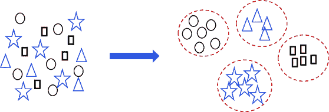

##### 图 2.1 聚类是将具有相似属性的物体分组到逻辑段。分组基于不同观察结果共享的相似特征，因此它们被聚集到一组。在这里，我们使用形状作为聚类的变量。

聚类分析不是一个单独的算法或解决方案；相反，它在实际商业场景中用作解决问题的机制。它是无监督学习下的一类算法，是一个遵循逻辑方法和定性商业输入的迭代过程。它导致对数据及其逻辑模式的深入理解，模式发现和信息检索。作为一种无监督方法，聚类不需要目标变量。它通过分析数据集中的潜在模式进行分段，这些模式通常是多维的，因此难以用传统方法分析。

理想情况下，我们希望聚类算法具有以下属性：

+   输出的聚类应该易于解释和理解，易于使用，并且具有商业意义。聚类数量不应过多或过少。例如，只有两个聚类并不理想，且划分不清晰和决断。另一方面，如果我们有 20 个聚类，处理起来将变得具有挑战性。

+   算法不应过于敏感于异常值、缺失值或数据集中的噪声。一般来说，一个好的解决方案将能够处理多种数据类型。

+   对于数据分析师/科学家来说，掌握业务领域是明智的，尽管一个好的聚类解决方案可能允许对领域理解较少的分析员训练聚类算法。

+   算法应独立于输入参数的顺序。如果顺序很重要，聚类将受到顺序的偏差，从而给过程增加更多混乱。

+   随着我们持续生成新的数据集，聚类应该能够扩展到新的训练示例，并且不应是耗时的过程。

如同想象中的那样，聚类输出将取决于用于分组的属性。在图 2.2 中，对于同一数据集，可能存在两种逻辑分组，且两者都是有效的。因此，明智的做法是谨慎选择用于聚类的属性或*变量*，通常这个决定取决于手头的业务问题。

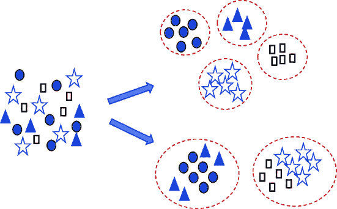

##### 图 2.2 使用不同的属性进行聚类会导致同一数据集产生不同的聚类结果。因此，选择正确的属性集定义了我们最终将获得的结果集。

除了用于聚类的属性外，实际使用的技术也会产生很大的影响。实际上，有相当多的（实际上超过 80 种）聚类技术。对于感兴趣的读者，我们在附录中提供了所有聚类算法的列表。

聚类可以通过多种算法实现。这些算法使用不同的方法来定义对象之间的相似性——例如，基于密度的聚类、基于质心的聚类、基于分布的方法等。有多种技术，如欧几里得距离、曼哈顿距离等，可用于测量对象之间的距离。距离测量的选择会导致不同的相似度得分。我们将在后面的章节中研究这些相似度测量参数。

从高层次来看，我们可以识别两种广泛的聚类方法：*硬聚类*和*软聚类*（见图 2.3）。当决策非常明确，一个对象属于某个类别或聚类时，它被称为硬聚类。在硬聚类中，算法对对象的类别非常确定。另一方面，软聚类为对象属于特定聚类分配一个可能性分数。因此，软聚类方法不会将对象放入一个聚类中；相反，一个对象可以属于多个聚类。软聚类有时也被称为*模糊*聚类。


##### 图 2.3 硬聚类有明显的聚类，而在软聚类的案例中，一个数据点可以属于多个聚类，我们得到一个数据点属于聚类的可能性分数。左边的图是硬聚类，右边的图是软聚类。

我们可以将聚类技术大致分类，如表 2.1 所示。描述的方法并非唯一。我们可以有基于图模型、重叠聚类、子空间模型等。

##### 表 2.1 聚类方法分类、简要描述和示例

| 序号 | 聚类方法 | 方法的简要描述 | 示例 |
| --- | --- | --- | --- |
| 1  | 基于质心的聚类  | 与定义的质心的距离  | k-means  |
| 2  | 基于密度的模型  | 数据点在向量空间中的密集区域连接  | DBSCAN, OPTICS  |
| 3  | 基于连接性的聚类  | 连接距离是操作方式  | 层次聚类、平衡迭代减少和基于层次结构的聚类  |
| 4  | 分布模型  | 建模基于统计分布  | 高斯混合模型  |
| 5  | 深度学习模型  | 基于无监督神经网络的  | 自组织映射  |

通常，在工业界中用于聚类的最流行的六个算法如下：

+   k-means 聚类（包括 k-medians、k-medoids 等变体）

+   聚类层次聚类或层次聚类

+   DBSCAN

+   谱聚类

+   高斯混合模型

+   平衡迭代减少和基于层次结构的聚类

还有许多其他算法可用，如中国 whispers、 canopy 聚类、SUBCLU、FLAME 等。我们将在本章中研究前三种算法，并在本书的后续章节中研究一些高级算法。

##### 练习 2.1

使用以下问题来检查你的理解：

1.  DBSCAN 聚类是一种基于质心的聚类技术。对还是错？

1.  聚类是一种具有固定目标变量的监督学习技术。对还是错？

1.  硬聚类和软聚类之间有什么区别？

## 2.3 基于质心的聚类

基于质心的算法根据对象到簇质心的距离来衡量它们的相似度（有关质心的更多信息，请参阅附录）。距离是测量特定数据点到簇质心的距离。距离越小，相似度越高。我们可以通过查看图 2.4 来理解这个概念。右侧的图表示每个簇组的相应质心。

TIP　为了更清楚地了解质心和其他数学概念，请参阅附录。

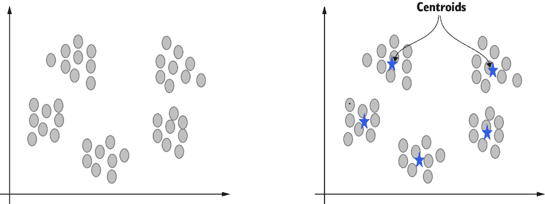

##### 图 2.4 基于质心的聚类方法为各自的簇创建一个质心，相似度是根据质心的距离来衡量的。在这种情况下，我们有五个质心，因此我们有五个不同的簇。

在聚类中，距离起着核心作用，因为许多算法将其用作度量来衡量相似度。在基于质心的聚类中，距离是在点与点之间以及点与质心之间测量的。有多种方法可以测量距离。最常用的如下：

+   *欧几里得距离*——这是最常用的距离度量。它表示空间中两点之间的直线距离，是两点之间的最短路径。例如，如果我们想计算点 *P*[1] 和 *P*[2] 之间的距离，其中 *P*[1] 的坐标是 (*x*[1], *y*[1])，*P*[2] 的坐标是 (*x*[2], *y*[2])，欧几里得距离由方程 2.1 给出。几何表示如图 2.5 所示：

##### (2.1)

距离 = √(*y*[2] – *y*[1])[²] + (*x*[2] – *x*[1])[²]

+   *切比雪夫距离*——以俄罗斯数学家帕夫努提·切比雪夫的名字命名，定义为两点之间的距离，其差异是任何坐标维度的最大值。数学上，我们可以用方程 2.2 表示切比雪夫距离，如图 2.5 所示：

##### (2.2)

切比雪夫距离 = max(|*y*[2] – *y*[1]|, |*x*[2] – *x*[1]|)

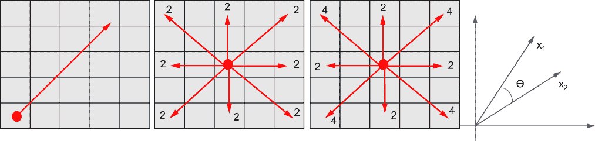

##### 图 2.5 欧几里得距离、切比雪夫距离、曼哈顿距离和余弦距离是主要的距离度量。注意使用这些度量时两点之间的距离如何不同。在欧几里得距离中，两点之间的直接距离是测量的，如左图的第一幅图所示。

+   *曼哈顿距离*——这是一个非常容易理解的概念。它简单地计算两个点在网格状路径上的距离，因此距离是沿着垂直于轴线的方向测量的。因此，有时它也被称为街区距离或出租车度量。数学上，我们可以用方程 2.3 表示曼哈顿距离，如图 2.5 所示：

##### (2.3)

曼哈顿距离 = (|*y*[2] – *y*[1]| + |*x*[2] – *x*[1]|)

曼哈顿距离是 L1 范数形式，而欧几里得距离是 L2 范数形式。请参阅附录以详细了解 L1 范数和 L2 范数。如果我们有大量维度或变量在数据集中，曼哈顿距离比欧几里得距离更好。这是由于“维度诅咒”，我们将在第三章中研究。

+   *余弦距离*——余弦距离用于测量向量空间图中两点之间的相似度。在三角学中，0 度的余弦值为 1，90 度的余弦值为 0。因此，如果两点彼此相似，它们之间的角度将是零；因此，余弦值为 1，这意味着两点非常相似，反之亦然。数学上，余弦相似度在方程 2.4 中显示。如果我们想测量向量*A*和*B*之间的余弦值，那么余弦值是

##### (2.4)

余弦距离 = (*A* . *B*) / (||*A*|| ||*B*||)

小贴士：如果您想刷新关于向量分解概念的知识，请参阅附录。

其他距离度量标准，如汉明距离、杰卡德距离等，也是可用的。在大多数情况下，我们在实际业务问题中使用欧几里得距离，但有时也会使用其他距离度量标准。

注意：这些距离度量标准也适用于其他聚类算法。我建议您使用书中的 Python 代码测试不同的距离度量标准，并比较性能。

现在我们已经了解了各种距离度量标准，我们继续研究 k-means 聚类，这是最广泛使用的算法。

### 2.3.1 K-means 聚类

K-means 聚类是一种简单直接的方法。它可以说是最广泛使用的聚类方法，用于分割数据点并创建非重叠的聚类。我们必须指定我们希望创建的聚类数量*k*作为输入，算法将把每个观测值与 k 个聚类中的确切一个关联起来。

注意：K-means 聚类有时会与 k 近邻（KNN）分类器混淆。尽管两者之间有一些关系，但 KNN 用于分类和回归问题。

K-means 聚类是一种相当优雅的方法，它从一些初始聚类中心开始，然后迭代地将每个观测值分配到最近的中心。在这个过程中，中心点被重新计算为聚类中点的平均值。让我们通过使用图 2.6 中的图表以逐步的方式研究这种方法。为了简化，我们假设数据集中有三个聚类。

步骤如下：

1.  假设我们已经拥有了所有数据点，如图 1 所示。

1.  三个中心点被随机初始化，如图中三个正方形所示：蓝色、红色和绿色。这三个输入值是我们希望拥有的最终聚类数量。


##### 图 2.6 步骤 1 表示原始数据集。在步骤 2 中，算法根据我们输入的聚类数量为三个，初始化了三个随机质心。在步骤 3 中，所有质心的邻近点被分配到相同的簇。

1.  3. 所有数据点到中心的距离被计算，并将点分配到最近的中心。请注意，这些点已经根据它们各自最近的中心获得了蓝色、红色和绿色，因为它们离这些中心最近。（在打印版本中颜色不可区分；因此我们将它们分组在一起。）

1.  4. 在这个步骤中，三个中心被重新调整。中心被重新计算为该簇中点的平均值，如图 2.7 所示。我们可以看到，在步骤 4 中，与步骤 3 相比，三个正方形已经改变了它们的位置。

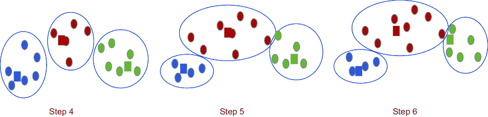

##### 图 2.7 在步骤 4 中重新计算了质心。在步骤 5 中，数据点再次被分配到新的中心。在步骤 6 中，根据新的计算再次调整了质心。

1.  5. 所有数据点到新中心的距离被重新计算，并且点再次被分配到最近的中心。请注意，在这个步骤中，两个蓝色数据点变成了红色，而一个红色点变成了绿色。

1.  6. 中心再次调整，就像步骤 4 中一样。

1.  7. 数据点再次被分配到一个新的簇，如图 2.8 所示。

1.  8. 过程将继续，直到收敛。换句话说，过程将继续，直到没有更多的数据点重新分配；因此，我们不能再进一步改善聚类，最终聚类完成。

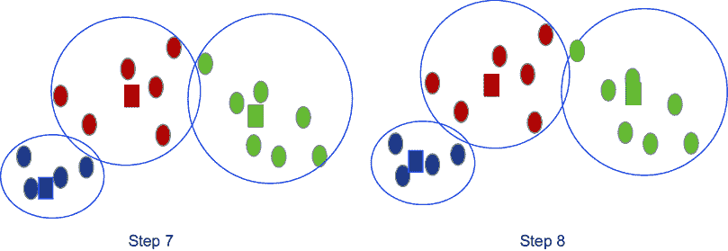

##### 图 2.8 质心被重新计算，这个过程会一直持续到我们不能再改善聚类效果。然后，过程停止，如图 8 所示。

k-means 聚类的目标是确保簇内变异尽可能小，而簇间的差异尽可能大。换句话说，同一簇的成员之间最为相似，而不同簇的成员之间则不相似。一旦结果不再变化，我们可以得出结论，已经达到了局部最优，聚类可以停止。因此，最终的簇在自身内部是同质的，而与其他簇是异质的。

这里有两个要点至关重要：

+   K-means 聚类随机初始化中心；因此，它找到一个局部最优解而不是全局最优解。因此，建议多次迭代解决方案，并从所有结果中选择最佳输出。通过迭代，我们指的是重复这个过程多次，因为在每次迭代中，随机选择的质心都会不同。

+   我们必须输入我们希望拥有的最终聚类数*k*，这将极大地改变输出结果。与数据量相比，*k*的值非常小会导致冗余聚类，因为它们将没有任何用处。换句话说，如果我们相对于大量数据有非常小的*k*值，具有不同特征的数据点将被组合在几个组中。*k*的值非常高将创建彼此之间细微差异的聚类。

此外，拥有一个非常高的聚类数在长期内将难以管理和更新。让我们研究一个例子。如果一个电信运营商有 100 万用户，如果我们把聚类数定为两个或三个，结果聚类的大小将会非常大。这也可能导致同一细分市场中的不同客户被分类。另一方面，如果我们把聚类数定为 50 或 60，由于聚类数量庞大，输出结果将难以使用、分析和维护。

随着不同的*k*值，我们得到不同的结果；因此，了解我们如何为数据集选择最佳聚类数是必要的。现在让我们来检查衡量聚类解决方案准确性的过程。

### 2.3.2 聚类准确性的度量

聚类的一个目标是要找到最干净的聚类。理论上（尽管不是理想情况），如果我们有与观察数相同的聚类数，结果将完全准确。换句话说，如果我们有 100 万客户，最纯的聚类将会有 100 万个聚类，其中每个客户都在一个单独的聚类中。但这不是最佳方法，也不是一个实际的解决方案。聚类旨在在一个聚类中创建一组相似的观察值，我们使用相同的原理来衡量我们解决方案的准确性。其他选项包括以下内容：

+   *聚类内平方和（WCSS）或凝聚力*——这个指标衡量数据点相对于它们与聚类质心的距离的变异性。这个度量是每个数据点到聚类质心的平均距离，对每个数据点重复进行。如果值太大，表明数据分布范围很大，而较小的值则表明数据点相当相似和同质，因此聚类是紧凑的。

有时，这种聚类内的距离也被称为该聚类的*惯性*。它只是所有距离的总和。惯性值越低，聚类越好。

+   *簇间平方和*——这个指标用于衡量所有簇的质心之间的距离。为了得到它，我们测量所有簇的质心之间的距离，并将其除以簇的数量以得到平均值。它的值越大，表示聚类越好，表明簇是异质且彼此可区分的，如图 2.9 所示。


##### 图 2.9 簇内距离与簇间距离。两者都用于衡量最终簇的纯度和聚类解决方案的性能。

+   *轮廓值*——这是衡量聚类成功的一个指标。它介于-1 到+1 之间，值越高越好。它衡量一个数据点与其簇内其他数据点的相似性，与簇外其他簇相比。作为第一步，对于每个观测值，我们计算其与同一簇中所有数据点的平均距离；让我们称它为*x*[*i*]。然后我们计算其与最近簇中所有数据点的平均距离；让我们称它为*y*[*i*]。然后我们将通过方程 2.5 计算系数：

##### (2.5)

轮廓系数 = (*y*[*i*] – *x*[*i*])/ max (*y*[*i*], *x*[*i*])

如果系数的值为-1，则表示观测值位于错误的簇中。如果值为 0，则表示观测值非常接近邻近簇。如果系数的值为+1，则表示观测值与邻近簇的距离较远。因此，我们期望系数的值越高，表示聚类解决方案越好。

+   *Dunn 指数*——这也可以用来衡量聚类的有效性。它使用之前定义的簇间和簇内距离测量值，并由方程 2.6 给出：

##### (2.6)

Dunn 指数 = 最小（簇间距离）/最大（簇内距离）

显然，我们会努力最大化 Dunn 指数的值。为了实现这一点，分子应该尽可能大，这意味着簇彼此之间距离较远，而分母应该尽可能低，这表示簇非常稳健且紧密排列。

### 2.3.3 寻找 k 的最佳值

选择最佳簇数并不容易。正如我之前所说的，最佳的聚类是簇数等于观测数的情况，但正如我们在上一节所研究的，这在实际中是不可能的。因此，我们应该将簇数*k*作为算法的输入。

寻找最优值 *k* 最广泛使用的方法可能是 *肘部方法*。在此方法中，我们计算不同 *k* 值的簇内平方和或 WCSS。过程与上一节讨论的相同。然后，将 WCSS 绘制在图表中，与不同的 *k* 值对应。无论何时观察到如图 2.10 所示的拐点或肘部，我们就能找到数据集的最佳簇数。注意尖锐的边缘。

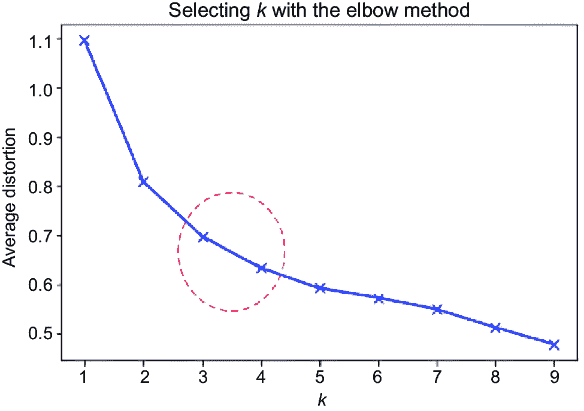

##### 图 2.10：寻找最佳簇数的肘部方法。圆圈显示了拐点。然而，最终的簇数取决于业务逻辑，我们通常根据这个逻辑合并/拆分簇。簇的维护难度也起着至关重要的作用。

##### 练习 2.2

回答以下问题以检查你的理解：

1.  k-means 聚类不需要输入簇数。对或错？

1.  KNN 和 k-means 聚类是同一件事。对或错？

1.  描述一种寻找最优值 *k* 的可能过程。

但这并不意味着这是我们为业务问题建议的最终簇数。基于每个簇中观察到的数量，一些簇可能需要合并或拆分成子簇。我们还考虑了创建簇所需的计算成本。簇的数量越多，计算成本和时间需求就越大。我们还可以使用之前讨论过的轮廓系数来找到最佳的簇数。

注意：探索合并几个簇或拆分几个簇的业务逻辑是至关重要的。最终，解决方案必须在实际业务场景中实施。

通过这种方式，我们已经探讨了 k-means 聚类的核心——数学概念和过程、各种距离度量以及确定最佳值 *k*。

### 2.3.4 k-means 聚类的优缺点

k-means 算法是一个非常流行且广泛实施的聚类解决方案。该解决方案提供了以下优点：

+   与其他算法相比，它易于理解且相对容易实现。距离测量计算使得即使是非统计学背景的用户也能很容易地理解。

+   如果维度数量很大，k-means 算法比其他聚类算法更快，并且创建的簇更紧密。因此，当维度数量相当高时，它更受欢迎。

+   它能迅速适应新的观察结果，并且能够很好地推广到各种形状和大小的簇。

+   该解决方案通过一系列迭代重新计算来产生结果。大多数情况下，使用欧几里得距离度量，这使得计算成本较低。它还确保算法一定收敛并产生结果。

K-means 在现实生活中的商业问题中得到了广泛应用。尽管 k-means 聚类有明显的优势，但我们确实面临着算法的一些挑战：

+   选择最佳聚类数量并不容易。我们应该将其作为输入提供。随着*k*的不同值，结果将完全不同。选择最佳*k*值的过程在前一节中进行了探讨。

+   该解决方案依赖于质心的初始值。由于质心是随机初始化的，每次迭代的输出将不同。因此，建议运行多个版本的解决方案，并选择最佳方案。

+   该算法对异常值非常敏感。异常值可能会破坏最终结果，因此在开始聚类之前处理异常值至关重要。我们还可以实现 k-means 算法的其他变体，如 k-modes 聚类，来处理异常值问题。我们将在第十一章的第 11.4.4 节中讨论处理异常值。如果您想了解如何处理异常值，可以参考它。

+   由于 k-means 聚类的根本原理是计算距离，因此该解决方案不能直接应用于分类变量。换句话说，我们不能直接使用分类变量，因为我们可以计算数值之间的距离，但不能对分类变量进行数学计算。为了解决这个问题，我们可以使用 one-hot 编码将分类变量转换为数值。我们将在第十一章的第 11.4.2 节中讨论处理分类变量。如果您想了解如何处理分类变量，可以参考它。

尽管存在这些问题，k-means 聚类由于其简单性和易于实现，仍然是使用最广泛的聚类解决方案之一。k-means 算法有不同的实现，如 k-中位数、k-medoids 等，有时用于解决面临的难题：

+   如其名所示，*k-中位数聚类*是基于数据集的中位数，而不是 k-means 中的质心。这增加了计算时间，因为中位数只能在数据排序后找到。但与此同时，k-means 对异常值敏感，而 k-中位数则受其影响较小。

+   *K-medoids 聚类*是 k-means 算法的一种变体。Medoids 类似于均值，但它们总是来自同一数据集，并在难以获取均值时实现，例如图像。Medoid 可以被视为簇中最中心且与其他簇成员最不相似的点。与 k-means 不同，k-medoids 选择实际观测值作为中心，而 k-means 的质心可能甚至不是数据的一部分。与 k-means 聚类算法相比，它对异常值的影响较小。

还有其他版本，包括 k-means++、mini-batch k-means 等。通常，在工业界，k-means 用于大多数聚类解决方案。如果结果不理想或计算花费时间过多，您可以探索其他选项，如 k-means++、mini-batch k-means 等。此外，不同的距离度量指标可能会为 k-means 算法产生不同的结果。

本节总结了我们对 k-means 聚类算法的讨论。现在是时候进入实验室并开发实际的 Python 代码了！

### 2.3.5 使用 Python 实现 K-means 聚类

我们现在将为 k-means 聚类创建一个 Python 解决方案。在这种情况下，我们使用 GitHub 上链接的数据集[`mng.bz/lYq2`](https://mng.bz/lYq2)。这个数据集包含关于四种车型特征的信息。基于车型的特征，我们将它们分组到不同的簇中：

1.  将库和数据集导入到 dataframe 中。在这里，`vehicles.csv`是输入数据文件。如果数据文件不在 Jupyter 笔记本的同一文件夹中，您必须提供文件的完整路径。`dropna`用于删除任何缺失值：

```py
import pandas as pd
vehicle_df = pd.read_csv('vehicle.csv').dropna()
```

1.  2. 对数据进行一些初步检查，如形状、信息、前五行、类别的分布等。这是为了确保我们已经加载了完整的数据集，并且在加载数据集时没有损坏。`Shape`命令将给出数据中的行数和列数，`info`将描述所有变量及其相应的类型，而`head`将显示前五行。`value_counts`显示了`class`变量的分布。或者换句话说，`value_counts`返回唯一值的计数：

```py
vehicle_df.shape
vehicle_df.info()
vehicle_df.head()
pd.value_counts(vehicle_df['class'])
```

1.  3. 为变量`class`生成两个图表。数据集包含来自`car`的更多示例，而`bus`和`van`的数据是平衡的。我使用了`matplotlib`库来绘制这些图表。图表的输出如下（见图 2.11）：

```py
import matplotlib.pyplot as plt
%matplotlib inline
pd.value_counts(vehicle_df["class"]).plot(kind='bar')
pd.value_counts(vehicle_df['class']).hist(bins=300)
```

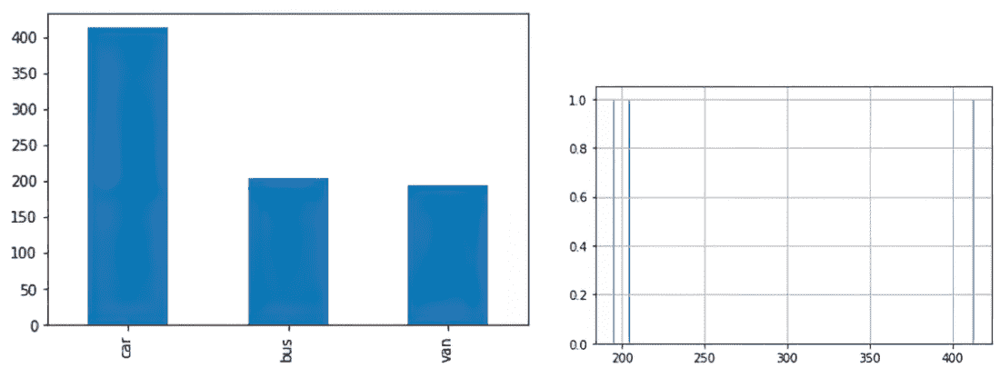

##### 图 2.11 变量`class`的两个图表

1.  4. 检查数据集中是否有缺失的数据点。在我们的数据集中没有缺失的数据点，因为我们已经处理了它们：

```py
vehicle_df.isna().sum()
```

注意：我们在第十一章的第 11.4.3 节中介绍了处理缺失值的方法，因为删除缺失值通常不是最佳方法。

1.  5. 标准化数据集。对于聚类来说，标准化数据集是一个好的实践。这是很重要的，因为不同的维度可能处于不同的尺度上，如果一个维度的值自然比其他维度大得多，那么它可能会主导距离的计算。这是通过使用`StandardScaler()`函数来完成的。请参考附录以检查不同的缩放技术：

```py
vehicle_df_1 = vehicle_df.drop('class', axis=1)
from scipy.stats import zscore
vehicle_df_1_z = vehicle_df_1.apply(zscore)
from sklearn.preprocessing import StandardScaler
import umpy as np
sc = StandardScaler()
X_standard = sc.fit_transform(vehicle_df_1)
```

1.  6. 通过生成散点图快速查看数据集。该图表显示了我们在上一步创建的`X_standard`中的所有数据点的分布（见图 2.12）：

```py
plt.scatter(X_standard[:,0], X_standard[:,1])
plt.show()
```

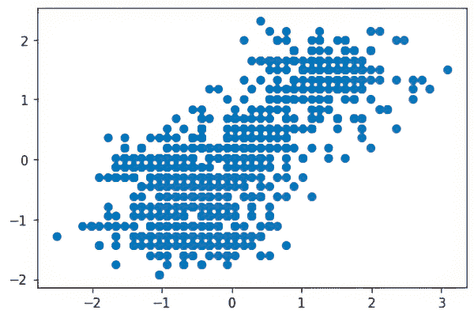

##### 图 2.12 数据集的散点图

1.  7. 执行 k-means 聚类。首先，我们必须使用肘部方法选择最佳聚类数量。从`sklearn`库中导入`KMeans`。在一个`for`循环中，我们遍历从 1 到 10 的聚类值。换句话说，算法将创建 1 到 10 个聚类，然后为我们生成结果以选择最优的*k*值。

在下面的代码片段中，模型对象包含了 k-means 算法的输出，然后将其拟合到上一步生成的`X_standard`。在这里，已经使用了欧几里得距离作为距离度量（见图 2.13）：

```py
from sklearn.cluster import KMeans
from scipy.spatial.distance import cdist
clusters=range(1,10)
meanDistortions=[]
for k in clusters:
    model=KMeans(n_clusters=k)
    model.fit(X_standard)
    prediction=model.predict(X_standard)
    meanDistortions.append(sum(np.min(cdist(X_standard, 
        model.cluster_centers_, 'euclidean'), axis=1)) / X_standard
                                                          .shape[0])
plt.plot(clusters, meanDistortions, 'bx-')
plt.xlabel('k')
plt.ylabel('Average distortion')
plt.title('Selecting k with the Elbow Method')
```


##### 图 2.13 k-means 聚类

1.  8. 如我们所观察到的，最佳聚类数量是三个。这是我们可以观察到图形中尖锐拐点的点。我们将继续使用三个聚类数量的 k-means 聚类。在这里，数字 3 并没有什么特殊之处，但它最适合这个数据集。`random_state`是一个用于确定质心初始化随机数的参数。我们将其设置为一个值以使随机性确定。如果您想再次重复相同的结果，请使用相同的随机状态数字。它就像一个种子数字：

```py
kmeans = KMeans(n_clusters=3, n_init = 15, random_state=2345) 
kmeans.fit(X_standard)
```

1.  9. 获取聚类的`centroids`：

```py
centroids = kmeans.cluster_centers_
centroids
```

1.  10. 现在我们使用`centroids`，这样它们就可以通过`columns`进行配置：

```py
centroid_df = pd.DataFrame(centroids, columns = list(X_standard) )
```

1.  11. 现在我们只为创建`labels`的目的创建一个`dataframe`，然后将其转换为分类变量：

```py
dataframe_labels = pd.DataFrame(kmeans.labels_ , columns = list(['labels']))
dataframe_labels['labels'] = dataframe_labels['labels'].astype('category')
```

1.  12. 在这一步，我们将两个`dataframes`连接起来：

```py
dataframe_labeled = vehicle_df_1.join(dataframe_labels)
```

1.  13. 进行`groupby`操作以创建分析所需的数据框：

```py
dataframe_analysis = (dataframe_labeled.groupby(['labels'] , axis=0)).head(1234)
dataframe_labeled['labels'].value_counts()
```

1.  14. 现在我们为定义的聚类创建一个可视化。这是使用`mpl_toolkits`库完成的。逻辑简单易懂。数据点根据相应的标签着色。其余步骤与调整标签、标题、刻度等以显示图表有关。由于无法在图表中绘制所有 18 个变量，我们选择了 3 个变量在图表中显示（见图 2.14）：

```py
from mpl_toolkits.mplot3d import Axes3D
fig = plt.figure(figsize=(8, 6))
ax = Axes3D(fig, rect=[0, 0, .95, 1], elev=20, azim=60)
kmeans.fit(vehicle_df_1_z)
labels = kmeans.labels_
ax.scatter(vehicle_df_1_z.iloc[:, 0], vehicle_df_1_z.iloc[:, 1], vehicle_df_1_z.iloc[:, 3],c=labels.astype(np.float), edgecolor='k')
ax.w_xaxis.set_ticklabels([])
ax.w_yaxis.set_ticklabels([])
ax.w_zaxis.set_ticklabels([])
ax.set_xlabel('Length')
ax.set_ylabel('Height')
ax.set_zlabel('Weight')
ax.set_title('3D plot of KMeans Clustering on vehicles dataset')
```

我们也可以用多个其他的*k*值测试前面的代码。我们已经为不同的*k*值创建了代码。为了节省空间，我们将测试不同*k*值的代码放在 GitHub 位置。

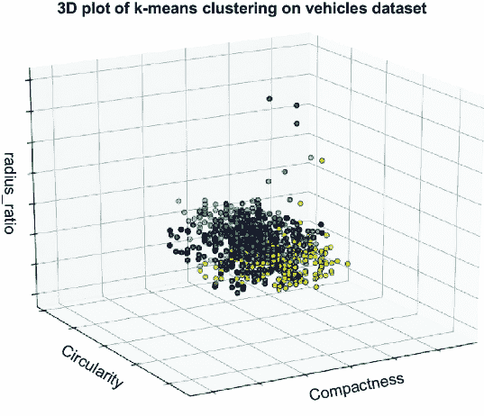

##### 图 2.14 车辆数据集的 k-means 聚类

注意：探索性数据分析是稳健的机器学习解决方案和成功项目的关键。在随后的章节中，我们将为数据集创建详细的数据探索分析。

在先前的例子中，我们首先对数据集进行了小规模的探索性分析。随后，我们确定了最佳簇的数量，在这个例子中是三个。然后我们实现了 k-means 聚类。你被期望迭代 k-means 解决方案，使用不同的初始化并比较结果，使用不同的*k*值进行迭代，并可视化以分析数据点的移动。

由于其逻辑简单、易于实现、灵活且易于维护，基于质心的聚类是推荐的最解决方案之一。每当我们需要聚类作为解决方案时，我们通常首先创建一个 k-means 聚类解决方案作为基准。该算法非常受欢迎，通常也是用于聚类的第一个解决方案之一。然后我们测试并迭代其他算法。

## 2.4 基于连接性的聚类

“物以类聚”是连接性聚类所遵循的原则。其核心概念是相互连接的对象彼此相似。因此，基于这些对象之间的连接性，它们被分组到不同的簇中。图 2.15 展示了这种表示的一个例子，其中我们可以迭代地分组观察。例如，我们首先从所有事物开始，将其分为生物和非生物等。这种表示被称为*树状图*。由于存在树状结构，基于连接性的聚类有时也被称为层次聚类。


##### 图 2.15 展示了层次聚类利用迭代分组相似对象的表示。这种表示被称为树状图。

层次聚类与人类的直觉相吻合，因此易于理解。与 k-means 聚类不同，在层次聚类中，我们不需要输入最终簇的数量，但该方法确实需要一个终止条件（即聚类何时停止）。同时，层次聚类也不建议簇的最佳数量。从生成的层次/树状图中，我们必须自己选择最佳的簇数量。我们将在后续章节中创建 Python 代码时进一步探讨这一点。

图 2.16 展示了层次聚类的一个例子。在这里，第一个节点是根节点，然后它被迭代地分割成节点和子节点。每当一个节点不能再分割时，它被称为终端节点或*叶节点*。


##### 图 2.16 展示了层次聚类的结构，其根部分裂成节点和子节点。不能再进一步分割的节点被称为叶节点。在自底向上的方法中，叶节点将进行合并。

由于存在多个将观察结果合并到簇中的过程或逻辑，我们可以生成大量的树状图，这由方程 2.7 给出：

##### (2.7)

树状图的数目 = (2*n* – 3)!/[2^(^(*n*)^(–2)) (*n* – 2)!]

其中 *n* 是观测的数量或叶子节点。因此，如果我们只有两个观测，我们只能有一个树状图。如果我们有 5 个观测，我们可以有 105 个树状图。因此，根据观测的数量，我们可以生成大量的树状图。

层次聚类可以根据创建观测分组所使用的流程进一步分类，我们将在下一节探讨。

### 2.4.1 层次聚类的类型

基于分组策略，层次聚类可以分为两种类型：*聚类*聚类和*分裂*聚类（见表 2.2）。

##### 表 2.2 不同类型的层次聚类

| 序号 | 聚类方法 | 分裂方法 |
| --- | --- | --- |
| 1  | 自底向上的方法  | 自顶向下的方法  |
| 2  | 每个观测创建自己的簇，然后随着算法向上进行，合并发生。  | 我们从一个簇开始，然后迭代地分裂观测以创建树状结构。  |
| 3  | 采用贪婪方法进行合并（贪婪方法将在下面描述）。  | 采用贪婪方法进行分裂。  |
| 4  | 观测将找到最佳的合并配对，并且当所有观测都相互合并时，过程完成。  | 所有观测在开始时都被考虑，然后根据分裂条件进行分裂，直到所有观测被耗尽或满足终止条件。  |

首先，让我们探讨贪婪方法的意义。贪婪方法或贪婪算法是任何在每一步都做出最佳选择而不考虑对未来状态影响的算法。换句话说，我们活在当下，并从当时可用的选择中做出最佳选择。当前的选择独立于未来的选择，算法将在以后解决子问题。贪婪方法可能不会提供最优化解，但通常在合理的时间内提供接近最佳解的局部最优解。层次聚类在合并或分裂节点时遵循这种贪婪方法。

接下来，我们检查层次聚类方法中遵循的步骤：

1.  如图 2.17 所示，假设我们的数据集中有五个观测：1、2、3、4 和 5。

1.  在这一步，观测 1 和 2 被归为一组，4 和 5 也被归为一组；3 没有被归入任何一组。

1.  在这一步，我们将上一步的 4、5 步的输出和观测 3 合并到一个簇中。

1.  第 3 步的输出与第 1、2 步的输出合并为一个单独的簇。


##### 图 2.17 层次聚类所遵循的步骤。从左到右，我们看到了聚类（节点合并），而从右到左，我们看到了分裂聚类（节点分裂）。

在这种方法中，从左到右，我们有一个聚合方法，而从右到左，则表示一个分裂方法。在聚合方法中，我们合并观测值，而在分裂方法中，我们分割观测值。我们可以使用聚合和分裂方法进行层次聚类。分裂聚类是一种穷举方法，有时可能比其他方法花费更多时间。

与 k 均值聚类类似，用于测量的距离度量在这里起着重要作用。我们了解并理解如何测量数据点之间的距离，但定义该距离的方法有很多，我们将在下一节中研究。

### 2.4.2 距离测量的连接标准

我们可以使用欧几里得距离、曼哈顿距离、切比雪夫距离等来测量两个观测值之间的距离。同时，我们可以采用各种方法来定义该距离。基于这个输入标准，生成的簇将不同。定义距离度量的各种方法如下：

+   *最近邻或单连接*使用不同簇中两个最近点之间的距离。计算不同簇中最近邻之间的距离，并以此确定下一个分割/合并。这是通过在所有成对中进行的穷举搜索来完成的。

+   *最远邻或完全连接*是与最近邻方法相反的。在这里，我们不是选择最近的邻居，而是关注不同簇中最远的邻居。换句话说，簇之间的距离是通过两个对象之间最大的距离来计算的。

+   *组平均连接*计算两个不同簇中所有可能成对对象之间的距离的平均值。

+   *Ward 连接*方法旨在最小化合并到一个簇中的簇的变异性。

在我们开发层次聚类的实际代码时，我们可以使用这些距离度量的选项，并比较准确性以确定数据集的最佳距离度量。在算法训练期间，算法合并观测值，这将最小化选择的连接标准。我们可以在图 2.18 中可视化各种连接方式。

注意：算法中的这些输入被称为超参数。这些是我们输入到算法中的值，以生成符合我们要求的结果，并且它们作为我们对算法的控制。k 均值聚类中的一个超参数示例是*k*。

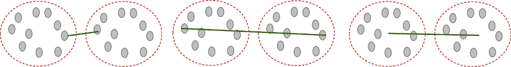

##### 图 2.18：单连接用于最近邻（左）；完全连接用于最远邻（中）；组平均用于簇间距离的平均（右）。

通过这一点，我们已经理解了层次聚类的工作机制。但我们还没有解决使用层次聚类确定最佳簇数量的机制，这将在下一部分进行探讨。

### 2.4.3 最佳簇数量

回想一下，在 k-means 聚类中，我们必须将簇的数量作为输入提供给算法。我们使用肘部方法来确定最佳簇数量。在层次聚类的案例中，我们不需要将簇的数量指定给算法，但我们仍然需要确定我们希望拥有的最终簇数量。我们使用树状图来回答这个问题。

让我们假设图表底部总共有 10 个数据点，如图 2.19 所示。簇会迭代合并，直到我们得到顶部的最终簇。树状图中两个簇合并在一起的高度代表了在向量空间图中这两个簇之间的相应距离。

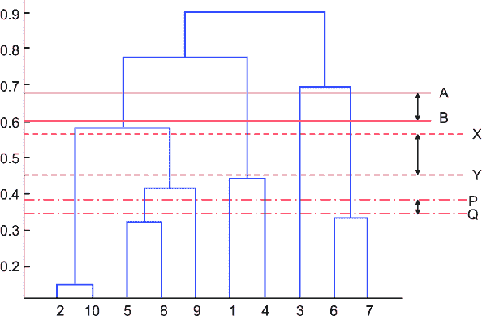

##### 图 2.19 树状图以确定最佳簇数量。X 和 Y 之间的距离比 A 和 B 以及 P 和 Q 之间的距离要远；因此，我们选择它作为切割以创建簇，选择的簇数量是五个。x 轴代表簇，而 y 轴代表两个簇之间的距离（相似度）。

从树状图中，簇的数量由被水平线切割的垂直线的数量给出。最佳簇数量由树状图中被水平线切割的垂直线的数量给出，这样它就与最高的垂直线相交。或者，如果切割从垂直线的这一端移动到另一端，覆盖的长度是最大的。树状图利用簇的分支来显示各种数据点之间是如何相互关联的。在树状图中，位于相同高度水平的簇比位于不同高度水平的簇更紧密相关。

在图 2.19 中显示的例子中，我们展示了三个潜在的切割：AB、PQ 和 XY。如果我们对 AB 进行切割，它将导致两个非常宽泛的簇，而低于 PQ 将导致九个簇，这将变得难以进一步分析。

在这里，X 和 Y 之间的距离比 A 和 B 以及 P 和 Q 之间的距离要远。因此，我们可以得出结论，X 和 Y 之间的距离是最大的，因此，我们可以将其最终确定为最佳切割。这个切割与五个不同的点相交；因此，我们应该有五个簇。树状图上切割的高度与 k-means 聚类中的*k*值相似。在 k-means 聚类中，*k*决定了簇的数量。在层次聚类中，最佳切割决定了我们希望拥有的簇的数量。

与 k-means 聚类类似，最终的聚类数量不仅取决于算法的选择。商业敏锐度和实用逻辑在确定最终聚类数量中起着至关重要的作用。回想一下，簇的一个重要属性是它们的可用性，我们在第 2.2 节中讨论了这一点。

有时我们也会使用柯普仁尼克相关系数来衡量树状图如何很好地表示点之间的实际成对距离。它比较了柯普仁尼克距离，即两个点在树状图中首次合并的高度，与点之间的原始差异。

还有一个称为 Calinski-Haranasz 指数的指标。它衡量了簇间分散与簇内分散的比率。值越高表示聚类越好，因此我们选择最大化这个指数的最佳聚类数量。

##### 练习 2.3

回答这些问题以检查你的理解：

1.  层次聚类中使用的贪婪方法是什么？

1.  完全连接用于寻找最近邻的距离。对或错？

1.  群连接和 ward 连接之间的区别是什么？

1.  描述寻找最优化*k*值的过程。

### 2.4.4 层次聚类的优缺点

层次聚类是一种强大的聚类技术，也非常受欢迎。与 k-means 类似，它也使用距离作为度量标准来衡量相似性。同时，算法存在一些挑战。层次聚类的优点如下：

+   层次聚类的最大优势可能是结果的再现性。回想一下 k-means 聚类，过程从质心的随机初始化开始，给出不同的结果。在层次聚类中，我们可以再现结果。

+   在层次聚类中，我们不需要输入聚类的数量来分割数据。

+   实现起来既容易又易懂。因为它遵循树状结构，所以可以解释给非技术背景的用户。

+   生成的树状图可以通过可视化来解释，从而对数据有一个很好的理解。

同时，我们确实面临一些层次聚类算法的挑战，如下所示：

+   我们在层次聚类中面临的最大挑战是收敛所需的时间。k-means 的时间复杂度是线性的，而层次聚类是二次的。例如，如果我们有“*n*”个数据点，那么对于 k-means 聚类，时间复杂度将是*O*(*n*)，而对于层次聚类，它是*O*(*n*³)。

TIP   如果你想研究*O*(*n*)，请参考附录。

+   由于时间复杂度为 *O*(*n*³)，这是一个耗时的任务。此外，计算所需的内存至少为 *O*(*n*²)，这使得层次聚类成为一个耗时且内存密集的过程。即使数据集是中等规模，所需的计算也可能不是挑战，但对于普通计算机来说，这确实可能是一个问题。

+   有时对树状图的解释可能是主观的；因此，在解释树状图时需要尽职尽责。解释树状图的关键是关注任何两个数据点连接的高度。这可能具有主观性，因为不同的分析师可以解读不同的切割并试图证明他们的方法。因此，建议在数学和现实世界业务问题的背景下解释结果。

+   层次聚类无法撤销它已经完成的先前步骤。即使我们觉得建立的联系不合适，应该回滚，也没有机制来删除连接。

+   该算法对异常值和杂乱的数据集非常敏感。异常值、NULL、缺失值、重复值等的存在使得数据集变得杂乱。因此，结果可能不正确或不是我们所期望的。

尽管存在所有挑战，层次聚类仍然是使用最广泛的聚类算法之一。通常，我们为同一数据集创建 k-means 聚类和层次聚类来比较两种算法的结果。如果建议的聚类数量和相应聚类的分布看起来相似，我们就更有信心关于所使用的聚类方法。

我们已经涵盖了层次聚类的理论背景。现在是时候采取行动，跳入 Python 进行编码了。

### 2.4.5 使用 Python 进行层次聚类案例研究

我们现在将使用与 k-means 聚类相同的相同数据集为层次聚类创建一个 Python 解决方案：

1.  加载所需的库和数据集。为此，遵循我们为 k-means 算法遵循的步骤 1 到 6。

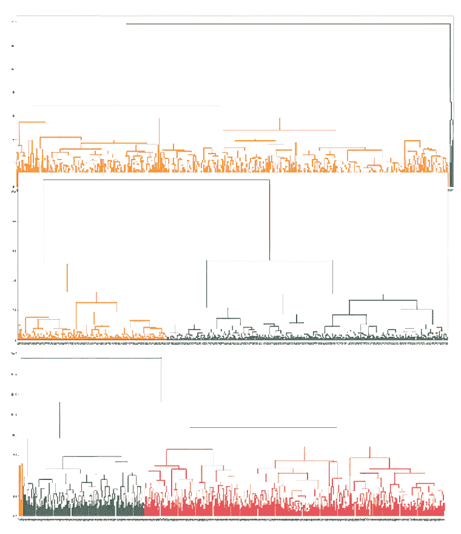

##### 图 2.20 使用平均、ward 和完全链接方法进行层次聚类（从上到下分别为）

1.  2. 接下来，我们使用三种链接方法：平均、ward 和完全来创建层次聚类。然后绘制聚类。该方法输入是`X_Standard`变量，使用的链接方法和距离度量。然后，使用`matplotlib`库绘制树状图。在下面的代码片段中，只需将方法从“平均”更改为“ward”和“完全”，即可获得相应的结果（见图 2.20）：

```py
from scipy.cluster.hierarchy import dendrogram, linkage
Z_df_average = linkage(X_standard, 'average', metric='euclidean')
Z_df_average.shape
plt.figure(figsize=(30, 12))
dendrogram(Z_df_average)
plt.show()
```

1.  3. 我们现在想要选择我们希望拥有的聚类数量。为此，让我们通过子集最后合并的 10 个聚类来重新创建树状图。我们选择 10 是因为它通常是一个最佳选择；我建议你也用其他值进行测试（见图 2.21）：


##### 图 2.21 显示最后 10 个合并聚类的树状图

```py
dendrogram(
    Z_df_complete,
    truncate_mode='lastp',  p=10,)
plt.show()
```

1.  4. 我们观察到最佳距离是 10。

1.  5. 将数据聚类到不同的组中。通过使用上一节中描述的逻辑，最佳聚类的数量将是四个：

```py
from scipy.cluster.hierarchy import fcluster
hier_clusters = fcluster(Z_df_complete, max_distance, criterion='distance')
hier_clusters
len(set(hier_clusters))
```

1.  6. 使用`matplotlib`库绘制不同的聚类。在书的打印版本中，您将看不到不同的颜色。Python 代码的输出将包含颜色；我建议您运行代码以欣赏输出效果。相同的输出可以在 GitHub 仓库中找到（见图 2.22）：

```py
plt.scatter(X_standard[:,0], X_standard[:,1], c=hier_clusters)  
plt.show()
```

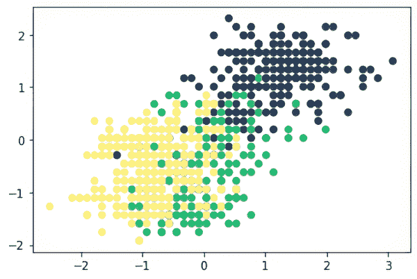

##### 图 2.22 使用`matplotlib`库绘制的不同聚类图

1.  7. 对于不同的距离值，聚类的数量将改变，图表看起来也会不同。我们展示了距离为 5、15 和 20 时以及每次迭代生成的不同数量的聚类结果。图 2.23 显示，当我们从左到右移动时，对于不同的距离值，我们得到完全不同的结果。在选择距离值时，我们应该谨慎，有时我们可能需要迭代几次才能得到最佳值。

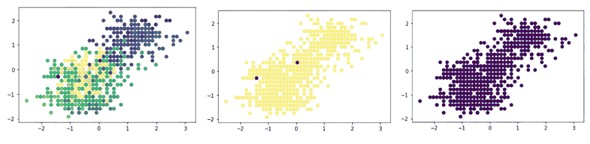

##### 图 2.23 使用不同距离值的聚类数量

使用层次聚类，我们将图 2.24 左侧的数据分割到右侧。左侧表示原始数据，而右侧我们有聚类数据集的表示。在书的打印版本中，您将看不到不同的颜色。Python 代码的输出将包含颜色。相同的输出可以在 GitHub 仓库中找到。

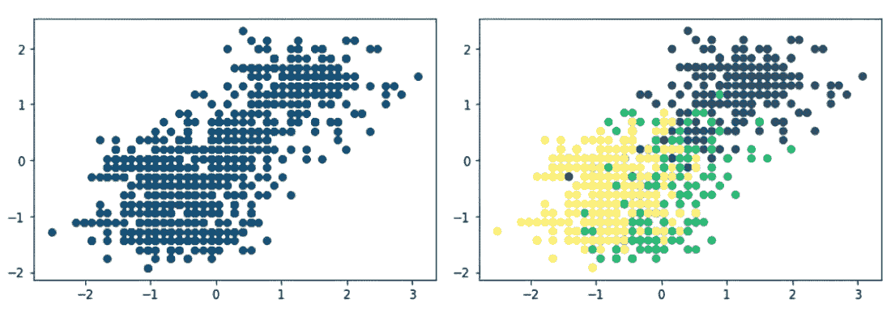

##### 图 2.24 使用层次聚类分割数据

层次聚类是一种稳健的方法，并且非常推荐。与 k-means 一起，它为基于聚类的解决方案提供了一个很好的基础。大多数时候，至少我们在创建聚类解决方案时使用这两种技术，然后我们继续使用其他方法进行迭代。

## 2.5 基于密度的聚类

我们在前面章节中学习了 k-means。回想一下它如何使用基于质心的方法将每个数据点分配到一个聚类中。如果一个观测值是异常值，异常点会将质心拉向自己，并且像正常观测值一样被分配到一个聚类中。这些异常值不一定向聚类提供信息，并且可能不成比例地影响其他数据点，但它们仍然被作为聚类的一部分。此外，如图 2.25 所示，使用 k-means 算法获取任意形状的聚类是一个挑战。基于密度的聚类方法解决了这个问题。

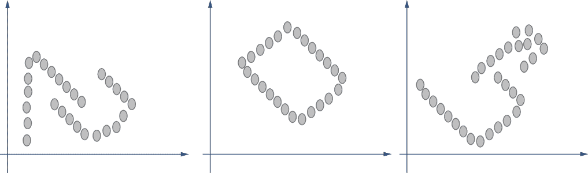

##### 图 2.25 DBSCAN 非常适合不规则形状的聚类。与 k-means 相比，我们通常得到球形聚类；DBSCAN 可以解决这个问题。

在基于密度的方法中，簇被识别为密度高于数据集其余部分的区域。换句话说，在一个表示数据点的向量空间图中，簇被定义为高密度点的相邻区域或邻近区域。这个簇将由低密度点的区域与其他簇分开。稀疏区域或分隔区域中的观测被认为是数据集中的噪声或异常值。图 2.25 展示了基于密度的聚类的一些示例。

我们提到了两个术语：邻域和密度。为了理解基于密度的聚类，我们将在下一节中研究这些术语。

### 2.5.1 邻域和密度

假设我们用向量空间表示数据观测，并且有一个点 P。我们现在定义这个点 P 的邻域。表示如图 2.26 所示。对于点 P，我们定义了一个*ε*邻域，即与 P 等距离的点。在二维空间中，它表示为一个圆；在三维空间中，它是一个球体；而对于*n*维空间，它是以 P 为中心、半径为*ε*的*n*球体。这定义了*邻域*的概念。

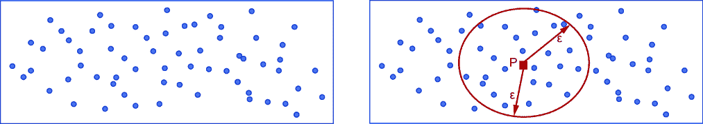

##### 图 2.26 向量空间图中数据点的表示。在右侧有一个点 P，画出的圆的半径为*ε*。因此，对于*ε* > 0，点 P 的邻域由距离点 P 小于或等于*ε*的点集定义。

现在我们来探讨一下*密度*这个术语。回想一下，密度是质量除以体积（质量/体积）。质量越高，密度越高；质量越低，密度越低。相反，体积越低，密度越高，反之亦然。

在前面的上下文中，质量是邻域中点的数量。在图 2.26 中，我们可以观察到*ε*对数据点数量或质量的影响。当涉及到体积时，在二维空间中，体积是π*r*²，而对于三维的球体，它是 4/3 π*r*³。对于*n*维的球体，我们可以根据维数计算相应的体积，这将是一个数值常数乘以维数的幂。

因此，在图 2.27 所示的两种情况下，对于点 P，我们可以得到点的数量（质量）和体积，然后我们可以计算出各自的密度。但是，这些密度的绝对值对我们来说没有任何意义；相反，它们与附近区域的相似性（或不同性）才是重要的。位于同一区域且具有相似密度的点可以被归入一个簇。


##### 图 2.27 半径*ε*的影响。在左侧，点的数量多于右侧。因此，右侧的质量较小，因为它包含的数据点较少。

在理想情况下，我们希望拥有高度密集的聚类，具有最大数量的点。在图 2.28 所示的两种情况下，左侧显示了一个较稀疏的聚类，而右侧显示了一个高密度的聚类。

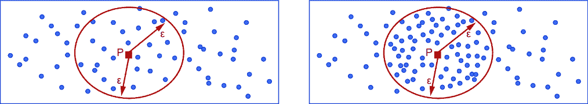

##### 图 2.28 较密集的聚类比较稀疏的聚类更受欢迎。理想情况下，一个具有最大数据点的密集聚类是我们从聚类中希望实现的目标。

从前面的讨论中，我们可以得出结论：

+   如果我们*增加*ε的值，我们将获得更大的体积，但不一定是更多的点数（质量）。这取决于数据点的分布。

+   如果我们*减少*ε的值，我们将获得较小的体积，但不一定是较少的点数（质量）。

这些是我们坚持的基本原则。因此，我们必须选择具有高密度并覆盖最多邻近点的聚类。

### 2.5.2 DBSCAN 聚类

DBSCAN 聚类是一种高度推荐的基于密度的算法。它将密集区域中紧密排列的数据观察值聚类，但不考虑低密度区域的异常值。与 k-means 不同，我们不需要指定聚类数量，该算法能够识别不规则形状的聚类，而 k-means 通常提出球形聚类。类似于层次聚类，它通过连接数据点来工作，但与满足密度标准或阈值值的观察值相关。

注意：DBSCAN 由 Martin Ester、Hans-Peter Kriegal、Jörg Sander 和 Xiaowei Xu 于 1996 年提出。该算法在 2014 年 ACM SIGKDD 的测试时间奖中获奖。论文可在[`mng.bz/BXv1`](https://mng.bz/BXv1)访问。

DBSCAN 基于我们在上一节讨论的邻域概念。现在我们将深入探讨 DBSCAN 的工作方法和构建模块。

#### DBSCAN 聚类的要点

现在我们来检查 DBSCAN 聚类的核心构建模块。我们知道它是一种基于密度的聚类算法，因此邻域概念在这里适用。

假设我们有一些需要聚类的数据观察值。我们也定位了一个数据点 P。然后我们可以轻松地定义两个超参数术语：

+   P 点周围的邻域半径，称为*ε*，这是我们上一节讨论的内容。

+   我们希望在 P 点邻域中拥有的最小点数，换句话说，创建密集区域所需的最小点数。这被称为最小点数（minPts）。这是我们可以在 minPts 上应用阈值输入的参数之一。

基于这些概念，我们可以将观察值分为三个广泛的类别：核心点、边界或可达点，和异常值：

+   *核心点*—任何数据点 x，如果至少有 minPts 个点在它（包括 x 本身）的ε距离范围内，则可以称为核心点，在图 2.29 中用方块表示。它们是我们聚类的构建块，被称为核心点。我们对每个点使用相同的半径值（ε），因此每个邻域的体积保持不变。但点的数量会变化，因此质量也会变化。因此，密度也会变化。由于我们使用 minPts 设置了一个阈值，我们实际上是在对密度设置一个限制。因此，我们可以得出结论，核心点满足最小密度阈值要求。必须注意的是，我们可以选择不同的ε和 minPts 值来迭代和微调聚类。

+   *边界点或可达点*—在聚类中不是核心点的点称为边界点，在图 2.29 中用实心圆表示。


##### 图 2.29 核心点用方块表示；边界点用实心圆表示，而噪声用空心圆表示。这三个共同构成了 DBSCAN 聚类的构建块。

如果点 y 在核心点 x 的ε距离内，则 y 可以从 x 直接到达。一个点只能从一个核心点接近，这是需要遵循的主要条件或规则。只有核心点可以到达非核心点，反之则不成立。换句话说，一个非核心点只能被其他核心点到达；它不能到达任何人。在图 2.29 中，边界点用深色圆圈表示。

为了更好地理解这个过程，我们必须理解术语*密度可达*或*连通性*。在图 2.30 中，我们有两个核心点：X 和 Y。我们可以直接从 X 到 Y。点 Z 不在 X 的邻域内，但在 Y 的邻域内。因此，我们不能直接从 X 到达 Z，但我们可以肯定地通过 Y 或换句话说，通过 Y 的邻域从 X 到达 Z。相反，我们不能从 Z 到 X，因为 Z 是边界点，如前所述，我们不能从边界点进行旅行。

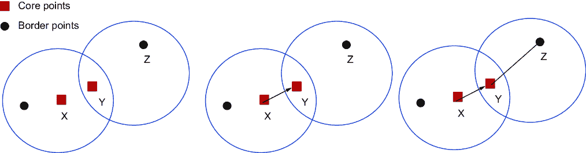

##### 图 2.30 中，X 和 Y 是核心点，我们可以从 X 到 Y 旅行。尽管 Z 不在 X 的最近邻域内，但我们仍然可以通过 Y 从 X 到达 Z。这是 DBSCAN 聚类中使用的密度连通点的核心概念。

+   *异常值*—所有其他点都是异常值。换句话说，如果不是核心点或不是可达点，它就是异常值，在图 2.29 中用空心圆表示。它们没有被分配到任何聚类中。

#### DBSCAN 聚类的步骤

DBSCAN 聚类的步骤如下：

1.  我们从为创建聚类所需的ε和 minPts 赋值开始。

1.  我们从选择一个随机点开始，比如说 P，它还没有被赋予任何标签（即，它还没有被分析并分配到任何聚类中）。

1.  然后我们分析 P 的邻域。如果它包含足够多的点（即，高于 minPts），那么满足开始簇的条件。如果是这样，我们将点 P 标记为*核心点*。如果一个点不能被识别为核心点，我们将将其标记为*异常点*或*噪声*。我们应该注意这个点以后可以成为不同簇的一部分。然后我们回到步骤 2。

1.  一旦找到这个核心点 P，我们就开始通过添加从 P 直接可达的所有点来创建簇，然后通过添加更多从 P 直接可达的点来增加这个簇的大小。然后我们通过迭代所有这些点，将所有点添加到簇中，这些点可以通过邻域包含。如果我们向簇中添加一个异常点，则将异常点的标签更改为边界点。

1.  这个过程会一直持续到密度簇完成。然后我们找到一个新未分配的点，并重复这个过程。

1.  一旦所有点都被分配到一个簇或称为异常点，我们就停止我们的聚类过程。

在这个过程中有迭代。然后，一旦聚类完成，我们利用业务逻辑来合并或拆分几个簇。

##### 练习 2.4

回答这些问题以检查你的理解：

1.  比较和对比 DBSCAN 聚类与 k-means 聚类的重要性。

1.  非核心点可以到达核心点，反之亦然。对还是错？

1.  解释邻域和 minPts 的重要性。

1.  描述寻找*k*的最优值的过程。

现在我们已经清楚 DBSCAN 聚类的过程。在创建 Python 解决方案之前，我们将检查 DBSCAN 算法的优点和缺点。

#### DBSCAN 聚类的优缺点

DBSCAN 有以下优点：

+   与 k-means 不同，我们不需要指定 DBSCAN 的簇数。

+   该算法是对不干净数据集相当鲁棒的解决方案。与其他算法不同，它可以有效地处理异常值。

+   我们也可以确定不规则形状的簇。可以说，这是 DBSCAN 聚类最大的优点。

+   算法只需要输入半径和 minPts。

DBSCAN 有以下挑战：

+   使用 DBSCAN 有时无法清楚地区分簇。根据处理观察值的顺序，一个点可以改变其簇。换句话说，如果一个边界点 P 可以被多个簇访问，P 可以属于任何一个簇，这取决于处理数据的顺序。

+   如果数据集不同区域之间的密度差异非常大，那么确定*ε*和 minPts 的最佳组合将非常困难，因此 DBSCAN 将无法生成有效结果。

+   使用的距离度量在聚类算法中起着高度重要的作用，包括 DBSCAN。可以说，最常用的度量是欧几里得距离，但如果维度数量相当大，那么计算就成为一个挑战。

+   该算法对*ε*和 minPts 的不同值非常敏感。有时找到最优化值成为一个挑战。

#### DBSCAN 聚类的 Python 解决方案

我们将使用与 k-means 和层次聚类相同的相同数据集：

1.  在 k-means 算法的第 6 步之前，加载库和数据集。

1.  导入额外的库：

```py
from sklearn.cluster import DBSCAN 
from sklearn.preprocessing import StandardScaler 
from sklearn.preprocessing import normalize 
from sklearn.neighbors import NearestNeighbors
```

这里我们使用最小距离和半径的值来拟合模型：

```py
db_default = DBSCAN(eps = 0.0375, min_samples = 6).fit(X_standard) 
labels = db_default.labels_
```

独特聚类的数量是 1：

```py
list(set(labels))
```

1.  3. 在这里我们没有得到任何关于聚类的结果。换句话说，由于我们没有提供 minPts 和*ε*的最佳值，因此不会有任何逻辑上的聚类结果。

1.  4. 现在，我们将找到*ε*的最佳值（见图 2.31）。为此，我们将计算每个点到最近点的距离，然后对结果进行排序和绘图。曲线最大的地方就是*ε*的最佳值。对于 minPts，通常 minPts ≥ *d* + 1，其中*d*是数据集中的维度数：

```py
neigh = NearestNeighbors(n_neighbors=2)
nbrs = neigh.fit(X_standard)
distances, indices = nbrs.kneighbors(X_standard)
distances = np.sort(distances, axis=0)
distances = distances[:,1]
plt.plot(distances)
```


##### 图 2.31 寻找*ε*的最佳值

注意：有关如何选择 DBSCAN 半径值的进一步研究，请参阅[`iopscience.iop.org/article/10.1088/1755-1315/31/1/012012/pdf`](https://iopscience.iop.org/article/10.1088/1755-1315/31/1/012012/pdf)。

1.  5. 观察到缺陷点时，最佳值是 1.5，我们将使用它并将 minPts 设置为 5，这通常被视为标准：

```py
db_default = DBSCAN(eps=1.5, min_samples=5)
db_default.fit(X_standard)
clusters = db_default.labels_
```

1.  6. 现在，我们可以观察到我们得到了多个聚类：

```py
list(set(clusters))
```

1.  7. 让我们绘制聚类（见图 2.32）。在书的打印版本中，您将看不到不同的颜色。Python 代码的输出将包含颜色。相同的输出可在 GitHub 仓库中找到：

```py
colors = ['blue', 'red', 'orange', 'green', 'purple', 'black', 'brown', 'cyan', 'yellow', 'pink']
vectorizer = np.vectorize(lambda x: colors[x % len(colors)]) 
plt.scatter(X_standard[:,0], X_standard[:,1], c=vectorizer(clusters))
```


##### 图 2.32 绘制聚类

因此，我们使用 DBSCAN 创建了一个解决方案。我建议您比较所有三个算法的结果。在现实世界的场景中，我们使用多个算法测试解决方案，迭代超参数，然后选择最佳解决方案。

基于密度的聚类是一个相当有效的解决方案，并且在某种程度上也是一个非常有效的解决方案。如果怀疑聚类的形状是不规则的，则强烈推荐使用。

通过这一点，我们结束了 DBSCAN 聚类的讨论。在下一节中，我们将解决一个关于聚类的商业案例。在案例研究中，重点较少放在技术概念上，而更多放在商业理解和解决方案生成上。

## 2.6 使用聚类进行案例研究

我们现在将定义一个案例研究，该研究将聚类作为解决方案之一。案例研究的目的是让您了解实际和现实生活中的商业世界。这种基于案例研究的方法也适用于与工作相关的面试，其中在面试阶段讨论案例。我强烈建议您了解我们如何在务实商业场景中实施机器学习解决方案。

案例研究通常包括业务问题、可用数据集、可用的各种解决方案、面临的挑战以及最终选择的解决方案。我们还讨论了在现实世界业务中实施解决方案时遇到的问题。

因此，让我们从使用无监督学习的聚类案例研究开始。在案例研究中，我们关注解决案例研究的步骤，而不是技术算法，因为对于特定问题可能有多种技术解决方案。

### 2.6.1 业务背景

我们考虑的行业可以是零售业；电信业；银行、金融服务和保险业；航空业；医疗保健业；或任何拥有客户基础的行业。对于任何业务，目标是为业务创造更多收入，并最终增加业务的总体利润。为了增加收入，业务希望拥有越来越多的新客户。业务也希望现有消费者购买更多，并且更频繁地购买。因此，业务总是努力保持消费者的参与和满意度，并增加他们与业务的交易价值。

为了实现这一点，业务必须对其消费者基础有深入的了解；它必须了解他们的口味、价格点、类别偏好、亲和力、首选的营销/沟通渠道等。一旦业务仔细检查并理解了消费者基础，那么

+   产品团队可以根据消费者的需求改进产品功能。

+   定价团队可以通过将产品与客户偏好的价格对齐来提高产品的价格。可以为客户定制价格，或者提供忠诚度折扣。

+   市场营销团队和客户关系团队可以针对消费者提供定制化优惠。

+   团队可以挽回即将流失或停止购买业务的消费者，提高他们的消费，增加粘性，并提高客户终身价值。

+   总体而言，不同的团队可以根据对消费者生成的理解来调整他们的产品。最终消费者将更加满意，更加投入，并对业务更加忠诚，从而实现更有成效的消费者互动。

因此，业务应深入挖掘消费者数据，并生成对基础的理解。客户数据可能如下节所示。

### 2.6.2 分析用数据集

我们以一个拥有忠诚度计划并保存客户交易详情的服装零售商为例。各种（非详尽）数据源如图 2.33 所示。


##### 图 2.33 服装零售店的数据源

我们可以拥有商店详情，如商店 ID、商店名称、城市、区域、员工数量等。我们可以有一个项目层级表，其中包含所有项目的详细信息，如价格、类别等。然后我们可以有客户人口统计详情，如年龄、性别、城市和客户交易历史。显然，通过连接这些表，我们将能够创建一个包含所有详细信息的主表。

注意：我建议你培养良好的 SQL 技能。在几乎所有的与数据相关的领域都需要 SQL——无论是数据科学、数据工程还是数据可视化，SQL 都无处不在。

图 2.34 是主表的一个示例。这不是变量的完整列表，变量的数量可能比显示的要多得多。主表包含一些原始变量，如收入、发票等，以及一些派生变量，如平均交易价值、平均购物篮大小等。

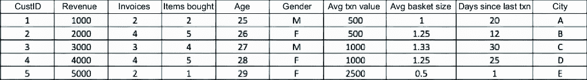

##### 图 2.34 主表

我们也可以举一个电信运营商的例子。在那个订阅者使用情况中，通话费率、收入、网络使用天数、数据使用等将是我们要分析的属性。因此，根据手头的业务领域，数据集将有所不同。

一旦我们有了数据集，我们通常从中创建派生属性。例如，平均交易价值属性是总收入除以发票数量。我们在已有的原始变量之外创建这样的属性。

### 2.6.3 建议的解决方案

对于这个问题可能有多个解决方案，其中一些我们将在以下内容中包括：

+   我们可以创建一个仪表板来展示主要的关键绩效指标。这将使我们能够分析历史数据并据此采取必要的行动。但仪表板只会显示我们已知（在一定程度上）的信息。

+   我们可以使用在前面章节中使用的某些技术进行数据分析。这将解决部分问题，而且同时考虑多个维度是困难的。

+   我们可以创建预测模型来预测客户在接下来的几个月内是否会购物，或者在未来 *X* 天内是否会流失，但这并不能完全解决问题。为了明确，“流失”在这里的意思是客户在接下来的 *X* 天内不再与零售商购物。在这里，持续时间 *X* 是根据业务领域定义的。例如，在电信领域，*X* 将小于在保险领域。这是因为人们每天都在使用手机，而在保险领域，大多数客户每年支付一次保费。因此，保险领域的客户互动较少。

+   我们可以创建客户细分解决方案，根据客户的历史趋势和属性将客户分组。这是我们用来解决这个业务问题的解决方案。

### 2.6.4 解决方案

回想第一章中的图 1.9，我们讨论了在机器学习算法中遵循的步骤。一切从定义业务问题开始，然后我们继续进行数据发现、预处理等。在我们的案例研究中，我们将采用类似的策略。我们已经定义了业务问题；数据发现已完成，我们已经完成了探索性数据分析和数据的预处理。要使用聚类创建分段解决方案，请遵循以下步骤：

1.  我们从确定要输入聚类算法的数据集开始。我们可能已经创建了某些派生变量，处理了一些缺失值或异常值等。在案例研究中，我们想知道交易、发票、购买物品等的最大/最小/平均值。我们会对性别和年龄分布感兴趣。我们还想知道这些变量之间的相互关系，例如，女性客户是否比男性客户更倾向于使用在线模式。所有这些问题都是这一步骤的一部分。

TIP   在 GitHub 仓库中检查了 Python Jupyter 笔记本，其中提供了探索性数据分析和数据预处理的详细步骤和代码。查看它！

1.  2. 我们使用 k-means 聚类和层次聚类创建第一个解决方案。对于每个算法，通过改变超参数进行迭代。在案例研究中，我们将选择如访问次数、总收入、独特购买类别、在线/离线交易比率、性别、年龄等作为聚类的参数。

1.  3. 选择算法的最终版本及其相应的超参数。在业务理解的基础上进一步分析聚类。

1.  4. 更常见的是，根据观察值的大小和其中属性的性质，聚类会被合并或拆分。例如，如果总客户群为 100 万，对 100 人的聚类采取行动将非常困难。同时，管理一个 700,000 人的聚类也将同样困难。

1.  5. 然后我们分析我们最终拥有的聚类。检查变量的聚类分布，了解它们的区分因素，并为聚类给出逻辑名称。我们可以预期看到如图 2.35 所示的聚类输出。

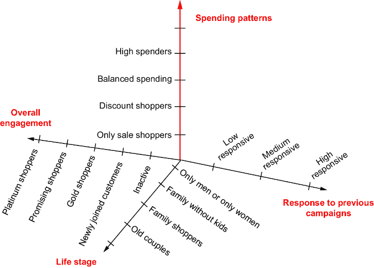

##### 图 2.35 基于响应、生命周期、参与度和消费模式等少数维度的分段。这些维度并不全面，在现实世界的业务问题中，维度的数量可能更多。

在示例聚类中，我们展示了消费模式、对先前活动的响应、生命周期和整体参与度作为几个维度。这些维度的相应子分类也显示出来。聚类将是这些维度的逻辑组合。实际的维度可能更多。

图 2.35 中展示的分割可以用于多个领域和企业。参数和属性可能会变化，业务背景可能不同，可用的数据量可能有所不同——但整体方法保持相似。

除了上一节中我们看到的应用之外，让我们在这里考察一些其他用例：

+   市场研究利用聚类将消费者群体分割成市场细分；然后可以更好地分析这些群体的偏好。产品定位可以改进，定价可以更紧密，地理选择将更加科学。

+   在生物信息学和医疗行业，聚类算法可以用来将基因分组到不同的类别中。通过分析这些基因组的属性，可以对基因组进行分割，并评估比较。

+   在我们使用监督学习解决方案创建算法之前，聚类被用作一个有效的数据预处理步骤。它还可以通过关注属于某个聚类的数据点来减少数据量。

+   聚类被用于在结构化和非结构化数据集中进行模式检测。我们已经研究了结构化数据集的案例。对于文本数据，它可以用来将类似类型的文档、期刊、新闻等进行分组。我们还可以使用聚类来处理和开发图像解决方案。我们将在后面的章节中研究文本和图像的无监督学习解决方案。

+   由于算法基于相似度测量，聚类可以用来将传入的数据集分割为欺诈或真实，这可以用来减少犯罪活动的数量。

聚类算法的应用场景非常多样。我们在这里只讨论了其中一些突出的例子。聚类算法是那些能够改变工作方法并围绕数据产生大量洞察力的算法之一。它在电信、零售、银行、金融服务和保险、航空以及其他领域得到广泛应用。

同时，算法也存在一些问题。接下来，我们将考察我们在聚类中面临的常见问题。

## 2.7 聚类中常见的挑战

聚类并不是一个完全没有挑战的简单解决方案。像世界上任何其他解决方案一样，聚类也有其问题。我们在聚类中面临的最常见挑战如下：

+   *数据量过大*——有时数据的规模相当大，有很多维度可用。在这种情况下，管理数据集变得困难。计算能力可能有限，而且像任何项目一样，时间有限。为了克服这个问题，我们可以

    +   尝试通过使用基于监督学习的回归方法或决策树算法等，找到最显著的变量来减少维度数量。

    +   通过使用主成分分析或奇异值分解等方法来减少维度数量。

+   *噪声数据集*——“垃圾输入，垃圾输出”这个陈词滥调对于聚类也是适用的。如果数据集很乱，就会产生很多问题。这些问题可能包括

    +   缺失值（即 NULL、NA、？、空白等）。

    +   数据集中的异常值。

    +   数据集中存在的垃圾值，如#€¶§^等。

    +   数据中的错误条目。例如，如果在收入字段中输入了一个名称，那么它就是一个错误的条目。

我们将在后面的章节中讨论解决这些问题的步骤和过程。在本章中，我们正在探讨如何处理分类变量。

+   *分类变量*——在讨论时，回想一下 k-means 无法使用分类变量的问题。我们将在下一节解决这个问题。

为了将分类变量转换为数值变量，我们可以使用*独热编码*。这种技术会添加额外的列，数量等于不同类别的数量，如下面的图所示。变量 city 有独特的值，如伦敦和新德里。我们可以观察到，已经创建了两个额外的列，用 0 或 1 填充了值（见图 2.36）。


##### 图 2.36 使用独热编码将分类变量转换为数值变量

使用独热编码并不总是能确保有效的解决方案。想象一下，如果这个例子中的城市数量是 100，那么数据集中将会有 100 个额外的列，其中大部分值将被填充为 0。因此，在这种情况下，建议将一些值分组。

+   *距离度量*——使用不同的距离度量，我们可能会得到不同的结果。尽管没有“一刀切”的方法，但欧几里得距离通常用于测量距离。

+   *主观解释*——对于聚类的解释相当主观。通过使用不同的属性，可以对相同的数据集进行完全不同的聚类。如前所述，重点应放在解决当前的业务问题上。这是选择超参数和最终算法的关键。

+   *耗时*——由于同时处理了很多维度，有时算法收敛需要花费很多时间。

尽管存在所有这些挑战，聚类仍然是一种被广泛认可和使用的技巧。

## 2.8 总结思考

无监督学习不是一个容易的任务。但它确实是一个非常吸引人的任务。它不需要任何目标变量，解决方案会自己识别模式，这是无监督学习算法最大的优点之一。并且这些解决方案已经在商业世界中产生了巨大的影响。在本章中，我们研究了这些解决方案类别中的一个，称为聚类。

聚类是一种无监督学习解决方案，它对于模式识别、探索性分析和当然，数据点的分割都是非常有用的。组织机构大量使用聚类算法，并继续深入理解消费者数据。可以提供更好的价格，提出更相关的优惠，提高消费者参与度，并使整体客户体验变得更好。毕竟，让消费者满意是任何企业的目标。聚类不仅可以用于结构化数据，还可以用于文本数据、图像、视频和音频。由于其能够在多个数据集和大量维度中找到模式的能力，聚类是我们想要一起分析多个维度时的首选解决方案。

在本书的第二章中，我们介绍了基于无监督的聚类方法的概念。我们检查了不同类型的聚类算法——k-means 聚类、层次聚类和 DBSCAN 聚类——以及它们的数学概念、相应的用例和优缺点，并着重于为这些数据集创建实际的 Python 代码。

在下一章中，我们将研究降维技术，如主成分分析和奇异值分解。我们将讨论技术的基础构件、它们的数学基础、优缺点以及用例，并执行实际的 Python 实现。

## 2.9 实践下一步行动和建议阅读

以下提供了一些下一步行动的建议和一些有用的阅读材料：

+   从[`mng.bz/dXqo`](https://mng.bz/dXqo)获取在线零售数据。这个数据集包含了 2010 年 1 月 12 日至 2011 年 9 月 12 日之间一个英国零售商的所有在线交易。应用章节中描述的三个算法来识别公司应该针对哪些客户以及为什么。

+   从[`www.kaggle.com/uciml/iris`](https://www.kaggle.com/uciml/iris)获取 IRIS 数据集。它包括三种鸢尾花物种，每个物种有 50 个样本，每个样本都有一些花的属性。使用 k-means 和 DBSCAN 算法，并比较结果。

+   在 UCI 探索聚类数据集[`archive.ics.uci.edu/ml/index.php`](http://archive.ics.uci.edu/ml/index.php)。

+   研究以下关于 k-means 聚类、层次聚类和 DBSCAN 聚类的论文：

    +   K-means 聚类

        [`mng.bz/rKqJ`](https://mng.bz/rKqJ)

        [`mng.bz/VVEy`](https://mng.bz/VVEy)

        [`ieeexplore.ieee.org/document/1017616`](https://ieeexplore.ieee.org/document/1017616)

+   +   层次聚类

        [`ieeexplore.ieee.org/document/7100308`](https://ieeexplore.ieee.org/document/7100308)

        [`mng.bz/xKqd`](https://mng.bz/xKqd)

        [`mng.bz/AQno`](https://mng.bz/AQno)

+   +   DBSCAN 聚类

        [`arxiv.org/pdf/1810.13105.pdf`](https://arxiv.org/pdf/1810.13105.pdf)

        [`ieeexplore.ieee.org/document/9356727`](https://ieeexplore.ieee.org/document/9356727)

## 摘要

+   聚类在所有行业中都有多种用途，例如零售、电信、金融和制药。聚类解决方案被用于客户和市场营销细分，以更好地理解客户基础，这进一步提高了定位。

+   聚类将具有相似属性的物体分组到段中，有助于数据理解和模式发现，而无需目标变量。

+   通过聚类，我们可以在数据集中找到潜在的规律，并识别数据的自然分组。

+   根据方法论，可以有多种聚类技术。一些例子包括 k-means 聚类、层次聚类、DBSCAN 和模糊聚类。

+   不同的聚类算法（k-means、层次、DBSCAN）提供不同的优缺点，每种算法都适用于不同的数据特征和目的。

+   聚类分为硬聚类，其中对象属于单个聚类，和软聚类，其中对象可以属于多个聚类。

+   不同的聚类属性和技术，如基于质心的、基于密度的和分布模型，会导致不同的聚类结果。

+   有效的聚类算法能够生成可理解、可扩展和独立的聚类，通过最小领域输入处理异常值和多种数据类型。

+   聚类的距离度量包括欧几里得、切比雪夫、曼哈顿和余弦距离。

+   基于质心的聚类通过到聚类质心的距离来衡量相似性。

+   K-means 聚类通过指定聚类数量，*k*，以及迭代地将数据点分配到最近的中心来创建非重叠的聚类。

+   肘部方法是一种常用的技术，用于确定 k-means 聚类中的最佳聚类数量。

+   K-means 聚类基于聚类的质心。

+   层次聚类基于连通性创建聚类，不需要预定义的聚类数量。

+   层次聚类可以是聚类的（自下而上）或分级的（自上而下），并使用链接标准来衡量距离。

+   DBSCAN 根据点密度识别聚类，并有效地区分异常值。

+   DBSCAN 不需要指定聚类数量，适用于不规则形状的聚类。

+   测量聚类精度涉及 WCSS、簇间平方和、轮廓值和 Dunn 指数等指标。
