# 3. 降维

### 本章涵盖

+   维度诅咒及其不利之处

+   减少维度的各种方法

+   主成分分析

+   奇异值分解

+   Python 解决主成分分析和奇异值分解的方法

+   关于降维的案例研究

> 知识是堆积事实的过程；智慧在于它们的简化。——马丁·H·费舍尔

在生活中，我们面临复杂的情况。生活向我们抛出多种选择，我们从中选择几个可行的。这个筛选决策基于每个选项的重要性、可行性、效用和预期的利润。符合条件的选择被选中。一个完美的例子就是选择你的度假目的地。基于天气、旅行时间、安全性、食物、预算和其他几个选项，我们选择几个我们愿意在那里度过下一个假期的地方。在本章中，我们研究的是如何减少选项的数量——尽管是在数据科学和机器学习的世界中。

在上一章中，我们介绍了主要的聚类算法，并进行了案例研究。我们在这些现实世界例子中生成和使用的数据集有很多变量。有时，数据中可能有超过 100 个变量或*维度*。但并非所有这些变量都是重要的。数据集中有很多维度被称为维度诅咒。为了进行任何进一步的分析，我们从所有维度或变量的列表中选择一些。在本章中，我们研究降维的需求、各种降维技术以及相应的优缺点。我们将更深入地探讨主成分分析（PCA）和奇异值分解（SVD）的概念及其数学基础，并用 Python 实现来补充。此外，继续我们上一章的结构，我们将研究电信行业的实际案例研究。还有其他高级的降维技术，如 t 分布随机邻域嵌入（t-SNE）和线性判别分析（LDA），我们将在后面的章节中探讨。

聚类和降维是无监督学习的主要类别。我们在上一章研究了主要的聚类方法，在本章中我们将讨论降维。有了这两种解决方案，我们在无监督学习领域覆盖了大量的内容。但还有更多高级主题需要探讨，这些主题是本书后几章的内容。

让我们先了解“维度诅咒”的含义。

## 3.1 技术工具包

我们在本章中使用的 Python 版本与上一章相同。本章也将使用 Jupyter Notebook。

所有数据集和代码文件都可以在 GitHub 仓库中找到（[`mng.bz/ZlBR`](https://mng.bz/ZlBR)）。您需要安装以下 Python 库来执行代码：`numpy`、`pandas`、`matplotlib`、`scipy`和`sklearn`。由于您在上一个章节中已经使用了相同的包，因此您不需要再次安装它们。CPU 足以执行，但如果您遇到一些计算问题，请切换到 GPU 或 Google Colab。如果您在安装这些包的任何包时遇到问题，请参阅附录。

## 3.2 维度诅咒

让我们继续之前介绍的度假目的地示例。目的地的选择取决于几个参数：安全性、可用性、食物、夜生活、天气、预算、健康等等。参数太多会令人困惑。让我们通过一个现实生活中的例子来理解。

考虑这种情况：一个零售商希望在市场上推出一系列新鞋，为此，需要选择一个目标客户群。这个目标客户群将通过电子邮件、短信、新闻通讯等方式接触到。业务目标是吸引这些客户购买新推出的鞋子。从整个客户群中，可以根据客户年龄、性别、预算、偏好类别、平均消费、购物频率等变量选择目标客户群。这些许多变量或*维度*使得基于可靠的数据分析技术筛选客户变得困难。我们将同时分析太多参数，检查每个参数对客户购物概率的影响，因此这项任务变得既繁琐又令人困惑。这就是我们在现实世界的数据科学项目中面临的维度诅咒问题。我们还会在另一种情况下遇到维度诅咒，即观察数少于变量数。考虑一个观察数为*X*而变量数多于*X*的数据集——在这种情况下，我们面临维度诅咒。

理解任何数据集的一个简单方法是可视化。让我们在向量空间图中可视化一个数据集。如果我们只有一个属性或特征在数据集中，我们可以在一维中表示它（见图 3.1 左图）。例如，我们可能只想用一个维度来捕捉一个物体的高度。如果我们有两个属性，我们需要两个维度，如图 3.1 中间的图所示，要得到一个物体的面积，我们需要长度和宽度。如果我们有三个属性，例如，为了计算体积，这需要长度、宽度和高度，我们需要一个三维空间，如图 3.1 右边的图所示。这个需求将根据属性的数量继续增长。


##### 图 3.1 只需要一个维度来表示数据点——例如，表示一个物体的高度（左）。我们需要两个维度来表示一个数据点。每个数据点可以对应于物体的长度和宽度，这可以用来计算面积（中间）。需要三个维度来表示一个点（右）。在这里，可以是长度、宽度和高度，这些是计算物体体积所需的。这个过程基于数据中存在的维度数量继续进行。

考虑一个数据集，其中你有一个数据点的属性——例如，性别。然后我们添加年龄，然后是教育、地址等。为了表示这些属性，维度的数量将持续增加。因此，我们可以很容易地得出结论，随着维度数量的增加，表示所需的空间量会大幅增加。这被称为*维度诅咒*。这个术语是由理查德·E·贝尔曼提出的，用来指代数据集中变量过多的问题——其中一些变量很重要，而许多其他变量可能不太重要。

另有一个著名的理论称为*哈格里斯现象*，如图 3.2 所示。通常，在数据科学和机器学习中，我们希望有尽可能多的变量来训练我们的模型。监督学习分类算法的性能将增加到一定极限，并随着最优变量数量的增加而达到峰值。但是，使用相同数量的训练数据和增加的维度，监督分类算法的性能会下降。换句话说，如果变量没有对解决方案的准确性做出贡献，那么在数据集中拥有这些变量是不明智的。我们应该从数据集中移除这些变量。

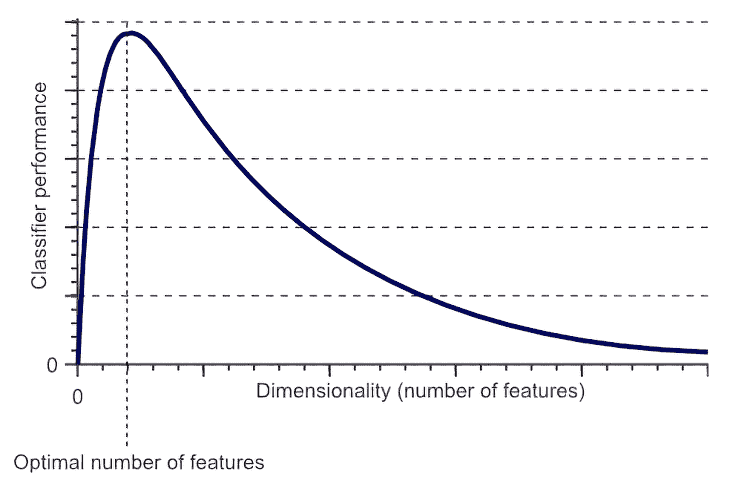

##### 图 3.2 哈格里斯现象表明，随着维度数量的增加，机器学习模型的性能最初会提高。但进一步的增加会导致模型性能下降。

维度数量的增加对机器学习模型有以下影响：

+   当模型处理越来越多的变量时，数学复杂性会增加。例如，在上一章中我们讨论的 k-means 聚类方法中，当我们有更多的变量时，各点之间的距离计算将变得复杂。因此，整体模型变得更加复杂。

+   在更大维度空间中生成的数据集可能比变量数量较少的数据集稀疏得多。数据集将更加稀疏，因为一些变量将具有缺失值、NULL 等。因此，空间更加空旷，数据集密度更低，与它们关联的变量数量更少。

+   随着模型复杂性的增加，所需的处理时间也会增加。系统感受到处理这么多维度的压力。

+   整体解决方案在理解和执行上变得更加复杂。回想一下第一章，我们讨论了监督学习算法。由于维度数量高，我们可能会在监督学习模型中遇到过拟合的问题。

定义：当监督学习模型在训练数据上具有良好的准确率但在未见数据上准确率较低时，这被称为**过拟合**。过拟合是一个麻烦，因为机器学习模型的根本目的是在未见数据集上表现良好，而过拟合则违背了这一目的。

让我们用一个现实世界的例子来关联这些内容。考虑一家提供不同类型保险政策的保险公司，如人寿保险、车辆保险、健康保险、房屋保险等。该公司希望使用数据科学和执行聚类用例来扩大客户群和销售的总政策数。他们有客户详细信息，如年龄、性别、职业、保额、历史交易、持有的政策数量、年收入、政策类型、历史违约次数等。同时，让我们假设客户是否为左撇子或右撇子、他们是否穿黑色或棕色鞋子、他们使用的洗发水品牌、头发的颜色以及他们最喜欢的餐厅等信息也被记录。如果我们把所有变量都包含在数据集中，最终数据集中的变量总数将会相当高。对于 k-means 聚类算法，距离计算将更加复杂，处理时间将增加，整体解决方案也将相当复杂。

还必须注意的是，**并非**所有维度或变量都是重要的。因此，从所有变量中筛选出重要的变量至关重要。记住，自然界总是偏好更简单的解决方案！在之前讨论的案例中，变量如发色和最喜欢的餐厅等，很可能不会影响输出。因此，减少维度以简化复杂性和减少计算时间是我们的最佳利益。同时，还必须注意的是，维度降低并不总是期望的。它取决于我们希望解决的类型数据集和业务问题。我们将在本章后续部分的案例研究中进一步探讨这一点。

##### 练习 3.1

回答以下问题以检查你的理解：

1.  维度诅咒指的是拥有大量数据。对还是错？

1.  变量数量高总是会增加解决方案的准确率。对还是错？

1.  数据集中大量变量是如何影响模型的？

我们已经确定拥有很多维度对我们来说是一个挑战。接下来，我们将探讨各种降低维度数量的方法。

## 3.3 维度降低方法

在上一节中，我们研究了具有高维数据的缺点。更少的维度可能会导致我们的数据结构更简单，这将具有计算效率。同时，我们在减少变量数量时应该小心。降维方法的输出应该足够完整，以表示原始数据，并且不应导致任何信息丢失。换句话说，如果我们最初有，例如，500 个变量，我们将它们减少到 120 个重要的变量，那么这 120 个变量*应该*足够稳健，以捕捉*几乎*所有的信息。让我们用一个简单的例子来理解。

考虑这种情况：我们希望预测一个城市下个月将接收到的降雨量。该城市的降雨预测可能依赖于一段时间内的温度、风速测量、气压、距离海洋的距离、海拔高度等因素。如果我们希望预测降雨量，这些变量是有意义的。同时，像城市中电影院的数量、该城市是否是国家的首都，或者城市中红色汽车的数量等因素不会影响降雨量的预测。在这种情况下，如果我们不使用城市中电影院的数量来预测降雨量，这不会降低系统的能力。很可能会，解决方案仍然能够表现得相当好。因此，在这种情况下，删除这样的变量不会丢失任何信息，我们当然可以从数据集中删除它。另一方面，删除诸如温度或距离海洋等因素可能会非常有可能地负面影响预测精度。这是一个简单的例子，强调了减少变量数量的必要性。

维度或变量的数量可以通过手动和基于算法的方法的组合来减少。但在详细研究它们之前，有一些数学术语和组成部分我们应该了解，我们将在下一节中讨论。

### 3.3.1 数学基础

要对降维方法有一个彻底的理解，必须知道很多数学术语。我们试图减少数据集的维度。数据集不过是一个值矩阵——因此，许多概念都与矩阵操作方法、它们的几何表示以及在这些矩阵上执行变换有关。数学概念在附录中讨论。您还需要了解特征值和特征向量。这些概念将在整本书中重复使用；它们被放在附录中以便快速参考。建议您在继续之前阅读它们。

## 3.4 手动降维方法

为了解决维度灾难，我们希望减少数据集中的变量数量。这种减少可以通过从数据集中移除变量来实现。或者，一个非常简单的降维解决方案是将可以逻辑分组或可以使用共同数学运算表示的变量组合起来。

例如，如图 3.3 所示，数据可以来自一家零售店，不同客户产生了不同的交易。我们将得到在一定时期内每个客户的销售额、发票数量和购买的项目数量。在表中，客户 1 产生了两个发票，总共购买了五个项目，并产生了 100 的总销售额。


##### 图 3.3 在第一张表中，我们有销售、发票和项目数量作为变量。在第二张表中，它们已经被组合成新的变量。

如果我们希望减少变量的数量，我们可能会将三个变量合并成两个变量。在这里，我们引入了平均交易价值（ATV）和平均购物篮大小（ABS）这两个变量，其中 ATV = 销售额/发票数，ABS = 项目数量/发票数。

因此，在客户 1 的第二张表中，我们有 ATV 为 50 和 ABS 为 2.5。因此，变量的数量已从三个减少到两个。这里的过程只是说明我们可以如何组合各种变量的一个例子。这并不意味着我们应该用 ATV 代替销售作为变量。

这个过程可以继续减少变量的数量。同样，对于一个电信用户，比如说我们有一个月内 30 天内手机通话的分钟数。我们可以将它们加起来创建一个单一变量——一个月内使用的分钟数。这些例子是非常基础的，作为开始。使用手动过程，我们可以采用两种其他常用的方法：手动选择和使用相关系数。

### 3.4.1 手动特征选择

继续讨论上一节中提到的降雨预测示例，数据科学家可能能够删除一些变量。这将是基于对当前业务问题的深入理解和所使用的相应数据集。然而，一个基本的假设是数据集对数据科学家来说是相当可理解的，并且他们很好地理解了业务领域。大多数时候，业务利益相关者将能够指导这些方法。变量也必须是唯一的，并且不应存在太多的依赖性。如图 3.4 所示，我们可以移除一些可能对预测降雨不有用的变量。


##### 图 3.4 在第一张表中，我们有数据集中所有的变量。使用业务逻辑，第二张表中已经丢弃了一些可能不太有用的变量。但这是需要谨慎进行的；最好的方式是获得业务利益相关者的指导。

有时，特征选择方法也被称为*包装方法*。在这里，机器学习模型被包裹或拟合到变量子集。在每次迭代中，我们将得到一组不同的结果。产生最佳结果的那组被选为最终模型。

### 3.4.2 相关系数

两个变量之间的相关性简单地说就是它们彼此之间有相互关系。一个变量的值的变化将影响另一个变量的值，这意味着在一个变量中具有相似值的点在另一个变量中也有相似的值。彼此高度相关的变量提供相似的信息，因此可以删除其中一个。

注意：相关性在附录中有详细描述。

例如，对于一家零售店，一天内生成的发票数量将与产生的销售额高度相关，因此可以删除其中一个。另一个例子是，学习时间更长的大学生将比学习时间较短的学生（大多数情况下）获得更好的成绩。

但我们在删除变量时应该小心，不要仅仅依赖相关性。在做出任何决定之前，应该彻底了解变量的业务背景。

注意：在删除任何变量之前与业务利益相关者讨论是个好主意。

基于相关性的方法有时被称为*过滤方法*。使用相关系数，我们可以过滤和选择最显著的变量。

##### 练习 3.2

回答以下问题以检查你的理解：

1.  如果我们认为某个变量不是必需的，我们可以简单地删除它。对还是错？

1.  如果两个变量相关，总是删除其中一个。对还是错？

手动方法是更简单的解决方案，可以相当高效地执行。数据集的大小减少了，我们可以继续分析。但是，手动方法有时是主观的，并且很大程度上取决于手头的业务问题。很多时候，也不可能使用手动方法进行降维。在这种情况下，我们有基于算法的方法，我们将在下一节中研究。

### 3.4.3 降低维度的基于算法的方法

在上一节中，我们探讨了手动方法。在此基础上，本节我们将探讨基于算法的方法。基于算法的技术建立在更数学的基础上，因此证明是更科学的方法。在现实世界的商业问题中，我们使用手动和基于算法技术的组合。与基于算法的技术相比，手动方法执行起来更为直接。此外，由于它们基于不同的基础，我们无法对这两种技术的比较做出评论。但是，同时，在实施基于算法的技术时，进行充分的尽职调查是至关重要的。

降维中使用的的主要技术如下。我们将在本书中探讨其中的一些：

+   PCA

+   SVD

+   LDA

+   广义判别分析

+   非负矩阵分解

+   多维尺度

+   局部线性嵌入

+   IsoMaps

+   自动编码器

+   t-SNE

这些技术被用于一个共同的目标：将数据从高维空间转换到低维空间。其中一些数据转换是线性的，而另一些是非线性的。

我们在本章中详细讨论 PCA 和 SVD。在本书的后续章节中，将探索其他主要技术。PCA 可能是被引用最多的降维方法，将在下一节中进行探讨。

## 3.5 主成分分析

考虑这种情况：你正在处理一个包含 250 个变量的数据集。几乎不可能可视化这样一个高维空间。其中一些变量可能相互关联，而另一些可能不相关，并且需要在不丢失太多信息的情况下减少变量的数量。PCA 使我们能够从数学上选择最重要的特征，并保留其余部分。PCA 确实减少了维度数量，但同时也保留了变量之间以及数据集中重要结构之间最重要的关系。因此，变量的数量减少了，但数据集中的重要信息得到了安全保留。

PCA 是将高维数据投影到低维空间的过程。用更简单的话说，我们正在将一个*n*-维空间减少到一个*m*-维空间，其中*n* > *m*，同时保持原始数据集的性质和本质。在这个过程中，旧变量被减少到新的变量，同时保持原始数据集的核心。因此创建的新变量被称为*主成分*。主成分是原始变量的线性组合。这种变换的结果是，第一个主成分捕捉到数据集中的最大随机性或最高方差。创建的第二个主成分与第一个成分正交。

注意：如果两条直线相互垂直，这意味着它们之间的角度是 90˚。

该过程继续到第三成分，依此类推。正交性使我们能够保持后续主成分之间没有相关性。

注意：PCA 利用数据集的线性变换，这类方法有时被称为特征投影。得到的或投影的数据集用于进一步分析。

让我们用一个例子更好地理解这一点。在图 3.5 中，我们使用一些变量表示了房屋的总感知价值。这些变量包括面积（平方米）、卧室数量、阳台数量、机场距离、火车站距离等；我们有 100 多个变量。


##### 图 3.5 估计房价的变量

我们可以在数学和逻辑上组合一些变量。主成分分析（PCA）将创建一个新变量，它是某些变量的线性组合，如下面的示例所示。它将得到原始变量的最佳*线性*组合，以便新变量能够捕捉到数据集的最大方差。方程式 3.1 仅是一个示例，用于说明目的，其中我们展示了由其他变量的组合创建的新变量。

##### (3.1)

new_variable = *a**面积 – *b**卧室数 + *c**距离 – *d**学校数

现在我们从视觉上理解这个概念。在向量空间图中，我们可以表示数据集，如图 3.6 所示。左图表示原始数据，其中我们可以在 x-y 图中可视化变量。如前所述，我们希望创建变量的线性组合。换句话说，我们希望创建一个数学方程，该方程能够解释 x 和 y 之间的关系。

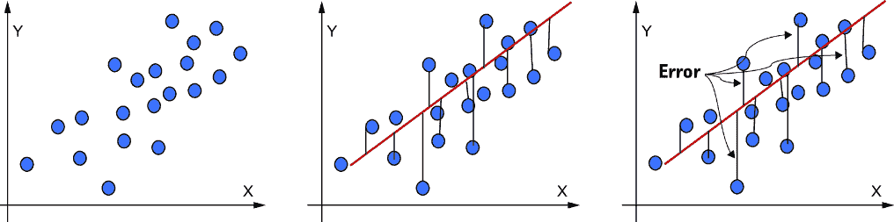

##### 图 3.6 数据集可以用向量空间图表示（左）。直线可以称为最佳拟合线，因为它包含了所有数据点的投影（中间）。实际值与投影之间的差异是误差项（右）。

此过程的结果将是一条直线，如图 3.6 中间图所示。这条直线有时被称为*最佳拟合线*。使用这条最佳拟合线，我们可以预测给定 x 值的 y 值。这些预测不过是数据点在直线上的投影。

实际值与投影之间的差异是误差，如图 3.6 右图所示。这些误差的总和称为总投影误差。

对于这条直线，可能有多种选择，如图 3.7 所示。这些不同的直线将具有不同的误差和不同的方差值。

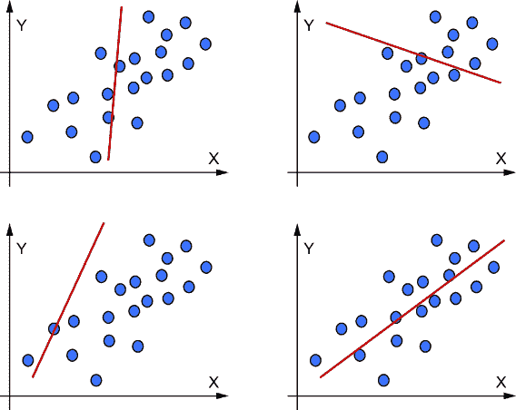

##### 图 3.7 数据集可以通过几条直线来捕捉，但并非所有直线都能捕捉到最大方差。给出最小误差的方程将被选中。

能够捕捉最大方差的直线将被选中。换句话说，它给出了最小的误差。它将是*第一个主成分*，最大扩散的方向将是*主轴*。

第二个主成分将以类似的方式推导出来。由于我们知道第一个主成分轴，我们可以从这个主成分轴的方差中减去总方差，以得到剩余方差。换句话说，使用第一个主成分，我们会捕捉到数据集中的一些方差。但数据集中的总方差中仍有一部分未被第一个主成分解释。未被解释的总方差部分是剩余方差。使用第二个主成分，我们希望尽可能多地捕捉到方差。

使用相同的过程来捕捉最大方差的方向，我们将得到第二个主成分。第二个主成分可以相对于第一个主成分以几个不同的角度存在，如图 3.8 所示。数学上已经证明，如果第二个主成分与第一个主成分正交（即 90˚），这将使我们能够通过两个主成分捕捉到最大方差。在图 3.8 中，我们可以观察到两个主成分之间的角度是 90˚。

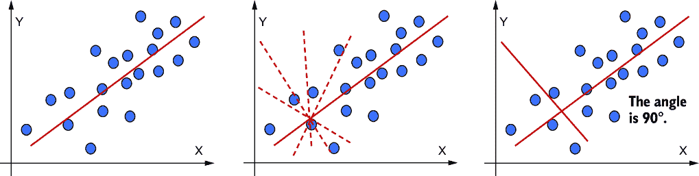

##### 图 3.8 左侧的第一个图是第一个主成分。第二个主成分可以相对于第一个主成分以不同的角度存在（中间）。我们应该找到第二个主成分，使我们能够捕捉到最大方差。为了捕捉最大方差，第二个主成分应该与第一个主成分正交，从而使得捕捉到的总方差最大化（右侧）。

该过程继续应用于第三和第四主成分，依此类推。随着主成分数量的增加，向量空间中的表示变得难以可视化。你可以想象一个具有三个以上轴的向量空间图。一旦所有主成分都被推导出来，数据集就被投影到这些轴上。这个转换后的数据集的列是*主成分*。创建的主成分数量将少于原始变量的数量，并将捕捉到数据集中存在的最大信息。

在我们深入探讨 PCA 的过程之前，让我们研究其重要特性：

+   PCA 旨在减少结果数据集的维度数。

+   PCA 产生主成分，旨在通过最大化特征方差来减少数据集中的噪声。

+   同时，主成分减少了数据集中的冗余。这是通过最小化特征对之间的协方差来实现的。

+   原始变量不再存在于新创建的数据集中。相反，使用这些变量创建了新变量。

+   主成分不一定与数据集中所有变量一一对应。它们是现有变量的新组合。因此，它们可以是一个主成分中几个不同变量的组合（如方程 3.1 所示）。

+   从数据集中创建的新特征不共享相同的列名。

+   原始变量可能彼此相关，但新创建的变量彼此无关。

+   新创建的变量数量少于原始变量的数量。选择主成分数量的过程已在 3.5.2 节中描述。毕竟，这就是降维的全部目的。

+   如果 PCA 已用于减少训练数据集中的变量数量，则应使用 PCA 减少测试/验证数据集。

+   主成分分析（PCA）不仅仅等同于降维。它还可以用于降维以外的多种用途，如特征提取、数据可视化、多重共线性检测、预处理等。仅将 PCA 用于降维肯定是一个误称。

现在我们将检查实现 PCA 时使用的方法，然后我们将开发一个使用 PCA 的 Python 解决方案。在我们编写代码时，不需要应用所有步骤，因为重头戏已经被包和库完成了。这里给出的步骤由包处理，但仍然，理解这些步骤对于正确欣赏 PCA 的工作原理至关重要：

1.  在 PCA 中，我们首先将数据集*标准化*作为第一步。这确保了所有变量都有共同的表现形式并变得可比较。Python 中有执行标准化的方法，我们将在编写代码时学习。要了解更多关于数据集标准化的信息，请参阅附录。

1.  在标准化后的数据集中获取协方差。这使我们能够研究变量之间的关系。我们通常创建一个协方差矩阵，如下一节中的 Python 示例所示。

1.  我们可以计算协方差矩阵的特征向量和特征值。特征向量的数学概念在附录中有介绍。

1.  我们然后按特征值降序排列特征值。我们选择与特征值最大值对应的特征向量。所选的成分将能够捕获数据集中的最大方差。还有其他方法来筛选主成分，我们将在开发 Python 代码时探讨。

##### 练习 3.3

回答这些问题以检查你的理解：

1.  PCA 将导致数据集中的变量数量相同。对或错？

1.  PCA 将能够捕获数据集中的 100%信息。对或错？

1.  PCA 中主成分选择的逻辑是什么？

因此，本质上，主成分是原始变量的线性组合。在这个线性组合中的权重是满足最小二乘法误差标准的特征向量。

### 3.5.1 特征值分解

在 PCA 的上下文中，特征向量将代表向量的方向，特征值将是沿着该特征向量捕获的方差。参见图 3.9，其中我们将原始 *n* x *n* 矩阵分解成组件。

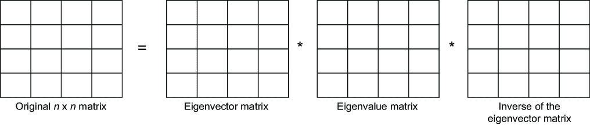

##### 图 3.9 使用特征值分解，原始矩阵可以被分解为一个特征向量矩阵、一个特征值矩阵和一个特征向量的逆矩阵。我们使用这种方法实现 PCA。

从数学上，我们可以用方程 3.2 展示其关系

##### （3.2）

*A***v* = *λ***v*

其中 *A* 是一个方阵，*v* 是特征向量，*λ* 是特征值。在这里，重要的是要注意特征向量矩阵是正交矩阵，其列是特征向量。特征值矩阵是对角矩阵，其对角元素是特征值。最后一个组件是特征向量矩阵的逆。一旦我们有了特征值和特征向量，我们可以选择重要的特征向量来获取主成分。

在本书中，我们将 PCA 和 SVD 作为两种独立的方法进行介绍。这两种方法都用于将高维数据降低到低维数据，并在过程中保留数据集中的最大信息。两者的区别在于 SVD 适用于任何类型的矩阵（矩形或方形），而特征值分解仅适用于方形矩阵。在我们后面章节中介绍了 SVD 之后，你会更好地理解这一点。

### 3.5.2 使用 PCA 的 Python 解决方案

我们已经研究了 PCA 的概念和特征值分解的过程。现在是时候深入 Python，在数据集上开发 PCA 解决方案了。我将向你展示如何在数据集上创建特征向量和特征值。为了实现 PCA 算法，我们将使用`sklearn`库。库和包提供了实现算法的更快解决方案。

我们使用 Iris 数据集来解决这个问题。这是机器学习问题中最常用的数据集之一。该数据集包含三种鸢尾花物种的数据，每种物种有 50 个样本，并具有每个花朵的属性，如花瓣长度、萼片长度等。问题的目标是使用花朵的属性来预测物种。因此，独立变量是花朵属性，而“物种”变量是目标变量。数据集和代码已存入 GitHub 仓库。在这里，我们使用内置的 PCA 函数，这减少了实现 PCA 所需的工作量。步骤如下：

1.  加载所有必要的库。我们将使用`numpy`、`pandas`、`seaborn`、`matplotlib`和`sklearn`。请注意，我们已经从`sklearn`中导入了 PCA。

备注：以下是一些标准库。你会发现几乎所有的机器学习解决方案都会在解决方案笔记本中导入这些库：

```py
import numpy as np
import pandas as pd
import seaborn as sns
import matplotlib.pyplot as plt
from sklearn.decomposition import PCA
from sklearn.preprocessing import StandardScaler
```

1.  2. 现在加载数据集。它是一个.csv 文件：

```py
iris_df = pd.read_csv('IRIS.csv')
```

1.  3. 我们现在将对数据集进行基本检查，查看前五行，数据的形状，变量的分布等。我们在这里不进行广泛的数据探索分析，因为这些步骤已在第二章中介绍。该数据集有 150 行和 6 列（见图 3.10）。

```py
iris_df.head()
```


```py
iris_df.describe()
iris_df.shape
```

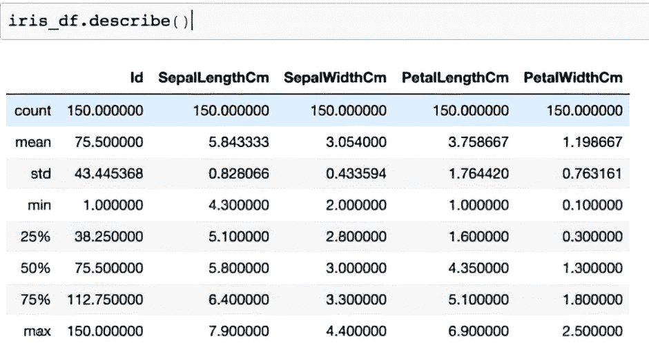

##### 图 3.10 代码输出

1.  4. 在这里，我们应该将数据集分为独立变量和目标变量。`X_variables`在这里代表独立变量，它们位于数据集的 2-5 列，而`y_variable`是目标变量，在这种情况下是“物种”，它是数据集的最后一列。回想一下，我们希望使用其他属性来预测花的物种。因此，我们已经将目标变量“物种”和其他独立变量分开：

```py
X_variables = iris_df.iloc[:,1:5]
X_variables
y_variable = iris_df.iloc[:,5]
```

1.  5. 规范化数据集。`StandardScalar()`的内置方法非常容易地完成了这项工作。

备注：`StandardScalar()`方法为我们规范化了数据集。它从变量中减去平均值，然后除以标准差。有关规范化的更多详细信息，请参阅附录。

我们调用该方法，然后将其应用于我们的数据集以获取转换后的数据集。由于我们正在处理独立变量，所以我们在这里使用`X_variables`。首先，我们调用`StandardScalar()`方法。然后我们使用`fit_transform`方法。`fit_transform`方法首先将转换器拟合到*X*和*Y*，然后返回*X*的转换版本：

```py
sc = StandardScaler()
transformed_df = sc.fit_transform(X_variables)
```

1.  6. 计算协方差矩阵并打印出来。输出显示在图 3.11 中。使用`numpy`获取协方差矩阵非常直接：

```py
covariance_matrix = np.cov(transformed_df.T)
covariance_matrix
```


##### 图 3.11 协方差矩阵

1.  7. 计算特征值。在`numpy`库中，我们有内置的功能来计算特征值。然后我们将特征值按降序排序。为了筛选主成分，我们可以选择大于 1 的特征值。这个标准被称为*凯撒标准*。我们也在探索其他方法。

备注：特征值表示一个成分作为数据摘要的好坏。如果特征值为 1，这意味着该成分包含与单个变量相同数量的信息；因此，我们选择大于 1 的特征值。

在此代码中，首先我们获取`eigen_values`和`eigen_vectors`，然后按降序排列（见图 3.12）：

```py
eigen_values, eigen_vectors = np.linalg.eig(covariance_matrix)
eigen_pairs = [(np.abs(eigen_values[i]), eigen_vectors[:,i]) for i in range(len(eigen_values))]
print('Eigenvalues arranged in descending order:')
for i in eigen_pairs:
    print(i[0])
```


##### 图 3.12 按降序排列的特征值

1.  8. 从`sklearn`库中调用 PCA 方法。该方法用于此处拟合数据。注意，我们尚未确定在这个问题中希望使用的主成分数量：

```py
pca = PCA()
pca = pca.fit(transformed_df)
```

1.  9. 现在主成分已经设置好了。让我们看看它们所解释的方差。我们可以观察到第一个成分捕捉到了 72.77%的变异，第二个成分捕捉到了 23.03%的变异，等等（见图 3.13）：

```py
explained_variance = pca.explained_variance_ratio_
explained_variance
```


##### 图 3.13 主成分的方差程度

1.  10. 我们现在将分量绘制成条形图以获得更好的可视化（见图 3.14）：

```py
dataframe = pd.DataFrame({'var':pca.explained_variance_ratio_,
             'PC':['PC1','PC2','PC3','PC4']})
sns.barplot(x='PC',y="var", 
           data=dataframe, color="b");
```

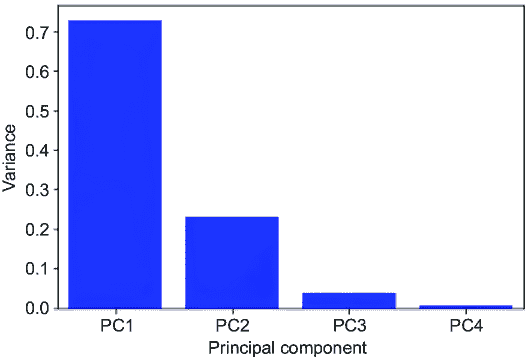

##### 图 3.14 主成分条形图

1.  11. 在这里，我们绘制一个斯克里普图来可视化主成分所解释的累积方差（见图 3.15）：

```py
plt.plot(np.cumsum(pca.explained_variance_ratio_))
plt.xlabel('number of components')
plt.ylabel('cumulative explained variance')
plt.show()
```

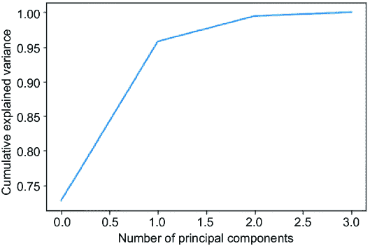

##### 图 3.15 累积方差斯克里普图

1.  12. 在这个案例研究中，我们选择前两个主成分作为最终解决方案，因为这两个成分捕捉到了数据集中 95.08%的总方差：

```py
pca_2 = PCA(n_components =2 )
pca_2 = pca_2.fit(transformed_df)
pca_2d = pca_2.transform(X_variables)
```

1.  13. 我们现在将数据集绘制在两个主成分上。为此，物种必须回溯到物种变量的实际值，即`Iris-setosa`、`Iris-versicolor`和`Iris-virginica`。在这里，`0`映射到`Iris-setosa`，`1`是`Iris-versicolor`，`2`是`Iris-virginica`。在下面的代码中，首先使用前面讨论的映射替换物种变量的值：

```py
iris_df['Species'] = iris_df['Species'].replace({'Iris-setosa':0, 'Iris-
versicolor':1, 'Iris-virginica':2})
```

1.  14. 我们现在将结果绘制在两个主成分上。该图显示了将数据集减少到我们刚刚创建的两个主成分。这些主成分可以捕捉到数据集 95.08%的方差。第一个主成分代表图中的 x 轴，而第二个主成分代表图中的 y 轴（见图 3.16）。颜色代表物种的不同类别。书籍的印刷版不会显示不同的颜色，但 Python 代码的输出会显示。相同的输出也可以在 GitHub 仓库中找到：

```py
plt.figure(figsize=(8,6))
plt.scatter(pca_2d[:,0], pca_2d[:,1],c=iris_df['Species'])
plt.show()
```

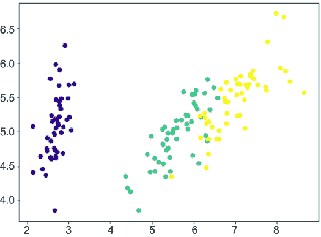

##### 图 3.16 两个主成分的结果

此解决方案已将成分数量从四个减少到两个，同时仍能保留大部分信息。在这里，我们检查了基于凯撒标准、捕获的方差和斯克里普图的三种选择主成分的方法。

让我们快速分析一下我们使用 PCA 所取得的成果。图 3.17 显示了同一数据集的两个表示。左边是 X_variables 的原始数据集。它有四个变量和 150 行。右边是 PCA 的输出。它有 150 行，但只有两个变量。回想一下，我们已经将维度数量从四个减少到两个。因此，观测数保持 150 个，而变量数量从四个减少到两个。

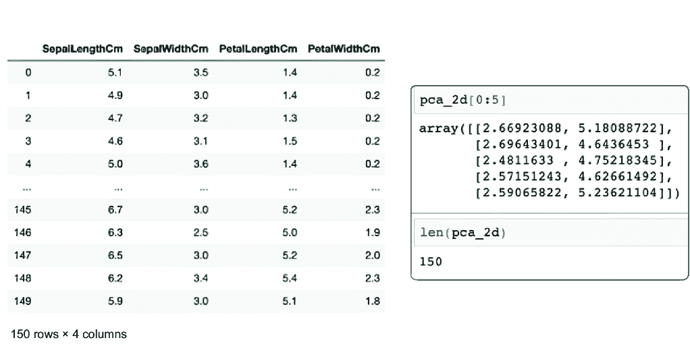

##### 图 3.17 左侧的图显示了原始数据集，它有 150 行和四个变量。在右侧实施 PCA 之后，变量的数量已减少到两个。行数保持不变，为 150，这由 pca_2d 的长度表示。

一旦我们减少了成分的数量，我们就可以继续实施监督学习或无监督学习解决方案。我们可以为任何其他旨在减少维度数的目标现实世界问题实施前面的解决方案。我们将在第 3.8 节中进一步探讨这一点。

通过这种方式，我们已经涵盖了主成分分析（PCA）。GitHub 仓库包含一个非常有意思的带有变量和相应图表的 PCA 分解。

## 3.6 奇异值分解

主成分分析（PCA）线性变换数据并生成彼此不相关的主成分。但特征值分解过程中遵循的步骤只能应用于 *方阵*，而奇异值分解（SVD）可以应用于任何 *m* × *n* 矩阵。

假设我们有一个矩阵 *A*。*A* 的形状是 *m* × *n*，或者它包含 *m* 行和 *n* 列。*A* 的转置可以表示为 *A*^(*T*)。

我们可以使用 *A* 和 *A*^(*T*) 创建另外两个矩阵，即 *A A*^(*T*) 和 *A*^(*T*)*A*。这些结果矩阵 *A A*^(*T*) 和 *A*^(*T*)*A* 具有一些特殊性质，如下（这些性质的数学证明超出了本书的范围）：

+   它们是对称的方阵。

+   它们的特征值要么是正的，要么是零。

+   *A A*^(*T*) 和 *A*^(*T*)*A* 与原始矩阵 A 有相同的特征值。

+   *A A*^(*T*) 和 *A*^(*T*)*A* 与原始矩阵 A 有相同的秩。

矩阵 *A A*^(*T*) 和 *A*^(*T*)*A* 的特征向量被称为 A 的奇异向量。它们的特征值的平方根被称为奇异值。

由于这两个矩阵（*A A*^(*T*) 和 *A*^(*T*)*A*）都是对称的，它们的特征向量彼此正交。换句话说，因为它们是对称的，所以特征向量相互垂直，并且可以是单位长度。

现在，有了这种数学理解，我们可以定义奇异值分解（SVD）。根据奇异值分解方法，可以分解任何矩阵 A，如方程 3.3 所示：

##### （3.3）

*A* = *U* * *S* * *V*^(*T*)

这里，*A* 是原始矩阵，*U* 和 *V* 分别是从 *A A*^(*T*) 和 *A*^(*T*)*A* 中取出的正交矩阵，具有正交特征向量，*S* 是具有 *r* 个等于奇异值的对角矩阵。简单来说，奇异值分解可以看作是使用特征值分解增强的 PCA 方法。

注意：奇异值比特征值分解更好，并且在数值上更稳健。

PCA 被定义为使用主成分对输入变量进行线性变换。所有这些线性变换的概念，如选择最佳组件等，都保持不变。主要过程步骤也保持相似，只是在 SVD 中，我们使用了一种稍微不同的方法，其中特征值分解被奇异向量和奇异值所取代。在稀疏数据集的情况下，通常建议使用 SVD；在密集数据集的情况下，可以使用 PCA。

##### 练习 3.4

回答这些问题以检查你的理解：

1.  SVD 基于特征值分解技术。对或错？

1.  PCA 比 SVD 是一个更稳健的方法。对或错？

1.  SVD 中的奇异值和奇异向量是什么？

### 3.6.1 使用 SVD 的 Python 解决方案

在本案例研究中，我们使用的是*mushrooms*数据集。这个数据集包含了 23 种烤蘑菇的描述。有两种类别：要么蘑菇是*e*，这意味着它是可食用的，要么蘑菇是*p*，这意味着它是有毒的。步骤如下：

1.  导入库：

```py
import numpy as np
import pandas as pd
import seaborn as sns
import matplotlib.pyplot as plt
from sklearn.preprocessing import LabelEncoder, StandardScaler
```

1.  2. 导入数据集并检查形状、头部等（见图 3.18）：

```py
mushrooms_df = pd.read_csv('mushrooms.csv')
mushrooms_df.shape
mushrooms_df.head()
```


##### 图 3.18 代码输出

1.  3. 如我们所观察到的，数据集中的值在本质上属于分类类型。它们首先应该被编码成数值。这不是处理分类变量的唯一方法。还有其他技术，我们将在整本书中探讨。

首先，调用`LabelEncoder`并将其应用于数据集中的所有列。`LabelEncoder`使用独热编码方法将分类变量转换为数值：

```py
encoder = LabelEncoder()
for col in mushrooms_df.columns:
           mushrooms_df[col] = encoder.fit_transform(mushrooms_df[col])
```

1.  4. 再次查看数据集。所有的分类值都已转换为数值（见图 3.19）：

```py
mushrooms_df.head()
```

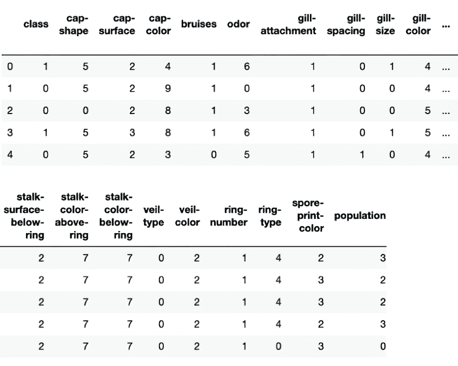

##### 图 3.19 代码输出

1.  5. 下两个步骤与上一个案例研究相同，其中我们将数据集分为`X_variables`和`y_label`。然后对数据集进行归一化：

```py
X_variables = mushrooms_df.iloc[:,1:23]
y_label = mushrooms_df.iloc[:, 0]
scaler = StandardScaler()
X_features = scaler.fit_transform(X_variables)
```

1.  6. 实现 SVD。`numpy`中有一个实现 SVD 的方法。输出是`u`、`s`和`v`，其中`u`和`v`是奇异向量，`s`是奇异值。如果您愿意，可以分析它们的形状和维度：

```py
u, s, v = np.linalg.svd(X_features, full_matrices=True)
```

1.  7. 我们知道奇异值使我们能够计算每个奇异向量解释的方差。现在我们将分析每个奇异向量解释的百分比方差，并将其绘制出来（见图 3.20）。结果保留到小数点后三位。然后我们将结果绘制成直方图。在 x 轴上，我们有奇异向量，而在 y 轴上，我们有解释的百分比方差：

```py
variance_explained = np.round(s**2/np.sum(s**2), decimals=3)
variance_explained
sns.barplot(x=list(range(1,len(variance_explained)+1)),
            y=variance_explained, color="blue")
plt.xlabel('SVs', fontsize=16)
plt.ylabel('Percent of the variance explained', fontsize=15)
```

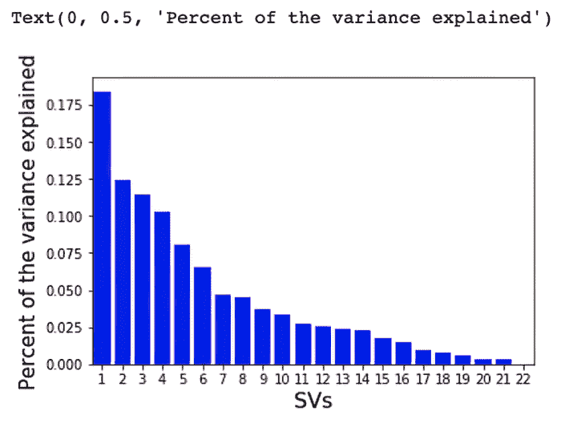

##### 图 3.20 代码输出

1.  8. 创建一个数据框（见图 3.21）。这个新的数据框 svd_df 包含前两个奇异向量和元数据。然后我们使用 head 命令打印前五行：

```py
col_labels= ['SV'+str(i) for i in range(1,3)]
svd_df = pd.DataFrame(u[:,0:2], index=mushrooms_df["class"].tolist(), 
columns=col_labels)
svd_df=svd_df.reset_index()
svd_df.rename(columns={'index':'Class'}, inplace=True)
svd_df.head()
```

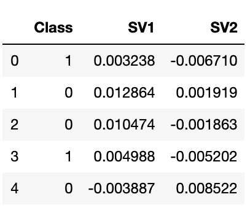

##### 图 3.21 包含前两个奇异向量和元数据的 DataFrame

1.  9. 与上一个案例研究类似，我们将数值替换为实际的类别标签；`1` 表示可食用，而 `0` 表示有毒：

```py
svd_df['Class'] = svd_df['Class'].replace({1:'Edible', 0:'Poison'})
```

1.  10. 我们现在绘制了两个成分解释的方差（见图 3.22）。在这里，我们只选择了前两个成分。建议您使用上一节中描述的方法选择最佳成分数量，并绘制相应的散点图。在这里，x 轴上显示了第一个奇异向量 SV1，y 轴上显示了第二个奇异向量 SV2。印刷版的书没有显示不同的颜色，但 Python 代码的输出显示了。相同的输出也可以在 GitHub 仓库中找到：

```py
color_dict = dict({'Edible':'Black',
                   'Poison': 'Red'})
sns.scatterplot(x="SV1", y="SV2", hue="Class", 
                palette=color_dict, 
                data=svd_df, s=105,
                alpha=0.5)
plt.xlabel('SV 1: {0}%'.format(variance_explained[0]*100), fontsize=15)
plt.ylabel('SV 2: {0}%'.format(variance_explained[1]*100), fontsize=15)
```

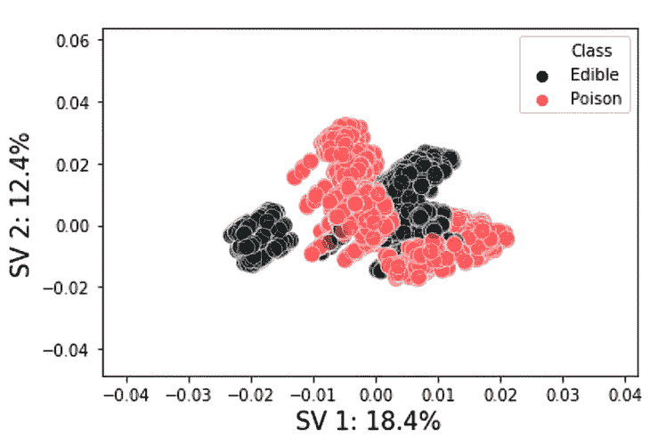

##### 图 3.22 两个成分解释的方差图

我们可以观察到两个类别相对于两个成分的分布。这两个类别——`可食用`和`有毒`——分别用黑色和红色编码。正如我们之前所提到的，我们只选择了两个成分来使用可视化图来展示效果。您应该使用上一案例研究中描述的方法选择最佳成分数量，然后使用不同的奇异向量可视化结果。这种解决方案可以用于在现实世界数据集中降低维度。

## 3.7 维度降低的优缺点

在本章的初始部分，我们讨论了维度灾难的缺点。在最后几节中，我们发现了 PCA 和 SVD，并使用 Python 实现了它们。现在我们将检查这些技术的优点和挑战。实现 PCA 或 SVD 的主要优点是

+   减少的维度数量导致数据集的复杂性降低。相关的特征被移除并转换。手动处理相关变量是一项艰巨的任务，相当繁琐且令人沮丧。PCA 和 SVD 等技术为我们轻松完成这项工作。相关特征的数量最小化，总体维度减少。

+   如果维度较少，数据集的可视化更好。非常难以可视化和描述一个高维数据集。

+   如果移除了相关变量，机器学习模型的准确性会提高。这些变量不会对模型的性能增加任何东西。

+   由于数据集较为简单，训练时间减少。因此，所需的计算能力和时间也较少。

+   过度拟合是监督机器学习模型中的一个麻烦。这是一种条件，即模型在训练数据集上表现良好，但在测试/验证数据集上表现不佳。这意味着模型可能无法在现实世界中的未见数据集上表现良好。这违背了构建机器学习模型的整个目的。PCA/SVD 通过减少变量的数量来帮助解决过度拟合问题。

同时，我们在降维技术中面临一些挑战，如下所述：

+   PCA/SVD 创建的新成分通常难以解释。它们是数据集中独立变量的组合，并不真正与现实世界相关；因此，将它们与现实世界场景联系起来可能很困难。

+   PCA/SVD 需要数值变量。因此，所有分类变量都应该以数值形式表示。

+   在实施解决方案之前，需要对数据集进行归一化/标准化。

+   当我们使用 PCA 或 SVD 时，可能会出现信息丢失。主成分**不能**替代原始数据集，因此在我们实施这些方法时可能会丢失一些信息。

然而，尽管有一些挑战，PCA 和 SVD 仍然被用于数据集的降维。它们是最受欢迎的方法之一，并且被广泛使用。请注意，这些是线性方法；我们在本书的后面部分介绍了降维的非线性方法。

我们现在已经介绍了在降维中使用的两种最重要的技术。在后面的章节中，我们将探讨更高级的技术。现在是时候转向案例研究了。

## 3.8 降维案例研究

让我们探索一个现实世界的案例，以了解 PCA 和 SVD 在现实商业场景中的应用。考虑以下情况：你为一家电信服务提供商工作。你有一个订阅者基础，你希望根据多个参数对消费者进行聚类。挑战在于可供分析的大量维度。

目标将是使用降维算法减少属性数量。消费者数据集可能包括以下内容：

+   订阅者的人口统计详情，包括年龄、性别、职业、家庭规模、婚姻状况等（见图 3.23）。


##### 图 3.23 订阅者的人口统计详情，如年龄、性别、婚姻状况、家庭规模、城市等。

+   消费者的订阅详情，可能看起来像图 3.24。


##### 图 3.24 订阅详情，如服务期限、后付费/预付费连接等。

+   消费者使用情况，如通话分钟数、通话费率、数据使用、服务等（见图 3.25）。

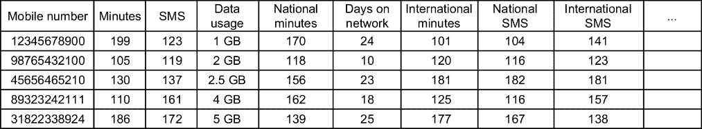

##### 图 3.25 订阅者使用情况指定了使用的分钟数、发送的短信、使用的数据、在网络中花费的天数、国内或国际使用等。

+   订阅者的支付和交易详情，可能包括各种交易、支付方式、支付频率、上次支付以来的天数等（见图 3.26）。


##### 图 3.26 展示了订阅者交易详情，包括金额、方式等所有详细信息。

+   许多更多的属性。到目前为止，我们已经确定涉及的变量数量确实很高。一旦我们将所有这些数据点合并，最终数据中的维度数量可以非常大（见图 3.27）。


##### 图 3.27 最终数据集是上述所有数据集的组合。它将是一个大型的、真正高维的数据集，需要进行分析。

在我们进行任何监督或无监督解决方案之前，我们应该减少属性的数量。在本章中，我们专注于降维技术，因此步骤涵盖了该过程的这一方面。在后面的章节中，我们将更详细地检查探索性分析。

作为第一步，我们将对数据集进行合理性检查并进行数据清洗。我们将检查数据点的数量、缺失值的数量、重复项、垃圾值等。这将使我们能够删除任何可能非常稀疏或包含信息不多的变量。例如，如果性别只对客户基础的 0.01%可用，那么删除该变量可能是个好主意。或者如果所有客户都声称他们的性别是男性，该变量没有为我们提供任何新信息，因此可以被丢弃。有时，使用业务逻辑，可能会从数据集中删除变量。一个例子在第 3.4 节中已讨论。在这一步中，我们可能会合并几个变量。例如，我们可能会创建一个新的变量，作为平均交易价值，通过将总支出除以总交易次数来计算。这样，我们将能够减少一些维度。

注意：GitHub 仓库中有一个 Python Jupyter 笔记本，其中我们提供了数据清洗步骤的非常详细的解决方案。

一旦完成数据的基本清洗，我们就开始进行探索性数据分析。作为探索性分析的一部分，我们检查变量的分布、其分布情况、数值变量的均值/中位数/众数等。这有时被称为*单变量分析*。这一步骤使我们能够测量变量的分布范围，了解中心趋势，检查分类变量的不同类别的分布，并寻找任何值中的异常。例如，使用前面提到的数据集，我们将对分析最大/最小/平均数据使用量或性别或年龄的百分比分布感兴趣。我们想知道进行交易的最受欢迎的方法，我们也想了解交易的最大/最小/平均金额。列表还在继续。

然后，我们探索变量之间的关系，这被称为*双变量分析*。交叉表，或数据的分布，是双变量分析的一部分。在这一步中会创建一个相关矩阵。高度相关的变量将被彻底检查。根据业务逻辑，其中一个变量可能会被删除。这一步有助于可视化并理解一个变量在存在其他变量时的行为。我们可以检查它们之间的相互关系以及关系的强度。在本案例研究中，我们将回答诸如，“与发送更多短信的用户相比，使用更多数据的用户在网络上花费的时间更多吗？”，“使用在线模式进行交易的用户比使用现金的用户产生更多的收入吗？”，或者“性别/年龄与数据使用之间是否存在关系？”等问题。在项目这一阶段，我们将回答许多此类问题。

注意：GitHub 仓库中有一个 Python Jupyter 笔记本，其中提供了单变量和双变量阶段的详细步骤和代码。查看它！

在这个阶段，我们有一个具有大量维度的数据集，我们希望减少维度的数量。现在是实施 PCA 或 SVD 的好时机。这些技术将减少维度的数量，并将数据集准备好用于流程的下一步，如图 3.28 所示。该图仅具有代表性，以描述降维方法的效果。注意，左图中的大量黑色线条在右图中减少到了更少的红色线条。

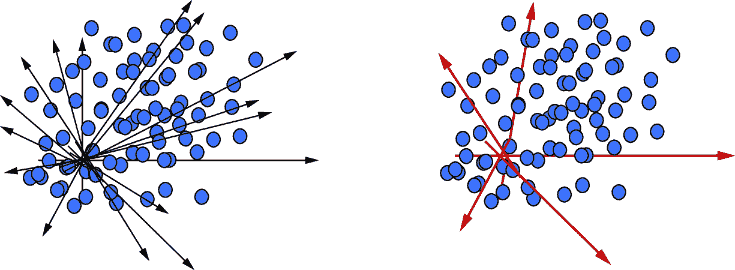

##### 图 3.28 通过使用捕捉数据集中最大方差的主成分，一个非常高维的数据集将被降低到低维。

维度降低方法的结果将是一个变量数量较少的数据集。该数据集可以用于监督学习或无监督学习。我们已经在章节的前几节中查看了一些使用 Python 的示例。

这标志着我们对电信用户的案例研究的结束。该案例可以扩展到任何其他领域，如零售；银行、金融服务和保险；航空；医疗保健；制造业；以及其他领域。

## 3.9 结论性思考

数据无处不在，以各种形式、水平和维度存在，并且具有不同的复杂程度。经常提到“数据越多，越好。”这在一定程度上确实是正确的。但是，当维度数量非常高时，理解它就变得非常困难。分析可能会变得有偏见，并且处理起来非常复杂。我们在本章中探讨了维度的诅咒。我们发现主成分分析（PCA）和奇异值分解（SVD）可以帮助减少这种复杂性。它们使数据集为下一步做好准备。

降维并不像看起来那么简单。这不是一项容易的任务，但绝对是一项非常有价值的任务。它需要商业洞察力、逻辑和常识的结合。结果数据集可能还需要一些额外的工作。但它是构建机器学习模型的一个非常好的起点。

这标志着第三章节的结束，也标志着本书第一部分的结束。在本部分，我们介绍了一些核心算法。我们从本书的第一章开始，探讨了机器学习的根本和基础。在第二章中，我们检查了三种聚类算法。在这一章中，我们探讨了 PCA 和 SVD。

在本书的第二部分，我们转换方向，研究更高级的主题。下一章我们将从关联规则开始。然后我们将探讨时间序列聚类、模糊聚类、高斯混合模型聚类等高级聚类方法。接下来是关于 t-SNE 和 LDA 等高级降维算法的章节。为了结束第二部分，我们检查文本数据集上的无监督学习。本书的第三部分更加高级，所以还有很长的路要走。请保持关注！

## 3.10 实际下一步行动和建议阅读材料

以下提供下一步行动的建议，并提供一些有用的阅读材料：

+   使用上一章中使用的车辆数据集进行聚类，并在其上实现 PCA 和 SVD。比较实现 PCA 和 SVD 前后聚类的性能。

+   从[`mng.bz/2y9g`](https://mng.bz/2y9g)获取数据集。你可以找到许多数据集。比较这些数据集上 PCA 和 SVD 的性能。

+   阅读以下关于 PCA 的论文：

    +   [`mng.bz/1XKX`](https://mng.bz/1XKX)

    +   [`mng.bz/Pd0w`](https://mng.bz/Pd0w)

    +   [`mng.bz/JYeo`](https://mng.bz/JYeo)

    +   [`mng.bz/wJqO`](https://mng.bz/wJqO)

+   阅读以下关于 SVD 的研究论文：

    +   [`mng.bz/qxqA`](https://mng.bz/qxqA)

    +   [`mng.bz/7pNm`](https://mng.bz/7pNm)

    +   [`arxiv.org/pdf/1211.7102.pdf`](https://arxiv.org/pdf/1211.7102.pdf)

## 摘要

+   “维度诅咒”指的是由具有太多变量的高维数据集引起的问题，这些问题使分析和模型性能复杂化。

+   高维可能导致稀疏数据集、增加数学复杂性、更长的处理时间，以及机器学习模型中潜在的过拟合。

+   霍奇斯现象表明，增加变量只能提高模型性能到一定程度，之后性能会下降。

+   并非所有维度都是重要的；一些可能不会对模型精度做出有意义的贡献，应该被删除以减少复杂性。

+   数据可视化可以通过将数据集减少到仍能捕捉到重要信息的较少维度来帮助解释数据集。

+   手动降维包括删除不显著的变量或将它们逻辑组合以减少数据集维度。

+   基于算法的降维方法包括 PCA、SVD、LDA 和 t-SNE 等，它们将高维数据转换到低维空间。

+   PCA 通过创建能够捕捉最大方差的同时最小化冗余和噪声的主成分来降低维度。

+   SVD 增强了 PCA，可以处理任何矩阵形状，并将它们分解为奇异值和向量，以保持数据集信息。

+   每种降维技术都需要对数据进行归一化处理，并将分类变量转换为数值形式。

+   降维简化了数据集，提高了可视化效果和模型精度，减少了计算时间，并减轻了过拟合风险。

+   降维的挑战包括可解释性的丧失、信息损失以及对数值数据的要求。

+   主成分分析（PCA）和奇异值分解（SVD）被广泛用于有效地降低维度，并且每种方法都适用于不同数据集的密度。

+   这些技术可以应用于各种行业，如零售业；银行业、金融服务和保险业；以及医疗保健业，以简化用于分析的高维数据集。

+   降维过程包括初步数据清洗和探索性数据分析，然后应用降维技术。
