# 第四章：关联规则

### 本章涵盖

+   关联规则

+   关联规则的多种算法类型

+   关联规则不同算法的实现

+   使用 SPADE 进行序列学习

> 关联的力量比美的力量更强；因此，关联的力量是美的力量。——约翰·拉斯金

恭喜你完成了本书的第一部分！你探索了无监督学习的基础以及 k-means 聚类、层次聚类、DBSCAN、主成分分析等算法。预期你已经掌握了第一部分中的数学概念，并创建了 Python 代码来解决每章末尾给出的练习题。

欢迎来到本书的第二部分，我们将在这里应用第一部分学到的概念，并探索一些稍微复杂的话题。本章我们将从关联规则开始。

下次当你访问附近的杂货店时，环顾店内，注意各种商品的摆放。你会发现牛奶、鸡蛋、面包、糖、洗衣粉、肥皂、水果、蔬菜、饼干以及各种其他商品整齐地堆叠。你是否曾想过这些摆放的逻辑以及这些商品是如何布局的？为什么某些产品被放在彼此附近，而其他产品则相隔甚远？显然，这种摆放不能是随机的，背后必须有科学的推理。或者你可能会想：Netflix 是如何根据你的观影历史像序列一样向你推荐电影的？我们将在本章中找到这些问题的答案。像往常一样，我们首先研究概念。我们通过不同算法的数学逻辑、每个算法的优缺点以及使用 Python 的实际应用来学习。本章末尾提供了一个商业案例研究来补充知识。欢迎来到第四章，祝大家一切顺利！

## 4.1 技术工具包

我们将继续使用迄今为止所使用的相同版本的 Python 和 Jupyter Notebook。本章中使用的代码和数据集已在相同的 GitHub 位置进行检查。

为了本章的学习，你需要安装几个 Python 库，包括`apyori`、`pyECLAT`、`fpgrowth_py`和`pyspade`。除此之外，你还需要`numpy`和`pandas`。使用这些库，我们可以非常快速地实现算法。否则，从头开始编写这些算法将是一项耗时且费力的任务。

让我们从关联规则开始吧。

## 4.2 关联规则概述

你可能听说过著名的“啤酒和尿布故事”。根据这个轶事，在超市购买尿布的顾客（大多是年轻人）也会在同一张发票上购买啤酒。换句话说，为婴儿购买尿布的年轻人有相当高的概率在同一笔交易中购买啤酒。我们不会对故事的真实性发表评论，但*关联规则学习*可以归因于从这个故事中得出的逻辑。

正式来说，关联规则可以用来发现数据集中存在的变量之间的有力关系。我们可以使用关联规则来衡量数据集中变量之间的相关性和共现性。在给出的例子中（假设故事是真实的），可以分析每日顾客交易。如果啤酒和尿布之间出现关系，这对超市来说是一个非常强烈的洞察，它可以使超市定制啤酒和尿布的摆放，调整营销策略，甚至改变价格。

我们可以通过超市中的另一个例子来理解。假设通过分析超市生成的五张发票，我们得到如表 4.1 所示的数据。在这个例子中，发票编号 1001 中购买了牛奶，因此其值为 1，而奶酪没有购买，因此为 0。

##### 表 4.1 超市生成的发票示例

| 发票编号 | 牛奶 | 鸡蛋 | 面包 | 奶酪 |
| --- | --- | --- | --- | --- |
| 1001  | 1  | 1  | 1  | 0  |
| 1002  | 0  | 0  | 0  | 1  |
| 1003  | 1  | 1  | 1  | 0  |
| 1004  | 0  | 1  | 0  | 1  |
| 1005  | 1  | 1  | 0  | 1  |

因此，在发票编号 1001 中购买了牛奶、鸡蛋和面包，而在发票编号 1002 中只购买了奶酪。从这里我们可以看到，每当牛奶和鸡蛋一起购买时，面包总是在同一张发票中购买。这确实是一个重要的发现。

现在将这种理解扩展到一天内进行的数千笔交易。这将导致人类眼睛通常无法察觉的非常强烈的关系，但关联规则算法可以为我们揭示它们。这可以导致更好的产品摆放，更好的产品价格，以及更多优化的营销支出。这样的模式将增强客户体验，并证明对提高整体客户满意度非常有帮助。

我们可以将关联规则可视化，如图 4.1 所示。这里有一些表示为节点 1、2、3、4 等的输入变量。这些节点通过箭头相互关联。它们之间的关系产生了规则 A 和规则 B。如果我们回顾本节开头提到的啤酒/尿布故事，规则 A 可以是当年轻男性顾客购买尿布时，他们通常也会购买啤酒，而规则 B 可以是当购买牛奶和鸡蛋时，通常也会购买面包。


##### 图 4.1 关联规则可以可视化成数据集中各种变量之间的关系。这些变量相互关联，并在它们之间建立了显著的关系。

超市的例子有时被称为*市场篮子分析*。但关联规则不仅适用于杂货零售。它们在其他领域如生物信息学、医疗行业、入侵检测等也得到了证明。Netflix 或 Spotify 可以利用这些规则来分析历史用户行为，然后推荐用户最可能喜欢的内。网站开发者可以分析客户在其网站上的历史点击和使用情况。通过识别模式，他们可以找出用户倾向于点击哪些内容，以及哪些功能将最大化他们的参与度。医疗从业者可以使用关联规则来更好地诊断患者。医生可以比较症状与其他症状之间的概率关系，并提供更准确的诊断。这些用例发生在多个商业领域和商业功能中。

## 4.3 关联规则的基本构建块

我们在上一个章节中介绍了关联规则的定义。现在让我们来理解关联规则背后的数学概念。假设我们有一个零售店中的以下数据集：

+   设 X = {x[1], x[2], x[3], x[4], x[5]……，x[*n*]}是零售店中可用的*n*个商品。例如，它们可以是牛奶、鸡蛋、面包、奶酪、苹果等等。

+   设 Y = {y[1], y[2], y[3], y[4], y[5]……，y[*m*]}是零售店中生成的*m*个交易。每个交易可能包含零售店的所有或部分商品。

显然，交易中的每个商品都只会从零售店购买。换句话说，集合 Y 中的每个商品都将属于集合 X 的子集。同时，每个商品都会附有一个唯一的标识符，每个交易都会附有一个唯一的发票号码。

现在我们对分析模式和发现关系感兴趣。这将用于生成任何规则或洞察。所以让我们首先定义规则的意义。

假设我们找到一个规则，即每当列表 P 中的商品被购买时，列表 Q 中的商品也会被购买。这个规则可以写成以下形式：

1.  规则是 P -> Q。这意味着每当 P 中定义的商品被购买时，也会导致 Q 中的购买。

1.  P 中的商品将是 X 的子集或 P Í X。

1.  同样，Q 中的商品也将是 X 的子集或 Q Í X。

1.  P 和 Q 不能有任何共同元素或 P Ç Q = 0

现在让我们通过一个现实世界的例子来理解这些数学概念。假设 X = {牛奶，香蕉，鸡蛋，奶酪，苹果，面包，盐，糖，饼干，黄油，冷饮，水}。这些都是零售店中可用的全部商品。

Y = {1001, 1002, 1003, 1004, 1005} 是在那个零售店生成的五个发票。在这些发票中分别购买的项目在图 4.2 中给出。注意，对于每个发票，每个项目都关联着 0 和 1。这些发票只是为了说明目的。在实际的发票中，项目的数量可能要多得多。使用这个数据集，我们假设创建了两个规则：{牛奶，香蕉} -> {鸡蛋} 和 {牛奶，香蕉} -> {面包}。

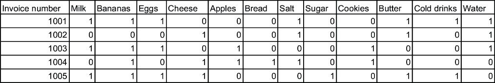

##### 图 4.2 零售店生成的五个发票示例

第一条规则意味着每当牛奶和香蕉一起购买时，鸡蛋也会在同一笔交易中购买。第二条规则意味着每当牛奶和香蕉一起购买时，面包也会在同一笔交易中购买。通过分析数据集，我们可以清楚地看到规则 1 总是正确的，而规则 2 则不是。

注意：规则左侧的项目被称为**前件**或 LHS，而规则右侧的项目被称为**后件**或 RHS。

在现实世界中，对于任何这样的规则要具有意义，相同的模式必须在数百甚至数千笔交易中重复出现。只有这样，我们才能得出结论，该规则确实是正确的，并且可以在整个数据库中泛化。

同时，可能存在许多这样的规则。在一个每天生成数千张发票的零售店中，可能有数百条这样的规则。我们如何找出哪些规则是重要的，哪些不是？这可以通过使用 *支持度、置信度、提升度* 和 *确信度* 的概念来理解，我们将在下一节中学习这些概念。

### 4.3.1 支持度、置信度、提升度和确信度

在上一个章节中，我们探讨了关联规则中规则的意义。我们也了解到，基于事务数据集可能会有数百条规则。在本节中，我们将探讨如何衡量这类规则的有效性，并筛选出最有趣的规则。这可以通过使用支持度、置信度、提升度和确信度的概念来实现。

回想一下，在上一个章节中我们讨论了规则的泛化。支持度、置信度、提升度和确信度允许我们衡量泛化的程度。简单来说，通过使用这四个参数，我们可以确定规则在我们实际应用中的实用性。毕竟，如果一个规则没有用或者不够强大，那么它就不需要被实施。支持度、置信度、提升度和确信度是检查规则有效性的参数。我们将在下一节中详细探讨这些概念。

我们将使用表 4.2 中的数据集来理解支持度、置信度、提升度和确信度的概念。第一张发票，1001，有牛奶、鸡蛋和面包，而奶酪没有购买。为了这个例子，我们总共只选取了四个项目。

##### 表 4.2：用于理解支持度、置信度、提升和确信度的数据集

| 发票编号 | 牛奶 | 鸡蛋 | 面包 | 奶酪 |
| --- | --- | --- | --- | --- |
| 1001  | 1  | 1  | 1  | 0  |
| 1002  | 0  | 1  | 1  | 1  |
| 1003  | 1  | 1  | 1  | 0  |
| 1004  | 0  | 1  | 0  | 1  |
| 1005  | 0  | 1  | 1  | 0  |

这里，对于一张发票，1 表示该发票中是否有项目，而 0 表示在该特定发票中没有购买该项目。例如，发票编号 1001 有牛奶、鸡蛋和面包，而 1002 有鸡蛋、面包和奶酪。

#### 支持度

支持度衡量数据集中项目的频率百分比。简单来说，它衡量在数据集中发生项目的交易百分比。

支持度可以表示如下：

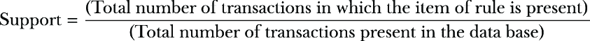

参考表 4.2。假设我们对规则{牛奶，鸡蛋} -> {面包}感兴趣。在这种情况下，有两个交易包含这三个项目（牛奶、鸡蛋和面包）。交易总数是五个。这意味着该规则的支持度为 2/5，即 0.4 或 40%。

现在假设我们对规则{面包，鸡蛋} -> {奶酪}感兴趣。在这种情况下，只有一个交易包含这三个项目。交易总数是五个。这意味着该规则的支持度为 1/5，即 0.2 或 20%。

备注：规则的支持度越高，越好。通常，我们会设定一个最低阈值以获得支持。最低阈值通常是在与业务利益相关者协商后确定的。

#### 置信度

置信度衡量规则为真的频率；也就是说，它衡量包含前件也包含后件的交易的百分比。

因此，如果我们想测量规则 A -> B 的置信度：


这里，分子是在交易中同时存在 A 和 B 时支持的，而分母是指仅对 A 的支持。

参考表 4.2。再次假设我们对规则{牛奶，鸡蛋} -> {面包}感兴趣。在这种情况下，有两个交易包含牛奶和鸡蛋。因此，支持度为 2/5 = 0.4。这是分母。有两个交易包含所有三个（牛奶、鸡蛋、面包）。因此，支持度为 2/5 = 0.4，这是分子。将它们放入前面的方程中，规则{牛奶，鸡蛋} -> {面包}的置信度为 0.4/0.4 = 1。

现在假设我们对规则{鸡蛋，面包} -> {奶酪}感兴趣。在这种情况下，有四个交易包含（鸡蛋，面包）。交易总数是五个。这意味着支持度为 4/5，即 0.8。只有一个交易包含所有三个项目（鸡蛋、面包、奶酪）。因此，支持度为 1/5 = 0.2。因此，规则{鸡蛋，面包} -> {奶酪}的置信度为 0.2/0.8 = 0.25。

备注：规则的置信度越高，越好。和支撑度一样，我们对置信度也设定了一个最小阈值。

有时这也被称为 *A* 在 *B* 上的 *条件概率*。它可以理解为在 *A* 已经发生的情况下 *B* 发生的概率，可以表示为 *P*(*A*|*B*)。所以，在前面的例子中，在已经购买了鸡蛋和面包的情况下购买奶酪的概率是 25%，而购买面包的概率，在已经购买了牛奶和鸡蛋的情况下是 100%。

#### 提升和说服力

提升是规则的一个重要测量标准。规则 *A* -> *B* 的提升可以定义为


在这里，当交易中同时存在 *A* 和 *B* 时，分子得到支持，而分母指的是对 *A* 的支持乘以对 *B* 的支持。

再次，参考表 4.2，假设我们感兴趣的规则是 {milk, eggs} -> {bread}。在这种情况下，有两个交易同时包含所有三个（牛奶、鸡蛋、面包）。因此，支撑度再次是 2/5 = 0.4，这是分子。有两个交易只包含（牛奶、鸡蛋），所以支撑度是 2/5 = 0.4。有四个交易包含面包，因此支撑度是 4/5 = 0.8。将前面的方程代入，规则 {milk, eggs} -> {bread} 的提升是 0.4/(0.4 x 0.8) = 1.25。

然后，假设我们感兴趣的规则是 {eggs, bread} -> {cheese}。在这种情况下，只有一个交易包含（鸡蛋、面包、奶酪）。交易总数是五个。这意味着支撑度是 1/5，即 0.2。有两个交易包含（奶酪），所以支撑度是 2/5 = 0.4。有四个交易包含（鸡蛋、面包），所以支撑度是 4/5 = 0.8。将前面的方程代入，规则 {eggs, bread} -> {cheese} 的提升是 0.2/(0.4 x 0.8) = 0.625。

如果提升的值 *等于 1*，这意味着前件和后件彼此独立，从中无法得出任何规则。

如果提升的值 *大于 1*，这意味着前件和后件彼此依赖。这个规则可以用于预测未来交易中的前件。这是我们想要从数据集中得出的见解。

如果提升的值 *小于 1*，这意味着前件和后件是彼此的替代品。一个的存在可能对另一个产生负面影响。这也是商业团队可以用于战略规划的重要见解。

当我们使用提升度评估任何规则时，应用领域知识是至关重要的。例如，如果我们评估规则{鸡蛋，面包} -> {奶酪}，并且我们发现鸡蛋和面包可以是奶酪的替代品，我们知道在现实生活中这不是真的。因此，在这种情况下，我们不能对这个规则做出任何决定。我们必须使用领域知识来为这个规则得出任何结论。

同时，规则{牛奶，鸡蛋} -> {面包}可能是一个可以多次成立的规则。对于许多客户来说，当他们一起购买牛奶和鸡蛋时，购买面包的可能性非常高。因此，这个规则对这类客户来说更有意义。目标是有一个强大的业务逻辑来支持或反对使用算法识别出的规则。

确信度是另一个重要参数，由以下公式给出：

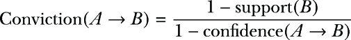

参考表 4.2。再次，假设我们感兴趣的规则是{鸡蛋，面包} -> {奶酪}。在这种情况下，只有一个交易中包含（奶酪）。总交易数为五。所以，这意味着支持度为 1/5，即 0.2，将用于分子。我们已经计算出置信度为 0.625。将这个值代入公式，我们可以计算出确信度为(1 – 0.2)/(1 – 0.625) = 2.13

我们可以将确信度解释为：规则{鸡蛋，面包} -> {奶酪}如果{鸡蛋，面包，奶酪}之间的关联完全是随机选择的，那么这个规则将错误地出现 2.13 倍。

在大多数商业场景中，提升度是使用的测量标准。还有其他测量参数，例如杠杆、集体强度等。但大多数情况下，置信度、支持度、提升度和确信度用于衡量任何规则的有效性。

##### 练习 4.1

回答这些问题以检查你的理解：

1.  支持度衡量规则在数据集中出现的频率。对或错？

1.  如果提升度大于 1，这意味着两个项目是相互独立的。对或错？

1.  置信度值越低，规则越好。对或错？

当我们在分析数据集时评估任何规则时，大多数情况下，我们会为置信度、支持度、提升度和确信度设置一个阈值。这使我们能够减少规则的数目并过滤掉不相关的规则。换句话说，我们只对非常频繁的规则感兴趣。当我们为数据集创建 Python 解决方案时，我们将更详细地研究这个问题。

## 4.4 Apriori 算法

Apriori 算法是用于关联规则的最流行算法之一。它在 1994 年由 Agrawal 和 Shrikant 提出。论文链接在章节末尾给出。

Apriori 用于理解和分析事务数据库中的频繁项。它采用“自下而上”的方法，首先根据子集的频率生成候选项。让我们通过一个例子来理解整个过程。我们将使用之前讨论过的相同数据集（见表 4.2）。Apriori 算法中使用的流程将类似于图 4.3。

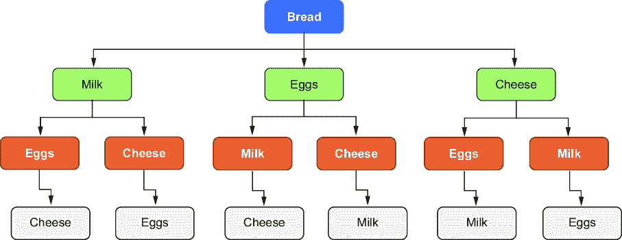

##### 图 4.3 Apriori 算法过程

假设我们希望分析数据集中面包与其他所有商品之间的关系。在这种情况下，第一级是面包，我们找到其出现的频率。

然后我们转向下一层，即第二层。现在我们找到面包与第二层中每个其他商品的关系：牛奶、鸡蛋和奶酪。在这里，我们再次找到所有可能组合的相应频率，这些组合是 {面包, 牛奶}、{面包, 鸡蛋} 和 {面包, 奶酪}。见图 4.4。


##### 图 4.4 我们在第一级放置面包，而其他商品（牛奶、鸡蛋和奶酪）保持在第二级。面包保持在第一级，因为我们希望分析面包与其他所有商品的关系。

在分析完第二层之后，我们转向第三层和第四层，依此类推。这个过程一直持续到我们达到最后一层，其中所有商品都已耗尽。

通过这个过程，我们可以计算出所有可能组合的支持度。例如，我们会知道

{面包} -> {牛奶}，

{面包} -> {鸡蛋}，并且

{面包} -> {奶酪}。

对于下一级，我们也会得到支持度

{面包, 牛奶} -> {鸡蛋}，

{面包, 鸡蛋} -> {牛奶}，

{面包, 牛奶} -> {奶酪}，

{面包, 奶酪} -> {牛奶},

{面包, 奶酪} -> {鸡蛋}，并且

{面包, 鸡蛋} -> {奶酪}。

现在，使用相同的过程，计算下一级的所有可能组合。例如，{面包, 鸡蛋, 牛奶} -> {奶酪}，{面包, 鸡蛋, 奶酪} -> {牛奶}，依此类推。

当所有商品集都耗尽后，过程将停止。完整的架构可以像图 4.5 那样。

现在我们可以很容易地理解，可能的组合数量相当高，这是 Apriori 的一大挑战。但 Apriori 是一个非常强大的算法，也非常受欢迎。现在是时候使用 Python 实现 Apriori 了。


##### 图 4.5 Apriori 算法的完整架构。在这里，我们将计算所有可能组合的支持度。探索所有商品之间的关系，由于整个数据库扫描，Apriori 的速度会受到影响。

### 4.4.1 Python 实现

我们现在将进行 Apriori 算法的 Python 实现。数据集和 Python Jupyter Notebook 已存入 GitHub 仓库。你可能需要安装 `apyori`。

要安装库，只需执行以下操作：

```py
import sys
!{sys.executable} -m pip install apyori
```

步骤如下：

1.  导入使用案例所需的库。我们正在导入 `numpy` 和 `pandas`。为了实现 Apriori，我们有一个名为 `apyori` 的库，也进行了导入：

```py
import numpy as np
import pandas as pd
from apyori import apriori
```

1.  2. 导入数据集文件 `store_data.csv`：

```py
store_dataset = pd.read_csv('store_data.csv')
```

还建议您通过打开 .csv 文件查看数据集。它将看起来像图 4.6 中的截图。截图显示了前 25 行。每一行代表一张发票。


##### 图 4.6 .csv 文件的截图

1.  3. 接下来，我们通过 `.info` 和 `.head` 命令对数据进行一些基本检查（见图 4.7）：

```py
store_dataset.info()
```


```py
store_dataset.head()
```

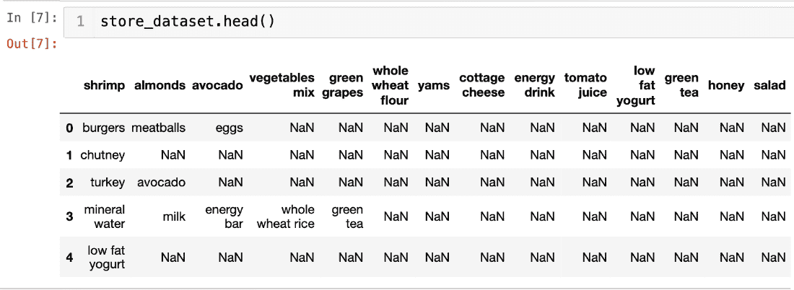

##### 图 4.7 `.info` 和 `.head` 命令的输出

1.  4. 在这里，我们可以看到代码已经将第一个事务视为标题。因此，我们将再次导入数据，但这次我们会指定标题等于 `None`：

```py
store_dataset = pd.read_csv('store_data.csv', header=None)
```

1.  5. 让我们再次查看头部（见图 4.8）。这次看起来是正确的：

```py
store_dataset.head()
```

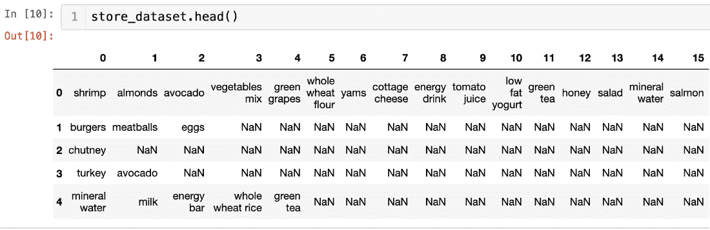

##### 图 4.8 `.head()` 的正确结果

1.  6. 我们使用的库接受数据集作为列表的列表。整个数据集必须是一个大列表，而每个事务都是大列表中的一个内部列表。因此，为了实现这一点，我们首先将我们的 `store_dataset` 数据框转换为列表：

```py
all_records = []
for i in range(0, 7501):
    all_records.append([str(store_dataset.values[i,j]) for j in range(0, 20)])
```

1.  7. 接下来，我们实现 Apriori 算法。

对于算法，我们正在使用我们在第 6 步中创建的 `all_records` 列表。指定的最小支持度为 0.5 或 50%，最小置信度为 25%，最小提升度为 4，规则的最小长度为 2。

此步骤的输出是 `apriori_rules` 类对象。然后，我们将此对象转换为我们可以理解的列表。最后，我们打印这个列表：

```py
apriori_rules = apriori(all_records, min_support=0.5, min_confidence=0.25, min_lift=4, min_length=2)
apriori_rules = list(apriori_rules)
print(len(apriori_rules))
```

代码的输出将是 0。这意味着不存在满足我们设定的规则条件的规则。

我们再次尝试执行相同的代码，尽管将最小支持度降低到 25%：

```py
apriori_rules = apriori(all_records, min_support=0.25, min_confidence=0.25,
min_lift=4, min_length=2)
apriori_rules = list(apriori_rules)
print(len(apriori_rules))
```

再次，没有生成规则，输出为 0。即使将最小支持度降低到 10% 也不会产生任何规则：

```py
apriori_rules = apriori(all_records, min_support=0.1, min_confidence=0.25,
min_lift=4, min_length=2)
apriori_rules = list(apriori_rules)
print(len(apriori_rules))
```

现在，我们将最小提升度降低到 2。这次输出为 200。这意味着有 200 条这样的规则满足标准：

```py
apriori_rules = apriori(all_records, min_support=0.25, min_confidence=0.25,
min_lift=2, min_length=2)
apriori_rules = list(apriori_rules)
print(len(apriori_rules))
```

1.  8. 让我们查看第一条规则（见图 4.9）：

```py
print(apriori_rules[0])
```


##### 图 4.9 `print(apriori_rules[0])` 的输出

该规则解释了杏仁和汉堡之间的关系。支持度为 .005，置信度为 0.25。提升度，为 2.92，表明此规则相当强大。

1.  9. 现在，我们将详细查看所有规则。为此，遍历规则并从每个迭代中提取信息。每个规则都有构成规则的项以及支持度、置信度、提升度和确信度的相应值。我们在第 8 步中展示了一个示例。现在，在第 9 步中，我们只是使用 `for` 循环提取所有规则的信息：

```py
for rule in apriori_rules:
    item_pair = rule[0] 
    items = [x for x in item_pair]
    print("The apriori rule is: " + items[0] + " -> " + items[1])

    print("The support for the rule is: " + str(rule[1]))

    print("The confidence for the rule is: " + str(rule[2][0][2]))
    print("The lift for the rule is: " + str(rule[2][0][3]))
    print("************************")
```

此步骤的输出如图 4.10 所示。在这里，我们可以观察到每条规则及其相应的支持度、置信度、升值和确信度。


##### 图 4.10 第 9 步的输出

我们可以很容易地解释这些规则。例如，规则杏仁 -> 汉堡的升值为 2.92，置信度为 25.49%，支持度为 0.51%。这标志着我们使用 Python 实现的结束。这个例子可以扩展到任何其他现实世界的商业数据集。

注意：并非所有生成的规则都值得使用。当我们处理本章最后部分的案例研究时，我们将探讨如何从所有生成的规则中获取最佳规则。

Apriori 算法是一个强大且非常有洞察力的算法。但，像任何其他解决方案一样，它也有一些缺点。

### 4.4.2 Apriori 算法的挑战

正如我们所见，Apriori 算法生成的子集数量相当高（见图 4.5）。生成候选项集非常繁琐，因此分析数据集变得相当麻烦。Apriori 算法多次扫描整个数据集，因此需要将数据库加载到内存中。我们可以安全地推断，这需要大量的时间来计算。当我们处理非常大的数据集时，这个问题会变得更加严重。实际上，对于生成数百万笔交易的现实世界问题，会生成大量的候选项集，使用 Apriori 在整个数据集上运行会非常耗时。

正因如此，通常，我们设置一个最小支持度值以减少可能的规则数量。在先前的例子中，我们可以计算 1 级组合的支持度，如表 4.3 所示。在这里，如果我们设置最小支持度值为 0.5，则只有一条规则会被筛选出来。支持度会计算每个物品组合。例如，对于牛奶和面包，交易数量为 2，而总交易数量为 5。因此，支持度为 2/5，即 0.4。

##### 表 4.3 1 级组合的支持度

| 组合 | 交易数量 | 总交易数量 | 支持度 |
| --- | --- | --- | --- |
| 牛奶，鸡蛋 | 2 | 5 | 0.4 |
| 牛奶，面包 | 2 | 5 | 0.4 |
| 牛奶，奶酪 | 0 | 5 | 0 |
| 鸡蛋，面包 | 4 | 5 | 0.8 |
| 鸡蛋，奶酪 | 2 | 5 | 0.4 |
| 面包，奶酪 | 1 | 5 | 0.2 |

因此，设置一个最小支持度值是一种明智的策略，可以使规则更容易管理。它减少了时间并生成了更具意义的规则。毕竟，从分析中生成的规则应该足够通用，以便可以在整个数据库中实施。

##### 练习 4.2

回答以下问题以检查你的理解：

1.  Apriori 算法只扫描数据库一次。对还是错？

1.  如果香蕉在总共 12 笔交易中的 5 笔交易中出现，这意味着香蕉的支持度是 5/12。对还是错？

但 Apriori 算法确实是一个伟大的解决方案。它仍然非常受欢迎，并且在讨论关联规则时通常是最先提出的算法之一。

注意：数据准备是关键步骤之一，也是一个相当大的挑战。我们将在第 4.8 节中的案例研究中探讨这个挑战。

## 4.5 等价类聚类和自底向上的格遍历

我们现在将研究等价类聚类和自底向上格遍历算法（ECLAT），它在速度和易于实现方面有时被认为比 Apriori 更好。ECLAT 使用深度优先搜索方法。这意味着 ECLAT 在整个数据集上以垂直方式执行搜索。它从根节点开始，然后深入一层，并继续直到达到第一个终端节点。假设终端节点在级别*X*。一旦达到终端节点，算法就后退一步，达到级别(*X* – 1)，并继续直到再次找到终端节点。让我们通过图 4.11 所示的树状图来理解这个过程。


##### 图 4.11 展示了理解 ECLAT 算法过程的树状图。它从 1 开始，到 16 结束。

ECLAT 将采取以下步骤：

1.  算法从根节点 1 开始。

1.  然后，它深入一层到达根节点 2。

1.  然后，它将再深入一层，直到达到终端节点 11。

1.  一旦达到终端节点 11，它就后退一步，到达节点 5。

1.  算法接着搜索是否有可用的节点。在节点 5 我们可以看到没有这样的节点可用。

1.  因此，算法再次后退一步，达到节点 2。

1.  在节点 2，算法再次探索。它发现可以进入节点 6。

1.  因此，算法进入节点 6 并再次开始探索，直到达到终端节点 12。

1.  此过程会继续进行，直到所有组合都被耗尽。

显然，计算速度取决于数据集中不同项目的总数。这是因为不同项目的数量定义了树的宽度。每个交易中购买的项目将定义每个节点之间的关系。

在 ECLAT 的执行时间内，每个项目（无论是单独还是成对）都会被分析。让我们使用我们之前为 Apriori 使用的相同示例来更好地理解 ECLAT。参见表 4.2。

ECLAT 将采取以下步骤来分析数据集：

1.  在第一次运行中，ECLAT 将找到所有单个项目的发票号码。换句话说，它将找到所有项目的单独发票号码。这显示在表 4.4 中，其中牛奶出现在发票号码 1001 和 1003 中，而鸡蛋出现在所有五张发票中。

##### 表 4.4 包含每个项目各自的发票

| 项目 | 发票编号 |
| --- | --- |
| 牛奶 | 1001, 1003 |
| 鸡蛋 | 1001, 1002, 1003, 1004, 1005 |
| 面包 | 1001, 1002, 1003, 1005 |
| 奶酪 | 1002, 1004 |

1.  2. 在下一步中，所有包含两个项目的数据集都按表 4.5 所示进行探索。例如，牛奶和鸡蛋存在于发票编号 1001 和 1003 中，而牛奶和奶酪不存在于任何发票中。

##### 表 4.5 两项数据集

| 项目 | 发票编号 |
| --- | --- |
| 牛奶，鸡蛋 | 1001 ,1003 |
| 牛奶，面包 | 1001, 1003 |
| 牛奶，奶酪 | — |
| 鸡蛋，面包 | 1001, 1002, 1003, 1005 |
| 鸡蛋，奶酪 | 1002, 1004 |
| 面包，奶酪 | 1002 |

1.  3. 在下一步中，所有包含三个项目的数据集都按表 4.6 所示进行探索。这里我们只有两种组合。

##### 表 4.6 三项数据集

| 项目 | 发票编号 |
| --- | --- |
| 牛奶，鸡蛋，面包 | 1001, 1003 |
| 鸡蛋，面包，奶酪 | 1002 |

1.  4. 在我们的数据集中没有包含四个项目的发票。

1.  5. 现在，根据我们为支持计数值设定的阈值，我们可以选择规则。所以，如果我们想规则为真的最小交易数量是三个，那么只有一个规则符合条件，即 {鸡蛋，面包}。如果我们决定最小交易数量的阈值是两个，那么像 {牛奶，鸡蛋，面包}，{牛奶，鸡蛋}，{牛奶，面包}，{鸡蛋，面包} 和 {鸡蛋，奶酪} 这样的规则都符合规则。

我们现在将为 ECLAT 创建一个 Python 解决方案。

### 4.5.1 Python 实现

我们现在将使用 Python 执行 ECLAT。在这里，我们使用 `pyECLAT` 库。数据集看起来像图 4.12。

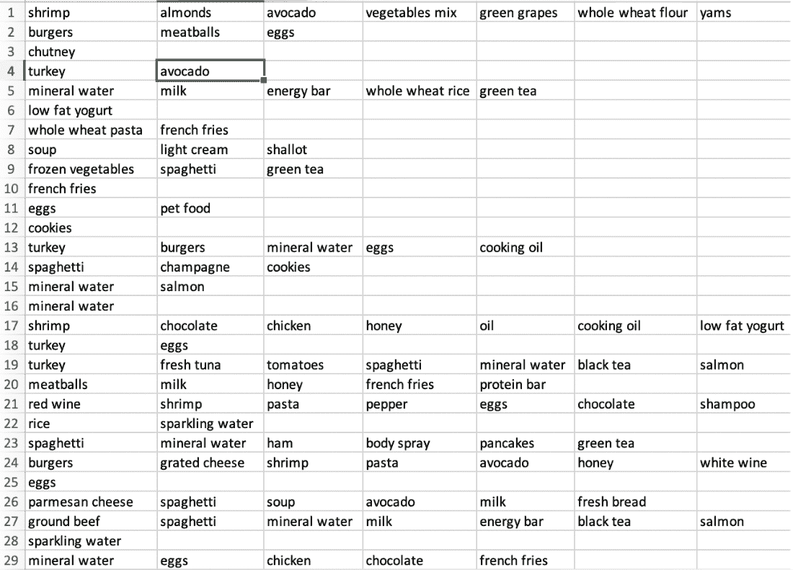

##### 图 4.12 使用 Python 的 `pyECLAT` 库的 ECLAT

步骤如下：

1.  导入库：

```py
import numpy as np
import pandas as pd
from pyECLAT import ECLAT
```

1.  2. 导入数据集：

```py
data_frame = pd.read_csv('Data_ECLAT.csv', header = None)
```

1.  3. 生成 ECLAT 实例：

```py
eclat = ECLAT(data=data_frame)
```

在上一步生成的 ECLAT 实例 `eclat` 中有一些属性，如 `eclat.df_bin`，它是一个二进制数据框，以及 `eclat.uniq_`，它是一个包含所有唯一项目的列表。

1.  4. 拟合模型。我们这里给出最小支持度为 0.02。之后，我们打印支持度：

```py
get_ECLAT_indexes, get_ECLAT_supports = eclat.fit(min_support=0.02,
                                                     min_combination=1,
                                                     max_combination=3,
separator=' & ')
get_ECLAT_supports
```

输出如图 4.13 所示。


##### 图 4.13 第 4 步的输出

我们可以根据支持度解释提供的结果。对于每个项目和项目的组合，我们都会得到支持度的值。例如，对于薯条和鸡蛋，支持度的值是 3.43%。

与 Apriori 算法相比，ECLAT 有一些优势。因为它使用深度搜索方法，所以比 Apriori 快，并且计算所需的内存更少。它不迭代地扫描数据集，这使得它甚至比 Apriori 更快。在我们研究完最后一个算法之后，我们将再次比较这些算法。

## 4.6 F-P 算法

F-P 算法是本章讨论的第三个算法。它是对 Apriori 算法的改进。回想一下，在 Apriori 算法中，我们面临着耗时和昂贵的计算挑战。F-P 通过将数据库表示为一种称为**频繁模式树**或**FP 树**的树形结构来解决这些问题。由于这种频繁模式，我们不需要像在 Apriori 算法中那样生成候选项。现在让我们详细讨论 F-P 算法。

F-P 树是一种树形结构，它挖掘数据集中的最频繁项目。这在图 4.14 中得到了可视化。


##### 图 4.14 F-P 算法可以用树形图结构表示。每个节点代表一个独特的项目。根节点是`NULL`。

每个节点代表数据集中的独特项目。树的根节点通常保持为`NULL`。树中的其他节点是数据集中的项目。如果它们在同一发票中，则节点之间相互连接。我们将逐步研究整个过程。

假设我们正在使用表 4.7 中所示的数据集。因此，我们有苹果，牛奶，鸡蛋，奶酪和面包这些独特项目。有九个事务，每个事务中的相应项目在表 4.7 中显示。

##### 表 4.7 用于理解 F-P 算法的数据集

| 事务 | 项目集 |
| --- | --- |
| T1  | 苹果，牛奶，鸡蛋  |
| T2  | 牛奶，奶酪  |
| T3  | 牛奶，面包  |
| T4  | 苹果，牛奶，奶酪  |
| T5  | 苹果，面包  |
| T6  | 牛奶，面包  |
| T7  | 苹果，面包  |
| T8  | 苹果，牛奶，面包，鸡蛋  |
| T9  | 苹果，牛奶，面包  |

现在我们将 F-P 算法应用于这个数据集。步骤如下：

1.  与 Apriori 类似，首先扫描整个数据集。计算每个项目的出现次数，并生成频率。结果在表 4.8 中建议。我们已按整个数据集中频率或相应支持计数的降序排列项目。例如，苹果在六次交易中被购买。

##### 表 4.8 各项目集的相应频率

| 项目 | 频率或支持计数 |
| --- | --- |
| 牛奶  | 7  |
| 苹果  | 6  |
| 面包  | 6  |
| 奶酪  | 2  |
| 鸡蛋  | 2  |

如果两个项目的频率完全相同，则可以按任意顺序排列。在这个例子中，面包和苹果的频率相同。因此，我们可以保持面包或苹果作为第一个项目。

1.  2\. 开始构建 F-P 树。我们从创建根节点开始，这在图 4.15 中通常是`NULL`节点。


##### 图 4.15 树的根节点通常保持为`NULL`。

1.  3\. 分析第一个事务，T1。在这里，第一个事务中有苹果，牛奶和鸡蛋。在这三个中，牛奶的支持计数最高，为 7。因此，从根节点延伸出一条连接到牛奶的路径，我们将其表示为 Milk:1（见图 4.16）。


##### 图 4.16 从根节点到牛奶的连接。牛奶具有最高的支持度；因此我们选择了牛奶。

1.  4. 现在看看 T1 中的其他项目。苹果的支持计数为 6，鸡蛋的支持计数为 2。因此，我们将从牛奶扩展到苹果的连接，并命名为苹果:1，然后从苹果到鸡蛋，并命名为鸡蛋:1（见图 4.17）。

1.  5. 现在看看 T2。它有牛奶和奶酪。牛奶已经连接到根节点。因此，牛奶的计数变为 2，变为牛奶:2。接下来，我们将从牛奶创建一个分支到奶酪，并命名为奶酪:1。添加情况如图 4.18 所示。


##### 图 4.17 过程的第 4 步，我们已经完成了 T1 中的所有项目。所有项目——牛奶、苹果和鸡蛋——现在都已连接。


##### 图 4.18 过程的第 5 步，我们开始分析 T2。牛奶已经连接，所以其计数增加 2，而奶酪被添加到树中。

1.  6. 考虑 T3。T3 有牛奶和面包。因此，类似于第 5 步，牛奶的计数为 3，变为牛奶:3。同样，类似于第 5 步，我们添加另一个从牛奶到面包的连接，并命名为面包:1。更新的树如图 4.19 所示。


##### 图 4.19 在第 6 步中，分析 T3。牛奶的计数增加了 1，变为 3，同时面包作为新的连接被添加。

1.  7. 在 T4 中，我们有苹果、牛奶和奶酪。牛奶的计数变为 4；苹果现在是 2。然后我们创建一个从苹果到奶酪的分支，命名为奶酪:1（见图 4.20）。


##### 图 4.20 在过程的第 7 步中，正在分析 T4。牛奶的计数变为 4，苹果增加到 2，并添加了一个从苹果到奶酪的新分支。

1.  8. 在 T5 中，我们发现我们有苹果和面包。它们都没有直接连接到根节点，并且频率相等，都是 6。因此，我们可以选择任何一个连接到根节点。图被更新为图 4.21。

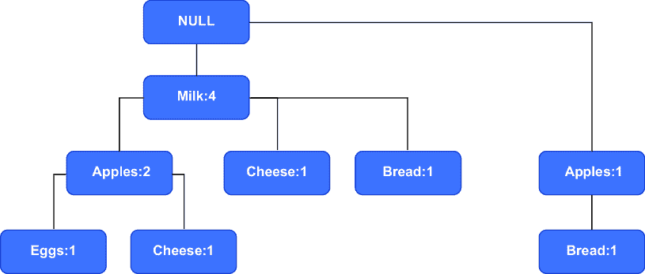

##### 图 4.21 分析 T5 后，图表发生变化，如图所示。我们添加了苹果和面包到树中。

1.  9. 这个过程会继续进行，直到我们耗尽所有事务，最终得到如图 4.22 所示的最终图。

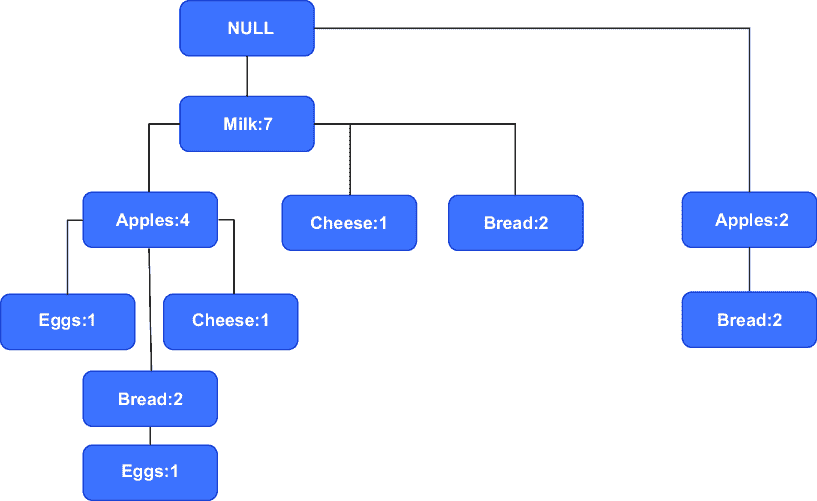

##### 图 4.22 当我们耗尽所有可能的组合后得到的最终树

到目前为止，做得很好！但之后还有更多步骤。到目前为止，我们只创建了树。现在我们需要生成如表 4.9 所示的数据集。这是我们希望生成的输出。

##### 表 4.9 F-P 算法表

| 项目 | 条件模式基 | 条件 F-P 树 | 生成频繁模式 |
| --- | --- | --- | --- |
| 奶酪 |  |  |  |
| 面包 |  |  |  |
| 鸡蛋 |  |  |  |
| 苹果 |  |  |  |

你可能想知道为什么只列出了四个项目。由于牛奶直接来自根节点，没有其他方式到达它，因此我们不需要为牛奶单独列出行。

1.  10. 在继续之前，我们必须将任何规则的最低支持计数设置为 2，以便该规则可接受。我们这样做是为了简化，因为数据集相当小。

注意：对于现实生活中的商业问题，建议您测试支持计数的多重甚至更高的值；否则，生成的规则数量可能会非常高。

让我们从奶酪作为第一个项目开始。我们可以通过{NULL-牛奶-奶酪}和{NULL-牛奶-苹果-奶酪}到达奶酪。对于这两条路径，奶酪的计数都是 1。因此，（如果我们忽略 NULL）我们的条件模式基是{牛奶-奶酪}或{牛奶:1}和{牛奶-苹果-奶酪}或{牛奶-苹果:1}。完整的条件模式基变为{{牛奶:1}, {牛奶-苹果:1}}。此信息被添加到表 4.10 的第二列中。

##### 表 4.10：过程步骤 10，我们已填充奶酪的第一个单元格

| 项目 | 条件模式基 | 条件 F-P 树 | 生成的频繁模式 |
| --- | --- | --- | --- |
| 奶酪  | {{牛奶:1}, {牛奶-苹果:1}}  |  |  |
| 面包  |  |  |  |
| 鸡蛋  |  |  |  |
| 苹果  |  |  |  |

1.  11. 现在如果我们将条件模式基中的两个值相加，我们会得到牛奶为 2，苹果为 1。由于我们已经为频率计数设置了 2 的阈值，我们将忽略苹果的计数。条件 F-P 树的价值，即表中的第三列，变为{牛奶:2}。现在我们只需将原始项添加到其中，这样就变成了生成的频繁模式或第 4 列。见表 4.11。

##### 表 4.11：过程步骤 11，我们已完成奶酪的详细信息

| 项目 | 条件模式基 | 条件 F-P 树 | 生成的频繁模式 |
| --- | --- | --- | --- |
| 奶酪  | {{牛奶:1}, {牛奶-苹果:1}}  | {牛奶:2}  | {牛奶-奶酪:2}  |
| 面包  |  |  |  |
| 鸡蛋  |  |  |  |
| 苹果  |  |  |  |

1.  12. 以类似的方式，表中所有其他单元格都被填充，从而得到最终的表格（表 4.12）。

##### 表 4.12：分析所有项目组合后得到的最终表格

| 项目 | 条件模式基 | 条件 F-P 树 | 生成的频繁模式 |
| --- | --- | --- | --- |
| 奶酪  | {{牛奶:1}, {牛奶-苹果:1}}  | {牛奶:2}  | {牛奶-奶酪:2}  |
| 面包  | {{牛奶-苹果:2}, {牛奶:2}, {苹果:2}}  | {{牛奶:4, 苹果:2}, {苹果:2}}  | {{牛奶-面包:4}, {苹果-面包:4}, {牛奶-苹果-面包:2}}  |
| 鸡蛋  | {{牛奶-苹果:1}, {牛奶-苹果-面包:1}}  | {牛奶:2, 苹果:2}  | {{牛奶-鸡蛋:2}, {牛奶-苹果:2}, {牛奶-苹果:2}}  |
| 苹果  | {牛奶:4}  | {牛奶:4}  | {牛奶-苹果:4}  |

这确实是一个复杂的过程。但一旦步骤清晰，它就很简单了。

作为这个练习的结果，我们得到了最终的一组规则，如最终列“生成的频繁模式”所示。

注意事项：请注意，没有任何一条规则是彼此相似的。

我们将使用最后一列“频繁模式生成”作为我们数据集的规则。

F-P 增长算法的 Python 实现相当简单，并且可以使用库轻松计算。为了节省空间，我们已经将 Jupyter 笔记本上传到本章的 GitHub 仓库。

我们现在将探讨另一个有趣的主题：序列规则挖掘。这是一个非常强大的解决方案，允许企业根据客户定制其营销策略和产品推荐。

## 4.7 序列规则挖掘

考虑这一点：Netflix 有一个所有客户随时间订购的电影的交易数据库。如果它分析和发现 65%的客户在接下来的一个月观看了战争电影 X，也观看了浪漫喜剧 Y，那么这将是非常有见地和可操作的信息。它将允许 Netflix 向客户推荐其产品并定制其营销策略。

到目前为止，在本章中，我们已经介绍了三种关联规则算法。但所有数据点都限于同一个数据集，并且没有涉及序列。序列模式挖掘允许我们分析发生事件序列的数据集。通过分析数据集，我们可以找到具有统计学意义的模式，这使我们能够解码整个事件序列。显然，事件序列是有特定顺序的，这是在序列规则挖掘中需要考虑的一个重要属性。

注意事项：序列规则挖掘与时间序列分析不同。要了解更多关于时间序列分析的信息，请参阅附录。

序列规则挖掘被广泛应用于多个领域和功能。它可以用于生物学中提取 DNA 测序过程中的信息，或者可以用来理解用户的在线搜索模式。序列规则挖掘将帮助我们了解用户接下来将要搜索的内容。在讨论关联规则时，我们使用了牛奶、面包和鸡蛋在同一笔交易中购买的事务。序列规则挖掘是对此的扩展，其中我们分析连续的事务并试图解码存在的任何序列。

在研究使用等价性进行序列模式发现（SPADE）算法时，我们涵盖了构成算法基础的数学概念。这些概念有点棘手，可能需要阅读多次才能掌握。

### 4.7.1 使用等价性进行序列模式发现

我们现在使用 SPADE 探索序列规则挖掘。它是由 Mohammed J. Zaki 提出的；论文链接在本章末尾。

因此，我们希望分析一个事件序列。例如，一位顾客购买了一部手机和充电器。一周后，他们购买了耳机，两周后，他们购买了手机壳和屏幕保护膜。所以，在每个交易中都有购买的项目。每个交易都可以称为一个事件。让我们更详细地了解它。

让我们假设我们有一个用于讨论的项目完整列表。它将包含像 i[1]，i[2]，i[3]，i[4]，i[5] 等项目。因此，我们可以写出 *I* = {i[1]，i[2]，i[3]，i[4]，i[5]………，i[*n*]}，其中我们总共有 *n* 个不同的项目。

项目可以是任何东西。如果我们考虑同样的杂货店例子，项目可以是牛奶、鸡蛋、奶酪、面包等等。

一个事件将是同一交易中的项目集合。一个事件可以包含像 (i[1], i[5], i[4], i[8]) 这样的项目。例如，一个事件可以包含在同一交易中购买的项目（牛奶，糖，奶酪，面包）。我们将事件表示为 ⍺。

接下来，让我们了解一个序列。序列不过是按顺序排列的事件。换句话说，⍺[1] -> ⍺[2] -> ⍺[3] -> ⍺[4] 可以被称作事件序列。例如，(牛奶，奶酪) -> (面包，鸡蛋) -> (奶酪，面包，糖) -> (牛奶，面包) 是一个事务序列。这意味着在第一个事务中，购买了牛奶和奶酪。在随后的交易中，购买了面包和鸡蛋，依此类推。

包含 *k* 项的序列是一个 k-项序列。例如，序列（牛奶，面包）-> （鸡蛋）包含三个项。现在让我们一步一步地探索 SPADE 算法。

假设我们生成了以下序列。在第一个序列中，ID 1001，在第一个交易中就购买了牛奶。在第二个序列中，购买了牛奶、鸡蛋和面包。随后又购买了牛奶和面包。在第四个序列中，只购买了糖。在序列 1001 的最后一个交易中，购买了面包和苹果；这适用于所有相应的序列。例如，在序列 ID 1001 中，我们有多个事件。在第一次购买中，购买了牛奶。然后购买了（牛奶，鸡蛋，面包）等等。参见表 4.13。

##### 表 4.13 序列挖掘的数据集

| 序列 ID | 序列 |
| --- | --- |
| 1001  | <(牛奶) (牛奶，鸡蛋，面包) (牛奶，面包) (糖) (面包，苹果)>  |
| 1002  | <(牛奶，糖) (面包) (鸡蛋，面包) (牛奶，奶酪)>  |
| 1003  | <(奶酪，苹果) (牛奶，鸡蛋) (糖，苹果) (面包) (鸡蛋)>  |
| 1004  | <(奶酪，香蕉) (牛奶，苹果) (面包) (鸡蛋) (面包)>  |

表 4.13 可以转换为如图表 4.14 所示的垂直数据格式。在这一步中，我们计算了一序列项的频率，这些是一序列项只有一项的序列。为此，只需要进行一次数据库扫描。我们只需为每个项目有序列 ID 和元素 ID。

##### 表 4.14 表 4.13 的垂直格式

| 序列 ID | 元素 ID | 项目 |
| --- | --- | --- |
| 1001  | 1  | 牛奶  |
| 1001  | 2  | 牛奶，鸡蛋，面包  |
| 1001  | 3  | 牛奶，面包  |
| 1001  | 4  | 糖  |
| 1001  | 5  | 面包，苹果  |
| 1002  | 1  | 牛奶，糖  |
| 1002  | 2  | 面包  |
| 1002  | 3  | 鸡蛋，面包  |
| 1002  | 4  | 牛奶，奶酪  |
| 1003  | 1  | 奶酪，苹果  |
| 1003  | 2  | 牛奶，鸡蛋  |
| 1003  | 3  | 糖，苹果  |
| 1003  | 4  | 面包  |
| 1003  | 5  | 鸡蛋  |
| 1004  | 1  | 奶酪，香蕉  |
| 1004  | 2  | 牛奶，苹果  |
| 1004  | 3  | 面包  |
| 1004  | 4  | 鸡蛋  |
| 1004  | 5  | 面包  |

表 4.14 实际上是表 4.13 的垂直表格表示。例如，在序列 ID 1001 中，元素 ID 1 我们有牛奶。对于序列 ID 1001，元素 ID 2 我们有牛奶、鸡蛋、面包等等。

为了解释的目的，我们只考虑两个项目——0 牛奶和鸡蛋——以及支持阈值 2。

然后，在下一步中，我们将对每个项目进行分解。例如，牛奶出现在序列 ID 1001 和元素 ID 1，序列 ID 1001 和元素 ID 2，序列 ID 1001 和元素 ID 3，序列 ID 1002 和元素 ID 1，等等。这导致了一个像表 4.15 那样的表格，其中我们展示了牛奶和鸡蛋。这需要应用于数据集中的所有项目。

##### 表 4.15 牛奶和鸡蛋的相应序列 ID

| 牛奶 | 鸡蛋 |
| --- | --- |
| 序列 ID | 元素 ID | 序列 ID | 元素 ID |
| --- | --- | --- | --- |
| 1001  | 1  | 1001  | 2  |
| 1001  | 2  | 1002  | 3  |
| 1001  | 3  | 1003  | 2  |
| 1002  | 1  | 1003  | 5  |
| 1002  | 4  | 1004  | 4  |
| 1003  | 2  |  |  |
| 1004  | 2  |  |  |

现在我们希望计算两个序列或具有两个项目序列的序列。我们可以有两个序列：要么是牛奶 -> 鸡蛋，要么是鸡蛋 -> 牛奶。让我们先从牛奶 -> 鸡蛋开始。

对于牛奶 -> 鸡蛋，我们需要在鸡蛋前面有牛奶。对于相同的序列 ID，如果牛奶的元素 ID 小于鸡蛋的元素 ID，则它是一个合格的序列。在上面的例子中，对于序列 ID 1001，牛奶的元素 ID 是 1，而鸡蛋的元素 ID 是 2。因此，我们可以将其作为第一个合格的配对添加到表 4.16 的第一行中。对于序列 ID 1002 也是如此。在表 4.15 的第 4 行中，我们有序列 ID 1002。牛奶的元素 ID 是 1，而第 2 行中鸡蛋的元素 ID 是 3。再次，牛奶的元素 ID 小于鸡蛋的元素 ID，因此它成为第二个条目，过程继续。关键是比较牛奶和鸡蛋的相应元素 ID 时要有相同的序列 ID。

##### 表 4.16 牛奶和鸡蛋的序列

| 牛奶和鸡蛋 |
| --- |
| 序列 ID | 元素 ID（牛奶） | 元素 ID（鸡蛋） |
| --- | --- | --- |
| 1001  | 1  | 2  |
| 1002  | 1  | 3  |
| 1003  | 2  | 5  |
| 1004  | 2  | 4  |

通过使用相同的逻辑，我们可以创建鸡蛋 -> 牛奶的表格，如表 4.17 所示。同样，关键是比较牛奶和鸡蛋的相应元素 ID 时要有相同的序列 ID。

##### 表 4.17 鸡蛋和牛奶的序列

| 鸡蛋和牛奶 |
| --- |
| 序列 ID | 元素 ID（鸡蛋） | 元素 ID（牛奶） |
| --- | --- | --- |
| 1001  | 2  | 3  |
| 1002  | 3  | 4  |

这可以应用于所有可能的组合。我们现在转向创建三项序列，我们将创建牛奶、鸡蛋 -> 牛奶。为此，我们必须合并两个表。参见表 4.18。

##### 表 4.18 将牛奶 -> 鸡蛋和鸡蛋 -> 牛奶的序列组合以合并表

| 牛奶和鸡蛋 |  | 鸡蛋和牛奶 |
| --- | --- | --- |
| 序列 ID | 元素 ID（牛奶） | 元素 ID（鸡蛋） |  | 序列 ID | 元素 ID（鸡蛋） | 元素 ID（牛奶） |
| --- | --- | --- | --- | --- | --- | --- |
| 1001  | 1  | 2  |  | 1001  | 2  | 3  |
| 1002  | 1  | 3 |  | 1002  | 3 | 4 |
| 1003  | 2  | 5 |  |  |  |  |
| 1004  | 2  | 4  |  |  |  |  |

连接的逻辑是匹配序列 ID 和元素 ID。我们分别用红色和绿色突出显示匹配项，尽管这不会在打印的书中显示出来。对于序列 ID 1001，左表中的鸡蛋元素 ID 与右表中的鸡蛋元素 ID 相匹配，这成为表 4.19 的第一条记录，显示了结果。同样，对于序列 ID 1002，元素 ID 3 相匹配。

##### 表 4.19 分析所有商品组合后的最终表

| 牛奶，鸡蛋 -> 牛奶 |
| --- |
| 序列 ID | 元素 ID（牛奶） | 元素 ID（鸡蛋） | 元素 ID（牛奶） |
| --- | --- | --- | --- |
| 1001  | 1  | 2 | 3 |
| 1002  | 1 | 3 | 4 |

此过程会继续进行。算法在找不到频繁序列时停止。

我们现在将使用 Python 在数据集上实现 SPADE。我们使用`pyspade`库，因此我们必须加载数据集并调用函数。它为我们生成结果。支持度保持为 0.6，然后我们打印结果（见图 4.23）：

```py
from pycspade.helpers import spade, print_result
spade_result = spade(filename='SPADE_dataset.txt', support=0.6, parse=True)
print_result(spade_result)
```

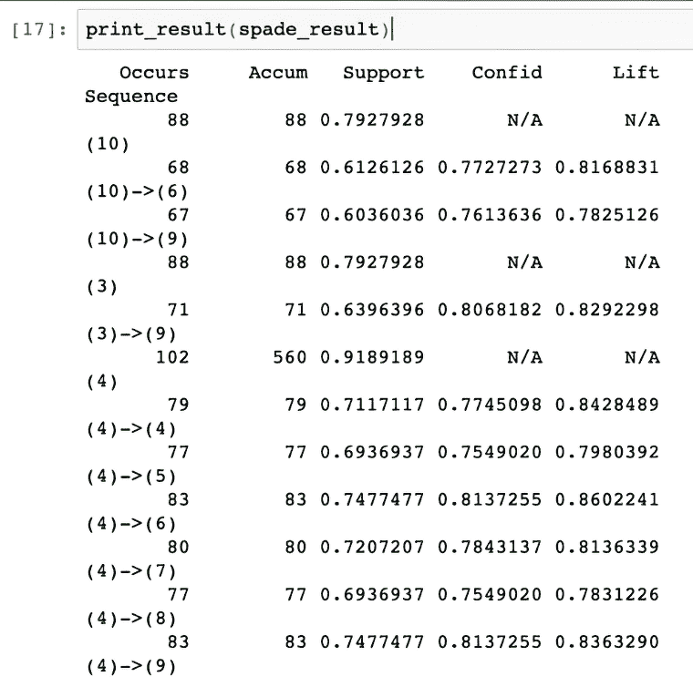

##### 图 4.23 使用 Python 在`pyspade`库上实现的 SPADE

## 4.8 关联规则案例研究

关联规则挖掘是一种非常有帮助且强大的解决方案。接下来，我们将使用关联规则解决一个实际的案例研究。回想一下，在本章开头，我们建议你研究杂货店的模式。商店中这种安排的逻辑是什么？

考虑这种情况：你正在为像沃尔玛、特易购、Spar、玛莎百货等杂货零售商工作，并正在规划一家新店的视觉布局。显然，零售店必须明智地利用店内空间并达到最大容量。同时，确保顾客的流动不受阻碍也是至关重要的。顾客应该能够访问所有展示的商品，并且能够轻松地导航。你可能经历过一些商店，你感觉被展示品堵塞和轰炸，而另一些则堆叠得井井有条。

我们如何解决这个问题？可能有多个解决方案。一些零售商可能希望根据商品类别对商品进行分组。例如，他们可能希望将所有烘焙产品放在一个货架上，或者使用其他条件。我们在这里研究机器学习示例。

使用市场篮子分析，我们可以生成指示各种商品之间相应关系的规则。我们可以预测哪些商品经常一起购买，并将它们一起放在商店里。例如，如果我们知道牛奶和面包经常一起购买，那么面包就可以放在牛奶柜台附近。购买牛奶的顾客可以轻松找到面包并继续购物。

但这并不像听起来那么简单。让我们一步一步解决这个问题：

1.  *业务问题定义*—第一步是定义业务问题，这对我们来说很清楚。我们希望发现各种商品之间的关系，以便改善商店的布局。在这里，*商品陈列图*就出现了。商品陈列图帮助零售商明智地规划商店空间的利用，以便顾客也能轻松地导航和获取产品。它可以被视为商店的视觉布局。一个例子在图 4.24 中展示。

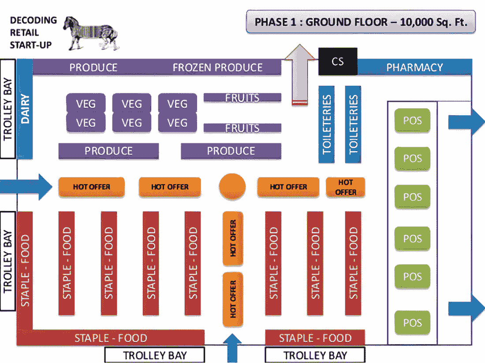

##### 图 4.24 商品陈列图示例。商品陈列图对视觉营销非常有用。

在图中，我们可以看到每个商品类别都有特定的区域。关联规则非常有洞察力，有助于为商品陈列图提供方向。

1.  2. *数据发现*—下一步是数据发现，其中历史交易被搜索并加载到数据库中。通常，一笔交易可以看起来像表 4.20。请注意，将这种数据格式转换为关联规则算法可以消费的格式是一项相当大的挑战。

##### 表 4.20 实际零售店生成的发票示例

| 发票号码 | 日期 | 商品 | 金额 |
| --- | --- | --- | --- |
| 1001  | 01-Jun-21  | 牛奶、鸡蛋、奶酪、面包  | $10  |
| 1002  | 01-Jun-21  | 面包、香蕉、苹果、黄油  | $15  |
| 1003  | 01-Jun-21  | 黄油、胡萝卜、奶酪、鸡蛋、面包、牛奶、香蕉  | $19  |
| 1004  | 01-Jun-21  | 牛奶  | $1  |
| 1005  | 01-Jun-21  | 面包  | $0.80  |

1.  3. *数据准备*—这一步可能是最困难的步骤。正如我们所见，关联规则模型的创建是一个非常简单的任务。我们有库可以为我们完成繁重的工作。但它们期望的数据集具有特定的格式。这是一项繁琐的任务；它相当耗时，需要大量的数据预处理技能。

在准备数据集时，你应该注意以下几点：

+   +   有时在数据准备阶段我们会得到 NULL 或空白值。数据集中的缺失值在计算时可能会导致问题。在其他机器学习解决方案中，我们建议处理缺失值。在关联规则的情况下，我们建议忽略相应的交易，并在最终数据集中不考虑它们。

    +   许多时候，我们在数据中会得到垃圾值。数据集中发现了像!@%^&*()_ 这样的特殊字符。这可以归因于系统中的错误输入。因此，需要数据清洗。我们在第十一章详细介绍了数据预处理步骤，其中我们处理 NULL 值和垃圾值。

    +   将表格转换为可以被关联规则学习算法理解和消费的格式是一个必要但艰巨的步骤。通过了解 SQL 透视的概念来更好地理解这一概念。

1.  4. *模型准备*—也许这是所有步骤中最简单的。我们已经为不同的算法解决了 Python 解决方案，所以你应该对此相当熟悉。

1.  5. *模型解释*—创建模型可能很简单，但规则的解释并不容易。有时，你会遇到像#NA -> (Milk, Cheese)这样的规则。这样的规则显然是不可用的，也没有任何意义。它表明数据准备不正确，数据集中仍然存在一些垃圾值。另一个例子是(Some items) -> (Packaging material)；这可能是最明显的规则，但同样不可用。这个规则表明，每次购物时，包装材料也会被购买。这不是很明显吗？最后一个例子是(Potatoes, Tomatoes) -> (Onions)。这种规则看起来可能是正确的，但常识告诉我们，零售商已经知道这一点。显然，大多数购买蔬菜的顾客都会一起购买土豆、番茄和洋葱。这样的规则可能不会给业务带来太多价值。

支持度、置信度、提升和确信度的阈值使我们能够过滤出最重要的规则。我们可以按提升的降序对规则进行排序，然后移除最明显的规则。

在每个步骤中都让业务利益相关者和领域专家参与至关重要。在本案例研究中，运营团队、视觉营销团队、产品团队和营销团队是关键参与者，每个步骤都应紧密协调。

1.  6. *改进商品陈列图*—一旦生成了并接受了规则，我们就可以使用它们来改进零售空间的商品陈列图。零售商可以使用这些规则来改善营销策略和提升产品促销。例如，如果接受了一个像(A, B) -> (C)这样的规则，零售商可能希望创建一个产品组合并将其作为一个单一实体出售。这将增加同一交易中购买的平均商品数量。

这个案例研究可以扩展到任何其他领域或业务功能。例如，如果我们希望检查用户在网页间的移动，可以使用相同的步骤。网站开发者可以分析客户在其网站上的历史点击和使用情况。通过识别模式，他们可以找出用户倾向于点击哪些内容，以及哪些功能将最大化他们的参与度。医疗从业者可以使用关联规则来更好地诊断患者。医生可以比较症状与其他症状之间的概率，并提供更准确的诊断。

## 4.9 结论性思考

我们研究的关联规则和序列规则中存在一些假设和限制：

+   在生成规则时，我们忽略了项目的相对重要性。例如，如果客户在一次交易中购买了五罐牛奶和 1 公斤的苹果，这被处理得与购买一罐牛奶和 5 公斤苹果的发票类似。因此，我们应该记住，项目的相对*权重*没有被考虑。

+   项目的成本表明了产品的感知价值。一些昂贵的商品更重要，因此，如果客户购买这些商品，可以产生更多的收入。在分析发票时，我们忽略了与项目相关的成本。

+   在分析序列时，我们没有考虑两次交易之间的相应时间段。例如，如果在 T1 和 T2 之间有 10 天，而在 T2 和 T3 之间有 40 天，这两者都被视为相同。

+   在所有分析中，我们都将不同的类别视为相同。易腐物品和非易腐物品被以类似的方式处理。例如，保质期为两到三天的鲜奶与保质期较长的洗衣粉被同样对待。

+   许多时候，我们在分析后收到不有趣的规则。这些结果来自常识（土豆，番茄）->（洋葱）。这样的规则用处不大。我们经常面临这样的问题。

+   虽然不有趣的规则是一个挑战，但发现的大量规则又是问题之一。我们得到数百条规则，理解和分析每一条都变得困难。在这里，阈值变得很有用。

+   计算的时间和内存需求巨大。算法需要多次扫描数据集，因此这是一项相当费时的练习。

+   生成的规则依赖于用于分析的数据库。例如，如果我们只分析夏季生成的数据库，我们无法使用冬季的规则，因为消费者在不同天气条件下的偏好会发生变化。此外，我们应该随着时间的推移刷新算法，因为随着时间的推移，宏观经济和微观经济因素会发生变化，因此算法也应该刷新。

还有一些其他算法也非常有趣。对于关联规则，我们可以有多关系关联规则、k-最优模式发现、近似频繁数据集、广义关联规则、高阶模式发现等。对于序列挖掘，我们有广义序列模式、FreeSpan、PrefixSpan、挖掘关联模式等。这些算法非常有趣，可以用于知识增强。

关联规则和序列挖掘是非常有趣的话题。各个商业领域和功能越来越多地使用关联规则来理解事件模式。这些洞察力使团队能够做出明智和科学的决策，以改善客户体验和整体参与度。在本章中，我们探讨了关联规则和序列挖掘。这些研究使用了 Apriori、F-P 和 ECLAT 算法，而对于序列挖掘，我们使用了 SPADE。

## 4.10 实际下一步行动和建议阅读

以下提供了一些下一步行动的建议和一些有用的阅读材料：

+   阅读以下关于关联规则算法的研究论文：

    +   快速发现关联规则：[`mng.bz/eyqv`](https://mng.bz/eyqv)

    +   快速挖掘关联规则的算法：[`mng.bz/64GZ`](https://mng.bz/64GZ)

    +   模式和关联规则挖掘方法的效率分析：[`arxiv.org/pdf/1402.2892.pdf`](https://arxiv.org/pdf/1402.2892.pdf)

    +   关于关联规则挖掘技术的隐私保护能力的综述：[`mng.bz/0Q0N`](https://mng.bz/0Q0N)

+   对于序列挖掘，阅读以下研究论文：

    +   SPADE：挖掘频繁序列的高效算法：[`mng.bz/9YG7`](https://mng.bz/9YG7)

    +   序列挖掘：模式和算法分析：[`arxiv.org/pdf/1311.0350.pdf`](https://arxiv.org/pdf/1311.0350.pdf)

    +   基于兴趣度的序列挖掘算法：[`ieeexplore.ieee.org/document/8567170`](https://ieeexplore.ieee.org/document/8567170)

    +   解决序列模式挖掘问题的新方法：[`mng.bz/jpxr`](https://mng.bz/jpxr)

## 摘要

+   关联规则学习识别数据集中变量之间的关系，例如啤酒和尿布的例子。

+   通过数据分析，这些关联可以告知营销策略、超市中的产品摆放和定价。

+   零售业中的购物篮分析使用关联规则来发现购买模式，并适用于其他行业，如生物信息学。

+   关联规则由导致后果的前件组成，表示为 P -> Q，它们之间没有共同元素。

+   规则的重要性取决于支持度（频率）、置信度（准确性）、提升度（依赖度测量）和确信度。

+   高支持度、置信度、提升度和确信度表明规则更强、更有用。

+   Apriori 算法使用“自下而上”的方法生成关联规则的项集，但在处理大数据集时面临挑战。

+   ECLAT 算法使用深度优先搜索以实现频繁项集的快速、内存高效的计算。

+   F-P 增长算法通过使用频繁模式树来消除候选生成，在 Apriori 算法的基础上进行了改进。

+   序列规则挖掘有助于解释用户随时间的行为，与时间序列分析不同。

+   SPADE 算法分析事件序列和随时间变化的依赖关系，以进行序列规则挖掘。

+   使用适当的库可以实现 Apriori、ECLAT、F-P 增长和 SPADE 算法的 Python 实现。

+   对于支持度、置信度和提升度的评估指标和阈值设置对于高效规则生成至关重要。

+   序列规则挖掘在市场营销、生物信息学和用户交互分析中具有应用，允许获得可操作的见解。
