# 第五章：聚类

### 本章涵盖

+   谱聚类

+   模糊聚类

+   高斯混合模型聚类

> 从复杂中寻找简单。——爱因斯坦

有时生活非常简单，有时我们却会经历相当复杂的情况。我们可以在这两种情况下航行，并根据需要改变我们的方法。

在第一部分，我们介绍了基础知识，为您的旅程做准备。我们现在处于第二部分，它比第一部分稍微复杂一些。第三部分将比前两部分更高级。因此，请仔细关注即将到来的章节，因为在这里获得的技能和知识将为本书后面的章节做好准备。

在开始本章之前，我们应该回顾一下我们在第二章中学到的内容。在本书的第一部分，我们研究了聚类算法。在第二章中，我们了解到聚类是一种无监督学习技术，我们希望通过在数据集中发现有趣的模式来对数据点进行分组。我们探讨了聚类解决方案的含义以及不同类别的聚类算法，并查看了一个案例研究。在那个章节中，我们深入探讨了 k-means 聚类、层次聚类和 DBSCAN 聚类。我们了解了每个算法的数学背景、过程和 Python 实现，以及每个算法的优缺点。

您可能会遇到不符合简单形状和形式的数据库。此外，在做出选择最终要实现的算法之前，我们必须找到最佳匹配。在这种情况下，我们可能需要更复杂的聚类算法的帮助——这正是本章的主题。在本章中，我们将再次研究三种这样的复杂聚类算法：谱聚类、模糊聚类和高斯混合模型（GMM）聚类。像往常一样，Python 实现将遵循数学和理论概念。本章在数学概念上稍微有些繁重。不需要成为高级数学学生，但有时理解算法在背后的工作方式是很重要的。同时，您可能会惊讶地发现，这些算法的 Python 实现并不繁琐。本章没有案例研究。

欢迎来到第五章，祝您一切顺利！

## 5.1 技术工具箱

我们将继续使用迄今为止我们所使用的相同版本的 Python 和 Jupyter Notebook。本章中使用的代码和数据集已在 GitHub 上检查过（[`mng.bz/6epo`](https://mng.bz/6epo)）。

我们将使用迄今为止我们已经使用的常规 Python 库：`numpy`、`pandas`、`sklearn`、`seaborn`、`matplotlib`等。在本章中，您还需要安装两个其他的 Python 库：`skfuzzy`和`network`。使用这些库，我们可以非常快速地实现算法。否则，编写这些算法是一项相当耗时且费力的任务。

让我们从对聚类的回顾开始吧！

## 5.2 聚类：简要回顾

从第二章回顾，聚类用于将相似的对象或数据点分组。这是一种无监督学习技术，我们的目的是在数据中找到自然的分组，如图 5.1 所示。

在这里，我们可以观察到左侧是未分组的数据，而右侧数据点已经被分组到逻辑组中。我们还可以观察到有两种方法可以进行分组或聚类，并且两者都会产生不同的簇。作为一项技术，聚类在商业解决方案中得到了广泛的应用，如客户细分、市场细分等。

我们在第二章学习了 k-means、层次聚类和 DBSCAN 聚类。我们还介绍了各种距离测量技术以及衡量聚类算法性能的指标。建议您重新回顾这些概念。

在本章中，我们专注于高级聚类方法。下一节我们将从谱聚类开始。


##### 图 5.1 对象结果聚类成自然分组

## 5.3 谱聚类

谱聚类是一种独特的聚类算法，该领域已经进行了大量的研究。尊敬的研究者包括杨安德鲁教授、迈克尔·乔丹教授、亚伊尔·维斯教授、石建波教授和吉滕德拉·马利克教授等。我们在本章末尾提供了他们一些论文的链接。

谱聚类在聚类数据点时考虑的是亲和力而非数据点的绝对位置。当我们考虑点的绝对位置时，相似性仅仅是基于点之间的距离，而亲和力考虑的是点之间的相似性。如果点之间的亲和力为 0，则它们是不相似的，而如果亲和力为 1，则它们是非常相似的。因此，无论数据处于何种复杂形状（即数据点之间存在某种特殊关系），谱聚类都是解决方案。我们在图 5.2 中展示了几个谱聚类可以提供逻辑解决方案的示例。


##### 图 5.2 谱聚类可以聚类的各种复杂数据形状示例

对于图 5.2，我们也可以使用其他算法，如 k-means 聚类。但它们可能无法公正地处理这样复杂的数据形状。您可以从图 5.2 中看到，各种数据点遵循某种模式。像 k-means 聚类这样的算法利用数据点的紧凑性，并由各个簇的中心点驱动。换句话说，点之间的接近性和对簇中心的紧凑性驱动了 k-means 聚类。另一方面，在谱聚类中，*连通性*是驱动逻辑。在连通性中，数据点要么彼此立即接近，要么以某种方式连接。图 5.2 中展示了基于连通性的聚类的一些示例。内圈中的点属于一个簇，而外圈中的点属于另一个簇。

现在看看图 5.3 中的第一个图，其中数据点呈环形模式。可能有遵循这种环形模式的数据点。我们需要聚类这些数据，这确实是一个复杂的模式。想象一下，通过使用聚类方法，方框内的圆圈被纳入同一个簇，如图 5.3 中间的图所示。毕竟，它们彼此接近。但如果我们仔细观察，点呈圆形和某种模式，因此实际的簇应该如图 5.3 最右边的图所示。


##### 图 5.3 我们可以对需要聚类的数据点进行复杂表示。观察左边的环形形状。一种解释可以是，方框内的点基于距离应该是同一个簇的一部分，但显然它们不是同一个簇的一部分（中间）。这里有两个圆圈。内圈中的点属于一个簇，而外圈中的点属于另一个簇（右边）。

图 5.3 所示的示例展示了谱聚类相对于 k-means 聚类的优势。在第二幅图中，红色点（印刷书中方框内的点）将被错误地聚类到不同的簇中，而在第三幅图中显示了正确的聚类。谱聚类可能会将内圈的数据分组到单独的簇中。

如我们之前所述，谱聚类利用了连通性方法。在谱聚类中，在图中识别出相邻的数据点。这些数据点有时被称为*节点*。然后，这些数据点或节点被映射到低维空间。低维空间是指具有较少输入特征的空间。在这个过程中，谱聚类使用从数据集中派生的特征值、亲和矩阵、拉普拉斯矩阵和度矩阵。然后，低维空间可以被分割成簇。

注意：谱聚类利用连接方法进行聚类。它依赖于图论，其中我们根据连接它们的边来识别节点簇。

我们将详细研究这个过程。但首先，有一些重要的数学概念构成了谱聚类的基础，我们将现在介绍这些概念。

### 5.3.1 谱聚类的构建块

我们知道，聚类的目标是把相似的数据点分组到一个簇中，把不相似的数据点分组到另一个簇中。一个重要的数学概念是相似性图，它是数据点的表示。

#### 相似性图

图形是表示数据点的直观方法之一。图 5.4 中的第一个图表展示了一个图形的例子，它仅仅是表示数据点的边之间的连接。如果两个数据点之间的相似性为正或者超过某个阈值，这两个数据点就是相连的，这在第二个图表中有展示。我们不仅可以使用相似性的绝对值，还可以使用权重。因此，在图 5.4 的第二个图表中，由于点 1 和点 2 比点 1 和点 3 更相似，点 1 和点 2 之间的连接权重比点 1 和点 3 之间的连接权重更高。

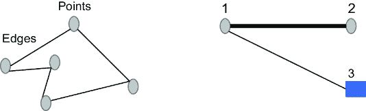

##### 图 5.4 图形是数据点的简单表示。如果点或节点非常相似，它们将通过边连接（左）。如果数据点之间的相似性高，权重就高；对于不相似的数据点，权重就低（右）。

因此，我们可以这样说，使用相似性图，我们希望将数据点聚类，使得数据点的边具有

+   较高的权重值因此彼此相似，并且因此属于同一个簇

+   较低的权重值，因此彼此不相似，并且因此属于不同的簇

除了相似性图之外，我们还应该了解特征值和特征向量的概念，这些我们在上一章中已经详细介绍了。如果你需要的话，建议你复习一下。

#### 邻接矩阵

仔细观察图 5.5。我们可以看到从 1 到 5 的这些不同点都是相连的。我们用矩阵来表示这种连接。这个矩阵被称为**邻接矩阵**。在邻接矩阵中，行和列分别是相应的节点。矩阵内的值代表连接：如果值是 0，这意味着没有连接，如果值是 1，这意味着有连接。


##### 图 5.5 邻接矩阵表示了各个节点之间的连接。节点 1 和节点 5 之间存在连接；因此，对应的值是 1。节点 1 和节点 4 之间没有连接；因此，相应的值是 0。

因此，对于邻接矩阵，我们只关心两个数据点之间是否有连接。按照我们定义边的方式（作为非定向的），矩阵总是对称的。这是因为如果从 1 到 2 有连接，那么从 2 到 1 也必须有连接，如果没有 3 和 1 之间的连接，那么 1 和 3 之间也没有连接。如果我们扩展邻接矩阵的概念，我们得到度矩阵，这是我们接下来要讨论的主题。

#### 度矩阵

度矩阵是一个对角矩阵，其中对角线上的节点度数是与之相连的边的数量。如果我们使用之前相同的例子，我们得到图 5.6 所示的度矩阵。节点 3 和 5 各有三个连接，所以它们在对角线上的值是 3；其他节点每个只有两个连接，所以它们在对角线上的值是 2。


##### 图 5.6 虽然邻接矩阵表示了各个节点之间的连接，但度矩阵是表示每个节点连接数的。它显示在矩阵的对角线上。例如，节点 5 有三个连接，因此在邻接矩阵中的值是 3，而节点 1 只有两个连接，所以它的值是 2。

你可能会想：我们为什么要使用这些矩阵呢？矩阵提供了数据的一种优雅的表示形式，并且可以清楚地描绘两点之间的关系。此外，计算机更容易处理矩阵表示，而不是其他操作图的方法。

现在我们已经涵盖了邻接矩阵和度矩阵，我们可以转向拉普拉斯矩阵。

#### 拉普拉斯矩阵

拉普拉斯矩阵有许多变体，但如果我们采用最简单的形式，它不过是邻接矩阵从度矩阵中减去——换句话说，L = D – A。我们可以像图 5.7 中所示的那样演示它。

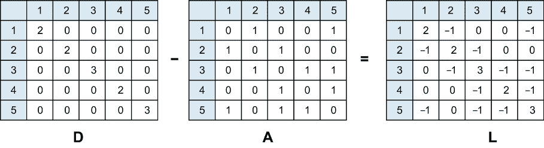

##### 图 5.7 拉普拉斯矩阵非常容易理解。要得到拉普拉斯矩阵，我们可以简单地从度矩阵中减去邻接矩阵，如图例所示。在这里，D 代表度矩阵，A 是邻接矩阵，L 是拉普拉斯矩阵。

拉普拉斯矩阵是一个重要的概念，我们利用 L 的特征值来发展谱聚类。一旦我们得到了特征值和特征向量，我们还可以定义另外两个值：谱间隙和 Fielder 值。第一个非零特征值是**谱间隙**，它定义了图的密度。**Fielder 值**是第二个特征值；它提供了将图分割成两个部分所需的最小割的近似。与 Fielder 值对应的向量被称为**Fielder 向量**。

注意：Fielder 向量既有负分量也有正分量，它们的代数和为零。

在我们详细研究下一节中光谱聚类的过程时，我们将使用这个概念。在继续到光谱聚类的过程之前，我们再介绍一个概念——亲和矩阵。

#### 亲和矩阵

在邻接矩阵中，如果我们用权重的相似度代替连接的数量，我们将得到亲和矩阵。如果点完全不相似，亲和度将为 0；如果它们完全相似，亲和度将为 1。矩阵中的值表示数据点之间相似度的不同级别。

##### 练习 5.1

回答这些问题以检查你的理解：

1.  度矩阵是通过计算连接的数量来创建的。对还是错？

1.  拉普拉斯矩阵是度矩阵和邻接矩阵除法的转置。对还是错？

1.  在纸上画一个图，然后推导出其邻接矩阵和度矩阵。

### 5.3.2 光谱聚类过程

现在我们已经涵盖了光谱聚类的所有构建块。从高层次来看，各个步骤可以总结如下：

1.  我们获取数据集并计算其度矩阵和邻接矩阵。

1.  使用它们，我们计算拉普拉斯矩阵。

1.  然后，我们计算拉普拉斯矩阵的前 k 个特征向量。k 个特征向量对应于 k 个最小的特征值。

1.  形成的矩阵用于在 k 维空间中对数据点进行聚类。

注意：关于特征值、亲和矩阵和拉普拉斯矩阵的更多清晰信息，请参阅附录。

我们通过一个示例来介绍光谱聚类的过程，如图 5.8 所示。这些步骤在现实世界的实现中通常不会执行，因为我们有包和库来实现这些功能，但在这里介绍它们是为了让你了解算法是如何从头开始开发的，以及它是如何工作的，以便你更好地理解如何有效地利用它。对于 Python 解决方案，我们将仅使用库和包。虽然从头开始开发实现是可能的，但重新发明轮子并不节省时间。

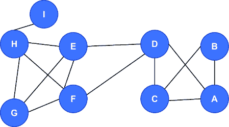

##### 图 5.8 考虑图 5.8 所示的示例，其中我们有一些数据点，并且它们是连接的。我们将对此数据进行光谱聚类。

当我们希望对此数据进行光谱聚类时，我们将遵循以下步骤：

1.  创建邻接矩阵和度矩阵。我们将把这个步骤留给你。

1.  创建拉普拉斯矩阵（见图 5.9）。

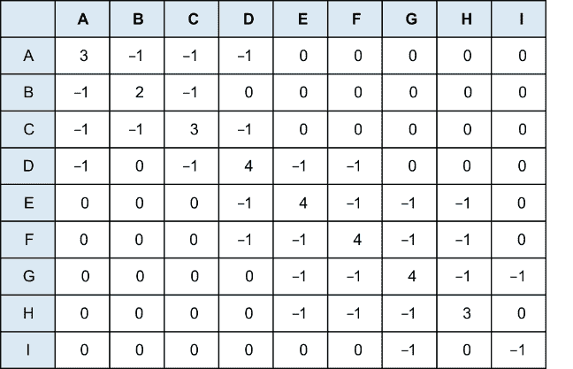

##### 图 5.9 数据的拉普拉斯矩阵。建议你创建度矩阵和邻接矩阵，并检查输出。

1.  3. 创建 Fielder 向量，如图 5.10 所示，用于前面的拉普拉斯矩阵。我们创建 Fielder 向量，如拉普拉斯矩阵部分所述。观察矩阵的总和为零。

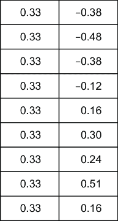

##### 图 5.10 Fielder 向量是拉普拉斯矩阵的输出。

1.  4. 我们可以看到有一些正值和一些负值。基于这些正值或负值，我们可以创建两个不同的簇。图 5.11 展示了谱聚类的过程。


##### 图 5.11 识别出两个簇。这是一个非常简单的例子，用于说明谱聚类的过程。

谱聚类在图像分割、语音分析、文本分析、实体解析等方面非常有用。这种方法不对数据的形状做出任何假设。像 k-means 这样的方法假设点围绕簇的中心呈球形分布，而谱聚类中并没有这样的强假设。

另一个显著的不同之处在于，与那些以紧凑性驱动聚类的其他方法相比，在谱聚类中，数据点不需要有凸边界。由于需要计算各种矩阵及其特征值、拉普拉斯矩阵等，谱聚类有时会较慢。对于大数据集，复杂性增加，因此谱聚类可能会变慢，但当我们拥有稀疏数据集时，它是一种快速的方法。

谱聚类需要构建一个矩阵，其大小理论上等于数据集中元素数量的平方，因为每个元素都有一个列和一个行。例如，一个包含几百万个元素的中等数据集将需要一个包含数万亿元素的矩阵！直接存储这样一个矩阵需要数 TB 的 RAM，这是非常强大且昂贵的服务器所能做到的边缘。有一些技术可以减轻内存需求（例如，不单独存储每个元素），但它们使得与矩阵的工作变得更加复杂。此外，找到这样一个大矩阵的特征值甚至一个特征向量都是非常耗时的。因此，对于小数据集，谱聚类是一种可行的解决方案。

我们现在将进入对谱聚类算法的 Python 解决方案。

## 5.4 谱聚类的 Python 实现

我们已经涵盖了谱聚类的细节——现在是时候进入代码部分了。为此，我们将创建一个人工数据集，运行 k-means 算法和谱聚类来比较结果。步骤如下：

1.  导入所有必要的库。这些库是标准的，除了我们将要介绍的一些。`sklearn`是最著名和最受欢迎的库之一，我们从`sklearn`中导入`SpectralClustering`、`make_blobs`和`make_circles`：

```py
from sklearn.cluster import SpectralClustering
from sklearn.datasets import make_blobs
import matplotlib.pyplot as plt
from sklearn.datasets import make_circles
from numpy import random
import numpy as np
from sklearn.cluster import SpectralClustering, KMeans
from sklearn.metrics import pairwise_distances
from matplotlib import pyplot as plt
import networkx as nx
import seaborn as sns
```

1.  2. 整理数据集。我们将使用`make_circles`方法。在这里，我们取 2000 个样本并将它们表示为一个圆圈。输出如下（见图 5.12）：

```py
data, clusters = make_circles(n_samples=2000, noise=.01, factor=.3, random_state=5)
plt.scatter(data[:,0], data[:,1]) 
```

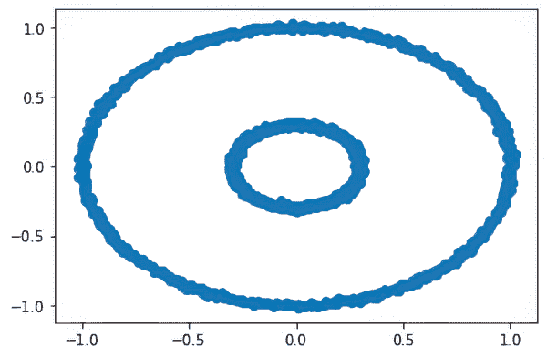

##### 图 5.12 使用`make_circles`方法整理数据集

1.  3. 使用 k-means 聚类测试这个数据集。两种颜色表示两个不同的簇，它们相互重叠。本书的打印版不会显示颜色，但 Python 代码的输出会显示。相同的输出可以在 GitHub 仓库中找到（见图 5.13）：

```py
kmeans = KMeans(init='k-means++', n_clusters=2)
km_clustering = kmeans.fit(data)
plt.scatter(data[:,0], data[:,1], c=km_clustering.labels_, cmap='prism',
alpha=0.5, edgecolors='g')
```


##### 图 5.13 使用 k-means 聚类测试数据集

1.  4. 使用谱聚类运行相同的数据。我们发现这里（见图 5.14）两个簇被分别处理：

```py
spectral = SpectralClustering(n_clusters=2, affinity='nearest_neighbors', random_state=5)
sc_clustering = spectral.fit(data)
plt.scatter(data[:,0], data[:,1], c=sc_clustering.labels_, cmap='prism', alpha=0.5, edgecolors='g')
```

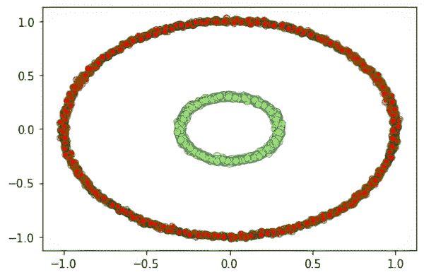

##### 图 5.14 在使用谱聚类时，两个簇被分别处理。

我们可以观察到，两个算法以不同的方式处理相同的数据集。谱聚类在处理数据集方面更有优势，因为分离的圆被单独表示。

1.  5. 通过改变数据集中的值并运行算法来模拟各种情况。观察不同的输出以进行比较。

## 5.5 模糊聚类

到目前为止，我们已经介绍了很多聚类算法。你是否想知道为什么数据点应该只属于一个簇？为什么数据点不能属于多个簇？看看图 5.15：右侧图像中的红色点（打印版本中用 x 表示）可以属于多个簇。


##### 图 5.15 左侧的图表示所有数据点。红色点（打印版本中带有 x 的点）可以属于多个簇。实际上，我们可以为每个点分配多个簇。可以为点分配一个概率分数，以表示它属于特定的簇。

我们知道，聚类是根据相似性将项目分组到凝聚性组中的。相似的项目在一个簇中，而不相似的项目在不同的簇中。聚类的想法是确保同一簇中的项目相似。当项目只能属于一个簇时，这被称为*硬聚类*。K-means 聚类是硬聚类的经典例子。但如果我们回顾图 5.15，我们可以观察到项目可以属于多个簇。这被称为*软聚类*。

注意：创建模糊边界比创建硬簇在计算上更便宜。

在模糊聚类中，一个项目可以被分配到多个簇中。与位于簇边缘的点相比，靠近簇中心的点将对该簇有更强的归属感。这被称为*隶属度*。它使用最小二乘算法来找到项目最理想的位置。我们从最小二乘算法中得出的理想位置将是两个或多个簇之间的概率空间。我们将在稍后详细探讨这个概念。

### 5.5.1 模糊聚类的类型

模糊聚类可以进一步分为经典模糊算法和基于形状的模糊算法。见图 5.16。

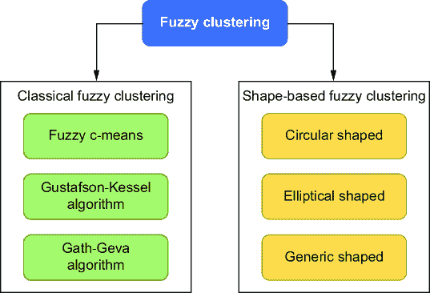

##### 图 5.16 模糊算法可以分为经典模糊算法和基于形状的模糊算法。

我们将在下一节详细介绍模糊 c-均值（FCM）算法，但首先我们将简要回顾其他算法：

+   Gustafson-Kessel 算法，有时称为 GK 算法，通过将一个项目与一个簇和一个矩阵关联起来来工作。GK 导致椭圆形簇，为了根据数据集中的不同结构进行修改，GK 使用协方差矩阵。它允许算法捕捉簇的椭圆形特性。GK 可以导致更窄的簇，并且当项目数量更多时，这些区域可以更薄。

+   Gath-Geva 算法不是基于目标函数的。簇可以形成任何形状，因为它是对统计估计量的模糊化。

+   基于形状的聚类算法根据其名称是自解释的。一个圆形模糊聚类算法将导致圆形簇，依此类推。

FCM 算法是最受欢迎的模糊聚类算法。它最初由 J.C. Dunn 在 1973 年开发，并且已经多次改进。它与 k-means 聚类非常相似。

参考图 5.17。在图的第一个部分（左侧），我们有某些项目或数据点。这些数据点可以是聚类数据集的一部分，如客户交易等。在图的第二部分（中间），我们为这些数据点创建一个簇。在创建这个簇的同时，为每个数据点分配隶属度等级。这些隶属度等级表明数据点属于簇的程度或水平。我们将很快检查计算这些值的数学函数。

TIP  不要被度数和概率弄混淆。如果我们把这些度数加起来，我们可能不会得到 1，因为这些值对于所有项目都是归一化的，介于 0 和 1 之间。

在图的三部分（右侧）中，我们可以看到点 1 更接近簇中心，因此比点 2 更有可能属于簇，点 2 更接近簇的边界或边缘。

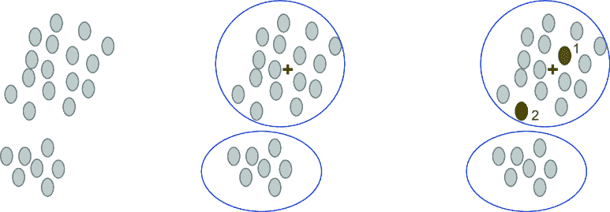

##### 图 5.17 可聚类的数据点（左侧）。数据点可以分成两个簇。对于第一个簇，簇中心用加号表示（中间）。与点 2 相比，点 1 更接近簇中心。因此，我们可以得出结论，点 1 比簇 2 更有可能属于这个簇。

我们现在将深入探讨算法的技术细节。这可能会变得有点数学化。

考虑我们有一组 *n* 个项目（方程式 5.1）：

##### （5.1）

*x* = {*x*[1], *x*[2], *x*[3], *x*[4], *x*[5], . . ., *x*[*n*]}

我们将这些项目应用于 FCM 算法。这些 *n* 个项目根据某些标准被聚类成 *c* 个模糊簇。比如说，我们将从算法中得到一个包含 *c* 个簇中心的列表（方程 5.2）：

##### (5.2)

*c* = {*c*[1], *c*[2], *c*[3], *c*[4], *c*[5], . . ., *c*[*c*]}

算法还返回一个划分矩阵，它可以定义为方程 5.3：


##### (5.3)

在这里，*w*[*i*][,][*j*] 中的每个元素是 *X* 中每个元素属于簇 *c*[*j*] 的程度。这就是划分矩阵的目的。

从数学上讲，我们可以根据方程 5.4 得到 *w*[*i*][,][*j*]。方程的证明超出了本书的范围。


##### (5.4)

算法也会为簇生成质心。簇的质心是该簇中所有点的平均值，平均值由它们各自属于该簇的程度加权。如果我们用数学方式表示，我们可以写成方程 5.5 中的样子：


##### (5.5)

在方程 5.4 和 5.5 中，我们有一个非常重要的项：*m*。*m* 是用于控制簇的模糊度的超参数。*m* 的值 ≥ 1，通常可以保持为 2（一个常用的值）。

NOTE：*m* 的值越高，簇的模糊度就越大。

现在我们检查 FCM 算法的逐步过程：

1.  就像在 k-means 聚类中开始一样，选择我们希望在输出中拥有的簇的数量。

1.  将权重随机分配给每个数据点。

1.  算法会迭代直到收敛。回想一下 k-means 算法是如何收敛的，其中我们通过随机分配簇的质心来开始这个过程。然后我们迭代地细化每个簇的质心，直到我们得到收敛。这就是 k-means 算法的工作原理。对于 FCM，我们将利用一个类似的过程，尽管有一些细微的差别。我们添加了一个成员值 *w*[*i*][,][*j*] 和 *m*。

1.  对于 FCM，为了算法收敛，我们根据方程 5.6 计算每个簇的中心：


##### (5.6)

1.  5. 对于每个数据点，我们也计算其属于该特定簇的相应系数。我们将使用方程 5.4。

1.  6. 现在我们应该迭代，直到 FCM 算法收敛。我们希望最小化的成本函数由方程 5.7 给出：


##### (5.7)

一旦这个函数被最小化，我们就可以得出结论，FCM 算法已经收敛。换句话说，我们可以停止这个过程，因为算法已经完成了处理。

现在是对比 k-means 算法的好时机。在 k-means 算法中，我们有一个严格的客观函数，它只允许一个簇成员资格，而对于 FCM 聚类，我们可以根据概率分数得到不同的聚类成员资格。

FCM 对于聚类边界不清晰且严格的商业案例非常有用。考虑生物信息学领域，其中基因可以属于多个基因簇。另一个例子是我们有重叠数据集，如市场营销分析或图像分割领域，我们可能有很多复杂、重叠和令人困惑的数据集。FCM 比 k-means 可以得到更稳健的结果。

我们现在将使用库来求解 FCM 聚类问题的 Python 解决方案。

##### 练习 5.2

回答这些问题以检查你的理解：

1.  模糊聚类使我们能够创建重叠簇。对还是错？

1.  一个数据点只能属于一个簇。对还是错？

1.  如果*m*的值较低，我们得到的簇边界更精确。对还是错？

### 5.5.2 FCM 的 Python 实现

我们已经涵盖了 FCM 的过程。现在我们将按照以下步骤在 Python 中实现 FCM：

1.  导入必要的库：

```py
import skfuzzy as fuzz
import pandas as pd
import numpy as np
import matplotlib.pyplot as plt
import seaborn as sns
%matplotlib inline
```

1.  2. 声明一个调色板，稍后将用于对簇进行着色：

```py
color_pallete = ['r','m','y','c', 'brown', 'orange','m','k', 
'gray','purple','seagreen']
```

1.  3. 定义聚类中心：

```py
cluster_centers = [[1, 1],
           [2, 4],
           [5, 8]]
```

1.  4. 分配权重：

```py
sigmas = [[0.5, 0.6],
          [0.4, 0.5],
          [0.1, 0.6]]
```

1.  5. 设置随机种子，然后遍历聚类中心：

```py
np.random.seed(5)  

xpts = np.zeros(1)
ypts = np.zeros(1)
labels = np.zeros(1)
for i, ((xmu, ymu), (xsigma, ysigma)) in enumerate(zip(cluster_centers, 
sigmas)):
    xpts = np.hstack((xpts, np.random.standard_normal(500) * xsigma + xmu))
    ypts = np.hstack((ypts, np.random.standard_normal(500) * ysigma + ymu))
    labels = np.hstack((labels, np.ones(500) * i))
```

1.  6. 我们首先表示数据点。见图 5.18：

```py
fig0, ax0 = plt.subplots()
for label in range(5):
    ax0.plot(xpts[labels == label], ypts[labels == label], '.')
ax0.set_title('Data set having 500 points.')
plt.show()
```

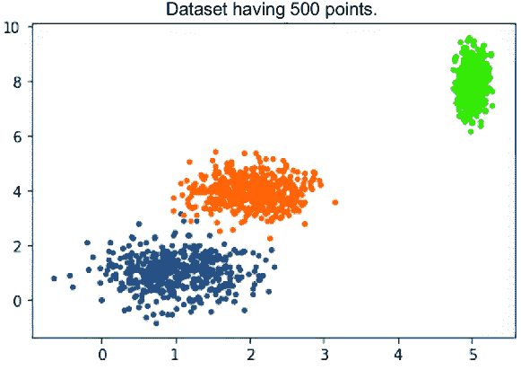

##### 图 5.18 数据点的表示

1.  7. 使用不同的聚类值和 FPC（见图 5.19）迭代不同的输出：

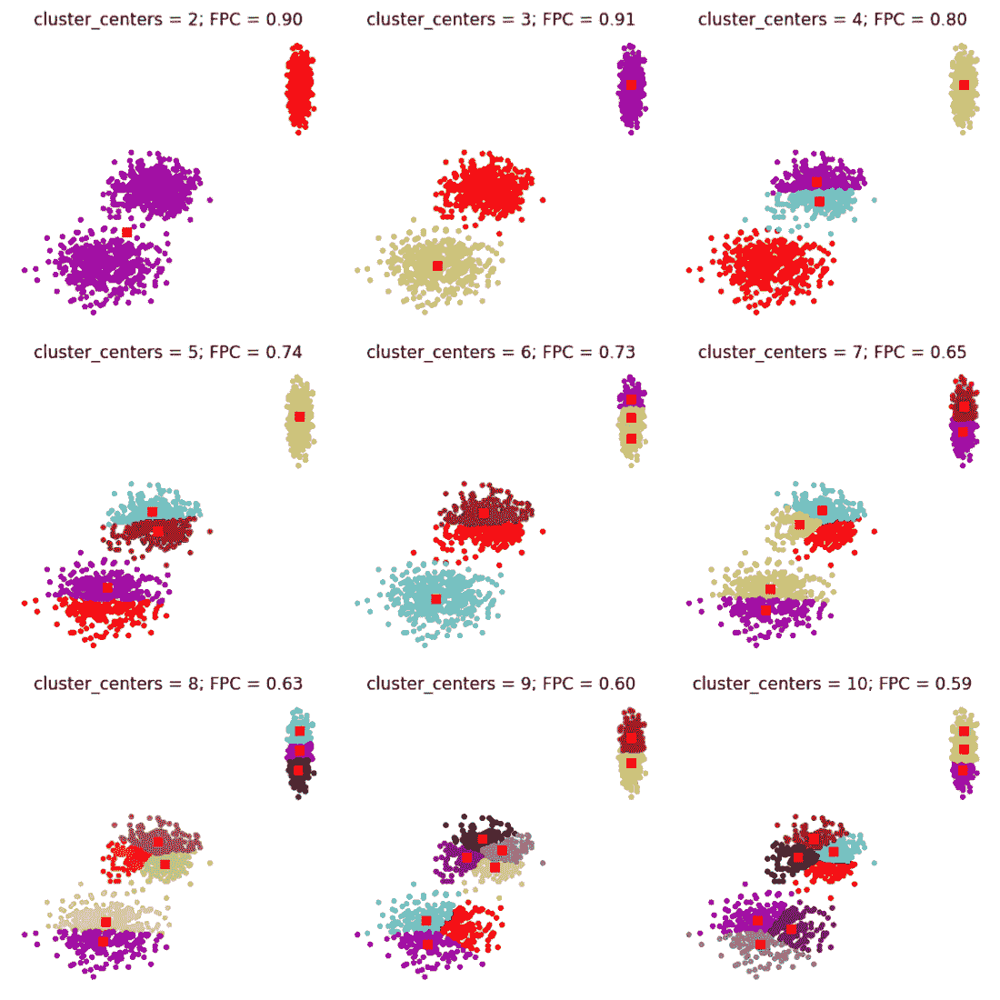

##### 图 5.19 FCM 算法的输出

```py
fig1, axes1 = plt.subplots(3, 3, figsize=(10, 10))
alldata = np.vstack((xpts, ypts))
fpcs = []

for ncenters, ax in enumerate(axes1.reshape(-1), 2):
    cntr, u, u0, d, jm, p, fpc = fuzz.cluster.cmeans(
        alldata, ncenters, 2, error=0.005, maxiter=1000, init=None)

    # Store fpc values for later
    fpcs.append(fpc)

    # Plot assigned clusters, for each data point in training set
    cluster_membership = np.argmax(u, axis=0)
    for j in range(ncenters):
        ax.plot(xpts[cluster_membership == j],
                ypts[cluster_membership == j], '.', color=colors[j])

    # Mark the center of each fuzzy cluster
    for pt in cntr:
        ax.plot(pt[0], pt[1], 'rs')

    ax.set_title('cluster_centers = {0}; FPC = {1:.2f}'.format(ncenters, 
fpc), size=12)
    ax.axis('off')

fig1.tight_layout()
```

观察代码的输出，对于相同的数据集，你可以看到不同位置的中心的不同簇。要欣赏颜色，你必须运行代码。

## 5.6 高斯混合模型

接下来，我们继续讨论软聚类。回想一下，我们在本章开头介绍了 GMM。现在我们将研究这个概念，并查看其 Python 实现。

首先，让我们了解高斯分布，有时也称为正态分布。你可能认识它为钟形曲线；它通常指的是同一件事。

在图 5.20 中，观察均值*μ*为 0 且标准差*σ*²为 1 的分布。这是一个完美的正态分布曲线。比较这里不同曲线的分布。


##### 图 5.20 高斯分布是最著名的分布之一。观察均值和标准差的变化及其对相应曲线的影响。

高斯分布的数学表达式是

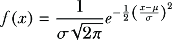


##### (5.8)

该方程也称为概率密度函数。在图 5.20 中，观察*µ*为 0 和*σ*²为 1 的概率分布的形状。这是一个完美的正态分布曲线。比较图 5.20 中不同曲线的分布，通过改变均值和标准分布的值，我们得到不同的图形。

你可能想知道为什么我们在这里使用高斯分布。有一个非常著名的统计定理叫做**中心极限定理**。该定理表明，如果数据的变异性是由大量无关的原因引起的，那么分布可以被近似为高斯曲线。此外，随着收集的数据越来越多，近似变得越来越准确；也就是说，我们收集的数据越多，分布就越接近高斯分布。这种正态分布可以在生活的各个方面以及化学、物理、数学、生物学或任何其他科学分支中观察到。这就是高斯分布的美丽之处。

图 5.20 中所示的是 2D 图。我们也可以有多维高斯分布。在多维高斯分布的情况下，我们将得到如图 5.21 所示的 3D 图。我们的输入是一维的标量。现在，我们的输入不再是标量，而是一个向量；均值也是一个向量，代表数据的中心。因此，均值具有与输入数据相同的维度。方差现在是对角矩阵Σ。这个矩阵不仅告诉我们输入中的方差，还评论了不同变量之间的关系——例如，如果改变*x*的值，*y*的值会如何受到影响。看看图 5.21。我们可以在这里理解*x*和*y*变量之间的关系。

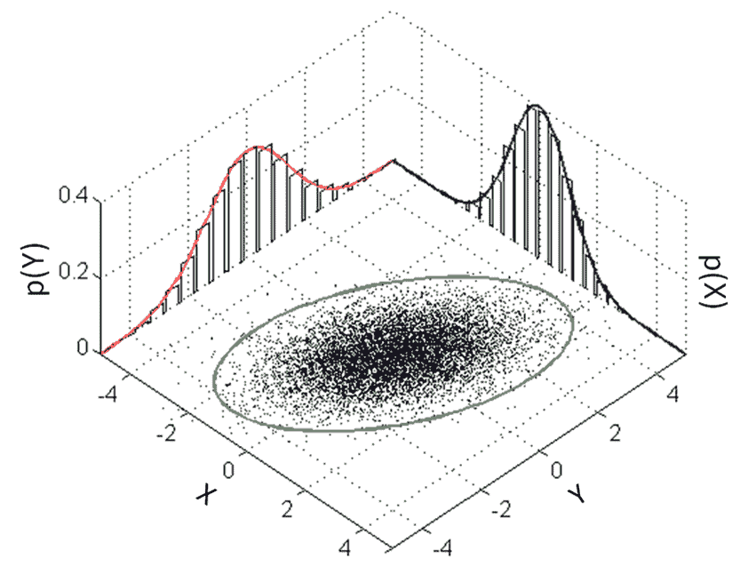

##### 图 5.21 高斯分布的 3D 表示

注意：协方差在这里起着重要的作用。K-means 没有考虑数据集的协方差，这在 GMM 模型中是使用的。

让我们考察 GMM 聚类的过程。想象我们有一个包含*n*个项目的数据集。当我们使用 GMM 聚类时，我们不是使用质心方法来找到簇；相反，我们将一组*k*个高斯分布拟合到当前的数据集中。换句话说，我们有*k*个簇。我们应该确定每个高斯分布的参数，这些参数是簇的均值、方差和权重。一旦确定了每个分布的参数，我们就可以找到每个*n*个项目属于*k*个簇的相应概率。

从数学上讲，我们可以根据方程 5.9 计算概率。该方程用于我们知道一个特定的点*x*是*k*个高斯函数的线性组合。术语*f*[*j*]用于表示高斯函数的强度，可以在第二个方程中看到，这种强度的总和等于 1。

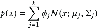


##### (5.9)

对于谱聚类，我们必须确定*f*、∑和*µ*的值。正如你可以想象的那样，获取这些参数的值可能很棘手。这确实是一个稍微复杂的过程，称为期望最大化（EM）技术，我们将在下一节中介绍。本节数学概念较多，是可选的。建议对理解技术深层工作原理感兴趣的读者阅读。

### 5.6.1 EM 技术

EM 是一种确定模型正确参数的统计方法。有许多技术很受欢迎；最大似然估计可能是最著名的。但与此同时，最大似然可能也有一些挑战。数据集可能存在缺失值，或者换句话说，是不完整的。或者，数据集中的某个点可能是由两个不同的高斯分布生成的。因此，很难确定哪个分布生成了该数据点。在这里，EM 可能会有所帮助。

注意：K-means 只使用均值，而 GMM 利用数据的均值和方差。

在过程中生成的变量被称为*潜在变量*。由于我们不知道这些潜在变量的确切值，EM 首先使用当前数据估计它们的最佳值。一旦完成，然后估计模型参数。使用这些模型参数，再次确定潜在变量。然后，使用这些新的潜在变量，推导出新的模型参数。这个过程会一直持续，直到获得一组足够好的潜在值和模型参数，使得数据拟合良好。现在让我们更详细地研究一下。我们将使用与上一节相同的例子。

假设我们有一个包含*n*个项目的数据集。如前所述，当我们使用 GMM 聚类时，我们不是使用质心方法找到簇；相反，我们将一组*k*个高斯分布拟合到当前的数据集中。换句话说，我们有*k*个簇。我们确定每个高斯分布的参数（均值、方差和权重）。比如说，均值是*µ*[1]、*µ*[2]、*µ*[3]、*µ*[4]……*µ*[*k*]，协方差是∑[1]、∑[2]、∑[3]、∑[4]……∑[*k*]。我们还可以有一个额外的参数来表示分布的密度或强度，它可以表示为*f*。

我们从期望，或者说 E 步骤开始。在这个步骤中，每个数据点以概率分配到簇中。因此，对于每个点，我们计算它属于簇的概率；如果这个值很高，那么这个点就在正确的簇中；否则，这个点就在错误的簇中。换句话说，我们计算每个数据点是由每个*k*个高斯分布生成的概率。

注意：由于我们正在计算概率，这些被称为软分配。

概率是使用方程 5.10 中的公式计算的。如果我们仔细观察，分子是概率，然后我们通过分母进行归一化。

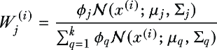

##### (5.10)

在期望步骤中，对于一个数据点 *x*[*i*][,][*j*]，其中 *i* 是行，*j* 是列，我们得到一个矩阵，其中行由数据点表示，列是它们各自的高斯值。

当期望步骤完成后，我们将执行最大化步骤或 M 步骤。在这个步骤中，我们将使用方程 5.7 中的公式更新 *µ*、∑ 和 *f* 的值。回想一下，在 k-means 聚类中，我们只是简单地取数据点的均值然后继续。这里我们做的是类似的事情，尽管我们使用了上一步计算的概率或期望。

这三个值可以使用以下方程计算。方程 5.7 是计算所有点的协方差 ∑[*j*]，然后按照方程 5.11 中所示，由该点由高斯 *j* 生成的概率进行加权。数学证明超出了本书的范围。


##### (5.11)

均值 *µ*[*j*]，由方程 5.12 确定。在这里，我们确定所有点的均值，并按照该点由高斯 *j* 生成的概率进行加权。

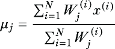

##### (5.12)

同样，密度或强度是通过方程 5.13 计算的，其中我们将每个点由高斯 *j* 生成的所有概率相加，然后除以点的总数 *N*。


##### (5.13)

根据这些值，推导出 ∑、*µ* 和 *f* 的新值，这个过程会一直持续到模型收敛。当我们能够最大化似然函数时停止。

这是一个复杂的过程。我们介绍了它，以便您深入了解统计算法背后的发生情况。Python 实现比数学概念要简单得多。

##### 练习 5.3

回答这些问题来检查你的理解：

1.  高斯分布的均值等于 1，标准差等于 0。对还是错？

1.  GMM 模型不考虑数据的协方差。对还是错？

### 5.6.2 GMM 的 Python 实现

我们首先导入数据，然后使用 k-means 和 GMM 进行比较。我们遵循以下步骤：

1.  导入所有库和数据集：

```py
import pandas as pd
data = pd.read_csv('vehicle.csv')
import matplotlib.pyplot as plt
```

1.  2. 从数据集中删除任何 NA 值：

```py
data = data.dropna()
```

1.  3. 配置一个 `kmeans` 算法。我们将簇的数量保持为 5。请注意，我们并没有说这是簇的理想数量。簇的数量只是为了说明目的。我们声明一个变量 k-means 并使用五个簇。接下来拟合数据集：

```py
from sklearn.cluster import KMeans
kmeans = KMeans(n_clusters=5)
kmeans.fit(data)
```

1.  4. 绘制聚类。首先，对数据集进行预测，然后将值添加到数据框作为一个新列。然后，用不同颜色表示不同聚类的数据绘制。书的打印版不会显示不同的颜色，但 Python 代码的输出会。同样的输出也可以在 GitHub 仓库中找到。

输出如下（见图 5.22）：

```py
pred = kmeans.predict(data)
frame = pd.DataFrame(data)
frame['cluster'] = pred

color=['red','blue','orange', 'brown', 'green']
for k in range(0,5):
    data = frame[frame["cluster"]==k]
    plt.scatter(data["compactness"],data["circularity"],c=color[k])
plt.show()
```

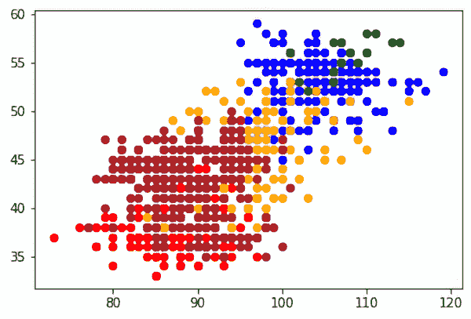

##### 图 5.22 配置`kmeans`算法后绘制聚类的结果

1.  5. 配置一个 GMM 模型。请注意，代码与 k-means 算法相同，只是算法的名称从 k-means 更改为`GaussianMixture`：

```py
from sklearn.mixture import GaussianMixture
gmm = GaussianMixture(n_components=5)
gmm.fit(data)

#predictions from gmm
labels = gmm.predict(data)
frame = pd.DataFrame(data)
frame['cluster'] = labels
```

1.  6. 绘制结果。输出如下（见图 5.23）：

```py
color=['red','blue','orange', 'brown', 'green']
for k in range(0,5):
    data = frame[frame["cluster"]==k]
    plt.scatter(data["compactness"],data["circularity"],c=color[k])
plt.show()
```

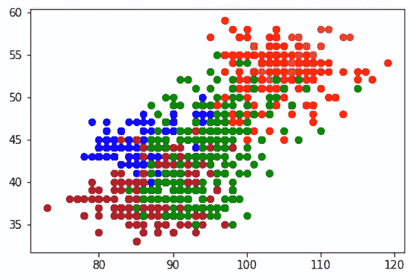

##### 图 5.23 配置 GMM 算法后绘制聚类的结果

1.  7. 使用不同的聚类值运行代码以观察差异。在下面的图中，左边的是具有两个聚类的 k-means，而右边的是具有两个聚类的 GMM。在这两种聚类方法中，有几个点被分类为不同的类别。书的打印版不会显示不同的颜色，但 Python 代码的输出会。同样的输出也可以在 GitHub 仓库中找到（见图 5.24）。

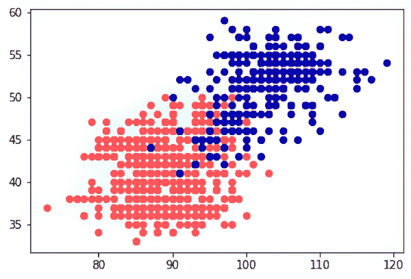

##### 图 5.24 具有两个聚类的 k-means（左）和具有两个聚类的 GMM（右）

高斯分布是使用最广泛的数据分布之一。如果我们比较 k-means 和 GMM 模型，我们会看到 k-means 不考虑数据的正态分布。在 k-means 中，也没有考虑各种数据点之间的关系。

注意：k-means 是一种基于距离的算法；GMM 是一种基于分布的算法。

简而言之，使用 GMM 模型创建聚类是有利的，尤其是在我们拥有重叠数据集时。它对于金融和价格建模、基于自然语言处理解决方案等都是一种有用的技术。

## 5.7 总结思考

在本章中，我们探讨了三种复杂的聚类算法。你可能觉得数学概念有点沉重。确实如此，但它们提供了对过程的更深入理解。这些算法并不一定是每个问题的最佳选择。理想情况下，在现实世界的商业问题中，我们首先从经典的聚类算法（k-means、层次和 DBSCAN）开始。如果我们没有得到可接受的结果，我们可以尝试更复杂的算法。

许多时候，数据科学问题被等同于算法的选择，这其实并不正确。算法确实是整个解决方案的重要组成部分，但并非唯一。在现实世界的数据集中，有很多变量，数据量也相当大。数据中有很多噪声。在选择算法时，我们应该考虑到所有这些因素。算法的维护和更新也是需要考虑的因素。所有这些方面都在本书的最后一章中详细讨论。

## 5.8 实践步骤和推荐阅读

以下提供了一些下一步行动的建议和一些有用的阅读材料：

+   在第二章中，我们使用了各种技术进行聚类。使用那里的数据集，执行谱聚类、GMM 和 FCM 聚类以比较结果。第二章末尾提供的数据集可用于聚类。

+   从 Kaggle 获取聚类用信用卡数据集([`mng.bz/oKwd`](https://mng.bz/oKwd))和之前使用过的著名 Iris 数据集的数据([`www.kaggle.com/uciml/iris`](https://www.kaggle.com/uciml/iris))。

+   参考亨利·赫克斯莫尔的书籍《计算网络科学》来学习数学概念。

+   从以下链接获取谱聚类论文并学习：

    +   关于谱聚类：分析和算法：[`mng.bz/nRwa`](https://mng.bz/nRwa)

    +   基于特征值选择的谱聚类：[`mng.bz/vKw7`](https://mng.bz/vKw7)

    +   谱聚类的数学原理及其与主成分分析的等价性：[`arxiv.org/pdf/2103.00733v1.pdf`](https://arxiv.org/pdf/2103.00733v1.pdf)

+   从以下链接获取 GMM 论文并探索：

    +   “高维面板数据模型的 GMM 估计法”：[`mng.bz/4agw`](https://mng.bz/4agw)

    +   “复合高斯混合模型在数据流中的应用”：[`ieeexplore.ieee.org/document/5620507`](https://ieeexplore.ieee.org/document/5620507)

+   从以下链接获取 FCM 论文并学习：

    +   “FCM：模糊 c 均值聚类算法”：[`mng.bz/QDXG`](https://mng.bz/QDXG)

    +   模糊 c 均值聚类技术综述：[`www.ijedr.org/papers/IJEDR1704186.pdf`](https://www.ijedr.org/papers/IJEDR1704186.pdf)

    +   “模糊 C 均值和可能性 C 均值聚类算法的实现、聚类趋势分析和聚类验证”：[`arxiv.org/pdf/1809.08417.pdf`](https://arxiv.org/pdf/1809.08417.pdf)

## 摘要

+   谱聚类关注聚类中的数据点亲和力而非位置。它适用于复杂的数据形状，而传统的算法如 k-means 可能不足以满足需求。

+   谱聚类利用图理论和连通性，依赖于特征值、拉普拉斯矩阵和亲和矩阵。

+   该过程包括计算度、邻接矩阵、拉普拉斯矩阵和 Fielder 向量以进行聚类。

+   K-means 聚类使用质心，而谱聚类的重点是连通性和数据点相似性。

+   由于矩阵运算，谱聚类可能需要大量的计算资源，因此适用于较小的数据集。

+   模糊聚类允许数据点属于多个簇，为数据项引入了“隶属度”。

+   FCM 是模糊聚类中的一个关键算法，它通过隶属度和通过超参数*m*来控制模糊度。

+   GMM 使用高斯分布进行软聚类，并考虑数据集的协方差。

+   GMM 适用于重叠数据集，并且与 k-means 不同，它考虑数据点之间的关系。

+   在 GMM 中，EM 技术被用于迭代估计参数。

+   GMM 模型在金融建模、自然语言处理以及重叠数据的案例中具有优势。

+   模糊聚类和 GMM 是软聚类方法，允许对数据点进行详细的隶属度和概率分配。

+   谱聚类支持图像分割、语音分析和文本分析等应用，而不需要假设数据形状约束。
