# 6 维度降低

### 本章涵盖

+   t 分布随机邻域嵌入

+   多维尺度

+   均匀流形近似与投影

+   算法的 Python 实现

> 生活其实很简单，但我们却坚持让它变得复杂。——孔子

简单是一种美德——在生活中和在数据科学中。我们迄今为止讨论了很多算法。其中一些足够简单，而一些则稍微复杂。在本书的第一部分，我们研究了简单的聚类算法，在最后一章，我们考察了高级聚类算法。同样，我们在第三章研究了几个维度降低算法，如主成分分析（PCA）。继续同样的思路，我们将在本章研究三种高级维度降低技术。

我们在本章和下一部分书中涵盖的高级主题旨在为你准备复杂问题。虽然你可以应用这些高级解决方案，但始终建议从经典的解决方案开始，如主成分分析（PCA）进行维度降低。如果该解决方案不能适当地解决该问题，那么你可以尝试高级解决方案。

维度降低是人们最渴望寻求的解决方案之一，尤其是在我们拥有大量变量时。回想一下我们在第三章讨论的“维度诅咒”。如果需要，建议你在继续前进之前复习第三章的内容。在本章中，我们将介绍 t 分布随机邻域嵌入（t-SNE）、多维尺度（MDS）和均匀流形近似与投影（UMAP）。本章将涵盖一些数学概念，这些概念构成了我们将讨论的高级技术的基石。一如既往，概念讨论之后将跟随一个 Python 解决方案。本章还包括一个简短的案例研究。我们还将使用图像数据集开发一个解决方案。

你心中可能存在一个困境：需要多少数学水平，深入统计知识是否是先决条件？答案是既是也是。虽然拥有数学理解能力将使你能够理解算法并更深入地欣赏过程；同时，对于现实世界的商业实施，有时人们可能想跳过数学，直接转向 Python 中的示例。我们建议至少要有基本的数学理解，以便完全掌握概念。在这本书中，我们提供了这种水平的数学支持，而不深入探讨，而是呈现了实际世界和数学概念的优化组合。

欢迎来到第六章，祝一切顺利！

## 6.1 技术工具箱

我们将继续使用迄今为止使用的相同版本的 Python 和 Jupyter Notebook。本章中使用的代码和数据集已在[`mng.bz/XxOv`](https://mng.bz/XxOv)检查过。

在本章中，您需要安装`Keras`作为额外的 Python 库。此外，您还需要以下常规模块：`numpy`、`pandas`、`matplotlib`、`seaborn`和`sklearn`。

## 6.2 多维尺度

如你所知，地图在旅行中非常有用。现在想象你接到了一个任务。你收到了世界各地一些城市之间的距离——例如，伦敦和纽约、伦敦和巴黎、巴黎和新德里等等。然后你被要求重新创建一个地图，这些距离就是从这个地图中得出的。如果我们必须重新创建那个二维地图，那将是通过试错；我们将做一些假设并继续这个过程。这肯定是一项既费时又容易出错的任务。

注意：在思考前面的例子时，忽略地球不是平的这一事实，并假设距离测量指标是恒定的——例如，在英里或千米之间没有混淆。

为了说明，考虑图 6.1。正式地说，如果我们有*x*个数据点，MDS 可以帮助我们将这些*x*点之间的成对距离信息转换为笛卡尔空间中点的配置。或者简单地说，MDS 将高维数据集转换为低维数据集，在这个过程中保持点之间的距离或相似性不变。

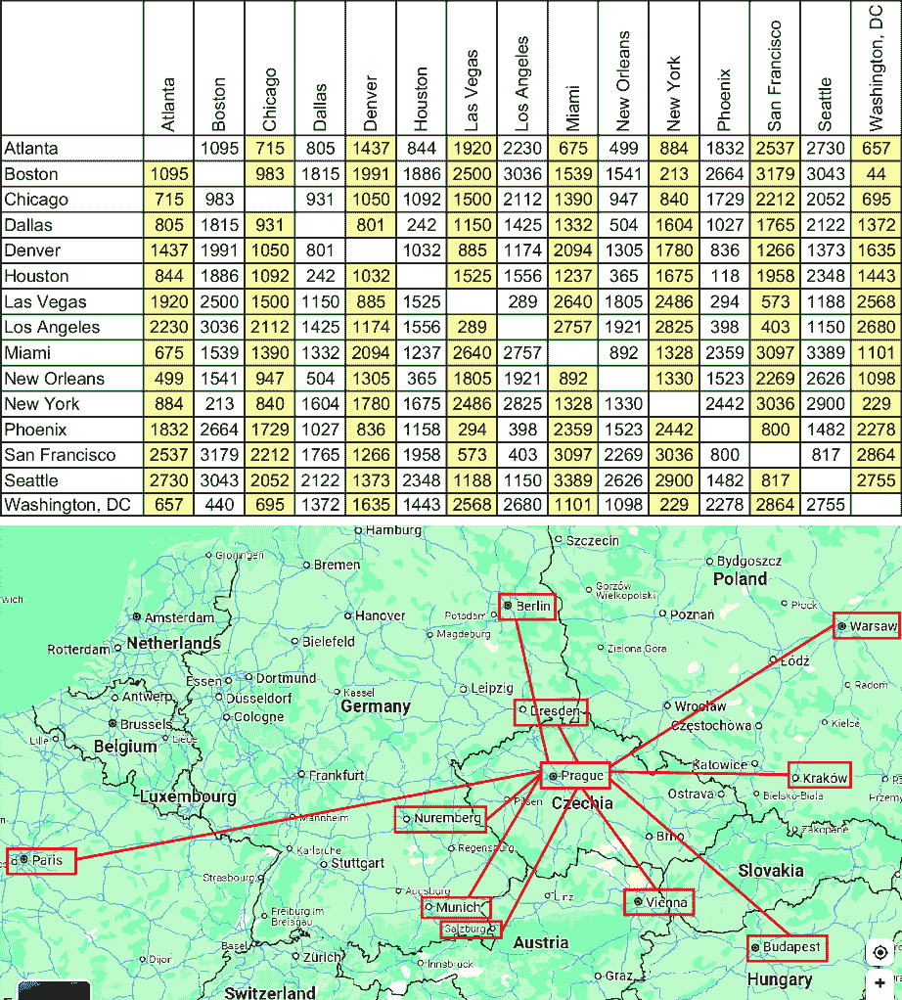

##### 图 6.1 展示了城市之间的距离以及它们在地图上的表示。该图仅用于帮助理解，并不代表实际结果。

为了简化，考虑图 6.2。这里我们有三个点：A、B 和 C。我们在三维空间中表示这些点。然后我们在二维空间中表示这三个点，最后在一维空间中表示。图中的图例中点之间的距离没有按比例。这个例子表示了降低维度数量的意义。

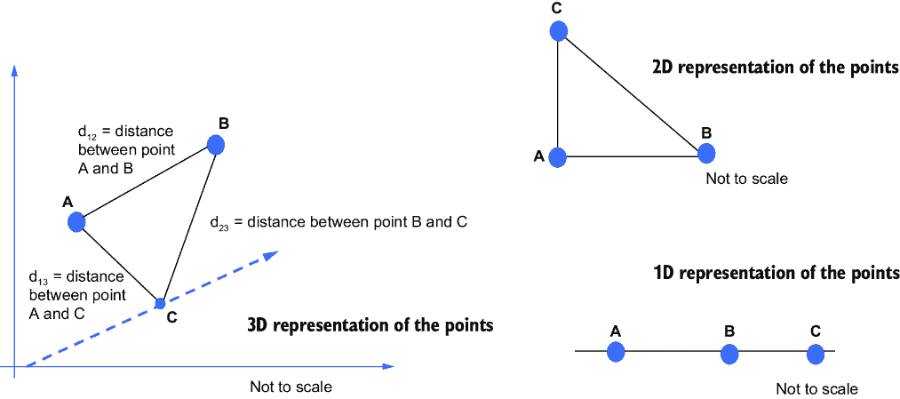

##### 图 6.2 三个点的表示

因此，在 MDS 中，多维数据被降低到更少的维度。

MDS 算法有三种类型：

+   经典 MDS

+   度量多维尺度

+   非度量多维尺度

### 6.2.1 经典 MDS

我们将在书中详细检查度量 MDS 的过程，而我们将简要介绍经典和非度量 MDS。想象我们有两个点：*i*和*j*。让我们假设两点之间的原始距离是*d*[*i*][*j*]，而在低维空间中的对应距离是*d*[*i*][*j*]。

在经典的多维尺度分析（MDS）中，点之间的距离被视为欧几里得距离，原始距离和拟合距离表示在相同的度量下。这意味着如果使用欧几里得方法在更高维空间中计算原始距离，那么在低维空间中计算的拟合距离也将使用欧几里得距离。我们已经知道如何计算欧几里得距离。例如，我们需要找到点 *i* 和 *j* 之间的距离，假设距离为 *d*[*i*][*j*]。在二维空间中，距离可以通过方程 6.1 给出的欧几里得距离公式给出：

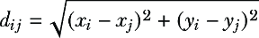

##### (6.1)

回想第二章，我们讨论了其他距离函数，如曼哈顿距离、欧几里得距离等。建议您复习第二章的内容。

### 6.2.2 非度量 MDS

我们刚才提到，欧几里得距离可以用来计算两点之间的距离。有时无法获取距离的实际值，例如当 *d*[*i*][*j*] 是实验结果，其中进行了主观评估，换句话说，为各种数据参数分配了排名时。例如，如果点 2 和点 5 之间的距离在原始数据中排名为 4，在这种情况下，使用 *d*[*i*][*j*] 的绝对值是不明智的，因此必须使用相对值或*排名值*。在这里，距离可以指一种排名——例如，谁在比赛中排名第一。这是非度量多维尺度分析的过程。例如，想象我们有四个点：A、B、C 和 D。我们希望对这些四个点之间的相应距离进行排名。点的相应组合可以是 A 和 B、A 和 C、A 和 D、B 和 C、B 和 D 以及 C 和 D。它们的距离可以按照表 6.1 所示进行排名。

##### 表 6.1 四点之间的相应距离及其距离的排名

| 点对 | 距离 | 相应距离的排名 |
| --- | --- | --- |
| A 和 B  | 100  | 3  |
| A 和 C  | 105  | 4  |
| A 和 D  | 95  | 2  |
| B 和 C  | 205  | 6  |
| B 和 D  | 150  | 5  |
| C 和 D  | 55  | 1  |

因此，在非度量 MDS 方法中，我们不是使用实际距离，而是使用相应距离的排名。接下来，我们将转向度量 MDS 方法。

我们知道，在经典的多维尺度分析（MDS）中，原始距离和拟合距离表示在相同的度量下。在度量 MDS 中，假设 *d*[*i*][*j*] 的值可以通过对数据集应用某些参数变换而转换为欧几里得距离。在某些文章中，您可能会发现经典和度量 MDS 被交替使用。

在 MDS 中，作为第一步，计算点之间的相应距离。一旦计算了相应的距离，MDS 将尝试在低维空间中表示高维数据点。为了执行此操作，必须进行优化过程，以便选择最佳的结果维度数。因此，必须优化损失函数或成本函数。

#### 成本函数

我们使用算法来预测变量的值。例如，我们可能使用某些算法来预测明年产品的预期需求。我们希望算法尽可能准确地预测。成本函数是检查算法性能的简单方法。

成本函数是一种简单的技术，用于衡量我们算法的有效性。它是衡量预测模型性能最常用的方法。它通过比较算法预测的原始值和预测值来计算模型在预测中的错误程度。

正如你所想象的那样，在理想解决方案中，我们希望预测值与实际值相同，这非常难以实现。如果预测值与实际值差异很大，成本函数的输出就更高。如果预测值更接近实际值，那么成本函数的值就较低。一个稳健的解决方案是具有最低成本函数值的解决方案。因此，优化任何算法的目标将是使成本函数的值最小化。成本函数也被称为损失函数；这两个术语可以互换使用。

在度量 MDS 中，我们也可以将成本函数称为应力。这只是成本函数的另一个名称。应力的公式在方程 6.2 中给出：

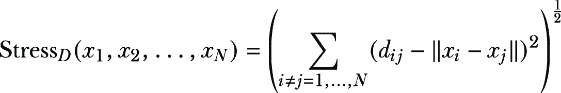

##### (6.2)

在方程中，

+   术语应力[*D*] 是 MDS 函数需要最小化的值。

+   在低维空间中具有新坐标集的数据点表示为 *x*[1]，*x*[2]，*x*[3]… *x*[*N*]。

+   术语 ||*x*[*i*]– *x*[*j*]|| 表示它们在低维空间中两点之间的距离。

+   术语 *d*[*i*][*j*] 是两点在原始多维空间中的原始距离。

通过观察方程，我们可以看到，如果 ||*x*[*i*]– *x*[*j*]|| 和 *d*[*i*][*j*] 的值彼此接近，则结果应力的值将很小。

注意：最小化应力的值是损失函数的目标。

为了优化这个损失函数，我们可以使用多种方法。其中最著名的方法是使用 Kruskal 和 Wish 在 1978 年最初提出的梯度下降法。梯度下降法非常容易理解，可以用一个简单的类比来解释。

想象你站在山顶上，你想下山。你想要选择最快的路径，因为你想要尽可能快地下山（不，你不能跳下去！）。所以，为了迈出第一步，你四处张望，然后选择最陡峭的路径，朝那个方向迈出一步，到达一个新的点。然后，你再次朝最陡峭的方向迈出一步。这个过程在图 6.3 的第一幅图中展示。


##### 图 6.3 一个站在山顶上试图下山的人。梯度下降的过程遵循这种方法（左）。在梯度下降过程中成本函数优化的实际过程。注意，在收敛点上，成本函数的值是最小的（右）。

现在假设一个算法必须完成类似的壮举；这个过程在图 6.3 的右图中表示，其中损失函数从一个点开始，最终达到收敛点。在这个收敛点上，成本函数是最小的。

MDS 与其他降维技术不同。与 PCA 等技术相比，MDS 对数据集没有任何假设，因此可以用于更多的数据集。此外，MDS 允许使用任何距离度量指标。与 PCA 不同，MDS 不是一个特征值-特征向量技术。回想一下，在 PCA 中，第一条轴捕捉最大的方差，第二条轴有下一个最好的方差，依此类推。在 MDS 中，没有这样的条件。MDS 中的轴可以根据需要反转或旋转。此外，在大多数其他降维方法中，算法确实计算了很多轴，但它们无法被查看。在 MDS 中，在开始时明确选择了一个较小的维度数。因此，在解决方案中存在较少的歧义。进一步来说，在其他算法中，通常只有一个唯一的解，而 MDS 试图迭代地找到最可接受的解。这意味着在 MDS 中，对于同一数据集可以有多个解。

但与此同时，对于更大的数据集，MDS 所需的计算时间更长——并且在用于优化的梯度下降法中存在一个陷阱（见图 6.4）。让我们回顾一下我们之前提到的山岳例子。想象一下，当你从山顶下来时，起点是 A，山顶的底部是点 C。在你下坡的过程中，你到达了点 B。如图中左图所示，点 B 周围有一个轻微的隆起。在这个点 B，你可能会错误地认为你已经到达了山的底部。换句话说，你会认为你已经完成了任务。这就是局部最小值的问题。


##### 图 6.4 虽然第一个图表示的是收敛点，代表了梯度下降法，但请注意，在第二个图中，全局最小值位于别处，而算法可能会陷入局部最小值。算法可能会检查它已经优化了成本函数并达到了全局最小值，而实际上它只达到了局部最小值。在局部最小值处，没有上升的方向；所有方向都是下降的。如果算法纯粹是局部的，它对存在在可能的小山之外的更深最小值没有信息。

有一种可能性，损失函数可能不是全局最小值，而是陷入局部最小值。算法可能会认为它已经达到了收敛点，而完整的收敛可能还没有实现，我们处于局部最小值。

关于 MDS 解决方案的有效性仍有一个问题需要回答。我们如何衡量解决方案的有效性？在原始论文中，Kruskal 推荐使用应力值来衡量解决方案的拟合优度，这些应力值显示在表 6.2 中。这些推荐主要基于 Kruskal 的经验。这些应力值是基于 Kruskal 的经验。

##### 表 6.2 应力值及其拟合优度

| 应力值 | 拟合优度 |
| --- | --- |
| 0.200  | 差  |
| 0.100  | 一般  |
| 0.050  | 好  |
| 0.025  | 优秀  |
| 0.000  | 完美  |

下一个逻辑问题是：我们应该选择多少个最终维度？散点图提供了答案，如图 6.5 所示。回想一下，在第二章中，我们使用类似的手肘法来选择 k-means 聚类的最佳聚类数。对于 MDS，我们也可以使用手肘法来确定表示数据的最佳成分数。


##### 图 6.5 找到最佳成分数的散点图。它与 k-means 解决方案类似；我们必须在图中寻找手肘点。

##### 练习 6.1

回答这些问题以检查你的理解：

1.  度量空间 MDS 和非度量空间 MDS 算法之间的区别是什么？

1.  梯度下降用于最大化成本。对还是错？

1.  使用一个简单的例子解释梯度下降法。

## 6.3 MDS 的 Python 实现

对于 MDS 方法的 Python 实现，我们将使用著名的 Iris 数据集，我们之前已经使用过。由于`scikit learn`包中提供了库，使用算法相当简单。

备注：实现通常很简单，因为重活是由库完成的。

步骤如下：

1.  加载库。常用的库有 `sklearn`、`matplotlib` 和 `numpy`，我们还从 `sklearn` 中加载了 `MDS`：

```py
import numpy as np
from sklearn.datasets import load_iris
import matplotlib.pyplot as plt
from sklearn.manifold import MDS
from sklearn.preprocessing import MinMaxScaler
import pandas as pd
import warnings
warnings.filterwarnings("ignore")
```

1.  2. 加载数据集。Iris 数据集在`sklearn`库中可用，因此我们在这里不需要导入 Excel 或.csv 文件：

```py
raw_data = load_iris()
dataset = raw_data.data
```

1.  3. MDS 的要求是在实际可视化之前对数据集进行缩放。我们使用`MixMaxScalar()`函数来实现这一点。MinMax 缩放简单地使用方程 6.3 中的公式缩放数据：


##### (6.3)

```py
d_scaler = MinMaxScaler()
dataset_scaled = d_scaler.fit_transform(dataset)
```

作为这一步骤的输出，数据已缩放并准备好进行下一阶段的建模。

1.  4. 从`sklearn`库中调用 MDS 方法。`random_state`值允许我们重现结果。我们在此示例中将组件数量选为 3：

```py
mds_output = MDS(3,random_state=5)
```

1.  5. 使用 MDS 模型拟合之前创建的缩放数据：

```py
data_3d = mds_output.fit_transform(dataset_scaled)
```

1.  6. 声明我们希望用于可视化的颜色。接下来，数据点在散点图中进行可视化：

```py
mds_colors = ['purple','blue', 'yellow']
for i in np.unique(raw_data.target):
  d_subset = data_3d[raw_data.target == i]

  x = [row[0] for row in d_subset]
  y = [row[1] for row in d_subset]
  plt.scatter(x,y,c=mds_colors[i],label=raw_data.target_names[i])
plt.legend()
plt.show()
```

前面代码的输出显示在图 6.6 中。

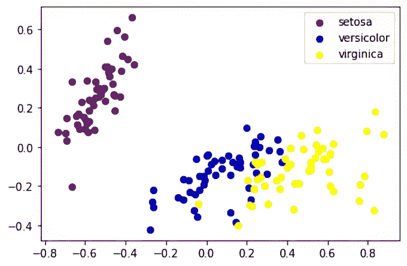

##### 图 6.6 Iris 数据的输出

这个 Python 实现的例子是 Iris 数据的可视化。这是一个相当简单的例子，因为它不涉及应力和组件数量的优化。换句话说，我们需要一个更复杂的数据集才能真正优化 MDS。我们现在将使用一个精选的数据集来实施 MDS（见图 6.7）。

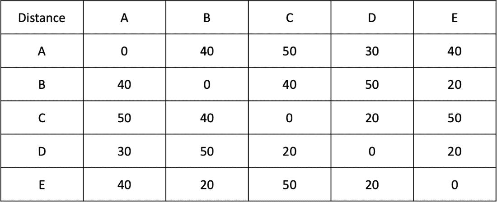

##### 图 6.7 各个城市及其相互之间的距离

假设我们拥有五个城市，它们之间的距离在图 6.7 中给出。步骤如下：

1.  我们已经在上一段代码中导入了库：

```py
import numpy as np
from sklearn.datasets import load_iris
import matplotlib.pyplot as plt
from sklearn.manifold import MDS
from sklearn.preprocessing import MinMaxScaler
import pandas as pd
import warnings
warnings.filterwarnings("ignore")
```

1.  2. 创建数据集。虽然我们在这里创建了一个数据集，但在实际业务场景中，它将以距离的形式存在（见图 6.8）：

```py
data_dummy_cities = {'A':[0,40,50,30,40],
          'B':[40,0,40,50,20],
          'C':[50,40,0,20,50],
          'D':[30,50,20,0,20],
          'E':[40,20,50,20,0],
          }
cities_dataframe = pd.DataFrame(data_dummy_cities, index 
=['A','B','C','D','E'])
cities_dataframe
```

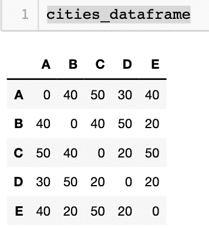

##### 图 6.8 创建数据集

1.  3. 使用`MinMaxScalar()`函数缩放数据集，就像我们在上一个编码练习中所做的那样：

```py
scaler = MinMaxScaler()
df_scaled = scaler.fit_transform(cities_dataframe)
```

现在我们致力于寻找最优的组件数量。我们将对不同的组件数量进行迭代。对于每个组件数量的值，我们将得到应力的值。观察到拐点的点即为最优的组件数量。

作为第一步，我们将声明一个空的数据框，它可以用来存储组件数量及其对应应力值的值。然后我们在`for`循环中从 1 迭代到 10。最后，对于组件的每个值（1 到 10），我们得到相应的应力值：

```py
MDS_stress = []
for i in range(1, 10):
    mds = MDS(n_components=i)
    pts = mds.fit_transform(df_scaled)
    MDS_stress.append(mds.stress_)
```

1.  4. 现在我们已经得到了应力的值，我们将这些值绘制在图表中。每个坐标轴的相应标签也已给出。请看图 6.9 中值 2 和 3 处的拐点。这些可能是组件数量的最优值：

```py
plt.plot(range(1, 10), MDS_stress)
plt.xticks(range(1, 5, 2))
plt.title('Plot of stress')
plt.xlabel('Number of components')
plt.ylabel('Stress values')
plt.show()
```

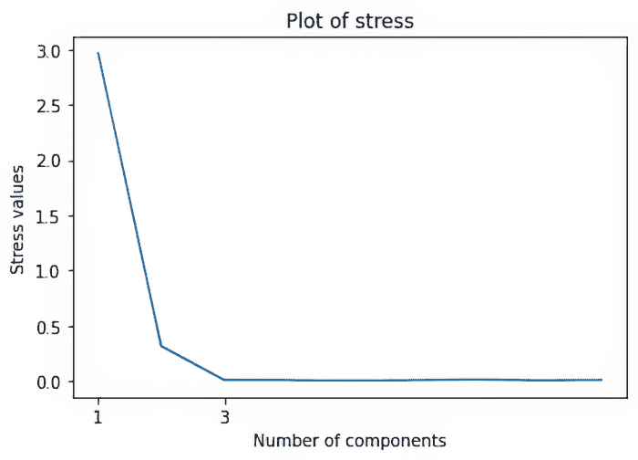

##### 图 6.9 切片图以选择优化的组件数量

1.  5. 运行组件数量为 3 的解决方案。如果我们查看应力的值，组件数量为 3 时，它生成了最小的应力值 0.00665（见图 6.10）：

```py
mds = MDS(n_components=3)
x = mds.fit_transform(df_scaled)
cities = ['A','B','C','D','E']

plt.figure(figsize=(5,5))
plt.scatter(x[:,0],x[:,1])
plt.title('MDS with Sklearn')
for label, x, y in zip(cities, x[:, 0], x[:, 1]):
    plt.annotate(
        label,
        xy = (x, y), 
        xytext = (-10, 10),
        textcoords = 'offset points'
    )
plt.show()
print(mds.stress_)
```

这就结束了我们对 MDS 算法的讨论。我们讨论了其基础和概念、优缺点、算法评估以及 MDS 的 Python 实现。作为非线性降维方法之一，它对于可视化和降维是一个很好的解决方案。


##### 图 6.10 MDS 数据集的输出：图中展示了五个城市的表示

## 6.4 t 分布随机近邻嵌入

如果数据集的维度非常高，分析就会变得繁琐。可视化甚至更加混乱。我们在第三章的维度诅咒部分已经详细讨论了这一点。如果你需要复习，建议在继续之前重新回顾这个概念。

这样一个真正高维度的数据集可以是图像数据。我们发现，由于超过 3 维度的内容对我们来说越来越难以直观理解，因此我们很难理解这类数据。

你可能已经在你的智能手机上使用过面部识别软件。对于这样的解决方案，面部图像需要被分析，机器学习模型需要被训练。看看图 6.11 中的图片：我们有一个人脸、一辆自行车、一个吸尘器和一部手机的屏幕截图。

图像是复杂的数据类型。每张图像由像素组成，每个像素可以由 RGB（红色、绿色、蓝色）值组成。RGB 的值可以从 0 到 255。生成的数据集将是一个非常高维的数据集。


##### 图 6.11 中的图像对于算法来说非常复杂，难以解读。图像可以是任何形式，可以是人物、设备，甚至是手机屏幕。

现在回想一下我们在第三章学习的 PCA。PCA 是一个线性算法。因此，它在解决非线性复杂多项式函数方面的能力有限。此外，当需要将高维数据集表示在低维空间中时，算法应该将相似的数据点保持得尽可能接近，这在线性算法中可能是一个挑战。作为线性降维技术，PCA 试图尽可能地将不同的数据点分开，并试图最大化数据中捕获的方差。这种分析的结果可能不够稳健，可能不适合进一步的使用和可视化。因此，我们有非线性算法如 t-SNE 来帮助。

t-SNE 是一种非线性降维技术，对于高维数据来说非常实用。它基于随机近邻嵌入，由 Sam Roweis 和 Geoffrey Hinton 开发。t 分布的变体是由 Lauren van der Maaten 提出的。因此，t-SNE 是 SNE 算法的改进。

在高层次上，SNE 测量高维空间和低维空间中实例对之间的相似度。一个好的解决方案是这些相似度度量之间的差异最小，然后 SNE 使用类似于我们之前讨论的 MDS 的成本函数来优化这些相似度度量。

我们接下来检查 t-SNE 的逐步过程。描述的过程在数学上有点复杂：

1.  考虑一个高维空间及其中的某些点。

1.  测量上一条中提到的高维空间中各个点之间的相似度。对于点 *x*[*i*]，我们将创建一个以该点为中心的高斯分布。我们已经在第二章中学习了高斯或正态分布。高斯分布如图 6.12 所示。

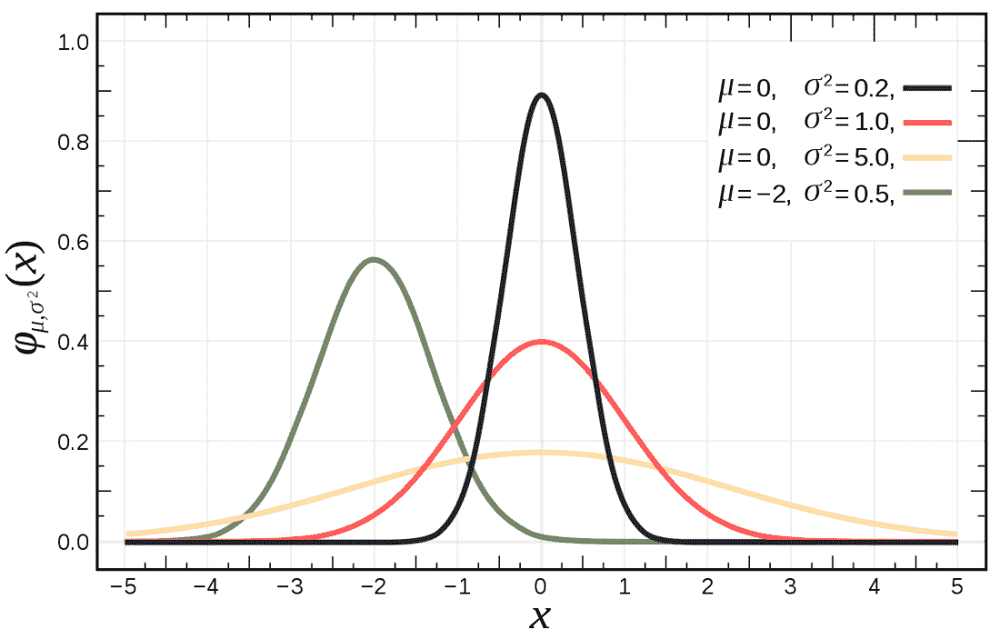

##### 图 6.12 高斯或正态分布。

1.  3. 测量位于该高斯分布下的点（比如说 *x*[*j*]）的密度，然后重新归一化它们以获得相应的条件概率（*p*[*j*][|][*i*]）。对于附近且相似的点，这个条件概率将很高，而对于远离且不相似的点，条件概率（*p*[*j*][|][*i*]）的值将非常小。这些概率值是在高维空间中的。对于好奇的读者，这个条件概率的数学公式以方程 6.4 表示。


##### （6.4）

其中 *σ* 是以 *x*[*i*] 为中心的高斯分布的方差。数学证明超出了本书的范围。

1.  4. 在低维空间中测量另一组概率。对于这组测量，我们使用下一节中描述的柯西分布。我们使用 Kullback-Liebler（KL）散度来测量两个概率分布之间的差异。

### 6.4.1 柯西分布

柯西分布属于连续概率分布族。尽管它与我们在图 6.13 中表示的正态分布有相似之处，但柯西分布的峰值更窄，扩散得更慢。这意味着，与正态分布相比，获得远离峰值的值的概率更高。有时，柯西分布也被称为*洛伦兹分布*。值得注意的是，柯西分布没有明确定义的平均值，但中位数是对称中心。


##### 图 6.13 高斯分布与柯西分布的比较。（图片来源：Quora）

1.  假设我们得到了 *y*[*i*] 和 *y*[*j*]，它们是高维数据点 *x*[*i*] 和 *x*[*j*] 的低维对应物。因此，我们可以像上一步一样计算概率得分。使用高斯分布，我们还可以得到第二组概率 *q*[*j*][|][*i*]。数学公式在方程 6.5 中展示：

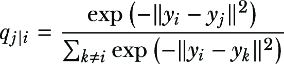

##### (6.5)

1.  2. 到目前为止，我们已经计算了两组概率 (*p*[*j*][|][*i*]) 和 (*q*[*j*][|][*i*])。在这一步，我们比较这两个分布并测量它们之间的差异。换句话说，在计算 (*p*[*j*][|][*i*]) 时，我们测量了高维空间中相似性的概率，而对于 (*q*[*j*][|][*i*])，我们在低维空间中做了同样的操作。理想情况下，两个空间的映射应该是相似的，为此，(*p*[*j*][|][*i*]) 和 (*q*[*j*][|][*i*]) 之间不应该有任何差异。因此，SNE 算法试图最小化条件概率 (*p*[*j*][|][*i*]) 和 (*q*[*j*][|][*i*]) 之间的差异，这与我们在高维和低维空间中使用 MDS 进行距离测量的做法类似。

1.  3. 使用 KL 散度来测量两个概率分布之间的差异。

1.  4. 为了最小化 KL 代价函数，我们使用梯度下降方法。我们已经在第 6.2 节中讨论了梯度下降方法，当时我们讨论了 MDS 算法。

定义：KL 散度或相对熵用于测量两个概率分布之间的差异。通常，一个概率分布是数据或测量的得分，而第二个概率分布是对原始概率分布的近似或预测——例如，如果原始概率分布是 *X*，而近似的是 *Y*。KL 散度可以用来测量 *X* 和 *Y* 概率分布之间的差异。在绝对意义上，如果值为 0，则意味着两个分布是相同的。KL 散度适用于神经科学、统计学和流体力学等领域。

在我们进行 t-SNE 工作时，还有一个重要的因素我们应该意识到，那就是 *困惑度*。困惑度是一个超参数，它允许我们控制和优化每个数据点拥有的邻近点的数量。

备注：根据官方论文，困惑度的典型值介于 5 到 50 之间。

可能还有一个额外的细微差别：t-SNE 算法的输出可能在连续运行中永远不会相同。我们必须优化超参数的值以获得最佳输出。

##### 练习 6.2

回答这些问题以检查你的理解：

1.  用你自己的话解释高斯分布。

1.  PCA 是一个非线性算法。对或错？

1.  KL 散度用于测量两个概率分布之间的差异。对或错？

### 6.4.2 t-SNE 的 Python 实现

在本例中，我们将使用两个数据集。第一个是 Iris 数据集，我们已经在本书中多次使用过。第二个数据集非常有趣：MNIST 数据集是一个手写数字数据库。它是用于训练图像处理解决方案中最著名的数据库之一，通常被认为是图像检测解决方案的“Hello World”程序。图 6.14 显示了图像表示。

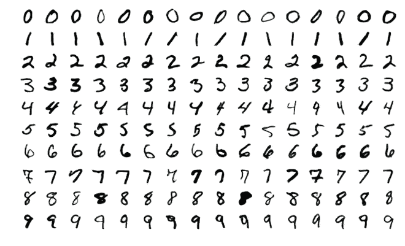

##### 图 6.14 MNIST 数据集

Iris 数据集的步骤如下：

1.  导入必要的库。请注意，我们已经从 `keras` 库中导入了 MNIST 数据集。

```py
rom sklearn.manifold import TSNE
from keras.datasets import mnist
from sklearn.datasets import load_iris
from numpy import reshape
import seaborn as sns
import pandas as pd
```

TIP 如果您无法在 Python 代码中安装模块，请参阅附录，我们提供了解决方案。

1.  2. 加载 Iris 数据集。该数据集包含两部分：一部分是“数据”，另一部分是相应的标签或“目标”。这意味着“数据”是数据的描述，“目标”是鸢尾花的类型。我们使用代码打印特征和标签：

```py
iris = load_iris()
iris_data = iris.data
iris_target = iris.target
iris.feature_names
iris.target_names
```

1.  3. 调用 t-SNE 算法。我们使用 `n_components=2`、`verbose=1` 和 `random_state=5` 来重现结果。然后使用该算法拟合数据（见图 6.15）：

```py
tsne = TSNE(n_components=2, verbose=1, random_state=5)
fitted_data = tsne.fit_transform(iris_data)
```


##### 图 6.15 代码拟合算法的输出

1.  4. 绘制数据。这一步使我们能够可视化上一步中算法拟合的数据。

首先，我们将初始化一个空的数据框。我们将逐个添加三个列。我们首先从 `iris_target` 开始，然后是 `tSNE_first_component` 和 `tSNE_second_component`。`tSNE_first_component` 是 `fitted_data` 数据框的第一列，因此索引是 `0`。`tSNE_second_component` 是 `fitted_data` 数据框的第二列，因此索引是 `1`。最后，我们在图 6.16 中以散点图的形式表示数据：

```py
iris_df = pd.DataFrame()
iris_df["iris_target"] = iris_target
iris_df["tSNE_first_component"] = fitted_data[:,0]
iris_df["tSNE_second_component"] = fitted_data[:,1]

sns.scatterplot(x="tSNE_first_component", y="tSNE_second_component", 
hue=iris_df.iris_target.tolist(),
                palette=sns.color_palette("hls", 3),
                data=iris_df).set(title="Iris data tSNE projection")
```

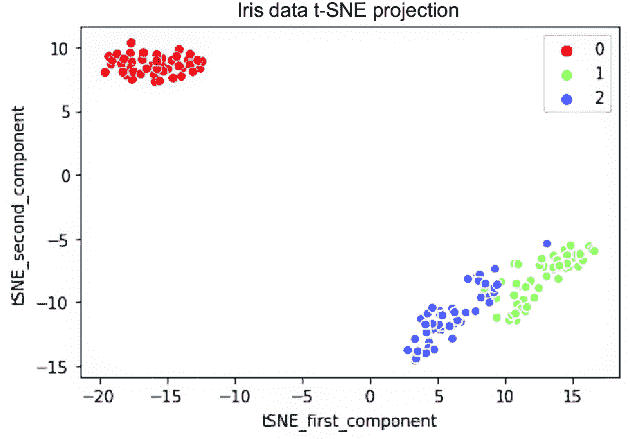

##### 图 6.16 Iris 数据集的 t-SNE 投影。注意我们如何得到数据集中三个类别的三个单独的簇。

要实现 MNIST 数据集的算法，加载库和数据集。库已经在上一个代码示例中加载。现在加载数据集。数据集需要 `reshape`，这里进行了操作（见图 6.17）：

```py
(digit, digit_label), (_ , _) = mnist.load_data()
digit = reshape(digit, [digit.shape[0], digit.shape[1]*digit.shape[2]])
Step 2: the subsequent steps are exactly same to the last example we used. 
tsne_MNIST = TSNE(n_components=2, verbose=1, random_state=5)
fitted_data = tsne_MNIST.fit_transform(digit)

mnist_df = pd.DataFrame()
mnist_df["digit_label"] = digit_label
mnist_df["tSNE_first_component"] = fitted_data[:,0]
mnist_df["tSNE_second_component"] = fitted_data[:,1]

sns.scatterplot(x="tSNE_first_component", y="tSNE_second_component", hue=mnist_df.digit_label.tolist(),
                palette=sns.color_palette("hls", 10),
                data=mnist_df).set(title="MNIST data T-SNE projection")
```


##### 图 6.17 t-SNE 对不同灰度表示的 10 个数字类别的输出

在运行 t-SNE 时，有几个重要点需要注意：

+   在确定解决方案之前，使用不同的超参数值运行算法。

+   理想情况下，困惑度应该在 5 到 50 之间，对于优化的解决方案，困惑度的值应该小于点的数量。

+   T-SNE 为每个点猜测接近邻居的数量。因此，密集的数据集将需要更高的困惑度值。

+   注意，困惑度是平衡数据局部和全局方面的超参数。

t-SNE 是一个广泛流行的算法。它可以用于研究一个区域的拓扑结构，但单个 t-SNE 不能用于做出最终评估。相反，应该创建多个 t-SNE 图来做出任何最终建议。有时有人抱怨 t-SNE 是一个黑盒算法。这在一定程度上可能是正确的。使 t-SNE 的采用变得更困难的是，它不会在连续迭代中产生相同的结果。因此，你可能会发现 t-SNE 仅被推荐用于探索性分析。

## 6.5 统一流形近似投影

UMAP 是一种强大且流行的降维技术。它旨在在降低高维数据集的复杂性和维度到低维数据集的同时，保留数据集的局部和全局结构。

UMAP 是由 Lealand McInnes、John Healy 和 James Melville 于 2018 年提出的。UMAP 使数据更适合可视化与分析。这与拓扑和流形理论的概念相关。UMAP 假设高维数据集通常位于一个流形上，这意味着低维结构嵌入在更高维的空间中。因此，它试图将这个流形投影到低维空间，同时保留最近邻关系，这仅仅是局部结构，以及更大的关系，即全局结构。

### 6.5.1 与 UMAP 一起工作

UMAP 方法使用模糊简单集的概念。这些集合代表不同数据点之间距离的概率分布，并捕捉潜在的流形结构。

UMAP 的第一步是构建一个加权图，其中每个数据点根据距离度量与其最近邻连接。通常，欧几里得距离被用作距离度量。这个图构建是对高维数据结构的一种抽象表示。

下一步是优化图。通过最小化原始高维关系和新创建的低维关系之间的交叉熵损失，在低维空间中优化图。这使用了随机梯度下降，产生了 UMAP 嵌入。我们将在第九章研究随机梯度下降。

UMAP 有两个关键参数：

+   `n_neighbours`——考虑每个点的最近邻数量。使用此参数，我们平衡局部数据结构和全局数据结构之间的保留。

+   `min_dist`——这个参数用于控制点之间的簇聚紧密程度。较小的最小距离值会使点更靠近，从而创建更深的簇。较大的最小距离值将创建较稀疏的簇，这些簇分布较广。

### 6.5.2 使用 UMAP

UMAP 的用途如下：

+   UMAP 在生物信息学领域的高维数据集可视化中是最受欢迎的应用之一。基因数据集相当复杂且多维，每个数据点可能由数百或数千个属性表示。使用 UMAP，研究人员可以虚拟地检查数据集中的簇和潜在关系。这种解决方案帮助他们识别细胞类型、发育阶段和基因表达模式。

+   UMAP 还应用于自然语言处理领域，通过降低嵌入的维度。它有助于可视化单词、句子或文档之间的关系，使理解相似性变得更容易。

+   UMAP 还可以应用于图像。它有助于基于各种相似性可视化图像的叠加，因此对于理解如何将相似图像聚类在一起，在竞争视觉任务中非常有用。

+   UMAP 可以与其他聚类算法（如 k-means 或 DBSCAN）一起使用。它可以揭示大型数据集中的隐藏模式，并且由于它保留了局部和全局结构，因此在低维表示中找到的簇通常比原始高维数据集提供更重要的分组。

除了帮助可视化外，UMAP 还可以用作预处理步骤来降低数据的维度。它可以作为 PCA 或其他解决方案的替代品。通过减少数据集中的维度数量，可以提高模型的性能并减少计算时间。

在 Python 中使用 UMAP 非常简单。`umap-learn`库允许我们使用 UMAP 的力量。

### 6.5.3 UMAP 的关键点

现在我们来介绍 UMAP 的关键点，并将其与其他算法进行比较：

+   由于 UMAP 是一种非线性解法，它比 PCA 能够捕捉更复杂的数据集和模式。回想一下，PCA 是一种线性降维技术，所以当数据不在简单的线性流形上时，UMAP 证明更加准确。

+   PCA 的目标是解释整个数据集的最大方差。另一方面，UMAP 平衡了局部和全局结构，因此在异常检测等任务上更加灵活。

+   与 PCA 相比，UMAP 可以用于更大的数据集。

+   UMAP 比其他非线性解法 t-SNE 更快。t-SNE 可以保留数据的局部结构，但在保留全局结构方面存在困难，可能会导致对簇的误导性解释。UMAP 做得更好，因为它保留了局部和全局结构。

+   UMAP 的结果在多次迭代中更加稳定和一致。对于其他算法，结果可能不稳定，并且可能随着随机种子不同值的变化而变化。

UMAP 最近获得了大量的关注，并已成为机器学习和 AI 解决方案的首选工具。它速度快，可以保留局部和全局数据结构。因此，与其他降维解决方案（如 PCA、t-SNE 和自动编码器）相比，它是一个强大的选择。

## 6.6 案例研究

在第三章中，我们探讨了电信行业减少维度的案例研究。在本章中，我们将考察一个小型案例研究，其中可以使用 t-SNE 或 MDS 进行降维。

你听说过高光谱图像吗？正如你所知，我们人类在大多数情况下在三个波段中看到可见光的颜色：长波、中波和短波。长波被感知为红色，中波为绿色，短波为蓝色。人类感知到的所有其他颜色都是这三种颜色的混合，这就是为什么屏幕和打印机只需要三种颜色就能工作。另一方面，光谱成像将光谱分成更多的波段，这种技术可以扩展到可见光之外，因此它在生物学、物理学、地球科学、天文学、农业等多个领域都有应用。高光谱成像收集和处理整个电磁谱的信息。它为图像中的每个像素获取光谱。见图 6.18。

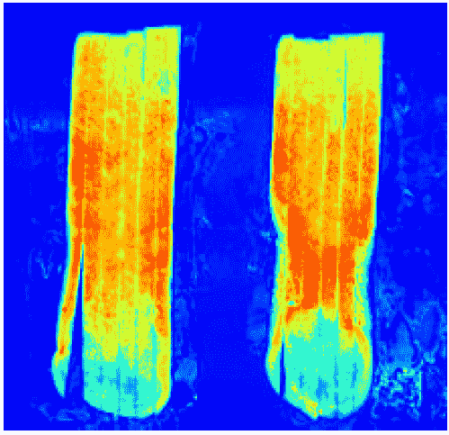

##### 图 6.18 “糖端”土豆条的高光谱图像显示了不可见的缺陷（来源：SortingExpert，CC BY-SA 3.0）

其中一个这样的数据集是帕维亚大学数据集。该数据集由意大利帕维亚的 ROSIS 传感器整理。接下来将给出数据集的详细信息，并且可以从[`mng.bz/nRVa`](https://mng.bz/nRVa)下载数据集。

在这个数据集中有 103 个光谱波段。HIS 的大小是 610 * 340 像素，包含九个类别。这种类型的数据可以用于作物分析、矿物检验和勘探等。由于这些数据还包含有关地质模式的信息，因此在科学目的上非常有用。在开发任何图像识别解决方案之前，我们必须减少这个数据集的维度数量。如果我们有大量的维度，计算成本将会更高。因此，我们希望有一个更低的代表性维度数量。图 6.19 展示了几个示例波段。建议您下载数据集（该数据集也已在 GitHub 仓库中推送），并在数据集上使用各种降维技术来减少维度数量。可能会有许多其他图像数据集和复杂的企业问题，其中 t-SNE 和 MDS 可以具有实际的应用价值。

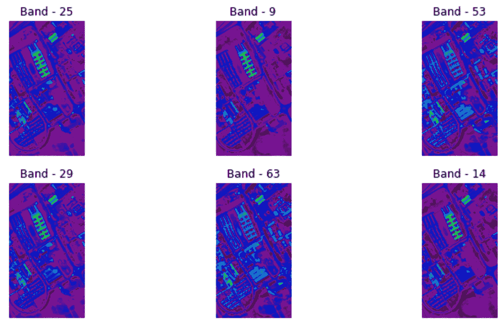

##### 图 6.19 数据集中的波段示例。这些只是随机示例。

## 6.7 总结思考

降维是一个既有趣又实用的领域。它使机器学习更经济、更节省时间。想象一下，你有一个具有数千个属性或特征的数据库。你对数据不太了解，业务理解有限，同时你还得在数据库中找到模式。你甚至不确定变量是否都相关，或者只是随机噪声。在这样的时刻，当我们想要使数据库更简单以便破解并减少计算时间时，降维就是解决方案。

我们在本书的前面部分已经介绍了降维技术。本章涵盖了三种高级技术：t-SNE、MDS 和 UMAP。这三种技术不应被视为我们之前讨论的其他更简单技术的替代品。相反，如果我们使用基本算法没有得到有意义的结果，它们可能是有用的。始终建议首先使用 PCA，然后尝试使用高级技术。

本书的内容复杂性正在增加。本章从图像开始——但我们只是浅尝辄止。在下一章中，我们将处理文本数据。也许你会发现它非常有趣和有用。

## 6.8 实践下一步行动和建议阅读

以下提供了一些下一步行动的建议和一些有用的阅读材料：

+   使用第二章中使用的车辆数据集进行聚类，并在其上实现 MDS。比较实现 MDS 前后的聚类性能。

+   获取第二章中使用的 Python 示例数据集，并使用它们来实现 MDS。

+   对于 MDS，请参考以下研究论文：

    +   “降维：比较综述”，作者 Lauren van der Maaten、Eric Postma 和 H. Japp Van Den Herik：[`mng.bz/eyxQ`](https://mng.bz/eyxQ)

    +   “基于多维尺度数据降维方法在短期城市道路网络交通流量预测中的应用”，作者 Satish V. Ukkusuri 和 Jian Lu：[`mng.bz/pKmz`](https://mng.bz/pKmz)

+   从以下链接获取 t-SNE 研究论文并学习它们：

    +   “使用 t-SNE 可视化数据”，作者 Laurens van der Maaten 和 Geoffrey Hinton：[`mng.bz/OBaE`](https://mng.bz/OBaE)

    +   “使用 t-SNE 进行单细胞转录组学”，作者 Laurens van der Maaten 和 Geoffrey Hinton：[`mng.bz/YD9A`](https://mng.bz/YD9A)

+   请参阅以下论文“t-SNE 和 MDS 降维技术在 KNN、SNN 和 SVM 分类器上的性能评估”：[`arxiv.org/pdf/2007.13487.pdf`](https://arxiv.org/pdf/2007.13487.pdf)

## 摘要

+   MDS 是一种降维技术，它将高维数据转换为低维空间，同时保留距离。

+   有三种类型的 MDS：经典、指标和非指标。

+   经典 MDS 使用欧几里得距离，使原始距离和拟合距离对齐。

+   非指标 MDS 对距离进行排序，而不是使用绝对值。

+   指标多维尺度（Metric MDS）将距离转换为适合低维空间。

+   MDS 涉及计算距离和通过梯度下降优化应力成本函数，尽管它可能计算密集且容易陷入局部最小值问题。

+   MDS 通过迭代工作，不对数据分布做出假设，这使得它在选择距离度量方面比 PCA 更灵活。

+   t-SNE 是一种非线性降维技术，特别适用于高维和复杂的数据集，如图像。

+   t-SNE 使用柯西分布和 KL 散度优化高维和低维空间中数据点的相似性。

+   由于其非线性特性，t-SNE 在 PCA 上具有优势，尽管它涉及超参数如困惑度。

+   UMAP 是另一种高效保留局部和全局数据结构的降维方法，比 t-SNE 更快、更稳定。

+   Python 实现了 MDS 和 t-SNE。

+   MDS 是一种高级降维技术，需要优化损失函数或成本函数。
