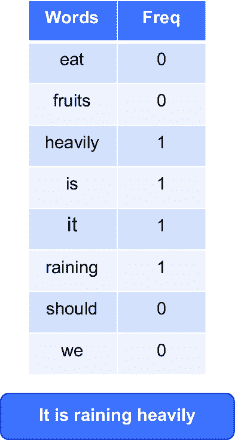
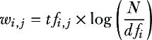
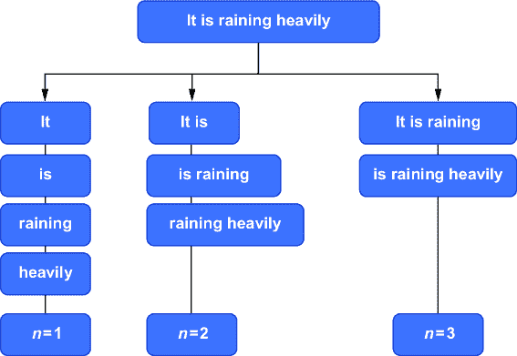
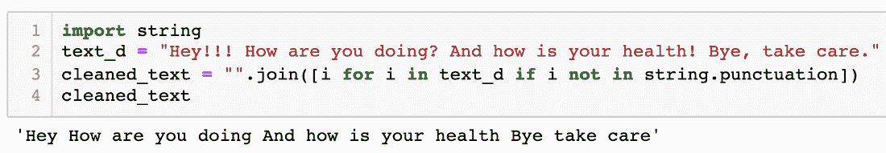
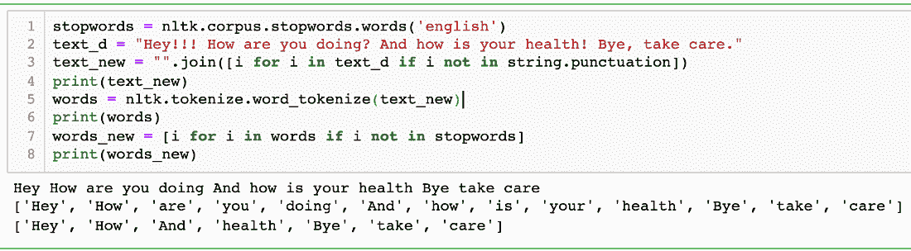
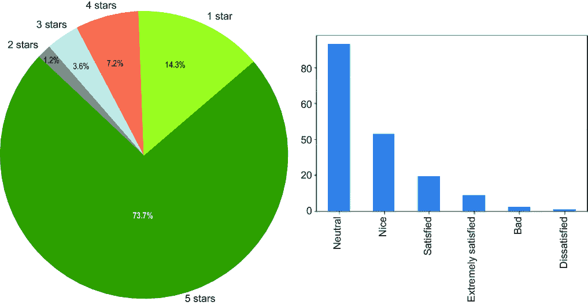
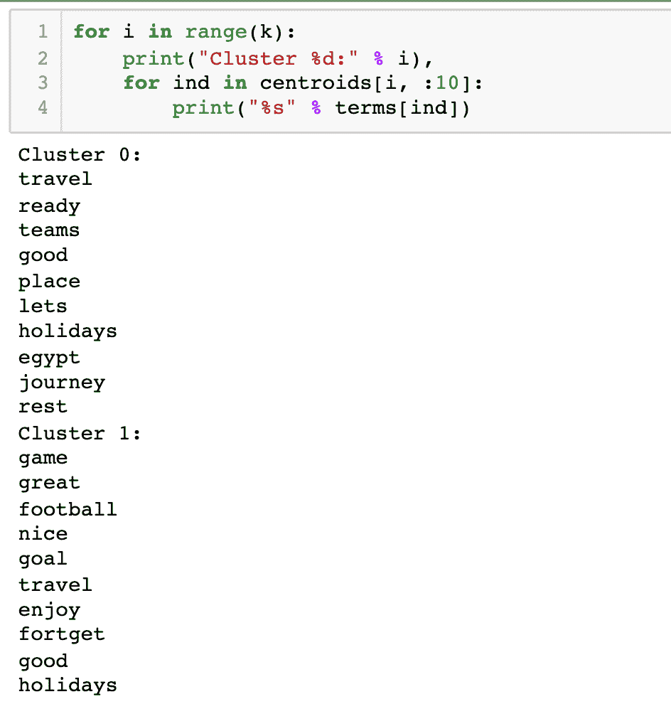

# 第七章：文本数据的无监督学习

### 本章涵盖

+   文本数据分析：用例和挑战

+   文本数据的预处理和清洗

+   文本数据的向量表示方法

+   使用 Python 进行情感分析和文本聚类

+   文本数据的生成式 AI 应用

> 所有人都用同一种语言微笑。——乔治·卡林

我们的世界有如此多的语言。这些语言是我们表达思想和情感的最常见沟通媒介。这些词可以写成文本。在本章中，我们探讨可以对文本数据进行哪些分析。文本数据属于非结构化数据，并携带大量有用信息，因此是商业洞察的有用来源。我们使用自然语言处理（NLP）来分析文本数据。

同时，为了分析文本数据，我们必须使数据分析就绪。或者用非常简单的话说，由于我们的算法和处理器只能理解数字，我们必须用数字或*向量*来表示文本数据。我们将在本章中探讨所有这些步骤。文本数据是许多重要用例的关键，例如情感分析、文档分类和语言翻译，仅举几例。我们将通过案例研究来涵盖这些用例，并在同一平台上开发 Python 解决方案。

本章首先定义文本数据、文本数据的来源以及文本数据的各种用例。然后，我们将继续讨论清洗和处理文本数据的步骤和过程。我们将涵盖 NLP 的概念、数学基础以及将文本数据表示为向量的方法。我们将为用例编写 Python 代码。在结尾部分，我们将分享一个关于文本数据的案例研究。最后，我们还将探讨基于生成式 AI（GenAI）的解决方案。由于它们在第三部分有所涉及，本书中尚未涵盖 GenAI 的概念。但在这里，我们将根据文本数据介绍这些概念。

欢迎来到第七章，祝大家一切顺利！

## 7.1 技术工具包

我们将继续使用迄今为止相同的 Python 和 Jupyter Notebook 版本。本章中使用的代码和数据集已在相同的 GitHub 位置进行检查。

为了本章，你需要安装以下 Python 库：`re`、`string`、`nltk`、`lxml`、`requests`、`pandas`、`textblob`、`matplotlib`、`sys`、`sklearn`、`scikitlearn`和`warnings`。除了这些，你还需要`numpy`和`pandas`。有了这些库，我们可以非常快速地使用算法。

## 7.2 文本数据无处不在

在本书的第一章，我们探讨了结构化和非结构化数据集。非结构化数据可以是文本、音频、图像或视频。图 7.1 中给出了非结构化数据及其相应来源的示例，其中我们解释了非结构化数据的主要类型——文本、图像、音频和视频——以及示例。本章的重点是文本数据。


##### 图 7.1 非结构化数据可以是文本、图像、音频或视频。在本章中，我们处理文本数据。这个列表并不全面。

语言可能是我们沟通的最强大工具。当以书面形式存在时，它变成了文本数据。如今，得益于广泛可用的电脑和智能手机，文本无处不在。它通过撰写博客、社交媒体帖子、推文、评论、故事、评论等方式生成。文本数据通常比图像更直接，并且可以表达情感。对于企业来说，解锁文本数据的潜力并从中获得洞察力是有用的。他们可以更好地理解客户，探索业务流程，并评估所提供服务的质量。

你是否曾在亚马逊上评论过产品或服务？你给产品打星；同时，你也可以输入自由文本。去亚马逊看看一些评论。你可能会发现一些评论有大量的文本作为反馈。这些文本对产品/服务提供商来说很有用，可以帮助他们提升产品或服务。此外，你可能参与过一些要求你分享反馈的调查。此外，随着 Alexa、Siri、Cortona 等语音助手的出现，语音命令充当了人类与机器之间的接口——这又是一个丰富的数据来源。甚至我们打给客服中心的电话也可以转录，这样它们就变成了文本数据。这些电话可以被录音，并且使用语音转文本转换，我们可以生成大量的文本数据。

## 7.3 文本数据的应用案例

本节中讨论的并非所有用例都可以实现无监督学习。一些还需要监督学习。然而，为了增加你的知识，我们根据监督学习和无监督学习分享这两种类型的用例：

+   *情感分析*——你可能参加过调查或对产品/调查提供反馈。这些调查产生了大量的文本数据。这些文本数据可以进行分析，我们可以确定评论中的情感是正面还是负面。简单来说，情感分析衡量文本数据的积极或消极。因此，我们可以看到客户对产品或服务的看法。我们可以使用监督学习和无监督学习进行情感分析。

+   *新闻分类或文档分类*——查看谷歌新闻网页，你会发现每条新闻都被分类到体育、政治、科学、商业或其他类别。进入的新闻是根据新闻内容进行分类的，即实际的文本。想象一下以这种方式排序的成千上万份文件。在这个用例中，很明显，鉴于手动排序此类项目所需的时间和精力不可行，机器学习是理想的。监督学习解决方案对这类问题效果良好。

+   *语言翻译*—将文本从一种语言翻译成另一种语言是一个非常有趣的用例。使用自然语言处理（NLP），我们可以在不同语言之间进行翻译。语言翻译非常棘手，因为不同的语言有不同的语法规则。通常，基于深度学习的解决方案最适合语言翻译。

+   *垃圾邮件过滤*—可以使用自然语言处理（NLP）和监督机器学习来设置电子邮件垃圾邮件过滤器。一个监督学习算法可以分析传入的邮件参数，并预测该邮件是否属于垃圾邮件文件夹。预测可以基于各种参数，如发件人电子邮件 ID、主题行、邮件正文、附件、邮件时间等。通常，在这里使用监督学习算法。

+   *词性标注*—这是其中一个流行的用例。这意味着我们可以在句子中区分名词、形容词、动词、副词等。命名实体识别也是自然语言处理（NLP）的著名应用之一。它涉及在句子中识别人、地点、组织、时间或数字。例如，约翰住在伦敦，在谷歌工作。命名实体识别可以生成类似[John][Person]住在[London][Location]并为[Google][organization]工作的理解。

+   *句子生成、图像标题、语音转文本或文本转语音任务以及手写识别*—这些都是一些其他重要且流行的用例。

这里列出的用例并不全面。还有许多其他可以用自然语言处理（NLP）实现的用例。自然语言处理（NLP）也是一个非常流行的研究领域。我们在本章末尾分享了一些重要的论文。

你可能也听说过像 ChatGPT、Bard 和 Claude 这样的大型语言模型（LLMs）。它们是处理自然语言输入并基于它们已经看到的预测下一个单词的算法。在通用人工智能（GenAI）的背景下，许多用例可以通过简单地调用 API 来解决。ChatGPT 可以像有记忆的人类一样进行交流，并为许多服务提供客户支持。LLMs 可以总结数百份 PDF 文档。你甚至可以创建可以用于从多个文档和网站上获取答案的应用程序。当然，通用人工智能在这里增强了这种能力。

虽然文本数据非常重要，但同时分析起来也相当困难。记住，我们的计算机和处理器只理解数字。因此，文本需要被表示为数字，这样我们才能对其进行数学和统计计算。在深入准备文本数据之前，我们讨论了我们在处理文本数据集时面临的挑战。

## 7.4 文本数据面临的挑战

文本是一种难以处理的数据类型。表达相同思想有多种排列组合。例如，我可能会问，“嘿，伙计，你多大了？”或者“你好，我可以知道你多大了？”——它们的意思是一样的，对吧？这两个问题的答案是一样的，对人类来说很容易理解，但对机器来说可能是一项艰巨的任务。

在这个领域，我们面临的一些最常见的挑战如下：

+   文本数据可能难以处理。文本中可能存在大量的垃圾字符，如$^%*&。

+   随着现代通信的出现，我们开始使用单词的缩写形式；例如，“u”可以表示“你”，“brb”表示“马上回来”，等等。此外，挑战在于同一个词对不同的人来说可能有不同的含义，或者一个字母的拼写错误可能会改变整个词的意义。

+   语言正在变化，没有界限，并且不断进化。它每天都在变化，新的词汇被添加到语言中。如果你进行简单的谷歌搜索，你会发现每年都有很多词汇被添加到词典中。

+   世界上有近 6500 种语言，每一种都承载着其独特的特征。每一种语言都完善了我们的世界。每一种语言都遵循其自身的规则和语法，这些规则和模式在用法上都是独特的。甚至书写方式也可能不同：有的从左到右书写，有的从右到左书写，有的甚至垂直书写。同样的情感在不同的语言中可能需要更少或更多的词汇。

+   一个词的意义取决于上下文。一个词可以是形容词也可以是名词，这取决于上下文。考虑以下例子：

    +   “这本书是必读之作”和“请为我预订一个房间。”

    +   “Tommy”可以是一个名字，但用作“Tommy Hilfiger”时，其用法完全改变。

    +   “苹果”既是水果也是公司。

    +   “四月”是一个月份，也可以是一个名字。

+   看一个更例子：“马克从英国旅行到法国，并在那里与约翰一起工作。他想念他的朋友们。”人类可以轻易地理解第二个句子中的“他”指的是马克而不是约翰，这可能对机器来说并不那么简单。

+   对于同一个词，可能有多个同义词，例如，“好”可以用“积极”、“精彩”、“出色”或“卓越”在不同的场景中替换。像“学习”、“勤奋”和“学习”这样的词与同一个词根“学习”相关。

+   文本数据的大小也可能令人畏惧。管理文本数据集，存储它，清理它，并更新它是一项艰巨的任务。

就像任何其他机器学习项目一样，文本分析遵循机器学习的原则，尽管精确的过程略有不同。回想一下第一章我们考察了机器学习项目的过程，如图 7.2 所示。如果你需要，建议你回顾一下第一章中的过程。


##### 图 7.2 数据科学项目中整体步骤对于文本数据是相同的。文本数据的预处理与结构化数据集非常不同。

定义业务问题、数据收集和监控等保持不变。主要区别在于文本的处理，这涉及到数据清理、特征创建、文本数据表示等。我们将在下一节中介绍。

##### 练习 7.1

回答这些问题以检查你的理解：

1.  注意文本数据最有效的三个用例。

1.  为什么处理文本数据如此繁琐？

## 7.5 预处理文本数据

文本数据，就像任何其他数据源一样，可能会很混乱和嘈杂。我们在数据发现阶段清理一些，在预处理阶段清理很多。同时，我们应该从我们的数据集中提取特征。清理过程中的某些步骤是常见的，可以在大多数文本数据集中实现。某些文本数据集可能需要定制的方法。我们首先从清理原始文本数据开始。

## 7.6 数据清理

与任何形式的数据分析一样，确保良好的数据质量至关重要。文本数据越干净，分析就越好。同时，预处理不是一个简单的任务，而是一个复杂且耗时的任务。

文本数据必须被清理，因为它包含大量的垃圾字符、无关的词、噪声和标点符号、URL 等。清理文本数据的主要方式包括

+   *停用词去除*——在所有任何语言中使用的词中，有一些是最常见的。停用词是在词汇中最常见的词，它们的重要性低于关键词。例如，“是”、“一个”、“这”、“一个”、“是”、“有”、“曾经”、“它”等。一旦我们从文本中去除停用词，数据的维度就减少了，因此解决方案的复杂性也减少了。

我们可以定义一个定制的停用词列表并以此方式去除它们，或者有标准库可以去除停用词。

同时，在去除停用词时，我们必须非常了解上下文。例如，如果我们问一个问题“是否在下雨？”那么答案“是的”本身就是完整的答案。当我们处理上下文信息重要的解决方案时，我们不去除停用词。

+   *基于频率的词去除*——有时你可能希望去除你文本中最常见的词或者非常独特的词。这个过程是获取文本中词的频率，然后设置一个频率阈值。我们可以去除最常见的词。或者你可能希望去除在整个数据集中只出现一次/两次的词。根据需求，你将做出决定。同时，我们在去除词的时候应该谨慎并尽职。

+   *基于库的清理*——当我们希望使用预定义和定制的库来清理数据时，会进行此操作。我们可以创建一个包含我们不希望出现在文本中的单词的仓库，并迭代地从文本数据中移除它们。这种方法使我们能够灵活地实施我们自己的选择来清理。

+   *垃圾或不想要的字符*——文本数据，尤其是推文、评论等，可能包含大量的 URL、标签、数字、标点符号、社交媒体提及、特殊字符等。我们可能需要从文本中清理它们。同时，我们应该小心，因为在一个领域不重要的单词可能在另一个领域是必需的。如果数据是从网站或 HTML/XML 源抓取的，我们需要去除所有的 HTML 实体、标点符号、非字母字符等。

TIP  在清理文本数据时，始终牢记业务背景。

正如我们所知，许多新的表达方式已经进入语言中——例如，lol，hahahaha，brb，rofl 等。这些表达应该转换为它们的原始含义。甚至像:-) ，;-) 这样的表情符号也应该转换为它们的原始含义。

+   *数据编码*——有一些数据编码可供选择，如 ISO/IEC，UTF-8 等。通常，UTF-8 是最受欢迎的。但这并不是一个硬性规定，总是只能使用 UTF-8。

+   *词典规范化*——根据上下文和用法，同一个词可能会有不同的表示方式。在词典规范化过程中，我们清理这些歧义。基本思想是将单词还原到其词根形式。因此，来自彼此的单词可以映射到中心词，前提是它们有相同的核心意义。

图 7.3 显示，相同的单词“eat”被用于各种形式。词根是“eat”，但这些不同的形式展示了“eat”的许多不同表示形式。


##### 图 7.3 “Ate”，“eaten”，“eats”和“eating”都有相同的词根：“eat”。词干提取和词形还原都可以用来获取词根。

在这里，我们希望将这些像“eating”，“eaten”等单词映射到它们的中心词“eat”，因为它们有相同的核心意义。处理这个问题有两种主要方法：

+   +   词干提取是一种基本的基于规则的将单词映射到其核心词的方法。它从单词的末尾移除“es”，“ing”，“ly”，“ed”等。例如，“studies”将变成“studi”，“studying”将变成“study”。作为一个基于规则的方法，输出拼写可能并不总是准确的。

    +   词形还原是一种有组织的步骤，它将单词还原到它们的词典形式。一个单词的*词元*是其词典或规范形式。例如，“eats”，“eating”，“eaten”等，都有相同的词根“eat”。词形还原比词干提取提供更好的结果，但它需要更多的时间。

这些只是清理文本数据的一些方法。这些技术会有所帮助，但还需要商业洞察力来进一步理解数据集。我们将通过开发 Python 解决方案来使用这些方法清理文本数据。

数据清理完毕后，我们开始处理数据的表示，以便它可以被机器学习算法处理，这是我们下一个话题。

## 7.7 从文本数据集中提取特征

我们已经探讨了清理杂乱文本数据的概念和技术。现在我们已经清理了数据，它已经准备好被使用。下一步是将这些数据以算法可以理解的形式表示出来。正如我们所知，我们的算法只能理解数字。

一种非常简单的将文本数据编码成对机器学习有用的方式是简单地对我们单词进行独热编码，并以矩阵的形式表示它们——但如果你有一个完整的文档，这肯定不是一个可扩展的方法。

注意：独热编码在附录中有介绍。

首先将单词转换为小写，然后按字母顺序排序。然后为它们分配一个数字标签。最后，将单词转换为二进制向量。让我们用一个例子来理解。

如果文本是“它正在下大雨”，我们将使用以下步骤：

1.  将单词转换为小写，以便输出结果为“it is raining heavily。”

1.  按字母顺序排列它们。结果是 heavily, is, it, raining。

1.  将每个单词分配一个位置值，例如 heavily:0, is:1, it:2, raining:3。

1.  将它们转换为如这里所示的二进制向量：

[0\. 0\. 1\. 0.] #it

[0\. 1\. 0\. 0.] #is

[0\. 0\. 0\. 1.] #raining

[1\. 0\. 0\. 0.]] #heavily

如我们所见，我们能够用二进制向量表示每个单词，其中 0 或 1 是每个单词的表示。尽管这种方法非常直观且易于理解，但在我们有一个庞大的语料库和词汇表时，在实践上是不可能的。

注意：语料库指的是一组文本。它在拉丁语中意为“身体”。它可以是一组书面文字或口头文字，可以用来进行语言分析。

此外，处理具有如此多维度的海量数据将非常昂贵。因此创建的矩阵也将非常稀疏。因此，我们应该考虑其他方法和手段来表示我们的文本数据。

与独热编码相比，有更好的替代方案。这些技术关注单词的频率或单词被使用的上下文。这种文本表示的科学方法更加准确、健壮和具有解释性。有多个这样的技术，如词频-逆文档频率（TF-IDF）、词袋方法等。我们将在本章后面讨论这些技术中的几个。首先，我们需要检查分词这个重要概念。

## 7.8 分词

分词简单来说就是将文本或一组文本分解成单个标记。它是自然语言处理的基石。看看图 7.4 中的例子，我们为句子中的每个单词创建了单个标记。分词是一个重要的步骤，因为它允许我们为每个单词分配唯一的标识符或标记。一旦我们为每个单词分配了特定的标记，分析就会变得不那么复杂。


##### 图 7.4 分词可以将句子分解成不同的单词标记。

标记通常用于单个单词，但这并不总是必要的。我们允许对单词或单词中的子词或字符进行分词。在子词的情况下，同一个句子可以有子词标记，如“rain-ing”（即“rain”和“ing”作为单独的子标记）。

如果我们希望在字符级别进行分词，那可能就是“r-a-i-n-i-n-g”。事实上，在上一个章节讨论的一热编码方法的第一步中，对单词进行了分词。在字符级别进行分词不一定总是需要。

注意：分词是自然语言处理解决方案的基石。

一旦我们获得了标记，就可以使用这些标记来准备词汇表。词汇表是语料库中所有唯一标记的集合。

有多个库用于分词。*正则表达式*分词使用给定的模式参数来匹配标记或标记之间的分隔符。*空白符*分词将任何空白字符序列视为分隔符。然后我们有*空白行*，它使用空白行序列作为分隔符。最后，*单词和标点符号*通过匹配一系列字母字符和一系列非字母和非空白字符进行分词。当我们在文本数据中创建 Python 解决方案时，我们将执行分词操作。

接下来，我们将探讨更多表示文本数据的方法。第一种方法是词袋（BOW）方法。

## 7.9 词袋方法

正如其名所示，语料库中的所有单词都被使用。在词袋方法中，对语料库中的每个单词进行分词，然后计算每个标记的相应频率。在这个过程中，我们忽略了单词的语法、顺序和上下文。我们只关注简单性。因此，我们将每个文本（句子或文档）表示为其“自己的单词袋”。

在整个文档的词袋方法中，我们将语料库的词汇定义为语料库中出现的所有唯一单词。请注意，我们使用语料库中的所有唯一单词。如果我们想，我们也可以设置一个阈值（即所选单词频率的上限和下限）。一旦我们有了唯一单词，每个句子都可以用一个与基本词汇向量相同维度的向量来表示。这种向量表示包含了句子中词汇中每个单词的频率。这可能听起来很复杂，但实际上这是一个简单直接的方法。

让我们用一个例子来理解这种方法。假设我们有两个句子：“It is raining heavily”和“We should eat fruits.”为了表示这两个句子，我们计算这些句子中每个单词的频率，如图 7.5 所示。


##### 图 7.5 已计算每个单词的频率。在这个例子中，我们有两个句子。

现在如果我们假设这两个句子中的单词代表整个词汇表，我们可以将第一个句子表示如图 7.6 所示。请注意，表中包含所有单词，但句子中不存在的单词已收到 0 的值。



##### 图 7.6 我们假设词汇表中只有两个句子，第一个句子将按如下所示表示。

在这个例子中，我们考察了如何使用 BOW 方法将句子表示为一个向量。但是，BOW 方法并没有考虑单词的顺序或上下文。它只关注单词的频率。因此，它是一种非常快速的数据表示方法，与同类方法相比，计算成本更低。由于它是基于频率的，它通常用于文档分类。

但是，由于其纯粹基于频率的计算和表示，使用 BOW 方法的解决方案准确性可能会受到影响。在语言中，单词的上下文起着重要作用。正如我们之前看到的，苹果既是水果也是一个著名的品牌和组织。这就是为什么我们有其他更先进的方法，这些方法考虑的参数比频率更多。其中一种方法就是 TF-IDF，我们将在下一节学习。

##### 练习 7.2

回答这些问题以检查你的理解：

1.  用简单的话解释分词，就像你向一个不知道 NLP 的人解释一样。

1.  词袋模型方法使用单词的上下文，而不仅仅是频率。对还是错？

1.  词形还原比词干提取方法不那么严格。对还是错？

## 7.10 术语频率和逆文档频率

在 BOW 方法中，我们只重视单词的频率。但是，频率较高的单词并不总是比罕见但更重要单词提供的信息更有意义。例如，假设我们有一组医学文档，我们希望比较两个单词：“疾病”和“糖尿病”。由于语料库由医学文档组成，单词“疾病”肯定更频繁，而单词“糖尿病”将较少出现但更重要，以识别处理糖尿病的文档。术语频率和逆文档频率（TF-IDF）方法使我们能够解决这个问题，并从更重要的单词中提取信息。

在 TF-IDF 中，我们考虑单词的相对重要性。TF 代表术语频率，IDF 代表逆文档频率。我们可以这样定义 TF-IDF：

+   TF 是整个文档中一个术语的计数（例如，单词“a”在文档“D”中的计数）。

+   IDF 是整个语料库中总文档数(*N*)与包含单词“a”的文档数(*d**f*)之比的对数。

因此，TF-IDF 公式将给我们整个语料库中单词的相对重要性。数学公式是 TF 和 IDF 的乘积，由方程 7.1 给出：



##### (7.1)

其中*N*是语料库中文档的总数，*tf*[*i*][,][*j*]是单词在文档中的频率，*df*[*i*]是语料库中包含该单词的文档数。

这个概念可能听起来很复杂。让我们用一个例子来理解这个概念。假设我们有一百万篇体育期刊的集合。这些体育期刊包含各种长度的文章。我们还假设所有文章都只使用英语。所以，在这些文档中，我们想要计算“地面”和“反手”这两个词的 TF-IDF 值。

假设我们有一篇包含 100 个单词的文档，其中“地面”这个词出现了 5 次，而“反手”只出现了 2 次。因此，“地面”的 TF 是 5/100 = 0.05，而“反手”的 TF 是 2/100 = 0.02。

我们了解到，“地面”这个词在体育中相当常见，而“反手”这个词则不太常用。现在我们假设在 100 万份文档中有 10 万份包含“地面”，而“反手”只出现在 10 份中。因此，“地面”的 IDF 是 log (1,000,000/100,000) = log (10) = 1。对于“反手”，它将是 log (1,000,000/10) = log (100,000) = 5。

要得到“地面”的最终值，我们需要将 TF 和 IDF 相乘，即 0.05 × 1 = 0.05。要得到“反手”的最终值，我们需要将 TF 和 IDF 相乘，即 0.02 × 5 = 0.1。

在这个例子中，我们可以观察到“反手”这个词的相对重要性比“地面”这个词的相对重要性更高。这是 TF-IDF 相对于基于频率的 BOW 方法的优点。但是，与 BOW 相比，TF-IDF 的计算需要更多的时间，因为所有 TF 和 IDF 都必须计算。尽管如此，TF-IDF 在这种情况下提供了一个更好、更成熟的解决方案。因此，在讨论单词相对重要性的情况下，我们可以使用 TF-IDF。例如，如果任务是筛选关于心脏病学的医学文档，那么“血管造影”这个词的重要性会更高，因为它与心脏病学的关系更为密切。

到目前为止，我们已经介绍了 BOW 和 TF-IDF 方法。但在这些方法中，我们都没有考虑单词的顺序，这是语言模型所涵盖的内容。我们将在下一节介绍语言模型。

## 7.11 语言模型

语言模型为单词序列分配概率。N-gram 是语言模型中最简单的。我们知道，为了分析文本数据，它们必须被转换为特征向量。N-gram 模型创建特征向量，以便文本可以以可以进一步分析的形式表示。

N-gram 是一种概率语言模型。在 n-gram 模型中，我们计算给定 (*N* – 1) 个单词序列的第 *N* 个单词的概率。更具体地说，n-gram 模型将根据单词 *x*[*i*][–(][*n–*][1][)]，*x*[*i*][–(][*n–*][2][)]…*x*[*i*][–1] 来预测下一个单词 *x*[*i*]。如果我们希望使用概率术语，我们可以将它们表示为给定先前单词的 *x*[*i*] 的条件概率，可以表示为 *P*(*x*[*i*] | *x*[*i*][–(][*n–*][1][)], *x*[*i*][–(][*n–*][2][)]…*x*[*i*][–1])。概率是通过使用文本语料库中出现的序列的相对频率来计算的。

注意：如果项目是单词，n-gram 可以被称为 *shingles*。

让我们用一个例子来研究这个问题。我们将取一个句子，然后通过使用句子中的单词来分解其含义。考虑我们有一个句子“它正在下大雨。”我们通过在图 7.6 中使用不同的 *n* 值来展示这个句子的相应表示。你应该注意，对于不同的 *n* 值，单词序列及其相应的组合是如何变化的。如果我们希望使用 *n* = 1 或单个单词来进行预测，表示将如图 7.7 所示。注意，这里每个单词都是单独使用的。它们被称为 *unigrams*。



##### 图 7.7 单词、二元组和三元组可以用来表示同一个句子。这个概念也可以扩展到 n-gram。

如果我们希望使用 *n* = 2，使用的单词数量将变为两个。它们被称为 *bigrams*。如果我们使用 *n* = 3，单词数量变为三个，它们被称为 *trigrams*，依此类推。

因此，如果我们有一个 unigram，它是一个单词的序列；对于两个单词，它是一个 bigram；对于三个单词，它是一个 trigram；依此类推。所以，一个 trigram 模型将通过使用前两个单词的条件概率来近似给定所有先前单词的单词概率，而一个 bigram 将通过只考虑前一个单词来完成同样的工作。这确实是一个有效的假设，即单词的概率将只取决于前一个单词，这被称为 *Markov* 假设。通常，*n* > 1 被认为比 unigrams 更有信息量。但显然，计算时间也会增加。

n-gram 方法对 *n* 的选择非常敏感。它还显著依赖于所使用的训练语料库，这使得概率高度依赖于训练语料库。因此，如果遇到未知单词，模型在处理这个新单词时将非常困难。

接下来，我们创建一个 Python 示例。我们将展示一些使用 Python 进行文本清理的示例。

## 7.12 使用 Python 进行文本清理

您可能需要安装几个库。我们将展示一些小的代码片段。建议您按照示例使用它们。我们还包括代码片段及其结果的相应截图：

代码 1：删除文本中的空白空间。导入库`re`；它被称为正则表达式（`Regex`）。文本是“外面在下雨”，其中包含很多空白空间（见图 7.8）：

```py
import re
doc = "It is     raining       outside"
new_doc = re.sub("\s+"," ", doc)
print(new_doc)
```


##### 图 7.8 删除空白空间

代码 2：现在我们将从文本数据中删除标点符号（见图 7.9）：

```py
text_d = "Hey!!! How are you doing? And how is your health! Bye, take care."
re.sub("[^-9A-Za-z ]", "" , text_d)
```


##### 图 7.9 删除标点符号

代码 3：这里还有一种删除标点的方法（见图 7.10）：

```py
import string
text_d = "Hey!!! How are you doing? And how is your health! Bye, take care."
cleaned_text = "".join([i for i in text_d if i not in string.punctuation])
cleaned_text
```



##### 图 7.10 删除标点的另一种方法

代码 4：我们现在将删除标点符号并将文本转换为小写（见图 7.11）：

```py
text_d = "Hey!!! How are you doing? And how is your health! Bye, take care."
cleaned_text = "".join([i.lower() for i in text_d if i not in 
string.punctuation])
cleaned_text
```


##### 图 7.11 将文本转换为小写

代码 5：这里使用标准的`nltk`库进行标记化（见图 7.12）：

```py
import nltk
text_d = "Hey!!! How are you doing? And how is your health! Bye, take care."
nltk.tokenize.word_tokenize(text_d)
```


##### 图 7.12 标记化

注意，在代码的输出中，我们包含了所有的单词，包括标点符号，作为不同的标记。如果您希望排除标点符号，可以使用之前分享的代码片段进行清理。

代码 6：接下来是停用词。我们将使用`nltk`库来删除停用词。之后，我们对单词进行标记化（见图 7.13）：

```py
stopwords = nltk.corpus.stopwords.words('english')
text_d = "Hey!!! How are you doing? And how is your health! Bye, take care."
text_new = "".join([i for i in text_d if i not in string.punctuation])
print(text_new)
words = nltk.tokenize.word_tokenize(text_new)
print(words)
words_new = [i for i in words if i not in stopwords]
print(words_new)
```



##### 图 7.13 删除停用词并进行单词标记化

代码 7：我们现在将对一个文本示例进行词干提取。我们使用`nltk`库来完成这项工作。首先对单词进行标记化，然后应用词干提取（见图 7.14）：

```py
import nltk
from nltk.stem import PorterStemmer
stem = PorterStemmer()
text = "eats eating studies study"
tokenization = nltk.word_tokenize(text)
for word in tokenization:
    print("Stem for {} is {}".format(word, stem.stem(word)))
```


##### 图 7.14 标记化然后词干提取单词

代码 8：我们现在对一个文本示例进行词形还原。我们使用`nltk`库来完成这项工作。首先对单词进行标记化，然后应用词形还原（见图 7.15）：

```py
import nltk
from nltk.stem import WordNetLemmatizer
wordnet_lemmatizer = WordNetLemmatizer()
text = "eats eating studies study"
tokenization = nltk.word_tokenize(text)
for word in tokenization:
    print("Lemma for {} is {}".format(word, wordnet_lemmatizer.lemmatize(word)))
```


##### 图 7.15 标记化然后词形还原单词

观察并比较词干提取和词形还原两种输出的差异。对于“studies”和“studying”，词干提取生成了“studi”的输出，而词形还原生成了正确的“study”输出。

到目前为止，我们已经介绍了 BOW、TF-IDF 和 n-gram 方法。但在所有这些技术中，都忽略了单词之间的关系。这种关系在词嵌入中得到了应用，这是我们下一个话题。

## 7.13 词嵌入

> 一个词的特点在于它所伴随的词。——约翰·鲁伯特·费思

到目前为止，我们已经研究了多种方法，但所有技术都忽略了单词之间的上下文关系。让我们用一个例子来更仔细地看看。

假设我们的词汇量中有 100,000 个单词，从“aa”（玄武岩熔岩）到“zoom。”现在，如果我们执行独热编码，所有这些单词都可以以向量形式表示。每个单词都将有一个唯一的向量。例如，如果单词“king”的位置是 21,000，那么向量将具有以下形状，第 21,000 个位置为 1，其余位置为 0：

```py
[0,0,0,0,0,0,0,0,0,0,0,0,0,0,0,0…………………1, 0,0,0,0,0,0,0,0,0,0,0,0,0,0,0,0]
```

这种方法有几个明显的问题：

+   维度数量非常高，计算起来很复杂。

+   数据在本质上非常稀疏。

+   如果必须输入*n*个新单词，词汇量将增加*n*，因此每个向量的维度也将增加*n*。

+   这种方法忽略了单词之间的关系。我们知道“ruler”、“king”和“monarch”有时可以互换使用。在独热编码方法中，任何此类关系都被忽略。

如果我们希望执行语言翻译或生成聊天机器人，我们需要将这些知识传递给机器学习解决方案。词嵌入提供了解决方案。它们将高维度的单词特征转换为低维度，同时保持上下文关系。词嵌入使我们能够创建更通用的模型。我们可以通过查看示例来理解意义。

注意：在启用 LLM 的解决方案中，你可能不需要执行很多这些步骤。

在图 7.16 所示的示例中，“man”与“woman”的关系类似于“king”与“queen”；“good”与“nice”的关系类似于“bad”与“awful”；或者“UK”与“London”的关系类似于“Japan”与“Tokyo”。


##### 图 7.16 词嵌入可以用来表示单词之间的关系。例如，存在从“men”到“women”的关系，这与“king”到“queen”的关系相似，因为“men-women”和“king-queen”都代表了男女性别关系。

简而言之，使用词嵌入，我们可以表示具有相似意义的单词。词嵌入可以被视为一类技术，其中我们在预定义的向量空间中表示每个单独的单词。语料库中的每个单词都映射到一个向量。基于单词的使用情况来理解分布式表示。因此，可以类似使用的单词具有相似的表现。这使得解决方案能够捕捉单词及其关系的潜在意义。因此，单词的意义起着重要作用。这种表示比 BOW 方法更智能，在 BOW 方法中，每个单词都被单独对待，不考虑其使用情况。此外，与独热编码相比，维度数量更少。每个单词由 10s 或 100s 个维度表示，这比独热编码方法中用于表示的 1000s 个维度要少得多。

我们将在下一节中介绍两种最流行的技术——Word2Vec 和用于词表示的全局向量（GloVe）。Word2Vec 和 GloVe 的数学基础超出了本书的范围。我们提供了对解决方案工作原理的理解，然后使用 Word2Vec 和 GloVe 开发 Python 代码。这一节涉及更多的技术性内容，所以如果您只对解决方案的应用感兴趣，可以跳过下一节。

## 7.14 Word2Vec 和 GloVe

Word2Vec 首次发表于 2013 年。它由 Google 的 Tomas Mikolov 等人开发。我们将在本章末尾分享论文的链接。如果您想详细了解更技术性的元素，建议您仔细研究这篇论文。

Word2Vec 是一组用于生成词嵌入的模型。输入是一个大型文本语料库。输出是一个具有非常多个维度的向量空间。在这个输出中，语料库中的每个词都被分配了一个独特且对应的向量。最重要的是，在语料库中具有相似或共同上下文的词在产生的向量空间中彼此靠近。

在 Word2Vec 中，研究人员引入了两种不同的学习模型——连续词袋（CBOW）和连续跳字模型：

+   在 CBOW 中，模型从周围上下文词的窗口中预测当前词。因此，CBOW 模型根据文本中周围词的上下文来预测目标词。回想一下，在 BOW 方法中，词的顺序不起任何作用。相比之下，在 CBOW 中，词的顺序是重要的。

+   连续跳字模型使用当前词来预测周围窗口的上下文词。在这个过程中，它相对于远距离词，给邻近词分配更多的权重。

GloVe 是一种用于生成词向量表示的无监督学习算法。它由斯坦福大学的 Pennington 等人开发，并于 2014 年推出。它是两种技术的结合：矩阵分解技术和 Word2Vec 中使用的基于局部上下文的学习。GloVe 可以用来找到诸如邮编和城市、同义词等关系。它为具有相同形态结构的词生成单个向量集。

Word2Vec 和 GloVe 都从它们的词的共现信息中学习和理解它们的词向量表示。共现意味着词在一个大型语料库中一起出现的频率。主要区别在于 Word2Vec 是一个基于预测的模型，而 GloVe 是一个基于频率的模型。Word2Vec 在给定一个词的情况下预测上下文，而 GloVe 通过创建一个共现矩阵来学习一个词在给定上下文中出现的频率。

##### 练习 7.3

回答以下问题以检查您的理解：

1.  BOW 比 TF-IDF 方法更严格。对或错？

1.  区分 Word2Vec 和 GloVe。

现在我们将转向案例研究和 Python 实现。

## 7.15 使用 Python 实现的情感分析案例研究

到目前为止，我们已经讨论了许多关于自然语言处理和文本数据的概念。在本节中，我们首先探讨一个商业案例，然后基于此开发一个 Python 解决方案。在这里，我们正在进行情感分析。

产品评论是客户和组织的信息宝库。每当我们要购买任何新产品或服务时，我们往往会查看其他客户的评论。你可能自己已经评论过产品和服务。这些评论可以在亚马逊、博客、调查等地方找到。

让我们考虑一个案例。一家电信运营商收到了来自其客户的投诉、关于服务的评论以及关于整体体验的评论。这些流可以是产品质量、定价、入网体验、注册便捷性、支付流程、一般评论、客户服务等等。我们想要确定评论的一般背景——是正面、负面还是中性。这些评论包括分配的星级数量、实际文本评论、关于产品/服务的优缺点、属性等。然而，存在一些商业问题——例如，

+   有时产品/服务收到的星级数量非常高，而实际评论却相当负面。

+   组织和产品负责人需要知道哪些功能受到客户的喜爱，哪些功能不受客户的喜爱。然后团队可以针对不受欢迎的功能进行改进。

+   需要衡量和关注竞争！组织需要了解其竞争对手的流行产品的属性。

+   产品负责人希望更好地规划他们未来希望发布的即将到来的功能。

因此，业务团队将能够回答这些重要问题：

+   我们的产品和服务的客户满意度如何？

+   客户的主要痛点和不满意是什么？

+   什么驱使了客户的参与度？

+   哪些服务复杂且耗时，哪些是最受欢迎的服务/产品？

这个业务用例将带来以下业务效益：

+   最令人满意和最受欢迎的产品和服务应该继续进行。

+   不受欢迎且收到负面评分的产品应该得到改进，挑战得到缓解。

+   相关团队，如财务、运营、投诉、CRM 等，可以被通知，并且他们可以单独工作以改善客户体验。

+   对于喜欢或不喜欢服务的确切原因将有助于相关团队朝着正确的方向工作。

+   总体而言，它将为衡量客户基础的净推荐分数提供一个基准。企业可以努力提高整体客户体验。

我们可能希望通过仪表板来展示这些发现。这个仪表板将按照定期周期刷新，比如每月或每季度。

为了解决这个商业问题，团队可以从网站、调查、亚马逊、博客等地方收集相关数据。然后可以对数据集进行分析。分析结构化数据相对容易。在这个例子中，我们处理文本数据。

Python Jupyter 笔记本已推送到 GitHub 位置。建议您使用 GitHub 位置的 Jupyter 笔记本，因为它包含更多步骤。步骤如下：

1.  导入所有库：

```py
#### Loading all the required libraries here
from lxml import html  
import requests
import pandas as pd
from nltk.corpus import stopwords
from textblob import TextBlob
import matplotlib.pyplot as plt
import sys
import numpy as np
import pandas as pd
import matplotlib
import matplotlib.pyplot as plt
import sklearn
import scikitplot as skplt
import nltk
#to ignore warnings
import warnings
warnings.filterwarnings("ignore")
nltk.download('stopwords')
nltk.download('punkt')
nltk.download('wordnet')
```

1.  2. 定义标签。这些标签用于从评论中获取产品的属性：

```py
xpath_reviews = '//div[@data-hook="review"]'
reviews = parser.xpath(xpath_reviews)
xpath_rating  = './/i[@data-hook="review-star-rating"]//text()' 
xpath_title   = './/a[@data-hook="review-title"]//text()'
xpath_author  = './/a[@data-hook="review-author"]//text()'
xpath_date    = './/span[@data-hook="review-date"]//text()'
xpath_body    = './/span[@data-hook="review-body"]//text()'
xpath_helpful = './/span[@data-hook="helpful-vote-statement"]//text()'
```

1.  3. 准备好提取数据。我们创建一个数据框来存储客户评论。然后我们遍历所有评论并提取信息：

```py
# Create a dataframe here. 

reviews_df = pd.DataFrame()
for review in reviews:
    rating  = review.xpath(xpath_rating)
    title   = review.xpath(xpath_title)
    author  = review.xpath(xpath_author)
    date    = review.xpath(xpath_date)
    body    = review.xpath(xpath_body)
    helpful = review.xpath(xpath_helpful)

    review_dict = {'rating': rating,
                   'title': title,
                   'author': author,             
                   'date': date,
                   'body': body,
                   'helpful': helpful}
    reviews_df = reviews_df.append(review_dict, ignore_index=True)
all_reviews = pd.DataFrame()
```

1.  4. 遍历评论并填写详细信息：

```py
# Fill the values of the reviews here. 

for i in range(1,90):
    amazon_url = 'https://www.amazon.co.uk/Hive-Heating-Thermostat-Professional-Installation/product-reviews/B011B3J6KY/ref=cm_cr_othr_d_show_all?ie=UTF8&reviewerType=all_revie
ws&pageNumber='+str(i)
    headers = {'User-Agent': user_agent}
    page = requests.get(amazon_url, headers = headers)
    parser = html.fromstring(page.content)
    xpath_reviews = '//div[@data-hook="review"]'
    reviews = parser.xpath(xpath_reviews)
    reviews_df = pd.DataFrame()
    xpath_rating  = './/i[@data-hook="review-star-rating"]//text()' 
    xpath_title   = './/a[@data-hook="review-title"]//text()'
    xpath_author  = './/a[@data-hook="review-author"]//text()'
    xpath_date    = './/span[@data-hook="review-date"]//text()'
    xpath_body    = './/span[@data-hook="review-body"]//text()'
    xpath_helpful = './/span[@data-hook="helpful-vote-statement"]//text()'
    #print(i)
    for review in reviews:
        rating  = review.xpath(xpath_rating)
        title   = review.xpath(xpath_title)
        author  = review.xpath(xpath_author)
        date    = review.xpath(xpath_date)
        body    = review.xpath(xpath_body)
        helpful = review.xpath(xpath_helpful)

        review_dict = {'rating': rating,
                       'title': title,
                       'author': author,             
                       'date': date,
                       'body': body,
                       'helpful': helpful}
        reviews_df = reviews_df.append(review_dict, ignore_index=True)
    #print(reviews_df)
    all_reviews = all_reviews.append(reviews_df)
```

1.  5. 查看我们生成的输出：

```py
all_reviews.head()
```

1.  6. 将输出保存到路径。你可以指定自己的路径：

```py
out_folder = '/Users/Data/'
all_reviews.to_csv(out_folder + 'Reviews.csv')
```

1.  7. 加载数据并进行分析：

```py
#Load the data now and analyse it
data_path = '/Users/vaibhavverdhan/Book/UnsupervisedLearningBookFinal/'
reviewDataCSV = 'Reviews.csv'
reviewData = (pd.read_csv(data_path+reviewDataCSV,index_col=0,))
```

1.  8. 查看数据集的基本信息：

```py
reviewData.shape
reviewData.rating.unique()
reviewData.rating.value_counts()
```

1.  9. 查看评论中给出的星级分布。这将使我们能够理解客户给出的评论：

```py
labels = '5 Stars', '1 Star', '4 Stars', '3 Stars', '2 Stars'
sizes = [reviewData.rating.value_counts()[0], reviewData.rating.value_counts()[1],reviewData.rating.value_counts()[2],rev
iewData.rating.value_counts()[3],reviewData.rating.value_counts()[4]]
colors = ['green', 'yellowgreen', 'coral', 'lightblue', 'grey']
explode = (0, 0, 0, 0, 0)  # explode 1st slice

# Plot
plt.pie(sizes, explode=explode, labels=labels, colors=colors,
        autopct='%1.1f%%', shadow=True, startangle=140)

plt.axis('equal')
plt.show()
```

1.  10. 将文本转换为小写，然后移除停用词和频率最高的词：

```py
reviewData.body = reviewData.body.str.lower()
reviewData.body = reviewData.body.str.replace('[^\w\s]','')
stop = stopwords.words('english')
reviewData.body = reviewData.body.apply(lambda x: " ".join(x for x in 
x.split() if x not in stop))
freq = list(freq.index)
reviewData.body = reviewData.body.apply(lambda x: " ".join(x for x in x.split() if x not in freq))
freq = pd.Series(' '.join(reviewData.body).split()).value_counts()[-10:]
freq = list(freq.index)
reviewData.body = reviewData.body.apply(lambda x: " ".join(x for x in 
x.split() if x not in freq))
```

1.  11. 对数据进行分词：

```py
from nltk.tokenize import word_tokenize
tokens = word_tokenize(reviewData.iloc[1,1])
print(tokens)
```

1.  12. 进行词元还原：

```py
from textblob import Word
reviewData.body = reviewData.body.apply(lambda x: " ".join([Word(word).lemmatize() for word in x.split()]))
reviewData.body.head()
```

1.  13. 将所有评论追加到字符串：

```py
sentimentString = reviewData.iloc[1,1]
# append to this string 
for i in range(2,len(reviewData)):
    sentimentString = sentimentString + reviewData.iloc[i,1]
```

1.  14. 进行情感分析。从`textblob`中获取情感方法。它为情感生成极性和主观性。一个元素的 sentiment 极性是情感在表达中的方向；也就是说，它告诉我们文本是否表达了负面的、正面的或中性的情感。它主观地衡量并量化文本中观点和事实信息量。如果主观性高，这意味着文本中包含的观点比事实多：

```py
# the functions generates polarity and subjectivity here, subsetting the 
polarity only here
allReviewsSentiment = reviewData.body[:900].apply(lambda x: 
TextBlob(x).sentiment[0])
# this contains boths subjectivity and polarity
allReviewsSentimentComplete = reviewData.body[:900].apply(lambda x: 
TextBlob(x).sentiment)
allReviewsSentimentComplete.head()
```

1.  15. 将情感保存到.csv 文件：

```py
allReviewsSentiment.to_csv(out_folder + 'ReviewsSentiment.csv')
```

1.  16. 为情感分配一个含义或标签。我们将每个评分从极度满意到极度不满意进行分类：

```py
allReviewsSentimentDF = allReviewsSentiment.to_frame()
# Create a list to store the data
grades = []

# For each row in the column,
for row in allReviewsSentimentDF['body']:
    # if more than a value,
    if row >= 0.75:
       grades.append('Extremely Satisfied')
    elif (row >= 0.5) & (row < 0.75):
        grades.append('Satisfied')
    elif (row >= 0.2) & (row < 0.5):
        grades.append('Nice')
    elif (row >= -0.2) & (row < 0.2):
        grades.append('Neutral')
    elif (row > -0.5) & (row <= -0.2):
        grades.append('Bad')
    elif (row >= -0.75) & (row < -0.5):
        grades.append('Dis-satisfied')
    elif  row < -0.75:
        grades.append('Extremely Dis-satisfied')
    else:
        # Append a failing grade
        grades.append('No Sentiment')

# Create a column from the list
allReviewsSentimentDF['SentimentScore'] = grades
allReviewsSentimentDF.head()
```

1.  17. 查看情感评分并绘制它们。最后，我们将它们与主数据集合并：

```py
allReviewsSentimentDF.SentimentScore.value_counts()
allReviewsSentimentDF['SentimentScore'].value_counts().plot(kind='bar')
#### Merge the review data with Sentiment generated

reviewData['polarityScore'] = allReviewsSentimentDF['body']     #1
```

#1 添加列 polarityScore

在这个案例研究中，你不仅从网站上抓取了评论，还分析了数据集。如果我们比较情感，我们可以看到产品得到的星级并不代表真实情况。

图 7.17 比较了实际星级和情感分析的结果。我们可以观察到 73%的客户给出了五星评价，7%给出了四星评价，而在情感分析中，大多数评论都被归类为中性。这正是情感分析的真实力量！



##### 图 7.17 比较了左侧原始星级分布和右侧情感分析的真实结果。

情感分析是一个非常重要的用例。它对商业和产品团队非常有用。前面的代码可以扩展到任何手头的商业问题。

现在我们转向第二个案例研究，即使用 Python 进行文档分类。

## 7.16 使用 Python 进行文本聚类

考虑这种情况：我们有一批文本数据集或文档，但它们都是混合在一起的。我们不知道哪些文本属于哪个类别。在这种情况下，我们将假设我们有两种类型的文本数据集：一种包含所有与足球相关的数据，另一种与旅行相关。我们将开发一个可以将这两个类别分开的模型。为此，我们遵循以下步骤：

1.  导入所有库：

```py
from sklearn.feature_extraction.text import TfidfVectorizer
from sklearn.cluster import KMeans
import numpy as np
import pandas as pd
```

1.  2. 创建一个虚拟数据集。这些文本数据包含我们亲自写的几句话。有两个类别：

```py
text = ["It is a good place to travel", 
        "Football is a nice game", "Lets go for holidays and travel to 
Egypt", 
        "It is a goal, a great game.", "Enjoy your journey and forget 
the rest", "The teams are ready for the same" ]
```

1.  3. 使用 TF-IDF 对数据进行向量化：

```py
tfidf_vectorizer = TfidfVectorizer(stop_words='english')
X = tfidf_vectorizer.fit_transform(text)
```

1.  4. 进行聚类：

```py
k = 2
model = KMeans(n_clusters=k, init='k-means++', max_iter=10, n_init=2)
model.fit(X)
```

1.  5. 表示质心并打印输出（见图 7.18）：

```py
centroids = model.cluster_centers_.argsort()[:, ::-1]
features = vectorizer.get_feature_names()

for i in range(k):
    print("Cluster %d:" % i),
    for ind in centroids[i, :10]:
        print("%s" % terms[ind])
```



##### 图 7.18 打印输出

您可以将此示例扩展到其他数据集。从互联网上获取数据集，并在前面的示例中复制代码。

我们已经将代码推送到本书的 GitHub 位置。建议您使用它。这确实是一个表示文本数据的重要来源。

## 7.17 GenAI 用于文本数据

GenAI 解决方案是一种新的无监督解决方案。你肯定听说过 ChatGPT 和 LLMs。它们已经改变了世界。GenAI 用于文本数据使用机器学习模型来创建类似人类的文本。它在大规模数据模式上训练，因此可以生成各种内容片段——例如，文章、技术报告和书籍摘要——并且可以像人类聊天界面一样操作。即使是复杂的多语言翻译，GenAI 也能使其变得简单。

GenAI 用于文本数据涉及使用高级算法，如 transformers，来生成连贯、上下文适当的文本。这些算法在庞大的数据集上训练。想象一下，我们将互联网上存在的海量内容输入到算法中。通过学习单词和句子之间的模式和关系，使用的语法、句法和语义，它们可以创建类似人类的响应。这些模型，如 OpenAI 的 GPT 或 Google 的 BERT，在撰写带有正确语言和语法的电子邮件、创建详细报告、用 Java/C++等语言编写代码模块以及许多其他任务方面非常强大。利用这种力量，内容创作者、作家和版权所有者、品牌经理和营销人员以及企业主可以以更可扩展和高效的方式生产高质量的文本。

尽管 GenAI 具有惊人的潜力，但仍有一些需要改进的领域。有时它会生成不准确的信息，也称为幻觉。确保输出保持无偏见和道德是另一个挑战，因为模型可能会无意中反映它们在训练数据中存在的 societal biases。AI 生成的文本越来越多地用于客户服务，在保持个性化语调的同时自动化响应。研究人员也在探索其在医疗和法律领域的应用，它可以帮助文档编制和起草。虽然 GenAI 正在改变文本生成的方式，但人类监督的需求仍然至关重要，以确保质量、准确性和公平性。

## 7.18 总结性思考

文本数据是最有用的数据集之一。文本中隐藏着大量的智慧：日志、博客、评论、帖子、推文、投诉、评论、文章等等——文本数据的来源很多。组织正在投资建立访问和存储文本数据的基础设施。分析文本数据需要比我们标准笔记本电脑更好的处理能力和更好的机器。它需要特殊的技能集和对概念的深入理解。自然语言处理（NLP）是一个不断发展的领域，正在进行大量的研究。同时，我们也不能忽视良好的商业洞察力和知识的重要性。

数据分析和机器学习并不容易。我们必须理解围绕数据清理、探索、表示和建模的许多概念。但分析非结构化数据可能比分析结构化数据集更复杂。我们在上一章中处理了一个图像数据集，而在本章中，我们处理了文本数据。

文本数据是分析起来最困难的数据集之一。文本数据有如此多的排列组合。清理文本数据是一项困难和复杂的工作。在本章中，我们讨论了几种清理文本数据的重要技术。我们还介绍了一些将文本数据表示为向量形式的方法。建议您练习这些方法，并通过应用每种技术来比较性能。我们还介绍了针对文本数据的 GenAI 概念。

这样，我们就结束了第七章。这也标志着第二部分的结束。在下一部分，复杂性会增加。我们将研究无监督学习算法的更深入概念。

## 7.19 实践下一步行动和推荐阅读

以下提供了一些下一步行动的建议和一些有用的阅读材料：

+   从以下链接获取数据集。您在这里会发现很多文本数据集。建议您实现聚类和降维解决方案：

    +   50 个免费机器学习数据集：自然语言处理：[`mng.bz/ZljO`](https://mng.bz/ZljO)

+   您在 Kaggle 上也会找到很多有用的数据集：[`www.kaggle.com/datasets?search=text`](https://www.kaggle.com/datasets?search=text)

+   查看以下研究论文：

    +   Mikolov, T., Chen, K., Corrado, G., and Dean, J. (2013). 在向量空间中高效估计词表示。[`arxiv.org/pdf/1301.3781.pdf`](https://arxiv.org/pdf/1301.3781.pdf)

    +   Pennington, J., Socher, R., and Manning, C. D. (2014). GloVe：全局词向量表示。[`nlp.stanford.edu/pubs/glove.pdf`](https://nlp.stanford.edu/pubs/glove.pdf)

    +   Das, B., and Chakraborty, S. (2018). 使用 TF-IDF 和下一词否定改进文本情感分类模型。[`arxiv.org/pdf/1806.06407.pdf`](https://arxiv.org/pdf/1806.06407.pdf)

+   考虑以下广为人知的论文：

    +   Blum, A., and Mitchell, T. (1998). 结合有标签和无标签数据与协同训练。[`dl.acm.org/doi/10.1145/279943.279962`](https://dl.acm.org/doi/10.1145/279943.279962)

    +   Knight, K. (2009). 哭泣的贝叶斯推理。[`mng.bz/RVp0`](https://mng.bz/RVp0)

    +   Hofmann, T. (1999). 概率潜在语义索引。[`dl.acm.org/doi/10.1145/312624.312649`](https://dl.acm.org/doi/10.1145/312624.312649)

    +   Hindle, D., and Rooth, M. (1993). 结构歧义和词汇关系。[`aclanthology.org/J93-1005.pdf`](https://aclanthology.org/J93-1005.pdf)

    +   Collins 和 Singer. (1999). 命名实体分类的无监督模型。[`aclanthology.org/W99-0613.pdf`](https://aclanthology.org/W99-0613.pdf)

+   查看关于 TF-IDF 特征加权的全面研究：Das, M., Selvakumar, K., and Alphonse, J. P. A. (2023). TF-IDF 特征加权方法比较研究及其在非结构化数据集上的分析。[`arxiv.org/abs/2308.04037`](https://arxiv.org/abs/2308.04037)

## 摘要

+   文本数据在博客、社交媒体、调查等领域的无处不在，以及其表达情感的能力，强调了这种形式数据的重要性。

+   文本分析的应用包括情感分析、文档分类、语言翻译、垃圾邮件过滤和命名实体识别。

+   文本数据面临的挑战包括处理垃圾字符、多种语言、演化的语言、同义词和基于上下文的意义。

+   数据预处理和清洗包括去除停用词和不需要的字符，并通过词干提取和词形还原来规范化文本。

+   在文本表示技术中，独热编码是基本的但不可扩展；高级技术考虑频率和上下文。

+   分词涉及将文本分解成标记，这是创建分析准备好的数据集的基础。

+   BOW 方法是一种快速、基于频率的方法，它忽略了单词顺序和上下文。

+   TF-IDF 根据重要性而非单纯频率来权衡单词，提供了比 BOW 更深入的分析。

+   语言模型和 n-gram 使用单词序列进行概率预测，包括单词、双词和三词等变体。

+   使用 Python 进行文本解析展示了如何使用 Python 库如`nltk`进行文本数据的清理和预处理。

+   类似于 Word2Vec 和 GloVe 的技术，通过维护词语之间的上下文关系，以实现更好的语义理解。

+   Word2Vec 是基于预测的，而 GloVe 是基于频率的；两者都创建了紧凑且具有意义的词语表示。

+   大型语言模型（LLMs）已经彻底改变了文本数据集的整个格局。
