# 8 深度学习：基础概念

### 本章涵盖

+   深度学习的基本构建块

+   监督和无监督学习方法

+   卷积神经网络和循环神经网络

+   霍尔兹曼学习规则和深度信念网络

+   使用 TensorFlow 和 Keras 进行 Python 编码

+   深度学习库概述

> 简单的艺术是复杂性的谜题。——道格拉斯·霍顿

欢迎来到本书的第三部分。到目前为止，你已经涵盖了大量的概念、案例研究和 Python 代码。从本章开始，复杂度将会更高。

在本书的前两部分中，我们介绍了各种无监督学习算法，如聚类、降维等。我们讨论了简单和高级算法，并在本书的第二部分中介绍了在文本数据上的工作。从本书的第三部分开始，我们将开始深度学习的旅程。

深度学习和神经网络已经改变了世界和商业领域。你可能已经听说过深度学习和神经网络。它们的实现和复杂性导致了更好的癌症检测、自动驾驶汽车、改进的灾害管理系统、更好的污染控制系统、减少交易欺诈等。

在本书的第三部分，我们将探讨使用深度学习进行无监督学习。我们将研究深度学习是什么，神经网络的基础，以及神经网络中的层、激活函数、深度学习的过程和各个库。然后我们将转向自编码器和生成对抗网络（GANs）以及生成人工智能（GenAI）。这些主题确实复杂，有时数学性相当强。我们将使用不同种类的数据集来解决问题，但主要数据集将是非结构化的。像往常一样，Python 将用于生成解决方案。我们还分享了许多外部资源来补充这些概念。请注意，这些是高级主题，对这些主题的研究仍在进行中。

我们将本书的第三部分分为四章。本章涵盖了深度学习和神经网络的基础概念。接下来的两章专注于自编码器、GAN 和 GenAI。本书的最后一章讨论了这些模型的部署。

在本章中，我们讨论了神经网络和深度学习的概念。我们讨论了神经网络是什么，它的激活函数，不同的优化函数，神经网络训练过程等。本章涵盖的概念构成了神经网络和深度学习以及下一章后续学习的基础。因此，了解这些概念至关重要。在章节末尾提供了最佳外部资源，以更详细地学习这些概念。

欢迎来到第八章，祝您一切顺利！

## 8.1 技术工具包

我们将继续使用迄今为止所使用的相同版本的 Python 和 Jupyter Notebook。本章中使用的代码和数据集已在相同的 GitHub 位置进行检查。你将需要在本章中安装几个 Python 库：`tensorflow`和`keras`。

### 8.1.1 深度学习：它是什么？它能做什么？

在过去几年中，深度学习积累了大量的动力。神经网络正在推动机器学习解决方案的边界。深度学习仅仅是机器学习。深度学习基于神经网络。它利用了类似的概念——即使用历史数据，理解收集到的属性和智能，以寻找模式或预测未来，尽管深度学习比我们迄今为止所覆盖的算法更复杂。

回想第一章，我们介绍了结构化和非结构化数据集的概念。非结构化数据集包括文本、图像、音频、视频等。图 8.1 描述了文本、图像、音频和视频数据集的主要来源。

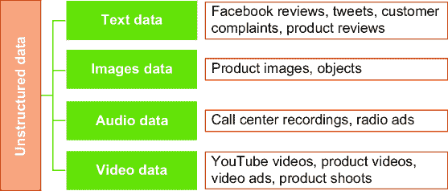

##### 图 8.1 使用深度学习可以分析非结构化数据集，如文本、音频、图像和视频。此类数据集有多个来源。

虽然深度学习也可以用于结构化数据集，但它主要在非结构化数据集上产生了奇迹。其中一个主要原因是，经典机器学习算法有时对图像、文本、音频和视频等非结构化数据集的效果并不那么有效。深度学习在各个领域提供的突破性解决方案中的一些如下：

+   *医疗领域和制药业*—深度学习在识别骨骼和关节问题或确定动脉或静脉中是否有血栓等领域的应用。在制药领域，它加速了临床试验，并有助于更快地达到目标药物。

+   *银行和金融行业*—基于深度学习的算法用于检测交易中的潜在欺诈。通过基于图像识别的算法，我们还可以区分支票上的伪造签名。

+   *汽车行业*—你可能听说过自动驾驶（也称为自动驾驶）汽车。通过深度学习，算法可以检测交通信号、行人、道路上的其他车辆，以及它们相应的距离等。

+   *零售*—在零售行业，通过使用基于深度学习的算法，人类可以提高客户定位并开发高级和定制化的营销策略。通过深度学习改进的推荐模型可以为客户提供更好的产品。我们可以获得更好的投资回报并改善交叉销售和升级销售策略。

此外，深度学习还使得自动语音识别成为可能。通过复杂的神经网络，人类可以创建语音识别算法。这些解决方案正在被 Siri、Alexa、翻译器、百度等广泛应用。

图像识别也在进步。神经网络正在改进图像识别技术。这可以通过卷积神经网络来实现，它们正在改善计算机视觉。用例包括以下内容：

+   深度学习在区分癌细胞和良性细胞方面非常有效。可以通过使用癌细胞和良性细胞的图像来实现区分。

+   已经开发了一个使用神经网络的自动车牌识别系统。

+   可以使用深度学习开发目标检测方法和监控传感与跟踪系统。

+   在灾害管理系统，深度学习可以检测受影响区域的人类存在。想象一下，在救援行动中，如何通过更好的检测来拯救人类生命。

通用人工智能（GenAI）正在迅速改变世界。用例包括自动化内容创作，如撰写文章、论文和社交媒体帖子，以及生成图像和视频。它通过提供即时、个性化的聊天机器人来响应客户的查询，从而改善客户服务和客户体验。它可以应用于任何行业。在数据密集型行业，它通过总结复杂和冗长的文档，并从仪表板和报告中生成见解，产生涟漪效应。例如，这些报告可以是 Power BI/Tableau 仪表板、PowerPoint 或 pdf 文件。它还帮助软件开发者在代码生成和调试中，并提高了软件开发效率。用例很多，从零售；电信；医疗保健；研发；银行、金融和保险等，在提高销售额、降低成本、节省时间和提高准确性方面。

列出的用例当然不是详尽的。使用深度学习，我们可以改进用于衡量客户情绪、语言翻译、文本分类、命名实体识别等自然语言处理解决方案。在生物信息学、军事、移动广告、技术、供应链等领域，深度学习正在为未来铺平道路。

## 8.2 神经网络的基本构建块

人工神经网络（ANNs）据说受到人类大脑工作方式的启发。人类大脑是我们目前能接触到的最佳机器。当我们看到一张图片或一张面孔或听到一段曲调时，我们会将其与一个标签或名称关联起来。这使我们能够训练我们的大脑和感官，以便在再次看到/听到时识别图片或面孔或曲调。ANNs 通过学习或接受训练来学习执行类似任务。

##### 练习 8.1

回答这些问题以检查你的理解：

1.  深度学习的意义是什么？

1.  神经网络不能用于无监督学习。对还是错？

1.  探索在非常规商业领域深度学习的更多用例。

### 8.2.1 用于解决方案的神经网络

在深度学习中，监督学习和无监督学习的概念同样适用。我们将涵盖网络的两种训练类型：监督和无监督。这将为您提供一个完整的图景。同时，为了充分理解无监督深度学习，您应该对监督深度学习过程有清晰的认识。

让我们通过一个例子来理解深度学习过程。考虑这种情况：我们希望创建一个可以识别面部——一个可以通过为面部分配名字来区分面部并识别人的解决方案。为了训练模型，我们将使用一个包含人脸图像和相应名字的数据集。人工神经网络（ANN）将从对图像数据集或属性的无先验理解开始。在训练过程中，它将从训练数据中学习属性和识别特征。这些学到的属性随后被用来区分面部。在此阶段，我们只覆盖了这一过程的高级概述；我们将在后续章节中更详细地介绍这一过程。图 8.2 展示了神经网络的表示。


##### 图 8.2 一个典型的神经网络，包含神经元和各个层次

神经网络中的过程相当复杂。我们首先将涵盖神经网络的所有构建块，如神经元、激活函数、权重、偏置项等，然后继续讨论神经网络中的过程。让我们从主角开始：一个神经元。

### 8.2.2 人工神经元和感知器

人类大脑包含数十亿个神经元。这些神经元是我们大脑中相互连接的细胞。它们接收信号，处理它们，并生成结果。人工神经元仅基于生物神经元，可以被认为是生物神经元的简化计算模型。

在 1943 年，研究人员沃伦·麦克洛克和沃尔特·皮茨提出了一个简化脑细胞的理念，称为麦克洛克-皮茨神经元。它可以被认为是一个具有二进制输出的简单逻辑门。

人工神经元的工作方法与生物神经元相似，尽管人工神经元远比生物神经元简单。感知器是生物神经元的数学模型。在实际的生物神经元中，树突从其他神经元的轴突接收电信号。在感知器中，这些电信号被表示为数值。

人工神经元从前面的神经元接收输入或可以接收输入数据。然后它处理这些输入信息并共享输出。输入可以是原始数据或来自前一个神经元的处理信息。然后神经元将其输入与其自身的内部状态相结合，分别加权，并通过非线性函数传递接收到的输出以生成输出。这些非线性函数也称为激活函数（我们将在后面介绍）。你可以将激活函数视为一个数学函数。一个神经元可以表示如图 8.3 所示。


##### 图 8.3 一个神经元接收输入，使用数学函数处理它们，然后生成输出。

简而言之，一个神经元可以称为一个计算其输入数据集加权平均的数学函数；然后这个总和通过激活函数。神经元的输出然后可以成为下一个神经元的输入，该神经元将再次处理接收到的输入。让我们进一步探讨。

在感知器中，每个输入值都乘以一个称为 *权重* 的因子。生物神经元在输入信号的总强度超过一定阈值时才会触发。感知器遵循类似的格式。在感知器中，计算输入的加权总和以获得输入数据的总强度，然后对每个输出应用激活函数。然后每个输出可以馈送到下一个感知器层。

假设有一个感知器 *X* 的两个输入值，*a* 和 *b*，为了简化，它只有一个输出。设 *a* 和 *b* 的相应权重为 *P* 和 *Q*。因此，加权总和可以计算为 *P* * *X* + *Q* * *b*。只有当加权总和超过某个特定阈值时，感知器才会触发或产生非零输出。我们可以称这个阈值为 *C*。因此，我们可以这样说：

当 *P* * *X* + *Q* * *y* <= *C* 时，*X* 的输出将为 0。

如果 *P* * *S* + *Q* * *y* > *C*，则 *X* 的输出将为 1。

如果我们将这种理解进行推广，我们可以将其表示如下。将感知器表示为一个函数，它将输入 *x* 映射为以下函数：


其中 *x* 是输入值的向量，*w* 代表权重的向量，*b* 是偏置项。我们将在下面解释偏置和权重项。

回忆一下线性方程：*y* = *mx* + *c*，其中 *m* 是直线的斜率，*c* 是常数项。偏置和权重都可以使用相同的线性方程来定义。

权重的作用类似于线性方程中直线的斜率。它定义了 *f*(*x*) 的值随 *x* 值的单位变化而变化。

偏置的作用类似于线性函数中常数的作用。如果没有偏置，激活函数的输入是 *x* 乘以权重。

注意：权重和偏差项是网络中需要训练的参数。

函数的输出将取决于所使用的激活函数。在介绍完网络中的不同层之后，我们将在下一节中介绍各种类型的激活函数。

### 8.2.3 网络中的不同层

组织神经元的简单有效方法是以下所述。而不是允许任意神经元与任意其他神经元连接，神经元被组织成层。一个层的神经元所有输入都只来自前一层，所有输出都只流向下一层。没有其他连接，例如，同一层的神经元之间或属于不同层的神经元之间的连接（对于特殊情况有小的例外，这超出了本书的范围）。

我们知道信息通过神经网络流动。这些信息在网络中从一层传递到另一层进行处理。神经网络中有三层，如图 8.4 所示。

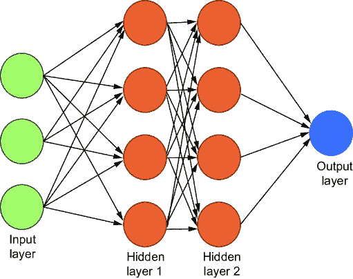

##### 图 8.4 一个典型的神经网络，包含神经元和输入、隐藏和输出层

图 8.4 中所示的神经网络有三个输入单元，两个包含四个神经元的隐藏层和一个最终的输出层：

+   *输入层*—正如其名所示，它接收输入数据并将其与隐藏层共享。

+   *隐藏层*—这是网络的核心和灵魂。隐藏层的数量取决于具体问题；层数可以从几个到几百个不等。所有的处理、特征提取和属性学习都在这些层中完成。在隐藏层中，所有输入的原始数据都被分解为属性和特征。这种学习对后续的决策阶段是有用的。

+   *输出层*—这是网络中的决策层和最后一部分。它接受前面隐藏层的输出，然后做出预测。

例如，输入训练数据可能包含原始图像或处理后的图像。这些图像将被馈送到输入层。然后数据传递到隐藏层，所有计算都在这里完成。这些计算是由每一层的神经元完成的。输出是需要完成的任务——例如，识别一个对象或对图像进行分类等。

ANN 由各种连接组成。每个连接的目的是接收输入并为下一个神经元提供输出。这个输出将作为下一个神经元的输入。此外，如前所述，每个连接都被分配了一个权重，这代表了它各自的重要性。需要注意的是，一个神经元可以有多个输入和输出连接，这意味着它可以接收输入并产生多个输出。

##### 练习 8.2

回答以下问题以检查你的理解：

1.  输入数据被馈送到神经网络的隐藏层。对或错？

1.  偏置项类似于线性方程的斜率。对或错？

1.  寻找并探索训练过的最深的神经网络。

那么，层的作用是什么？层接收输入，处理它们，并将输出传递到下一层。技术上讲，层的实现必须由其权重参数化，这些权重也被称为层的参数。简单来说，为了确保神经网络“训练”到特定任务，网络中必须有所改变。结果证明，改变网络的架构（即神经元如何连接）只有微小的影响。另一方面，正如我们将在本章后面看到的那样，改变权重是“学习”过程的关键。

我们现在转向非常重要的激活函数主题。

### 8.2.4 激活函数

我们已经提到了激活函数。激活函数的主要作用是决定神经元/感知器是否应该激活。这些函数在网络训练的后期阶段扮演着核心角色。它们有时也被称为 *传递函数*。了解为什么我们需要非线性激活函数也很重要。如果我们只使用线性激活函数，输出也将是线性的。同时，线性函数的导数将是常数。因此，将不会有太多的学习。因此，我们更喜欢非线性激活函数。我们接下来研究最常见的激活函数。

#### Sigmoid 函数

Sigmoid 是一个有界的单调数学函数。当输入值增加时，它总是增加其输出值。其输出值总是在 -1 和 1 之间。

Sigmoid 函数是一个可微分的 S 形曲线函数，其第一导数函数呈钟形。它具有非负导数函数，并且对所有实数输入值都有定义。当神经元的输出值在 0 到 1 之间时，会使用 Sigmoid 函数。

从数学上讲，Sigmoid 函数可以用方程 8.1 表示：

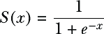

##### (8.1)

图 8.5 展示了 Sigmoid 函数的图形。Sigmoid 函数在复杂学习系统中找到其应用。它通常用于二元分类和网络的最終输出层。


##### 图 8.5 Sigmoid 函数。注意函数的形状和最小/最大值。

#### TANH 函数

在数学中，双曲正切（TANH）函数是一个可微分的双曲函数。它是一个平滑函数，其输入值在 -1 到 +1 的范围内。

TANH 函数可以表示为方程 8.2：

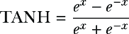

##### (8.2)

TANH 的图形表示如图 8.6 所示。它是 Sigmoid 函数的缩放版本，因此可以从 Sigmoid 函数导出 TANH 函数，反之亦然。

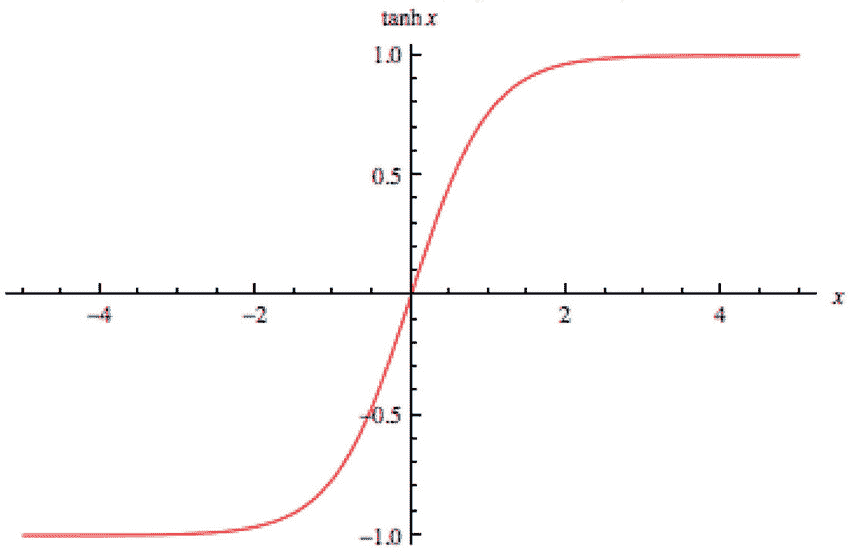

##### 图 8.6 TANH 函数，它是 sigmoid 函数的缩放版本

TANH 函数通常用于隐藏层。它使均值更接近零，这使得网络中下一层的训练更容易。这也被称为数据居中。

#### 矩形线性单元

矩形线性单元（ReLU）是一个定义参数正值的激活函数。方程 8.3 展示了 ReLU 函数。请注意，即使是负值，其值也为 0，并且从 0 开始值开始上升。

##### (8.3)

*F*(*x*) = max (0, *x*)

如果输入为正，则输出为*x*，否则为 0。

ReLU 是一个简单的函数，因此计算成本较低，速度更快。它是无界的，且不在零点居中。除了零点外，它可以在所有地方进行微分。由于 ReLU 函数较为简单，计算成本较低，因此广泛用于隐藏层以加速网络训练。图 8.7 是 ReLU 函数的图形表示。


##### 图 8.7 ReLU 函数。它是神经网络隐藏层中首选的激活函数之一。ReLU 简单易用，训练成本低。

#### Softmax 函数

Softmax 函数用于神经网络的最外层，以生成网络的输出。它是一个对多类分类问题有用的激活函数，并迫使神经网络输出总和为 1。

例如，假设图像的不同类别为汽车、自行车或卡车。Softmax 函数将为每个类别生成三个概率。具有最高概率的类别将被预测为类别。

还有其他激活函数，如 ELU、PeLU 等，这些超出了本书的范围。我们在本章末尾提供了各种激活函数的总结。

接下来，我们将介绍超参数，这些是我们网络训练过程中的控制杠杆。

### 8.2.5 超参数

在训练网络的过程中，算法不断学习原始输入数据的属性。同时，网络不能自己学习所有内容；对于一些参数，必须提供初始设置。这些是确定神经网络结构和有助于训练网络的相应变量。

超参数的一些例子包括网络中的隐藏层数量、每层的神经元数量、层中使用的激活函数、权重初始化等。我们必须选择超参数的最佳值。为此，我们为超参数选择一些合理的值，训练网络，测量网络性能，调整超参数并重新训练网络，重新评估并再次调整，如此循环。

注意：超参数由我们控制，因为我们输入超参数以提高性能。

我们现在转向神经网络中下一个重要组件：优化函数。

### 8.2.6 优化函数

在深度学习中，优化器起着关键作用。它们通过调整模型参数（权重和偏差）来最小化损失函数，从而加速收敛并提高网络的总体性能。以下将讨论一些最常用的优化函数。

#### 批量梯度下降、随机梯度下降和迷你批随机梯度下降

在任何基于预测的解决方案中，我们希望尽可能准确地预测；换句话说，我们希望尽可能减少误差。误差是实际值与预测值之间的差异。机器学习解决方案的目的是找到我们函数的最优值。我们希望减少误差或最大化准确性。梯度下降可以帮助实现这一目的。

批量梯度下降技术是一种用于寻找函数全局最小值的优化技术。我们迭代地朝着最陡下降方向前进，这由梯度的负值定义。

但是，批量梯度下降在处理非常大的数据集或具有非常高维度的数据集时可能运行缓慢。这是因为梯度下降算法的一次迭代会预测训练数据集中的每个实例。因此，如果我们有数千条记录，很明显这将花费很多时间。对于这种情况，我们有随机梯度下降（SGD）。

在 SGD 中，而不是在数据批次的末尾，系数会为每个训练实例更新，因此它花费的时间更少。

图 8.8 展示了梯度下降的工作方式。注意我们如何可以向下朝着全局最小值前进。

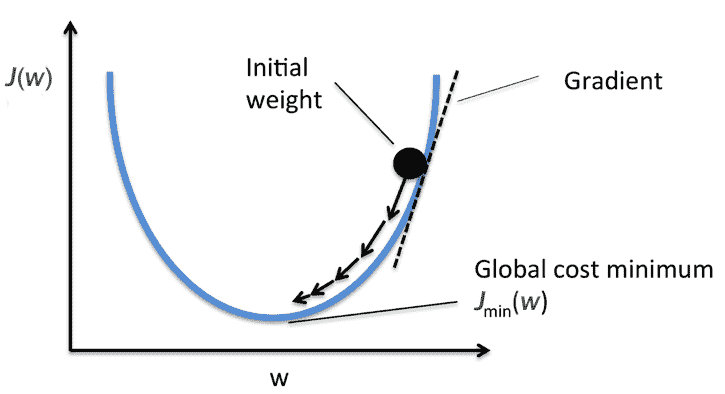

##### 图 8.8 梯度下降的概念。它是最小化损失函数的机制。

迷你批梯度下降通过使用数据的小子集将批量梯度下降和 SGD 结合起来。它们被称为迷你批。以这种方式，它可以平衡速度和准确性。同时，它增加了一个超参数，我们必须仔细调整批大小。通常，它保持在 2 的幂次方（32、64、128、256 等）。

#### 自适应优化算法

研究人员观察到，对于图像、文本、视频或音频分析等更复杂的任务，需要优化算法。因此，开发了如动量、Nesterov 加速梯度（NAG）、Adagrad 等自适应优化解决方案。我们简要总结这些解决方案：

+   *动量*—这个优化器将前一次梯度的部分加到当前梯度上。这种想法是相对于前一次更新，给予最近更新更多的权重。它加速了收敛并实现了更好的准确性

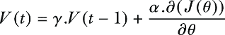

因此，权重通过*θ* = *θ* – *V*(*t*)更新。

通常，动量项（*γ*）的值设置为 0.9。有了动量，收敛会更快，但与此同时，我们必须为每个更新计算一个额外的变量。

+   *NAG*——这是对动量的改进。在动量中，如果值变得太大，优化器可能会错过局部最小值。因此，开发了 NAG。这是一种前瞻性方法，其中权重被修改以确定未来的位置。

接下来，我们将讨论工业界最广泛使用的优化算法。

#### 学习与学习率

对于一个网络，我们采取各种步骤来提高解决方案的性能：学习率是其中之一。学习率将定义模型为减少错误所采取的纠正步骤的大小。学习率定义了我们应该调整网络权重的值相对于损失梯度的量（关于这个过程后面会详细介绍）。如果我们有一个较高的学习率，准确性会较低。如果我们有一个非常低的学习率，训练时间会增加。

##### 练习 8.3

回答这些问题以检查你的理解：

1.  比较和对比 sigmoid 和 TANH 函数。

1.  ReLU 通常用于网络的输出层。对还是错？

1.  梯度下降是一种优化技术。对还是错？

我们已经研究了深度学习的主要概念。现在让我们研究神经网络是如何工作的。你将了解各个层如何相互作用以及信息是如何从一个层传递到另一个层的。

## 8.3 深度学习在监督模式下是如何工作的？

我们已经介绍了神经网络的主要组成部分。现在是时候让所有部件汇集在一起，协调整个学习过程了。神经网络的训练是一个相当复杂的过程，可以逐步检查。

你可能想知道“神经网络的学习”是什么意思。学习是一个寻找网络所有层中权重和偏置的最佳和最优化值的过程，以便我们可以达到最佳的准确性。由于深度神经网络在权重和偏置项上几乎有无限的可能性，我们必须找到所有参数的最优值。考虑到改变一个值会影响其他值，这似乎是一项艰巨的任务，而实际上，它是一个网络的各种参数不断变化的过程。

回想一下，在第一章我们介绍了监督学习的基础。在这里我们将刷新这一理解。原因是确保你能够完全欣赏神经网络训练的过程。

### 8.3.1 监督学习算法

监督学习算法有一个“指导”或“监督”来指导向业务目标——对未来进行预测。正式地说，监督模型是使用输入数据和期望的输出来预测未来的统计模型。输出是我们希望预测的值，被称为*目标变量*，用于进行预测的数据被称为*训练数据*。目标变量有时也被称为*标签*。数据中存在的各种属性或变量被称为*自变量*。每个历史数据点或*训练示例*都包含这些自变量和相应的目标变量。监督学习算法对未见的未来数据进行预测。解决方案的准确性取决于训练和从标记的历史数据中学到的模式。

备注：大多数深度学习解决方案都是基于监督学习的。然而，无监督深度学习正在迅速获得关注，因为未标记的数据集比标记的数据集要多得多。

监督学习问题用于需求预测、信用卡欺诈检测、客户流失预测、保费估算等。它们在零售、电信、银行和金融、航空、保险和其他领域被广泛使用。

我们现在已经刷新了监督学习的概念。我们现在继续到神经网络训练的第一步：前向传播。

### 8.3.2 步骤 1：前向传播

让我们开始一个神经网络中发生的过程（见图 8.9）。这是我们创建的基本网络骨架，用于解释这个过程。假设我们有一些输入数据点和输入数据层，它将消耗输入数据。信息从输入层流向数据转换层（隐藏层）。在隐藏层中，数据通过激活函数进行处理，并基于权重和偏置项。然后对数据集进行预测。这被称为*前向传播*，因为在整个过程中，输入变量是按照从输入层到输出层的顺序计算的。


##### 图 8.9 神经网络训练过程的基本骨架。我们有输入层和数据转换层。

例如，假设我们希望创建一个可以识别人脸的解决方案。在这种情况下，我们将有训练数据，即从不同角度拍摄的人脸的不同图像，以及一个目标变量，即人的名字。

这个训练数据集可以输入到算法中。然后，算法将理解各种面部特征，换句话说，就是*学习*这些特征。基于所做的训练，算法可以对面部进行预测。如果预测是 Mr. X 的面部，预测将是一个概率分数。如果概率足够高，我们可以安全地说这个面部属于 Mr. X。

### 8.3.3 步骤 2：添加损失函数

输出在第一步生成。现在我们必须评估这个网络的准确性。我们希望我们的网络在识别面部时具有尽可能高的准确性。使用算法做出的预测，我们将控制和提高网络的准确性。

网络中的准确性测量可以通过损失函数实现，也称为*目标函数*。损失函数比较实际值和预测值。损失函数计算差异分数，因此能够衡量网络做得有多好以及误差率是多少。让我们通过添加一个损失函数和相应的损失分数来更新我们在第一步创建的图表，如图 8.10 所示。

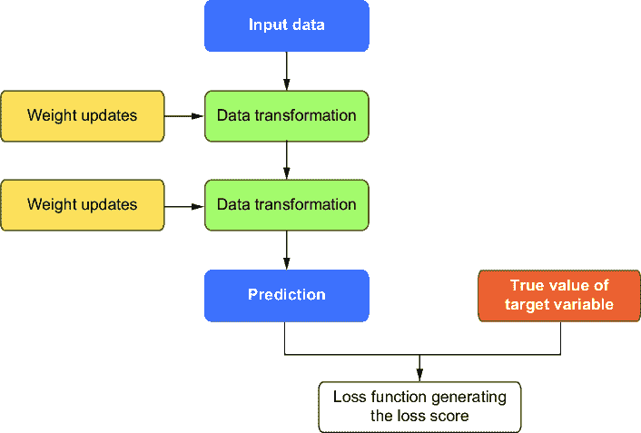

##### 图 8.10 已添加损失函数来衡量准确性。

### 8.3.4 步骤 3：计算误差

我们在网络的第一步生成了预测。在第二步，我们将输出与实际值进行比较，以获得预测误差。我们解决方案的目标是使这个误差最小化，这等同于最大化准确性。

为了不断降低误差，损失分数（预测值 - 实际值）随后被用作反馈来调整权重值。这个任务由反向传播算法完成。

## 8.4 反向传播

在最后一节的第三步中，我们提到我们使用优化器不断更新权重以减少误差。虽然学习率定义了减少误差的校正步骤的大小，但反向传播用于调整连接权重。这些权重根据误差反向更新。随后，重新计算误差，计算梯度下降，并相应地调整权重。因此，反向传播有时被称为深度学习中的核心算法。

反向传播最初在 20 世纪 70 年代被提出。然后，在 1986 年，David Rumelhart、Geoffrey Hinton 和 Ronald Williams 的论文受到了很多赞誉。如今，反向传播是深度学习解决方案的骨干。

图 8.11 显示了反向传播的过程，其中信息从输出层流向隐藏层。请注意，与正向传播相比，信息流是反向的，在正向传播中，信息是从左到右流动的。


##### 图 8.11 反向传播作为过程：信息从最终层流向初始层

首先，我们以非常高的层次描述这个过程。记住，在步骤 1 中，在训练过程的开始，一些随机值被分配给了权重。使用这些随机值，生成了一个初始输出。由于这是第一次尝试，接收到的输出可能与真实值有很大不同，损失分数因此非常高。但这种情况将会改善。在训练神经网络时，权重（和偏差）会朝着正确的方向进行微调，随后损失分数会降低。我们重复这个训练循环多次，最终得到最小化损失函数的最优权重值。

备注：反向传播使我们能够在网络训练过程中迭代地减少误差。

下面的部分数学内容较多。如果你不热衷于理解这个过程背后的数学，你可以跳过这部分。

### 8.4.1 反向传播背后的数学

当我们训练一个神经网络时，我们计算一个损失函数。损失函数告诉我们预测值与实际值之间的差异。反向传播计算损失函数相对于每个权重的梯度。有了这些信息，每个权重都可以在迭代中单独更新，这会逐渐减少损失。

在反向传播中，梯度是向后计算的——也就是说，从网络的最后一层通过隐藏层到最第一层。所有层的梯度通过微积分链式法则组合起来，以得到任何特定层的梯度。

我们接下来更详细地介绍这个过程。首先，让我们定义一些数学符号：

+   *h*^(^(*i*)^)——隐藏层 *i* 的输出

+   *g*^(^(*i*)^)——隐藏层 *i* 的激活函数

+   *w*^(^(*i*)^)——层 *i* 中的隐藏权重矩阵

+   *b*^(^(*i*)^)——层 *i* 中的偏差

+   *x*——输入向量

+   *N*——网络中的总层数

+   *W*^(^(*i*)^)[*jk*]——网络从层 (*i*–1) 中的节点 *j* 到层 *i* 中的节点 *k* 的权重

+   *δ**A*/*δ**B*——*A* 对 *B* 的偏导数

在网络的训练过程中，输入 *x* 被送入网络，并经过层生成输出 *y*̂。期望的输出是 *y*。因此，比较 *y* 和 *y*̂ 的损失函数或损失函数是 *C*(*y*, *y*̂)。此外，网络的任何隐藏层的输出也可以用方程 8.4 表示


##### (8.4)

其中 *i*（索引）可以是网络中的任何一层。

最终层的输出是

##### (8.5)

*y*(*x*) = *W*^(^(*N*)^)^(*T*) *h*^(^(*N*)^–¹) + *b*^(^(*N*)^)

在网络的训练过程中，我们调整网络的权重，以减少 *C*。因此，我们计算 *C* 对网络中每个权重的导数。以下是 *C* 对网络中每个权重的导数：

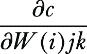

现在我们知道神经网络有很多层。反向传播算法从计算网络最后一层的导数开始，即第 N 层。然后这些导数被反向传递。因此，第 N 层的导数将传递到网络的第 (*N* – 1) 层，依此类推。

*C* 的导数的每个分量都是单独使用微积分链式法则计算的。根据链式法则，对于依赖于 *b* 的函数 *c*，其中 *b* 依赖于 *a*，*c* 对 *a* 的导数可以写成方程 8.6：

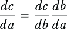

##### (8.6)

因此，在反向传播中，层 *N* 的导数用于层 (*N* – 1)，以便它们被保存并再次用于 (*N* – 2) 层。我们从网络的最后一层开始，通过所有层到第一层，每次我们使用最后计算的导数来得到当前层的导数。因此，反向传播与我们会单独计算网络中每个权重的常规方法相比，效率极高。

一旦我们计算了梯度，我们就更新网络中的所有权重。目标是使成本函数最小化。我们已经在上一节研究了像梯度下降这样的方法。我们现在继续到神经网络训练过程的下一步。

### 8.4.2 步骤 4：优化

反向传播使我们能够优化我们的网络并达到最佳准确度（见图 8.12）。注意优化器，它提供常规和连续的反馈以找到最佳解决方案。


##### 图 8.12 优化是使损失函数最小化的过程。

一旦我们找到了网络中权重和偏差的最佳值，我们就说我们的网络已经训练好了。现在我们可以用它来对未用于训练网络的未见数据集进行预测。

## 8.5 无监督方式下深度学习的工作原理

我们知道无监督学习解决方案适用于未标记的数据集；因此，在无监督设置中的深度学习，训练数据集是无标签的。

与我们有标签的监督数据集相比，无监督方法必须自我组织以获取密度、概率分布、偏好和分组。我们可以使用监督和无监督方法解决类似的问题。例如，可以使用监督深度学习方法来识别狗与猫，而无监督深度学习方法可能用于将狗和猫的图片聚类到不同的组中。在机器学习中，许多最初被认为是监督学习解决方案的解决方案，在一段时间内，采用了无监督学习方法来丰富数据，从而提高监督学习解决方案。

在无监督深度学习的学习阶段，预期网络将模仿数据，然后根据错误进行自我改进。在监督学习算法中，其他方法与反向传播算法起着相同的作用。这包括，但不仅限于，

+   Boltzmann 学习规则

+   对比散度

+   最大似然

+   Hopfield 学习规则

+   GAN

+   深度信念网络（DBN）

在本书中，我们将在单独的章节中深入探讨自编码器和 GAN。其余的方法在本章中介绍。

接下来，我们研究在监督学习设置中最广泛使用的两种神经网络类型：卷积神经网络（CNN）和循环神经网络（RNN）。

##### 练习 8.4

回答这些问题以检查你的理解：

1.  以简单形式写出反向传播技术的主要步骤。

1.  在无监督学习中，反向传播算法是首选。对或错？

1.  深度学习的目标是最大化损失函数。对或错？

## 8.6 卷积神经网络

CNN 是一类主要用于图像和视频处理任务的深度学习模型。由于它们能够自动从原始图像中检测和学习模式，因此已成为计算机视觉领域的一种强大工具。因此，它们被用于多个领域和功能中的多个用例。我们只提供简要概述，因为关于不同类型的 CNN 解决方案可以有一整本书。

### 8.6.1 CNN 的关键概念

以下为 CNN 的关键概念：

+   *输入层*——CNN 的输入通常是一个表示图像的张量。正如我们所知，图像由像素组成，每个像素由 RGB 通道组成。图像由一个 3D 矩阵表示，即宽度 × 高度通道。

+   *卷积层*——这是 CNN 的核心构建层。它对输入数据应用滤波器，扫描图像以检测线条、曲线、纹理、边缘等模式。滤波器大小通常较小，通常是 3 × 3 或 5 × 5。当核在输入上滑动时，它执行逐元素乘法和求和，创建一个特征图。可以应用多个滤波器来学习不同的特征，生成多个特征图。整个过程如图 8.13 所示。


##### 图 8.13 CNN 过程。原始数据是 6 × 6，应用的是 3 × 3 的滤波器，结果输出为 4 × 4。

+   *ReLU 激活函数*——这是用来增加非线性。它帮助网络理解和建模数据中存在的更复杂和困难的模式。

+   *池化层*——这是用来减少图像的空间维度同时保留最重要的细节。最常见的一种池化称为最大池化。它从一个输入区域中取最大值。池化层的主要功能是减少计算负载，并通过提供一种形式上的平移不变性来减少过拟合。

+   *输出*—在我们创建了几个卷积层和池化层之后，我们得到输出。输出通常被展平成一个一维向量，然后输出被传递到全连接层。全连接层的主要任务是根据前一层提取的特征对图像进行高级分类。

+   *输出层*—如果解决方案是用于数据点的分类，输出层将包含一个如 softmax 之类的函数。softmax 函数为不同的类别提供相应的概率。例如，如果你试图预测一个给定的图片是猫还是狗，softmax 函数将给出图片是狗或猫的概率。

在 CNN 中，相同的过滤器被应用于图像的不同区域。因此，与传统的全连接网络相比，参数数量减少了。卷积层中的每个神经元仅连接到输入的一个小区域，因此网络的复杂性也降低了。网络还自动训练和学习检测低级模式。低级模式的一个例子是边缘。网络随后进步到学习更复杂的模式，如深层中的形状。

### 8.6.2 CNN 的使用

网络调用是现代竞争解决方案的基本和基础。它们被大量用于图像分类、图像处理、语音识别、开发计算机棋类游戏以及各种其他视频处理解决方案。许多解决方案都是使用 CNN 开发的——例如，自动检测车辆牌照、从扫描中检测癌细胞、从 X 光片中检测骨折、面部识别解决方案、自动输入手写识别解决方案，以及许多对我们生活产生巨大影响的解决方案。

可用的 CNN 架构有很多，如 Inception、ResNet、LeNet、VGG-16 等，这些架构对于创建计算机视觉解决方案非常有用。我们现在转向第二种常见的神经网络类型：RNN。

## 8.7 循环神经网络

RNN 是一类相当流行的网络，旨在识别数据序列中的模式——例如，时间服务数据或视频、自然语言或任何其他具有这种信息序列的数据。在这里，RNN 非常有用。RNN 最显著的特征是它们能够维持对先前输入的记忆，它们通过时间依赖性和数据集中的顺序来捕捉这种记忆。这增强了它们在顺序数据集中识别模式的能力，因此 RNN 被发现是多个领域的解决方案。

### 8.7.1 RNN 的关键概念

RNN 特别设计用于顺序数据集，在这里输入显示的顺序起着关键作用。因此，RNN 是处理顺序数据的首选解决方案。

与常规神经网络（也称为前馈神经网络）不同，RNNs 具有循环连接。这意味着一个时间步的输出被反馈作为下一个时间步的输入。这种信息在序列中是持续的。同时，相同的权重在不同的时间步中使用。这使得它们在参数数量方面非常高效，因为相同的网络可以应用于输入序列的每个时间步。

RNNs 以以下方式工作：

+   输入数据是顺序处理的。在每个时间步 *t*，网络接收一个输入 *x*[*t*]，然后与隐藏状态 *h*[*t*][–1] 结合。这个隐藏状态是前一个时间步的输出，并作为记忆，携带信息从一个时间步传递到下一个时间步。

+   隐藏状态 *h*[*t*] 然后使用非线性函数更新：

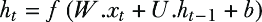

+   每个时间步的最终输出可以计算并用于每个单独的时间步或仅在最终时间步。

图 8.14 说明了 RNN 过程。


##### 图 8.14 RNN 过程。RNNs 具有内部记忆，这使得它们能够使用先前输入的信息来影响当前输入和输出。

RNN 最基本的形式是简单的循环网络，但它难以处理长期依赖，因为梯度可能消失或爆炸，使得网络难以记住序列中远处的信息；因此，它不能用于像聊天机器人这样的解决方案。长短期记忆（LSTM）在这里更有用。LSTM 是一种特殊的网络，旨在减轻梯度消失问题，并且比普通的 RNN 更好地处理长期依赖。它们通过引入门控机制实现这一壮举。有三种类型的门：输入门、遗忘门和输出门。这些门控制网络中信息的流动，并允许网络在更长的时间内维持重要信息。门控循环单元是另一种类型的 RNN，但 LSTM 和门控循环单元超出了本书的范围。

RNNs 在处理序列方面非常强大，它们建模时间依赖性的能力使它们在自然语言处理和时间序列分析领域变得不可或缺。它们的使用为许多创新解决方案开辟了道路——例如，预测句子中的下一个单词；将文本从一种语言翻译成另一种语言；处理视频帧序列以理解随时间的行为；建模如音频信号这样的时间依赖性，这些信号可以用来识别随时间变化的语音模式；等等。RNNs 是 GenAI 解决方案背后的动力引擎。

## 8.8 鲍尔兹曼学习规则

玻尔兹曼学习规则是一种在神经网络中使用的无监督学习规则。它基于物理系统的统计力学原理。在玻尔兹曼机的背景下很少使用。它通过最小化系统的能量来调整神经网络的权重，从而确保网络达到稳定状态。

### 8.8.1 霍尔兹曼学习规则的概念

以下为玻尔兹曼学习规则的关键概念：

+   它是一种概率性循环神经网络（RNN），其中神经元在一个全连接图中连接。

+   玻尔兹曼机中的神经元是随机单元，它们根据概率分布进行放电。因此，我们可以使用玻尔兹曼学习规则进行降维、模式识别、特征提取和优化任务。

+   玻尔兹曼机有一个能量函数 *E*(*v*,*h*)，其中 *v* 是可见输入单元，而 *h* 是隐藏单元。能量函数决定了网络给定状态的代价。在网络训练过程中，我们旨在调整权重，使系统的能量最小化。

+   网络使用玻尔兹曼分布来模拟特定状态 (*v*,*h*) 的概率。它取决于状态的能量，由方程 8.7 给出：

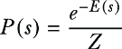

##### (8.7)

在这里，*Z* 是配分函数，它确保概率之和等于 1。

+   该规则旨在调整权重，在网络训练过程中持续降低系统的能量，并且这一过程是随时间发生的。权重通过从能量函数相对于权重的梯度推导出的规则进行更新。权重更新规则在方程 8.8 中给出：

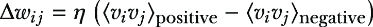

##### (8.8)

在这里，*h* 是学习率，而 (*v*[*i*]*h*[*j*])[data] 是可见单元 *v*[*i*] 和隐藏单元 *h*[*j*] 之间的校正，它是从数据分布中计算得出的。它表示它们在隐藏单元中一起活跃的频率。(*v*[*i*]*h*[*j*])[model] 是从模型分布中计算得出的校正，它表示可见单元 *v*[*i*] 和隐藏单元 *h*[*j*] 在网络生成的状态中一起活跃的频率。

在模型的训练过程中，遵循一个学习规则，即使数据分布与模型分布相匹配。因此，它降低了系统的能量，从而提高了整体性能。

### 8.8.2 关键点

我们应该牢记一些关键点。基于能量的模型，如玻尔兹曼机，使用玻尔兹曼学习规则通过调整网络的权重来最小化能量函数：

+   网络努力模拟其输入的概率分布。这里的核心目标是将高能量与不太可能的配置相关联。同样，低能量与更可能的配置相关联。

+   玻尔兹曼学习是一种无监督和概率方法。它基于对比模型分布和数据分布的概念。

+   基本形式的规则计算成本较高；因此，为了提高训练速度，有时我们会利用对比散度等方法。我们将在下一节介绍对比散度。

+   玻尔兹曼学习规则主要用于无监督学习任务，如降维、特征提取和生成建模。

+   模型训练有时比预期慢。

总结来说，玻尔兹曼学习规则是一种通过调整权重以最小化能量函数来训练神经网络的概率方法，并为生成模型如玻尔兹曼机提供了基础。然而，由于计算挑战，通常使用对比散度等近似方法使其适用于实际应用。

## 8.9 深度信念网络

DBN 是一种由多层随机二进制潜在变量（隐藏单元）组成的 GAN，其中每一层都是受限玻尔兹曼机（RBM）或其变体。DBN 在 2000 年代中期由杰弗里·辛顿（2024 年获得诺贝尔物理学奖，与约翰·霍普菲尔德共享）及其合作者推广，用于以无监督方式预训练深度网络。

### 8.9.1 DBN 的关键点

DBN 的关键点如下：

+   RBM

    +   DBN 由多个 RBMs 层组成。一个 RBM 包含一个可见层和一个隐藏层。可见层代表观察到的数据，而隐藏层则捕捉隐藏特征。

    +   每个 DBN 都是独立训练的，目的是模拟数据的潜在结构。

+   DBN 训练的目的是优化网络生成模型下数据的对数似然。对于每一层，使用对比散度算法来近似对数似然相对于权重的梯度。这允许网络为每一层学习一组良好的权重。

+   对比散度算法是一种用于估计模型对数似然梯度的随机近似方法。算法从可见层的一个样本开始，然后执行吉布斯采样以迭代地更新隐藏层和可见层。对比散度确保网络能够有效地学习输入数据分布。

+   基于层的预训练：

    +   DBN 通常以分层的方式进行训练，其中每个层都作为 RBM 进行预训练。第一个 RBM 的目标是从数据中学习捕捉低级特征。

    +   基于这一知识，每个后续的 RBM 随后从先前层学习到的表示中学习越来越复杂、抽象的特征。以此类推，循环继续。

    +   这个阶段涉及使用对比散度分别训练每个 RBM。

    +   此过程调整权重以捕捉输入数据中的相关模式和特征，无需标记数据。

    +   由于每一层都在不断抽象和复杂化的层次上学习特征，这使得整体解决方案对于复杂任务（如图像或语音识别）足够好。

+   监督微调：

    +   预训练完成后，整个网络进行微调。这通过反向传播或带有优化网络目标的有标签数据集以监督方式进行。

    +   监督系统调整网络权重以最小化预测误差，如分类或回归任务中所做的那样。

    +   无监督预训练阶段有助于以这种方式初始化权重，使得网络在监督微调期间不太可能过拟合，因为它从对数据的更好理解开始。

    +   它们在计算上成本高昂且耗时，尤其是在处理大型数据集或深层架构时。

    +   使用 RBMs 进行预训练是有用的，但有时微调整个 DBN 可能很困难，尤其是当我们处理一个非常深的神经网络时。这可能需要细致的超参数训练和大量的标记数据集。

    +   与其他深度学习架构类似，DBNs 也容易受到梯度消失问题的影响，即当梯度在反向传播通过多层时减小。这进一步复杂化了整个训练过程。

DBNs 通常用于无监督学习、降维和特征学习，但它们也可以微调以用于监督任务，如分类。DBNs 通过学习对噪声和其他失真不敏感的声音特征来提高语音识别系统的性能。作为生成模型，DBNs 可以用来创建类似于训练数据的新数据实例。例如，DBNs 已被用于生成艺术，其中创建了类似于一组输入图像的新图像。

DBNs 是深度学习技术发展中的一个重要里程碑。它们结合了生成模型（如 RBMs）的优点和深度学习原理，创造了一种学习数据复杂表示的强大方法。虽然已经出现了新的架构并获得了突出地位，但 DBNs 仍然是现代 AI 的关键历史和理论组成部分，影响了众多先进模型的发展。通过利用无监督学习，DBNs 在降维、生成建模和分类等任务上可以非常有效。然而，与训练复杂性和微调相关的挑战仍然是广泛采用的重要障碍。

## 8.10 流行的深度学习库

在过去的几章中，我们使用了大量库和包来实现解决方案。在行业中，有相当多的库可用于深度学习。这些包加速了解决方案的构建，并减少了工作量，因为大部分重活都是由这些库完成的。

最受欢迎的深度学习库有

+   *TensorFlow (TF)**—*由 Google 开发，这可能是最受欢迎和最广泛使用的深度学习框架之一。它于 2015 年推出，自那时起已被全球众多企业和品牌使用。

Python 主要用于 TF，但 C++、Java、C#、JavaScript 和 Julia 也可以使用。您必须在您的系统上安装 TF 库并导入该库。

备注：访问 [www.tensorflow.org/install](http://www.tensorflow.org/install) 并按照说明安装 TF。

TF 是最受欢迎的库之一，可以在移动设备如 iOS 和 Android 上运行。

+   *Keras*—Keras 是一个成熟的 API 驱动解决方案，非常易于使用。它是初学者的最佳选择之一，也是快速以简单和快捷的方式原型设计简单概念的佼佼者。Keras 最初于 2015 年发布，是最推荐的库之一。

备注：访问 [`keras.io`](https://keras.io) 并按照说明安装 Keras。Tf.keras 可以用作 API。

使用 Python 生成器进行序列化/反序列化 API、回调和数据流非常成熟。Keras 中的大规模模型简化为单行函数，这使得它成为一个不太可配置的环境，因此非常方便且易于使用。

+   *PyTorch*—Facebook 的 PyTorch 于 2016 年发布，是另一个流行的框架。PyTorch 使用动态更新的图，并允许数据并行和分布式学习模型。PyTorch 中有如 pdb 或 PyCharm 这样的调试器。对于小型项目和原型设计，PyTorch 可以是一个不错的选择。

+   *Sonnet*—DeepMind 的 Sonnet 是在 TF 的基础上开发的。Sonnet 专为复杂的神经网络应用和架构设计。它通过创建与神经网络特定部分相对应的初级 Python 对象来实现。然后，这些 Python 对象独立连接到计算 TF 图。由于这种分离（创建 Python 对象并将它们关联到图中），设计得到了简化。

备注：拥有高级面向对象库非常有帮助，因为当我们开发机器学习解决方案时，允许进行抽象。

+   *MXNet*—Apache 的 MXNet 是一个高度可扩展且易于使用的深度学习工具，具有详细的文档。MXNet 支持大量语言，如 C++、Python、R、Julia、JavaScript、Scala、Go 和 Perl。

还有其他框架，如 Swift、Gluon、Chainer、DL4J 等；然而，我们在这里只讨论流行的框架。我们现在检查 TF 和 Keras 中的简短代码，只是为了测试您是否已正确安装了这些库。您可以在[`www.tensorflow.org`](https://www.tensorflow.org)了解更多关于 TF 的信息，在[`keras.io`](https://keras.io)了解更多关于 Keras 的信息。

### 8.10.1 Python 代码用于 Keras 和 TF

我们在 TF 中实现了一段非常简单的代码。我们只是导入 TF 库并打印“hello”。我们还检查了 TF 的版本：

```py
import tensorflow as tf
hello = tf.constant('Hello, TensorFlow!')
sess = tf.Session()
print(sess.run(hello))
print("TensorFlow version:", tf.__version__)
```

如果这段代码能为您运行并打印出 TF 的版本，这意味着您已正确安装了`tensorflow`：

```py
from tensorflow import keras
from keras import models
```

如果这段代码能为您运行并打印出 Keras 的版本，这意味着您已正确安装了`keras`。

## 8.11 结论性思考

深度学习正在改变我们生活的世界。它使我们能够训练和创建以前只是想法的真正复杂的解决方案。深度学习的影响可以在多个领域和行业中观察到。或许没有任何行业能逃脱深度学习奇迹的影响。

深度学习是研究和开发中最受欢迎的领域之一。每年，都有许多关于深度学习的期刊和论文发表。世界各地的著名机构（如牛津、斯坦福等）的研究人员都在努力寻找改进的神经网络架构。同时，在知名组织（如 Google、Facebook 等）的专业人士和工程师也在努力创造复杂的架构以提高性能。

深度学习使我们的系统和机器能够解决通常被认为仅属于人类领域的难题。我们改进了制药行业的临床试验流程、欺诈检测软件、自动语音检测系统以及各种图像识别解决方案；并创建了更稳健的自然语言处理解决方案、针对营销解决方案，这些解决方案可以改善客户关系管理和推荐系统，更好的安全流程等等。这个列表相当长，而且每天都在增长。

同时，仍然存在一些挑战。对深度学习的期望持续增加。深度学习并不是解决所有问题的银弹或魔杖。它确实是一种更复杂的解决方案，但绝对不是解决所有商业问题的 100%解决方案。我们需要提供给算法的数据集并不总是可用。缺乏高质量的、能代表商业问题的数据集。通常，像 Google、Meta 或 Amazon 这样的大组织能够负担得起收集如此庞大的数据集。但很多时候，我们在数据中确实发现了很多质量问题。拥有训练这些复杂算法的处理能力也是一个挑战。然而，随着云计算的出现，这个问题在某种程度上已经得到了解决。

在本章中，我们探讨了神经网络和深度学习的基础。我们涵盖了关于神经元、激活函数、网络的不同层以及损失函数的细节。我们还详细介绍了反向传播算法——用于训练监督深度学习解决方案的核心算法。然后我们简要介绍了无监督深度学习算法。我们将在后面的章节中更详细地介绍这些无监督深度学习解决方案。图 8.15 显示了主要的激活函数。

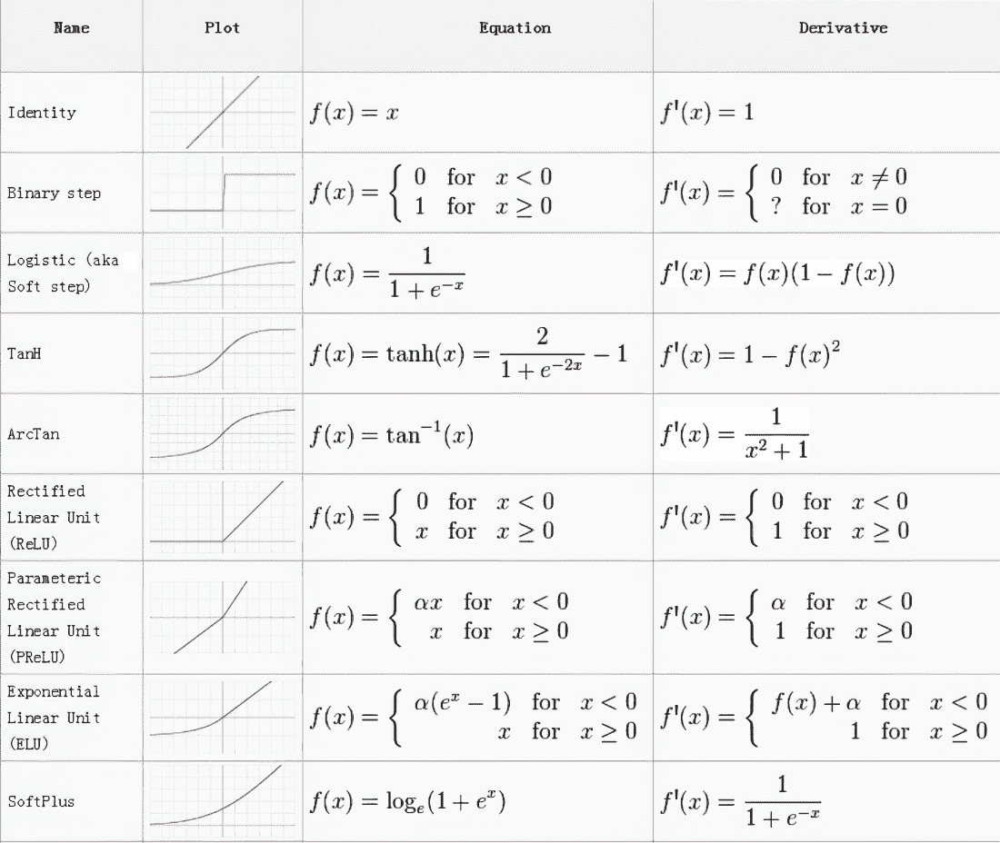

##### 图 8.15 一瞥主要激活函数（来源：towardsdatascience）

## 8.12 实践下一步行动和推荐阅读

以下提供了一些下一步行动的建议和一些有用的阅读材料：

+   François Chollet 所著的《Python 深度学习》一书是阐明深度学习概念的最好资源之一。它涵盖了深度学习和神经网络的全部概念，并由 Keras 的创造者撰写。

+   阅读以下研究论文：

    +   Hinton, G., Vinyals, O., and Dean, J. (2015). 神经网络中的知识蒸馏。[`arxiv.org/pdf/1503.02531.pdf`](https://arxiv.org/pdf/1503.02531.pdf)

    +   Srivastava, R., Greff, K., and Schmidhuber, J. (2015). 训练非常深的网络。[`arxiv.org/pdf/1507.06228`](https://arxiv.org/pdf/1507.06228)

    +   Mikolov, T., Sutskever, I., Chen, K., Corrado, G., and Dean, J. (2013). 词和短语的分布式表示及其组合性。[`arxiv.org/abs/1310.4546`](https://arxiv.org/abs/1310.4546)

    +   Goodfellow, I. J., Pouget-Abadie, J., Mirza, M., et al. (2014). 生成对抗网络。[`arxiv.org/abs/1406.2661`](https://arxiv.org/abs/1406.2661)

    +   He, K., Zhang, X., Ren, S., and Sun, J. (2015). 用于图像识别的深度残差学习。[`arxiv.org/abs/1512.03385`](https://arxiv.org/abs/1512.03385)

## 摘要

+   深度学习是基于神经网络的先进机器学习形式，它特别适用于文本、图像、音频和视频等非结构化数据。

+   深度学习在各个领域都有应用，例如

    +   *医疗领域和制药业*——用于诊断医疗状况和加速药物开发

    +   *银行和金融*——检测欺诈并区分伪造签名

    +   *汽车行业*——通过识别交通元素来推动自动驾驶

    +   *语音和图像识别*——使 Siri 和基于图像的医疗诊断和安全系统等技术成为可能

+   神经网络的关键概念包括

    +   *人工神经元（感知器）*——生物神经元的简化模型。权重和偏差在感知器的功能中起着至关重要的作用。

    +   *层*——网络由输入层、隐藏层和输出层组成。隐藏层提取并学习对决策至关重要的特征。

    +   *激活函数*——对神经网络性能至关重要，包括 sigmoid、TANH、LeLU 和 softmax。

+   训练神经网络涉及正向传播、计算损失和利用反向传播进行权重调整以最大化预测准确性的过程。

+   虽然无监督学习依赖于未标记的数据，但像霍尔兹曼学习和 DBNs 这样的技术对于在这样环境中改善数据组织至关重要。

+   CNNs（卷积神经网络）主要用于图像和视频处理。CNNs 因其架构而擅长识别模式，具有卷积层和池化层等用于特征提取的层。

+   RNNs（循环神经网络）适用于序列数据。RNNs 在输入之间保持信息，并通过 LSTMs（长短期记忆网络）增强以解决长期依赖问题。它们在自然语言处理和时间序列分析中至关重要。

+   霍尔兹曼学习规则是一种无监督、概率性的方法，用于神经网络中通过最小化能量函数来调整权重，通常有助于降维和特征提取等任务，但计算挑战需要如对比散度这样的近似方法。

+   DBNs 是包含 RBMs（限制性玻尔兹曼机）层的 GANs（生成对抗网络），利用无监督预训练来学习复杂的数据表示，并通过监督微调进行分类等任务，但它们面临着包括计算成本和潜在过拟合在内的挑战。

+   DBNs 使用分层预训练来捕捉抽象特征，使它们适用于图像或语音识别等复杂应用；然而，梯度消失问题和复杂的微调过程可能会阻碍性能。

+   尽管新的深度学习架构越来越受欢迎，但 DBNs（深度信念网络）仍然是人工智能发展的重要组成部分，在包括降维、生成建模和分类等任务模型的发展中扮演着关键角色，尽管训练复杂性仍然是一个障碍。
