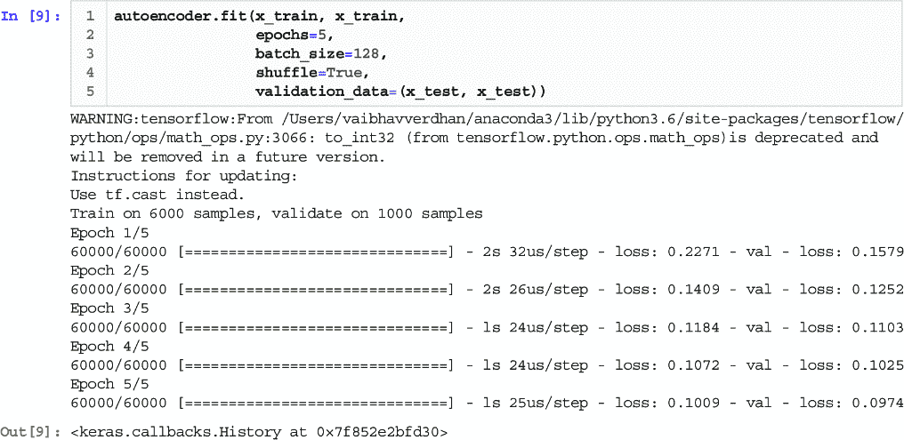
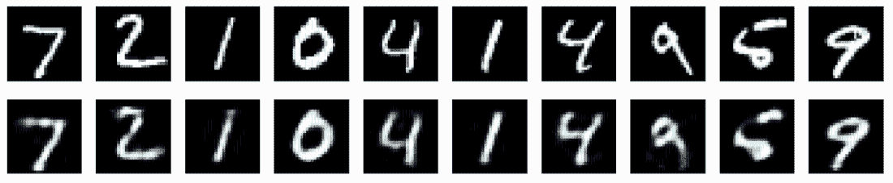

# 9 自动编码器

### 本章涵盖

+   自动编码器的介绍

+   自动编码器的训练

+   自动编码器的类型

+   使用 TensorFlow 和 Keras 的 Python 代码

> 从复杂的混乱中，简单的真理浮现出来。——温斯顿·丘吉尔

在上一章中，我们探讨了深度学习的概念。在这一章中，我们将从无监督深度学习开始。自动编码器是第一个主题。我们将首先介绍自动编码器的基础知识，它们是什么，以及我们如何训练它们。然后我们将探讨不同类型的自动编码器，并随后提供一段 Python 代码以展示其实现。欢迎来到第九章，祝大家一切顺利！

## 9.1 技术工具箱

我们将继续使用迄今为止所使用的相同版本的 Python 和 Jupyter Notebook。本章中使用的代码和数据集已在 GitHub 位置进行检查。您需要在本章中安装几个 Python 库：`tensorflow`和`keras`。

## 9.2 特征学习

预测建模是一个非常有趣的话题。在各个领域和商业功能中，预测建模被用于各种目的，如预测下一年企业的销售额、预期的降雨量、即将到来的信用卡交易是否为欺诈、客户是否会进行购买等。用例很多，上述所有用例都属于监督学习算法。

注意：我们使用的数据集具有变量或属性。它们也被称为特征或属性。

当我们希望创建这些预测模型时，我们也对理解对预测有用的变量感兴趣。让我们考虑一个案例，其中一家银行想要预测一笔即将到来的交易是否为欺诈。在这种情况下，银行将希望知道哪些因素对于识别一笔即将到来的交易是否为欺诈是重要的。可能考虑的因素包括交易金额、交易时间、交易的来源/来源等。对于做出预测的重要变量被称为*显著变量*。

要创建基于机器学习的预测模型，需要使用*特征工程*。特征工程，也称为特征提取，是从原始数据中提取特征以改善模型整体质量并提高准确性的过程，与仅向机器学习模型提供原始数据的模型相比。

特征工程可以通过领域理解、各种手动方法以及一些自动化方法来完成。其中一种方法被称为特征学习。特征学习是一组帮助解决方案自动发现特征检测所需表示的技术。借助特征学习，不需要手动特征工程。特征学习的效果对于使用图像、文本、音频和视频的数据集来说更为相关。

特征学习可以是监督的也可以是无监督的。对于监督特征学习，神经网络是最好的例子。对于无监督特征学习，我们有矩阵分解、聚类算法和自编码器等例子。我们已经涵盖了聚类和矩阵分解。在本章中，我们从自编码器的介绍开始。

## 9.3 自编码器的介绍

当我们开始处理任何数据科学问题时，数据扮演着最显著的角色。一个包含大量噪声的数据集是数据科学和机器学习中最具挑战性的问题之一。现在有相当多的解决方案，其中之一就是自编码器。

简而言之，自编码器是一种人工神经网络，用于学习数据编码。自编码器通常用于降维方法。它们也可以用作生成模型，可以创建类似于旧数据的合成数据。例如，如果我们没有足够的数据来训练机器学习，我们可以使用生成的合成数据来训练模型。

自编码器是前馈神经网络，它们将输入压缩成一个低维代码，然后尝试从这个表示中重建输出。自编码器的目标是学习高维数据集的低维表示（有时也称为编码）。回想一下前几章中的主成分分析（PCA）。自编码器可以被视为 PCA 的推广。PCA 是一种线性方法，而自编码器可以学习非线性关系。因此，自编码器对于需要捕获输入数据中最显著属性的低维化解决方案是必需的。

## 9.4 自编码器的组成部分

自编码器的架构非常简单易懂。自编码器由三部分组成：编码器、瓶颈或代码和解码器，如图 9.1 所示。简单来说，编码器压缩输入数据，瓶颈或代码包含这些压缩信息，解码器解压缩知识，从而将数据重建回其原始形式。一旦完成解压缩并将数据重建为编码形式，就可以比较输入和输出。


##### 图 9.1 自编码器的结构，包括编码器、瓶颈和解码器

让我们更详细地研究这些组件：

+   *编码器*—输入数据通过编码器。编码器不过是一个全连接的人工神经网络。它将输入数据压缩成一个编码表示，在这个过程中生成的输出被减小了尺寸。编码器将输入数据压缩成一个称为瓶颈的压缩模块。

+   *窄带*—窄带可以被认为是编码器的“大脑”。它包含压缩的信息表示，并且窄带的任务是只允许最重要的信息通过。

+   *解码器*—从窄带接收到的信息由解码器解压缩。它将数据重新创建成其原始或编码形式。一旦解码器的任务完成，实际值与解码器创建的解压缩值进行比较。

关于自动编码器有几个重要点需要考虑：

+   与原始输入相比，在自动编码器中，当进行解压缩时会有信息损失。因此，当压缩数据被解压缩时，与原始数据相比会有损失。

+   自动编码器是针对数据集特定的。这意味着在花卉图像上训练的算法不会在交通信号图像上工作，反之亦然。这是因为自动编码器学习的特征将仅限于花卉。因此，我们可以说自动编码器只能压缩与训练数据相似的数据。

+   训练专门实例的算法以在特定类型的输入上表现良好相对容易。我们只需要代表性的训练数据集来训练自动编码器。

## 9.5 自动编码器的训练

需要注意的是，如果数据中的变量之间没有相关性，那么压缩和随后解压缩输入数据将非常困难。为了创建一个有意义的解决方案，输入数据中的变量之间应该存在某种程度的关系或相关性。要创建自动编码器，我们需要编码方法、解码方法以及一个损失函数来比较实际值和解压缩值。

流程如下：

1.  输入数据通过编码器模块。

1.  编码器将模型的输入压缩成一个紧凑的窄带。

1.  窄带限制了信息的流动，只允许重要信息通过；因此，窄带有时被称为*知识表示*。

1.  解码器解压缩信息，并将数据重新创建成其原始或编码形式。这种编码器-解码器架构在从输入数据中获取最重要的属性方面非常高效。

解决方案的目标是生成与输入相同的输出。通常，解码器架构是编码器架构的镜像。这并非强制性的，但通常是遵循的。我们确保输入和输出的维度相同。

注意：如果您不知道超参数的含义，请参阅附录。

我们需要定义四个超参数来训练自动编码器：

+   *代码大小*—这可能是最重要的超参数。它表示中间层的节点数。这决定了数据的压缩程度，也可以作为正则化项。代码大小的值越小，数据就越压缩。

+   *参数*—这表示自动编码器的深度。具有更多深度的模型显然更复杂，并且处理时间会更长。

+   *每层的节点数*—这是每层使用的权重。随着输入在层间变得越来越小，它通常在后续的每一层中都会减少。在解码器中又重新增加。

+   *使用的损失函数*—如果输入值在[0,1]范围内，则首选二元交叉熵；否则，使用均方误差。

我们已经介绍了在训练自动编码器时使用的超参数。训练过程与反向传播类似，我们已经讨论过了。

## 9.6 自动编码器的应用

自动编码器能够解决无监督学习中的一些固有问题的解决方案。自动编码器的主要应用包括

+   *降维*—有时自动编码器可以学习比 PCA 和其他技术更复杂的数据投影。

+   *异常检测*—错误或重建误差（实际数据与重建数据之间的误差）可以用来检测异常。

+   *数据压缩*—通过训练算法来击败像 JPEG 这样的基本解决方案是困难的。此外，由于自动编码器是数据特定的，它们只能使用它们被训练过的数据集类型。如果我们希望提高包括更多数据类型的容量并使其更通用，那么所需的训练数据量将非常高，显然，所需的时间也会很高。

+   *其他应用*—这些包括药物发现、机器翻译、图像去噪等。

在现实世界中，自动编码器的实际应用仍然不多。这有多种原因，如数据集不可用、基础设施、各种系统的准备就绪等。

## 9.7 自动编码器的类型

自动编码器主要有五种类型。接下来将简要介绍不同类型的编码器。我们尽量使这一部分数学简单，并跳过了背后的数学，因为它相当复杂，难以理解。对于好奇的读者，第 9.10 节中列出的论文可以解释数学原理：

+   *欠完备自编码器*——欠完备自编码器是自编码器最简单的形式。它只是接受一个输入数据集，然后从压缩的瓶颈区域重新构建相同的数据集。通过根据重建误差惩罚神经网络，模型将学习数据的最显著属性。通过学习最重要的属性，模型将能够从压缩状态重建原始数据。正如我们所知，当压缩数据重建时会有损失；这种损失被称为*重建*损失。

欠完备自编码器本质上是无监督的，因为它们没有目标标签进行训练。这类自编码器用于降维。回想在第二章中我们讨论了降维（PCA），在第六章中我们讨论了高级降维算法（t 分布随机邻域嵌入和多维尺度）。见图 9.2。


##### 图 9.2 随着维度的增加，性能开始提高，但过了一段时间后开始下降。当涉及到创建良好的数据科学解决方案时，维度诅咒是一个真正的问题。

使用欠完备自编码器作为瓶颈，可以降低维度，因为瓶颈是输入数据的压缩形式。这些压缩数据可以在网络的辅助下重新解压缩。回想在第三章中我们解释了 PCA 提供了输入变量的线性组合。有关更多细节和 PCA 的复习，请参阅第三章。我们知道 PCA 试图通过一个低维超平面来描述原始数据集；欠完备自编码器也可以学习非线性关系。这种差异在图 9.3 中显示。


##### 图 9.3 PCA 本质上是线性的，而自编码器是非线性的。这是两种算法之间的核心区别。

有趣的是，如果从欠完备自编码器中移除所有非线性激活函数，只使用线性层，那么自编码器就相当于 PCA。为了使自编码器泛化并不过度记忆训练数据，欠完备自编码器通过瓶颈的大小进行调节和微调。这允许解决方案不记忆训练数据，并且泛化得非常好。

备注：如果一个机器学习模型在训练数据上表现非常好，但在未见过的测试数据上表现不佳，那么它被称为过拟合。

+   *稀疏自编码器*——稀疏自编码器与欠完备自编码器类似，但它们使用不同的方法来处理过拟合问题。从概念上讲，稀疏自编码器在每个隐藏层改变节点的数量，并保持其灵活性。由于不可能有一个能够灵活调整神经元数量的神经网络，因此为它定制了损失函数。在损失函数中，引入了一个捕捉激活神经元数量的项。惩罚项与激活神经元数量成正比。激活神经元数量越多，惩罚越高。这个惩罚被称为*稀疏函数*。使用这个惩罚，可以减少激活神经元的数量；因此，惩罚较低，网络能够处理过拟合问题。

+   *收缩自编码器*——收缩自编码器与其他自编码器的工作原理类似。它们认为非常相似的输入应该被编码成相同的。因此，它们应该有相同的潜在空间表示。这意味着输入数据和潜在空间之间不应该有太大的差异。

+   *去噪自编码器*——去噪意味着去除噪声，这正是去噪自编码器的精确任务。它们不接收图像作为输入；相反，它们接收如图 9.4 所示的图像的噪声版本作为输入。


##### 图 9.4 原始图像、带噪声的输出和自编码器的输出

自编码器去噪的过程在图 9.5 中展示。原始图像通过添加噪声而改变。这个带噪声的图像被输入到编码器-解码器架构中，接收到的输出与原始图像进行比较。自编码器学习图像的表示，用于去除噪声；这是通过将输入图像映射到一个低维流形上实现的。


##### 图 9.5 自编码器中的去噪过程。它从原始图像开始；添加噪声，结果产生一个带噪声的图像，然后将其输入到自编码器中。

我们可以使用去噪自编码器进行非线性降维。

+   *变分自编码器*——标准自编码器模型使用瓶颈以压缩形式表示输入。变分是概率生成模型（通常是高斯分布）在潜在变量上，它们只需要神经网络作为其整体结构的一部分。它们使用期望最大化元算法进行训练。数学细节超出了本书的范围。

## 9.8 自编码器的 Python 实现

让我们创建两个自编码器的版本。代码是从 Keras 网站（[`blog.keras.io/building-autoencoders-in-keras.html`](https://blog.keras.io/building-autoencoders-in-keras.html)）的官方来源中取出的，并为了我们的使用进行了修改。步骤如下：

1.  导入必要的库：

```py
import keras
from keras import layers
```

1.  2. 创建我们的网络架构：

```py
# This is the size of our encoded representations
encoding_dim = 32  # 32 floats -> compression of factor 24.5, assuming  
the input is 784 floats

# This is our input image
input_img = keras.Input(shape=(784,))
# "encoded" is the encoded representation of the input
encoded = layers.Dense(encoding_dim, activation='relu')(input_img)
# "decoded" is the lossy reconstruction of the input
decoded = layers.Dense(784, activation='sigmoid')(encoded)

# This model maps an input to its reconstruction
autoencoder = keras.Model(input_img, decoded)
```

1.  3. 向模型添加更多细节：

```py
# This model maps an input to its encoded representation
encoder = keras.Model(input_img, encoded) 

# This is our encoded (32-dimensional) input
encoded_input = keras.Input(shape=(encoding_dim,))
# Retrieve the last layer of the autoencoder model
decoder_layer = autoencoder.layers[-1]
# Create the decoder model
decoder = keras.Model(encoded_input, decoder_layer(encoded_input))

autoencoder.compile(optimizer='adam', loss='binary_crossentropy')
```

1.  4. 加载数据集：

```py
(x_train, _), (x_test, _) = mnist.load_data()
```

1.  5. 创建训练和测试数据集：

```py
x_train = x_train.astype('float32') / 255.
x_test = x_test.astype('float32') / 255.
x_train = x_train.reshape((len(x_train), np.prod(x_train.shape[1:])))
x_test = x_test.reshape((len(x_test), np.prod(x_test.shape[1:])))
print(x_train.shape)
print(x_test.shape)
```

1.  6. 拟合模型（见图 9.6）：

```py
autoencoder.fit(x_train, x_train,
                epochs=5,
                batch_size=128,
                shuffle=True,
                validation_data=(x_test, x_test))
```



##### 图 9.6 模型拟合

1.  7. 在测试数据集上测试它：

```py
# Encode and decode some digits
# Note that we take them from the *test* set
encoded_imgs = encoder.predict(x_test)
decoded_imgs = decoder.predict(encoded_imgs)
```

1.  8. 绘制结果。您可以看到原始图像和最终输出（见图 9.7）：

```py
# Use Matplotlib (don't ask)
import matplotlib.pyplot as plt

n = 10  # How many digits we will display
plt.figure(figsize=(20, 4))
for i in range(n):
    # Display original
    ax = plt.subplot(2, n, i + 1)
    plt.imshow(x_test[i].reshape(28, 28))
    plt.gray()
    ax.get_xaxis().set_visible(False)
    ax.get_yaxis().set_visible(False)

    # Display reconstruction
    ax = plt.subplot(2, n, i + 1 + n)
    plt.imshow(decoded_imgs[i].reshape(28, 28))
    plt.gray()
    ax.get_xaxis().set_visible(False)
    ax.get_yaxis().set_visible(False)
plt.show()
```



##### 图 9.7 原始图像（底部）和最终结果（顶部）

## 9.9 总结性思考

深度学习是一个强大的工具。有了合理的企业问题和高质量的数据集，我们可以创造许多创新解决方案。自动编码器只是这类解决方案中的一种。

在本章中，我们从特征工程开始，这使我们能够从数据集中提取最重要的特征。然后我们转向自动编码器。自动编码器是一种仅用于学习未标记数据集有效编码的神经网络。自动编码器可以应用于许多商业问题，如人脸识别、异常检测、图像识别、药物发现、机器翻译等。

## 9.10 实践步骤和推荐阅读

以下提供了一些下一步行动的建议和一些有用的阅读材料：

+   阅读博客[`mng.bz/qxaw`](https://mng.bz/qxaw)。

+   研究以下论文：

    +   Hinton, G. E., Krizhevsky, A., and Wang, S. D. (2011). Transforming Auto-encoders. [`mng.bz/7p99`](https://mng.bz/7p99)

    +   Bank, D., Koenigstein, N., and Giryes, R. (2020). Autoencoders. [`arxiv.org/abs/2003.05991`](https://arxiv.org/abs/2003.05991)

    +   Michelucci, U. (2020). An Introduction to Autoencoders. [`arxiv.org/abs/2201.03898`](https://arxiv.org/abs/2201.03898)

+   请参阅 TensorFlow 官方页面上的良好代码和数据集。[`mng.bz/mGQr`](https://mng.bz/mGQr)。

## 总结

+   预测建模在各个领域使用，通过监督学习算法进行未来预测。

+   预测建模的关键方面包括识别对准确预测有重要影响的变量或特征。

+   特征工程通过从原始数据中提取有用特征来提高模型精度。

+   特征学习自动化特征检测，适用于图像、文本和音频等数据集。

+   自动编码器是一种用于数据编码、降维和生成合成数据的神经网络。

+   自动编码器的架构包括编码器、瓶颈和解码器组件，用于数据压缩和重建。

+   自动编码器面临信息损失、数据集特定，适用于精确应用。

+   训练自动编码器需要编码、解码以及定义超参数，如代码大小和损失函数。

+   主要应用包括降维、异常检测和数据压缩等。

+   自动编码器的类型包括欠完备、稀疏、收缩、去噪和变分。

+   稀疏和收缩自动编码器通过不同的方法来解决过拟合问题。

+   Python 实现基本自动编码器架构涉及使用 Keras 库进行编码和解码数据。
