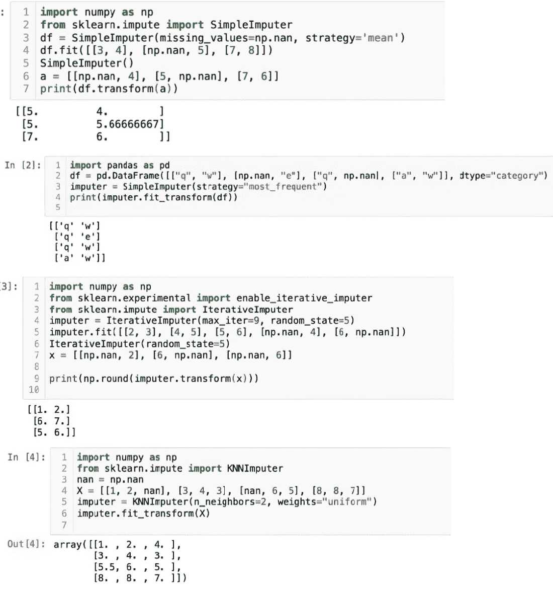

# 第十一章：端到端模型部署

### 本章涵盖了

+   端到端模型部署过程

+   部署后模型的维护

+   每个步骤的 Python 代码

> 旅程本身就是目的地。——丹·艾尔登

学习之路永无止境。学习某样东西需要很大的勇气、耐心和努力。我们必须坚持不懈、富有创造力，并始终寻找学习和提升的机会。

在到目前为止的所有章节中，你已经涵盖了大量的概念、技术和算法。在本书的最后一章，我们将讨论端到端模型部署过程。我们将涵盖从业务问题定义、数据清洗、探索性数据分析（EDA）到模型部署和维护的各个方面。这一端到端的旅程对于你理解整个过程至关重要。我们将在所有相关位置讨论 Python 代码。

欢迎来到最后一章，祝您一切顺利！

## 11.1 机器学习建模过程

回想第一章我们简要讨论了端到端模型开发。在本节中，我们将详细涵盖每个相应的步骤以及我们面临的最常见问题以及如何解决这些问题。最终将引导到模型部署阶段。图 11.1 显示了我们所遵循的模型开发过程。

##### 图 11.1 完整的机器学习建模过程

模型开发过程中的步骤如下：

1.  业务问题定义

1.  数据发现和可行性分析

1.  数据清洗和预处理

1.  探索性数据分析

1.  建模过程和业务审批

1.  模型部署

1.  模型文档

1.  模型维护和模型更新

在本章中，我们将详细涵盖这些过程中的每一个。这些都是建模过程的相关内容。

## 11.2 业务问题定义

您的业务问题定义是第一步。确保业务问题简洁、明确、可衡量和可实现至关重要。在实践中，很多时候业务问题定义得模糊，例如“降低成本或增加收入”，这通常会导致整个过程中出现不良结果。一个良好的业务问题应该明确地定义，包括关键绩效指标（KPIs）和可以用来衡量效果的参数。一个良好的业务问题确保没有歧义，目标明确，我们可以在可用资源和时间范围内实现它。

关于业务问题的一些最重要的考虑因素如下：

+   如果业务问题定义得模糊不清，将会引起问题，应该避免。例如，所有企业和各种职能都希望增加收入和利润，降低成本，优化各种流程等等。在模糊的业务问题下，我们将对过程缺乏清晰的认识，这会导致模糊性。

+   商业目标应该是实际可实现的。不应设定像翻倍收入或减半成本这样的不切实际的目标。不切实际的目标意味着良好的结果可能会被拒绝，因为它们不符合业务目标。

+   如果可能的话，商业问题应该是可衡量的。如果商业问题只是定性的，那么它将只有有限的帮助。我们将无法理解所创建的机器学习模型的实际效果。

+   范围蔓延是我们有时面临的问题之一。范围蔓延发生在项目开始时，在项目构建过程中，范围发生剧烈变化，改变了项目的要求和时间需求，而没有相应地改变资源和截止日期。

一个有效的商业问题被正确、完整地定义，并与业务团队进行讨论。它简洁，具有可衡量的 KPI，并在给定的时间内可实现。

注意：商业利益相关者和主题专家应参与定义商业问题。他们应从项目开始就是团队的一部分，并拥有整个流程。

一些好的商业问题的例子如下：

+   组织中的营销团队旨在优化各种成本并最大化投资回报。他们希望确定营销努力（电子邮件、电话、电视广告和会议）的最佳组合，以在接下来的六个月内将投资回报率提高 1.5%。

+   一个制造团队在过去三个月面临缺陷数量增加的问题。商业问题可能是确定导致缺陷增加的所有潜在原因。团队还希望了解是否存在趋势或模式。业务目标可能是筛选出最显著的缺陷原因，并在接下来的六个月内将其减少 2.5%。

我们已经描述了商业问题的属性。我们现在进入下一阶段，即数据发现和可行性。

## 11.3 数据发现和可行性分析

数据发现阶段是整个模型构建过程中最重要的步骤之一。如果数据在数量和质量上都不足，可能非常难以创建我们想要的解决方案。同时，能够访问这些数据至关重要。

在此过程中，我们还对项目进行可行性分析：

1.  数据是主角。第一步是确定用于商业问题用例所需的数据集以及所有利益相关者访问这些数据集的机制。因此，建议

    +   数据集可以从服务器或云中获取，并且已正确设置相关权限供需要访问的人员使用。服务器可以从数据库（如 SQL/MySQL/NoSQL/MongoDB）中访问数据。

    +   如果数据存储在 Excel/.csv/text 文件中，将其放在服务器上会有所帮助。近年来，像 AWS、Azure、Google Cloud 等云服务器被用于存储数据。

1.  确保数据集完整且与业务问题相关至关重要。数据集应该足够代表手头的业务问题，并捕捉业务中的所有变化。数据的时间和持续时间是我们应该牢记的另一个重要维度。例如，如果我们想分析电信运营商或零售公司的业务，我们应该有足够的数据（至少是去年的数据，以便捕捉季节性）以及围绕销售、交易、折扣、购买的产品/服务、营销行为、历史行为、线下/在线购买等变量。

1.  在这个阶段计划数据刷新是明智的。毕竟，一旦模型建立，我们就需要维护和更新它。

在这个阶段，我们可能面临的最常见问题如下：

+   我们可能会发现数据集中存在某些缺失值、异常值等。我们将在下一节中详细说明。

+   我们还必须确保在数据集上应用正确的业务规则。确保这一点的步骤如下

    +   获取与业务问题相关的数据集。

    +   进行一些基本分析，如总销售额、客户数量、按月趋势、折扣等。

    +   让这些关键绩效指标（KPIs）由业务利益相关者进行验证。如果数字错误，则需细化业务规则。

只有当数据正确且数字准确时，我们才能继续进行用例的可行性分析。对于可行性分析，我们执行以下操作：

1.  详细检查数据质量。我们将在下一节中涵盖各个方面。

1.  分析数据以寻找任何模式，例如季节性等。我们还会检查是否存在各种变量之间的相关性，以确保哪些变量彼此相关。

1.  检查业务问题与数据集之间的关系。这之后是探索性分析，以确定是否存在不同客户群体之间的显著差异。

在此步骤之后，我们将进入数据清洗、预处理和准备阶段。这是我们必须要做的耗时步骤之一。

## 11.4 数据清洗和预处理

在最后一步，我们筛选出与业务问题相关的数据。现在我们将进入建模过程中的数据清洗和预处理阶段。

数据在其原始形式可能不足以被输入到机器学习模型中。我们必须创建一些额外的变量并处理一些其他数据。在现实商业世界中，数据集通常是“脏”的。数据中可能存在许多问题，如下所述：

+   重复值

+   分类别变量（可能对某些算法造成问题）

+   缺失值、NULL 或非数字（NaN）等。

+   异常值

+   其他问题（如前几章所述）

让我们逐一处理这些问题。本章的代码已提交至[`mng.bz/vKY7`](https://mng.bz/vKY7)。您可以在那里访问代码和数据集。我们现在将研究如何处理数据集中的重复值。

## 11.5 数据中的重复值

重复项在数据集中通常是一个问题。如果数据集中有两行是完全相同的，它们在本质上就是重复的。这个问题可能发生在数据捕获时。重复项的问题在于会影响统计数据——例如，使某些事件看起来比实际更频繁。在删除重复项时，需要注意不要删除真正发生两次的事件的真实数据——例如，一个客户在两个不同时间购买同一商品，或者一个客户在同一时间购买两个相同商品，而购买交易被记录了两次。

以下是一个简单的 Python 程序删除重复项的步骤（见图 11.2）：

1.  导入`numpy`和`pandas`。

1.  定义一个包含一些虚拟变量的数据框。

1.  打印数据框。

1.  有一个内置方法：`drop_duplicates()`。使用它来删除重复项。

1.  打印数据框并发现重复行已被删除。

##### 图 11.2 在简单的 Python 程序中删除重复项

## 11.6 分类变量

下一步是处理分类变量。让我们回顾一下分类变量的定义。性别、城市、产品类别、邮编等变量是分类变量的例子。分类变量可能不是数据中的严格问题，但它们可能会给某些算法（如 k-means 聚类）带来问题。回想一下，对于 k-means 聚类，需要在数据点之间计算距离。

在某些数据集中，一个分类变量可能几乎所有值都相同。例如，如果整个数据集都是关于英国的，而一个变量是“城市”，由于很大一部分人口居住在伦敦，那么这个变量可能作用有限。它不会在数据集中创建任何变化，也不会有用。同样，像“邮编”这样的分类变量可能所有值都是独特的，也不会对分析增加太多价值。

处理分类变量最常见的方法可能是使用独热编码。在独热编码中，正如 Python 代码书中所示，变量会被转换：

1.  使用我们在上一段代码中使用的相同数据集。

1.  pandas 中有一个内置方法`get_dummies()`，可以用来将分类变量转换为数值型。见图 11.3。

##### 图 11.3 执行代码的输出

## 11.7 数据集中的缺失值

在现实世界的数据集中，最常见的一个挑战是缺失值，这些值可能是空白、NULL、NaN 等。这可能是由于数据捕获问题或数据转换造成的。缺失值应该被处理以确保解决方案的稳健性。缺失值可能有几个原因：

+   在数据捕获过程中，值没有被正确记录。这可能是由于设备故障或记录数据时的手动错误。

+   许多时候，非必填字段没有被填写。例如，在填写零售忠诚度表格时，顾客可能不会填写年龄。

+   调查响应可能没有完全填写——例如，薪资详情。

为了减轻缺失值，有几个选项：

+   首先，我们应该检查数据是否是故意缺失的，以及是否是一个需要解决的问题。例如，一个传感器可能不会记录超过一定压力范围的任何温度值。在这种情况下，温度的缺失值是正确的。

+   我们还应该检查缺失值是否与其他独立变量以及目标变量之间存在任何模式。例如，在下一个示例中使用的数据集中，我们可以推断出，每当温度值为 NULL 时，设备就出现了故障。在这种情况下，温度和故障设备之间有明显的模式。因此，删除温度或处理温度变量将是错误的一步。

+   处理缺失值可能最简单的方法是删除包含缺失值的行。尽管这很简单且快速，但它会减少人口规模，并可能删除前面描述的非常重要的信息，例如，如果一个人的合法姓氏不可用。因此，我们应该小心删除行。

+   我们可以通过均值、中位数或众数来填充缺失值。均值或中位数仅适用于连续变量。众数可以用于连续和分类变量。

+   还有其他一些流行的缺失值填充方法，例如使用 k 最近邻和链式方程的多变量填充。

我们现在使用 Python 来填充缺失值。我们将使用内置方法`SimpleImputer`并用均值来填充缺失值。第二个解决方案是用于分类变量，其中使用众数来替换缺失值。见图 11.4。

##### 图 11.4 代码执行后的输出

在接下来的解决方案中，我们将使用`IterativeImputer`和 k 最近邻算法。

## 11.8 数据中的异常值

异常值在数据中可能是一个大问题。考虑以下情况：假设一个城市的平均降雨量为 50 厘米。但有一年，由于大雨，平均降雨量达到了 100 厘米。这个数据点将是一个异常值，如果包含在内，将完全改变分析结果。在例子中，根据是否将重降雨年份包含在统计分析中，结果（比如可能的保险索赔）可能会有很大不同。

因此，就像缺失值一样，异常值不一定是一个错误。我们应该运用商业敏锐度来推断数据点是否真的是研究中的异常值。

我们可以通过以下方式检测异常值：

+   如果一个数据点位于 5 百分位数和 95 百分位数之外，或者 1 百分位数和 99 百分位数之外，它可以被认为是异常值。

+   一个超出-1.5 倍四分位距（IQR）和+1.5 倍 IQR 的值也可以被认为是异常值。这里 IQR 由（第 75 百分位数的值）-（第 25 百分位数的值）给出。

+   距离均值一个、两个或三个标准差之外的价值可以被称为异常值。

我们可以创建图表并可视化异常值。我们可以通过以下方法处理异常值：

+   一个位于 5 百分位数和 95 百分位数之外的数据点可以分别被限制在 5 百分位数和 95 百分位数。或者一个位于 1 百分位数和 99 百分位数之外的数据点可以分别被限制在 1 百分位数和 99 百分位数。

+   有时也会使用均值、中位数或众数进行替换。

+   有时对变量取自然对数可以减少异常值的影响。但由于自然对数会改变实际值，我们应该使用合适的数学模型来确保它是适当的。

异常值对我们的数据集提出了很大的挑战。它们扭曲了我们从数据中得出的见解。有时这种扭曲是合适的（例如，异常重降雨年份的保险索赔，保险公司需要考虑）。在任何情况下，我们至少要突出显示数据集中的异常值，有时还需要修改它们。

## 11.9 探索性数据分析

探索性数据分析（EDA）在我们开始建模之前是最关键的步骤之一。通过 EDA，我们生成对业务非常有用的见解。从 EDA 中生成的见解也符合建模输出。

在 EDA 中，我们检查所有变量并了解它们的模式、相互依赖性、关系和趋势。在 EDA 阶段，我们了解数据应该如何表现。在这个阶段，我们从数据中揭示见解和建议。强大的可视化可以补充完整的 EDA。

注意：EDA 是成功的关键；很多时候，良好的 EDA 可以解决业务问题。

接下来，我们使用 Python 对数据集进行详细的 EDA 分析。整个代码对于一本书来说相当庞大；因此，带有完整解释和注释的 Python 笔记本已提交到 GitHub 仓库（[`mng.bz/vKY7`](https://mng.bz/vKY7)）。

## 11.10 模型开发和业务批准

我们已经在整本书中详细介绍了建模过程。这包括创建模型的第一个版本，然后使用不同的超参数和不同的算法进行迭代。

在整本书中，我们介绍了许多关于聚类和降维方法的算法。我们还涵盖了文本数据集的建模。在模型开发阶段，根据手头的业务问题和数据集，我们选择候选算法。我们总是努力根据我们在前面章节中讨论的准确度测量参数选择最佳算法。

建模过程的输出是最终算法，它为手头的业务问题提供最佳输出。找到性能令人满意的模型后，我们应该与业务利益相关者进行讨论，以获取他们的最终反馈。可能需要几次迭代来进一步改进模型。

现在，你已经有一个在统计上显著、有用且得到业务利益相关者认可的模型。我们可以进入模型部署阶段。

## 11.11 模型部署

模型部署是人工智能和机器学习模型开发中的一个关键阶段。它是开发和生产环境之间的转换点，模型在此用于现实世界的商业目的。有许多方面需要考虑，如基础设施问题、部署方法、监控和维护。我们讨论了与模型部署相关的挑战和推荐步骤，以及一个系统化和有组织的策略，以将模型投入生产。

## 11.12 模型部署的目的

模型部署是一个关键过程。模型部署的主要原因如下：

+   模型的部署将洞察力转化为可操作和实用的目的。模型用于进行预测、优化、推荐和建议。

+   部署的模型与业务流程和工作流程集成。这促进了基于模型提出的洞察和建议的各种流程和业务功能的自动化。

+   实时预测确保业务能够快速响应不断变化的商业条件。实时预测在交易中的信用卡欺诈检测、动态定价等场景中特别有用。

+   优化和自动化得到增强。模型部署通过自动化业务功能减少了员工的工作量。借助部署的模型，硬件使用得到优化，业务功能和流程变得更加高效，整体投资回报率提高。

+   部署模型后，可以对模型进行版本控制。这确保了组织可以跟踪变化，执行 A/B 测试，并在需要时进行回滚。

总结来说，模型部署的目的是将机器学习模型的潜力转化为实际应用，使它们成为业务运营和决策过程中的重要组成部分。部署使组织能够利用 AI 和数据科学的威力，从现实世界场景中获取模型的实际价值。

## 11.13 模型部署类型

模型部署有几种类型。根据需求和战略目标，我们可以在它们之间进行选择。不同的部署策略包括

+   *批量部署*—当我们在一段时间内收集了大量数据集，并需要使用机器学习模型在离线模式下评估这些数据并做出预测时，使用这种方法。通常，处理是在大批次中完成的。例如，如果我们想根据 k-means 聚类对零售店的客户进行聚类，我们可以取他们过去两年的属性，并为每个客户生成相应的聚类。我们可以在一个月后刷新底层数据，因此我们可以重新分配这些聚类。

+   *实时部署*—考虑这种情况：我们想要检查 incoming credit card transaction 是否为真实或欺诈。在这种情况下，我们使用实时检查。预测是基于最新信息实时生成的。通常，为了支持实时预测，我们应该采用多线程处理，以便同时处理多个预测请求。例如，可能会有数百个信用卡请求同时提交，我们的系统需要以非常低的延迟对它们进行分类。

+   *边缘部署*—如今，人们期望智能手机或物联网设备具备适合机器学习或 AI 算法的复杂功能。在这种情况下，云部署是可行的，但在没有互联网连接的情况下，也会使用边缘部署。边缘部署的前提是机器学习模型应该体积小，计算需求低，以便在资源有限的设备上运行。

+   *金丝雀部署*—在金丝雀部署中，我们在对所有用户进行全面部署之前，先将模型发布给一部分用户。这样可以确保不稳定版本不会发布给所有用户，因为我们将在第一阶段从测试用户那里获得反馈。这通常由拥有大量用户并通过云提供服务的公司，如谷歌或 Facebook，来完成。

+   *A/B 测试*—A/B 测试实际上并不是一种模型部署技术，但它可以用作一种技术，这就是为什么它被列在这里的原因。在 A/B 测试中，组织希望测试一个解决方案/服务/产品与另一个相比如何。例如，如果产品团队希望测试两个方案哪个能带来更好的盈利能力，他们将使用 A/B 测试。两个方案的例子可以是“花费 100 美元获得 15%的折扣”或“花费 50 美元获得 10%的折扣”。在这种情况下，可能会有两组相似的客户群体将收到这些优惠，我们将检查哪个能带来更好的盈利能力。在 A/B 测试部署中，两个不同的模型（或具有不同超参数的相同模型）将相互测试。

## 11.14 部署模型时的注意事项

在部署模型时，我们应该注意相当多的因素，以确保模型从开发到部署的平稳和有效过渡：

+   *准确性监控*—我们应该持续监控模型的性能，并在性能低于阈值时进行改进。我们应该涵盖关键指标，如准确性、资源利用率、时间和准确性。

+   *可扩展性*—解决方案应该可扩展到其他部门或品牌。随着时间的推移，数据的量也可能增加。

+   *安全和合规性*—这是一个绝对不能妥协的考虑因素。任何类型的部署都应该完全安全，免受任何威胁，并且完全符合现有的最佳实践、政策和要求。

+   *模型漂移和数据漂移*—这些应该被监控，因为整体业务场景可能会发生变化。客户、他们的偏好、市场以及整体经济可能会发生变化。有像 COVID、战争、洪水等事件，因此存在数据漂移。这也会导致模型性能的变化。因此，我们应该提前规划模型漂移。

+   *可重现性*—当我们部署模型时，结果的可重现性是一个重要因素。我们应该能够复制这些结果。

+   *持续集成和持续部署*—这些管道需要自动化测试和部署过程。这减少了错误的风险，并确保了平稳的部署。

+   *用户反馈和迭代*—这些对于项目的成功非常重要。在规划部署时，我们应该充分考虑将用户的反馈和模型的迭代纳入其中。

+   *版本控制和回滚*——没有模型是最终的。它有连续的迭代。在基础设施中，应该有回滚到上一个版本的规定，如果新版本有任何问题，或者基于业务需求的理由。

通过这一点，我们已经涵盖了模型部署的所有考虑因素。现在我们将使用 Flask 部署一个模型。整个代码已经上传到 GitHub 仓库([`mng.bz/vKY7`](https://mng.bz/vKY7))，并附有完整的注释和解释。

## 11.15 文档

我们已经部署了模型。现在我们确保所有代码片段都已清理，注释得当，并遵循最佳实践。代码文件应被检查并妥善记录。不幸的是，文档编写往往没有得到足够的时间，但它是一个非常重要的步骤，不应被忽视。如果在编写文档时需要设定优先级，应优先考虑那些可能发生变化以及需要与外部利益相关者理解和互动的方面。

代码版本控制有许多工具。Git 可能是最常见的一个。确保我们所有的代码都定期检查入库，以保护我们免受任何潜在计算机故障的影响，这是一个非常好的实践。对于文档，我们确实在行业内有很多选择，从 Word 到 PowerPoint 到 Confluence 页面，具体取决于我们工作的行业。

## 11.16 模型维护和更新

到目前为止，我们已经涵盖了模型开发和部署的所有阶段。但是一旦模型投入生产，就需要持续监控。我们必须确保模型始终以期望的准确度水平运行。为了实现这一点，建议设置一个仪表板或监控系统来定期评估模型的性能。如果不存在这样的系统，可以对模型进行每月或每季度的检查。

模型部署后，我们可以对模型进行每月的健康检查。这意味着我们将模型的性能与预期的准确度进行比较。如果性能不佳，模型需要更新。即使模型可能没有恶化，但在不断创建和保存的新数据点上刷新模型仍然是一个好的实践。模型更新通常基于业务问题以及模型所构建的业务领域。例如，在电信领域，由于客户每天使用手机，数据更新速度更快。另一方面，对于零售服装，我们并不期望客户每天购买衣服。因此，电信领域的模型可以每周或每两周刷新一次，而对于服装，我们可以每季度或每六个月刷新一次。

模型刷新是一个相当重要的现象。我们的业务场景在本质上总是动态变化的。客户的偏好和生活方式会发生变化，而且竞争对手总是在进行某些活动。有一些场景是我们无法控制的，比如战争、COVID 等。因此，我们始终应该努力调整我们的模型以适应我们业务中的最新场景。

模型刷新意味着我们正在根据我们收集到的新数据点重新训练模型。这确保了我们能够捕捉到数据中的最新趋势、背景和新兴关系，因此我们的模型能够预测、优化和加速最新的数据点。

有了这些，我们已经完成了设计机器学习系统的所有步骤：如何从头开始开发它，如何部署它，以及如何维护它。这是一个相当繁琐且需要团队合作的长过程。

## 11.17 总结性思考

从头到尾的机器学习开发是一个相当耗时的工作。从零开始到维护，它需要大量的规划、团队合作、业务知识和努力。在本章中，我们涵盖了这些步骤中的许多。也可能有其他可能的解决方案，这些解决方案取决于业务领域和需求。

有了这些，我们这本书就接近尾声了。我们都阅读并感受到在这个新时代，数据是新石油、新电力、新力量和新货币。这个领域正在迅速发展，并在全球范围内产生影响力。增强和改进的速度创造了新的工作机会，如数据工程师、数据科学家、可视化专家、机器学习工程师、MLOps、DevOps、GenAI 专家等，需求每天都在增加。但是，满足这些职位描述严格标准的专业人士却很少。当务之急是需要有*数据艺术家*，他们能够将业务目标与分析问题相结合，预见解决方案以解决动态的业务问题，适应不断变化的技术环境，并且还能提供成本效益高的业务解决方案。

每天都在创建更复杂的系统。我们可以看到自动驾驶汽车、人类聊天机器人、欺诈检测系统、面部识别解决方案、目标检测解决方案、优化和监控解决方案等例子。GenAI 的使用进一步增强了效果。

同时，也存在一些风险，我们应该有所警觉。人类有责任如何利用数据的力量。有些情况下（如果我们相信所声称的），AI 被用于操纵选举结果，或者 DeepFake 被用于改变人们的照片或基于种族/颜色等进行人物画像。我们可以使用机器学习和 AI 来传播爱与恨——这是我们的选择。就像俗语所说：能力越大，责任越大！

我们真诚地希望您喜欢这本书。恭喜您，祝您下一步一切顺利！

## 11.18 实践下一步行动和建议阅读

以下提供下一步行动的建议和一些有用的阅读材料：

+   阅读以下关于模型部署的两篇研究论文：

    +   Paleyes, A., Urma, R-G., and Lawrence, N. D. (2020). 部署机器学习面临的挑战：案例研究综述。[`arxiv.org/abs/2011.09926v2`](https://arxiv.org/abs/2011.09926v2)

    +   Sculley, D., Holt, G., Golovin, D., et al. (2015). 机器学习系统中的隐藏技术债务。[`mng.bz/4azw`](https://mng.bz/4azw)

+   使用我们在前几章中开发的数据集，并对这些数据集进行 EDA。

## 摘要

+   学习之旅是持续的，需要勇气、耐心和勤奋；理解从概念化到模型部署的整个过程对于掌握机器学习至关重要。

+   端到端模型部署过程包括业务问题定义、数据清洗、EDA 以及最终模型部署和维护等关键步骤。

+   机器学习建模过程包括不同的阶段，如业务问题定义、数据发现和可行性分析、数据预处理、EDA、建模、部署、文档和运维。

+   明确且可达成业务问题定义对于有效地对齐目标、防止范围蔓延以及确保 KPI 可衡量以评估模型效果至关重要。

+   数据发现涉及识别必要的数据集，确保访问和完整性，并分析可行性，特别关注数据的相关性、质量和表示。

+   数据清洗和预处理解决常见问题，如重复数据、分类变量、缺失数据和异常值，利用各种技术为有效建模准备数据集。

+   EDA 对于理解数据模式和关系以及生成可操作见解至关重要，为成功的模型开发奠定基础。

+   模型开发阶段使用适合业务问题的算法，并需要利益相关者的协作以进行细化。

+   模型部署连接了开发和生产，需要考虑基础设施、实时应用、扩展、安全和持续集成以优化模型效用。

+   模型部署的类型包括批量、实时、边缘、金丝雀和 A/B 测试，每种类型根据战略目标和应用环境提供不同的优势。

+   有效的部署涉及准确性监控、检测模型和数据漂移、确保合规性和数据安全，以及确保可重复性和可扩展性。

+   部署后，详尽的文档和版本控制对于代码完整性至关重要，并在必要时促进未来的迭代或回滚。

+   模型维护包括定期性能检查和更新，适应动态的商业环境，并确保与不断变化的数据趋势保持一致。

+   数据驱动解决方案具有巨大的潜力，但也同样需要高度的责任使用。我们通过强调道德应用的重要性来结束这本书。
