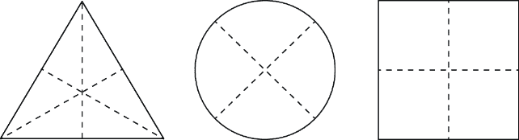
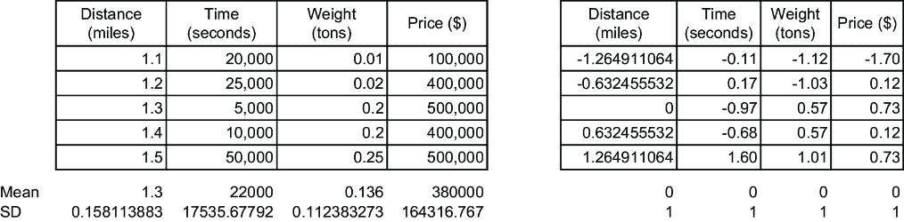
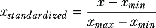
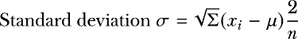
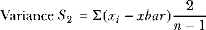
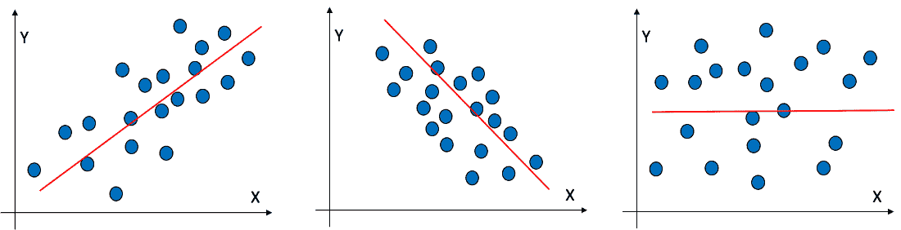
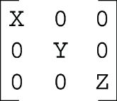

# 附录 A 数学基础

## A.1 聚类算法列表

### A.1.1 基于划分的算法

+   k 均值

+   k-medoids（PAM）

+   CLARA（聚类大型应用）

+   CLARANS（基于随机搜索的聚类大型应用）

+   小批量 k 均值

+   模糊 C 均值（FCM）

+   k-modes

+   k-prototypes

### A.1.2 层次聚类

+   聚类层次结构

+   分裂层次聚类

+   BIRCH（使用层次结构的平衡迭代减少和聚类）

+   CURE（使用代表的聚类）

+   骆驼

+   ROCK（使用链接的鲁棒聚类）

+   HIERDENC（基于密度的层次聚类）

+   HAC-S（具有空间约束的层次聚合聚类）

+   EAC（集成聚合聚类）

### A.1.3 基于密度的算法

+   DBSCAN（基于密度的空间聚类应用噪声）

+   OPTICS（用于识别聚类结构的点排序）

+   HDBSCAN（层次 DBSCAN）

+   DENCLUE（基于密度的聚类）

+   均值漂移

+   VDBSCAN（基于可变密度空间聚类）

+   DBCLASD（大型空间数据库的基于分布的聚类）

+   LDBSCAN（标记 DBSCAN）

### A.1.4 基于网格的算法

+   STING（统计信息网格）

+   WaveCluster

+   SUBCLU（子空间聚类）

+   GRIDCLUS（基于网格的聚类算法）

+   OptiGrid

+   CLIQUE（在查询中的聚类）

### A.1.5 基于模型的算法

+   高斯混合模型（GMM）

+   EM（期望最大化）算法

+   DBEM（基于密度的 EM）

+   贝叶斯高斯混合模型

+   隐藏马尔可夫模型（HMM）聚类

+   X-Means（扩展 k 均值）

+   G-Means（高斯均值）

+   MCLUST（使用 EM 的基于模型的聚类）

+   AUTOCLASS（基于贝叶斯模型聚类）

+   Mixmod（聚类混合模型）

### A.1.6 谱聚类

+   比率切割聚类

+   归一化切割聚类

+   多路谱聚类

+   谱双聚类

+   Shi-Malik 聚类

+   聚类用的拉普拉斯特征图

### A.1.7 基于图的聚类

+   连通分量聚类

+   马尔可夫聚类（MCL）

+   Girvan-Newman 聚类

+   社区检测的 Louvain 方法

+   Infomap 算法

+   Walktrap 算法

+   边界介数聚类

+   中国 whispers 聚类

+   SPICi（聚类中的速度和性能）

+   SCPS（Perona & Shi 图上的谱聚类）

### A.1.8 子空间和高维聚类

+   PROCLUS（投影聚类）

+   SUBCLU（子空间聚类）

+   ENCLUS（基于熵的子空间聚类）

+   ORCLUS（正交子空间聚类）

+   FSSC（快速子空间聚类）

+   P3C（基于模式的子空间聚类）

+   FIRES（频繁项集聚类）

+   SNN（共享最近邻聚类）

+   高维谱聚类

+   LAC（局部自适应聚类）

### A.1.9 模糊和软聚类

+   模糊 C 均值

+   Gustafson-Kessel 算法

+   模糊最小-最大聚类

+   可能性 C 均值（PCM）

+   FCM-GA（带遗传算法的模糊 C 均值）

+   带空间约束的模糊 C 均值（FCM-SC）

+   模糊子空间聚类

+   模糊 SOM（自组织映射）

### A.1.10 基于约束的聚类

+   COP-k 均值（约束 k 均值）

+   约束 DBSCAN

+   C-DBSCAN（基于约束的 DBSCAN）

+   PCKMeans (成对约束 k-means)

+   半监督 k-means

+   带有必须链接和不能链接约束的 FCM

+   带约束的硬 k-means

### A.1.11 进化遗传聚类

+   基于遗传算法的聚类

+   GA-KMeans (带有 k-means 的遗传算法)

+   AGCT (聚合遗传聚类)

+   MEPSO (用于聚类的多精英粒子群优化)

+   NSGA-II (用于聚类的非支配排序遗传算法 II)

+   ACO-CLUSTER (用于聚类的蚁群优化)

+   GCUK (带有无监督 k-means 的遗传聚类)

### A.1.12 基于神经网络的聚类

+   自组织映射 (SOM)

+   神经气

+   增长神经气

+   基于自动编码器的聚类

+   深度嵌入聚类 (DEC)

+   生成拓扑映射 (GTM)

+   DeepCluster (聚类深度学习)

### A.1.13 其他算法

+   相似性传播

+   二分 k-means

+   混合 BIRCH-k-means

## A.2 什么是中心点？

聚类中心是聚类中的中心点。在几何学中，它是形状中所有点的算术平均值或平均值。例如，在三角形中，中心点是所有中线相交的点（见图 A.1）。在任何其他形状中，它将是所有点坐标的平均值。

##### 图 A.1 中心点的示例

## A.3 L1 与 L2 范数

L1 范数是向量中所有项的绝对值之和；另一方面，L2 范数是向量中所有项平方和的平方根。这是 L1 和 L2 范数之间的核心区别。

## A.4 工业中使用的不同缩放技术

我们得到的数据可以有不同的单位和值。一个数据集中的一个变量可以从 1 到 10 变化，而同一数据集中的另一个变量可以从 1,000 到 100,000 变化。数据归一化允许我们将数据归一化或限制在某个范围内。这使我们能够更好地将机器学习应用于归一化后的数据集。

我们归一化数据集以调整不同变量值，这些变量值在相当不同的尺度上。一个例子如图 A.2 所示。

##### 图 A.2 在第一表中，我们有每个变量的均值和标准差。一旦数据归一化，均值和标准差就变为零，如第二表所示。

归一化数据集的方法有很多种。其中最流行的是

+   *标准化*—这涉及使用均值和标准差来归一化数据集。它也被称为*Z 变换*。它标准化所有变量；数据变为正态分布，所有特征都变得可比较。使用的方程式如图 A.1 所示：

##### (A.1)

其中 *μ* 是均值，*σ* 是标准差。

正如我们在图 A.2 右侧观察到的，现在所有变量的均值都是 0，标准差都是 1。

+   *最小-最大缩放*—这使用方程 A.2 中的最大值和最小值来利用变量的值：

##### (A.2)

在机器学习过程中，归一化数据集是重要的步骤之一。

## A.5 时间复杂度 O(n)

时间复杂度是一个计算概念，用于衡量和估计算法完成所需的时间，作为输入长度的函数。通常使用大 O 符号表示，时间复杂度用于根据算法的最坏情况或平均情况运行时间性能对算法进行分类。

时间复杂度的主要方面包括

+   *常数时间 [O(1)]*—算法的运行时间不随输入大小而改变。

+   *对数时间 [O(log n)]*—随着输入大小的增加，运行时间呈对数增长。这通常发生在每一步都将问题规模减半的算法中，如二分搜索。

+   *线性时间 [O(n)]*—运行时间随着输入大小的增加而线性增加。

+   *对数时间 [O(n log n)]*—这在高效的排序算法如归并排序和堆排序中很常见。

+   *二次时间 [O(n²)]*—运行时间随着输入大小的平方增长，通常出现在具有嵌套循环的算法中。

+   *指数时间 [O(2^n)]*—随着输入中每个额外元素的添加，运行时间翻倍，这在一些递归算法中很典型。

理解时间复杂度有助于评估算法的效率，并为给定问题选择正确的算法。

## A.6 如何在 Python 中安装包

在 Python 中，通常使用 `pip` 命令来安装包。步骤如下：

+   打开你的命令行界面（终端、命令提示符或 PowerShell）。输入 `pip` `install` `package_name`。例如，如果你想安装 `numpy`，输入 `pip install` `numpy`。

+   如果你想要安装特定版本，使用 `pip` `install` `package_name== version_number`。例如，如果你想安装 `numpy` `1.21.0`，输入 `pip` `install numpy==1.21.0`。

+   从需求文件安装，你可以创建一个包含所有包信息的 `requirements.text` 文件，然后安装它：`pip` `install` `-r` `requirements.text`。

+   有时候你可能需要升级一个包。那么命令是 `pip install` `–upgrade` `package_name`。例如，`pip install` `-–upgrade` `numpy`。

## A.7 相关系数

相关系数是衡量两个变量之间相关程度的统计和数学关键性能指标。它用于解码变量之间的关系，表明一个变量的增加是否倾向于导致另一个变量的增加（正相关）或减少（负相关）。

关键的相关类型包括

+   *正相关*—当一个变量增加时，另一个变量也增加。例如，身高和体重通常显示出正相关。

+   *负相关*—当一个变量增加时，另一个变量减少。例如，很多时候，当商品的价格增加时，需求减少，这就是负相关。

+   *无相关性**—*这是指两个变量之间没有明显的关系。例如，冰淇淋的销量和电视的销量可能没有相关性。

### A.7.1 相关系数

相关系的强度和方向通过相关系数量化，通常表示为*r*。它介于-1 到 1 之间：

+   *r = 1*—*完全正相关性

+   *r = –1**—*完全负相关性

+   *r = 0**—*无相关性

介于-1 和 1 之间的值表示相关性的不同程度。

### A.7.2 相关性的用途

相关性在许多领域得到应用，包括以下：

+   *数据分析*—相关性有助于分析师识别变量之间的关系，有助于进一步的分析或研究。

+   *预测建模*—在机器学习和预测建模中，如果我们理解变量之间的关系，可以提高模型的表现。

+   *金融*—投资者和财务顾问使用相关性分析来评估资产价格、不同因素和投资原因之间的关系，这有助于投资和投资组合多元化策略。

+   *医疗保健*—健康领域的研究人员收集生活方式因素（如饮食、吸烟、运动）和人口统计数据，并检查这些因素与健康结果之间的相关性，以识别潜在的风险因素，如心脏病发作、糖尿病等。

+   *社会科学*—在心理学和社会学等领域的学科中，相关性被用来探索消费者行为、人口态度和人口统计因素之间的关系。这些研究有助于揭示购买模式、评论和反馈中的关系。

### A.7.3 重要注意事项

在考虑相关性时，请记住以下观点：

+   相关性并不表示因果关系。仅仅因为两个变量相关，并不意味着一个导致另一个。可能还涉及其他因素，或者可能只是巧合。例如，我们可能会发现冰淇淋的销量与鲨鱼攻击的数量呈正相关。因此，我们推断冰淇淋销量影响鲨鱼攻击——这是荒谬的。真正的原因是冰淇淋销量在夏季季节增加，而这是更多人访问海滩的时候。

+   可能存在异常值。极端值可能会扭曲相关系数，因此对异常值保持警惕很重要。很多时候，如果我们只是用散点图可视化数据，我们可能会得到真实的关系。

+   可能存在非线性关系。相关系数衡量线性关系。如果两个变量之间的真实关系是非线性的，相关性可能无法捕捉到这一点。

理解相关性在各个领域都是基础性的，通常也是第一步。它有助于揭示有助于进一步推动战略决策和整体路径的见解。

## A.8 时间序列分析

时间序列分析涉及对在特定时间间隔（如每小时/每日/每周/每月/每年或其他）收集或记录的数据点的研究。它用于检查和理解趋势和行为、季节性模式和关系，以及随时间周期变化的周期性行为，因此理解这些模式将有助于预测。例如，如果我们想预测温度或降雨量，或者如果我们想预测某项商品的需求，这可能涉及时间序列分析。

时间序列分析在营销、金融、环境研究和地理经济预测等领域被广泛使用，用于根据历史数据预测未来值。尽管有相当多的技术，但最常见的是移动平均、指数平滑和 ARIMA。可视化方法，如折线图，对于识别数据中的模式和异常至关重要。总的来说，时间序列分析是一种理解数据中基于时间模式的实用技术，并且对于做出明智的预测和预报很有帮助。

## A.9 数据表示的数学基础

为了全面理解算法，必须理解一些数学术语。它们对于理解概念和数学基础很有用，对于第三章中探讨的降维方法（如主成分分析和奇异值分解）至关重要。这些数学运算足够直观，你可能已经在早期的数学课程中接触过它们，但在这里刷新概念是很重要的。所考察的概念并不新颖，但有时难以解释和理解。

注意：有时在 Python 中编码这些概念可能会很棘手。幸运的是，有相当多的稳健的库和包提供了更简单的解决方案，因此我们不必担心这些概念在 Python 中的实现。

我们试图减少数据集的维度。数据集不过是一个值矩阵；因此，许多概念都与矩阵操作方法、它们的几何表示以及在这些矩阵上执行变换有关。接下来将研究主要概念。

### A.9.1 标量和向量

用简单的话说，如果你走了 5 公里的距离，它是标量；如果你朝某个方向（比如北）走了 5 公里，它就是一个向量。因此，我们可以这样说，向量是一个具有大小和方向的数学对象。没有方向，它只是一个标量值。我们在表 A.1 中列出了一些每个类别的例子。

##### 表 A.1 标量和向量量的例子

| 标量量的例子 | 向量量的例子 |
| --- | --- |
| 长度、宽度、高度、距离 | 位移 |
| 质量、面积、密度、体积 | 重力、力 |
| 压力、温度、能量、熵 | 升力、阻力、推力 |
| 速度，时间，工作，功率  | 速度，加速度，动量  |

简而言之，我们可以得出结论，向量是一个具有方向的标量。

### A.9.2 标准差和方差

标准差和方差的目的是衡量数据的分散程度。标准差由方程 A.3 给出

##### (A.3)

其中 *x*[*i*] 是来自总体的每个值，*μ* 是总体的均值，*n* 是总体大小或观测值的数量，*σ* 是总体的标准差。方差由方程 A.4 给出

##### (A.4)

其中 *x*[*i*] 是来自总体的每个值，*xbar* 是观测值的平均值，*n* 是观测值的数量，*S*^([2]) 是样本方差。

假设我们有一个班级里有五个孩子，他们的身高分别是 50 英寸、51 英寸、52 英寸、53 英寸和 54 英寸。平均身高是 (50+51+52+53+54)/5 = 52 英寸。见表 A.2。

##### 表 A.2 儿童身高和平均身高与身高的计算差值

| 儿童 | 身高 | 平均身高与身高的差值 |
| --- | --- | --- |
| A  | 50  | 52 – 50 = 2  |
| B  | 51  | 52 – 51 = 1  |
| C  | 52  | 52 – 52 = 0  |
| D  | 53  | 52 – 53 = –1  |
| E  | 54  | 52 – 54 = –2  |

### A.9.3 协方差和相关系数

协方差和相关系数是衡量两个变量之间关系和相互依赖性的度量。协方差是线性关系的方向，而相关系数衡量关系的强度和方向。见图 A.3。

##### 图 A.3 如果 *X* 在增加，那么 *Y* 的值也在增加（左）。如果 *X* 在增加，*Y* 在减少（中间）。*X* 和 *Y* 之间没有观察到的关系（右）。

图 A.3 左侧显示，当 *X* 减少，*Y* 增加，反之亦然在中间，而在右侧，似乎两个变量之间没有关系。在这里，协方差将简单地表示变量之间存在正相关、负相关或无相关关系。协方差的大小将难以理解，因为它不是一个归一化的结果。另一方面，相关系数将能够提供关系强度的量度。相关系数可以通过将两个变量的协方差除以标准差的乘积来计算。

最常用的相关系数是皮尔逊相关系数，它只考虑两个变量之间的线性关系。另一个广泛使用的系数是斯皮尔曼秩相关系数，它对非线性关系更敏感。我们可以如图 A.4 所示可视化相关关系。

相关性并不意味着因果关系。这是分析过程中最常见的错误。例如，考虑以下陈述：“鞋的销售量有所增加，同时溺水死亡率有所下降”。如果做出的推断是鞋销售量的增加导致溺水死亡率的下降，那么结果是完全不合逻辑的。这证明了相关性不意味着因果关系。

##### 图 A.4 在第一种情况下，两个变量之间存在正相关。在第二种情况下，两个变量之间存在负相关。在第三种情况下，两个变量之间没有观察到关系。

指标用于测试数据集中两个变量之间是否存在任何关系。这个概念在数据科学中经常被使用和引用。我们分析关系的强度并决定是否存在逻辑趋势。

### A.9.4 矩阵分解、特征向量和特征值

有时候在线性代数中，我们希望将一个矩阵分解为矩阵的乘积；这个过程称为*矩阵分解*。如果我们想要将矩阵表示为矩阵的乘积，我们会使用矩阵分解方法。

特征向量和特征值是矩阵分解的组成部分。如果我们有一个方阵*A*，那么理解如图 A.5 所示方程 A.5。

##### (A.5)

A*v = *λ**v

其中*v*是特征向量，*λ*是特征值。

例如，假设我们有一个矩阵，如图 A.5 所示，我们想要得到特征向量。在这里，-2 是特征值，[1 -2 1]是特征向量。特征向量是一个在变换过程中不改变方向的非零向量。它只将原始矩阵按因子*λ*进行缩放。特征向量和特征值被用于主成分分析（PCA）的实现。

##### 图 A.5 寻找特征向量和特征值

### A.9.5 特殊矩阵

我们接下来定义几个特殊的矩阵。

一个*对角矩阵*的所有非对角元素都是零，如图 A.6 所示。

##### 图 A.6 对角矩阵的例子

一个*正交矩阵*是一个满足以下条件的方阵，如图 A.6 所示方程 A.6。

##### (A.6)

*Q*^(*T*)*Q* = *Q**Q*^(*T*) = *I*

其中*Q*是原始矩阵，*Q*^(*T*)是其转置，*I*是单位矩阵，如图 A.7 所示。

##### 图 A.7 正交矩阵的例子

一个矩阵如果是其转置等于自身的（即，*Q*^(*T*) = *Q*），则称为*对称矩阵*。

## A.10 超参数与参数的比较

参数是模型从机器学习模型的训练中学习的内部值。例如，它们是回归模型中的系数或在神经网络中的权重/偏差。它们在机器学习模型的训练过程中自动设置。

另一方面，超参数在训练开始前就预先定义，并控制机器学习模型。例如，k-means 聚类中的聚类数量（*k*）或使用的距离度量。它们是手动选择的，可以使用各种技术如网格搜索 CV 或随机搜索 CV 进行优化。

# 索引

符号

[.info 命令[info 命令]](../Text/chapter-4.html#p120)

<强调>计算网络科学<默认段落字体>（Hexmoor）

A

亲和矩阵

基于自编码器的聚类

亲和传播

自编码器, 2nd

应用

组件

特征学习

实际下一步行动和建议阅读材料

类型

关联规则, 2nd

Apriori 算法, 2nd

的构建块

案例研究, 2nd

等价类聚类和自下而上的网格遍历, 2nd

实际下一步行动和建议阅读材料

技术工具包

邻接矩阵

Apriori 算法

的挑战

AI（人工智能）

先行词

异常检测

所有记录列表

A/B 测试

ACO-CLUSTER（蚁群优化聚类）

ATV（平均交易价值）

准确性监控

AGCT（层次聚类）

AUTOCLASS（基于贝叶斯模型的聚类）

B

BIRCH（使用层次结构的平衡迭代减少和聚类）

贝叶斯高斯混合模型

二元组

二进制数据

业务问题定义, 2nd

批量部署

反向传播

背后的数学

瓶颈

业务利益相关者和主题专家

边界点

Bisecting k-means

双变量分析

C

基于约束的聚类

类变量

持续部署和集成

CNNs (卷积神经网络), 第 2 次

关键概念

使用

中心极限定理

相关性

系数

重要考虑事项

用法

定制

核心要点, 第 2 次

Chameleon

聚类算法

聚类技术

案例研究, 第 2 次

基于连接性的聚类, 第 2 次

实际下一步行动和建议阅读材料

压缩自编码器

连续数据

CLIQUE (Quest 中的聚类)

基于质心的聚类

测量聚类准确度

上下文感知

对比散度算法

中国 whispers 聚类

CBOW (连续词袋)

约束 DBSCAN

Calinski-Haranasz 指数

代码大小

质心

协方差

分类变量

CLARA (聚类大应用)

ChatGPT

应用和关键特性

CURE (使用代表的聚类)

成本函数

C-DBSCAN (基于约束的 DBSCAN)

条件概率

金丝雀部署

余弦距离

CLARANS (基于随机搜索的聚类大应用)

维度诅咒, 第 2 次

置信度

概述

切比雪夫距离

聚类, 第 2 次

基于质心的

面临的挑战

实际下一步行动和建议阅读材料

技术工具包, 第 2 版

技术

D

药物发现

数据清洗

DBSCAN（带噪声的基于密度的空间聚类应用）, 第 2 版

Python 解决方案

细节

优缺点

步骤

数据艺术家

基于密度的

算法

聚类

DBCLASD（基于分布的大空间数据库聚类）

DBEM（基于密度的 EM）

数据编码

DevOps 团队

判别模型, 第 2 版

数据帧

数据科学团队

DENCLUE（基于密度的聚类）

深度学习, 第 2 版

玻尔兹曼学习规则, 第 2 版

反向传播, 第 2 版

神经网络

实际下一步行动和建议阅读材料

去噪自编码器

数据预处理

数据压缩

Dunn 指数

降维, 第 2 版, 第 3 版

案例研究

案例研究, 第 2 版

维度诅咒, 第 2 版

数学基础

方法

实际下一步行动和建议阅读材料, 第 2 版

优缺点

技术工具包, 第 2 版

数据发现阶段

划分聚类

离散数据

维度

数据

数据工程与管理

数据质量, 第 2 版

定义

类型, 第 2 版

DEC（深度嵌入聚类）

DBN（深度信念网络），第 2 版

关键点

数据工程团队

解码器

度矩阵

对角矩阵

DeepCluster（深度学习聚类）

距离测量

密度可达

E

EDA（探索性数据分析），第 2 版，第 3 版

边介数聚类

欧几里得距离，第 2 版

肘部方法

ENCLUS（基于熵的子空间聚类）

ETL（导出、转换、加载）过程

编码器

EM（期望最大化）算法，第 2 版

边缘部署

EAC（集成层次聚类）

F

FCM-SC（带空间约束的模糊 C 均值）

模糊 C 均值（FCM）

模糊聚类，第 2 版

类型，第 2 版

基于频率的词去除

滤波方法

最远邻点

模糊子空间聚类

模糊 SOM（自组织映射）

FSSC（快速子空间聚类）

FCM-GA（带遗传算法的模糊 C 均值）

FIRES（频繁项集聚类）

for 循环，第 2 版

带必须链接和不能链接约束的 FCM

F-P 算法，第 2 版

模糊最小-最大聚类

FCM（模糊 c 均值）算法，第 2 版

fit_transform 方法

G

遗传聚类

基于图的聚类

基于网格的算法

groupby

get_dummies()方法

GRIDCLUS（基于网格的聚类算法）

组平均链接

GA-k-means（遗传算法与 k-means）

增长神经气

生成网络

GenAI (生成式人工智能), 2nd, 3rd, 4th

判别模型和

整合

GTM (生成式拓扑映射)

GCUK (无监督 k-means 遗传聚类)

贪婪方法

GPT-3 (生成式预训练变换器 3)

Gath-Geva 算法

GANs (生成对抗网络), 2nd, 3rd, 4th

对抗训练

实际下一步和推荐阅读

变体和应用

Girvan-Newman 聚类

高斯分布

GMM (高斯混合模型), 2nd, 3rd

EM 技术

GK (Gaustafson-Kessel) 算法, 2nd

G-Means (高斯均值)

H

带约束的硬 k-means

HDBSCAN (层次 DBSCAN)

层次聚类

最佳聚类数量

优缺点

类型

高光谱图像

硬聚类, 2nd

高维谱聚类

HIERDENC (基于密度的层次聚类)

HMM (隐马尔可夫模型) 聚类

HAC-S (带空间约束的层次聚合聚类)

混合 BIRCH-k-means

休斯现象

隐藏层

I

if/else 块

簇内平方和

输入层, 2nd

惯性

Infomap 算法

IQR (四分位数范围)

J

垃圾或不需要的字符

K

KPIs (关键绩效指标)

Keras, 2nd

KNN (k 近邻)

k-means 聚类, 2nd

寻找<Emphasis>k<Default Para Font>的最佳值

优缺点, 第 2 版

k 均值算法

K-medoids (PAM)

k 中值聚类

Kaiser 标准

知识表示

k-medoids 聚类

keras 库

K-Modes

KL (Kullback-Liebler)散度, 第 2 版

K-Prototypes

L

LSTM (长短期记忆)

LLMs (大型语言模型)

拉普拉斯矩阵

基于层的预训练

词典归一化

lift

概述, 第 2 版

LabelEncoder

LAC (局部自适应聚类)

基于库的清理

潜在变量

库，深度学习, 第 2 版

LDBSCAN (标记 DBSCAN)

引理，定义

最佳拟合线, 第 2 版

损失函数

社区检测的 Louvain 方法

链接标准

聚类用的拉普拉斯特征图

M

市场篮子分析

MCL (马尔可夫聚类)

马尔可夫假设

MinMaxScalar()函数

MCLUST (基于 EM 的模型聚类)

模型部署

数据中的重复值

端到端, 第 2 版, 第 3 版, 第 4 版, 第 5 版, 第 6 版, 第 7 版

类型

MEPSO (用于聚类的多精英粒子群优化)

模型漂移

Mixmod (聚类混合模型)

mpl_toolkits 库

MDS (多维度缩放), 第 2 版

Python 实现, 第 2 版

经典

非度量

matplotlib 库, 2nd

模型维护和刷新

MXNet

多路谱聚类

基于模型的算法

降维的手动方法, 2nd

基于算法的降维方法

相关系数

手动特征选择

数学

L1 范数与 L2 范数

数据表示, 2nd

成员资格

模型开发和业务审批

机器学习（ML）

人工智能和商业智能

算法, 2nd

数据, 2nd

概述, 2nd

过程

技术工具包

均值漂移

矩阵

分解

曼哈顿距离

make_circles 方法

多语言能力

小批量 k-means

最小-最大缩放

N

有噪声的数据集

每层的节点数

邻域

NSGA-II（用于聚类的非支配排序遗传算法 II）

自然语言理解

nltk 库, 2nd, 3rd, 4th

神经网络

激活函数, 2nd

构建块

解决方案

超参数

层, 2nd

优化函数, 2nd

归一化切割聚类

最近邻

n-gram 模型

名义数据

无相关性

基于神经网络的聚类

神经气

NaN（非数字）

numpy 库, 第 2 版, 第 3 版, 第 4 版

负相关

NLP (自然语言处理), 第 2 版

O

正交矩阵

过拟合

独热编码

优化

序数数据

OPTICS (有序点聚类结构识别)

优化函数

自适应优化算法

学习和学习率

目标函数

ORCLUS (正交子空间聚类)

OptiGrid

运营团队

输出层, 第 2 版

异常值, 第 2 版

P

正相关

PyTorch

P3C (基于模式的子空间聚类)

PCA (主成分分析), 第 2 版, 第 3 版, 第 4 版, 第 5 版, 第 6 版

使用 Python 解决方案, 第 2 版

特征值分解

帕维亚大学数据集

参数, 第 2 版

困惑度

主成分

PCM (可能性 C 均值)

池化层

PCKMeans (成对约束 k 均值)

pyspade 库

Python

Apriori 算法, 第 2 版

FCM (模糊 c 均值)算法

等价类聚类和自下而上格遍历

使用分层聚类案例研究

实现 GMM

实现自动编码器

安装包

使用 k 均值聚类实现, 第 2 版

主轴

基于划分的算法

平面图

感知器, 第 2 版

准备，数据清洗

Q

定性数据

定量数据

R

ROCK (Robust Clustering using Links)

正则表达式标记化

ReLU (修正线性单元), 2nd

正则表达式 (Regex)

RNNs (循环神经网络), 2nd

关键概念

random_state 参数

强化学习

比率切分聚类

RGB (红，绿，蓝)

可重现性

RBM (受限玻尔兹曼机)

实时部署

S

SVD (奇异值分解)

使用 Python 解决方案, 2nd

监督微调

相似性图

序列规则挖掘

SNE (随机邻域嵌入)

SimpleImputer 方法

SGD (随机梯度下降), 2nd

结构化数据集

谱间隙

安全和合规性

形状命令

轮廓值

拼花

主观解释

谱聚类, 2nd

Python 实现

构建模块

过程, 2nd

半监督 k-means

特殊矩阵

缩放技术

SPADE (使用等价类的顺序模式发现) 算法, 2nd

支持, 2nd

概述

softmax 函数

SNN (共享最近邻聚类)

Shi-Malik 聚类

标准化

可扩展性

半监督学习

软聚类

重要变量

SCPS (Perona & Shi 图上的谱聚类)

十四行诗

随机梯度下降

停用词去除

监督学习

添加损失函数

算法

计算误差

分类算法, 第 2 版

深度学习, 第 2 版

前馈传播

回归算法, 第 2 版

稀疏自编码器

SUBCLU (子空间聚类), 第 2 版

Sigmoid 函数, 第 2 版

子空间和高维聚类

SPICi (聚类速度和性能)

sklearn 库, 第 2 版, 第 3 版, 第 4 版, 第 5 版

T

分词

文本数据

GenAI 用于

预处理

无监督学习, 第 2 版, 第 3 版

工具包

耗时

tanh 函数

技术工具包

tSNE_first_component

训练

自编码器

时间复杂度 <Emphasis>O<Default Para Font>(<Emphasis>n<Default Para Font>)

数据过多

TF (TensorFlow)

Python 代码

t-SNE (t-分布随机邻域嵌入), 第 2 版

柯西分布

Python 实现, 第 2 版

时间序列分析

TF-IDF (词频-逆文档频率)

U

无监督学习, 第 2 版, 第 3 版

文本数据挑战

深度学习

从文本数据集中提取特征

用于文本数据, 第 2 次, 第 3 次, 第 4 次, 第 5 次, 第 6 次, 第 7 次, 第 8 次

语言模型

技术工具包

使用 Python 进行文本聚类

文本数据, 第 2 次, 第 3 次

文本数据的用例

UMAP (均匀流形近似与投影), 第 2 次

...的关键点

与...一起工作

UI/可视化团队

用户反馈

单变量分析

unigrams

欠完备自编码器

V

版本控制

VDBSCAN (基于变量密度的空间聚类)

变分自编码器

向量

方差

W

Walktrap 算法

WaveCluster

包装方法

WCSS (簇内平方和)

词嵌入

Word2Vec

Ward 链接方法

权重

X

X 变量

X-Means (扩展 k-means)
