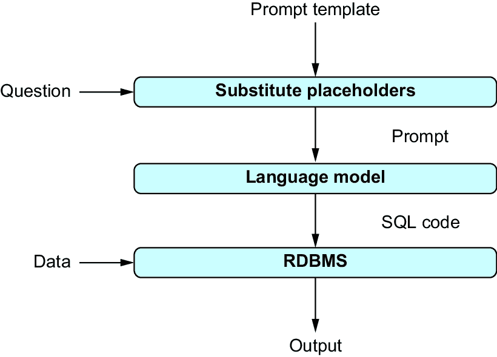

# 1 使用大语言模型分析数据

### 本章涵盖

+   语言模型简介

+   使用语言模型进行数据分析

+   高效使用语言模型

语言模型是强大的神经网络，可用于各种数据处理任务。本章介绍了语言模型，并展示了如何以及为什么使用它们进行数据分析。

## 1.1 语言模型能做什么？

我们将从这个小诗和相关的图片（图 1.1）开始本节，这两个主题是本书的两个主要主题，数据分析和大语言模型：

*在服务器灯光的寂静嗡嗡声中，

数据在夜晚的血管中流淌。

行和列，一个有结构的海洋，

隐藏着故事，等待被释放。

*每个数字都在唱着未讲述的过去，

在明显的模式中找到趋势和真理。

而现在，一个好奇的朋友到来，

一个渴望理解的语言模型。

*它倾听得非常近，电路敏锐，

将原始事实转化为未见过的洞察。

从散点图到清晰的句子，

数据的语言是它能听到的全部。

*图表起舞，文本回应，

当代码在人工智能的注视下遇到意义。

他们融合了他们的世界，无缝的融合，

在逻辑和语言没有尽头的地方。

*因为在这个紧密而广泛的关系中，

数据的本质找到了一个向导。

在神经网络怀抱中，

数据分析获得了诗意的优雅。


##### 图 1.1 GPT-4o 的插图，将“数据分析”和“大语言模型”这两个主题联系起来

这首诗和这幅画都是由 GPT-4o（“o”代表“omni”）生成的，OpenAI 的一个语言模型，它处理多模态数据，仅基于指令“写一首将数据分析和大语言模型联系起来的诗！”然后是“现在画一幅相应的画！”这幅画和这首诗似乎都与请求的主题相关。尽管这首诗可能不会赢得任何文学奖项，但它的文本是连贯的，它按照我们期望的诗的结构来组织，并且押韵！也许最重要的是，生成这首诗和这幅画只需要用自然语言表达的简短指令。而之前的机器学习方法依赖于大量特定任务的训练数据，这种需求现在已经过时了。当然，任务足够具体，足以让我们相信语言模型不是从网络上复制现有的解决方案，而是生成原创内容。

写诗和生成图片只是许多可能的用例（尽管可能是最有趣的一些）。像 GPT-4o 这样的模型可以解决各种任务，例如总结文本文档、编写程序代码以及回答关于图片的问题。在这本书中，你将学习如何使用语言模型完成从从大量文本文档中提取信息到为数据分析编写代码的各种数据分析任务。阅读完这本书后，你将能够快速构建基于语言模型的数据分析管道，并从各种数据格式中提取有用的见解。

##### GPT 代表什么？

*GPT*代表*生成式预训练变换器*。

*生成式*：GPT 是一个大型神经网络，可以根据输入文本生成内容（例如文本或代码）。这一事实使其与其他神经网络区分开来，例如，其他神经网络只能将输入文本分类到一组预定义的固定类别中。

*预训练*：GPT 在大量的数据上进行了预训练，解决诸如预测文本中的下一个单词等通用任务。通常，预训练任务与其主要使用的任务不同。然而，预训练有助于它更快地学习更专业的任务。

*Transformer*是一种新的神经网络架构，特别适用于涉及可变长度输入或输出的学习任务（例如文本文档）。它目前是生成式人工智能方法的占主导地位的架构。

## 1.2 你将学到什么

这本书是关于使用语言模型进行数据分析的。我们可以根据我们分析的数据类型和分析类型来对数据分析任务进行分类。这本书涵盖了广泛的数据类型和分析任务。

我们专注于*多模态*数据分析：也就是说，我们使用语言模型来分析各种类型的数据。更确切地说，这本书中涵盖了以下数据类型：

+   *文本*——想想电子邮件、报纸文章和网上的论坛评论。文本数据无处不在，包含有价值的信息。在这本书中，我们将看到如何使用语言模型根据其内容自动分类文本文档，如何从文本中提取特定信息，以及如何将关于相关主题的文本文档分组。

+   *图像*——正如人们所说，“一图胜千言”。图像帮助我们理解复杂的概念，捕捉我们上次假期的美好回忆，以及描绘当前事件。语言模型可以轻松地从图片中提取信息。例如，我们将使用语言模型来回答关于图像的任意问题或根据数据库中的个人资料识别图片中出现的人。

+   *视频*——网络上的大量数据是视频数据。即使在你的智能手机上，视频数据可能也占据了手机总存储容量的很大一部分。在这本书中，我们将看到语言模型也可以应用于分析视频：例如，根据视频内容生成合适的视频标题。

+   *音频*——对许多人来说，语音是最自然的交流形式。音频记录捕捉演讲和对话，并补充视频。在这本书中，我们将看到如何转录音频记录，如何将口语翻译成其他语言，以及如何构建一个回答关于数据的语音问题的查询界面。

+   *表格*——想象一个包含客户信息的数据库。将数据表示为表格是自然的，其中包含客户地址、电话号码和信用卡信息的列，而不同的行存储有关不同客户的信息。在这本书中，我们将看到如何使用语言模型编写执行此类表格数据复杂操作的代码。

+   *图*——从社交网络到地铁网络，许多数据集都方便地表示为图，模拟实体（如人或地铁站）及其连接（代表友谊或地铁连接）。我们将看到如何使用语言模型生成分析大型图的代码。

##### 结构化数据与非结构化数据

数据类型通常分为两组：*结构化数据*和*非结构化数据*。结构化数据具有结构，便于通过专用工具进行高效数据处理。结构化数据的例子包括表格和图数据。对于此类数据，我们通常将语言模型用作访问专用数据处理工具的接口。非结构化数据，包括文本、图像、视频和音频文件，没有结构，不能轻易用于高效处理。因此，对于非结构化数据，我们通常需要在数据上直接使用语言模型。

在本书的大部分内容中，我们将通过 OpenAI 的 Python 库使用 OpenAI 模型。在本书的结尾，我们还将讨论来自其他提供商的语言模型。由于不同提供商的库通常提供类似的功能，适应其他模型不应花费太多时间。

通常，使用语言模型会产生与处理的数据量成比例的货币费用。费用取决于所使用的语言模型、模型配置以及语言模型输入的表述方式。在这本书中，你不仅将学习通过语言模型解决各种数据分析任务，我们还将讨论如何以最低的成本完成这些任务。

## 1.3 如何使用语言模型

最先进的语言模型通过一种称为*提示（prompting）*的方法使用。我们将在接下来讨论提示，然后是我们可以用于提示的接口。

### 1.3.1 提示（Prompting）

直到几年前，机器学习模型都是针对一个特定任务进行训练的。例如，我们可能有一个模型被训练来将评论文本分类为“正面”（即，评论作者满意）或“负面”（即，作者不满意）。要使用该模型，我们只需要评论文本作为输入。不需要将任务（分类评论）作为输入的一部分进行描述，因为该模型已经专门化来执行该任务，并且仅执行该任务。

近年来，随着大型语言模型如 GPT 的出现，这种情况发生了变化。这些模型不再针对特定任务进行训练。相反，它们旨在作为通用任务求解器，原则上可以解决用户想要的任何任务。当使用此类模型时，用户需要精确地告诉模型模型应该做什么。

提示是语言模型的输入。提示可以包含多模态数据：例如，文本和图像。至少，为了使语言模型解决一个特定任务，提示应该包含一个文本，指导模型要做什么。除了这些指令之外，提示还应包含所有相关上下文。例如，如果指令要求模型判断图片中是否可见汽车，提示必须也包含该图片。提示中的指令应该是具体和明确的，例如，预期的输出格式。例如，如果我们希望模型在存在汽车时输出“1”，不存在时输出“0”，以便我们能够轻松地将模型生成的数字添加到计数汽车中，我们需要在提示中明确说明这一点（否则，模型可能会回答“是的，图片中有汽车”，这在后处理阶段会使计数更困难）。除了指令和上下文之外，提示还可以包含示例，以帮助语言模型理解任务。

##### 少样本学习与零样本学习

我们可以通过在提示中提供示例来帮助语言模型更好地理解一个任务。这些示例与我们要模型解决的任务相似，并指定了输入和期望的输出。这种方法有时被称为*少样本学习*，因为模型基于少量样本来学习任务。另一方面，我们可以使用*零样本学习*，这意味着模型仅基于任务描述（没有样本）来学习任务。

### 1.3.2 示例提示

让我们用一个例子来说明提示。语言模型的一个经典用例是分析产品评论，以确定评论背后的情感：评论是积极的（即，客户推荐该产品）还是消极的（即，客户对产品不满意）。假设我们有一个要分类为积极或消极的评论。如果我们有一个针对我们感兴趣的特定产品类别训练的专门用于评论分类的模型，我们只需要将我们的评论发送到该模型。由于模型专门针对目标问题，它已经“知道”如何处理输入和所需的输出格式。然而，由于我们使用大型语言模型，我们必须在评论中提供更多背景信息。

我们的提示应该包含模型所需的所有相关信息，描述要解决的问题和所有背景。在示例场景中，我们可能希望包括以下信息：

+   *评论文本*——我们要分类的评论的文本。

+   *任务描述*——要解决的问题的描述。

+   *输出格式*——所需的输出格式是什么？

+   *相关背景*——例如，我们是在审查笔记本电脑还是割草机？

可选地，我们可以包括一些带有相关正确分类的示例评论。这可能有助于模型更准确地分类评论。

以下提示包含了一个示例评论的所有相关信息的全部。

##### 列表 1.1 对笔记本电脑评论进行分类的提示

```py
We are considering product reviews for laptops.  #1
For each review, output "satisfied" or "dissatisfied", 
depending on whether the customer is satisfied 
with the product or not.  #2
Examples:
This is a great laptop! I recommend everyone to buy it! 
satisfied  #3
This laptop did not work. I had to return it.
dissatisfied  #4
The screen is too small and it takes too long to start.  #5
```

#1 背景

#2 任务描述和输出格式

#3 第一个示例

#4 第二个示例

#5 评论

这个提示从相关背景描述开始（**1**）。客户正在审查笔记本电脑，例如，如果他们将物品标记为“重”，这可能是一个坏信号（与分析蒸汽压路机的评论不同）。任务描述（**2**）告诉模型如何处理评论，并指定所需的输出格式（输出“满意”或“不满意”）。接下来，我们有一个示例列表。严格来说，在这个简单任务中，在提示中添加示例可能不是必要的。然而，在提示中添加示例有时可以提高输出的准确性。在这里，我们添加了两个示例评论（**3**和**4**），以及这些评论的期望输出。最后，我们添加了我们要模型分类的评论（**5**）。鉴于前面的提示，最先进的语言模型在接收到这个提示作为输入时，很可能会输出“不满意”。当然，这正是我们期望的输出。

### 1.3.3 接口

那么，我们如何向语言模型发送提示呢？像 OpenAI 这样的提供商通常提供 Web 界面，使用户能够向他们的语言模型发送单个提示。在第二章中，我们将使用 OpenAI 的 Web 界面来发送提示，指示模型分析文本或为数据处理编写代码。

只要我们只发送几个提示，Web 界面就能很好地工作。然而，分析大量文本文档就需要发送许多提示（每个文本文档一个）。显然，我们不想手动输入数千个提示。这就是 OpenAI 的 Python 库派上用场的地方。使用这个库，我们可以直接从 Python 发送提示到 OpenAI 的模型，并在 Python 中处理模型的答案。这使得我们能够自动化数据加载、提示生成以及我们需要在模型答案上进行的任何后处理。它还允许我们将语言模型与其他有用的工具集成：例如，使用语言模型编写数据处理代码，并立即使用其他工具执行该代码。

我们将在第三章中回顾 OpenAI 的 Python 库。我们将在这本书的大部分内容中使用这个库。其他语言模型的提供者，包括 Google、Anthropic 和 Cohere，也提供了类似的 Python 库来向他们的语言模型发送提示。我们将在第八章中更详细地讨论这些库。

## 1.4 使用语言模型进行数据分析

那么，我们如何具体使用语言模型进行数据分析呢？这本书考虑了两种可能性。首先，我们可以直接在数据上使用语言模型。这意味着语言模型将我们想要分析的数据作为提示的一部分接收（包括要执行的分析说明）。其次，我们可以间接使用语言模型来分析数据。在这里，语言模型并不直接“看到”数据：也就是说，我们不会将数据全部包含在提示中。相反，我们使用语言模型编写数据处理代码，这些代码在专门的数据处理工具中执行。使用哪种方法取决于数据属性和任务。让我们更详细地看看这两种方法。

### 1.4.1 直接在数据上使用语言模型

使用语言模型分析数据的最佳方法是将数据直接放入提示中。这正是我们在 1.3.2 节中做的事情：为了分析一条评论，我们在提示中包含了评论文本，以及关于如何处理文本的说明。我们也可以用同样的方法处理除了文本之外的其他类型的数据。例如，当使用多模态模型如 GPT-4o 时，我们可以在提示中简单地包含要分析的图片，以及分析说明。

通常，我们不想分析单个图片或评论，而是一组图片或评论。例如，假设我们想要分类整个评论集合，确定每个评论是正面还是负面。在这种情况下，我们通常采取以下方法，使用 Python 和 OpenAI 的 Python 库（或允许用户向其他提供商的模型发送提示的等效库）实现。我们加载要分类的评论，并为每个评论生成一个提示。然后，我们将这些提示发送给语言模型，从模型为每个评论生成的答案中提取分类结果，并将结果保存到磁盘上的文件中。

在这种情况下，我们想要为多个文本文档（即评论）解决相同的任务（评论分类）。正如你可以想象的那样，因此不同的评论提示应该有一些相似之处。尽管每次要分类的评论文本都会变化，但任务描述和提示的其他部分保持不变。

在 Python 中生成提示时，我们使用一个 *提示模板*。提示模板指定与特定任务关联的提示。在我们的例子中，我们将使用提示模板来分类评论是正面还是负面。提示模板包含占位符，以表示根据输入数据而变化的提示的部分。考虑到我们的评论分类提示模板，我们可能需要包括一个用于评论文本的占位符。然后，在 Python 中生成提示时，我们将用当前要分类的评论文本替换该占位符。

例如，我们可以使用以下提示模板来分类评论。

##### 列表 1.2 用于分类笔记本电脑评论的提示模板

```py
We are considering product reviews for laptops.  #1
For each review, output "satisfied" or "dissatisfied", 
depending on whether the customer is satisfied 
with the product or not.  #2
Examples:
This is a great laptop! I recommend everyone to buy it! 
satisfied  #3
This laptop did not work. I had to return it.
dissatisfied  #4
[ReviewText]  #5
```

#1 上下文

#2 任务描述和输出格式

#3 第一个示例

#4 第二个示例

#5 评论文本的占位符

这个提示模板概括了我们之前看到的用于分类单个特定评论的提示（查看第 1.3.2 节中的列表 1.1）。再次强调，我们提供了上下文（我们正在分类笔记本电脑评论）(**1**)，以及描述要解决的问题的任务说明，以及输出格式(**2**)。我们还提供了一些带有相关分类结果的示例评论(**3** 和 **4**)。尽管要分类的评论根据输入而变化，但我们不需要更改示例评论。这些评论仅仅说明了语言模型需要解决的问题。最后(**5**)，我们有一个用于评论文本的占位符。当遍历不同的评论时，我们通过用这个占位符替换评论文本来为每个评论生成一个提示。

示例提示模板只有一个占位符。一般来说，根据输入数据，提示的几个部分可能会发生变化。如果是这样，我们为这些部分中的每一个引入占位符，并用它们替换所有部分以生成提示。

图 1.2 总结了我们在使用语言模型直接分析数据时如何使用提示模板。对于每个数据项（例如，一个需要分类的评论），我们在提示模板中的占位符进行替换以生成一个提示（我们也可以说我们*实例化*了一个提示）。然后我们将这个提示发送给语言模型来解决我们感兴趣的数据分析任务。


##### 图 1.2 直接使用语言模型进行数据分析。一个提示模板描述了分析任务。它包含占位符，这些占位符将被用于分析的数据所替换。在替换占位符后，生成的提示被提交给语言模型以产生输出。

### 1.4.2 通过外部工具进行数据分析

直接将数据放入提示中并不总是最有效的方法。对于某些类型的数据，有专门的工具可用，这些工具可以非常高效地处理该数据上的某些操作。在这些情况下，使用语言模型编写数据处理代码（而不是直接分析数据）通常更有效。语言模型生成的代码然后可以被专用工具执行。

我们将应用这种方法来处理结构化数据。对于如数据表和图这样的结构化数据，有专门的数据处理工具可用，它们支持广泛的分析操作。这些操作，如过滤和聚合数据，可以在结构化数据上非常高效地执行。即使使用语言模型可靠地执行相同的操作（这并不总是可能的），我们也不愿意这样做，因为我们支付给像 OpenAI 这样的提供商的费用与输入数据的大小成比例。使用语言模型处理大型结构化数据集（如包含数百万行的表）是极其昂贵的。在接下来的章节中，我们将讨论以下类型的结构化数据处理工具：

+   *关系数据库管理系统*—存储和处理关系数据：即数据表的集合。大多数关系数据库管理系统支持*SQL*，即结构化查询语言。我们将使用语言模型将关于数据的问题翻译成 SQL 查询。

+   *图数据管理系统*—处理表示实体及其之间关系的图数据。不同的图数据管理系统支持不同的查询语言。在第五章中，我们将看到如何使用语言模型将关于数据的问题翻译成 Neo4j 图数据管理系统支持的*Cypher*语言的查询。

例如，假设我们想要使普通用户能够使用一个用于翻译问题的模板来分析关系数据库：即一组数据表。也许一个表包含调查结果，我们希望让用户从不同的受访者群体中汇总答案。调查结果存储在关系数据库管理系统中（最适合此类数据类型的工具）。使用语言模型，我们可以让用户用自然语言（即普通英语）提出关于数据的问题。语言模型负责将这些问题翻译成正式查询。更确切地说，鉴于数据存储在关系数据库管理系统中，我们希望将这些问题翻译成 SQL 查询。

再次，我们引入一个提示模板来描述我们感兴趣的任务。在这里，我们感兴趣的是文本到 SQL 翻译，这意味着我们希望使用语言模型将自然语言中的问题翻译成 SQL 查询。尽管任务（文本到 SQL 翻译）和数据（包含调查结果的数据库）保持不变，但用户的问题会随时间变化。因此，我们在提示模板中引入一个用户问题的占位符。原则上，以下提示模板应该能够使我们能够将关于我们的调查数据的问题翻译成 SQL 查询。

##### 列表 1.3 将问题翻译到 SQL 的提示模板

```py
Database:  #1
The database contains the results of a survey, stored
in a table called "SurveyResults" with the following
columns: ...
Question:  #2
[Question]
Translate the question to SQL!  #3
```

#1 数据库描述

#2 要翻译的问题

#3 任务描述

首先，提示描述了我们的数据结构（**1**）。这是为了使系统能够编写正确的查询（例如，引用表中正确名称的查询）。示例模板中的描述被简化了。我们将在后面的章节中看到如何准确描述关系数据库的结构。接下来，提示模板包含要翻译的问题（**2**）。这是一个占位符，使用户能够使用相同的提示模板提出不同的问题。最后，提示模板包含一个（简洁的）任务描述（**3**）：我们希望将问题翻译成 SQL 查询！

图 1.3 总结了文本到 SQL 翻译的过程。给定相应的提示模板，我们用用户问题替换占位符，通过语言模型将问题翻译成 SQL 查询，并在关系数据库管理系统中执行查询。查询结果展示给用户。



##### 图 1.3 使用语言模型间接构建表格数据的自然语言界面。提示模板包含关于数据的占位符。在替换占位符后，生成的提示用作语言模型的输入。模型将问题翻译成通过关系数据库管理系统执行的 SQL 查询。

## 1.5 最小化成本

在使用语言模型处理数据时，我们通常需要向模型提供商支付费用。我们处理的数据量越大，费用就越高。在分析大量数据之前，我们想要确保我们没有支付过高的费用。例如，使用更大的语言模型（从某种意义上说，实现语言模型的神经网络有更多的“神经元”）通常更昂贵，但对于复杂任务，它可能通过更高质量的结果来获得回报。但如果大型模型不是解决我们当前任务所必需的，我们应该节省金钱并使用较小的模型。幸运的是，我们有相当多的方法可以优化处理成本和结果质量之间的权衡。我们将在下一节讨论不同的选项。所有这些内容在后续的章节中都有更详细的介绍。

### 1.5.1 选择最佳模型

OpenAI 提供了许多不同版本的 GPT 模型，从小型模型到像 GPT-4 这样的巨型模型不等。在撰写本文时，使用 GPT-4 的成本，按每个输入标记计算，比使用最便宜的版本高 100 多倍。

##### 标记（tokens）是什么？

类似于 GPT-4 的语言模型的处理费用与模型读取和生成的标记数量成正比。*标记*是语言模型在内部表示文本的原子单位。通常，一个标记对应大约四个字符。

考虑到这些价格差异，仔细思考哪个具体模型满足我们的需求显然是一个好主意。例如，对于像评论分类这样的简单任务，我们可能不需要使用 OpenAI 最昂贵的模型。但如果我们想使用该模型编写用于数据处理复杂代码，使用最昂贵的版本可能是有价值的。

当然，我们不需要局限于 OpenAI 提供的模型。许多提供商都提供语言模型，包括 Google、Anthropic 和 Cohere。原则上，我们甚至可以选择托管自己的模型，使用公开可用的模型：例如，在 Hugging Face 平台上。其中一些模型是通用的（类似于 OpenAI 的 GPT 模型），而其他模型则是为更具体的任务训练的。如果我们恰好对存在专门模型的任务感兴趣，我们可能想要使用其中之一。我们将在第八章中更详细地讨论其他提供商的模型。

为满足您的需求选择合适的模型并非易事。作为第一步，您可能想要查看像斯坦福大学的语言模型全面评估（HELM，[`crfm.stanford.edu/helm/`](https://crfm.stanford.edu/helm/)；见图 1.4）这样的基准。这个基准比较了不同语言模型在不同类型任务上产生的结果质量。最终，您可能需要在您的任务和数据样本上尝试几个模型，以确保您选择了最优的模型。在第九章中，我们将看到如何为一个示例任务系统地评估不同的模型。


##### 图 1.4 语言模型整体评估（HELM）：根据各种指标比较不同提供商提供的语言模型

### 1.5.2 优化模型配置

OpenAI 的 Python 库提供了各种调整参数来影响模型行为。例如，我们可以影响某些词语出现在模型输出中的概率。这在例如分类评论时可能很有用。如果模型的输出应该是仅几个可能选择之一（例如“正面”和“负面”），那么将可能的输出限制到这些选择是有意义的。这样，我们就避免了模型生成与任何类名都不对应的输出的情况。以另一个例子来说，我们可以微调决定模型何时停止生成输出的标准。例如，如果我们知道输出应该由单个标记组成（例如，分类评论时的类名），我们可以明确地将输出长度限制为单个标记。这防止了模型生成比必要的更多输出（在这个过程中节省了我们的费用，因为费用取决于生成的输出量）。

我们将在第三章中更详细地讨论那些以及许多其他调整参数。在第九章中，我们将看到如何使用这些调整参数来从我们的语言模型中获得更好的性能。

配置模型的另一种选项是微调它们。这本质上意味着我们正在创建现有模型的自己的变体。通过使用少量特定任务的训练数据来训练模型，我们得到一个模型，它在我们的任务上可能比原始版本表现更好。例如，如果我们想分类评论，我们可能会用几百个示例评论及其相关的分类结果来训练模型。这可能使我们能够使用一个更小、更便宜的模型，该模型针对我们的特定任务进行了微调，并且在这个任务上的表现与一个未经过微调的更大模型相当。

当然，微调也会花费金钱，并且对于特定任务来说，是否值得可能并不立即明朗。我们将在第九章中更详细地讨论微调和相关的权衡。

### 1.5.3 提示工程

提示模板可以显著影响语言模型产生的结果质量。一个好的提示模板清楚地指定了要解决的问题，并提供了所有相关上下文。在接下来的章节中，我们将看到如何将各种任务映射到合适的提示模板，涵盖各种数据类型。在完成这些示例后，你应该能够根据相同的原则为新颖的任务设计自己的提示模板。

与模型选择类似，如果不进行任何测试，可能很难为特定任务选择最佳的提示模板。在第九章中，我们将在一个示例场景中测试提示模板，并说明不同的提示模板如何导致不同的结果。在某些情况下，花一点时间寻找最佳的提示模板可能会让你能够以相当低廉的模型获得令人满意的表现（而使用未经优化的提示模板可能需要更昂贵的模型）。

##### 在哪里获取提示模板

为新任务找到一个好的提示模板可能需要一些时间。如果你不想花那个时间，可以让别人帮你做！更准确地说，你可以在网上找到允许用户买卖提示模板的平台。其中之一是 PromptBase ([`promptbase.com`](https://promptbase.com))。假设你想将英语问题翻译成 SQL 查询。通过输入相应的关键词，你将在该平台上找到不止一个替代提示模板。如果根据相关的描述，提示模板看起来是一个很好的匹配，你可以购买它并用于你的数据分析需求。

## 1.6 高级软件框架和代理

在本书的大部分内容中，我们将使用 OpenAI 的 Python 库和其他提供商的类似库。例如，这些库允许你向语言模型发送提示并接收模型的答案。尽管它们对于许多用例来说已经足够，但在开发基于语言模型的复杂应用程序时，你可能需要考虑更高级的软件框架。

在本书中，我们讨论了两个用于处理语言模型的先进软件框架：LangChain ([`langchain.com`](https://langchain.com)) 和 LlamaIndex ([www.llamain](http://www.llamaindex.ai)[dex.ai](http://www.llamaindex.ai))。两者都使得使用语言模型开发数据分析的 Python 应用程序变得更加容易。

除了许多其他功能外，这些框架使得创建使用语言模型的代理变得容易。这种方法对于需要结合来自多个来源的数据的复杂数据分析任务非常有用。在本书的大部分内容中，我们通过单次调用语言模型来解决数据分析任务，无论是分析文本文档还是将关于数据的问题翻译成正式查询。如果任务需要多个步骤，例如在调用语言模型之前进行预处理或在模型答案上进行后处理，我们必须硬编码相应的处理逻辑。

只要我们能够可靠地预测数据处理所需的步骤序列，这种方法就会有效。然而，在某些情况下，预测所需的步骤可能很困难。例如，我们可能会收到来自用户的关于文本文档或关系型数据库的问题。因此，根据问题，我们可能需要编写 SQL 查询或从文本文档中提取信息。或者，我们可能需要从文本和关系型数据库中获取信息，从文本中提取与问题相关的信息，然后使用我们获得的信息来制定 SQL 查询。

在这种情况下，无法事先硬编码所有可能的步骤序列。相反，我们希望设计一个足够灵活的方法，能够独立决定下一步需要采取什么步骤。这可以通过代理和语言模型来实现。使用这种方法，语言模型被用来将复杂分析任务分解为子问题。此外，语言模型可以选择调用*工具*：接口用自然语言描述的任意函数。例如，这些工具可以封装对关系型数据库上的 SQL 查询的调用。在调用相应的工具后，语言模型可以访问调用结果（例如，查询结果），并可以使用该结果来规划下一步。我们将看到如何使用代理来解决复杂的数据分析任务，在这些任务中，事先并不清楚需要哪些数据源和处理方法。

## 摘要

+   语言模型可以在没有专门训练的情况下解决新任务。

+   提示是语言模型的输入。

+   提示可以结合文本和其他类型的数据，例如图像。

+   提示包含任务描述、上下文和（可选）示例。

+   语言模型可以直接分析某些类型的数据。

+   当直接分析数据时，数据必须出现在提示中。

+   提示模板包含占位符：例如，用于表示数据项。

+   通过替换提示模板中的占位符，我们获得一个提示。

+   语言模型还可以通过外部工具帮助分析数据。

+   语言模型可以指导其他工具如何处理数据。

+   模型有多种不同的大小，成本差异显著。

+   模型可以使用各种配置参数进行配置。

+   LangChain 和 LlamaIndex 有助于开发复杂的应用程序。

+   代理使用语言模型来解决复杂问题。
