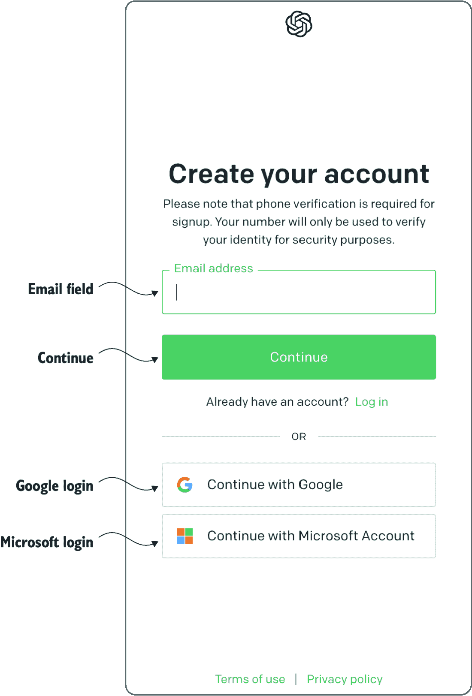
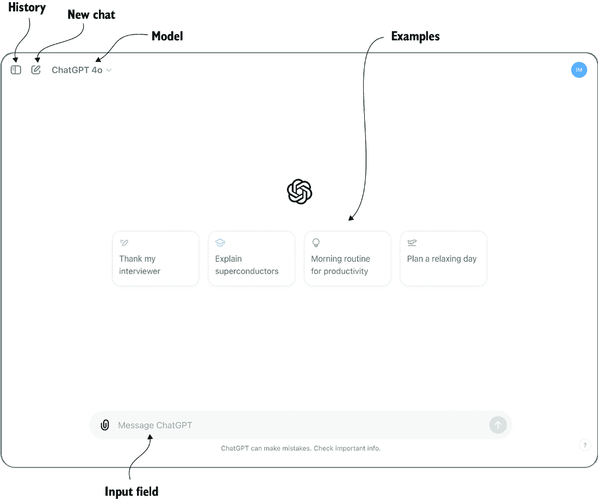
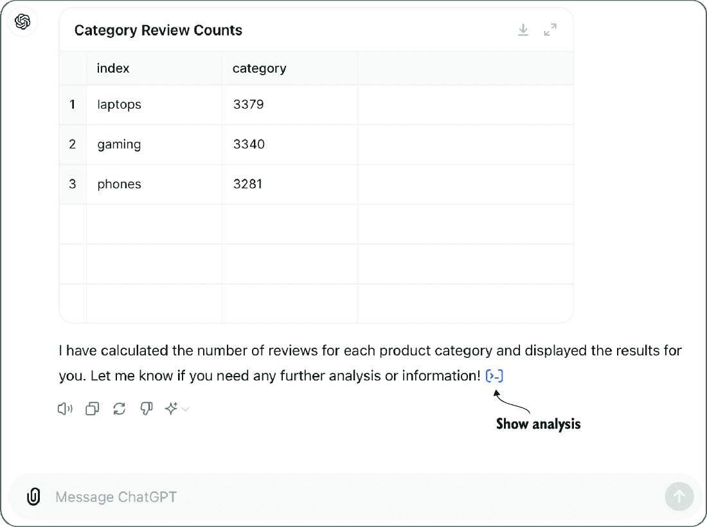
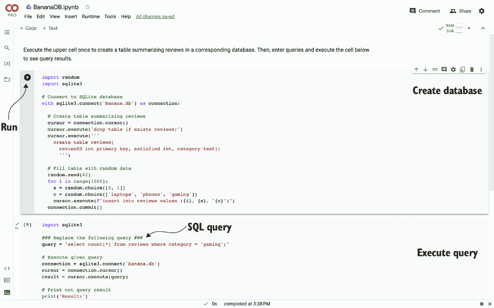
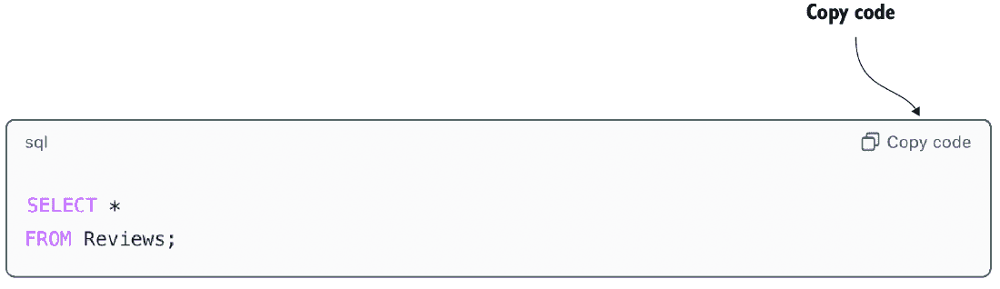

# 2 与 ChatGPT 聊天

### 本章涵盖

+   访问 ChatGPT 网页界面

+   直接使用 ChatGPT 进行数据处理

+   间接使用 ChatGPT 进行数据处理

是时候认识 ChatGPT 了！在本章中，我们将与 ChatGPT 进行对话，并开始使用它进行数据分析。如果你从未使用过 ChatGPT，本章将教你如何访问它，并给你一个对其能力（以及其局限性）的第一印象。如果你已经使用过 ChatGPT，但尚未用于数据分析，本章将向你展示许多你可以利用 ChatGPT 进行数据处理的途径。

我们将首先讨论一个网页界面，它将为你提供访问 OpenAI 的 ChatGPT 的权限。我们将回顾 OpenAI 的注册流程，讨论界面提供的主要功能，并使用它与 ChatGPT 进行第一次对话。之后，我们将开始使用 ChatGPT 在几个示例场景中分析数据。我们将看到两种不同的利用 ChatGPT 进行数据分析的方法：直接和间接。当直接使用 ChatGPT 时，我们根据数据和任务描述让 ChatGPT 进行实际的数据处理。这适用于 ChatGPT 原生处理的数据类型（如文本数据）。

另一方面，我们也可以使用 ChatGPT 间接分析数据。在这里，ChatGPT 仅作为翻译者，将分析任务的描述翻译成外部数据处理工具所能理解的形式化语言。实际的数据处理由这些外部工具处理。在本章中，你将看到 ChatGPT 在这两种场景中都很有用。

## 2.1 访问网页界面

打开你的网页浏览器，在地址栏中输入[`chat.openai.com/`](https://chat.openai.com/)。你将创建一个 OpenAI 账户，该账户允许你使用 ChatGPT。如果你已经有了账户，你可以跳过以下步骤，登录你的账户，并继续下一节。

要创建账户，点击注册按钮。这会带你到图 2.1 所示的屏幕。

##### 图 2.1 OpenAI 账户注册页面。输入你的电子邮件地址，然后点击继续按钮，或者使用谷歌账户或微软账户进行注册。

在注册 OpenAI 账户时，你有几个选择：

+   使用谷歌账户注册（通过点击继续使用谷歌）。

+   使用微软账户注册（通过点击继续使用微软账户）。

+   通过在电子邮件地址字段中输入该地址并点击继续，使用任意电子邮件地址注册。之后，按照屏幕上的说明操作。

使用上述任何一种方式创建账户后，登录你新创建的账户，并继续下一节中概述的步骤。

##### OpenAI 订阅

OpenAI 提供不同类型的账户；有些是免费的，有些则需要每月支付费用。对于以下示例，一个免费账户就足够了。您仍然可以选择注册付费订阅以访问更多模型并获得 ChatGPT 更快的答案。根据您选择的订阅类型，您可以向特定模型发送的请求数量可能有限。

## 2.2 制作介绍

登录您的 OpenAI 账户后，您应该会看到图 2.2 所示的界面。

##### 图 2.2 ChatGPT 网页界面。通过点击预定义的示例输入或输入任意文本到输入字段与 ChatGPT 互动。点击“新建聊天”按钮以重置对话。

此界面允许您通过提交文本输入并与 ChatGPT 进行对话。让我们花一点时间来了解图 2.2 中最重要的界面组件。首先，您有几个预定义的输入示例。您可以简单地点击这些示例中的任何一个来开始对话。除了预定义的示例之外，您还可以将任意文本输入到文本字段中。在本章的其余部分，我们将把这个界面元素称为*输入字段*。最后，您可以通过点击“新建聊天”按钮在任何时候开始新的对话。这样做会清除 ChatGPT 对先前对话步骤的记忆。

##### 我应该选择哪个模型？

点击图 2.2 中标记为“模型”的按钮，您可以选择不同的语言模型。ChatGPT 支持 OpenAI 的 GPT 模型系列中的几个模型。接下来讨论的示例原则上可以与任何可用模型一起工作。您可能想尝试几个不同的模型，看看输出如何不同。根据您的订阅，您可以向特定模型发送的请求数量可能有限。

是时候打招呼了！点击输入字段，向 ChatGPT 打招呼。您可以输入任何内容。ChatGPT 已被训练与人类用户进行对话，应该能够以合理的方式回答大多数输入。例如，告诉 ChatGPT 一些关于您自己的信息！寻求意见或帮助即将到来的任务！或者，也许，要求它为您选择的主题写一首诗！您可能想花几分钟与 ChatGPT 聊天，以更好地了解其功能和局限性。

注意，ChatGPT 可以回溯到先前的输入。例如，如果您对先前的回复不满意，您可以要求 ChatGPT 进行纠正或更改。无需重复原始请求。另外，如果您对答案不满意但不想提供进一步的澄清，请尝试图 2.3 中标记为“重新生成”的按钮。

##### 图 2.3 在 ChatGPT 生成答案后，再生按钮出现在生成的响应下方。点击此按钮以接收对您最后输入的替代答案。

点击该按钮将导致 ChatGPT 再生其最后一个答案。由于 ChatGPT 在生成输出时使用了一定程度的随机化，因此第二个输出可能与第一个版本不同（并且可能更好）。

通常，您输入的所有文本都是同一对话的一部分。如果您在任何时候想开始一个新的聊天（本质上清除 ChatGPT 对先前对话的“记忆”），只需点击图 2.2 中标记为“新聊天”的按钮。请注意，即使您开始了一个新的聊天，之前的对话也不会丢失。相反，OpenAI 会存储过去的对话，并允许用户回顾它们（或从上次结束的地方继续对话）。您可以通过点击图 2.2 中标记为“历史”的按钮访问先前对话的历史记录。每个对话都会分配一个简短的标题，该标题是自动根据对话内容生成的。

首次使用 ChatGPT 通常是一次令人印象深刻的体验。ChatGPT 为各种主题生成精致且合理的答案。这可能会误导用户过分相信它提供的信息。避免忽视适用于当前一代语言模型的各项限制非常重要。一般来说，在依赖语言模型之前，始终验证其输出。

##### 什么是幻觉？

在语言模型中，术语“幻觉”指的是在没有信息的情况下，语言模型创造新内容并将其整合到答案中的情况。通常，结果听起来很有说服力，识别幻觉的实例可能很困难。正在进行的研究[1]探索了减少幻觉发生概率的方法。然而，在撰写本文时，尚无避免幻觉的可靠策略。因此，不要盲目相信语言模型提供的信息，并且始终使用其他来源进行核实。

## 2.3 使用 ChatGPT 处理文本

让我们开始使用 ChatGPT 进行数据处理！在本节中，我们将使用 ChatGPT 来分析文本，这是一种常见的非结构化数据类型。同时，文本是 ChatGPT 的本地输入和输出格式。这意味着我们可以直接使用 ChatGPT 来分析我们的（文本）数据，而无需涉及外部分析工具。这有助于保持事情简单，这正是我们迈向 ChatGPT 支持的数据分析的第一步。

想象以下情况：你是 Banana 公司的一名员工，Banana 是一家生产各种消费电子产品的公司，包括笔记本电脑和智能手机。Banana 网站允许用户发布自由形式的文本评论。结果发现，许多用户会对 Banana 的特定产品表达满意或不满。用户经常指出这些产品的特定方面，这些方面突出或需要改进。总体而言，所有这些评论应该对设计未来的 Banana 产品非常有帮助！但要实现这一点，你首先需要分析所有这些评论并提取共同点。你的老板要求你做这件事：准备总结不同产品和产品类别的评论的统计数据。同时，在你阅读评论的过程中，你的老板鼓励你为产品评论写一些积极的回复。理想情况下，你希望避免花下周的时间阅读和汇总评论。难道不能自动化吗？也许 ChatGPT 能帮上忙。

接下来，我们将使用 ChatGPT 的网页界面来分析一个示例评论。如果效果良好，可能可以将这个过程扩展到自动分析所有评论！如果你之前已经开始了一个对话，首先点击图 2.2 中的“新建对话”按钮来开始一个新的对话。这将确保你之前与 ChatGPT 讨论的话题不会干扰我们接下来尝试的分析示例。

让我们先告诉 ChatGPT 我们想要分析的评论。点击输入字段，输入以下对话中用户标记之后的文本，然后按 Enter 键。

**IT***User* ****

看看以下的产品评论：

“我一年前买了 BananaBook，对这个产品非常满意！屏幕很棒，即使在阳光明媚的时候也能轻松阅读内容。它的速度足够快，可以满足我所有的需求，例如编码、办公工作。唯一的缺点是它的重量，我希望它能轻一点，因为我得经常带着它四处走动。但是，以那个价格来说，这是一个很好的优惠。”

*****GPT* ****

根据评论，BananaBook 是评论者一年前购买并且仍然满意的产品。BananaBook 的屏幕给人留下深刻印象，允许用户在阳光明媚的时候也能轻松阅读内容。该设备也足够快，可以满足用户的需求，包括编码和办公工作。然而，评论者提到 BananaBook 有点重，这可能会在携带时造成不便。总的来说，评论者似乎认为 BananaBook 以其价格而言是一个很好的价值。

GPT 标记之后的文本是 ChatGPT 在样本会话期间生成的答案。在这种情况下，ChatGPT 只是重复了评论，尽管措辞略有不同，这表明它已经接受并“理解”了你的输入。

##### 为什么我会得到不同的输出？

ChatGPT 在生成输出时使用了一定程度的随机化。这意味着即使你两次提交完全相同的输入，你也通常不会看到相同的输出。因此，你看到这里显示的精确输出的可能性很小。然而，你很可能会得到质量相似的结果。

让我们从简单的分类开始我们的文本分析，将评论映射到一个类别。具体来说，我们将尝试将评论分类到以下三个产品类别之一：手机、个人电脑和游戏机。

警告：在输入下一文本之前**不要**点击“新建聊天”按钮！新建聊天按钮的目的是清除 ChatGPT 对先前对话步骤的记忆。但在这里我们根本不希望这样做。以下所有分析都针对我们最初输入的同一评论。只有当 ChatGPT 记得那个评论时，这才能奏效。

**IT***用户* ****

评论指的是哪个产品类别（手机、个人电脑、游戏机）：

*****GPT* ****

根据评论中提供的信息，不清楚 BananaBook 属于哪个产品类别。评论者没有说明它是手机、个人电脑还是游戏机。然而，根据评论者提到使用该设备进行编码和办公工作的实际情况，BananaBook 更有可能是个人电脑或笔记本电脑，而不是手机或游戏机。

还不错！ChatGPT 清楚地理解了任务，并提供了详细的回复。BananaBook 是一个虚构的设备，我们并不立即清楚我们谈论的是哪种产品。然而，正如 ChatGPT 正确指出的，编码和办公工作通常与个人电脑（比手机或游戏机更常见）相关联。尽管存在不确定性，ChatGPT 可以提出一个合理的答案并充分解释它。在这种情况下，ChatGPT 的回答甚至比所需的更细致：尽管 ChatGPT 将评论与提供的三个类别之一联系起来，但它还假设评论指的是笔记本电脑（个人电脑的一个子类别）。考虑到用户经常携带电脑（通常与笔记本电脑而不是台式机相关联），这个假设在这个上下文中似乎是合理的。

之前的回答合理，但可能有点长。实际上，它的长度与原始评论相似。如果生成的答案与源文本一样长，就没有必要使用 ChatGPT 进行文本分析了。让我们让 ChatGPT 回答得更简洁一些。我们不需要提供详细的解释；我们只想得到评论中最可能类别的名称。

**IT***用户* ****

简洁回答，只需写出最可能的产品类别名称（手机、个人电脑、游戏机）：

*****GPT* ****

个人电脑。

好多了！显然，ChatGPT 能够理解我们的指示并相应地调整其先前的答案。除了阅读更快之外，简洁的输出还有一个优点。如果我们最终想要分析许多评论而不是单个评论，那么在评论之间保持输出的一致性是很重要的。例如，具有一致性的输出使得计算每个类别中评论的数量变得更容易。

让我们根据不同的类别对评论进行分类。这次，我们将直接提示所需的输出格式（注意，我们的规范“简洁回答”是指向之前的指示）。

**IT***用户* ****

以下评论指的是哪个产品类别：食品、化妆品、电子产品？简洁回答：

*****GPT* ****

电子产品。

完美！这是正确的类别，输出格式也符合预期。到目前为止，我们已经看到 ChatGPT 能够根据不同的标准对评论进行分类。这似乎很有用，例如，通过计算每个类别中评论的数量来创建统计数据。但理想情况下，我们还想分析这些评论的内容。哪些产品或产品类别最需要迫切改进？为了确定这一点，我们需要知道评论是正面还是负面：也就是说，用户对产品是满意还是不满意。这是对评论文本的另一种分类方法。然而，这次我们的分类不是指被评论的产品，而是指评论内容。

**IT***用户* ****

客户对产品满意还是不满意？用“满意”或“不满意”回答：

*****GPT* ****

满意。

是的，这是正确的！使用迄今为止看到的能力组合，我们已经在使用 ChatGPT 来计算不同产品类别的正面和负面评论的数量。这给我们提供了一些关于哪些产品类别迫切需要改进的信息，但这可能不够具体。例如，了解用户对产品的哪些方面最满意或不满意可能很有趣。让我们尝试使用 ChatGPT 提取这方面的信息。

**IT***用户* ****

评论中提到了哪些产品的正面方面？用编号列表回答，每个方面用最多三个词描述：

*****GPT* ****

1. 屏幕令人印象深刻

2. 性能快

3. 适合编码

4. 价值高

再次正确！ChatGPT 提取了评论中提到的最显著的产品优点。请注意，输出格式再次符合相应的指示：它是一个编号列表，每个条目最多有三个词。那么评论中提到的缺点呢？

**IT***用户* ****

评论中提到了哪些产品的负面方面？用编号列表回答，每个方面用最多三个词描述：

*****GPT****

1. 重量大

根据用户的说法，BananaBook 的唯一缺点是重量。请注意，即使结果只包含一个条目，ChatGPT 也坚持使用请求的输出格式（编号列表）。

如果我们想要将评论汇总成统计数据，对评论进行分类并提取特定的优点和缺点效果很好。然而，这样做可能会丢弃信息：例如，更详细地说明用户为什么喜欢或不喜欢产品的特定方面。有时我们可能只想阅读一个评论样本。但为了避免花费时间阅读过长的评论，首先总结这些评论会很好。让我们使用 ChatGPT 来完成这项工作。

**IT***用户****

用三句话总结评论：

*****GPT****

评论者一年前购买了 BananaBook 电子产品，并且对其保持满意。BananaBook 具有令人印象深刻的屏幕，即使在阳光明媚的环境下也能轻松阅读，并且足够快，适合编码和办公工作。唯一的缺点是它的重量，但就价格而言，BananaBook 是一个很好的价值。

结果是一个合理的总结，精确地使用了指令中要求的句子数量。我们能否让它更加简洁？

**IT***用户****

用一句话总结评论：

*****GPT****

尽管 BananaBook 有点重，但评论者对其电子产品 BananaBook 感到满意，因为它具有令人印象深刻的屏幕、快速的性能和良好的性价比。

是的，这也同样有效！实际上，经过初步测试，ChatGPT 似乎可以帮助自动化各种分析任务。最后，让我们看看我们是否可以利用它来完成分析以外的任务。保持良好的客户关系对 Banana 来说是一个优先事项！因此，你的老板提出了一个问题，要求你在可能的情况下为用户评论撰写友好的回复。但这样做也需要时间。我们能否也用 ChatGPT 来自动化这一步骤呢？让我们看看...

**IT***用户****

为 BananaBook 的生产公司撰写一封友好的回复！

*****GPT****

当然，以下是对评论的友好回复：

亲爱的尊贵客户，

我们很高兴听到你在购买 BananaBook 电子产品一年后仍然对其感到满意！我们设计 BananaBook 是为了为用户提供令人印象深刻的屏幕和快速的性能，很高兴看到这些特性满足了你在编码和办公工作方面的需求。我们感谢你对设备重量的反馈，并将考虑它作为未来改进的依据。感谢您选择 BananaBook，我们希望继续超越您的期望！

最诚挚的问候，

[公司名称]

很不错！ChatGPT 用友好的信息回复客户，适当地引用了评论中的具体点（确认客户提到的积极点，并承诺针对弱点进行改进）。请注意，ChatGPT 为对应公司的名称留了一个占位符（用方括号标记）。到目前为止，我们还没有告诉 ChatGPT 我们公司的名字（Banana）。让我们来修正一下。

**IT**用户****

公司的名称是 Banana - 请在您的回答中替换相应的占位符。

*****GPT** ****

我为我之前回答中的错误道歉。以下是一个带有正确公司名称的更新回复：

亲爱的尊贵客户，

我们很高兴听到你在购买一年后仍然对你的 BananaBook 电子产品感到满意！我们设计 BananaBook 是为了为用户提供令人印象深刻的屏幕和快速的性能，我们很高兴看到这些特性满足了你在编码和办公工作方面的需求。我们感谢你对设备重量的反馈，并将考虑它作为未来改进的依据。感谢您选择 Banana，我们希望继续超越您的期望！

最好的问候，

Banana 团队

好的，这样就可以了！基于额外信息，ChatGPT 能够将之前回答中的占位符替换为公司名称。

警告：尽管最近模型显著降低了此类事件发生的概率，但语言模型如 ChatGPT 偶尔仍可能生成有害内容。建议在公共论坛上发布之前检查 ChatGPT 生成的文本。因此，在没有一定程度的人工监督的情况下，自动撰写客户评论的回答不是一个好的用例。

我们已经看到我们可以使用 ChatGPT 在文本处理的各种任务中。我们使用 ChatGPT 根据不同的标准对文本进行分类，并使用自定义分类（根据评论目标和评论内容进行分类）。我们还用它从文本中提取特定信息，并总结文档（即评论）。最后，我们使用 ChatGPT 生成回答客户评论的文本。在所有情况下，ChatGPT 都能够遵循关于任务和所需输出格式的指示。如果你想的话，尝试写一篇不同的评论，并确保 ChatGPT 仍然能够解决所有这些任务。

直到最近，我们在这个部分讨论的每个不同的文本处理任务都需要一个专门的语言模型。最新一代的语言模型足够灵活，可以根据任务的描述（用普通的英语以及其他自然语言）解决各种任务。

注意，我们迄今为止只处理了一个简短的评论。在这里，使用 ChatGPT 并没有真正带来好处。我们可以手动分类或总结评论，而且比借助 ChatGPT 更快。当然，自动化的目标是扩大处理范围，以处理大量（可能是更长的）评论。如果我们谈论的是数百甚至数千条评论，手动分析将比设置 ChatGPT 来完成这项任务花费更长的时间。但仍然缺少一个关键组件：我们如何通知 ChatGPT 所有评论文本？我们能否简单地复制粘贴整个评论集合到 ChatGPT 的网页界面中？

那种方法是不行的。语言模型通常对一次可以处理的信息量有限制。因此，我们需要一个机制，能够自动地将单个评论（或少量评论集合）"喂"给 ChatGPT 进行处理。我们将在接下来的章节中讨论相应的解决方案。目前，我们只想验证 ChatGPT 在原则上可以用于对文本文档执行各种分析任务。

## 2.4 使用 ChatGPT 处理表格

在上一节中，我们直接使用 ChatGPT 进行数据处理，向 ChatGPT 提供数据以及任务描述作为输入。只要我们处理的是文本，即 ChatGPT 的“原生”输入和输出格式，这种方法是合理的。对于其他类型的数据，使用专门针对数据类型特定的工具进行数据处理会更有效率。你可能想知道：如果我们使用外部工具处理数据，ChatGPT 在这种情况下还能提供什么帮助？

有许多工具用于处理数据，专门针对不同类型的数据、处理和硬件或软件平台。要使用这些工具，用户通常需要用工具特定的形式语言表达所需的分析操作。编写代码来分析数据对于专家来说可能是繁琐的，对于 IT 背景有限的用户来说更是如此。在这里，像 ChatGPT 这样的语言模型可以帮助，因为它们不仅理解自然语言，还理解数据分析工具使用的形式语言。这意味着我们可以使用 ChatGPT 作为某种“翻译器”，将我们用普通英语提出的数据问题，翻译成各种语言的代码，并通过外部工具执行。这就是我们接下来要做的。

你回到了 Banana，并成功使用 ChatGPT 分析了用户提交的所有各种评论。将此信息表示为数据表是自然的。每一行对应一条评论，列代表从评论中提取的不同类型的信息。表 2.1 展示了前几行。

##### 表 2.1 示例表格，包含三个列，分别代表评论 ID、一个标志表示评论者是否对产品满意，以及产品类别

| **评论 ID** | **满意** | **类别** |
| --- | --- | --- |
| 1 | 1 | 笔记本 |
| 2 | 0 | 手机 |
| 2 | 1 | 游戏 |
| ... | ... | ... |

为了使示例简单，我们使用一个包含少量列的表格，这些列对应于上一节中描述的分析子集。第一列包含审查 ID。第二列包含一个标志，表示审查员是否对产品满意（1）或对产品不满意（0）。最后一列包含类别。对于本例，我们只考虑三个类别：笔记本电脑、手机和游戏。

这个表格已经是原始评论的一个更简洁的表示。但完整的表格有很多行（因为我们开始时有许多评论），阅读原始表格数据并不提供很多见解。理想情况下，我们希望以有趣的方式聚合数据，并向老板展示高级趋势。我们可以使用哪些工具来完成这项工作？

### 2.4.1 在网页界面中处理表格

第一个选项是直接使用 OpenAI 网页界面分析表格数据。首先，让我们下载一个包含审查分析结果的示例表格。在书的配套网站上搜索名为“审查表”的链接（[www.dataanalysiswith](http://www.dataanalysiswithllms.com)[llms.com](http://www.dataanalysiswithllms.com)），并下载相关文件。它包含一个表格，其结构如表 2.1 所示，格式为.csv。

##### .csv 格式是什么？

CSV 代表逗号分隔值。它指定了一种用于表示表格数据的特定格式。每个表格行存储在一行中，同一行中不同列的值由逗号分隔。

要直接在 ChatGPT 网页界面中分析此类数据，我们首先需要上传它。点击图 2.4 中显示的上传按钮（在这样做之前，你可能还想开始一个新的聊天）。选择从计算机上传选项，并选择你刚刚下载的文件（reviews_table.csv）。

##### 图 2.4 点击上传按钮，选择从计算机上传选项以上传磁盘上的文件。

上传文件后，它应该出现在输入文本字段旁边。你现在可以输入关于数据的任意问题到输入文本字段。当生成答案时，ChatGPT 将考虑并分析你提供的数据。例如，让我们询问每个产品类别的评论数量。

**IT***用户****

我们每个产品类别有多少条评论？

你应该看到如图 2.5 所示的输出。ChatGPT 显示了一个包含你问题答案的表格（每行统计一个产品类别的评论数量）以及相关的文本。

##### 图 2.5 ChatGPT 对一个关于输入表格的问题生成的答案。点击显示分析按钮，查看 ChatGPT 是如何确定答案的。

ChatGPT 是如何计算答案的？它是直接读取整个表来生成回复的吗？并非如此。在后台，ChatGPT 在 OpenAI 的平台生成并执行 Python 代码，以分析输入数据（在这个场景中，Python 执行引擎是我们最初提到的外部工具）。您可以通过点击图 2.5 中标记为“显示分析”的按钮来查看生成的代码。实际上，强烈建议检查生成的代码，而不是盲目依赖答案。毕竟，尽管它们的能力令人惊叹，语言模型仍然会犯错误。

尝试几个更多的问题，检查生成的代码，甚至可能尝试几个不同的数据集（您可以在电脑上上传任何表格数据，例如 Excel 格式）。您会发现 ChatGPT 可以处理各种数据集和请求。

这看起来效果相当不错！我们为什么还需要其他东西呢？好吧，有几个原因让我们想要探索其他外部数据分析工具。首先，我们上传文件的大小有严格的限制（在撰写本文时为 512 MB）。上传大型数据集是不可能的。其次，您可能已经注意到，使用 Python 进行数据分析可能需要几秒钟的时间，即使是中等大小的数据集（例如，只有 10,000 行的评论表，按照今天的标准来说很小）。分析大型数据集需要大量的时间。最后，上传数据到 OpenAI 可能不是每个用例都可行的。为了保护敏感数据的隐私，用户可能更愿意在自己的平台上分析数据。在下一节中，我们将看到如何使用 ChatGPT 在 OpenAI 的网页界面之外分析数据。

### 2.4.2 在您的平台上处理表格

在某些情况下，直接在 OpenAI 的网页界面上分析数据并不是一个选择。相反，ChatGPT 可以帮助我们使用各种其他数据分析工具，这些工具完全在我们的控制之下。接下来，我们将使用*关系型数据库管理系统*（RDBMS）。这类系统专门用于处理我们感兴趣的数据类型，并且往往能实现高处理效率。这只是一个例子：提出的方法可以推广到各种其他类型的数据分析系统。

##### 关系型数据库管理系统

关系型数据库管理系统是专门用于处理关系数据的：即包含一个或多个表格的数据集，这些表格的类型如表 2.1 所示。大多数数据库管理系统支持结构化查询语言（SQL）的变体，这是一种用于描述数据和数据操作的语言。对于以下示例，我们假设你已经熟悉 SQL 和关系型数据库管理系统的基础知识。如果你不熟悉，你可以在第五章中找到一个 SQL 的简要介绍。要获取更多详细信息，请考虑阅读 Gehrke 和 Ramakrishnan 合著的书籍《数据库管理系统》[2]，或者尝试本书作者的在线课程，网址为[www.databaselecture.com](http://www.databaselecture.com)。

我们将使用 SQLite，这是最受欢迎的关系型数据库管理系统之一。为了节省你在机器上安装和配置该系统的麻烦，请访问本书的配套网站，并遵循链接到 BananaDB 资源的链接。它将引导你到一个 Google Colab 笔记本，你可以用它来完成以下步骤。图 2.6 显示了跟随链接后你应该看到的笔记本。

##### 图 2.6：Google Colab 笔记本，允许你通过 SQLite 查询 BananaDB 数据库。执行上面的单元格（创建数据库）以创建数据库，将给定的 SQL 查询（SQL 查询）替换为你选择的查询，然后执行下面的单元格（执行查询）以查看查询结果。箭头标记了运行按钮以执行上面的单元格。

##### Google Colab 笔记本

我们将使用 Google Colab 笔记本，以便你可以在不安装本地机器上的软件的情况下尝试以下示例。以下说明假设你熟悉 Colab 笔记本的一般知识。如果你想提高你的笔记本技能，请查看[`colab.research.google.com`](https://colab.research.google.com)上的教程。

笔记本中已经包含了创建示例数据库和分析其中数据的代码。本章的内容是熟悉 ChatGPT 的 Web 界面。因此，目前我们不会花时间详细讨论笔记本中的代码。在本章的剩余部分，了解代码的功能以及你需要在以下段落中更改的具体部分就足够了。在高度抽象的层面上，本笔记本中的代码创建了一个包含示例数据的数据库，并允许你通过 SQLite 执行 SQL 查询来分析这些数据。

你可以看到笔记本中有两个包含代码的单元格（如图 2.6 所示，标记为创建数据库和执行查询）。上面的单元格（创建数据库）包含创建包含 2.1 表扩展版本的数据库的代码，并用大约 1,000 条审查数据填充它。让我们首先通过点击单元格左上角的运行按钮（如图 2.6 中的箭头所示）来执行这个单元格。几秒钟后，这将创建一个 SQLite 数据库并填充相应的数据。你只需要在每个会话中执行这个单元格一次。如果你没有足够长时间地与笔记本交互，环境将被重置，你需要再次执行这个单元格。

我们将要求 ChatGPT 为我们编写引用此数据库的 SQL 查询。你可以使用图 2.6 中的下单元格（执行查询）在数据上执行 SQL 查询。默认情况下，该单元格包含一个计算游戏类别中审查数量的 SQL 查询。通过点击其运行按钮来执行该单元格（以查看一切是否正常工作）。执行单元格后，你应该看到游戏类别中的审查数量：342。我们将用 ChatGPT 提出的查询替换当前的查询（`select count(*) from reviews where category = 'gaming';`），然后重新执行此单元格以获取新查询的结果。

好的，现在是时候让 ChatGPT 为我们进行一些数据分析了！首先，通过点击 ChatGPT 网页界面中的新建聊天按钮来启动一个新的对话。这是确保之前的对话步骤不会干扰我们的新任务的重要步骤。为了使用 ChatGPT 编写查询，我们首先需要告诉它一些关于我们的数据库外观的信息。特别是，我们应该描述表结构，即表名（Reviews）以及所有相关列。在这种情况下，该表有三个列，我们可能需要添加一些文本来描述这些列中的内容。在编写 SQL 查询时，了解每个列中的数据类型以及理想情况下关于我们可能找到的具体值及其语义的信息是有用的。

最后，另一个重要的信息是我们用来分析数据的具体系统。尽管许多关系型数据库管理系统（RDBMS）支持 SQL，并且 SQL 相当标准化，但支持的 SQL 功能子集可能在不同系统之间有所不同。此外，一些系统可能支持略微偏离 SQL 标准的 SQL 语法。

在明确了编写 SQL 查询需要注意的事项后，让我们为我们的 BananaDB 示例数据库提供这些信息。

**IT***用户****

我们有一个包含一个名为 Reviews 的表的 SQLite 3 数据库，该表总结了产品评论。该表有三个列：

- 审查 ID（审查的整数 ID）

- 满意（如果审查者满意则为 1，如果不满意则为 0）

- 类别（“笔记本电脑”、“手机”或“游戏”）

*****GPT**** 

那太好了！拥有一个名为“Reviews”的 SQLite 数据库表，该表总结了产品评论，可以非常有用。有了你提到的三个列（ReviewID、Satisfied 和 Category），你可以存储和检索有关评论的宝贵信息。

为了进一步帮助你，我可以提供一些示例 SQLite 查询，你可以使用它们来与你的数据库交互。请告诉我你想要执行或从数据库中检索的具体操作或信息。

ChatGPT 对分析我们数据库的前景持乐观态度，并回答了我们在输入中提供的数据库结构的总结。此外，ChatGPT 已经意识到这将走向何方，并在我们甚至要求它之前就主动提出编写一些示例 SQL 查询。让我们看看 ChatGPT 准备了什么。

**IT**用户****

当然！请提供一些示例查询！

*****GPT****

当然！这里有一些你可以用来与名为“Reviews”的 SQLite 数据库表交互的示例查询：

检索所有评论：

SELECT * FROM Reviews;

检索满意评论：

SELECT * FROM Reviews WHERE Satisfied = 1;

检索不满意评论：

SELECT * FROM Reviews WHERE Satisfied = 0;

检索笔记本电脑评论：

SELECT * FROM Reviews WHERE Category = 'laptops';

检索手机评论：

SELECT * FROM Reviews WHERE Category = 'phones';

检索游戏评论：

SELECT * FROM Reviews WHERE Category = 'gaming';

统计评论总数：

SELECT COUNT(*) FROM Reviews;

统计满意评论的数量：

SELECT COUNT(*) FROM Reviews WHERE Satisfied = 1;

统计不满意评论的数量：

SELECT COUNT(*) FROM Reviews WHERE Satisfied = 0;

这些查询应该为你提供一个起点，以便在“评论”表上执行各种操作。你可以修改它们或组合它们以满足你的特定需求。

不错！这些查询涵盖了相当多的自然问题；例如，关于特定类别中评论数量的查询。一般来说，要求 ChatGPT 提出查询是开始分析数据集的好方法。

顺便说一句，你可能注意到，网络界面使用特定的表示方式显示 SQL 查询。图 2.7 显示了第一个查询的显示方式。

##### 图 2.7 ChatGPT 网络界面使用专门的标记来表示代码，包括 SQL 查询。点击复制代码按钮以复制代码（使其方便粘贴到适合执行的界面中）。

SQL 查询在一个框中，点击复制代码按钮就可以轻松复制。要尝试任何提出的查询，请按照之前描述的方式复制它，然后将其插入到 BananaDB 笔记本的适当位置（如图 2.6 中的 SQL 查询标签）。最后，执行笔记本中的周围单元格以获得查询结果。

让我们看看我们能否让 GPT 也将我们的问题翻译成查询。

**IT***User* ****

编写一个 SQL 查询以检索具有最多评论的产品类别！

*****GPT* ****

要从你的 SQLite 数据库表“Reviews”中检索具有最多评论的产品类别，你可以使用以下 SQL 查询：

SELECT Category, COUNT(*) AS ReviewCount

FROM Reviews

GROUP BY Category

ORDER BY ReviewCount DESC

LIMIT 1;

此查询使用 GROUP BY 子句按“Category”列对评论进行分组。然后，它应用 COUNT(*)函数来计算每个类别的评论数量。结果根据评论数量使用 ORDER BY 子句降序排序。最后，LIMIT 1 子句确保仅返回具有最高评论计数的类别。

查询将返回产品类别及其相应评论计数的对应值。

我们感兴趣的是找到与最多评论相关的产品类别。ChatGPT 将我们的问题翻译成 SQL 查询，以检索相应的结果。如果你在我们的示例数据库上执行此查询，它应该检索到游戏类别，以及相关的评论数量。

##### 如何处理多行查询

这是 ChatGPT 生成的第一个多行 SQL 查询。为了在我们的 Colab 笔记本中使用该查询，请用三引号(`"""`)而不是单引号包围查询。这样做确保整个查询被视为一个单独的字符串。

严格来说，我们请求的是类别，而不是相关的计数。在这里，ChatGPT 在查询结果中添加了计数，这可能是可以接受的，甚至是有趣的。一般来说，如果你使用 ChatGPT 将问题翻译成查询，确保它不会以不可接受的方式扩展你的查询（例如，如果输出被转发到期望特定输入格式的另一个工具）。让我们看看我们能否让 ChatGPT 更紧密地遵循我们的指示。

**IT***User* ****

查询结果应仅返回类别。

*****GPT* ****

对于这个疏忽，我表示歉意。如果你想查询只返回具有最多评论的类别，你可以通过只选择“Category”列来修改之前的查询：

SELECT Category

FROM Reviews

GROUP BY Category

ORDER BY COUNT(*) DESC

LIMIT 1;

这个更新的查询将从“Reviews”表中检索具有最多评论的产品类别。它按类别分组评论，根据评论数量降序排序，然后使用 LIMIT 1 子句仅选择顶部结果。查询将返回具有最多评论的类别。

完美！ChatGPT 稍微修改了之前的查询，只返回类别而不返回相关计数。你可能注意到 ChatGPT 的回答包含了查询以及解释查询为何这样做的原因。这样的解释有助于验证 ChatGPT 生成的查询确实是正确的。接下来，让我们进一步深入，看看哪些评论者对他们的游戏产品表示满意。

**IT***用户****

游戏类别的正面评论比率是多少？

*****GPT* ****

要计算从你的 SQLite 数据库表“Reviews”中游戏类别的正面评论比率，你可以使用以下 SQL 查询：

SELECT (CAST(SUM(Satisfied) AS REAL) / COUNT(*)) AS PositiveRatio

FROM Reviews

WHERE Category = 'gaming';

这个查询使用 WHERE 子句特别筛选了“游戏”类别的评论。然后，使用 SUM()函数计算“满意”列的总和，这代表了正面评论的数量。结果随后被除以使用 COUNT(*)函数获取的游戏类别中的评论总数。使用 CAST()函数确保除法操作具有小数精度。

查询将以小数形式返回游戏类别中正面评论（满意评论）的比率。

执行此查询，你应该发现大约 50%的评论是正面的（即，相应的评论者是满意的）。¹ 最后，让我们看看哪个产品类别最需要紧急改进。

**IT***用户* ****

哪个商品类别的正面评论比率最低？

*****GPT* ****

要确定从你的 SQLite 数据库表“Reviews”中具有最低正面评论比率的商品类别，你可以使用以下 SQL 查询：

SELECT Category, (CAST(SUM(Satisfied) AS REAL) / COUNT(*)) AS PositiveRatio

FROM Reviews

GROUP BY Category

ORDER BY PositiveRatio ASC

LIMIT 1;

这个查询使用了 GROUP BY 子句，根据“类别”列对评论进行分组。然后，通过将“满意”值的总和除以该类别中评论的总数，计算每个类别的正面评论比率。结果根据 ORDER BY 子句按升序排列，基于正面比率。

1 子句确保只返回具有最低正面比率的类别。

查询将返回商品类别及其相应的正面评论比率（满意评论）。将展示具有最低正面比率的类别。

执行此查询应返回“手机”类别及其相关的正面评论比率。

在本节中，我们看到了使用 ChatGPT 分析数据的第二种方法：不是直接将 ChatGPT 应用于数据，而是将其用作翻译机制。在这种情况下，我们将关于数据的（用普通英语表述）问题翻译成我们可以执行的 SQL 查询，然后使用相应的工具（在本场景中为关系数据库管理系统）执行。在后面的章节中，我们也将用它来翻译成其他形式化语言。

我们手动输入问题，然后将我们的查询复制到不同的界面。显然，这种方法不是最方便的。在第五章中，我们将看到如何构建自动化所有这些步骤的框架。

## 摘要

+   语言模型可以在自然语言指导下解决各种任务。

+   尽管功能强大，语言模型可能会产生错误的输出。

+   您可以通过网页浏览器中的网页界面使用 ChatGPT。

+   ChatGPT 允许用户与各种 GPT 模型版本进行交互。

+   要使用 ChatGPT 处理文本，请输入文本和任务描述。

+   给定分类类别，ChatGPT 可以对文本进行分类；给定相应的问题，它可以从文本中提取信息；并且可以根据用户指定生成文本摘要。

+   ChatGPT 不适用于直接处理大数据集。然而，它可以生成使用其他工具处理大数据的代码。要生成代码，请输入数据的描述、任务和输出格式。

## 2.6 参考文献

1.  Ji, Z., Lee, N., Frieske, R. 等. (2023). 自然语言生成中的幻觉调查。*ACM 计算调查 55* (12), 1–38。

1.  Ramakrishnan, R. 和 Gehrke, J. (2002). 《数据库管理系统》（第 3 版）。麦格劳-希尔纽约。

¹鉴于我们的测试数据是以均匀随机分布生成的（即正面和负面评论的数量应大致相等），这一点并不令人惊讶。↩︎
