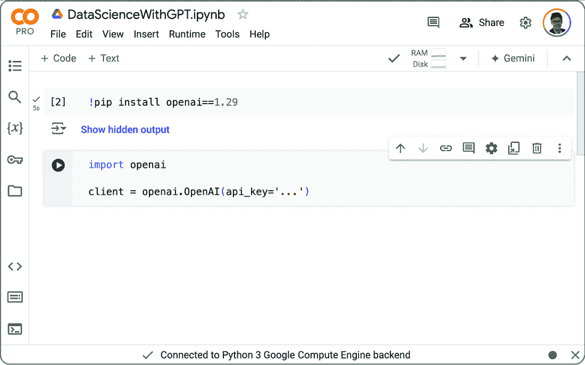
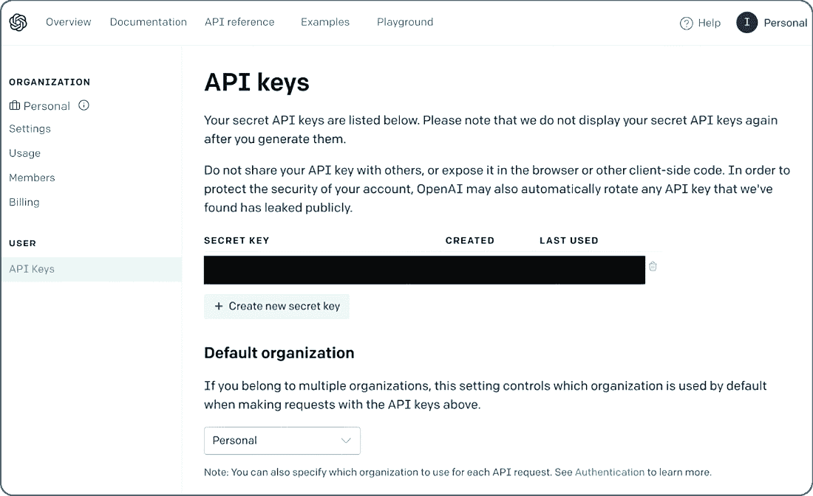

# 3 OpenAI Python 库

### 本章涵盖

+   安装 OpenAI 库

+   使用 Python 调用 GPT 模型

+   配置参数

在上一章中，我们通过 OpenAI 的 Web 界面使用了 GPT 模型。如果我们只是尝试进行对话或对单个评论进行分类和总结，这效果很好。然而，想象一下尝试对数百条评论进行分类。在这种情况下，手动为每条评论使用 Web 界面会变得非常繁琐（至少可以说）。此外，也许我们还想将语言模型与其他工具结合使用。例如，我们可能想使用 GPT 模型将问题翻译成正式查询，然后在相应的工具中无缝执行这些查询（无需在不同界面之间手动复制查询）。在这些所有场景中，我们需要一个不同的接口。

在本章中，我们将讨论一个来自 OpenAI 的 Python 库，它允许您直接从 Python 调用 OpenAI 的语言模型。这使得您可以将对语言模型的调用作为代码中的子函数集成。我们将在这本书的大部分章节中使用这个库。因此，在继续阅读下一章之前至少浏览本章是有意义的。

虽然当前章节侧重于 OpenAI 的 Python 库，但其他语言模型提供者（包括 Anthropic、Cohere 和 Google）提供的库是相似的。

## 3.1 前提条件

首先，让我们确保我们有适合 OpenAI Python 库的正确环境。我们将使用 Python 编程语言，所以请确保 Python 已安装。要做到这一点，打开一个终端，并输入以下命令（此命令应该适用于 Linux、macOS 和 Windows 终端）：

```py
python --version
```

如果这个命令返回错误信息，尝试在命令中将`python`替换为`python3`，然后再次运行。如果您的系统上安装了 Python，您应该会看到一个版本号作为回复（例如，“Python 3.10.13”）。如果没有，您将得到一个错误信息。对于以下示例，您至少需要 Python 3.9（或更高版本）。如果您的系统上没有安装 Python，或者版本低于所需版本，请访问[www.python.org](http://www.python.org)，点击“下载”，并按照说明安装 Python。您可能还想安装一个集成开发环境（IDE）。PyDev([www.pydev.org](http://www.pydev.org))和 PyCharm([www.jetbrains.com/pycharm](http://www.jetbrains.com/pycharm))是许多适用于 Python 的 IDE 中的两个。

除了 Python，您还需要 pip，这是一个用于安装 Python 包的包管理系统（OpenAI 库以这种包的形式提供）。对于最近的 Python 版本（您无论如何都需要），该程序默认已经安装。尽管如此，确保这一点也无妨：

```py
pip --version
```

再次提醒，如果一切安装正确，您应该看到一个版本号。让我们确保 pip 是最新的。以下命令应该在 Linux、macOS 和 Windows 上都能工作：

```py
python -m pip install --upgrade pip
```

就这样！你的系统已准备好安装 OpenAI Python 客户端。

##### 如果它不起作用怎么办？

别慌！如果之前提到的任何步骤失败，你可能无法在你的本地机器上执行以下代码。然而，只要你有网络访问，你就可以使用云平台。例如，可访问[`colab.research.google.com`](https://colab.research.google.com)的 Google Colab 平台，允许你创建可以执行所有以下代码样本的笔记本。图 3.1 显示了创建安装 OpenAI 库的单元格（上单元格）和相应的 Python 程序开始（下单元格）后的界面。我们将在以下章节中讨论库的安装和使用。



##### 图 3.1 可以使用 Google Colab 平台运行以下示例。

## 3.2 安装 OpenAI 的 Python 库

是时候像专业人士一样使用 GPT 了！尽管第二章讨论的 ChatGPT 网页界面对于对话和尝试新提示很有用，但它不适合实现复杂的数据处理管道。为此，OpenAI 的 Python 库是一个更好的选择，它允许你直接从 Python 调用语言模型。首先，让我们安装相应的库。在终端中输入以下命令：

```py
pip install openai==1.29
```

##### 我可以使用不同的库版本吗？

你可能已经注意到了对 OpenAI 库特定版本（版本 1.29）的引用。本书和后续章节中展示的代码已经与这个版本进行了测试。由于不同版本的库语法略有差异（除非你愿意修改代码），请安装这个精确版本。

每次我们使用 OpenAI 库时，都需要提供一个密钥，以便访问 OpenAI 模型（这是计费所必需的）。如果你还没有创建 OpenAI 账户，请访问[`platform.openai.com`](https://platform.openai.com)，点击“注册”，并按照指示操作。如果你已经有了账户但尚未登录，请提供你的账户凭证。确保在“计费”部分添加支付方式，并用几美元进行充值。之后，如果你还没有这样做，现在是时候生成你的密钥了。

访问[`platform.openai.com/account/api-keys`](https://platform.openai.com/account/api-keys)。你应该能看到图 3.2 中显示的网站。



##### 图 3.2 管理访问 OpenAI API 的密钥

点击“创建新密钥”按钮。界面将显示代表密钥的文本字符串。务必复制并存储该密钥！关闭相应的窗口后，你将无法再次检索完整的密钥。

每次我们使用 Python 库时，都需要提供我们的密钥来将我们的请求链接到适当的账户。最简单的方法是将密钥存储在名为 `OPENAI_API_KEY` 的环境变量中。如果该变量存在，OpenAI 将自动从中提取密钥。设置环境变量的确切命令取决于操作系统。例如，以下命令适用于 Linux 和 macOS（用三个点代替您的密钥）：

```py
export OPENAI_API_KEY=...
```

或者，您可以通过在每个 Python 调用前加上相应的赋值来按调用设置密钥。例如，使用以下命令调用下一节中展示的代码列表，同时设置密钥（同样，用三个点代替您的密钥）：

```py
OPENAI_API_KEY=... python listing1.py
```

最后，如果其他选项都不起作用，您可以直接在 Python 代码中指定您的访问密钥。更确切地说，在导入 OpenAI 的 Python 库之后，我们可以在创建 `client` 对象时将 API 访问密钥作为参数传递（我们将在后面更详细地讨论这一点）：

```py
import openai
client = openai.OpenAI(api_key='...')
```

如前所述，将三个点替换为您的 OpenAI 访问密钥。以下代码示例假设访问密钥已指定在环境变量中，因此将省略此参数。如果环境变量对您不起作用，请通过传递访问密钥作为参数来更改代码列表。

警告：如果您的代码中包含您的 OpenAI 访问密钥，切勿共享代码。除此之外，拥有您的密钥将使其他人能够在您付费的情况下调用 OpenAI 的模型。

假设您以某种方式指定了您的访问密钥，我们现在就可以开始使用 OpenAI 的 Python 库调用 GPT 模型了。

## 3.3 列出可用模型

我们将使用 Python 库检索可用 OpenAI 模型的列表。列表 3.1 展示了相应的 Python 代码。（您可以从本书的配套网站上下载此代码和所有后续的代码列表。）首先，我们导入 OpenAI 库（**1**）。然后我们创建一个客户端对象，使我们能够访问库函数（**2**）。接下来，我们查询所有可用的 OpenAI 模型（**3**）并打印出结果（**4**）。

##### 列表 3.1 可用的 OpenAI 模型

```py
import openai  #1
client = openai.OpenAI()  #2

models = client.models.list()  #3

for model in models.data: #4
    print(model)
```

#1 导入 OpenAI Python 库

#2 创建 OpenAI 客户端

#3 获取可用的 OpenAI 模型

#4 打印出检索到的模型

您应该看到类似以下的结果：

```py
Model(id='dall-e-3', created=1698785189, 
    object='model', owned_by='system')
Model(id='whisper-1', created=1677532384, 
    object='model', owned_by='openai-internal')
Model(id='GPT-4o-2024-05-13', created=1715368132, 
    object='model', owned_by='system')
Model(id='davinci-002', created=1692634301, 
    object='model', owned_by='system')
Model(id='GPT-4o', created=1715367049,  #1
    object='model', owned_by='system')
...
 #2
Model(id='curie:ft-personal-2022-01-10-16-52-53', 
    created=1641833573, object='model', owned_by='trummerlab')
Model(id='davinci:ft-personal-2022-01-13-19-59-51', 
    created=1642103991, object='model', owned_by='trummerlab')
Model(id='ft:gpt-3.5-turbo-0613:trummerlab::8qlJH6bV', 
    created=1707585607, object='model', owned_by='trummerlab')
...
```

#1 GPT-4o

#2 微调模型版本

每个模型都由一个 ID（例如，`GPT-4o`（**1**））来描述。我们将使用这个 ID 来告诉 OpenAI 我们想要使用哪个模型来处理我们的请求。除了 ID 之外，每个模型还包含一个创建时间戳和关于模型所有权的详细信息（`owned_by`字段）。在大多数情况下，模型归 OpenAI 所有（例如，标记为`system`或`openai-internal`）。然而，在某些情况下，模型归`trummerlab`（**2**）所有，这是本书作者使用的账户名称。这些模型不是公开可访问的，而是属于拥有账户的私有。当你使用自己的账户执行代码时，你将看不到这些模型。它们是通过称为*微调*的过程从公开可用的基础模型创建的。

##### 什么是微调？

默认情况下，像 GPT-4o 这样的语言模型被训练成具有多功能性，这意味着原则上它们可以执行任何任务。但有时我们并不需要一个多功能性的模型，而是一个在特定任务上表现非常出色的模型。微调使我们能够为关心的任务专门化一个模型。我们将在第九章中更详细地讨论微调。

## 3.4 聊天完成

本书中的几乎所有代码都使用了 OpenAI Python 库的相同功能：*聊天完成*。使用聊天完成，你的模型会根据提供的输入生成一个聊天完成。输入可以包含各种类型的数据，如文本和图像。我们将在接下来的章节中利用这些功能，但暂时只限于文本。聊天完成也用于 OpenAI 的 ChatGPT 网页界面的后台。给定聊天历史作为输入（包括最新的消息以及可能包含相关上下文的先前消息），模型会生成最合适的回复。

要使用 Python 中的聊天完成功能，我们首先需要一个格式来描述聊天历史。这是我们为聊天完成提供的输入的一部分。在 OpenAI 的 Python 库中，聊天被表示为一个消息列表。每个消息反过来又表示为一个 Python 字典。这个 Python 字典指定了消息的几个重要属性值。至少，我们需要为每个消息指定两个重要属性：

+   `role`属性，它指定了消息的来源

+   `content`属性，它指定了消息的内容

让我们先讨论一下`role`属性。正如你从上一章所知，与 GPT 模型的聊天是一系列来回的消息，交替使用用户和模型编写的信息。因此，我们可以为`role`属性指定`user`值来标识由用户编写的消息。或者，我们可以指定`assistant`值来标记由语言模型生成的消息。`role`属性的第三个可能值是`system`。这类消息通常用于聊天历史的开始部分。它们的目的是向模型传达通用的指南，而不依赖于用户提交的具体任务。例如，一个典型的系统消息可能是“你是一个有用的助手”，但更专业的版本（例如，“你是一个将数据集相关问题翻译成 SQL 查询的助手”）也是可能的。在本书中，我们不会使用`system`消息，但请随意实验并尝试添加你自己的系统消息，看看它们是否会影响模型输出。

`content`属性指定了消息的内容。在本章中，我们将限制自己只使用文本内容。在后面的章节中，我们将看到语言模型如何被用来处理更多样化的内容类型。在下面的代码示例中，我们只需要在我们的聊天历史中指定一条消息。这条消息包含描述语言模型应解决的问题的指令，以及相关的上下文信息。例如，以下聊天历史鼓励模型为我们生成故事：

```py
[{
    'role':'user',  #1
    'content':'Tell me a story!'  #2
}]
```

#1 用户消息

#2 任务规范

消息列表中只包含一条消息。这条消息被标记为来自用户（**1**），并在其内容中描述了之前提到的任务（**2**）。作为回复，我们期望模型根据输入指令生成故事。

我们如何调用模型以完成聊天？这可以通过几行 Python 代码实现。首先，我们需要导入 OpenAI Python 库（**1**）并创建一个`client`对象（**2**）：

```py
import openai  #1
client = openai.OpenAI()  #2
```

#1 导入 OpenAI Python 库

#2 创建 OpenAI 客户端

我们将使用`client`对象进行所有后续的语言模型调用。之前的代码几乎出现在我们所有的代码示例中。请记住，在创建客户端时，你可能需要手动传递 OpenAI 访问密钥作为参数（除非你在环境变量中指定了访问密钥，这是推荐的方法）。创建`client`之后，我们可以像下面这样发出聊天完成请求：

```py
result = client.chat.completions.create(
    model='GPT-4o',                  #1
    messages=[{                      #2
        'role':'user', 
        'content':'Tell me a story!'
        }])
```

#1 选择模型

#2 指定输入消息

我们使用`client.chat.completions.create`函数创建一个新的请求。`model`参数（**1**）指定了我们想要用于完成的模型名称。在这种情况下，我们选择了 OpenAI 的 GPT-4o 模型，该模型可以处理多模态数据。我们将在这个书的大部分代码示例中使用此模型。接下来，我们通过`messages`参数指定聊天历史作为输入（**2**）。这是之前讨论的聊天历史，指示模型生成一个故事。

让我们将所有内容整合起来。以下列表（可在本书配套网站上找到，作为第三章部分的列表 2）使用 GPT-4o 生成一个故事。

##### 列表 3.2 使用 GPT-4o 进行聊天完成

```py
import openai          #1
client = openai.OpenAI()  #2

result = client.chat.completions.create(  #3
    model='GPT-4o',                    #4
    messages=[{                        #5
        'role':'user', 
        'content':'Tell me a story!'
        }])
print(result)
```

#1 导入 OpenAI Python 库

#2 创建 OpenAI 客户端

#3 调用聊天完成

#4 选择模型/

#5 指定输入消息/

运行代码应产生如下结果（由于随机化，您的故事可能有所不同）：

```py
ChatCompletion(
    id='chatcmpl-9YKmJCE8SITsKyI557T8KTuX3IxWN', 
    choices=[                                #1
        Choice(
            finish_reason='stop',  #2
            index=0, 
            logprobs=None, 
            message=ChatCompletionMessage(  #3
                content="Of course! Here's a story that ... ", 
                role='assistant', 
                function_call=None, 
                tool_calls=None)
            )
        ], 
        created=1717970051, 
        model='GPT-4o-2024-05-13', 
        object='chat.completion', 
        system_fingerprint='fp_319be4768e', 
        usage=CompletionUsage(          #4
            completion_tokens=810, 
            prompt_tokens=12, 
            total_tokens=822
        )
    )
```

#1 完成列表

#2 终止条件

#3 完成消息

#4 令牌使用

让我们讨论该结果的不同组成部分。首先，我们有一个完成选项列表（**1**）（`Choice`类型的对象）。在我们的情况下，该列表只包含一个条目。这是默认行为，尽管我们可以通过设置正确的配置参数来请求多个替代完成（下一节将讨论）。`finish_reason`标志（**2**）表示每个完成停止生成的理由。例如，这可能是由于生成的文本达到长度限制。`stop`值表示语言模型能够生成完整的输出（而不是达到长度限制）。实际消息（**3**）的内容被缩写，很可能会在多次调用代码时看到不同的故事。

除了完成本身之外，结果还包含元数据和用法统计信息（**4**）。更确切地说，我们发现以下属性有值：

+   `completion_tokens`—生成的令牌数量

+   `prompt_tokens`—输入中的令牌数量

+   `total_tokens`—读取和生成的令牌总数

我们为什么要关心令牌的数量？因为大多数 OpenAI 模型的定价与读取和生成的令牌数量成正比。例如，在撰写本文时，使用 GPT-4o 的成本是每百万个读取的令牌 5 美元，每百万个生成的令牌 15 美元。注意读取和生成令牌之间的定价差异。通常，如本例所示，生成令牌比读取令牌更昂贵。定价不仅取决于令牌数量，还取决于使用的模型。例如，用 GPT-3.5 Turbo 模型（一个稍微弱一点的 GPT 版本）替换 GPT-4o 可以将成本降低 10 倍。在用语言模型分析大量数据之前，请选择适合您任务和钱包的适当模型大小。

## 3.5 自定义模型行为

您可以使用各种参数来影响模型对您输入的回复方式。在调用 `chat.completions.create` 函数时，除了 `model` 和 `messages` 参数外，还可以指定这些参数。在本节中，我们将讨论不同类别的参数，按它们影响的模型行为方面进行分类。

### 3.5.1 配置终止条件

当我们调用聊天完成模型时，它会生成输出，直到满足停止条件。接下来讨论的两个参数使我们能够配置何时停止文本生成。

`max_tokens` 参数指定在完成过程中生成的最大标记数（即语言模型表示文本的原子单位）。一个标记大约对应四个字符，一个典型的段落大约包含 100 个标记。此参数的最大可接受值由所使用的模型决定。例如，ada 是最小的 GPT 版本之一，允许最多 2,049 个标记，而 GPT-4o 支持多达 128,000 个标记。请记住，模型支持的标记数包括读取的标记和生成的标记。由于 `max_tokens` 仅指生成的标记数，因此您不应将其设置得高于所使用模型支持的标记数减去提示中的标记数。

作为一般规则，为 `max_tokens` 设置一个合理的值几乎总是好主意。毕竟，我们为每个生成的标记付费，对标记数设置限制可以使您对每次模型调用的货币费用进行限制。

在某些场景中，特定的文本模式表示所需输出的结束。例如，在生成代码时，可以是特定于相应编程语言的字符串，表示程序的结束。另一方面，在生成童话时，可以是字符串“从此他们幸福地生活在一起！”在这些场景中，我们可能希望使用 `stop` 参数来配置 OpenAI 库，以便在出现特定标记序列时停止生成输出。在某些情况下，只有一个标记序列表示终止。在这些场景中，我们可以直接将 `stop` 参数赋值为相应的字符串值。在其他场景中，存在多个候选序列表示终止。在这种情况下，我们可以将 `stop` 参数赋值为最多四个序列的列表。只要生成这些序列中的任何一个，文本生成就会终止。

注意，您可以使用之前提到的两个参数一起使用。在这种情况下，输出生成会在达到长度限制或出现任何一个停止序列时停止（哪个先发生就先停止）。

### 3.5.2 配置输出生成

我们刚才讨论的参数使您能够选择何时终止输出。但您如何影响直到那个点生成的输出呢？在这里，OpenAI 提供了一些参数，使您能够影响 GPT 模型选择输出文本的方式。

几个参数使您能够影响生成的输出应该有多“重复”。更精确地说，这些参数允许您影响是否重复生成相同的标记是否可取。

`presence_penalty`参数使您能够惩罚重复使用相同标记的聊天完成。存在惩罚是一个介于-2 和+2 之间的值（默认值为 0）。正惩罚鼓励模型避免重复使用相同的标记。另一方面，负惩罚鼓励模型重复使用相同的标记。绝对值越高，相应的影响越强。

`frequency_penalty`与先前的参数相关，但允许更精细的惩罚方案。`presence_penalty`参数基于标记的“存在”。例如，我们不区分出现两次的标记和出现数百次的标记。频率惩罚用作一个因子，在聚合标记的分数（用于确定标记是否应该出现）时乘以前出现次数。因此，一个标记被使用得越频繁，它再次出现的可能性就越小。与存在惩罚类似，`frequency_penalty`参数的值介于-2 和+2 之间，默认设置为 0。正惩罚因子鼓励 GPT 模型避免重复相同的标记，而负值鼓励重复。

有时候我们只对有限集合中的一个标记感兴趣。例如，在文本分类中，类别的集合通常是事先确定的。如果是这样，让我们告诉模型吧！`logit_bias`参数允许将标记 ID 映射到偏置因子。高偏置因子鼓励模型将相应的标记视为输出。足够低的偏置分数实际上阻止模型使用该标记。足够高的分数几乎可以保证相应的标记将出现在输出中。

使用`logit_bias`参数可以避免在我们可以缩小合理标记集合的情况下生成无用的输出。`logit_bias`的值是一个 Python 字典，将标记 ID 映射到-100 到+100 之间的值。介于-1 和+1 之间的值更为典型，同时仍然给模型留出考虑低值标记（或避免使用与高值相关的标记）的空间。但如何找到与相关单词相关的标记 ID 呢？为此，我们可以使用 GPT 标记化工具，该工具可在[`platform.openai.com/tokenizer?view=bpe`](https://platform.openai.com/tokenizer?view=bpe)找到。只需输入你想要鼓励（或禁止）的单词，相关的标记 ID 就会显示出来。请注意，有多种标记化变体可用，与不同的模型相关联。选择适合你模型的标记化工具（因为否则，标记 ID 可能是不正确的）。

### 3.5.3 配置随机化

GPT 模型是如何选择下一个输出标记的？在高度抽象的层面上，我们计算所有可能的输出标记的分数，然后根据这些分数选择一个标记。尽管得分较高的标记通常有更好的被选中的机会，但我们可能并不总是想选择得分最高的标记。例如，回想一下第二章，我们能够为相同的输入生成回复，可能得到不同的结果。这可能是有用的，如果第一个输出并不完全满足我们的要求。如果我们总是选择得分最高的标记，那么重新生成答案不太可能改变输出。因此，为了使用户能够获得多样化的回复，我们需要在将分数映射到输出标记时引入一定程度的随机化。

当然，过度解耦输出与标记分数——即使用过多的随机化——可能会导致无用的输出（在极端情况下，输出不再与输入相关联，也不遵循我们的指令）。另一方面，使用过少的随机化可能会导致输出的多样性低于预期。为特定场景选择合适的随机化程度可能需要一些实验。在每种情况下，OpenAI 都提供了多个参数，允许你微调标记分数如何转换为输出标记。我们将在下一节讨论这些参数。

调整随机化最常用的参数之一是`温度`参数。温度越高，随机化程度越高；而温度越低，随机化程度则越低。低随机化程度意味着得分最高的标记很可能被选中。非常高的随机化程度意味着标记几乎以相等的概率被选中，与模型分配的分数无关。`温度`参数允许你在这两种极端之间找到平衡。此参数的值在 0 到 2 之间选择，默认值为 1。

温度是选择随机化程度的一个可能性。`top_p` 参数是另一种方法。（不建议你在语言模型的同一调用中同时更改 `temperature` 和 `top_p`。）根据它们的分数，我们可以将每个可能的输出标记与“正确”的概率关联起来。现在想象一下，我们正在按概率递减的顺序对这些标记进行排序。我们可以通过只关注前几个标记来减少随机化的程度：我们忽略概率较低的标记。我们应该考虑多少个标记？而不是直接固定合格标记的数量，`top_p` 参数固定了这些标记的 *概率质量*。换句话说，我们按概率递减的顺序将标记添加到合格标记的集合中。每当所有选中标记的概率值之和（概率质量）超过 `top_p` 的值时，我们就停止添加标记。最后，我们从合格标记中挑选下一个输出标记。

由于 `top_p` 参数表示一个概率，其值取自 0 和 1 之间的区间。与温度类似，选择更高的值会导致更多的随机化（因为即使概率较低的标记也变得合格）。

一旦我们使用了一定程度的随机化，生成相同输入提示的多个答案就变得有用。之后，我们可以通过后处理选择首选答案。例如，假设我们正在为相同的输入提示生成多个 SQL 查询。为了选择首选答案，我们可以在目标数据库上尝试执行它们，并丢弃导致语法错误消息的查询。当然，我们可以简单地重复使用相同的提示调用语言模型。然而，一次调用语言模型并配置生成的回复数量更有效率。参数 `n` 确定了生成的回复数量。默认情况下，此参数设置为 1（即只生成一个答案）。你可以选择更高的值以获得更多回复。请注意，使用此参数的更高值也会增加每次调用的成本（因为你为每个生成的标记付费，包括不同回复中的标记）。

### 3.5.4 自定义示例

让我们在代码中尝试一些参数。以下列表提示 GPT-4o 编写一个故事，这次使用我们讨论的一些参数来自定义聊天完成。

##### 列表 3.3 使用 GPT-4o 进行带有自定义参数设置的聊天完成

```py
import openai
client = openai.OpenAI()

result = client.chat.completions.create(
    model='GPT-4o',
    messages=[{
        'role':'user', 
        'content':'Tell me a story!'
        }],
    max_tokens=512,        #1
    stop='happily ever after',  #2
    temperature=1.5,       #3
    presence_penalty=0.5,  #4
    logit_bias={14844:-100})         #5
print(result.choices[0].message.content)
```

#1 限制输出长度

#2 设置停止条件

#3 设置温度

#4 对重复进行惩罚

#5 添加偏差

首先，为了避免得到冗长的故事，我们将最大标记数设置为 512（**1**）。这应该足以容纳几段文字。为了避免生成不必要的多余内容，我们还定义了一个停止序列：“幸福地生活下去”（**2**）。我们这样做，希望任何合理的故事当然都会以流行的表达“他们幸福地生活下去”结束。这个假设无疑是简化的。

接下来，我们将温度设置为 1.5（**3**），允许一定程度的随机化。一个过于重复的故事是无聊的。因此，我们设置了一个正存在惩罚（`presence_penalty`=0.5）（**4**），以阻止 GPT-4o 重复使用相同的标记。最后，我们不想得到一个恐怖的故事（也许我们想给孩子读），所以我们惩罚了单词*龙*（我们获得相应的标记 ID，如第 3.5.2 节所述）（**5**）。

让我们看看我们得到了什么！例如，在一个样本调用中，GPT-4o 生成了以下故事：

*****GPT* ****

从前，在一个坐落在起伏的山丘和茂密森林之间的古老村庄里，住着一个名叫艾拉的女孩。她以好奇心和冒险精神著称，这些特质常常使她探索村庄未知的角落。在一个清爽的秋晨，艾拉决定冒险进入 Whispering Woods，一个充满神秘和传说的地方。村民们经常谈论这片森林，说那里有魔法徘徊，但也没有人敢越过边缘进入。带着她信任的背包和一颗充满激情的心，艾拉在日出时分出发了。当她深入森林时，树叶沙沙作响的窃窃私语似乎在欢迎她，她感到一种奇怪的熟悉感。她穿过灌木丛，爬过倒下的树木，直到她偶然发现一个隐藏的树林，沐浴在闪烁的光芒中。树林中央有一棵古老的树，树叶银白，树干扭曲如螺旋状的烟雾。艾拉被迷住了；它看起来是她所见过的任何树都不一样。她小心翼翼地走近，注意到树根中有一个小巧精致的箱子。她的心跳加速，艾拉打开了箱子，里面发现了一个精致的金色护身符。一触碰到它，森林似乎就活了过来。窃窃私语变得更响亮，形成了她能理解的话语。“勇敢的心，你找到了永恒之锁，”声音低语。“它赋予持有者一个愿望。”艾拉的心中充满了可能性，但她知道她心中最渴望的是什么：为她深爱的村庄带来欢乐和繁荣。紧握着护身符，她低声许下了她的愿望。瞬间，一股温暖的亮光包围了她，她感到一股能量的涌动。树林闪烁了一下，然后又恢复了宁静。艾拉知道发生了非凡的事情。当她回家时，她注意到一些微妙的变化——庄稼看起来更加生机勃勃，动物看起来更健康，村庄的空气中充满了满足感。村民们欢迎她回来，他们的脸上洋溢着幸福。艾拉从未向任何人透露 Whispering Woods 或永恒之锁的秘密。每当有人评论村庄的新兴繁荣时，她只是微笑。她知道，有时候，最大的魔法不在于所见，而在于跟随自己内心的勇气。因此，艾拉的村庄繁荣起来，成为欢乐和和谐的灯塔。这一切都因为一个勇敢的女孩敢于倾听森林的低语。她就这样生活着

幸福地生活下去！结果证明，我们的停止序列，“幸福地生活下去”的表达确实用于故事的结尾（因此，GPT-4o 返回的输出中省略了它）。尝试更多的参数设置，看看结果如何随着配置的变化而变化。

### 3.5.5 进一步的参数

我们已经讨论了用于数据分析目的最重要的参数。您可以在请求 OpenAI 的 GPT 模型完成内容时使用它们。请注意，除了本章中提到的参数之外，还有更多参数。OpenAI 的 API 参考文档([`platform.openai.com/docs/api`](https://platform.openai.com/docs/api-reference/completions)[-reference/completions](https://platform.openai.com/docs/api-reference/completions))详细描述了所有参数。

## 摘要

+   您可以通过 Python API 使用 OpenAI 的语言模型。其他提供商提供类似的库来访问他们的模型。

+   要使用 OpenAI 的库，创建一个客户端对象。

+   您可以使用 OpenAI 的模型来完成聊天。要完成的聊天指定为消息列表。

+   每条聊天消息都由内容和角色特征化。角色可以是`user`、`assistant`或`system`之一。

+   通过`chat.completions.create`函数获取聊天完成内容。

+   您可以使用各种参数配置模型：

    `max_tokens`参数限制了生成的标记数量。

    `stop`允许您定义停止文本生成的短语。

    您可以通过`logit_bias`对特定的标记进行惩罚或鼓励。

    `presence_penalty`对重复的输出进行惩罚。

    `frequency_penalty`对重复的输出进行惩罚。

    `temperature`参数选择随机化的程度。

    `top_p`确定考虑的输出标记数量。

    `n`参数选择生成的完成内容的数量。
