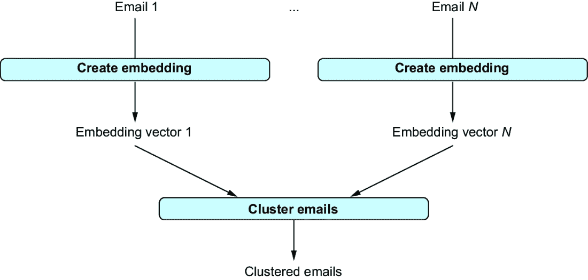

# 第四章：分析文本数据

### 本章涵盖

+   文本分类

+   信息提取

+   文档聚类

文本数据无处不在，并包含有价值的信息。例如，想想报纸文章、电子邮件、评论，或者可能是您正在阅读的这本书！然而，直到几年前，通过计算手段分析文本仍然很困难。毕竟，与 Python 这样的形式化语言不同，自然语言并非旨在让计算机易于解析。最新一代的语言模型使许多流行任务的文本分析和生成几乎达到人类水平。在某些情况下，语言模型在文本分析和生成方面的性能甚至平均上超过了人类的能力 [1]。

在本章中，我们将看到如何使用大型语言模型来分析文本。在某种程度上，分析文本数据是语言模型的一个非常“自然”的应用。它们已经在大量文本上进行了训练，可以直接应用于文本分析（即，无需参考外部工具进行实际数据分析）。本章涵盖了文本分析的几种流行类型：对文本文档进行分类、从文本中提取表格数据以及将文本文档聚类成语义相似的文档组。对于这些用例中的每一个，我们将看到示例代码并讨论变体和扩展。

分类、信息提取和聚类是三种重要的文本分析类型，但绝不是您在实践中所需要的唯一类型。然而，通过本章的示例，您将能够根据语言模型创建自定义的文本数据处理管道。

## 4.1 前言

确保您的系统已正确设置以用于示例项目。以下示例使用 OpenAI 的 GPT 模型系列，通过 OpenAI 的 Python 库访问。该库在第三章中已详细讨论。请确保遵循第三章中的说明，以便能够执行示例代码。

警告 OpenAI 的 Python 库正在快速变化。本章中的代码已使用 OpenAI Python 库的 1.29 版本进行测试，但可能不适用于不同版本。

除了 OpenAI 库之外，我们还将使用流行的`pandas`库。`pandas`是一个用于处理表格数据（我们将用作输入和输出格式）的流行库。我们只将从该库中使用基本功能，并在代码中相应地解释命令。请确保已安装`pandas`（例如，在 Python 解释器中尝试`import pandas`）；如果没有安装，请在终端中输入以下命令进行安装：

```py
pip install pandas==2.2
```

最后，在本章的最后部分，您将需要`scikit-learn`库中的聚类算法。在终端中运行以下命令以安装适当的版本：

```py
pip install scikit-learn==1.3
```

以下章节包含使用语言模型进行文本分析的三个迷你项目的代码。无需输入代码——你可以在本书的配套网站上找到所有代码，在本书的配套网站上找到本章的资源部分。虽然你可以在自己的数据上执行代码，但本书附带了一些我们在示例中使用的样本数据集（也在配套网站上）。现在，是时候使用语言模型进行文本分类了！

## 4.2 分类

所以，你现在正在计划你的周六晚上，犹豫是否去看你最喜欢的电影系列的最新作品。但是，这值得吗？你的社交媒体动态不断被你的朋友（以及你朋友的朋友）的评论填满，他们在分享他们的观影体验。你可以手动浏览这些评论，逐个阅读以更好地了解大家对电影的普遍看法是正面还是负面。但是，谁有那么多时间来做这件事呢？语言模型不能帮助我们自动化这项任务吗？

当然可以。这里是我们最经典的文本处理问题之一的一个实例：我们有一个文本，并希望将其分类，映射到一组固定的类别中。在这种情况下，要分类的文本是电影评论。我们希望将其分类为正面（即，作者认为这是一部伟大的电影，你应该去看！）或负面（省下你的钱！）。这意味着我们有两个类别。表 4.1 展示了一些示例评论及其相关的类别标签。赞扬电影“再现得很好”的评论显然是正面的，而描述电影为“显然薄弱、廉价”的评论是负面的。你可以在本书的配套网站上找到这些评论和一些其他评论。

##### 表 4.1 电影评论及其相关的类别标签

| **评论** | **类别** |
| --- | --- |
| 首先，这部电影在艺术上非常真实地再现了现实。 ... | 正面 |
| 重命名为“Gangs, Inc.”，这是一部显然薄弱、廉价的黑帮情节剧。 ... | 负面 |

将电影评论进行分类只是文本分类的众多用例之一。例如，想象一下尝试整理你的电子邮件收件箱。自动根据内容（例如，使用自定义类别，如工作、爱好、育儿等）对电子邮件进行分类，这不是很好吗？这又是文本分类的一个例子，这次有超过两个类别。作为最后一个例子，想象一下你正在创建一个允许用户留下自由文本评论的网站。当然，你不想展示可能冒犯性的评论，并希望自动过滤它们。这意味着你正在将文本评论分类为两个类别之一（冒犯性和非冒犯性）。现在，我们将看到语言模型如何轻松地应用于每个场景。

### 4.2.1 概述

我们将专注于将电影评论（或实际上，任何类型的评论）分类为正面评论（好电影！）和负面评论（待在家里！）。为此，我们将使用 OpenAI 的语言模型。我们假设我们已经收集了要分类的评论，并将它们存储在磁盘上的一个文件中。我们开发的代码将遍历所有评论，使用语言模型对每个评论进行分类，并返回每个评论的分类结果。

但我们如何对评论进行分类呢？我们将使用第三章中介绍的 OpenAI 的 Python 库。对于要分类的每个评论，我们首先生成一个提示。该提示描述了一个任务给语言模型。在我们的情况下，该任务将评论分配到我们的两个类别之一（正面或负面）。例如，考虑以下提示作为示例：

```py
This movie is a piece of reality very well realized ...  #1
Is the sentiment positive or negative?              #2
Answer ("Positive"/"Negative"):   #3
```

#1 评论

#2 问题

#3 输出格式

此提示包含要分类的评论（**1**），一个描述分类任务的提问（**2**），以及一个描述所需输出格式的最终陈述（**3**）。我们将为每个评论构建此类提示，将其发送到语言模型，并（希望）得到两个可能答案之一（正面或负面）。图 4.1 展示了每个评论的高级分类过程。


##### 图 4.1 对于每个评论，我们生成一个包含评论以及描述分类任务的指令的提示。给定提示作为输入，语言模型输出评论的类别标签。

### 4.2.2 创建提示

给定一个评论，我们生成一个提示，指示语言模型对其进行分类。我们为分类生成的所有提示都遵循相同的提示模板。

##### 提醒：什么是提示模板？

我们在第一章中简要提到了提示模板。提示模板是一种包含占位符的文本。通过用实际文本替换这些占位符，我们可以获得可以发送到语言模型的提示。我们还称，如果提示可以通过替换模板的占位符来获得，则提示“实例化”了提示模板。

上一节中的示例提示实例化了以下提示模板：

```py
[Review]                           #1
Is the sentiment positive or negative?  #2
Answer ("Positive"/"Negative"):   #3
```

#1 评论（占位符）

#2 问题

#3 输出格式

我们的模板只包含一个占位符：要分类的评论文本（**1**）。对于每条评论，我们将用实际的评论文本替换此占位符。我们还指导语言模型如何处理评论文本（**2**）（检查其潜在的情感是正面还是负面）并定义输出格式（**3**）。后一步很重要，因为可能有多种方式来表达潜在的情感：例如，“P”代表正面，“N”代表负面，或者更长的回答，如“评论是正面的”。如果我们没有明确告诉语言模型使用特定的输出格式，它可能会选择这些可能性中的任何一个！在我们的场景中，我们最终想要汇总分类结果以了解大多数人的观点（大多数人喜欢这部电影吗？），如果所有分类都遵循相同的输出格式，汇总每条评论的结果会变得简单得多。

以下函数遵循模板为给定的评论（指定为输入参数 `text`）生成提示：

```py
def create_prompt(text):
    task = 'Is the sentiment positive or negative?'
    answer_format = 'Answer ("Positive"/"Negative")'
    return f'{text}\n{task}\n{answer_format}:'
```

函数的结果是提示，为输入评论实例化模板。

### 4.2.3 调用模型

接下来，我们将生成的提示发送给语言模型以获得解决方案。更确切地说，我们正在使用 OpenAI 的 GPT-4o 模型，这是撰写本文时的 OpenAI 最新模型。由于这是 OpenAI 的聊天模型之一，针对与用户的多次交互进行了优化，我们使用聊天完成端点与模型进行通信。如第三章所述，此端点期望输入先前的消息历史（除特定模型名称外）。在这里，我们只有一个先前的“消息”：提示。我们将其分类为 `user` 消息，鼓励模型解决消息中描述的任何任务。例如，我们可以使用以下代码片段向语言模型发送提示并收集答案（假设 `prompt` 包含之前生成的提示文本）：

```py
import openai
client = openai.OpenAI()

response = client.chat.completions.create(
    model='gpt-4o',
    messages=[
        {'role':'user', 'content':prompt}
        ]
    )
```

然而，直接使用此代码存在问题。OpenAI 的 GPT 模型托管在网络上，并通过远程访问。这为尝试连接到相应端点失败创造了机会：例如，由于暂时性的连接丢失。因此，在调用模型时允许进行几次重试是一种良好的实践。特别是，当处理需要多次连续调用 OpenAI 模型的大数据集时，至少有一次调用失败的可能性增加。与其通过异常中断计算，不如在开始另一次尝试之前等待几秒钟。以下是之前代码的完整版本——一个带有自动重试功能的调用语言模型的函数：

```py
import openai
client = openai.OpenAI()

def call_llm(prompt):
    for nr_retries in range(1, 4):
        try:
            response = client.chat.completions.create(
                model='gpt-4o',
                messages=[
                    {'role':'user', 'content':prompt}
                    ]
                )
            return response.choices[0].message.content
        except:
            time.sleep(nr_retries * 2)
    raise Exception('Cannot query OpenAI model!')
```

`call_lm` 函数允许最多三次重试，它们之间的延迟逐渐增加。这种延迟通过在遇到异常（例如，表示暂时性连接丢失）时调用 `time.sleep` 函数（使用 Python 的 `time` 库）来实现。三次重试后，函数因异常失败（悲观地假设阻止我们联系 OpenAI 的任何问题都不会很快解决）。每次调用成功时，函数返回相应的结果。

### 4.2.4 端到端分类代码

是时候将所有内容整合在一起了！下面的列表显示了与我们所讨论的分类过程相匹配的代码。它还包含了生成提示（**2**）和调用语言模型（**3**）的函数。

##### 列表 4.1 通过情感（正面、负面）对输入文本进行分类

```py
import argparse  #1
import openai
import pandas as pd
import time

client = openai.OpenAI()

def create_prompt(text):                      #2
    """ Generates prompt for sentiment classification.

    Args:
        text: classify this text.

    Returns:
        input for LLM.
    """
    task = 'Is the sentiment positive or negative?'
    answer_format = 'Answer ("Positive"/"Negative")'
    return f'{text}\n{task}\n{answer_format}:'

def call_llm(prompt):                           #3
    """ Query large language model and return answer.

    Args:
        prompt: input prompt for language model.

    Returns:
        Answer by language model.
    """
    for nr_retries in range(1, 4):
        try:
            response = client.chat.completions.create(
                model='gpt-4o',
                messages=[
                    {'role':'user', 'content':prompt}
                    ]
                )
            return response.choices[0].message.content
        except:
            time.sleep(nr_retries * 2)
    raise Exception('Cannot query OpenAI model!')

def classify(text):       #4
    """ Classify input text.

    Args:
        text: assign this text to a class label.

    Returns:
        name of class.
    """
    prompt = create_prompt(text)
    label = call_llm(prompt)
    return label

if __name__ == '__main__':  #5

    parser = argparse.ArgumentParser()       #6
    parser.add_argument('file_path', type=str, help='Path to input file')
    args = parser.parse_args()

    df = pd.read_csv(args.file_path)     #7
    df['class'] = df['text'].apply(classify)  #8
    statistics = df['class'].value_counts()   #9
    print(statistics)
    df.to_csv('result.csv')
```

#1 导入库

#2 生成分类提示

#3 调用大型语言模型

#4 对一个文本文档进行分类

#5 读取文本，分类，并写入结果

#6 定义命令行参数

#7 读取输入

#8 对文本进行分类

#9 生成输出

首先，让我们讨论列表 4.1 中使用的库（**1**）。我们将为以下项目重用这些库，因此有必要更仔细地查看它们（以及为什么在这里需要它们）。我们希望从命令行开始我们的代码，指定相关参数（例如，输入数据的路径）作为参数。`argparse` 库提供了用于指定和读取此类命令行参数的有用函数。接下来，我们需要在第三章中讨论的 `openai` 库，从 Python 调用 OpenAI 的语言模型。`pandas` 库支持表格数据的标准操作。当然，表格数据不是本章的重点。然而，我们将以表格中的行存储文本文档和相关元数据，因此 `pandas` 库很有用。最后，如前所述，我们使用 `time` 库在调用语言模型时实现延迟重试。

### 4.2.5 文档分类

单个文本文档的分类（**4**）结合了之前讨论的两个函数。给定一个要分类的输入文本，代码首先创建相应的提示（调用`create_prompt`），然后通过调用语言模型（调用`call_llm`）生成合适的回复。结果假定是类别标签，并将其返回给用户。

现在我们将其整合（**5**）。这部分代码在从命令行调用 Python 模块时执行，并使用我们已介绍的功能。初始的 `if` 条件（**5**）确保只有直接调用模块（而不是从不同的模块导入）时才执行以下代码。

首先（**6**），我们定义命令行参数。这里我们只需要一个参数：包含要分类的数据的 .csv 文件的路径。我们假设每一行包含一个文本文档，要分类的文本包含在 `text` 列中。我们解析命令行参数并将它们的值存储在 `args` 变量中。

接下来，我们从磁盘加载我们的输入数据（**7**）。我们假设数据存储为 .csv 文件（逗号分隔值）：即包含列名的标题行，后面是包含数据的行（字段由逗号分隔，正如其名称所暗示）。在这里，`pandas` 库派上了用场，使我们能够使用单个命令加载此类数据。然后 `df` 变量包含一个包含输入文件数据的 `pandas` DataFrame。我们检索 DataFrame 的 `text` 列（**8**）并应用先前定义的 `classify` 函数到每一行（使用 `pandas` 的 `apply` 方法）。最后（**9**），我们生成并打印出汇总统计信息（模型生成的每个答案的出现次数）并将结果分类写入文件（result.csv）。

### 4.2.6 运行代码

在本书的配套网站上，下载文件 reviews.csv。此文件包含少量可用于分类的电影评论。文件包含两列：评论文本和相关的情感（`neg` 表示负面情感，`pos` 表示正面情感）。当然，我们的目标是自动检测这样的情感。然而，拥有真实标签也使我们能够评估分类的质量。

您可以按照以下描述测试分类代码（以下命令已在 Linux 操作系统上测试过）。使用终端，切换到包含代码（listing1.py）的 Python 模块所在的目录（4.1）。然后，运行以下命令（如果需要，将 `python` 替换为您的 Python 解释器名称，例如 `python3`）：

```py
python listing1.py reviews.csv
```

在这里，我们假设输入文件（reviews.csv）存储在与代码相同的存储库中（否则，您必须用相应的路径替换文件名）。通常，代码的执行不应超过几秒钟（如果您的连接不稳定，可能需要重试，时间会稍长）。如果执行成功，您将看到的唯一输出将总结为每个可能的两个类别分配的标签数量。

执行代码后，您将在同一存储库中找到一个 result.csv 文件。除了输入文件的列之外，结果文件还包含一个新的 `class` 列。此列包含分类结果（正面和负面）。将我们的分类器分配的标签与真实情感进行比较。您会发现大多数情况下分类是一致的。对于几行 Python 代码来说，这还不错，对吧？

### 4.2.7 尝试变体

在这一点上，尝试更多地对代码和数据进行操作，以更好地了解其工作原理是个不错的主意。例如，尝试自己写几篇电影评论！哪些评论的分类是可靠的，哪些又具有挑战性？还要尝试几种提示的变体。哪些指令能提高准确性，哪些又会降低性能？仅举一个例子，尝试移除提示中定义输出格式的部分（即“答案（正面/负面）”这一行）。现在尝试使用更改后的提示运行程序。会发生什么？很可能会在你的分类结果（程序输出）中看到超过两个标签，包括例如缩写（例如，“P”和“N”）以及过于详细的答案（例如，在测试期间，GPT-4o 生成了“这篇评论的情感是积极的。”这样的回复）。在第九章中，我们评估了不同提示对模型输出质量的影响。

你可能还想改变用于提取的模型。使用较小版本的小型模型，如 GPT-3.5（每处理一个标记的成本显著更低）怎么样？还有模型配置呢？列表 4.1 只使用了两个参数（模型名称和消息历史），这两个都是必需的。然而，在第三章中，我们看到了可以应用在这里的各种配置参数。例如，尝试更改`temperature`参数（例如，将`temperature`设置为 0 将给出更确定的结果），或者限制所需输出的长度！在罕见的情况下，GPT 模型可能会生成比所需分类结果（由单个标记组成）更长的输出文本。你可以通过使用`max_tokens`参数限制输出长度来避免这种情况。同时，除了通过提示中的指令仅限制输出格式外，你还可以使用`logit_bias`参数增加两种可能结果（正面和负面）的可能性。我们将在第九章中进一步讨论模型调整。

作为另一种变体，尝试改变分类任务！例如，使用不同的一组类别进行分类相对容易。只需更改提示中的指令（如前所述，概述所有答案选项）。通过更改几行代码，你甚至可以获得一个通用的分类工具，允许用户通过额外的命令行参数指定分类任务和相应的类别。例如，除了电影评论之外，你可以使用这个工具将报纸文章分类到几个主题类别之一，或者将电子邮件分类为紧急或非紧急。到目前为止，你或许已经相信语言模型能够以相对较高的质量和适度的实现开销进行文本分类。是时候扩大我们的范围，探索不同的任务了！

## 4.3 文本提取

想象一下，鉴于你在使用语言模型进行数据分析方面的专业知识，你最近在 Banana（一家生产各种消费电子产品的流行公司）获得了一份备受追捧的工作。当你坐在新办公室的办公桌前，关于暑期实习的邮件开始源源不断地涌入。拥有一个暑期实习生当然很好，但你该如何选择最佳人选呢？理想情况下，你希望编制一个表格，比较所有申请者的 GPA、学位、他们最近实习的公司名称（如果有）等等。但是手动浏览邮件来编制这个表格似乎很繁琐。难道不能自动化吗？

当然可以。让我们使用语言模型来分析邮件，提取所有相关因素以选择我们的幸运暑期实习生。这里我们又遇到了一个标准的文本分析问题：信息提取！在信息提取中，我们通常从文本中提取结构化信息（例如，数据表）。在这里，我们将申请者的邮件视为文本文档。对于每封邮件，我们希望提取一系列属性：例如，姓名、GPA 和（当前或最近的）学位。例如，考虑以下来自一位有希望的申请者的邮件摘录：

```py
Hi!
My name is Martin, I would love to do a summer internship at Banana! 
A bit about myself: I am currently working on a Bachelor of Computer Science
at Stanford University, my current GPA is 4.0.
```

考虑前面提到的三个属性，我们可以提取申请者的姓名（“Martin”）、他的 GPA（“4.0”）以及他的学位（“计算机科学学士”）。如果分析来自多个申请者的邮件，我们可以将结果表示为数据表，如表 4.2 所示。在下一节中，我们将讨论如何使用语言模型实现信息提取。

##### 表 4.2 暑期实习生申请者提取信息

| **姓名** | **GPA** | **学位** |
| --- | --- | --- |
| Martin | 4.0 | 计算机科学学士 |
| Alice | 4.0 | 软件工程硕士 |
| Bob | 3.7 | 设计学士 |

### 4.3.1 概述

同样，我们假设我们的邮件存储在磁盘上（在一个表格数据文件中，其中每一行包含一封邮件）。我们将遍历邮件并使用语言模型提取所有相关属性。我们不会硬编码相关属性，而是允许用户在命令行上指定这些属性（这样，如果您的暑期实习标准发生变化，您可以轻松地重用代码）。由于我们使用语言模型进行文本分析（它们擅长解释自然语言），因此无需用任何形式的正式语言指定属性。只需指定属性名称（或，可选地，用自然语言提供一个简短的描述），语言模型就应该能够确定要提取的内容。我们代码的输出将是一个表格数据文件（.csv 格式），其内容类似于表 4.2：输出表为每个提取的属性有一个列，为每封分析的邮件有一个行。

那么，我们如何从给定的电子邮件中提取属性呢？再次，我们希望生成一个描述提取任务的提示，以便向语言模型说明。例如，以下提示可以帮助我们从之前的电子邮件中提取所有相关属性：

```py
 #1
Extract the following properties into a table:
name,GPA,Degree
 #2
Text source: My name is Martin, I would love to do a summer 
internship at Banana! A bit about myself: I am currently 
working on a Bachelor of Computer Science at Stanford 
University, my current GPA is 4.0.
 #3
Mark the beginning of the table with <BeginTable> and the end with <EndTable>. Separate rows by newline symbols and separate fields by pipe
symbols (|). Omit the table header and insert values in the attribute 
order from above. Use the placeholder <NA> if the value for an attribute 
is not available.
```

#1 任务描述

#2 要分析的文字

#3 输出格式

提示由三部分组成：任务描述，包括要提取的属性的指定（**1**）；提取的源文本（**2**）；以及期望的输出格式，包括如果源文本不包含关于特定属性的任何信息时使用的值（**3**）。将此提示发送到语言模型应产生包含所需提取结果的文本。

语言模型的输出首先是一个文本字符串。最终，我们希望输出一个结构化数据表。这意味着我们仍然需要进行一些后处理，以从输出文本中提取所有相关属性（姓名、GPA 和学位）的值。图 4.2 展示了提取过程步骤（针对单个文本文档）。


##### 图 4.2 对于每封电子邮件，我们生成一个包含电子邮件和提取任务描述的提示。此描述引用了用户指定的要提取的属性。给定提示作为输入，语言模型生成包含提取属性值的答案文本。通过后处理，我们从原始答案文本中提取这些值。

### 4.3.2 生成提示

我们希望生成以下提示模板的实例：

```py
 #1
Extract the following properties into a table:
[List of attributes] 
 #2
Text source: [Email] 
 #3
Mark the beginning of the table with <BeginTable> and the end with <EndTable>.
Separate rows by newline symbols and separate fields by pipe symbols (|).
Omit the table header and insert values in the attribute order from above.
Use the placeholder <NA> if the value for an attribute is not available.
```

#1 任务描述

#2 要分析的文字

#3 输出格式

提示模板包含任务描述（**1**）、提取的源文本（**2**）以及输出格式的指定（**3**）。请注意，此提示现在包含两个占位符（我们之前章节中使用的模板只有一个占位符）：要提取的属性列表和提取的源文本。

我们将使用以下代码生成提示：

```py
def create_prompt(text, attributes):
    parts = []
     #1
    parts += ['Extract the following properties into a table:']
    parts += [','.join(attributes)]

    parts += [f'Text source: {text}']  #2
         #3
    parts += [
        ('Mark the beginning of the table with <BeginTable> '
        'and the end with <EndTable>.')]
    parts += [
        ('Separate rows by newline symbols and separate '
        'fields by pipe symbols (|).')]
    parts += [
        ('Omit the table header and insert values in '
        'the attribute order from above.')]
    parts += [
        ('Use the placeholder <NA> if the value '
        'for an attribute is not available.')]
    return '\n'.join(parts)
```

#1 生成任务描述

#2 添加源文本

#3 添加输出格式的描述

此函数接受要分析的文字（我们当然希望将其包含在提示中）以及我们想要提取的属性列表作为输入。在生成任务描述（**1**），包括要提取的属性列表后，该函数添加源文本（**2**），以及期望的输出格式的指定（**3**）。提示将这些部分连接起来。

### 4.3.3 后处理

与之前的项目（文本分类）相比，我们的提示词已经改变以适应新的任务（文本提取）。即使提示词不同，我们仍然可以像上一节那样重用相同的函数来从语言模型获取答案。另一方面，我们需要比以前做更多的工作来处理原始答案。对于分类，我们直接使用语言模型的回复作为最终结果。在我们当前的场景（文本提取）中，我们通常希望从单个输入文本中提取多个属性值。由于语言模型的输出文本包含所有提取的属性值，我们需要从原始答案文本中提取特定属性值。

例如，我们可能会从语言模型接收到以下原始答案文本：

```py
| Martin | 4.0 | Bachelor of Computer Science |
```

要提取每个属性值，我们可以使用管道符号作为字段分隔符来分割原始文本（同时移除答案中的第一个和最后一个管道符号）。理想情况下，我们希望将我们的范围扩展到我们目前考虑的具体用例之外（例如从电子邮件中提取申请人的信息）。在某些情况下，我们可能需要从同一文本中提取多行（想象一下多个申请人一起提交一个群发电子邮件的场景——但这是一个不太可能的情况）。为了支持这样的用例，我们可能还需要将原始答案分割成与不同行相关的文本。为此，我们可以使用换行符作为行分隔符（因为行是通过换行符分割的）。

我们可以使用以下函数来完成所有这些操作：

```py
import re

def post_process(raw_answer):
    table_text = re.findall(      #1
        '<BeginTable>(.*)<EndTable>', 
        raw_answer, re.DOTALL)[0]

    results = []
    for raw_row in table_text.split('\n'):  #2
        if raw_row:                    #3
            row = raw_row.split('|')
            row = [field.strip() for field in row]
            row = [field for field in row if field]
            results.append(row)
    return results
```

#1 提取表格数据

#2 按行分割

#3 按字段分割

此函数的输入是语言模型为单个文本文档生成的原始文本。输出是一个行列表（其中每个结果行再次表示为一个列表）。要从输入到输出，我们首先需要提取包含实际表格数据的原始答案部分（**1**）。GPT-4o 生成的答案可能包含引言或超出提取表格的解释（例如，“当然，这是您想要的表格：...”）。我们需要分离我们感兴趣的数据。幸运的是，只要 GPT-4o 遵循我们的指示（通常情况下它会这样做），我们感兴趣的数据应该包含在两个标记（`<BeginTable>` 和 `<EndTable>`）之间。因此，正则表达式 `'<BeginTable>(.*)<EndTable>'` 完全匹配我们感兴趣的输出部分。我们使用 Python 的 `re.findall` 函数检索它，该函数接受字符串和正则表达式作为输入，并返回匹配的子字符串列表。我们使用 `re.DOTALL` 标志确保正则表达式中的点匹配所有字符和新行（因为表格可能包含多行）。从结果匹配中，我们取第一个。请注意，这隐含地假设 GPT 的输出中至少有一个表格。尽管通常情况下是这样的，但请考虑如何使该函数对不符合提示中我们指示的语言模型答案更加健壮。

在将表格数据以文本形式提取出来后，我们首先将其分为与特定行相关的数据（**2**）和与特定单元格相关的数据（**3**）。经过一些清理（Python 函数 `strip` 移除空白字符），我们将得到的单元格值添加到我们的结果列表中。这个由行组成的列表（其中每一行再次表示为一个列表）被返回。

### 4.3.4 端到端提取代码

列表 4.2 展示了完成的 Python 代码。代码结构类似于列表 4.1，并且两个列表中的一些函数是共享的（而不是省略重复的函数，本书旨在提供自包含的代码，以便您不需要从多个页面中拼凑代码）。特别是，代码使用了之前相同的库（**1**）并通过相同的函数调用语言模型（**3**）。您将认出用于创建提示的函数（**2**）和用于后处理语言模型原始输出的函数（**4**），这些函数之前已经介绍过。

##### 列表 4.2 从文本中提取用户定义的属性

```py
import argparse  #1
import openai
import pandas as pd
import re
import time

client = openai.OpenAI()

def create_prompt(text, attributes):              #2
    """ Generates prompt for information extraction.

    Args:
        text: extract information from this text.
        attributes: list of attributes.

    Returns:
        input for LLM.
    """
    parts = []
    parts += ['Extract the following properties into a table:']
    parts += [','.join(attributes)]
    parts += [f'Text source: {text}']
    parts += [
        ('Mark the beginning of the table with <BeginTable> '
        'and the end with <EndTable>.')]
    parts += [
        ('Separate rows by newline symbols and separate '
        'fields by pipe symbols (|).')]
    parts += [
        ('Omit the table header and insert values in '
        'the attribute order from above.')]
    parts += [
        ('Use the placeholder <NA> if the value '
        'for an attribute is not available.')]
    return '\n'.join(parts)

def call_llm(prompt):                             #3
    """ Query large language model and return answer.

    Args:
        prompt: input prompt for language model.

    Returns:
        Answer by language model.
    """
    for nr_retries in range(1, 4):
        try:
            response = client.chat.completions.create(
                model='gpt-4o',
                messages=[
                    {'role':'user', 'content':prompt}
                    ]
                )
            return response.choices[0].message.content
        except:
            time.sleep(nr_retries * 2)
    raise Exception('Cannot query OpenAI model!')

def post_process(raw_answer):             #4
    """ Extract fields from raw text answer.

    Args:
        raw_answer: raw text generated by LLM.

    Returns:
        list of result rows.
    """
    table_text = re.findall(
        '<BeginTable>(.*)<EndTable>', 
        raw_answer, re.DOTALL)[0]

    results = []
    for raw_row in table_text.split('\n'):
        if raw_row:
            row = raw_row.split('|')
            row = [field.strip() for field in row]
            row = [field for field in row if field]
            results.append(row)
    return results

def extract_rows(text, attributes):           #5
    """ Extract values for attributes from text.

    Args:
        text: extract information from this text.
        attributes: list of attributes to extract.

    Returns:
        list of rows with attribute values.
    """
    prompt = create_prompt(text, attributes)
    result_text = call_llm(prompt)
    result_rows = post_process(result_text)
    return result_rows

if __name__ == '__main__':         #6

    parser = argparse.ArgumentParser()
    parser.add_argument('file_path', type=str, help='Path to input file')
    parser.add_argument('attributes', type=str, help='Attribute list')
    args = parser.parse_args()

    input_df = pd.read_csv(args.file_path)
    attributes = args.attributes.split('|')

    extractions = []
    for text in input_df['text'].values:          #7
        extractions += extract_rows(text, attributes)

    result_df = pd.DataFrame(extractions)
    result_df.columns = attributes
    result_df.to_csv('result.csv')
```

#1 导入相关库

#2 生成提示

#3 调用语言模型

#4 后处理模型输出

#5 从文本中提取数据表

#6 提取信息并写入结果

#7 遍历文本

主函数（**6**）从命令行读取两个输入参数：

+   包含要分析的文本的 .csv 文件路径

+   要提取的属性列表，由管道符号分隔

在使用`pandas`库打开输入文件后，我们遍历所有输入文本文档（**7**）。请注意，我们期望输入文件中的`text`列包含输入文本。为了执行实际提取，我们使用`extract_rows`函数（**5**）。给定输入文本和要提取的属性列表，此函数生成一个合适的提示，从语言模型获取原始答案，并对原始答案进行后处理以获得结构化输出（并将其返回）。遍历输入文本（**7**）后，我们将最终结果存储在名为 result.csv 的文件中（如果该文件已存在，则会被覆盖）。

### 4.3.5 尝试一下

你可以在配套网站上找到列表 4.2 中的代码，作为 listing2.py。你还可以在那里下载 biographies.csv 文件，这为你提供了一个小数据集来测试你的提取器（这与我们的动机场景略有不同，但关于电子邮件应用的公开数据很稀缺）。此文件包含五位著名人物的传记，以及相关的姓名，每行一个人。切换到包含 listing2.py（以及数据）的目录，并运行

```py
python listing2.py biographies.csv 
  "name|city of birth|date of birth"
```

第一个参数是数据集（如果它不在同一目录中，请相应地调整路径）。第二个参数是要提取的属性列表。我们再次使用管道符号来分隔属性。请注意，我们仅通过名称识别属性；无需引用预定义类别。语言模型可以根据名称理解属性语义。

执行代码（这不应超过一分钟）后，你将在名为 result.csv 的文件中找到结果。例如，在样本数据上执行代码可能会得到以下表格：

```py
    name    city of birth    date of birth
0    Sergey Mikhailovich Brin    Moscow    August 21, 1973
1    Martin Luther King Jr.    Atlanta, Georgia    January 15, 1929
2    Anne E. Wojcicki    <NA>    July 28, 1973
3    Maria Salomea Skłodowska-Curie    Warsaw    7 November 1867
4    Alan Mathison Turing    Maida Vale, London    23 June 1912
```

即使你在相同的数据上执行相同的代码，你也可能看到一些细微的差异（这是由于生成模型输出时的随机化造成的）。该文件中的每一行（除了标题行）代表一个提取。我们正在提取姓名、出生城市和出生日期。因此，我们期望每篇传记都有一个提取行（这正是我们在样本运行中看到的情况）。请注意，存在缺失值：对于 Ann E. Wojcicki，传记片段中不包含出生城市。语言模型会相应地做出反应，并插入相应的占位符（“<N/A>”），而不是具体值。

## 4.4 聚类

你在 Banana 公司的新工作已经过去几周了。这份工作很棒，但有一个问题：你的收件箱里总是堆满了邮件！这些邮件不仅包括渴望成为暑期实习生的申请（我们已经在上一节处理了这些），而且涉及各种不同的主题。确保阅读所有相关的邮件花费了你很多时间。仔细观察后，你发现许多邮件是重复的。例如，你注意到许多邮件试图引起人们对同一公司活动的关注。一时间，你考虑使用你的代码进行文本分类（在第 4.2 节中讨论过）来将邮件分类到几个类别中（例如，与特定的公司活动相关）。之后，你只需阅读每个类别中的几封邮件，就能全面了解 Banana 公司正在发生的事情。然而，有一个问题：很难制定并维护一个详尽的主题列表，因为这些主题在你工作的过程中会不断变化。相反，如果能自动地将一些相似的不同邮件分组，那就太好了，因为例如，它们讨论的是同一事件。这样，你就不必提前制定一个主题列表。

我们想要的是将相似的邮件分组到簇中。这又是一个经典的文本处理问题：文本聚类。如果你想在不知道事先的类别集合的情况下将相关的文本文档聚集在一起，那么聚类方法可能是最佳选择！在本节中，我们将看到如何使用语言模型进行文本聚类。

### 4.4.1 概述

聚类是计算机科学中的一个经典方法。聚类方法在语言模型和高级文本分析之前就已经存在了。然而，传统上，聚类主要关注以向量形式表达的因素。我们希望将彼此距离较近的向量（当然，我们可以为向量应用各种距离度量）聚集到同一个簇中。然而，这里的情况并非如此：在我们的场景中，我们希望将相似的邮件（或者更一般地说，相似的文本文档）分配到同一个簇中。那么我们如何从文档转换到向量呢？

答案是**嵌入**。嵌入将文本文档表示为一个（通常是高维的）向量。这正是我们所需要的！当然，这种方法只有在我们将文本文档映射到具有关于文档内容意义的向量时才有意义。理想情况下，我们希望具有相似向量的文档（即根据我们首选的距离度量具有较小距离的向量）也具有相似的内容。这意味着我们不能使用简单的方法将文本文档映射到向量。相反，我们需要一种考虑文本语义并在生成向量表示时考虑这些语义的方法。

幸运的是，语言模型可以帮助！像 OpenAI 这样的提供商提供将文本作为输入并产生嵌入向量的语言模型。因此，如果我们有一组要聚类的文本文档，我们可以为它们计算嵌入向量，并将任何经典聚类算法应用于这些向量。图 4.3 说明了这个过程。接下来，我们将讨论如何实现它。



##### 图 4.3 聚类电子邮件。我们首先为所有电子邮件计算嵌入向量。然后，我们将这些向量聚类，将内容相似的电子邮件分配到同一簇。

### 4.4.2 计算嵌入

对于到目前为止讨论的示例，我们使用了 OpenAI 的聊天补全端点。对于聚类，我们将使用 OpenAI 的嵌入端点。嵌入的目标是创建一个压缩文本语义的向量。可以使用不同的模型来计算嵌入。向量的维度取决于所使用的模型。对于以下代码，我们将使用`text-embedding-ada-002`模型。您可以尝试用其他模型替换此模型（您可以在[`platform.openai.com/docs/guides/embeddings`](https://platform.openai.com/docs/guides/embeddings)找到 OpenAI 用于计算嵌入的模型列表）以比较输出质量。

例如，我们可以按如下方式为文本文档生成嵌入：

```py
import openai
client = openai.OpenAI()

response = client.embeddings.create(
    model='text-embedding-ada-002',
    input=text)
```

在这里，您可以看到相应响应的摘录：

```py
CreateEmbeddingResponse(
    data=[
        Embedding(embedding=[                            #1
            -0.005983137525618076, -0.000303583248751238, ...], 
            index=0, object='embedding')], 
    model='text-embedding-ada-002',    #2
    object='list', 
    usage=Usage(prompt_tokens=517, total_tokens=517))  #3
```

#1 嵌入向量

#2 生成嵌入的模型

#3 使用统计信息

该摘录仅显示了前几个向量维度（**1**）（而完整的向量有超过 1,000 个维度）。除了嵌入向量外，响应还包含模型名称（**2**）和使用统计信息（**3**）。与之前不同，使用统计信息仅指代提示中的标记数量（这也是处理的总标记数量）。与文本补全不同，语言模型只读取标记，但不生成它们。

当然，对我们来说最相关的是嵌入向量本身。您可以通过以下命令访问该嵌入向量：

```py
response.data[0].embedding
```

大多数时候，调用一次语言模型应该能为您提供所需的嵌入。当然，当为大量电子邮件计算嵌入向量时，我们可能会偶尔遇到问题（即失败的连接尝试）。这就是为什么我们嵌入函数的最终版本再次包含重试机制：

```py
import openai
client = openai.OpenAI()

def get_embedding(text):
    for nr_retries in range(1, 4):
        try:
            response = client.embeddings.create(
                model='text-embedding-ada-002',
                input=text)
            return response.data[0].embedding
        except:
            time.sleep(nr_retries * 2)
    raise Exception('Cannot query OpenAI model!')
```

给定一个文本作为输入，我们尝试最多三次来获取相应的嵌入向量（在每次失败尝试后增加重试之间的延迟）。这是我们将会使用的函数。

### 4.4.3 聚类向量

为了聚类表示文档的向量，我们将使用 k-means 聚类算法。K-means 是一个非常流行的聚类算法，它通过迭代地改进向量到聚类的映射来工作。与其他聚类算法不同，该算法要求你提前指定聚类数量。在我们的示例场景中，这意味着选择按内容对电子邮件进行分区应该有多精细。

##### k-means 算法是如何工作的？

k-means 算法将一组要聚类的元素和一个目标聚类数量作为输入。它通过迭代地改进元素到聚类的映射，直到满足终止条件（例如，最大迭代次数或连续迭代之间聚类分配的最小变化）为止。k-means 算法将每个聚类与一个向量（表示该聚类的中心）关联。在每次迭代中，它将每个向量分配给最近的中心所在的聚类。然后，它重新计算与聚类关联的向量（通过平均分配给该聚类的所有元素的向量）。

我们将使用 `scikit-learn` 库中的 k-means 实现。按照本章第一部分的说明确保该库已安装（通过 `from sklearn.cluster import KMeans` 导入聚类方法）。在导入库后，我们可以使用以下（简洁的）代码片段调用 k-means 实现：

```py
def get_kmeans(embeddings, k):
    kmeans = KMeans(n_clusters=k, init='k-means++')
    kmeans.fit(embeddings)
    return kmeans.labels_
```

该函数接受嵌入向量的列表和目标聚类数量作为输入，然后使用 k-means 实现对这些向量进行聚类。聚类的结果是与每个嵌入向量关联的标签。这些标签指示关联的聚类 ID。

### 4.4.4 文本聚类的端到端代码

以下列表显示了通过嵌入向量聚类文本文档的完整代码。你会认出计算嵌入向量（**1**）和聚类它们（**2**）的函数。

##### 列表 4.3 使用语言模型聚类文本文档

```py
import argparse
import openai
import pandas as pd
import time

from sklearn.cluster import KMeans

client = openai.OpenAI()

def get_embedding(text):                        #1
    """ Calculate embedding vector for input text.

    Args:
        text: calculate embedding for this text.

    Returns:
        Vector representation of input text.
    """
    for nr_retries in range(1, 4):
        try:
            response = client.embeddings.create(
                model='text-embedding-ada-002',
                input=text)
            return response.data[0].embedding
        except:
            time.sleep(nr_retries * 2)
    raise Exception('Cannot query OpenAI model!')

def get_kmeans(embeddings, k):                #2
    """ Cluster embedding vectors using K-means.

    Args:
        embeddings: embedding vectors.
        k: number of result clusters.

    Returns:
        cluster IDs in embedding order.
    """
    kmeans = KMeans(n_clusters=k, init='k-means++')
    kmeans.fit(embeddings)
    return kmeans.labels_

if __name__ == '__main__':         #3

    parser = argparse.ArgumentParser()
    parser.add_argument('file_path', type=str, help='Path to input file')
    parser.add_argument('nr_clusters', type=int, help='Number of clusters')
    args = parser.parse_args()

    df = pd.read_csv(args.file_path)

    embeddings = df['text'].apply(get_embedding)
    df['clusterid'] = get_kmeans(list(embeddings), args.nr_clusters)

    df.to_csv('result.csv')
```

#1 计算嵌入向量

#2 聚类嵌入

#3 读取文本并输出聚类

列表 4.3 （**3**） 的主要功能是从磁盘上的文件读取数据。同样，我们假设数据包含在一个 .csv 文件中，并关注 `text` 列。首先，我们遍历文本文档并生成相应的嵌入（通过调用之前讨论过的 `get_embedding` 函数）。然后，我们通过 `get_kmeans` 函数对嵌入向量进行聚类。聚类 ID 成为写入磁盘的结果表中的一列。

### 4.4.5 尝试一下

是时候尝试通过嵌入向量进行聚类了！你可以在书的配套网站上找到代码（4.3 列表），以及一个合适的数据集（textmix.csv）。这个数据集包含来自两个来源的文本片段的混合：一首诗的集合和一个电子邮件存储库。我们将尝试通过聚类来分离这两个来源：我们预计电子邮件和诗歌将被分配到不同的簇中。

切换到包含代码和数据的目录，并在终端中运行以下命令：

```py
python listing3.py textmix.csv 2
```

在这里，textmix.csv 是输入文件的名称，而 2 是目标簇的数量（在这个特定情况下，两个簇似乎是一个合理的选择，而在其他场景中确定正确的簇数量可能更困难）。结果将存储在 result.csv 文件中。它包含来自输入文件的所有列，以及一个额外的列，包含簇 ID（因为我们只使用两个簇，这个 ID 要么是 0，要么是 1）。运行命令后，你可能会看到一个结果，将电子邮件放在一个簇中，而将诗歌放在另一个簇中。

你可能想尝试不同的模型来观察运行时间和结果质量的不同。你也可以尝试不同的输入文本，并改变簇的数量。除此之外，你可能还想实现本节开头提到的其他嵌入向量的用例。例如，如何实现一个检索界面，将自然语言语句映射到最相关的文档（通过比较问题和文档的嵌入向量）？

### 4.4.6 嵌入向量的其他用例

到目前为止，我们使用向量通过聚类来识别相似文档。但这并不是嵌入向量的唯一用例！仅举几个例子，嵌入向量通常用于促进与自然语言问题相关的文本文档的检索。在这里，我们比较与问题相关联的嵌入向量与与文档相关联的嵌入向量。具有相似向量的文档更有可能在回答问题时有用。

例如，我们希望“什么是 Transformer 模型？”这个问题的嵌入向量与“Transformer 是一种神经网络架构，常用于语言模型”这个文本的嵌入向量相似，因为它们有相关的话题。如果是这样，我们可以通过比较嵌入向量来识别与问题最相关的文档。更精确地说，我们为可能有助于回答问题的每个文档计算一次嵌入向量。然后，每当收到一个新的问题时，我们计算相关的嵌入向量并检索具有相似嵌入向量的文档。然后，我们可以根据这些文档生成答案。

嵌入向量的另一个用例是异常检测。为了识别一组中与其他文档显著不同的文本文档，我们可以比较它们的嵌入向量。同样，我们只需为每个文档计算一次嵌入向量。这样做可以避免使用语言模型来比较文档。相反，我们只需比较嵌入向量（这非常快）。

总结来说，尽管我们专注于聚类，但嵌入向量有许多用例。这使得学习如何生成和使用它们变得非常有价值！

## 摘要

+   您可以直接应用语言模型来分析文本数据。

+   提示通常包含要分析的文字以及指令。指令描述了要解决的问题以及输出格式。

+   您可以使用聊天完成功能进行分类、提取和问答。

+   原始模型输出可能需要后处理以更改格式。

+   语言模型可以将文本转换为嵌入向量。您可以通过嵌入端点创建嵌入向量。比较嵌入向量相对高效。

+   您可以使用嵌入进行聚类、检索和异常检测。

## 4.6 参考文献

1.  Katz, D. M., Bommarito, M. J., Gao, S., 等人. (2024). GPT-4 通过了律师资格考试. *皇家学会哲学学报 A：数学、物理和工程科学 382*(2270), 1–17.
