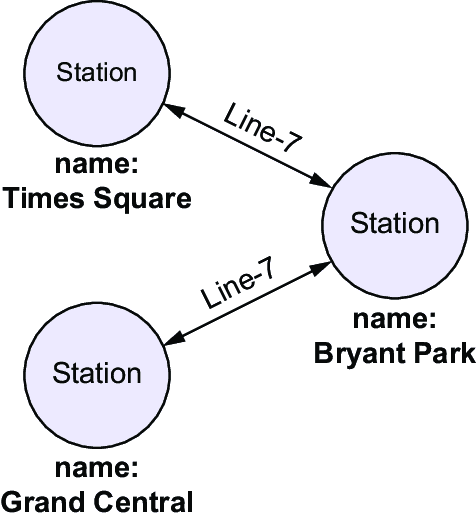
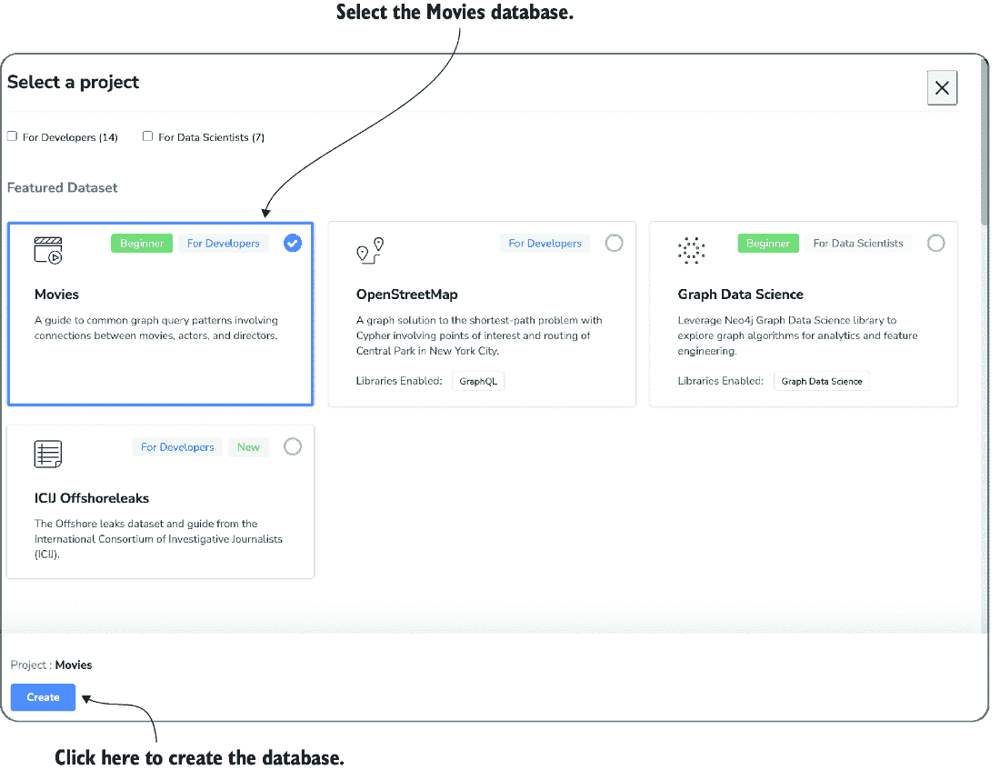

# 第五章：分析结构化数据

### 本章涵盖了

+   将问题翻译成查询

+   构建自然语言界面

+   分析数据表

+   分析图数据

世界上很大一部分信息以结构化数据的形式存储。结构化数据基本上意味着以标准化格式存储的数据。例如，数据表（例如，想想你会在 Excel 电子表格中找到的数据）和描述实体及其关系的图（例如，描述社交网络的数据集）是流行的结构化数据类型。

处理结构化数据的工具已经存在了几十年。毕竟，结构化数据具有标准化的格式，优化了计算机处理它的便捷性。那么，为什么我们需要大型语言模型来处理它呢？现有处理结构化数据工具的问题在于它们的界面。通常，每个工具（或者至少是针对特定类型结构化数据的工具类别）支持自己的正式查询语言。

使用这种语言，用户可以经常对结构化数据进行广泛的操作分析。但学习这种查询语言需要时间！如果所有这些系统都可以使用单一语言进行查询，那该多好啊，最好是自然语言（例如，普通的英语）？

这就是语言模型发挥作用的地方。大型语言模型可以将自然语言中的问题翻译成各种正式语言。因此，我们可以将它们用作支持广泛结构化数据类型的各种数据分析工具的通用接口。在本章中，我们将为不同类型的结构化数据构建自然语言查询界面。这些界面使我们（或其他人）能够通过在自然语言中键入问题来分析数据。然后，系统将我们的问题翻译成正式查询，执行它们，并展示结果。

## 5.1 章节概要

在本章中，我们将创建几个自然语言查询界面。一般来说，自然语言查询界面可以回答以自然语言形式提出的数据问题。本章考虑了不同类型的结构化数据。首先，我们将创建可以回答关于表格数据问题的自然语言界面。之后，我们将创建一个可以回答关于图的问题的界面。

这两种情况下的原理是相同的。我们假设数据是通过使用特定数据类型的数据处理工具来处理的。例如，对于表格数据，我们将使用关系数据库管理系统（RDBMS）。要分析图，我们将使用图数据管理系统。然后，我们将使用大型语言模型将自然语言中的问题转换为特定工具支持的查询语言。例如，对于 RDBMS，这通常是结构化查询语言（SQL）。图数据库管理系统支持多种图数据特定的查询语言。我们将使用 Cypher 查询语言（一种描述图数据分析操作的编程语言）。我们将在接下来的章节中更详细地讨论这两种语言。

为了将问题转换为形式化查询，语言模型需要访问问题（当然），一些关于目标语言的信息（例如，我们是要编写 SQL 还是 Cypher 查询？），以及一些关于我们试图查询的数据结构的信息。例如，表格数据的结构由表名、出现在这些表中的列标题（希望提供一些关于存储在其中的数据的语义的提示）以及每列的数据类型（我们是存储整数还是字符串？）等因素来表征。通过向语言模型提供所有这些信息，包括它们在提示中，模型应该能够生成一个形式化查询，捕捉我们问题的语义。

我们可以使用专门的工具来处理该查询，生成查询结果。假设查询翻译是正确的，这个结果将代表对原始问题的答案。图 5.1 展示了整个过程。


##### 图 5.1 自然语言查询界面将自然语言中的问题转换为形式化查询，考虑到数据结构。然后，通过一个专门的工具在数据上处理形式化查询，生成查询结果。

##### 我们为什么需要外部工具？

我们已经看到语言模型可以解决各种任务。那么，为什么不直接使用语言模型来分析结构化数据呢？为什么我们依赖外部工具来完成这项任务，而仅仅将语言模型作为翻译器使用呢？

主要原因是效率。使用大型语言模型成本高昂，至少对于大型数据集来说，数据的大小很容易超过语言模型的最大输入大小。因此，依赖能够处理大型结构化数据集的现有工具似乎是一个更好的主意。

警告：在以下章节中，我们使用语言模型来编写数据处理命令。尽管语言模型在很多情况下工作得非常出色，但永远不要依赖它们在所有单一场景中生成正确的结果。在某些情况下，语言模型可能会编写错误的查询。其他时候，它们可能会编写更改或删除你的数据或更改你的系统设置的命令。在通过语言模型启用数据访问之前，始终备份重要数据。

## 5.2 为分析游戏销售的自然语言查询界面

我们回到了香蕉公司，在这里你意识到你的老板竟然是个电脑游戏爱好者。你的老板不仅喜欢在晚上玩游戏，而且还热衷于分析电脑游戏的数据。最近，你的老板获得了一份数据集，关于电脑游戏的销售情况，他正寻求提取有趣的统计数据。SQL 是分析表格数据的语言，但你的老板并不觉得写 SQL 查询很自在。了解到你在语言模型和数据分析方面的专业知识，你的老板询问是否有可能构建一个将关于电脑游戏的问题翻译成相应的 SQL 查询的界面。经过思考，你意识到这可能是一个有趣的项目，而且可以用语言模型轻松实现。让我们开始吧！

### 5.2.1 设置 SQLite 数据库

在我们可以使用 SQL 查询分析表格数据之前，我们首先必须将数据加载到 RDBMS 中，这是一个用于高效处理数据表的工具。在本小节中，我们将了解如何将关于电脑游戏的数据加载到 SQLite 中，这是一个流行的 RDBMS。

作为第一步，确保 SQLite 已安装。在本节中，我们将使用 SQLite 版本 3。你可以在终端中输入以下内容来检查 SQLite 3 是否已安装：

```py
sqlite3 --version
```

如果你收到这样的消息，则不需要进一步安装：

```py
3.33.0 2020-08-14 13:23:32 fca8...
```

如果你看到错误消息，请访问[www.sqlite.org/download.html](http://www.sqlite.org/download.html)。选择与你的操作系统一致的版本，下载所有相关文件，并按照说明安装 SQLite。如果遇到问题，请点击书中配套网站第五章部分的“SQLite 安装”项目。你将找到如何在不同平台上安装 SQLite 的详细说明。之后，运行之前的命令以确保 SQLite 已正确安装。

接下来，我们想要使用 SQLite 创建一个关系型数据库。关系型数据库本质上是一组数据表。你可以将每个数据表想象成一个简单的电子表格。我们已命名与数据类型关联的表列，以及（可能很多）包含每列值的表行。例如，表 5.1 包含有关视频游戏的信息，每一行代表一个游戏。该表有四个列：`名称`、`平台`、`年份`和`类型`。其中三个列（`名称`、`平台`和`类型`）包含字符串（即文本）。`年份`列包含数字（表示游戏发布的年份）。

##### 表 5.1 数据表样本。每一行表描述一个视频游戏。

| **名称** | **平台** | **年份** | **类型** |
| --- | --- | --- | --- |
| Wii Sports | Wii | 2006 | 体育 |
| 超级马里奥兄弟 | NES | 1985 | 平台 |
| 马里奥赛车 WII | WII | 2008 | 赛车 |
| Wii Sports Resort | Wii | 2009 | 体育 |
| 宝可梦红/宝可梦蓝 | GB | 1996 | 角色扮演 |

表 5.1 展示了可以在本书配套网站上找到的数据集的小样本（在第五章部分查找“游戏”项）。我们将在以下部分使用该数据集来创建一个自然语言查询界面，使用户能够使用自然语言命令进行分析。但首先，我们需要将那些数据加载到 SQLite 数据库系统中。

提示：我们将介绍将表格数据加载到 SQLite 所需的所有步骤。如果你想要加载这里未讨论的数据，这很有用。如果你不想创建自己的数据库，你可以跳过这一部分，而是从本书的配套网站上下载 games.db。

让我们开始 SQLite 命令行界面。在终端中输入以下命令，然后按 Enter 键：

```py
sqlite3 games.db
```

此命令创建一个存储在文件 games.db 中的新数据库，并同时打开 SQLite 命令行界面。现在我们可以指示 SQLite 工具加载我们将在以下部分使用的数据集。首先，我们必须告诉 SQLite 有关数据结构的一些信息。我们想要加载包含额外列的表 5.1 的扩展版本。运行以下命令来描述数据的结构：

```py
CREATE TABLE games(             #1
rank int, name text, platform text,                    #2
year int, genre text, publisher text, americasales numeric, 
eusales numeric, japansales numeric, othersales numeric, 
globalsales numeric);
```

#1 表名

#2 表列列表

此命令描述了一个名为 `games` 的单个表的结构（**1**）（因为它将存储有关视频游戏的信息）；在括号中，我们指定了表中列的完整列表（用逗号分隔）(**2**）。每个列由列名（例如，`rank`、`name` 或 `genre`）后跟列类型定义。例如，`int` 表示该列存储整数，而 `text` 表示该列存储文本数据。所有表行必须为每个列提供适当数据类型的值。

在定义表结构后，我们可以从书籍网站上的 Games 下的 .csv 文件加载数据到表中。如果你还没有下载，请下载该文件。以下命令将假设文件存储在文件夹 /Downloads/videogames.csv 中。只需将此路径替换为你的系统上的文件路径。使用以下命令加载数据（仍在 SQLite 接口内）：

```py
.mode csv                           #1
.import /Downloads/videogames.csv games  #2
```

#1 设置 CSV 模式

#2 导入数据

第一个命令使 SQLite 准备从 .csv 文件加载数据（这适用于我们想要加载的文件）(**1**)。下一个命令(**2**)导入数据：第一个参数是我们想要从其加载数据的文件路径，第二个参数是我们想要将文件加载到其中的数据表名称。在这种情况下，我们引用的是我们之前定义的结构表（`games`）。为了测试数据是否成功加载（如果没有错误信息，应该就是这种情况），请在 SQLite 中运行以下命令：

```py
SELECT count(*) FROM games;
```

如果所有数据都已加载，你应该看到结果 `16599`。如果你看到一个更小的数字，请检查 SQLite 输出中的错误信息。你可以通过命令 `.quit` 退出 SQLite 控制台（别忘了在命令前加上点以使其生效）。对于以下部分，我们将假设数据已经加载并存储在一个名为 games.db 的 SQLite 文件中。

### 5.2.2 SQL 基础知识

当然，我们可以使用语言模型将问题翻译成 SQL 查询（SQLite 可以理解这些查询）。但我们能信任它的翻译吗？再深入思考一下，你会意识到在向老板展示界面之前，至少有一些 SQL 基础知识来验证语言模型的输出是有益的。这就是我们将在本节中做的事情。当然，本节不会全面介绍 SQL。你可以查看网站 [www.databaselecture.com](http://www.databaselecture.com)，以获取本书作者的更详细介绍。在本节中，我们将讨论一些有助于实现我们的自然语言查询界面的 SQL 基础知识。

SQL 查询用于分析数据表。查询结果可能来自单个表，或者通过组合多个表的数据得出。在我们的示例数据库中，如上一节创建的，我们只有一个表。使用 SQL 查询，我们可以，例如，计算具有特定属性（例如，同一发行商的所有游戏）的行数，过滤数据（例如，仅显示 2017 年发布的游戏），或执行各种聚合操作（例如，对于每个发行商，计算每款游戏的平均收入）。

SQL 查询通常描述一个要生成的表（使用数据库中已存在的数据）。本节中的大多数示例查询具有以下结构：

```py
SELECT [Columns or Aggregates]  #1
FROM [List of tables]           #2
WHERE [List of conditions]      #3
```

#1 SELECT 子句

#2 FROM 子句

#3 WHERE 子句

`FROM`子句（**2**）（在`FROM`关键字之后和`WHERE`关键字之前的代码）描述了用于分析的源数据。例如，`FROM`子句可以包含一个由逗号分隔的表名列表。在我们的示例数据库中，我们只有一个要处理的表（对于高级查询，相同的表名可能在`FROM`子句中多次出现，创建相同表的多个副本）。我们将在以下章节中遇到的查询将在`FROM`子句中包含一个条目：`games`表。

`WHERE`子句（**3**）定义了`FROM`子句中出现的表上的谓词。例如，它可能包含一个条件，将范围限制为来自某个出版商的游戏。`WHERE`子句可以包含简单条件（即可以通过表列上的等式或不等式表示的条件）以及复杂条件（通过`AND`或`OR`运算符连接多个简单条件）。这些条件用于从`FROM`子句中的表中过滤行。不满足`WHERE`子句中条件的行将被丢弃，不会出现在查询结果中。

最后，我们在`SELECT`子句中指定所需结果表的列（**1**）。更确切地说，我们指定一个由逗号分隔的列定义列表。列可以通过列名（出现在`FROM`子句中的一个表中）或更复杂的表达式来定义：例如，连接多个列的算术表达式。或者，我们可以在`SELECT`子句中指定聚合，如`count(*)`（后者聚合计算行数）。查询结果包含一个具有指定列的表，并用与列定义相对应的内容填充这些列。

例如，假设我们想要计算 2017 年发布的所有游戏。在这种情况下，我们的查询结果应包含一个包含计数聚合的单列。此外，我们的`WHERE`子句应包含一个过滤条件，将我们的范围限制为 2017 年的游戏。当然，我们的`FROM`子句包含我们数据库中唯一的表名（`games`）。以下查询生成了所需的结果：

```py
SELECT Count(*)
FROM games
WHERE year = 2017
```

为了使事情变得稍微复杂一些，假设我们想要计算 2017 年由特定发行商（Activision）发布的所有游戏的欧洲和日本的销售额总和。我们期望的查询结果包含两个列：游戏名称和销售额。由于我们的数据表有两个包含欧洲和日本销售额的列（`eusales` 和 `japansales`，如前节中我们的表定义所示），我们可以通过将它们相加来描述期望的结果列（`eusales + japansales`）。因为我们想将范围限制在 2017 年和 Activision 的游戏上，我们可以在 `WHERE` 子句中使用一个复杂的谓词：`year = 2017 AND publisher = Activision`。注意在 Activision 名称周围使用引号——我们需要使用引号来限定查询条件中的字符串而不是数字。以下查询生成了期望的结果：

```py
SELECT name, eusales + japansales
FROM games
WHERE year = 2017 AND publisher = 'Activision'
```

可选地，当指定聚合时，我们可以根据某些列中共享的值计算不同行组的聚合。为此，我们在之前的查询模板中添加一个最终的 `GROUP BY` 子句，后面跟着一个用逗号分隔的列列表，这些列用于形成组。例如，假设我们想要分别计算每个游戏类型（如策略或动作）的游戏销售额。我们可以使用以下查询来返回每个游戏类别的聚合行（注意，我们在 `SELECT` 子句中也添加了 `genre` 列，以确保我们可以将数字与正确的游戏类型关联起来）：

```py
SELECT genre, name, eusales + japansales
FROM games
WHERE year = 2017 AND publisher = 'Activision'
GROUP BY genre
```

本节中的 SQL 入门知识显然不足以让你编写自己的 SQL 查询，除非是少数简单的情况。然而，我们实际上并不想编写自己的 SQL 查询——我们更希望依赖语言模型！本介绍应该能让你从高层次抽象上理解语言模型生成的查询。观察语言模型如何将问题映射到查询上，可能是自学 SQL 的一个好方法。在下一节中，我们将从创建一个简单的翻译器开始，将问题翻译成对 `games` 数据库的 SQL 查询。

### 5.2.3 概述

在掌握了一些 SQL 基础知识以检查语言模型的输出后，我们现在将致力于我们的文本到 SQL 翻译器。我们将通过命令行使用我们的翻译器。我们指定一个问题作为输入，理想情况下我们希望得到一个 SQL 查询，将我们的问题作为输出进行翻译。如果我们运行输出查询在 SQLite 中，我们应该得到我们原始问题的答案。当然，这个接口是手动的，并不非常方便使用。理想情况下，我们希望它能自动执行查询并直接在我们的查询界面中显示相应的结果。我们将在下一节创建这样的接口。现在，我们只关注将问题翻译成查询的核心问题。此外，目前我们的唯一目标是翻译关于电脑游戏的问题。因此，我们将硬编码目标数据库的结构。我们将在下一个项目中将其通用化。

内部来说，为了翻译输入的问题，我们首先创建一个提示。这个提示描述了翻译任务，并包含翻译所需的所有相关细节（例如，我们目标数据库的结构）。将这个提示发送给语言模型，在大多数情况下，应该会得到一个正确翻译的 SQL 查询。我们可能还需要做一些工作来从语言模型生成的可能过于冗长的输出中提取这个查询。让我们更详细地讨论这些步骤，从提示开始。

### 5.2.4 生成文本到 SQL 翻译的提示

我们需要向语言模型传达哪些信息才能实现成功的翻译？显然，我们需要指定我们想要翻译的问题。此外，我们还需要指定目标系统（SQLite）并描述目标数据库的结构。目前，我们硬编码数据库结构。我们可以简单地向语言模型提供我们在第 5.2.1 节中使用的表定义（`create table...`）。语言模型将理解这个命令如何映射到表结构。通过向模型发送包含所有之前提到的信息类型的提示，语言模型应该能够生成相应的 SQL 查询。

让我们使用以下提示模板：

```py
Database:                                          #1
CREATE TABLE games(rank int, name text, platform text,
year int, genre text, publisher text, americasales numeric,
eusales numeric, japansales numeric, othersales numeric,
globalsales numeric);
Translate this question into SQL query:  #2
[Question]                          #3
```

#1 数据库描述

#2 任务描述

#3 要翻译的问题

此提示模板包含之前描述的所有信息片段。首先，它通过提供创建相关表（在这种情况下，一个单独的表）所使用的 SQL 命令来描述目标数据库（**1**）。请注意，这不仅仅是一个占位符，因为目前我们的查询接口只需要为一个数据库（我们在模板中硬编码其结构）工作。接下来，提示模板包含一个任务描述（**2**）：目标是把问题转换为 SQL 查询。最后，模板包含要转换的问题（**3**）。在这里，我们使用一个占位符（由方括号表示）。这使得我们可以使用相同的提示模板来处理老板可能提出的关于数据的各种问题。

以下代码根据之前的模板生成提示：

```py
def create_prompt(question):
    parts = []
     #1
    parts += ['Database:']
    parts += ['create table games(rank int, name text, platform text,']
    parts += ['year int, genre text, publisher text, americasales numeric,']  
    parts += ['eusales numeric, japansales numeric, othersales numeric,'] 
    parts += ['globalsales numeric);']
     #2
    parts += ['Translate this question into SQL query:']
    parts += [question]      #3
    return '\n'.join(parts)  #4
```

#1 添加数据库描述

#2 添加任务描述

#3 添加要转换的问题

#4 返回连接结果

给定要转换的问题作为输入，代码添加数据库描述（**1**），然后是翻译说明（**2**），最后是转换的问题（**3**）。结果是所有提示部分的连接（**4**）。

### 5.2.5 完整代码

下一个列表包含我们自然语言查询接口的完整代码。它使用之前讨论的提示生成函数（**1**），以及我们在前几章中已经了解的调用语言模型的函数（**2**）。

##### 列表 5.1 将关于视频游戏的问题转换为 SQL 查询

```py
import argparse
import openai
import re
import time

client = openai.OpenAI()

def create_prompt(question):                #1
    """ Generate prompt to translate question into SQL query.

    Args:
        question: question about data in natural language.

    Returns:
        prompt for question translation.
    """
    parts = []
    parts += ['Database:']
    parts += ['create table games(rank int, name text, platform text,']
    parts += ['year int, genre text, publisher text, americasales numeric,']  
    parts += ['eusales numeric, japansales numeric, othersales numeric,'] 
    parts += ['globalsales numeric);']
    parts += ['Translate this question into SQL query:']
    parts += [question]
    return '\n'.join(parts)

def call_llm(prompt):                             #2
    """ Query large language model and return answer.

    Args:
        prompt: input prompt for language model.

    Returns:
        Answer by language model.
    """
    for nr_retries in range(1, 4):
        try:
            response = client.chat.completions.create(
                model='gpt-4o',
                messages=[
                    {'role':'user', 'content':prompt}
                    ]
                )
            return response.choices[0].message.content
        except:
            time.sleep(nr_retries * 2)
    raise Exception('Cannot query OpenAI model!')

if __name__ == '__main__':       #3

    parser = argparse.ArgumentParser()
    parser.add_argument('question', type=str, help='A question about games')
    args = parser.parse_args()

    prompt = create_prompt(args.question)  #4
    answer = call_llm(prompt)         #5
     #6
    query = re.findall('\verb|```|sql(.*)\verb|```py|', answer, re.DOTALL)[0]

    print(f'SQL: {query}')
```

#1 生成翻译提示

#2 调用语言模型

#3 读取查询并将其转换为 SQL

#4 生成提示

#5 生成答案

#6 从答案中提取 SQL 查询

此列表从命令行读取关于计算机游戏的问题（**3**）。使用输入问题，它生成一个提示（**4**），指示语言模型将问题转换为 SQL 查询。它将提示发送到语言模型并接收其答案（**5**）。

GPT-4o 的原始答案通常包含与我们所感兴趣的 SQL 查询交织的解释。为了得到查询本身，我们必须从原始答案中提取它（**6**）。在这里，我们利用 GPT-4o 在 ```py` ```sql ```py` and ```` ```py ```` 标记之间包围 SQL 查询的事实（当通过 ChatGPT 网页界面与 GPT 模型交互时，那些标记之间的内容会显示为代码框）。正则表达式 ```py` ```sql(.*)```py ```` 匹配标记之间的 SQL 查询，使用 Python 函数 `re.findall` 返回该正则表达式的匹配列表（需要 `re.DOTALL` 标志以确保点匹配所有字符，包括可能出现在 SQL 查询中的换行符）。我们使用这些匹配中的第一个作为我们的查询（即，我们隐含地假设至少返回一个匹配项，并且第一个匹配项是合适的）。

### 5.2.6 尝试运行

好的！现在是时候尝试我们的文本到 SQL 翻译器了！在终端中，切换到包含 Python 代码的目录。我们将假设代码存储在一个名为`listing1.py`的文件中（你可以从配套网站上下载）。运行以下命令：

```py
python listing1.py "How many games are stored?"
```

因此，你应该获得以下 SQL 查询：

```py
SELECT COUNT(*) FROM games;
```

这个查询正确吗？让我们来看看：在终端中，切换到包含 SQLite 数据库文件（games.db）的仓库。然后，通过 SQLite 命令行界面打开数据库：

```py
sqlite3 games.db
```

现在我们可以最终尝试由我们的文本到 SQL 翻译器生成的查询。输入查询，然后按 Enter 键。你应该看到数据库中存储的游戏数量：16,599。

你可能想尝试其他几个问题。例如，看看你是否能按特定出版商或特定类型的游戏来计算游戏数量！对于大多数涉及这个简单数据库的问题，GPT-4o 应该足够强大，能够提供准确的翻译。你的老板会很高兴的。

本节中我们创建的界面在多个方面仍然有限。首先，你必须为每个新问题重新执行程序。其次，你必须手动复制并执行每个翻译后的查询到数据库系统界面中。第三，也是最重要的一点，如果你想要切换到不同的数据集，你必须手动更改你的提示模板。在下一节中，我们将看到如何克服这些限制。

## 5.3 通用自然语言查询界面

你的老板对新的自然语言界面很满意，并经常与你分享关于电脑游戏销售的有趣见解。然而，你忍不住想知道，仅此用例是否充分利用了你的方法。例如，Banana 的人力资源部门经常处理存储员工信息的表上的复杂问题。我们能否将我们的自然语言界面推广到帮助他们？在本节中，我们将推广自然语言查询界面以与任意数据库一起工作，而无需对代码本身进行任何更改。此外，我们将通过直接执行翻译后的查询并避免在同一数据的不同问题之间重启来使界面更加方便。

### 5.3.1 执行查询

作为第一步，让我们看看我们如何可以直接从 Python 执行翻译后的查询。这将避免从一种界面到另一种界面的繁琐查询复制。在 Python 中，我们可以使用`sqlite3`库在 SQLite 数据库上执行查询。

假设变量`data_path`存储了数据库文件的路径。要在此数据库上执行查询，我们必须首先创建一个连接：

```py
import sqlite3

with sqlite3.connect(data_path) as connection:
    ...
```

我们现在可以通过`connection`对象在数据库上执行 SQL 查询。假设我们想要执行的 SQL 查询存储在变量`query`中。连接到数据库后，我们首先创建一个游标对象（启用查询和结果检索），然后使用它来执行查询：

```py
import sqlite3

with sqlite3.connect(data_path) as connection:
    cursor = connection.cursor()
    cursor.execute(query)
```

执行后，我们可以通过调用 `cursor.fetchall()` 获取结果行的列表。我们将所有内容组合在一个函数中，该函数接受两个参数——数据库的路径和要执行的查询——作为输入，并以字符串形式返回查询结果：

```py
def process_query(data_path, query):
    with sqlite3.connect(data_path) as connection:  #1
        cursor = connection.cursor()           #2
        cursor.execute(query)    #3
        table_rows = cursor.fetchall()  #4
         #5
        table_strings = [str(r) for r in table_rows]
        return '\n'.join(table_strings)          #6
```

#1 连接到数据库

#2 创建光标

#3 执行一个查询

#4 获取查询结果

#5 转换为字符串列表

#6 连接结果行

在连接到目标数据库（**1**）后，函数创建一个光标（**2**），执行输入查询（**3**），并检索查询结果（**4**）。在将结果元组转换为字符串表示（**5**）后，我们连接结果行，用换行符分隔（**6**）。

### 5.3.2 提取数据库结构

我们需要一个适用于任意 SQLite 数据库的接口，而无需更改代码。这意味着我们需要自动提取当前数据库的结构（关于其表和列的信息）。

对于 SQLite，我们可以通过执行 SQL 查询来提取数据库的结构。这些查询访问一个特殊表：模式表。这个表是自动创建的（即，我们不需要手动创建它）。这个表包含创建数据库中其他表的 SQL 命令。我们可以使用它们作为数据库结构的简洁描述，适合作为语言模型的输入。

我们可以通过表名 `sqlite_master` 访问模式表。这个表包含一个名为 `sql` 的列，其中包含有关在数据库内部创建对象所使用的查询的信息。具体来说，我们感兴趣的是用于创建表的 SQL 命令。这些查询包含查询翻译的关键信息，包括属于由查询创建的表的列的名称和类型。以下查询检索了当前数据库中用于创建表的全部 SQL 语句：

```py
select sql from sqlite_master where type = 'table';
```

因此，我们所需做的就是从 Python 中执行此查询。幸运的是，我们已经从上一节中知道了如何执行。给定数据库的路径，以下函数返回一个描述用于创建数据库中所有表的查询的文本：

```py
import sqlite3

def get_structure(data_path):
    with sqlite3.connect(data_path) as connection:  #1
        cursor = connection.cursor()          #2
        cursor.execute("select sql from sqlite_master where type =
        ↪ 'table';")             #3
        table_rows = cursor.fetchall()      #4
        table_ddls = [r[0] for r in table_rows]  #5
        return '\n'.join(table_ddls)        #6
```

#1 连接到数据库

#2 创建一个光标

#3 访问模式表

#4 获取结果

#5 获取 SQL 字符串

#6 连接 SQL 字符串

再次，我们创建一个连接（**1**）和一个相应的游标对象（**2**）。接下来，我们向模式表发出查询，以检索当前数据库中用于创建表的全部 SQL 查询（**3**）。我们获取结果（**4**）并从查询结果中提取 SQL 字符串（**5**）。请注意，此部分函数与上一节中讨论的执行查询的通用函数略有不同。通过提取每行第一个（对于这个特定查询，只有）字段的值，我们消除了行之间不必要的分隔符，否则这些分隔符将出现在我们的输出中（以及后来的提示中）。结果是所有结果行的连接（**6**）。

### 5.3.3 完整代码

列表 5.2 显示了我们通用自然语言查询接口的完整代码（您可以从本书的配套网站上下载，作为第五章部分的列表 2）。该代码使用之前讨论的提取数据库结构的函数（**1**）。生成提示的函数（**2**）是我们之前数据库特定查询接口的一个轻微变体。它不是使用硬编码的数据库结构描述，而是接受数据库描述作为输入并将其插入到提示中。与先前接口版本相比，调用语言模型的函数（**3**）没有变化。`process_query` 函数（**4**）在 5.3.1 节中已讨论。

##### 列表 5.2 通用文本到 SQL 查询接口

```py
import argparse
import openai
import re
import sqlite3
import time

client = openai.OpenAI()

def get_structure(data_path):               #1
    """ Extract structure from SQLite database.

    Args:
        data_path: path to SQLite data file.

    Returns:
        text description of database structure.
    """
    with sqlite3.connect(data_path) as connection:
        cursor = connection.cursor()
        cursor.execute("select sql from sqlite_master where type = 'table';")
        table_rows = cursor.fetchall()
        table_ddls = [r[0] for r in table_rows]
        return '\n'.join(table_ddls)

def create_prompt(description, question):     #2
    """ Generate prompt to translate a question into an SQL query.

    Args:
        description: text description of database structure.
        question: question about data in natural language.

    Returns:
        prompt for question translation.
    """
    parts = []
    parts += ['Database:']
    parts += [description]
    parts += ['Translate this question into SQL query:']
    parts += [question]
    return '\n'.join(parts)

def call_llm(prompt):                             #3
    """ Query large language model and return answer.

    Args:
        prompt: input prompt for language model.

    Returns:
        Answer by language model.
    """
    for nr_retries in range(1, 4):
        try:
            response = client.chat.completions.create(
                model='gpt-4o',
                messages=[
                    {'role':'user', 'content':prompt}
                    ]
                )
            return response.choices[0].message.content
        except:
            time.sleep(nr_retries * 2)
    raise Exception('Cannot query OpenAI model!')

def process_query(data_path, query):        #4
    """ Processes SQL query and returns result.

    Args:
        data_path: path to SQLite data file.
        query: process this query on database.

    Returns:
        query result.
    """
    with sqlite3.connect(data_path) as connection:
        cursor = connection.cursor()
        cursor.execute(query)
        table_rows = cursor.fetchall()
        table_strings = [str(r) for r in table_rows]
        return '\n'.join(table_strings)

if __name__ == '__main__':

    parser = argparse.ArgumentParser()
    parser.add_argument('dbpath', type=str, help='Path to SQLite data')
    args = parser.parse_args()

    data_structure = get_structure(args.dbpath)  #5

    while True:           #6
        user_input = input('Enter question:')
        if user_input == 'quit':
            break

        prompt = create_prompt(data_structure, user_input)
        answer = call_llm(prompt)
        query = re.findall('```sql(.*)```py', answer, re.DOTALL)[0]
        print(f'SQL: {query}')

        try:                               #7
            result = process_query(args.dbpath, query)
            print(f'Result: {result}')
        except:
            print('Error processing query! Try to reformulate.')
```

#1 提取数据库结构

#2 创建翻译提示

#3 调用语言模型

#4 在数据库上处理查询

#5 读取数据结构

#6 回答问题直到用户退出

#7 在数据库上处理查询

在读取命令行参数后，自然语言查询接口提取数据库的结构（**5**）。接下来，我们循环（**6**）直到用户终止接口。在每次迭代中，我们首先从键盘读取输入（如果用户输入`quit`则退出循环），然后创建提示并调用语言模型。

在将输入问题翻译成查询后，我们直接执行该查询（**7**）。当然，翻译可能是不正确的，并导致在目标数据库上无法执行的查询。在这种情况下，SQLite 可能会抛出一个错误，我们必须确保我们的程序不会终止。这就是为什么我们将对查询处理函数的调用放在 try-catch 块中的原因。

### 5.3.4 尝试运行

是时候尝试我们的自然语言查询接口了！我们的接口现在适用于任意数据库。但我们没有另一个数据库，所以我们将再次在游戏数据库上使用它。在终端中，切换到包含 games.db 文件的目录，并运行以下命令（假设代码存储在一个名为 listing3.py 的文件中）：

```py
python listing3.py games.db
```

该命令将在一个输入框中打开，我们可以输入关于数据的问题。以下是与自然语言查询接口交互的示例：

```py
Enter question:How many games are stored in total?
SQL: SELECT COUNT(*) FROM games;
Answer: (16599,)
Enter question:How many games did Activision create?
SQL: SELECT COUNT(*) FROM games WHERE publisher = 'Activision'
Answer: (975,)
Enter question:Name one game that was released in 2017!
SQL: SELECT name
FROM games
WHERE year = 2017
LIMIT 1
Answer: ('Phantasy Star Online 2 Episode 4: Deluxe Package',)
Enter question:How many games were released for each genre?
SQL: SELECT genre, COUNT(*) as num_games
FROM games
GROUP BY genre
Answer: ('Action', 3316)
('Adventure', 1286)
('Fighting', 848)
('Genre', 1)
('Misc', 1739)
('Platform', 886)
('Puzzle', 582)
('Racing', 1249)
('Role-Playing', 1488)
('Shooter', 1310)
('Simulation', 867)
('Sports', 2346)
('Strategy', 681)
Enter question:Which three games sold more copies in Japan than in Europe?
SQL: SELECT name
FROM games
WHERE japansales > eusales
ORDER BY japansales DESC
LIMIT 3;
Answer: ('Name',)
('Pokemon Red/Pokemon Blue',)
('Pokemon Gold/Pokemon Silver',)
Enter question:Break down game sales in America by the platform!
SQL: SELECT platform, sum(americasales) AS total_sales
FROM games
GROUP BY platform
Answer: ('2600', 90.59999999999992)
('3DO', 0)
('3DS', 78.86999999999996)
('DC', 5.43)
('DS', 390.7099999999977)
('GB', 114.32000000000001)
('GBA', 187.54000000000033)
('GC', 133.46000000000004)
('GEN', 19.27)
('GG', 0)
('N64', 139.02000000000015)
('NES', 125.94000000000005)
('NG', 0)
('PC', 93.2800000000005)
('PCFX', 0)
('PS', 336.509999999998)
('PS2', 583.8399999999925)
('PS3', 392.2599999999998)
('PS4', 96.79999999999998)
('PSP', 108.98999999999975)
('PSV', 16.200000000000006)
('Platform', 0.0)
('SAT', 0.7200000000000001)
('SCD', 1)
('SNES', 61.22999999999998)
('TG16', 0)
('WS', 0)
('Wii', 507.7099999999991)
('WiiU', 38.31999999999999)
('X360', 601.0499999999992)
('XB', 186.6900000000008)
('XOne', 83.19000000000003)
Enter question:quit
```

正如你所见，我们可以提出广泛的问题并获得合理的答案。除了答案之外，系统还会打印出查询。了解一点 SQL 使我们能够验证查询是否准确地翻译了问题。

## 5.4 图数据自然语言查询接口

在香蕉公司，关于你的文本到 SQL 接口的消息传开了，多位同事用它来分析他们的表格数据集。你的一位新同事正在处理大型图，在香蕉公司内部社交网络中建模同事之间的联系。这些数据不是以表格的形式表示，而是以图的形式表示，这种数据格式特别适合于建模实体之间的联系（在这种情况下，是人）。这位同事向你伸出援手，询问是否有可能扩展你的接口以查询此类数据。了解到语言模型原则上应该能够处理各种正式查询语言，你感到乐观，并同意调查此事。

### 5.4.1 什么是图数据？

与关系数据一样，图是一种特别受欢迎的结构化数据类型。图通常由节点集合组成，这些节点通过边连接。节点可以与属性相关联，边有标签。例如，社交网络通常表示为图。在这里，节点代表人，边代表友谊和关系。图也是道路或地铁网络的天然表示。在这种情况下，节点代表城市或地铁站，而边代表连接它们的道路或轨道。

图 5.2 展示了一个表示地铁网络的示例图。它将纽约市地铁的车站表示为节点（因此，节点被标记为`Station`）。边代表直接连接，并标记有相关的地铁线路。节点与一个 `name` 属性相关联，将节点分配给相应的车站名称。



##### 图 5.2 表示纽约市地铁网络一小部分的示例图。节点以圆形绘制，代表地铁站，并关联一个属性，将它们分配给表示的地铁站名称。边以箭头绘制，代表通过特定地铁线路的直接连接。边由连接车站的地铁线路标记。

图可以用来建模各种类型的数据这一事实激发了各种专门系统，称为*图数据库系统*，用于图数据处理。这些系统支持图特定的查询语言（不是 SQL），使用户能够对底层数据提出复杂的问题。图数据库系统针对高效处理大型图进行了优化。

接下来，我们将使用语言模型将自然语言中的问题翻译成图数据库管理系统中的查询。我们会看到，与将问题翻译成 SQL 查询的方法相比，这种场景只需要进行小的修改。

### 5.4.2 设置 Neo4j 数据库

我们将使用 Neo4j 系统，这是一个专门针对图数据的数据库系统。你甚至不需要在你的本地机器上安装任何东西。Neo4j 附带一个在线演示，我们将在下一步中使用。

首先，在你的网络浏览器中转到[`neo4j.com/sandbox/`](https://neo4j.com/sandbox/)。点击启动免费沙盒按钮。这应该会打开一个登录表单，在那里你可以选择创建新账户或使用现有账户（例如，一个 Google 账户）。图 5.3 显示了你应该看到的屏幕。



##### 图 5.3 选择电影数据库，然后点击创建以创建相应的实例。

在这里，我们可以选择几个示例数据库之一来尝试 Neo4j。我们将使用`Movies`数据库。这个数据库包含有关电影及其演员的信息（将电影和演员表示为节点）。点击`Movies`数据库，然后点击创建按钮来创建数据库实例并为其查询做准备。创建数据库可能需要几分钟。之后，你可以打开`Movies`数据库并访问查询界面。

图 5.4 显示了 Neo4j 查询界面。点击左上角的数据库图标以查看数据库概览。数据库包含多种类型的标签（即节点类型），包括`People`和`Movies`。它还包含关系类型，如`ACTED_IN`和`DIRECTED`，标记我们的图中的边。例如，这两种关系类型使我们能够跟踪谁在哪些电影中出演（`ACTED_IN`）以及谁导演了哪些电影（`DIRECTED`）。属性与节点相关联，并为值分配键。数据库概览报告了属性键，如`name`（将演员分配给名字）和`title`（将电影分配给标题）。你可以在屏幕顶部的文本框中输入查询，并通过点击文本框右侧的按钮提交它们。


##### 图 5.4 点击数据库图标（左上角）以访问有关当前图数据库的信息，包括节点和边的类型。

### 5.4.3 Cypher 查询语言

Neo4j 支持 Cypher 查询语言。尽管 Cypher 的全面介绍超出了本书的范围（相反，请参阅 Neo4j 文档，可在[`neo4j.com/docs/cypher-manual/current/introduction/`](https://neo4j.com/docs/cypher-manual/current/introduction/)找到），但我们将快速浏览基础知识。本介绍的目的是使你至少在简单情况下能够理解由语言模型生成的查询的语义。

简单类型的 Cypher 查询使用一个描述子图的 `MATCH` 语句来查找。例如，我们可能只想找到特定类型的所有节点。在 Movies 数据库中查找所有人的名字的查询如下：

```py
MATCH (p:Person)  #1
RETURN p.name     #2
```

#1 匹配模式

#2 返回结果

`MATCH` 语句描述了一个匹配模式（**1**）。在这种情况下，该模式由类型为 `Person` 的单个节点组成。`MATCH` 语句将出现在模式中的节点或边分配给变量。在这种情况下，我们引入变量 `p` 并将其分配给匹配该模式的节点。`RETURN` 语句（**2**）根据匹配的模式描述查询结果。在这里，我们指示系统返回匹配模式的每个节点的 `name` 属性。

模式可以扩展到单个节点之外。例如，我们可能想找到所有由演员汤姆·克鲁斯主演的电影的标题。在这种情况下，我们寻找的模式不是单个节点，而是两个连接的节点。我们正在寻找一个类型为 `Movie` 的节点，通过类型为 `ACTED_IN` 的边连接到一个类型为 `Person` 的节点，其 `name` 属性设置为“Tom Cruise”。这可以通过以下 Cypher 查询实现：

```py
 #1
MATCH (p:Person {name: 'Tom Cruise'})-[:ACTED_IN]->(m:Movie)
RETURN m.title                                       #2
```

#1 匹配汤姆·克鲁斯主演的电影

#2 返回电影标题

表达式 `(p:Person name: "Tom Cruise")`（**1**）匹配所有 `name` 属性设置为“Tom Cruise”的类型为 `Person` 的节点。表达式 `(m:Movie)` 匹配所有类型为 `Movie` 的节点。最后，我们使用表达式 `-[:ACTED_IN]->` 将这两个节点连接起来。这个表达式代表第一个节点（代表汤姆·克鲁斯）和第二个节点（代表任意电影）之间的有向连接（因此箭头形状）。连接的类型限制为 `ACTED_IN`（例如，不包括汤姆·克鲁斯执导但未出演的电影）。最后，请注意，`MATCH` 表达式再次将此模式的某些部分分配给变量。汤姆·克鲁斯将由变量 `p` 表示，而他出演的电影将由变量 `m` 表示。`RETURN` 表达式（**2**）检索电影节点的 `title` 属性。

最后，让我们看看 Neo4j 如何计算聚合（类似于 SQL）：

```py
 #1
MATCH (p:Person {name: 'Tom Cruise'})-[:ACTED_IN]->(m:Movie) 
RETURN count(*)                                 #2
```

#1 匹配汤姆·克鲁斯主演的电影

#2 返回电影数量

此查询与之前的查询类似，只是简单地计算出演员汤姆·克鲁斯出演的电影数量（**1**）。`RETURN` 语句（**2**）包含相应的聚合。如果您输入此查询，您应该获得“3”作为查询结果（因此，显然示例数据库是不完整的）。

### 5.4.4 将问题转换为 Cypher 查询

我们将使用与将问题翻译成 SQL 查询相同的方法。主要的是，我们需要将提示更改为我们语言模型。我们不会指示语言模型翻译成 SQL，而是指示它翻译成 Cypher。幸运的是，像 GPT-4o 这样的语言模型已经在大规模和多样化的训练数据上进行了预训练。正如我们将在本节剩余部分看到的那样，这些预训练数据必须包括 Cypher 查询，这就是为什么我们可以使用语言模型进行翻译。当然，没有绝对的保证，由语言模型生成的 Cypher 查询可能无法准确翻译我们的问题。然而，至少对于简单的查询，翻译通常是正确的。

### 5.4.5 生成提示

为了将问题翻译成 Cypher 查询，我们需要在提示中包含几个信息。首先，这包括我们想要翻译的问题。其次，这必须包括数据库结构的描述。在 SQL 的情况下，数据库结构由表和列名定义。在 Neo4j 数据库的情况下，我们想要包含有关节点和边类型以及最相关属性名称的信息。这基本上是图 5.4 左侧显示的信息。

为了保持简单，我们将关注之前介绍过的示例数据库，其中包含有关电影的信息。这意味着我们将硬编码数据库结构。当然，类似于我们的文本到 SQL 接口，我们可以扩展接口以处理任意图数据库。

我们将使用以下提示模板：

```py
Neo4j Database:        #1
Node labels: Movie, Person
Relationship types: ACTED_IN, DIRECTED,
FOLLOWS, PRODUCED, REVIEWED, WROTE
Property keys: born, name, rating, released
roles, summary, tagline, title
[Question]                 #2
Cypher Query:              #3
```

#1 数据库描述

#2 要翻译的问题

#3 目标语言规范

此提示模板包含数据库的描述（**1**）。此描述包括数据库类型（Neo4j 数据库）的规范，以及节点标签、关系类型和属性的列表。请注意，我们在提示模板中硬编码了数据库结构。如果在不同数据库上使用接口，此部分的提示必须替换。接下来，提示模板指定了要翻译的问题（**2**）。这是一个占位符，因为我们希望用户能够就数据提出各种问题。提示以查询翻译的目标语言规范结束（**3**）。这隐含地指示语言模型将问题翻译成 Cypher 查询。

以下代码实例化了用于输入问题的提示模板：

```py
def create_prompt(question):
    parts = []
    parts += ['Neo4j Database:']
    parts += ['Node labels: Movie, Person']
    parts += ['Relationship types: ACTED_IN, DIRECTED,']  
    parts += ['FOLLOWS, PRODUCED, REVIEWED, WROTE'] 
    parts += ['Property keys: born, name, rating, released']
    parts += ['roles, summary, tagline, title']
    parts += [question]
    parts += ['Cypher Query:']
    return '\n'.join(parts)
```

### 5.4.6 完整代码

以下列表使用了之前讨论的生成提示的函数（**1**），并重新使用了调用 GPT-4o 的函数（**2**）（如果需要，可以进行重复尝试）。

##### 列表 5.3 将文本问题翻译成 Neo4j 的 Cypher 查询

```py
import argparse
import openai
import re
import time

client = openai.OpenAI()

def create_prompt(question):                 #1
    """ Generate prompt to translate a question into Cypher query.

    Args:
        question: question about data in natural language.

    Returns:
        prompt for question translation.
    """
    parts = []
    parts += ['Neo4j Database:']
    parts += ['Node labels: Movie, Person']
    parts += ['Relationship types: ACTED_IN, DIRECTED,']  
    parts += ['FOLLOWS, PRODUCED, REVIEWED, WROTE'] 
    parts += ['Property keys: born, name, rating, released']
    parts += ['roles, summary, tagline, title']
    parts += [question]
    parts += ['Cypher Query:']
    return '\n'.join(parts)

def call_llm(prompt):                             #2
    """ Query large language model and return answer.

    Args:
        prompt: input prompt for language model.

    Returns:
        Answer by language model.
    """
    for nr_retries in range(1, 4):
        try:
            response = client.chat.completions.create(
                model='gpt-4o',
                messages=[
                    {'role':'user', 'content':prompt}
                    ]
                )
            return response.choices[0].message.content
        except:
            time.sleep(nr_retries * 2)
    raise Exception('Cannot query OpenAI model!')

if __name__ == '__main__':

    parser = argparse.ArgumentParser()
    parser.add_argument('question', type=str, help='A question about movies')
    args = parser.parse_args()

    prompt = create_prompt(args.question)  #3
    answer = call_llm(prompt)         #4
    #5
    query = re.findall('```cypher(.*)```py', answer, re.DOTALL)[0]

    print(f'Cyper Query: {query}')
```

#1 生成翻译提示

#2 调用 LLM

#3 创建提示

#4 生成答案

#5 提取 Cypher 查询

给定一个关于数据库的问题作为输入，代码生成相应的提示（**3**），从语言模型中获取答案（**4**），最后从该答案中提取 Cypher 查询（**5**）。用于提取的正则表达式略有不同，因为 GPT 使用模式 `‘‘‘cypher ... ‘‘‘` 包含 Cypher 查询。我们最终打印出提取的查询。

### 5.4.7 尝试一下

你可以在本书的配套网站上找到列表 5.3。下载它，并像这样从命令行使用它：

```py
python listing3.py "How many movies are stored?"
```

你应该得到如下查询作为输出：

```py
MATCH (m:Movie)
RETURN COUNT(m) AS numberOfMovies
```

你现在可以将此查询输入到 Neo4j 界面以获取相应的结果（结果是 38）。尝试更多查询以更好地了解语言模型的能力。正如你所见，只需对提示模板进行少量更改，我们就将我们的文本到 SQL 界面转换成了在大多数情况下都能很好地工作的文本到 Cypher 界面。

## 摘要

+   结构化数据遵循标准格式，这使得解析更加容易。结构化数据的例子包括表格数据和图表。

+   结构化数据通常通过专用工具进行处理。

+   关系型数据库管理系统处理表格数据，通常支持 SQL 查询。

+   图数据管理系统处理表示图的数据库。

+   语言模型将自然语言翻译成多种正式查询语言。

+   除了问题之外，查询翻译的提示还指定了数据库结构。

+   在执行由语言模型生成的查询之前，请复制你的数据库。

+   不要盲目相信你的语言模型生成准确的查询。
