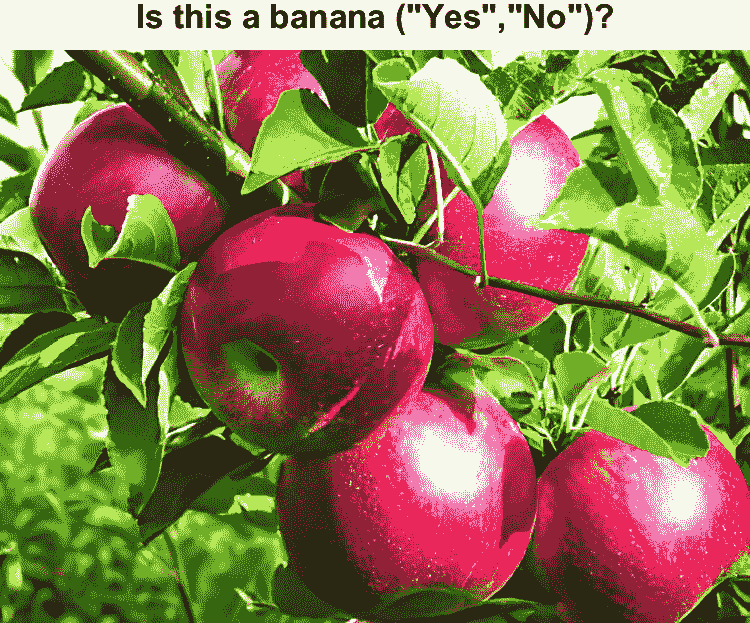
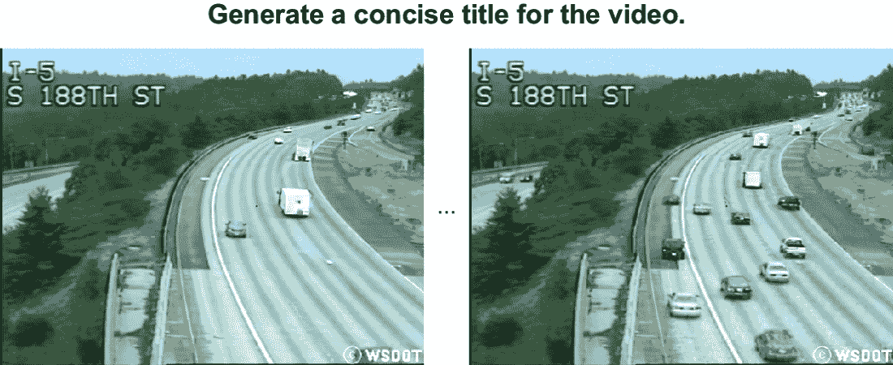

# 6 分析图像和视频

### 本章涵盖

+   分析图像

+   比较图像

+   分析视频

在前面的章节中，我们看到了如何分析文本和结构化数据。这涵盖了所有内容吗？远远没有！到目前为止，最大的数据部分是以图像和视频的形式存在的。例如，仅视频就占互联网交换的总数据量的令人印象深刻的三分之二！在本章中，我们将看到语言模型如何帮助我们从这些数据类型中提取有用的见解。

以下几节介绍了一些处理图像和视频数据的小型项目。GPT-4o 是一个本地的多模态模型；我们可以用它来完成所有这些任务。首先，我们将看到如何使用 GPT-4o 来回答关于图像的自由形式问题（用自然语言）。其次，我们将使用 GPT-4o 来构建一个自动图片标记应用程序，自动为我们的假日照片标记出现的人物。

最后，我们将使用 GPT-4o 来自动为视频文件生成标题。这些小型项目的目标是展示最新一代大型语言模型提供的视觉数据处理功能。完成这些项目后，你应该能够构建自己的图像和视频数据处理应用程序，用于各种场景。

## 6.1 设置

你还需要安装一个额外的 Python 包来运行示例代码。具体来说，你需要 OpenCV，这是一个用于图像处理的库。在终端中，运行以下命令来安装 OpenCV：

```py
pip install opencv-python==4.8.1.78
```

我们将使用这个库，例如，从磁盘读取图像并将视频分割成帧。

接下来，你需要安装一个额外的库，这将使你能够直接向 OpenAI 的网络服务发送请求（你将使用它来发送存储在本地的图片到 OpenAI）：

```py
pip install requests==2.31.0
```

做得很好！如果你在运行这些命令时没有遇到任何错误信息，那么你的系统现在已经配置好了，可以使用 GPT-4o 进行图像和视频数据分析。让我们从下一节开始我们的第一个项目。

## 6.2 回答关于图像的问题

在图像中检测物体（如汽车）的神经网络已经存在很多年了。那么使用 GPT-4o 处理图像有什么大不了的？

经典图像处理模型的局限性在于它们需要针对特定的分析任务进行训练。例如，假设你有一个神经网络，它非常擅长检测猫的图片。你可以用它来过滤掉你个人收藏中的猫的图片。然而，也许你对猫整体不感兴趣，但特别感兴趣的是金色波斯猫。除非你的模型被训练来检测这种特定的猫，否则你将无计可施，需要自己标记足够的示例图片。这样做很繁琐，你可能会最终不使用该模型，而是手动查看图片。GPT-4o（以及类似模型）进行图像处理的一大亮点是，它仅基于任务的描述（自然语言）就能解决一系列基于图像的任务。

我们将使用它来构建一个通用的图像问答系统。作为用户，你可以用自然语言提出任意问题，并指向一张图片，系统将生成文本答案。例如，要求系统检测图片中的“金色波斯猫”应该能够直接工作，而无需特定任务的训练数据。

### 6.2.1 指定多模态输入

在本节中，我们将创建一个系统，该系统接受两个输入：

+   指向网络中图像的 URL

+   关于图像的自然语言问题

输出是对问题的答案（以文本形式）。内部，系统使用 GPT-4o 处理输入图像上的问题。它生成多模态提示，结合多种类型的数据（在这里，文本和图像）。图 6.1 展示了示例提示：它包含一张图片（苹果的图片）和关于这张图片的问题（图片是否显示香蕉）。在这种情况下，正确的答案是“不”。



##### 图 6.1 包含图像和文本的多模态提示。提示指示语言模型判断图片是否显示香蕉。在这种情况下，预期的输出是“不”（否则“是”）。

我们如何为 GPT-4o 创建这样的提示？我们可以重用聊天完成端点。提醒一下，这个端点接受用户和（可能）系统之间交换的先前消息列表作为输入。对于我们的视觉问答系统，我们只需要一条消息（这条消息来自用户）。

与之前的代码不同，现在消息可以包含多模态内容。在这个特定的情况下，这种内容由一个文本片段（用户提出的问题）和一个图像（目前指定为 URL）组成。这是我们将在以下代码中使用的消息（`question`是一个包含问题文本的变量，而`image_url`是图像的 URL）：

```py
{'role':'user', 'content':[
    {'type':'text', 'text':question},  #1
    {'type':'image_url', 'image_url':{
        'url':image_url}}          #2
    ]
}
```

#1 问题文本

#2 图像 URL

首先，注意`role`属性标识消息是由用户生成的。其次，消息内容被指定为一个 Python 字典列表。每个字典描述消息的一个元素。由于我们现在考虑的是多模态数据——即图像和文本——我们需要明确每个输入元素的类型（或*模态*）。这是通过将`type`属性设置为`text`或`image_url`来实现的。实际内容使用`text`属性（**1**）或（在图像的情况下）`image_url`属性（**2**）来指定。GPT-4o 足够灵活，能够理解问题指的是图像，并适当地处理它们。

小贴士：虽然输入只包含一张图片，但消息的内容可能包含多个相同类型的元素：例如，多张图片。我们将在下一节的项目中利用这一功能。

### 6.2.2 代码讨论

以下列表展示了我们视觉问答系统的完整代码。以图像 URL 和问题作为输入（**3**），实际的魔法（即视觉问答）发生在`analyze_image`函数（**1**）中。

##### 列表 6.1 通过语言模型回答图像问题

```py
import argparse
import openai
import time

client = openai.OpenAI()

def analyze_image(image_url, question):       #1
    """ Use language model to answer questions about image.

    Args:
        image_url: URL leading to image.
        question: question about image.

    Returns:
        Answer generated by the language model.
    """
    for nr_retries in range(1, 4):
        try:
            response = client.chat.completions.create(
                model='gpt-4o',
                messages=[                  #2
                    {'role':'user', 'content':[
                        {'type':'text', 'text':question}, 
                        {'type':'image_url', 'image_url':{
                            'url':image_url
                            }
                        }]
                    }]
                )
            return response.choices[0].message.content
        except:
            time.sleep(nr_retries * 2)
    raise Exception('Cannot query OpenAI model!')

if __name__ == '__main__':

    parser = argparse.ArgumentParser()                   #3
    parser.add_argument('imageurl', type=str, help='URL to image')
    parser.add_argument('question', type=str, help='Question about image')
    args = parser.parse_args()

    answer = analyze_image(args.imageurl, args.question)
    print(answer)
```

#1 回答关于图像的问题

#2 多模态内容

#3 输入参数

正如你所见，只需几行 Python 代码就能回答关于图像的问题！函数`analyze_image`（**1**）仅包含对 GPT-4o 的一次调用，使用的是前一小节中描述的消息（**2**）。我们现在提供多模态输入并不会改变答案的格式。再次强调，我们得到的是一个包含由语言模型生成的消息的对象。尽管输入现在可能是多模态的，但输出仍然是文本。正如我们指示语言模型生成对输入问题的答案（**3**）（即用户所寻找的确切答案），输出会直接打印给用户。

### 6.2.3 尝试运行

是时候测试我们的视觉问答系统了！你回到了香蕉公司（一家生产各种消费电子产品，包括笔记本电脑和智能手机，在第二章中介绍）并寻找一个新的公司标志。你希望以香蕉的图片为基础设计你的标志。在网上搜索后，你找到了大量水果图片的仓库。但哪一个是香蕉？你更愿意手动逐个查看图片，而不是将这项任务委托给语言模型。幸运的是，你可以直接使用前一小节中的代码，通过指定每张水果图片的 URL，以及问题“这是香蕉吗？（“是”，“否”）”。这意味着你实际上是将视觉问答系统作为一个分类方法（这仅仅是许多可能用例之一）来使用。然后你可以编写一个简单的脚本，遍历所有相关的 URL，并保留那些回答为“是”的 URL。

在书的配套网站上，你可以找到列表 6.1 中的代码以及水果图片（寻找标记为 Fruit 1 到 Fruit 5 的链接）。下载代码，在终端中切换到包含的存储库，并运行以下代码：

```py
python [URL] 'Is this a banana ("Yes","No")?'
```

在这个命令中，将 `[URL]` 替换为图片的 URL（例如，你可以通过复制书网站上“水果 1”的链接来获取合适的 URL）。

物体分类相对容易，尤其是像香蕉这样常见的物体。因此，你应该看到大多数示例都能得到准确的结果。尝试几种不同的水果，以及可能的其他你选择的图片。你可以提出的问题范围几乎是无限的（不考虑相对宽裕的输入长度限制，即 128,000 个标记，大约 300 页的文本）。

在处理成本方面，可能需要提醒一下。通过 GPT-4o 处理图像可能会很昂贵！确切的成本取决于图像大小和图像处理的详细程度。你可以使用`detail`参数来控制精确度。例如，使用以下图像 URL 的指定（在模型输入中）选择低精度：

```py
{'type':'image_url', 'image_url':{'url':image_url, 'detail':'low'}}
```

将`detail`属性设置为`low`，以支付相当于每张图像 85 个标记的成本（即使用 GPT-4o 处理包含 85 个标记的文本的成本）。如果你将详细程度设置为`high`（默认值），成本包括一个固定数量的 85 个标记和一个可变数量，这取决于图像大小。为了计算可变成本部分，我们首先将图像缩放到 2,048 × 2,048 像素的大小（同时保持宽高比）。这一缩放步骤仅适用于超过 2,048 × 2,048 像素的图片。第二个缩放步骤无论如何都会执行。它将图像的较短边缩放到 768 像素的大小。现在考虑在第二次缩放步骤之后覆盖图像所需的 512 × 512 像素方块的最低数量。可变成本部分与方块的数量的乘积成正比，乘以 170 个标记（由 OpenAI 设定的每平方的成本）。

例如，假设我们想要以高精度处理一个 1,024 × 1,024 像素大小的图像。在这种情况下，我们可以跳过第一个缩放步骤，因为图像仍然适合在一个 2,048 × 2,048 像素的方块内。然而，第二个缩放步骤无论如何都会执行。它将图像缩放到 768 × 768 像素的大小。为了覆盖两边长度为 768 像素的方块，我们需要四个 512 × 512 像素的方块。这意味着为了处理我们的图像，我们需要支付以下费用：

+   85 个标记（固定成本部分）

+   4 × 170 个标记 = 680 个标记（可变成本部分）

因此，我们总共支付 85 + 4 × 170 = 765 个标记。根据当前价格，这相当于 0.003825 美元（即不到一美分）。尽管这可能看起来是可以接受的，但在通过语言模型处理大量图像库时，始终要考虑成本。

小贴士：要查找处理具有特定分辨率的图像的价格，您还可以使用 OpenAI 价格计算器：[`openai.com/pricing`](https://openai.com/pricing)。

## 6.3 在图像中标记人

想象以下情况：你刚刚和朋友（应得的）度假回来，当然，你拍了很多照片。你想要发送出现你朋友的照片。但如何高效地做到这一点？你可以手动浏览照片并为每个朋友单独标记。但是，刚刚度假回来，你的邮箱已经爆满，你没有时间浏览假期照片。你能做什么？

### 6.3.1 概述

在本节中，我们将创建一个小应用程序来自动在图像中标记人。用户提供三个输入：

+   包含要标记的图片的目录路径

+   包含要寻找的人的图片的目录路径

+   将标记的图片写入的输出目录的路径

为了简化问题，我们将使用文件名来表示标签。我们假设显示要寻找的人的图片以显示的人的名字命名。例如，假设我们在包含要寻找的人的目录中有名为 Joe.png 和 Jane.png 的图片。给定一个要标记的图片，我们将简单地通过在其名称前加上图片中出现的名字来更改文件名。

例如，假设我们有一个名为 beach.png 的图片，其中 Joe 和 Jane 都出现了。那么，在输出目录中，我们将创建两个名为 Joebeach.png 和 Janebeach.png 的文件，显示他们都在海滩图片中。如果我们想发送显示同一人的所有图片，例如 Joe，我们可以搜索所有名称满足正则表达式`Joe*.png`（其中`*`代表任意字符串）的文件。

在内部，作为第一步，我们需要加载代表要寻找的人的图片以及要标记的图片。我们将考虑每一对人要寻找的人和要标记的图片。例如，如果我们正在寻找五个人，并且有 10 张图片要标记，那么我们需要考虑 50 对人。对于这些对中的每一个，我们使用 GPT-4o 来判断对应的人是否出现在要标记的图片中。

要实现这一点，我们需要包含文本和两张图片的多模态提示。第一张图片显示要寻找的人，第二张图片显示要标记的图片。通过文本，我们可以指示语言模型比较图片以判断是否出现同一个人。每当我们发现匹配项——即出现该人的一个人和图片的组合——我们就会将相应的图片复制到输出文件夹，并在其名称前加上该人的名字。

图 6.2 展示了一个示例提示。在左侧，我们有一张 Jane 的照片，她是我们要找的人之一。在右侧，我们有一张需要标记的照片。文本指令要求语言模型比较这两张图片，如果它们显示的是同一个人（否则为“否”），则产生答案“是”。在这种情况下，图片显示的不是同一个人，正确的答案应该是“否”。


##### 图 6.2 多模态提示包含两张图像和文本：提示要求语言模型检查这两张图片是否显示的是同一个人（预期答案：“是”）或不是（预期答案：“否”）。

### 6.3.2 本地存储图像编码

在上一节中，我们使用 GPT-4o 分析了网上的图片。现在我们正在谈论我们私人的假日照片。我们可能不希望将它们全部公开在网络上。那么我们如何仅与 GPT-4o 分享它们呢？

我们可能需要将图像转换为适合 GPT-4o 的格式。GPT-4o 支持广泛的图像格式，包括 PNG、JPEG、WEBP 和 GIF。对于任何格式，图像文件大小目前限制为 20 MB。要将支持的类型的图片上传到 GPT-4o，我们首先需要使用 base64 编码对它们进行编码。

##### base64 编码是什么？

base64 编码是将二进制数据编码为可打印字符串的一种方法。正如其名称 base64 所暗示的，我们用于字符串的字母表基于 64 个字符。这意味着我们可以使用六个比特（因为六个比特可以表示 2⁶ = 64 个可能的字符）来表示每个字符。由于计算机以字节（即 8 比特）的粒度存储数据，因此将三个字节的组（即 24 比特）一起编码是很方便的。使用 base64 编码，三个字节可以用来表示四个字符（因为 24/6 = 4）。

在 Python 中，我们可以使用 `base64` 库以 base64 格式编码二进制数据。以下代码打开存储在 `image_path` 的图像文件，并使用 base64 格式对其进行编码：

```py
with open(image_path, 'rb') as image_file:
    encoded = base64.b64encode(image_file.read())
```

我们已经将二进制图像数据转换成了 base64 格式的字符串。在将此类图像发送到 GPT-4o 之前，我们仍然需要进行最后一次转换：我们必须使用 UTF-8 编码来表示该字符串。

##### UTF-8 编码是什么？

UTF-8 是一种表示字符串数据的方式。它非常流行，大约有 98% 的网站使用 UTF-8。UTF-8 可以表示超过一百万个字符，覆盖各种语言。我们可以使用固定数量的字节来表示这些字符：每个字符四个字节。然而，这并不高效，因为它没有利用到某些字符比其他字符更常见的这一事实。如果我们用更少的字节来编码常见的字符，而将多字节表示留给不常见的字符，我们可以用更少的字节来表示相同的文本。这正是 UTF-8 所做的，而且由于不同的字符可能需要不同数量的字节来表示，它也被称为 *可变长度标准*。同时，UTF-8 被设计成与较旧的 ASCII 标准向后兼容，对于前 128 个字符使用与 ASCII 相同的编码。

要将我们的图像 base64 编码转换为 UTF-8，我们可以使用 Python 的 `decode` 函数。假设图像仍然编码在 `encoded` 字符串变量中，我们可以使用以下代码进行转换：

```py
image = encoded.decode('utf-8')
```

结果图像，编码为 UTF-8 文本字符串，适合作为 GPT-4o 的输入。接下来，我们将看到如何以这种格式将图像上传到 OpenAI 平台。上传后，我们可以在提示中包含对这些图片的引用。图像通常指定为提示的组成部分：

```py
{'type':'image_url', 'image_url':{'url':image_url}}
```

在这里，`image_url` 代表通向要分析的图像的 URL。之前，我们使用的是公开可访问的 URL。现在我们正在分析私有图像，这些图像将发送到 OpenAI，仅用于处理特定请求。假设 `image` 仍然代表作为字符串编码的图像，我们可以按以下方式设置图像 URL：

```py
image_url = {'url':f'data:image/png;base64,{image}'}
```

此代码假设图像为 PNG 类型（如果不是，请将字符串 `png` 替换为适当的格式标识符，例如 `jpeg`）。URL 结合了关于图像的元数据（例如图像类型和编码）以及表示图片本身的字符串后缀。

### 6.3.3 将本地存储的图像发送到 OpenAI

我们将利用这个项目作为展示与 GPT 模型交互的替代方式的机会。这样做将使我们深入了解 OpenAI 的 Python 库内部工作原理。到目前为止，我们一直在使用 Python 包装器在后台向 OpenAI 的平台发送请求。为了将我们的本地图像发送到 GPT-4o，我们将自己创建这些请求。

我们使用 Python 的 `requests` 库来创建 HTTP 请求，将我们的提示（包括文本和图像）发送到 GPT-4o 并收集答案。更确切地说，我们将发送 HTTP POST 请求。这是 OpenAI 平台接受的请求类型。此类请求可以通过 `requests.post` 方法发送。

我们请求将包含 GPT-4o 解决我们感兴趣的任务（在这种情况下，验证两张图片是否显示同一人）所需的所有相关信息。首先，我们需要在请求中包含头信息。我们将使用以下头信息：

```py
headers = {
    'Content-Type': 'application/json',
    'Authorization': 'Bearer ...'
}
```

你可以看到我们正在指定一个 Python 字典作为头信息。对于我们的用例，我们只需要存储两个属性：我们有效负载的类型（我们计划发送 JSON 内容）和我们的访问凭证（三个点代表我们的 OpenAI 访问密钥）。

接下来，我们需要指定有效负载——即我们主要通过请求发送的内容：

```py
payload = {
    'model': 'gpt-4o',  #1
    'messages': [
        {'role': 'user', 'content': ...}  #2
        ],
    'max_tokens':1  #3
    }
```

#1 模型指定

#2 第一条消息

#3 输出长度

你可能会注意到有效负载中恰好包含我们在调用 `completions.create` 方法时通常会指定的字段。这不是巧合，因为后者方法在内部创建具有类似有效负载的请求。首先，有效负载指定了模型（**1**）：`gpt-4o`（以便能够处理多模态输入提示）。我们指定了一个包含单个条目的消息列表（**2**）。这条消息被标记为来自用户（`role:user`），其内容用三个点缩写，将包含文本指令和图片。最后，我们将答案长度限制为单个标记（`max_tokens:1`）（**3**）。这很有意义，因为我们正在寻找二元结果：要么多个输入图像中出现了同一人（预期答案：“是”），要么没有（预期答案：“否”）。

在生成了头信息和有效负载之后，我们可以使用以下代码调用 GPT-4o：

```py
response = requests.post(
        'https://api.openai.com/v1/chat/completions', 
        headers=headers, json=payload)
```

作为第一个参数，`requests.post` 的调用指定了发送请求的 URL。在这种情况下，`https://api.openai.com/v1/chat/completions` 表示我们想要执行类型为 `Completion` 的任务，使用 OpenAI 的一种聊天模型（这适用于 GPT-4o）。我们使用之前创建的头信息和有效负载。

响应中包含 GPT-4o 结果对象。我们可以通过以下代码片段访问答案（指示两张图片是否显示同一人）：

```py
response.json()['choices'][0]['message']['content']
```

### 6.3.4 端到端实现

现在我们已经准备好讨论端到端实现！列表 6.2 包含了在图片中标记人物的代码。首先查看主函数（**4**）。如前所述，用户指定三个目录作为命令行参数（**5**）：一个包含要标记的图片的目录，一个包含用于标记的人物目录，以及一个输出目录。

作为第一步，我们加载所有要标记的图像以及所有要搜索的人物图像。我们使用`load_images`函数（**1**）来做这件事。这个函数检索输入目录中的所有文件列表，然后考虑那些以`.png`后缀结尾的文件（即，我们考虑所有 PNG 图像）。如前所述，我们需要将图像编码为字符串（通过 base64 编码），最终通过 UTF-8 编码表示。`load_images`的结果是一个 Python 字典，将文件名映射到相关的编码图像。这个字典作为函数的结果返回。

##### 列表 6.2 在本地存储的图片中标记人物

```py
import argparse
import base64
import os
import requests
import shutil

def load_images(in_dir):            #1
    """ Loads images from a directory.

    Args:
        in_dir: path of input directory.

    Returns:
        directory mapping file names to PNG images.
    """
    name_to_image = {}
    file_names = os.listdir(in_dir)
    for file_name in file_names:
        if file_name.endswith('.png'):
            image_path = os.path.join(in_dir, file_name)
            with open(image_path, 'rb') as image_file:
                encoded = base64.b64encode(image_file.read())
                image = encoded.decode('utf-8')
                name_to_image[file_name] = image

    return name_to_image

def create_prompt(             #2
    person_image, image_to_label): 
    """ Create prompt to compare images.

    Args:
        person_image: image showing a person.
        image_to_label: image to assign to a label.

    Returns:
        prompt to verify if the same person appears in both images.
    """
    task = {'type':'text', 
            'text':'Do the images show the same person ("Yes"/"No")?'}
    prompt = [task]
    for image in [person_image, image_to_label]:
        image_url = {'url':f'data:image/png;base64,{image}'}
        image_msg = {'type':'image_url', 'image_url':image_url}
        prompt += [image_msg]

    return prompt

def call_llm(ai_key, prompt):              #3
    """ Call language model to process prompt with local images.

    Args:
        ai_key: key to access OpenAI.
        prompt: a prompt merging text and local images.

    Returns:
        answer by the language model.
    """
    headers = {
        'Content-Type': 'application/json',
        'Authorization': f'Bearer {ai_key}'
    }
    payload = {
        'model': 'gpt-4o',
        'messages': [
            {'role': 'user', 'content': prompt}
            ],
        'max_tokens':1
        }
    response = requests.post(
        'https://api.openai.com/v1/chat/completions', 
        headers=headers, json=payload)
    return response.json()['choices'][0]['message']['content']

if __name__ == '__main__':  #4

    parser = argparse.ArgumentParser()             #5
    parser.add_argument('peopledir', type=str, help='Images of people')
    parser.add_argument('picsdir', type=str, help='Images to tag')
    parser.add_argument('outdir', type=str, help='Output directory')
    args = parser.parse_args()

    people_images = load_images(args.peopledir)
    unlabeled_images = load_images(args.picsdir)

    for person_name, person_image in people_images.items():  #6
        for un_name, un_image in unlabeled_images.items():   #7
            prompt = create_prompt(person_image, un_image)
            ai_key = os.getenv('OPENAI_API_KEY')
            response = call_llm(ai_key, prompt)
            description = f'{un_name} versus {person_name}?'
            print(f'{description} -> {response}')

            if response == 'Yes':              #8
                labeled_name = f'{person_name[:-4]}{un_name}'
                source_path = os.path.join(args.picsdir, un_name)
                target_path = os.path.join(args.outdir, labeled_name)
                shutil.copy(source_path, target_path)
```

#1 从磁盘加载图像

#2 创建多模态提示

#3 为提示生成答案

#4 使用人物标记图像

#5 命令行参数

#6 关于人

#7 关于图像

#8 在匹配的情况下复制图像

在将`load_images`函数应用于两个输入目录中的每个目录之后，我们最终得到两个 Python 字典。一个将显示人物的图像的文件名（按照惯例，这些名称是那些人的名字）映射到相应的编码图像。另一个将待标记的图像的文件名映射到编码图像。

我们的目标是将每个要标记的图片与其中出现的所有人物匹配。由于我们一次只比较两张图片的提示，我们需要查看每个人物和要标记的图像的组合。这就是为什么我们使用双重嵌套的`for`循环：一个遍历人物（**6**），另一个遍历要标记的图像（**7**）。

对于每个要标记的图像和人物的组合，我们使用`create_prompt`创建一个多模态提示。这个函数（**2**）将编码后的图片和文本指令组合成一个提示。文本指令（“这些图像显示的是同一个人吗？（是/否）？”）定义了任务以及预期的输出格式（“是”或“否”）。每个提示都通过`call_llm`发送给 GPT-4o。如前所述，这个函数（**3**）使用请求 API 将本地存储的图像和文本指令发送给 GPT-4o。如果 GPT-4o 回答“是”，则当前考虑的人物出现在当前考虑的标记图像中。

如果人物出现在图像中（**8**），我们将按照以下方式标记图像。我们使用人物的名字（关联图片文件的名字，不带`.png`后缀）并将其添加到要标记的文件名之前。接下来，我们使用新的文件名（表示标记结果）将待标记的文件复制到输出目录。

### 6.3.5 尝试一下

让我们试试！如果你有要标记的真实假期照片，你可以使用它们。否则，你可以在本书的配套网站上找到合适的测试数据。查找标记链接以访问一个压缩文件；下载此文件并解压缩其内容。解压缩后，你应该在结果文件夹中看到三个子目录：

+   *people*—一个包含人物图片的文件夹（在这种情况下，是《复仇者联盟》系列中的演员）。文件名包含相应演员的名称。

+   *pics*—另一组图片（在这种情况下，与 people 文件夹中相同的演员的更多图片）要标记上演员的名称。

+   *processed*—一个空文件夹，可以用作输出目录。

我们假设解压缩的文件夹存储在路径 /tagging 下（例如，路径 /tagging/people 将指向包含要搜索的人的图片的子文件夹）。通过在终端中运行以下命令来执行代码：

```py
python listing2.py /tagging/people  /tagging/pics /tagging/processed
```

提示：如果你在 Windows 平台上调用代码，你必须适应这些路径。特别是，你必须用 \ 替换 /。

在处理过程中，实现会打印出有关特定人物是否出现在特定图片中的更新。样本数据包含两个要查找的人物和四个要标记的图片。这意味着处理不应超过几分钟（通常是少于两分钟）。

处理完成后，查看输出文件夹。你应该会看到要标记的图片，图片前缀是其中出现的人物名称。对于几行 Python 代码来说，这已经很不错了！

## 6.4 为视频生成标题

除了许多图片（我们现在可以自动标记，多亏了上一节中概述的代码！）之外，你在度假期间还拍摄了许多视频。自动分配的文件名并不很有信息量。哪个视频是你在大海里游泳的那个？如果能给这些视频分配有意义的标题，帮助你更快地找到你想要的视频那就太好了。但谁有那么多时间去手动标记视频呢？再次，我们可以使用语言模型来自动完成这项任务。

### 6.4.1 概述

我们将开发一个系统，该系统可以自动为视频分配合适的标题。该系统在后台使用 GPT-4o。为了给视频分配标题，我们将提交包含视频帧（即图像）和指示语言模型生成标题的文本的多模态提示。图 6.3 展示了一个示例提示。



##### 图 6.3 视频处理的多模态提示：基于视频帧的选择，指示语言模型生成一个合适的标题。

它由多个视频帧组成（我们在图 6.3 中只看到第一帧和最后一帧；三个点代表中间的帧）和文本指令“为视频生成一个简洁的标题。”请注意，我们必须为提交给 GPT-4o 的每个视频帧付费。这意味着通过 GPT-4o 进行视频数据处理很快就会变得昂贵！

作为回答，GPT-4o 应该发送回一个合理的标题。在图 6.3 中显示的示例中，这可能是对汽车的引用，甚至可能是对位置的引用（在帧中显示为白色文本）。

### 6.4.2 视频帧编码

首先，我们需要讨论视频格式。在上一个章节中，我们看到了如何编码存储在本地的图像。现在我们将这个概念扩展到视频。最终，我们的目标是提取一系列帧。然而，视频通常不是以帧序列的形式存储，而是使用更高效的编码。对我们来说，这意味着我们首先必须从视频中提取图像。

我们将使用 OpenCV 库来完成这个任务。OpenCV 是开源计算机视觉库。它提供了计算机视觉以及图像和视频处理的各种功能。当然，我们将使用 GPT-4o 来完成计算机视觉部分。尽管如此，OpenCV 对于从视频中提取帧来说仍然很有用。如果您还没有这样做，现在是一个好时机，按照第 6.1 节中的说明设置 OpenCV。

假设安装已经成功，并且您可以从 Python 访问 OpenCV。相应的 Python 库被称作`cv2`（您将在接下来的代码片段中经常看到这个名字作为前缀）。

要处理存储在本地的视频，我们首先需要打开相应的文件。运行以下代码以打开存储在`video_path`路径下的视频：

```py
video = cv2.VideoCapture(video_path)
```

使用变量`video`，我们现在可以通过`read`方法读取视频的内容：

```py
success, frame = video.read()
```

结果由包含两个组件的元组组成：一个`success`标志和一个视频帧。`success`标志指示我们是否能够读取另一个帧。一旦我们到达视频的末尾，这种情况就不再成立。在这种情况下，我们不会获得有效的帧，`success`标志被设置为`False`。

假设我们能够读取另一个帧。在这种情况下，我们将帧转换成可以发送给 GPT-4o 的图像。OpenCV 为我们提供了相应的功能：

```py
_, buffer = cv2.imencode('.jpg', frame)
```

`imencode`函数将视频帧转换成相应类型的图像。在这里，我们将帧转换成 JPEG 图片。从生成的元组中，第二个组件（`buffer`）对我们来说很有趣。它包含对应图片的二进制表示。

这是我们之前章节中提到的情况：我们有一个图像的二进制表示，并希望将其转换成适合 GPT-4o 的格式。同样，我们首先通过 base64 编码将图像编码为字符串，然后通过 UTF-8 表示该字符串：

```py
encoded = base64.b64encode(buffer)
frame = encoded.decode('utf-8')
```

生成的`frame`被正确编码，可以作为 GPT-4o 提示的一部分。一旦您处理完视频，请使用以下代码关闭相应的视频捕获对象：

```py
video.release()
```

接下来，我们将把所有这些整合起来，为任意视频生成标题。

### 6.4.3 端到端实现

列表 6.3 为存储在本地的视频生成标题。唯一的输入参数是视频的路径。鉴于这一点，实现提取了一些视频帧（**4**），然后生成一个提示，指示 GPT-4o 根据帧样本生成视频标题。将此提示发送给语言模型后，答案包含一个建议的视频标题。

##### 列表 6.3 通过语言模型生成视频标题

```py
import argparse
import cv2
import base64
import openai
import time

client = openai.OpenAI()

def extract_frames(video_path):    #1
    """ Extracts frames from a video.

    Args:
        video_path: path to video file.

    Returns:
        list of first ten video frames.
    """
    video = cv2.VideoCapture(video_path)
    frames = []
    while video.isOpened() and len(frames) <= 10:
        success, frame = video.read()
        if not success:
            break

        _, buffer = cv2.imencode('.jpg', frame)
        encoded = base64.b64encode(buffer)
        frame = encoded.decode('utf-8')
        frames += [frame]

    video.release()
    return frames

def create_prompt(frames):                     #2
    """ Create prompt to generate title for video.

    Args:
        frames: frames of video.

    Returns:
        prompt containing multimodal data (as list).
    """
    prompt = ['Generate a concise title for the video.']
    for frame in frames[:10]:
        element = {'image':frame, 'resize':768}
        prompt += [element]
    return prompt

def call_llm(prompt):                             #3
    """ Query large language model and return answer.

    Args:
        prompt: input prompt for language model.

    Returns:
        Answer by the language model.
    """
    for nr_retries in range(1, 4):
        try:
            response = client.chat.completions.create(
                model='gpt-4o',
                messages=[
                    {'role':'user', 'content':prompt}
                    ]
                )
            return response.choices[0].message.content
        except:
            time.sleep(nr_retries * 2)
    raise Exception('Cannot query OpenAI model!')

if __name__ == '__main__':

    parser = argparse.ArgumentParser()
    parser.add_argument('videopath', type=str, help='Path of video file')
    args = parser.parse_args()

    frames = extract_frames(args.videopath)  #4
    prompt = create_prompt(frames)
    title = call_llm(prompt)
    print(title)
```

#1 提取视频帧

#2 创建多模态提示

#3 查询语言模型

#4 标题视频

代码使用 `extract_frames`（**1**）提取视频帧。如前所述，此函数使用 OpenCV 库打开视频以提取帧，然后连续读取每个帧。我们将只使用最多 10 帧来生成视频标题。这就是为什么提取在最多 10 帧（或更少，如果视频非常短）后结束。每个提取的帧都根据 GPT-4o 的要求进行编码（即，将 JPEG 图像编码为字符串）。函数的结果是编码帧的列表。

在提示生成（**2**）过程中，我们将相关的文本指令（“为视频生成一个简洁的标题。”）与视频的前 10 帧结合起来。为了将那些图像以及指令发送到 GPT-4o，我们再次使用 Python 包装器（**3**）。或者，我们可以自己创建请求（如前一个项目）。语言模型的响应应包含适合我们视频的适当标题。

当然，我们只发送视频的前几帧。如果视频内容在这几帧之后发生剧烈变化，标题可能不是最优的。我们只发送 10 帧的原因是计算费用。请记住，你为提示中提交的每一张图片都要付费！发送较大视频的所有帧通常费用高昂。这就是为什么我们只满足于发送视频帧的小子集。

### 6.4.4 尝试一下

让我们试试我们的视频标题生成器！在书的配套网站上，这一章节的部分包含一个“汽车”链接，它会引导你到一个交通摄像头的短视频，展示繁忙道路上的交通情况。将视频下载到你的本地机器上。

打开终端，切换到包含本章代码的目录。我们将假设视频被下载到同一个目录中（如果不是，请将视频名称 cars.mp4 替换为指向它的完整路径）。

运行以下命令：

```py
python listing3.py cars.mp4
```

经过几秒钟的计算时间，你应该会看到一个视频标题的提案：例如，“I-5 号公路在 SR 516 和 188 街的交通状况”（精确标题可能因随机化而有所不同）。

注意，标题整合了仅以文本形式存在于视频中的信息——地点的名称。使用 GPT-4o 从图像中提取文本可能在各种场景中很有用：例如，从表格中提取数据。

## 摘要

+   GPT-4o 可以处理图像和文本。

+   提示可以集成文本片段和图像。

+   GPT-4o 支持多种图像格式。

+   可以通过公共图像 URL 指定图像。

+   本地存储的图像可以上传到 OpenAI。

+   GPT-4o 以字符串编码处理图像。

+   与处理文本相比，处理图像的成本较高。图像处理的成本可能取决于图像大小。以低分辨率处理图像可以降低成本。

+   `base64` 库可以将图像编码为字符串。

+   将视频分解成帧以发送给 GPT-4o。

+   可以使用 OpenCV 库从视频中提取帧。
