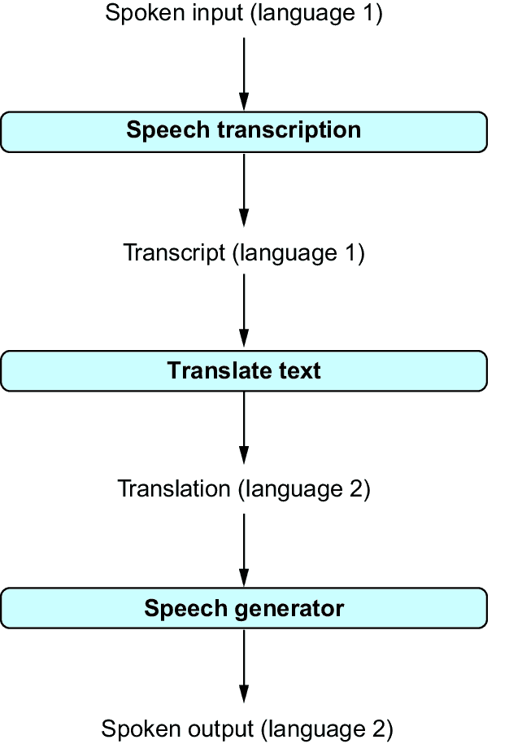

# 7 分析音频数据

### 本章涵盖

+   转录音频数据

+   翻译音频数据

+   生成语音

观看任何可信的科幻电视剧或电影，您不会看到人们通过键盘与他们的计算机交互！无论是 1960 年代发布的《星际迷航》还是《2001 太空漫游》（两者都是 1960 年代发布的），人们都是对着（而不是输入）他们的机器说话。而且有很好的理由！对于大多数用户来说，语音是最自然的交流形式（因为他们就是从那里开始的）。难怪人们早在技术上可行之前就想象与计算机说话了。

现实已经赶上了科幻小说，包括亚马逊的 Alexa、谷歌助手、微软的 Cortana（以及其他许多）在内的语音助手无处不在。最新一代的语音识别（和语音生成）模型已经达到了接近人类熟练程度的水平。当然，与计算机的基于语音的交互只是这项令人惊叹的技术的一个用例。

在本章中，我们将使用 OpenAI 的最新模型进行语音转录、翻译和语音生成，以进行几个小型项目。首先，我们将看到将语音录音转录成文本只需几行 Python 代码。之后，我们将探讨更复杂的应用，从第五章中基于语音的自然语言数据库查询界面开始。以前我们不得不输入问题，而现在我们可以简单地说话，系统将给出答案。最后，我们将看到如何构建一个同声传译器，将我们的语音输入转换成不同语言的语音输出。

## 7.1 前期准备

在我们开始所有这些酷炫的项目之前，我们需要执行一些设置步骤。首先，您需要通过计算机记录语音输入。为此，您首先需要某种麦克风。如今，大多数笔记本电脑都内置了麦克风。它不一定要是专业麦克风；任何可以在计算机上记录声音的方式都行。但除了麦克风之外，您还需要可以从 Python 激活的软件，将音频录音转换为文件。为此，我们将使用 Python 的`sounddevice`库。在终端中运行以下命令以安装此库的正确版本：

```py
pip install sounddevice==0.4
```

此库与 Python 的`scipy`库交互，您也应该安装它。在终端中运行以下命令：

```py
pip install scipy==1.11
```

这些库共同使用，将使您能够记录语音输入（然后您可以使用 OpenAI 的模型将其转录、翻译或总结）。

我们已经涵盖了输入方面，那么输出呢？对于以下的一些项目，我们不仅想听音频，还想生成它！为了生成语音，我们再次将使用 OpenAI 的生成式 AI 模型。但在将语音存储在音频文件中之后，我们仍然需要合适的库来从 Python 在我们的计算机上播放语音。我们将使用 `playsound` 库来做这件事。在终端中运行以下命令来安装这个库的正确版本：

```py
pip install playsound==1.3
```

在某些操作系统（特别是 macOS）上，你还需要使用以下命令安装 `PyObjC` 库：

```py
pip install PyObjC==10.0
```

如果你在处理上一章时还没有这样做，请安装 `requests` 库（这将使你能够直接向 OpenAI 的 API 发送请求）：

```py
pip install requests==2.31.0
```

干得好！如果你在运行这些命令时没有遇到任何错误信息，那么你的系统现在已经配置好了，可以使用 OpenAI 的 Transformer 模型处理音频数据。让我们从下一节开始我们的第一个项目。

## 7.2 转录音频文件

在香蕉公司刚刚开始你的工作后，你被会议的数量压倒了。要参加的会议实在太多了，但你又不希望错过任何重要的内容！幸运的是，香蕉公司有很好的意识，通常情况下会创建所有员工会议的音频记录（在所有与会者的同意下）。但听所有这些会议的录音仍然太耗时了。

如果能有一份会议记录，将使你能够通过简单的文本搜索快速找到与你单位相关的任何内容。不幸的是，香蕉公司并没有提供这样的记录，而且你的同事们都不愿意在那些会议中做笔记。自动创建这样的记录是否可能？在本节中，我们将看到这不仅可能，而且实际上很容易创建这样的自动化转录服务。

### 7.2.1 转录语音

对于语音转文字，我们将使用 OpenAI 的 Whisper 模型。与迄今为止我们使用的模型（特别是 GPT 模型）不同，Whisper 专门针对音频转录。

##### Whisper 模型是什么？

Whisper 是一个在大量音频记录上训练的 Transformer 模型（确切地说，超过 68 万小时的记录！）！Whisper 在一个多语言音频语料库上进行了训练，因此支持广泛的输入语言，并将其转录成英语（即，你可以在一个步骤中完成语音转录和翻译）。

与 GPT 变体类似，我们将通过 OpenAI 的 Python 库访问 Whisper。这意味着你不需要在本地机器上进行任何额外的设置（假设你已经按照第三章所述安装了 OpenAI 的 Python 库）。

在本节中，我们将使用 Whisper 模型将音频文件转录到磁盘。假设我们的音频文件最初存储在磁盘上。Whisper 支持广泛的文件格式：MP3、MP4、MPEG、MPGA、M4A、WAV 和 WEBM。在撰写本文时，文件大小限制为 25 MB。给定这样一个文件，假设其文件路径存储在变量 `audio_path` 中。现在，将内容转录为文本只需要以下几行 Python 代码：

```py
import openai
client = openai.OpenAI()

with open(audio_path, 'rb') as audio_file:  #1
     #2
    transcription = client.audio.transcriptions.create(
        file=audio_file, model='whisper-1')
```

#1 打开音频文件

#2 转录内容

作为第一步（**1**），我们需要打开我们的音频文件。为此，我们可以使用 Python 的 `open` 命令。注意 `open` 命令参数中使用了 `rb` 标志。这个标志表示我们想要读取文件（`r`）并且我们正在打开一个二进制文件（`b`）。二进制文件是不包含可读字符的文件。例如，我们试图打开的这种声音文件通常被认为是二进制文件。在处理第一行之后，文件内容可以通过变量 `audio_file` 访问。

作为第二步（**2**），我们执行实际的转录。我们现在使用一个专门针对音频数据处理的不同端点。从这个端点，我们使用两个参数调用转录服务（`transcriptions.create`）：

+   `file`—要转录的文件的引用

+   `model`—用于转录的模型名称

我们引用之前打开的文件（`audio_file`）并选择 `whisper-1` 作为我们的转录模型。转录的结果是一个包含转录文本和转录过程元数据的对象。我们可以通过 `text` 字段（即通过 `transcription.text`）访问转录的文本。在解压缩后，您应该在结果文件夹中看到三个子目录：

如您所见，转录文本只需几行 Python 代码！在下一小节中，我们将使用此代码构建一个简单的转录服务。

### 7.2.2 端到端代码

列表 7.1 展示了一个简单转录程序的代码。实际的转录发生在 `transcribe` 函数（**1**）中。这基本上是我们在上一节中讨论的代码。给定音频文件的路径作为输入，它返回转录的文本。

##### 列表 7.1 将音频文件转录为文本

```py
import argparse
import openai

client = openai.OpenAI()

def transcribe(audio_path):        #1
    """ Transcribe audio file to text.

    Args:
        audio_path: path to audio file.

    Returns:
        transcribed text.
    """
    with open(audio_path, 'rb') as audio_file:
        transcription = client.audio.transcriptions.create(
            file=audio_file, model='whisper-1')
        return transcription.text

if __name__ == '__main__':         #2

    parser = argparse.ArgumentParser()
    parser.add_argument('audiopath', type=str, help='Path to audio file')
    args = parser.parse_args()

    transcript = transcribe(args.audiopath)
    print(transcript)
```

#1 将音频转录为文本

#2 主要功能

主要功能（**2**）读取音频文件的路径（应包含语音）作为输入。在调用 `transcriptions.create` 函数后，它将在屏幕上打印转录的文本。

### 7.2.3 尝试一下

要尝试这个功能，我们首先需要一个包含录音的音频文件。只要它符合第 7.2.1 节中概述的格式和大小限制，您可以使用任何此类文件（包括您公司会议的录音，如果有的话）。然而，请注意，您需要为每分钟处理的音频数据付费！在撰写本文时，通过 OpenAI 库使用 Whisper 的费用为每分钟 0.006 美元（您可以在[`openai.com/pricing`](https://openai.com/pricing)找到更多关于定价的最新信息）。因此，处理长录音可能会很昂贵。

如果您不想使用自己的录音，请查看本书的配套网站。您可以在本章的音频项目中找到一个简短的录音。下载此录音以用于转录（默认情况下，文件名应为 QuoteFromTheAlchemist.mp3）。

列表 7.1 也可在本书的配套网站上找到（第七章的 item listing1.py）。下载后，在终端中切换到相应的仓库。假设您已将音频文件下载到当前目录，请在终端中运行以下命令以转录样本文件：

```py
python listing1.py QuoteFromTheAlchemist.mp3
```

如果一切顺利，您应该在终端中看到以下输出（针对网站上的样本文件）：

```py
Two years ago, right here on this spot, 
I had a recurrent dream, too.
```

点击样本文件自行收听；您会发现转录内容非常准确！接下来，我们将将语音转录集成到更复杂的应用中。

## 7.3 通过语音查询关系数据

分析表格数据很有趣！在 Banana 的工作中，您的大部分工作都包括仔细查看数据表，提取见解，并准备相应的报告和可视化。您正在使用第五章中介绍的文本到 SQL 接口，来自动将文本问题翻译成正式查询（用 SQL 编写），执行它们，并展示查询结果。这使得数据分析变得更容易，并且比从头开始编写复杂的 SQL 查询要快。

然而，存在一个问题：您在分析数据时，在办公室来回走动时思考得更好。但是，每次键入查询都会让您回到办公桌前。我们能否修改我们的查询界面，使其接受语音输入，而不是键盘输入？事实证明，我们确实可以！在本节中，我们将了解如何使用 OpenAI 的模型为表格数据启用简单的语音查询界面。

### 7.3.1 前期准备

我们将构建一个处理表格数据语音问题的语音查询界面。它是第五章中讨论的查询界面的扩展。我们假设语音问题指的是存储在 SQLite 中的数据，SQLite 是一个流行的关系数据查询处理系统。请参阅第五章以获取 SQLite 的简要介绍和安装说明。要尝试以下代码，您首先需要安装 SQLite 数据库系统。

SQLite 系统处理以 SQL（结构化查询语言）表述的查询。幸运的是，你不需要自己编写 SQL 查询（我们将使用语言模型来为我们编写这些 SQL 查询）。然而，语言模型并不完美，有时可能会产生错误的查询。为了识别这些情况，具备一定程度的 SQL 背景是有用的。你将在第五章中找到 SQL 的简要介绍。更多详情，请参阅[www.databaselecture.com](http://www.databaselecture.com)。

我们的语音查询界面处理口语问题，因此你需要确保你的麦克风正在工作。此外，为了执行以下代码，请确保你的语音查询界面拥有访问麦克风的全部所需权限。

### 7.3.2 概述

我们的语音查询界面处理存储在 SQLite 数据库中的表格数据上的口语问题。例如，加载了一个包含关于电脑游戏销售数据的数据库后，我们可以提出如下问题：

+   “Activision 在 2023 年卖出了多少款游戏？”

+   “2019 年至 2021 年之间发布了多少款动作游戏？”

在接收到一个口语问题后，语音查询界面执行以下步骤：

1.  将口语问题转录成文本

1.  将文本问题翻译成 SQL 查询

1.  使用 SQLite 处理数据上的 SQL 查询

1.  向用户显示查询结果

图 7.1 更详细地说明了不同的处理步骤。这个过程为每个口语问题执行。


##### 图 7.1 我们的语音查询界面将口语问题转录成文本，将文本问题翻译成 SQL 查询，并最终处理这些查询并显示查询结果。

### 7.3.3 录制音频

对于我们的转录应用程序，我们假设已经有一个音频录音可用。对于我们的新项目，我们希望反复发出语音查询。这意味着我们必须自己录制它们。我们如何在 Python 中做到这一点？首先，我们需要导入两个库，专门用于这个目的：

```py
import sounddevice       #1
import scipy.io.wavfile  #2
```

#1 录制音频

#2 存储.wav 文件

`sounddevice`库（**1**）包含许多用于从麦克风录制音频输入的有用函数。我们将如何处理我们的录音？我们将把它们作为.wav 文件存储在磁盘上。在前一节中，我们看到了如何转录存储在该格式的音频数据。这就是第二个库（**2**），`scipy`发挥作用的地方：它使我们能够将录音以.wav 格式存储在磁盘上。

在录制时，我们需要做出两个重要的选择：

+   我们应该以什么采样率从麦克风读取输入？

+   我们应该录制多少秒的语音？

我们将记录 5 秒钟。5 秒钟对于大多数语音查询应该足够了。如果你发现录音太早结束，或者你在完成语音查询后经常等待，你可以尝试不同的设置。更复杂的实现会持续录音或检测到说话暂停后停止录音。为了简化录音机制，我们将为每个语音查询预先设定记录时间。

对于采样率——即每秒存储的音频数据点数量——我们将选择 44,100 赫兹。这是 CD 质量录音的标准。总帧数——接收到的总音频数据点数量——是我们要记录的秒数（在我们的例子中是 5 秒）的 44,100 倍。我们将帧数和采样率存储在辅助变量中：

```py
sample_rate = 44100
nr_frames = 5 * sample_rate
```

现在我们可以使用`sounddevice`库的`rec`函数开始录制：

```py
recording = sounddevice.rec(                   #1
    nr_frames, samplerate=sample_rate, channels=1)
sounddevice.wait()                             #2
```

#1 设置录制

#2 等待录制完成

第一个命令（**1**）从输入麦克风开始录制，提供要录制的总帧数以及采样率。通道数（我们调用中的第三个参数）取决于用于录制的麦克风。如果你的麦克风有多个通道，请在这里尝试更高的值。开始录制后，我们只需等待预定录制时间过去。我们通过`wait`命令（**2**）实现这一点。

执行前面的代码后，变量`recording`包含录制的音频数据。如前所述，我们希望将录音存储为磁盘上的.wav 文件。只需`scipy`库的单个命令即可完成：

```py
scipy.io.wavfile.write(output_path, sample_rate, recording)
```

就这样！我们已经录制了几秒钟的音频输入，并将其存储在磁盘上的文件中。

### 7.3.4 端到端代码

列表 7.2 显示了我们的语音查询界面的代码。除了我们的默认库`openai`和`argparse`之外，我们导入（**1**）音频处理库（`sounddevice`和`scipy`），以及`sqlite3`库（我们将需要它来处理 SQL 查询）和`time`库。后一个库是等待指定时间（语音输入）所必需的。接下来，我们将讨论列表 7.2 中引入的函数。

##### 列表 7.2 使用语音命令查询 SQLite 数据库

```py
import argparse  #1
import openai
import re
import scipy.io.wavfile
import sounddevice
import sqlite3
import time

client = openai.OpenAI()

def get_structure(data_path):               #2
    """ Extract structure from SQLite database.

    Args:
        data_path: path to SQLite data file.

    Returns:
        text description of database structure.
    """
    with sqlite3.connect(data_path) as connection:
        cursor = connection.cursor()
        cursor.execute("select sql from sqlite_master where type = 'table';")
        table_rows = cursor.fetchall()
        table_ddls = [r[0] for r in table_rows]
        return '\n'.join(table_ddls)

def record(output_path):                 #3
    """ Record audio and store in .wav file. 

    Args:
        output_path: store audio recording there.
    """
    sample_rate = 44100
    nr_frames = 5 * sample_rate
    recording = sounddevice.rec(
        nr_frames, samplerate=sample_rate, channels=1)
    sounddevice.wait()
    scipy.io.wavfile.write(output_path, sample_rate, recording)

def transcribe(audio_path):        #4
    """ Transcribe audio file to text.

    Args:
        audio_path: path to audio file.

    Returns:
        transcribed text.
    """
    with open(audio_path, 'rb') as audio_file:
        transcription = client.audio.transcriptions.create(
            file=audio_file, model='whisper-1')
        return transcription.text

def create_prompt(description, question):        #5
    """ Generate prompt to translate question into SQL query.

    Args:
        description: text description of database structure.
        question: question about data in natural language.

    Returns:
        prompt for question translation.
    """
    parts = []
    parts += ['Database:']
    parts += [description]
    parts += ['Translate this question into SQL query:']
    parts += [question]
    parts += ['SQL Query:']
    return '\n'.join(parts)

def call_llm(prompt):                             #6
    """ Query large language model and return answer.

    Args:
        prompt: input prompt for language model.

    Returns:
        Answer by language model.
    """
    for nr_retries in range(1, 4):
        try:
            response = client.chat.completions.create(
                model='gpt-4o',
                messages=[
                    {'role':'user', 'content':prompt}
                    ]
                )
            return response.choices[0].message.content
        except:
            time.sleep(nr_retries * 2)
    raise Exception('Cannot query OpenAI model!')

def process_query(data_path, query):        #7
    """ Processes SQL query and returns result.

    Args:
        data_path: path to SQLite data file.
        query: process this query on database.

    Returns:
        query result.
    """
    with sqlite3.connect(data_path) as connection:
        cursor = connection.cursor()
        cursor.execute(query)
        table_rows = cursor.fetchall()
        table_strings = [str(r) for r in table_rows]
        return '\n'.join(table_strings)

if __name__ == '__main__':   #8

    parser = argparse.ArgumentParser()
    parser.add_argument('dbpath', type=str, help='Path to SQLite data')
    args = parser.parse_args()

    data_structure = get_structure(args.dbpath)

    while True:  #9

        user_input = input('Press enter to record (type quit to quit).')
        if user_input == 'quit':
            break

        audio_path = 'question.wav'  #10
        record(audio_path)
        question = transcribe(audio_path)
        print(f'Question: {question}')

        prompt = create_prompt(data_structure, question)  #11
        answer = call_llm(prompt)
        query = re.findall('"`sql(.*)"`', answer, re.DOTALL)[0]
        print(f'SQL: {query}')

        try:                                       #12
            answer = process_query(args.dbpath, query)
            print(f'Answer: {answer}')
        except:
            print('Error processing query! Try to reformulate.')
```

#1 导入库

#2 提取数据库模式

#3 录制音频

#4 转写音频

#5 创建文本到 SQL 提示

#6 翻译为 SQL

#7 处理 SQL 查询

#8 处理语音查询

#9 主循环

#10 转写语音输入

#11 SQL 翻译

#12 执行 SQL 查询

我们处理指向关系数据库中数据的语音查询。要将语音命令翻译成以 SQL 形式表述的正式查询，我们需要了解一些数据库结构的知识。特别是，我们需要知道数据表和它们的列的名称（即，我们需要知道数据库模式）。函数`get_structure`（**2**）检索创建数据库模式的命令。这些命令包含表和列的名称，以及与表列关联的数据类型。我们将使用这些命令作为提示的一部分，指导语言模型将问题翻译成 SQL 查询。

在我们可以将问题翻译之前，我们首先需要从麦克风录制它们。这就是函数`record`（**3**）发挥作用的地方。它使用`sounddevice`库从麦克风录制 5 连续秒的音频输入。生成的音频录音以.wav 文件的形式存储在磁盘上，路径由函数输入（参数`output_path`）指定。严格来说，将音频输入存储为文件不是必要的（我们可以直接在内存中处理它）。然而，将音频输入存储在磁盘上对于调试目的可能很有用。如果我们系统无法将语音输入翻译成适当的查询，我们可以自己听音频文件来评估背景噪声水平和整体音频质量。如果麦克风设置不当（一个常见问题），我们的音频文件将只包含静音。

在从麦克风录制输入之后，我们首先希望将语音输入转录成文本。我们使用`transcribe`函数（**4**）来完成这项工作。给定音频文件的路径（在这种情况下，来自麦克风的录音音频输入），它返回使用 OpenAI 的 Whisper 模型（我们之前使用过的同一个模型）生成的转录文本。

接下来，我们希望将问题翻译成正式的 SQL 查询。当然，我们将使用语言模型来完成这项任务。`create_prompt`函数（**5**）生成一个合适的提示。提示包含之前提取的数据库描述、转录的问题和任务描述。`call_llm`函数（**6**）调用 GPT-4o，根据之前提到的提示将问题翻译成查询。最后，`process_query`函数（**7**）在数据库上处理生成的查询并返回查询结果。

是时候将所有这些整合在一起了！我们的语音查询界面以 SQLite 数据库文件的路径作为输入（**8**）。在提取数据库模式后，我们进入主循环（**9**）。每次迭代处理一个语音查询（除非用户输入 `quit`，在这种情况下程序将终止）。为了简化问题，我们在记录语音输入之前等待用户按下 Enter 键（一个更复杂的版本会持续记录）。之后，我们从麦克风记录语音输入。我们打印出转录的问题，并将录音本身作为 question.wav 存储在磁盘上（**10**）。接下来，我们将转录的文本翻译成查询（**11**），执行它（**12**）（如果查询不正确，我们需要异常处理！），并将结果展示给用户。

### 7.3.5 尝试一下

列表 7.2 是第七章节在本书网站上的第 2 个列表。下载代码，并在终端中切换到包含文件夹。

除了代码之外，我们还需要一个 SQLite 数据库来尝试我们的语音查询界面。在第五章中，我们讨论了如何设置一个包含有关电脑游戏销售信息的示例数据库。我们假设这个数据库存储在与你的代码相同的文件夹中，命名为 games.db（当然，你可以自由使用任何你喜欢的 SQLite 数据库来尝试语音查询界面）。现在在终端中输入以下命令：

```py
python listing1.py games.db
```

将数据库文件的路径更新为你想要访问的路径。根据你的操作系统和安全设置，你可能需要为你的应用程序启用麦克风访问。在启用麦克风访问后，按 Enter 键，提出一个问题！例如，使用游戏数据库，你可以问“2007 年卖出了多少款游戏？”或者“每个游戏类型都发布了多少款游戏？”你应该看到如下输出：

```py
Press enter to record (type quit to quit).
Question: How many games were released for each genre?
SQL: SELECT genre, COUNT(*) as num_games
FROM games
GROUP BY genre
Answer: ('Action', 3316)
('Adventure', 1286)
('Fighting', 848)
('Genre', 1)
('Misc', 1739)
('Platform', 886)
('Puzzle', 582)
('Racing', 1249)
('Role-Playing', 1488)
('Shooter', 1310)
('Simulation', 867)
('Sports', 2346)
('Strategy', 681)
```

此输出包括转录的问题、翻译的 SQL 查询以及查询结果（如果查询无法执行，则为错误消息）。显然，从语音问题到查询结果还有很长的路要走！在录音、转录或翻译中出现的错误会导致结果不正确。在信任查询结果之前，请务必检查附加输出以验证系统没有犯任何错误。

提示：如果你的语音界面只产生无意义的内容，请检查 question.wav 中的录音。如果你什么也听不到，请确保你的应用程序有权访问你的麦克风。默认情况下，应用程序通常没有访问麦克风的权限（这使得恶意软件更难监视你）。你需要更新你的安全设置以启用访问。

## 7.4 语音到语音翻译

巴黎的香蕉分支已经开始研究语言模型以及其在数据科学任务中的潜在应用。你在该领域的本地专家声誉日益增长，你的经理要求你向法国团队提供如何开始的建议。但有一个小问题：你不会说法语。当听说香蕉巴黎的员工会议大多用法语进行时，你正准备拒绝这项任务。但经过思考，你意识到这可能并不是一个不可逾越的障碍。尽管你不会说法语，但 GPT-4o 肯定可以！能否使用语言模型为你进行翻译？

你确实可以使用语言模型在多种语言之间进行翻译。在本节中，我们将创建一个翻译工具，它接受第一语言的口语输入并产生第二语言的口语输出。因为该工具产生口语输出，你甚至不需要学习法语发音。只需说英语，等待工具生成口语翻译。这样，你可以在与法国同事合作的同时，同时展示最先进语言模型的能力！

### 7.4.1 概述

我们的翻译工具处理口语输入。和之前一样，我们将使用 OpenAI 的 Whisper 模型将输入语音转录成文本。然后，我们将使用 GPT-4o 模型将文本翻译成另一种语言。在我们的示例场景中，我们使用法语作为目标语言。然而，由于 GPT-4o 等模型惊人的灵活性，我们的工具不会仅限于这一点！我们的工具将使用户能够指定目标语言作为输入，用作提示语言模型进行翻译的文本片段。

在生成文本翻译之后，我们还想生成一个口语版本。结果证明，我们可以使用另一个 OpenAI 模型将文本转换为各种语言的口语输出。图 7.2 展示了完整的处理流程，从第一语言的口语输入开始，到第二语言的口语输出结束。



##### 图 7.2 我们的翻译工具记录第一语言的口语输入，将输入转录成文本，将文本翻译成第二语言，并最终生成口语输出。

### 7.4.2 生成语音

图 7.2 中的流程需要几个转换。我们已经在之前的章节中看到了如何将口语输入转录成文本。通过语言模型进行文本翻译相对简单（让 GPT-4o 将一种语言翻译成另一种语言，它就会这样做）。我们仍然缺少将书面文本（例如，法语）转换为口语输出的方法。我们将在下一节讨论如何做到这一点。

OpenAI（以及其他提供商）提供多种文本到语音（TTS）模型。此类模型以书面文本为输入，生成语音输出。以下代码片段为文本字符串（存储在变量 `speech_text` 中）生成语音：

```py
import openai
client = openai.OpenAI()

response = client.audio.speech.create(
    model='tts-1', voice='alloy', 
    input=speech_text)
```

在这个例子中，我们使用了一个新的端点（`audio.speech`）并使用三个参数配置了 `create` 方法：

+   `model`—用于生成语音输出的模型名称。我们使用 OpenAI 的 `tts-1` 文本到语音模型。

+   `input`—为这段文本生成语音输出。提交任何模型支持的语言中的文本（[`github.com/openai/whisper`](https://github.com/openai/whisper)）。

+   `voice`—我们可以选择不同的语音进行语音输出。在这里，我们使用 `alloy`。

那就是通过 OpenAI 生成语音输出的所有所需内容！我们已经知道如何转录语音以及如何在不同语言之间翻译文本，因此我们现在拥有了编写翻译工具所需的一切。

##### 关于定价呢？

在撰写本文时，OpenAI 使用 TTS 模型进行文本生成时，每 1,000 个标记收费 1.5 美分，而高质量版本（TTS HD）则是这个价格的两倍。这些价格可能会随时间变化，因此请务必查看 OpenAI 的定价网站 ([`openai.com/pricing`](https://openai.com/pricing)) 以获取最新信息。

### 7.4.3 端到端代码

列表 7.3 展示了我们翻译工具的完整代码。让我们首先讨论它导入的库（**1**）。除了每个项目至今包含的 `openai` 和 `argparse` 库之外，我们还导入了 `sounddevice` 和 `scipy` 以记录和存储音频文件，以及 `time` 库以限制录音时间。

##### 列表 7.3 将语音输入翻译为不同语言

```py
import argparse  #1
import openai
import playsound
import requests
import scipy.io.wavfile
import sounddevice
import time

client = openai.OpenAI()

def record(output_path):                 #2
    """ Record audio and store in .wav file. 

    Args:
        output_path: store audio recording there.
    """
    sample_rate = 44100
    nr_frames = 5 * sample_rate
    recording = sounddevice.rec(
        nr_frames, samplerate=sample_rate, channels=1)
    sounddevice.wait()
    scipy.io.wavfile.write(output_path, sample_rate, recording)

def transcribe(audio_path):        #3
    """ Transcribe audio file to text.

    Args:
        audio_path: path to audio file.

    Returns:
        transcribed text.
    """
    with open(audio_path, 'rb') as audio_file:
        transcription = client.audio.transcriptions.create(
            file=audio_file, model='whisper-1')
        return transcription.text
 #4
def create_prompt(to_translate, to_language):
    """ Generate prompt to translate text to target language.

    Args:
        to_translate: translate this text.
        to_language: translate text to this language.

    Returns:
        Translated text.
    """
    parts = []
    parts += [f'Translate this text to {to_language}:']
    parts += [to_translate]
    parts += ['Translated text:']
    return '\n'.join(parts)

def call_llm(prompt):                             #5
    """ Query large language model and return answer.

    Args:
        prompt: input prompt for language model.

    Returns:
        Answer by language model.
    """
    for nr_retries in range(1, 4):
        try:
            response = client.chat.completions.create(
                model='gpt-4o',
                messages=[
                    {'role':'user', 'content':prompt}
                    ]
                )
            return response.choices[0].message.content
        except:
            time.sleep(nr_retries * 2)
    raise Exception('Cannot query OpenAI model!')

def generate_speech(speech_text):    #6
    """ Generates speech for given text.

    Args:
        speech_text: generate speech for this text.

    Returns:
        query result.
    """
    response = client.audio.speech.create(
        model='tts-1', voice='alloy', 
        input=speech_text)
    return response.content

if __name__ == '__main__':        #7

    parser = argparse.ArgumentParser()
    parser.add_argument('tolanguage', type=str, help='Target language')
    args = parser.parse_args()

    while True:  #8

        user_input = input('Press enter to record (type quit to quit).')
        if user_input == 'quit':
            break

        audio_path = 'to_translate.wav'  #9
        record(audio_path)
        to_translate = transcribe(audio_path)
        print(f'Original text: {to_translate}')
         #10
        prompt = create_prompt(to_translate, args.tolanguage)
        translated = call_llm(prompt)
        print(f'Translated text: {translated}')

        speech = generate_speech(translated)    #11
        with open('translation.mp3', 'wb') as file:
            file.write(speech)

        playsound.playsound('translation.mp3')  #12
```

#1 导入库

#2 录制音频

#3 转录音频

#4 生成翻译提示

#5 使用语言模型

#6 生成语音

#7 将语音翻译为语音

#8 主循环

#9 转录输入

#10 翻译为目标语言

#11 生成语音输出

#12 播放生成的语音

使用 `playsound` 库播放 OpenAI 模型生成的音频文件。因为我们通过 OpenAI 的 HTTP 接口生成语音，所以我们导入 `requests` 库来创建 HTTP 请求。接下来，我们将讨论列表 7.3 中使用的函数。

与之前的项目一样，我们从麦克风录制音频数据。`record` 函数（**2**）记录 5 秒的音频输入并将其存储到磁盘上的 .wav 文件中。`transcribe` 函数（**3**）将音频输入转录为文本。这两个函数在本章之前的项目中已有详细讨论。

`create_prompt`函数（**4**）生成用于翻译的提示。与先前的项目一样，提示包含任务描述以及所有相关输入数据。在这种情况下，我们希望将初始语言（英语）翻译为目标语言（法语）。请注意，目标语言作为输入参数（`to_language`）指定。此输入参数对应于描述所需输出语言的文本片段。在最简单的情况下，这可以是语言名称（例如，“法语”）。另一方面，用户可以请求特定的方言（例如，“带有施瓦本方言的德语”）或风格（例如，“莎士比亚风格的英语”）。目标语言被整合到提示中出现的任务描述中，以及要翻译的文本。

注意，我们不需要指定输入语言。我们假设语言模型能够识别输入文本的语言（否则，我们无法期望模型进行翻译）。

在使用提示调用`call_llm`函数（**5**）后，我们应该获得翻译后的文本。`generate_speech`函数（**6**）使用我们在上一节中讨论的方法生成相应的语音。

翻译应用（**7**）期望输入一个描述目标语言的文本。此参数是一个字符串，可以包含任意文本。它只是简单地替换了用于翻译的提示中的占位符。在主循环（**8**）中，用户按下 Enter 键进行语音输入或输入`quit`以终止应用。

在记录用户输入时，我们首先使用`transcribe`函数（**9**）转录输入之前，将 5 秒的音频录音存储在名为 to_translate.wav 的文件中。之后，我们使用 GPT-4o 将输入翻译为目标语言（**10**），然后从翻译中生成语音（**11**）。我们将生成的语音作为磁盘上的.mp3 文件存储（这意味着我们可以轻松地再次听到最后一个输出）并最终使用`playsound`库——正如你所猜到的——播放生成的声音文件。

### 7.4.4 尝试运行

是时候尝试我们的翻译器了！您可以在配套网站上找到代码，在第七章的列表 3 中。下载代码，并在终端中切换到包含文件夹。我们可以选择我们的目标语言进行翻译。当然，翻译的质量和声音输出可能因选择而异。特别是，我们用于转录的模型以及我们用于语音生成的模型支持大约 60 种常见语言。在不太常见的语言中转录音频输入或生成音频输出可能会失败。请在网上查看当前支持的转录语言列表（[`help.openai.com/en/articles/7031512-whisper-api-faq`](https://help.openai.com/en/articles/7031512-whisper-api-faq)）以及语音生成（[`platform.openai.com/docs/guides/text-to-speech`](https://platform.openai.com/docs/guides/text-to-speech)）。目前，与这一节开头的场景保持一致，我们将选择法语作为目标语言。在终端中，输入以下命令以启动我们的翻译器：

```py
python listing3.py "French"
```

严格来说，单词“French”周围的引号是不必要的。然而，由于我们可以输入多词描述所需的目标语言，我们将在以下示例中使用引号，以避免控制台错误地将我们的输入解释为多个参数的值。

就像我们之前的项目一样，我们需要给我们的应用程序访问麦克风的权限。如果您被要求访问麦克风，请点击“是”；如果没有，请确保安全设置允许这样做。以下是从我们与翻译工具的对话中摘录的内容：

```py
Press enter to record (type quit to quit).
Original text: Hello my colleagues in Paris.
Translated text: Bonjour mes collègues à Paris.
Press enter to record (type quit to quit).
Original text: Let me teach you something 
about language models.
Translated text: Laisse-moi t'apprendre 
quelque chose à propos des modèles de langage.
```

您可以看到转录的输入和生成的翻译。您还应该听到翻译的口语版本（如果没有，请检查您的音频输出设置）。对于几行 Python 代码来说，这已经很不错了！

将内容翻译成法语似乎是我们翻译工具的一个合理用例。然而，它可能不是“乐趣因素”最高的一个。让我们尝试一些不同的事情，以展示语言模型的灵活性：让我们看看我们是否可以将音频输入“翻译”成高度精炼的版本。在终端中，输入以下指令：

```py
python listing3.py "English in the style of Shakespeare"
```

这是我们将简单的问候语翻译成更精致版本（可能是一堂语言模型课程的良好介绍，针对我们的美国同事在 Banana 公司）的结果：

```py
Press enter to record (type quit to quit).
Original text: Hello, my dear colleagues.
Translated text: Hark, my fair allies, I bid thee well met!
Press enter to record (type quit to quit).
Original text: Let me teach you 
something about language models.
Translated text: Pray, lend me thine ear 
as I shalt educate thee on language models.
```

尝试更多目标语言！可能性几乎是无限的。

## 摘要

+   OpenAI 的 Whisper 模型可以将语音输入转录成文本。

+   通过音频转录端点访问转录功能。

+   转录的价格基于分钟数。

+   OpenAI 提供多种模型，用于将文本生成语音。

+   您可以选择生成语音的语音和音质。

+   语音生成定价取决于令牌数量。
