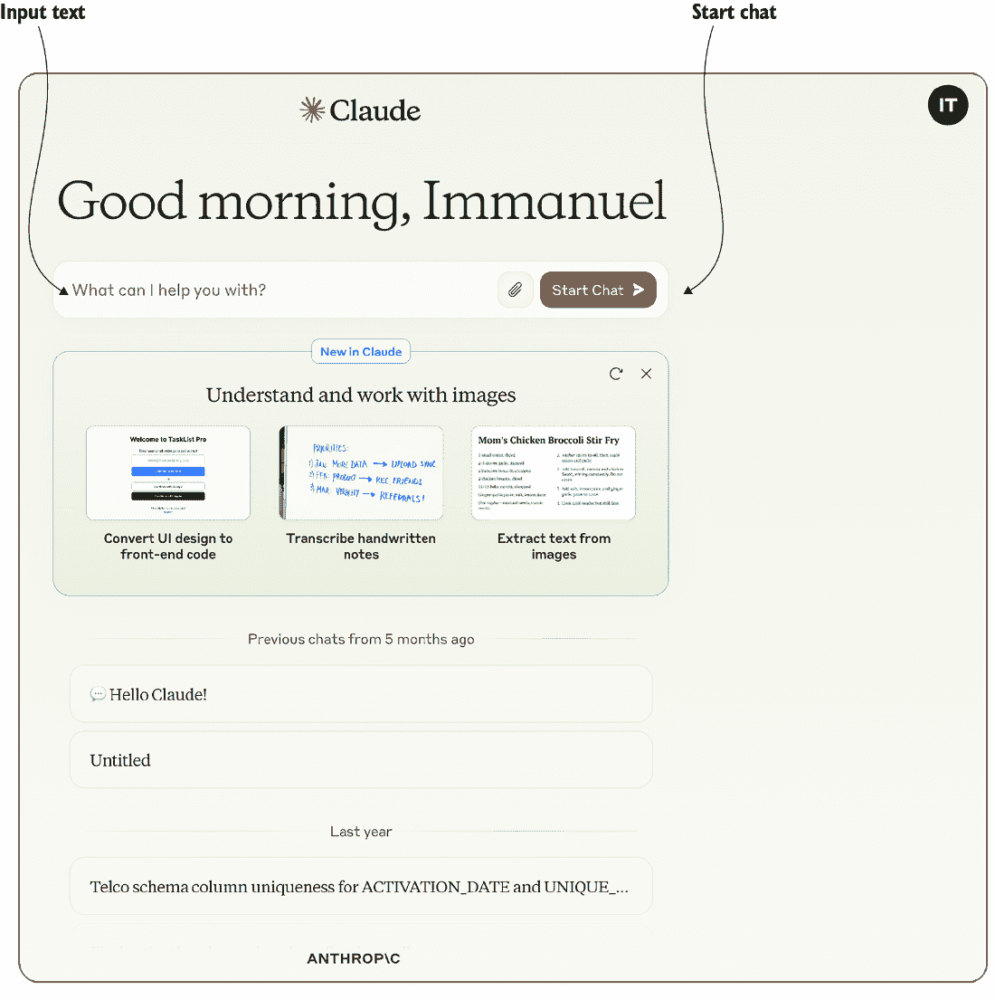
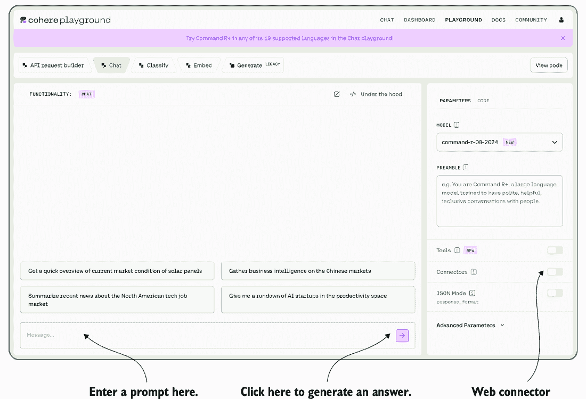
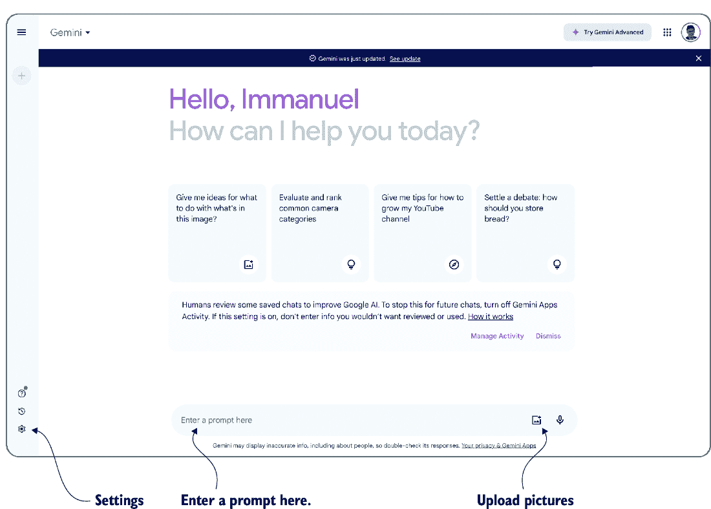

# 8 个 GPT 替代品

### 本章涵盖

+   Claude，来自 Anthropic

+   命令 R+，来自 Cohere

+   Bard，来自 Google

+   Hugging Face 的模型

是时候见一见 GPT 的“朋友们”了！到目前为止，我们一直专注于 GPT 和其他 OpenAI 模型。但 OpenAI 并非市场上唯一的游戏。恰恰相反：我们目前正在见证语言模型的“寒武纪大爆发”，每周都有新的模型涌现。在使用语言模型进行生产之前，您想要确保使用最适合您任务的模型。在本章中，我们将探讨许多 OpenAI 的替代品，并讨论不同模型的优缺点以及如何使用它们。

几乎所有现代语言模型都基于类似的架构（Transformer 架构）。然而，不同提供商的模型可能在训练方式、文本表示方式或提供和定价方式上有所不同。所有这些因素都可能影响您特定任务的处理费用和输出质量。像 GPT-4o 这样的模型功能强大，几乎可以解决任何任务。但这种通用性是有代价的：如果有一个小型、专门针对您感兴趣的任务训练的模型，使用这样的模型可能非常合适。

您将在接下来的章节中注意到，我们讨论的许多模型可以通过与 OpenAI 接口类似的界面访问。这对您来说是个好消息：每次想要尝试不同的模型时，无需进入一个全新的复杂框架！有了这个，我们就开始探索 GPT 的替代品。

##### 为什么我的首选模型没有列出？

如果您的首选模型或模型提供商在本章中没有列出，请不要慌张！随着提供商和模型数量的增加，全面概述所有可用模型已经变得不可能。如果一个模型没有包括在这里，并不意味着它不能成为您任务的最佳替代品。不同提供商的界面通常相似，因此您仍然可以使用到目前为止所学到的知识来轻松使用其他模型。此外，请注意，我们在本章中按字母顺序列出模型提供商。不要从那中推断出任何优先级（我们不是先讨论最好的提供商）。

## 8.1 Anthropic

许多艾萨克·阿西莫夫（Isaac Asimov）的作品，他是史上最富产的科幻作家之一，其故事围绕“机器人三大定律”及其解释展开：

1.  机器人不得伤害人类，或者通过不作为，让人类受到伤害。

1.  机器人必须服从人类给予的命令，除非这些命令与第一定律相冲突。

1.  机器人必须保护自己的存在，只要这种保护不与第一或第二定律相冲突。

此处的目标是制定一套简洁的指导方针，确保机器人既有用又无害。无论之前提到的法律是否提供了灵感，这一想法都与 Anthropic 生产的语言模型相联系，Anthropic 是另一家大规模语言模型的提供商。

Anthropic，成立于 2021 年（由几位前 OpenAI 成员创立），反复强调“宪法 AI” [1] 这一独特理念，与其他模型相比。简而言之，这意味着在训练模型以向用户提供准确且无冒犯性的答案时，我们依赖一组小规则——可以说是一份“宪法”——来评判答案的质量。我们不是依赖人类测试员在训练过程中对模型生成的答案进行标记，而是采用第二个 AI，负责根据宪法评估前者的答案。

在撰写本文时，Claude 3.5（指代令人惊叹的 Claude Shannon）是 Anthropic 发布的最新模型。在本节中，我们将通过（你猜对了）一个网页界面和 Python 库来尝试使用 Claude。

### 8.1.1 与 Claude 聊天

我们将与 Claude（目前版本为 3.5）进行简短聊天，以了解其功能。首先，访问 Anthropic 网站[www.anthropic.com](http://www.anthropic.com)，然后点击“与 Claude 聊天”按钮。

除非你之前已经创建了 Anthropic 账户，否则你将被要求提供电子邮件地址和电话号码。在验证你的数据后，你应该能看到 Claude 的聊天界面，如图 8.1 所示。



##### 图 8.1 Anthropic 聊天机器人 Claude 的网页界面

界面非常直观：只需在相应的字段中输入文本，然后点击右侧的按钮开始聊天！可以从友好的问候语开始，聊聊天气，或者尝试使用 Claude 解决第二章的一些任务（例如，根据情感对评论进行分类或把问题翻译成 SQL 查询）。

### 8.1.2 Python 库

假设你已经创建了 Anthropic 的账户，你可以在以下 URL 创建密钥：[`console.anthropic.com/settings/keys`](https://console.anthropic.com/settings/keys)。务必在创建后复制你的访问密钥（因为之后你将无法再次访问它）！

获得访问密钥后，转到终端并运行以下命令：

```py
pip install anthropic==0.28
```

这将安装 Anthropic Python 库。如果你熟悉 OpenAI 的 Python 库（并且在你阅读了前面的章节后，你很可能熟悉），你应该会很快习惯 Anthropic 库。

例如，以下列表展示了使用 Claude 回答问题的 Python 代码。当然，这段代码并不能做通过网页界面做不到的事情。其目的只是展示通过 Python 接口使用 Claude 是多么简单。

##### 列表 8.1 使用 Anthropic 的 Claude 模型回答问题

```py
import argparse
from anthropic import Anthropic

if __name__ == '__main__':

    parser = argparse.ArgumentParser()                  #1
    parser.add_argument('ai_key', type=str, help='Anthropic access key')
    parser.add_argument('question', type=str, help='A question for Claude')
    args = parser.parse_args()

    anthropic = Anthropic(api_key=args.ai_key)  #2

    completion = anthropic.messages.create(  #3
        model='claude-3-5-sonnet-20241022', 
        max_tokens=100,
        messages=[
            {
                'role':'user', 
                'content':args.question
             }])

    print(completion.content)  #4
```

#1 定义参数

#2 配置 Anthropic

#3 使用 Claude 进行完成

#4 打印完成结果

作为输入参数（**1**），我们使用 Anthropic 访问密钥和我们想要回答的问题。类似于 OpenAI 的库，我们使用访问密钥（**2**）配置访问。之后，我们可以构建 Claude 的完成提示（**3**）。

使用 Anthropic 的`anthropic.messages`端点，我们指定要使用的模型 ID（`claude-3-5-sonnet-20241022`是撰写本文时的 Anthropic 最新模型）和完成的最大令牌数（使用`max_tokens`参数）。类似于 OpenAI 的聊天模型，Claude 是为用户与模型之间的聊天而设计的。因此，Claude 的输入是一个包含消息的列表（在这个特定场景中只包含一个元素）。我们在`content`字段中获取 Claude 提示完成的成果（我们打印**4**）。

您可以在配套网站上找到这个列表作为 Anthropic 条目。要执行它，请打开您的终端，切换到包含文件夹。然后，执行以下命令：

```py
python anthropic_claude.py ... "What is constitutional AI?"
```

将三个点替换为您的 Anthropic 访问密钥。在执行程序时，您应该会看到由 Anthropic 模型生成的对您问题的回答。

## 8.2 Cohere

我们在第二章中简要讨论了幻觉。本质上，当语言模型因为无法访问与当前任务相关的数据而编造内容时，就会发生幻觉。加拿大初创公司 Cohere 特别强调使用一种称为*grounding*的方法来避免这种幻觉。将语言模型的答案 grounding 意味着将其与真实数据联系起来，从而降低“基于现实之外的创造性输出”的可能性。

Cohere 支持广泛的连接器，使其模型能够访问外部数据。例如，支持网络搜索，以及访问各种数据库。内部，Cohere 访问这些数据源，并为语言模型提供针对请求定制的信息。但更好的是，Cohere 会向您展示用于生成您答案的所有数据源。如果您是那种怀疑型的人（在涉及语言模型的答案时，您通常应该是），您可以跟进参考文献并验证它们是否支持生成的答案。

让我们看看这一切在实际中是如何工作的。现在是时候与 Cohere 的 Command R+模型聊天了！

### 8.2.1 与 Command R+聊天

在撰写本文时，Command R+是 Cohere 的最新模型之一。像往常一样，您可以通过 Web 界面尝试它，并在处理大量数据时通过 Python 使用它。首先，我们将尝试 Web 界面。为此，请访问[`cohere.com/`](https://cohere.com/)，并点击“立即尝试”。注册账户后，点击“游乐场”。您应该能在图 8.2 中看到 Web 界面。



##### 图 8.2 与 Cohere 的语言模型 Command R+聊天的 Web 界面

图 8.2 展示了如何输入你的提示以及生成答案的按钮。那么右侧的窗口（包含 Web 连接器按钮）是做什么的呢？这就是你指定在生成回复时使用的连接器的地方。连接器使 Cohere 能够访问外部数据源。我们可以通过切换相应的按钮来激活（或停用）网络连接器。这个连接器使 Cohere 能够查询网络，类似于我们尝试回答涉及事实知识难题时所做的那样。试一试，看看如果激活或停用网络连接器，事实问题的回复会有何变化！

##### 什么是 RAG？

你可能已经注意到 Cohere 的网站显著宣传了 *RAG*，但那是什么意思呢？RAG 代表检索增强生成。这意味着在生成答案时，我们通过从外部源检索的数据来增强语言模型使用的输入。

### 8.2.2 Python 库

Cohere 提供了一个类似于我们在前几节中看到的 Python 库。在终端中输入以下命令来安装所需的库：

```py
pip install cohere==4.43
```

列表 8.2（作为网站上的 Cohere 项目提供）包含一个简单问答界面的代码。用户在命令行中输入他们的访问密钥和问题。访问 [`dashboard.cohere.com/api-keys`](https://dashboard.cohere.com/api-keys) 获取你的访问密钥。在列表 8.2 中，在用访问密钥配置 Cohere 库（**1**）之后，我们使用 Cohere 库生成答案（**2**）。注意在调用 `chat` 函数时对 `connectors` 的引用！在这里，我们指定了一个连接器列表，使 Cohere 的模型能够访问外部数据源。连接器被指定为一个列表（即，我们可以启用对多个连接器的访问，而不仅仅是单个连接器）。在这里，我们使用 ID 为 `web-search` 的连接器（这就是我们在前一个章节中通过网页界面使用的同一个网络搜索连接器）。

最后（**3**），我们打印出模型生成的答案以及生成答案时咨询的网页源列表（包括检索这些文档所发出的查询）。这使我们能够验证生成的答案确实是由源材料暗示的。

##### 列表 8.2 使用 Cohere 的 Python 库回答问题

```py
import argparse
import cohere

if __name__ == '__main__':

    parser = argparse.ArgumentParser()
    parser.add_argument('ai_key', type=str, help='Cohere access key')
    parser.add_argument('question', type=str, help='Answer this question')
    args = parser.parse_args()

    client = cohere.Client(args.ai_key)  #1
     #2
    prompt = f'Answer this question: {args.question}'
    result = client.chat(prompt, connectors=[{'id': 'web-search'}])
     #3
    print(f'Answer: result.text')
    print(f'Web searches: result.search_results')
    print(f'Web results: result.documents')
```

#1 配置访问

#2 使用 Cohere 生成答案

#3 打印答案和引用

让我们试试！切换到包含代码的文件夹，并在终端中运行以下命令（用你的 Cohere 访问密钥替换三个点）：

```py
python cohereqa.py ... "Where was Steve Jobs born?"
```

你将得到一个类似于以下（略有缩写）的答案：

```py
 #1
Answer: Steven Paul Jobs was born in San Francisco, California, United States.
His birth name was later changed to Steve Jobs after 
he was adopted by Paul and Clara Jobs. 

Jobs was born to Abdulfattah Jandali and Joanne Schieble on 24th February, 1955\. 
After being put up for adoption, Jobs was adopted by Paul and Clara Jobs, 
a lower-middle-class couple.

Web searches: [  #2
    {'search_query': 
        {'text': 'Where was Steve Jobs born', 
        'generation_id': '...'}, 
    'document_ids': [
        'web-search_1:0', 'web-search_3:1', 'web-search_4:0', 
        'web-search_5:0', 'web-search_9:1'], 
    'connector': {'id': 'web-search'}
    }]

Web results: [  #3
    {'id': 'web-search_4:0', 'snippet': 'Short Biography of Steve Jobs 
    The story of Steve Jobs from cradle to grave - and beyond. Steven 
    Paul Jobs was born on February 24, 1955 in San Francisco, California.
    ... ', 'title': 'Short Bio | all about Steve Jobs.com', 
    'url': 'https://allaboutstevejobs.com/bio/short_bio'}, 
    ...]
```

#1 生成的答案

#2 网络搜索查询

#3 使用的网页文档

让我们更仔细地看看。输出的初始部分（**1**）是模型生成的答案。答案看起来合理，但我们能信任它吗？这就是输出剩余部分发挥作用的地方。中间部分（**2**）提供了 Cohere 用于生成答案所使用的网络信息。这些网络查询是根据输入问题自动选择的。在这种情况下，网络查询与输入问题完全对应（对于较长的输入文本，这并不一定是这种情况）。在输出的末尾（**3**），我们找到了通过先前查询检索到的文本片段和文档的网址。在这种情况下，从网络文档中摘取的文本片段（例如，“史蒂夫·乔布斯于 1955 年 2 月 24 日出生于加利福尼亚州旧金山”）很好地支持了模型的答案。

## 8.3 Google

无需介绍，Google 公司自语言模型开始以来就深度参与其中。事实上，几乎所有语言模型使用的 Transformer 架构 [2] 是由 Google 研究人员发明的（主要是）。难怪 Google 正在开发自己的模型。在撰写本文时，Gemini 是 Google 最新的模型之一，我们将在本节中尝试它。

### 8.3.1 与 Gemini 聊天

要尝试 Gemini，请访问 [`gemini.google.com/`](https://gemini.google.com/)。注册账户后，你应该能看到图 8.3 中展示的界面。



##### 图 8.3 与 Google 的 Gemini 模型进行聊天的网络界面。点击设置以激活附加功能。

简单地将你的文本输入相应的输入字段（如图 8.3 中的“在此处输入提示”所示），然后按 Enter 键生成答案。Gemini 不仅限于文本输入。点击右侧的按钮上传图片。在与 Gemini 的对话中，你可以引用这些图片并对其提问。

Gemini 的一个独特之处在于，它与其他我们之前讨论过的模型不同，那就是它与其他 Google 工具的集成。点击图 8.3 中的设置按钮（标记），然后选择扩展选项。例如，你可以通过点击相关按钮让 Gemini 访问你的电子邮件。你是否遇到过在收件箱中寻找隐藏在一年前电子邮件中的信息的问题？Google 的 Gemini 有潜力帮助解决这个问题。

### 8.3.2 Python 库

与其他语言模型提供商一样，Google 提供了一个用于模型访问的 Python 库。你可以在终端中使用以下代码安装库：

```py
pip install google-generativeai==0.7
```

访问[`aistudio.google.com/app/apikey`](https://aistudio.google.com/app/apikey)以获取 Google API 的访问密钥。按照指示操作，创建后复制密钥。列表 8.3 展示了如何使用 Python 中的 Gemini 来回答问题。步骤与之前的库类似。输入参数（**1**）包括访问密钥（或者，我们也可以将密钥存储在环境变量中）以及要回答的问题。接下来，我们使用访问密钥配置 Google 库（**2**）。现在我们可以生成一个模型并使用`generate_content`方法来回答问题（**3**）。最后，我们打印出生成的问答（**4**）。

##### 列表 8.3 使用 Google 的 Gemini 模型回答问题

```py
import argparse
import google.generativeai as genai

if __name__ == '__main__':
     #1
    parser = argparse.ArgumentParser()
    parser.add_argument('api_key', type=str, help='Google API key')
    parser.add_argument('question', type=str, help='Question to answer')
    args = parser.parse_args()
     #2
    genai.configure(api_key=args.api_key)
     #3
    model = genai.GenerativeModel('gemini-1.5-flash')
    reply = model.generate_content(args.question)
     #4
    print(reply.text)
```

#1 定义输入参数

#2 配置 API 访问密钥

#3 使用 Gemini 生成答案

#4 打印答案

您可以使用 Google 链接在本书的网站上找到代码。在终端中，切换到包含代码的目录。例如，运行以下命令以测试 Gemini（将三个点替换为您的 Google 访问密钥）：

```py
python google.py ... "What is the meaning of life?"
```

Google 库的全面概述超出了本书的范围。然而，了解大型语言模型其他提供商的库，您应该能够快速熟悉这个 API。

## 8.4 Hugging Face

类似于 OpenAI 这样的提供商投资数百万美元来训练 GPT-4o 等模型。所有这些昂贵训练的结果是使模型表现最佳的模型参数值。在投入所有这些资金之后，您可能并不想免费分享训练结果，对吧？因此，像 GPT-4o 这样的模型通常是封闭的，这意味着 OpenAI 不会分享训练产生的参数值（注意，OpenAI 已经分享了其他模型，如 Whisper）。相反，OpenAI 在自己的基础设施上为您处理提示，并收取处理费用（这就是我们最终为所有昂贵的模型训练付费的方式）。

然而，越来越多的语言模型提供商面临着来自一个极其活跃的开源领域的竞争。大学、初创公司和爱好者都在训练自己的模型，并且经常免费向公众发布模型（及其参数值）。这使得您可以在自己的专用基础设施上本地运行这些模型。对于较小的模型，带有 GPU 的笔记本电脑通常就足够了。对于较大的模型，您可能需要使用 GPU 集群（或者求助于为您运行这些开源模型的云服务提供商）。除了潜在的财务优势（在自己的基础设施上运行模型可能更便宜）之外，其他考虑因素也可能使本地运行模型成为唯一可行的选择。例如，您可能不想将特别敏感的数据交给外部提供商。如果您不想发送数据，本地运行是唯一的选择。

通常，开源模型比云提供商提供的模型要小得多。这是有道理的，因为毕竟，谁会手头有几百万美元来训练一个模型呢？然而，由于可用的模型数量众多，通常可以找到一个专门解决你感兴趣的任务的开源模型。例如，Hugging Face Transformers 平台在撰写本文时拥有超过 1,000,000 个 Transformer 模型！无论你面临什么任务，你可能会找到恰好适合的模型。在本节中，我们将查看 Hugging Face 平台，并了解如何在其本地使用模型。

### 8.4.1 网络平台

访问[`huggingface.co/`](https://huggingface.co/)。Hugging Face Transformers 提供了围绕 Transformer 模型的各种资源。这包括不仅限于模型，还有你可以用来训练自己模型的数据库集，以及允许你在 Hugging Face 的云基础设施上运行开源模型的云服务。

目前，我们关注的是模型。点击“模型”按钮，查看如图 8.4 所示的模型列表。


##### 图 8.4 Hugging Face Transformer 模型概述。点击“任务”筛选器以缩小选择范围。点击“模型”列表中的模型以查看详细信息。

我们看到了超过 100 万个 Transformer 模型的列表（并且随着模型数量的每日增长，你可能还会看到更多！）哇。这太多了点。让我们缩小范围。屏幕左侧有各种筛选选项，可以帮助你筛选出真正关心的模型。例如，我们可以根据模型需要完成的任务类型进行筛选。这包括文本分类（例如，根据情感对评论进行分类）、视觉问答（例如，图片是否显示苹果？）和语音转文本转录（例如，将语音查询转录为文本）。对于本书中讨论的几乎所有任务，你可能都能找到一个专门的模型。点击任何标准任务，只显示解决该任务的模型。

当你点击剩余的任何模型时，你将看到如图 8.5 所示的详细模型描述，例如 Salesforce 的 BLIP 模型，这是一个处理图像以生成合适标题的模型。左侧是对模型的详细描述，以及链接到相关论文和代码示例，展示如何在不同的硬件平台上（即本地）使用该模型。右侧是一个界面，允许你尝试在几个样本图片上使用该模型。


##### 图 8.5 Salesforce 的 BLIP 模型的详细描述（[`huggingface.co/Salesforce/blip`](https://huggingface.co/Salesforce/blip-image-captioning-large) [-image-captioning-large](https://huggingface.co/Salesforce/blip-image-captioning-large)）。阅读左侧的描述，或者通过右侧的界面尝试该模型。

### 8.4.2 Python 库

我们现在即将在我们的本地基础设施上运行 Transformer 模型！你获得的性能当然将取决于你所使用的硬件特性。然而，即使拥有适度的计算能力，你也应该能够使用我们即将尝试的模型。但首先，我们必须安装 Hugging Face Transformers 库。在你的终端中输入以下命令：

```py
pip install transformers==4.36
```

Transformers 库基于 PyTorch，这是一个流行的机器学习框架。如果你还没有安装 PyTorch，请在你的终端中运行以下命令（否则，在尝试运行以下代码时你会收到错误信息）：

```py
pip install torch==2.1.2
```

设置到此结束！我们准备好使用 Hugging Face Transformers 库了，我们通过`import transformers`导入它。Transformers 库提供了丰富的功能和多种使用模型的方法，包括在它的存储库中（或者训练你自己的模型）。在本节中，我们只介绍其中的一小部分，但足以获得初步印象。

假设你在 Hugging Face 模型存储库中找到了一个你想要尝试的模型。为了使事情更具体，让我们假设我们正在讨论卡迪夫大学提供的用于情感分类的 Roberta 模型（你可以在[`mng.bz/rKoX`](https://mng.bz/rKoX)找到该模型）。与 GPT-4o 和本节中讨论的大多数其他模型相比，这是一个相当小的模型。然而，它专门用于分析文本以确定潜在的情感。尽管它比 GPT-4o 和类似模型要通用得多，但它做一项任务并且做得相当不错。如果你想要对评论进行分类，例如，你可能发现这个模型非常合适。

通过 Transformers 库使用模型的最简单方法是使用`pipeline`。以下命令创建了一个基于 Roberta 模型的情感分类管道：

```py
sentiment_pipeline = transformers.pipeline(
    model='cardiffnlp/twitter-roberta-base-sentiment-latest')
```

如你所见，我们使用 URL 的最后部分指定模型：提供模型的账户名称（`cardiffnlp`）以及模型本身的 ID。当你第一次使用此代码时，Transformers 库将自动从其公共模型存储库下载模型。请注意，此代码部分之所以有效，是因为我们引用的模型与特定的任务类别相关联。对于其他模型，你可能需要指定你希望它们解决的任务类型作为单独的输入参数。

我们创建了一个管道！现在我们可以用它来分类文本——例如，如下所示（我们假设变量`text_to_classify`包含的是要分类的文本）：

```py
result = sentiment_pipeline(text_to_classify)
```

我们已经拥有了构建一个简单的应用所需的一切，该应用可以分类评论（基于是否为积极情绪，即好评，或消极情绪，即差评）。下面的列表显示了相应的代码（您可以在书籍网站上找到它作为 Hugging Face 项目）。

##### 列表 8.4 使用 Hugging Face Transformers 进行情感分类

```py
import argparse
import transformers

if __name__ == '__main__':

    parser = argparse.ArgumentParser()
    parser.add_argument('review', type=str, help='Text of a review')
    args = parser.parse_args()

    sentiment_pipeline = transformers.pipeline(          #1
        model='cardiffnlp/twitter-roberta-base-sentiment-latest')

    result = sentiment_pipeline(args.review)      #2

    print(result)                        #3
```

#1 创建管道

#2 应用管道到输入

#3 打印分类结果

您可能会注意到与我们之前看到的代码有所不同：我们不需要指定访问密钥！因为 Hugging Face 模型是公开可用的，并且我们正在自己的基础设施上运行它们，所以不需要提供任何类型的凭证。相反，唯一的输入是我们想要分类的评论文本。

代码组合了之前讨论的片段。它创建了一个管道（**1**），使用它来分类输入文本（**2**），并最终打印出结果（**3**）。您可以通过在终端中切换到包含文件夹并输入，例如以下内容来尝试它：

```py
python huggingface.py "This movie was really awful!"
```

当您第一次运行代码时，您可能需要等待几分钟，因为 Transformers 库正在下载您引用的模型。但请放心：库会缓存下载的模型，所以您在第二次运行代码时就不需要等待了。处理完成后，您应该会看到如下输出：

```py
[{'label': 'negative', 'score': 0.9412825107574463}]
```

对于样本输入来说这当然是正确的：评论简洁且 100%负面。尝试用几篇不同的评论，并将输出与 GPT-4o 等模型的结果进行比较。在大多数情况下，分类结果应该相当相似。当然，GPT-4o 是一个更通用的模型，也可以用于解决各种其他任务。但只要您对分类评论感兴趣，这个模型在质量和成本之间提供了一个有趣的权衡。

## 摘要

+   除了 OpenAI，还有其他几家提供商提供大型语言模型。大多数提供商通过云 API 提供封闭源代码模型。这些模型在通用性、输出质量和定价方面有所不同。

+   大多数提供商提供 Python 库来访问语言模型。

+   Hugging Face Transformers 提供各种模型供免费下载。

## 8.6 参考文献

1.  Bai, Y., Kadavath, S., Kundu, S., 等人. (2022). 从 AI 反馈中消除危害的宪法 AI. *CoRR abs/2212.0*，第 1–32 页。

1.  Vaswani, A., Shazeer, N., Parmar, N., 等人. (2017). 注意力就是一切. 在 *神经信息处理系统进展*，第 5999–6009 页。
