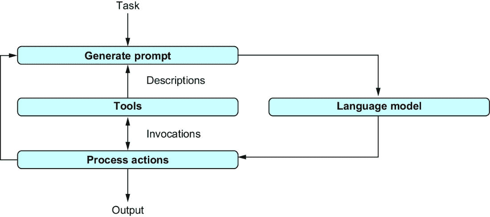

# 第十章：个软件框架

### 本章涵盖

+   使用 LangChain 构建应用

+   使用代理解决复杂任务

+   使用 LlamaIndex 查询数据

到目前为止，我们主要使用 OpenAI 的 Python 库与语言模型进行交互。这个库提供了向 GPT 和其他 OpenAI 模型发送提示和检索答案的基本功能（以及调整和微调的选项）。来自其他提供商的库，如 Anthropic 和 Cohere，提供类似的功能。只要你的数据分析任务简单，这可能就是你所需要的。然而，如果你的数据分析需要复杂的、多步骤的流水线，可能需要整合许多不同的数据格式呢？

到那时，你可能想切换到一个更强大的软件框架。目前，有几个用于在语言模型之上构建复杂应用的更高层次框架正在兴起。在本章中，我们将讨论两个最受欢迎的竞争者：LangChain 和 LlamaIndex。前者是一个用于构建使用大型语言模型的应用的通用框架。更重要的是，它附带各种有用的内置组件，实现了语言模型的流行用例。另一方面，LlamaIndex 专门支持语言模型需要与大型数据集交互的用例。

为了熟悉这个工具，我们首先将使用 LangChain 编写一个简单的文本分类流水线。然后我们将探索 LangChain 的一些高级功能。更确切地说，我们将看到 LangChain 如何在语言模型之上支持 *代理*。创建一个代理意味着将语言模型本身置于驾驶员的位置，给它在完成特定任务时使用用户提供的工具集的自由。我们将使用这样的代理独立解决复杂的数据分析任务，使用各种工具访问不同的数据源。接下来，我们将看到 LlamaIndex 如何轻松地摄取大量不同格式的数据，并使其对语言模型可用。内部，它使用廉价的语言模型将数据片段和分析任务映射到向量表示，然后根据这些向量的相似性将任务映射到数据。最后，我们将比较这两个框架，并讨论这些框架与 OpenAI 和其他语言模型提供商提供的库之间的权衡。

## 10.1 LangChain

如果你想要创建一个基于语言模型的复杂应用，你可能应该检查一下 LangChain。该框架于 2022 年 10 月推出，并迅速获得了人气（导致 2023 年 4 月创建了一个相应的初创公司）。在撰写本文时，LangChain 仍在快速发展。请确保使用正确的 LangChain 版本运行本节中的代码（因为未来的版本可能会更改接口）。

如其名所示，LangChain 与语言模型（Lang）和链（Chain）相关。在 LangChain 术语中，一个*chain*只是一个步骤序列。每个步骤可能对应于调用一个语言模型、一个数据处理步骤或调用一个任意工具。这里的重要点是，我们不再假设单次调用语言模型就能解决我们的问题（这在本书中讨论的大多数场景中都是如此）。相反，我们假设我们需要一个复杂的连接组件网络。这正是 LangChain 大放异彩的场景！

要使用 LangChain，你首先需要安装它。打开终端，并运行以下命令：

```py
pip install langchain==0.1.13
```

正如我们提到的，如果你想运行以下代码示例，你需要安装正确的 LangChain 版本！LangChain 目前正在快速变化，所以代码可能无法与不同版本兼容。

除了 LangChain 的核心功能之外，你可能还需要安装支持特定提供商语言模型的库。在接下来的章节中，我们将使用 OpenAI 的模型。请在终端中运行以下命令（并且，再次提醒，请确保使用指定的版本）：

```py
pip install langchain-openai==0.1.1
```

对其他提供商的支持，如 Anthropic 和 Cohere，同样可用。

好的，这就完成了！运行这些命令后，你就可以运行下一节中讨论的示例项目了。

## 10.2 使用 LangChain 对评论进行分类

我们最早的项目之一是使用语言模型进行文本分析。还记得第四章吗？我们使用语言模型根据潜在的情感（这是推荐还是警告？）对评论进行分类。在这里，我们也将做同样的事情；我们只是会在代码中使用 LangChain。将 LangChain 的代码与原始代码进行比较，应该能给你一个 LangChain 如何帮助简化使用语言模型构建应用程序的第一印象。

### 10.2.1 概述

我们将创建一个用于分类文本文档的链。一个 LangChain 链可能涉及许多步骤，每个步骤通过调用一个语言模型或一个通用的 Python 函数（例如，将语言模型调用的结果解析成标准格式）来实现。术语*chain*实际上有些误导。虽然你可能想象链是一个连续步骤的序列，但 LangChain 中的链要强大得多。例如，它们可能涉及并行步骤以及条件执行。然而，对于简单的文本分类应用，我们不需要这样的高级功能。相反，我们将限制自己使用只有几个步骤的简单链。

我们的链将集成 LangChain 提供的几个标准组件。我们链中的第一个组件是一个提示模板。正如第四章中所述，这个模板描述了分类任务和预期的输出格式。你可能想知道与之前的代码版本相比有什么变化。毕竟，我们一直在讨论提示模板。区别在于 LangChain 引入了一个专门用于表示提示模板的类。这个类为提示模板提供了各种便利函数：例如，用于创建和实例化它们。同时，LangChain 提供了一个中心，允许用户上传和下载提示模板（以及许多其他组件）。在我们的简单场景中，我们不需要这些高级功能。相反，我们只需要通过传递一个参数（要分类的文本）来实例化我们的提示模板。

我们链中的第二步是一个语言模型。同样，我们在这本书的整个过程中一直在使用语言模型，但 LangChain 在语言模型对象之上增加了几个有用的功能。例如，自动记录所有语言模型调用变得很容易，LangChain 还提供了针对不同调用场景的便利函数（例如，批处理和流处理）。再次强调，我们在这里不会使用这些高级功能。相反，我们将提示（我们链中的第一步）传递给语言模型以生成回复。

我们链中的第三步是一个解析器，它从语言模型生成的回复中提取答案字符串。你可能还记得第三章中提到的，OpenAI 的语言模型会生成详细的回复，其中包含一个或多个答案以及各种类型的元数据（例如，关于标记使用的相关信息）。解析器会自动从结果对象中提取我们所需的答案字符串（这对于 OpenAI 模型以及所有其他提供商都适用）。管道的结果是一个表示输入评论是否为推荐的单一标记。图 10.1 展示了这个管道的三个步骤。


##### 图 10.1 LangChain 分类链中的组件

### 10.2.2 创建分类链

是时候用 Python 实现我们的链了！首先我们需要一个提示模板。我们使用与第四章相同的模板，但这次我们使用 LangChain 的`ChatPromptTemplate`类：

```py
from langchain_core.prompts.chat import ChatPromptTemplate
prompt = ChatPromptTemplate.from_template(
    '{text}\n'                         #1
    'Is the sentiment positive or negative?\n'
    'Answer ("Positive"/"Negative")\n')
```

#1 文本占位符

你可能会注意到对聊天模型的引用（毕竟，我们实例化的类叫做 `ChatPromptTemplate`）。在第三章中讨论过，聊天模型处理的是一系列先前的消息历史，而不是单个输入消息。许多最近发布的模型都是聊天模型。在 LangChain 中，聊天模型需要一个专门的提示模板（它实例化为一系列消息而不是单个文本）。这正是我们在这里创建的模板类型。该模板与第四章中使用的模板相同，它包含一个用于对输入文本进行分类的占位符（**1**）。我们通常使用花括号（`{}`）在提示模板中标记占位符；在实例化提示时，它们会被具体的值替换。

第二，我们需要一个语言模型来处理提示。以下代码实例化了 OpenAI 的 GPT-4o 模型：

```py
from langchain_openai import ChatOpenAI
llm = ChatOpenAI(
    model='gpt-4o', temperature=0, 
    max_tokens=1)
```

`ChatOpenAI` 类涵盖了 OpenAI 的所有聊天模型。它从 `langchain_openai` 包中导入，具有在 LangChain 中使用 OpenAI 模型的功能。其他提供商，如 Anthropic 和 Cohere，也有它们自己的相关包，为它们的模型提供类似的功能（注意，你需要通过 pip 分别安装这些包）。`ChatOpenAI` 构造函数中的参数可能看起来很熟悉：我们选择模型（`gpt-4o`），将 `temperature` 设置为 0（以减少输出中的随机程度），并将最大输出令牌数限制为 1（因为可能的两个类别标签，`Positive` 和 `Negative`，都由单个令牌组成）。

第三，我们需要从语言模型的（更详细的）回复中提取答案字符串。使用 `StrOutputParser` 来做这件事很简单。LangChain 输出解析器实现了一系列对模型调用输出的转换。在这种情况下，我们只需要一个非常简单的转换，提取所需的答案字符串。以下代码创建了一个相应的解析器：

```py
from langchain_core.output_parsers.string import StrOutputParser
parser = StrOutputParser()
```

最后，我们将所有组件串联在一起。为此，我们可以使用 LangChain 表达式语言（LCEL）。如果你是 Linux 用户，以下语法应该对你来说很熟悉：

```py
from langchain_core.runnables.passthrough import RunnablePassthrough
chain = ({'text':RunnablePassthrough()} | prompt | llm | parser)
```

要将操作的输出用作后续步骤的输入，我们使用管道符号（`|）将它们连接起来。该命令创建了一个连接先前提到的组件的链。此外，它还指定了链期望的输入。在我们的例子中，提示模板有一个用于对文本进行分类的占位符。

```py`At the start of the chain, we mark this parameter as `RunnablePassthrough`. This gives us a lot of flexibility in terms of how we pass inputs to the chain. For instance, the following code illustrates how to process a list of inputs using the previously created chain:    ``` 输入 = ['这部电影太棒了！', '这部电影太糟糕了！'] 输出 = chain.batch(inputs) ```py    ### 10.2.3 Putting it together    Time to finalize our code for text classification! The code in listing 10.1 takes as input a path to a .csv file containing a `text` column. Executing the code generates a result file containing an additional column called `class` with the classification result. In other words, the code does exactly the same thing as that from chapter 4, but this time using LangChain.    ##### Listing 10.1 Sentiment classification using LangChain    ``` 从 langchain_openai 导入 ChatOpenAI 从 langchain_core.prompts.chat 导入 ChatPromptTemplate 从 langchain_core.output_parsers.string 导入 StrOutputParser 从 langchain_core.runnables.passthrough 导入 RunnablePassthrough 导入 argparse 导入 pandas as pd  def create_chain():                         #1     """ 创建用于文本分类的链。          返回值:         用于文本分类的链。     """     prompt = ChatPromptTemplate.from_template(  #2         '{text}\n'         '情感是积极还是消极？\n'         '回答 ("Positive"/"Negative")\n')     llm = ChatOpenAI(              #3         model='gpt-4o', temperature=0,          max_tokens=1)     parser = StrOutputParser()  #4      #5     chain = ({'text':RunnablePassthrough()} | prompt | llm | parser)     return chain  if __name__ == '__main__':          parser = argparse.ArgumentParser()     parser.add_argument('file_path', type=str, help='输入文件路径')     args = parser.parse_args()          df = pd.read_csv(args.file_path)  #6      chain = create_chain()            #7     results = chain.batch(list(df['text']))  #8      df['class'] = results  #9     df.to_csv('result.csv') ```py  #1 Creates a chain #2 Creates a prompt template #3 Creates an LLM object #4 Creates an output parser #5 Creates a chain #6 Reads the data #7 Creates a chain #8 Uses it #9 Stores the output   The `create_chain` function (**1**) implements the steps discussed in the last section. It generates a prompt template for classification (**2**), then a chat model (**3**), and finally an output parser (**4**). The result is a chain connecting all those components (**5**).    After reading the command-line parameters, the code reads the input data (**6**), creates a corresponding chain (**7**), and finally applies the chain to the list of input texts (**8**). The classification results are added to the input data and stored on disk (**9**).    ### 10.2.4 Trying it out    Time to try it! As usual, you will find the code for listing 10.1 on the book’s companion website in the chapter 10 section. Download the code (the listing1.py file) and, optionally, a file containing reviews to classify (such as reviews.csv from chapter 4). Open the terminal, and switch to the folder containing the code. Assuming that reviews.csv is located in the same folder, run the following command:    ``` python listing1.py reviews.csv ```py    Check the folder containing the code. You should see a new file, result.csv, with the desired classification results. So far, we have only verified that we can do the same things using LangChain that we can do with OpenAI’s libraries directly (even though, arguably, the LangChain code is cleaner). In the next section, we’ll see that LangChain enables us to do much more than that.    ## 10.3 Agents: Putting the large language model into the driver’s seat    So far, you may have considered language models as (highly sophisticated) tools. Based on your input, the language model produces output. If data processing requires more than the language model can accomplish, it is up to you, the developer, to add the necessary infrastructure. For instance, assume that you’re building a question-answering system for math questions. Realizing that language models are bad at calculating things (which, ironically for a computer program, they are), you may consider the following approach: based on the user question, the language model translates the input into a mathematical formula. Then that formula is parsed and evaluated by a simple calculator tool. The output of that tool is sent to the user.    So far, so good. It gets more complicated in situations where you have not one but multiple math tools. Perhaps one tool solves differential equations, and another evaluates simple arithmetic equations. In such cases, you can expand your approach with a classification stage, mapping the user input to the most suitable tool. However, this approach breaks down in situations where answering the user question may require not applying a single tool but multiple invocations of different tools, possibly using the output of one tool as input for the next invocations. In such cases, manually covering each possible sequence of required tool invocations is simply not feasible.    This is the type of use case where *agents* become useful. Agents are a fairly novel way of using large language models. At the core of this approach is a change in perspective. Instead of considering the language model a tool used as a step within a pipeline designed by the developer, we make the language model an independent agent. Rather than trying to orchestrate the order in which the language model and other processing steps are applied (which we did in the last section), we leave it up to the language model to decide which processing steps are applied in which order. The advantage of this approach is that it is much more flexible, freeing us as developers from having to foresee each possible development in advance to create an associated branch in our processing logic.    Agents can be useful for complex data-analysis tasks where it is unclear, a priori, which data sources or processing methods may be required to satisfy a user’s request. Two terms are central to the agent approach, and we will look at them next: the *agent* and its *tools*.    Let’s start by discussing tools. A tool can encapsulate arbitrary functionality. It is a function that the language model can use if it deems it necessary. When we use LangChain or similar frameworks to implement agents, a tool is typically implemented as a Python function. Each tool must be associated with a description in natural language. This description is shown to the language model as part of the prompts. Based on this description, the language model can decide whether a tool seems helpful in a given context. To use a tool, the language model requires a description of the input parameters and the output semantics. Similar to human programmers, choosing meaningful parameter names and writing precise documentation helps language models use tools effectively. Because agents are implemented via language models, a full description of all available tools is typically provided as part of the input prompt.    Agents use tools whenever they are required to solve a complex task specified by the user. Agents are implemented via language models. Although fine-tuning can improve the performance of language models as agents, generic models should work in principle. The secret behind turning language models into agents lies less within the model itself but rather in the way it is prompted. At a minimum, corresponding prompts integrate the following components:    *   A description of a high-level task the agent should solve. This description is provided by the user. *   A list of available tools, together with a description of their functionality and their input and output parameters. *   A description of the expected output format. This enables mapping the output of the language model to tool invocations.    Given such a prompt, the language model can produce output requesting specific tool invocations. The infrastructure implementing the agent approach parses the output, maps it to corresponding tools and input parameter values, and obtains the invocation result. In the next iteration, the result of the tool invocation is added to the input prompt. In this way, the language model can essentially *access* the results of tool invocations. Based on that, the language model can choose to apply more tools (possibly using the results of prior tool invocations as inputs) or terminate if a final answer is available.    Figure 10.2 summarizes this process. The user-specified task, together with a detailed description of all tools, forms the input to the language model. The output of the language model is parsed and mapped to an action. Either this action represents the invocation of a tool (in that case, the invocation command contains values for all input parameters of the tool), or it represents termination (in this case, the termination command contains what the language model believes is an answer to the input task). If the action is a tool invocation, the corresponding call is executed. The result is added to the prompt used in the next iteration. Iterations continue until the language model decides to terminate (or until a user-specified limit on the number of iterations is reached).    ##### Figure 10.2 Using language models as agents. Given a prompt describing the task and available tools, the language model decides on termination and tool invocations. Results of tool invocations are added to the prompt used for the next iteration.    At this point, you may be curious what the corresponding prompts look like. Let’s examine the standard prompt template used for agents in LangChain. You can download the prompt template from LangChain’s hub. If you want to do so, install the hub first using the following command in the terminal:    ``` pip install langchainhub==0.1.15 ```py    Then run the following code in Python to print out the standard template for one of the most popular agent types:    ``` 从 langchain 导入 hub prompt = hub.pull('hwchase17/react') print(prompt.template) ```py    You should see the following output:    ```  #1 尽可能回答以下问题。您可以使用以下工具：  {tools}  #2  使用以下格式：  #3  问题：您必须回答的输入问题 Thought：您应该始终思考要做什么 Action：要采取的操作，应该是 [{tool_names}] 之一 Action Input：操作的输入 Observation：操作的结果 ... (此 Thought/Action/Action Input/Observation 可以重复 N 次) Thought：我现在知道最终答案 Final Answer：原始输入问题的最终答案  开始！  问题：{input}      #4 Thought:{agent_scratchpad}  #5 ```py  #1 General scenario #2 Tool descriptions #3 Format description #4 User input #5 Prior results   This prompt template describes the general scenario (**1**) (there is a question that needs answering), available tools (**2**), and the process to solve the task (**3**). The prompt template contains multiple placeholders representing tool descriptions (**2**), the input from the user (**4**), and the results of prior iterations (**5**). As we will see in the following sections, LangChain offers various convenience functions to create and execute agents based on this and similar prompt templates.    ## 10.4 Building an agent for data analysis    In this section, we will use LangChain to build an agent for data analysis. This agent will be able to access different data sources with structured and unstructured data. What’s more, the agent will decide which of those sources to access and in which order. It may even use information obtained from one source to query a second source (e.g., to access a structured database about video game sales to identify the most sold game in a specific year and then use the game title to query the web for further information).    ### 10.4.1 Overview    Our data-analysis agent implements the approach we discussed in the previous section. It uses a language model to decide which tools to invoke in which order and with what input parameters. In our example scenario, we will provide the agent with tools to access a relational database (as well as obtain information about its structure, such as the names of available tables). We also provide the agent with a tool that enables web search (exploiting existing search engines in the background). Taken together, we get an agent that can query a relational database and use the web to obtain information that relates to the database content.    Let’s start our discussion with a more detailed description of the tools we will provide to the agent. In total, the agent will have access to the following five tools:    *   `sql_db_list_tables` lists all tables in the relational database. *   `sql_db_schema` returns the SQL schema of a table, given the table name. *   `sql_db_query_checker` enables the agent to validate an SQL query. *   `sql_db_query` evaluates an SQL query and returns the query result. *   `search` enables the agent to search the web via keywords, returning web text.    The first four tools help the agent access a relational database. The last tool enables the agent to retrieve information from the web. Given a user-specified task, the agent decides (using the underlying language model) which of these tools to invoke and in which order. Figure 10.3 illustrates this scenario.    ##### Figure 10.3 The data agent uses multiple tools to explore the structure and query a relational data- base. In addition, the agent can retrieve web text via the web search tool.    ### 10.4.2 Creating an agent with LangChain    Creating an agent with LangChain is fast! LangChain even offers specialized constructors for agents that access a structured database. We will use those features in the following code.    Agents are implemented via language models. To create an agent, we first have to create a language model object:    ``` 从 langchain_openai 导入 ChatOpenAI llm = ChatOpenAI(     temperature=0, model='gpt-4o') ```py    We’re creating an OpenAI language model of type chat. More precisely, we refer to the GPT-4o model again.    Next, we create an object representing our relational database. We will query an SQLite database stored on disk. Assume that `dbpath` stores the path of the corresponding database file (typically, such files have the .db suffix). We can create a database object using the following code:    ``` 从 langchain_community.utilities.sql_database 导入 SQLDatabase db = SQLDatabase.from_uri(f'sqlite:///{dbpath}') ```py    We mentioned four tools for accessing the relational database. Fortunately, all of these tools will be automatically created from the database object. However, we still need to create a tool for web search.    We will use a built-in component of LangChain, the SerpAPI tool. To use this tool, you first need to register for an account on the SerpAPI website. Open your browser, go to [`serpapi.com/`](https://serpapi.com/), click the Register button, and create a corresponding account. To execute the code presented next, you will need to retrieve your API access key (available at [`serpapi.com/dashboard`](https://serpapi.com/dashboard)). You also need to install a LangChain extension to enable the web search tool. Go to the terminal, and run the following command:    ``` pip install google-search-results==2.4.2 ```py    After that, all it takes is the following snippet of Python code to generate a tool for web search (assuming that `llm` contains the previously created language model object and `serpaikey` the SerpAPI access key):    ``` 从 langchain.agents.load_tools 导入 load_tools extra_tools = load_tools(     ['serpapi'], serpapi_api_key=serpaikey, llm=llm) ```py    The `load_tools` function is used for standard tools by passing the names of the desired tools as parameters. In this case, we only need the web search tool, and we pass only a single entry in the list of tool names (`serpapi`). After the call to `load_tools`, we store the result in `extra_tools`: a list of tools with a single entry (the web search tool). We now have all the components we need to create an agent using LangChain.    Assume that `db` contains the database object, created previously, and `llm` the language model generated before. We initialize an agent for SQL-based data access using the following code:    ``` 从 langchain_community.agent_toolkits.sql.base 导入 create_sql_agent agent = create_sql_agent(     llm=llm, db=db, verbose=True,     agent_type='openai-tools',     extra_tools=extra_tools) ```py    The `create_sql_agent` command is a convenience function offered by LangChain to create agents for SQL-based data access. The four previously mentioned tools for relational database access (useful for retrieving table names, showing table schemata, validating SQL queries, and, ultimately, issuing them) are added automatically without us having to add them explicitly. There is only one more tool we want in addition to the SQL-focused tools: the web search capability. Such tools are specified in a list via the `extra_tools` input parameter. Setting the `verbose` flag to `True` enables us to follow the “thought process” leading the agent to call specific tools (we will see some example output later). The agent type, `openai-tools` in this case, determines the precise prompt to use as well as which parsers to use to map the output of the language model to tool invocations.    After creating the agent, we use the following code to apply the agent to a specific task (we assume that the variable `task` stores a natural language description of the task we want to solve):    ``` agent.invoke({'input':task}) ```py    ### 10.4.3 Complete code for data-analysis agent    Listing 10.2 brings all of this together: after reading the SerpAPI API access key, as well as the path to the database file and a question from the command line, it creates a language model object (**1**), then a database (**2**), the web search tool (**3**), and, finally, the agent (**4**). It invokes the agent (**5**) on the input question. The output produced by the agent terminates with an answer to that question (or with a failure message if the agent is unable to find an answer).    ##### Listing 10.2 Agent for data analysis with web search capability    ``` 导入 argparse  from langchain.agents.load_tools 导入 load_tools  from langchain_community.utilities.sql_database 导入 SQLDatabase  from langchain_community.agent_toolkits.sql.base 导入 create_sql_agent  from langchain_openai 导入 ChatOpenAI  if __name__ == '__main__':      parser = argparse.ArgumentParser()     parser.add_argument('serpaikey', type=str, help='SERP API 访问密钥')     parser.add_argument('dbpath', type=str, help='SQLite 数据库路径')     parser.add_argument('question', type=str, help='要回答的问题')     args = parser.parse_args()          llm = ChatOpenAI(              #1         temperature=0, model='gpt-4o')      #2     db = SQLDatabase.from_uri(f'sqlite:///{args.dbpath}')     extra_tools = load_tools(                         #3         ['serpapi'], serpapi_api_key=args.serpaikey, llm=llm)     agent = create_sql_agent(     #4         llm=llm, db=db, verbose=True,         agent_type='openai-tools',         extra_tools=extra_tools)     agent.invoke({'input':args.question})  #5 ```py  #1 Creates an LLM client #2 Creates a database object #3 Adds a web search tool #4 Creates the agent #5 Invokes the agent with input   ### 10.4.4 Trying it out    Let’s see how that works in practice! Download the code for listing 10.2 from the book’s companion website. Besides the code, you will need an SQLite database to try the data agent. We will use the SQLite database from chapter 5, storing information about video games (you can find the corresponding file on the book’s companion website under the Games SQLite link).    Open the terminal, and switch to the directory containing the code. We will assume that the database file, games.db, is located in the same directory. Run the following code (replace `[SerpAPI key]` with your search key, available at [https://](https://serpapi.com/dashboard) [serpapi.com/dashboard](https://serpapi.com/dashboard)):    ``` python listing2.py [SerpAPI 密钥] games.db ↪ '2016 年最畅销的游戏是什么，如何玩？' ```py    You should see output like the following (the output you see may differ slightly due to changing web content, small changes to the GPT-4o model, and a few other factors):    ``` [1m> 正在进入新的 SQL 代理执行器链...[0m [32;1m[1;3m   #1 调用：`sql_db_list_tables` with `{'tool_input': "}` [0m[38;5;200m[1;3mgames[0m[32;1m[1;3m  #2 调用：`sql_db_schema` with `{'table_names': 'games'}`  [0m[33;1m[1;3m CREATE TABLE games (     rank INTEGER,      name TEXT,      platform TEXT,      year INTEGER,      genre TEXT,      publisher TEXT,      americasales NUMERIC,      eusales NUMERIC,      japansales NUMERIC,      othersales NUMERIC,      globalsales NUMERIC )  /* 3 rows from the games table: rank    name    platform    year    genre    publisher     americasales    eusales    japansales    othersales    globalsales 1    Wii Sports    Wii    2006    Sports    Nintendo    41.4900000000     29.0200000000    3.7700000000    8.4600000000    82.7400000000 2    Super Mario Bros.   NES   1985   Platform   Nintendo    29.0800000000     3.5800000000    6.8100000000    0.7700000000    40.2400000000 3    Mario Kart Wii    Wii    2008    Racing    Nintendo    15.8500000000     12.8800000000    3.7900000000    3.3100000000    35.8200000000 */[0m[32;1m[1;3m  #3 调用：`sql_db_query_checker` with `{'query': 'SELECT name  FROM games WHERE year = 2016 ORDER BY globalsales DESC LIMIT 1'}` responded: The games table contains the information we need.  I will query for the game with the highest global sales in 2016. [0m[36;1m[1;3mSELECT name FROM games WHERE year = 2016  ORDER BY globalsales DESC LIMIT 1[0m[32;1m[1;3m  #4 调用：`sql_db_query` with `{'query': 'SELECT name  FROM games WHERE year = 2016 ORDER BY globalsales DESC LIMIT 1'}` [0m[36;1m[1;3m[('FIFA 17',)][0m[32;1m[1;3m  #5 调用：`Search` with `How to play FIFA 17` [0m[33;1m[1;3m["A Beginner's Guide To Complete FIFA 17 Domination ... The main steps you should take are to jump right in with a quick play game. ... EA Sports FIFA ...", 'Play FIFA 17 up to 5 days before launch for a full  10 hours when you join EA Access on Xbox One and Origin Access on PC.',  "1\. Shield the ball in 360 degrees · 2\. Use Driven Shots and Driven Headers ·  3\. Use set piece upgrades to score with style · 4\. Make Fifa 17's ...",  'Play FIFA 17 as much as you want with EA Access or Origin Access  for only $4.99 per month. Now available in The Vault.',  'Cautiously Start An Online Match. Score Early After Some Self-Proclaimed  Beautiful Build Up Play. Concede 4 Goals In A Row And Convince ...',  'FIFA 17 TUTORIALS & ULTIMATE TEAM ➞  Twitter: https://twitter.com/KrasiFIFA ➞  Instagram: http://instagram.com/KrasiFIFA How I record my ...',  "Draft mode is another way to play FIFA Ultimate Team,  giving you the ability to play with Players you don't own.  You'll have the opportunity to draft a random ..."]  #6 [0m[32;1m[1;3m2016 年最畅销的游戏是 FIFA 17。   要玩 FIFA 17，您可以遵循以下步骤：  1\. 快速开始游戏。 2\. 用 360 度保护球。 3\. 使用驱动射门和驱动角球。 4\. 使用定位球升级以优雅地得分。 5\. 谨慎地开始在线比赛。 6\. 在一些自称为美丽的 buildup play 之后尽早得分。 7\. 拟定模式是另一种玩 FIFA Ultimate Team 的方式，让您能够与您不拥有的球员一起玩。  您将有机会挑选一支随机队伍。  记住，熟能生巧！[0m  [1m> 完成链。[0m ```py  #1 The agent retrieves the list of tables. #2 The agent retrieves the table schema. #3 The agent verifies the SQL query. #4 The agent queries for the top game. #5 The agent searches the web for FIFA 17. #6 The agent formulates the final answer.   Remember that we switched the agent’s output to verbose mode. That means the output contains a full log of tools invoked by the agent, as well as the agent’s reasoning process. Let’s take a closer look at the output to see what happened.    First, the agent retrieves a list of the tables available in the relational database (using `sql_db_list_tables`) (**1**). Clearly, that’s a reasonable step when confronted with a new database. The result of the tool invocation reveals that the database contains only a single table (called `games`). The agent becomes “curious” about the table contents. It invokes the `sql_db_schema` tool to get further information about the `games` table (**2**). Note that this tool consumes input parameters, specifically the name of the table to investigate. The log shows the values of all input parameters for each tool invocation.    The invocation of the `sql_db_schema` tool returns the SQL command that was used to create the `games` table, together with a small sample of the table’s content. Next, the agent considers an SQL query to retrieve relevant information about the input question (“What was the most sold game in 2016 and how is it played?”). In the first step, it validates that the following query is syntactically correct by invoking the `sql_db_query_checker` tool (**3**):    ``` SELECT name FROM games WHERE year = 2016 ORDER BY globalsales DESC LIMIT 1 ```py    At the same time, the agent uses the opportunity to “reflect” on the usefulness of the query under consideration, as evidenced by the output “The games table contains the information we need. I will query for the game with the highest global sales in 2016.” It may seem strange that a language model can benefit from this type of monologue instead of writing out tool invocations directly. Yet it has been shown that enabling agents to explicitly reason about the problem at hand and the steps they are taking to solve it can improve their performance [1]. That’s what’s happening here as well.    Finally, the agent decides to use the previously validated query to retrieve information from the database, using the `sql_db_query` tool (**4**). The SQL query returns the game that generated the most revenue in 2016: FIFA 17, a soccer simulation produced by Electronic Arts. But the input question asks for more than that: “What was the most sold game in 2016 and *how is it played*?” The second part of the question cannot be answered from database content. To its credit, the agent realizes that and tries to access the web instead: it issues a web search request using the `Search` tool for the search string “How to play FIFA 17” (**5**). Note that the agent was able to automatically formulate a suitable search string from the result of the SQL query and the input question. The result of the web search is a collection of text snippets (shown in the output) that contain information about how to play FIFA 2017.    Finally, the agent uses the information returned by the web search (in combination with information from the SQL database) to formulate a final answer (**6**). The final answer identifies FIFA 17 as the most popular game in 2016 and contains detailed instructions for how to play it well. We have seen that the agent can perform a complex sequence of tool invocations to find the desired answer without having to specify the process to follow by hand. If you’re interested, try querying the agent with a few more, possibly more complicated, questions and see whether it can answer them as well.    ## 10.5 Adding custom tools    So far, we have used standard tools offered by LangChain for the most common use cases. What happens if we have specialized requirements? For example, say you want to make a data source accessible via a custom API, or you have specialized analysis functions that an agent can apply to your data. In those cases, you can define your own custom tools and make them accessible to a LangChain agent.    ### 10.5.1 The currency converter    In the last section, we analyzed a data set about video game sales. The original data reports sales values in US dollars. What about other currencies? To enable agents to reason about game sales using multiple currencies, we will add a currency-converter tool. Given an amount in US dollars as input, together with the name of a target currency, this tool returns the equivalent value in the target currency.    Listing 10.3 shows how to add the currency-converter tool to our data agent. At its core, a tool is nothing but a Python function. Our currency converter is implemented by the `convert_currency` function (**2**). How does LangChain know that we want to turn the function into a tool? That’s done by the `@tool` decorator (**1**), which needs to directly precede the function name. Typically, we do not have to specify types for parameters and return values of Python functions (even though it does improve the readability of your code). If you plan to turn a function into a tool, however, you should specify all these types. The reason is as follows: to use your function properly as a tool, the agent needs to invoke it with parameters of the right type. All types you specify in the function header will be made accessible to the agent as part of the description of your tool. Hence, associating parameters with types helps your agent avoid unnecessary invocation errors.    Besides parameter types, the agent should know a little about what your tool can accomplish. The first important piece of information is the name of your function. By default, your tool will be named after your function. Don’t call your function `XYZ`, because that will make it very hard to understand what’s going on! The name of the function in listing 10.3, `convert_currency`, should make it pretty clear what the function does. Similarly, the names of the input parameters, `USD_amount` (of type `float`) and `currency` (of type `str`), are pretty self-explanatory (which is good!). The function output is a converted amount in the target currency or an error message if the requested target currency is not supported (that’s why the output type is a `Union` of string and float values). As a rule of thumb, if you plan to use a Python function as a tool, write it the same way you would to enable human coders to understand your function without reading its code in detail.    In addition to the names of the function and its parameters, the agent “sees” the function documentation (**3**). Again, make sure your documentation is well structured, and explain the semantics of your tool and associated parameters. In this case, the documentation describes the function of the tool, the semantics of the input parameters (even with an example of an admissible value for the second parameter), and the output semantics.    The `convert_currency` function uses a small database of currencies with associated conversion factors. For instance, it contains conversion factors for euros and yen but not many other currencies. If you’re creating a tool for your agent, take into account cases in which the agent does not use the tool properly. This may happen if the tool description is incomplete or if the language model makes a mistake (which happens even to state-of-the-art language models). In this case, we’re adding specialized handling for the case that the target currency is not supported (i.e., a corresponding conversion factor is missing) (**4**). If the target currency is not supported, the function returns a helpful error message that contains the full set of supported currencies. This helps the agent to restrict the parameter to the set of admissible options for the following invocations. If the target currency is supported, the function returns the converted amount (**5**).    ##### Listing 10.3 Data-analysis agent with currency-converter tool    ``` 导入 argparse  from langchain.agents.load_tools 导入 load_tools  from langchain.tools 导入 tool  from langchain_community.utilities.sql_database 导入 SQLDatabase  from langchain_community.agent_toolkits.sql.base 导入 create_sql_agent  from langchain_openai 导入 ChatOpenAI  from typing import Union  @tool  #1  #2 def convert_currency(USD_amount: float, currency: str)->Union[float, str]:      #3     """ 将美元金额转换为另一种货币。          参数:         USD_amount：美元金额。         currency：目标货币名称（例如，“日元”）。          返回值:         目标货币中的输入金额。     """     conversion_factors = {         'Euro':0.93, 'Yen':151.28, 'Yun':0.14,          'Pound':1.26, 'Won':0.00074, 'Rupee':0.012}          if currency not in conversion_factors:          #4         error_message = (             f'Unknown currency: {currency}!'             f'Use one of {conversion_factors.keys()}')         return error_message       #5     conversion_factor = conversion_factors[currency]     converted_amount = USD_amount * conversion_factor     return converted_amount  if __name__ == '__main__':      parser = argparse.ArgumentParser()     parser.add_argument('serpaikey', type=str, help='SERP API 访问密钥')     parser.add_argument('dbpath', type=str, help='SQLite 数据库路径')     parser.add_argument('question', type=str, help='要回答的问题')     args = parser.parse_args()          llm = ChatOpenAI(         temperature=0, model='gpt-4o')     db = SQLDatabase.from_uri(f'sqlite:///{args.dbpath}')     extra_tools = load_tools(         ['serpapi'], serpapi_api_key=args.serpaikey, llm=llm)      #6     extra_tools.append(convert_currency)      agent = create_sql_agent(         llm=llm, db=db, verbose=True,         agent_type='openai-tools',         extra_tools=extra_tools)     agent.invoke({'input':args.question}) ```py  #1 Turns the function into a tool #2 Function signature with types #3 Function documentation #4 Helpful error message for the agent #5 Converts and returns the result #6 Adds the currency-converter tool   After creating a tool based on a Python function, we just need to make the tool available to our agent. Listing 10.3 creates almost the same agent as listing 10.2, with the only difference being that we add the currency-converter tool (**6**). Because we’re using the SQL agent again, the converter tool and the web search tool are inserted into the list of extra tools (added on top of the standard tools for SQL access that are automatically provided to the agent). By default, the tool name equals the name of the function it is based on. Hence, we’re simply adding `convert_currency` to the list of extra tools (**6**) to enhance the agent with currency conversion abilities.    ### 10.5.2 Trying it out    Let’s see whether our agent is able to use our newly added tool! Download the code for listing 10.3 from the book’s companion website. You can use the same database file as before (and assume that the games.db file is located in the same folder as the code). Then, open the terminal and execute the following code (substituting your SerpAPI access key for `[SerpAPI key]`):    ``` python listing3.py [SerpAPI 密钥] games.db  '2015 年电脑游戏产生了多少收入？  用日元表示是多少？' ```py    Clearly, answering that question requires the currency-converter tool. When running the code, you will see output like the following:    ``` [1m> 正在进入新的 SQL 代理执行器链...[0m [32;1m[1;3m  #1 调用：`sql_db_list_tables` with `'tool_input': "` [0m[38;5;200m[1;3mgames[0m[32;1m[1;3m  #2 调用：`sql_db_schema` with `'table_names': 'games'` [0m[33;1m[1;3m CREATE TABLE games (     rank INTEGER,      name TEXT,      platform TEXT,      year INTEGER,      genre TEXT,      publisher TEXT,      americasales NUMERIC,      eusales NUMERIC,      japansales NUMERIC,      othersales NUMERIC,      globalsales NUMERIC )  /* 3 rows from the games table: rank    name    platform    year    genre    publisher    americasales eusales    japansales    othersales    globalsales 1    Wii Sports    Wii    2006    Sports    Nintendo    41.4900000000     29.0200000000    3.7700000000    8.4600000000    82.7400000000 2    Super Mario Bros.   NES   1985   Platform   Nintendo    29.0800000000     3.5800000000    6.8100000000    0.7700000000    40.2400000000 3    Mario Kart Wii    Wii    2008    Racing    Nintendo    15.8500000000     12.8800000000    3.7900000000    3.3100000000    35.8200000000 */[0m[32;1m[1;3m  #3 调用：`sql_db_query_checker` with `{'query': 'SELECT SUM(globalsales) as  total_revenue FROM games WHERE year = 2015'}` responded: The "games" table contains the information we need.  The "globalsales" column represents the global revenue generated by  each game. We can sum this column for the games released in 2015 to  get the total revenue. Let's write and check the SQL query.  [0m[36;1m[1;3mSELECT SUM(globalsales) as total_revenue  FROM games WHERE year = 2015[0m[32;1m[1;3m  #4 调用：`sql_db_query` with `{'query': 'SELECT SUM(globalsales) as  total_revenue FROM games WHERE year = 2015'}`  [0m[36;1m[1;3m[(264.43999999999795,)]0m[32;1m[1;3m  #5 调用：`convert_currency` with `{'USD_amount':  264.43999999999795, 'currency': 'Yen'}` [0m[38;5;200m[1;3m40004.48319999969[0m[32;1m[1;3m  #6 2015 年电脑游戏产生的总收入约为 264440000 美元。  用日元表示，这大约是 40,004,483,200 日元。[0m  [1m> 完成链。[0m ```py  #1 The agent retrieves the database tables. #2 The agent queries for the table schema. #3 The agent verifies the SQL query. #4 The agent queries for sales in 2015. #5 The agent converts the currencies. #6 The agent formulates the final answer.   Similarly to before, the agent first explores the database by retrieving the set of tables (**1**) and then, after finding out that the database only contains a single table, retrieving the schema for that table (**2**). Correctly, the agent infers that the database contains useful information about the input question and first validates (**3**) and then executes (**4**) a corresponding SQL query. The SQL query returns the total value of computer game sales in 2015, expressed in US dollars. To answer the final part of the question (“How much is it in Yen?”), the agent then applies the currency-converter tool (**5**). Note that the agent chooses appropriate values for the two input parameters based on the function description and types. Finally, the agent formulates the answer to the input question (**6**).    ## 10.6 Indexing multimodal data with LlamaIndex    LangChain is by no means the only framework that makes it easier to use language models for data analysis. In this section, we discuss another framework that has recently appeared and is quickly gaining popularity: LlamaIndex.    ### 10.6.1 Overview    LlamaIndex shines for use cases where language models need to access large collections of data, possibly integrating various data types. In such cases, it is generally not advisable (or even possible) to directly feed all the data into the language model. Instead, we need a mechanism that quickly identifies relevant data for a given task, passing only relevant data to the language model. As the name suggests, LlamaIndex indexes data to quickly identify relevant subsets. More precisely, LlamaIndex associates pieces of data (e.g., chunks of text) with embedding vectors. We briefly discussed embedding vectors in chapter 4\. In short, an embedding vector represents the semantics of text as a vector calculated by a language model. If two documents have similar embedding vectors (the distance between the vectors is small), we assume that they discuss similar topics.    A typical LlamaIndex data-processing pipeline entails the following steps. First, it loads data, possibly in various formats, and performs preprocessing. For example, preprocessing may entail dividing long text documents into smaller chunks that are more convenient to handle. Next, LlamaIndex indexes the data. As discussed before, this means associating data chunks with embedding vectors. By default, LlamaIndex uses fairly small language models (e.g., OpenAI’s ada models) to calculate embedding vectors. This makes the indexing step cheap. Furthermore, LlamaIndex can store the generated index (the embedding vectors) on disk to avoid having to regenerate them for each new task.    LlamaIndex offers support for various use cases based on the generated index. For instance, it can use indexed data to answer natural language questions. Given a question as input, it first calculates an embedding vector for the question text. Then it compares the vector representing the question to precalculated vectors representing data chunks. It identifies the data items with the most similar vectors. The associated data is included in the prompt, together with the input question. The goal is to generate an answer to the question, exploiting relevant data as context. Whereas small models are used for indexing, we typically use larger models to generate the final reply. Figure [10.4 illustrates this data-processing pipeline.    ##### Figure 10.4 Primary steps of a typical LlamaIndex data-processing pipeline. LlamaIndex loads and indexes data to enable fast retrieval. Given a question, LlamaIndex identifies relevant data items and submits them, together with the input question, to a language model to generate an answer.    ### 10.6.2 Installing LlamaIndex    Let’s implement the pipeline from the last section in Python. To use LlamaIndex, we first have to install a few packages. Go to your terminal, and run the following command:    ``` pip install llama-index==0.10.25 ```py    That will set you up with LlamaIndex’s core packages. However, you will use LlamaIndex to analyze a diverse collection of data formats. To enable LlamaIndex to properly access and parse all of them, you need to install a few additional packages. Run the following commands in your terminal:    ``` pip install torch==2.1.2 pip install transformers==4.36.0 pip install python-pptx==0.6.23 pip install Pillow==10.2.0 ```py    These libraries are necessary to analyze .pdf documents and PowerPoint presentations, all of which we will need for the following project.    ### 10.6.3 Implementing a simple question-answering system    You’re back at Banana and confronted with a challenging problem: being a global company, Banana has many different units. Your boss wants you to analyze data from different units, for example, to compare their performance. However, different units have widely varying preferences in terms of data formats. Some units publish their results as simple text documents, whereas others regularly turn out elaborate PowerPoint presentations. How do you integrate all those different data formats? Fortunately, LlamaIndex makes that easy.    Look at listing 10.4: in just a few lines of Python code, it handles the task. The code accepts the following input parameters:    *   A link to a data repository. This repository may contain files of various types. *   A question to answer. LlamaIndex will use the data in the repository to answer it.    After parsing those parameters from the command line (**1**), we load data from the input repository (**2**). Fortunately, LlamaIndex makes this step very straightforward: no need to add handling for different file types and so on. Instead, passing the directory path is sufficient. Next, we index the data we just loaded (**3**). By default, LlamaIndex uses OpenAI’s ada models to calculate embedding vectors. Data conversions and chunking (e.g., splitting large text documents into pieces small enough to be processed by OpenAI’s ada models) are all handled automatically. Now we create a query engine on top of the index (**4**). This engine will automatically retrieve data related to an input question using the index. Finally, we use the previously generated engine to answer the input question (**5**) and print the result.    ##### Listing 10.4 A simple question-answering system with LlamaIndex    ``` 导入 argparse 导入 openai  from llama_index.core import VectorStoreIndex, SimpleDirectoryReader  if __name__ == '__main__':      #1     parser = argparse.ArgumentParser()     parser.add_argument('datadir', type=str, help='数据目录路径')     parser.add_argument('question', type=str, help='要回答的问题')     args = parser.parse_args()      #2     documents = SimpleDirectoryReader(args.datadir).load_data()      #3     index = VectorStoreIndex.from_documents(documents)      #4     engine = index.as_query_engine()      #5     answer = engine.query(args.question)     print(answer) ```py  #1 Parses the command-line parameters #2 Loads data from the directory #3 Indexes the data #4 Enables querying on the index #5 Generates the answer   Although LlamaIndex offers various ways to configure and specialize each step of this pipeline (and to create other pipelines), using the default settings in each step leads to particularly concise code.    ### 10.6.4 Trying it out    Let’s try our pipeline using some example data. You can download listing 10.4 from the book’s companion website. Also download the bananareports.zip file from the website, and unzip it in the same folder as the code (use the Banana Reports link). Look inside the folder: you will find (short) business reports in text, .pdf documents, and PowerPoint presentations. Time to answer a few questions! Open your terminal, and change to the directory containing the code and the bananareports folder (after unzipping). Now run the following command:    ``` python listing4.py bananareports '2023 年香蕉单位赚了多少钱？' ```py    You should see output like the following:    ``` 香蕉单位在 2023 年赚了 3000 万美元。
