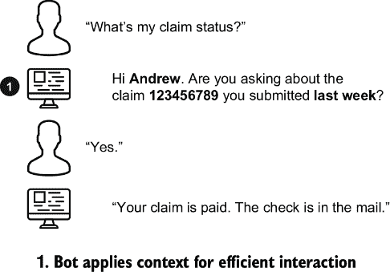
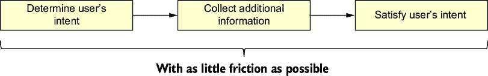
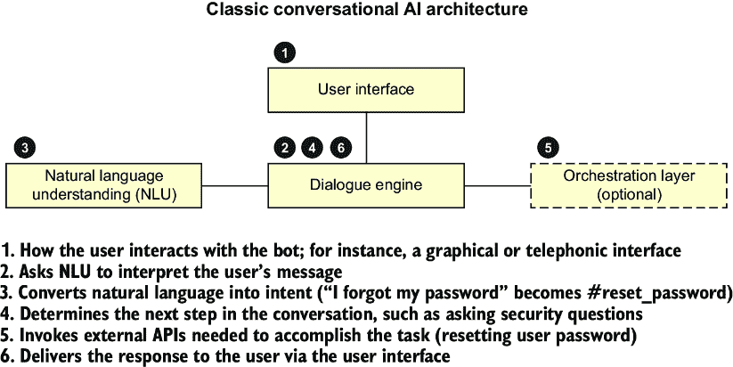
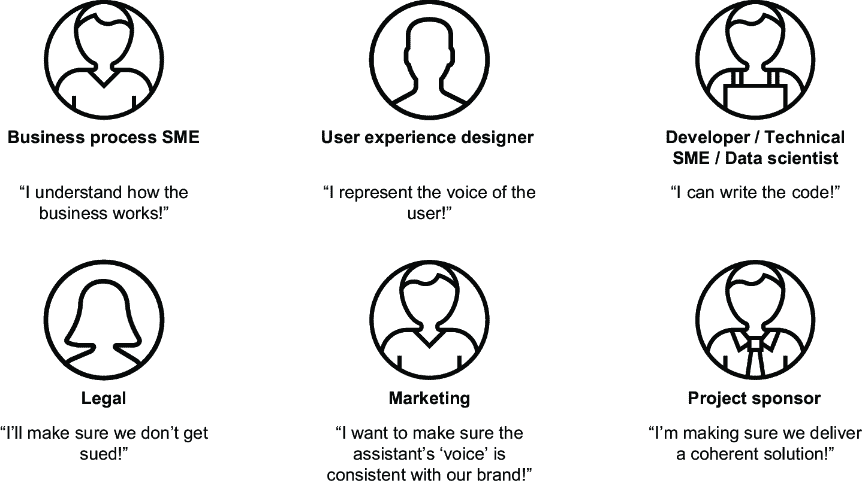
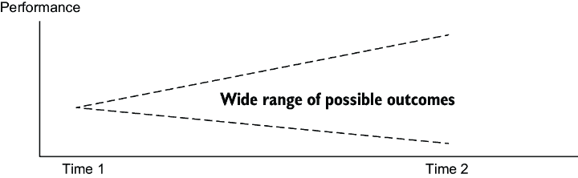

# 1 对话式 AI 如何运作？

### 本章涵盖

+   识别和最小化对话式 AI 风险

+   评估生成式 AI 如何帮助你在对话式 AI 中

+   安全使用生成式 AI

+   持续改进你的 AI 并设定明确的目标

我们都遇到过让我们感到痛苦的计算机化对话代理，例如一个不理解我们说话内容的聊天机器人、一个启动令人困惑对话流程的机器人声音，或者一个让我们立即选择转接到人类代表的电话助手。当你的对话式 AI 解决方案引起这些问题时，你该如何解决它们？你该如何从一开始就正确构建它们？这本书将向你展示如何创建聊天机器人和其他对话式 AI 解决方案，让你的客户愿意使用。

作为对话式 AI 从业者，我们与刚开始部署自动化代理执行有限任务的客户以及面临高商业风险的大型组织合作——在这些情况下，一个生成式 AI 的幻觉可能抵消数十次正确且流畅交互的好处。我们将通过从我们的工作中抽取的各种例子，展示实施和改进对话式 AI 的选项，包括和不含生成式 AI。

我们将首先简要介绍经典的对话式 AI 技术，然后介绍生成式 AI 以及我们推荐的用于安全有效地充分利用对话式 AI 的持续改进过程。然后，在第二章中，你将使用经典和生成式 AI 技术构建自己的聊天机器人。

## 1.1 对话式 AI 简介

对话式 AI，也称为*聊天机器人*、*虚拟代理*、*AI 助手*和*数字员工*，是一套旨在使用书面或口语自然语言模拟或替代人类交互的技术。对话式 AI 通常用于自动化客户服务、提供类似 Alexa 和 Siri 的“语音助手”服务，或预先筛选最终的人与人交互。一般来说，你可以将对话式 AI 分为三个类别：

+   *问答*——也称为 FAQ 机器人，这些 AI 解决方案直接对用户的问题做出回应，通常不需要任何后续操作。

+   *面向流程或交易型解决方案*——用户通过机器人的问题系列被引导实现某个目标；例如，检查账户余额、预约或检查保险索赔的状态。此类对话式 AI 可能执行交易或收集信息以供人工完成。

+   *路由代理*——在这种情况下，机器人的唯一任务是确定将用户重定向到何处。重定向可能是到另一个专门的机器人或人类代理。

一些人工智能解决方案包含所有三种混合。一个零售银行聊天机器人可能对诸如“你们什么时候营业”和“你们在哪里”等简单问题进行问答，处理开户和检查账户余额的流程，并将用户引导到专家处理诸如欺诈报告等案例。

这些类型的聊天机器人具有相似的架构，但重点不同。一个路由代理只需要理解用户的初始意图，但一个以流程为导向的机器人不仅需要理解意图，还需要在整个流程中保持用户的参与。在这本书中，我们将向您介绍几个对话式人工智能的挑战和成功案例，如表 1.1 所示。

##### 表 1.1 我们已解决的对话式人工智能挑战

| 痛点 | 成功案例 | 本书 |
| --- | --- | --- |
| 没有理解用户意图 | 将意图识别准确性从 76%提高到 92% | 第二部分（第 4-7 章） |
| 过多的复杂性强加给用户 | 搜索成功率从 40%提高到 90% | 第三部分（第 8-10 章） |
| 用户立即退出 | 立即退出减少了 15% | 第四部分（第 11-12 章） |

所有聊天机器人类型都面临着理解用户的挑战。以流程为导向的机器人尤其容易让用户负担过重，我们还发现所有聊天机器人类型都可能受到立即退出的困扰。本书的后半部分专注于具体的挑战，尽可能多地提供来自多种聊天机器人类型的例子。您可以自由地跳到您感兴趣的部分。

对话式人工智能解决方案旨在解决问题。如果它们没有解决问题，它们就会给用户带来痛苦。痛点告诉我们应该如何改进系统。但在我们能够改进现有解决方案之前，我们需要了解最初是什么动机促使解决方案的产生。

### 1.1.1 为什么使用对话式人工智能？

一个有效的对话式人工智能提供卓越的用户体验和好处，节省用户的时间和精力，同时节省公司的支持成本。它永远不会感到疲倦，因此可以全天候帮助用户。它是个性化的，高效的，甚至可能是主动的，引导用户实现他们的目标。

##### 图 1.1 与一个以流程为导向的聊天机器人进行痛苦聊天体验，该机器人给用户带来了认知负担。在三个对话回合中，人工智能没有提供任何价值。

一个糟糕的对话式人工智能会起到相反的作用——它会挫败用户，降低满意度，或者因为“机器人没有理解我的需求”而使支持线变得繁忙。它让用户忍受过于冗长的信息，问他们不需要问的问题，或者对他们冷漠无礼。图 1.1 展示了一个以流程为导向的聊天机器人的痛苦聊天体验。

对话式 AI 不必痛苦，它可以提供比需要人工干预更好的、更流畅的体验。图 1.1 中的场景给用户带来了沉重的负担。从技术上讲，对话流程是合理的——用户*可以*询问任何声明。也许用户不是在询问他们自己的声明。但这忽略了普遍情况——大多数用户是在询问他们自己的声明。大多数用户可以被识别——通过他们登录的电子邮件地址识别聊天用户，或通过他们的电话号码识别语音用户。图 1.2 展示了使用这些合理的假设以用户为中心的方式快速解决同一索赔状态问题的方法。这些假设也个性化了体验。这个系统提供的答案比人类更快！

##### 图 1.2 使用上下文和合理的假设快速完成用户目标的愉悦体验。上下文可以从登录过程（聊天）或呼叫者的电话号码（语音）中加载。

有时可以通过改进流程来修复面向过程的机器人。记住，聊天机器人不仅仅是技术问题。聊天机器人与人互动，而人往往是混乱的。仅靠技术无法解决所有聊天机器人的体验问题。

在看到过好的和坏的聊天体验之后，让我们回顾一下对话式 AI 是如何工作的。

### 1.1.2 对话式 AI 是如何工作的？

对话式 AI 解决方案通常包括三个步骤：

1.  确定用户想要什么。

1.  收集满足该需求所需的信息。

1.  给用户提供他们想要的东西。

解决方案应尽可能快速、轻松地实现这些目标，同时遵循法律和道德规范，例如安全处理敏感信息，并不要假装 AI 是真人。如果 AI 解决方案无法实现这些目标，或者给过程带来太多摩擦，用户将放弃 AI 并寻找其他解决方案。这可能意味着去找能帮助他们的人，或者放弃你的服务。

图 1.3 展示了对话式 AI 解决方案的高级流程，这些步骤由图 1.4 所示的架构支持，该架构基于面向过程的机器人“重置密码”场景进行标注。

##### 图 1.3 对话式 AI 流程图。在许多用例中，“附加信息”包括用户配置文件数据。

##### 图 1.4 带有密码重置示例的对话式 AI 逻辑架构标注

让我们详细说明这三个主要步骤：

+   *确定用户想要什么*——用户通常以自然语言提出他们的请求，因此自然语言理解模块接收这条消息并确定其背后的意图。这通常是通过机器学习算法完成的，例如文本分类器。示例意图包括“重置密码”或“查找商店”。意图驱动着流程中的下一步。

+   *收集满足这些需求所需的信息*—用户的初始请求通常不包含足够的信息来满足它——请求只是开始了一段旅程。对话引擎引导用户完成满足请求所需的所有步骤。它可能需要询问澄清或后续问题，如“您的账户号码是什么”或“您的邮政编码是多少”。它可能使用编排层通过应用程序编程接口（API）调用与其他系统交互。对话引擎管理会话状态并应用逻辑来响应用户。

+   *提供用户所需的内容*—当用户的请求得到满足时，流程结束。他们的密码已被重置，或者他们收到了您商店的地址，或者他们已经连接到能够满足他们需求的人。

在不同类型的机器人中，这些步骤可能会有细微的差别。例如，一个问答机器人很少使用 API，但一个以流程为导向的机器人经常使用。路由代理只是间接地提供给用户他们想要的内容（通过将用户路由到正确的专家）。

### 1.1.3 如何构建对话式人工智能

建立对话式人工智能解决方案最好是在团队中涉及一系列多样化的技能，如图 1.5 所示。如果您试图改进这些解决方案，了解这些解决方案是如何构建的很重要。在本节中，我们将总结构建过程。对于更完整的处理，请参阅*对话式人工智能*（Manning Publications，2021）。

##### 图 1.5 建立一个企业级对话式人工智能需要一支拥有多种技能的梦幻团队。

对话式人工智能的起点是用户设计。看看您的用户想要实现什么，以及您如何帮助他们快速且无摩擦地实现这些目标。图 1.5 中的所有参与者都应贡献于这些以用户为中心的问题：

+   您的用户最常见的问题是什么？

+   他们需要做什么？

+   他们可能拥有哪些信息？（以及他们可能不拥有哪些信息？）

+   他们可能如何表达他们的需求？

一旦你知道用户需要什么，思考你需要什么来满足用户。例如，假设您的用户经常被锁在账户外面。他们需要一个密码重置功能。你需要做什么来重置密码？通常，你需要至少做三件事来重置密码：

+   从用户陈述中提取意义（确定他们有一个密码问题，即使他们没有使用特定的术语，如“密码”或“重置”）。

+   访问一个可以验证用户并重置密码的 API。

+   收集足够关于用户的信息以重置他们的密码。

这些需求推动了你构建过程的其余部分。

#### 提取意义

聊天机器人首先从用户那里提取意义，通过文本分类器从用户的自然语言表述中识别意图。*表述*是用户说的话，*意图*是它的含义（即，用户想要什么），而*分类器*将表述分类到意图中。

聊天机器人平台正变得越来越容易使用，趋势是低代码或无代码，但这并不意味着它们将在没有人类参与的情况下理解您的需求。最好让数据科学家优化代表性强、平衡性和多样性的训练数据，并执行测试以确保训练的分类器尽可能准确。如果这没有做好，它将导致“机器人不理解我”的痛点，因为 AI 通常被编程为将未识别的表述路由到通用响应。

此训练过程最佳输入数据来自之前的用户交互，例如历史聊天记录、呼叫中心记录或电子邮件。本书的第二部分涵盖了收集良好数据以及如何使用它来改进意图识别。

#### 使用 API

开发者需要向虚拟助手公开 API。他们需要明确定义所需的输入参数、输出响应格式和错误条件，以便清楚如何将 API 集成到聊天机器人中。API 公开的功能可以用任何编程语言实现——重要的是要有助手可以安全访问的 API 端点。

如果 API 不存在，您的聊天机器人项目可能是构建它的完美理由。或者，聊天机器人的设计可能需要更改 API。API 对于将结构化信息传递给用户（检查他们的账户余额、查找他们的开放索赔）或代表用户操作（重置他们的密码、开设账户）很有用——如果没有合适的 API，您可能无法满足用户的需求。

API 通常用于面向过程的机器人，但它们对于向问答和路由代理提供额外的用户上下文也很有帮助。

#### 收集更多信息

您需要一个会话流程，以获取调用 API 或回答用户初始问题的必要信息。这将受到您正在构建的渠道（如网页或电话）以及您合理期望用户拥有的信息的影响。例如，在网页上的密码重置场景中，通常需要询问安全问题。但是，通过电话收集这些信息可能很困难，通过短信收集信息也不安全。相比之下，电话和短信渠道可能能够使用用户的电话号码作为认证谜题的一部分。

可用的 API 可能会影响对话设计，或者对话设计可能会影响 API，或者它们可能相互影响。如果收集更多信息的过程对用户变得困难，那么当用户了解到他们可能无法成功使用助手时，可能会导致“过于复杂”或“立即退订”的痛点。

值得注意的是，并非每个对话式 AI 都需要我们讨论的这三件事：

+   一些 API 可能不需要额外的信息。例如，一个“商店营业时间”API 无论谁询问都会返回相同的响应。

+   常见问题解答（FAQ）机器人可能根本不需要调用任何 API，只需将用户的表述与意图/响应对进行匹配即可。

+   一个回退到搜索的机器人可能甚至不包含任何意图。这是使用生成式 AI 构建的对话式搜索解决方案的流行模式，无论是使用大型语言模型（LLM）的内置知识，还是通过搜索知识库并从搜索结果中生成答案来补充 LLM。这种模式也可以构建为混合模型，其中为最常见的问题构建意图，所有其他问题都路由到搜索或生成式 AI。

##### 练习

1.  回顾你最近互动过的几个聊天机器人（或者你自己构建的）。它们是问答型、流程型还是路由代理？为什么？

1.  这些聊天机器人各自面临了哪些挑战？你希望它们如何表现得更好？

## 1.2 对话式 AI 中生成式 AI 的介绍

> 任何足够先进的技术都和魔法无法区分。——亚瑟·C·克拉克

*生成式 AI*（一种动态生成新内容的方法）是一项令人兴奋的新技术。你可能已经看到它做了些酷炫的技巧：“写一首莎士比亚式的十四行诗”、“描述 AI 但说话像海盗”或“为我制定一个合法赚取 100 美元的计划。”但它不是魔法，也不是万能的。生成式 AI 可以帮助你获得好处，但你还需要努力避免像幻觉这样的有害结果。

生成式 AI 可以帮助我们解决对话式 AI 解决方案中的几个痛点：

+   *未理解用户意图*—生成式 AI 可以帮助我们在对话式 AI 中训练更强的意图。或者，它可以通过检索增强生成（RAG）来替代部分或全部意图识别，通过总结来自搜索（检索）过程的内容。它还可以更适应用户意图的细微差别。

+   *给用户施加过多复杂性*—生成式 AI 可以帮助我们在对话或测试系统时写出更简单的散文。

+   *用户立即退订*—生成式 AI 可以帮助我们写出更吸引人的散文，同时也有助于我们的用户。

我们可以在对话式 AI 中使用生成式 AI，让它直接通过回答用户的问题或搜索信息来帮助我们的用户。我们还可以使用生成式 AI 来帮助我们构建对话式 AI，例如使用它来构建更好的对话流程和消息，并分析之前的对话。生成式 AI 不是经典对话式 AI 技术的替代品——它们最好一起使用。

### 1.2.1 什么是生成式 AI

*生成式 AI*是一个总称，指的是由*基础模型*驱动的 AI，这些基础模型是在一系列广泛的任务上训练的通用 AI 模型。虽然存在几种基础模型，但本书重点介绍 LLMs——在巨大的文本数据集上训练的机器学习模型。有多大？用“互联网上的所有文本”作为您的心理模型。

看过“互联网上的所有文本”的模型应该非常擅长理解单词和句子序列。该模型被训练接收一系列单词并预测一个可能跟随前一个单词的单词。通过重复预测下一个单词的过程，LLMs 可以生成单词、句子、段落，甚至整页的文本！

您可以在您的对话式 AI 系统中使用 LLMs。LLMs 可以执行直接面向用户的任务，或者执行帮助您构建对话式 AI 的任务。表 1.2 列出了这些任务中的几个。

##### 表 1.2 对话式 AI 构建者可以快速高效使用 LLMs 的示例任务

| 消费者面向的任务 | 构建助手任务 |
| --- | --- |

| 生成答案（来自检索增强生成） | 概括对话记录

| 编辑或编写对话和流程 | 增强您的训练数据

|

LLMs 可以在几乎没有训练的情况下执行这些任务，并加快您的开发过程，并且对用户问题的微小变化具有弹性，这些变化传统分类器可能无法理解。但它们也伴随着潜在的危险：

+   LLMs 从它们的训练数据中学习。您是否曾在互联网上？互联网充满了偏见、仇恨言论和错误信息。检索增强生成是一种生成答案的好方法，因为它将 LLMs 的输出基于您的文档，而不是使用 LLMs 的内部数据（通常是在互联网内容上训练的）。

+   LLMs 不知道它们的回答是否真实，只知道这些回答是它们“提示”的可能的扩展。这是*幻觉*的基础——看起来不错但无用的回答。您永远不知道 LLMs 可能会说什么。这就是为什么将它们用作对话写作助手是极好的，因为您可以在使用之前审查它们的输出。

LLM 们会毫无顾忌地欺骗您。或者它们会在几秒钟内生成比专家水平更好的回答。LLMs 可以表现出惊人的创造力或令人恐惧的偏见——互联网上两者都有！要在您的对话式 AI 解决方案中自信地使用 LLMs，您需要设置一些安全措施。

### 1.2.2 生成式 AI 的护栏

我们的第一道防线在于模型的选择。大多数从业者选择使用现有的模型，而不是自己构建。这是因为训练一个全新的 LLM 可能需要数百万美元，并且耗时数月。

#### 预过滤输入以防止仇恨、辱骂和粗俗语言

#### 上下文指令和提示

我们下一个安全栏是通过对 LLM（大型语言模型）提供的提示指令。图 1.6 展示了有效上下文在引导 LLM 方面的作用。

##### 图 1.6 在提示中添加上下文是引导一个大型语言模型的重要方式。

上下文使大型语言模型（LLM）不必使用其自身的（过时）数据，并减少了幻觉发生的可能性。检索增强生成（第六章）提供了来自您信任的文档的上下文。上下文还可以用来为 LLM 分配一个角色，例如“你是一位友好的校对编辑”，这对于修订内容草稿（第十章）非常有用。

为 LLM 提供上下文是一种强大的技术。

#### 后处理输出

与预过滤选项类似，你还可以扫描 LLM 的输出以查找某些内容。例如，你可以扫描关键词或其他仇恨、滥用和亵渎（HAP）的迹象。库可以帮助你完成这项工作——一个例子是位于 pypi.org 的亵渎检查库（[`pypi.org/project/profanity-check/`](https://pypi.org/project/profanity-check/))。

对于某些用例，你还可以将答案与提示的部分内容进行比较。在检索增强生成中，LLM 应该只回答由搜索过程检索到的文档中的问题。你可以进行文本相似性分析，以查看大部分或所有答案文本是否出现在使用的文档中。

#### 人工介入

最安全的选项是永远不要让 LLM 自由发挥。有人工“介入”可以确保你知道你的 LLM 在做什么。这有两种版本：反向审查和事先审查。

反向审查意味着你定期监控 LLM 提供的响应。例如，你可能有一个每周流程，审查 LLM 输入和输出的样本。这不能防止不良结果发生，但至少你会知道已经发生了，并且你可以调整 LLM。

相比之下，事先审查意味着你使用 LLM 来协助人类，而人类有最终决定权。一个例子是将 LLM 用作校对编辑——它生成静态对话消息，由人类插入到对话引擎中。

以这种方式使用大型语言模型（LLM）可以通过生成训练数据来解决“未理解用户意图”和重写对话以减少“对话流程过于复杂（或粗鲁）”等问题，从而帮助减少用户体验痛点。

### 1.2.3 在对话 AI 中有效使用生成式 AI

有效使用生成式 AI 的两个基本要求是使用适合工作的正确模型，并通过应用适当的限制措施来降低风险。

#### 适合工作的正确模型（和参数）

有数千个 LLM，它们被训练在不同的任务上。你可以通过实验提示和参数来细化 LLM 在这些任务上的行为。图 1.7 展示了“重复惩罚”参数对 Flan-ul2 模型在创意任务上的影响。不同的任务需要不同的参数。当使用你提供的文档中的文本时，低重复惩罚是有用的。在创意任务如列表生成中，高重复惩罚是有帮助的。

##### 图 1.7 改变一个 LLM 参数（重复惩罚）的影响

在这本书中，我们将使用几个不同的模型和参数集来展示各种技术。我们希望表明我们的技术具有广泛的应用性。你可能不会在本文中看到你选择的模型被引用，你可能需要在你的用例中使用不同的提示、参数或模型。在你阅读这本书的时候，可能已经有一套全新的模型可供使用！

对于每个任务，你可能还想尝试多个模型。例如，Flan-UL2 是一个在包括问答和信息检索在内的 50 个任务上训练的 LLM（[`huggingface.co/google/flan-ul2`](https://huggingface.co/google/flan-ul2)）—它是一个通用模型。MPT-7B-Instruct 是一个专注于单一任务的 LLM—短形式指令遵循（[`huggingface.co/mosaicml/mpt-7b-instruct`](https://huggingface.co/mosaicml/mpt-7b-instruct)）。模型也有不同的成本概况和性能特征。你可能在选择适合你任务的正确模型之前会尝试几个不同的模型。你可能在同一解决方案内为不同的任务选择不同的模型。表 1.3 包括了一些关于选择 LLM 的“应该做”和“不应该做”的事项。

##### 表 1.3 LLM 的“应该做”和“不应该做”事项

| 不要 | 不要做 | 为什么 |
| --- | --- | --- |
| 不要仅仅因为你在某个任务上看到它表现良好（而你不需要这个任务）就使用该模型。 | 选择适合你任务的模型，或者尝试几个这样的模型。 | 性能取决于任务，包括任何参数或提示工程。任务包括生成、分类、提取、问答、检索增强生成、摘要和翻译。 |
| 不要因为一次失败的实验就放弃一个模型或提示。 | 在多个输入、模型和参数上进行测试。 | 有时你会运气不佳。需要多次测试才能对 LLM 配置有信心。 |
| 不要盲目让 LLM 完全控制，尤其是在回应你的对话式 AI 用户时。 | 在多个级别上应用护栏。 | 你（或你的组织）拥有最终输出。“LLM 说了这样”不是借口。 |

##### “LLM 说了这样”并不是一个合理的借口

2024 年，一家加拿大航空公司的聊天机器人提供了一项不存在的折扣。在法庭上，他们辩称聊天机器人是一个“独立的法律实体，对自己的行为负责。”法院不同意。公司被命令支付聊天机器人提供的折扣。（参见 BBC 网站上的故事：[`mng.bz/GejV`](https://mng.bz/GejV)。）

#### 在每一步都应用适当的护栏

确保你在使用 LLM 的所有阶段都考虑到了护栏：

+   *在...之前*—选择一个适合你目的的 LLM，其数据集与你的价值观相符。决定 LLM 将有多少自由和监管—它能否从头到尾执行任务，还是所有输出都需要由人类审查？

+   *在...期间*—实验性地使用 LLM，调整和适应它以完成你的任务，并验证任何内容控制的功效。

+   *在...之后*—定期评估 LLM 的过往表现，并确保它仍然满足你的业务需求。

考虑 LLM 的最坏结果，并确保你有应对策略。例如，在问答中，你可能最担心 LLM 会编造没有现实基础的答案（幻觉）。你可以通过分配上下文界限或持续审查 LLM 的响应来减轻这一点。

##### 练习

1.  想想你在上一组练习中提到的聊天机器人。它们如何能够通过生成式 AI 得到改进？

1.  对于生成式 AI 的每个用途，你将如何安全地使用它？对于每个用例，幻觉是一个问题吗？你需要担心仇恨、滥用和亵渎吗？

## 1.3 在对话式 AI 中引入持续改进

> 软件就像熵。它难以把握，毫无重量，并遵循热力学第二定律；即，它总是增加。——诺曼·拉尔夫·奥古斯丁
> 
> “熵”广义上意味着不断趋向混乱。——西德·斯里兰姆

软件永远不会第一次就完美无缺。需求没有得到完美的理解，需求发生变化，或者用户反馈推动软件的改变。AI 软件也不例外。没有改进，AI 软件很可能会滑向衰退。

### 1.3.1 为什么需要持续改进

即使我们将对话式 AI 调整得完美无缺以适应当今时代，我们的需求也会发生变化：

+   用户将提出新的请求并以不同的方式使用软件。

+   您的业务将会有满足流程的新规则。

+   生成式 AI 等技术将使曾经不可能的事情成为可能。

+   将会有更先进且性能更好的 AI 模型可用。

对话式 AI 有几个组成部分，包括理解用户的初始意图，根据需要收集更多信息，并完成用户的需求。这些组成部分中的每一个都可能会随着时间的推移而改变，需要持续改进。这些组成部分的任何退化都会增加用户的挫败感并降低业务成果。

就像链条一样，对话式 AI 解决方案的强度仅取决于其最薄弱的环节。也许我们有一个很好的流程来向用户展示信息，但我们从未达到它，因为我们很少理解他们的初始意图。图 1.8 显示了一个以流程为导向的机器人转换漏斗，展示了到达每个步骤的相对用户数量。

##### 图 1.8 在流程中的累积成功依赖于每个单独步骤的成功。从视觉上看，它就像在每个步骤之后变窄的漏斗。

成功是多方面的。为了让用户得到他们想要的，我们需要

+   吸引他们（A）

+   理解他们（B）

+   展示他们所需的一切（C）

我们可以将任何流程中的成功视为 A 乘以 B 乘以 C。如果我们看到我们的成功率不是我们想要的，我们需要调查成功链中的每个组成部分。很可能我们可以找到改进每个部分的方法。我们甚至可以使用这个框架来思考问答机器人，每个后续问题都是流程中的下一步。第三章将扩展这个框架。

再次强调，流程中的失败可能不仅仅通过技术来解决。生成式人工智能仍然可能误解用户，仍然可能给出错误的答案。需要一些手动工作来识别改进区域并执行改进工作。持续和渐进的改进方法增加了你成功的机会。

### 1.3.2 持续改进周期

对于任何给定的挑战，完美的解决方案可能并不明显，甚至可能不可能。这在人工智能领域尤其如此，因为可能性每天都在变化，变化可能产生意外的副作用。因此，通过一系列的小变化来改进你的对话人工智能是很重要的。在第三章中，我们将向你展示如何估计每次变化的影响。现在，认识到一个变化可能会带来小的改进，大的改进，或者可能会使事情变得更糟！每次变化都会产生额外的学习机会。

图 1.9 展示了适用于任何聊天机器人的典型持续改进周期。

##### 图 1.9 对话人工智能的持续改进生命周期

典型的持续改进周期包括以下内容：

+   *测量*—在做出改变之前，你需要有一个系统性能的基线。

+   *识别问题*—找出错误、损坏或非最优化的东西。理想情况下，这个问题将直接与业务指标相关联。例如，“当我们<条件>时，我们注意到很多电话转接到客服。”

+   *实施*—假设问题重要到需要解决，实施一个解决问题的方案。例如，更新意图训练或编辑你的对话。

+   *部署*—实施变化并记录对原始问题的影响。

+   *重复*—根据需要重复。如果变化是成功的，恭喜你，如果不成功，你可以撤销变化。继续下一个问题，或者迭代改进相同的问题。

我们更喜欢小而可预测的变化，而不是大而不可预测的变化。为了减少“机器人不理解用户”，我们更喜欢只更改表现最差的单一意图（请求类型），而不是一次性更改许多（或所有）意图。对于面向流程的低完成率，我们更喜欢一次更改一个步骤，而不是更改或重新排列许多步骤。

图 1.10 展示了对一个系统进行重大变更的例子。由于变更很大，它需要很长时间才能部署到生产环境中，并且会有各种各样的结果。它可能带来巨大的利益，小的利益，或者小的损害。我们只有在将这个重大变更部署之后才会知道。这种方法风险很大——如果变更出现问题，你将如何向利益相关者解释？“我们花了很长时间进行这个变更，出乎我们的意料，我们使事情变得更糟。我们不确定是变更的哪个部分导致了这种情况，所以我们将不得不撤销一切并重新开始。”天哪！这比大多数人愿意承担的风险要大。

##### 图 1.10 大变更——如重新训练所有意图——需要很长时间，并且结果不太可预测。

与图 1.11 进行对比。在这里，我们不是进行一次主要变更，而是进行四次小变更。每个变更都有相同的可能结果（非常好，稍微好一些，或者更差），但规模较小。这种方法有几个好处：

+   *每个变更都更容易理解*——如果我们只改变一件事，将结果与变更联系起来就更容易。较小的变更也更易于调试。

+   *更多学习机会*——我们不是只有一次学习的机会，我们有四次。

+   *更多选择*——通过较小的变更和较小的风险，如果我们达到目标，我们可以更早地停止。

##### 图 1.11 进行许多小的变更——如一次重新训练一个意图——每个变更的“爆炸区”较小，带来更快的价值和更多的学习。

在图 1.11 中，我们可能已经决定前两个变更已经足够。我们可以停止在这个适度改进上。第三个变更使系统变得更差，但由于它是一个小变更，所以很容易撤销。我们学到了很多，而且很快。

最令人兴奋的是，增量变更方法让我们能够更早地锁定改进（和商业价值）！让我们将图表转换为捕捉商业价值。较小的变更和较快的变更在“大爆炸”变更完成之前就带来了积极的变化。这将使我们的利益相关者和用户都感到高兴。

使用持续改进和小的变更，我们要么会得到一个小的改进，快速产生商业价值，要么是一个小的性能下降，我们可以轻松地撤销并从中学习。图 1.12 展示了频繁的小变更如何快速产生价值。

##### 图 1.12 虚线以上的区域是相对于“大爆炸”变化的额外商业价值。在生产环境中运行的代码能够产生价值。

更好的 AI 性能应该会为您的利益相关者带来更好的商业价值。但您如何以他们能够理解的方式传达这种增值？

### 1.3.3 向利益相关者传达持续改进

成功人工智能解决方案的定义各不相同，但你可能正在使用以下标准成功指标之一：

+   *成本降低*—通过控制或平均处理时间来衡量。（完成通话而不涉及任何人工，或帮助人工更快地工作。）

+   *客户满意度*—通过净推荐者分数（NPS）调查、解决时间或减少客户流失率来衡量。

你的利益相关者投资于对话式 AI 以实现业务成果，因此你应该将你的 AI 解决方案与该成果进行衡量。检查你的当前表现和表现趋势，以确保你在改进（或者至少没有变得更糟）。你解决方案不断变化的需求意味着你一直在与熵作斗争。有时，你只需要不断改进，以保持当前的成功水平。

在这本书中，你将学习到提高你的 AI 解决方案的几种技术，其中一些将是高度技术性的。你可能很兴奋地想尝试这些技术，但你可能需要说服你的利益相关者支付改进的费用。使用他们的语言说话至关重要：减少技术术语，增加商业价值！

考虑以下描述“机器人不理解用户”的修复示例：

+   *技术术语繁重*—“我们将提高`#claim_status`意图的准确性。分类器以 0.92 的 F1 分数识别这个意图，大部分混淆来自`#claim_submission`和`#auth_status`。”

+   *专注于商业价值*—“我们将通过更准确地识别索赔状态呼叫来提高控制率、提高用户满意度和减少错误的呼叫路由。这是我们最受欢迎的呼叫类型。准确性问题会让用户感到沮丧，因为他们不得不重复自己，导致退出率增加。此外，误解的呼叫者可能会被路由到错误的人工客服，增加我们的成本。这个问题也会降低用户满意度。”

技术细节非常适合放入你的技术待办事项列表中，但对于只对它对他们意味着什么的利益相关者来说，这只是行话。

我们建议将你的改进工作分类，使其与业务目标一致。你也可以添加技术分类以方便管理你的待办事项列表——每个人都应该知道你待办事项列表中工作的商业影响。表 1.4 将改进对话式 AI 的通用原因与特定的业务指标相连接。

##### 表 1.4 将改进原因与业务指标对齐

| 改进原因 | 业务指标 | 描述 |
| --- | --- | --- |
| 成本降低 | 控制 | 减少转接到人工的通话数量。这主要适用于面向流程的机器人。  |
| 成本降低 | 平均处理时间 | 通过增加 AI 中的生产力工作来减少人工花费的时间。例如，如果 AI 验证了呼叫者，人工客服就不需要了。这主要适用于面向流程的机器人。  |
| 成本降低 | 人工接触 | 减少接触电话的人数。（当电话被错误路由到不正确的人时，会增加。）这主要是针对路由代理的。 |
| 用户满意度 | 净推荐者得分（NPS） | 改善售后服务调查结果。 |
| 用户满意度 | 解决时间 | 减少从首次接触到问题解决的时间量。 |
| 合规性 | N/A | 必须遵守的约束，否则将面临严重处罚。这是业务成本的一部分。 |

注意，一些改进可能会影响多个业务指标，如表 1.5 所示。

##### 表 1.5 技术改进可能会影响多个业务指标。

| 技术改进 | 受影响的业务指标 |
| --- | --- |

| 提高意图识别准确性 | 提高控制率（呼叫者不会因挫败感而放弃）提高人工接触（路由时，转到正确的人） |

改善平均处理时间

改善解决时间（从减少重试次数）

可能提高 NPS（从减少重试次数）

|

| 澄清一个令人困惑的问题 | 提高控制率（呼叫者不会因挫败感而放弃）提高解决时间（从减少重试次数） |

|

| 缩短冗长的信息 | 改善解决时间 | 改善 NPS

|

注意：一些业务目标可能相互矛盾。例如，一家医疗保险公司提高了“索赔拒绝原因”意图的准确性。呼叫者以前会立即转接，因为 AI 没有识别出意图；因此，他们不会在 AI 完成任务时进行电话后的调查。在意图准确性提高后，呼叫者可以自助服务并发现他们的索赔被拒绝。这提高了控制率，但现在那些不满意的呼叫者会进行调查以投诉，导致该保险公司的助手 NPS 下降。

##### 练习

1.  考虑其他技术改进，例如“减少流程复杂性”、“缩短对话”和“减少摩擦点”。它们会影响哪些业务目标？

1.  你会如何逐步解决这些改进领域？

## 1.4 跟随

在本书中，我们将使用两种类型的软件平台演示对话式 AI 实践。我们使用的技巧适用于许多不同的平台：

+   *对话式 AI 平台*——一个核心软件平台，提供对话式 AI 功能，如自然语言理解和对话管理。有许多选择，如 Amazon Lex、Google Dialogflow、Microsoft Azure AI Bot 和 Rasa，仅举几例。我们是 IBM watsonx Assistant 的专家，并在本书中使用它。

+   *生成式 AI 模型平台*——一种提供一个或多个 LLM（语言模型）的服务，您可以通过 API 与之交互。流行的选择包括 Anthropic、ChatGPT、Gemini、Hugging Face 和 Ollama。在我们的日常工作中，我们使用 IBM watsonx.ai 及其 Prompt Lab，并使用它来构建和测试本书中的提示。

##### 为什么选择商业云平台？

安装 AI 应用的先决软件可能具有挑战性。LLMs 通常资源密集。使用商业云平台可以让你快速开始，并专注于构建对话式 AI 和生成式 AI。

本书描述的技术在多种对话式 AI 和生成式 AI 平台上具有广泛的应用性。在适当的情况下，我们将指出任何术语差异。有许多优秀的选择——你可以使用你感到舒适的科技平台，或者探索一个新的平台！

## 摘要

+   对话式 AI 必须以用户体验为出发点。好的对话式 AI 能帮助用户快速完成任务。差的对话式 AI 会令用户感到沮丧。

+   有成千上万的生成式 AI 模型。大型语言模型（LLMs）是擅长生成文本的生成式 AI 模型的一个子类型。

+   LLMs 可以执行许多任务，并表现出令人印象深刻的效果，但也存在显著的风险，包括幻觉。要有效地和负责任地使用 LLMs，需要深思熟虑的指导和限制措施。

+   LLM 技术可以补充对话式 AI。LLMs 可以直接响应用户，并帮助你构建你的对话式 AI。

+   持续改进对于有效的对话式 AI 是可能且必要的。

+   逐步改进可以以较低的风险带来更高的商业价值。
