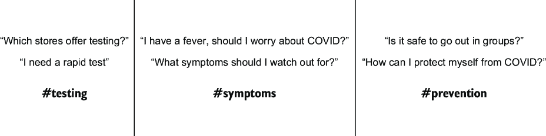
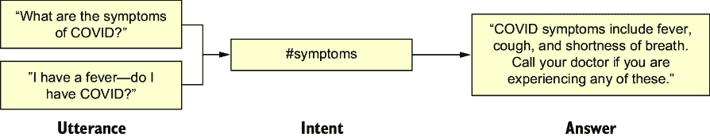
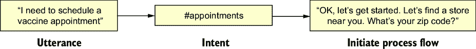
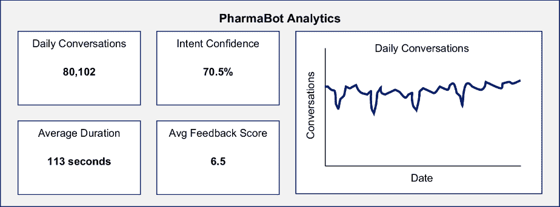
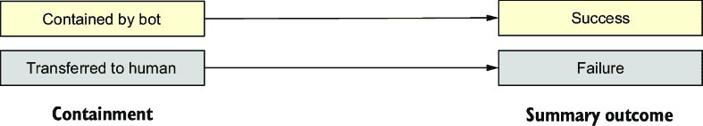
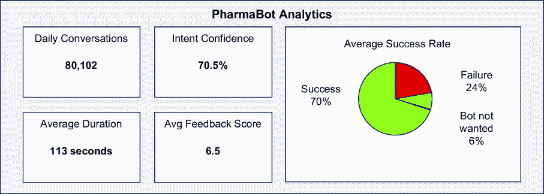
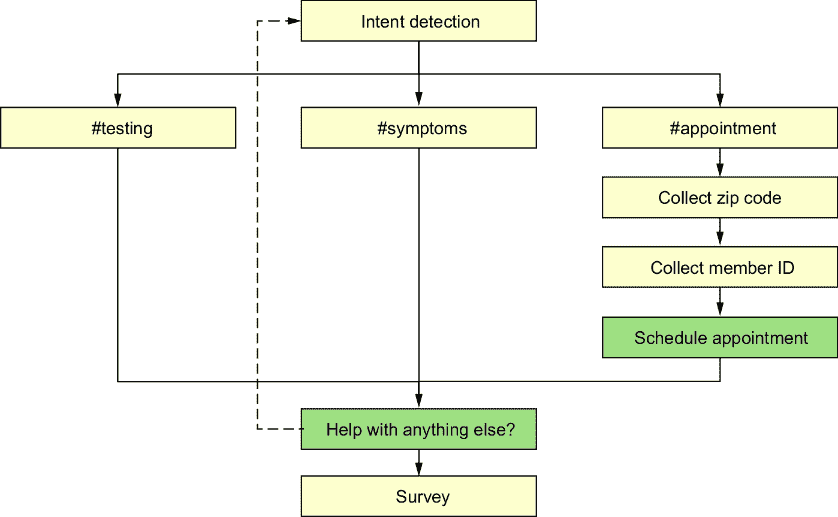
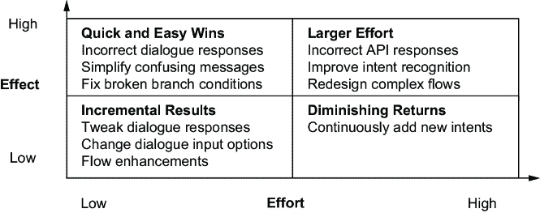
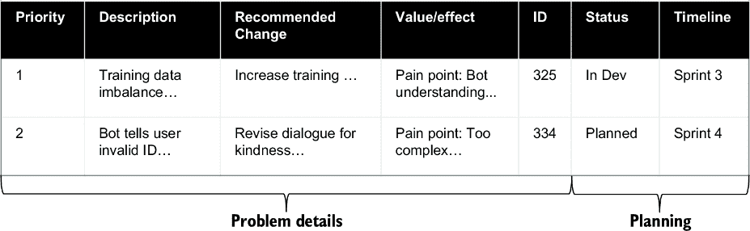

# 3 计划改进

### 本章涵盖

+   建立一个实现对话式人工智能成功的跨职能团队

+   通过业务目标、关键指标和用户痛点来定义成功

+   通过结果和指标分析有效性，以指导改进

+   实施结构化流程以识别、报告、分诊和优先处理问题

每个对话式人工智能解决方案都应该以成功为目标，而成功根据所涉及的聊天机器人的类型而有所不同。例如，问答机器人必须提供快速、准确的响应，同时最大限度地减少后续交互。面向流程或交易型的机器人必须有效地引导用户达到特定目标。路由代理必须无缝地将用户引导到适当的目的地。

然而，误解用户意图、过度复杂化和立即退出可能会阻碍进步并给用户带来痛苦。解决这些挑战可以提高聊天机器人的性能，并帮助其取得成功。那些持续改进其聊天机器人的组织最有可能实现最佳结果。

在跨职能团队中结合多样化的专业知识对于持续改进至关重要。团队成员可以通过他们独特的视角、技能和洞察力推动变革。然而，团队需要就如何改进他们的解决方案达成一致。

对话式分析师希望简化对话，但企业希望传达具体信息。谁是对的？在本章中，我们将展示 MediWorld 公司（一家虚构公司）的团队如何适应和改进他们的聊天机器人。他们的团队最初通过增强他们的问答机器人开始，但随着用户需求的变化，他们转向开发面向流程的聊天机器人的额外功能。

## 3.1 知道何时需要改进

想象以下场景：

*MediWorld，一家大型药店，其呼叫中心因有关大流行的问题而超负荷运转。他们部署了一个聊天机器人来提供与 COVID-19 相关的信息。该机器人检测到关于病毒的一组集中意图，并提供了可靠的信息。*

图 3.1 展示了 PharmaBot 高效地识别这些意图。



##### 图 3.1 PharmaBot 高效地从用户查询中检测到信息意图。

*疫苗即将可用时，客户的问题性质发生了巨大变化。突然之间，每个人都有一系列不同的问题：*

+   *我是否有资格接种疫苗？*

+   *我可以预约接种疫苗吗？*

+   *我何时可以接种第二剂疫苗？*

+   *我必须打电话预约，还是可以在这里设置？*

+   *我接种后可以旅行吗？*

*PharmaBot 最初在理解这些问题方面很弱，经常回答：“抱歉，我不确定你在问什么。请重新表述你的问题。”用户感到沮丧和不满意，更多的对话在机器人失败后结束在呼叫中心。还有立即退出率的增加，反映出用户期望与 PharmaBot 应对不断变化的环境的能力之间明显的脱节。MediWorld 的团队着手改进这个机器人，但他们首先必须就“改进”的含义达成一致。*

注意：持续改进的需求从未如此关键，因为不断变化的患者期望和技术进步要求不断的精炼和适应。布里奇特·范·克拉林曾打趣说：“任何人任何地方最后一次最好的体验，成为他们希望在任何地方都能获得的最低期望。”改进需求可能来自内部来源（如对新功能的支持）或外部来源（其中某个事件引发了以前从未见过的全新问题）。

认识到在对话式人工智能方面需要改进是确保其有效性和相关性的关键。虚拟助手不是一个静态的解决方案；其性能必须随着用户行为、业务需求和技术进步而发展。改进的必要性通常通过关键绩效指标（KPIs）如低包含率、高回退意图使用或频繁的代理升级等迹象显现出来。规划实际改进的起点是建立一个跨职能团队，明确成功标准，分析结果，并实施结构化的问题管理流程。

当决定何时开始改进您的对话式人工智能时，最佳实践建议在您注意到重复出现的问题、下降的参与率或未实现的企业目标时就开始。主动方法可以防止小问题升级成大问题。建立定期的审查周期确保改进与不断变化的患者期望和组织目标保持一致。

在第一次部署之前，通过规划全面的数据收集策略开始您的改进之旅。记住，仅仅拥有日志文件并不能自动揭示痛点。在识别用户交互中的趋势和模式时，必须要有条不紊。许多团队倾向于解决孤立的问题，而没有考虑到这些问题的整体量或频率。虽然解决一次性问题可能看起来很有成效，但这很少能导致整体性能的实质性改进。通过关注具有重大影响的系统性问题，您可以确保您的努力始终指向有形的进步，让您感到专注和投入。

记住，在部署更改前后衡量性能同样重要。在实施修复之前建立基线指标，并与部署后的数据进行比较，以评估更改是否带来了预期的改进。如果结果与您的预期不符，请不要担心。进一步分析根本原因，并迭代您的解决方案，以有效解决任何差距或未预见到的问题。这个过程将给您带来信心和保证，您的努力正在带来实际的进步。

## 3.2 您的跨职能团队

MediWorld 认识到其 PharmaBot 在提供及时准确客户支持中的关键作用。由对话分析师、客户支持专家和数据分析师组成的跨学科团队聚集在一起，评估并提升 PharmaBot 的性能。该团队的目标不仅在于解决现有挑战，还积极预测并满足用户群体的不断变化需求：

*MediWorld 的开发者专注于提升 PharmaBot 的自然语言处理能力。他们找到了增强聊天机器人理解用户查询的方法，使其能够提供精确且具有上下文意识的响应。*

*同时，负责接听转接电话的客户服务中心代理分享了从他们那里转接的电话中的宝贵见解，揭示了常见的痛点以及频繁询问的问题。*

*MediWorld 的数据分析师深入分析了用户交互数据。他们确定了聊天机器人“失败”的区域，并按机器人最后尝试的任务对这些失败进行了分类。*

图 3.2 展示了每个小组带来的各种见解。


##### 图 3.2 该团队利用其多样化的技能确定了改进区域，为有效的改进计划奠定了基础。

让我们超越 PharmaBot 的例子，关注通常参与对话式人工智能改进计划的团队。具体角色、责任和团队规模可能根据您组织的规模、目标以及聊天机器人的复杂性而有所不同。在较小的项目中，个人可能承担多个角色。第一章介绍了构建对话式人工智能的“梦幻团队”（图 1.5）。为了改进和精炼现有的聊天机器人，也需要一个类似的多样化团队。虽然这个团队的结构在不同组织之间可能有所不同，但它通常由三个关键子团队组成，所有团队共同协作。

首先是聊天机器人的支持和维护团队。该团队的任务是分析和评估聊天机器人的性能。此外，他们还作为技术主题专家（SMEs）。他们了解聊天机器人处理的现有意图、这些意图的训练数据以及聊天机器人的对话流程。他们可以实施代码和技术更改。他们的角色和任务在表 3.1 中概述。

##### 表 3.1 聊天机器人支持和维护团队

| 角色 | 任务 |
| --- | --- |
| 数据分析师/数据工程师 | 分析用户交互和反馈，就变更、修复和增强提出有根据的建议。 |
| 聊天机器人开发者/对话分析师 | 实施聊天机器人的技术更改和增强。这可能包括新的集成（更多是开发者的角色）或更新聊天机器人的对话和动作（对话分析师）。 |
| 质量保证（QA）测试员 | 验证变更、修复或增强是否产生预期结果，并且不会导致任何意外或负面结果。测试可能是手动进行，也可能涉及自动化测试工具。 |
| 项目经理 | 协调任务；确保持续改进过程按计划进行。 |
| 其他领域专家 | 在聊天机器人生态系统特定领域提供专业知识；根据需要被吸纳到团队中。例如，安全专家评估潜在威胁，并推荐适当的安保措施或补救策略，以确保聊天机器人保持安全和能够抵御不断变化的风险。 |

第二个子团队是业务利益相关者。他们共同确保聊天机器人的改进与更广泛的组织目标和业务需求保持一致。业务利益相关者确保聊天机器人在技术上熟练，并与组织目标、用户需求和法律标准保持一致。该团队在表 3.2 中详细说明。

##### 表 3.2 聊天机器人的业务利益相关者

| 角色 | 任务 |
| --- | --- |
| 高级管理层 | 参与将改进或改进优先级与整体业务战略保持一致 |
| 客户服务 | 负责聊天机器人所处理的业务流程和工作流程 |
| 产品经理（聊天机器人） | 负责监督聊天机器人的开发和战略方向，确保其满足业务目标 |
| IT 部门 | 为聊天机器人的开发、部署和维护提供技术支持和基础设施 |
| 运营经理 | 协同工作，将聊天机器人整合到运营流程中，简化工作流程 |
| 法律和合规团队 | 确保改进符合行业法规和法律要求 |

最后一个子团队是治理团队。他们的职责是确保聊天机器人的部署、使用和持续改进与组织政策、标准和道德考量保持一致。他们在表 3.3 中列出。

##### 表 3.3 聊天机器人的治理团队

| 角色 | 任务 |
| --- | --- |
| 企业伦理/合规焦点 | 解决关于聊天机器人行为和决策的伦理问题，以及人工智能模型的风险管理。他们还确保在改进阶段遵循其负责任的 AI 指南。 |
| 治理执行团队 | 对系统路线图、待办事项和与系统相关的所有成本（支持或业务团队）的优先级有最终决定权。 |

拥有一个多元化和跨职能的改进团队确保不同的视角和专业知识为聊天机器人项目的开发和监督做出贡献。定期的会议、清晰的沟通渠道和治理政策的记录对于团队的有效性至关重要。再次强调，具体涉及的利益相关者可能根据项目的性质和范围而有所不同。

##### 练习

1.  想想你最近的一次聊天机器人实施，并列出你所有的利益相关者。讨论利益相关者对改善聊天机器人的共同目标的观点，以及这一目标如何与他们的具体目标相一致。考虑利益相关者利益之间的潜在冲突以及解决这些冲突的策略。

1.  或者，以 MediWorld 的 PharmaBot 为例，考虑各种利益相关者和他们的目标。

## 3.3 驱向同一目标

即使在一个单一的改进团队中，不同的成员可能对应该首先解决的问题有不同的优先级。考虑以下场景：

*当 PharmaBot 团队首次见面时，他们无法就如何开始达成一致。每个人都带来了他们的“必须修复”清单。有些是基于直觉，有些是基于阅读了几份记录，还有些是基于详细的分析。团队一致认为理解问题的频率是关键：这些问题是否出现在每一次对话中，还是偶尔出现？问题频率是优先排序修复和改进的关键组成部分，帮助 MediWorld 提高其聊天机器人的性能。*

*开发人员和数据分析师主张改进 PharmaBot 的自然语言处理能力，分析最近的互动以确定理解复杂和上下文相关问题的改进领域。同时，主要呼叫中心代理强调 PharmaBot 需要提供更详细和富有同理心的回应，关注他们遇到的重现用户关注的问题。*

数据驱动的方法有助于优先级排序。解决最常见的痛点将导致用户体验的整体立即和实质性的改进。图 3.2 展示了多个团队成员如何贡献不同的观察和见解。每个成员都从他们各自的职位和专业知识带来了独特的视角。

### 3.3.1 *回顾业务目标*

对话式人工智能改进团队成员必须就改进的共同目标达成一致。第一步是就成功意味着什么达成共识——团队必须重新审视最初推动聊天机器人实施的商业目标。例如，问答机器人必须能够持续快速且准确地响应用户问题。以流程为导向的机器人必须帮助用户高效地实现目标，如安排预约或检查账户。路由代理必须根据用户的查询将用户引导到能够满足他们需求的地方或专家。评估聊天机器人性能是否符合这些目标涉及响应准确性、用户满意度以及机器人处理广泛相关主题和用例的能力等指标。

随着商业格局的发展，适应性变得至关重要。用户期望的变化或技术进步可能需要增强或战略转变，以保持聊天机器人的最佳性能。因此，团队必须持续重新评估和细化聊天机器人策略，确保其与整体组织目标和用户目标保持一致。这个迭代过程满足了业务及其用户不断变化的需求。

#### 从业务成果到指标

定义正确的指标始于理解商业目标如何随时间演变。考虑以下场景：

*PharmaBot 团队需要将他们的努力与高效疫苗分配和可及性的重要性对齐。虽然最初的企业目标是回答问题并减轻他们的呼叫中心的负担，但商业目标已经转变为有效分配疫苗和自动化预约流程，这需要不同的指标。*

当有疑问时，考虑你的用户——他们需要什么，这些需求如何推动业务？最初的企业目标是什么？用户想要什么？两者是如何对齐的？认识到这些答案可能会随时间而变化。图 3.3 显示了 PharmaBot 的第一个商业目标：提供关于新流行病准确且最新的信息。准确性是关键指标。



##### 图 3.3 PharmaBot 最初是一个简单的问答机器人。许多问题种类都得到了相同的答案。

一旦建立了稳定的基础，PharmaBot 团队就增加了问答机器人的复杂性和智能。他们检测实体（与意图相关的上下文元素）以向用户提供更有针对性的答案并提高准确性，如图 3.4 所示。


##### 图 3.4 通过检测用户话语中的实体，问答变得更加复杂，从而在共同意图内提供更具体的答案。

然后，外部影响再次改变了业务目标。疫苗的可获得性改变了机器人的性质。用户不再仅仅与关于病毒的纯问答互动，而是希望通过机器人直接安排疫苗预约。这需要以流程为导向的流程来收集多份信息。图 3.5 显示了这一流程的开始。



##### 图 3.5 一些问题类型没有单一的静态答案，但需要完整的流程来满足。

这些新功能带来了复杂性。自动化测试和疫苗预约需要与调度系统和数据库集成。这增加了对安全和隐私措施的关注。保护用户个人信息、遵守医疗保健法规和确保安全交易变得至关重要。

并非所有对话式人工智能解决方案都必须应对这种演变，至少不是像 PharmaBot 那样迅速。管理聊天机器人的演变需要仔细考虑与聊天机器人转型每个方面相关的成本和收益。

任何对话式人工智能解决方案的主要业务目标都围绕着提升整体业务成果。每个企业都有对话系统的目标或目标，这归结为两个关键因素：收入生成和成本降低。这些目标转化为如提高转化率、更高的平均订单价值（AOV）和增强客户终身价值（CLV）等指标，以促进收入增长。在成本方面，如降低平均处理时间（AHT）、降低运营成本和改善首次接触解决率（FCR）等指标反映了成本节约。组织期望投资回报率（ROI）可衡量，这些绩效指标指导持续改进工作，将对话式人工智能的成功直接与关键业务成果对齐。

业务目标必须转化为可衡量的指标。这允许对对话式人工智能满足其目标的情况进行量化评估。表 3.4 中的示例展示了各个行业的业务如何定义与特定目标一致的可衡量指标。

##### 表 3.4 从各个行业的业务目标中得出的样本指标

| 业务目标 | 结果指标 | 机器人类型 |
| --- | --- | --- |
| 提高在线销售额，降低客户服务成本。 | 未经人工干预完成结账的聊天机器人百分比：实现 75%的自动化结账，每天减少 10 万个客户服务咨询，导致每天节省 500,000 美元。 | 问答 |
| 提高客户支持效率，并最小化服务中断。 | 成功路由到适当部门或专家的查询百分比：90%的查询直接路由到相关支持团队，无需人工干预，导致每天支持工单减少 40,000 件，从而每天节省 700,000 美元。 | 路由代理 |
| 提升预订体验，并降低支持成本。 | 无需代理干预的自动化预订确认百分比：实现 70%的自动化预订确认，每天减少 80,000 项支持查询，从而每天节省 640,000 美元。 | 流程导向 |
| 提高患者参与度，并优化预约安排。 | 虚拟助手自主安排的预约百分比：90%的预约由虚拟助手自主安排，每天减少 30,000 项手动安排任务，从而每天节省 700,000 美元。 | 流程导向 |

对话式指标需要与商业价值建立清晰的联系，以证明投资回报。如呼叫中心转接和路由准确度等指标可以降低成本。如客户满意度等指标，当满意的客户消费更多服务时，会导致收入增加。PharmaBot 团队通过自动化预约安排实现了成本节约和收入增长。

#### 其他业务驱动因素

除了与上一节讨论的核心业务目标保持一致外，组织还应考虑其他推动对话式人工智能价值的因素。成功的 AI 实施不仅仅是支持高级目标——它们还积极提升客户参与度，优化销售策略，并降低运营成本。

对话式人工智能可以加强客户互动，引导销售，并推荐相关产品。分析由聊天机器人驱动的转化率对于完善策略至关重要。探索 AI 驱动功能以进行升级销售和交叉销售的商家可以最大化收入机会。从运营角度来看，对话式人工智能通过处理常规任务，使人工代理能够专注于复杂活动。自动化流程提高效率，降低支持成本，并提升对更快响应的满意度。

详尽的分析可以发现改进机会和优化聊天机器人性能的机会。随着技术的进步，企业应扩展聊天机器人功能，以实现持续的成本降低和运营卓越。

竞争对手分析，评估自然语言理解和个性化体验等特性，可以指导持续改进。定期更新使企业能够适应竞争格局的变化，推动创新以实现积极的商业成果。

### 3.3.2 效果

在确定改进优先级时，另一个需要考虑的关键因素是聊天机器人的有效性。聊天机器人是否做到了它应该做的事情？虽然“有效性”的概念很简单（是否按预期工作？），但它超越了任务完成。它涉及到为用户提供积极和高效的经验。

让我们继续我们的场景，团队现在正在查看显示聊天机器人指标的仪表板。大多数聊天机器人开发平台都有一个简单的分析仪表板，包含总结用户如何与聊天机器人互动的关键绩效指标（KPIs）。这些仪表板通常包含对话数量、聊天机器人信心和对话持续时间的统计数据。它们也可能包括最常问的问题或意图。

图 3.6 展示了为 PharmaBot 创建的分析仪表板。虽然它显示了部分关键绩效指标（KPIs），但它并不能表达 PharmaBot 的有效性。总对话次数帮助我们理解流量，但它并不能帮助我们评估有多少人成功完成了聊天，或者他们聊到了什么程度。



##### 图 3.6 PharmaBot 的基本分析仪表板显示了使用总结，但不能提供用户对机器人喜欢（或不喜欢的）什么的信息。

*团队试图确定当前的协助率。基本分析给了他们每天总查询量的信息，但他们需要帮助确定其中有多少是成功的。团队需要超越仅仅对话数量的层面。每个人都清楚用户需求在增加。PharmaBot 是否满足了新的需求？他们需要找出如何衡量机器人的有效性，并找到优化其性能的方法。团队发现 45%的所有对话都转移到了呼叫中心。这个“控制”指标影响了企业的成本。他们能对这个数字做些什么呢？*

在 PharmaBot 团队的情况下，衡量有效性的一个关键指标是控制率。*控制对话*是指聊天机器人可以独立完全处理用户查询的情况；*未控制对话*则需要人工介入。*控制率*是控制对话数除以总对话数的结果。这个指标提供了对聊天机器人性能的高层次衡量，如图 3.7 所示。


##### 图 3.7 基本每日仪表板显示了简单的业务指标：控制率。这个指标每天都会跟踪，但仍然不能提供对机器人性能的深入洞察。

PharmaBot 的仪表板暗示了一个简单的成功定义：“控制通话即为成功。”这种思维模型总结在图 3.8 中。然而，虽然控制是一个有价值的指标，但它并不能解释为什么用户在与机器人互动时成功（或失败）。需要更详细的分析来获得更深入的见解。



##### 图 3.8 最简单的结果定义。这并不能揭示如何改进机器人。

#### 对话结果

为了更好地理解对话结果如何影响聊天机器人的改进，让我们回到我们的示例场景。PharmaBot 维护团队需要超越高级性能指标，并分析实际的对话结果。仅仅控制并不能捕捉到全貌——它只能告诉他们对话是否留在机器人这边。但那些对话中真正发生了什么？以下是他们对对话进行深入审查的方式：

*团队深入到大量的对话记录中，以了解对话中发生了什么。它们是如何结束的？团队发现了一系列的结束方式——成功的完成、放弃的对话，以及令人困惑的大量转移。*

*数据分析师观察到了不同的成功类型。首先，是 PharmaBot 对查询做出良好响应，用户感到满意的预期情况。其次，由于业务规则，如用户居住在 MediWorld 无法进行短信确认的州，导致向呼叫中心的移交。这些移交也是成功的，因为它们与 PharmaBot 的初衷一致：收集所需信息，以便人类专家不必这么做。团队一致认为，他们需要分别记录这两种情况。他们将它们标记为“自动解决”和“有意转移”。*

*然后是明确的失败场景。用户在机器人误解了他们之后要求人工代理。当机器人连续误解用户时，也会自动转移用户。还有一些用户在预约安排中途断开连接。*

*最后，PharmaBot 团队发现了用户甚至没有尝试的对话。用户要么在机器人问候后默默断开连接，要么以“agent”这个词开始对话。一位团队成员评论说：“也许这里有一个心理因素在起作用：一些用户不想与机器人互动。让我们也将这些对话分开。”*

*团队最终开发了一套细致的分类系统：成功（自动解决和有意转移）、失败（放弃和升级）、不需要机器人（立即断开连接和立即升级）。*

*一旦分类系统建立，计算每个分类中的对话数量就变得容易了。PharmaBot 团队开始真正理解他们机器人的性能。*

定义与你的指标相关的详细对话结果将为你提供关于解决方案性能的见解。对话结果描述了用户与聊天机器人的交互如何结束，分类了聊天机器人是否解决了查询、需要人工帮助，或者导致不完整的会话。定义这些结果是评估和改进你的解决方案以符合业务目标的关键。一旦你的解决方案部署，分析你的对话日志，并根据结果模型对它们进行分类。

图 3.9 展示了新的详细结果模型。它从左边的遏制开始，然后详细分解了遏制（和非遏制）结果及其原因。最后，这些原因被映射回成功和失败类别。这些原因帮助我们了解机器人哪里做得对，哪里做错了。例如，对话可能因为“失败”而未能遏制：可能是用户选择退出，或者机器人反复不理解。有些对话根据业务流程有意转交给人类——这些不算失败。


##### 图 3.9 分解对话为何未能遏制，可以更深入地了解机器人性能，并显示你的机器人需要改进的地方。实现这一目标的一种方法是通过使用详细的结果分类，这些分类定义了聊天机器人交互的具体结果。这些分类根据对话的解决方式、用户体验和下一步行动对对话进行分类。

现在我们已经介绍了细粒度结果模型的概念，考虑对话可能如何（在哪里以及为什么）结束，让我们看看图 3.7 中我们看到过的相同指标仪表板。我们不再关注 45%的遏制率，而是更好地理解对话。在图 3.10 的仪表板上，我们用成功率图表替换了遏制率图表，表示成功/失败/不希望作为最高级别的类别。



##### 图 3.10 通过成功率增强总结仪表板。并非所有包含的呼叫都成功；并非所有转接的呼叫都是失败。

实际上，你可能还想展示结果细节。在图 3.11 中，我们展示了这可能是什么样子。这种方法使你能够快速将高级结果分解为详细结果，这也有助于你获得利益相关者对改进的认可。


##### 图 3.11 的详细结果模型描绘了在一段时间内汇总的对话结果和结果细节。这比二元的“遏制或不遏制”模型提供了对机器人性能的更多洞察。

详细结果模型的优点在于其灵活性。每个对话式人工智能项目都可以定义自己的独特结果分类。图 3.11 中所示模型是一个有用的示例实现。一如既往，根据您的需求调整此模型。例如，如果您的聊天机器人没有人工转接，则可以省略升级和转移结果。

这里有一些常见对话式人工智能解决方案的推荐分类。

对于问答机器人：

+   成功——对话完成场景：

    +   自动解决——问答机器人成功回答用户的问题或提供相关信息，无需人工干预。

+   失败——交互未能实现预期结果：

    +   放弃——用户在得到满意的答案之前离开对话，可能是因为对机器人响应的挫败感或不满。

    +   升级——问答机器人不理解用户，交互升级到人工代理以获得进一步的帮助。这可能是由用户请求引起的，或者机器人可能在多次连续误解后自动升级。

+   不需要聊天机器人：

    +   立即断开连接——用户在未向机器人发送任何消息的情况下退出对话。

    +   立即升级——用户对机器人的第一次发言是请求人工代理。

对于交易型或流程导向型机器人：

+   成功——对话完成场景：

    +   自动解决——流程导向型机器人成功完成用户的预期任务，例如预约，无需人工干预。

    +   故意转移——如果业务规则要求，即使没有遇到“错误”，机器人也会将交互转移到人工代理。

+   失败——交互未能实现预期结果：

    +   放弃——用户在交易中途放弃对话，可能是因为复杂性或对机器人界面的困惑。

    +   升级——机器人开始但无法完成流程，因为误解了用户或用户请求人工代理。

+   不需要聊天机器人：

    +   立即断开连接——用户在未向机器人发送任何消息的情况下退出对话。

    +   立即升级——用户对机器人的第一次发言是请求人工代理。

对于路由代理：

+   成功——对话完成场景：

    +   故意转移——路由代理成功将用户引导到正确的部门或专家，可能传递到目前为止收集的所有信息。路由代理可能有 0%的包含率，但工作得非常好！

+   失败——交互未能实现预期结果：

    +   放弃——用户在机器人路由之前退出对话。

    +   升级——路由代理无法收集足够的信息来路由用户，无论是由于误解还是用户请求人工代理。

+   不需要聊天机器人：

    +   立即断开连接——用户在未向机器人发送任何消息的情况下退出对话。用户不能自动路由。

    +   立即升级：用户的第一次与机器人的对话请求是要求人工客服，绕过了所有自动化路由。

当你这样对对话进行分类时，每个类别中的对话数量可以帮助你评估聊天机器人实施的有效性并确定改进领域。

详细的结果模型应该与对话设计集成。一个很好的方法是定义每个机器人“快乐路径”问题的里程碑。图 3.12 显示了 PharmaBot 的这种设计。阴影框中显示的“安排预约”里程碑标志着机器人完成调度过程的关键步骤。“需要帮助其他任何事情吗？”也被阴影覆盖，表示机器人在完成主要任务后准备进一步协助。



##### 图 3.12 PharmaBot 的高级设计，包括对话重要部分的里程碑。“安排预约”和“需要帮助其他任何事情吗？”都被标记为成功路径。

常见问题解答（FAQ）的意图只有一个里程碑（FAQ 响应），而预约流程则收集多个数据点。应该标记声明成功完成的里程碑。

当详细的结果模型与设计叠加时，它最为强大。当每次对话都有一个结果和一个“最后里程碑”时，你可以快速找到洞察。在图 3.13 中，我们看到 PharmaBot 在失败对话中的指标随时间变化，包括最后的部署日期。


##### 图 3.13 当结果模型和对话设计叠加时，洞察变得明显。此图表按失败前的最后一步分解失败对话，有助于确定用户最困难的领域。不同的类别——如预约安排、意图检测和邮政编码输入——显示了它们随时间对总体失败相对贡献。在“部署更改”之后的峰值突出了最近更新的影响，为需要进一步优化的领域提供了洞察。

PharmaBot 团队可以进一步深入到失败的对话中，查看废弃和升级的详细结果。结合结果模型和对话设计可以启动你的数据驱动分析。它可以告诉你从哪里开始调查。

图 3.11 中的详细结果模型通过揭示对话失败的原因和地点，提供了对用户体验的更深入洞察。在这种情况下，结果是失败，主要原因是用户升级。然而，查看用户升级的具体点——在失败前的最后一步——提供了可操作的建议。图表中的分解突出了关键的升级点：在预约安排、意图检测、会员 ID 收集和邮政编码输入期间。部署更改后，意图检测步骤的失败率显著下降，而会员 ID 和邮政编码收集的失败率略有下降。然而，预约安排的失败率激增，表明一个新的摩擦领域。这种分析水平使团队能够有效地确定改进的优先级，确保他们的修复针对最紧迫的用户痛点。虽然遏制率通常被用作衡量有效性的高级指标，但它并不能讲述全部故事——一些遏制可能仍然导致糟糕的用户体验，一些转移可能是为了成功的结果所必需的。图 3.13 中的结果模型帮助对话人工智能团队区分这些情况，并相应地调整机器人。

#### 客户满意度

在结果模型中，我们通过对话结果推断客户满意度。这是一个快速的方法，但它是间接的，可能会遗漏一些细节。更直接地了解客户满意度是有用的。

可以通过收集用户的直接反馈来衡量客户满意度。点赞或踩或数值满意度评分是标准的。这些指标的唯一缺点是用户响应率通常很低——许多用户讨厌提供反馈——尽管不满意的用户更有可能抓住机会抱怨。

您可以在聊天机器人结束互动后实施调查。调查可以包括关于易用性、有用性和对机器人整体满意度的提问。此外，还可以向用户展示净推荐者得分（NPS）调查。请保持调查简短：调查越长，用户完成的可能性就越小。

您还可以通过审查对话样本来评估客户满意度。审查可以包括完成对话的人类代理人的聊天记录或摘要。这些日志和摘要甚至可以使用大型语言模型进行分类。表 3.5 显示了您可以在每种对话结果类型中寻找的反馈类型。

##### 表 3.5 将反馈与对话结果细节关联

| 对话结果细节 | 用户反馈 | 注意事项和警告 |
| --- | --- | --- |
| 自动解决（成功） | 正面反馈或无 | 用户可能会给出正面反馈来结束互动（“谢谢！”）。但这种情况不太可能：大多数用户一旦得到他们需要的东西就会断开连接。 |
| 转接（成功） | 正面口头反馈或无反馈。不在聊天记录中。 | 用户可能对人类代理关于机器人的口头反馈，而不是直接对聊天机器人进行反馈。 |
| 放弃（失败） | 负面反馈或无反馈（在流程完成前断开连接） | 用户对机器人的最后评论可能带有负面情绪（“我讨厌这个！”）。但许多用户不会麻烦表达他们的挫败感——他们只是断开连接。 |

| 用户升级（失败） | 负面反馈 | 在流程中请求代理的用户不满意（“让我联系代理！”）。 |

|

| 机器人升级（失败） | 无 | 当机器人启动升级时，我们无法证明用户不满意，但我们可以合理地假设如此。 |
| --- | --- | --- |
| 立即断开连接（不希望使用聊天机器人） | 未提供反馈（无参与） | 立即断开连接的用户可能讨厌所有聊天机器人，可能讨厌你的聊天机器人，或者可能意外地连接到它。你无法确定。 |
| 立即升级（不希望使用聊天机器人） | 未提供反馈，或口头负面反馈表示希望获得人类帮助而不是使用聊天机器人 | 立即升级的用户可能讨厌所有聊天机器人，可能讨厌你的聊天机器人，或者可能只是更喜欢人类。你无法确定。 |

### 3.3.3 覆盖范围

作为提高聊天机器人有效性的部分，识别机器人可以处理的内容（或者说，其*覆盖范围*）的差距，与解决升级问题一样重要。在持续的分析中，很明显，一些用户的问题并不是因为理解错误——它们只是没有被机器人的现有知识覆盖。随着团队发现这些差距并努力扩展 PharmaBot 的功能，场景继续进行：

*该团队优先处理升级问题，因为它们对指标的影响最大。他们分析了升级对话的记录，并开始出现一些模式。用户通常在机器人不理解他们之后立即升级。数据分析师将这些实例与对话流程进行了交叉参考，并建议如何改进机器人的自然语言处理能力。在分析过程中，他们发现了一些 PharmaBot 无法回答的问题：*

+   *“我听说有罕见的副作用。我如何区分疫苗接种后的症状和需要医疗注意的更严重情况？”*

+   *“如果我错过了推荐的 COVID-19 疫苗的第二剂，几天后它仍然有效，还是需要重新开始？”*

+   *“我怀孕了，我不确定是否可以接种 COVID-19 疫苗。你能提供有关孕妇安全性和潜在益处的信息吗？”*

+   *“我被诊断出患有自身免疫性疾病。我还能接种 COVID-19 疫苗吗？我需要采取哪些额外的预防措施？”*

+   “我阅读了关于 COVID-19 疫苗长期效果的矛盾信息。关于它们在长期内的安全性有何了解，目前是否有正在进行的研究？”

对于这类问题，即使用户尝试重新措辞，PharmaBot 也会回答“抱歉，我不理解”。团队寻找具有相似特征的提问集群，以确定机器人接下来应该训练的内容。除了其他意图外，还出现了一组与疫苗安全相关的查询。

覆盖率衡量聊天机器人尝试有效回答的用户问题数量。覆盖率低的聊天机器人要么缺乏关键主题的训练数据，要么在重叠和模糊的意图上挣扎，类似的问题会混淆模型，并阻止它自信地选择正确的响应。

团队必须分析用户交互来提高覆盖率，识别聊天机器人无法提供有意义响应的空白点。这个过程涉及评估录音、跟踪失败的查询和确定当前未得到支持的重复用户需求。解决这些空白点可能需要细化训练数据、重构意图分类或引入检索增强生成（RAG）等替代方法。

几种方法可以增强聊天机器人的覆盖率，每种方法都针对不同的挑战：

+   第五章探讨了通过细化训练数据、解决缺失意图和优化标注策略来提高薄弱理解的方法。

+   第六章讨论了如何使用基于检索的技术结合生成式 AI（RAG）来绕过意图限制，提供更动态和更信息丰富的响应。

+   第七章展示了生成式 AI 如何生成额外的训练和测试数据，以扩展聊天机器人处理多样化查询的能力。

无论采用何种方法，提高聊天机器人覆盖率都需要对现实世界交互进行持续分析。检查用户话语、识别常见的失败点并对机器人的设计进行迭代，以确保它更有效地满足用户需求。

##### 练习

1.  考虑以下聊天机器人和它们的企业目标。为每种聊天机器人类型制定合适的指标和目标，以评估其有效性和性能：

    +   Bot 1——电子商务网站的客户支持机器人（问答机器人）

    +   Bot 2——银行账户管理机器人（交易或流程导向型机器人）

    +   Bot 3——电信公司的客户服务机器人（路由机器人）

1.  检查以下在 PharmaBot 聊天记录中发现的场景。根据 PharmaBot 对每个场景的响应，从模型中分配一个结果。一旦为每个场景分配了结果，请反思您观察到的任何有关机器人性能和潜在改进领域的模式或趋势。请记住，对话结果为成功、失败和用户不希望聊天机器人。

    +   场景 1

```py
User: "I heard about rare side effects. How can I distinguish between post-vaccine symptoms and something more serious that requires medical attention?" 
PharmaBot: "Hello! It's essential to be informed about potential side effects. Common side effects of COVID-19 vaccines include soreness at the injection site, fatigue, and mild fever. However, it's crucial to seek medical attention immediately if you experience severe symptoms like difficulty breathing or chest pain." 
User: "Thanks for the information, but what if I'm unsure whether my symptoms are severe enough to warrant medical attention?" 
PharmaBot: "If you're unsure, it's always better to err on the side of caution and consult a healthcare professional. They can assess your symptoms and provide guidance tailored to your specific situation." 
PharmaBot: "Would you like me to connect you with a healthcare professional to discuss your concerns further?" 
User: "Yes, please. That would be helpful." 
PharmaBot: "Great! Please hold for a moment while I transfer you to a human agent who can provide personalized assistance. Your health is our top priority." 
PharmaBot: (Initiates transfer to a human agent)
```

1.  +   场景 2

```py
User: "If I missed the recommended second dose of my COVID-19 vaccine by a few days, will it still be effective, or do I need to start over?" 
PharmaBot: "Hello! It's important to follow the recommended vaccination schedule for optimal protection. If you've missed the second dose by a few days, it's best to contact your healthcare provider for guidance on the next steps." 
User: "I see. Will the delayed second dose affect the effectiveness of the vaccine?" 
PharmaBot: "The delay may impact the vaccine's effectiveness, but receiving the second dose as soon as possible is essential. Your healthcare provider can assess your individual situation and advise accordingly." 
User: "Got it, I'll contact my doctor for advice. Thanks for your help!" 
PharmaBot: "You're welcome! It's always best to consult with a healthcare professional for personalized guidance. If you have any more questions, feel free to ask."
```

1.  +   场景 3

```py
User: "Hi there. I have a question about the COVID-19 vaccine." 
PharmaBot: "Hello! I'm here to help. What would you like to know about the COVID-19 vaccine?" 
User: "Agent" 
PharmaBot: "Of course! Let me connect you with one of our human agents who can assist you further." 
PharmaBot: (Initiates transfer to a human agent)
```

1.  +   场景 4

```py
User: "Can you tell me about the ingredients in the COVID-19 vaccine?" 
PharmaBot: "Sorry, I don't understand. Could you please rephrase your question?" 
User: "What are the components of the COVID-19 vaccine?" 
PharmaBot: "I'm sorry, I still didn't quite get that. Can you try asking in a different way?" 
User: "What is the composition of the COVID-19 vaccine?" 
PharmaBot: "I'm having trouble understanding your question. Could you provide more context or try asking in simpler terms?" 
User: (hangs up)
```

## 3.4 识别和解决问题

识别问题对于持续改进对话式人工智能至关重要。聊天机器人团队需要一个处理问题的方法论，包括如何发现问题、如何作为团队进行推理以及如何确定何时解决问题。这个方法论将使团队能够朝着共同的目标努力。

### 3.4.1 发现问题

开始寻找问题的最佳方式是检查对话结果的趋势。看到成功的对话固然很好，但应关注失败和“用户不希望聊天机器人”的对话。深入研究具有上升趋势的结果。如前所述，当这些结果与您的对话设计叠加时，它们最具洞察力。用户在负面结果发生前做了什么？图 3.14 仪表板帮助了 PharmaBot 团队。


##### 图 3.14 按最后一步操作分解结果，观察随时间的变化。

理想情况下，您的分析工具可以按以下方式计数和绘制对话：

+   对话结果

+   对话中的最后一步

+   对话的日期和/或时间

您的对话式人工智能平台可能已经跟踪了这些数据点。其他平台可能需要通过在对话流程的关键部分添加上下文变量来进行配置。有了这些指标，团队能够发现影响聊天机器人性能的意外用户行为。例如，当 PharmaBot 团队分析升级的对话时，他们发现了一个令人惊讶的模式：

*PharmaBot 团队深入分析了升级的对话。他们发现当 PharmaBot 询问用户预约是否为疫苗或检测时，出现了许多失败。许多用户回答“是”——这个回答与预期的格式不符。*

*认识到理解用户行为的重要性，团队意识到机器人无法解释这种模糊的“是”响应，这导致用户感到沮丧。有些用户甚至在 PharmaBot 重复提问时再次说“是”。这是导致对话放弃和升级的令人惊讶的原因。*

一旦找到问题区域，你就可以开始设计解决方案。设计受到问题遇到和解决方式的影响。在“意外肯定”场景中，有两种出路：处理“肯定”，或者尝试让用户停止说“肯定”。

让我们看看更多发现问题的方法。

#### 定性问题探索

虽然指标和对话日志提供了有价值的见解，但一些聊天机器人问题仅通过定量分析难以检测。通过收集和分析用户反馈来启动定性改进工作，可以帮助你发现更多用户痛点。让我们看看 PharmaBot 团队是如何进行他们的调查的：

*为了揭示更深层次的用户挫折，PharmaBot 团队通过收集和分析直接用户反馈启动了定性改进工作。他们鼓励用户通过调查分享他们挑战和期望的详细描述。一旦收集到反馈，团队将其分类以识别常见的痛点，如表 3.6 所示。*

##### 表 3.6 调查回应导致识别出的痛点（第一部分）

| 用户 | 调查回应 | 识别出的问题 |
| --- | --- | --- |
| 1  | 我尝试询问不同州的疫苗资格问题，但机器人无法提供明确的信息。当我计划旅行时，不知道自己是否有资格接种疫苗，这让人感到沮丧。回复看起来很笼统，并没有解决不同地点资格标准的复杂性问题  | PharmaBot 理解了基本意图（资格），但未能提供特定州的信息。聊天机器人没有考虑用户的地理位置或他们咨询的州，导致回复无助于解决问题。  |
| 2  | 我尝试安排疫苗预约，但整个过程感觉很混乱。机器人的指示不明确，我感到不确定我的预约是否成功预订。如果机器人能在整个预约过程中提供更多指导将很有帮助。  | 预约工作流程缺乏清晰性，导致用户对他们的预约是否成功预订感到不确定。  |
| 3  | （未提供调查回应；用户离开了聊天）  | 过于复杂的步骤阻碍了用户完成流程。用户 3 没有完成调查。  |

与对话日志不同，定性反馈提供了对用户挫折的直接洞察——你不必推断出了什么问题。结合相应的对话记录，这种反馈为改进团队创造了一个更清晰的画面，使得诊断和解决聊天机器人缺陷变得更加容易。

招募用户提供可操作性的反馈可以显著提高聊天机器人的性能和用户满意度。然而，大多数用户都不愿意留下反馈。提供小额奖励或甚至简单的、真诚的感谢可以鼓励参与。如果反馈是您改进策略的关键部分，请考虑实施一个为用户和您的团队都创造双赢局面的系统。

警告：提供的示例提供了关于特定用户挑战的宝贵见解，但它们可能不具有统计学意义。不要基于孤立实例仓促采取解决方案。寻找已识别问题的重复发生，以衡量每个问题的规模和影响。

#### 问题发现的数量化评估

虽然定性反馈有助于揭示用户的挫败感，但它也可以揭示可衡量的功能问题。像缓慢的响应时间或令人困惑的对话流程这样的挑战可以通过对话日志进行量化，这有助于团队诊断问题并优先考虑改进。让我们继续我们的场景，看看还发现了哪些其他问题：

*除了找到描述性的* *问题**之外，PharmaBot 团队还发现了可解决的功能* *问题**。一个示例* *问题* *在表 3.7 中展示。

##### 表 3.7 导致识别出痛点的调查响应（第二部分）

| 用户 | 调查响应 | 识别出的问题 |
| --- | --- | --- |
| 4  | 机器人几乎花了 5 分钟才告诉我疫苗预约的可用性。延迟非常不便，尤其是在尝试安排我的日程时。更快的响应会更有帮助。我去了机器人，以免被长时间等待！  | 过长的响应时间让用户感到沮丧，并降低了聊天机器人作为传统客户支持更快替代方案的价值。  |

通过分析对话日志中每一步所需的时间，可以识别出这类问题。你可以跟踪每个步骤的平均时间和最大时间。异常值可能表明后端系统性能不佳或用户花费大量时间思考的令人困惑的问题。

这种分析甚至可以在对话子集上进行。例如，响应缓慢的 API 更有可能导致用户断开连接。深入分析被遗弃的对话，审查用户说了什么以及各个步骤花费了多长时间。这种分析可以在不直接要求用户反馈的情况下进行。

通过识别与对话流程相关的具体挑战，分析师可以有效地针对对话系统的改进进行定位。

### 3.4.2 组合审查

*在审查他们的对话结果指标和用户反馈后，PharmaBot 团队列出了一系列具体的* *问题**。现在他们必须制定改进计划，从优先考虑* *问题**开始。

#### 问题分级

在这些指标到位后，团队可以揭示影响聊天机器人性能的意外用户行为。例如，当 PharmaBot 团队分析升级的对话时，他们发现了一个令人惊讶的模式：

*在 PharmaBot 中确定的最关键问题是频繁误解用户查询，尤其是在区分关于 COVID-19 检测和疫苗相关预约的查询时。当机器人不理解时，用户会感到沮丧，经常导致对话中断或升级。呼叫中心代理们一致认为，他们在听到沮丧的用户时听到了这个问题。分析确认了这个问题的高频次。*

*团队同意解决这个高优先级问题。业务目标是完成设置预约而无需人工代理干预。他们发现了一个预约完成失败的原因重复出现的模式：机器人对用户想要的预约类型感到困惑，用户感到被误解——许多交易都失败了。机器人既让人难以理解，又过于复杂。*

在发现问题后，团队必须系统地评估和根据其感知价值和预期对系统的影响优先级排序问题。这包括评估诸如问题发生的频率、实施修复的成本以及解决问题的潜在好处等因素。通过采用结构化的优先级排序方法，他们可以确保改进带来最大的价值，同时利用可用的资源。在 PharmaBot 场景中，最高优先级是解决关于预约类型的误解，因为这直接影响了完成预订工作流程的能力，这是核心业务目标。图 3.15 展示了问题的一个样本评估。为了更全面地描述，洞察可能包括问题的数量、对话结果、受影响用户的修复复杂性、其他受影响的流程等等。


##### 图 3.15 Schedule Appointment 流程中升级对话增加的分析，确定潜在原因（引导用户联系代理的新措辞）并提供改进建议

图 3.15 中展示的问题分析可以通过帮助根据效果和解决复杂度优先级排序聊天机器人改进，从而对更广泛的三级分类过程做出贡献。每个问题都以类似的方式进行记录，包括对问题的洞察、可能的原因和提出的解决方案。在完整的三级分类过程中，许多此类问题条目根据效果、频率和解决努力进行评估，以确定优先级。最佳的优先级实践考虑价值、预期成果和预期回报。你必须进行成本/效益分析。效益可能是直接的（提高控制），也可能是间接的（改善用户体验）。成本可能包括时间、努力和修复的复杂性，需要多个部门同意的修复将花费更长的时间。预期回报考虑了效益和成本，并按受影响的对话量进行缩放。目标是关注那些预期回报足以证明时间和资源投资的领域。图 3.16 展示了问题预期回报计算的示例。


##### 图 3.16 用户在放弃聊天机器人对话并感到沮丧后达到呼叫中心代理的成本评估

当给定的对话流程由人工代理处理而不是通过聊天机器人时，成本效果可以很容易地计算。这个计算考虑了每次通话的代理成本、每天的总通话次数以及转交给人工代理的对话率。当有这种财务效果的支持时，为这个问题分配优先级要容易得多。这个计算可以重复应用于所有问题类型。记住，一些成本是间接的：例如，一个粗鲁的机器人可能会降低客户满意度，这使得量化财务效果变得具有挑战性。

努力是另一个重要的优先级驱动因素。正如问题本身有成本一样，实施修复也有成本。努力指的是实施过程中涉及的时间、资源和复杂性。关键是平衡问题的紧迫性与实施速度。最好的修复问题是效果高且努力低的问题。首先，解决那些效果高且容易解决的问题。图 3.17 根据效果和实施它们所需的努力对改进机会进行分类。



##### 图 3.17 一个效果-努力矩阵展示了所需努力与提议变更潜在效果之间的关系。

高优先级项目具有高效果和低努力，其次是中等优先级项目产生渐进式结果。低优先级项目是那些效果低且努力高的项目，它们是修复的较差候选者。这个矩阵可以帮助团队有效地优先处理他们的努力，专注于那些以最少的努力提供最大潜在效果的改变。

我们可以更深入地探讨矩阵中提出的分类。对于每个分类，我们可以提供示例问题、它们引起的用户痛点以及它们可能发生的原因。表 3.8 从一些高效、低努力问题开始，表 3.9 展示了高效、高努力问题的示例。表 3.10 概述了一些中效、高努力问题。

##### 表 3.8 高效和低努力问题示例

| 问题 | 用户痛点 | 问题可能发生的原因 |
| --- | --- | --- |
| 对话响应不正确或不足 | 聊天机器人不理解 | 由于意图识别不良、输入验证不足或未能适应用户的上下文，导致响应不正确。 |
| 对话响应差 | 聊天机器人过于复杂 | 格式和/或文本没有清楚地传达信息。 |
| 对话树损坏 | 聊天机器人无法工作 | 由于对话流程中的条件和不正确的转换配置错误，聊天机器人无法正常工作。这些错误发生在确定聊天机器人如何从一个步骤移动到另一个步骤（“跳跃”）的逻辑有缺陷或未经过彻底测试时。结果，用户可能会遇到死胡同、不相关的响应或突然的对话中断，这会负面影响控制和用户满意度。 |
| 流程增强 | 聊天机器人过于复杂 | 有特别复杂的步骤，用户难以完成。这在长时间对话中尤其可能。 |

##### 表 3.9 高效、高努力问题示例

| 问题 | 用户痛点 | 问题可能发生的原因 |
| --- | --- | --- |
| 用户无法完成流程 | 聊天机器人过于复杂 | 在流程的许多不同步骤中发生故障，需要完全重新设计流程。 |
| 用户问题完全没有得到解答 | 聊天机器人不理解 | 实现的意图不足以覆盖用户需求。这可能需要添加搜索或检索增强生成来处理不常见的问题类型。 |

##### 表 3.10 中效、高努力问题示例

| 问题 | 用户痛点 | 问题可能发生的原因 |
| --- | --- | --- |
| 对话响应不完整（由于 API 失败） | 聊天机器人不理解 | 由于 API 失败，响应不完整。机器人可能不支持所有 API 请求或响应变体。 |
| 意图混淆 | 聊天机器人不理解 | 当训练数据不平衡时，可能会发生意图混淆，这意味着某些意图的示例语句太少或太多，导致错误分类。此外，训练数据与现实世界用户查询之间的差异可能会使聊天机器人难以识别正确的意图。 |

这些分类并不是固定不变的。您应根据问题发生的频率调整变更的相对优先级。

#### 解决高级修复方案

一旦确定了高优先级问题，下一个关键步骤就是*解决问题*—概述一个高级修复方案以纠正问题。这需要团队的合作努力，共同制定一个全面的解决方案。为确保结构化的方法，团队必须解决三个基本问题：谁将负责实施修复？需要做出哪些改变？解决方案将如何实施？“谁”涵盖了实施修复的团队的具体角色和责任。“什么”定义了解决方案的性质，无论是改进机器人的自然语言处理能力、提高上下文理解能力，还是实施更复杂的意图识别系统。“如何”概述了实施所需的技术方法和方法论。

此外，团队必须确定涉及的开发工作量，考虑因素包括编码复杂性、集成需求和对外部系统的潜在依赖。这个解决问题阶段对于制定持续改进的明智计划至关重要。

#### 为所有修复分配优先级

优先级修复表是指导改进活动的不可或缺的工具。该表通过分配优先级编号、阐述已识别问题的简洁描述、提出推荐变更、量化对用户体验的潜在影响，以及提供直接链接到相关 GitHub 问题，封装了一个结构化的方法。这个全面的框架不仅简化了开发过程，而且促进了团队成员之间的高效沟通和协作。图 3.18 显示了优先级修复表的示例。


##### 图 3.18 优先级修复表的示例

表格中的每一列在有效组织和解决问题上都发挥着关键作用：

+   *优先级*—有助于确定每个问题的紧迫性，确保首先解决关键问题。

+   *描述*—提供对已识别问题的简要但清晰的概述。

+   *推荐变更*—指定为纠正问题而提出的解决方案或修改，指导开发工作。

+   *价值/效果*—量化了推荐变更带来的预期改进，在优先级排序中提供帮助。

+   *ID*—建立与项目问题跟踪器中相应问题的直接链接，例如 GitHub 仓库。这简化了协作并跟踪每个问题的解决进度。GitHub 问题也可能提供对问题的进一步阐述、进度和状态。

### 3.4.3 确定验收标准

一旦关键问题有了优先级和高级解决方案，下一步就是定义修复的接受标准。简单来说，我们如何知道这个问题已经解决？接受标准对于验证开发环境中的功能以及在生产中验证改进是有用的。

例如，当 PharmaBot 无法处理“是”对“您的预约是疫苗还是检测？”的响应时，接受标准可能如下所示：

1.  当 PharmaBot 询问用户是选择疫苗还是检测，并且他们回答“疫苗”时，他们会得到疫苗预约。

1.  当 PharmaBot 询问用户是选择疫苗还是检测，并且他们回答“检测”时，他们会得到检测预约。

1.  当 PharmaBot 询问用户是选择疫苗还是检测，并且他们回答“是”时，它会要求他们确认他们想要疫苗预约。

这些接受标准帮助测试团队验证当前功能（标准 1 和 2）和新功能（标准 3）。修复不能部署，直到它满足接受标准。

一旦修复部署，团队可以验证“疫苗或检测”问题的“是”回答导致对话结束（和失败）的数量显著减少或完全消失——例如，原始指标是否有所改善？清晰和可衡量的标准确保您的团队与用户期望和项目目标保持一致，为聊天机器人改进的成功奠定基础。

##### 练习

1.  以下示例问题与对话式人工智能实施相关，每个问题的复杂程度不同。您的任务是根据这些问题对对话式人工智能系统有效性和效率的影响进行优先排序，同时考虑定性和定量量度指标。将问题的复杂性作为您优先排序的输入。这些例子涵盖了各种行业，因为改进和优先排序的努力适用于各种聊天机器人和领域。

    1.  不准确的响应生成：

    +   描述：聊天机器人偶尔会提供不准确或不相关的响应来回答用户查询，导致用户不满和困惑。

    +   影响：高——它影响用户体验和对聊天机器人能力的信任。

    +   量度指标：每天不准确响应的频率（例如，总响应量的 15%）。

```py
Sample Chat: 
User: "Can you tell me about the vaccine side effects?" 
Chatbot: "The COVID-19 vaccine is safe and effective."
User: "But I heard about people experiencing severe reactions.   Can you provide more information?" 
Chatbot: "The vaccine is safe and effective."
Users: (hangs up)
```

1.  1.  b. 响应时间慢：

        +   描述：聊天机器人生成响应的时间太长，导致用户沮丧和缺乏耐心，尤其是在时间敏感的情况下。

        +   影响：中等——它负面地影响用户对聊天机器人的满意度和参与度。

        +   量度指标：每天误解语言的用户查询百分比（例如，总查询量的 8%）。

```py
Sample Chat: 
User: "Can you give me the scoop on the COVID jab?" 
Chatbot: "I'm sorry, I don't understand what you are asking. Could you please rephrase your question?"
```

1.  1.  c. 有限的语言理解能力：

        +   描述：聊天机器人难以理解使用口语化语言、俚语或复杂语法的查询，导致误解和不充分的响应。

        +   影响：中等——这限制了机器人与用户有效互动的能力，导致用户沮丧和满意度降低。

        +   量度指标：每个用户查询的平均响应时间（例如，8 秒）。

```py
Sample Chat: 
User: "Can you provide information about COVID testing locations?" (Long pause, user hangs up.)
```

1.  1.  d. 与后端系统集成不一致：

        +   描述：聊天机器人在与后端系统集成时出现不一致，导致向用户提供的信息不完整或不正确。

        +   影响：高——这损害了聊天机器人的可靠性，并侵蚀了用户对其提供准确信息的信任。

        +   量度指标：每天与后端集成错误的对话百分比（例如，总对话的 12%）。

```py
Sample Chat: 
User: "Can you check if there are any vaccine appointments available tomorrow?" 
Chatbot: "I'm sorry, I'm experiencing some technical difficulties. Please try again later."
```

1.  2. 使用您最新实施中的样本对话，并使用聊天机器人的数据重复前面的练习。

## 3.5 开发和交付修复

持续改进通常通过固定周期的迭代实现，通常称为冲刺。冲刺迭代从一到四周不等，具体取决于您组织的偏好。虽然优先级修复表提供了一个大致的路线图，但冲刺计划具体定义了下一批要交付给用户的功能。冲刺计划受资源可用性的影响：在特定时间内您可以开发并测试多少工作量。它还使利益相关者为接下来可以从您的解决方案中期待什么做好准备。

### 3.5.1 冲刺规划

此过程建立了一个系统性的问题跟踪和解决方法。它作为良好协调、敏捷开发旅程的基石，确保您的机器人与提出的解决方案保持一致，并在指定的时限内发展。存在各种工具，如看板，用于在整个冲刺期间可视化冲刺的状态。最基本冲刺可视化应包括正在解决的问题及其在计划或执行周期中的状态。图 3.19 显示了一种可视化，它通过增加两个额外的列（状态和时间线）来增强修复表（图 3.18），指示计划中的冲刺。



##### 图 3.19 显示了一个包括开发冲刺的优先级表。可能还会添加更多列，包括 UAT 时间和预期部署日期。

### 3.5.2 再次衡量

*PharmaBot 团队努力进行改进。当这些改进进入生产阶段时，团队监控了他们预期会影响的指标。通过跟踪与过去两次部署的失败结果，他们确认了修复按预期工作。*

图 3.20 显示了 PharmaBot 团队使用的仪表板。


##### 图 3.20 跟踪对话结果与变更部署的关系

##### 练习

1.  冲刺计划对于解决 PharmaBot 的开发和交付过程中的修复和改进至关重要。在这些练习中，你将模拟一个冲刺计划会议，以优先考虑 PharmaBot 迭代开发周期中的修复和增强。你拥有两位对话分析师、一位兼职后端开发人员和一位测试人员：

    +   审查你在上一项练习中创建的优先级修复表。

    +   考虑开发团队的容量和速度，并分配资源。

    +   创建冲刺计划。使用看板或类似工具创建一个冲刺计划，包括优先考虑的修复和增强，以及估计的努力程度和预期完成时间。考虑添加状态和冲刺包含列以跟踪进度并确保冲刺过程中的透明度。

    +   讨论针对冲刺计划中计划的修复和增强功能的预期部署日期。

## 摘要

+   对话系统的持续改进周期是一个持续、迭代的进程。

+   所有改进都应朝着预定义的商业目标和用户满意度驱动。

+   严谨的指标定义、正确的监控工具选择以及对最佳实践的承诺是关键。

+   使用与你的机器人相关的“正确”指标，而不是那些最容易衡量的指标。

+   详细的对话结果允许你针对特定的一组对话进行改进。

+   几个因素可以确定问题的优先级，例如其发生频率、预期的改进和修复的复杂性以及团队的容量。

+   回归测试和改进分析对于确保改进已经发生至关重要。
