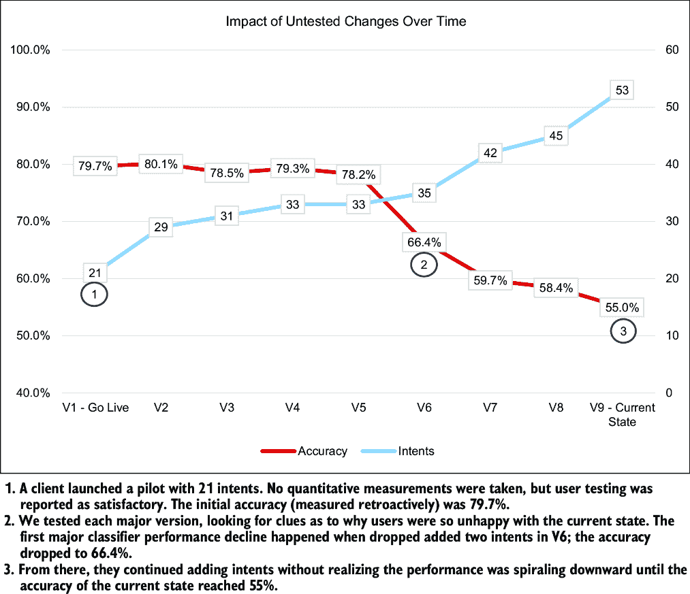
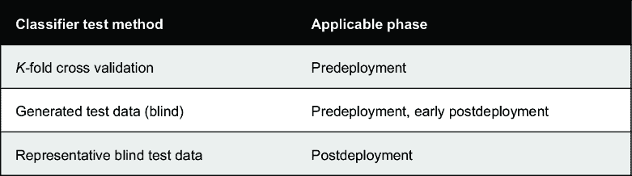
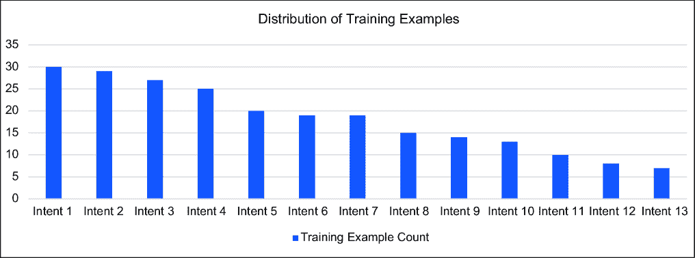
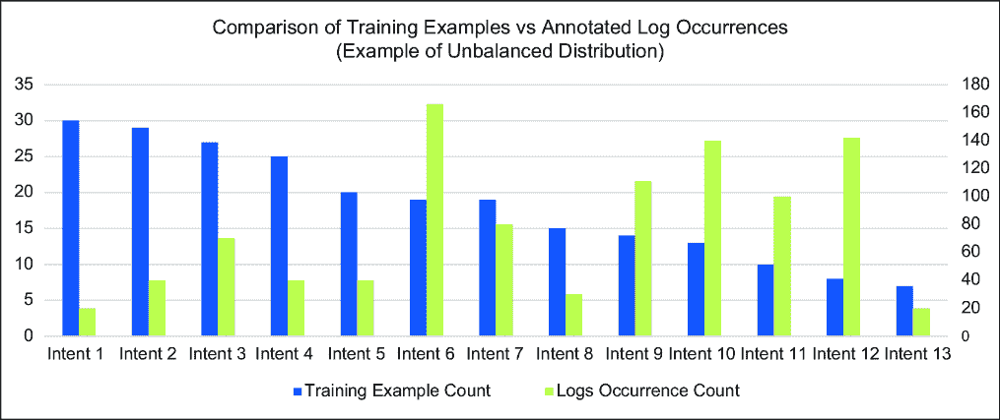

# 4 理解用户真正想要什么

### 本章涵盖

+   识别理解能力薄弱的指标

+   衡量聊天机器人的理解能力

+   评估您的聊天机器人的当前状态

+   收集和准备日志数据以衡量聊天机器人的理解能力

+   解释初始日志数据

一款好的聊天机器人体验通常与聊天机器人能够识别（理解）用户需求相关。这是您将用来衡量性能的关键指标之一。有时，聊天机器人部署后，其初始理解能力很强（或者至少对于试点项目来说“足够好”）。然而，随着时间的推移，您可能会注意到它返回了错误的答案。也许您的用户开始更多地抱怨，无论是直接向聊天机器人（“这没有回答我的问题！”）还是通过调查反馈。参与度可能呈下降趋势，而放弃率可能呈上升趋势。您可能会从呼叫中心那里听到关于本应由虚拟助手处理的升级问题。这些都是您的对话解决方案可能存在理解能力薄弱的迹象。

理论上，聊天机器人应该随着时间的推移而变得更好，但理解能力下降的情况并不少见。我们希望帮助您识别在您的解决方案中何时以及为什么会发生这种情况。我们将解释如何避免一些陷阱并规划解决方案生命周期中的常见情况。在本章中，我们将探讨您的对话人工智能在正确识别或分类用户目标（即理解用户）方面的“良好性能”意味着什么。我们还将提供用于测量分类器性能或评估生成响应的数据准备技术。

## 4.1 理解的基础

被理解是人类交流的基本方面。在对话人工智能中，我们使用自然语言处理技术来尝试理解用户想要或需要什么。由于用户可能想要的事情的范围几乎是无限的，以及他们可能用词语组合来表达这些愿望或需求的方式也是无限的，因此这是一个非常难以解决的问题。

### 4.1.1 理解能力薄弱的影响

被聊天机器人不理解可能是用户最大的挫折来源。他们来到您的聊天机器人是为了获取答案，他们可能得到了答案，但这可能与他们的问题无关。也许聊天机器人指示他们重新措辞问题，所以他们用不同的词语来表达相同的目标。有时这有效，有时他们会收到要求他们重新措辞（再次！）的响应。通常情况下，如图 4.1 所示，您的用户在失败一两次后最终会要求与代理交谈。

##### 图 4.1 准确性或覆盖问题会使用户感到沮丧，因为这需要更多的时间——有时需要多次联系才能达到他们的目标。这也导致用户对虚拟代理失去信心。

如果这种情况发生在您的用户身上，您的聊天机器人很可能存在**准确性**（聊天机器人匹配所听到的内容与所知道的内容的能力）、**覆盖范围**（解决方案预期了解的主题范围）或两者兼而有之的问题。从外部来看，几乎无法判断根本原因是什么。为此，您需要收集数据。没有这些信息，很难知道要修复什么——修复错误的事情可能会使现有问题更加复杂。很快，您的对话解决方案就会变得昂贵且难以维护。更糟糕的是，它没有提供它承诺的价值（未能减少，甚至可能增加，对人工干预的需求）。

聊天解决方案最大的成功因素之一是组织如何处理解决方案的持续维护。理想情况下，项目发起人和支持团队将设定预期，即解决方案需要迭代改进——尤其是在开始时——因为它会接触到来自现实世界用户的更多数据。尽管自动学习、大型语言模型和生成式 AI 取得了进展，但聊天机器人并不倾向于随着时间的推移而神奇地变得更好。

##### 预计在整个聊天机器人的生命周期内投入支持资源

组织是否认为聊天机器人应该是一个“设置后即可忘记”的解决方案？是否存在对虚拟助手持续维护和喂养的缺乏承诺？这些都是忽视的红旗，几乎可以保证最终会失败。

聊天机器人本质上是一个数字员工。就像人力资源一样，它需要初始培训以及偶尔的再培训、强化和获得新技能的机会。

### 4.1.2 弱理解的原因是什么？

这些是聊天机器人理解能力下降最常见的原因：

+   制造的训练数据（不反映代表性用户词汇的训练示例）

+   范围不足或主题覆盖范围存在差距

+   世界上新信息未传递给虚拟助手

+   在添加新意图、更新现有意图或更改模型推理参数时缺乏审查或守门人流程

那最后一个观点——缺乏守门人流程——导致了最难以解决的薄弱理解问题。如果没有知识渊博的所有者或专门的模型训练团队的监督，未经审查的更改会迅速加剧薄弱理解的问题。在传统的分类器中，不熟悉整个训练集的人所做的模型更新往往会引入重复、意图训练冲突以及在意图之间训练示例数量的不合理差异。未经测试的模型参数或提示更改会在生成模型中引起意外的行为。

事实上，我们看到了一个客户在修改他们的分类器训练集时发生的情况，在九次生产部署过程中，总意图从 21 增长到 53。业务并没有立即看到效果；相反，随着时间的推移，这些未经测试的更改的结果表现为调查结果不佳、旅程不完整、不必要的升级和大量的负面反馈。主题专家报告说，机器人对于它曾经回答正确的问题现在给出了错误的答案。这些都是理解薄弱的经典症状，但他们无法确切指出这一切是从何时开始的。一系列针对他们先前版本的逆向实验讲述了这个故事，如图 4.2 所示。

##### 图 4.2 对分类器性能的逆向评估显示了关于未经测试的更改随时间影响的艰难教训。如果每个版本都作为预部署过程的一部分进行测试，团队就会推迟任何版本更新，直到分类器问题得到解决。恢复分类器良好工作状态花费了数周时间。

### 4.1.3 我们如何通过传统的对话式人工智能实现理解？

传统的（非生成式）对话式人工智能系统是通过摄入按意图分组（有时称为分类或聚类）的用户请求示例进行教学的。意图包含各种释义，它们都表达了相同的目标。一些系统还纳入了实体，这些实体就像关键词，进一步细化请求的意义或规格。

对话逻辑被配置为识别意图（或意图+实体的组合）并根据该识别采取行动。这个行动可能只是回答一个问题，或者它可以启动一个复杂的交易性交流。表 4.1 显示了对话交流中意图、实体和可能的下一步的示例。

##### 表 4.1 示例话语可能根据实体的存在与否而有所不同。

| 话语 | 意图 | 实体 | 可能的下一步 |
| --- | --- | --- | --- |
| “我能检查多少件行李？” | `Bag_Allowance` |  | 显示行李检查政策 |
| “我想预订一张机票” | `Book_Flight` |  | 收集目的地 |
| “我需要一张单程机票去哥斯达黎加” | `Book_Flight` | 哥斯达黎加 | 收集出发详情 |
| “我想升级我的座位到头等舱” | `Flight_Upgrade` | 头等舱 | 启动升级流程 |

使用传统分类技术的机器人类型通常是主题路由代理、问答（FAQ）机器人，以及在某种程度上以流程为导向（自助）助手。请记住，基于分类的机器人依赖于一组预定义的问题主题（意图）。你需要提前知道你期望你的机器人遇到哪些问题。

从实际的角度来看，你教给系统的主题或意图的范围将特定于你的领域和解决方案的使用案例或目的。作为解决方案的所有者，我们的一项主要和持续的任务是调整我们的系统，以正确理解最大量的用户需求。在主题广度和深度之间找到理想的平衡可能很困难，通常需要权衡。例如，训练一个分类器以理解所有可能的主题并不经济。此外，试图这样做可能会削弱其对用户关注的主题的理解。

当一个组织试图训练一个分类器以检测所有可能的主题时，分类器在所有意图中看到清晰区分的能力可能会减弱。如果你系统中训练的意图不能代表用户需求（意味着你有大量低频主题），它们往往会引起准确性和置信度方面的问题。图 4.3 展示了“长尾”图表；基于分类器的聊天机器人最大的商业价值通常是通过关注高至中频请求来实现的。低频请求通常由某种回退机制处理，例如升级、搜索或生成式 AI。

##### 图 4.3 随着请求量向右减少，图表呈现出长尾的形状。每个用例都必须定义与主题覆盖相关的深度和广度的最佳权衡。商业价值的截止点通常在中等频次范围内。这并不是说应该排除所有低频请求，但扩展你的分类器对这些主题的覆盖范围可能带来递减的回报。

在初始发布之前，你需要预测哪些主题对于你的机器人理解来说将是最重要的。这些预测通常基于人类交互的日志、呼叫中心指标、焦点小组、调查或其他研究或信息收集活动。你的重点应该是训练你的模型擅长识别这些请求，以及任何其他辅助对话维护意图（如问候、闲聊、重复和升级）。一旦你的解决方案投入生产，你需要通过收集和分析你的对话交互数据来验证这些预测。

### 4.1.4 我们如何使用生成式 AI 实现理解？

生成式 AI 模型是如何实现理解的？这是一个陷阱问题，因为生成式 AI 并不是真正理解话语的意义，而是创建看起来像它所训练的数据的新数据，使用话语作为参考点。这是一个细微的区别，但使用生成式 AI，我们试图通过指示模型从一个特定的观点评估输入，然后生成特定类型的输出来模拟理解。

尤其对于对话式 AI，我们的目标是生成反映或针对用户请求的具体和/或个性化的输出（而不仅仅是高级分类，如主题分类或实体提取）。图 4.4 展示了分类模型输出和生成模型输出之间的基本区别。

##### 图 4.4 传统的分类模型使用监督学习来预测几个预定义分类中的一个。它们寻找用户输入的意图或含义。生成模型使用解码器变压器来创建文本补全。它们预测用户输入之后最有可能出现的下一个序列的标记（大致上，是单词或字符）。

##### 关于 LLM 基础架构的简要说明

*仅编码器*架构最适合非生成用例，例如基于文本嵌入训练预测模型。它们专注于从输入中提取有意义的内容，并需要标记数据进行微调。

*仅解码器*架构专门为生成 AI 用例设计。它们通过摄入大量数据以无监督方式“训练”。它们专注于预测序列中的下一个标记，并可以指示执行特定任务，包括分类、问答和摘要。

一些 LLM 模型架构是*编码器-解码器*，这意味着它们可以支持生成和非生成用例。这些通常用于输入很大但输出相对较小的场景，如翻译或摘要。

与基于传统分类器的 AI 不同，生成模型没有预定义的意图列表，这些意图是“在范围内”的。但像传统 AI 一样，你仍然需要很好地掌握领域知识以及用户可能带到你的机器人那里的问题的范围。这将指导你采用的策略，以促使你的 LLM 产生响应，表明用户输入已被理解。你可以使用以下几种有效的工具来完成这项任务：

+   *选择适合工作的正确模型*——一些模型更适合对话输出（而不是生成代码或撰写文章或新闻文章）。

+   *提示工程*——这种技术向模型提供输入以产生最佳输出。这些输入可能包括指令、上下文、输入数据和输出指示器。提示工程通常可以实现良好的理解模拟，并可以指示模型以对话风格产生输出。

+   *单次或少量提示*——你可以通过一个或多个你希望模型生成的输出和格式的示例来增强你的提示。

+   *参数调整*——温度、top-*p*和 top-*k*等参数会影响生成文本的随机性和多样性。增加这些值通常会提高生成响应中的“创造力”。

+   *检索增强生成（RAG）*——RAG 可以增强机器人理解的感觉，同时保持生成的答案基于你的领域。许多企业在其对话式解决方案中使用 RAG，以确保生成的响应基于外部、可验证的事实和最新信息。

在撰写本文时，企业对话式解决方案最常使用生成式 AI 作为问答（Q&A）机器人。大多数使用这项技术的面向商业的聊天机器人并不是完全生成式的——它们通常采用混合方法，包括分类（具有预定义的响应对）、面向任务的流程和生成响应。生成的响应可以纳入对话设计，作为后备选项（例如，当分类无法以足够的信心预测意图时）或两者兼而有之。

生成式 AI 也可以通过在提供“预配置”（预先配置的）对话响应或启动任务流程之前插入个性化的问候或问题摘要来增强分类响应输出。做得好，这可以在更深的层面上吸引聊天机器人用户，通过承认用户的特定情况来表现出“理解”和同情。

##### 练习

反思你目前正在构建或支持的解决方案。问问自己这些问题：

1.  我的解决方案是否表现出任何弱理解的症状，例如

    +   给出错误的答案，尤其是与输入主题不相关或完全不相关的答案

    +   比预期更频繁地采取后备/其他/升级路线

    +   在看似简单的请求中，比预期更频繁地进行去歧义或明确主题（对于采用去歧义功能的解决方案）

    +   产生过时或不正确的信息

    +   收到负面反馈或较差的 NPS 评分

1.  我的解决方案最初是如何进行训练和测试的？如果它已经被部署，是否进行了基线测量？

1.  解决方案是否已经更新以识别新的主题并产生准确和最新的答案？

1.  谁被允许对解决方案进行修改？这些修改是否被记录？在修改后是否对解决方案进行了监控以确保修改产生了预期的效果？

## 4.2 如何衡量理解？

对于聊天解决方案，理解通常以准确性来衡量。对于分类器，这意味着能够准确预测意图。对于生成模型，这是创建正确和有用输出的能力。有多种方法和工具可以衡量解决方案理解用户输入的程度。你采取的方法将取决于你的解决方案使用的技术（传统、生成或两者兼有）以及你目前所处的阶段（预部署或已部署）。

### 4.2.1 衡量传统（基于分类）AI 的理解

分类器的性能是通过准确率、精确率和召回率来衡量的。*准确率*是指正确预测的比例。*召回率*指的是分类器识别正确意图的能力，而*精确率*是指分类器避免给出错误意图的能力。较高的准确率通常与“良好的理解”感知相关联。如果聊天机器人不理解用户的意图，它就无法提供预定义的响应或调用正确的流程导向流程。

您可以使用一些数据科学技术来评估分类器的性能，例如*k*折交叉验证或盲测试。*盲测试*指的是给定的测试话语在训练集中尚未存在；即，分类器之前没有“看到”这个话语。您的测试集可能是人工制造的，例如使用 AI 生成数据，或者具有代表性（从日志中提取的实际用户话语构建）。*k*折和盲测试可以提供有关模型整体准确性的信息，以及报告其召回率和精确率。此类测试产生的指标有助于确定模型表现良好的地方以及可能混淆的地方。第五章包含改进分类器理解的详细说明，因此我们在这里只概述测试方法。

#### 使用 k 折交叉验证来衡量理解程度

如果您的聊天机器人尚未部署，*k*折交叉验证测试是衡量准确率最简单、最易于访问的方法，因为它不需要额外的标注数据。它仅使用现有的训练集。这种方法本质上衡量的是您数据标注的内部一致性——高准确率分数主要表明您的训练示例与其他类似示例分组。该过程涉及从训练集中抽取一定比例的数据，创建一个临时的盲测试集。剩余的数据用于创建临时的分类器。接下来，每个盲示例都运行在分类器上，并对预测进行评分。最后，临时盲集被折叠回训练集中。这个过程重复*k*次，以便每个示例都用作训练示例和测试话语，但永远不会同时用作两者。

*k*折测试将为您提供分类器准确率的预测，假设您用于训练模型的数据代表模型在生产部署时将遇到的输入。然而，这可能导致一种虚假的安全感，尤其是如果您的训练数据高度人工制造或与实际用户话语不太相似。另一个注意事项是，如果数据不足以保留用于测试的示例，同时仍然用最小足够的示例训练每个意图，小型数据集可能会产生不可靠的测量结果。因此，一旦解决方案投入生产，*k*折测试不是首选的测试方法。

#### 使用 AI 生成的盲测试数据衡量理解

通过生成过程获取测试数据与获取生成的训练数据的方式相同：你提示模型生成示例的变体，并将它们用作“盲”测试集。这种方法最适合在部署前使用，但在上线初期阶段也可能适当，以补充生产日志中的空白。

与*k*-折测试一样，你的准确性测量的有效性完全取决于测试数据是否紧密地反映了模型在生产运行时接收的输入。这种方法可能容易受到偏差和过拟合的影响。因此，我们建议谨慎行事，并建议你一旦可用，就验证你的生成数据与生产日志。

#### 使用代表性盲测试数据衡量理解

如果你的聊天机器人已经部署，生产日志是评估聊天机器人准确性的关键工具之一。这些日志包含了关于用户提出的问题以及他们如何表述这些请求的真实代表性数据。当我们说“代表性”时，指的是系统触发意图的实际情况以及能够捕捉用户目标的表述——无论他们自然地使用什么样的词语组合。

使用生产日志将产生最少的偏差测试数据，但也需要一定程度的初始手动努力。然而，这种努力是值得的，因为你将创建一个可重复使用的资产，用于测量未来的变化。你需要获取这些日志的样本，并对照系统返回的意图审查客户输入（表述）。这些数据需要由能够识别表述所属的最终正确（即“黄金”）意图的人类进行标注。你的初始标注将为你提供一个基线准确性。然后，这些数据将被用来构建你的*代表性盲测试集*，这实际上是一个包含测试问题和答案关键的所有内容都在一个文件中的列表。

#### 选择适合你情况的最佳方法

每种方法的成本和努力之间的权衡完全取决于你解决方案的大小和当前阶段（部署前或部署后）：

+   *K*-折交叉验证可能看起来“便宜且容易”，因为它不需要除训练目的之外的人工标注。然而，运行你的实验*k*次可能会有 API 成本。对于较小的系统，这种成本通常可以忽略不计，但对于较大的系统，每次实验可能会产生数千或数万次 API 调用。

+   生成的测试数据集除了生成数据所需的成本外，还包括运行实验的 API 成本。

+   一个代表性的盲测试集可能在运行实验时具有较低的 API 成本（与*k*-折相比，假设您的测试集小于您的训练集），但人工标注的成本可能很高。这也要求解决方案处于生产状态，与真实用户互动。好处是实验结果将比*k*-折和生成的测试集结果更有意义。

总结来说，有三种主要方法可以衡量您的分类器理解用户的能力。您选择的方法应与您当前的开发或部署阶段相一致，如图 4.5 所示。

##### 图 4.5 *K*-折交叉验证和生成的测试数据适用于无法获取代表性数据的情况。一旦解决方案部署到生产环境，代表性的盲测试数据将产生对您的分类器理解能力的最可靠测量。

### 4.2.2 测量生成式 AI 的理解能力

测量一个生成的答案是否展示了“良好的理解”是一项艰巨的任务，并且自动测试方法仍在不断发展。我们的挑战是生成式 AI 的本质：每个生成的响应都是可能的，或者很可能对每个用户输入都是独特的。

在您部署带有生成式 AI 的解决方案之前，您应该定义您的机器人如何展示良好的理解。对于生成式对话 AI，我们建议您通过以下维度定义“良好的理解”：

+   生成的答案符合任何指定的输出格式或风格，包括

    +   机器人的定位（机器人角色的目的和视角）

    +   机器人角色的指定语气和个性

+   生成的答案在内容长度和结构上适合用户的输入（例如，用户输入的性质是否需要简短回答、逐步说明或详细论文？）。

+   生成的答案不包含虚假信息（幻觉）。

+   生成的答案不包含仇恨、滥用、粗俗、偏见和歧视。

+   生成的答案不包含有害信息——即使内容真实——这样一家公司可能会因法律责任或声誉受损（例如，对竞争对手的负面评论或泄露敏感数据）。

+   生成的答案对提示注入尝试具有抵抗力。

+   生成的答案正确且完整，要么成功终止流程，要么推进流程到下一步或最佳下一步行动。

如果您的解决方案已经部署，请获取您日志的代表样本。进行手动审查以评估您机器人的理解水平。每个生成的答案将根据您为解决方案定义的维度进行判断，判断其是否正确、充分或适当。

当然，这会耗费时间，但付出的努力将得到回报。你的注释集可以用作未来改进的黄金测试集。这个测试集将为你提供跟踪模型参数（如温度、top *p*、top *k*）和其他 LLM 配置设置变化影响的基准。这些样本还可以告知你在提示工程或微调中包含的任何少样本示例（样本输入与期望输出配对）。

### 4.2.3 使用直接用户反馈衡量理解

一种在规模上衡量良好理解的方法是将答案反馈机制直接融入用户体验中，例如点赞/踩回复选项。这种方法可以用于传统和生成式解决方案。

注意你征求反馈的频率，并了解你的反馈有何目的。评分意在反映体验的哪个方面：对特定答案（针对问答用例）的满意或不满意，自助流程及其结果（针对流程导向型机器人），还是整体对话体验？

##### 练习

1.  探索并记录你的解决方案（或根据需要审查和更新它），重点关注最负责展示理解的部分：

    +   对于分类器，这意味着审计训练数据。

    +   对于包含搜索和检索的解决方案，审计源文档或 URL、任何补充文档丰富化以及摄入计划，以确保你的知识库包含最相关和最新的信息。

    +   对于生成式 AI 解决方案，审计引发生成响应的对话流程，并将提示、参数和 LLM 设置映射到预期结果。

1.  反思你当前的测试方法，如果有。你是否有任何可以与当前理解薄弱症状相关的历史测试指标？

1.  思考本节中提出的测试方法。哪种方法对你的解决方案生命周期当前阶段最优化？

## 4.3 评估当前状态

在开始制定改进计划之前，你将想要评估解决方案在准确识别用户目标和需求方面的能力。你的评估性质将取决于你的解决方案使用的技术。分类和生成模型执行非常不同的功能，因此有不同的方面需要评估。

### 4.3.1 评估你的传统（基于分类）AI 解决方案

对于传统 AI，首先审查训练集，以便了解领域和当前范围：

+   你的解决方案中使用了多少个分类器？

+   系统或每个分类器处理了多少个不同的意图？

+   每个意图的独特性如何？

+   任何意图的训练示例是否似乎与其他意图重叠？

+   主题范围（意图）是否与你对聊天机器人目的的印象相符？

+   解决方案如何处理它不理解输入？

+   对话的复杂性如何？是否存在复杂的流程、后端集成或搜索集成？

将您的分类器训练数据量以图表形式可视化可能会有所帮助。图 4.6 显示了一个示例训练集。目前还没有太多信息可以提取，但当我们组装测试数据时，这将为我们提供一个比较的基础。

##### 图 4.6 该分类器有 13 个意图。训练示例数量从 7 到 30 不等。

通常情况下，我们期望具有更多训练示例的意图更受欢迎。我们希望最受欢迎的主题在大多数时候都能被理解。高容量的意图也可能代表处理更多样化短语的议题。在大多数情况下，我们不希望看到训练集中存在巨大的容量差异。例如，一个训练集中有些意图使用了数百个示例，而其他意图只有少数几个示例，可能会表现出性能问题，如过度选择（由于训练容量的偏差，频繁选择错误意图）。

### 4.3.2 评估您的生成式 AI 解决方案

在生成式 AI 方面，就像在传统 AI 中一样，您需要了解您的机器人操作的领域和范围。然而，您不需要关注输入的分类，而需要评估当模型产生输出时，它将从哪些数据源中抽取答案。在您的解决方案中，生成式 AI 是否用于生成答案或响应？如果是，熟悉以下情况：

+   是否为每个用户输入生成答案？

+   您是否将生成答案作为分类器的后备选项？

+   您是否在对话中调用生成文本来补充基于分类的“预定义”答案？

+   您的解决方案是否使用了不止一个大型语言模型（LLM），例如针对不同类型响应的不同模型、多语言支持等？

+   您的解决方案是否使用了提示工程、提示调整、微调或其他定制设置？这些是否记录在案，以及每个设置最初实施的目标成果？

+   您的解决方案是否使用了 RAG？如果是，数据源是什么？它多久更新一次？它是否包含额外的数据丰富？

##### 练习

1.  使用本节中描述的标准（根据您使用的 AI 类型）评估您的解决方案。

1.  在您完成初始解决方案评估后，务必记录其当前状态——这将成为您的基线系统配置。

1.  随着您跟随本书中给出的改进建议和示例，请准备好以有助于您将所做的任何更新与后续的性能测量相关联的方式记录您的更改。

## 4.4 从日志中获取和准备测试数据

在本章的剩余部分，我们将假设你确实有一个生产系统并可以访问日志。我们将向你展示如何获取和准备这些数据，以创建一个可以用来衡量当前状态（以及验证未来变化）的资产。

从生产日志中构建测试集需要一些初始工作。图 4.7 显示了准备测试数据（或训练数据）所涉及的主要任务。

##### 图 4.7 一旦你获得了一些数据，每个发言首先应该被分类到不同的桶中，以识别潜在的候选者；这将把好的、可用的测试数据与差的或无关的用户输入分开。数据可能还需要被清理，以修复如个人可识别信息（PII）等问题。之后，数据需要被标注（对于分类器，它需要用正确的意图进行标记；对于生成式 AI，它需要与理想的输出响应相关联）。最后，数据需要被转换成一个或多个可以被你的测试工具消费的集合。

### 4.4.1 获取生产日志

理想情况下，你将能够访问跨越一整年或更长时间的生产日志。这将有助于确保你的测试集将有一个真正代表性的样本，涵盖你的机器人可能遇到的各类主题范围，以及影响你行业的各种季节性和事件。从一年中的不同周或月收集日志样本。如果你的解决方案较新，预期在解决方案的前 12 到 18 个月内，你需要更频繁地刷新测试集。

一旦你获得了某些生产日志，你可能发现将此数据转换为 CSV 或 Excel 文件（如果尚未更新）是最容易的（如果它尚未更新）。我们发现将数据转换为每条对话交换一行（一个用户输入和一个机器人输出），按对话 ID 分组，非常有用。根据你选择的时段、用户数量、解决方案的复杂性和目的，你的文件可能只有几百行数据，或者可能有 1 万行或更多的对话交换。

将对话音量减少到可管理的集合的一个简单快捷方法是选择每次对话中的第一个用户发言。这可能在所有情况下都不适用，但图 4.8 显示，这通常是收集日志中有用数据的一种可靠方法。在自然语言驱动的交流中，用户往往会在初始输入中表达他们最重要的需求。如果你的平均对话持续十个回合，一个包含 10 万行原始数据的对话日志可以减少到大约 1 万行数据供审查。去重通常可以进一步减少几千行。这是一个非常实用的音量，通常包含丰富多样的例子，你可以用它们来测试你的解决方案。

##### 图 4.8 原始聊天日志显示，用户的初始目标通常在对话的第一轮中被捕捉到，但有时它会在对话的后期或交换了礼貌用语后作为一个额外的请求出现。它甚至可能跟随一个退出请求。选择第一行通常会提供足够的数据，同时减少你的注释员在分类器无用的表述中（如按钮点击、常见回复、PII 或其他用户特定信息）进行排序所花费的时间。（你的日志结构可能因工具而异。）

### 4.4.2 确定候选测试表述的指南

无论你如何获取和预处理日志，你的下一个任务是确定潜在的盲测试候选者。我们将此视为“初步筛选”练习：只需确定一个表述是否*可能*可用。此外，我们建议审稿人不要过度分析他们看到的内容；如果你在一分钟内无法对任何给定的表述做出判断，请丢弃该表述并继续。 （如果你感到非常矛盾或感觉到某种模式，请将其标记为稍后审查并继续。）我们使用以下标准从生产日志中识别潜在的测试候选者，以及任何特殊处理说明：

+   表述是否无法理解？

+   这个表述与领域完全无关吗？

+   表述是否含糊不清？

+   表述是否包含多个意图？

+   表述与领域相关但超出范围吗？

+   这个表述是否表达了在领域和范围内的目标？

让我们逐一查看这些内容。

#### 表述是否无法理解？

可能是猫走过了键盘，或者用户在愤怒中乱按键盘。也许语音到文本技术将呼叫者的提问转录成了无法理解的混乱。语音解决方案也可能捕捉到背景噪音和对话，尤其是如果它们没有为环境正确调优。你的文件可能包含许多用户输入，这些输入根本没有任何意义。

这些是不理解或不相关的表述的例子：

+   “does it school”（不连贯——如果这是来自语音解决方案的，可能是语音转录错误。）

+   “她没有她说有四个只给了我们一个是的你可以那样做我马上要赶飞机了等我到办公室我会检查的”（可能是呼叫方背景对话的语音转录。）

+   “klewtkhaccalifornia liense”（可能是拼写错误，严重到使表述无法理解。）

这些行可以从你的盲测试集中排除。任何可识别的模式，如可能的语音转录问题，应留待进一步评估或转发给适当的团队。

#### 表述与领域完全无关吗？

你可能会偶尔遇到一些可以理解但与领域或机器人预期目的完全不相关的问题。例如，如果你的解决方案旨在帮助电力公司客户管理他们的账户和服务，那么如果这些关于流行文化琐事的问题出现在日志中，你可以排除这些问题。

尽管您可以配置解决方案将未识别的主题发送到 LLM，但这些语句不属于您的分类器测试集，因为无法分配一个黄金意图。这些语句可用于负面测试，这有助于您了解您的解决方案是否适当地识别了它不应该尝试回答的情况。

#### 这个语句是否模糊？

可能你会找到一个与领域相关但未表达明确目标的单个单词或短语。例如，如果一个银行聊天机器人的用户只是说“账户”，他们想要做什么？他们是想要开设账户？关闭账户？检查账户余额？谁知道呢？

模糊语句的子集可能包括由按钮点击或作为信息收集流程的一部分生成的响应。（如果你选择了每次对话的第一个自然语言语句，你可能看不到这些。）这些通常对分类器性能测试没有太大帮助，除非它们与流程中使用的意图相一致。只有在适当的时候才包括这样的语句。

这些是模糊语句的例子：

+   “驾照”（可能与领域相关，但没有表达明确的目标。）

+   “那一个”（一个指代先前语句中提供但可能已失去意义的上下文信息的代词。）

+   “2”（可能指按钮选择或电话渠道选择，或者是对上一个问题的响应中提供的数量或数量。）

在大多数情况下，这些语句不应包含在您的分类器准确度测试中，因为它们可能不会与任何单一意图相匹配，而是与多个意图。然而，它们并非没有意义。将这些语句放在一边，以了解您的用户以这种方式沟通的频率。确定您的其他聊天机器人功能，如消歧或澄清问题，是否适当处理了它们。

#### 这个语句是否包含多个意图？

大多数基于分类器的聊天机器人在一次只给定一个目标时表现最佳。表达多个有效、不同目标的语句应排除在您的分类器准确度测试集之外，因为您无法明确分配一个“正确”的意图。

这一规则的例外情况将是如果您的解决方案有一个消歧机制。消歧是通过展示分类器识别出的前*n*个意图来澄清用户的主要目标的方式。对于这些解决方案，您可能希望将您的多意图语句与您的分类器进行对比，以验证所有列出的意图都会以适当的消歧选择呈现。

这些是具有多个意图的表述示例：

+   “你有 COVID 加强针吗？我该如何预约？”（表达了两个目标：1）疫苗加强针的可用性，2）预约。）

+   “我想更新我的驾照地址，并了解获得商用驾照所需的信息。”（表达了两个目标：1）更新地址，2）获取获得 CDL 所需的信息。）

+   “我目前有 95,000 个忠诚度积分。它们会过期吗？我还需要多少积分才能达到白金状态？我可以购买积分以提升到更高等级吗？”（表达了三个目标：1）了解奖励积分是否会过期，2）了解当前积分余额与下一等级奖励状态之间的差异，3）获取关于购买积分以提升到更高等级的信息。）

+   “我想和客服人员谈谈关于报告被盗车辆的事情。”这种情况非常常见。用户通常会将与客服人员的请求和他们的真实目标结合起来。如果你的分类器训练集中存在这两个意图，你可以通过以下两种方式处理此类表述：

    +   如果无法标记单个“正确”的意图，则将这些内容排除作为候选人。

    +   包含这些候选人，但根据“首选”意图进行标记。（首选意图可能是如果控制是优先事项，那么竞争意图将会升级。）

与模糊表述一样，这些表述应该单独放置并分别评估，以更好地了解你的用户。如果你发现这些情况经常发生，你可能需要制定额外的策略来处理这些情况。如果用户倾向于提出相关问题，或者他们在单个表述中结合了常见的请求，那么在这些意图中的输出响应可以更新，以预测或满足所有需求。对于我们给出的第一个例子——“你有 COVID 加强针吗？我该如何预约？”——你的关于加强针可用性的回答可能包括一个预约链接。

##### 关于处理多个意图的分类模型的注意事项

我们已经看到了在对话式人工智能解决方案中处理多个意图的广泛和英勇的尝试。这通常涉及收集前*n*个意图并将它们存储在上下文中，然后是更多的逻辑来在回答第一个意图之后呈现附加主题。在大多数情况下，结果是过度设计的解决方案，它脆弱、难以扩展，或者只是浪费了努力。这种方法也存在一个主要缺陷：这样的逻辑无法可靠地区分一个真正包含多个目标的表述和一个包含可能触发多个意图的单个目标的表述。

许多现代聊天机器人框架提供自动化的主题消歧（例如，“你是指：[意图 1] [意图 2] [意图 3]”）。我们的总体建议是允许消歧功能完成其工作。有时，这意味着用户必须一次提出一个问题或陈述一个目标。这种场景的频率和重要性通常不值得花费构建和维护处理多个意图的基于分类聊天机器人的自定义逻辑所需的努力。

生成式 AI 通常在处理多个意图方面比基于分类的解决方案要好得多，所以如果你的解决方案有这种能力，你可以将这些表述作为测试集的候选。

#### 这个表述是否与领域相关但超出范围？

你可能会遇到表达一个与领域相关的单一、明确目标的表述，但当前解决方案尚未配备处理这些的能力。例如，一个银行聊天机器人可能允许用户检查账户余额，但可能没有训练来识别关于利率的请求。一个航空公司聊天机器人可能对航空政策了如指掌，但可能没有关于机场安全的实际知识。

这样的问题可能从用户的角度来看非常合理，但主题覆盖的差距往往会导致用户感到沮丧。这尤其在你没有生成式 AI 或搜索回退的情况下更为明显。如果你的聊天机器人响应，“很抱歉，我不理解。请重新措辞你的问题”，无论怎样重新措辞都无法让用户得到满意的答案。这些应该如何处理？

如果你的分类器没有训练好的意图来处理此类请求，这些应该被暂时搁置。在进一步审查后，它们可能被分组到主题或类别中，但它们目前将不会包含在你的测试集中，因为无法分配黄金意图。根据适当的情况，监控这些主题的量并添加到你的改进待办事项中。

同样，如果你的生成式解决方案尚未准备好回答此类问题（例如，RAG 解决方案中的文档库没有内容来处理该主题），暂时将这些内容搁置，但监控其量。

#### 这个表述是否表达了一个在领域和范围内的目标？

得分！属于你的解决方案和领域范围内的提问或请求应属于你的黄金测试集。

### 4.4.3 准备和清洗数据以用于迭代改进

如果你从未见过聊天机器人的生产日志，你可能会惊讶它们有多混乱。你将看到很多不良或非正式的语法、拼写错误或打字错误（在基于文本的渠道上）、语音误转录（在语音渠道上），以及可能的各种形式的个人信息（PII）。以下是我们推荐的处理方法。

#### 不良或非正式的语法

在大多数情况下，让它保持原样！人类表达自己的方式有很多多样性。用户可能不知道如何准确传达他们的需求——尤其是向机器传达。如果可以识别出目标，它就是一个代表性的例子，应该保持原样。

#### 错别字和拼写错误

除非错别字或拼写错误显著改变了整个短语的含义，否则请保持原样。常见的拼写错误代表了您的用户是如何沟通的。您的分类器应该能够给出良好的答案，无论用户是询问“贷款余额和本金有什么区别？”还是“whats teh diffrence between loan balance and principle？”

正确的大小写和标点通常会被分类器忽略，但您可能需要与您的技术平台核实这一点。

#### 语音误转录

如果您的解决方案使用语音转文本（也称为自动语音识别），您不会遇到错别字，但您可能会看到意外的单词，这很可能是语音误转录的结果。首先的攻击方法是尽可能训练您的语音模型。聊天机器人分类器的底层技术是文本驱动的，因此在用户的话语触及文本分类器之前，最好有用户话语的最忠实表现。

如果您发现语音模型仍然持续地将您领域内的关键词误转录，请将这些关键词包含在您的测试集中（并且最终，您可能需要补充您的训练数据）。例如，对于一家电力公用事业公司，我们持续看到重要的领域术语“residential”被误转录为“presidential”。由于语音模型更新可能需要更长的时间来实现，这导致通话控制丢失，一个立即的解决方案是将“presidential”添加到我们的聊天解决方案的同义词中。另一个例子是将“VIN”误转录为“BIN”，这对于需要理解“车辆识别号码”的用例。为此，我们确保训练数据包含这两种变体。我们还保留了误转录以供我们的测试目的。

#### 个人可识别信息

您还可能发现各种形式的个人身份信息（PII），例如姓名、电话号码、物理或电子邮件地址、社会保障号码、账户号码等。这些信息不应包含在您的训练或测试数据中。理想情况下，这些信息应该在日志中屏蔽，但即使这项技术也不完美。如果您的解决方案具有 PII 屏蔽功能，您应将任何真实数据替换为相同类型的屏蔽字符（例如，###-###-####用于十位电话号码）。如果没有，则可以完全删除 PII，或者用显然是虚构的表现形式替换，例如“username@email.com”。

### 4.4.4 标注过程

在您将数据缩小到表达清晰目标的语句（属于您的领域，并在适当的地方进行了清理）之后，它们需要针对当前任务进行适当的标注。

#### 为传统的（基于分类器的）AI 标注黄金测试集

为分类器标注测试集涉及将每个语句标注为适当的意图。这项任务说起来容易做起来难，你将在构建测试集上花费最多的时间。

识别和丢弃不可理解或模糊的用户输入相对容易。然而，一旦你知道一个语句属于你的领域，就需要更多的时间来标注它正确的意图。负责标注（将每个语句标注为正确的意图）的个人或团队需要熟悉当前的训练数据。这个过程肯定会暴露出你的意图中重叠的问题，因为你的人类注释者会陷入如何标注语句的疑问。

一个团队可能采取几种方法来完成为测试或训练标注数据的任务。有时一个人被分配这项工作。有时整个团队会尝试承担这项任务。当这种情况发生时，他们通常会认为“分而治之”的方法最有效。根据我们的经验，这可能会导致需要更长时间解决的问题。

在一个理想的世界里，每个人都应该坐在同一个房间里，共同判断每一句话。这种方法有助于讨论每个意图的目的。所有注释者都需要理解用于区分具有许多相同关键词但目标不同的意图的标准。另一个同样有效的方法是让多个注释者分别判断相同的数据（或者至少是部分重叠的数据），并将任何差异进行比较以达成共识。

如果你的日志包括每个语句在运行时预测的意图，我们不会犹豫采取一个捷径：先进行一次预判并判断预测的意图是否正确。然后你只需要判断并标记剩余的不正确语句，并给出正确的意图。

这个练习可能需要几个小时到几天不等，可能会对你的视觉和认知负荷造成压力。作为第一次运行，指导你的注释者做出最佳判断并继续前进。如果判断一个语句需要超过六十秒，就跳过它，稍后再回来。每小时或两小时休息一下也很重要。走开一段时间再回来有助于恢复精力。

##### 我能否只用 LLM 来完成所有这些工作？

如果你正在构建你的第一个分类器，你当然可以将语句与 LLM（大型语言模型）进行匹配，作为标记或分类数据的初步尝试。然而，如果你已经有了生产日志，将语句与单独的分类 LLM 进行匹配将不会增加任何价值，因为你仍然需要一个人类裁判来审查由这项练习产生的分类。

一旦你标注了测试集，你将拥有一个由人工判断、标记的数据的金色集。根据你的用例，这可能包括几百到几千个话语。这个资产将为你提供一些关于你的分类器当前准确性的即时信息。它还将被用来帮助你调整系统。

你需要做的最后一件事是将你的数据转换为可以被测试工具消费的文件。这将产生一个可以用来衡量未来更新影响的资产。格式可能因工具而异，但通常将是一个包含每行一个测试话语在一列和金色意图在另一列的文本或 CSV 文件。表 4.2 展示了测试集可能的样子。

##### 表 4.2 每行一个话语/意图对的样本测试集

| 话语 | 金色意图 |
| --- | --- |
| 我想和真人说话 | `Request_Agent`  |
| 我可以和经理通话吗 | `Request_Agent`  |
| 让我找客服 | `Request_Agent`  |
| 你星期日是否开门 | `Office_Hours`  |
| 你什么时候开门 | `Office_Hours`  |
| 你的办公室什么时候关门 | `Office_Hours`  |
| 你的周末营业时间是什么时候 | `Office_Hours`  |

#### 为生成式 AI 标注金色测试集

创建一个用于衡量生成式 AI 的测试集需要判断你的解决方案（如果你正在使用生产日志）产生的答案质量，并根据你之前为解决方案定义的维度对其进行更新或替换为理想答案。主题专家需要审查每个示例输出，以确保其事实性和完整性，代表品牌，并反映虚拟代理角色的目的和定位。

一旦你审查了输出，你将有一组与金色答案或响应配对的话语。这个资产将为你提供一些关于你生成响应质量的即时信息。它还将被用来调整你的提示和 LLM 配置。

你需要做的最后一件事是将你的数据转换为可以被测试工具消费的文件。格式可能因工具而异，但通常将是一个包含每行一个测试话语在一列和金色响应在另一列的文本或 CSV 文件。表 4.3 展示了样本测试集。

##### 表 4.3 每行一个话语/答案对的样本测试集

| 话语 | 金色响应 |
| --- | --- |
| 我可以把我滑雪板作为托运行李带上飞机吗？ | 你可以带一套滑雪板设备作为托运行李。这套设备必须在一个包里，可以包括最多两块滑雪板和一个雪靴包。如果这套设备重量超过 50 磅（23 公斤），你将不得不支付超重行李费。  |
| 我要退款需要等多久？ | 信用卡退款将在请求后的五个工作日内处理。所有其他退款将在请求后的 20 个工作日内处理。  |

##### 练习

1.  从您自己的日志中获取数据，并确定候选测试语料。

1.  根据需要清理数据以删除 PII。

1.  评估分类预测或生成的答案内容。将这些结果记录为基线性能测量。

1.  分配一个黄金意图或理想响应。

1.  以测试工具可以消费的格式保存文件。

## 4.5 数据告诉我们什么？

如果您的日志中包含了原始意图预测或生成的答案，您现在就有所需的数据来计算解决方案当前理解准确率的基线测量。（将正确预测或答案的数量除以总候选数量。）您标注的语料将显示用户向聊天机器人提出的话题的范围和频率。

### 4.5.1 解释传统（基于分类）AI 的标注日志

对于基于分类器的系统，您可能对查看意图之间的数量分布感兴趣。这与每个意图的训练示例量相比如何？图 4.9 显示了训练示例的理想化、相对平衡的分布，与日志中观察到的发生次数相比。

##### 图 4.9 深色条形表示系统中训练示例的数量。浅色条形表示每个意图的标注语料数量。如果您的图表遵循类似的模式，那么您的训练优先级可能与解决方案的需求良好对齐。

训练示例与日志中实际发生之间的明显差异本身并不表明存在问题，但如果准确率低，它可以告知您的优先级。图 4.10 显示了一个与系统训练严重不匹配的标注语料的示例。

##### 图 4.10 训练示例计数（深色条形）与标注日志数据（浅色条形）相比，在许多意图上存在很大的差异。没有每个意图的准确率数字，我们无法立即判断这种差异是否会产生负面影响。然而，我们可以进行一些观察，例如 1）前五个意图并不像我们想象的那么重要，2）日志中意图量最高的（意图 6、10、11 和 12 的浅色条形）可能比我们预测的更受用户重视。

您还应该回顾那些被判定为属于领域但超出当前范围的语料量。（这些语料在 4.1.4 节中描述的准备任务中已被识别并留出。）是否似乎存在对分类器尚未训练的主题的需求？用户期望能够提出的问题与分类器训练以识别的内容之间的不匹配，会导致对理解能力薄弱的感知。

您的整体准确性提供了对解决方案理解能力的整体视图。下一步是深入具体意图。您可能从查看您的解决方案中表现最差且高量/高价值的意图开始。在第五章中，我们将深入探讨改进分类器理解的过程。

### 4.5.2 解释生成式 AI 的标注日志

您为生成式 AI 解决方案提供的标注日志将展示用户提供的各种问题和请求的范围。在整个标注过程中，您可能发现了关于领域的覆盖范围方面的差距。您也可能更好地理解了提示工程或微调改进如何使生成的答案更好。如果您的解决方案采用 RAG，您可能会开始将答案的质量与您存储库中的文档相关联。

您的整体准确性提供了对解决方案理解能力的整体视图。在第六章中，我们将深入探讨改进您生成式 AI 的过程，使其能够传达良好的理解。

### 4.5.3 逐步改进的案例

到目前为止，您应该已经拥有了开始规划改进周期所需的数据。您的性能发现将作为改进的路线图。请记住，这是一个迭代的过程。您将做出改变。然后您将进行测量，以确定您的更改对理解产生了积极、中性或消极的影响。

还要注意，您的盲测或黄金测试集在整个解决方案的生命周期中都需要更新。回想一下，聊天机器人可能变得不准确的一个原因是世界上的新信息。以下是我们看到的一些例子：

+   全球 COVID-19 大流行，它改变了几乎每个人的工作方式、公共空间的导航以及支持家庭的方式。

+   新的立法通过，导致政府机构收到相关问题的咨询。

+   市场上的新产品或产品召回。

+   一家公司遭遇了数据泄露，一旦消息公布，聊天机器人就遭到了诸如“我的数据安全吗？”和“我想了解更多关于黑客攻击的信息。”等问题的大量询问。

计划定期审查您的日志。根据您解决方案的量级，这可能从启动后的每日开始，然后是每周、每月和每季度。别忘了根据您所做的更改更新您的测试集：

+   如果您的系统中添加了新的意图，需要向测试集中添加新的话语。

+   如果意图在您的改进工作中合并或拆分，受影响的意图需要在您的测试集中更新。

+   如果在您的生成式解决方案引用的知识库中添加了新的覆盖范围区域，您的测试集应包括对此的验证。

+   如果您的解决方案添加了新的 LLM 场景或提示定制，这些应该反映在测试集中。

##### 练习

1.  回顾你的标注数据并反思发现。是否有表现不佳的理解区域？

    +   如果是这样，你会假设什么根本原因？

    +   是否存在多个根本原因？

1.  你会如何优先考虑实现更好理解所需的改进？

## 摘要

+   当聊天机器人能够识别用户想要什么并提供令人满意的答案或帮助用户实现目标时，它们表现出良好的理解。

+   对于传统 AI，理解依赖于至少两种机制：对意图的正确分类以及根据该分类提供输出的能力。（额外的机制，如实体检测或上下文，可能会修改或个性化输出。）

+   对于生成式 AI，理解依赖于话语及其伴随的提示来创建一个旨在解决用户问题或目标的响应。

+   理解薄弱对商业价值有害，通常表现为聊天机器人返回错误答案或完全无答案。

+   在收集一些数据之前，你无法评估你的聊天机器人的性能。

+   聊天机器人的理解通常以准确性或解决方案提供正确答案或采取正确行动的速率来衡量。

+   存在多种工具和方法来衡量理解。其中一些取决于 AI 的类型和/或当前阶段，无论是预部署还是后部署。

+   一个代表性的黄金测试集，由真实用户话语（生产日志）精心挑选，可以用来衡量机器人的基准性能，并且可以转化为可重复使用的资产，以衡量未来变更的影响。

+   你应该计划在整个聊天机器人生命周期内监控和重新训练你的解决方案。

+   训练的更新可能需要相应更新盲测试集。
