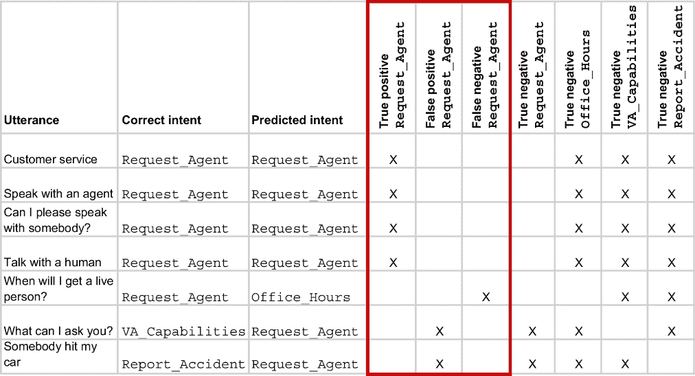
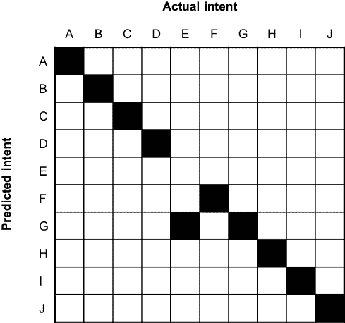
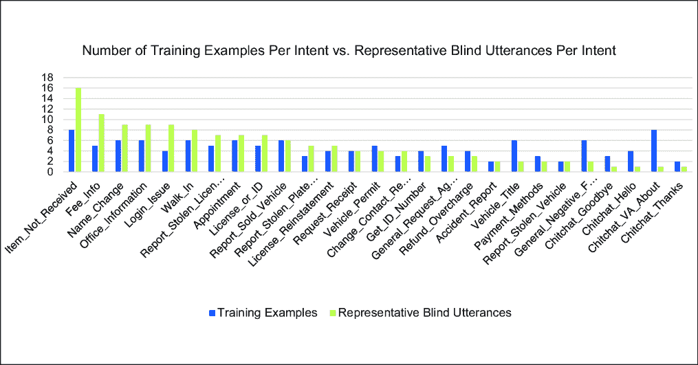
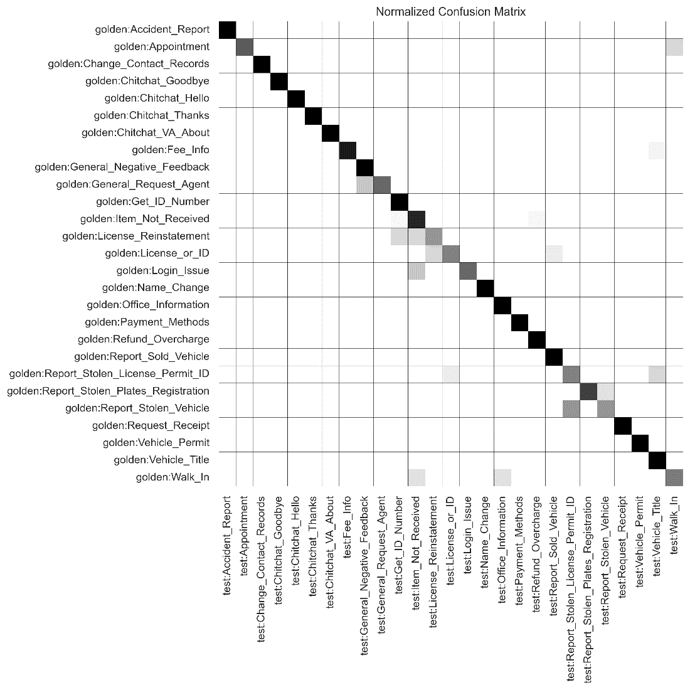
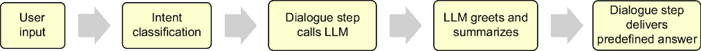

# 5 提升对传统人工智能的薄弱理解

### 本章涵盖

+   识别分类器可能犯的错误类型

+   建立当前分类器性能的基线

+   使用数据科学方法来识别和优先处理改进

+   将生成内容融入你的传统人工智能以增强理解

在本章中，我们将展示一种系统性的、迭代的方法来提高基于分类的对话解决方案的理解。本章建立在上一章中介绍的概念之上，并使用第 4.4 节中产生的最终输出（你在其中创建了一个测试集，每个话语都分配了黄金意图，并且格式可以用于你的测试工具）。在本章的后面部分，我们将探讨大型语言模型如何补充意图驱动的输出响应，以提供更稳健的体验。（如果你在寻找生成式人工智能改进技术，可以自由地跳到下一章。）

我们将首先制定一个改进计划，并确定你的分类器可能犯的错误类型。接下来，我们将通过七个改进周期来解决你可能在自己的文本分类器中看到的各种问题。尽管使用了数据科学技术，但你不需要是数据科学家，就可以使用本章中介绍的方法从你的数据中提取有意义的见解。

## 5.1 制定你的改进计划

如果你使用生产日志中的样本构建了一个盲测试集，你应该有一个可靠的“代表性分布”测试集。这意味着用户最常询问的主题在你的测试数据中都有相应的数量表示。这将是在优先处理测试结果中暴露出来的任何问题的一个关键因素。

如果你正在处理第四章中讨论的*k*-折测试的结果，你将无法确定哪些主题是最重要的，因此最严重的准确度得分是一个合理的起点。

在任何情况下，现在是时候深入挖掘那些测试结果了。改进计划从识别机器人训练中的最大问题区域开始。

### 5.1.1 识别误解话语中的问题模式

第一个会吸引你注意的分数是测试结果的整体准确率。这就像拿到一份拼写或数学测试，看到页面顶部的红墨水。如果你的测试有 100 个问题，你答对了 79 个，你的准确率就是 79%。对于分类器来说，这个数字可以提供一个“一目了然”的模型视图，但它并不提供关于正在发生的事情或从哪里开始改进的完整画面。为了做到这一点，我们需要了解我们分类器可能犯的错误和可能的结果类型。这体现在回收率、精确率和 F1 分数的测量中。

#### 回收率、精确率和 F1 分数的简要说明

在第四章中，我们将*召回率*描述为分类器预测正确意图的能力，将*精确率*描述为避免预测错误意图的能力。你可以从正面和负面预测的角度来考虑这一点。对于我们要测试的每个话语，都有四种可能的结果，它们不是互斥的，这意味着每个预测都会同时发生两个或三个这些结果。图 5.1 显示了可视化这些可能结果的混淆矩阵：


##### 图 5.1 在一个 2×2 的混淆矩阵中，可能的结果是通过比较预测意图和实际意图得出的。

+   *真阳性*—与正确意图匹配的预测

+   *真阴性*—不匹配错误意图的预测

+   *假阳性*—匹配错误意图的预测

+   *假阴性*—不匹配正确意图的预测

我们可能感兴趣的第一个指标是意图的召回率。为此，我们需要知道真阳性和假阴性。返回假阴性的意图正在犯选择不足的错误。按意图衡量，这看起来像是一个准确率分数。如果我们的测试有五个关于`#Request_Agent`意图的问题，分类器正确回答了四个，那么该意图的召回率将是 80%：

*召回率 = 真阳性 / (真阳性 + 假阴性)*

帮助我们理解分类器的下一个指标是精确率。这衡量我们的分类器在避免给出假阳性方面的好坏。返回假阳性的意图正在犯选择过多的错误。表 5.1 的最后两行提供了一个选择过多的例子：

*精确率 = 真阳性 / (真阳性 + 假阳性)*

##### 表 5.1 测试结果显示有七个话语，其中五个被标记为正确的`#Request_Agent`意图。前四个预测是真阳性。最后两行显示了在不应预测`#Request_Agent`意图的话语中预测了两次（“我可以问您什么？”和“有人撞了我的车”）。这些假阳性贡献于我们的精确率计算：4 / (4 + 2) = 0.66。

| 话语 | 正确意图 | 预测意图 | 正确 |
| --- | --- | --- | --- |
| 客户服务 | `Request_Agent` | `Request_Agent` | 1 |
| 与代理交谈 | `Request_Agent` | `Request_Agent` | 1 |
| 我可以和某人说话吗？ | `Request_Agent` | `Request_Agent` | 1 |
| 与真人交谈 | `Request_Agent` | `Request_Agent` | 1 |
| 我什么时候能接到真人？ | `Request_Agent` | `Office_Hours` | 0 |
| 我可以问您什么？ | `VA_Capabilities` | `Request_Agent` | 0 |
| 有人撞了我的车 | `Report_Accident` | `Request_Agent` | 0 |

`#Request_Agent` 的所有可能结果的全面分析显示在图 5.2 中。它还显示了真阴性值（这些值在我们的计算中未使用，但已包括以展示其他结果的范围）。



##### 图 5.2 用于计算 `#Request_Agent` 的精确度和召回率的突出列。

现在我们知道了召回率和精确度，我们还可以计算 F1 分数，它是召回率和精确率的调和平均值。这个计算如下：

*F1 分数 = (2 × 精确度 × 回忆) / (精确度 + 回忆)*

对于我们的 `#Request_Agent` 目标，这将计算为 (2 × 0.66 × 0.8) / (0.66 + 0.8) = 0.72。表 5.2 显示了所有三个分数。

##### 表 5.2 `#Request_Agent` 的召回率、精确度和 F1 分数

| 目标 | 回忆 | 精确度 | F1 分数 |
| --- | --- | --- | --- |
| `Request_Agent` | 0.80 | 0.66 | 0.72 |

##### 真阴性值如何？

在本节前面，我们提到了真阴性值——一个不匹配错误意图的预测。只要我们有一个以上的训练目标，就会发生真阴性值。然而，它们并不是我们方法中的有用度量。

为什么不呢？好吧，对于模型做出的每一个预测，它只有一种正确的方式，但有两种错误的方式。这似乎有点不公平，如果你只是看两个目标，就很难理解这一点。但想象一下，我们有一个用 20 个目标训练的模型。每次我们做出一个返回真阳性的单个预测时，我们也会得到 19 个真阴性值。而对于每一个假阳性预测，

我们有 1 个假阴性值和 18 个真阴性值。所以所有这些真阴性值加起来是一个非常大的数字，对于我们来说，这并不提供太多洞察。因此，我们不将真阴性值纳入我们的计算中。

#### 决定哪个指标很重要

召回率、精确度、F1 分数：我们应该关注哪个数字？这是一个很好的问题！答案是，这取决于你的组织在解决方案需要交付的内容中最重视什么。以下是一些指导你找到答案的考虑因素：

+   当与假阴性相关的高成本时，召回率是有用的。想象一下，如果欺诈检测工具错过了它评估的 25%的欺诈交易，会有什么影响。（对于聊天机器人来说，这看起来像是一个正确的意图，但 25%的时间没有被预测到。）

+   当与假阳性相关的高成本时，精确度是有用的。想想《危险边缘》这个游戏节目，它会惩罚试图回答并答错题目的参赛者（或者一个过度选择 `#Request_Agent` 目标的聊天机器人，导致不必要的升级）。

+   当与假阳性和假阴性都相关的高成本时，F1 分数是有用的。我们喜欢使用这个指标，因为它反映了召回率和精确率分数的良好平衡。

#### 使用混淆矩阵可视化你的数据

在本节前面，我们展示了 2×2 混淆矩阵以展示潜在的结果。混淆矩阵可以帮助你通过可视化模型做出的预测摘要来评估分类模型的性能。一些测试工具会在其结果输出中生成此信息。

图 5.3 显示了一个虚构场景，其中分类器模型做出了十个完美的预测。


##### 图 5.3 一条实线对角线表明每个预测意图（用一个字母表示）都与实际意图相匹配。

从对角线偏离的阴影框提供了关于模型在哪里混淆的有用见解，如图 5.4 所示。



##### 图 5.4 显示，该模型有九个正确的预测，但在实际意图是 E 时错误地预测了意图 G。

### 5.1.2 逐步改进

逐步改进的方法将以可管理的方式影响可衡量的变化。你对分类器所做的每一次更改都可能影响多个意图。有时这种影响是积极的，但有时则不然。你可能会同时更新多个意图而不会出现问题，但如果测试显示性能下降，追踪问题根源可能会很困难。你将不得不在效率需求与对返工的容忍度之间取得平衡。

### 5.1.3 从哪里开始：识别最大的问题

通常，最好的起点是具有最低 F1 分数的最高量意图。企业也可能对优先级提出意见。如果一个低量意图未能识别其设计用来处理的那种请求，但这种失败导致了昂贵的人工干预，它可能会被优先考虑。

在本章的剩余部分，我们将探讨一个虚构的用例：一个服务于与州机动车管理局（一种美国政府机构，负责监管和管理州身份证、驾驶执照、某些许可证和车辆注册的发放）互动的人群的聊天机器人。

首先，让我们遵循第四章中给出的建议，快速、高层次地查看我们的当前训练数据，如表 5.3 所示。

##### 表 5.3 基线训练集中具有示例计数的意图

| 意图名称 | 示例数量 |
| --- | --- |
| `Accident_Report`  | 2  |
| `Appointment`  | 6  |
| `Change_Contact_Records`  | 3  |
| `Chitchat_Goodbye`  | 3  |
| `Chitchat_Hello`  | 4  |
| `Chitchat_Thanks`  | 2  |
| `Chitchat_VA_About`  | 8  |
| `Fee_Info`  | 5  |
| `General_Negative_Feedback`  | 6  |
| `General_Request_Agent`  | 5  |
| `Get_ID_Number`  | 4  |
| `Item_Not_Received`  | 8  |
| `License_or_ID`  | 5  |
| `License_Reinstatement`  | 4  |
| `Login_Issue`  | 4  |
| `Name_Change`  | 6  |
| `Office_Information`  | 6  |
| `Payment_Methods`  | 3  |
| `Refund_Overcharge`  | 4  |
| `Report_Sold_Vehicle`  | 6  |
| `Report_Stolen_License_Permit_ID`  | 5  |
| `Report_Stolen_Plates_Registration`  | 3  |
| `Report_Stolen_Vehicle`  | 2  |
| `Request_Receipt` | 4 |
| `Vehicle_Permit` | 5 |
| `Vehicle_Title` | 6 |
| `Walk_In` | 6 |
| **总计** | **125** |

我们可以对这个训练集做出一些定量陈述。它有 27 个意图，总共有 125 个训练示例。示例分布相对均匀。作为定性评估，我们可能会说许多意图看起来是独特的，但其中一些可能存在一些重叠。一些术语肯定在意图名称中重叠。查看完整的训练语句集（未显示）揭示了许多术语出现在多个意图中，例如“ID”、“title”、“permit”、“vehicle”、“stolen”。然而，如表 5.4 所示，这些词出现的上下文被认为是适当标注的。

##### 表 5.4 基线训练集中提取的语句显示了多个意图之间重叠的各种术语。

| 语句 | 标注意图 |
| --- | --- |
| 身份证多少钱？ | `Fee_Info` |
| 我需要找出我的身份证号码 | `Get_ID_Number` |
| 我没有收到我的身份证 | `Item_Not_Received` |
| 标题从未到来 | `Item_Not_Received` |
| 将人添加到标题中 | `Vehicle_Title` |
| 我如何获得驾驶执照？ | `License_or_ID` |
| 替换我的程序停车许可证 | `Vehicle_Permit` |
| 我卖掉了一辆车 | `Report_Sold_Vehicle` |
| 我需要报告一辆被盗的汽车 | `Report_Stolen_Vehicle` |
| 我的身份证被盗了 | `Report_Stolen_License_Permit_ID` |

总体来说，对于聊天机器人的目的而言，主题范围似乎是合理的，在这种情况下，其目的是回答用户在处理州机动车辆局时可能遇到的问题。

#### 建立基线

现在我们已经对训练数据进行了初步评估，我们需要了解它当前的性能。我们将从运行一个 *k*-折交叉验证测试来建立基线开始。考虑到训练集中数据量较低，表 5.5 中显示的初步版本（V1）的结果并不算太差。

##### 表 5.5 基线（V1）*k*-折结果

| 意图 | 样本数量 | 预测数量 | 召回率 | 精确率 | F1 分数 |
| --- | --- | --- | --- | --- | --- |
| `Accident_Report` | 2 | 2 | 1 | 1 | 1 |
| `Appointment` | 6 | 8 | 1 | 0.75 | 0.8571 |
| `Change_Contact_Records` | 3 | 0 | 0 | 0 | 0 |
| `Chitchat_Goodbye` | 3 | 0 | 0 | 0 | 0 |
| `Chitchat_Hello` | 4 | 6 | 1 | 0.6667 | 0.80 |
| `Chitchat_Thanks` | 2 | 2 | 1 | 1 | 1 |
| `Chitchat_VA_About` | 8 | 8 | 1 | 1 | 1 |
| `Fee_Info` | 5 | 2 | 0.40 | 1 | 0.5714 |
| `General_Negative_Feedback` | 6 | 7 | 1 | 0.8571 | 0.9231 |
| `General_Request_Agent` | 5 | 4 | 0.80 | 1 | 0.8889 |
| `Get_ID_Number` | 4 | 6 | 1 | 0.6667 | 0.80 |
| `Item_Not_Received` | 8 | 6 | 0.6250 | 0.8333 | 0.7143 |
| `License_Reinstatement` | 4 | 4 | 1 | 1 | 1 |
| `License_or_ID` | 5 | 5 | 0.60 | 0.60 | 0.60 |
| `Login_Issue` | 4 | 4 | 1 | 1 | 1 |
| `Name_Change`  | 6  | 8  | 1  | 0.75  | 0.8571  |
| `Office_Information`  | 6  | 6  | 1  | 1  | 1  |
| `Payment_Methods`  | 3  | 3  | 1  | 1  | 1  |
| `Refund_Overcharge`  | 4  | 4  | 1  | 1  | 1  |
| `Report_Sold_Vehicle`  | 6  | 5  | 0.8333  | 1  | 0.9091  |

|

```py
Report_Stolen_License_
Permit_ID
```

| 5  | 6  | 1  | 0.8333  | 0.9091  |
| --- | --- | --- | --- | --- |

|

```py
Report_Stolen_Plates_
Registration
```

| 3  | 3  | 0.3333  | 0.3333  | 0.3333  |
| --- | --- | --- | --- | --- |
| `Report_Stolen_Vehicle`  | 2  | 3  | 1  | 0.6667  | 0.80  |
| `Request_Receipt`  | 4  | 4  | 1  | 1  | 1.0000  |
| `Vehicle_Permit`  | 5  | 6  | 1  | 0.8333  | 0.9091  |
| `Vehicle_Title`  | 6  | 9  | 1  | 0.6667  | 0.80  |
| `Walk_In`  | 6  | 4  | 0.6667  | 1  | 0.80  |

我们的*k*-fold 测试共有 125 个问题（我们训练集的总数），其中正确回答了 105 个，总体准确率为 84%。有几个意图具有完美的召回率和精确度（这通常是人工数据集的一个标志）。有两个意图的召回率为 0；它们各自只有三个训练示例。这揭示了*k*-fold 测试的一个缺陷——简单地没有足够的示例可以分配到自动生成的训练和测试集中。很可能，这些意图在生产中的表现将优于 0。然而，具有完美召回率的意图可能不会表现得那么好。如果您正在推出试点项目并且没有其他训练数据可用，这些结果通常足够上线，但应向利益相关者发出强烈警告，他们应预期实际性能在可用代表数据用于训练更新之前会较低。

一旦解决方案上线，应使用从日志中创建的盲测试集来获取一个新的基线。表 5.6 中有一个这样的例子，它确实强调了我们的*k*-fold 测试与实际用户输入相比预测的性能差距。

##### 表 5.6 基线（V1）盲测试结果

| 意图 | 样本数量 | 预测数量 | 召回率 | 精确度 | F1 分数 |
| --- | --- | --- | --- | --- | --- |
| `Accident_Report`  | 2  | 2  | 1  | 1  | 1  |
| `Appointment`  | 7  | 5  | 0.7143  | 1  | 0.8333  |
| `Change_Contact_Records`  | 4  | 4  | 1  | 1  | 1  |
| `Chitchat_Goodbye`  | 1  | 1  | 1  | 1  | 1  |
| `Chitchat_Hello`  | 1  | 1  | 1  | 1  | 1  |
| `Chitchat_Thanks`  | 1  | 1  | 1  | 1  | 1  |
| `Chitchat_VA_About`  | 1  | 2  | 1  | 0.50  | 0.6667  |
| `Fee_Info`  | 11  | 9  | 0.8182  | 1  | 0.90  |
| `General_Negative_Feedback`  | 2  | 3  | 1  | 0.6667  | 0.80  |
| `General_Request_Agent`  | 3  | 2  | 0.6667  | 1  | 0.80  |
| `Get_ID_Number`  | 3  | 5  | 1  | 0.60  | 0.75  |
| `Item_Not_Received`  | 16  | 9  | 0.4375  | 0.7778  | 0.56  |
| `License_Reinstatement`  | 5  | 5  | 0.60  | 0.60  | 0.60  |
| `License_or_ID`  | 7  | 5  | 0.5714  | 0.80  | 0.6667  |
| `Login_Issue`  | 9  | 5  | 0.4444  | 1  | 0.6153  |
| `Name_Change`  | 9  | 9  | 1  | 1  | 1  |
| `Office_Information`  | 9  | 11  | 1  | 0.8182  | 0.90  |
| `Payment_Methods`  | 2  | 2  | 1  | 1  | 1  |
| `Refund_Overcharge`  | 3  | 4  | 1  | 0.7500  | 0.8571  |
| `Report_Sold_Vehicle`  | 6  | 7  | 1  | 0.8571  | 0.9231  |

|

```py
Report_Stolen_License_
Permit_ID
```

| 7  | 8  | 0.8571  | 0.75  | 0.80  |
| --- | --- | --- | --- | --- |

|

```py
Report_Stolen_Plates_
Registration
```

| 5  | 4  | 0.80  | 1  | 0.8889  |
| --- | --- | --- | --- | --- |
| `Report_Stolen_Vehicle`  | 2  | 2  | 0.50  | 0.50  | 0.50  |
| `Request_Receipt`  | 4  | 4  | 1  | 1  | 1  |
| `Vehicle_Permit`  | 4  | 5  | 1  | 0.80  | 0.8889  |
| `Vehicle_Title`  | 2  | 8  | 1  | 0.25  | 0.40  |
| `Walk_In`  | 8  | 5  | 0.3750  | 0.60  | 0.4615  |

在我们盲测试的第一轮中，134 个问题中有 102 个是正确的，总体准确率为 76%——比我们预测的 84%低 8 个百分点。

#### 验证您的初始训练策略

一旦您获得了标注日志并进行了某些基线性能测量，您就可以验证那些指导您初始训练策略的决定。

代表性训练数据的稀缺是对话式人工智能项目非常常见的问题。就像许多其他新推出的聊天机器人一样，我们的初始训练集是由主题专家（SMEs）开发的，他们为他们认为最可能发生的话题制造了训练示例。在图 5.5 中，我们可以比较为每个意图训练的示例数量与用于测试的随机选择的日志中存在的示例数量。



##### 图 5.5 将训练示例与我们的代表性盲测试集中的话语进行比较，显示在图表左侧的许多最流行意图（代表性的盲话语）在音量上存在一些差异。我们还在几个不太受欢迎的意图（右侧的意图）中看到了差异。

每个意图的训练数据与代表性盲话语的并排音量比较可以帮助我们了解我们的解决方案的主题覆盖范围是否与实际世界的交互一致。我们首先注意到的是`#Item_Not_Received`是最受欢迎的实际意图。这验证了为该意图提供更多训练示例（相对于大多数其他意图）的初始构建策略。我们还注意到，与日志中该主题出现的频率相比，`#Chitchat_VA_About`有大量的训练示例。这个意图可能过度训练了。它显然不像我们想象的那么受欢迎。然而，在我们查看这些意图的性能指标之前，我们无法得出任何明确的结论。相反，这些观察结果可能会为我们的改进建议提供信息。

##### 练习

1.  使用您自己的数据运行代表性盲测试，并确定哪些意图（如果有的话）表现出较差的性能。

1.  您的训练音量与日志中看到的意图音量一致吗？

1.  您会如何优先考虑对表现最差的意图进行改进？

## 5.2 解决“意图匹配错误”

当你的聊天机器人返回错误的意图时，它犯了两种类型的错误：假阳性（预测错误的意图）和假阴性（未能预测正确的意图）。让我们通过一个改进周期来演示我们将如何处理这个问题。

### 5.2.1 提高一个意图的召回率

我们将从`#Login_Issue`开始，这是第五个最受欢迎的主题，但召回率相当低，为 0.44。在我们的盲测集中有九个测试话语；它正确回答了四个问题（真阳性）和五个错误（假阴性）。这个意图有一个完美的精确度分数，这意味着它从未作为其他意图的错误预测出现。表 5.7 显示了总结指标。

##### 表 5.7 `#Login_Issue`的总结指标；对基线分类器进行的盲测集运行显示召回率低但精确度完美。

| 意图 | 样本数量 | 预测数量 | 召回率 | 精确度 | F1 分数 |
| --- | --- | --- | --- | --- | --- |
| `Login_Issue` | 9 | 5 | 0.4444 | 1 | 0.6153 |

在表 5.8 中，我们可以深入到盲测的结果细节。我们的分类器五次未能预测正确的意图。其中三次是错误意图的预测。两次是置信度如此之低，以至于分类器没有返回预测。

##### 表 5.8 基线盲测结果细节显示，我们有一个召回率为 44%的分数。在九个话语中，正确的（即*金色*）意图被预测了五次。

| 话语 | 金色意图 | 预测意图 | 置信度 |
| --- | --- | --- | --- |
| BMV 门户密码重置 | `Login_Issue` | <none> | n/a |
| 我无法进入我的个人资料 | `Login_Issue` | `Item_Not_Received` | 0.8131 |
| 我需要帮助登录我的 BMV 个人资料 | `Login_Issue` | <none> | n/a |
| 我从未收到我的安全验证码 | `Login_Issue` | `Item_Not_Received` | 0.2358 |
| 我尝试登录但失败了 | `Login_Issue` | `Login_Issue` | 0.8033 |
| 我无法进入门户 | `Login_Issue` | `Login_Issue` | 0.6680 |
| 密码被锁定 | `Login_Issue` | `Login_Issue` | 0.5520 |
| 密码重置 | `Login_Issue` | `Login_Issue` | 0.4875 |
| 你从未发送安全码 | `Login_Issue` | `Item_Not_Received` | 0.2091 |

如果我们看看我们当前的训练示例，很容易看出为什么错过了这么多问题。只有四个示例：

+   我无法在网站上登录

+   在线账户问题

+   在线问题

+   登录我的账户有问题

我们的训练示例缺乏在与真实用户互动中看到的丰富词汇和短语。用户可能会将他们的账户称为他们的“个人资料”。他们列出明确的问题，例如“被锁定”、“需要密码重置”和“未能收到安全码”。如果我们添加一些代表性的示例（从我们的日志中获取），我们应该会看到改进：

+   帮助登录在线门户

+   我需要重置我的密码

+   我需要安全码来登录

通过这些新增功能，我们将我们的分类器更新到 V2 版本，并重新运行了盲测试集。让我们看看这对表 5.9 中`#Login_Issue`的召回率有何影响。

##### 表 5.9 盲测试结果细节显示，我们最新分类器版本（V2）的召回率有所提高。在九个表述中，正确的（即*金色*）意图被预测了八次。

| 表述 | 金色意图 | 预测意图 | 置信度 |
| --- | --- | --- | --- |
| BMV 门户密码重置  | `Login_Issue`  | `Login_Issue`  | 0.8253  |
| 我无法登录我的资料库  | `Login_Issue`  | `Item_Not_Received`  | 0.8131  |
| 我需要帮助登录我的 BMV 资料库  | `Login_Issue`  | `Login_Issue`  | 0.6846  |
| 我从未收到我的安全验证码  | `Login_Issue`  | `Login_Issue`  | 0.7179  |
| 我尝试登录但没成功  | `Login_Issue`  | `Login_Issue`  | 0.8899  |
| 我无法进入门户  | `Login_Issue`  | `Login_Issue`  | 0.7840  |
| 密码锁定  | `Login_Issue`  | `Login_Issue`  | 0.9083  |
| 密码重置  | `Login_Issue`  | `Login_Issue`  | 0.9204  |
| 你从未发送过安全码  | `Login_Issue`  | `Login_Issue`  | 0.2551  |

我们的整体准确率从 76%提高到 79%（106 个正确中的 134 个），表 5.10 显示了召回率和 F1 分数的显著提高。精确度分数也保持稳定。

##### | 表 5.10 比较总结指标；我们的 V2 分类器与基线（V1）相比，在`#Login_Issue`上显示出整体改进。

| 意图 | 样本数量 | 预测数量 | 召回率 | 精确度 | F1 分数 |
| --- | --- | --- | --- | --- | --- |
| `Login_Issue`—基线（V1）  | 9  | 5  | 0.4444  | 1  | 0.6153  |
| `Login_Issue`—V2  | 9  | 8  | 0.8889  | 1  | 0.9412  |

### 5.2.2 提高一个意图的精确度

接下来，让我们尝试提高一个意图的精确度。`#Chitchat_VA_About`意图在基线测试结果和 V2 测试结果之间保持不变。（在每次更改后查看最新结果是很重要的。）表 5.11 显示，召回率完美，但精确度仅为 50%。这意味着我们的分类器对这个主题的重要性略有增加，并在另一个意图中显示为假阳性（过度选择）。

##### 表 5.11 V2 更新后的指标显示，`#Chitchat_VA_About`的召回率完美，但精确度较差。

| 意图 | 样本数量 | 预测数量 | 召回率 | 精确度 | F1 分数 |
| --- | --- | --- | --- | --- | --- |
| `Chitchat_VA_About`  | 1  | 2  | 1  | 0.50  | 0.6667  |

在表 5.12 中，我们看到我们盲测试集中这个意图只有一个测试问题，但我们的分类器预测了这个意图两次。

##### 表 5.12 V2 盲测试结果细节显示对`#Chitchat_VA_About`的过度选择。

| 表述 | 金色意图 | 预测意图 | 置信度 |
| --- | --- | --- | --- |
| 你叫什么名字？  | `Chitchat_VA_About`  | `Chitchat_VA_About`  | 0.8042  |
| 我的标签在哪里？  | `Item_Not_Received`  | `Chitchat_VA_About`  | 0.3015  |

我们的训练有八个示例。我们知道这些示例是人为制造的（实际上，它们是由模板提供的），但我们的日志显示这并不是一个非常常见的话题。我们的盲测集只包含一个关于这个意图的表述。

提高精度的策略之一是修剪训练示例。这告诉我们的分类器，意图并不像我们解决方案中的其他意图那样占主导地位。我们将丢弃三个示例，因为它们要么过于冗余，或者在“你来自哪里”的情况下，日志中没有证据表明这是一个相关的问题：

+   你是机器人吗？

+   我可以问你什么？

+   你能做什么？

+   我可以帮你做什么？（从训练中移除）

+   你叫什么名字？

+   你来自哪里？（从训练中移除）

+   我在跟谁说话？（从训练中移除）

+   你是谁？

一旦训练更新（现在是 V3），我们再次进行了盲测并审查了结果。我们发现`#Chitchat_VA_About`意图从 V2 到 V3 的精度有所提高——所有指标都是满分。奇怪的是，我们的整体准确率下降到 78%（从 79%），我们失去的一个问题是来自我们的`#Login_Issue`意图。表 5.13 显示了两个意图从 V2 到 V3 的指标变化。

##### 表 5.13 V3 更新前后`#Chitchat_VA_About`和`#Login_Issue`的指标显示，改变一个意图可能会影响另一个意图。

| 意图 | 样本数量 | 预测数量 | 召回率 | 精确率 | F1 分数 |
| --- | --- | --- | --- | --- | --- |
| `Chitchat_VA_About`—V2  | 1  | 2  | 1  | 0.50  | 0.6667  |
| `Chitchat_VA_About`—V3  | 1  | 1  | 1  | 1  | 1  |
| `Login_Issue`—V2  | 9  | 8  | 0.8889  | 1  | 0.9412  |
| `Login_Issue`—V3  | 9  | 7  | 0.7777  | 1  | 0.875  |

虽然`#Login_Issue`略有下降，但当前的 F1 分数为 0.875，仍然远优于基线 F1 分数 0.6153。记住，较小的数据集对微小变化更敏感，任何意图的变化都可能影响每个意图。这些变化可能会有负面影响或正面结果。然而，我们不会专注于这一点，而是在其他地方进行一些更改，并检查意图是否有所改善。

### 5.2.3 提高一个意图的 F1 分数

让我们继续提高`#Item_Not_Received`的 F1 分数。表 5.14 显示，在我们的 V3 更新后，它的 F1 分数为 56%。

##### 表 5.14 在 V3 更新后，`#Item_Not_Received`的 F1 分数保持不变，为 0.56。

| 意图 | 样本数量 | 预测数量 | 召回率 | 精确率 | F1 分数 |
| --- | --- | --- | --- | --- | --- |
| `Item_Not_Received`—V2  | 16  | 9  | 0.4375  | 0.7777  | 0.56  |
| `Item_Not_Received`—V3  | 16  | 9  | 0.4375  | 0.7777  | 0.56  |

该意图有八个训练示例，但我们的日志显示这是一个非常热门的话题，因此我们需要它表现得更好。我们将从我们的日志中添加 10 个更多示例到该意图（现在是 V4）并运行另一个实验。

表 5.15 显示，我们对于这个意图的召回率现在已经超过了两倍，尽管精确度略有下降，但 F1 分数得到了显著提高。分类器的整体准确率也从 78% 提高到了 81%。

##### 表 5.15 `#Item_Not_Received` 在更新前后的指标显示 F1 分数有所提高。

| 意图 | 样本数量 | 预测数量 | 召回率 | 精确度 | F1 分数 |
| --- | --- | --- | --- | --- | --- |
| `Item_Not_Received`—V3  | 16  | 9  | 0.4375  | 0.7777  | 0.56  |
| `Item_Not_Received`—V4  | 16  | 19  | 0.875  | 0.7368  | 0.8  |

### 5.2.4 提高多个意图的精确度和召回率

有时，由于具有相似目标的意图之间术语的重叠度很高，会导致混淆。图 5.6 显示了我们的测试工具提供的混淆矩阵。

在我们的模型中，我们观察到与被盗物品相关的意图之间存在相当多的混淆。解决这个问题的方法之一是合并意图。这必须仔细考虑。意图可能是由设计分别创建的，因为它们都有不同的答案。然而，可以使用实体检测来将流量路由到适当的答案。



##### 图 5.6 V4 更新后的混淆矩阵。阴影密度表示针对特定意图预测的问题量。如果一个分类器测试具有完美的准确度分数，你将看到一个从左上角到右下角的实心黑色对角线。偏离这条对角线的阴影方块表示模型中的混淆区域。

我们将所有这些合并成一个名为 `#Report_Stolen` 的单一意图。这些示例列在表 5.16 中。别忘了盲测试集也需要反映这一变化，以及相关的对话流程。

##### 表 5.16 将合并到新的 `#Report_Stolen` 意图中的三个意图的示例

| 意图名称 | 训练示例 |
| --- | --- |
| `Report_Stolen_Vehicle`  | 报告一辆被盗的汽车 |
| `Report_Stolen_Vehicle`  | 我需要报告一辆被盗的汽车 |
| `Report_Stolen_Plates_Registration`  | 我的车牌被盗 |
| `Report_Stolen_Plates_Registration`  | 我的注册证被盗 |
| `Report_Stolen_Plates_Registration`  | 车辆上的车牌被盗 |
| `Report_Stolen_License_Permit_ID`  | 被盗的真实身份证 |
| `Report_Stolen_License_Permit_ID`  | 钱包被盗 |
| `Report_Stolen_License_Permit_ID`  | 我的驾照被盗 |
| `Report_Stolen_License_Permit_ID`  | 我的身份证被盗 |
| `Report_Stolen_License_Permit_ID`  | 我的许可证被盗 |

对话流程将被更新，以便在话语中检测到定义的实体值或同义词时，提供相应的原始答案。你可能还需要一个默认条件来消除歧义或提供通用答案，以防话语触发了新意图但没有检测到实体。表 5.17 是这种情况可能看起来像的例子。

##### 表 5.17 使用实体检测更新新 `#Report_Stolen` 意图的对话

| 实体/同义词检测 | 处理 |
| --- | --- |
| 车辆、汽车、卡车、摩托车  | 到 `#Report Stolen Vehicle` 的原始答案路由  |
| 车牌，注册，标签  | 到 `#Report_Stolen_Plates_Registration` 的原始答案路由  |
| ID、执照、许可证  | 到 `#Report_Stolen_License_Permit_ID` 的原始答案路由  |
| (未检测到)  | 分歧消除（“听起来像有什么东西被盗了；你能告诉我是什么吗？”）  |

通过这些更改，我们的分类器现在处于 V5 版本。表 5.18 显示了 V4 下三个旧意图的指标以及 V5 中我们新意图的指标。

##### 表 5.18 V5 更新前后的指标显示，将三个意图合并为单个 `#Report_Stolen` 意图，在这个主题上实现了完美的分数。

| 意图 | 样本数量 | 预测数量 | 召回率 | 精确率 | F1 分数 |
| --- | --- | --- | --- | --- | --- |

|

```py
Report_Stolen_License_Permit_
ID
```

—V4

| 7  | 5  | 0.5714  | 0.8  | 0.6666  |
| --- | --- | --- | --- | --- |

|

```py
Report_Stolen_Plates_
Registration
```

—V4

| 5  | 4  | 0.8  | 1  | 0.8888  |
| --- | --- | --- | --- | --- |
| `Report_Stolen_Vehicle`—V4  | 2  | 2  | 0.5  | 0.5  | 0.5  |
| `Report_Stolen`—V5 中的新意图 | 14  | 14  | 1  | 1  | 1  |

我们最新的更改显著提高了这个主题的性能，并将整体准确率提升至 85%，这现在高于我们的基线 *k*-fold（为 84%）。

更新完成之后，我们可以继续处理其他需要改进的意图。按照迭代过程，我们通过添加日志中的更多示例来更新表现最差的剩余意图。这成为了我们分类器的 V6 版本。表 5.19 是更新意图的概述。

##### 表 5.19 从 V5 到 V6 训练示例数量的增加以及与代表性盲测试集中存在的体积更接近。

| 意图 | V5 训练示例数量 | V6 训练示例数量 | 代表性盲测试中的测试话语 |
| --- | --- | --- | --- | --- | --- |
| `License_or_ID`  | 5  | 6  | 7  |
| `License_Reinstatement`  | 4  | 6  | 5  |
| `Login_Issue`  | 7  | 8  | 9  |
| `Walk_In`  | 6  | 8  | 8  |

这次更新使得最新分类器的整体准确率达到 92%（现在处于 V6 版本）。在自然语言分类的世界里，这对于代表性盲测试集来说是一个非常不错的分数。你永远无法达到 100%；即使是人与人之间的交流也无法接近那个水平。

每个数据集都是不同的，如果数据量充足，我们可以花费更多几个周期微调我们的训练。然而，追求接近 100%的结果会有递减的回报。还有可能过度拟合你的模型到当前的盲测集。一旦有额外的日志可用并创建了一个新的测试集，你可能会发现更多的差距（或者你的过度拟合将被暴露）。

表 5.20 显示了基准分类器与最新更新之间的盲测 F1 分数的比较。十二个意图没有变化（并且它们已经表现得很出色）。一个意图从 90%下降到 80%，其余的 14 个意图有所改进。我们认为这是一个良好且合理的权衡，在牺牲一个意图略有下降的情况下，使超过一半的意图得到改进。

##### 表 5.20 基准 F1 分数与 V6 F1 分数比较

| 意图 | 基准（V1）F1 分数 | V6 F1 分数 | 变化 |
| --- | --- | --- | --- |
| `Accident_Report`  | 1  | 1  | (no change)  |
| `Appointment`  | 0.8333  | 0.833  | (no change)  |
| `Change_Contact_Records`  | 1  | 1  | (no change)  |
| `Chitchat_Goodbye`  | 1  | 1  | (no change)  |
| `Chitchat_Hello`  | 1  | 1  | (no change)  |
| `Chitchat_Thanks`  | 1  | 1  | (no change)  |
| `Chitchat_VA_About`  | 0.6667  | 0.9524  | + 0.2857  |
| `Fee_Info`  | 0.90  | 0.80  | - 0.1  |
| `General_Negative_Feedback`  | 0.80  | 0.80  | (no change)  |
| `General_Request_Agent`  | 0.80  | 0.80  | (no change)  |
| `Get_ID_Number`  | 0.75  | 0.8571  | + 0.1071  |
| `Item_Not_Received`  | 0.56  | 0.8750  | + 0.315  |
| `License_Reinstatement`  | 0.60  | 0.75  | + 0.15  |
| `License_or_ID`  | 0.6667  | 1  | + 0.3333  |
| `Login_Issue`  | 0.6153  | 0.9412  | + 0.3259  |
| `Name_Change`  | 1  | 1  | (no change)  |
| `Office_Information`  | 0.90  | 1  | + 0.1  |
| `Payment_Methods`  | 1  | 1  | (no change)  |
| `Refund_Overcharge`  | 0.8571  | 0.8571  | (no change)  |
| `Report_Sold_Vehicle`  | 0.9231  | 1  | + 0.0769  |
| `Report_Stolen_License_Permit_ID`  | 0.80  | (n/a - merged)  | + 0.2  |
| `Report_Stolen_Plates_Registration`  | 0.8889  | (n/a - merged)  | + 0.1111  |
| `Report_Stolen_Vehicle`  | 0.50  | (n/a - merged)  | + 0.5  |
| `Report_Stolen`  | n/a  | 1  | (n/a – merged)  |
| `Request_Receipt`  | 1  | 1  | (no change)  |
| `Vehicle_Permit`  | 0.8889  | 1  | + 0.1111  |
| `Vehicle_Title`  | 0.40  | 0.8  | + 0.4  |
| `Walk_In`  | 0.4615  | 0.75  | + 0.2885  |

##### 练习

1.  使用前一个练习的输出（你最差表现意图的优先级列表），确定每个意图所犯错误的类别：召回、精确度或两者都有。

1.  通过迭代训练调整来改进每个意图。

1.  测量每次变化以验证

    +   预期的效果已经实现

    +   没有其他意图受到负面影响

## 5.3 解决“没有匹配意图”问题

现在我们已经将分类器调整得适合当前范围，如果需要的话，我们可以专注于扩展领域。在初步审查您的生产日志时，您几乎肯定会遇到一些未包含在初始训练集中的主题。其中一些主题可能是显而易见的，但也许在初始发布时没有足够的数据来训练意图。也许业务当时还没有准备好为某些主题编写答案。有时，由于这些主题没有成为任何人的首要任务（例如，税务季节、飓风季节、财政年度结束等），季节性主题可能没有被包括在内。其他主题可能是完全出乎意料的（例如，数据泄露）。

尽管您没有定义任何意图来匹配这些语句，但分类器总是会尝试做出预测；它不知道自己不知道什么，所以它会尽力将语句与已知的内容相匹配。在一个理想的世界里，分类器会返回非常低的置信度，这将触发“其他”或“没有匹配的动作”类型的响应。在现实中，这样的用户语句通常包含出现在您的训练中的某些单词，因此分类器可能会预测一个具有类似单词的训练示例的意图。

### 5.3.1 为新意图聚类语句

在第四章中描述的指南中，我们建议将那些与领域相关但未包含在原始范围内的语句留出。现在是时候解决这些问题了。

我们日志中揭示的一个主题与用户想要取消他们的执照或注册有关。我们知道从我们的日志中，在语句被提出时，分类器是如何预测每个语句的。现在我们可以用我们最新的分类器（V6）来测试它们，以获得新的模型预测。

在表 5.21 中，我们看到我们的分类器在语句包含“取消”这个词的任何形式时，表现出了低置信度或错误。

##### 表 5.21：来自日志的未匹配语句与 V6 分类器的预测

| 语句 | 预测意图 | 置信度 |
| --- | --- | --- |
| 取消注册 | `Appointment` | 0.2681 |
| 取消我的汽车注册 | `License_or_ID` | 0.3651 |
| 取消驾驶执照 | `License_Reinstatement` | 0.3042 |
| 取消注册 | `Appointment` | 0.2417 |
| 注册取消 | `Fee_Info` | 0.2786 |
| 取消我的注册 | `Item_Not_Received` | 0.3004 |
| 取消更换执照 | `Vehicle_Permit` | 0.3264 |
| 取消执照 | `License_Reinstatement` | 0.3237 |
| 取消车牌或注册 | `Vehicle_Title` | 0.5913 |
| 取消车辆注册 | `Item_Not_Received` | 0.2914 |
| 商业驾驶员执照取消 | `License_Reinstatement` | 0.2995 |
| 驾驶执照取消 | `Get_ID_Number` | 0.3387 |
| 我如何取消我的车辆注册？ | `License_or_ID` | 0.4324 |
| 我需要取消车辆注册 | `License_or_ID` | 0.3481 |
| 我需要取消我的身份证 | `Get_ID_Number` | 0.3205 |
| 我想取消我的车辆注册 | `Change_Contact_Records` | 0.3147 |
| 我想取消我的汽车注册 | `License_or_ID` | 0.3447 |
| 我想取消我的州身份证 | `Change_Contact_Records` | 0.2982 |
| 我想取消注册 | `Item_Not_Received` | 0.3155 |
| 我想确认取消我的注册 | `Item_Not_Received` | 0.4092 |
| 关于取消车辆注册的问题 | `Fee_Info` | 0.2795 |
| 我想取消我的皮卡注册 | `Item_Not_Received` | 0.4761 |

我们将这些随机分成包含九个表述的新`#Cancel_Registration_or_License`意图的训练集，并将剩余的十三个添加到我们的盲测试集中。

当我们将更新的盲测试集与更新的分类器（现在是 V7）运行时，我们得到整体准确率为 92%，这通常是一个非常好的，如果不是理想的结果。这并不总是如此，所以如果你的整体性能急剧下降，你需要迭代适用于受影响意图的适用改进步骤（取决于问题是召回、精确度还是两者），以解决这些问题。

让我们再通过一个添加新意图的例子来了解一下。日志中包含了几条关于数据泄露的表述。这是一个例子，说明了聊天机器人如何因为世界上的新信息而表现出下降的性能。在这种情况下，该组织之前从未经历过数据泄露。但是当它发生时，并且这个消息公开后，用户突然对它提出了很多问题。这表现为不匹配和不正确的预测，如表 5.22 所示。

##### 表 5.22 从日志中关于“数据泄露”主题的不匹配表述，以及 V7 分类器的预测。分类器对大多数提到“黑客”或“数据泄露”的表述缺乏足够的信心进行匹配，这是好的，因为我们还没有教它关于这个主题的任何东西。但是，包含“被盗”一词的大多数表述都强烈匹配我们的`#Report_Stolen`意图。这可能不会对用户很好，因为我们的解决方案还没有关于被盗数据的任何答案。

| 表述 | 预测意图 | 置信度 |
| --- | --- | --- |
| 我想了解 BMV 上的黑客攻击情况 | <none> | n/a |
| 我想了解 BMV 信息泄露的情况以及我是否处于风险之中 | <none> | n/a |
| 我的身份信息被盗 | `Report_Stolen` | 0.9483 |
| 我的许可证号码被盗 | `Report_Stolen` | 0.9240 |
| 需要回答关于数据泄露的问题 | <none> | n/a |
| 不，我对当前被盗身份证的泄露情况感到好奇 | `Report_Stolen` | 0.8604 |
| 有人黑客攻击了我的信息 | `Report_Stolen` | 0.4662 |
| 有人在使用我的驾照号码 | `Get_ID_Number` | 0.4067 |
| 有人偷了我的身份信息 | `Report_Stolen` | 0.7705 |
| 有人偷走了我的信息 | `Report_Stolen` | 0.8043 |
| 被盗的个人身份 | `Report_Stolen` | 0.9263 |
| 被盗的个人身份信息 | `Report_Stolen` | 0.9166 |
| 被盗的社会保障号码 | `Report_Stolen` | 0.7515 |
| 我的账户是否受到了最近数据黑客攻击的影响？ | <none> | n/a |
| 我的账户是否被黑客攻击？ | `Login_Issue` | 0.3998 |
| 是否发生了数据泄露？ | <none> | n/a |
| 嗯，我想知道我的驾照是否被泄露 | `Report_Stolen` | 0.4092 |
| 是的，我在 BMV 的数据泄露事件中该怎么办？ | <none> | n/a |
| 在黑客攻击中我的社会保障号码是否被盗？ | `Report_Stolen` | 0.7806 |
| 我想了解我的信息是否被盗 | `Report_Stolen` | 0.9198 |

为了解决这种不匹配的意图问题，我们从日志中选择了七个代表性语句来创建一个新的意图，称为`#Data_Breach`。我们的选择确保将各种重要术语，如“黑客”、“泄露”和“被盗”，添加到我们的新训练集中。其余的语句被添加到我们的盲测试集中，我们测试了最新的分类器 V8。新的`#Data_Breach`意图得到了满分，表 5.23 中的 F1 分数比较显示，几乎所有其他指标自基线以来都保持稳定或有所提高。

##### 表 5.23 基线版本（V1）和最终版本（V8）的最终分数比较

| 意图 | 基线（V1）F1 分数 | V8 F1 分数 |
| --- | --- | --- |
| `Accident_Report` | 1 | 1 |
| `Appointment` | 0.8333 | 0.8333 |
| `Cancel_Registration_or_License` | n/a (NEW) | 0.9630 |
| `Change_Contact_Records` | 1 | 0.8889 |
| `Chitchat_Goodbye` | 1 | 1 |
| `Chitchat_Hello` | 1 | 1 |
| `Chitchat_Thanks` | 1 | 1 |
| `Chitchat_VA_About` | 0.6667 | 1 |
| `Data_Breach` | n/a (NEW) | 1 |
| `Fee_Info` | 0.90 | 0.9524 |
| `General_Negative_Feedback` | 0.80 | 0.80 |
| `General_Request_Agent` | 0.80 | 0.80 |
| `Get_ID_Number` | 0.75 | 1 |
| `Item_Not_Received` | 0.56 | 0.8750 |
| `License_Reinstatement` | 0.60 | 0.75 |
| `License_or_ID` | 0.6667 | 1 |
| `Login_Issue` | 0.6153 | 0.9412 |
| `Name_Change` | 1 | 1 |
| `Office_Information` | 0.90 | 1 |
| `Payment_Methods` | 1 | 1 |
| `Refund_Overcharge` | 0.8571 | 0.80 |
| `Report_Sold_Vehicle` | 0.9231 | 1 |
| `Report_Stolen_License_Permit_ID` | 0.80 | (n/a - merged) |
| `Report_Stolen_Plates_Registration` | 0.8889 | (n/a - merged) |
| `Report_Stolen_Vehicle` | 0.50 | (n/a - merged) |
| `Report_Stolen` | n/a | 0.9630 |
| `Request_Receipt` | 1 | 1 |
| `Vehicle_Permit` | 0.8889 | 1 |
| `Vehicle_Title` | 0.40 | 0.6667 |
| `Walk_In` | 0.4615 | 0.75 |

我们的总体准确率保持在 92%。（我们的更新后的盲测试集有 160 个问题，其中 147 个是正确的。）您可能还记得，我们第一次盲测试的总体准确率是 76%，所以这是一个很大的改进。图 5.7 中显示的 V8 混淆矩阵看起来也有所改进，有一个相当暗的对角线。


##### 图 5.7 基线（V1）混淆矩阵与 V8 更新的比较

我们可以进一步迭代以尝试提高一点，但对于这个用例，分类器的准确性目前已经足够好了。使用我们目前有限的现有数据进行的任何进一步调整都可能使我们的模型过度拟合当前的盲测试集。请记住，一个健康的策略是在机器人的整个生命周期中迭代，使用新的日志和更新的盲测试集。

### 5.3.2 何时停止添加意图

在审查您的日志时，您可能遇到了各种各样的问题，这些问题对于该领域来说是完全合理的，但非常罕见。在我们的日志中，我们看到了以下问题，但没有类似目标的额外表述：

+   我需要一份医生填写的形式，说明一名驾驶员不再安全驾驶。

+   我有一个关于电子签名的问题。

+   获得特殊牌照的过程是怎样的？

我们如何知道何时停止添加意图？最好的做法是让我们的手动注释日志数据来引导我们。我们可以按意图汇总所有示例，并将其绘制成图表，如图 5.8 所示。


##### 图 5.8 长尾图表的示例。我们用来描述可用训练数据量分布的术语是“短头”和“长尾”。这些术语描述了在柱状图上渲染我们的数据的视觉表示。高量级的意图位于左侧（短头），随着每个意图的量级减少，数据看起来像是从右侧掉落的长尾。

在我们的长尾图表中，我们选择了一个点来区分应该包含在范围内还是范围外。这个点不是一个静态的、规定性的位置。这是一个应该与业务方通过建立创建新意图所需的最小训练示例数量来做出的决定。所有落在这条线左侧的内容可能都应该包含在训练中，因为有证据表明这些主题将被更频繁地询问。所有落在这条线右侧的内容将不会在当前的分类器中进行训练。随着时间的推移，您可能在日志中找到足够的数据来证明添加新意图的合理性。在此之前，您的解决方案将不得不使用以下策略之一来处理这些主题：给出一个响应说机器人不理解，回退到代理升级，添加一个搜索集成以在文档存储库中查找答案，或者实现检索增强生成（RAG）或大型语言模型（LLM）组件来生成答案。

##### 练习

1.  根据您的日志识别新主题，并从日志中找到的表述构建新的意图。

1.  将表述添加到您的盲集中，并测试您的更改。

1.  您的分类器能否在不会对现有意图的性能产生负面影响的情况下识别新的意图？

## 5.4 使用生成内容补充传统人工智能

在对话式人工智能中，我们通常认为提供的是静态答案（如在经典意图驱动实现中）或完全生成的答案（如在 RAG 模式中）。静态答案满足了一个需求，即答案必须在内容或结构上保持一致性。尽管个性化是可能的，但它通常仅限于定义的实体或其他由上下文驱动的对话条件。这往往会导致更冷、更缺乏个性化的机器人响应。图 5.9 显示了具有相同一般目标但个人情况非常不同的三个用户都收到相同机器人响应的情况。


##### 图 5.9 在传统的（基于分类的）对话模式中，识别了一个意图，并且对话被配置为提供静态或最小个性化的答案。

### 5.4.1 为意图结合传统和生成人工智能

我们可以使用混合响应模式来增强用户体验，该模式结合了个性化的生成内容与我们为意图编写的静态预定义答案。我们的目标是承认用户的问题，同时确保重要信息以一致性传达。许多大型语言模型在总结任务上表现出色，因此可以提示模型编写一个传达个性化理解水平的同情信息。图 5.10 显示了从用户的角度看这会是什么样子。


##### 图 5.10 一个输出响应使用传统人工智能识别正确的意图，然后在其为该意图配置的静态输出响应之前添加生成的文本。生成的问候和总结向用户传达机器人理解了他们的目标以及用户特定的情况细节。

这种模式使用 API 调用 LLM 作为对话步骤。内容由 LLM 生成，并在预定义的输出响应之前交付。图 5.11 显示了这种模式的高级步骤。



##### 图 5.11 LLM 可以在传统对话模式中调用，以问候用户并在提供预定义或静态答案之前总结他们的问题。

### 5.4.2 提示以传达理解

在对话式人工智能中，您的机器人的角色通常是作为您公司的代表。他们是“数字”资源，而不是“人类”资源。尽管如此，他们的工作是要成为公司的面孔。人类代理擅长传达同情和理解。事实上，他们经常会重申用户的问题，以表明他们理解。可以提示 LLM 来模拟这种总结行为。

由于我们的传统 AI 已经根据这种模式对用户的意图进行了分类，我们可以制定一个提示，指导 LLM 执行特定任务。在这种情况下，我们希望 LLM 生成一个个性化的、富有同情心的问候语，可以与额外的静态内容搭配。下面的列表显示了总结用户输入的提示指令。

##### 列表 5.1 指示模型问候和总结用户问题

```py
<|instruction|>
You are a customer service agent for Friendly Skies Airline. Each input contains a customer problem. Greet the customer and summarize their problem. 

<|input|>
Hello! This is Chihiro — I had a flight credit for a cancelled flight from earlier this year. I don’t find the credit anymore. Can you look for me if you can locate it? This is for booking # WKRP01\. My frequent flyer # is 8675309\. Thanks a lot in advance!

<|output|>
Hello Chihiro. It seems you had a flight credit for a cancelled flight from earlier this year and you need assistance locating the credit for booking number WKRP01.
```

##### 练习

1.  收集一组用户话语以测试和调整一个 LLM 提示，该提示可以在适当的时候问候用户并总结他们的问题。

    尝试各种指令提示。目标是创建一个高效的提示指令，以便为大多数话语测试集产生良好的结果。

## 摘要

+   分类器的性能可以用准确率、召回率、精确率和 F1 分数来衡量。这些测量反映了分类器可能犯的错误类型。

+   你的测试产生的性能指标将指导你下一步提高分类器性能的步骤。具有低性能的高体积意图是一个好的起点。

+   迭代测试和训练周期将显示你更改的效果。

+   一个聊天机器人可以使用额外的策略，例如消除歧义、澄清问题和实体检测，以克服混淆或为合并的意图路由答案。

+   一个具有强大分类器的聊天机器人可以通过在第一次尝试就给出正确答案，并转移由人工代理处理的工作，从而提供更多的商业价值。你应该计划在整个聊天机器人生命周期内监控和重新训练你的解决方案。

+   生成式 AI 可以通过在静态聊天机器人响应中注入个性化和同情心来补充传统 AI 解决方案，这增强了理解的感觉。
