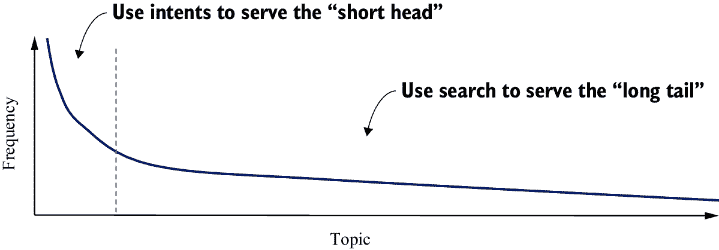
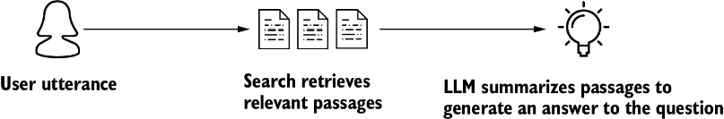
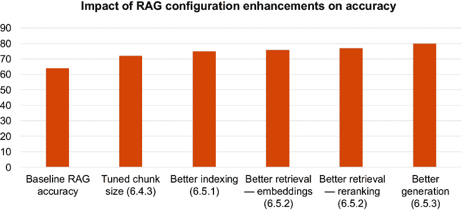

# 第六章：通过检索增强生成来增强响应

### 本章节涵盖

+   无需编码意图来增强聊天机器人响应

+   使用 RAG 改进薄弱理解

+   评估使用 RAG 相对于传统搜索模型的优势

+   为你的对话式 AI 选择合适的 RAG 技术

+   评估和改进你在对话式 AI 系统中 RAG 的性能

在前面的章节中，我们看到了问答机器人“不理解”的痛点。我们首先通过帮助聊天机器人理解更多意图来解决它，但在这个策略上，回报是递减的。来自“长尾”的不常见问题可能永远不会有意义地实现为意图。本章介绍了处理“长尾”的方法，包括搜索和检索增强生成（RAG）。这些是提高聊天机器人薄弱理解能力的好方法。

我们在第五章的结尾给出了关于何时避免添加新意图的建议，尤其是在处理多样化、不频繁的领域相关问题时。在本章中，我们将添加搜索功能来提高薄弱理解。

搜索和 RAG 都允许你通过添加数据和文档来改进聊天机器人，而无需编写新的意图。这使得你能够以仅训练少数几个的简单性来服务数千个意图。这些方法提供的答案更容易更改——只需更改文档而不是更改你的聊天机器人。

对于你作为构建者来说，搜索和 RAG 可能更容易，对于你的用户来说，它们可能更高效。让我们探索聊天机器人如何通过搜索和 RAG 功能来进化。

## 6.1 超出意图：搜索在对话式 AI 中的作用

传统的对话式 AI 集中在理解用户意图上。系统被训练来识别预定义的用户查询类别，并提供预编写的响应。

图 6.1 展示了基于意图的聊天机器人最简单的概念架构。聊天机器人的分类器检测意图并确定适当的对话流程。当分类器无法识别用户的意图时，答案是通用的“我没有理解”响应风格，导致“聊天机器人不理解我”的痛点。基于意图的问答是处理常见问题的好方法——你可以为不同的问题类型定义一个确切的答案。最初，这非常有效，但会崩溃。用户经常提出偏离预定义意图的问题。当预定义的意图不足以处理用户的问题时，用户可能会收到不相关或不正确的响应，导致挫败感。此外，维护和演进这些意图需要大量的努力。


##### 图 6.1 基于意图的聊天机器人首先检测意图，然后将其映射到答案。

在答案的特定性和覆盖的变体数量之间存在权衡。图 6.2 展示了我们在第三章中引入的 PharmaBot 的例子。答案是准确的但通用的——它检测到一个关于副作用的问题，但没有回答用户问题中的所有细微差别。


##### 图 6.2 基于意图的系统识别话语的主旨，并经常给出静态或通用的答案。

我们可以通过添加搜索功能来处理这种细微差别。有两种主要方法：

+   *传统搜索*向用户提供与他们的查询相关的文档或段落。用户使用这些文档来找到他们的答案。

+   *RAG*从搜索过程开始，但通过总结段落为答案来扩展（增强）它。

图 6.3 说明了 RAG 如何通过定位相关文档段落并将它们综合成特定、情境化的答案来细化信息检索。与传统基于意图的系统不同，这些系统通常以固定或一般的答案响应，RAG 动态地拉入内容来回答用户的独特查询，展示了关于布洛芬和血压的具体段落是如何提炼成有针对性的建议的。


##### 图 6.3RAG 找到相关段落并总结它们，给出有针对性的答案。

让我们更深入地探讨如何有效地添加这些功能。

### 6.1.1 在对话式 AI 中使用搜索

用户问题遵循“短头，长尾”分布，如图 6.4 所示。这种分布具有高频的常见或流行问题（短头）。大多数交互涉及较少见、利基或专业查询（长尾）。



##### 图 6.4 用户问题分布。意图解决最常见的、高频率的问题，而低频率、独特的问题可能需要搜索集成。

对于 PharmaBot 来说，简短头部包括一般的 COVID 咨询，例如疫苗信息和预约。每个机器人将有一个不同的简短头部，但它将涵盖最常见的问题。当聊天机器人训练得很好时，这些问题会以高置信度被识别。意图允许构建者完全控制简短头部查询，尽管可能会忽略细微的区别。

我们之前看到 PharmaBot 没有很好地处理细微的问题，因为它使用了静态的`#side_effects`意图。图 6.5 显示了 PharmaBot 使用传统的搜索能力处理相同细微问题的方法。


##### 图 6.5 搜索找到相关段落并直接显示给用户，通常还带有指向源文档的链接。

在这个例子中，响应包括了用户问题的所有细微差别。段落引用了疫苗副作用、布洛芬、血压和疼痛。然而，聊天机器人并没有提供一个单一、连贯的回答。相反，它提供了文档链接和片段。用户需要将这些文档和段落的答案结合起来。

### 6.1.2 传统搜索的优点

传统搜索可以通过使聊天机器人能够从文档存储库中检索相关信息来补充基于意图的聊天机器人。这种方法提供了几个优点：

+   *广度*—机器人可以访问您的文档存储库中的各种材料，为不同类型的问题提供答案。

+   *维护*—将知识添加到您的机器人中可以像在您的存储库中添加或编辑文档一样简单。

+   *技术*—搜索是一项成熟的技术，具有成熟的算法和实现方法。它可以用相对较低的计算资源和基础设施来实现。

+   *速度*—虽然比静态的基于意图的回答慢，但传统搜索执行得相当快。

因此，搜索是意图系统的一个很好的补充。将意图和搜索最常见的结合方式是在聊天机器人的自然语言理解（NLU）组件中使用置信度阈值。NLU 试图从用户的表述中检测意图。如果检测到意图的置信度较高，则返回基于意图的回答。否则，将用户的表述传递到搜索组件（在某些对话 AI 系统中，这被称为*回退操作*或*意图*）。高级架构如图 6.6 所示。


##### 图 6.6 意图和搜索具有互补功能。一个搜索增强型机器人当它对识别到的表述有高置信度时，会使用基于意图的回答；否则，它将推迟到搜索。使用意图和搜索一起可以提高聊天机器人的能力，但这种方法仍然存在一些局限性。

### 6.1.3 传统搜索的缺点

当将传统搜索与聊天机器人应用集成时，存在两个基本问题领域：搜索结果的质量以及搜索结果呈现的用户体验。

搜索质量的一个主要缺点是它依赖于关键词匹配，这可能会根据用户的表述方式而变得不准确或脆弱。考虑之前的例子问题：“我可以和我的血压药物一起服用布洛芬吗？接种疫苗后我的手臂很疼。”这可能会被转换为“布洛芬 血压 药物 手臂 疼痛 疫苗”，强调最相关的关键词，但失去了问题的细微差别。

并非所有搜索引擎都局限于关键词匹配，但这是普遍现象。较新的搜索引擎支持通过意义而非关键词进行搜索。这种方法使用向量数据库，将在下一节中更详细地描述。像传统搜索一样，向量数据库搜索接受一个输入查询，并返回一组相关文档和段落。

基于搜索的选项的另一个主要缺点是接收文档和段落的用户体验。一些用户体验限制源于聊天机器人窗口的空间有限以及展示多个搜索结果所面临的挑战。这些问题通常通过显示少量结果（可能询问用户是否想查看更多）来解决。

有时通过显示文档链接（而非段落）来保留屏幕空间。在这种情况下，用户必须离开聊天界面，这会打断对话流程，可能导致用户放弃聊天机器人，继续在文档链接所指向的地方。

通过语音界面处理搜索结果也具有挑战性，导致长时间的朗读和非最佳的用户体验。

最重要的是，搜索并没有产生一个连贯的答案。一些用户可能更喜欢从相关文档中构建自己的答案。然而，当没有给出连贯的答案时，大多数用户都会感到沮丧，他们必须自己拼接——“我最初为什么要使用聊天机器人？我自己也能搜索。”

注意：您可能考虑将网络搜索与答案综合相结合。虽然聊天机器人可以从网络搜索结果中创建综合答案，但这种方法也有局限性。它需要更复杂的处理，但通过消除用户筛选多份文档的需求，解决了用户体验的局限性。这种方法在很大程度上取决于单个段落与查询的匹配程度，如果检索到的数据不全面，总结可能会遗漏细微差别或上下文。

基于答案综合的搜索通常依赖于基于规则的提取方法、排名算法、关键词匹配或预定义的启发式方法。通过结合检索到的文档中的信息来呈现这些响应。虽然这可以有效地呈现相关信息，但它可能难以处理不完整或模糊的查询。系统并不真正“理解”内容。相反，它选择并重新表述现有文本，这可能导致遗漏上下文、响应碎片化或过度依赖最突出的检索结果而不是最准确的结果。它缺乏生成方法的灵活性。

这正是 RAG 作为一个强大替代方案的地方。RAG 不仅仅是从文档中提取文本——它结合了检索与生成，使得聊天机器人能够使用来自各种来源的相关内容，生成一个连贯、情境感知的答案。与传统搜索和摘要方法不同，RAG 可以通过结合实时检索和语言生成能力，适应更广泛的用户问题，并提供更深入、更准确的回答。

下一节将探讨 RAG 如何通过提高准确性和保持上下文，即使在复杂或细微的查询中，也能增强聊天机器人的响应。

## 6.2 超越搜索：使用 RAG 生成答案

缺乏明确的答案是传统搜索方法的局限性。为了克服这些局限性，我们将探讨 RAG 作为一个高级替代方案。在其核心，RAG 结合了基于搜索的信息检索的优势和生成模型的灵活性，提供了一种更全面的方法来理解和回应用户查询。最重要的是，这个响应包括一个答案。

### 6.2.1 在对话式 AI 中使用 RAG

RAG 结合了检索和生成技术的最佳之处，以提升用户体验。像传统搜索一样，它检索相关段落来处理长尾问题。然后 RAG 将段落和用户的请求输入到生成 AI 中，生成答案。RAG 通过生成答案“增强”检索到的段落，创建一个无缝的对话流程，即使是复杂或长尾查询也是如此。

图 6.7 展示了 PharmaBot 使用 RAG 回答我们熟悉的例子：

```py
User: “Can I take Ibuprofen with my blood pressure medication? My arms are sore after getting the vaccine?” 
Chatbot: Do not use over-the-counter ibuprofen for pain relief. Instead, use a painkiller less likely to increase your blood pressure, like aspirin.”
```



##### 图 6.7 RAG 检索相关段落，并通过综合信息生成一个基于事实的答案来增强响应。

PharmaBot 可能仍然会检索到与传统搜索相同的段落，但现在它会总结它们来生成答案。这个答案承认了用户的特定关注点，并提供了定制建议。最重要的是，这个答案基于 PharmaBot 的源文档——而不是生成 AI 的一般知识。PharmaBot 可能会提供支持文档的链接，但它已经使答案突出，而不是文档段落。这对用户来说是一个更轻松的体验。

RAG 赋予聊天机器人更好地理解用户问题的能力，并通过最小化显式意图分类的需求来简化开发工作。这种方法的转变提高了用户满意度，并为对话式 AI 系统在未来人类语言和用户需求不断变化的环境中提供了保障。

使用 RAG（检索与生成）引入了动态性并减少了用户努力，前提是避免幻觉。虽然 RAG 本身可以减少幻觉，但并不能完全消除它们。应关注检索到的文档质量、生成模型的行为，以及当检索未能找到相关文档时的情况，我们将在后面讨论。

当用户与对话 AI 交互时，检索系统连接到受信任的内容来源，执行搜索（关键词、语义或向量），并为检索到的结果提供相关性评分。大型语言模型（LLM）随后使用检索到的信息增强其响应。它从检索的内容中生成响应，并通过聊天机器人界面将其呈现给用户。如有需要，它还可以应用翻译。

与传统搜索一样，RAG 可以补充基于意图的系统。短尾通过意图处理，而 RAG 处理长尾。答案与文档来源一样最新。文档比聊天机器人更容易更新！

### 6.2.2 RAG 的好处

RAG 是问答机器人的一个伟大补充。通过从您的知识库（而不是生成式 AI 模型知识）中检索信息，RAG 确保答案基于准确和最新的数据，从而增强机器人的可信度和可靠性。此外，RAG 通过使对话 AI 系统能够有效地处理广泛的用户查询和任务，扩展了其多功能性。它还减少了“机器人不理解”和“用户面临过多复杂性”的痛点。

RAG 的好处包括增强答案的相关性、适应性和改进的手动转接给代理。

#### 增强相关性

RAG 的基本优势在于其访问和整合您知识库最新信息的能力。知识库提供的信息比预训练的意图更加多样化，LLM 可以将您的文档中的知识适应到答案中。

让我们再考虑 PharmaBot 的另一个例子。最初的 PharmaBot 包含了几个意图，包括餐馆用餐的指导。它根据一般指南进行响应，并包括“检查当地法规”的引用。没有针对用户的响应定制——这是一个一刀切式的答案。

表 6.1 比较了基于意图和基于 RAG 的 PharmaBot 版本。基于意图的提供通用答案，而基于 RAG 的则根据用户的问题本地化到纽约。

##### 表 6.1 意图和 RAG 的答案比较

| 基于意图的机器人交互 | 基于 RAG 集成的机器人交互 |
| --- | --- |

| `用户：纽约餐馆当前的 COVID-19 指南是什么？` `PharmaBot：餐馆餐饮的当前 COVID-19 指南包括限制室内容量、非就座时工作人员和顾客需佩戴口罩，以及加强清洁程序。请查阅当地法规以获取最新信息。`

| `用户：纽约餐馆当前的 COVID-19 指南是什么？` `PharmaBot：COVID-19 仍然是纽约人的一个重大关注点。确保您了解 2023-2024 季节更新的 COVID-19 疫苗，这些疫苗可以提供对新兴变异株的保护并增强整体免疫力。口罩仍然是减轻 COVID-19 和其他呼吸道病毒传播的有效工具，在各项活动中减少飞沫传播。为了最大限度地减少感染 COVID-19 的风险，建议个人在拥挤的室内公共场所佩戴口罩。`

来源：纽约市卫生部门

|

集成 RAG 的聊天机器人承认用户位于纽约市。它提供更具体的信息，针对当地指南和法规，从当前的纽约市卫生指南中提取并总结，以适应餐馆就餐。这种个性化的方法通过根据用户的环境提供更相关和可操作的指导来增强用户体验。

#### 适应性

在对话方面，RAG 的另一个优点在于对话式人工智能生成响应的方式——RAG 可以调整其生成的响应以适应用户问题的风格。如果用户的语气更倾向于寻求事实，则响应可以相应地更加正式。对用户独特问题的响应是实时生成的。有时用户期望一个简洁直接的答案（“是或否，餐馆就餐有限制吗？”*），*有时他们期望一个更长且更复杂的回答（“我可以带我的大家庭去餐馆，我们是否需要戴口罩？”）。这两个问题可能使用相同的源文档，但会收到非常不同的答案。

#### 转接到人工代理（或不回答）

有时候，对话式人工智能无法找到明确的答案。在这种情况下，机器人回答不知道或转接用户到人工代理会更好。图 6.8 描述了用户向一个无法回答问题的聊天机器人提问的情况。


##### 图 6.8 补充 RAG 与人工代理。如果答案与检索到的文档在语义上重叠度较差，则将用户转接到人工代理。

```py
Sample chat:
User: I have achalasia. Will my dysphagia get worse if I get a Booster and experience side effects?
```

当用户提出问题时，对话式人工智能会遵循一个多步骤的过程来检索信息、生成响应，并在交付最终响应之前确定答案是否足够基于检索到的证据。以下步骤说明了这一过程，展示了系统如何检索相关段落、生成候选答案、评估其准确性，并最终决定是否响应或将用户转接到人工代理：

1.  *段落检索*——系统检索与贲门失弛缓症、吞咽困难以及疫苗副作用的一般信息相关的段落：

示例段落 1: `"贲门失弛缓症` `是` `一种` `影响` `食管` `的` `疾病`，`导致` `吞咽` `困难`。"`

示例段落 2：“疫苗的常见副作用包括疼痛、发烧和疲劳。”

示例段落 3：“吞咽困难，或吞咽困难，可能是食管疾病如贲门失弛缓症的症状。”

1.  2. *答案生成*—LLM 基于检索到的段落生成一个候选响应：

```py
Getting a booster might lead to common side effects, but there is no clear evidence linking it to worsening dysphagia in people with achalasia.
```

1.  3. *比较检查*—系统将此生成的答案与检索到的段落进行比较，并识别出一个潜在问题：生成的答案包含一个“没有明确证据将其与吞咽困难恶化联系起来”的元素，而这个元素并未直接由检索到的段落支持。

1.  4. *转移决策*—鉴于答案与检索到的段落之间的匹配率较低，对话式 AI 确定该答案可能缺乏足够的依据，可能会误导。然后，它提出将用户转移到人工代理以获得更可靠的答案：

```py
Chatbot response: I apologize. I could not find a clear answer to your question in our resources. Let me connect you with a specialist who can provide more detailed information.
```

在这种情况下，对话式系统搜索相关文档段落，并将它们提供给 LLM。LLM 生成一个答案，然后对话式 AI 将生成的答案与检索到的段落进行比较。这种比较包括检测生成的答案中有多少单词和短语出现在段落中。如果百分比低，对话式 AI 决定该答案没有在文档中得到支持。然后，对话式 AI 优雅地承认其无法提供合适的基于文档的回答，并提出了另一种解决方案路径。

或者，搜索过程可能没有检索到任何文档。在这种情况下，对话式 AI 就不需要调用 LLM 来生成答案，它可以直接回避问题。对于这两种情况，对话式 AI 可以返回“我不知道”或其他后备响应。这两种选择都减少了产生幻觉和不相关答案的可能性。

### 6.2.3 将 RAG 与其他生成式 AI 用例结合

RAG 也可以与其他生成式 AI 用例结合使用。例如，RAG 可以处理信息查询，而其他生成式 AI 模型则专注于情感分析或语言翻译等任务。通过结合 AI 能力，对话式 AI 系统可以为用户提供全面的服务范围，进一步提高效率和满意度。

RAG 只是几个增强对话式 AI 的生成式 AI 模式之一。当用户提出常见问题或寻求有关产品或服务的详细信息时，RAG 会利用企业知识库提供准确和最新的答案。通过将回答建立在组织的特定领域，RAG 确保用户获得符合他们需求的相关信息。

然而，特定的用户查询可能需要比信息性回应更多的内容，需要采取可操作性的步骤（信息寻求与交易性问题）。在这种情况下，对话式人工智能系统执行交易并引导用户完成特定的任务或流程。例如，用户在从 RAG 获取有关产品或服务的相关信息后可能会表达出购买的兴趣。作为回应，对话式人工智能可以无缝过渡到交易性行动，例如启动结账流程或安排疫苗接种，从而促进用户旅程的顺畅和高效。

虽然 RAG 在高效和准确地响应用户查询方面表现出色，但额外的选项，如转交给人工代理或结合 RAG 与其他生成式人工智能用例，可以进一步优化用户体验。这些选项确保用户以最有效的方式获得他们需要的支持和帮助。

注意：对于 RAG 回应可能不足的情况——例如提供实时数据或满足特定客户请求——可以集成函数调用以动态地从外部系统检索信息。这种方法允许聊天机器人识别与实时响应相关的意图和参数，扩展 RAG 在复杂交互中的效用。虽然这里没有深入探讨，但如果您寻求一个更具动态性的对话式人工智能系统，函数调用是有价值的。

### 6.2.4 比较意图、搜索和 RAG 方法

表 6.2 总结了三种类型聊天机器人的功能和性能：基于意图的聊天机器人、与搜索集成的聊天机器人和 RAG 集成的聊天机器人。每种聊天机器人类型都是根据用户和聊天机器人创建者对对话式人工智能的期望和要求进行评估的。您可以通过比较这些属性来辨别最适合您特定需求的聊天机器人解决方案。

##### 表 6.2 比较基于意图的聊天机器人、与搜索集成的聊天机器人和 RAG 集成的聊天机器人的功能

| 要求 | 基于意图的聊天机器人 | 与搜索集成的聊天机器人 | RAG 集成的聊天机器人 |
| --- | --- | --- | --- |
| 处理查询的灵活性 | 限制于短头预定义的意图。可能忽略细微差别。 | 通过返回链接和片段处理长尾查询 | 通过返回答案处理长尾查询 |
| 回复的准确性和相关性 | 当意图以高置信度被识别时，答案准确且预先制作。 | 提供上下文相关且准确的文档，帮助用户找到答案 | 提供基于您的文档的上下文相关且准确的答案 |
| 向机器人添加新知识 | 手动添加或修改手动精选的意图-响应对 | 添加或修改您的知识库中的文档 | 添加或修改您的知识库中的文档 |
| 维护和可扩展性 | 当意图训练数据发生变化时进行广泛的回归测试。 | 文档库需要通过添加新文档和删除过时文档来维护。 | 文档库需要通过添加新文档和删除过时文档来维护。 |
| 响应生成质量 | 展示预定义的响应。 | 用户必须从检索到的段落和文档中自行组合答案。 | 答案基于源文档，但根据问题的细微差别进行了调整。 |

虽然传统聊天机器人帮助组织自动化简单任务并提供基本客户支持，但整合 RAG 技术增强了它们提供更准确、上下文感知的响应的能力，从而最终改善了用户体验。

##### 练习

1.  考虑你上一次的聊天机器人实现，并考虑长尾概念：

    +   列出三个传统基于意图的聊天机器人可能无法充分解决的细分或罕见用户查询的例子。

    +   讨论这些查询如何体现对话式人工智能中的长尾现象。

1.  对于相同的聊天机器人实现，考虑使用传统搜索与 RAG 可以提供哪些答案。

## 6.3 RAG 是如何实现的？

如“检索增强生成”（RAG）的名称所暗示的，RAG 有两个阶段：检索和生成。在检索阶段，算法搜索并检索与用户提示或问题相关的信息片段。在开放域消费者环境中，这些事实可以来自互联网上的索引文档；在封闭域企业环境中，通常使用更窄的私有源以增加安全性和可靠性。

### 6.3.1 高级实现

使用 RAG，系统在知识库中搜索与问题相关的信息，并使用这些信息生成对话式答案。让我们分解步骤：

1.  用户向聊天机器人提问问题。

1.  系统使用其 NLU 能力来确定用户问题的意图：

    +   如果它以高置信度识别问题——例如，如果它是它训练的意图之一——它将能够回答，并且不需要搜索。这结束了流程。

    +   如果它无法识别查询，它将转到搜索。系统会将用户的查询发送到搜索工具以搜索文档内容，并生成和排名搜索结果。

1.  它将排名搜索结果返回给聊天机器人进行显示。（在 RAG 之前，排名链接和摘要列表会被返回给聊天机器人——使用搜索结果处理长尾问题仍然比提供“抱歉，我无法理解”的响应更有帮助。）

1.  而不是简单地显示结果，原始问题和搜索结果会被发送到一个 LLM。LLM 可能会重新排名搜索结果，但最重要的是，它生成一个简洁、总结、语言正确的答案。

1.  然后将答案返回给系统。

1.  答案通过聊天机器人用户界面呈现给用户。

注意：既不需要原始用户问题也不需要生成的答案与文档“完全”一致。虽然逐字回复确实可能发生，有时甚至出于法律原因更受欢迎，但主要关注的是将内容建立在知识库的基础上，确保生成的答案根植于精心挑选的文档集中。

由于 LLM 的本质，每次处理查询时都不会生成一致的结果。这些模型可以根据上下文或措辞的微妙变化对相同的问题产生不同的回答。这种可变性是由于 LLM 的概率性质，它们基于学习到的模式生成文本，而不是检索固定的回复。虽然这种灵活性允许提供更细腻和上下文相关的答案，但它也可能导致对一致输出的期望，而这并不是这些模型的工作方式。

强调这一点至关重要，因为对 LLM（大型语言模型）的工作原理不熟悉的团队成员通常会期望得到一致的结果。这种期望可能会阻碍项目进展，导致团队成员在解决问题的方法上存在差异。理解 LLM 优先考虑相关性和上下文，而不是精确复制文档内容，有助于调整期望并改善团队内部的协作。

在某些情况下，生成的回复可能与文档中的措辞非常相似，甚至完全一致。这通常发生在文档中包含直接针对用户问题的相关和有信息量的段落时。在这种情况下，RAG 模型可能会在生成的回复中包含文档的逐字摘录，以向用户提供最准确和相关的信息。

在其他情况下，RAG 模型利用知识库中的信息来理解与用户问题相关的上下文和概念。然后，它利用这种理解来生成与文档中找到的内容一致的回复，即使用户的提问或生成的答案的具体措辞在文档中并未逐字出现。这种方法允许在开发有效解决用户查询的回复时具有更大的灵活性和适应性，同时利用精心挑选的文档集中的信息。

### 6.3.2 为 RAG 准备您的文档存储库

让我们再考虑一下在 RAG 搜索过程中如何检索文档内容。图 6.9 提供了更多关于创建适当数据的信息。


##### 图 6.9 RAG 在构建时间和运行时间都使用向量数据库。

一个系统的预处理管道确保了原始数据和用户的问题（或 LLM 对其的重述）都得到了优化，以便在基于 RAG 的搜索中使用。这个管道对于将数据转换为嵌入至关重要，使得模型能够高效地将用户的查询与相关信息匹配。然后应用如余弦相似度或其他方法来识别最佳匹配，确保准确和上下文适当的搜索结果。以下列表概述了该管道中涉及的关键步骤，详细说明了数据在用于检索之前是如何被处理的：

1.  *预处理数据*—系统（通常是一个数据管道，而不是 LLM 本身）处理原始文档，使其可搜索。例如，PDF 文档被转换为文本，或表格结构被转换为可处理语句。可能添加元数据以增强原始内容。然后文本被划分为连贯的语义单元，称为*块*。例如，文档可能在段落边界处被分割。分割是一种常见的识别和提取句子中有意义的单词组（“块”）的过程，用于进一步分析或处理。分割策略影响整体结果。有一些开源工具可以帮助可视化和理解不同的分割或拆分策略。

1.  *嵌入生成*—嵌入模型将这些块转换为嵌入或高维向量空间中单词或短语的数值表示。嵌入捕捉了单词和文档之间的语义关系，使得对连接的理解更加高效。相似的意义或上下文在向量空间中映射到附近，而不同的意义则映射到更远的点。这比关键字匹配提供了更相关的搜索结果。

1.  *向量数据库中的存储*—生成的嵌入向量存储在向量数据库中，这使得高效的相似性搜索成为可能。每个文档块都使用其向量表示进行索引，允许基于意义而非精确的单词匹配进行快速检索。

1.  *运行时的检索和匹配*—在运行时，最终用户与聊天机器人交互。他们的问题将使用相同的嵌入模型转换为向量，并在向量数据库中搜索，根据语义相似性找到最相关的段落（块）。然后检索到的段落被传递给 LLM，它将它们综合成对用户展示的响应。

这些步骤中的每一个都确保检索过程得到优化，使得 LLM 能够基于检索到的最相关数据生成准确、上下文感知的响应。

列表 6.1 显示了嵌入函数的示例代码。您可以使用任何自定义嵌入函数或其他向量数据库，性能可能取决于所使用的嵌入模型。这是 RAG 最常见的方法：您创建知识库的密集向量表示，以计算与用户查询的语义相似度。对于这个样本，我们使用了 Chroma 作为向量数据库。

##### 列表 6.1 将文件分割成块，嵌入并存储在向量数据库中

```py
from langchain.document_loaders import TextLoader
from langchain.text_splitter import CharacterTextSplitter
from langchain.vectorstores import Chroma

loader = TextLoader(filename)
documents = loader.load()
text_splitter = CharacterTextSplitter(chunk_size=1000, chunk_overlap=0)
texts = text_splitter.split_documents(documents)

from langchain.embeddings import HuggingFaceEmbeddings

embeddings = HuggingFaceEmbeddings()
docsearch = Chroma.from_documents(texts, embeddings)
```

在其核心，RAG 通过根据用户的查询检索相关文档或段落，然后使用自然语言生成技术生成响应来运行。这个过程可以通过使用其他文档检索和语言生成方法，而不进行显式的分块或嵌入来实现。

例如，使用 Lucene 作为分块和嵌入的替代方案，涉及使用其文档索引和检索功能。Lucene 可以处理检索部分，根据查询检索最相关的文档。检索后，RAG 的生成部分可以接管，根据检索文档的内容生成连贯的响应。Lucene 在文本检索方面非常高效，这把生成类似人类响应的复杂任务留给了 RAG 模型中更专业的生成组件。这种方法在强调检索准确性和速度而不仅仅是细微理解的系统中特别有利。

##### 练习

1.  文本分块—在这个练习中，您将尝试不同的分块策略和嵌入：

    +   选择您的样本文本数据（您选择的任意小文本文件）。

    +   确定分块策略（按句子或单词分割）。对于您的实验，尝试使用分块工具。

    +   使用开源嵌入模型嵌入块，然后将块加载到向量数据库（Chroma）中。

1.  设置摄取管道—本练习将指导您构建一个简单的摄取管道，用于处理 RAG 系统中的文档：

    +   选择与您组织领域或聊天机器人特定用例相关的文档集。从简单的纯文本文档开始，即没有表格等。

    +   考虑易用性和与 RAG 兼容性等因素构建摄取管道。对于查询，使用开源模型、Hugging Face 嵌入模型和 llama 索引。

    +   实现数据集的摄取管道，以便预处理和结构化数据集以用于与 RAG 一起使用。

    +   使用样本数据测试摄取管道，以确保其正常功能和数据完整性。

## 6.4 RAG 实现的附加考虑

传统搜索返回相关文档的链接、段落或全文，用户需要筛选这些信息以找到他们的答案。RAG 相反，直接返回答案，用户可以选择查看所用的文档。

### 6.4.1 我们就不能直接使用一个 LLM 吗？

如果对话式 AI 将用户的查询传递给 LLM 并得到答案呢？毕竟，LLM 是在大量数据上训练的。

首先，由于 LLM 是在互联网规模的数据上训练的，其局限性是由于其训练数据的性质。这些数据代表了从公开来源在训练时间点的快照——它不包含特定业务、个人或机密信息，也不包含截止日期之后创建的公开数据。因此，即使是最新 LLM 的知识也可能过时，随着时间的推移导致不准确的结果。RAG 通过在 LLM 训练后提供数据来解决这一问题。

其次，由于 LLM 是从大量数据集中训练的，很难追踪其响应到来源，这损害了模型输出的可靠性和可信度。RAG 本质上是基于事实的，因为您确切知道为给定问题提供给 LLM 的数据是什么。

广泛领域的 LLM 带来了另一个重大挑战。由于可以访问大量信息，它们可能会在没有具体证据或上下文的情况下，自信地生成响应。这种产生看似合理但实际上错误或未经证实的信息的倾向被称为*幻觉*。相比之下，您希望您的对话式 AI 提供正确且基于事实的答案。高级提示技术可以帮助减轻幻觉，但通过 RAG 提供源数据更为可靠。

您还希望优先考虑基于特定文档或语料库的答案，而不是 LLM 所训练的文档。RAG 系统的主要重点是提供基于您文档的内容和上下文的响应，因此答案直接从语料库中的信息生成，从而提高了提供给用户的响应的准确性、相关性和可信度。

在选择特定的大型语言模型（LLM）用于您的用途之前，考虑其训练数据和领域是很重要的。如果 LLM 是在通用数据上训练的，而您需要特定领域的成果，它可能无法产生期望的结果。在这种情况下，您可以探索诸如模型混合等技术，通过结合多个模型来利用每个模型的优点，从而在特定领域提高性能。如果您有资源和可用数据，您还可以考虑微调所选模型以更好地满足您的需求。然而，这可能需要大量的计算资源和数据预算，因此首先考虑提示微调。尽管微调成本正在下降，并将继续下降，但它们仍然需要仔细考虑。其他针对特定领域训练的方法也正在出现，提供了更多的灵活性。

### 6.4.2 使用 RAG 保持答案的时效性和相关性

RAG 在问答方面直接使用 LLM 具有显著优势。虽然 RAG 仍然使用 LLM 进行自然语言生成，但 LLM 是从搜索到的文档中构建准确响应的。实时检索将在构建阶段添加新或更新文档时找到最新信息。RAG 确保答案反映了搜索知识源的最新文档。这种企业内容的实时集成增强了响应的相关性和准确性，并增强了用户的信心，因为他们知道他们正在接收最新和可靠的信息。

此外，RAG 不仅限于访问企业内容。它能够访问特定的段落，并从多份文档中检索信息。这种粒度允许 RAG 追踪和验证答案的确切来源，为用户提供全面透明度和可信度。这也为您的开发团队提供了责任和验证过程的便利，确保您知道您的机器人正在做什么以及为什么这么做。

此外，RAG 定义了 LLM 理解的范围，使其能够识别其知识和专长的限制。与直接使用且可能尝试在其领域之外提供答案的 LLM 不同，RAG 在遇到超出其范围的问题时能够承认。这种说“我不知道”的能力防止了它给出不准确答案，并在对话交互中促进了透明度。通过为其理解设定清晰的边界，RAG 使开发者能够构建优先考虑准确性、可靠性和完整性的 AI 系统，从而最终提升整体用户体验。

“我不懂”和“我找不到你问题的答案”之间有区别。虽然 RAG 的主要目标是根据检索到的文档内容生成有信息和相关的响应，但在某些情况下，系统可能找不到足够或适当的信息来生成有意义的响应。在这种情况下，RAG 模型通常会承认其无法提供令人满意的答案，并将此信息传达给用户。

然而，需要注意的是，RAG 系统的特定行为，例如返回“我不知道”的响应，可能受到检索组件的设计、知识库的质量、生成模型的设置或参数的影响。此外，开发者可以选择实施特定的策略或回退机制来处理系统无法生成响应的情况，例如提供替代建议或提示用户提供更多信息。

### 6.4.3 设置摄取管道有多容易？

设置一个能够有效保留文档结构的摄取管道对于确保 RAG 检索系统中的搜索结果准确性至关重要。必须考虑几个关键领域。本质上，您在组件上做出的每一个架构决策都将影响结果的总体准确性。

首先，您必须建立机制将现有内容存储连接到检索系统或迁移内容到新的存储库。这将允许检索系统访问必要的数据并保持数据完整性。

下一个挑战是在摄取过程中正确提取结构（如标题、表格和列表）。这些格式元素有助于文档的组织和清晰度。通过在摄取过程中保留这些结构信息，检索系统可以使用它来提高搜索准确性和相关性。

还有一些与分块相关的问题。将大型文档分割成代表性的子文档以进行索引的能力提高了检索过程的效率。这允许进行更细粒度的索引和检索信息，从而加快对长文档中特定内容的访问。此外，选择适当的搜索方法，如向量、语义、联邦、关键词或混合，进一步增强了检索系统的功能。

使用 LangChain 简化了设置摄取管道的过程。回想一下，您将需要

+   *文档加载器*——从各种格式加载数据。

+   *文档转换器*——处理和结构化数据以实现高效检索。

+   *检索器*——在查询时获取最相关的文档片段。

*文档加载器*简化了不同文档格式的摄取。这些加载器简化了工作流程，确保了高效处理和检索与 LLM 相关的上下文，以提供精确的响应。它们从源文档中加载数据，将每个提取的部分视为包含文本内容和相关元数据的文档。LangChain 提供了处理各种文件的内建功能：目录中的所有文件、PDF、CSV、JSON、HTML、markdown、txt 等。

例如，您可以从网页、字幕或企业文档中加载文本。文档加载器提供了一种`load`方法，用于从配置的源加载数据作为文档：

+   文本加载器：

```py
from langchain_community.document_loaders import TextLoader

# Load text data from a file using TextLoader
loader = TextLoader("./your_data/YourText.txt")
document = loader.load()
```

+   CSV 加载器：

```py
from langchain_community.document_loaders import CSVLoader

# Load data from a CSV file using CSVLoader
loader = CSVLoader("./your_data/Yourspreadsheet.csv")
document = loader.load()
```

查看 LangChain 关于自定义 CSV 解析和加载的文档。例如，您可能希望指定您的分隔符、字段名等。同样，LangChain 提供了一个`DirectoryLoader`用于目录中的所有文档，一个`UnstructuredHTMLLoader`用于加载 HTML 文档，等等，用于常见类型。了解`AzureAIDocumentIntelligenceLoader`非常重要，这对于 Microsoft Office 类型的文档非常有用。

+   微软文档加载器：

```py
%pip install --upgrade --quiet langchain langchain-community 
↪azure-ai-documentintelligence

from langchain_community.document_loaders import AzureAIDocumentIntelligenceLoader

file_path = "<your_filepath>"
endpoint = "<Your_endpoint>"
key = "<key>"
loader = AzureAIDocumentIntelligenceLoader(
    api_endpoint=endpoint, api_key=key, file_path=file_path, 
    ↪ sapi_model="prebuilt-layout"
)

documents = loader.load()
```

一旦你加载了文档，你需要查看*文档转换器*，它可以将长文档分割成 LLM 可以处理的更小的块。LLMs 有一个“上下文窗口”属性，决定了它们在一次遍历中可以有效地处理的文本长度，因此块必须适合 LLM 的上下文窗口。很容易假设设置更广泛的上文（即更长的文本段落）会自然而然地导致在各种语言理解任务上的性能提升。然而，最近的研究表明，这并不总是如此。证据表明，当呈现的文本总体较少时，语言模型可以达到更好的性能，但文本必须与当前任务高度相关。

较大的上下文窗口允许在推理过程中包含更多信息，但这种通常称为*提示填充*的技术有其权衡之处。处理更多文本需要更多的计算资源，这会减慢推理并增加成本——尤其是对于按字符付费的公司，总结长文档（如年度报告或会议记录）可能会变得昂贵。虽然较大的上下文窗口可以在一定程度上提高结果，但回报是递减的。像人类一样，LLMs 也可能经历信息过载；当面对过多的细节时，它们可能会忽略关键点。研究表明，LLMs 更有可能在提示的开始或结束时关注关键信息，可能会错过隐藏在中间的关键见解。

我们需要文档转换器来预处理文档，提取相关信息，并将其转换成语言模型在生成过程中可以高效使用的结构化表示。LangChain 有几个内置的转换器，使得文档操作变得简单。

分割过程如下：

1.  将文本分成更小的块。

1.  将这些较小的块组合成一定大小的较大块，通常可以通过某些函数来衡量。

1.  一旦达到那个大小，它就变成了文本的新单元。然后，你创建一个新的文本段，并保留一些重叠以保持片段之间的上下文。

你可以选择你的分割规则（字符、单词、标记）以及如何衡量块的大小。再次强调，LangChain 在 langchain-text-splitters 包中提供了许多不同类型的分割器。以下是一些文本分割器的示例：

1.  *递归*—递归分割文本是推荐的开始方式。它的目的是将相关的文本片段保持在一起。

1.  *HTML*—一个“结构感知”的块分割器基于 HTML 特定的字符分割文本；示例见列表 6.2。它在元素级别进行分割，为块的相关性添加元数据。它保留文档结构中的语义分组和丰富的上下文信息：

    +   *字符*—它在用户定义的字符处（例如，"\n\n"）打断文档。

    +   *Code*——它使用 Python 和 JavaScript（以及其他 13 种语言）的代码语法和语法标识符，将代码组织成逻辑组。

    +   *Markdown*——它识别 markdown 语言并将文档组织成结构化格式（类似于 HTML）。

    +   *Tokens*——它使用分词器，如 tiktoken，根据代码中定义的模型令牌限制来分割文本。

##### 列表 6.2 HTML 分割器

```py
# Install langchain-text-splitters if not already installed
%pip install -qU langchain-text-splitters

# Import necessary modules
import langchain
import langchain_text_splitters

print("Langchain version:", langchain.__version__)
print("Langchain Text Splitters module loaded successfully!")
from langchain_text_splitters import HTMLHeaderTextSplitter
from langchain.schema import Document  # Ensure Document is properly imported

from bs4 import BeautifulSoup

print("BeautifulSoup is installed successfully!")

# Sample HTML content to be split
html_string = """
<!DOCTYPE html>
<html>
<body>
<div>
<h1>Introduction</h1>
<p>This is the introduction section of the document.</p>
<div>
<h2>Chapter 1: Getting started</h2>
<p>This section covers the basics of getting started.</p>
<h3>Section 1.1 Setup</h3>
<p>This subsection explains the setup process.</p>
<h3>Section 1.2 Configuration</h3>
<p>This subsection details the configuration options.</p>
</div>
<div>
<h2>Chapter 2: Advanced Techniques</h2>
<p>This section dives into more advanced techniques.</p>
</div>
<br/>  <!-- Fix: Ensuring self-closing tag is correctly formatted -->

<p>What you learned in the Introduction.</p>
</div>
</body></html>
"""

# Define header tags to split on (h1, h2, h3 represent different levels of headers)
headers_to_split_on = [
    ("h1", "Header 1"),  # Top-level headers
    ("h2", "Header 2"),  # Subsection headers
    ("h3", "Header 3"),  # Sub-subsection headers
]

# Initialize the HTML header text splitter with the specified header levels
html_splitter = HTMLHeaderTextSplitter(headers_to_split_on=headers_to_split_on)

# Split the HTML document into structured chunks
html_header_splits = html_splitter.split_text(html_string)

# Display structured output
for doc in html_header_splits:
    print(f"Content:\n{doc.page_content}\nMetadata: {doc.metadata}\n{'-'*40}")
```

接下来，我们需要处理嵌入。数据类型和语言支持要求决定了嵌入模型的选择。此外，当处理特定领域或行业术语时，这些模型可能需要扩展。

LangChain 中的嵌入模型将文本转换为数值表示，或嵌入，以便进行处理。LangChain 与不同的模型提供商（OpenAI、Cohere、Hugging Face 等）集成以生成嵌入。例如，`OpenAIEmbeddings` 类使用 OpenAI API 创建嵌入，这可以通过 OpenAI 的 API 密钥或 Azure 的 OpenAI API 密钥来完成。

```py
from langchain.embeddings import OpenAIEmbeddings
embeddings = OpenAIEmbeddings()

text = "This is a test document."
query_result = embeddings.embed_query(text)
query_result[:5]
```

其他集成包括 `CohereEmbeddings`、`TensorFlowEmbeddings` 和 `HuggingFaceInferenceEmbeddings`。

在获得嵌入后，您必须将它们存储在向量数据库中，例如我们之前使用的 Chroma。在选择向量数据库时，您需要考虑运行时性能、它如何根据您的数据集大小进行扩展以及整体性能。另一个重要考虑因素是集成 LangChain 等工具，它正在不断改进。LangChain 通过提供处理嵌入和集成各种机器学习和 AI 工作流的简化流程来增强向量数据库的功能。这种组合确保了高效的数据管理和检索，使其成为可扩展和高性能应用的稳健选择。

*Retrievers* 在嵌入和用户查询之间架起桥梁。虽然嵌入在向量数据库中存储了文档的数值表示，但检索器根据相似度评分识别和检索最相关的片段。

检索器的工作方式如下：

1.  使用在摄取期间使用的相同嵌入模型将用户的查询嵌入。

1.  向量数据库搜索最语义相似的嵌入。

1.  检索器检索最相关的匹配项并将它们传递给 LLM 以生成响应。

LangChain 包含多种检索方法。例如，LangChain 中有一个基于相似度的检索器：

```py
from langchain.vectorstores import Chroma retriever = vector_db.as_retriever(search_type="similarity", search_kwargs={"k": 5}) retrieved_docs = retriever.get_relevant_documents(query)
```

检索器在仅返回最相关的文档片段中扮演着关键角色，确保 LLM 在专注、高质量上下文中工作，而不是原始、未处理的数据。

### 6.4.4 处理延迟

处理延迟的通用最佳实践尚未开发。对于用户来说，长响应时间令人沮丧，但这些技术可以增强他们的体验：

+   *使用高效的搜索质量向量存储。* Facebook AI 相似性搜索（FAISS）库允许您快速搜索相似嵌入。有许多专门构建的向量数据库，如 Chroma、Milvus、Pinecone 和 Weaviate，还有更多正在出现。传统的数据库和搜索系统，如 Elasticsearch，提供向量搜索插件。每个都有其独特的优势，可以根据您的需求进行选择，包括可扩展性、功能、性能和成本。

+   *预处理和整理您的数据集。* 相同文档的多个相似版本会增加搜索时间并降低搜索结果质量。

+   *在执行慢动作之前通知用户。* 一个适当的语气信息，例如“只需稍等片刻”，可以安抚用户并填补延迟。

+   *流式响应以在生成每个标记时向用户展示答案。* LLM 可能需要 1.5 到 5 秒或更长时间来生成答案，搜索可能需要 5 到 10 秒。如果对话式 AI 等待 LLM 完成，用户可能会认为聊天机器人已损坏。

+   *考虑缓存。* 通过缓存每个用户的向量数据库和聊天历史，可以存储与用户交互相关的常用信息。这减少了每次都需要从头生成响应的需求，从而节省了所需的计算资源。虽然缓存可能会消耗额外的标记，但权衡的结果是提高了效率。

### 6.4.5 何时使用回退机制和何时搜索

确定是否使用 RAG 的响应或转向人工代理涉及几个关键考虑因素。例如，如果检索没有产生适当的结果，则不应调用 RAG 的生成部分。在这种情况下，对话式 AI 可以优雅地退出查询，并响应提出将用户转交给人工代理的提议。通过绕过基于可能较差的搜索结果生成答案，您有效地减少了最终用户的延迟，确保他们能够收到及时的响应，同时节省了计算资源。

图 6.10 展示了确定是否使用 RAG 响应或手动将查询转交给人工代理的决策过程：

1.  对话式 AI 处理用户查询并将其传递给检索系统，检索系统搜索知识库以找到相关信息。

1.  检索结果将被评估以确定它们是否适合生成响应。

1.  如果检索结果被认为合适，系统将使用全功能的 RAG 方法生成响应。


##### 图 6.10 当 RAG 的答案与检索到的段落不匹配时，提供人工代理可能更好。

1.  4. 如果检索结果不合适（例如，结果不足或无结果），系统将优雅地提出将查询转交给人工代理。

1.  5. 响应（无论是系统生成还是传递给人工代理）将返回给用户。

## 6.5 评估和分析 RAG 性能

在对话式人工智能系统中评估 RAG 模型的能力是多方面的。必须对每个能力进行评估以得出总体结果。大多数评估考虑了三个方面：

+   *这是否是正确的响应？* 答案是否直接回答了用户的问题？例如，如果用户询问重置密码，响应应清楚地解释步骤，而不是讨论更广泛的账户安全问题。

+   *这个用户是否处于正确的上下文中？* 响应是否考虑了用户的特定情况或历史？例如，如果用户之前报告了账户问题，系统应提供定制的后续解决方案，而不是通用的建议。

+   *响应是否基于文档（或由生成过程虚构或编造）？* 响应是否准确反映了从源文档中检索的信息，而没有编造细节？例如，在解释退货程序时，应正确引用公司的政策文件，而不是创建不存在的政策。

一个 LLM 可以根据关键标准对响应进行评分，以增强评估过程。这种方法与人工审查结合使用时效果最佳：LLM 提供初步评估，然后人工评估人员验证响应的准确性和上下文相关性。

这些评估标准有助于确定聊天机器人的回答的真实性。如果源文档准确且 RAG 检索了正确的文档，则生成的答案也应准确。响应的评估可以分解为评估 RAG 的不同组件，可以单独评估其整体性能，包括文档索引的质量、检索过程的有效性和答案生成的准确性。

### 6.5.1 索引指标

索引指标提供了关于系统如何高效组织、存储和检索大量数据的见解。关键考虑因素包括索引速度、存储需求、可扩展性以及系统处理高维数据（如向量）的能力。表 6.3 总结了这些重要方面，提供了快速概述和相关示例。

##### 表 6.3 影响 RAG 系统文档索引效率和准确性的关键指标

| 方面 | 摘要 | 示例 |
| --- | --- | --- |
| 索引指标 | 评估速度、存储需求和可扩展性。对大规模数据系统至关重要 | 对于新闻聚合器，速度和规模至关重要 |
| 向量数据库性能 | 衡量处理高维数据的性能 | 对于技术支持，必须为多个文档组装准确的故障排除步骤。例如，“为什么我的设备过热？” |
| 召回率 | 表示检索相关数据的准确性。高召回率对于完整检索至关重要。 | 在法律文件检索中，高召回率确保找到所有相关案例。 |
| 查询复杂性 | 根据查询的具体情况、维度和数据集多样性影响性能 | 处理多个数据点的金融数据库中的复杂查询 |
| 基准测试工具 | 像 ANN-Benchmark 这样的工具会在诸如召回率与 QPS（每秒查询数）之类的指标上比较算法。 | 评估哪种算法在视频搜索引擎中最好地平衡了速度和准确性 |

首要的关键组成部分是评估索引指标，这涉及到评估在一个系统知识库中组织和访问数据的效率和效果。这包括检查诸如索引速度、存储需求和索引过程的可扩展性等因素。高效的索引对于 RAG 系统至关重要，因为它影响信息检索的速度和准确性。无效的索引可能导致响应时间慢和数据检索不准确，从而损害响应质量。

向量数据库的性能是另一个重要的指标，专注于存储和检索表示复杂数据（如文本、图像或嵌入）的高维向量。这些数据库执行近似匹配搜索而不是精确匹配搜索，因此需要超越传统数据库性能指标（如每秒查询数 QPS 和延迟）的性能评估。虽然这些指标对于评估系统速度和响应性很重要，但它们并不能直接捕捉检索结果的准确性。因此，除了 QPS 和延迟之外，*召回率*也是向量数据库的另一个重要性能指标。如果向量数据库表现良好，RAG 模型可以访问高质量、相关的信息，从而生成更准确和上下文适当的生成内容。相反，性能不佳可能导致检索时间慢，以及使用不相关或不那么有用的数据生成。

考虑一个客户支持场景，其中由 RAG 系统驱动的聊天机器人被用来处理询问。在高召回率的情况下，聊天机器人能够从知识库中访问广泛的信息，有效地解决客户查询并提高满意度。然而，低召回率可能导致关键信息的遗漏，导致响应不足并增加客户的不满。因此，聊天机器人的有效性在很大程度上取决于其全面检索相关信息的能力，这突出了在自动化支持系统中高召回率的重要性。

查询复杂度，受查询的维度和特定性、数据多样性等因素影响，也会影响向量数据库的性能。高维查询需要更多的计算资源，因为向量之间的距离计算变得更加复杂。这可能导致检索任务的时间和内存使用增加。更具体的查询可能针对向量空间中的非常狭窄的片段，这可能会挑战索引系统有效地隔离和检索相关向量，尤其是在大型数据集中。高查询复杂度可能会使系统压力增大，可能导致检索时间变慢和返回的数据相关性降低。此外，复杂的查询使得区分相关和不相关结果变得困难。

想象一个电子商务平台上的聊天机器人，它旨在帮助客户使用涉及多个属性（如品牌、颜色、尺码和用户评分）的复杂查询来查找产品。例如，客户可能会要求聊天机器人提供“6.5 号蓝色阿迪达斯运动鞋，最低 4 星评分。”这个查询由于其跨多个维度的特定性而提出了多方面的挑战。这些属性中的每一个在数据库中代表一个不同的向量。

像 ANN-Benchmarks 和 VectorDBBench 这样的基准测试工具通过比较不同的算法和配置来帮助评估这些方面，确保 RAG 系统建立在稳健的检索基础上，以实现持续的高质量内容生成。ANN-Benchmarks 在*x*轴上绘制召回率，在*y*轴上绘制每秒查询数（QPS），说明了每种算法在不同检索准确度水平上的性能。VectorDBBench 分别显示 QPS 和召回率。

### 6.5.2 检索指标

下一个能力是检索指标，它衡量系统从索引数据中检索相关信息的能力。关键方面包括检索准确度、精确度、召回率和响应时间。有效的检索指标确保用户收到准确和相关的响应，从而提高对对话式人工智能系统的满意度和信任度。表 6.4 总结了这些重要方面，随后是更详细的解释。

##### 表 6.4 影响检索指标的关键方面

| 方面 | 概述 | 示例 |
| --- | --- | --- |
| 检索准确度 | 评估系统从索引数据中检索相关信息的能力 | 确保聊天机器人从大型数据集中检索准确的故障排除指南 |
| 精确度和召回率 | 精确度衡量检索文档的相关性；召回率衡量检索到的相关文档数量。 | 在电子商务聊天机器人中检索产品推荐时平衡精确度和召回率 |
| 上下文精确度和上下文召回率 | 特定于 RAG：上下文精确度检查相关性；上下文召回率检查相关信息覆盖范围 | 评估生成的响应在支持聊天机器人中与查询上下文匹配的程度 |
| 参数优化 | 调整搜索参数和算法以提高结果的速率、准确性和相关性 | 调整 FAISS 集群或 Elasticsearch 设置以改善法律数据库的文档检索 |
| 嵌入模型 | 使用不同的嵌入通过提高精确度或召回率来影响检索质量 | 在法律建议聊天机器人中使用 BERT 进行精确的上下文理解 |
| 过滤和重新排序 | 策略用于去除噪声并重新排序结果以提高相关性和准确性 | 在新闻聚合聊天机器人中过滤掉不相关的文章，然后重新排序顶级结果 |
| 标准化折现累积增益 (NDCG) | 通过考虑检索文档的相关性和位置来评估排名质量 | 确保在技术支持聊天机器人中，最相关的帮助文章出现在顶部 |

这些指标评估搜索质量、文档相关性和用户查询与响应的匹配程度。*检索准确性*衡量系统从其索引数据中检索最相关信息的能力。如果检索准确性低，聊天机器人可能返回仅与用户查询松散相关的响应或无法检索关键细节。

精确度衡量检索到的相关文档的比例。召回率衡量系统检索到的相关文档的数量。高召回值表示系统从数据库中检索到许多相关文档。相比之下，高精确度值表示检索到的文档大多与用户的查询相关。平衡召回率和精确度对于确保全面覆盖相关信息并最小化无关结果至关重要。

对于 RAG 模型，上下文精确度和上下文召回率评估生成的响应与用户查询的对应关系和覆盖范围。上下文精确度衡量检索到的上下文与用户查询的匹配程度，表明生成响应的相关性和准确性。上下文召回率衡量生成的响应如何全面地覆盖检索上下文中的相关信息。

您应该实施各种策略来增强检索过程：

+   优化搜索参数

+   使用不同的嵌入模型

+   实施过滤和重新排序

第一种策略是调整检索参数以改善速度和准确性。调整搜索参数，如 FAISS 中的集群数量或 Elasticsearch 中的搜索查询复杂性，可以显著提高检索文档的精确度和召回率。这确保了系统返回最相关的文档，提高了精确度，并检索所有相关文档，提高了召回率。

参数优化还可以减少响应时间，使系统更加响应迅速。调整索引和查询算法可以导致检索时间更快，而不会影响准确性。

第二个策略是利用不同的嵌入模型来找到检索相关文档的最有效组合。嵌入可以极大地影响检索质量。例如，BERT 和 Sentence-BERT 可以提高系统对用户查询的上下文和语义的理解，从而提高精确度。GPT-3 嵌入可以提供更广泛的上下文理解，通过从不同的上下文中检索更多相关文档来提高召回率。

第三个策略是实现过滤和重新排序。过滤和重新排序策略通过移除无关文档进一步提高了精确度，并通过优先考虑相关文档来提高召回率。如特定领域过滤器或上下文感知重新排序等技术可以显著提高顶部结果的相关性。

标准化折现累积增益（NDCG）在检索文档顺序很重要时很有用。它通过评估搜索结果中文档的相关性和位置来衡量排名算法的有效性，提供全面的排名质量评估。

### 6.5.3 生成指标

评估的最后一个领域是生成本身：生成的输出是否提供了相关且完整的答案。表 6.5 提供了一个关于这些关键指标、提高生成质量策略及其应用实例的简要概述，随后是更详细的说明。

##### 表 6.5 影响生成指标的关键方面

| 方面 | 摘要 | 示例 |
| --- | --- | --- |
| 忠实度 | 根据检索到的上下文评估生成输出的事实准确性 | 确保聊天机器人回答在回答问题时是事实正确的。例如，“违反合同会有什么后果？” |
| 答案相关性 | 评估生成的答案与特定用户问题的相关性 | “我的订单状态如何？”聊天机器人检索到相关数据后，回答：“您的订单编号 12345 目前正在运输中，预计将于 8 月 15 日交付。”此响应直接与用户的问题相关，提供了关于订单状态的特定信息，而没有不必要的细节。 |
| 微调 | 通过将 LLM 与特定领域的数据对齐，提高生成内容的准确性和相关性 | 微调 LLM 以提供法律建议，确保生成的响应准确且具有法律相关性 |
| 提示工程 | 通过构建提示来引导 LLM 生成更符合语境和相关的响应 | 使用提示工程确保医疗聊天机器人提供清晰、相关的医疗建议 |
| 模型融合 | 结合专业模型以提升生成质量，平衡准确性和流畅性 | 将以检索为重点的模型与以语言为重点的模型融合，以生成准确、流畅的响应 |
| 敏感性与特异性平均值（SSA） | 衡量开放域聊天机器人的响应质量，确保响应既合理又具体 | 评估开放域聊天机器人的响应，以确保它们有意义且不过于模糊 |
| 忠诚度评估器 | 通过与检索到的上下文对齐来评估生成的响应是否避免了幻觉 | 使用 FaithfulnessEvaluator 确保金融聊天机器人的响应基于检索到的文档 |

评估 LLM 性能的两个主要指标是忠诚度和答案相关性。忠诚度根据检索到的上下文评估答案的事实准确性，而答案相关性评估答案与给定问题的相关性。一个答案可能是事实准确的（忠诚的），但与问题不太匹配（相关性较低），或者可能是准确的，但不是基于来源文档的。

可以采用几种策略来提高生成指标。通过在特定领域的数据上微调 LLM，可以通过使模型更紧密地与它将运行的上下文对齐来提高忠诚度和相关性。这确保了生成的响应是准确且与特定领域相关的。您还可以考虑结合提示工程。通过在提示中明确包含必要的上下文或约束，生成过程变得更加专注并符合用户的意图。模型混合也可能被使用。结合多个模型，每个模型在任务的各个方面都专门化，可以帮助提高生成质量。例如，一个模型可能在检索准确信息方面表现出色，而另一个模型可能在生成流畅且上下文适当的语言方面更出色。混合这些模型可以导致更平衡和有效的输出。

敏感性与特异性平均值（SSA）指标评估开放域聊天机器人的响应质量。敏感性确保响应在上下文中有意义，而特异性平均值确保全面性而不含糊。历史上，人类交互对于分配这些评分是必要的。

避免模糊的回答是至关重要的，但防止大型语言模型（LLMs）产生幻觉同样关键。LlamaIndex 建立了一个 FaithfulnessEvaluator 指标，通过评估响应是否与检索到的上下文一致来衡量幻觉。LlamaIndex 的开发旨在解决将 LLMs 与各种数据源连接的挑战，以便 LLMs 可以访问、查询并从结构化和非结构化数据中生成见解。它是一个用于构建上下文增强生成式 AI 应用的框架。它提供了数据集成、索引、丰富查询处理等功能。请关注 LlamaIndex 的最新更新。

集成 RAG 的对话式人工智能有效地解决了罕见或复杂的问题。然而，从 RAG 中实现这些优势需要持续监控所有组件，尤其是在失败常见的领域，如检索和生成过程中。

### 6.5.4 比较 RAG 的索引和嵌入解决方案的效率

在前面的章节中，我们介绍了影响 RAG 系统效率的因素。索引和嵌入组件对于有效地检索相关文档和确保系统的响应性至关重要。在将 RAG 实施于对话式人工智能系统中时，重要的是要衡量其对检索准确性和响应相关性的影响。基准测试对于创建有效的 RAG 系统至关重要。您必须有一种方法来评估系统提示的变化是否提高了用户查询命中率。这种改进是 1%、2% 还是更多？这是了解您的 RAG 系统是否真正有效的基本途径。

此外，如果没有适当的监控、验证和评估，将很难证明您系统的有效性。RAG 本身就非常复杂，典型的实现最初准确率在 50% 到 60% 之间。您希望将准确率提高到 80% 以上，以实现一个实用的解决方案。

PharmaBot 最初作为一款用于处理一般咨询的 COVID-19 聊天机器人而开发，例如疫苗信息和预约安排，现在将增强 RAG 功能。目标是扩展 PharmaBot 的功能，以回答更细微的问题，例如“我可以和我的血压药物一起服用布洛芬吗？”以及“接种疫苗后我的手臂很疼。我该怎么做？”首先，我们将选择一个包含医学文章、研究论文和来自卫生组织的指南的数据集，所有这些都关注各种健康问题和药物与疫苗的相互作用。接下来，我们将编制一组代表性的查询，如之前所列，这是用户可能会提出的问题。

我们将选择我们想要使用的索引解决方案和嵌入。对于索引，我们将考虑几个选项，例如 FAISS 和 Elasticsearch。最新的文本嵌入模型性能基准的最受欢迎来源是 Hugging Face 主办的 MTEB 排行榜。虽然 MTEB 提供了一个有价值的起点，但显示的结果是自行报告的，许多模型在应用于真实世界数据时可能不会那么准确。BERT、Sentence-BERT 或 GPT-3 嵌入值得考虑，因为它们已在许多解决方案中使用。然后我们将运行我们的选择来为我们内容生成嵌入，并使用所选方法索引我们的嵌入。最后，我们将运行我们的查询并衡量我们的性能。

当评估增强 RAG 的 PharmaBot 时，我们可以使用表 6.6 来确定相关指标，为这些指标建立基线和目标，以评估由不同的索引（FAISS，Elasticsearch）和嵌入（BERT，Sentence-BERT，GPT-3）解决方案组合引入的改进，并比较解决方案。例如，我们可以比较 RAG 组件的组合如何与业务目标相匹配。

##### 表 6.6 基于业务目标的 RAG 评估优先指标

| 业务目标 | 优先指标 | 为什么？ | 示例 |
| --- | --- | --- | --- |

| 客户满意度 | 响应准确性 | 相关性

| 直接影响用户体验和满意度 | PharmaBot 为用户提供准确答案 |
| --- | --- |

| 运营效率 | 延迟 | 吞吐量

| 确保系统可以快速处理大量查询 | 为大型电子商务平台提供客户支持聊天机器人应优先考虑低延迟，以便在购物高峰时段提供快速响应。 |
| --- | --- |

| 可扩展性 | 每秒处理的查询数 | 资源利用率

| 评估系统在不断增加的负载下的性能 | 用于管理季节性预约和查询高峰的医疗服务提供商聊天机器人 |
| --- | --- |

| 成本效益 | CPU 使用率 | 内存使用率

| 确保高性能而不过度消耗资源 | 为提供 24/7 心理健康支持的慈善组织提供聊天机器人 |
| --- | --- |

你可以创建一个类似于表 6.7 中的比较表。这些样本数字是假设的，应根据实际选定的组件和基准测试结果进行调整。例如，一种配置可能是选择 Elasticsearch，然后使用三种不同的嵌入模型来得出你的数字。

##### 表 6.7 PharmaBot 各种配置的评估

| 指标 |  | 配置 1 | 配置 2 | 配置 3 |
| --- | --- | --- | --- |
| 响应准确性 | 召回率 | 0.85 | 0.87 | 0.88 |
|  | 精确度 | 0.75 | 0.77 | 0.78 |
|  | F1 分数 | 0.8 | 0.82 | 0.83 |
| 相关性 | 平均倒数排名（MMR） | 0.70 | 0.72 | 0.74 |
|  | 平均精确度 | 0.65 | 0.68 | 0.70 |
| 延迟 | 平均延迟（ms） | 50 | 55 | 60 |
| 吞吐量 | 每秒查询数 | 20 | 18 | 16 |
| 资源利用率 | CPU 使用率（%） | 70 | 65 | 90 |
|  | 内存使用量 | 8 | 7 | 12 |

当尝试使用 RAG 满足 PharmaBot 的整体业务需求时，必须根据评估指标考虑各种权衡。一个索引组件与选定的嵌入组件的组合提供了高响应准确性和相关性，同时具有较低的延迟和较高的吞吐量，这使得它们适用于需要快速和准确响应的系统。然而，这些组合表现出中等至高的资源利用率，可能会增加运营成本。相反，将另一个嵌入组件与各种索引策略集成，可以提供更优的响应准确性和相关性，但代价是显著更高的延迟和较低的吞吐量，这是由于所选嵌入的计算需求。这可能会影响系统高效处理高查询量的能力。高 CPU 和内存使用也可能对资源造成压力，增加运营成本。最终，选择最佳组合需要在高准确性和相关性需求与系统高效处理查询的能力之间，以及管理资源利用率以控制成本之间取得平衡。

此外，应考虑对 RAG 系统的持续重新评估和改进。表 6.7 并不全面，但关键点是确定关键评估指标，然后使用结构化评估方法。系统测试和关注 RAG 组件提供了一个稳健的 RAG 评估流程。总体目标是看到最终的趋势呈上升趋势，如图 6.11 所示。系统地应用本章讨论的策略，然后分析结果，可以揭示不同配置对 RAG 性能的影响。一些调整显示出显著的改进，强调了实验和调整的重要性。没有最佳方法；在调整你的 RAG 系统时探索多个方向至关重要。



##### 图 6.11 不同的配置和增强提高了 RAG 系统的准确性。

此外，你可能还想使用 RAG 评估框架，从专有付费解决方案到开源工具。选择正确的解决方案需要在维护的便利性和运营负担之间取得平衡，以及工具观察到的指标如何映射到你的 RAG 管道和你的业务目标。以下是一些当前示例，但更多正在开发中，提供了更多的选择：

+   *Arize*—一个专注于精确度、召回率和 F1 分数的模型监控平台。它在需要持续性能跟踪的场景中非常有用，确保 RAG 系统在实时应用中持续满足准确度阈值。Arize 是一个专有付费产品，为企业的部署提供强大的支持和持续更新。

+   *RAGAS*—一个开源工具，提供了一种简化的、无需参考的评估方法，重点关注平均精度（AP）和忠诚度等自定义指标。它评估生成内容与提供上下文的一致性，适用于初步评估或参考数据稀缺的情况。

##### 练习

1.  评估 RAG 模型在对话式 AI 系统中生成的响应的相关性：

    +   定义评估标准以衡量 RAG 模型生成的响应的相关性。

    +   建立一个评分系统，根据语义相似性和信息性等因素量化响应的相关性。

    +   设计一套用户查询以进行评估。

    +   创建一组预期响应（手动）。

    +   将生成的响应与先前创建的响应进行比较，以确定相关性的程度。

    +   计算评估指标，如精确度、召回率和 F1 分数，以定量评估 RAG 模型在生成相关响应方面的性能。

    +   分析评估结果，以识别 RAG 模型在生成相关响应方面表现优异或失败的模式或区域。

    +   讨论可能影响响应相关性的因素以及提高 RAG 模型在此方面性能的策略。

1.  使用 RAG 评估文档基础：

    +   使用 RAG 模型对用户查询生成响应，并识别响应来源的文档或段落。

    +   通过比较源文档或段落的相关性来评估定位程度。

    +   开发一种评分机制，根据文档相关性和覆盖范围等因素量化 RAG 模型的定位有效性。

## 摘要

+   通过集成搜索功能，传统的基于意图的聊天机器人可以大大增强。

+   意图非常适合回答常见的简短问题，而搜索非常适合长尾问题。

+   传统的搜索返回链接或文档段落，而不是答案。

+   RAG 通过从搜索检索到的文档中生成答案来扩展搜索功能。

+   通过使用 RAG，聊天机器人可以实时提供上下文相关的响应，减少用户的不满，并增强对话体验。在组织的领域内定位答案也解决了开发者的意图维护和增强问题。

+   RAG 实现必须考虑从处理延迟到提供回退机制或转交给人工代理以防止幻觉的几个问题。

+   对 RAG 的评估必须考虑索引、检索和生成等不同组件。
