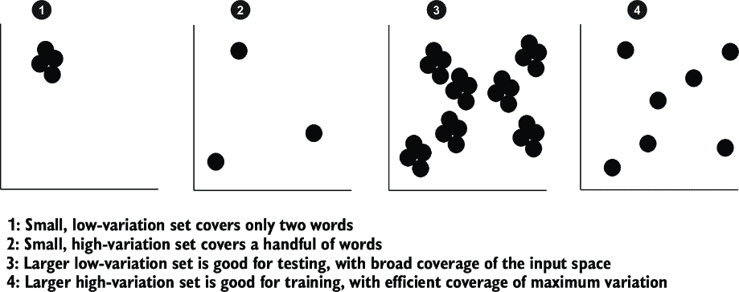
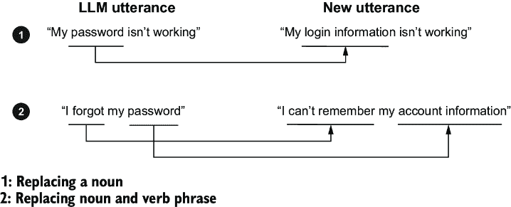

# 7 使用生成式人工智能增强意图数据

### 本章涵盖

+   使用生成式人工智能创建新的训练和测试示例

+   识别你当前对话式人工智能数据中的差距

+   使用 LLMs 在对话式人工智能中构建新的意图

对话式人工智能用户在人工智能无法理解他们时感到沮丧——尤其是如果这种情况发生多次的话！这适用于所有对话式人工智能类型，包括问答机器人、面向流程的机器人和路由代理。我们已经看到了多种提高人工智能理解能力的策略。第一种策略——手动改进意图训练（第五章）——赋予人类构建者完全控制权，但这需要时间和专业技能。第二种策略——检索增强生成（RAG，第六章）——赋予生成式人工智能更多的控制权，随着时间的推移减少人类构建者的角色。本章介绍了一种混合方法，其中生成式人工智能增强构建者。这适用于基于规则或基于生成式人工智能的系统。

将生成式人工智能作为人类构建者的“灵感之源”可以减少人类构建者的努力和时间，增加可用于数据科学活动的测试数据量，并让人类构建者拥有最终决定权，从而消除了大多数幻觉机会（即人工智能说出看似合理但实际上不正确的话）。

假设你正在构建一个对话式人工智能解决方案来帮助你的 IT 帮助台。从访谈中，你知道密码重置是人工智能需要支持的最频繁的任务。因此，人工智能需要对密码重置意图有深入的理解。

由于对话式人工智能解决方案是新的，你没有任何生产用户话语来训练。当你询问服务台用户通常如何开始对话时，你听到“嗯，他们通常会说一些关于‘忘记密码’或‘无法登录’的话。”你很合适地怀疑——当然，用户的词汇量比这要广——但你很难想象这个词汇量可能是什么。生成式人工智能可以帮助你想象。

让我们看看人类构建者和生成式人工智能如何成为合作伙伴。

## 7.1 开始

大型语言模型（LLMs）擅长执行许多技术任务，包括分类和问答。这些任务与对话式人工智能的核心任务相同。那么，我们为什么不直接使用生成式人工智能来完成我们的核心对话式人工智能任务呢？

LLMs 之所以具有可推广性，是因为它们在大量数据上进行了训练。这使得它们在许多任务上学习迅速，但也带来了一些成本。使用 LLM 作为对话式人工智能中的分类器的成本是什么？

+   *货币成本*——LLMs 的运行成本可能很高。

+   *速度*——由于 LLMs 考虑了数十亿个参数，它们可能会更慢（时间成本）。

+   *声誉风险*——LLMs 过于通用，可能会产生使你的机器人看起来很糟糕或让你面临法律风险的输出。

+   *缺乏透明度和可解释性*——大型语言模型（LLMs）通常是一个“黑盒”。

相比之下，对话式 AI 使用专为特定目的设计的科技。因为其分类器仅被训练执行当前任务，所以它成本更低，并且运行速度快，因为它考虑的参数更少。虽然这可能会降低准确性，但系统保证使用一组受控的响应。这些比较总结在表 7.1 中。

##### 表 7.1 比较和对比传统自然语言处理（NLP）在对话式 AI 和生成式 AI 在分类任务上的差异

| 特征 | 传统 NLP | 生成式 AI |
| --- | --- | --- |
| 模型 | 专为仅在一个任务上表现出色而定制：分类 | 适用于许多任务的通用模型 |
| 运行时速度 | 快速 | 慢速 |
| 运行时成本 | 低 | 高 |
| 准确性 | 主要准确（在少量数据上由你训练） | 主要准确（在大量数据上预训练） |
| 可扩展性 | 可管理多达 100 个意图；之后非常困难 | 通过 RAG 模式很好地泛化 |
| 可控性 | 严格受人类控制；需要大量测试 | 当给予完全控制时容易产生幻觉；自动检测幻觉很困难 |

我们可以使用混合方法来获得两种方法的最佳效果。

### 7.1.1 为什么这样做：优点和缺点

一个 LLM 可以大大减少人类构建者所花费的时间和精力。LLM 和人类最佳合作——作为合作伙伴。训练对话式 AI 分类器需要人力，但也需要数据，而这些数据可能很难收集。有时，这些数据只能在对话式 AI 投入生产后才能收集。即使在我们的熟悉例子中检测“忘记密码”问题，我们仍然不知道用户可能表达问题的所有方式。他们可能会使用“错误”的词语！

LLMs 在这些场景中特别有帮助：

+   *自举*—AI 存在“冷启动”问题。当你没有数据时如何训练？LLM 可以生成一组初始的训练数据。

+   *扩展*—当没有足够的数据来优化你的分类器精度时，使用 LLM 来填补现有数据的空白。这对于理解罕见但重要的意图（例如用户报告欺诈）特别有用。

+   *鲁棒测试*—LLMs 可以生成额外的测试数据，增加你对对话式 AI 鲁棒性的信心。（即使生成式 AI 创建答案，如 RAG，这也很有帮助。）

一个 LLM 可以帮助你运行许多实验，其中一些将生成可以直接由你的应用程序使用的输出，无论是作为训练数据还是测试数据。你和 LLM 也可以互相帮助。例如，LLM 可以提供用户可能使用的主题和变体。你可以选择你最喜欢的，并要求 LLM 通过更新提示指令或少量示例来扩展这些内容。

你与 LLM 的互动将是迭代和协作的。例如，你不太可能第一次就设计出正确的提示。LLM 可能无法正确理解任务，或者可能给你提供不太有帮助的内容。在获得理想结果之前，你可能会进行几轮实验。之后，你可以快速生成所有意图的建议，并提高你 AI 对用户理解的能力。

### 7.1.2 你需要什么

许多 LLM 可以帮助我们生成更多用于“忘记密码”意图的训练或测试数据。那么我们是不是只需要挑选一个并放手？并非如此。LLM 会帮助你，但你不应期望它完成所有工作。相反，你应该有一个起点，比如知道你解决方案中的哪些差距。你还需要选择一个适合你用例的 LLM。

使用 LLM 来增强你的对话 AI 的一个明显前提是能够访问 LLM。在选择 LLM 时，还有一些不那么明显的考虑因素：

+   *条款和条件*——一些 LLM 明确禁止你使用它们的 LLM 来“构建或改进另一个模型”。这个条款的目的是防止你构建一个具有竞争力的 LLM，但使用 LLM 来改进对话 AI 可能会被这样解读，而你愿意承担的法律风险可能各不相同。（请咨询你的法律部门——他们可能已经为你的公司选择了可用的 LLM。）

+   *数据隐私*——当你使用 LLM 时，它是否允许在未来保留你的数据并在其上进行训练？你对话 AI 中的数据可能对你公司来说是机密的。如果是这样，你不能随意将其与任何 LLM 共享。

+   *能力*——并非每个 LLM 都具备创意生成任务的能力。确保你选择一个能够遵循指令的模型。

+   *开源或专有*——对于许多用例，可解释性很重要。开源模型通常让你对模型的训练过程有更多的了解，例如模型的训练数据和源代码。专有模型通常不会公开这些信息，但通常使用起来更方便。这也可能影响你的道德和监管合规性。

+   *延迟和响应时间*——存在速度和准确性的权衡；较大的模型可能既更准确又运行得更慢。

在本章和本书的其余部分，我们将使用多个提示和模型来提供示例。这些示例将适用于你选择的模型（或模型）。请随意尝试其他模型，特别是那些在我们撰写本书时不可用的模型。

你还需要将一些领域知识带到 LLM（大型语言模型）中。这可以包括你用户向你的对话 AI 提出的问题的背景，你系统需要支持的目的，以及属于这些目的的表述。尽可能多地带来现实世界的数据。然后使用 LLM 来增强这些数据。

### 7.1.3 如何使用增强数据

一个大型语言模型（LLM）可以帮助你为你的聊天机器人生成额外的数据。在构建时使用 LLM 可以减少幻觉的风险和影响。这些选项包括向你的训练数据添加内容、向你的测试数据添加内容以及修改你现有的数据（例如，改变语法结构和同义词）。

最佳数据来源是来自生产系统真实用户的数据。我们认识到这引入了一个鸡生蛋的问题——如果你还没有投入生产，你可能没有任何数据。你的意图分类器需要用多样化的数据进行训练，以便它能理解多样化的数据。聊天机器人应该用它未训练过的数据进行测试。

当你没有任何训练数据时，你倾向于生成低变异性语句。你会在心中记住几个关键词，并“锚定”于它们。即使有几十个示例，低变异性语句也不传达很多信息。高变异性语句快速覆盖了大量内容，如表 7.2 所示，并且它们通常会使你的分类器更强。

##### 表 7.2 比较低变异性与高变异性语句。高变异性语句增加了分类器的鲁棒性。

| 低变异性语句集 | 高变异性语句集 |
| --- | --- |

| • 我忘记了密码 • 忘记密码

• 忘记密码

• 帮助，我忘记了密码

| • 我无法登录 • 账户被锁定

• 忘记密码

|

尽管数量较少，高变异性语句仍然可以覆盖低变异性语句。单个语句“忘记密码”就足以预测所有四个低变异性语句的意图。反之则不成立，即使我们在低变异性集中添加几十个“忘记密码”的微小变化，情况也不会改变。“我无法登录”没有直接词汇重叠——低变异性集不包含它。

我们更喜欢一个小而高变异性训练数据集，它能覆盖大量低变异性测试语句。与其训练 100 个弱变异性，不如训练 10 个强变异性。这使得聊天机器人对生产中将要看到的多样化语句具有鲁棒性。这也减少了你意外不平衡训练集（导致理解薄弱）的机会。

我们可以在图 7.1 中可视化语句传达的信息。第一个图显示了表 7.2 中的低变异性语句。由于它们只传达两个单词，你可以认为这些语句紧密聚集在一起。第二个图显示了高变异性语句。由于没有词汇重叠，语句散布在整个网格上，但有很多空隙。第三个图显示了理想的测试集，其中网格覆盖范围广泛。第四个图显示了理想的训练集，在少量示例中覆盖最大变异性。测试数据集可以比训练数据集大得多。我们希望测试集具有变异性，但如果我们有近似重复的数据集也行。

在本章中，我们将首先展示如何使用生成式 AI 来创建高变异性的话语。然后，我们将通过许多细微的变化来扩展这些话语。到本章结束时，你将看到如何生成与第三和第四个图表匹配的话语。



##### 图 7.1 从不同种类的话语集中可视化覆盖范围。我们的理想训练数据集是第 4 集，它覆盖了少量话语中的大量变化。第 3 集是理想的测试数据。

##### 练习

1.  想象你正在为一家典型的零售店构建聊天机器人。为`#store_location`意图创建十个话语，当用户询问“你的商店在哪里？”时使用。记录这需要多少时间。

1.  创建十个更多的话语，不使用“where”、“store”、“located”或“location”这些词。（再次计时。）这些话语是否更有变化？

1.  为`#store_hours`意图重复前两个练习。首先使用你想要的任何词语，然后限制自己不要使用“when”、“time”和“hours”。

## 7.2 增强现有意图的强度

我们将开始我们的练习，知道我们需要改进哪个意图：“忘记密码”意图。我们需要足够的训练数据，以便对话式 AI 能够检测到这个意图。记住，我们的支持人员不知道用户可能表达这个问题的所有方式。他们说：“用户通常会提到‘忘记密码’或‘无法登录’。”这不足以训练聊天机器人以稳健的“忘记密码”意图。

我们将使用 LLM 作为我们的合作伙伴。首先，LLM 将帮助我们生成上下文同义词，以便我们看到广泛的词汇。接下来，LLM 将使用这些词汇生成完整的话语。然后，我们将让 LLM 生成不同的语法变体，例如疑问句与陈述句以及过去时与现在时。我们还将让 LLM 将构建一个意图（“忘记密码”）时学到的经验教训应用到构建下一个意图（“寻找商店”）中。

我们将从最简单的步骤开始——寻找同义词。

##### 我可以使用不同的 LLM 吗？

是的！在这本书中，我们将使用多个模型。生成式 AI 领域正在快速发展，本书写作期间使用的模型可能在本书出版或你阅读它的时候被更好的模型所取代。我们将展示的原则比我们将使用的具体模型更重要。

### 7.2.1 用同义词发挥创意

第一步是设计提示。一个好的提示确保你的 LLM 理解其任务，在这个例子中，第一个任务是生成广泛的同义词。提示工程的过程需要实验的迭代过程。

我们的主题专家建议话语中经常包括“忘记密码”。提高你的聊天机器人鲁棒性的方法之一是确保你覆盖了名词短语和动词短语。让我们让一个 LLM 生成一些可能的名词短语同义词。

##### 我该如何设置和运行我的 LLM？

设置 LLM 环境有多种选择。您可以在自己的机器上本地运行 LLM，使用像 Ollama 这样的工具，或者在一个商业托管平台上运行它们。由于我们熟悉它，我们使用了 IBM 的 watsonx.ai 平台上的 Prompt Lab，但本章中没有任何内容是平台依赖的。使用您喜欢的平台。

在这个练习中，我们将使用 falcon-40b-8lang-instruct 模型 ([`huggingface.co/tiiuae/falcon-40b`](https://huggingface.co/tiiuae/falcon-40b)) 并使用贪婪解码。贪婪解码指示模型在每一步生成下一个最可能的词，并且每次都产生相同的输出。

虽然我们希望最终得到完整的句子片段，但通过将任务分解成几个部分，我们得到了更好的结果。用户陈述通常是句子或片段，主要由名词和动词短语组成。让我们从一个简单的提示开始——只是要求同义词——以获取我们的名词。

##### 列表 7.1 基于上下文生成名词的同义词

```py
Generate a list of nouns.  #1
The nouns should be synonyms of 'password'. 

List of 5 nouns  #2
credentials, secret, key, code, accesscode  #3
```

#1 简单指令

#2 对 LLM 的提示性提示

#3 LLM 输出

在前面的列表中，我们将 LLM 作为通用同义词典使用。虽然输出名词是“密码”的同义词，但它们不是在登录上下文中经常使用的同义词。我们需要向 LLM 提供更多上下文以获得更好的结果。

这次让我们告诉 LLM 我们为什么要求同义词以及我们想要哪种同义词。以下列表显示了改进的提示和结果。

##### 列表 7.2 基于上下文生成名词的同义词

```py
You are a consumer contacting an online retailer via their   #1
chat service. 
Generate a numbered list of nouns a consumer might use while  #2
describing their inability to log in to your service in the   #2
phrase "I forgot my password".   #2
The nouns should be synonyms of 'password'.  #2

List of 5 nouns  #3
1\. "account information" 2\. "credentials" 3\. "login information"  #4
4\. "authentication" 5\. "identifier"  #4
```

#1 给 LLM 的背景信息

#2 将任务与忘记密码联系起来的详细说明

#3 LLM 提示

#4 LLM 回复

这些同义词听起来更熟悉。接下来，让我们创建上下文动词同义词。

##### 列表 7.3 基于上下文生成动词的同义词

```py
You are a consumer contacting an online retailer via 
their chat service. 

Generate a numbered list of verbs a consumer might  #1
use while describing their inability to log in to   #1
your service in the phrase "I forgot my password".   #1
The verbs should be synonyms of 'forgot'.  #1

List of 5 verbs  #2
1\. Forgot 2\. Lost 3\. Mislaid 4\. Misplaced 5\. Err  #3
```

#1 更新动词而非名词的指令

#2 更新动词而非名词的提示

#3 LLM 输出

虽然最后一个动词在这个上下文中有点奇怪，但结果还不错。另一个限制是所有生成的动词都是过去时。鉴于我们的例子也是过去时，这是合适的，但我们希望我们的 LLM 为我们生成更多样化的内容。让我们尝试从 *动词* 扩展到 *动词短语*。

##### 列表 7.4 基于上下文生成动词短语的同义词

```py
You are a consumer contacting an online retailer via their chat service. 

Generate a numbered list of verb phrases a consumer   #1
Might use while describing their inability to log in   #1
to your service in the phrase "I forgot my password".   #1
The verb phrases should be synonymous with 'forgot'.  #1
#1
List of 5 verb phrases  #1
1\. I forgot my password.  #2
2\. I lost my password.   #2
3\. I misremembered my password.  #2
4\. I misplaced my password.  #2
5\. I cannot remember my password.  #2
```

#1 更新“动词短语”的指令和提示

#2 LLM 输出

#3 LLM 输出

LLM 给我们提供了完整的句子（哎呀！），但现在我们得到了一些现在时的陈述（“不能记得”）以及其他过去时的陈述。我们在进步！仅仅几分钟的提示，我们就让 LLM 给我们提供了很多值得思考的变体。以前，我们可能认为我们的聊天机器人只需查找“忘记”和“密码”。现在我们有了一打其他有用的词可以考虑，当我们测试机器人时。

让我们再实验一下。这次我们将通过转向*采样解码*和增加温度来提高模型的创造性。我们还将通过要求“10 个同义词”而不是“5 个名词”来修改提示。列表 7.5 显示了名词，列表 7.6 显示了动词短语。

NOTE　使用贪婪解码时，LLM 每次都会生成相同的结果。采样解码生成非确定性输出。如果你尝试这些提示，你可能会得到不同的结果。这是可以的！我们只是在用 LLM 激发我们的创造力。

##### 列表 7.5 使用增加创造性的设置生成名词的同义词

```py
You are a consumer contacting an online retailer via their chat service.

Generate a numbered list of synonyms a consumer might  #1
use for 'password' while they described a problem like   #1
"I forgot my password".  #1
#1
List of 10 synonyms for 'password'  #1
1\. "Secret" 2\. "Personal Identification Number" 3\. "PIN" #2
4\. "Access Code" 5\. "Log-in Information" 6\. "Log-in Data"  #2
7\. "Account Information" 8\. "Account Data"   #2
9\. "Identification Number" 10\. "Security Code"  #2
```

#1 更新后的提示和引导

#2 LLM 输出

太棒了！这是一个很棒的名词列表。您的系统可能不会使用所有这些，但这是一个全面的测试列表。

让我们接下来尝试动词。

##### 列表 7.6 使用增加创造性的设置生成动词短语的同义词

```py
You are a consumer contacting an online retailer via their chat service.

Generate a numbered list of synonyms a consumer might  #1
use for 'forgot' while they described a problem like   #1
"I forgot my password". #1
#1
List of 10 synonyms for 'forgot'  #1
1\. Forgot 2\. Did not remember 3\. Didn’t know 4\. Unknown  #2
5\. Not applicable 6\. Unable to access 7\. Couldn’t recall  #2
8\. Didn’t memorise 9\. OMG Failed to remember  #2
10\. Unable to login  #2
```

#1 更新后的指令和引导

#2 LLM 输出

这是一个更具创造性的同义词列表。虽然这个列表中有些奇怪之处（“未知”，“不适用”），但也有一些不错的创意火花：

+   *稍微错误的动词*——“没有记住”很奇怪，但它让你想到“不能记住”。

+   *错误的时态*——“不知道”让你考虑“不知道”。

+   *情感*——“OMG”让你意识到表达可能包括挫败感。

我们仅用几分钟的努力就生成了与我们的领域相关的同义词，但我们仍然只有部分内容。我们从一个表达“我忘记了我的密码”开始，现在可以插入新的名词和动词短语，但我们仍然被困在简单的主语-谓语-宾语结构中。我们的用户肯定会使用更多样化的语法。我们不希望聊天机器人只依赖于一种语法形式。我们希望它能够对更多样化的表达有弹性。让我们使用 LLM 来生成更多的语法变化。

### 7.2.2 生成新的语法变化

而不是要求 LLM 生成单词或单词对，让我们尝试让它生成完整的表达。我们需要设计一个提示来引入单词变化，但我们不想让模型过于偏向“我忘记了我的密码”。我们将使用一个类似的提示来设定上下文，但不是直接包含短语“我忘记了我的密码”，而是描述用户的问题（他们无法登录）。

我们第一次尝试的示例如下所示。

##### 列表 7.7 生成完整的表达

```py
You are a consumer contacting an online retailer via their chat service. 

Generate a numbered list of example utterances a   #1
consumer might start conversation with if they couldn't   #1
log in.  Use a variety of nouns and verbs related to    #1
logging in, passwords, and accounts.  #1
#1
List of 10 utterances  #1
1\. I can't log in          #2
2\. My password isn't working  #2
3\. I don't know my password  #2
4\. I forgot my username  #2
5\. I forgot my password  #2
6\. My account is locked  #2
7\. I didn't get my password reset email # #2
8\. I need help with my account  #2
9\. Can you help me log in?  #2
10\. I tried resetting my password but it didn't work  #2
```

#1 更新后的指令和引导

#2 LLM 输出

我们开始获得更多样化了。这个表达列表有几个我们还没有看到的想法（比如“密码重置电子邮件”）。更好的是，我们在句子结构上得到了更多的变化。输出列表有以下语法变化：

+   *主语-谓语-宾语陈述（主动语态）*——我忘记了我的密码。

+   *被动语态陈述*——我的账户被锁定。

+   *介词短语*——我需要帮助我的账户。

+   *问题*——你能帮我登录吗？

+   *限定词*——我尝试重置密码但不起作用。

我们样本话语的多样性正在提高。生成的话语可用于我们的训练或测试集，但仍存在差距。例如，所有这些话语都是完美的句子。那么，对于那些如此忙碌（或沮丧）以至于只给我们几个词的用户呢？LLM 能生成有用的句子片段吗？以下列表探讨了这一想法。

##### 列表 7.8 生成句子片段话语

```py
You are a consumer contacting an online retailer via their chat service. 

Generate a numbered list of example fragments a  #1
Consumer might start conversation with if they  #1
couldn't log in.  Use a variety of nouns and verbs  #1
related to logging in, passwords, and accounts. Use  #1
sentence fragments only.  #1
#1
List of 10 sentence fragments   #1
1\.  Forgot password  #2
2\.  Unable to login  #3
3\.  Account locked out  #3
4\.  Need help resetting password  #3
5\.  Can't remember email address  #3
6\.  Email is not working  #3
7\.  Unable to change password  #3
8\.  Unable to access account #3
9\.  Unable to create new account  #3
10\. Unable to delete old account  #3
```

#1 更新指令以生成片段。提示不变。

#2 在提示下方的一个单样本示例

#3 LLM 输出

在我们之前的提示中，我们无法生成句子片段。这次，我们给了 LLM 额外的帮助。除了我们对提示的常规更新（将“话语”替换为“片段”）之外，我们还给了 LLM 一个额外的提示。我们提供了第一个示例片段“忘记密码。”这被称为单样本学习，因为我们给了 LLM 我们想要的例子，这有助于 LLM 学习如何处理我们的请求。

##### 零样本？单样本？少样本？

“零样本”、“单样本”和“少样本”这些术语指的是提示中给出的示例数量（样本）。零样本提示不提供任何示例。单样本提示提供一个示例，而少样本提示提供几个示例。

对于训练数据生成，单样本学习是一种获取所需输出的绝佳方式。每当你在让 LLM 遵循你的指令时遇到困难，考虑提供一个好的例子，而不仅仅是微调指令。在撰写本章时，我们尝试了比书中包含的更多的提示，直到我们使用单样本学习，我们都没有得到句子片段。

此外，你可以使用单样本学习将构建一个意图时学到的经验应用到另一个意图上。在下一个列表中，我们使用“商店位置”意图的示例来生成“密码重置”意图的示例。

##### 列表 7.9 使用单样本学习生成多种语法结构的示例

```py
You are a consumer contacting an online retailer via  #1
their chat service. #1

Generate phrases a user might use to find out where #2
stores are located. Create phrases for each of the  #2
following grammatical types. #2
Direct Question: Where are you located?  #2
Indirect Question: Can you tell me how to find your  #2
stores?  #2
Fragment: Store location  #2
Command: Give me driving directions  #2

Generate phrases a user might use when they need to  #3
reset their password. #3
Create phrases for each of the following grammatical #3
types. #3
Direct Question:  I forgot my password.  #4
Indirect Question:  How can I reset my password?  #4
Fragment:  Password reset #4
Command:  Send me a password reset link  #4
```

#1 LLM 的标准背景，与过去几个示例保持不变

#2 单样本示例包括指令和期望的输出

#3 对 LLM 的指令，补充了提示“直接问题：”

#4 LLM 输出（在提示“直接问题：”之后开始）

通过一个提示，我们能够得到我们想要的每种语法结构的示例（LLM 在“直接问题”上犯了一个错误，但输出仍然有用）。

这是一种生成话语的额外技巧。而不是使用详细的指令，提供几个示例，并要求 LLM 生成更多。我们将使用不同的提示格式和不同的模型——granite-13b-instruct-v2 ([`mng.bz/DMlR`](https://mng.bz/DMlR))——我们将使用采样解码以增加创造性和非确定性结果。以下列表显示了提示和第一个输出。

##### 列表 7.10 使用创意提示生成 Granite 模型的示例

```py
<|instruction|>  #1
Here are actual utterances submitted by customers to an  #2
automated help desk. Your task is to create new   #2
examples from people having problems with their   #2
password and login ability.  #2

<|example|>  #3
I can't log in

<|example|>
My login information isn't working

<|example|>
Forgot password

<|example|>
Help me get into my account

<|example|>  #4
Hi there, I can't seem to login to my account  #5
```

#1 指示模型指令的标记

#2 实际指令

#3 示例的开始

#4 输出提示

#5 LLM 输出

由于我们使用的是非确定性设置，模型输出每次都不同。以下是下一个五个执行相同提示的输出：

+   “你能帮我恢复我的密码吗”

+   “我被锁在我的账户外面”

+   “我记不起用户名或密码”

+   “希望你能帮我，我刚刚重置了我的密码但不起作用”

+   “我已经连续 5 次登录失败”

我们没有指定我们想要的精确变化，但我们仍然得到了一些有趣的变化。我们看到了新的动词（“恢复”）和概念（“连续 5 次”）。这突出了实验不同 LLM、不同提示和不同参数设置的价值。生成训练数据需要创造力。不要依赖一个或两个实验来完成工作——你可以和生成式 AI 一起创造性地工作。

### 7.2.3 从 LLM 输出构建强大的意图

让我们回顾一下迄今为止的实验。我们已生成作为上下文同义词的名词和动词（而不仅仅是通用同义词）。我们已生成具有相似结构的整个话语，然后使用 LLM 生成具有不同语法结构的话语。我们使用了多个模型、提示和参数设置。生成式 AI 是一个伟大的合作伙伴！

从这些实验中，我们有很多可能性来构建一个训练集。让我们选择 10 个话语，涵盖我们之前生成的变化。对于一些话语，我们将使用 LLM 的逐字输出。对于其他话语，我们将替换一些变化。例如，生成的话语中“密码”很多——我们可以用“登录信息”或“账户信息”来替换。话语中也很多“忘记”，所以我们将用“记不起”来替换。以下列表显示了话语的一个可能选择。

##### 列表 7.11 基于 LLM 建议的十个精选话语

```py
1\. I can't log in
2\. My login information isn't working
3\. Forgot password
4\. Account locked out
5\. I can't remember my account information
6\. My account is locked
7\. I didn't get my password reset email
8\. Need help with resetting account
9\. Can you help me log in?
10\. I tried to reset my password but it didn't work
```

自从最初建议“大多数请求包括‘忘记’和‘密码’”以来，我们已经走了很长的路！如果我们将这些话语用于我们的训练集，我们将比坚持基于关键词的建议有更稳健的聊天机器人理解。

我们在多个提示会话中成功生成想法。这引发了一个问题，我们能否在一个提示中完成所有操作？我们预计需要我们迄今为止的所有技巧：为 LLM 提供上下文，一个清晰的指令，以及一个一次性示例。让我们尝试使用“忘记密码”意图的最佳示例来训练一个“商店定位器”意图。以下列表展示了使用 falcon-40b-8lang-instruct 模型和贪婪解码再次进行此操作。

##### 列表 7.12 使用一次性学习将一个意图的教训复制到另一个意图

```py
You are a consumer contacting an online retailer via   #1
their chat service.  #1

Generate a numbered list of example utterances a   #2
consumer might start conversation with if they couldn't  #2
log in. Use a variety of nouns and verbs related to   #2
logging in, passwords, and accounts. Use a variety of  #2
grammar structures in the utterances.  #2
#2
List of 10 utterances  #2
1\. I can't log in  #3
2\. My login information isn't working  #3
3\. Forgot password  #3
4\. Account locked out  #3
5\. I can’t remember my account information  #3
6\. My account is locked  #3
7\. I didn't get my password reset email  #3
8\. Need help with resetting account  #3
9\. Can you help me log in?  #3
10\. I tried to reset my password but it didn't work  #3

Generate a numbered list of example utterances a  #4
consumer might start conversation with if they need to   #4
find your store. Use a variety of nouns and verbs  #4
related to finding, location, and directions. Use a   #4
variety of grammar structures in the utterances.  #4
#4
List of 10 utterances  #4
1\. Where is your store located?  #5
2\. How do I find your store?  #5
3\. What direction is your store from here?  #5
4\. Which exit should I take to get to your store?  #5
5\. Is your store north or south of here?  #5
6\. Your store is on what street?  #5
7\. Where is your store exactly?  #5
8\. How far is your store from here?  #5
9\. How long will it take me to get to your store?  #5
10\. What city is your store in?  #5
```

#1 LLM 的标准背景

#2 一次性示例（密码重置）的指令和提示

#3 一次性示例

#4 目标（商店定位器）的指令和提示

#5 LLM 输出

#6 LLM 输出

还不错！这是我们新意图的合理起点。这个输出有几个积极方面：

+   *动词多样性*——除了“是”之外，没有重复的动词。

+   *概念多样性*——通过“位置”和“方向”，示例涵盖了绝对和相对概念。它们还涵盖了时间和空间（“多长时间”，“多远”）。

+   *粒度多样性*——表述范围从“哪个城市”到“哪个街道”以及“从这里”。

然而，这些表述也有一些局限性：

+   *语法结构*——这些表述都是问题。没有命令或片段。

+   *名词多样性*——每个例子都使用“store”。

+   *明显遗漏*——没有 GPS 我就迷失了。令人惊讶的是，表述没有明确包含像“你的地址是什么”或“驾驶方向”这样的内容。

这个任务太难，无法在单个提示中完成。我们向 LLM 提出了我们想要的所有内容，甚至给出了例子。LLM 能够完成我们许多请求，但也忽略了或未能完成我们的一些请求。事情并不像完美地完成一个意图然后让 LLM 复制到所有其他意图那样简单。我们的任务中有太多的指令和变量，对于当前的 LLM 来说，在一次尝试中就完全正确是非常困难的。这可能会在未来改变。

这就是为什么我们建议将 LLM 用作合作伙伴，而不是自己或完全使用 LLM 来做所有事情。您不能将您的思考外包给 LLM，但您*可以*让 LLM 非常快速地为您运行实验。生成同义词和语法多样性听起来很简单，但您可能无法像 LLM 那样快速和完整地完成。让 LLM 生成很多想法，然后挑选最好的。

REMEMBER  LLM 无法为您思考，但它可以为您提供一个非常好的“初稿”。

表 7.3 总结了使用 LLM 生成训练和测试数据的“做”和“不要”。

##### 表 7.3 使用 LLM 生成训练和测试数据的“做”和“不要”

| 做 | 不要 |
| --- | --- |

| • 将 LLM 用作合作伙伴或创意助手。您仍然驱动这个过程。 • 设置上下文指导和专注的指令 |

• 使用示例和单次学习来引导 LLM

• 尝试使用多个提示

• 使用 LLM 输出增强从用户收集的数据

| • 不审查或精炼 LLM 输出就接受它 • 期望 LLM 知道您想要什么 |

• 在单个提示中执行太多任务

• 将机密数据输入到保留的 LLM 平台，该平台“为了未来的训练目的”保留您的数据

• 假设 LLM 输出完全代表了用户数据

|

当你有一个明确的问题但没有代表性的用户表述时，LLM 非常适合生成表述训练数据。虽然我们总是更喜欢使用来自生产系统的实际用户表述，但我们并不总是享有这种奢侈。LLM 生成的数据帮助我们填补了空白。它们庞大的训练集可能包含一些来自你领域（如客户服务）的数据，但可能不包括你所有的需求。它们看到了很多“密码重置”的表述，但可能没有包含你应用程序的名称。在无训练数据、从主题专家那里编造的训练数据和 LLM 生成的训练数据之间进行选择时，LLM 生成的选项是最好的选择。

### 7.2.4 使用模板创建更多示例

在上一节中，我们通过结合 LLM 的多个不同输出并使用它们来生成新的表述，从而生成了一系列多样化的表述。图 7.2 展示了从列表 7.7 中突变完整表述（使用列表 7.1 到 7.6 中看到的同义词）的示例。



##### 图 7.2 从初始 LLM 输出生成额外的示例。LLM 生成了“我的密码不起作用”，但我们现在知道相关的表述是“我的登录信息不起作用”。

TIP  创建模板中的示例是一项程序性任务，而不是特定于生成式 AI 的任务。混合和匹配多种风格可以产生最佳结果。

使用模板在 LLM 输出仅包含一个动词或名词时特别有帮助。我们能够通过手动更改引入我们的表述集合的多样性，但我们可以通过将 LLM 输出视为模板来将这种做法推向极致。从基本的表述“我忘记了密码”开始，我们随后探索了“忘记”和“密码”的上下文同义词。图 7.3 将这个表述转换成了“我<动词短语>我的<名词短语>”的模板，这可以生成更多的表述。


##### 图 7.3 将“我忘记了密码”转换成允许我们在上下文中替换动词和名词的模板。这个模板的一个选项是“我丢失了我的凭证”。

这个模板由于有六个动词选择和六个名词选择（6×6=36），总共生成了 36 个表述。这是一大批数据，但它非常不平衡——它全部使用了完全相同的语法结构。更糟糕的是，一些表述可能永远不会被用户说出。这种方法不适合生成训练数据，因为它过分强调了单一模式。这些模板化的表述将隐藏其他更多样化的表述的影响，如“你能帮我登录吗？”“我尝试重置密码，但不起作用”，以及“账户被锁定”。

如果你认识到不平衡，模板语句对你的测试集是有用的。测试你的对话 AI 的所有 36 个语句作为理智测试并没有什么不妥。只是不要限制自己只测试一个模板并假设意图已经很好地训练过。

模板方法可以用来生成测试数据，这有助于确保聊天机器人能够在面对无关信息的情况下区分两个意图。除了我们的“忘记密码”模板外，假设我们还有一个“商店位置”模板，它使用动词“需要”、“忘记”和“想要”，以及名词“地址”、“位置”和“驾驶方向”。商店位置模板类似于图 7.3，但它使用“I <verb phrase> your <noun phrase>。”我们还将假设一些用户会问候机器人（“Hi”，“hello”，“good day”）或泛地问询帮助（“can you help”，“please assist”）。这些泛化的添加并没有向用户语句中添加任何区分信息。它们会以某种方式影响聊天机器人吗？图 7.4 展示了我们如何设置测试。


##### 图 7.4 使用常见模板来查看问候语和结束语是否会影响聊天机器人的理解。一个可能的语句是“Hello I lost my credentials please assist。”

每个意图中都有三个动词变化和三个名词变化，为每个意图提供了九种可能性（3 × 3 = 9）。不考虑问候语，我们可能已经进行了 18 次测试（每个意图 9 次）。在这个测试中，我们增加了三种问候语变化和两种结束语变化，使我们能够将测试规模扩大六倍。108（18 × 6 = 108）个语句将包括“Hi！我忘记了我的密码。你能帮忙吗？”和“Good day。我需要你的地址。请协助。”以及 106 种更多变化。这些都可以包含在测试集中。

> 理论上，理论与实践之间没有区别——在实践中，有区别。Yogi Berra

我们不期望添加问候语和结束语变化会影响分类，但我们可以验证这一点。如果你的训练数据严重不平衡，聊天机器人可能会受到这些额外单词的影响。因此，运行这类测试可以作为另一种理智测试，除了第五章中展示的方法。

##### 练习

1.  使用生成式 AI 为“商店位置”意图创建示例。你能生成多少个名词、动词和语法结构？跟踪你在这项练习上花费的时间：

    +   使用仅包含指令的提示。这是一个零次示例的提示。

    +   使用包含示例的提示。这是一个单次或少量示例的提示。

    +   模型在更短的时间内生成更多样化的语句，比您手动创建语句时要多吗？

1.  为你正在构建的聊天机器人中不太理解的意图重复之前的练习（或使用）。如果可能，通过这些新的语句之一增加机器人的训练或测试数据集，并测量准确性的变化。

## 7.3 更加创新

第五章展示了评估和改进你的训练和测试数据的坚实基础数据科学原则。这些原则为你提供了指标，这些指标证明了你的聊天机器人理解并量化了你试图改进的效果。这些稳健的原则需要时间来实施。本节将展示在深入研究统计方法之前，如何使用 LLM 的几种创意方法。这些基于 LLM 的技术并不取代统计方法，但它们可以给你一个快速直观的认识。

### 7.3.1 思考更多意图

LLM 可以帮助你思考系统可能需要处理的新意图。虽然我们更喜欢从现实世界的数据开始工作，例如支持票务的积压，但一点头脑风暴并不会有害。如果你正在启动全新的支持流程，你可能没有任何数据可以工作，需要启动。以下列表演示了一个意图头脑风暴过程。

##### 列表 7.13 思考新意图

```py
You are a consumer contacting an online retailer via   #1
their chat service.  #1

Generate a numbered list of example problems you might  #2
have causing you to contact the retailer's chatbot.  #2
#2
List of 5 problems:  #2
1\. I want to buy something but I can't find it on your website  #3
2\. The price has changed  #3
3\. My order hasn't arrived  #3
4\. I need help with my account  #3
5\. I want to return something  #3
```

#1 LLM 的标准背景——仍然没有改变

#2 指令和提示

#3 LLM 输出

这看起来是一个很好的开始。我们有产品搜索、价格争议、订单跟踪、登录问题和退货。这些似乎都值得扩展到你的对话 AI 中的意图和流程中。

### 7.3.2 检查混淆

我们还可以看看 LLM 是否同意我们创建的意图。我们可以选择我们已选的训练语句，并要求 LLM 将它们分类到意图中。让我们看看如果我们从“忘记密码”意图中移除意图名称会发生什么。

##### 列表 7.14 LLM 预测的意图（“忘记密码”）与我们的一致吗？

```py
Given a list of utterances, predict the intent   #1
classification they belong to. #1

List of utterances  #2
1\. I can't log in  #2
2\. My login information isn't working  #2
3\. Forgot password #2
4\. Account locked out  #2
5\. I can’t remember my account information  #2
6\. My account is locked  #2
7\. I didn't get my password reset email  #2
8\. Need help with resetting account  #2
9\. Can you help me log in?  #2
10\. I tried to reset my password but it didn't work  #2

Intent Classification:  #3
- "I can't log in" -> "Login" #4
- "My login information isn't working" -> "Login" #4
- "Forgot password" -> "Password Reset"  #4
- "Account locked out" -> "Login" #4
- "I can’t remember my account information" ->  #4
 "Login" #4
- "My account is locked" -> "Login"  #4
- "I didn't get my password reset email" ->  #4
"Password Reset"  #4
- "Need help with resetting account" -> "Password Reset"  #4
- "Can you help me log in?" -> "Login"  #4
- "I tried to reset my password but it didn't work" ->  #4
 "Password Reset"  #4
```

#1 对 LLM 的指令

#2 指令所属的输入

#3 提示

#4 LLM 输出

LLM 建议了两个意图，而我们只使用了其中一个。意图“登录”和“密码重置”与我们的原始“忘记密码”标签一致。LLM 推导出的意图感觉过于狭窄，尤其是由于这两个意图很可能有相同的答案。

##### LLM 输出格式并不总是一致的

在列表 7.14 中，LLM“发明”了一个带有连字符列表条目和从话语到意图的箭头的输出模式。由于我们只是从视觉上审查结果，这可以接受，但给 LLM 的额外指令可能有所帮助（例如，“以项目符号列表形式回答”）。我们还可以用一个一次性示例来展示我们想要的格式。

这个测试不如第五章中展示的其他技术稳健，但它可以用作对训练数据的快速合理性测试。如果 LLM 在你的训练数据中找不到任何连贯性，你可能存在问题。

LLM 和人类构建者可以很好地协同工作。图 7.5 总结了 LLM 可以帮助你改变你的对话 AI 以改善其理解用户能力的方式。


##### 图 7.5 LLM 以多种方式增强人类构建者。

##### 练习

1.  以您正在构建或使用的聊天机器人为例。描述其目的。使用该描述和创意 LLM 提示生成机器人将解决的示例问题。使用采样解码，多次运行提示以获得多个想法。这些想法与机器人处理的意图或流程一致吗？

1.  以您正在构建的聊天机器人为例。从测试数据中提取一个子集的语句。要求 LLM 预测它们所属的意图或流程。LLM 的预测与您的机器人实现方式一致吗？

## 摘要

+   LLMs 是出色的合作伙伴，它们增强了人类构建者。人类和 LLMs 在一起会更好。

+   尝试不同的模型、提示和参数以从 LLMs 中获得最佳输出。持续迭代！不要期望你的第一次尝试就完美无缺。

+   不要只是向 LLM 下达指令。通过一次性或少量提示提供示例。

+   当您在数据中识别到差距时，您可以要求 LLM 帮助您填补。

+   LLM 的输出可以直接用于您的训练数据，或者您可以先手动对其进行精炼。

+   使用贪婪解码以每次获得相同的输出。使用采样解码以获得具有额外创造性的随机响应。
