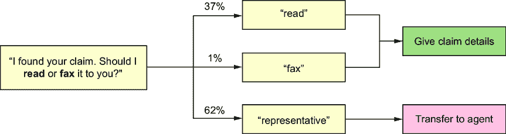
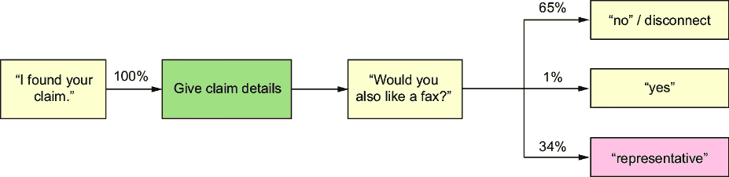
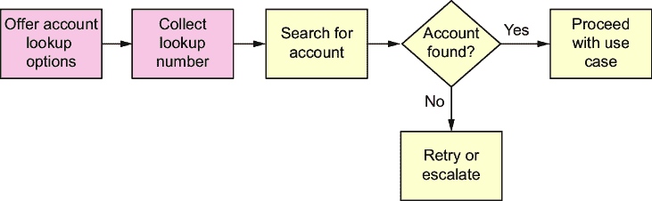
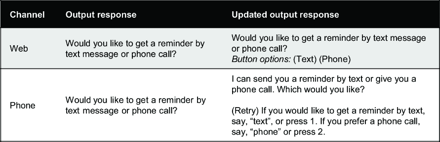

# 8 简化复杂流程

### 本章涵盖

+   复杂性对最终用户的影响

+   复杂性对业务和支持团队的影响

+   如何权衡对话感觉与复杂实现

+   如何简化用户的旅程

不必要的复杂性对聊天机器人用户和构建者来说都是痛苦的，它往往会导致不良的商业结果或部署时间表的延误。构建一个感觉简单自然的对话需要深思熟虑的设计和对用户情况的同理心。作为这些解决方案的设计师和构建者，我们的目标是创造一种体验，帮助用户以最少的麻烦或困难达到他们的目标。为什么我们应该如此迁就？因为我们需要用户采用或接受解决方案，以证明维护技术的成本是合理的。

用户会将“自然”的对话体验与“简单”或“易于使用”联系起来。易于使用的界面往往会导致最成功的成果。相反，没有充分考虑用户视角的体验往往感觉令人困惑、不自然，可能过于复杂。这可能导致用户升级问题、放弃对话或无法达到最佳结果。

在本章中，我们将从用户和业务的角度讨论复杂性。有时在为用户降低复杂性时，不可避免地会涉及一些权衡。我们将讨论在尝试解决用户痛点时可能遇到的权衡，以及如何优先考虑或实施次优替代方案。

## 8.1 复杂性的痛苦

复杂性是一把双刃剑：它可以为以任务为导向的对话增加摩擦或失败点，但没有它，我们通常无法完成更有用的交易。简单的 FAQ 风格机器人很少复杂，但它们在有用性方面可能有限。需要完成任务的用户通常需要一个能够做更多事情（或代表他们）的机器人——而不仅仅是告诉他们如何做某事。以一个需要知道他们支票账户余额的用户为例。一个 FAQ 机器人可能只是告诉用户如何检查账户余额，但用户的目的是尚未满足。一个自助服务机器人会提供用户的实际账户余额，这确实满足了他们的目标。

当然，这两种解决方案之间的复杂性差异非常明显。一个 FAQ 机器人只需要识别用户的目标并生成相关答案。一个以流程为导向的机器人通常需要与外部后端系统集成。它可能需要验证用户的身份，并能够从一个或多个来源访问受保护的信息。

如您所见，在提供能够完成虚拟助手提供的更有用任务的解决方案时，往往存在固有的复杂性。虚拟代理必须服务于两个主人：最终用户和创建并维护解决方案的企业或组织。决定谁将承担或影响复杂性的负担是一个平衡行为。

### 8.1.1 复杂性对最终用户的影响

复杂的交易性对话可能会让用户感到令人生畏或困惑。设计不佳的流程会给用户体验带来相应的摩擦。不必要的复杂性的一个主要缺点是它引入了额外的潜在失败点。对话中的失败要么阻止用户继续前进，要么使他们不得不重试。结果，用户通常会要求与客服代表交谈或简单地放弃聊天。

我们在与一家保险公司合作时看到了不必要的复杂性的影响。他们为医疗服务提供者提供了一个语音解决方案。提供者可以通过电话获取提交的索赔的状态和付款详情，但索赔搜索流程的成功率只有 40%。该流程在搜索索赔之前需要用户提供五条信息。图 8.1 展示了索赔搜索的步骤。


##### 图 8.1 交付索赔状态的流程涉及七个步骤。在解决方案执行搜索和（如果搜索成功）交付索赔状态之前，呼叫者必须提供五条信息。

对于用户来说，查找过程有点令人疲惫，需要在多个步骤中输入多个长串的数字。以下列表展示了从用户角度的体验。

##### 列表 8.1 索赔搜索流程，其中呼叫者必须提供五条信息

```py
CALLER: I want to check the status of a claim.
VIRTUAL ASSISTANT: I can help you check the status of a claim. First, please tell me your provider ID.
CALLER: <gives provider number> 
VIRTUAL ASSISTANT: Thank you. Next, please give me the Member ID.
CALLER: <gives member number> 
VIRTUAL ASSISTANT: Got it. And what is the claim date?
CALLER: <gives claim date> 
VIRTUAL ASSISTANT: Now, please tell me the claim number.
CALLER: <gives claim number> 
VIRTUAL ASSISTANT: One moment, while I look up the claim.
VIRTUAL ASSISTANT: I found your claim.
```

我们寻找减少该流程复杂性的方法。我们的研究显示，大多数呼叫者对于任何特定的成员和日期组合只有一条索赔。换句话说，仅基于该信息进行搜索通常会产生单一结果。这意味着对于大多数用户来说，收集索赔编号是不必要的。

图 8.2 显示了更新的索赔搜索流程，它收集执行索赔搜索所需的最少信息。如果只找到一条索赔，则立即交付索赔状态。如果逻辑检测到多条索赔，机器人将收集用户提供的索赔编号来消除歧义。


##### 图 8.2 更新后的索赔状态交付流程，对于大多数呼叫者来说，只需要四条信息。只有在必要时才会要求呼叫者提供第五条信息。

通过消除只有一条索赔的账户的索赔编号收集步骤，我们使用户体验变得更简单。这反过来又提高了任务完成率，并将索赔编号搜索失败的发生率减半。以下列表展示了改进后的体验。

##### 列表 8.2 在改进的体验中，大多数呼叫者只需要四条信息

```py
CALLER: I want to check the status of a claim.
VIRTUAL ASSISTANT: I can help you check the status of a claim. First, please tell me your provider ID.
CALLER: <gives provider number> 
VIRTUAL ASSISTANT: Thank you. Next, please give me the Member ID.
CALLER: <gives member number> 
VIRTUAL ASSISTANT: Got it. And what is the claim date?
CALLER: <gives claim date> 
VIRTUAL ASSISTANT: I found your claim.
```

### 8.1.2 复杂性对业务指标的影响

过度复杂的使用体验可以从多个维度损害你的业务指标：用户退出率可能会增加，升级到支持人员可能会增加，自助任务完成率可能会减少，NPS 或用户调查分数可能会下降。

在我们的保险公司，一个业务影响的例子是在成功查找索赔之后，出现了一个无法解释的、不成比例的退出（请求代理）数量。在呼叫者导航搜索过程（涉及回答三四个问题）后，他们被问到最后一个问题：他们是否希望读取索赔信息或传真给他们？图 8.3 显示了用户对这一问题的回答分解。



##### 图 8.3 呼叫者几乎三分之二的时间请求代表。最合理的选项——让信息读给呼叫者听（即，通过他们目前正在使用的同一渠道传递）——是第二受欢迎的选择。只有 1%的用户选择了接收他们所需信息的传真选项。

在这个流程的这个阶段，解决方案已经成功识别了用户并检索了他们所需的信息。不幸的是，用户正在退出，不知道他们已经*如此接近*成功完成他们的目标。这对业务来说显然是一个问题，因为失去控制意味着人工代理正在处理本应由虚拟助手（实际上，几乎已经成功完成）成功完成的任务。以下列表显示了改进前的用户体验。

##### 列表 8.3 即使索赔搜索成功，呼叫者也会请求代理

```py
VIRTUAL ASSISTANT: I found your claim. Would you like to have this information read to you or faxed?
CALLER: Speak to a representative.
```

在这个节点提供两个选项的原始设计选择在理论上可能看起来合理（主题专家说，“我们经常接到传真的请求”），但证据表明，呼叫者对复杂性的容忍度已经超过了。一个假设是，问题本身错误地发出了复杂情况的信号；否则，为什么机器人不直接读取信息呢？也可能是因为用户在回答了这么多问题而没有得到任何有价值的东西后感到沮丧。

在这个例子中，业务在多个维度上受到影响：退出率增加，升级增加，而自助任务完成率相应减少。合理的解决方案是移除这个问题，简单地读取索赔详情。提供传真选项的提议被移到了流程的后面——在提供索赔详情之后。图 8.4 显示了更新的体验和可能的后果。



##### 图 8.4 更新的体验立即读取索赔详情，然后为需要传真的小部分用户提供传真选项。

消除一个对话回合可以保证所有提供所需索赔查找凭证的呼叫者都成功完成了任务流程，如列表 8.4 所示。一旦提供详细信息，呼叫者可以简单地挂断电话，如果他们已经得到了他们需要的一切，从而实现通话的完全控制。呼叫者还可以选择接收传真，在这种情况下，将调用一个流程来完成该任务。一些用户可能仍然要求代理，但此时要求代理的原因可能与在阅读索赔详情之前要求代理的原因不同。（在这种情况下，可能需要解决一个新的痛点。）

##### 列表 8.4 如果搜索成功，则立即提供索赔详情

```py
VIRTUAL ASSISTANT: I found your claim, number 10012345\. This claim was  approved and a payment for $100 was issued on October 3rd. Would you also like to receive a fax with this information?
CALLER: (may reply yes, no, ask for agent, or hang up)
```

当你设计你的机器人——或者努力改进现有的机器人——请记住，简单的交互（从用户的角度来看）可以更容易地达到成功的结果。成功的定义将根据用例和业务目标而有所不同。然而，通过适当的规划，可以跟踪解决方案的业务指标到构建或改进解决方案所使用的策略。良好的指标将为理解对话设计的成功率、有用性和弱点提供指导。

### 8.1.3 简化用户复杂性的增量成本和收益

简化用户复杂性有时会增加对话设计的复杂性。交易性对话——即与用户进行多次互动以达成目标的对话——有多个失败点，并且每个支持的功能或能力都会增加复杂性。为了减轻用户复杂性的痛苦，对话必须设计得尽可能自然和周到。换句话说，你的流程越复杂，你就应该投入更多努力来简化用户界面，以确保最佳的成功机会。

一些简化用户复杂性的策略简单且易于实施，同时又能带来高价值。其他策略，尤其是那些需要与后端系统集成的方法，在实施上更为技术复杂且/或成本高昂。每个企业和用例都必须评估在对话体验中添加如自然语言理解、个性化、自动化等强大功能时，所获得的价值与成本及其他权衡。

当然，良好的指标——本书的一个常见主题——对于良好的规划和优先级排序至关重要。是否值得为机器人可能遇到的所有可能性进行设计？当然不是！但你可以做一些事情来优化大多数用户和场景的体验。80/20 规则是决定在哪里投资改进或扩展机器人功能的好起点。如果 80%的用户将受益，那么实施它可能是有价值的。

对于用户来说，复杂性可能成为成功的障碍。设计一个有效、简化的对话交流需要彻底了解用户，包括他们是谁，是什么原因让他们来到你的虚拟助手，以及他们期望从这次体验中获得什么。用户研究应该指导你的设计。可能并不总是可行或成本效益高来实现所有的适应。然而，值得追求的是在用户所在的位置与他们相遇，并在可能的情况下消除阻碍他们成功的障碍。

##### 练习

审查你构建或遇到的机器人流程：

1.  列出所有步骤。

1.  确定用户完成最困难的步骤。

1.  确定是否有机会重新排序或删除步骤，以使用户的过程更容易。

## 8.2 简化和优化用户旅程

可以使用多种策略和技术来设计自然、简化的对话体验。在本节中，我们将讨论优化用户旅程的方法。

### 8.2.1 发现复杂的对话流程

在复杂的流程中，每个回合或用户响应都可能将用户引向特定的路径。理想情况下，这条路径应该是达到最终目标的最高效路线。如果用户的旅程过于复杂或不高效，就有改进的空间。

你如何知道你的解决方案是否过于复杂或不高效？我们观察到了几个不必要的增加对话复杂性的对话设计反模式：

+   请求用户提供他们不太可能拥有或需要时间检索的信息

+   对用户响应的严格、僵化的输入要求

+   提出含糊不清的问题——导致对如何提供“正确”的响应的不确定性

+   以相同的方式对待所有用户和场景，特别是如果这导致提出在所有情况下可能不必要的提问

+   选择过载和不符合用户对如何实现目标的心理模型的选择

+   以不连贯的顺序请求信息

+   请求对界面或渠道来说不是最佳的信息（例如，在语音通道上请求电子邮件地址）

+   传达对界面或渠道来说不是最佳的信息（例如，在语音通道上阅读一个长或复杂的 URL）

识别对话流程中的复杂性是简化用户旅程的第一步。你的性能指标可能表明问题区域。从用户的角度审视解决方案也将揭示复杂的交互。

### 8.2.2 利用对用户的了解

最佳体验将充分利用在对话开始时解决方案了解的每个用户信息以及沿途学到的关于用户的信息。这些信息通常存储为对话的上下文。这些信息可能来自后端系统或直接来自用户在整个交互过程中。通过使用你所知道或学到的关于用户的信息，你可以个性化对话或动态地将用户引导到最有效的完成路径。

我们合作的一家公司为用户提供了三种查找账户的选项：13 位数的账户号码、社会保障号码或电话号码。在用户选择如何查找他们的账户后，他们必须提供那个号码。这些步骤不仅让用户感到费力，而且也是潜在的失败点。图 8.5 显示了这一流程中涉及的步骤。



##### 图 8.5 在流程中进行之前，呼叫者必须提供两份信息

下面的列表展示了从呼叫者角度的对话体验。

##### 列表 8.5 呼叫者被要求提供两份信息以查找账户

```py
VIRTUAL ASSISTANT: Which would you like to use to look 
up your account? The phone number, a social security 
number, or the account number?
CALLER: The phone number
VIRTUAL ASSISTANT: What is the phone number?
CALLER: <provides phone number>
VIRTUAL ASSISTANT: One moment while I look up your
account.
VIRTUAL ASSISTANT: I found your account. Next, 
please enter your verification passcode
```

由于体验是基于电话的解决方案，我们通常可以检测到客户拨打的电话号码。使用这些信息，我们可以简化大多数用户的旅程。在执行搜索之前，我们不是询问两个问题，而是对呼叫者 ID 进行背景搜索。如果找到账户，我们就提供电话号码作为查找选项。用户只需确认这就是他们想要的。图 8.6 显示了更新的搜索流程。


##### 图 8.6 利用我们对用户（他们的呼叫者 ID）的了解，我们能够减少痛点并消除在收集用户信息时可能发生的潜在失败。

下面的列表展示了从呼叫者角度更新的对话体验。

##### 列表 8.6 通过电话号码识别的呼叫者跳过不必要的步骤

```py
VIRTUAL ASSISTANT: Would you like to use the phone number you're calling from to look up your account?
CALLER: Yes.
VIRTUAL ASSISTANT: I found your account. Next, please enter your verification passcode
```

### 8.2.3 与用户的思维模型保持一致

信息流应与用户从对话交流中期望得到的内容相匹配。尽最大努力按照用户自然期望接收或传达信息的顺序提供或请求信息。换句话说，与他们的信息存储和检索思维模型保持一致。

这也适用于你的措辞选择。当你的聊天机器人提供选择时，确保你的术语与用户理解的内容相匹配。用户是否有足够的信息来选择最适合他们情况的选项？

与用户的思维模型保持一致的另一种方法是允许他们在一次对话中提供多个信息片段。这种技术被称为*槽填充*。它允许用户用自己的话表达他们的需求，这可能包括重要的细节或规格。当对话能够识别并存储关键信息时，它可能允许用户在流程中进一步前进，绕过重复或不必要的步骤。

例如，当用户预订晚餐时，系统可能需要日期、时间、晚餐人数、预订名称和联系电话。在对话式解决方案中，用户可能会说：“我想在这个周六晚上 8 点预订两个人的座位。”一个健壮的解决方案将识别用户的意图（预订）并检测五个必需细节中的三个（即所谓的*实体*）。解决方案可能会跳过询问日期、时间和派对人数的步骤，直接让用户收集姓名和联系电话。图 8.7 展示了各种话语如何在晚餐预订对话流程中填充槽位。


##### 图 8.7 随着用户提供更多信息，每个提及（下划线单词）都填充了相应的槽位，消除了在后续步骤中询问此信息的需要。

### 8.2.4 允许预期的用户响应具有灵活性

以流程为导向的机器人需要从用户那里征求信息，以便沿着最佳路径前进。有时用户并不完全理解机器人正在询问什么。对于用户来说，未能提供正确信息或以正确格式提供信息可能会导致重试或失败。灵活的设计允许有多个“正确”的响应。这允许您为某些用户动态简化对话，同时耐心地引导那些需要更多指导的用户。

在从用户那里征求信息时，问题类型混淆是导致重试或失败的一个常见原因。这种情况最常发生在将多项选择题解释为是/否，反之亦然时。渠道通常决定了你解决问题的方法。图 8.8 展示了如何利用不同渠道的能力来减少问题类型混淆。



##### 图 8.8 可以根据渠道定制输出响应，以确保成功的机会最大化。

如果您无法消除歧义（尤其是在语音通道上，因为按钮或下拉选项等输入选择器不可用的情况下），请确保您的机器人优雅地处理用户提供他们认为机器人正在请求的响应的善意尝试。与其重试（这被视为错误，可能会导致升级），不如澄清用户的响应。以下列表显示了一个重试体验，这暗示用户卡在了一个步骤上。

##### 列表 8.7 步骤重试表明用户响应存在问题

```py
VIRTUAL ASSISTANT: Would you like to get a reminder by text message or phone call?
CALLER: Yes.
VIRTUAL ASSISTANT: Sorry, I didn't get that. Please choose text message or phone call.
```

从用户的角度来看，区别在于重试向用户表明他们卡住了或出了问题，而消除歧义问题，如下一列表所示，意味着他们正在通过流程。

##### 列表 8.8 提供消除歧义，确保用户正在前进的确认

```py
VIRTUAL ASSISTANT: Would you like to get a reminder by text message or phone call?
CALLER: Yes.
VIRTUAL ASSISTANT: Great! Which would you like: a text message or a phone call?
```

另一种简化对话的方式是在确认问题（通常是有意询问“是”或“否”回答的问题）的响应中处理更正信息。假设我们问一个呼叫者是否想使用他们正在拨打的电话号码（呼叫者 ID）来接收短信更新。我们计划考虑的明显有效响应是肯定回答（“是的，使用那个号码”）或否定回答（“不，不要使用那个号码”）。

在这种以流程为导向的流程中，肯定回答将进入下一步。否定回答可能会触发一个流程来收集接收短信的备用号码。其他任何东西都可能导致偏离或重试。

让我们考虑我们的机器人可能在这个步骤收到的第三种类型的信息：用户有时会在确认步骤中提供更新或更正信息，而不是“是”或“否”（“使用这个其他号码：555-867-5309”）。以下列表显示了意外响应如何导致失败，进而触发重试，然后是数据收集步骤。

##### 列表 8.9 对确认步骤的严格期望导致不必要的步骤

```py
VIRTUAL ASSISTANT: Would you like to use the number you are calling from to receive text message updates?
CALLER: Send them to 555-867-5309 instead.
VIRTUAL ASSISTANT: Sorry, I didn't get that. Would you like to use the number you are calling from to receive text message updates? 
CALLER: (sigh) No.
VIRTUAL ASSISTANT: Ok, what number would you like to use instead?
CALLER: (sigh) 555-867-5309.
```

如果我们的机器人只期望“是”或“否”作为响应，逻辑将失败并触发重试。此外，用户将不得不重复他们在初始响应中提供的信息。这两个额外步骤（重试，然后是数据收集）会惩罚那些重视效率的用户。

下一列表显示了灵活设计如何将检测到的电话号码实体视为“否”等效，并且还保存电话号码，这使用户能够绕过随后的数据收集步骤。

##### 列表 8.10 一种灵活的设计，捕捉信息并简化流程

```py
VIRTUAL ASSISTANT: Would you like to use the number you are calling from to receive text message updates?
CALLER: Send them to 555-867-5309.
VIRTUAL ASSISTANT: Got it. Your updates will be sent to 555-867-5309.
```

### 8.2.5 使用 API/后端过程支持自助任务流程

为最终用户设计一个简化的体验可能需要个性化或加速自助体验的集成。你能利用与客户信息数据库的 API 连接来检索可以简化流程或帮助确保任务成功完成的 信息吗？

让我们回到我们的保险公司，演示后端过程如何简化用户的旅程。该系统中的成员 ID 可以是九位或十一位。此外，九位 ID 号码以字母开头。作为一个电话通道体验，涉及多个复杂层，包括通过语音通道收集字母数字信息、通过语音通道检测字母数字信息以及执行数据库查找。

通过语音通道收集字母数字信息意味着用户必须被告知说出他们的响应，或者被指导以复杂的方式使用拨号盘。由于几个字母字符（如“B”、“C”、“D”、“Z”等）的发音相似，以及数字和字母（如“8”和“H”）之间的发音相似，因此通过语音通道检测字母数字信息可能会出错。图 8.9 显示了原始流程，其失败率相当高。


##### 图 8.9 原始流程提出了一个复杂的问题。输入容易导致高失败率。

为了降低用户的复杂性，我们添加了一个后端过程，可以检测系统是否已接收到足够数量的数字，无论是否有前面的字母字符。如果只检测到九个数字，我们会为用户添加字母字符（对所有成员都一样）。在重试时可以提供更详细的说明。图 8.10 显示了更新后的后端流程如何使用户问题更加简单。


##### 图 8.10 通过添加后端步骤为用户执行工作，我们能够提出一个更简单的问题。

这种功能可能实施成本高昂，因此决策通常基于实施特定功能的成本效益分析。（您有可以帮助衡量这一点的指标吗？）添加这种复杂性可以提供巨大的价值，但它也引入了更多的潜在失败点。

对于每个潜在的失败点，设计对话以优雅地处理它，提供最佳替代方案或将用户引导回正确轨道的方法。这可能包括重试（重复先前的步骤）、允许用户尝试不同的路径以达到目标，以及升级到代理。

失败的类型可能决定了接下来会发生什么。例如，如果输入需要十位数字输入，但用户只输入了九位数字，则重试是合适的。如果后端系统出现故障（导致 API 失败），重试将不会产生效果。在这种情况下，最好将任务转交给人工处理。如果呼叫者输入账户号码时查找账户失败，提供通过不同方式查找的选项，例如通过电话号码。

##### 练习

检查您当前解决方案，寻找简化用户旅程的机会：

1.  您的解决方案是否表现出任何会增加用户不必要的复杂性的反模式（见第 8.2.1 节以获取列表）？

1.  您是否充分利用了您已经了解的用户及其情况的信息？

1.  对话是否遵循一个符合各种合理用户响应的逻辑流程？

1.  解决方案是否使用了可以促进或加快用户操作或减少用户输入错误机会的 API 或后端流程？

## 摘要

+   对话越不自然，用户就越难成功使用聊天机器人导航复杂流程。

+   在可能的情况下，降低用户的复杂性将导致最高的容纳率和任务完成率。

+   严格或机械的交互可能会让人感到困惑，甚至听起来粗鲁——当用户参与复杂交互时，这可能会特别令人沮丧。

+   对目标用户群体的研究应指导您对话解决方案的设计。

+   为用户降低复杂性可能意味着扩展您解决方案的功能能力，这会增加聊天机器人生态系统的复杂性。
