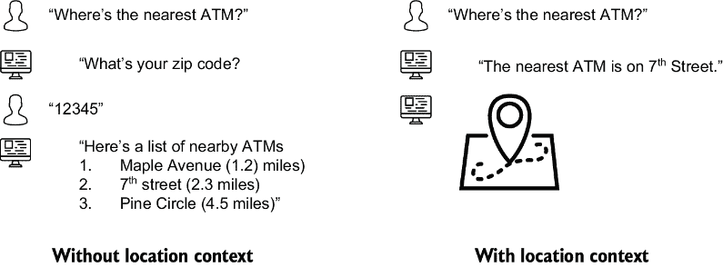
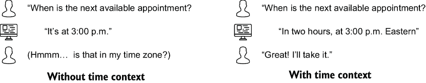

# 9 利用上下文实现自适应虚拟助手体验

### 本章涵盖

+   在虚拟助手交互中适当地应用上下文

+   将对话式 AI 适应不同模态

+   识别由忽略模态引起的痛点

在虚拟助手交互中有效地应用上下文对于提供无缝和直观的用户体验至关重要。用户期望虚拟助手能够理解他们的查询，并在他们的上下文中这样做。本章重点介绍了虚拟助手技术中的三个关键个性化来源：上下文、模态和检索增强生成（RAG）。这些都有助于虚拟助手更好地理解和与用户互动。

*上下文*是指根据用户可用的情境和历史数据定制交互。例如，通过考虑用户的当前位置和时间来回答关于天气的查询，与提供通用预报相比，这体现了有效的上下文使用。

*模态*指的是用户的沟通方式，如语音、文本或视觉界面。每种模态都提供了独特的优势和挑战。将虚拟助手适应所选模态确保了无缝的交互，无论用户是在键入消息、与设备交谈还是通过图形界面进行交互。

RAG 结合了传统的响应生成能力，以及从外部数据源实时提取信息的能力。这使得虚拟助手能够提供更丰富、更有见地的响应，显著提高相关性和准确性。

虚拟助手可以通过整合这三个元素来提供自适应和个性化的用户体验，本章展示了如何使用这些个性化技术来改变用户交互。本章借鉴了项目交付中获得的见解，说明了这些个性化技术是如何发展成为最佳实践的。

## 9.1 上下文在虚拟助手性能中的重要性

有效的虚拟助手依赖于上下文来提供有意义和高效的交互。在没有上下文考虑的情况下，用户可能会经历摩擦、误解和挫败感，即使助手在技术上很先进。为了说明这一点，考虑一下 Emma 的经历，她是一位刚刚毕业的学生，在银行聊天机器人 Max 的帮助下管理她的财务：

*Emma 是一位刚刚毕业的学生，刚刚开始她的第一份工作，她很兴奋能够独立管理自己的财务。她在一家提供名为 Max 的聊天机器人以供客户支持的银行开设了账户。Emma 依赖 Max 来完成各种任务，比如查看她的余额、设置账单支付以及了解她的学生贷款选项。然而，尽管 Max 的功能很先进，Emma 经常感到沮丧和不知所措。*

*Emma 决定她需要一张新的信用卡，并开始了一个新的聊天机器人会话。Max 提供了一系列银行的信用卡选项，解释了每个选项的优缺点。然而，Max 没有识别出 Emma 是银行的现有客户。Max 提供的建议没有考虑到她的当前财务状况或现有账户。*

*Emma 决心做出明智的决定，她请求推荐哪种信用卡最适合她的需求。由于 Max 无法访问她的账户详情和交易历史，因此提供的建议与她的消费习惯或财务目标不符。Emma 不得不额外花费时间浏览银行的网站并拨打客户服务电话，以获得她需要的个性化帮助，从而抵消了 Max 本应提供的便利。*

如您所见，Emma 与 Max 的互动充满了问题点：未能考虑她与银行现有关系的通用建议，错失了个性化帮助的机会，以及沟通不佳。尽管 Max 具有一定的技术能力，但 Emma 无法从聊天机器人中获得足够的价值。

使用上下文来提高聊天机器人性能至关重要。上下文理解使聊天机器人能够提供相关、及时和准确的响应——这是我们期望从聊天机器人那里获得的用户体验。表 9.1 总结了 Emma 遇到的问题点，并描述了可能的解决方案。使用上下文，像 Max 这样的聊天机器人可以从简单的任务执行者转变为智能、适应性强的助手，从而提高生产力和用户满意度。通过上下文理解解决这些问题点确保了无缝和有支持性的体验，赋予像 Emma 这样的用户能力。

##### 表 9.1 解决 Emma 的问题点

| 问题点 | 可能的解决方案 | 为什么和如何 |
| --- | --- | --- |
| 聊天机器人在回答问题时无法访问用户信息 | 集成账户信息 | 通过访问 Emma 现有的账户和财务历史，Max 可以提供个性化的建议。例如，Max 可以推荐一张与 Emma 当前账户和消费习惯相匹配的信用卡。  |
| 聊天机器人提供通用的建议 | 具有上下文感知的财务建议 | 通过访问 Emma 的交易历史和特定的财务目标，Max 可以提供更相关和定制的财务建议，节省 Emma 宝贵的时间和精力。  |
| 提供和重复标准响应 | 适应性响应 | 通过理解 Emma 的财务优先事项和消费模式，Max 可以相应地调整其响应和行动。例如，了解 Emma 最近开始工作并可能正在处理学生贷款，Max 可以主动提供关于预算和贷款管理的见解。  |
| 聊天机器人仅在单个文本通道中工作 | 不同情境下的模式 | 识别每个任务适当的模式是关键。例如，通过聊天提供个性化的信用卡推荐，通过电子邮件发送详细的财务报告，或通过通知提供快速更新，可以使交互更加高效和用户友好。 |

### 9.1.1 情境如何影响用户交互

情境在塑造用户与虚拟助手（尤其是聊天机器人）之间的交互中起着关键作用。当聊天机器人理解用户查询的情境时，它可以提供更准确、相关和个性化的响应。这导致用户体验显著改善。本节概述了情境如何影响用户交互。

#### 增强的相关性和准确性

当聊天机器人将用户历史整合到其响应中时，它增强了交互的相关性。例如，如果艾玛经常询问她的储蓄账户，聊天机器人可以记住这个“偏好”并主动提供有关该账户的更新和信息。回忆过去的交互有助于聊天机器人提供针对用户特定兴趣和需求的定制化响应，而不是提供通用信息。这种个性化的参与节省了用户的时间，并培养了用户被理解和重视的感觉。

注意：使用历史交互调整聊天机器人以实现情境感知需要额外的开发。大多数对话式人工智能提供商不提供情境感知作为内置功能。

此外，了解用户的当前状态有助于聊天机器人提供精确的帮助。例如，当艾玛询问她的账户余额时，一个情境感知的聊天机器人应该首先通过提供她的账户选项列表来消除歧义，确定她指的是哪个账户。一旦她选择了一个账户，聊天机器人应该提供最新的和准确的余额，反映最近的交易活动——如存款、取款或待处理和计划中的支付——这样艾玛就能获得完整的画面。

在金融问题（如建议可用资金或即将到来的账单）方面，这种程度的意识至关重要。例如，知道是否有任何交易待处理，可以给艾玛提供更好的情境。根据金融机构和交易类型，待处理交易可能需要最多五天才能过账，因此可能会影响可用余额。虽然今天的大多数聊天机器人实现只提供简单的余额数字，但一个真正情境感知的系统将通过提供最相关、最及时和最准确的信息来帮助用户。

#### 个性化体验

情境感知聊天机器人最吸引人的好处之一是提供个性化的体验。当聊天机器人识别并分析用户的财务目标和消费模式时，它可以提供符合他们需求的定制化建议。例如，经常旅行的用户可能会被推荐带有旅行奖励的信用卡。这种个性化的程度使得聊天机器人的建议更加有用，并通过理解用户的独特情况来提升整体用户体验。

此外，针对生活事件和个人里程碑的响应可以显著提高相关性。例如，如果聊天机器人知道用户最近刚刚毕业并开始了一份新工作，它可以提供针对过渡到经济独立的人的预算建议。这种个性化的互动可以让用户感到更有支持和理解，从而提高他们对服务的满意度和参与度。

表 9.2 强调了情境感知聊天机器人如何根据特定的用户情况定制建议，而不是提供通用建议。这说明了个性化的价值。

##### 表 9.2 示例交互：非情境化、情境化和个性化响应

| 用户查询：我应该如何管理这个月的开支？ |
| --- |
| 非情境化响应 | 确保您跟踪您的开支并保持在预算内。考虑使用财务跟踪工具来帮助管理您的支出。 |
| 针对经常旅行的用户的情境化响应 | 由于您经常旅行，考虑投资一张提供旅行奖励的信用卡。您还应该考虑每次旅行的预算，并探索在常旅客计划中的节省选项，以优化本月与旅行相关的费用。 |
| 针对刚入职新工作的应届毕业生的情境化响应 | 恭喜您找到新工作！在您过渡到经济独立的过程中，设置一个预算并考虑您的收入是很重要的。您可能需要为即将到来的一次性支出分配资金，例如专业服装或通勤卡，同时开始建立紧急基金。 |

#### 解决问题的效率

情境感知提高了与聊天机器人进行问题解决交互的效率。当聊天机器人知道用户的近期活动或持续问题时，它可以提供更准确的解决方案。例如，如果用户最近报告了丢失的卡片，聊天机器人可以优先帮助他们追踪替换卡件的配送。这种有针对性的帮助可以更快地解决问题，减少用户因重复信息或等待通用响应而产生的挫败感。

情境理解也简化了交互。通过“记住”过去的互动，聊天机器人可以避免重复问题，使交互更流畅、更高效。这种能力在时间敏感的情况下特别有用。一个能够有效解决用户问题的聊天机器人可以增强整体用户体验并提高用户对服务的信心。

考虑一个最近报告丢失信用卡的用户。传统上，聊天机器人可能会提供一组标准选项，例如“检查账户余额”、“开设新账户”或“申请贷款”。然而，随着情境意识的增强，聊天机器人的意图分类器会根据用户的最近互动动态调整。聊天机器人不再提供标准选项，而是呈现定制选项，如“申请补发卡片”、“追踪卡片配送”或“审查最近的未授权交易”。图 9.1 展示了两种聊天机器人交互。没有情境意识的情况下，第一种提供通用选项并要求用户重复信息，导致令人沮丧的体验。有了情境意识，第二种记住用户的最近问题并提供定制选项，从而更快、更有效地解决用户的问题。


##### 图 9.1 一个通用的聊天机器人设计没有考虑用户情境——它总是提供相同的选项。情境意识增强了整体用户体验。

图 9.1 右侧显示的改进是通过数据跟踪和机器学习模型实现的，这些模型分析用户的最近活动和记录的偏好。系统记住过去的互动，并使用这些情境来调整显示的选项，增强了聊天机器人响应的相关性和速度。这种能力使得聊天机器人能够提供更流畅、更直观的体验。

聊天机器人历史有两种形式，都与保持情境相关：

+   *会话历史*——当前交互会话的内容。一旦会话结束，历史记录将被记录但通常会被丢弃。这个历史可以帮助我们理解即时情境，例如在单个对话中的后续问题。

+   *持久用户历史*——这跨越了同一用户的多个会话历史，甚至跨越不同的模式。它可以用来推断用户偏好和倾向，但将其纳入对话需要额外的努力。使用持久历史可以改善多个交互的用户体验。

#### 主动支持

主动支持是设计良好的、上下文感知的聊天机器人的一个标志。主动聊天机器人可以主动与用户进行对话，而不仅仅是响应查询。它们可以在问题变得紧急之前发现潜在的问题。一个主动的银行聊天机器人可以发送关于即将到来的账单、低余额或异常账户活动的即时提醒。这些主动警报帮助用户保持对财务状况的掌控，避免潜在的诸如滞纳金或透支等问题。

该聊天机器人还可以利用基于用户行为和财务模式的预测洞察。分析趋势和习惯可能导致在用户有大量月度盈余时设置储蓄计划的行动。这些预测能力使该聊天机器人能够充当财务顾问，帮助用户更有效地实现他们的财务目标。

#### 建立信任和忠诚度

响应的一致性对于建立用户对聊天机器人的信任至关重要。一个始终提供准确和个性化协助的聊天机器人显示出可靠性和能力。当用户知道他们收到的响应将针对他们的情况定制时，他们会更有信心依赖聊天机器人。信任对于培养长期参与和忠诚度至关重要。

个性化交互和主动支持可以提高用户满意度——当用户感觉他们的聊天机器人理解并支持他们时，他们更有可能报告积极的体验并继续使用该服务。高水平的用户满意度鼓励重复互动并加深用户与聊天机器人机构的联系，最终使双方受益。

### 9.1.2 什么是上下文信息？

上下文信息包括任何可以个性化用户体验的数据点。这些包括用户位置、时区、设备类型、偏好、行为模式、先前交互和模式。每个都可以个性化用户交互，但可能需要额外的开发工作来将这些整合到您的聊天机器人中。

#### 用户位置

*用户位置*指的是用户的地理位置。这可以通过 GPS 数据或 IP 地址来确定，无需用户明确指定他们当前的位置。了解用户的位置允许虚拟助手提供更相关和高效的协助，尤其是在实时场景中。让我们探讨这如何适用于我们之前的例子，其中 Emma 现在正在国外出差，需要帮助找到最近的 ATM：

*Emma 正在国外出差。她需要找到最近的 ATM 提取当地货币，因此她向银行的聊天机器人 Max 寻求帮助。*

知道用户的位置对于提供相关和及时的帮助至关重要，如图 9.2 所示。Max 可以使用 Emma 的当前位置列出附近的 ATM。此外，位置信息有助于通过标记在异常或不寻常地点发生的交易来检测和预防欺诈活动。使用地理定位 API 获取用户的位置并将其集成到聊天机器人交互中。



##### 图 9.2 典型的聊天机器人响应不考虑用户的位置，但当考虑位置上下文时，它们会显示最合适的响应。

备注：确保安全地存储位置数据并维护用户同意以符合隐私法规至关重要。当不再需要时删除此数据！

#### 时区

*时区*指的是用户的本地时区。对于调度和时间相关的功能至关重要。让我们回到我们的例子：

*目前 Emma 在伦敦，英国，需要安排与她在纽约市的银行客服团队的通话。她要求 Max 帮助找到一个合适的时间。*

知道用户的时区可以确保通信和提醒引用适当的时间，如图 9.3 所示。例如，Max 可以为在伦敦的 Emma 建议方便的通话时间，即使客服团队在纽约。这避免了由时差引起的任何混淆或不便。



##### 图 9.3 许多聊天机器人响应不考虑用户时区上下文。当考虑时，响应更有用。

通过使用 pytz 等库将时间转换为用户的本地时区来实现时区转换。开发考虑用户时区的提醒和预约功能，确保通信和提醒在适当的时间发送，以避免混淆或不便。

#### 设备类型

*设备类型*指的是用户用于与聊天机器人交互的设备，例如智能手机、平板电脑、桌面或可穿戴设备。让我们回到我们的例子：

*Emma 更喜欢使用她的平板电脑进行详细的财务规划，而使用智能手机进行快速余额检查和通知。*

知道设备类型允许聊天机器人根据用户的当前设备优化交互。例如，Max 可以为小屏幕智能手机提供简化的界面和简洁的响应，同时在更大的平板电脑上提供更详细的信息和功能。这确保了无论使用哪种设备，用户体验都是有效的。

检测用户的设备类型允许聊天机器人针对最佳显示和功能定制互动。您可以使用用户代理字符串或设备信息 API 检测用户的设备类型，并调整用户界面和响应格式以匹配设备的功能。为移动设备提供简化的界面，为桌面提供更详细的界面，确保在不同设备上提供顺畅和定制的用户体验。再次提醒，在设计或改进计划时，分配额外的发展时间。

#### 用户偏好

*用户偏好*指的是用户的特定选择和设置，例如他们偏好的通信渠道、通知设置和数据展示格式。让我们再次看看我们的例子：

*艾玛更喜欢通过电子邮件接收月度财务摘要，并通过短信接收紧急警报。*

通过遵守艾玛的通信偏好，Max 确保以她认为最方便和最不干扰的方式传递重要信息。这种对用户偏好的尊重有助于建立信任和参与度。

实施用户偏好设置确保沟通与用户期望保持一致。允许用户设置通信渠道、通知设置和数据展示格式的偏好，并安全存储这些偏好，并一致应用。使用存储的偏好来定制互动和通知，确保聊天机器人尊重用户选择，以提升满意度和建立信任。

#### 行为模式

*行为模式*指的是用户通过与其聊天机器人和其他服务的互动观察到的重复行为和习惯。让我们回到我们的例子：

*艾玛每天早上都会检查她的账户余额，并在每个月的第一天支付账单。*

识别行为模式使聊天机器人能够预测用户需求并提供主动支持。例如，Max 可以在每天早上自动提供余额更新，或者在月初临近时提醒艾玛支付账单。这种主动帮助通过使互动及时和更直观来提升用户体验。

分析用户行为有助于预测需求并提供主动帮助。收集用户互动和交易数据以识别模式，并使用机器学习算法分析和预测用户行为。利用行为分析洞察提供主动支持和建议，实施基于识别模式的自动调整功能。这种主动帮助通过使互动及时和更直观来提升用户体验。

#### 之前的互动

*之前的互动*指的是用户与聊天机器人之间所有过去通信和交易的历史记录。这包括提出的问题、使用的服务以及由于这些互动而采取的任何行动。让我们回到我们的例子：

*在过去几个月里，艾玛经常向 Max 询问预算建议和贷款还款选项。今天，她询问如何设置储蓄计划。*

理解之前的互动使聊天机器人能够提供更个性化和一致的响应。例如，由于艾玛有寻求财务建议的历史，Max 可以建议符合她过去查询和财务目标的定制储蓄计划。这种连续性节省了艾玛的时间，避免了重复的问题，并建立了一种熟悉感和信任感，因为聊天机器人似乎记得并理解她的需求。

维护之前的互动日志有助于聊天机器人提供个性化的响应。为了实现这一点，在数据库中使用唯一的用户标识符记录用户互动，跟踪和检索过去的互动。使用这个互动历史根据过去的查询提供定制化的响应。实施算法分析互动模式以提供更好的推荐，确保聊天机器人的响应在连续性和熟悉性方面。

备注  用户之前的互动日志在理解聊天机器人成功方面也很有用。如果聊天机器人提供了一个答案，但用户在设定的时间段内（比如 24 小时或一周）返回了相同的问题，那么这个答案可能没有帮助。保留和分析之前的互动日志也有助于我们理解“真正的”控制。

#### 交流方式

*交流方式*指的是用户在特定时间偏好或需要的交流方法或模式。这可以包括文本、语音、电子邮件、推送通知或任何其他通信渠道。让我们看看我们的例子：

*艾玛总是忙碌着，并且喜欢在驾驶时通过语音命令与银行的聊天机器人 Max 互动。她让 Max 检查她的账户余额和最近的交易，确保她可以在不输入或查看手机的情况下保持信息畅通。*

认识和适应用户的偏好交流方式对于有效沟通至关重要。在艾玛的情况下，Max 可以发送简明的文本消息总结她的账户活动，尊重她的当前情境。不同的情况需要其他交流方式，而能够无缝切换这些方式的聊天机器人确保用户能够尽可能方便和高效地接收信息。这种适应性通过满足个人偏好和情境需求来提高用户满意度和参与度。

通过理解和整合用户位置、之前的互动和交流方式，聊天机器人可以显著增强情境意识。这导致更准确和相关的响应，并促进更吸引人和支持性的用户体验。

实施这些策略并使用情境信息可以帮助聊天机器人提供高度个性化和吸引人的用户体验。使用用户情境的方法增强了互动的相关性和准确性，建立了用户信任和满意度，最终导致更好的参与度和忠诚度。

##### 练习

1.  确定虚拟助手可能使用的五种上下文信息类型，以增强用户交互。以下列表提供了一个结构化的格式，以指导你的分析，其中包含一个完成的示例，说明如何收集和利用用户位置以及它如何影响用户满意度：

    +   *上下文信息*—用户位置

    +   *收集方法*—来自移动设备的 GPS 数据

    +   *利用*—提供基于位置的服务，例如当地天气更新或附近餐厅推荐

    +   *效果*—增强相关性和个性化，提高用户满意度

对于其他四个相关的上下文因素也进行同样的操作，描述它们是如何收集的，如何增强虚拟助手的交互，以及它们对用户参与度的潜在影响。

1.  2. 设计上下文感知的响应。创建三个虚拟助手可能收到的不同用户查询。对于每个查询，指定至少两件可能用于个性化响应的上下文信息。写出虚拟助手会提供的上下文感知响应，解释上下文如何改善交互。以下是一个示例：

    +   用户查询：“今天的天气怎么样？”

    +   上下文信息：用户的位置，当前时间

    +   上下文感知响应：“早上好！今天早上旧金山的天气是晴朗的，下午晚些时候最高气温将达到 75°F。”

## 9.2 理解模式

*模式*指的是用户与虚拟助手沟通的各种渠道或方法。模式包括文本、语音、图像和多模态交互。每种模式都带来其优势和挑战，影响着用户如何与助手互动以及助手如何有效地满足用户需求。有效利用模式可以使聊天机器人从功能型转变为直观和吸引人的。虚拟助手的性能受模式的影响。

例如，基于文本的交互可能更适合于打字更方便的环境，而语音交互则提供了免提便利和更自然的对话流程。多模态交互结合了文本、语音和视觉元素，可以提供更丰富和更灵活的用户体验。

评估这些模式如何影响用户参与度和交互设计对于持续改进至关重要。开发者可以应用特定的评估技术来评估不同模式下的现有虚拟助手流程，以确定改进的区域。这确保了一个有效的持续改进过程。

### 9.2.1 模式比较

聊天机器人最初是简单的基于文本的对话应用，但已演变为多模态通信。一般来说，*模式*指的是某事发生或体验的方式或模式。聊天机器人的模式与它如何与用户交互以及处理信息相关：

+   *文本*—文本是主要且最常用的模式。用户输入他们的问题或命令，聊天机器人以文本形式回应。

+   *视觉*—视觉模式是主要与文本交互的聊天机器人。尽管如此，其回应使用视觉元素，如按钮、图片、轮播图、视频和其他图形界面，以促进交互。添加视觉元素可以通过提供视觉提示和选项来增强用户体验。

+   *语音*—语音机器人以口语与用户交互。这包括理解口语输入和生成口语回应。通常，底层的对话引擎仍然处理文本，因此发生语音到文本和文本到语音的转换。

+   *多模式*—这些机器人结合了多种模式，如文本、语音、图像和视频。例如，一个多模式聊天机器人可以理解口语查询，显示相关图片，并以文本和语音的形式回应。

表 9.3 简要比较了不同的模式，突出了它们的独特特征、优点和挑战，以及何时使用它们及其对用户参与度的影响。此外，它还概述了每种模式的相应评估技术。

##### 表 9.3 模式概述

|  | 文本模式 | 视觉模式 | 语音模式 | 多模式交互 |
| --- | --- | --- | --- | --- |
| 描述 | 通过书面文字进行沟通 | 使用带有额外视觉元素的文本进行沟通 | 通过口语进行交互 | 结合文本、语音和视觉元素 |

| 优点 | 精确的沟通。易于参考。

| 通过引人入胜的界面通过视觉增强理解 | 免提操作。自然的对话流程。

| 更丰富的用户体验。多变的交互。

|

| 挑战 | 打字可能很慢。可能缺乏情感色调。

| 视觉元素可能会分散注意力或被忽略。需要精心设计的用户界面。

| 需要清晰的语音。可能误解口音。

| 设计和实现更复杂。 |
| --- |
| 何时使用 | 在打字方便的情况下 | 需要视觉辅助工具以更好地理解的场景 | 需要免提交互的场景 | 需要多种模式结合的场景 |
| 对用户参与度的影响 | 文本为中心的上下文中高度参与 | 通过视觉辅助工具提高参与度 | 由于自然交互而增加的参与度 | 通过多种交互模式增强的参与度 |

| 评估技术 | 用户反馈调查。可用性测试。

| 用户界面测试。视觉有效性分析。

| 语音识别准确性测试。用户反馈。

| A/B 测试。多模式可用性评估。

|

选择模态直接影响到用户如何与对话式人工智能互动和参与。通过识别文本、语音、视觉和跨模态交互的优势和挑战，聊天机器人设计者可以更好地定制体验以满足用户需求和偏好。虚拟助手的性能在于能够无缝集成和优化这些不同的通信渠道。

### 9.2.2 设计虚拟助手流程中模态的重要性

设计虚拟助手流程时，模态的选择对用户体验和交互的有效性有显著影响。

需要考虑的一个关键方面是虚拟助手将被使用的上下文。例如，当用户需要免提操作时，如驾驶或烹饪，语音模态至关重要。这需要强大的自然语言处理能力来准确解释语音命令并提供适当的响应。此外，设计者必须确保语音交互感觉自然流畅，避免机器人或过度重复的响应，这可能会让用户感到沮丧。嘈杂的环境也起着作用，因为背景噪音可能会影响语音识别系统的性能，需要先进的降噪技术。

对于语音交互来说，简洁性至关重要。由于语音是一种比文本更受限的媒介，用户从简短、直接且易于处理和理解的响应中受益。在语音交互中，冗长的回答会显得繁琐，因为用户无法像在文本中那样视觉扫描或跳过部分内容。因此，虚拟助手应优先提供清晰、简洁的信息，以支持高效的免提体验。

在基于文本的交互中，清晰度至关重要，但模态允许更广泛的沟通。虽然简洁性很有价值，但文本交互为用户提供了自己节奏下回顾细节的选项。基于文本的虚拟助手仍应设计为处理简洁的用户输入并提供可操作的回复，但它们可以使用自动建议和预测文本等特性来使交互更快更高效。使用文本时，用户可能需要多任务处理或需要更详细的响应，他们可以按需快速浏览或重新查看，因此助手的提示和响应应精心设计，以免让用户感到不知所措。

小贴士：考虑可访问性选项，例如为视障用户提供的屏幕阅读器，确保基于文本的交互具有包容性和用户友好性。

视觉模式，它结合了文本和视觉元素，如图像、按钮和图标，需要不同的设计方法。通过提供上下文线索并使界面更具互动性，视觉元素可以显著增强理解和参与度。您必须在视觉吸引力和功能性之间保持平衡。界面中过多的视觉元素可能会降低清晰度和可用性。设计师应优先考虑视觉清晰度和一致性，使用视觉元素来补充和增强文本，而不是掩盖它。这种模式在视觉辅助可以简化复杂信息的情况下尤其有效，例如故障排除指南或交互式教程。确保视觉元素能够适应不同的屏幕尺寸和分辨率，对于在多种设备上保持无缝的用户体验至关重要。

### 9.2.3 模式如何影响用户体验的例子

列表 9.1 和 9.2 探讨了技术支持聊天机器人如何使用不同的模式——基于文本的说明与视觉（视频）说明——来帮助用户设置新的打印机。

##### 列表 9.1 文本模式交互

```py
User: I need help setting up my new printer.
Chatbot: I would be happy to help you set up your printer. Please follow these steps: Unbox the printer, place it on a stable surface and connect it to power. Install the ink cartridges and load the paper. Download and install the printer drivers from our website for software setup, then connect the printer to your computer via USB or Wi-Fi.
User: I can't open the printer cover to install the ink cartridges. Where is the latch?
Chatbot: The latch should be on the front panel. Please check around the edges for any visible buttons or levers.
User: I've checked, and there's no latch. Can you help me find it?
Chatbot: I apologize for the inconvenience. If you're unable to locate the latch, please refer to the user manual for your specific printer model for detailed instructions.
User: I don't have the manual. This is really frustrating.
Chatbot: I understand your frustration. Unfortunately, I can't provide more specific guidance without knowing the exact model. Could you check our website for the support page for your model?
User: This is useless. Forget it!
```

##### 列表 9.2 视觉模式交互

```py
User: I need help setting up my new printer.
Visual bot: I would be happy to help you set up your printer. Would you like to watch a video tutorial on the setup process?
User: Yes, please.
Visual bot: Great! Here is a video that will guide you through the entire setup process step by step. [*Video starts to play*] *[User watches the video, then starts setting up the printer]*
User: I am at the part where I need to insert the ink cartridges. Can you show that part again?
Visual bot: Sure! Here is the specific section of the video that demonstrates how to insert the ink cartridges. *[Video goes to specific timestamp]*
User: Perfect, that makes it so much clearer. Thanks!
```

基于文本的说明，虽然提供了详细和精确的步骤指导，但当用户遇到说明中未明确涵盖的问题时，往往会引起困惑和挫败感。没有视觉提示，用户可能难以理解特定的步骤，例如在打印机上找到闩锁，这可能导致令人沮丧的来回交互。这种类型的交互在用户对不清晰的闩锁位置的日益增长的挫败感中表现得非常明显。需要额外的澄清可能会导致用户体验效率降低和更加恼人。

相比之下，视觉模式，尤其是通过视频说明，提供了一种更清晰、更吸引人的方式来遵循设置过程。视频使用户能够看到实际的过程，使其更容易理解和复制每一步。这减少了多次交互的需要，并最小化了误解或错误解释指令的机会。如果需要进一步的澄清，用户可以参考视频的特定部分，确保设置体验更加顺畅和高效。

考虑一个用户在语音聊天机器人的帮助下询问航班信息的场景。一个设计良好的语音机器人可以提供适当的信息，甚至在适当的时候切换到不同的模式，而一个设计不佳的机器人可能会导致更多的困惑和挫败感，如列表 9.3 和 9.4 所展示的。

##### 列表 9.3 设计不佳的语音机器人交互

```py
User: I need to check the status of my flight.
Voice bot: Please provide your flight number and departure date to check the flight status.
User: It's flight XY123 on August 5th.
Voice bot: Please hold while I retrieve this information... Your flight UA123 on August 5th is on time. Please visit our website if you need more details or have other inquiries.
User: Can you tell me the gate number?
Voice bot: Please visit our website for more details about your flight.
User: [..hangs up..]
```

##### 列表 9.4 设计良好的语音机器人交互

```py
User: I need to check the status of my flight.
Voice bot: I can help with that. What is your flight number and the departure date?
User: Flight UA123 on August 5th.
Voice bot: One moment while I check that for you... Flight UA123 on August 5th is scheduled to depart on time from gate 22B. Would you like information on baggage claim or perhaps directions to the gate?
User: Yes, directions please.
Voice bot: Gate 22B is located in Terminal C. After security, follow the signs towards the terminal. It's near the food court. Would you like a map sent to your phone?
User: Yes, please.
Voice bot: I've sent it to your phone. Anything else I can help with today?
```

在设计不佳的交互中，语音机器人未能提供全面的支持，迫使用户通过不那么方便的渠道寻求额外信息。相比之下，设计良好的语音机器人能够预见用户的需求，通过提供所需信息以及相关细节的补充，从而提供全面的帮助，改善整体用户体验。

### 9.2.4 语音机器人设计考虑因素

正如前一个章节的示例所示，为了确保积极的语音机器人用户体验，必须考虑几个关键因素。首先，沟通的清晰性和简洁性是必不可少的。机器人应该将信息分解成可管理的、一步一步的指令，使用户能够轻松跟随并理解每个过程的部分。情境意识是另一个关键方面；机器人应该识别用户的进度并提供针对他们情况的相应指导。此外，结合错误处理并提供澄清或重复的选项可以帮助可能需要额外帮助的用户。设计机器人时，保持自然、对话的语调也很重要，这样可以使交互感觉更直观，而不是那么机械。最后，提供多模态支持，例如提供视频教程或视觉辅助链接，可以满足不同的学习偏好，并增强语音机器人的整体效果。通过优先考虑这些考虑因素，设计师可以创建出既高效又用户友好，并能适应广泛用户需求和情境的语音交互。

下面是语音机器人设计的五大设计考虑因素：

+   *提供逐步步骤*。语音机器人应该将任务分解成清晰、可管理的步骤，并按顺序引导用户完成每个步骤。这一点至关重要，因为用户不能像阅读文本那样视觉扫描步骤。通过允许用户在继续之前确认完成，机器人确保他们不会在过程中感到不知所措或迷失方向。

+   *设计鲁棒的错误处理策略*。由于口音、发音障碍或背景噪音导致的语音识别错误，在语音交互中误解更为常见。设计策略以优雅地处理这些错误，而不让用户感到沮丧，这是至关重要的。这包括澄清问题和简化响应，以便重新回到正确的轨道。

+   *考虑* *自适应响应时间*。语音机器人必须有效地管理交互的节奏。由于用户不能像阅读文本那样回顾听到的词语，机器人需要调整其说话速度，允许用户自然地处理暂停，并对用户可能需要更多时间的提示保持敏感。

+   *在采取行动前提供确认*。语音机器人应在采取重大行动前与用户确认。这在语音交互中尤为重要，因为它可以防止对语音命令的误解导致意外行动。

+   *支持不同的语音模式**。* 设计语音识别系统以理解不同的口音、方言和语音模式。这种包容性确保了更广泛的用户能够有效地与机器人交互。

值得注意的是，这些语音机器人设计考虑因素对于聊天机器人设计同样相关。两种模态都依赖于基本元素，如用户需求分析、上下文感知、自然语言处理和强大的错误处理。此外，个性化、可访问性、无缝切换和持续改进等因素在创建引人入胜、用户友好的虚拟助手方面发挥作用，无论它们使用语音还是文本。

然而，某些设计因素必须适应语音交互。与基于文本的聊天机器人不同，语音机器人需要处理语音模式、口音和背景噪音的变化，所有这些都可能影响理解和使用体验。语音交互最关键的因素是简洁和清晰，因为用户可能需要帮助来保留长的口头指令。相比之下，基于文本的聊天机器人可以提供用户可以按自己的节奏阅读的详细信息，这使得参考对话的先前部分更容易。通过针对每种模态的独特特征调整这些考虑因素，设计师可以创建更直观、更有效的虚拟助手。

##### 练习

1.  审查以下场景，并确定每种场景（文本、语音、视觉或多模态）最有效的模态。为你的选择提供简要的解释：

    +   场景 1：用户需要帮助设置复杂的软件程序。

    +   场景 2：用户在驾驶时询问最近的加油站。

    +   场景 3：用户想要浏览新服装商品的目录。

    +   场景 4：用户请求每日励志名言。

1.  选择一个虚拟助手可能帮助用户完成的任务，例如预订航班或选择信用卡。设计一个至少包含两种不同模态的多模态交互。解释每个模态如何增强用户体验并有助于完成任务。以下是一个示例：

    +   任务：预订航班

    +   交互：助手使用语音提出初始问题（例如，目的地、日期），并使用文本显示带有图片和价格的航班选项。

    +   说明：语音交互提供了一种快速、自然的信息收集方式，而文本和视觉帮助用户比较选项并做出明智的决定。

## 9.3 使用 RAG 增强上下文感知和提升整体用户体验

随着虚拟助手的演变，更自适应和语境感知的交互变得越来越关键。“自适应流程”一词指的是虚拟助手根据实时上下文和用户行为动态调整交互路径的能力。这使得虚拟助手能够提供更个性化和相关的响应。通过使用第六章中介绍的先进技术如 RAG，虚拟助手可以访问和整合大量上下文信息，增强其理解和响应用户需求的能力。这种方法提高了交互的准确性和相关性，并显著提升了整体用户体验，使虚拟助手更加直观和有效。

RAG 结合了信息检索系统的优势与生成模型，使虚拟助手能够从外部来源检索相关信息并生成语境丰富的响应。这种方法允许对用户查询有更深入的理解，并生成更准确的响应，因为助手可以调用更广泛的知识库，而不仅仅是其预训练的数据。通过将 RAG 纳入自适应流程，虚拟助手可以持续学习和适应新信息，确保其交互保持最新且高度相关。本节将探讨自适应流程的原则以及如何利用 RAG 创建更响应和语境感知的虚拟助手体验。

### 9.3.1 使用 RAG 设计自适应流程

自适应流程需要设计考虑。适应性确保助手能够提供个性化、相关和及时的响应，从而提升用户体验。与静态流程不同，静态流程中的交互遵循预定的脚本，自适应流程灵活且响应迅速，使助手能够有效应对各种场景。

例如，考虑一个虚拟助手帮助用户进行在线购物的情况。在静态流程中，助手可能只是询问产品类别并列出可用商品：

```py
User: Hi, I am looking for a new laptop.
Chatbot: Sure! We have options for gaming laptops, business laptops, and laptops for everyday use. What kind are you looking for?
```

静态流程提供了一种基本、通用的交互。聊天机器人提供标准选项，而不考虑用户的过去行为或偏好。用户必须逐个询问每个产品的详细信息，这可能耗时且缺乏吸引力。这种方法没有考虑上下文信息，如用户的先前交互或特定兴趣，导致了一种一刀切的经验，可能无法完全满足用户的需求。

然而，在自适应流程中，助手可以记住用户的先前购买、偏好的品牌和当前的促销活动，以定制购物建议。如果用户之前表现出对环保产品的兴趣，助手可以优先展示可持续选项：

```py
User: Hi, I am looking for a new laptop.
Chatbot: Welcome back! Last time you looked at eco-friendly options. Are you still interested in sustainable products?
```

自适应流程使用上下文信息创建更个性化和相关的交互。通过记住用户对环保产品的先前兴趣，聊天机器人可以调整其推荐以符合他们的偏好。自适应流程还主动提供额外信息，如客户评价和产品比较，而无需用户请求。这种预见性方法通过使聊天机器人更有效地预测和满足用户需求，提高了用户体验的效率和满意度。总的来说，自适应流程展示了如何利用上下文和个人化可以显著提高虚拟助手交互的质量。

要实现这种自适应响应，RAG 提示可能告知模型在生成响应时考虑用户的历史（先前搜索的上下文），确保助手不仅反应迅速，而且具有预见性：

```py
{
  "user_query": "Hi, I am looking for a new laptop.",
  "context": "previous searches: eco-friendly laptops",
  "generate_response": true
}
```

另一个例子是在技术支持领域。静态流程可能会引导用户通过一个通用的故障排除脚本，但自适应流程可以根据用户的特定设备、之前报告的问题和实时诊断数据动态调整。如果用户经常因网络问题联系支持，助手可以主动检查网络设置并建议相关解决方案，节省时间并提高效率。

通过关注初始交互并简洁地展示静态和自适应流程之间的差异，我们可以突出自适应设计的重要性。RAG 的使用还进一步允许助手有效地整合和使用上下文数据，从而创造一个更具吸引力和个性化的用户体验。对比变得清晰：静态流程提供了一种一刀切的方法，而自适应流程则根据个别用户的需求、偏好和以往互动来定制体验。

将强大的信息检索机制与高级自然语言生成能力相结合，对于使用 RAG 框架设计自适应流程至关重要。RAG 增强了助手从外部来源提取相关数据并生成上下文适当响应的能力，从而创造了一个更动态和响应性的交互体验。以下步骤概述了使用 RAG 框架创建自适应流程的过程：

1.  *识别影响交互的上下文元素。* 这些元素包括用户偏好、历史交互、实时数据和外部信息来源。在健康管理助手中的相关上下文元素可能包括用户的医疗历史、当前健康指标、季节性健康趋势和最新的医学研究。助手可以通过整合这些元素提供个性化的健康建议和提醒。

1.  *开发检索机制。* RAG 允许助手实时查询外部数据库、文档或 API 以获取相关信息。例如，在在线购物示例中，助手可以从零售商的数据库中检索最新的产品评论、库存可用性和当前折扣。然后，这些信息被用来根据用户的需求和偏好定制购物建议。

1.  *使用检索到的数据生成连贯且上下文相关的响应。* 这正是助手自然语言生成能力发挥作用的地方。例如，如果用户请求环保产品推荐，助手不仅列出产品，还突出其可持续特性，如可回收包装或节能，增强响应的相关性。

持续学习和反馈整合对于确保适应性流程的有效性至关重要。助手应该能够从用户互动中学习，根据反馈和不断变化的患者偏好调整其响应。例如，在技术支持方面，如果用户持续发现有帮助的解决方案，助手应该在未来互动中优先考虑该解决方案。此外，用户反馈可用于完善检索和生成算法，确保助手的性能随着时间的推移而提高。

通过使用 RAG 框架设计适应性流程，虚拟助手可以提供更个性化、相关和及时的互动，显著提升用户体验。这种方法不仅提高了响应的准确性和质量，还使助手更加直观和用户友好，能够适应每个用户的独特需求。

### 9.3.2 获取和生成上下文相关响应的策略

在日常实践中，平衡个性化与可扩展性对于在管理运营效率的同时提供高质量的用户体验至关重要。*个性化*涉及根据用户的偏好、行为和上下文定制对单个用户的响应，使互动更加吸引人和相关。*可扩展性*确保这些个性化体验可以高效地维护在一个庞大且多样化的用户群体中，而不会显著增加成本或降低性能。

实现这种平衡的一种有效方式是通过实时上下文感知。虚拟助手可以通过整合实时数据，如用户的当前位置、一天中的时间或正在进行的活动，动态调整其响应。例如，旅行助手可以根据用户是否在机场或在家中浏览提供建议。实时上下文感知增强了个性化，同时保持了可扩展性。

创建相关响应的一个重要方式是通过查看用户的历史和偏好。通过分析过去的互动、购买历史、常见问题以及某人通常的沟通方式，虚拟助手可以改进其响应，更好地满足用户的需求。例如，如果用户经常询问素食食谱，助手可以在未来的互动中优先考虑素食选项，使体验感觉更加直观和个性化。

在实施利用大型语言模型（LLMs）的聊天机器人时，一个主要挑战是有效地区分简单和复杂查询以优化计算资源。为了保持响应性和成本效益，系统必须用快速、简洁的响应处理简单查询，避免在基本互动上使用不必要的处理能力。这允许计算资源被分配到最需要的地方——为更复杂的请求生成高度个性化的响应。

然而，复杂的分步查询需要更深入的理解和更复杂的处理。这些查询通常涉及多个层次的上下文和顺序信息，系统必须准确解释和整合。未能充分解决这些复杂交互可能导致响应不完整或不准确，导致用户沮丧并降低对系统能力的信任。

虽然 RAG 通过获取相关信息增强了聊天机器人的能力，但它有一个关键限制：它并不完全理解交互的深层需求和上下文。RAG 主要关注获取正确的信息，而没有真正掌握用户意图和上下文的细微差别。这种方法可能导致聊天机器人提供准确的数据，但未能满足客户对问题解决和自主任务执行的需求。用户越来越期望聊天机器人主动管理和解决他们的请求，而不仅仅是简单的信息检索。

小贴士：将 RAG 与其他技术，如上下文感知框架相结合，构建一个从仅仅反应到真正互动和自适应的聊天机器人。这种混合方法允许聊天机器人利用 RAG 在信息检索方面的优势，同时结合更深入上下文理解和自适应响应的能力。

技术上，这涉及到将 RAG 的强大检索机制与高级自然语言处理、语义理解和上下文分析功能相结合。例如，虽然 RAG 可以从庞大的数据库中检索必要的数据，但其他组件可以解释用户的情感语调、历史互动和实时上下文，以生成准确、富有同理心和与用户当前情况相关的响应。

这种组合使聊天机器人能够根据用户需求动态调整其交互风格。例如，如果用户提出一个简单的事实性问题，聊天机器人可以使用 RAG 快速提供答案。然而，如果用户显得困惑或需要进一步的帮助，负责上下文感知的组件可以提供解释和额外的资源，甚至可以自主执行任务。

实施这个混合系统需要一个复杂的架构，其中 RAG 负责信息的初始检索，而其他组件则根据上下文线索处理和细化这些信息。这种方法确保聊天机器人能够处理从简单查询到复杂问题解决场景的广泛交互，从而将用户体验提升到一个新的参与和满意度水平。

### 9.3.3 维护和更新自适应流程

在虚拟助手（尤其是使用 RAG 的助手）中维护和更新自适应流程对于确保长期准确性、相关性和用户满意度至关重要。随着用户交互的发展，持续改进系统以适应新上下文并给出准确响应非常重要。就像静态流程一样，必须监控用户交互以收集有关自适应流程表现情况的见解。然后，可以对聊天机器人进行迭代调整，确保它符合用户期望和需求。

由于 RAG 依赖于实时检索信息，因此 RAG 使用的数据库和信息源必须定期更新。过时的数据可能导致不准确响应，损害用户信任。需要频繁更新知识库，纳入来自可信来源的最新信息。这对于信息变化迅速的领域尤为重要，如新闻、健康和技术。

系统必须在整个对话中跟踪和更新上下文。保持上下文不仅意味着记住过去的交互，还要根据新信息调整响应。这需要高级自然语言处理（NLP）能力和复杂的数据结构，使助手能够识别上下文线索（如对先前消息的引用）并相应地更新其内部状态。上下文感知算法帮助助手提取和解释相关细节，即使它们分散在多个交流中。通过动态管理上下文，助手确保响应既准确又相关，从而提高整体用户体验。

有效的情境管理还涉及适应用户意图的实时变化。助手必须识别用户偏好何时发生变化，并相应地调整其理解。例如，如果用户最初询问预算旅行选项，但后来提到对豪华住宿的偏好，助手应相应调整其推荐。实现动态情境管理机制涉及使用能够随时间学习和预测用户偏好的机器学习模型，并纳入反馈循环以完善助手的情境理解。这种适应性对于保持响应和连贯性至关重要，使虚拟助手成为用户更有效、更直观的工具。

通过实施本章概述的策略，你可以确保虚拟助手的自适应流程保持准确、相关和响应于不断变化的需求。关键最佳实践包括保持实时情境感知、使用用户历史和偏好，以及确保对变化输入的动态适应。此外，RAG 通过基于检索到的信息提供情境相关响应，显著增强了虚拟助手。然而，如前所述，RAG 本身并不足够。有效的系统必须将其与更深入的情境理解、任务执行能力和与客户数据对齐的模型集成。通过调整语言模型以反映用户特定的信息和偏好，虚拟助手可以提供更精确、可操作和个性化的响应。定期的维护和更新对于高性能和用户满意度至关重要。遵循这些原则，虚拟助手可以提供更有效、直观和吸引人的交互。

##### 练习

1.  设计具有情境感知的虚拟助手交互。选择一个虚拟助手的场景，例如预订旅行计划或提供客户支持。然后，创建一个对话流程，展示虚拟助手如何记住过去的交互并适应新的信息。你的对话流程应包括至少五个用户交互，并说明以下内容：

    +   助手如何跟踪和维护情境（例如，记住用户偏好或过去的问题）

    +   当用户提供新细节时，如何动态更新情境

    +   这如何通过使交互更流畅和更相关来改善用户体验

在你的流程结束时，解释虚拟助手如何在整个对话中管理情境，以及为什么这种方法增强了连贯性和可用性。

1.  2. 设计一个可扩展的虚拟助手架构，包括数据存储、处理和检索机制。

## 摘要

+   理解和利用情境信息，如用户位置、过去交互和偏好，对于提供个性化、相关响应和增强整体用户满意度至关重要。

+   设计能够有效处理文本、语音、视觉和多模态交互的虚拟助手，确保用户获得更吸引人和多功能的体验。根据每种模态的优势定制交互设计是满足多样化用户需求的关键。

+   将检索增强生成（RAG）与自适应流设计相结合，使得虚拟助手能够检索准确信息并生成上下文相关的响应。这种混合方法增强了助手有效管理简单和复杂查询的能力。

+   实施强大的动态上下文管理机制，使得虚拟助手能够在交互过程中维护和更新上下文。这种能力对于提供连贯、相关的响应以及实时适应用户不断变化的需求至关重要。

+   定期监控、反馈整合、自适应学习和性能优化对于保持自适应流的准确性和相关性至关重要。确保随着对话的进行，RAG 响应保持准确和上下文相关，对于维持高用户满意度至关重要。
