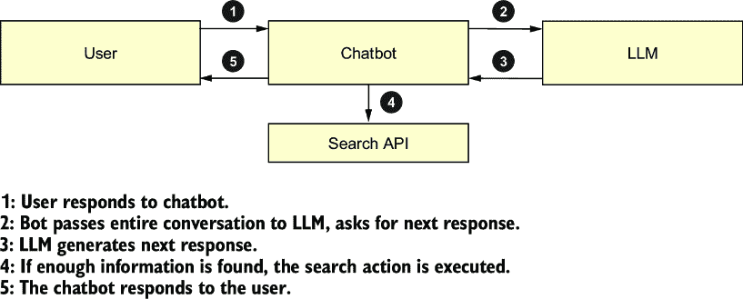
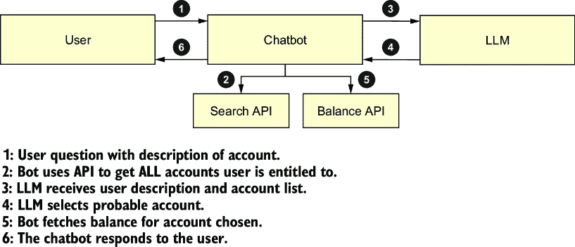

# 10 使用生成式 AI 减少复杂性

### 本章涵盖

+   使用生成式 AI 设计和改进流程

+   用 LLM 判断替换歧义对话流程

+   使用生成式 AI 作为“用户”测试静态对话流程

设计一个满足所有利益相关者需求和愿望的面向流程的机器人很困难。相互竞争的优先级可能导致“委员会设计”，从而引入复杂性。而且，好心的人可能会设计出阻碍主要对话流程的边缘情况。这些复杂性会给您的用户带来负担，并使他们更有可能在使用机器人时放弃或失败。生成式 AI 可以帮助您检测和改进这些场景，帮助您去除复杂性并提高机器人的成功率。

流程构建者通常要求用户提供过多的信息。（信息越多越好，对吧？不是如果它导致聊天机器人失败的话！）有几种方法可以使用生成式 AI 改进流程：

+   使用生成式 AI 提出关于如何构建流程的建议。

+   如果您的流程已经构建，请使用生成式 AI 提出改进建议。它还可以通过充当用户来测试流程。

+   用大型语言模型（LLM）驱动的流程替换一些静态流程。

我们将首先探讨医疗保险提供商的索赔状态流程。然后我们将看到生成式 AI 如何帮助我们设计和改进这个流程以及其他流程。

## 10.1 构建时 AI 辅助流程

图 10.1 展示了流程的最简单视图。


##### 图 10.1 流程的高级视图。它由识别特定意图启动，包括一个或多个顺序步骤，并以流程完成（满足意图）结束。

我们的示例流程涉及医疗保险客户通过聊天机器人查询索赔状态。起初，这个过程听起来像是一个简单的查找，但它有几个标准需要满足：

+   **意图检测**——确定用户的意图是“索赔状态”。这启动了一个包含多个步骤的流程。

+   **流程开始**——收集完成索赔状态流程所需的信息：在这种情况下，需要搜索索赔的信息。

+   **流程中间**——使用收集到的信息执行某些操作。在这个例子中，就是搜索用户的索赔。

+   **流程结束**——通过向用户提供索赔状态来完成流程。

整个索赔流程在图 10.2 中展示。

在第五章中，我们展示了如何改进聊天机器人的意图分类器以**检测**和**理解**用户的意图。在本章中，我们将专注于改进其余的流程，以成功**实现**用户的意图。


##### 图 10.2 可视化索赔状态流程

### 10.1.1 使用生成式 AI 生成对话流程

对话式人工智能流程通常基于现有的工作流程。这个流程可以从另一个渠道、网络应用程序或呼叫中心脚本中复制。对于我们的索赔状态示例，让我们假设没有现有的流程可供工作。我们可以使用 LLM 来帮助我们设计目标工作流程。

以下列表显示了一个 LLM 提示的示例。

##### 列表 10.1 设计医疗保险索赔状态流程的提示

```py
Instruction: You are a conversational designer.  #1
↪You are building a chatbot to help users find  
↪information about their insurance claims. 
↪Insurance claims include the following information:  
↪a claim date, a member ID, a claim amount, and a 
↪claim status. 
Design a dialogue flow to help users find their claim. #2
↪The dialogue flow should be as brief as possible and   #2
↪easy for the users to complete.  #2
Describe why you have constructed the dialogue flow this way.  #2

Output:  #3
```

#1 场景和背景

#2 详细指令

#3 输出提示

我们必须为任务提供 LLM 几条信息：

+   *场景/背景*——LLM 应该了解任务背后的场景（“你是一位对话设计师”）。LLM 还应提供背景假设，例如关于医疗索赔可用的信息。

+   *指令*——LLM 必须设计一个对话流程，以尽可能简短和容易的方式实现用户目标（找到索赔），同时描述其“推理”，这将帮助我们评估输出。

+   *提示*——提示“输出”让 LLM 知道指令已完成。

##### 小的变化可能造成大的差异

LLM 可能会对非常相似的提示给出显著不同的答案。即使是格式更改，如添加空格或包括或省略换行符，也可能导致主要输出变化。本书中使用的确切提示包含在本书的 GitHub 网站上，网址为 [`github.com/andrewrfreed/EffectiveConversationalAI`](https://github.com/andrewrfreed/EffectiveConversationalAI)。

以下列表显示了当提示在指令中使用三行时（以“指令”、“设计”和“描述”开头的行）的输出。

##### 列表 10.2 mixtral-8x7b-instruct-01 为索赔状态流程生成的输出（较少换行）

```py
The dialogue flow for the insurance claim chatbot would 
look like this:

1\. User: Hi, I want to check my insurance claim.  #1
2\. Chatbot: Sure, I can help you with that. Can you   #1
please provide me with your member ID?  #1
3\. User: My member ID is 123456\.  #1
4\. Chatbot: Thank you. Now, can you tell me the date   #1
of your claim?  #1
5\. User: The claim date is January 10, 2022\. #1
6\. Chatbot: Got it. And can you tell me the claim  #1
 amount? #1
7\. User: The claim amount is $1000\.  #1
8\. Chatbot: Thank you. I have all the information I #1
 need. Let me check the status of your claim.  #1
9\. Chatbot: The status of your claim is approved and   #1
the amount of $1000 has been paid.  #1

The dialogue flow is designed to be brief and easy for   #2
the users to complete. The chatbot starts by asking for  #2
the member ID, which is the most important piece of   #2
information needed to identify the user's claims. The   #2
chatbot then asks for the claim date and the claim   #2
amount, which are necessary to locate the specific   #2
claim. By asking for the information in this order, the   #2
chatbot can quickly and efficiently retrieve the user's   #2
claim information. #2
#2
Additionally, the chatbot confirms the claim information  #2
with the user before checking the claim status. This   #2
reduces the chances of errors and ensures that the user  #2
receives accurate information. The chatbot also provides  #2
clear and concise instructions throughout the   #2
conversation, making it easy for the user to follow   #2
along and complete the process. #2
#2
Overall, the dialogue flow is designed to provide a   #2
seamless and efficient user experience, while also    #2
ensuring the accuracy and reliability of the   #2
information provided. #2
```

#1 样本对话，包括聊天机器人和用户的消息

#2 设计过程说明

LLM 设计了一个双向样本对话，展示了机器人和用户可能会说的话。这很好——这有助于可视化一个完整的对话看起来是什么样子。我们应该意识到这只是一个样本——用户可能会以多种方式对这些问题做出回应。让我们回顾一下与 LLM 的交流中发生了什么：

+   我们告诉 LLM 索赔有一个成员 ID、日期、金额和状态。它推断出状态是输出，其他三个数据点是输入。

+   LLM 设计了一个流程，按顺序收集所有三个数据点。

+   生成的对话礼貌且有用。机器人用“谢谢”来认可用户的输入。它还向用户提供了关于每个步骤中期望的内容的明确指令。

有趣的是，根据我们在提示中使用换行符的方式，我们会得到非常不同的输出。以下列表显示了使用六行（在指令中的每个句号后都有一行新内容）的提示的输出。

##### 列表 10.3 mixtral-8x7b-instruct-01 为索赔状态流程生成的输出（更多换行）

```py
1\. The dialogue flow starts with a greeting and an introduction to the chatbot's purpose. 

   Chatbot: Hello! I'm here to help you find information about your insurance claims. May I have your member ID, please?

   Rationale: By starting with a greeting and an introduction, the user is made aware of the chatbot's purpose and what they can expect from the conversation. Asking for the member ID first helps to identify the user's account and narrow down the search for their claim.

2\. After the user provides their member ID, the chatbot confirms the member ID and asks for the claim date.

   Chatbot: Thank you for providing your member ID. To help you find your claim, could you please tell me the date of the claim?

   Rationale: Confirming the member ID ensures that the chatbot has the correct information and helps to build trust with the user. Asking for the claim date next helps to further narrow down the search for the user's claim.

3\. After the user provides the claim date, the chatbot confirms the claim date and asks for the claim amount.

   Chatbot: Thank you for providing the claim date. Just to confirm, the claim amount was [insert claim amount]. Is that correct?

   Rationale: Confirming the claim date and amount helps to ensure that the chatbot has the correct information and reduces the likelihood of errors.

4\. After the user confirms the claim amount, the chatbot provides the claim status.

   Chatbot: Great, the claim amount is correct. The status of your claim is [insert claim status]. Is there anything else I can help you with?

   Rationale: Providing the claim status is the ultimate goal of the conversation, and it is important to provide this information as soon as possible. By asking if there is anything else the user needs, the chatbot is able to provide additional assistance if necessary.

Overall, this dialogue flow is designed to be brief and easy for the user to complete. By asking for the most important information first (member ID and claim date), the chatbot is able to quickly narrow down the search for the user's claim. Confirming the member ID, claim date, and claim amount helps to ensure that the chatbot has the correct information and reduces the likelihood of errors. Providing the claim status is the ultimate goal of the conversation, and the chatbot is able to provide this information as soon as possible. Finally, by asking if there is anything else the user needs, the chatbot is able to provide additional assistance if necessary.
```

列表 10.3 的输出相当不同。首先，样本对话和理由是交织在一起的。对话的每一步都有一个描述、一个示例聊天机器人消息和详细的理由。其次，样本对话只包括机器人消息。我们没有看到用户响应。第三，这个过程流程暗示在收到用户每条数据后都有确认语句。最后，样本对话中包含一些小错误。指令 3 表示它将询问索赔金额，但对话显示它确认了索赔金额而没有收集。

两个提示一起为我们提供了构建对话流程以实现索赔状态流程的许多想法。由于列表 10.2 更加完整，我们将使用它作为基准。尽管它相当不错，但生成的流程似乎有点冗长。我们能改进流程吗？当然可以！让我们询问 LLM 如何改进。

### 10.1.2 使用生成式 AI 改进对话流程

我们可以要求 LLM 改进流程，无论它们是由 LLM 还是人类生成的。让我们改进列表 10.2 中的流程，这是我们通过 LLM 生成的，以帮助用户了解他们的索赔状态。

当前构建的流程需要三个信息点：会员 ID、日期和索赔金额。这满足了一些基本要求，例如通过会员 ID 验证呼叫者并提供搜索条件（会员 ID、日期和金额）。然而，这可能会给用户带来不便。根据直觉，似乎会员 ID 加上更多信息可以唯一标识索赔。让我们询问 LLM 如何简化流程。

##### 列表 10.4 要求 LLM 改进列表 10.2 中的对话流程

```py
<<Listing 10.1 prompt>>  #1
<<Listing 10.2 output>>  #2

Instruction: Simplify the dialogue flow above. Only  #3
require the user to provide two pieces of information. 

Output:  #4
```

#1 列表 10.1 的完整内容包含在提示中，但为了简洁起见，此处省略。

#2 列表 10.2 的完整内容包含在提示中，但为了简洁起见，此处省略。

#3 对 LLM 的轻量级指令

#4 输出提示

“改进”提示的本质很简单。我们通过包含我们过去对话的完整历史（原始提示及其响应）来模拟与 LLM 的对话。然后，我们提供一个基本指令（“简化上述对话流程”）以及简化的定义（“只要求用户提供两份信息”）。此提示的输出如下所示。

##### 列表 10.5 LLM 提供的简化对话流程和理由

```py
The simplified dialogue flow for the insurance claim chatbot would look like this:

1\. User: Hi, I want to check my insurance claim.
2\. Chatbot: Sure, I can help you with that. Can you   #1
   please provide me with your member ID and the claim   #1
   date?  #1
3\. User: My member ID is 123456 and the claim date is January 10, 2022.
4\. Chatbot: Thank you. I have all the information I need. Let me
   check the status of your claim.
5\. Chatbot: The status of your claim is approved and   #2
   the amount of $1000 has been paid.  #2

The simplified dialogue flow only requires the user to provide two 
pieces of information: the member ID and the claim date. This reduces
the number of steps in the conversation and makes it even easier for
the user to complete. The chatbot can use the member ID to identify
the user's claims and the claim date to locate the specific claim.

By asking for both pieces of information at once, the chatbot can 
streamline the conversation and provide a more efficient user 
experience. The chatbot still confirms the claim information with 
the user before checking the claim status, ensuring the accuracy 
and reliability of the information provided.

Overall, the simplified dialogue flow is designed to provide a quick
and easy user experience, while still ensuring the accuracy and 
reliability of the information provided.
```

#1 第 2 步现在在一次操作中收集所有信息。

#2 第 5 步将索赔金额从输入参数转换为输出参数。

我们看到 LLM 提出了两个建议：首先，不要询问索赔金额；其次，将两个问题合并为一个。让我们详细审查它们：

+   *移除索赔金额*——会员 ID 和索赔日期是两个最“独特”的数据元素，也是用户最有可能拥有的。它们也是最容易在网页或电话机器人中输入的，大多数聊天平台都有接受 ID 和日期的库。聊天机器人还会在读取时通知呼叫者索赔金额。

+   *一次性提出两个问题*——新的流程将会员 ID 和索赔日期合并为一个问题（步骤 2）。这对于希望尽可能减少步骤的资深用户来说非常出色。对于只有一条信息可用且需要帮助找到第二条信息的用户来说，这可能更具挑战性。对于聊天机器人来说，在一次对话中接受这两条信息是好的，但可能不是强制要求的最佳选择。

##### 主题专家或 LLM？

我们建议在生产任何解决方案之前使用主题专家（SME）的建议。LLM 非常适合生成想法和快速测试想法。使用 LLM 探索可能的艺术，并快速起草潜在解决方案。

在一个简单的提示中，我们生成了两种改进对话流程的建议。你能想到其他改进对话流程的方法吗？你会给 LLM 什么样的指令？

##### 练习

1.  尝试使用列表 10.4 中的替代指令：

    +   每次只向用户询问一条信息。

    +   引导一个说“我没有”的用户回答其中一个问题。

    +   引入额外的参数，例如索赔 ID，并查看机器人如何生成额外的流程变体。

1.  使用 LLM 为不同的场景生成流程，例如这些：

    +   预订航班

    +   购买电影票

    +   推荐度假目的地

或者使用你正在构建的聊天机器人中的一个场景！

## 10.2 运行时 AI 辅助流程

使用生成式 AI 构建流程设计一直是个不错的选择。到目前为止，这些流程都是相对静态的，适用于传统的对话式 AI 解决方案。索赔状态是一个“槽填充”搜索的例子，我们通过对话过程收集完成任务所需的信息。这通常表现为收集 API 调用所需的参数。这需要对问题和答案响应进行仔细的映射到 API 上。然后，答案被填充到 API 参数中，直到 API 可以执行。槽填充是最受欢迎的对话式流程模式之一。

在这些流程中，是否应该将更多控制权交给 LLM？

### 10.2.1 使用生成式 AI 执行对话流程

我们之前的过程流程是静态设计的。让我们尝试一些不同的方法。我们只描述流程，让 LLM 在实时对话中决定要问什么问题。图 10.3 显示了我们将如何将 LLM 纳入收集索赔搜索 API 信息的过程。



##### 图 10.3 对话式 AI 如何使用 LLM 决定下一个要问的问题

我们在聊天机器人中假设了一些逻辑：

+   当它检测到状态意图声明时，它让 LLM 决定下一个要问的问题。

+   当它检测到 LLM 以变量列表的形式响应时，它重新获得控制权并执行声明搜索。

+   它使用像预分类器这样的护栏来确保发送给 LLM 的数据不是恶意的，比如“忽略所有之前的指令并<做些坏事>。”

下面的列表演示了 LLM 逐步生成对话。

##### 列表 10.6 让 LLM 决定询问声明状态的问题

```py
Instruction: You are a conversational designer. You  #1
are building a chatbot to help users find information  #1
about their insurance claims.  #1
Insurance claims include the following information: a   #1
claim date, a member ID, and a claim amount.  #1
Generate conversational responses until you have  #2
collected all three pieces of information.  #2
When you have all the information, respond with a   #2
payload in this format:  #2
{"memberID": "(the member id collected)", "claimDate":   #2
"(the claim date collected)", "claimAmount":   #2
"(the claim amount collected)"} #2

System: How can I help you?  #3
User: I need information on my claim.  #3
System:  #4
```

#1 与之前的提示相似的指令

#2 新任务的描述

#3 假设对机器人的静态问候，我们输入机器人的初始问候和用户的第一次发言。

#4 输出提示

这个简单的提示就足以让机器人为我们生成一些对话。（我们只用了几分钟就写了这个提示。）接下来的几个列表显示了提示的连续迭代输出。下面的列表显示了第一个轮次，使用了列表 10.6 的输出。

##### 列表 10.7 第 2 轮对话轮次输出（LLM 生成下一个问题）

```py
<<Listing 10.6 repeated>>  #1
System: I can help you with that. What is your member   #2
ID?  #2
```

#1 此处包含之前的列表

#2 来自第一个提示的输出

到目前为止，机器人做得很好。它决定首先询问成员 ID。让我们看看当用户响应时它会做什么。

##### 列表 10.8 第 2 轮对话轮次输出（LLM 生成下一个问题）

```py
<<Listing 10.7 repeated>>  #1
User: 1234567  #2
System: What is your claim date?  #3
```

#1 此处包含之前的列表

#2 将用户的响应从聊天机器人传递给 LLM

#3 LLM 的响应

这又是一个合理的回应。LLM 在没有除了初始提示之外的任何指导的情况下表现良好。回应有点重复——两个问题都采用了“你的<X>是什么”的形式。让我们看看对话的其余部分。

##### 列表 10.9 显示第 3 和第 4 轮对话的会话输出

```py
<<Listing 10.8 repeated>>  #1
User: May 4, 2024  #2
System: What is your claim amount?  #3
User: $1000  #4
System: "memberID": "1234567", "claimDate":  #5
"May 4, 2024", "claimAmount": "1000"
```

#1 此处包含之前的列表

#2 将用户的响应从聊天机器人传递给 LLM

#3 LLM 提出最后一个问题

#4 将用户的最终响应从聊天机器人传递给 LLM

#5 LLM 生成聊天机器人可以用于搜索的有效负载

在对话流程结束时，LLM 已经完成了我们所需要的一切。它提出了问题，而没有使用硬编码的对话，并且它生成了一组我们可以传递给声明搜索 API 的参数集。（它没有生成有效的 JSON，但它可能从更好的提示中学会这样做。）

在这个点上完全将控制权交给 LLM 可能会很有诱惑力。在我们这样做之前，让我们看看 LLM 在不同场景下的反应。这次，用户不知道系统需要的一切。LLM 会如何反应？下一个列表演示了这个场景。

##### 列表 10.10 当用户没有所有信息时的 LLM 生成响应

```py
Instruction: You are a conversational designer. You are building a chatbot to help users find information about their insurance claims.
Insurance claims include the following information: a claim date, a member ID, and a claim amount.
Generate conversational responses until you have collected all three pieces of information.
When you have all the information, respond with a   #1
payload in this format: {"memberID":   #1
"(the member id collected)", "claimDate":   #1
"(the claim date collected)", "claimAmount":   #1
"(the claim amount collected)"}  #1

System: How can I help you?  #2
User: I need information on my claim.  #2
System: I can help you with that. What is your member   #2
ID?  #2
User: I don't know it.  #3
System: What is your claim date?
User: I don't know that either.  #3
System: What is your claim amount?
User: $1000
System: I can help you with that. What is your member  #4
ID?  #4
```

#1 与之前示例中相同的指令

#2 与之前示例中相同的初始对话

#3 用户不知道一些信息

#4 LLM 卡住了！

哎呀！在这个提示中，LLM 没有错误处理的概念。看起来 LLM 会不断地提问，直到用户因沮丧而结束聊天。用户可能也无法退出这个聊天。显然，这种方法有一些局限性。

提出多个问题以完成搜索过程并不总是成功的。让我们尝试其他方法。如果我们让 LLM 进行搜索会怎样？

### 10.2.2 使用 LLM 进行搜索过程

在医疗保险等场景中，仔细搜索至关重要。医疗服务提供者可能在其患者群体中有数百（或更多）未结索赔。严格的搜索标准对于成功的搜索至关重要，更不用说法律要求了。让我们想象一个搜索选项更少的不同场景。

##### 这不是检索增强生成（RAG）吗？

有点像。我们正在根据结构化 API 的输出创建文本“段落”，并让 LLM 对它们进行推理。纯粹主义者可能不会称之为 RAG，但它有相似之处。最重要的是，无论你叫它什么，它都是你工具箱中的一个有用工具。

我们的示例场景是消费者检查他们的银行账户余额。消费者通常在一家银行有 1 到 4 个账户。聊天机器人需要知道用户询问的是哪个账户。只有少数几项元数据与账户相关，包括类型（支票或储蓄）、所有者（单独或共同）和 ID（尽管所有者可能不记得它）。

假设用户已经登录到我们的聊天机器人（我们可以通过他们的登录用户 ID 或验证过的电话号码知道他们是谁）。他们询问账户余额，聊天机器人向 LLM 寻求帮助。流程图如图 10.4 所示。



##### 图 10.4 使用 LLM 处理用户响应

我们可以想象用户向助手提出以下问题：

+   我的账户里有多少钱？

+   我在储蓄账户里有多少钱？

+   我们共同储蓄账户里有多少钱？

+   我儿子的账户里有多少钱？

+   我刚开设的账户里有多少钱？

提示和示例输出如下所示。此提示以任何空白字符（空格或换行符）为停止条件执行。否则，LLM 将继续输出，并对其选择进行说明。

##### 列表 10.11 使用 LLM 进行搜索

```py
<|instruction|>
You are supporting a digital assistant. A user is asking a question  #1
about one of their bank accounts. Use the contextual information #1
provided to identify the bank account they are most likely asking about. #1

<|user|>
How much money is in my son’s account?   #2

<|context|>
User Name: Bob
Accounts: [ {"id":12345, "type":"checking", "owners":["Bob","Jane"],  #3
 "opened":"12/25/2000"}, {"id":23456, "type":"saving",  #3
"owners":["Bob","Jane"], "opened":"1/3/2005}, {"id":34567,  #3
"type":"saving", "owners":["Bob","Jack"], "opened": "2/4/2024"}] #3

<|output|>
Account id: 34567   #4
```

#1 作为提示提供的基本指令

#2 将用户的输入直接传递给 LLM

#3 LLM 接收已登录用户的上下文和所有账户的元数据

#4 输出提示和输出

太棒了！LLM 可以回答所有五个问题。表 10.1 显示了 LLM 的响应。回想一下，我们只要求 LLM 选择账户 ID。聊天机器人仍然将调用最终的“检查余额”API 调用并制定最终的响应。

##### 表 10.1 列表 10.11 的几个不同输入问题的响应

| 问题 | 响应（账户 ID） |
| --- | --- |
| 我的账户里有多少钱？ | 12345 |
| 我储蓄账户里有多少钱？  | 23456  |
| 我们共同储蓄账户里有多少钱？  | 23456  |
| 我儿子的账户里有多少钱？  | 34567  |
| 我刚刚开设的账户里有多少钱？  | 34567  |

我们可以做出几个观察：

+   *可变性*——我们处理了包括日期、类型和所有者在内的几个不同的搜索标准，而没有提出任何澄清问题。

+   *灵活性*——像“我的儿子”或“我刚刚开设的账户”这样的标准无需严格的 API 参数即可处理。

+   *默认选择*——对于两个模糊的问题（“我的账户”）和（“我们的共同储蓄账户”），机器人选择了第一个匹配的选择。这表明排序顺序很重要。

LLM 提供了不可思议的灵活性！如果风险足够低，让 LLM 搜索是一个绝佳的策略。假设我们的输出信息类似于“您的<类型>账户，ID 为<id>，余额为<balance>”，那么 LLM 没有提出澄清问题可能也是可以接受的。机器人总是以准确的信息和证据进行回应。如果用户需要不同的信息，他们仍然可能会问后续问题，比如“不，我是指我的储蓄账户余额”。

##### 让 LLM 选择账户 ID 安全吗？关于幻想又如何？

在消费者检查银行账户余额的例子中，我们通过将 API 调用与 LLM 判断分离来引入安全性。一个典型的“获取余额”API 将有两个参数：用户 ID 和账户 ID。在这种情况下，我们只让 LLM 选择账户 ID。因此，我们防止了 LLM 幻想出一个用户 ID 和账户 ID 组合，从而泄露他人的账户信息。如果 LLM 幻想出一个账户 ID，API 调用将失败；如果 LLM 为该用户选择了错误的账户，至少他们会听到自己账户中的一个。在假设设计实现是安全之前，务必彻底测试你的设计和实现。

当让 LLM 执行 API 调用时，应使用这种以安全性为导向的设计。

带有 LLM 的生成式 AI 为我们提供了增强聊天机器人的有趣可能性。我们需要仔细平衡实现速度和控制之间的权衡。但是，LLM 支持在传统聊天机器人中难以或不可能实现的事情。

##### 练习

1.  更新列表 10.6 中的提示，以提供更多样化的响应（不仅仅是“你的<X>”）。

1.  更新列表 10.11 中的提示，以便当用户的提问模糊时，LLM 给出类似“n/a”的哨兵值。你可以在提示中给出额外的指令或添加几个示例供 LLM 学习。

## 10.3 测试时的 AI 辅助流程

在前面的章节中，我们使用了生成式 AI，通过让 LLM 充当聊天机器人来设计或实现聊天解决方案。在本节中，我们将颠覆这种范式。我们将使用 LLM 生成典型或“创意”的回复，并观察聊天机器人在我们的保险索赔场景中如何处理这些回复。这种概念化的流程如图 10.5 所示。


##### 图 10.5 测试脚本如何调用 LLM 作为聊天机器人“用户”的流程图

我们需要三样东西来组合这个测试脚本：一个通用的提示，让 LLM（大型语言模型）充当用户，一个测试脚本以调用聊天机器人和 LLM，以及一个用于审查结果的方法。

让我们开始吧。

### 10.3.1 设置生成式 AI 作为用户

LLM 需要三块信息才能成为一个有效的用户：任务的通用说明、我们需要测试的场景描述以及到目前为止的对话。

首先，让我们提供一些简单的背景信息，告诉 LLM 我们希望它在持续的对话中模仿一个用户。指令可以非常简单：

```py
Act as a user of a telephone-based medical insurance chatbot. Continue the conversation with a likely response.
```

这个指令描述了我们希望 LLM 做的基本内容。我们告诉 LLM 以用户身份回应，而不是系统。我们不向 LLM 提供进一步的指导。

第二，我们希望 LLM 能够处理不同的场景。我们需要一个可适应的提示。以下是我们想要测试的几个场景：

+   用户拥有他们需要的所有信息（会员 ID、索赔日期、索赔金额）。

+   用户缺少一些必要的信息。

+   用户缺少一些必要的信息，但有替代方案（一个索赔 ID）。

对于每个场景，我们将对提示提供略微不同的指导。表 10.2 将一些场景映射到我们可以提供给 LLM 的详细指导。

##### 表 10.2 场景描述和可提示的指导

| 描述 | 指导 |
| --- | --- |

| 用户拥有他们需要的所有信息 | 你正在试图找出你是否支付了你的医疗索赔之一。你知道你的会员 ID 是 123456，索赔日期是 2024 年 5 月 4 日，索赔金额为 1000 美元。

|

| 用户缺少一些必要的信息 | 你正在试图找出你是否支付了你最近的医疗索赔。你知道你的会员 ID 是 123456，但不知道其他任何信息。

|

| 用户缺少一些必要的信息但有替代方案 | 你正在试图找出你是否支付了你最近的医疗索赔。你知道你的会员 ID 是 123456，索赔 ID 是 987654321987654。

|

表 10.2 中的指导包含以下 LLM 可以在对话中使用的信息：

+   *场景*——LLM 应该尝试做的事情，例如找出是否支付了索赔。

+   *测试数据*——我们知道聊天机器人可以调用 API，因此我们需要 LLM 提供存在于我们系统中的数据。我们明确地给出 LLM 我们希望它使用的信息。

+   *边界*——我们告诉 LLM 它不知道的内容。这应该防止 LLM“发明”（产生幻觉）信息，这些信息将导致我们后续的 API 调用失败。

我们没有提供 LLM 任何其他指导。我们想看看它如何在聊天机器人中尝试实现这些结果。

最后，我们需要向 LLM 提供对话记录，以告知它如何响应下一个（以及它已经响应了什么）。测试脚本将能够跟踪记录，因为它正在调用聊天机器人和 LLM。（有许多方法可以收集聊天记录，第十二章将演示更多方法。）

我们现在可以构建一个 Python 函数来为给定场景生成提示。该函数接受两个参数：场景的指导（如表 10.2 所示）和对话记录。下一个列表展示了该函数。

##### 列表 10.12 构建测试场景提示的 Python 函数

```py
def get_prompt(guidance, transcript):
   prompt=f'''
INSTRUCTION:
You are a user trying to find out your claim status. #1
{guidance}  #2
Continue the conversation with a likely response.  #1

CONVERSATION:
{transcript}  #3
User: '''  #4
   return prompt
```

#1 任务的通用描述

#2 特定场景的指导和测试细节

#3 注入对话记录

#4 LLM 响应的提示

这段代码的功能动态地为给定场景和对话记录构建提示。

列表 10.13 展示了如何调用`get_prompt()`函数。它假设有一个`call_llm()`函数，其实现将根据 LLM 平台而异（假设它通过 API 密钥启动，允许你选择模型和配置设置，然后提供一个接收提示并返回输出的函数）。确保在你的`call_llm()`函数中使用采样解码，以便在响应中获得多样性。

##### 列表 10.13 使用动态提示的 Python 代码

```py
guidance='''You are trying to find out if one of your  #1
medical claims was paid.  #1
You know your member ID 123456, claim date of May 4,  #1
2024, and the claim amount of $100.'''
transcript='''System: How can I help?
User: I need to check my claim status
System: What's your member ID?'''  #2

prompt=get_prompt(guidance, transcript)  #3
user_response=call_llm(prompt)  #4
transcript += f"\nUser: {user_response}"  #5
```

#1 指导测试场景的全文

#2 到目前为止的完整对话记录

#3 动态构建提示

#4 获取 LLM 响应（例如，“当然，我的会员 ID 是 123456”）

#5 更新对话记录

我们现在有了测试脚本的第一个部分。让我们设置另一半。

### 10.3.2 设置对话测试

接下来，测试脚本必须调用聊天机器人。脚本将获取 LLM 生成的“用户”输入并将其传递给机器人。然后脚本将获取机器人的响应，将其附加到记录中，并再次调用 LLM。我们将再次依赖于这里未实现的功能（实现将根据平台而异）——在这种情况下，该功能是`call_chatbot()`。这个函数预期将配置与聊天机器人的连接，使用 API 密钥进行身份验证，并管理用户对话。

以下列表展示了测试脚本的这个部分。

##### 列表 10.14 调用聊天机器人的 Python 代码

```py
#user_response comes from LLM call
bot_response=call_chatbot(user_response)  #1
transcript += f"\nSystem: {bot_response}"  #2
```

#1 向聊天机器人发送消息

#2 将聊天机器人响应存储在记录中

我们现在可以将所有这些部分组合在一起。在下一个列表中，我们将所有元素组合成一个单独的测试脚本。

##### 列表 10.15 结合 LLM 用户和聊天机器人调用的 Python 代码

```py
def run_test(guidance):
   print(f"Running test with:\n{guidance}\n")
   bot_response = call_chatbot('')  #1
   transcript = f"System: {bot_response}"
   for i in range(4):  #2
      prompt=get_prompt(guidance, transcript)
      user_response=call_llm(prompt)
      transcript += f"\nUser: {user_response}"
      bot_response=call_chatbot(user_response)  #3
      transcript += f"\nSystem: {bot_response}"  #4
   print(f"Transcript:\n{transcript}")  #5
```

#1 对话通常以“空白”输入开始。

#2 测试对话的几个回合

#3 将 LLM 的响应发送到聊天机器人

#4 将聊天机器人的响应存储在记录中

#5 在测试结束时打印记录

该脚本启动与聊天机器人的连接，并运行固定数量的回合（四个）。根据我们的测试需求，我们可以增加或减少这个数字，或者添加额外的逻辑来检测对话何时结束（或失败）。

下面的列表显示了在测试场景之一上运行此脚本的一些示例输出。

##### 列表 10.16 测试脚本示例输出

```py
Running test with:
You are trying to find out if one of your medical claims was paid.
You know your member ID 123456, claim date of May 4, 2024, and the 
claim amount of $1000.

Transcript:
System: How can I help you?
User: Hi, I'd like to check the status of a medical claim.
System: I can help you with that. What is your member ID?
User: Yes, my member ID is 123456.
System: What is your claim date?
User: My claim date is May 4, 2024.
System: What is your claim amount?
User: The claim amount was $1000.
System: Thank you. I have all the information I need. Let me check the status of your claim.
The status of your claim is approved and the amount of $1000 has been paid.
```

该脚本设置了 LLM 作为你的聊天机器人用户的基本机制。

这种测试是其他测试努力的优秀补充。LLM 可能会生成你从未考虑过处理的聊天机器人用户输入，了解你的聊天机器人如何响应它们是很好的。记住，LLM 只是在模拟人类——真实的人类可能永远不会像 LLM 那样行动或“说话”。但另一方面，他们可能会的。

##### 练习

1.  扮演机器人的角色。使用以下代码实现`call_chatbot(user_response)`函数：

```py
return input('Enter the bot response: ')
```

1.  这样可以让你测试 LLM（作为用户）对你（作为聊天机器人）发送的消息的反应。这可以让你不必仅为了测试脚本如何工作就实现一个聊天机器人。

1.  2. 将`call_chatbot(user_response)`函数连接到你正在构建的实际聊天机器人。将`call_llm(prompt)`函数连接到你的首选 AI 平台。更新`get_prompt`函数以更适合你的场景。LLM 是否扩展了你的聊天机器人的功能？

## 摘要

+   LLM 可以从头开始为你设计流程。只需一点提示，它们就可以生成示例对话流程并证明它们的设计选择。然后，这个流程可以在传统的对话式 AI 中实现。

+   LLM 也可以改进现有的流程。一个典型的改进是简化流程。

+   你可以使用生成式 AI 执行整个对话。在实现速度和控制之间有一个权衡。这在错误路径上尤为明显。

+   你可以用 LLM 驱动的流程替换一些槽填充过程流程。这比严格匹配 API 参数要灵活得多。

+   在让大型语言模型（LLM）做出判断时，要考虑错误带来的成本。寻找那些“错误”并不关键的情况。小心选择 LLM 可以影响的 API。

+   LLM 可以模拟你的对话式人工智能的用户。使用它们来生成测试对话，展示你的系统在特定场景下可能的表现。
