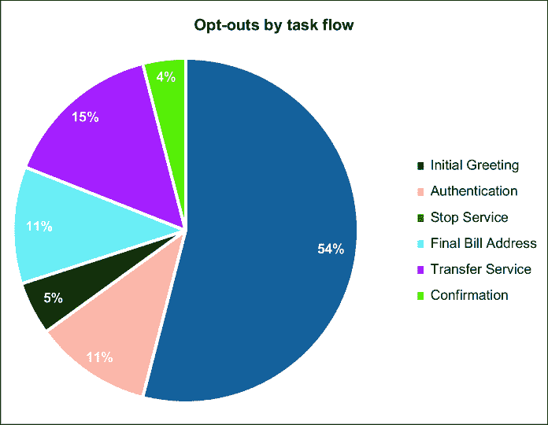
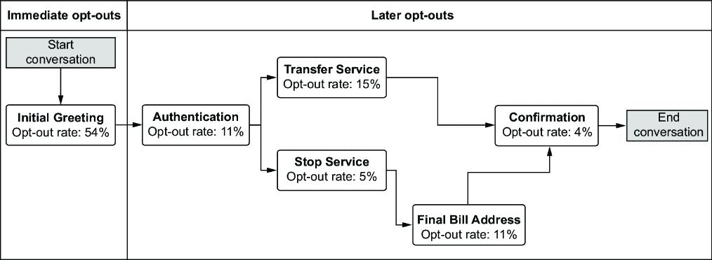
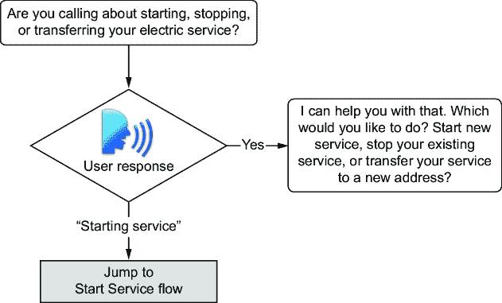
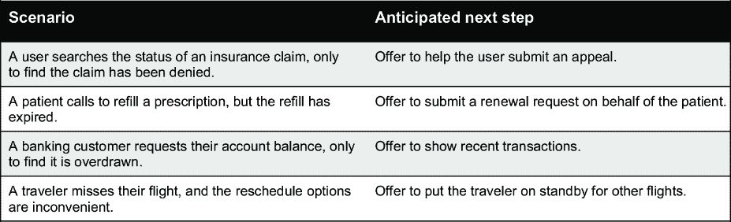
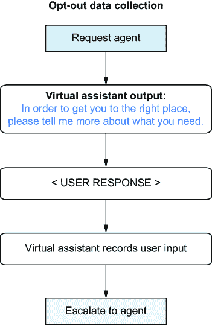

# 11 减少退出

### 本章涵盖

+   识别用户希望人工代理的原因

+   如何防止用户立即想要退出

+   如何保持用户对你的对话人工智能的参与度

+   使用生成式人工智能创建更友好的对话消息

+   决定何时涉及人工代理（以及何时不涉及）

“退出”一词指的是用户试图退出虚拟代理体验，通常是为了联系人工代理。你也可能看到这被描述为*升级*或*归零*（在电话拨号盘上按零以获取运营商）。退出可能会造成成本。聊天机器人是一项投资，它们必须证明在商业价值上的回报，才能保持其可行性。由于退出过多导致的控制损失可能会使业务案例失败。

用户可能会出于各种原因选择退出，通常需要不同的策略和方法来解决。无论你管理的是哪种类型的机器人，无论是语音、文本、FAQ、面向流程的，甚至是路由代理，确定用户在对话中何时退出，都可以为你提供他们为何这样做的原因线索。了解用户为何退出将帮助你设计一种最小化退出的体验，这应该会提高你的控制率。

在本章中，我们将探讨一些因用户退出而遭受控制损失的对话人工智能解决方案，并讨论每个挑战是如何解决的。不同的用例可能需要不同的解决方案，这取决于组织的优先级、资源和限制，但有一些常见的模式和原则可以提高你的对话人工智能的价值，并使用户更有可能继续使用它。

## 11.1 什么驱动了退出行为？

一些用户遇到虚拟代理后，他们首先要求与人工代理交谈——甚至不尝试与对话人工智能互动。我们称之为*立即退出*。有时，用户最初会同意（选择*加入*）虚拟代理体验，但在对话的后期尝试退出。他们的理由通常与最初的退出驱动因素大不相同，这通常表明整体对话设计或流程中的某个特定步骤存在问题。理解不足也可能是根本原因。

### 11.1.1 立即退出的驱动因素

由于其本质，立即退出提供了非常有限的信息关于用户的原因。收集这方面的数据很困难，但可以通过调查或跟进代理升级（一个非常手动、耗时的工作）来获得。我们的研究揭示了导致这种行为的一些不同驱动因素，它们并不是相互排斥的。

#### 前期对 IVR、聊天机器人或虚拟代理的糟糕体验

交互式语音响应（IVR）允许用户通过电话键盘或简单的语音命令与计算机交互。早期的 IVR 系统在 20 世纪 70 年代就已经存在，但在 21 世纪初，它们变得更容易部署，并且自那时起在现代世界中无处不在。你很难找到一个没有被公司问候语烦扰的人，这些问候语花了三十秒来告诉你如何使用他们的电话菜单。更糟糕的是，警告说“*非常重要，要听清所有选项”（因为他们的菜单可能已经改变）！

聊天机器人也与我们相伴已久，尽管成功让它们执行有功能性的任务是相对较近的事情，而且它们仍在向真正的虚拟助手发展。

用户可能无法区分 IVR、简单的聊天机器人或强大的虚拟助手。坦白说，他们并不在乎。先前的负面体验将使许多人反对自动化系统。甚至有一些互联网角落专门提供人们发现的“黑客”方法，以绕过自动化系统并直接连接到公司的真人代理队列。

#### 用户认为他们的问题对机器来说太复杂

有时用户认为他们的情况非常独特或复杂，超出了自动化系统的能力。有时他们是对的；有时他们不是。对复杂性和独特性的判断是相对的，个人可能不知道有成千上万的人经历过类似的问题。这可能与以往的经验有关，但并不总是如此。

这些用户选择退出，因为他们认为无论如何他们最终都需要一个代理人。他们认为自动化系统是浪费时间，会延长或阻碍他们解决问题的道路。

#### 倾向于人际互动

与其他人建立联系对我们这个物种的生存至关重要，因此有些人更愿意与真人打交道。他们的需求可能与解决方案的能力无关，可能包括孤独感、敏感或尴尬的话题、对机器和自动化系统的不信任、语言或可访问性障碍等。这正日益成为一种代际现象。老年用户更有可能选择退出，因为他们可能觉得与机器互动很困难，而数字原住民通常更容易导航自动化系统。无论年龄如何，你可能会始终有一些用户更喜欢人际互动。

### 11.1.2 后续退出的动机

在最初与虚拟助手互动后选择退出的用户通常是因为他们在特定的互动中遇到了困难。这些情况通常可以追溯到对话流程中的特定任务、动作或步骤，这使得识别根本原因变得稍微容易一些。

#### 机器人无法理解用户的需求

当机器人不理解用户的请求时，用户可能会选择退出。这通常发生在对话的早期，但也可以在任何时候发生。

在将用户升级之前，允许一定数量的重试尝试是标准做法。平均值为三次，但你的用例可能有一个更高的或更低的阈值。这种做法是控制的关键工具，但用户对机器错误的容忍度可能低于人类，并且更少宽容。用户在被要求重复一次或两次后可能会选择退出，觉得机器人无法理解。

#### 用户不理解机器人提出的问题

机器人提出的问题措辞不当可能会让用户感到困惑。用户可能不清楚机器人期望的响应类型或期望的格式。用户可能会要求机器人重复，但如果提出的是同样的问题，用户可能会仍然感到困惑。这会导致用户感到卡住，他们可能会要求一个真人来帮助他们摆脱困境。

#### 用户没有或不知道所需的信息

如果要求用户提供他们没有的信息，他们可能会说“我不知道”或“我没有那个”，或者他们可能会简单地要求一个客服代表。如果任务流程无法在没有某些信息的情况下继续进行，且没有提供替代方案，用户就会知道他们没有客服代表的介入就无法达到目标。

#### 用户感觉他们没有进展

如果用户觉得对话陷入循环、在菜单间跳转或已达到死胡同，他们可能会选择退出。这可能是因为你的对话逻辑中存在实际错误，或者是因为对话设计未能表明用户目标进展的情况。无论如何，他们都会感到沮丧，并寻找退出方式。

#### 用户不喜欢答案或结果，或者他们对结果有不同期望

你的机器人可能提供技术上正确的响应，但仍然让用户不满意。他们可能会要求一个客服代表，希望达到不同的结果。他们也可能觉得信息不足，如果体验看起来没有提供后续跟进或额外请求的机会，他们可能会要求一个客服代表。

### 11.1.3 收集退出行为数据

为了确定你的解决方案是否因为退出而失去控制，你必须收集数据。一些对话平台提供了在对话期间报告所调用操作或任务的能力。它们也可能提供有关交互是否成功结束的数据。

有时，现成的分析工具不足以提供可操作的指标。在这些情况下，你可以在流程的关键点使用上下文变量来配置你的对话。良好的对话流程配置可以帮助你识别和优先考虑改进的区域。（你可能需要一个数据仓库和企业的或定制的报告工具来跟踪这些数据随时间的变化。）

对于一个复杂的任务导向型解决方案，你可能使用面包屑来标记主要流程和子流程的开始或完成。图 11.1 显示了请求代理发生的主要对话任务流程中分组退出的示例。

如果你的对话被配置为跟踪退出发生的确切步骤，你可以寻找趋势以帮助你揭示根本原因，如图 11.2 所示。

你可能会用这些信息做的第一件事，特别是对于像我们示例中的流程导向型机器人，是确定哪些任务流程被视为即时退出。一个简单的问答机器人可能只有初始问候。之后的所有内容都会被归类为“其他”退出。



##### 图 11.1 按当前任务流程分解退出请求显示，即时退出（在初始问候任务流程中请求代理）比在这个自助、流程导向型机器人的对话旅程的任何其他部分都更频繁地发生。


##### 图 11.2 按步骤分解退出发生情况有助于根本原因分析。在此图表中，即时退出在左侧突出显示，但趋势表明，在多个下游流程中收集地址详情可能也存在问题。

在我们的以流程为导向的机器人示例中，在初始问候任务流程中请求代理被视为即时退出——用户不愿意参与。所有其他退出都与对话中的某些其他任务流程相关联。图 11.3 显示了我们的示例机器人的退出请求，根据任务在完整对话流程中的位置。



##### 图 11.3 高级流程图显示了用户在退出之前在过程中的深入程度。这些信息可以帮助进行根本原因调查。

本章的其余部分将专注于解决退出问题的策略，包括旨在减少初始退出、后续退出以及保持用户在渠道中的策略（退出保留）。

##### 练习

反思一下你关于用户为何退出虚拟助手所学到的东西：

1.  你有能力区分即时退出和后续退出吗？

1.  你能否识别出对话流程中退出发生的模式？

## 11.2 减少即时退出

你可能听说过这样的话，“你永远没有第二次机会去留下第一印象。”立即退订是用户不满意的标志。你只有很短的时间来说服用户他们已经到达了正确的位置，并且你的虚拟助手是胜任的、有能力的和高效的。本节提供了减少用户立即要求代理的可能性。

在你的对话流程中，构成“立即退订”与“其他退订”之间的界限不是任意的，但它是灵活的。它可能发生在第一步或前几步。这种区分旨在确定对话流程中的某个点，用户有权利同意加入或尝试退订。对于一个 FAQ 风格的机器人，在非常第一次发言中请求代理将被视为“立即退订”，而之后的一切都将被视为“其他退订”。

以下三种策略将对减少立即退订产生最大的影响。

### 11.2.1 从良好的体验开始：问候和介绍

什么让用户对自动化交互感到满意？通用的客户服务原则适用：用户应该感觉到他们已经到达了正确的位置，他们处于良好的手中，并且他们的时间是宝贵的。

本章中我们讨论的第一个立即退订驱动因素是用户对 IVR、聊天机器人或虚拟代理的先前不良体验。你的机器人的问候或介绍将为对话体验定下基调。这是你赢得用户信任的机会——说服他们，你的虚拟代理在帮助用户达到目标方面可以像人类代理一样有效和高效。

在第一章中，我们预告了一个重大的改进，该改进解决了用户“立即退订”的挑战。我们与一家地区公用事业公司的虚拟助手合作，该助手有超过一半的呼叫者立即退订。助手是更大 IVR（语音）系统（主要客户服务线路）的扩展。这个试点项目旨在处理两项自助任务：停止公用事业服务或将服务转移到新地址。

假设是每个人到达我们的虚拟助手都是为了做以下两件事之一（停止或转移他们的公用事业服务），这是基于将呼叫者引导到我们解决方案的 IVR 菜单选择。用户及其菜单选择的信息被传递给虚拟助手，虚拟助手立即启动相应的用例流程。以下列表显示了用户的经验，首先是 IVR，然后是转移到虚拟助手。

##### 列表 11.1 从 IVR 到虚拟助手的移交

```py
IVR: Thank you for calling ABC Energy. If this is an emergency, choose one of the following: say gas emergency or press 1\. Electric emergency or press 2\. Power outage, or press 3\. If this is not an emergency, say do something else or press 4.

USER: <selects option 4>

IVR: Main menu. For billing and account information, press 1\. Payments, press 2\. Start, stop, or reconnect, press 3.

USER: < selects option 3>

IVR: Which are you calling about? Say building a new home or press 1\. Start, stop, or move service or press 2\. Reconnect or press 3\. Streetlights or press 4\. None of the above or press 5.

USER: < selects option 2>

IVR: Select one of the following. Check an existing request or press 1\. Start new service or press 2\. Stop existing service or press 3\. Move my service or press 4.

USER: < selects option 3>

<Customer transfers over to virtual agent solution, which has a different voice.>

VIRTUAL ASSISTANT: We can help you with stopping your service. First, we need to get some information about your current address. Which type of account are you calling about: residential or commercial?

USER: Speak to an agent.
```

在早期的生产日志中，我们注意到大量用户选择退出，通常是在一开始。尽管我们的公用事业公司虚拟代理试点在技术上非常出色，但许多呼叫者不会给它一个机会。我们听了通话录音，发现整体用户体验感觉支离破碎。客户拨打一个号码，到达一个 IVR（具有特定的 IVR“声音”），并导航到与服务相关主题的菜单。如果呼叫者选择停止或转移他们的服务，他们会被路由到我们的虚拟代理，但过渡是突然的——一个不同的声音绕过问候呼叫者（最初的理由是呼叫者已经被 IVR 问候过）并直接进入任务，似乎具有最优效率。

当一些呼叫者到达虚拟助手时，我们能够听到他们在最初沉默中的困惑。他们有长时间的犹豫、可听到的叹息或结巴（“uh…”，“um…”，“hmm”）。他们还没有被介绍给这个新代理。他们对第一个问题感到困惑，这个问题在程序上很合适，但在对话中显得非个性化且笨拙。人类代理不会以这种方式开始对话。他们会用欢迎的语气介绍自己。如果 IVR 收集了关于呼叫者目标的信息，人类代理会在继续之前与用户确认这一点（“我看到您打电话是为了转移您的公用事业服务，这是正确的吗？”）。

我们从第一行开始重新设计了体验，从情境意识的问候和介绍开始。虚拟代理被赋予了角色和更对话式的语气，如下面的列表所示。

##### 列表 11.2 更新的虚拟助手问候和介绍

```py
VIRTUAL ASSISTANT: Good afternoon.  #1
I'm Alice. ABC Energy's virtual agent. #2
```

#1 情境意识问候

#2 虚拟代理介绍

以问候和介绍开始互动，使我们的虚拟助手与菜单驱动的 IVR 系统区分开来。这给了呼叫者时间来适应过渡到新声音和不同风格的互动。

一个具有情境意识的问候，比如承认一天中的时间或通过名字问候用户，可以将机器人般的、非个性化的交流转变为更加温馨和欢迎的体验。在某些使用场景中，名字或角色可能并不合适，但在这个例子中，它传达了一种所有权和责任感。“Alice”在这里是为了服务客户。

### 11.2.2 传达能力和设定期望

在我们立即退出的驱动因素中，我们确定了那些因为感觉他们的问题是太独特或复杂而无法由机器解决的用户。有时这是一种公正的判断，但有时则不然。

在一开始就设定期望至关重要。公司推出具有有限范围或能力的试点虚拟助手并不罕见。当您的解决方案只提供用户可能想要的一小部分主题或任务时，您需要提前沟通这一点。这样做，用户要么会确信他们处于正确的位置，要么会意识到他们不在。在这些场景中，问候语（或解决方案的入口点）是宣布聊天机器人的目的和能力（或在与用户推进之前获得快速确认）的好时机。

我们的公用事业公司虚拟代理问候语扩展到确认用户的目标（使用表示他们 IVR 选择的上下文）。我们包括了用户即将开始的旅程的简要预览。因为这是一个语音渠道——更容易出现意外断开连接，所以我们也为成功完成设定了一些期望。以下列表显示了额外的措辞。

##### 列表 11.3 更新后的问候语，传达能力和设定期望

```py
VIRTUAL ASSISTANT: Good afternoon. I'm Alice. ABC Energy's virtual agent. 
I'm here to help you with stopping your electric  #1
service.  #1
I'll just need to collect a few details about your  #2
account so we can schedule the stop order.  #2
Be sure to stay on the line until I give the  #3
confirmation number.  #3
If we get disconnected before the confirmation, #3
your account will not be changed.  #3
```

#1 确认机器人的目的或能力

#2 预览用户的旅程

#3 为旅程的成功设定期望

### 11.2.3 鼓励自助服务

技术熟练或经常使用的用户可能会意识到使用自动化解决方案的效率，但一次性或偶尔使用的用户不知道期望什么。他们可能会认为这个过程很困难或耗时。这些用户也可能因为偏好人际互动而立即选择退出。鼓励自助服务可能会减少立即退出。

在我们的公用事业公司用例中，完成停止服务请求的平均通话时间（包括等待时间）约为 5 到 7 分钟。我们的自助服务流程至少可以这么快。以下列表显示了我们对问候语进行的额外调整，让呼叫者知道他们可以在短时间内完成目标。

##### 列表 11.4 通过提供快速解决方案来鼓励呼叫者

```py
VIRTUAL ASSISTANT: Good afternoon. I'm Alice.
ABC Energy’s virtual agent. I'm here to help you with
stopping your electric service. I'll just need to
collect a few details about your account so we can
schedule the stop order. 
This process should only take a few minutes. **#1
Be sure to stay on the line until I give
the confirmation number. If we get disconnected before
the confirmation, your account will not be changed.**
```

**#1 鼓励自助服务**  **为了进一步鼓励呼叫者，我们想确保他们即使在遇到自动化系统的问题时，也会得到良好的照顾。以下列表显示了更新后的信息。**

##### 列表 11.5 通过确保升级可以发生来防止立即退出

```py
VIRTUAL ASSISTANT: Good afternoon. I'm Alice.
ABC Energy's virtual agent. I'm here to help you with
stopping your electric service. I'll just need to
collect a few details about your account so we can
schedule the stop order. This process should only take
a few minutes. Be sure to stay on the line until I give
the confirmation number. If we get disconnected before
the confirmation, your account will not be changed. 
If we run into any problems, I'll get you over to a **#1
**customer service representative.****
```

**#1 确保问题将被升级**  **### 11.2.4 允许用户选择加入**

在可能的情况下，用户应该有一种自主感。这可能看起来像是获得他们同意继续虚拟代理体验的许可。这可能不适合所有用例，但这种方法的好处是清楚地识别出同意选择加入体验的用户。

我们的公用事业公司虚拟代理问候语最后更新了一次。我们询问用户是否准备好继续。

##### 列表 11.6 邀请用户选择加入

```py
VIRTUAL ASSISTANT: Good afternoon. I'm Alice.
ABC Energy's virtual agent. I'm here to help you with
stopping your electric service. I'll just need to
collect a few details about your account so we can
schedule the stop order. This process should only take
a few minutes. Be sure to stay on the line until I give
the confirmation number. If we get disconnected before
the confirmation, your account will not be changed. 
If we run into any problems, I'll get you over to a
customer service representative.
Are you ready to proceed? #1
```

#1 允许用户选择加入

虽然我们希望听到“是”作为对我们问题的回应，但我们也要准备好处理其他回应。我们有一个假设，即一些用户是错误地进入我们的解决方案的。有时是因为他们对在 IVR 中选择菜单选项时会发生什么有误解。有时，这仅仅是一个“大拇指”错误——一个错误且往往未被注意到的拨号盘选择。这些“其他”回应证实了我们的假设——我们的用户会说“返回”或“不”或表达不同的目标。他们意外地到达这里，我们希望将他们引回正确的路径以实现他们的目标。图 11.4 显示了我们是如何重新设计问候流程，以便可以适当地处理每个非肯定场景。


##### 图 11.4 本示例问候流程中的对话逻辑可以处理对问题“你准备好继续了吗？”的各种回应。如果回应是明确的，例如“不”、“返回”或“与客服交谈”，则会调用预定义的流程。否则，回应将被发送到分类器进行意图检测，并由相应的流程处理。

##### 练习

回顾用户可能会立即退出的对话部分，并问自己以下问题：

1.  我的虚拟助手是否热情地问候用户并介绍自己？

1.  我的虚拟助手是否解释了它的目的——它能做什么，不能做什么？

1.  我的虚拟助手是否提供了低摩擦体验来满足用户需求（与替代渠道或人工干预一样好或更好）？

## 11.3 减少其他退出

在对话后期发生的退出通常可以与对话设计中的特定问题或差距联系起来。在本节中，我们将讨论策略和方法，以帮助最小化对话后期发生的退出。

### 11.3.1 努力理解

在第四章中，我们讨论了理解用户需求的重要性。退出可能表明你的机器人意图识别存在问题。当用户与一个以开放式问题问候他们的聊天机器人互动，例如“我能帮您什么忙？”时，他们会有一个期望，即他们可以询问与贵公司业务相关的任何问题，甚至是一般领域的问题。

如果解决方案没有准备好应对一系列合理的请求，当用户被要求重复或改述时，他们可能会感到沮丧。不要让你的解决方案变得过时。投资于保持你的培训相关性和代表当前用户需求。会话搜索或 RAG 模式可能非常适合某些用例——特别是那些具有广泛领域和问答机器人的用例。

### 11.3.2 努力让他人理解

你的词汇和措辞选择很重要，尤其是当你从用户那里获取信息时。冗长的输出或措辞不当的问题可能难以让用户理解。用户可能不理解他们被要求提供的信息类型，或者他们可能没有立即可用。当用户发现自己处于这种情况时，他们选择退出是很常见的。当你获取信息时，要清楚地说明用户应该如何回答。多项选择题有时会被误解为是/否问题：

+   “你是要打电话来开始、停止，还是转移你的电力服务？”

+   “您是在寻找重新考虑、索赔争议还是审查？”

图 11.5 展示了一个可能被解释为是/否问题的选择题示例以及防止此类混淆的一种方法。


##### 图 11.5 你构建问题的方法可以帮助用户理解你正在询问的问题类型以及你期望的答案类型。

### 11.3.3 保持灵活和包容

定义“有效”用户输入的僵化、混乱或过度限制的条件可能会导致用户选择退出。你的对话应该足够灵活，能够处理一系列“正确”的响应，并在必要时通过消除歧义来适应用户。图 11.6 展示了消除歧义的一个例子。



##### 图 11.6 一个有弹性的对话流程可以处理一系列有效响应。如果需要，可以调用友好的消除歧义步骤来澄清用户的目标。

#### 语音解决方案的特殊考虑

如果语音识别是体验的一部分，请验证你的转录准确性，以避免严重的误解。由于语言模型是基于文本的，错误的转录语音输入可能会加剧理解上的问题。如果语音服务未能忠实捕捉用户的输入，你也可能错过重要的主题趋势。

对于语音解决方案，你必须将认知负荷降到最低；构建直接简洁的问题。如果需要将信息包含在问题中，确保问题出现在输出的末尾。这将提示用户现在是他们说话的时机，如图 11.7 所示。准备好处理重复问题或信息的请求。


##### 图 11.7 坏的例子（左侧）将行动号召“我能帮您什么？”放在输出的中间。这可能会促使用户在输出仍在尝试播放时开始说话。好的例子（右侧）将信息性消息放在前面。在消息的末尾，行动号召是一个清晰的邀请，让用户开始说话。

#### 使用技术来缓解痛点

有一些情况下，你可以使用技术来减轻用户的痛点并促进理解。例如，一家保险公司为会员提供了一种语音助手。会员的 ID 号码可能是 9 位或 13 位，有时前面会带有一个字母。我们不希望给打电话的人带来关于号码可能有多长或者是否需要包含前面的字母（如果有的话）的信息负担，这会带来太多的认知负荷，尤其是在初次尝试时。我们只是简单地问，“您的会员 ID 是多少？”一些用户会说出这个数字，包括字母。另一些用户会使用拨号盘输入数字，并忽略任何前面的字母。我们希望适应自然用户行为，因此我们使我们的逻辑更加健壮。只要我们检测到正确的数字数量以执行查找，呼叫者可以包含或排除前面的字母字符。而不是不断打扰用户进行重试，解决方案会填写一些琐碎信息，并在有足够信息的情况下尝试执行查找（例如，“123456789”和“X123456789”都是可接受的）。如果需要，我们的重试信息会稍微改变信息内容，以引导用户提供有效的输入。

如果你的技术允许，另一个提高健壮性和准确性的工具是自定义语音模型。由于音素相似性，通过语音通道收集数字或字母的语音转录很困难（例如，“8”通常听起来像“H”，因此我们选择了针对此类输入进行优化的语音模型）。

### 11.3.4 传达进度

自助任务流程的复杂性可以从回答问题到简单的分类再到多步骤、多流程、动态用户旅程。在这些更复杂的流程中，你的对话设计应该表明任务或过程的进展。如果用户觉得这会无限期地进行下去，或者他们正在通过一个无休止的菜单系列进行循环，他们可能会认为与人类进行对话会更有效率。

进度可以通过多种方式传达，并且应该针对媒体进行优化。在启动一个长时间的任务流程之前，设定用户对你将需要他们做什么以及需要多长时间的了解。基于文本的平台可以更加详细或提供视觉指示，例如编号问题或显示进度条。电话渠道需要更加简洁，但可以给出诸如“我们快完成了”或“只需再回答几个问题”的指示。

### 11.3.5 预测额外用户需求

当用户从您的机器人那里收到答案或达到任务流程的结尾时，他们可能会发现他们的目标仍未实现。您的对话流程是否有技术上正确或适当的潜在结果，但这些结果可能会倾向于未解决用户的问题？考虑用户所处的位置。他们有需求，他们得到了答案，但需求仍然存在。如果对话流程在没有解决该需求的情况下结束，用户将选择退出。他们还有什么其他选择？

您能否扩展您解决方案的自助功能，以启动一个替代的解决方案路径？图 11.8 展示了一些示例场景和避免升级需求的可能方法。



##### 图 11.8 您可以在预测到用户在对话流程结束时可能仍有未满足的需求时，提出下一步的最佳行动方案，从而避免升级。

### 11.3.6 不要无礼

当您构建虚拟助手时，请记住您正在尝试模拟更类似人类的经验。同理心对人类来说是自然而然的，但它必须有意地集成到机器驱动的交互中。假设您的用户在对话的另一端也在努力。当您需要重试或修复对话时，不要让用户觉得自己有责任。对话设计师应该以引导用户回到正轨的方式设计错误信息，而不暗示错误。

例如，我们的保险公司解决方案可以通过索赔号查找索赔，该索赔号是十三位数字。最初，在重试输出中提供“信息性”信息似乎是合理的。但结果在电话中听起来很无礼，如下面的列表所示。

##### 列表 11.7 令人不愉快的客户体验重试场景

```py
VIRTUAL ASSISTANT: I'll need the thirteen digit claim number to look up your claim.

USER: <says a thirteen digit number but speech only picked up twelve>

VIRTUAL ASSISTANT: You didn't provide a thirteen digit number. Please say or enter the claim number.
```

有时用户未能提供足够的数字；有时，语音服务未能检测到所有说出的数字或误转录了用户响应。无论责任在谁，解决方案都需要重新要求用户提供信息。在第一次重试时，通常只需再次要求提供信息就足够了。如果用户难以给出正确的响应或以正确的格式提供信息，您可以逐步引导他们。

##### 列表 11.8 重试场景的更新体验

```py
VIRTUAL ASSISTANT: I can help you look that up. What's the claim number?

USER: <says a thirteen digit number but speech only picked up twelve>

VIRTUAL ASSISTANT: Sorry, I didn't get that. What is your claim number?

USER: <says a thirteen digit number but speech only picked up twelve> 

VIRTUAL ASSISTANT: Sorry, I still didn't get that. You can say or enter the thirteen-digit claim number.
```

##### 练习

审查您对话中的下游流程，看看用户可能会选择退出的地方，并问自己以下问题：

1.  用户因为虚拟助手似乎不理解他们的请求而选择退出的频率有多高？

1.  用户是否因为不理解虚拟助手的要求而选择退出？

1.  我的虚拟助手是否友好且有帮助？它是否传达了能力、效率和同理心？

1.  是否有自动化工具可以简化或加快用户达到最终目标的过程？

1.  用户是否因为在与虚拟助手互动后仍有未满足的需求，即使在看似“成功”的流程之后，也要求人工服务？

## 11.4 退出保留

到目前为止讨论的策略旨在减少立即退出，但可能无法完全消除它们。为了提高包含率，你还可以在立即退出请求后或在对话流程的关键点上尝试保留用户在虚拟代理体验中。

在许多场景中，真诚地尝试让用户留在渠道中可以起作用。这必须谨慎进行——客户永远不应该感觉到他们被系统当作人质。当这种情况发生时，到用户最终到达人类代理时，他们可能会感到沮丧或敌对。

退出保留流程的目的是

1.  发现用户的真实目标或需求

1.  评估机器人是否能够满足这一需求

1.  如果是这样，说服用户机器人能够满足这一需求

1.  如果不是这样，将他们引导到下一个最佳行动（例如，另一个虚拟代理或人类）

你可以在对话交互的开始阶段实施这样的流程，以帮助改善由于立即退出而导致的包含损失。这也可以在用户似乎成功完成流程后战略性地使用。如果用户在看似完成“愉快路径”后立即要求代理，你可能遗漏了某些东西。要么用户不喜欢答案，要么它没有帮助他们达到目标。

### 11.4.1 立即开始收集退出数据

如果你想要立即开始，或者你仍然处于预部署构建阶段，你可以实施一个简化的退出流程，要求用户提供退出的原因。在最简化的版本中，无论说什么，助手都会升级。图 11.9 显示了一个示例数据收集退出流程。这是一个相当不侵入的策略，用于找出用户为什么选择退出。



##### 图 11.9 收集用户退出原因的简单流程

一旦收集到指标，你可能会意识到你需要更好的培训，或者你的解决方案策略在你构建的目的和用户想要与之交互的方式之间存在不匹配。

### 11.4.2 实施退出保留流程

一旦你了解了用户为什么选择退出，你就可以以更有意义的方式开始处理这些请求。你首先想做的事情是更新你的分类器，以便你可以采取最适合请求的行动。这些行动可能包括

+   扩展你的机器人当前处理这些新请求的能力

+   将用户转交给不同的虚拟代理

+   在必要时（如果可用）将用户升级到人类代理

+   如果没有代理升级，提供有关最佳替代方案的信息

图 11.10 显示了可以识别哪些请求在范围内与不在范围内的对话流程，对于分类器无法理解的请求有一个回退路径。


##### 图 11.10 典型的退订保留模式将试图找出用户的需求。它将识别一个在范围内的请求（一个它能够处理的请求）或一个超出范围的请求（一个它理解但无法处理的请求），或者它将无法识别请求。当一个在范围内的请求被识别时，机器人可能会提出激励性的提议以保持用户在渠道内。当一个超出范围的请求被提出时，机器人可以将用户直接路由到适当的技能或代理队列。当一个请求没有被识别时，用户将被路由到默认或通用等待队列。

对于我们的公用事业公司用例，我们添加了逻辑来询问用户更多关于他们需要什么的信息（并且随着时间的推移训练我们的分类器以识别请求的范围）。许多用户仍然会坚持升级，要求第二次要求代理。这些用户将被转移到通用实时代理等待队列。

一些用户表达了可以理解但确实超出了我们系统范围的目标。这些用户可以被路由到专门的代理（如果有的话），以最大限度地减少额外转接的需要。例如，一些企业有一个单一的客户服务部门来处理所有问题。其他人将用户路由到不同的客户服务代理或部门来处理特定场景，例如专门的账单部门或专注于处理预约安排的代理。

当用户表达的目标与我们的解决方案目的相一致时，我们做出了激励性的提议，并给了他们选择继续自助服务的权利。这赋予了用户自主权，并让他们感到被听到。通过提供人工代理等待时间的信息，他们可以决定如何最好地利用他们的时间。通过正确识别他们的需求，我们赢得了他们的信任。许多用户愿意继续进行，只要机器人能够展示其能力，如以下列表所示。

##### 列表 11.9 识别目标以保持用户在渠道内的退订保留流程

```py
VIRTUAL ASSISTANT: Good afternoon. I'm Alice. ABC Energy's virtual agent. I'm here to help you with stopping your electric service. I'll just need to collect a few details about your account so we can schedule the stop order. This process should only take a few minutes. Be sure to stay on the line until I give the confirmation number. If we get disconnected before the confirmation, your account will not be changed. If we run into any problems, I'll get you over to a customer service representative. Are you ready to proceed?

USER: speak to an agent

VIRTUAL ASSISTANT: In order to get you to the right place, please tell me more about what you need.

USER: I want to disconnect my service and close the account right away

VIRTUAL ASSISTANT: We are currently experiencing long hold times, but I can help speed things up by asking you a few more questions. It sounds like you want to stop your electric service and get a final bill. Is that correct?

USER: yes

VIRTUAL ASSISTANT: Great! Let's start with looking up your account.
```

虚拟代理随后将尽可能收集信息，直到发生错误或呼叫者第二次要求代理。这使得我们能够自助服务客户，要么完成服务，要么尽可能收集信息，从而减少人工代理解决通话所需的时间。

这种新的设计取得了巨大的成功。在立即退订但表达了在范围内意图的呼叫者中，38%的人被说服与虚拟代理一起留下并成功验证。当与其他在本章中描述的更新相结合时，整体用例完成率从 27% 提高到 30%。

##### 练习

反思您关于保持用户在渠道内的策略所学到的东西：

1.  您当前解决方案中是否有用户不理解为什么要求代理的退订趋势模式？

1.  要求用户提供更多关于他们需要帮助的信息，是否可以帮助我们确定改进的领域？

## 11.5 使用生成式 AI 改进对话

在第五章中，我们展示了如何使用检索增强生成（RAG）在运行时生成聊天机器人响应。但如果你更喜欢静态和可控的对话，你仍然可以在项目的构建阶段使用生成式 AI 来协助你的对话设计师。对话设计师擅长制作满足系统和用户需求的对话。如果你没有设计师可用，你可以使用生成式 AI 来帮助你制作实现你目标的消息。

在本节中，我们将展示使用生成式 AI 改进静态输出响应的几种技术。

### 11.5.1 使用生成式 AI 改进错误信息

编写好的错误对话很困难。我们的第一反应可能是提供技术上正确但语气生硬的信息。在语音通道中，这尤其困难，因为用户可能会犯错而自己没有意识到。例如，要求用户提供一定长度标识符的用户可能会忘记一个数字（或错误地添加一个额外的数字）。

对于社会保障号码（长度为九位），一个真实但语气生硬的错误信息将是“我没有收到九位数字。现在请输入一个有效的社会保障号码。”让我们使用生成式 AI 来改进这条信息。

由于这是一个创意任务，我们将使用一个可教导模型（mixtral-8x7b-instruct-v01-q）和采样解码。使用采样解码，响应将是不确定的。我们将多次运行此提示以生成多个响应供选择。

##### 列表 11.10 使用生成式 AI 改进错误信息——迭代 1

```py
Instruction: You are a copy editor designing dialogue  #1
for a voice-based conversational system.  You will be 
given a scenario and an input message.  Rewrite the  
input message to an output message. 
The output must be brief. The output should be 12 words  #2
or less. 
The output must be helpful and instruct the user. 
The output must be kind. 
The output must not refer to a mistake by the user. 

Scenario: User has entered a social security number  #3
with an unexpected number of digits.  #3
Input: I did not get 9 digits. Enter a valid social  #3
security number now.  #3
Output: Please enter your 9-digit SSN.  #4
```

#1 模型的指令和定位

#2 模型的指令和定位

#3 需要改进的场景和输入信息

#4 LLM 输出

运行该提示三次生成了以下输出：

+   “请输入您的 9 位社会保障号码。”

+   “请输入您的完整 9 位社会保障号码。”

+   “请输入 9 位的社会保障号码。谢谢！”

这些信息确实有所改进。如果包含道歉，它们可能会更好。让我们增强指令以包含道歉。

##### 列表 11.11 使用生成式 AI 改进错误信息——迭代 2

```py
Instruction: You are a copy editor designing dialogue  #1
for a voice-based conversational system.  You will be 
given a scenario and an input message.  Rewrite the 
input message to an output message. 
The output must be brief. The output should be 12 words
or less. 
The output must be helpful and instruct the user.
The output must be kind.
The output must not refer to a mistake by the user. 
The output must include an apology.  #2

Scenario: User has entered a social security number   #3
with an unexpected number of digits.  #3
Input: I did not get 9 digits. Enter a valid social   #3
security number now.  #3
Output: Please enter your 9-digit SSN.  #4
```

#1 原始指令

#2 新指令——添加道歉

#3 原始场景和输入信息

#4 LLM 输出

运行该提示六次生成了以下输出：

+   “对不起，请输入一个 9 位的社会保障号码。”

+   “抱歉。请输入正确的社会保障号码。”

+   “对于麻烦表示歉意，请用 9 位数字再次尝试。”

+   “对此表示歉意，让我们再试一次。请输入一个 9 位的 SSN。”

+   “我道歉，请输入一个 9 位的社会保障号码。”

+   “我的道歉，这并不完全正确。请用 9 位数字再次尝试。”

我们可以原样使用这些信息之一，或者混合匹配来生成一个新的信息。也许可以使用“抱歉，让我们再试一次。请输入您的 9 位社会保障号码。”

### 11.5.2 使用生成式 AI 改进问候信息

我们遇到了一些用户对公用事业公司打进的问候信息感到困惑的情况。用户被从一个 IVR 转接到另一个，方式令人不适。生成式 AI 能否帮助更新问候信息？让我们在以下列表中看看。

##### 列表 11.12 使用生成式 AI 改进问候信息——迭代 1

```py
<|instruction|>
You are a copy editor designing dialogue for a voice-based 
conversational system.  You will be given a scenario and an input
message.  Rewrite the input message to an output message.
The output must include a greeting.
The output must be helpful and instruct the user.

<|scenario|>
User dialed their energy company ABC Energy.  The user is met by a 
first conversational AI.  The conversational AI provides a menu.  The
user pushes a button.  The user is transferred to a second 
conversational AI.

<|input|>
We can help you with stopping your service. First, we need to get
some information about your current address. Which type of account 
are you calling about: residential or commercial?

<|output|>
Hello! Thank you for contacting ABC Energy. I'd be   #1
happy to assist you in stopping your service. To start,  #1
could you please tell me whether this is a residential   #1
or commercial account? Once I have that information, I   #1
can better assist you with your request. #1
```

#1 LLM 输出

第一条输出相当不错，但我们还可以生成更多：

+   “你好！欢迎来到 ABC 能源。我明白你想要取消你的服务。在我们继续之前，我可以问一下你打电话是关于哪种账户的吗：住宅还是商业？另外，你能提供你的当前地址，这样我们才能正确处理你的请求吗？谢谢。”

+   “你好！欢迎来到 ABC 能源。我今天在这里帮助你。首先，你能告诉我这是住宅账户还是商业账户吗？一旦我有了这些信息，我就可以帮助你解决任何关于停止服务的问题或疑虑。”

输出信息给我们提供了几个改进问候的方法。它们都包括问候语、公司标识和前言。然后包括关键问题，以及问题之后的一些评论。只有一个问题：我们应该以一个问题结束信息——这是邀请用户发言的邀请。（这在语音解决方案中很重要，因为我们不希望询问用户问题然后继续说话——这往往会导致用户在机器人说话时回答。）我们可以手动删除最后一部分或尝试更新 LLM 的指令。

以下列表尝试了一条新的指令。

##### 列表 11.13 使用生成式 AI 改进问候信息——迭代 2

```py
<|instruction|>
You are a copy editor designing dialogue for a voice-based 
conversational system.  You will be given a scenario and an input
message.  Rewrite the input message to an output message.
The output must include a greeting.
The output must be helpful and instruct the user.
The output must end with a question.  #1

<|scenario|>
User dialed their energy company ABC Energy.  The user is met by a 
first conversational AI.  The conversational AI provides a menu.  The
user pushes a button.  The user is transferred to a second 
conversational AI.

<|input|>
We can help you with stopping your service. First, we need to get 
some information about your current address. Which type of account are
you calling about: residential or commercial?

<|output|>
Hello! I'm happy to assist you in discontinuing your   #2
service with ABC Energy. To start, could you please   #2
specify whether this is regarding a residential or   #2
commercial account? Thank you!  #2
```

#1 新指令

#2 LLM 输出

这条信息更好，但它仍然以“谢谢！”结束。我们指示 LLM 不要这样做，但它仍然这样做了。事实上，我们多次运行了这个提示，每次输出都以这种方式结束。我们甚至更改了指令到

```py
The output must end with a question. The output must not end with "Thank you!
```

这最终只是一个小的烦恼。我们可以删除“谢谢！”并继续使用更新的信息。

通过概述机器人的功能并让用户了解我们对他们的期望，可以改进问候信息。以下列表再次改进了问候信息。

##### 列表 11.14 使用生成式 AI 改进问候信息——迭代 3

```py
<|instruction|>
You are a copy editor designing dialogue for a   #1
voice-based conversational system.  You will be given  
a scenario and an input message.  Rewrite the input   
message to an output message. 
The output must be helpful and instruct the user. 
The output must describe the system's capabilities. 
The system helps users stop their electric service. 
The output must let the user know they will need to   
answer a few questions that provide details about their   
service. 
The output must let the user know their account will    #2
not be changed until the process is completed. 
The output must end with a confirmation that the user  
is ready to proceed. 

<|scenario|>
User dialed their energy company ABC Energy to stop their electric  
service.  The company's conversational AI has greeted the user.

<|input|>
I'm here to help you with stopping your electric  #3
service. I need some information about your service.   #3
Are you ready? #3

<|output|> #3
Welcome to ABC Energy! I'm here to assist you in    #4
discontinuing your electric service. To ensure a smooth   #4
process, I'll need to ask a few questions about your    #4
account details. Rest assured, they won't be changed  #4
until the termination is finalized. Are you prepared    #4
to proceed?  #4
```

#1 详细指令

#2 详细指令

#3 我们要求 LLM 改进的简单问候

#4 LLM 输出

一个出色的问候！回想一下，我们正在使用采样解码并得到非确定性响应。你很可能会得到不同的输出。以下是 LLM 的更多输出：

+   “欢迎来到 ABC 能源！我今天可以帮助您停止您的电力服务。为确保准确性，我需要询问一些关于您的账户详情的问题。请注意，在流程最终确定之前不会收取任何费用。您准备好继续了吗？”

+   “欢迎来到 ABC 能源！我今天可以帮助您停止您的电力服务。为确保准确性，我会询问一些与您的账户相关的问题。请注意，在此过程中不会收取任何费用。您准备好提供必要详情了吗？”

您可以尝试不同的指令来更改问候语或继续使用您喜欢的信息。

一个改进是激励用户，让他们知道流程是快速的。我们可以增强指令来指出这一点。下一个列表增加了指令“用户应该被激励，这些问题简单且回答起来不费时。”

##### 列表 11.15 使用生成式 AI 改进问候信息的第 4 次迭代

```py
<|instruction|>
You are a copy editor designing dialogue for a voice-based  
conversational system.  You will be given a scenario and an input  
message.  Rewrite the input message to an output message.
The output must be helpful and instruct the user.
The output must describe the system's capabilities.  The system helps 
users stop their electric service.
The user should be incentivized that the questions are    #1
easy and don't take long to answer.  #1
The output must let the user know they will need to answer a few   #1
questions that provide details about their service.
The output must let the user know their account will not be changed  
until the process is completed.
The output must end with a confirmation that the user is ready to proceed.

<|scenario|>
User dialed their energy company ABC Energy to stop their electric  
service.  The company's conversational AI has greeted the user.

<|input|>
I'm here to help you with stopping your electric  #2
service. I need some information about your service.    #2
Are you ready?  #2

<|output|> #2
Welcome to ABC Energy! I can assist you with   #3
Discontinuing your electric service today. To ensure a    #3
smooth process, I'll need to ask a few **quick and easy **   #3
**questions** about your account. Rest assured, it won't be    #3
changed until the cancellation is finalized. Are you    #3
prepared to begin? #3
```

#1 新指令

#2 原始问候语，我们要求 LLM 进行改进

#3 LLM 输出（新的输出加粗）

LLM 无缝地将信息简化：新的信息解释说，流程中的下一个问题设计为“快速且简单”（对用户而言）。

让我们再次增强问候语。用户应该确信如果需要，客户服务将介入。在下一个列表中，我们将添加指令“如果用户无法完成自动化流程，必须让用户知道将会有客户服务代表介入。”

##### 列表 11.16 使用生成式 AI 改进问候信息的第 5 次迭代

```py
<|instruction|>
You are a copy editor designing dialogue for a voice-based  
conversational system.  You will be given a scenario and an input message.  Rewrite the input message to an output message.
The output must be helpful and instruct the user.
The output must describe the system's capabilities.  The system helps 
users stop their electric service.
The output must let the user know they will need to answer a few  
questions that provide details about their service.  The user should  
be incentivized that the questions are easy and don't take long to answer.
The output must let the user know their account will not be changed  
until the process is completed.
The output must let the user know a customer service  #1
representative will get involved if the user cannot   #1
complete the automated process.  #1
The output must end with a confirmation that the user is ready to proceed. #1

<|scenario|>
User dialed their energy company ABC Energy to stop their electric  
service.  The company's conversational AI has greeted the user.

<|input|>
I'm here to help you with stopping your electric service. I need some   #2
information about your service.  Are you ready? 

<|output|>
Welcome to ABC Energy! I'm here to assist you with    #3
stopping your electric service. To ensure a smooth    #3
process, I'll need to ask you a few easy questions  #3
about your service. Rest assured, it won't be changed   #3
until the cancellation is finalized. **If you encounter **   #3
**any difficulties, a customer service representative **  #3
**will be happy to assist you.** Are you ready to begin?   #3
```

#1 新指令

#2 原始问候语，我们要求 LLM 进行改进

#3 LLM 输出（新的输出加粗）

问候语传达了我们所需的一切，但它开始变长了。让我们要求机器人通过添加一个额外的指令来缩短它。

以下列表增加了“输出应少于 40 个单词。”

##### 列表 11.17 使用生成式 AI 改进问候信息的第 6 次迭代

```py
<|instruction|>
You are a copy editor designing dialogue for a voice-based  
conversational system.  You will be given a scenario and an input message.  
Rewrite the input message to an output message.
The output must be helpful and instruct the user.
The output must describe the system's capabilities.  The system helps 
users stop their electric service.
The output must let the user know they will need to answer a few  
questions that provide details about their service.  The user should  
be incentivized that the questions are easy and don't take long to answer.
The output must let the user know their account will not be changed  
until the process is completed.
The output must let the user know a customer service representative  
will get involved if the user cannot complete the automated process.
The output must end with a confirmation that the user is ready to proceed.
The output should be 40 words or less.  #1

<|scenario|>
User dialed their energy company ABC Energy to stop their electric  
service.  The company's conversational AI has greeted the user.

<|input|>
I'm here to help you with stopping your electric   #2
service. I need some information about your service.    #2
Are you ready?  #2

<|output|> #2
Sure! To stop your electric service, I'll ask a few    #3
easy, quick questions. Nothing will be changed until    #3
the process is complete. If needed, a rep will assist.    #3
Ready to proceed?  #3
```

#1 新指令

#2 原始问候语，我们要求 LLM 进行改进

#3 LLM 输出

生成式 AI 是改进对话信息的优秀伙伴！

## 11.6 有时升级是可行的

可能存在这样的情况，您的虚拟助手将要传达用户不高兴的信息。例如，如果用户提交了一个索赔并且被告知被拒绝，他们可能不会满意，并希望纠正这种情况。如果自动解决方案不提供解决问题的途径或重新考虑的机会，他们可能会在这个时候选择退出。

通过良好的规划，您可以设计主动流程，预测后续用户需求。这样，即使升级是适当的下一步行动，您的指标也可以区分退出和出于商业原因的故意转移。在下一章中，我们将讨论如何优化向人工代理的移交。

## 摘要

+   退出是控制力损失的主要来源，这会导致虚拟代理在传递商业价值方面失败。

+   在对话初期就选择退出的用户，往往是因为他们对虚拟代理能力的感知以及他们是否相信虚拟代理能够引导用户达到他们的最终目标。

+   在对话后期发生的退出是虚拟代理可能对理解力薄弱或对话设计存在问题的指标。

+   退出保留是一种提高控制力的优秀策略；它还可以提供有关用户期望你的机器人能够做什么的有价值数据。

+   生成式 AI 可以补充你在对话流程中构建机智、高效回应的过程。
