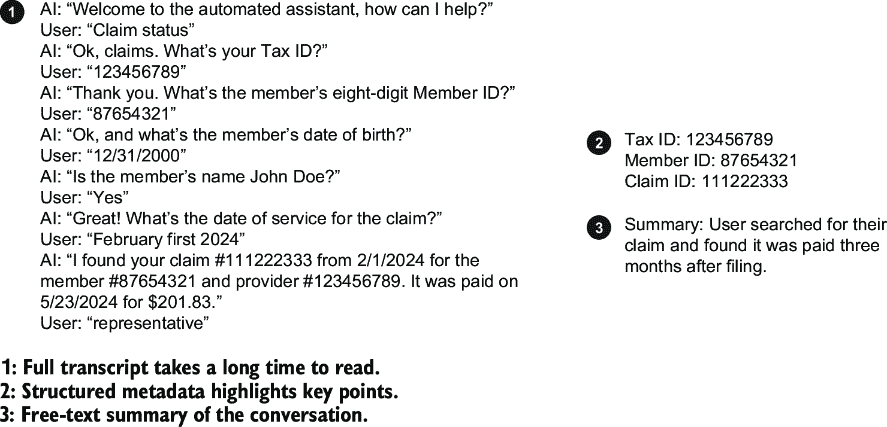
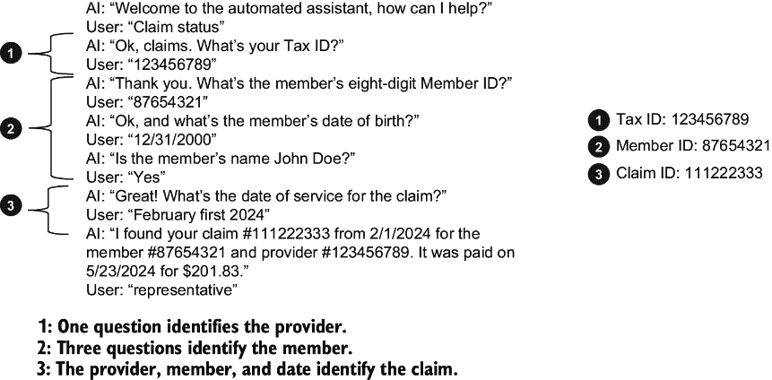
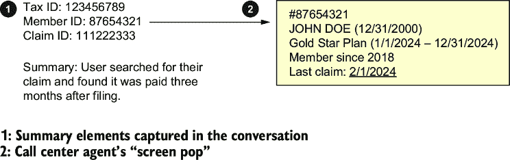
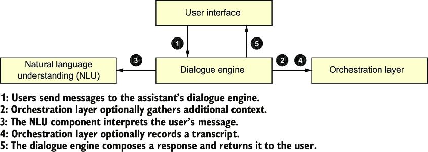
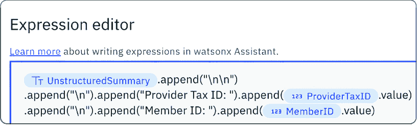

# 12 对话摘要以实现平滑交接

### 本章涵盖

+   定义有效对话摘要的要素

+   量化你的对话 AI 以增强摘要功能

+   使用 LLM 将聊天记录摘要成散文

+   使用 LLM 从聊天记录中提取结构化细节

对话 AI 构建者希望他们的系统中包含所有用户对话。但对于大多数用例，一些百分比的用户会在与人类交互结束后结束与你的机器人的交互。对话 AI 旨在处理易于自动化的对话，并将更有价值或更具挑战性的对话引导给人类代表。希望自助服务的用户可能会因为“失败”与对话 AI 而感到沮丧，因此，在转接后为人类代表提供尽可能好的开始处理电话非常重要。

两种最简单的交接方法也是最不令人满意的。我们可以“盲目”将对话转交给人类代表，并让他们再次询问所有需要的信息。或者我们可以将完整的对话记录交给代表，并要求他们搜索所需的信息（同时用户在等待！）。更好的做法是给人类代表一个有针对性的对话摘要，这样他们可以快速接手对话 AI 留下的地方。

## 12.1 摘要简介

摘要使 AI 到人类的交接过程更加顺畅。首先，我们将回顾为什么需要摘要。然后，我们将探讨有效摘要的要素。

### 12.1.1 为什么需要摘要

大多数对话 AI 解决方案存储完整的对话记录以供审计和数据分析。当你有时间分析时，这是一座宝库。但当你是一名被 AI 转接对话的客户服务中心代表时，你没有时间阅读冗长的记录。你需要快速抓住用户问题的本质，以便开始帮助他们。我们见过 AI 聊天记录长达多页（数百个单词）。代表需要几个有针对性的要点——更多将花费太多时间阅读，而更少则无法传达足够有用的信息。

图 12.1 说明了当聊天机器人将对话转交给人类代表时，如何从完整的对话记录中生成对话摘要。


##### 图 12.1 一个有效的摘要帮助代表快速熟悉情况，即使用户之前与机器人进行了长时间的对话。

从上一章，我们知道一些用户会立即选择转接到代表，但许多用户在感到沮丧之前会经历一系列步骤。以下列表显示了一个示例对话，其中用户似乎完成了他们的目标，但仍然要求转接到代表。

##### 列表 12.1 用户与 AI 的示例对话

```py
AI: Welcome to the automated assistant, how can I help?
User: Claim status
AI: Ok, claims. What's your Tax ID?
User: 123456789
AI: Thank you. What's the member's eight-digit Member ID?
User: 87654321
AI: Ok, and what's the member's date of birth?
User: 12/31/2000
AI: Is the member's name John Doe?
User: Yes
AI: Great! What's the date of service for the claim
User: "February first 2024
AI: I found your claim #111222333 from February 1,  #1
2024 for the member #87654321 and provider #123456789\.  #1
It was paid on May 23, 2024 for $201.83\.  #1
User: representative  #2
```

#1 用户似乎完成了他们的目标

#2 用户仍然选择退出

我们不确定用户为什么选择退出（可能是检查没有到达？）。但这不是重点。在大多数对话式 AI 解决方案中，用户可以在对话的任何地方选择退出。列表 12.1 中的对话有七个回合，可能大约花费了两分钟。这足够长，以至于阅读和理解需要一些努力。如果你是人工代理，你会想阅读那个完整的对话吗？如果对话更长会怎样？

平滑的转接应该迅速发生。代理应该迅速理解发生了什么，以便他们能够有效行动。用户不应该需要等待代理熟悉情况。有效的总结有助于满足所有这些需求。

### 12.1.2 有效总结的要素

一个对话总结只包含足够的信息来理解完整的对话。它应该包括结构化元数据和简短的文本总结；总结的内容将根据您的特定用例而变化。图 12.2 显示了示例。

#### 元数据摘要要素

结构化摘要要素通常来自封闭形式的问题，例如“你的会员 ID 是什么？”（“开放形式”问题类似于“我能帮您什么？”）这些摘要要素可以包括在对话中收集的数据或来自对话之外提供的环境。

这些是一些示例要素：

+   已登录用户的用户 ID（聊天）或来电者的电话号码（语音/SMS）

+   聊天中收集的标识符

+   聊天中发现的标识符

+   用户曾经进行的聊天会话数量

+   用户话语的情感分析



##### 图 12.2 一个有效的总结从对话中提取关键细节。这里包括对话总结和最后搜索的索赔。通话中的 AI 部分可能花费了两分钟，但人工代理可以在几秒钟内阅读总结。

在图 12.2 中，聊天收集了五条信息，但人工代理只需要知道三条。图 12.3 分解了总结。



##### 图 12.3 并非每个封闭形式的问题都需要存储在总结中。在这个医疗保险索赔审查中，最重要的信息是提供者 ID、会员 ID 和索赔 ID。

在这个医疗保险索赔搜索中，需要大量信息来验证来电者。我们需要核实来电者是谁，他们打电话的原因，以及他们打电话的内容。仅通过三个数据元素就能确认会员信息：一个 ID、一个日期和姓名的确认。接收转接的人工代理只需要知道会员已被验证，会员 ID 就足够了。

同样，关于索赔的信息有很多——一些由用户（服务日期）提供，一些由 AI（状态、支付日期、支付金额）提供。摘要只包括索赔 ID，这对于代理检索完整的索赔，包括所有不属于对话的细节，将足够。

在由人类代理处理对话的软件中包含摘要元素是有用的。在接触中心软件中，这被称为*屏幕弹出*——一个在代理处理对话时显示上下文信息的功能。图 12.4 展示了我们医疗保险代理的一个示例屏幕弹出。他们以高亮的形式接收结构化信息，并通过后端集成，他们可以获得更多信息。点击会员 ID 应显示关于会员的信息或其身份证照片。点击索赔应显示索赔本身（例如，作为 PDF 文件）。



##### 图 12.4 当摘要与接触中心软件集成时，人类代理可以触手可及地拥有大量信息。当保险代理在其软件中点击会员 ID 时，他们可以获得关于该会员的额外详细信息。

结构化元数据提供了到目前为止对话中的关键数据点。它防止人类代理不得不重新询问用户已经为机器人回答过的问题。当用户必须再次回答相同的问题时，他们会感到非常沮丧！人类代理从能够触手可及的信息中受益，但他们仍然需要意识到对话的整体背景。这就是自由文本摘要的作用所在。

#### 自由文本摘要元素

一个对话在转交给人类代理之前可能包含数百个单词。（我们使用的示例记录大约有 100 个单词。）当成年人为了娱乐阅读时，平均每分钟阅读 200 个单词，对于复杂材料则更慢。我们的用户不想等待比必要的更长的时间，因此我们的人类代理需要快速熟悉情况。一个好的摘要可以减少几分钟的时间。

遵循“简单至上”的哲学。一至两句话的摘要可以快速传达大量信息。我们示例中的自由文本摘要——“用户搜索他们的索赔并发现它在提交后三个月支付”——在前五个词中封装了整个搜索过程，以及在最后八个词中提供了一个可能的转接原因。

自由文本摘要也不重复。它消除了几条冗余信息：

+   *用户的初始意图*——这并没有明确包含，因为它可以从进行的索赔搜索中推断出来。

+   *中间问题*——它没有说“机器人要求提供税务 ID、会员 ID、出生日期等。”这些都是在用户找到索赔时隐含的。系统不会找到索赔，直到提供足够的信息。

+   *结构化内容*——摘要不需要浪费文字重复已经以紧凑形式提供过的结构化内容。

摘要也没有识别出谁启动了传输（用户或系统）。这可以在新的结构化字段中添加。

在摘要过程中存在权衡。过于简短的摘要会省略帮助代理的信息。过于冗长的摘要与阅读原始记录相比，不会帮助代理快速学习。选择最适合你用例的摘要方法。

在本章的后面部分，我们将向您展示如何使用生成式人工智能来生成摘要。不过，首先我们需要对话式人工智能以正确的格式结构化数据以生成摘要。

##### 练习

设计你理想的以下样本对话摘要。你将在本章的后面部分使用额外的技术来完善这些摘要：

```py
AI: Welcome to the automated assistant, how can I help?
User: Claim status
AI: Ok, claims. What's your Tax ID?
User: 123456789
AI: Thank you. What's the member's eight-digit Member ID?
User: 87654321
AI: Ok, and what's the member's date of birth?
User: 12/31/2000
AI: Is the member's name John Doe?
User: Yes
AI: Great! What's the date of service for the claim?
User: February first 2024
AI: I found your claim #111222333 from February 1, 2024 for the member #87654321 and provider #123456789\. It was paid on May 23, 2024 for $201.83.
User: representative
```

1.  设计一个纯文本摘要的样本对话。

1.  设计数据元素的结构化摘要。如果呼叫者要求成员的健康计划详情或尝试主动估计程序的成本，你会提取不同的结构化元素吗？

1.  从你正在工作的聊天机器人中提取一个对话记录。以文本和结构化元素的形式总结对话。

## 12.2 准备你的聊天机器人进行摘要

我们假设你的聊天机器人会跟踪对话记录。大多数平台都会这样做，但并非所有平台都会。记录是构建摘要所需的最基本元素。在本节中，我们将向您展示多种收集数据的方法，这些数据对于对话的文本和结构化摘要都是必要的。

### 12.2.1 使用现成的元素

对话式人工智能平台通常包含内置元素以帮助进行对话摘要。最常见的一个元素是对话记录——用户和助手之间消息的运行日志。在不同的平台上，可以通过不同的方式访问它。一个常见的机制被称为*会话变量*。

图 12.5 展示了如何在我们的平台（watsonx）中通过一个名为“会话历史”的内置会话变量访问记录。


##### 图 12.5 通过“会话历史”变量访问对话记录

根据你的聊天平台，对话记录将以不同的格式存储。我们的平台以 JSON 格式提供摘要，如下所示。

注意：在许多对话式人工智能平台中，除非你通过 webhooks 自己构建，否则对话记录不会作为变量提供给对话会话。我们将在本章后面部分演示如何构建包含记录的变量。

##### 列表 12.2 通过内置的“会话历史”变量访问对话记录

```py
[{"a":"Welcome to the automated assistant, how can I help?"},{"u":
↪"Claim status","n":true},{"a":"Ok, claims.\nWhat's your Tax ID?"},{"u":
↪"123456789"},{"a":"Thank you.\nWhat's the member's eight-digit Member 
↪ID?"},{"u":"87654321"},{"a":"Ok, and what's the member's date of 
↪birth?"},{"u":"12/31/2000"},{"a":"Is the member's name John Doe?\n
↪option: ["Yes","No"]"},{"u":"Yes"},{"a":"Great!\nWhat's the date of 
↪service for the claim?"},{"u":"2024-02-01"},{"a":"I found your claim 
↪#111222333 from Feb 1, 2024 for the member #87654321 and provider 
↪#123456789\. It was paid on 5/23/2023 for $201.83."},
↪{"u":"representative"}]
```

JSON 格式旨在供机器阅读，但你可以在转换过程中运行录音。我们通过将 `"a"` 键替换为 `"Bot"`，将 `"u"` 键替换为 `"User"`，以及将 `\n`（换行符）替换为空格，使本章中的图表更易于人类阅读。

录音还包括一些你可能选择忽略的元数据，例如通过按钮提供的“是”和“否”选项。其他对话式人工智能平台可能包括进一步的时间戳等元数据。

在本章的后面部分（第 12.3 节），我们将演示如何通过一个大型语言模型（LLM）对这个录音格式进行总结。我们将看到 LLM 对录音格式具有很强的适应性。你可以以它们的原生格式总结录音，或者重新格式化以便于人类阅读。

### 12.2.2 为聊天机器人配置录音功能

一些对话式人工智能平台要求你自己创建和存储对话录音。或者，你也可以选择创建你自己的版本，以你偏好的确切格式。无论如何，这都是在你的 *编排层* 中实现的，如图 12.6 所示。编排层负责通过 API 调用外部系统。具体的术语将根据你的对话式人工智能平台而有所不同，但这通常被称为 *webhook*。



##### 图 12.6 你可以使用聊天机器人的编排层以你需要的任何格式创建对话录音。

Webhook 是一种 API 类型。Webhook 通常在机器人处理用户响应之前（“预”-webhook）、处理用户响应之后（“后”-webhook）或在其他预定义事件时可用。Webhook 可以通过原生方式或作为输入参数访问对话上下文。下面的列表展示了构建录音的伪代码。（请参考你的对话式人工智能平台文档以获取正确的术语和格式。）

##### 列表 12.3 更新录音的 webhook 伪代码

```py
def transcript_webhook(request, response):
  userMessage = request.input.text  #1
  botMessage  = response.output.text  #2
  if(userMessage != null)  #3
    response.context.transcript += 'User: ' +  #4
    ↪userMessage + '\n' 
  if(botMessage  != null)
    response.context.transcript += 'Bot: ' +  
    ↪botMessage + '\n'
```

#1 用户的消息通常位于请求对象中。

#2 机器人的消息通常位于响应对象中。

#3 用户的消息可能并非每次都存在。例如，大多数对话都是从机器人的问候开始的。

#4 录音应存储在上下文变量（会话变量）中。所有用户和机器人的消息都附加到录音中。

列表 12.3 展示了一个后 webhook，因为它可以访问请求和响应。每次机器人对用户做出响应时，webhook 都会更新录音。这个录音包括尽可能少的元素——只是用户和机器人的消息——以及一个非常简单的每行一条消息的格式，便于人类阅读。你可以以你希望的任何格式创建你的录音，例如单个字符串、字符串数组、JSON 对象或自定义对象。

如前所述，简单的转录最容易阅读。对话式 AI 平台通常每条消息都有许多可选项的数据元素，您可以在转录中使用：

+   *消息时间戳*—您可以使用时间戳来显示消息接收或发送的绝对时间（例如，“上午 11:25:53”）或自聊天开始以来的相对时间（例如，消息开始后 1 分 15 秒的“00:01:15”）。

+   *按钮*—您可以通过按钮指示机器人提供了哪些选项，以及用户何时点击了按钮。这在语音解决方案中尤其有趣，因为用户可能通过他们的键盘输入双音多频（DTMF，或“触摸音”）输入。例如，您会知道用户按下了“0”而不是说出“零”。

+   *原始或后处理输入*—许多对话式 AI 平台会规范化某些输入类型，如日期和数字。您可以使用原始话语，如“二零二四年二月第一”，或后处理版本如“02/01/2024”。

+   *富文本和非文本元素*—您的机器人可能会以 HTML 标记或甚至图像和链接的形式响应，这些可能不适合转录。

列表 12.3 中的伪代码演示了如何更新跟踪对话上下文的上下文变量，但没有演示如何初始化该变量。最简单的方法是将变量初始化为空字符串，如下所示：`response.context.transcript = ''`。

与对话相关的其他几个数据元素可供使用，您可能希望在转录的开头包括它们：

+   *会话时间戳*—对话开始的时间。

+   *会话时长*—对话持续了多长时间。

+   *用户标识符*—这可能包括有关登录用户访问聊天室的信息，例如姓名、电子邮件或用户 ID。对于电话解决方案，这可能是指叫方的电话号码。

+   *设备和渠道标识符*—用户如何访问您的对话式 AI，例如设备类型（例如，移动或桌面）或他们使用的渠道（例如，聊天小部件、短信、Facebook Messenger 等）。

+   *转移原因*—机器人将呼叫者转接到代理的原因，例如“立即退订”、“退订”或“机器人不理解用户”。

您可以选择将这些元素留给总结的结构化部分（作为键值对），而不是将它们包含在散文总结中，因为它们适用于整个对话。

所有这些数据元素以及更多通常都可在您的对话式 AI 平台中找到。它们通常包含在 AI 的系统日志中，这是构建转录的另一个数据源。这些可选数据元素由对话式 AI 平台提供，因为它们是通用的，适用于任何对话作为元数据。它们是任何对话转录的绝佳起点。

在本章前面，我们了解到一个好的摘要不仅仅是一个非结构化的记录。结构化元数据在总结对话的重要部分时非常有用。这些元数据的一些部分不是通用的——它们针对您特定的实现是特定的。在我们的医疗保险示例中，会员 ID 和索赔 ID 是唯一的。

对话式 AI 平台不会给会员 ID 赋予任何特殊含义——它们被记录为另一条用户消息。如果您想在摘要中使用实施中的特定上下文元素，您将不得不自己配置 AI 来存储它们，以便它们可以被包含在摘要中。让我们看看如何操作。

### 12.2.3 配置您的聊天机器人（对于数据点）

对话式 AI 平台通常允许您在变量中存储任意值，这些变量通常被称为*上下文变量*或*会话变量*。您应该利用这些变量来收集对话中的任何具有重大意义的数据，尤其是如果它有助于您稍后找到更多信息。

您存储的数据将根据您的特定应用程序而变化。以下是一些按领域划分的示例：

+   *医疗保险*—会员 ID，提供者 ID，索赔 ID

+   *零售*—订单号，产品 ID，零售地点

+   *银行*—账户 ID，账户类型

任何时候机器人用固定格式的响应提出问题，比如“你的索赔 ID 是什么”，这个响应都是进行配置的合适候选。

##### 小心敏感数据

许多类型的数据需要谨慎处理。有关如何处理可能识别个人（PI）或其他敏感数据点的数据，有规则和法规。您的对话式 AI 可能已经处理了它们，但将它们添加到摘要或日志中可能需要与您的法律团队进行审查。在收集、存储以及存储时间上要尽量简约，并请您的律师确认您的选择。

您存储上下文的方式将取决于您的对话式 AI 平台。您可能能够在用户界面中这样做，或者您的平台可能要求您编写代码。图 12.7 显示了我们在平台中用于存储上下文变量的低代码方法。

您可以在对话中稍后访问存储的上下文变量，包括访问它们以创建结构化摘要。以下列表显示了访问这些上下文变量并将它们存储在结构化对象中的伪代码。

##### 列表 12.4 创建结构化摘要的 webhook 的伪代码

```py
def on_transfer(request, response):  #1
  summary = ConversationSummary()  #2

  summary.providerTaxID = response.context.  #3
  ↪ProviderTaxID  #3
  summary.memberID      = response.context.MemberID  #3
  summary.claimID       = response.context.ClaimID  #3
```

#1 当对话转移到代理时，调用此方法。

#2 您可以定义一个自定义对象来保存您的摘要。

#3 设置您自定义摘要所需的任何值。


##### 图 12.7 将上下文重要信息存储到上下文变量中，以便稍后通过摘要检索

你也可以直接在你的助手中使用这些变量来创建一个非结构化的摘要。图 12.8 展示了我们平台中用于将多个变量组合成更大的摘要字符串的低代码方法。



##### 图 12.8 使用低代码表达式编辑器将多个数据元素组合成摘要

本节展示了多种收集摘要所需数据的途径。对话式 AI 平台收集了大量的数据，这些数据可以用于摘要。你可以对你的 AI 助手进行配置，以收集你需要额外数据，并且你可以控制这些数据的格式。你收集的数据对于许多用途都很有用，包括高效地将任务转交给人工客服。

##### 练习

1.  回顾你在 12.1 节练习中创建的摘要。你现在会改变那些摘要中包含的数据元素吗？

## 12.3 使用生成式 AI 改进摘要

如果你根本不想修改你的对话 AI，你还能收集到制作优秀摘要所需的所有数据，并以你需要的格式进行整理吗？生成式 AI 能做更多的工作，让你有更少的工作要做吗？是的！让我们看看如何做到这一点。

你有两个关键的前提条件。首先，你需要某种形式的对话记录：来自你的对话 AI 平台的内置记录，你自己创建的记录，或者从你的平台对话日志中提取的记录。其次，你需要知道对于你的用例来说一个好的摘要是什么样的。有了这两个前提条件，你就可以与一个 LLM 合作，以获取你需要的摘要。

在本节中，我们将使用 granite-13b-chat-v2 模型并采用贪婪解码。这个模型擅长我们需要的摘要和提取技术。我们将使用贪婪解码，这样模型就不会有创造性，输出将是可重复的。（我们希望对于给定的对话生成相同的摘要和提取相同的细节。）

### 12.3.1 使用摘要提示生成转录本的文本摘要

我们将从一个简单的摘要提示开始我们的练习，如下所示。我们将传递给模型我们聊天记录的 JSON 版本。

##### 列表 12.5 生成 JSON 聊天记录的摘要

```py
Summarize the following conversation transcript between a  #1
user ("u") and the automated assistant ("a"). 
The summary should be 1-2 sentences long.  #2

Transcript:
[{"a":"Welcome to the automated assistant, how can I help?"}  #3
↪,{"u":"Claim status","n":true},{"a":"Ok, claims.\nWhat's your  #3
↪Tax ID?"},{"u":"123456789"},{"a":"Thank you.\nWhat's the   #3
↪member's eight-digit Member ID?"},{"u":"87654321"},{"a":"Ok,   #3
↪and what's the member's date of birth?"},{"u":"12/31/2000"}, #3
↪{"a":"Is the member's name John Doe?\noption: ["Yes","No"]"},  #3
↪{"u":"Yes"},{"a":"Great!\nWhat's the date of service for the   #3
↪claim?"},{"u":"2024-02-01"},{"a":"I found your claim #111222333  #3
↪from Feb 1, 2024 for the member #87654321 and provider   #3
↪#123456789\. It was paid on 5/23/2023 for $201.83."},{"u":  #3
↪"representative"}]  #3

Summary: #4
"I found your claim #111222333 from Feb 1, 2024 for the member #5
↪#87654321 and provider #123456789\. It was paid on 5/23/2023  #5
↪for $201.83."  #5
```

#1 任务描述和解析 JSON 对象提示

#2 指令以限制摘要大小

#3 聊天记录的 JSON 版本

#4 提示

#5 模型输出

生成的摘要是从 AI 那里直接摘录的最后一句原话。一开始这可能看起来有些奇怪，但这确实是对话的一个相当好的总结。机器人的最后一句发言包含了很多细节，涵盖了对话中最重要的一部分。

通过使用采样解码和创造性的温度设置，我们可能会得到一个不同结构的摘要，但风险是引入幻觉。我们还可以更改转录格式，看看是否有助于 LLM。下一条目显示了一个以不同输入格式（非结构化文本而非 JSON）总结相同对话的提示。

##### 列表 12.6 生成文本聊天转录摘要

```py
Summarize the following conversation transcript between a user  #1
and an AI 

The summary should be 1-2 sentences long.  #2

Transcript:  #3
AI: "Welcome to the automated assistant, how can I help?"
User: "Claim status"
AI: "Ok, claims. What's your Tax ID?"
User: "123456789"
AI: "Thank you. What's the member's eight-digit Member ID?"
User: "87654321"
AI: "Ok, and what's the member's date of birth?"
User: "12/31/2000"
AI: "Is the member's name John Doe?"
User: "Yes"
AI: "Great! What's the date of service for the claim?"
User: "February first 2024"
AI: "I found your claim #111222333 from February 1, 2024 for the member #87654321 and provider #123456789\. It was paid on May 23, 2024 for $201.83."
User: "representative"

Summary:  #4
The AI is providing information about a claim that has been   #5
submitted by a member with the member ID 87654321 and provider  #5
ID 123456789\. The claim was paid on May 23, 2024 for $201.83\.  #5
The representative will be able to assist with any questions  #5
or concerns related to this claim.  #5
```

#1 无额外提示的任务描述

#2 相同的指令以限制摘要大小

#3 聊天转录的文本版本

#4 相同的提示

#5 模型输出

这个生成的摘要包含与从 JSON 生成的摘要相同的信息内容。它仍然基于机器人的最后一条消息，但这次，它被改写成了散文。摘要还包括一个第三句话——与提示的指令相反——试图理解用户的最后一句发言。

注意：在本章剩余部分，我们将省略书籍中的对话转录内容以保持列表较小。我们将使用可读性更好的对话转录版本。完整的列表可在书籍的 GitHub 仓库中找到，网址为[`github.com/andrewrfreed/EffectiveConversationalAI`](https://github.com/andrewrfreed/EffectiveConversationalAI)。

记住本节前面给出的建议：你需要知道一个好的摘要是什么样的。到目前为止，LLM 生成的摘要还不错，但也许我们可以做得更好。一种方法是向模型提供更好的指令，如下一条目所示。因为我们强调指令，我们将切换到一个更具可指导性的模型，在这种情况下是 granite-13b-instruct-v2。模型被要求强调升级前的对话。

##### 列表 12.7 增强对 LLM 的摘要指令

```py

Summarize the following conversation transcript between a user    #1
and an AI  #1
The summary should be 1-2 sentences long.   #2
The summary should emphasize the last task the user was   #3
performing that led them to request a human representative.   #3

Transcript:  #4
<... human-readable transcript removed for brevity ...>

Summary:  #5
The user asks for a human representative because they want to   #5
know why their claim was denied.  #6
```

#1 原始任务描述

#2 原始指令以限制摘要大小

#3 加强强调内容的指导

#4 聊天转录的文本版本

#5 相同的提示

#6 模型输出

模型遵循指令。机器人的最后一条消息告诉用户他们的索赔已被支付（“索赔已于 2024 年 5 月 23 日支付 201.83 美元”），然后用户选择退出。LLM 的摘要简洁地说：“他们想知道为什么他们的索赔被拒绝。”这个摘要很短，但可能过于推测，因为索赔已被支付，实际上并没有被拒绝。也许用户觉得他们应该得到更多的支付，或者也许他们需要一个详细的清单。文本摘要还省略了列表 12.6 中看到的转录内容的近字面回放，将那些信息留给单独的结构化摘要。我们更接近于人类代理所需的内容。让我们改进提示以减少 LLM 的推测。

一个有用的方法是使用单次提示（带有一个示例）或少量提示（带有多个示例）来调用 LLM。创建单次示例迫使我们思考给定对话的良好总结是什么样的。使用一个或多个示例通常是改进提示最快的方式。

下面的列表展示了一个使用 granite-13b-instruct-v2 模型的单次示例。

##### 列表 12.8 一个单次总结提示

```py
<|instruction|>  #1
Summarize the following conversation transcript between a user    #1
and an AI  #1
The summary should be 1-2 sentences long.  #1
The summary should emphasize the last task the user was    #1
performing that led them to request a human representative.  #1

<|transcript|>  #2
AI: "Welcome to the automated assistant, how can I help?"   #2
User: "Claim status"  #2
AI: "Ok, claims. What's your Tax ID?"   #2
User: "012345678"  #2
AI: "Thank you. What's the member's eight-digit Member ID?"   #2
User: "I don't have it"  #2
AI: "Ok, let's try something else.  What's the member's date   #2
of birth?"  #2
User: "representative"  #2
#2
<|summary|>  #2
The user requested a human representative after failing   #2
to validate the member ID needed to find the claim.   #2

<|transcript|>  #3
<... human-readable transcript removed for brevity ...>

<|summary|>   #4
The user requests a human representative because they   #5
want more information about their insurance claim.   #5
```

#1 通过“&lt;|instruction|&gt;”更新划分的任务描述

#2 带有总结的对话记录单次示例

#3 聊天记录的文本版本

#4 重新结构化的提示

#5 模型输出

当与结构化元数据结合时，此生成的总结也非常合理。有一些推测——“他们想要更多信息”——但再次看来，如果用户在发现声明似乎是付费的之后想要一个代理，他们可能需要更多信息。总结在示例之后也是结构化的，总结的前六个词与示例的词对词匹配。

注意，在单次总结示例（列表 12.8）中，我们使用了稍微不同的格式。我们不是使用`Transcript:`的划分，而是使用了特殊格式的标记，如`<|transcript|>`。没有这些特殊标记，我们无法生成好的总结。可能模型在区分提示部分和对话元素时遇到了困难，因为两者都使用了冒号。未来的大型语言模型（LLM）可能对提示中多次出现划分字符更具弹性。这种小的变化可以对 LLM 性能产生巨大影响。

在你的提示中强调指令或示例都是可行的。考虑以下权衡：

+   *输出控制*——大多数 LLM 默认训练于总结。许多对指令有反应并生成好的总结。单次和少量提示进一步限制了输出以使用你想要的语言，尽管你可能需要提供几个示例。

+   *成本*——添加示例会增加推理成本，因为输入的标记更多。

我们迄今为止生成的文本总结包括对话概述，但大部分不包括对代理有帮助的结构化元数据。在章节的早期，我们展示了使用各种代码和低代码方法来配置你的聊天机器人，以收集可以传递给代理的结构化元数据。如果我们不想配置我们的聊天机器人——LLM 能否提取结构化元数据？

### 12.3.2 使用提取提示生成对话记录的结构化总结

我们可以使用大型语言模型（LLM）从对话记录中提取结构化数据——提取是许多 LLM 训练的另一项任务。

我们的第一项任务是决定结构化输出需要看起来像什么。有许多可能性，但一个有用的格式是 JSON。这有两个原因：JSON 易于下游应用程序消费，许多 LLM 擅长生成 JSON。

我们将再次使用可指导的模型。这次我们将使用 mistral-7b-instruct-v0-2，因为它可以仅从指令中生成 JSON。以下列表显示了一个提示，该提示从对话中生成了结构化的 JSON 输出。

##### 列表 12.9 没有示例的提取摘要

```py
<|instruction|>
Read the following conversation transcript between a  #1
user and the automated assistant. Extract all IDs in    #1
JSON format.  #1

<|transcript|>   #2
<... human-readable transcript removed for brevity ...>

<|JSON|>  #3
{
  "TaxID": "123456789",  #4
  "MemberID": "87654321",   #4
  "DateOfBirth": "12/31/2000",  #4
  "Name": "John Doe", #4
  "ClaimNumber": "111222333",  #4
  "DateOfService": "February 1, 2024",   #4
  "ProviderID": "123456789"  #4
}  #4
```

#1 更新后的任务描述，包含关于 JSON 格式的简单说明

#2 聊天记录的文本版本

#3 更新后的提示以生成 JSON

#4 模型输出

这是一个出色的第一次尝试。模型生成了 JSON 并提取了收集到的所有结构化数据点。但它收集了比我们要求更多的数据——我们只想得到 ID——并且重复了一个数据点（税务 ID 是提供者的 ID）。

注意：许多模型在看到几个示例后可以生成 JSON。我们测试的所有模型都提取了几个数据点，而不是预期的三个。mistral 模型是少数几个在提示中没有示例就能生成有效 JSON 的模型之一。我们预计模型将继续在生成 JSON 数据方面取得进步。或者，您可以在指令中提供一个示例模式。

让我们用示例（以粗体显示）来增强这个提示。

##### 列表 12.10 带有一个示例的提取摘要

```py
<|instruction|>
Read the following conversation transcript between a  #1
user and the automated assistant. Extract all IDs in  #1
JSON format.  #1

**<|transcript|> ** #2
**AI: "Welcome to the automated assistant, how can I** ** #2
**help?" ** #2
**User: "Claim status" ** #2
**AI: "Ok, claims. What's your Tax ID?" ** #2
**User: "333444555" ** #2
**AI: "Thank you. What's the member's eight-digit Member** ** #2
**ID?" ** #2
**User: "55667788" ** #2
**AI: "Ok, and what's the member's date of birth?" ** #2
**User: "April 19, 2024" ** #2
#2
**<|JSON|> ** #2
**{"TaxID": 333444555, "MemberID": 55667788} ** #2

<|transcript|>  #3
<... human-readable transcript removed for brevity ...>

<|JSON|>  #4
{"TaxID": 123456789, "MemberID": 87654321,   #5
"DateOfService": "February 1, 2024", "ClaimNumber": #5
"111222333"}  #5****
```

****#1 相同的任务描述

#2 一次性示例

#3 聊天记录的文本版本

#4 相同的提示

#5 模型输出****  ****通过一个例子，我们向模型展示了我们不需要输出中的每一份数据。我们还让模型停止重复提供者的税务识别号。最后，JSON 响应现在已压缩成单行，没有换行符。提取的数据仍然准确，但我们可能需要确切的键名。如果代理的应用程序期望读取名为`ClaimID`的字段，那么摘要引用`ClaimNumber`是不可接受的。

我们在以下列表中给出了一个更详细的示例（以粗体显示）。

##### 列表 12.11 更新后的提取摘要的一次性示例

```py
<|instruction|>
Read the following conversation transcript between a   #1
user and the automated assistant. Extract all IDs in   #1
JSON format. # #1

**<|transcript|> **  #2
**AI: "Welcome to the automated assistant, how can I**  ** #2
**help?"** ** #2
**User: "Claim status"** ** #2
**AI: "Ok, claims. What's your Tax ID?"** ** #2
**User: "333444555" ** ** #2
**AI: "Thank you. What's the member's eight-digit Member**  ** #2
**ID?" ** ** #2
**User: "55667788" ** #2
**AI: "Ok, and what's the member's date of birth?"** ** #2
**User: "April 19, 2024" ** ** #2
**AI: "Is the member's name Jim Smith?" ** #2
**User: "Yes"** ** #2
**AI: "Great! What's the date of service for the claim?"** ** #2
**User: "April ninth 2024"** ** #2
**AI: "I found your claim #444444555 from April 9, 2024**  ** #2
**for the member #55667788 and provider #333444555\. It**  ** #2
**was paid in full on April 23, 2024 for $156.81." ** ** #2
**User: "Thanks! Goodbye"** ** #2
#2
**<|JSON|>** ** #2
**{"TaxID": 333444555, "MemberID": 55667788, "ClaimID":**  ** #2
**444444555} ** ** #2

<|transcript|>    #3
<... human-readable transcript removed for brevity ...>

<|JSON|>   #4
{"TaxID": 123456789, "MemberID": 87654321, "ClaimID":   #5
"111222333"}   #5**************************************
```

******#1 相同的任务描述

#2 更新后的一次性示例

#3 聊天记录的文本版本

#4 相同的提示

#5 模型输出******  ******这效果很好。我们只得到了我们想要的键。令人稍微有些沮丧的是，一次性示例需要与第二个记录如此接近。这暗示了要总结其他对话流程，我们可能需要为每个流程提供示例。（如果对话包括授权 ID、电子支付 ID 或其他 ID 怎么办？）还有一个需要注意的问题：`TaxID`和`MemberID`是数值，但`ClaimID`生成了字符串值——即使看到了示例。

##### 测试幻觉

在我们的提取式摘要示例中，我们没有遇到任何幻觉，但这并不意味着它们是不可能的。任何摘要提示在部署之前都应该在多个输入上进行测试，以查看它是否会产生幻觉。部署后，你可以通过验证每个提取的值是否出现在记录文本中来检测幻觉。

让我们回到之前的一次性示例，并添加一些指令，如下面的列表中用粗体显示。

##### 列表 12.12 包含一个示例的提取摘要

```py
<|instruction|>
Read the following conversation transcript between a user and the automated assistant. Extract all IDs in JSON format.
Use only the following JSON keys: "TaxID", "MemberID",   #1
**"ClaimID".  ** #1
**The JSON values should be numbers, not strings.** ** #1

<|transcript|>  #2
AI: "Welcome to the automated assistant, how can I   #2
help?"   #2
User: "Claim status"  #2
AI: "Ok, claims. What's your Tax ID?"   #2
User: "333444555"  #2
AI: "Thank you. What's the member's eight-digit Member   #2
ID?"  #2
User: "55667788"   #2
AI: "Ok, and what's the member's date of birth?"  #2
User: "April 19, 2024"  #2
#2
<|JSON|>   #2
{"TaxID": 333444555, "MemberID": 55667788}  #2

<|transcript|>  #3
<... human-readable transcript removed for brevity ...>

<|JSON|>   #4
{"TaxID": 123456789, "MemberID": 87654321, "ClaimID":   #5
111222333}   #5**
```

**#1 增强的任务描述**

**#2 较小的一次性示例**

**#3 聊天记录的文本版本**

**#4 相同的提示**

**#5 模型输出** **Voila! 正是我们期望的输出。我们能够通过结合指令和示例，提示一个 LLM 生成我们想要的具有结构化的摘要。除了调用 LLM 之外，我们不需要修改我们的助手。这个调用仅限于处理将对话传递给代理的组件。**

##### 练习

1.  回顾你在第 12.1 节中为示例聊天记录创建的理想摘要。使用你最喜欢的 LLM（或你公司首选的 LLM）生成该记录的散文摘要。LLM 离你偏好的摘要有多近？你是否使用了指令、少量示例或两者都使用了？

1.  重复练习 1，但也要修改模型参数。在本章中，我们使用了贪婪解码和 1.1 的重复惩罚。尝试采样解码，或者尝试提高或降低惩罚。你是否得到了更好的性能？这符合你的预期吗？

1.  是否有可能在同一个提示中生成散文摘要并从记录中提取关键细节？设计一个提示，以生成以下输出：

```py
{"TaxID": 123456789, "MemberID": 87654321, "ClaimID": 111222333,
"Summary": "The user requests a human representative because they 
want more information about their insurance claim."}
```

1.  4. 设计一个包含多个声明搜索的对话。想象一下，如果用户打电话来检查四个总声明，机器人和用户会进行怎样的对话。其中一些声明是付费的，一些声明仍在处理中，最后一个声明被拒绝。这个对话的内容将是原始样本对话的两到四倍。你希望这个摘要看起来像什么？一旦你有了目标摘要，使用 LLM 并尝试生成该摘要。

1.  5. 为以下样本对话设计一个理想的摘要：

```py
AI: "Welcome to the automated assistant, how can I help?"
User: "coverage"
AI: "Ok, claims. What's your Tax ID?"
User: "333444555"
AI: "Thank you. What's the member's eight-digit Member ID?"
User: "55667788"
AI: "Ok, and what's the member's date of birth?"
User: "April 19, 2024"
AI: "Is the member's name Jane Williams?"
User: "Yes"
AI: "They are currently a member.  They have our PPO plan with coverage
↪for the full 2024 calendar year. Do you need anything else?"
User: "How much is their co-pay for office visits?”
AI: "Since you are an in-network provider they will owe $20"
User: "Do they need a prior authorization for a specialist?"
AI: "Yes, would you like to initiate one now?"
User: "Yes"
AI: "Let me transfer you to a specialist who can help with that."
```

现在为你的 LLM 构建一个提示，以生成类似的摘要。

1.  6. 将你的新提示与列表 12.1 中的原始样本对话进行测试。如有必要，调整提示，以便为这两个对话生成好的摘要。

## 摘要

+   将对话传递给人工代理是许多对话式 AI 解决方案的必然部分。代理从接收简短的摘要中受益，这些摘要从对话中提取了关键要点，无论是散文形式还是结构化格式。

+   摘要需要一个对话记录。大多数对话式 AI 平台都会为你生成记录，但你也可以配置你的对话式 AI 以生成你需要的格式。

+   通过增强你的对话式 AI 以存储收集到的关键数据点，或者当对话完成时使用 LLM 提取，可以生成结构化摘要。 

+   在你要求 LLM 生成摘要之前，你需要知道一个好的摘要是什么样的。

+   LLMs 可以生成散文摘要并从记录中提取关键细节。使用清晰的指令和示例来生成你想要的摘要。************  ******# index

A

准确性

APIs (应用编程接口)

使用

AI (人工智能)

传统的（基于分类的）, 第 2 次

Arize

标注日志

对于传统的（基于分类的）AI

答案生成

AOV (平均订单价值)

B

行为模式

盲测试

C

对话结果, 第 2 次, 第 3 次, 第 4 次, 第 5 次

比较检查

包含的对话，定义

跨职能团队, 第 2 次

复杂性, 第 2 次

对业务指标的影响, 第 2 次

对最终用户的影响

减少对用户的增量成本和收益

持续改进

上下文，在虚拟助手性能中的重要性

建立信任和忠诚

上下文信息, 第 2 次

解决问题的效率

增强相关性和准确性

影响用户交互, 第 2 次

个性化体验

主动支持

CohereEmbeddings

对话摘要

呼叫中心代理

分类模型

对话式 AI

好处

建立, 第 2 次

持续改进, 第 2 次

定义

它是如何工作的

使用生成式 AI 响应用户, 第 2 次

软件平台

理解用户

混淆矩阵, 2nd

上下文变量

复杂流程

商业云平台

D

双音多频（DTMF）

设备类型

仅解码器架构

文档转换器, 2nd

消歧特征

文档加载器

直接问题

解码方法

DirectoryLoader

E

仅编码器架构

编码器-解码器模型架构

嵌入生成

F

自由文本摘要元素

FaithfulnessEvaluator

Facebook AI 相似性搜索（FAISS）

常见问题解答（FAQ）机器人, 2nd

动态问答

基础

静态问答, 2nd

Flan-ul2 模型

G

金标准测试集

为生成式 AI 标注

为传统（基于分类器）AI 标注

生成新的语法变体, 2nd

黄金意图

生成度量, 2nd

生成式人工智能（AI）, 2nd, 3rd

为标注

使用增强意图数据

定义

有效使用, 2nd

guardrails, 2nd

使用改进摘要

模型平台

生成文本

granite-13b-instruct-v2 模型

H

人机交互

幻觉, 2nd

I

交互式语音应答（IVR）, 2nd

意图数据

使用生成式增强

改进规划

开发和交付修复, 第 2 次

驱动到相同目标, 第 2 次

索引指标, 第 2 次

意图

强化现有意图, 第 2 次

立即退订

允许用户选择加入

传达能力和设定期望

从良好的体验开始, 第 2 次

改进

识别和解决问题, 第 2 次

识别需求

K

KPIs (关键绩效指标)

看板板

k-折

交叉验证

测试

L

日志，获取和准备测试数据

准备和清理数据以用于迭代改进

LLMs (大型语言模型), 第 2 次, 第 3 次, 第 4 次, 第 5 次, 第 6 次

用增强数据增强意图数据, 第 2 次

集成

利弊

需求

使用增强数据

加载方法

M

模态

比较模态

如何模态影响用户体验的例子, 第 2 次

在设计虚拟助手流程中的重要性

消息

错误消息, 第 2 次

问候消息, 第 2 次

元数据，摘要元素

意义，提取

min_tokens

模型，选择

N

NPS (净推荐者分数)

NDCG (归一化折现累积增益)

NLU (自然语言理解)

NLP (自然语言处理)

O

OpenAIEmbeddings 类

退订

驱动因素, 第 2 次

升级

收集关于退订行为的资料

立即, 第 2 次

通过生成式 AI 改进对话

减少, 第 2 次

保留, 第 2 次

编排层

Ollama

一次性提示

P

持久用户历史

提示

提示工程

参数调整

输出后过滤

之前的交互

面向过程的机器人

精确度和召回率，为多个意图改进

精确度

面向过程或事务性解决方案

段落检索

预处理数据

提示填充

预过滤输入

PII（个人可识别信息）

流程处理

构建时 AI 辅助, 第 2 次

运行时 AI 辅助

使用生成式 AI 执行对话流程, 第 2 次

Q

定性问题探索

QPS（每秒查询数）

问答, 第 2 次

问题发现的数量评估

R

路由代理, 第 2 次

检索器

回忆

RAGAS，定义

运行时检索和匹配

RAG（检索增强生成）, 第 2 次, 第 3 次, 第 4 次, 第 5 次, 第 6 次, 第 7 次, 第 8 次

额外考虑事项, 第 2 次

好处, 第 2 次

与其他生成式 AI 用例结合

比较意图、搜索和 RAG 方法

使用设计自适应流程, 第 2 次

评估和分析性能

实现, 第 2 次

在对话人工智能中

维护和更新自适应流程

检索和生成上下文相关的响应

将请求路由到 LLMs

检索指标

S

槽填充

自助服务

激励

向量数据库中的存储

会话历史

会话变量

SSA（可感知性和特异性平均值）

SMEs（主题专家）, 第 2 版, 第 3 版

搜索在对话人工智能中的作用, 第 2 版

传统搜索的好处

传统搜索的缺点

在对话人工智能中使用搜索

使用 LLM 进行搜索过程, 第 2 版

支持资源

屏幕弹出

同义词生成, 第 2 版

敏感数据

摘要

有效元素, 第 2 版

利用生成式人工智能改进, 第 2 版

需要

概述

为聊天机器人做准备, 第 2 版

采样解码

解决问题

冲刺计划

T

传统搜索

从路由代理过渡到面向过程的机器人

转移决策

传统人工智能

改进薄弱理解, 第 2 版

模板，创建示例, 第 2 版

测试数据，从日志中获取和准备

注释过程, 第 2 版

识别候选测试语句的指南, 第 2 版

获取生产日志

为迭代改进准备和清洗数据, 第 2 版

问题分类, 第 2 版

测试时间，AI 辅助流程

设置对话测试, 第 2 次

设置生成 AI 以适应用户, 第 2 次

时区

真正的负例

传统（基于分类）AI 解决方案，评估

训练数据，选择

U

用户位置

理解

通过生成 AI 实现, 第 2 次

通过传统对话 AI 实现

注释日志, 第 2 次

基础

迭代改进

测量, 第 2 次

弱, 第 2 次

用户旅程

与用户的认知模型保持一致

允许预期用户响应的灵活性, 第 2 次

发现复杂的对话流程

通过 API/后端流程支持自助任务流程

利用对用户的了解

用户

评估你现在所在的位置, 第 2 次

理解

用户偏好

V

动词短语

虚拟助手

通过 RAG 增强上下文感知和提升整体用户体验, 第 2 次

上下文在性能中的重要性

模型性, 第 2 次

语音机器人，设计考虑因素

语音解决方案，适应

W

弱理解

建立基线

识别最大问题

在误解的表述中识别问题模式, 第 2 次

改进计划

为单一意图改进 F1 分数

为传统 AI 改进

为单一意图改进精确度

为单一意图改进召回率

渐进式改进

解决, 第 2 次, 第 3 次, 第 4 次

传统 AI, 第 2 次, 第 3 次

验证初始训练策略

意图匹配错误

Z

零样本提示******
