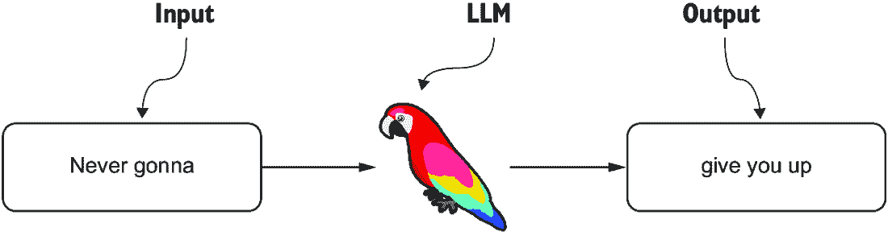
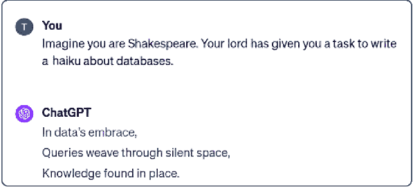
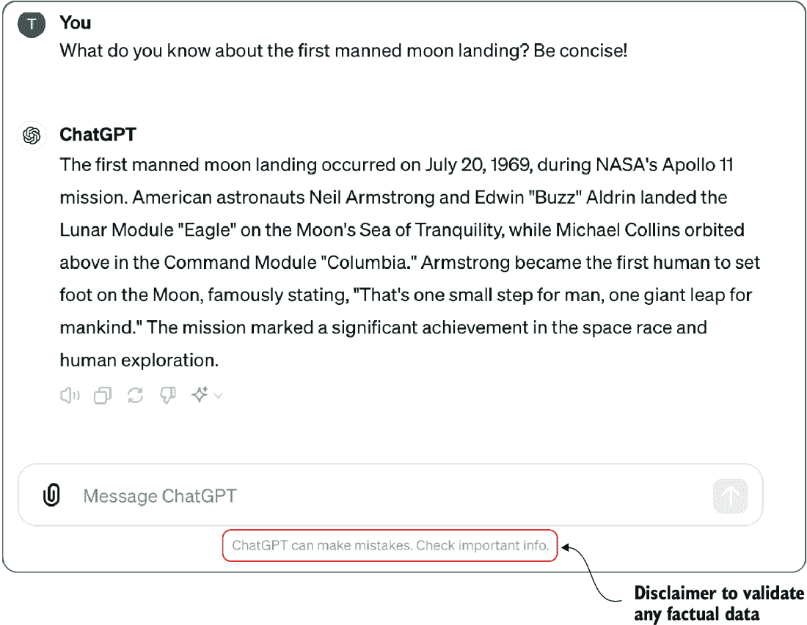
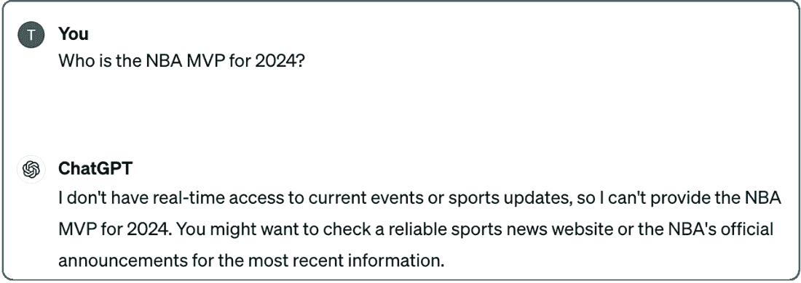
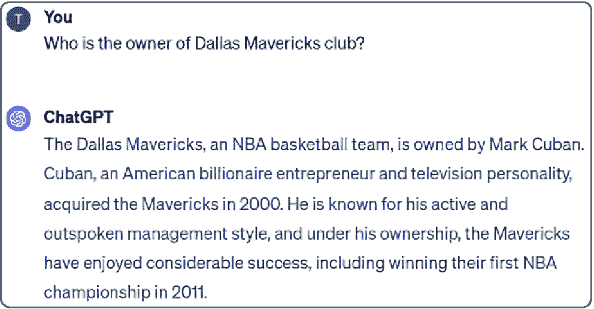
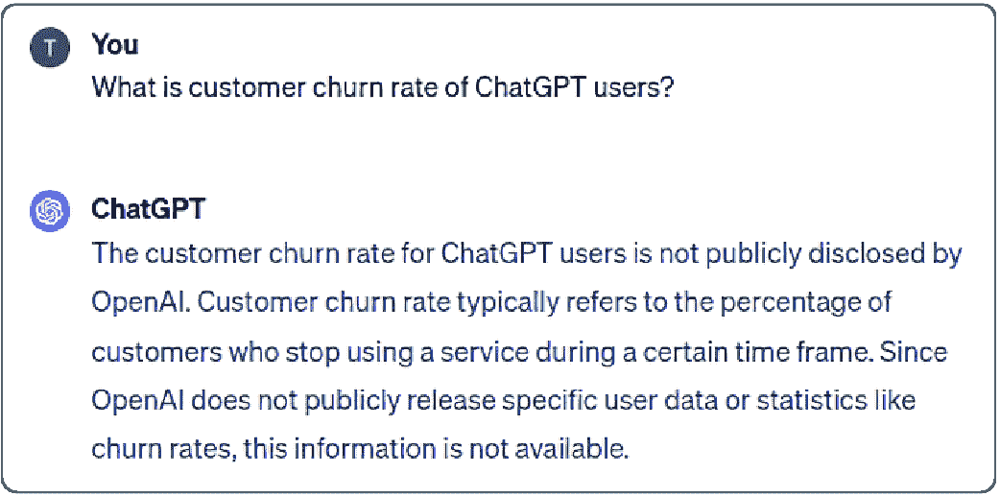
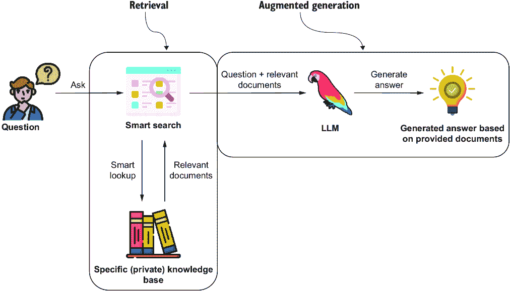
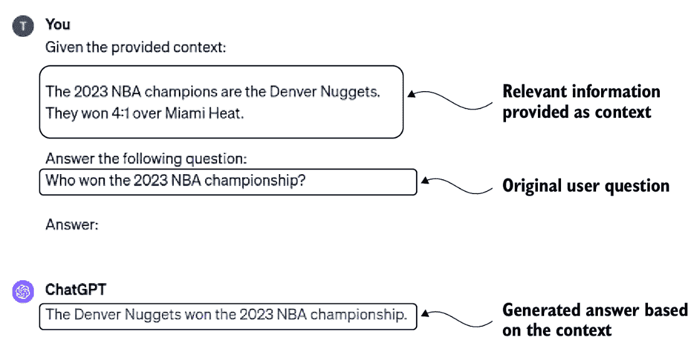
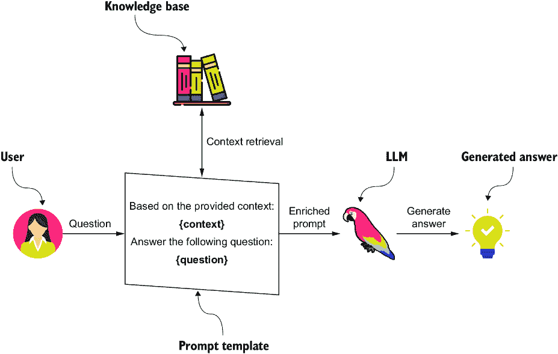
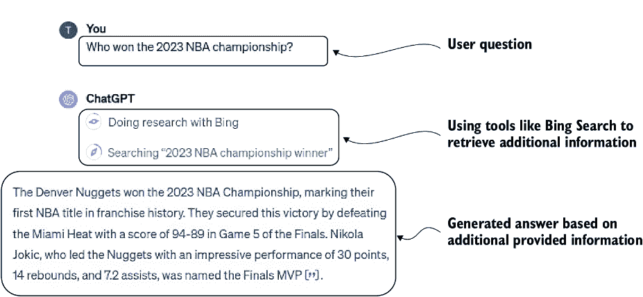

# 第一章：提高 LLM 的准确性

### 本章涵盖

+   大型语言模型

+   大型语言模型的局限性

+   持续微调模型的不足

+   检索增强生成

+   结合结构化和非结构化数据以支持所有类型的问题

大型语言模型（LLMs）在多个领域展现出了令人印象深刻的能力，但它们存在显著的局限性，影响了它们的实用性，尤其是在需要生成准确和最新信息的情况下。解决这些局限性的一个广泛采用的方法是检索增强生成（RAG），这是一种将 LLM 与外部知识库相结合的工作流程，以提供准确和最新的响应。通过在运行时从可信来源提取数据，RAG 可以显著减少，尽管不能完全消除，幻觉，这是 LLMs 最持久的挑战之一。此外，RAG 允许系统无缝地将通用知识与模型预训练数据中可能没有得到良好表示的特定领域信息相结合。尽管有这些优势，RAG 的实现往往只关注非结构化数据，而忽略了如知识图谱这样的结构化来源的潜力。

知识图谱是实体、它们的属性及其关系的结构化表示，提供了一个语义框架，将结构化和非结构化数据连接起来。例如，客户支持记录是不结构化的文本，而产品目录或用户数据库是结构化的。连接它们意味着使系统能够将关于“我最近的笔记本电脑订单”的对话提及与精确型号、购买日期和保修状态的记录相连接。知识图谱通过实现准确、丰富上下文和互联的信息检索——例如，将关于药物相互作用的客户查询实时链接到结构化的医疗指南、先前案例研究和患者的病史——成为 RAG 的一个关键组件。将知识图谱集成到 RAG 管道中可以克服 LLM 的局限性，增强数据检索，并促进在医疗保健、金融和技术支持等领域的跨领域数据类型管理和使用的整体方法。

本书面向希望构建更稳健、可解释和强大的 RAG 系统的开发者、研究人员和数据从业者。您将学习如何通过知识图谱增强现有的 RAG 架构，以及如何从头开始构建新的 GraphRAG 管道。在这个过程中，您将在数据建模、图构建、检索工作流程和系统评估方面获得实际技能。

在阅读完本书之后，您将清楚地了解 LLMs、RAG 和知识图谱如何交叉，以创建能够解决复杂查询并交付准确、可靠和可解释结果的稳健系统。

## 1.1 LLMs 简介

到现在为止，你可能已经遇到或听说过 ChatGPT，这是对话式 AI 中最突出的例子之一。ChatGPT 是由 OpenAI 开发的一个对话式用户界面，由 LLM（如 GPT-4，OpenAI et al.，2024）提供支持。LLM 建立在 Transformer 架构（Vaswani et al.，2017）之上，这使得它们能够高效地处理和生成文本。这些模型在大量文本数据上训练，使它们能够学习模式、语法、上下文，甚至一定程度上的推理。训练过程涉及向模型提供包含各种文本的大型数据集，主要目标是使模型能够准确预测序列中的下一个单词。这种广泛的接触使模型能够根据从数据中学到的模式理解和生成类似人类的文本。例如，如果你将“Never gonna”作为输入给 LLM，你可能会得到类似于图 1.1 所示的响应。

图 1.1 展示了一个 LLM 处理输入“Never gonna”并生成输出“give you up”的过程。这突显了 LLM 如何依赖于在训练期间学习的模式和相关联，例如从常见的文化参考中得出的，包括流行音乐。这些响应的质量和相关性在很大程度上取决于训练数据集的多样性和深度，这决定了 LLM 识别和复制此类模式的能力。

##### 图 1.1 LLM 被训练来预测下一个单词。

虽然 LLM 在生成上下文相关的文本方面表现出色，但它们远不止是自动完成系统。它们遵循指令和适应广泛任务的能力令人印象深刻。例如，如图 1.2 所示，你可以要求 ChatGPT 以特定风格就特定主题生成俳句。这种能力不仅体现了模式识别，还体现了对特定任务指令的理解，能够产生超越简单文本预测的创造性和细微的输出。

##### 图 1.2 使用 ChatGPT 写俳句

LLM 遵循指令和生成多样化、复杂输出的能力，无论是创作俳句还是提供结构化响应，都超越了简单地预测序列中的下一个单词。这种理解和执行详细指令的能力使 LLM 非常适合广泛的任务。在这本书中，你将利用这种遵循指令的能力来设计和优化 RAG 管道。通过利用遵循指令的能力，你可以更有效地集成检索组件，针对特定上下文定制响应，并优化你的系统以提高准确性和可用性。

ChatGPT 的通用知识范围同样引人注目。例如，图 1.3 展示了当被提示关于第一次载人登月时 ChatGPT 的响应。

##### 图 1.3 从 ChatGPT 检索事实信息

如果你用来自 NASA 或维基百科的外部信息来验证这个回答，你可以观察到模型产生了一个准确无误的回答，没有错误信息。这样的回答可能会让你觉得 LLM 构建了一个庞大的事实数据库，可以从其中检索信息。然而，模型并不存储其训练数据集中的具体事实、事件或信息。相反，它发展了其训练语言复杂数学表示。记住，LLMs 基于 Transformer，这是一种基于神经网络的深度学习架构，用于预测下一个单词，如图 1.4 所示。

图 1.4 展示了神经网络预测序列中的下一个单词，这与 LLMs 的工作方式相似。中心部分显示了具有多层神经元的网络，通过代表信息流的线条连接。每个连接都有一个权重，例如示例值 0.04，它影响连接的强度。在训练过程中，模型学习这些权重的值以提高其预测能力。当被问及一个具体的历史事件时，LLM 不会从其训练数据中回忆起该事件。相反，它根据其神经网络中学习的权重生成一个回答，类似于预测序列中的下一个单词。因此，虽然 LLMs 可以提供看似知识渊博的答案，但它们的回答是基于这些学习的权重，而不是明确的记忆。正如 Andrej Karpathy 所说：“我们多少理解了它们（LLMs）构建并维护某种知识数据库，但即使这个知识库也非常奇怪、不完美且奇怪”([`www.youtube.com/watch?v=zjkBMFhNj_gat12:40`](https://www.youtube.com/watch?v=zjkBMFhNj_gat12:40))。

##### 图 1.4 基于输入序列单词预测下一个单词的神经网络

## 1.2 LLMs 的限制

LLMs 代表了人工智能进化中的一个里程碑，在众多应用领域提供了令人瞩目的能力。然而，正如任何变革性技术一样，它们也面临着挑战和限制。在接下来的部分，我们将深入探讨一些这些限制及其影响。

### 1.2.1 知识截止问题

最明显的限制是 LLMs 对其训练数据集中未包含的事件或信息一无所知。目前，ChatGPT 了解的信息截止到 2023 年 10 月。例如，如果你问 ChatGPT 关于 2024 年发生的事件，你会得到类似于图 1.5 所示的回答。

在大型语言模型的背景下，*知识截止日期*指的是模型训练数据中包含信息的最新点。模型可以访问包含有关截止日期之前事件信息的广泛文本数据，这些数据来自不同的来源，它利用这些数据生成回复和提供信息。任何在截止日期之后发生或发表的事情，由于它没有被包含在训练数据集中，因此模型不知道，因此它不能提供关于截止日期之后发生的事件、发展或研究的信息。

##### 图 1.5 知识截止日期声明示例

### 1.2.2 过时信息

另一个不那么明显的限制是，大型语言模型有时会提供过时的回复。尽管它们可以提供详细和准确的信息，直到它们的截止日期，但它们可能不会反映最近的发展。例如，截至 2023 年底，马克·库班将其在达拉斯小牛队股份中的多数股权出售给阿德尔森家族和杜蒙特家族，同时保留少数股权。这一重大更新突显了过去正确的信息如何变得过时。例如，在关于达拉斯小牛队的查询中，图 1.6 中显示的回复反映了库班是唯一的所有者，这已经不再准确（Rader，2023）。

##### 图 1.6 有时 ChatGPT 会回复过时的信息。

这突显了定期更新模型训练数据或使它们能够访问实时信息的重要性。随着事件和事实的不断演变，即使是所有权结构这样的小细节也可能对我们感知一个组织或个人产生重大影响。这种限制强调了确保人工智能系统在动态环境中保持准确和相关的必要性。

### 1.2.3 纯幻觉

另一个大型语言模型广为人知的限制是，它们倾向于提供自信、肯定的答案——即使这些答案包含错误或编造的信息。人们可能会假设，尽管它们的截止日期，这些模型提供的数据直到那个点都是准确的。然而，甚至关于截止日期之前发生的事件的信息也可能不可靠。

这种情况的一个显著例子发生在美国律师提交了由 ChatGPT 生成的虚假、虚构的法律引证到法庭，而他们并不知道这些引证是由 ChatGPT 生成的（Neumeister，2023）。这类自信的不准确通常被称为幻觉，即模型输出看似合理但实际上是错误或完全编造的信息。外部引用，如 URL、学术引用或 WikiData IDs 这样的标识符，特别容易产生这种行为。

幻觉发生是因为 LLMs（大型语言模型）不是推理引擎。它们是基于其训练数据中的模式训练出来的概率语言模型，预测出听起来像是一个好的下一个标记。它们不知道事实，就像人类那样。相反，它们通过猜测最可能的后续内容来生成文本，无论其是否真实。这种统计模式匹配与实际理解之间的基本差异是 LLMs 与人类认知的区别。

为了说明这一点，我们可以要求 ChatGPT 提供达拉斯小牛 NBA 球队的 WikiData ID。如图 1.7 所示，模型自信地返回了一个标识符——但它是不正确的。

##### 图 1.7 ChatGPT 可以生成包含错误信息的回复。

模型断然回复了一个遵循 WikiData 格式的 ID。然而，如果你验证这个信息，你会观察到 Q152232 是电影《Womanlight》的 WikiData ID（[`www.wikidata.org/wiki/Q152232`](https://www.wikidata.org/wiki/Q152232)）。因此，用户必须认识到，尽管 LLMs 通常很有信息量，但它们并非完美无缺，可能会产生错误信息。批判性地对待它们的回复，并通过可靠的外部来源验证其准确性至关重要，特别是在精确性和事实正确性至关重要的环境中。

### 1.2.4 缺乏私人信息

如果你正在使用 LLM 构建一个公司聊天机器人，你可能会希望它能够回答涉及内部或专有信息的问题，这些信息不是公开可用的。在这种情况下，即使信息或事件发生在 LLM 的知识截止日期之前，它们也不会成为其训练数据的一部分。因此，该模型无法为这类查询生成准确的回复，如图 1.8 所示。

##### 图 1.8 ChatGPT 在训练期间没有访问某些私人或机密信息。

一种可能的解决方案是将公司的内部信息公开，希望它被包含在 LLM 的训练数据集中。然而，这种方法既不实用也不安全。相反，我们将探索并展示更有效的策略来克服这些限制，同时保持数据隐私和控制。

##### 关于 LLMs 其他局限性的说明

虽然这本书将重点关注 LLMs 在提供事实正确和最新信息方面的局限性，但承认 LLMs 也有其他限制是很重要的。其中一些包括

+   *回复中的偏见*——LLMs 有时会生成带有偏见的回复，反映了训练数据中存在的偏见。

+   *缺乏理解和上下文*——尽管 LLMs 非常复杂，但它们并不真正理解文本。它们根据从数据中学习到的模式处理语言，这意味着它们可能会错过细微差别和上下文细微之处。

+   *易受提示注入攻击的影响*—LLMs 容易受到提示注入攻击，恶意用户精心设计输入以操纵模型生成不适当、有偏见或有害的响应。这种漏洞对确保 LLM 应用在现实场景中的安全和完整性构成了重大挑战。

+   *不一致的响应*—大型语言模型（LLMs）在多次交互中可能会对同一问题给出不同的答案。这种不一致性源于它们的概率性质和缺乏持久记忆，这可能会阻碍它们在需要稳定性和可重复性的应用中的有用性。

本书致力于探索和解决 LLMs 在生成事实准确和最新响应方面的具体局限性。尽管我们认识到 LLMs 的其他局限性，但我们的讨论将不会涉及它们。

## 1.3 克服 LLMs 的局限性

LLMs 是强大的工具，但它们在处理特定领域的问题或访问专业、最新知识时往往面临局限性。在商业环境中实施类似 ChatGPT 的应用需要既精确又符合事实的输出。为了克服这些挑战，我们可以通过监督微调和 RAG 等方法将特定领域的知识注入 LLMs。在本节中，我们将探讨这些方法是如何工作的，以及如何将它们应用于将特定领域知识注入 LLMs。

### 1.3.1 监督微调

起初，我们中的许多人认为我们可以通过额外的训练来克服 LLMs 的局限性。例如，我们可以通过持续更新模型来克服知识截止日期的局限性。然而，为了有效地解决这个问题，我们首先需要更好地理解 LLMs 的训练。像 ChatGPT 这样的 LLMs 的训练可以分解为以下四个阶段，如 Andrew Karpathy 所述（[`www.youtube.com/watch?v=bZQun8Y4L2A`](https://www.youtube.com/watch?v=bZQun8Y4L2A)）：

1.  *预训练*—模型阅读大量文本，通常超过万亿个标记，以学习基本语言模式。它练习预测句子中下一个单词。这是基础步骤，就像在学习写作之前先学习词汇和语法一样。这是最资源密集的阶段，可能需要数千个 GPU，并且可能需要数月的持续训练。

1.  *监督微调*—模型被提供高质量对话的特定示例，以提高其像有帮助的助手一样响应的能力。它继续练习语言，但现在专注于生成有用和准确的响应。把它想象成从基本语言学习到练习对话技能的转变。这比预训练需要显著更少的资源，对于较小的 LLMs，现在甚至可以在单个笔记本电脑上运行。

1.  *奖励建模* — 模型通过比较对同一问题的不同答案来学习区分好与坏的回答。这就像有一个教练向模型展示良好表现的样子，以便它能努力复制这种质量。

1.  *强化学习* — 模型通过与用户或模拟环境互动，根据反馈进一步细化其回答。这类似于学习一项运动：不仅通过练习，还要通过实际比赛并从经验中学习。

由于预训练阶段成本高昂且耗时，因此不适合持续更新，因此想法是利用监督微调阶段来克服 LLM 的局限性。在监督微调阶段，你向语言模型提供特定输入提示的示例，以及你希望模型产生的相应期望输出。图 1.9 展示了这样一个示例。

##### 图 1.9 监督微调数据集的样本记录

图 1.9 展示了一个可用于微调 LLM 的问答对示例。在这个例子中，输入提示或问题是关于哪个队伍赢得了 2023 年 NBA 总冠军，相应的答案是丹佛掘金队。理论上是，通过这个例子，LLM 会将其包含在其语言的数学表示中，并能够回答围绕 2023 年 NBA 冠军的问题。一些研究已经表明，监督微调可以提高 LLM 的真实性（Tian 等人，2023 年）。然而，其他使用不同方法的研究也表明，LLM 在通过微调学习新事实信息方面存在困难（Ovadia 等人，2023 年）。

虽然监督微调可以增强模型的整体知识，但它仍然是一个复杂且不断发展的研究领域。因此，在当前技术发展阶段，在生产环境中部署一个可靠、经过微调的语言模型面临着重大挑战。幸运的是，存在一种更高效、更简单的方法来解决 LLM 的知识局限性。

### 1.3.2 检索增强生成

提高 LLM 准确率并克服其局限性的第二种策略是 RAG 工作流程，该流程结合了 LLM 和外部知识库，以提供准确和最新的回答。而不是依赖于 LLM 的内部知识，相关事实或信息直接在输入提示中提供（Lewis 等人，2020 年）。这个概念（RAG）利用了 LLM 在理解和生成自然语言方面的优势，而事实信息则通过提示提供，从而减少了对外部知识库的依赖，并因此减少了幻觉。

RAG 工作流程分为两个主要阶段：

+   检索

+   增强生成

在检索阶段，相关信息从外部知识库或数据库中定位。在增强生成阶段，检索到的信息与用户的输入相结合，以增强提供给 LLM 的上下文，使其能够生成基于可靠、外部事实的响应。RAG 工作流程如图 1.10 所示。

##### 图 1.10 将相关信息作为输入提供给 LLM

如前所述，LLM 擅长理解自然语言并遵循提示中的指令。在 RAG 工作流程中，目标转向任务导向的响应生成，其中 LLM 遵循一系列指令。该过程涉及使用检索工具从特定知识库中检索相关文档。然后，LLM 根据提供的文档生成答案，确保响应准确、上下文相关，并符合特定指南。这种系统方法将答案生成过程转化为一个目标任务，即检查和使用检索到的信息来生成最终答案。在输入提示中提供事实信息的示例如图 1.11 所示。

图 1.11 展示了 LLM 如何遵循 RAG 工作流程的提示指令的示例。提示强调了使用检索到的上下文确保准确和相关性响应的重要性，并且可以分解为

+   *提供的内容* — 一个事实陈述，引入相关信息——在这种情况下，确定丹佛掘金队以 4:1 战胜迈阿密热火队成为 2023 年 NBA 冠军。这作为 LLM 的知识库输入。

+   *用户查询* — 一个具体的问题，“谁赢得了 2023 年 NBA 冠军？”这个问题指导 LLM 从提供的内容中提取相关信息。

+   *生成的答案* — LLM 的响应与检索到的上下文一致：“丹佛掘金队赢得了 2023 年 NBA 冠军。”

##### 图 1.11 将相关信息作为提示的一部分提供

你可能会想知道，如果用户必须提供内容和问题，RAG 过程的优点是什么。在实践中，检索系统独立于用户操作。用户只需要提供问题，而检索过程在幕后进行，如图 1.12 所示。

##### 图 1.12 将用户和知识库中的相关信息填充到提示模板中，然后传递给 LLM 生成最终答案

在 RAG 过程中，用户首先提出一个问题。在幕后，系统将这个问题转换为一个搜索查询，并从公司文档、知识文章或数据库等来源检索相关信息。高级检索算法找到最合适的内容，然后将这些内容与原始问题结合，形成一个丰富的提示。这个提示被发送到一个 LLM，LLM 根据问题和检索到的上下文生成响应。整个检索过程是自动的，除了用户原始的问题外，不需要额外的输入。这使得 RAG 既无缝又有效，提高了事实准确性，同时减少了幻觉答案的可能性。

RAG 方法因其简单性和高效性而获得了主流的认可。现在，它也成为了 ChatGPT 界面的一个部分，其中 LLM 可以在生成最终答案之前使用网络搜索来查找相关信息。ChatGPT 付费版本的用户可能对图 1.13 中描述的 RAG 过程比较熟悉。

##### 图 1.13 ChatGPT 使用网络搜索来查找相关信息以生成一个最新的答案。

虽然 ChatGPT 中 RAG 的确切实现并未公开披露，但我们仍可以尝试推断其内部的工作原理。当 LLM 出于任何原因决定需要获取额外信息时，它可以向网络搜索输入一个查询。我们不清楚它如何精确地导航搜索结果，从网页中解析信息，或者决定已经检索到足够的信息。然而，我们知道它使用了`2023` `NBA` `championship` `winner`关键词作为网络搜索的输入，并根据官方 NBA 网站（[`www.nba.com/playoffs/2023/the-finals`](https://www.nba.com/playoffs/2023/the-finals)）上的信息生成了最终响应。

## 1.4 知识图谱作为 RAG 应用的数据存储

在计划实施 RAG 应用时，选择合适的存储解决方案非常重要。虽然有许多数据库选项，但我们认为知识图谱和图数据库特别适合大多数 RAG 应用。知识图谱是一种使用节点表示概念和实体，以及使用关系连接这些节点的数据结构。一个示例知识图谱如图 1.14 所示。

##### **图 1.14 知识图谱可以在单个数据库系统中存储复杂的有结构和无结构数据。**

知识图谱非常灵活，能够存储结构化信息（例如员工详情、任务状态和公司层级）和非结构化信息（例如文章内容）。如图 1.14 所示，这种双重能力使它们特别适合复杂的 RAG 应用。结构化数据允许进行精确和高效的查询以回答诸如“有多少任务分配给特定员工？”或“哪些员工向特定经理汇报？”等问题。例如，在图 1.14 中，如“Sam Altman 是 OpenAI 的首席执行官”或“John Doe 自 2023 年 1 月 1 日起一直是 OpenAI 的员工”这样的结构化数据可以直接查询以回答“OpenAI 的首席执行官是谁？”或“John Doe 在公司工作多久了？”等问题。同样，如“John Doe 被分配给一个状态为完成的任务”这样的结构化关系可以启用精确查询，例如“哪些任务已被员工完成？”或“在 OpenAI 中谁被分配到特定任务？”这种能力对于从复杂、相互关联的数据中生成可操作的见解至关重要。

另一方面，非结构化数据，如文章文本，通过提供丰富的上下文信息来补充结构化数据，增加了深度和细微差别。例如，图 1.14 中的非结构化文章节点提供了关于新 LLM 模型和嵌入的详细信息，但没有结构化框架，它无法回答诸如“这篇文章与 OpenAI 员工有何关联？”这样的特定查询。

重要的是，仅凭非结构化数据无法回答所有类型的问题。虽然它可以提供开放式或模糊查询的见解，但它缺乏进行精确操作（如过滤、计数或聚合）所需的架构。例如，回答“公司内有多少任务已完成？”或“哪些员工被分配到与 OpenAI 相关的任务？”需要如图 1.14 右侧所示的结构化关系和属性。没有结构化数据，这类查询将需要详尽的文本解析和推理，这既计算成本高又往往不够精确。通过在相同框架中整合结构和非结构化信息，知识图谱能够无缝融合这两个世界，使它们成为在 RAG 应用中高效且准确地回答广泛问题的强大工具。此外，非结构化和结构化数据之间的显式连接解锁了高级检索策略，如将文本中的实体链接到图节点或用源段落上下文化结构化结果，这些策略单独使用任何一种数据类型都难以或无法实现。

## 摘要

+   LLMs，如 ChatGPT，建立在 Transformer 架构之上，通过从大量文本数据中学习模式，使它们能够高效地处理和生成文本。

+   虽然 LLM 在自然语言理解和生成方面表现出惊人的能力，但它们存在固有的局限性，例如知识截止点、可能生成过时或虚构信息，以及无法访问私人或特定领域知识。

+   由于资源限制和定期更新模型的复杂性，对 LLM（大型语言模型）进行持续微调以增强其内部知识库并不可行。

+   RAG 通过将外部知识库与 LLM 结合来解决其局限性，通过直接将相关事实注入输入提示中，提供准确、内容丰富的响应。

+   RAG（检索增强生成）的实现传统上侧重于非结构化数据源，限制了其在需要结构化、精确和相互关联信息任务中的范围和有效性。

+   知识图谱通过节点和关系来表示和连接实体与概念，整合结构化和非结构化数据，以提供全面的数据表示。

+   将知识图谱集成到 RAG 工作流程中增强了其检索和组织上下文相关数据的能力，使 LLM 能够生成准确、可靠和可解释的响应。
