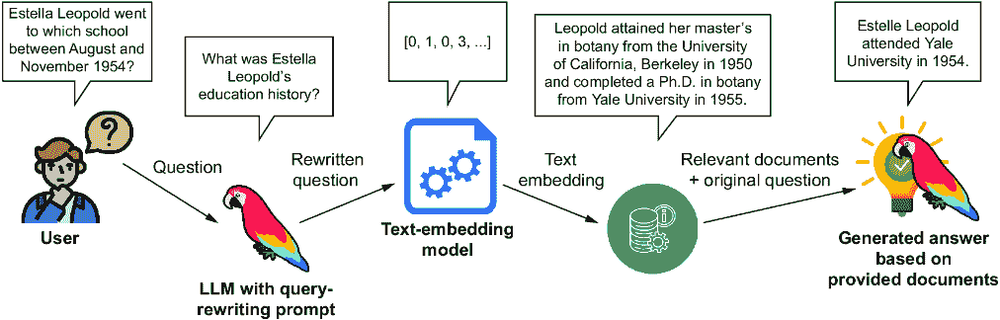
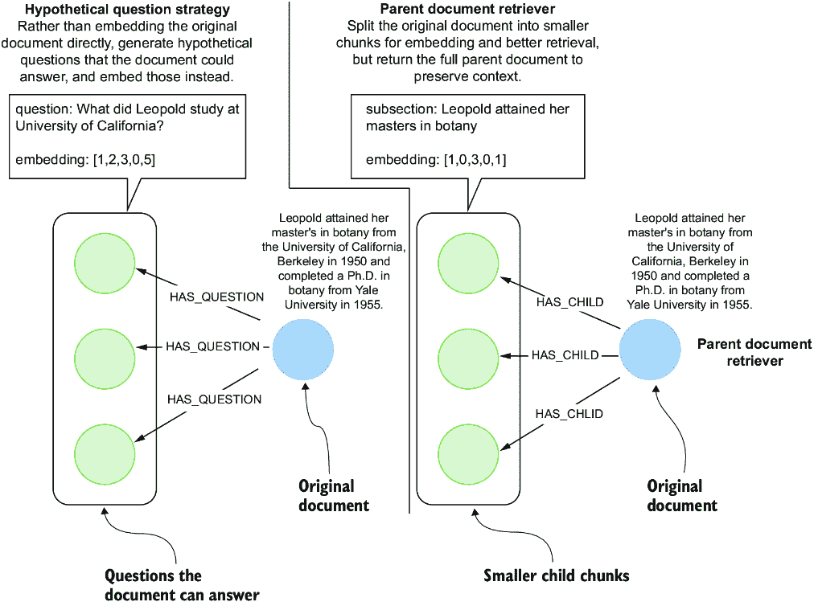
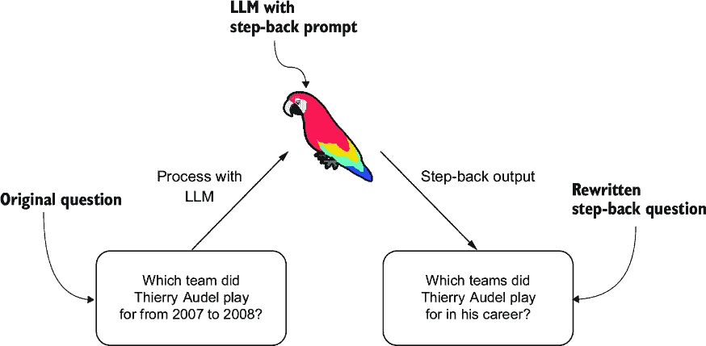
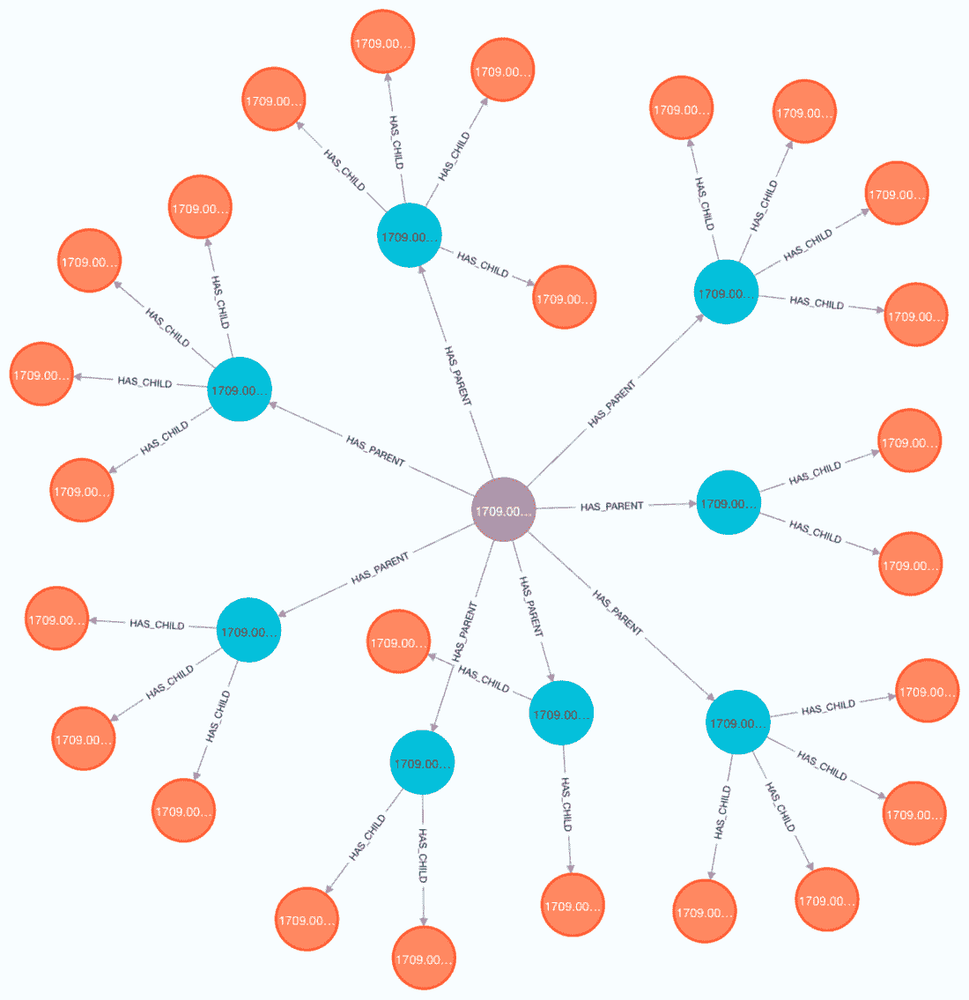

# 3 高级向量检索策略

### 本章涵盖

+   查询重写技术

+   高级文本嵌入策略

+   实现父文档检索

在本书的第二章中，你学习了文本嵌入和向量相似度搜索的基础知识。通过将文本转换为数值向量，你看到了机器如何理解内容的语义意义。结合文本嵌入和向量相似度搜索技术，可以从大量文档中优化并准确地检索相关非结构化文本，从而在 RAG 应用中提供更准确和更新的答案。假设你已经按照第二章的描述实现了并部署了一个 RAG 应用。经过一些测试后，你和 RAG 应用的用户注意到，由于检索到的文档中存在不完整或不相关信息，生成的答案的准确性不足。因此，你被分配了增强检索系统以提高生成答案准确性的任务。

与任何技术一样，文本嵌入和向量相似度搜索的基本实现可能无法产生足够的检索准确性和召回率。由于术语或上下文的不同，从用户查询生成的嵌入可能并不总是与包含所需关键信息的文档的嵌入紧密对齐。这种差异可能导致与查询意图高度相关的文档被忽视，因为查询的嵌入表示未能捕捉到所寻求信息的本质。

提高检索准确性和召回率的一种策略是重写用于查找相关文档的查询。查询重写方法旨在通过以更好地符合目标文档的语言和上下文的方式重构查询，来弥合用户查询和信息丰富的文档之间的差距。这种查询细化提高了找到包含相关信息的文档的机会，从而提高了对原始查询的响应的准确性。查询重写策略的例子有假设性文档检索器（Gao et al., 2022）或回退提示（Zheng et al., 2023）。回退提示策略在图 3.1 中进行了可视化。



##### 图 3.1 使用回退技术进行查询重写以提高向量检索准确度

图 3.1 概述了一个过程，其中用户的查询被转换以改善文档检索结果，这种技术被称为*回退提示*。在所提出的场景中，用户就埃斯特拉·利奥波德在特定时间段内的教育历史提出了一个详细的问题。然后，这个初始问题被一个具有查询重写能力的语言模型（如 GPT-4）处理，将其改写为一个更一般的问题，关于埃斯特拉·利奥波德的教育背景。这一步骤的目的是在搜索过程中撒更宽的网，因为重写的查询更有可能与可能包含所需信息的各种文档相匹配。

提高检索准确性的另一种方法是改变文档嵌入策略。在上一章中，你嵌入了一段文本，检索了相同的文本，并将其作为输入到 LLM（大型语言模型）中生成答案。然而，向量检索系统是灵活的，因为你不仅限于嵌入你计划检索的确切文本。相反，你可以嵌入更好地代表文档意义的文本，例如更具情境相关性的部分、合成问题或改写版本。这些替代方案可以更好地捕捉关键思想和主题，从而实现更准确和相关的检索。图 3.2 展示了两个高级嵌入策略的示例。



##### 图 3.2 假设性问题与父文档检索策略

图 3.2 的左侧展示了假设性问题策略。在假设性问题-嵌入策略中，你必须确定文档中的信息可以回答的问题。例如，你可以使用 LLM 生成假设性问题，或者你可以使用你的聊天机器人的对话历史来提出文档可以回答的问题。其想法是，而不是嵌入原始文档本身，你嵌入文档可以回答的问题。例如，图 3.2 中用向量 `[1,2,3,0,5]` 编码的问题“利奥波德在加州大学学习了什么？”当用户提出问题时，系统计算查询的嵌入并搜索预计算的查询嵌入中的最近邻。目标是定位与用户问题密切匹配且语义相似的问题。然后，系统检索包含可以回答这些相似问题的信息的文档。本质上，假设性问题-嵌入策略涉及嵌入文档可以回答的潜在问题，并使用这些嵌入来匹配和检索用户查询的相关文档。

图 3.2 的右侧说明了父文档-嵌入策略。在这种方法中，原始文档—被称为父文档—被拆分成更小的单元，称为*子块*，通常基于固定的标记计数。不是将整个父文档作为一个单一单元嵌入，而是为每个子块计算一个单独的嵌入。例如，块“Leopold 获得了她的植物学硕士学位”可能被嵌入为向量 `[1,` `0,` `3,` `0,` `1]`。当用户提交查询时，系统将其与这些子嵌入进行比较，以找到最相关的匹配。然而，系统不仅返回匹配的块，还检索与它关联的整个原始父文档。这允许语言模型在完整的信息上下文中操作，增加了生成准确和完整答案的机会。

这种策略解决了嵌入长文档的常见限制：当你嵌入完整的父文档时，结果向量可能会通过平均模糊不同的观点，使得有效地匹配特定查询变得困难。相比之下，将文档拆分成更小的块可以允许更精确的匹配，同时仍然在需要时使系统能够返回完整的上下文。

##### 其他提高检索准确性的策略

除了改变文档嵌入策略之外，还有其他几种技术可以增强检索准确性：

+   *微调文本嵌入模型*—通过在特定领域的数据上调整嵌入模型，你可以提高其捕捉用户查询上下文的能力，从而与相关文档实现更接近的语义匹配。请注意，微调通常需要更多的计算和基础设施。此外，一旦模型更新，所有现有的文档嵌入都必须重新计算以反映这些变化—对于大型文档库来说，这可能非常耗费资源。

+   *重排序策略*—在检索到一组初始文档后，重排序算法可以根据用户意图的相关性对它们进行重新排序。这一轮处理通常使用更复杂的模型或评分启发式方法来细化结果。重排序有助于揭示最相关的内容，即使初始匹配不是最优的。

+   *基于元数据的上下文过滤*—许多文档包含结构化元数据，如作者、发布日期、主题标签或来源类型。根据这些元数据应用过滤器—无论是手动还是作为检索流程的一部分—可以在语义分析之前显著缩小候选文档的范围。

+   匹配，提高精确度。例如，关于最近政策更新的查询可以限制在去年发布的文档中。

+   *混合检索（关键词+密集向量搜索）*—结合稀疏检索（例如，基于关键词的搜索）和密集向量检索（语义搜索）可以兼得两者之长。关键词搜索擅长精确匹配和罕见术语，而密集检索则捕捉更广泛的意义。混合系统可以合并和重新排序两种方法的结果，以最大化召回率和精确率。

虽然所有这些策略都可以提高检索质量，但详细的实现指南超出了本书的范围，除了混合检索，这在第二章中已介绍。

在本章的剩余部分，我们将从概念转向代码，逐步介绍实现过程。为了跟上，你需要访问一个运行中的空白 Neo4j 实例。这可以是一个本地安装或云托管实例；只需确保它是空的。你可以直接在附带的 Jupyter 笔记本中跟随实现，笔记本地址为：[`github.com/tomasonjo/kg-rag/blob/main/notebooks/ch03.ipynb`](https://github.com/tomasonjo/kg-rag/blob/main/notebooks/ch03.ipynb)。

想象你已经实现了第二章中的基本 RAG 系统，但检索准确性还不够高。响应缺乏相关性或遗漏了重要背景，你怀疑系统没有检索到最有用的文档来支持高质量的答案。为了解决这个问题，你决定通过添加回溯提示步骤来提高查询本身的质量，以增强现有的 RAG 管道。此外，你将切换到父文档检索策略。这种方法通过匹配更小的块来提供更精细和准确的检索，同时仍然提供完整的父文档作为背景。

这些改进旨在提高检索内容的关联性和生成答案的整体准确性。

## 3.1 回溯提示

如前所述，回溯提示是一种查询重写技术，旨在提高向量检索的准确性。原始论文（Zheng 等人，2023 年）中的一个例子展示了这一过程：具体查询“Thierry Audel 在 2007 年至 2008 年间为哪支球队效力？”被扩展为“Thierry Audel 在其职业生涯中为哪些球队效力？”以提高向量搜索的精确性，从而提高生成答案的准确性。通过将详细问题转化为更广泛、更高层次查询，回溯提示简化了向量搜索过程。其理念是，更广泛的查询通常包含更全面的信息范围，这使得模型更容易识别相关事实，而不会因具体细节而陷入困境。

作者使用了 LLM 进行查询重写任务，如图 3.3 所示。



##### 图 3.3 使用 LLM 的回溯方法重写查询

LLM 对于查询重写任务非常适用，因为它们在自然语言理解和生成方面表现出色。你不需要为每个任务训练或微调新的模型。相反，你可以在输入提示中提供任务指令。

回退提示论文的作者使用了以下列表中的系统提示来指导 LLM 如何重写输入查询。

##### 列表 3.1 LLM 生成回退问题的系统提示

```py
stepback_system_message = f"""    
You are an expert at world knowledge. Your task is to step back #1
and paraphrase a question to a more generic step-back question, which
is easier to answer. Here are a few examples

"input": "Could the members of The Police perform lawful arrests?" #2
"output": "what can the members of The Police do?"

"input": "Jan Sindel’s was born in what country?"
"output": "what is Jan Sindel’s personal history?"
"""
```

#1 查询重写指令

#2 少样本示例

列表 3.1 中的系统提示首先给 LLM 一个简单指令，将用户的提问重写为一个更通用的、回退版本。这种指令本身被称为 *零样本提示*，它完全依赖于 LLM 的一般能力和对任务的了解，而不提供任何示例。然而，为了更有效地引导模型并确保结果的一致性，作者选择通过几个期望释义行为的示例来扩展提示。这种技术被称为 *少样本提示*，其中在提示中包含少量示例（通常是两到五个）来展示任务。少样本提示通过将任务锚定在具体实例中，有助于 LLM 更好地理解预期的转换，从而提高输出质量和可靠性。

要实现查询重写，你只需要将列表 3.1 中的系统提示与用户的提问一起发送给 LLM。这个任务的特定功能将在下一个列表中概述。

##### 列表 3.2 生成回退问题的函数

```py
def generate_stepback(question: str):
    user_message = f"""{question}"""
    step_back_question = chat(
        messages=[
            {"role": "system", "content": stepback_system_message},
            {"role": "user", "content": user_message},
        ]
    )
    return step_back_question
```

你现在可以通过执行下面的代码来测试回退提示生成。

##### 列表 3.3 执行回退提示函数

```py
question = "Which team did Thierry Audel play for from 2007 to 2008?"
step_back_question = generate_stepback(question)
print(f"Stepback results: {step_back_question}")
# Stepback results: What is the career history of Thierry Audel?
```

列表 3.3 中的结果展示了回退提示生成函数的成功执行。通过将关于 Thierry Audel 2007 年至 2008 年团队的特定查询转换为关于他整个职业生涯的更广泛问题，该函数有效地扩展了上下文，并应提高检索准确性和召回率。

##### 练习 3.1

为了探索回退提示生成的有效性，尝试将其应用于各种问题，并观察它如何扩展上下文。你还可以更改系统提示，观察它如何影响输出。

## 3.2 父文档检索器

父文档检索策略涉及将大文档分成更小的部分，计算每个部分的嵌入而不是整个文档，并使用这些嵌入来更准确地匹配用户查询，最终检索整个文档以提供丰富的上下文响应。然而，由于你不能直接将整个 PDF 输入到 LLM 中，你首先需要将 PDF 分成父文档，然后将这些父文档进一步分成子文档进行嵌入和检索。父文档和子文档的图表示如图 3.4 所示。


##### 图 3.4 父文档图表示

图 3.4 展示了一种基于图的方法来存储和组织文档，以实现父文档检索策略。在顶部，一个 PDF 节点代表整个文档，带有标题和标识符。此节点连接到多个父文档节点。在这个例子中，你将使用 2,000 个字符的限制来分割 PDF 成父文档。这些父文档节点反过来又连接到子文档节点，每个子节点包含对应父节点文本的 500 个字符块。子节点有一个表示文本子块的嵌入向量，用于检索目的。

我们将使用与第二章相同的文本，这是一篇由 Asis Kumar Chaudhuri 撰写的论文，标题为“爱因斯坦的专利和发明”（[`arxiv.org/abs/1709.00666`](https://arxiv.org/abs/1709.00666)）。此外，在将文档分割成更小的部分进行处理时，最好首先根据结构元素如段落或章节来分割文本。这种方法保持了内容的连贯性和上下文，因为段落或章节通常封装了完整的思想或主题。因此，我们将首先将 PDF 文本分割成章节。

##### 列表 3.4 使用正则表达式将文本分割成章节

```py
import re
def split_text_by_titles(text):
    # A regular expression pattern for titles that
    # match lines starting with one or more digits, an optional uppercase letter,
    # followed by a dot, a space, and then up to 60 characters
    title_pattern = re.compile(r"(\n\d+[A-Z]?\. {1,3}.{0,60}\n)", re.DOTALL)
    titles = title_pattern.findall(text)
    # Split the text at these titles
    sections = re.split(title_pattern, text)
    sections_with_titles = []
    # Append the first section
    sections_with_titles.append(sections[0])
    # Iterate over the rest of the sections
    for i in range(1, len(titles) + 1):
        section_text = sections[i * 2 - 1].strip() + "\n" +
↪ sections[i * 2].strip()
        sections_with_titles.append(section_text)

    return sections_with_titles

sections = split_text_by_titles(text)
print(f"Number of sections: {len(sections)}")
# Number of sections: 9
```

列表 3.4 中的 `split_text_by_titles` 函数使用正则表达式按章节分割文本。该正则表达式基于这样一个事实，即文本中的章节组织为一个编号列表，其中每个新的章节以一个数字和一个可选字符开始，后跟一个点和章节标题。`split_text_by_titles` 函数的输出是九个章节。如果你检查 PDF，你会注意到只有四个主要章节。然而，还有四个子章节（3A–3D）描述了一些专利，如果你将引言摘要视为一个单独的章节，那么总共是九个章节。

在继续使用父文档检索器之前，你需要计算每个章节的标记数，以便更好地理解它们的长度。你将使用由 OpenAI 开发的 `tiktoken` 包来计算给定文本中的标记数。

##### 列表 3.5 计算章节中的标记数

```py
def num_tokens_from_string(string: str, model: str = "gpt-4") -> int:
    """Returns the number of tokens in a text string."""
    encoding = tiktoken.encoding_for_model(model)
    num_tokens = len(encoding.encode(string))
    return num_tokens

for s in sections:
    print(num_tokens_from_string(s))
# 154, 254, 4186, 570, 2703, 1441, 194, 600
```

大多数章节的大小相对较小，最多 600 个标记，这适合大多数 LLM 上下文提示。然而，第三章节有超过 4,000 个标记，这可能导致在 LLM 生成过程中的标记限制错误。因此，你必须将章节分割成父文档，其中每个文档最多有 2,000 个字符。你将使用上一章的 `chunk_text` 来实现这一点。

##### 列表 3.6 将章节分割成最大长度为 2,000 个字符的父文档

```py
parent_chunks = []
for s in sections:
    parent_chunks.extend(chunk_text(s, 2000, 40))
```

##### 练习 3.2

使用`num_tokens_from_string`函数确定每个父文档的标记数。标记数可以帮助您决定预处理中的额外步骤。例如，超过合理标记数的较长的部分应进一步拆分。另一方面，如果某些部分异常简短，包含 20 个标记或更少，您应考虑完全删除它们，因为它们可能不会增加任何信息价值。

而不是在后续步骤中拆分子块并导入它们，您将一次性执行拆分和导入操作。在单个步骤中执行这两个操作允许您跳过稍微复杂一些的存储中间结果的中间数据结构。在导入图之前，您需要定义导入 Cypher 语句。导入父文档结构的 Cypher 语句相对简单。

##### 列表 3.7 用于导入父文档策略图的 Cypher 查询

```py
cypher_import_query = """    #1
MERGE (pdf:PDF {id:$pdf_id})    #2
MERGE (p:Parent {id:$pdf_id + '-' + $id})
SET p.text = $parent
MERGE (pdf)-[:HAS_PARENT]->(p)    #3
WITH p, $children AS children, $embeddings as embeddings
UNWIND range(0, size(children) - 1) AS child_index
MERGE (c:Child {id: $pdf_id + '-' + $id + '-' + toString(child_index)})
SET c.text = children[child_index], c.embedding = embeddings[child_index]
MERGE (p)-[:HAS_CHILD]->(c);
"""
```

#1 根据 id 属性合并 PDF 节点

#2 合并父节点并设置其文本属性

#3 合并每个父节点的多个子节点

列表 3.7 中的 Cypher 语句首先合并一个`PDF`节点。接下来，它使用唯一 ID 合并`Parent`节点。然后，`Parent`节点通过`HAS_PARENT`关系链接到`PDF`节点，并设置`text`属性。最后，它遍历子文档列表。为列表中的每个元素创建一个`Child`节点，设置文本和嵌入属性，并通过`HAS_CHILD`关系将其链接到其`Parent`节点。

现在一切准备就绪，您可以将父文档结构导入到图数据库中。

##### 列表 3.8 将父文档数据导入到图数据库中

```py
for i, chunk in enumerate(parent_chunks):

    child_chunks = chunk_text(chunk, 500, 20) #1

    embeddings = embed(child_chunks) #2
    # Add to neo4j

    neo4j_driver.execute_query( #3
        cypher_import_query,
        id=str(i),
        pdf_id='1709.00666'
        parent=chunk,
        children=child_chunks,
        embeddings=embeddings,
    )
```

#1 将父文档拆分为子块

#2 计算子块的文本嵌入

#3 导入到 Neo4j

列表 3.8 中的代码首先遍历父文档块。每个父文档块使用`chunk_text`函数拆分为多个子块。然后，代码使用`embed`函数计算这些子块的文本嵌入。在嵌入生成之后，`execute_query`方法将数据导入到 Neo4j 图数据库中。

您可以通过在 Neo4j 浏览器中运行以下列表中的 Cypher 语句来检查生成的图结构。

##### 列表 3.9 在子节点上创建向量索引

```py
MATCH p=(pdf:PDF)-[:HAS_PARENT]->()-[:HAS_CHILD]->()
RETURN p LIMIT 25
```

列表 3.9 中的 Cypher 语句生成了图 3.5 所示的图。此图可视化显示了一个中心 PDF 节点连接到多个父节点，说明了文档与其部分之间的层次关系。每个父节点进一步连接到多个子节点，表明文档结构中将部分拆分为更小的块。

为了确保文档嵌入的有效比较，您将添加一个向量索引。

##### 列表 3.10 在子节点上创建向量索引

```py
driver.execute_query("""CREATE VECTOR INDEX parent IF NOT EXISTS
FOR (c:Child)
ON c.embedding""")
```

列表 3.10 中生成向量索引的代码与第二章中使用的代码相同。在这里，你在`Child`的`embedding`属性上创建了一个向量索引。



##### 图 3.5 Neo4j 浏览器中导入数据的一部分的图可视化

### 3.2.1 检索父文档策略数据

在导入数据和定义向量索引后，你可以专注于实现检索部分。要从图中检索相关文档，你必须定义以下列表中描述的检索 Cypher 语句。

##### 列表 3.11 父文档检索 Cypher 语句

```py
retrieval_query = """  
CALL db.index.vector.queryNodes($index_name, $k * 4, $question_embedding) #1
YIELD node, score      #2
MATCH (node)<-[:HAS_CHILD]-(parent)   #3
WITH parent, max(score) AS score
RETURN parent.text AS text, score
ORDER BY score DESC    #4
LIMIT toInteger($k)
"""
```

#1 向量索引搜索

#2 遍历到父文档

#3 去重父文档

#4 确保最终限制

列表 3.11 中的 Cypher 语句首先在图数据库中执行基于向量的搜索，以识别与指定问题嵌入紧密相关的子节点。你可以看到，在初始向量搜索中我们检索了`k` `*` `4`个文档。在初始向量搜索中使用`k` `*` `4`值的原因是，你预计会有多个来自向量搜索的相似子节点实际上属于同一个父文档。因此，去重父文档变得至关重要。如果没有去重，结果集可能会包含多个针对同一父文档的条目，每个条目对应于该父文档的不同子节点。然而，为了保证最终有`k`个唯一的父文档，你从一个更大的`k` `*` `4`个子节点池开始，从而创建了一个安全缓冲区。在 Cypher 语句的末尾，你强制执行最终的`k`限制。

利用列表 3.11 中的 Cypher 语句从数据库中检索父文档的函数如下所示。

##### 列表 3.12 父文档检索函数

```py
def parent_retrieval(question: str, k: int = 4) -> List[str]:
    question_embedding = embed([question])[0]

    similar_records, _, _ = neo4j_driver.execute_query(
        retrieval_query,
        question_embedding=question_embedding,
        k=k,
        index_name=index_name,
    )

    return [record["text"] for record in similar_records]
```

列表 3.12 中的`parent_retrieval`函数首先为给定的问题生成一个文本嵌入，然后使用之前提到的 Cypher 语句从数据库中检索最相关的文档列表。

## 3.3 完整的 RAG 管道

管道的最后一部分是生成答案的函数。

##### 列表 3.13 使用 LLM 生成答案

```py
system_message = "You're en Einstein expert, but can only use the↪
↪ provided documents to respond to the questions."
def generate_answer(question: str, documents: List[str]) -> str:
    user_message = f"""
    Use the following documents to answer the question that will follow:
    {documents}

    ---

    The question to answer using information only from the above↪
↪ documents: {question}
    """
    result = chat(
        messages=[
            {"role": "system", "content": system_message},
            {"role": "user", "content": user_message},
        ]
    )
    print("Response:", result)
```

列表 3.13 中的代码与第二章中的代码相同。你将问题以及相关文档传递给 LLM，并提示它生成答案。

在实现了回溯提示和父文档检索之后，你就可以将所有这些内容整合到一个单独的函数中。

##### **列表 3.14 完整的带有回溯提示的父文档检索 RAG 管道**

```py
def rag_pipeline(question: str) -> str:
    stepback_prompt = generate_stepback(question)
    print(f"Stepback prompt: {stepback_prompt}")
    documents = parent_retrieval(stepback_prompt)
    answer = generate_answer(question, documents)
    return answer
```

列表 3.14 中的`rag_pipeline`函数接收一个问题作为输入并创建一个回溯提示。然后，它根据回溯提示检索相关文档，并将这些文档与原始问题一起传递给 LLM 以生成最终答案。

你现在可以测试`rag_pipeline`的实现。

##### **列表 3.15 带有回溯提示的完整父文档检索器 RAG 流程**

```py
rag_pipeline("When was Einstein granted the patent for his blouse design?")
# Stepback prompt: What are some notable achievements in Einstein's life?
# Response: Einstein was granted the patent for his blouse design on October 27, 1936.
```

##### 练习 3.3

通过询问关于爱因斯坦生平的其他问题来评估 `rag_pipeline` 实现的效果。此外，您还可以移除回溯提示步骤，以比较它是否改善了结果。

恭喜！您已成功通过结合查询重写和父文档检索实现了高级向量搜索检索策略。

## 摘要

+   通过将用户查询与目标文档的语言和上下文更紧密地对齐，查询重写可以提高文档检索的准确性。

+   像假设文档检索器和回溯提示这样的技术有效地弥合了用户意图与文档内容之间的差距，减少了遗漏相关信息的机会。

+   通过嵌入不仅精确文本，还包括上下文相关的摘要或释义，可以捕捉文档的精髓，从而提高检索系统的有效性。

+   通过实施假设问题嵌入和父文档检索等策略，可以实现查询与文档之间更精确的匹配，增强检索信息的关联性和准确性。

+   将文档拆分为更小、更易于管理的块以进行嵌入，允许采用更细粒度的信息检索方法，确保特定查询找到最相关的文档部分。
