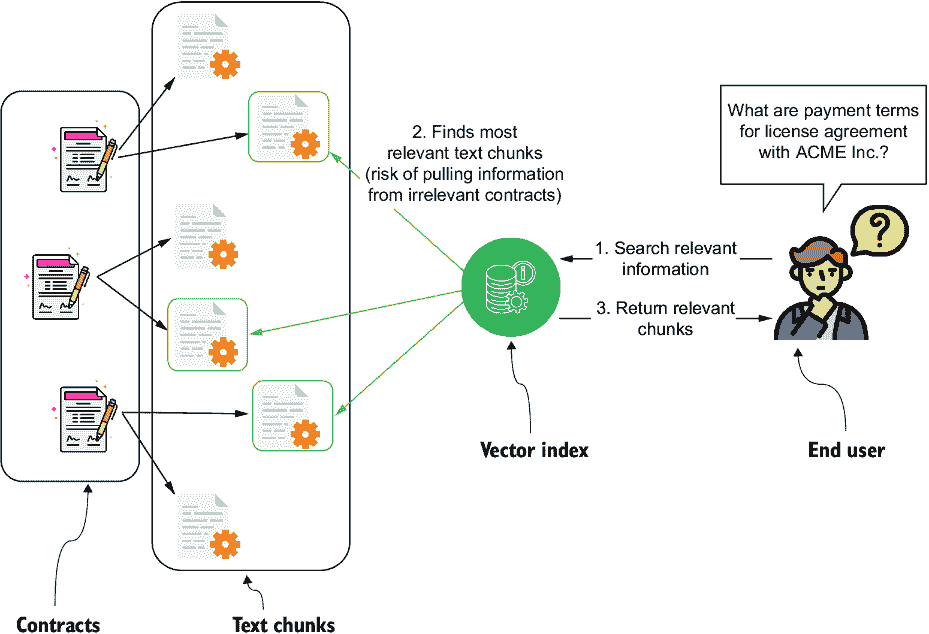
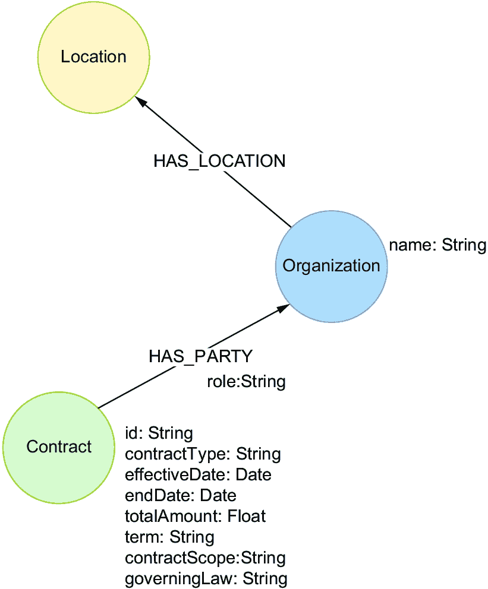
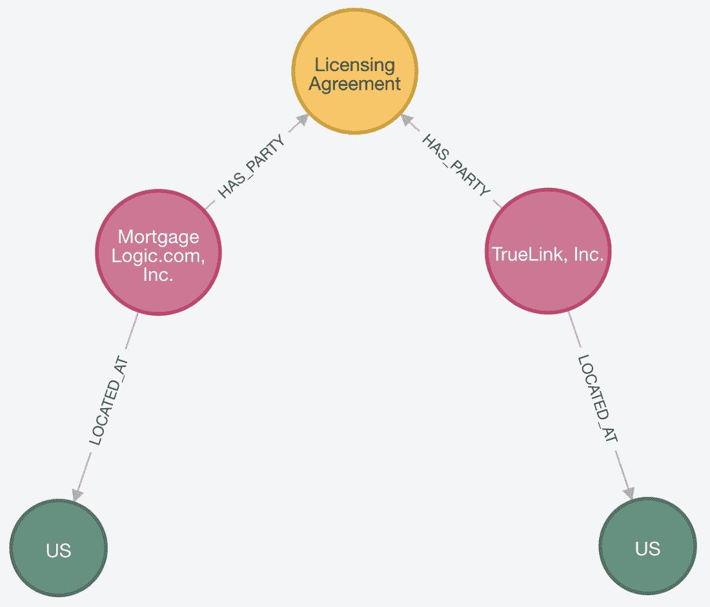
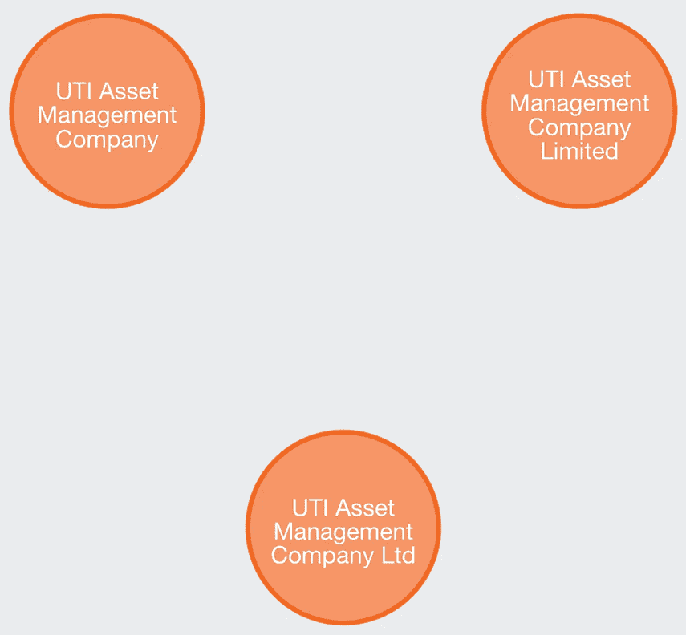
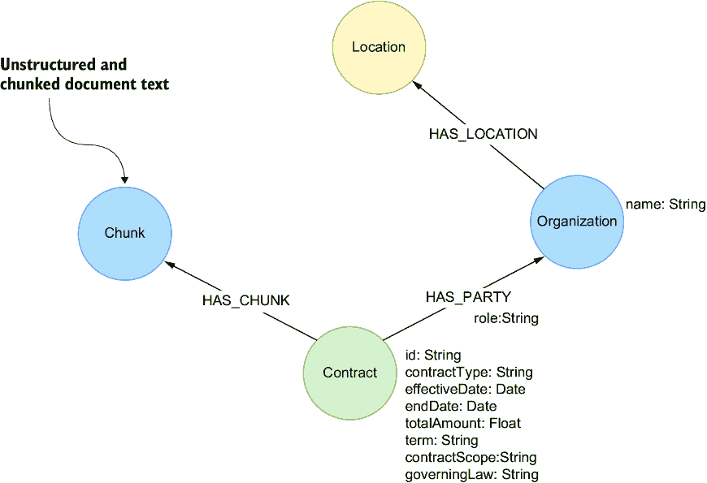

# 6 使用 LLM 构建知识图谱

### 本章涵盖

+   结构化数据提取

+   提取的不同方法

在本章中，您将探索使用 LLM 从非结构化来源，如文本文档，构建知识图谱的过程。重点将放在 LLM 如何从原始文本中提取和结构化数据，将其转换为构建知识图谱的可使用格式。

在前面的章节中，您学习了文档块分割、嵌入和检索的基本技术（第二章），以及提高检索准确性的更高级方法（第三章）。然而，正如您在第四章中学到的，在需要将数据进行结构化以回答需要过滤、计数或聚合操作的问题的情况下，仅依赖文本嵌入会导致挑战。为了解决仅使用文本嵌入的局限性，您将学习如何使用 LLM 将非结构化数据转换为适合知识图谱构建的结构化格式，进行自动数据提取。到本章结束时，您将能够从原始文本中提取结构化信息，为提取的数据设计知识图谱模型，并将这些数据导入图数据库。

您将从探索法律文件检索中一个常见的挑战——管理多个合同及其条款——开始，并了解结构化数据提取如何提供解决方案。在整个章节中，您将跟随示例，说明这个过程，并逐步引导您通过从非结构化文本构建知识图谱的工作流程。

## 6.1 从文本中提取结构化数据

在线找到的大部分信息，甚至在公司内部，都存在于各种文档等非结构化格式中。然而，在某些情况下，仅使用文本嵌入的简单检索技术不足以解决问题。法律文件就是一个例子。

例如，如果您在询问与 ACME 公司签订的合同中的付款条款，确保条款确实来自该特定合同，而不是其他合同，是至关重要的。当您简单地跨多个法律文件进行块分割和检索时，检索到的最上面的`k`个块可能来自不同的、无关的文档，导致混淆，如图 6.1 所示。



##### 图 6.1 基本的向量检索策略可能会从各种合同中返回块。

图 6.1 说明了合同文档是如何被分解成文本块并使用文本嵌入进行索引的。当最终用户提出特定问题，例如关于某个特定合同的付款条款时，系统会检索最相关的文本块。然而，如果多个合同包含不同的付款条款，检索过程可能会无意中从多个文档中提取信息，将目标合同的有关部分与来自其他合同的无关部分混合。这是因为系统专注于根据相似性检索排名最高的文本块，而并不总是区分这些块是否来自正确的合同。结果，包含“付款”或“条款”等关键词但属于不同合同的块可能会被包括在内，导致对条款的碎片化和不一致的看法。当 LLM 试图将这些混合块综合成一个连贯的答案时，这种混淆可能会产生，最终增加不准确或误导性信息的风险。

此外，考虑以下问题：我们目前与 ACME 公司有多少活跃合同？要回答这个问题，你首先需要根据合同的有效状态过滤所有合同，然后计算相关合同的数量。这类查询类似于传统的商业智能问题，而文本嵌入方法在这些方面存在不足。

文本嵌入主要是为了检索语义相似的内容，而不是处理过滤、排序或聚合数据等操作。要处理这些操作，需要结构化数据，因为仅凭文本嵌入本身并不适合这些操作。

对于某些领域，在实施 RAG 应用时，对数据进行结构化至关重要。幸运的是，由于 LLMs 对自然语言的深入理解，它们在从文本中提取结构化数据方面表现出色，这使得它们能够准确识别相关信息。它们可以通过特定的提示进行微调或引导，以定位和提取所需的数据点，将非结构化信息转换为表格或键值对等结构化格式。使用 LLMs 进行结构化数据提取在处理大量文档时尤其有用，因为手动识别和组织此类信息将非常耗时且劳动密集。通过自动化提取过程，LLMs 使企业能够将非结构化信息转换为可操作的、结构化数据，这些数据可以用于进一步分析或 RAG 应用。

假设您在一家公司作为软件工程师工作，并且您是负责构建一个能够根据公司法律文件回答问题的聊天机器人的团队的一员。由于这是一个大规模项目，团队被分为两组：一组专注于数据准备，另一组负责实施第四章和第五章中描述的检索系统。您被分配到数据准备团队，您的任务是处理法律文件并提取结构化信息。这些信息将被用于构建知识图谱，遵循图 6.2 中可视化的工作流程。


##### 图 6.2 使用 LLM 提取结构化数据信息构建知识图谱

图 6.2 中可视化的工作流程从合同文档作为输入开始，使用 LLM 进行处理以提取结构化信息。在法律领域，您可以提取各种细节，例如涉及方、日期、条款等。在这里，结构化输出以 JSON 格式表示，然后这些结构化信息被存储在 Neo4j 中，它将作为法律聊天机器人数据检索的基础。

这两个示例突出了简单文本嵌入在处理特定、结构化查询时的局限性，例如在合同中询问付款条款或计算活跃协议。在这两种情况下，准确的答案需要结构化数据，而不是仅仅依赖于非结构化文本的语义相似性。在本章的剩余部分，我们将更深入地探讨如何有效地使用 LLM 从复杂文档中提取结构化数据，以及这种结构化输出在构建用于高级检索任务的可信知识图谱中的关键作用。为了跟上进度，您需要访问一个运行中的空白 Neo4j 实例。这可以是一个本地安装或云托管实例；只需确保它是空的。您可以直接在以下提供的 Jupyter 笔记本中查看实现：[`github.com/tomasonjo/kg-rag/blob/main/notebooks/ch06.ipynb`](https://github.com/tomasonjo/kg-rag/blob/main/notebooks/ch06.ipynb)。

让我们深入探讨。

### 6.1.1 结构化输出模型定义

从文本中提取结构化数据不是一个新想法；这多年来一直是数据处理中的一个关键任务。历史上，这个过程被称为*信息提取*，需要复杂的系统，通常依赖于多个机器学习模型协同工作。这些系统通常成本高昂且难以维护，需要一支由熟练工程师和领域专家组成的团队来确保它们正确运行。由于这些原因，只有拥有大量资源的组织才能负担得起实施此类解决方案。高昂的成本和技术壁垒使得许多企业和个人无法接触。然而，LLMs 的进步极大地简化了这一过程。如今，用户可以提示 LLM 提取结构化信息，而无需构建和训练多个模型，技术门槛大大降低。这种转变为结构化数据提取打开了广泛的应用场景。

使用 LLMs 提取结构化数据已成为如此常见的用例，以至于 OpenAI 在其 API 中引入了结构化输出功能，以简化并标准化这一过程。此功能允许开发者在事先定义期望的输出格式，确保模型的响应符合特定的结构。结构化输出不是一个单独的库；它是 OpenAI API 的内置功能，可以通过函数调用或模式定义来访问。例如，在 Python 中，开发者通常使用 Pydantic 等库来定义数据模式。然后，这些模式可以传递给模型，指导它产生符合指定格式的输出，如下面的列表所示。

##### 列表 6.1 使用 Pydantic 库定义期望的输出

```py
from pydantic import BaseModel

class CalendarEvent(BaseModel):
    name: str
    date: str = Field(..., description="The date of the event. Use yyyy-MM-dd format")
    participants: list[str]
```

列表 6.1 中的`CalendarEvent`类代表了一种结构化的方式来捕捉关于事件的信息。它包括事件名称、事件发生的日期以及参与者列表。通过明确定义这些属性，它确保任何事件数据都符合这种结构，使得以可靠和一致的方式提取和处理事件信息变得更加容易。属性可用的类型有

+   字符串

+   数字

+   布尔

+   整数

+   对象

+   数组

+   枚举

+   anyOf

让我们考察一下`date`属性的定义。

##### 列表 6.2 `date`属性

```py
date: str = Field(..., description="The date of the event. Use yyyy-MM-dd format")
```

列表 6.2 中的代码提供了如何提取`date`属性数据的说明。将属性命名为`date`向模型发出信号，使其关注与日期相关的信息。通过使用`str`类型，我们指定提取的信息应以字符串形式表示，因为没有可用的本地日期时间类型。此外，`description`说明了期望的`yyyy-MM-dd`格式。这一步至关重要，因为尽管模型知道它正在处理字符串，但描述确保日期遵循特定的格式。没有这种指导，仅`str`类型可能不足以传达预期的输出结构。

结构化输出通过确保 LLM 的响应遵循预定义的架构，显著简化了开发过程。这减少了后处理和验证的需求，使得开发者能够专注于在系统中使用数据。该功能提供了类型安全，确保响应始终正确格式化，并消除了实现一致输出的复杂提示需求，使整个过程更加高效和可靠。

从法律文件中提取结构化输出的第一步是定义需要提取的合同数据模型。由于你不是法律专家，而是软件工程师，因此咨询具有领域知识的人来确定哪些信息最重要是重要的。此外，与最终用户交谈，了解他们想要回答的具体问题，可以提供宝贵的见解。

在这些初步讨论之后，你提出了以下列表所示的合同数据模型。

##### 列表 6.3 使用 Pydantic 对象定义期望的输出

```py
class Contract(BaseModel):
    """
    Represents the key details of the contract.   #1
    """

    contract_type: str = Field(
        ...,
        description="The type of contract being entered into.",
        enum=contract_types,   #2
    )
    parties: List[Organization] = Field(   #3
        ...,
        description="List of parties involved in the contract, with details of each party's role.",
    )
    effective_date: str = Field(
        ...,
        description="The date when the contract becomes effective. Use yyyy-MM-dd format.",   #4
    )
    term: str = Field(
        ...,
        description="The duration of the agreement, including provisions for renewal or termination.",
    )
    contract_scope: str = Field(
        ...,
        description="Description of the scope of the contract, including rights, duties, and any limitations.",
    )
    end_date: Optional[str] = Field(    #5
        ...,
        description="The date when the contract becomes expires. Use yyyy-MM-
    ↪ dd format.",
    )
    total_amount: Optional[float] = Field(
        ..., description="Total value of the contract."
    )
    governing_law: Optional[Location] = Field(
        ..., description="The jurisdiction's laws governing the contract."
    )
```

#1 提取对象的描述

#2 使用 enum 定义 LLM 可以使用的可能值

#3 在本例中，属性可以是对象，如组织。

#4 由于 datetime 类型不可用，你需要定义要提取的日期格式。

#5 你可以使用 Optional 来定义可能不在所有合同中出现的属性。

类名`Contract`以及简洁的文档字符串“表示合同的详细信息”，为 LLM 提供了高级理解，即期望的输出应捕获关键合同信息。这指导模型专注于提取和组织关键细节，例如合同类型、相关方、日期和财务信息。

通常，属性可以分为强制性和可选性。当一个属性是可选的时，你用`Optional`类型来指定，这表示 LLM 该信息可能存在也可能不存在。当信息可能缺失时，标记属性为可选是至关重要的，否则，一些 LLM 可能会尝试填充空白而虚构值。例如，`total_amount`是可选的，因为一些合同仅仅是无货币交换的协议。相反，`effective_date`属性是强制性的，因为你期望每个合同都有一个起始日期。

注意，每个属性都包含一个`description`值，以向 LLM 提供清晰的指导，确保它准确提取所需信息。即使某些属性看似明显，这也是一个好习惯。在某些情况下，你可能还希望指定特定属性的允许值。你可以通过使用`enum`参数来实现这一点。例如，`contract_type`属性使用`enum`参数来告知 LLM 应用的具体类别。以下列表包含了`contract_type`参数的可用值。

##### 列表 6.4 合同类型枚举值

```py
contract_types = [
    "Service Agreement",
    "Licensing Agreement",
    "Non-Disclosure Agreement (NDA)",
    "Partnership Agreement",
    "Lease Agreement"
]
```

显然，列表 6.4 并不详尽，因为还有其他选项可以包含在内。

一些属性可能更复杂，可以定义为自定义对象。例如，`parties`属性是一个`Organization`对象的列表。使用列表是因为合同通常涉及多个当事人，而自定义对象允许提取比特定属性简单的字符串更多的信息。以下列表中的代码定义了`Organization`对象。

##### 列表 6.5 自定义`Organization`对象

```py
class Organization(BaseModel):
    """
    Represents an organization, including its name and location.
    """

    name: str = Field(..., description="The name of the organization.")
    location: Location = Field(
        ..., description="The primary location of the organization."
    )
    role: str = Field(
        ...,
        description="The role of the organization in the contract, such as 
    ↪ 'provider', 'client', 'supplier', etc.", #1
    )
```

#1 如果您没有提供所有可能的值，而是只提供示例，您可以在描述中提供可能的值而不是枚举。

列表 6.5 中的`Organization`对象捕捉了参与合同的组织的关键细节，包括其名称、主要位置和角色。`location`属性是一个嵌套的`Location`对象，允许我们将信息结构化到城市、州和国家等值。如您所见，我们可以有嵌套对象，但典型的建议是避免过多层级的嵌套对象以获得更好的性能。对于`role`属性，我们提供了“提供者”和“客户”等示例，但选择不使用枚举以避免限制值。这种灵活性很重要，因为确切的角色可能各不相同，并且并不完全可预测。通过这种方式定义组织，LLM 被引导提取关于参与方的更详细和结构化的信息。

最后，您需要定义`Location`对象。

##### 列表 6.6 自定义`Location`对象

```py
class Location(BaseModel):
    """
    Represents a physical location including address, city, state, and country.
    """

    address: Optional[str] = Field(
        ..., description="The street address of the location."
    )
    city: Optional[str] = Field(..., description="The city of the location.")
    state: Optional[str] = Field(
        ..., description="The state or region of the location."
    )
    country: str = Field(
        ...,
        description="The country of the location. Use the two-letter ISO standard.",      #1
    )
```

#1 LLM 熟悉用于国家的 ISO 标准，因此您可以指示模型根据特定标准标准化值。

`Location`对象代表一个物理地址，它捕捉了诸如街道地址、城市、州或地区以及国家等详细信息。除了`country`属性外，所有属性都是可选的，这允许在完整的位置详细信息可能不可用的情况下具有灵活性。对于`country`属性，我们指导 LLM 使用两字母的 ISO 标准，以确保一致性，并使其在不同系统之间的工作和加工更加容易。这种结构使得 LLM 能够在必要时提取标准化的、可用的信息，同时允许存在不完整或部分数据。

您现在已定义了合同数据模型，该模型可用于从公司的合同中提取相关信息。此模型将作为指导 LLM 进行结构化数据提取的蓝图。在明确了解数据结构的基础上，现在是时候探索如何有效地提示 LLM 提取这些信息了。

### 6.1.2 结构化输出提取请求

在定义了合同数据模型后，您现在有一个数据定义，LLM 可以遵循以提取结构化信息。下一步是确保 LLM 确切地了解如何以一致格式输出这些数据。这正是 OpenAI 的 Structured Outputs 功能发挥作用的地方。通过使用此功能，您可以引导 LLM 的行为，使其输出严格遵循合同模型的数据，同时使用在前面章节中引入的相同聊天模板。

结构化输出文档([`mng.bz/oZZp`](https://mng.bz/oZZp))使用系统消息来额外引导 LLM（大型语言模型）专注于当前任务。通过使用以下列表中所示的系统消息，您可以提供明确的指令以有效地引导模型的行为。

##### 列表 6.7 结构化输出提取的系统消息

```py
system_message = """
You are an expert in extracting structured information from legal documents and contracts.
Identify key details such as parties involved, dates, terms, obligations, and legal definitions.
Present the extracted information in a clear, structured format. Be concise, focusing on essential
legal content and ignoring unnecessary boilerplate language. The extracted data will be used to address
any questions that may arise regarding the contracts."""
```

提供精确指令以构建理想的系统消息很困难。明确的是，您应该定义领域并为 LLM 提供有关输出将如何使用的上下文。除此之外，这通常归结为试错。

最后，您定义一个函数，该函数接受任何文本作为输入，并输出一个根据合同数据模型定义的字典。

##### 列表 6.8 结构化输出提取的系统消息

```py
def extract(document, model="gpt-4o-2024-08-06", temperature=0):
    response = client.beta.chat.completions.parse(
        model=model,
        temperature=temperature,
        messages=[
            {"role": "system", "content": system_message},   #1
            {"role": "user", "content": document},    #2
        ],
        response_format=Contract,  #3
    )
    return json.loads(response.choices[0].message.content)
```

#1 将系统消息作为第一条消息传递

#2 将文档作为用户消息传递，不附加任何额外指令。

#3 使用 response_format 参数定义输出格式。

列表 6.8 中的 extract 函数处理一个文本文档，并根据合同数据模型返回一个字典。该函数利用了撰写时最新的 GPT-4o 模型，该模型支持结构化输出。该函数发送一个系统消息以引导 LLM，然后是未经修改的原始用户提供的文档文本。然后根据`Contract`数据模型格式化响应，并以字典形式返回。

为了看到这个过程在实际中的应用，现在让我们看看如何使用真实世界的数据集应用这种方法。由于保密性，访问专有合同可能很困难，因此您将使用一个名为 Contract Understanding Atticus Dataset（CUAD）的公共数据集。

### 6.1.3 CUAD 数据集

虽然所有公司都有合同和法律文件，但由于其中包含的信息具有敏感性，这些文件通常不会公开。为了演示目的，我们将使用 CUAD 数据集（Hendrycks 等人，2021 年）中的一个文本文件。CUAD 是为训练 AI 模型理解和审查法律合同而创建的专业语料库。

以下列表显示了一个改进版本。合同可在本书的配套 GitHub 存储库中找到，从而消除了下载整个数据集的需要。代码处理打开文件和读取其内容。

##### 列表 6.9 读取合同文本文件

```py
with open('../data/license_agreement.txt', 'r') as file:
    contents = file.read()    #1
```

#1 读取文件

您现在可以通过执行以下列表中所示的代码来处理合同。

##### 列表 6.10 从文本中提取结构化信息

```py
data = extract(contents)
print(data)
```

结果将类似于以下列表。

##### 列表 6.11 提取结果

```py
{'contract_type': 'Licensing Agreement',
 'parties': [{'name': 'Mortgage Logic.com, Inc.',
   'location': {'address': 'Two Venture Plaza, 2 Venture',
    'city': 'Irvine',
    'state': 'California',
    'country': 'US'},
   'role': 'Client'},
  {'name': 'TrueLink, Inc.',
   'location': {'address': '3026 South Higuera',
    'city': 'San Luis Obispo',
    'state': 'California',
    'country': 'US'},
   'role': 'Provider'}],
 'effective_date': '1999-02-26',
 'term': "1 year, with automatic renewal for successive one-year periods unless terminated with 30 days' notice prior to the end of the term.",
 'contract_scope': 'TrueLink grants Mortgage Logic.com a nonexclusive license to use the Interface for origination, underwriting, processing, and funding of consumer finance receivables. TrueLink will provide hosting services, including storage, response time management, bandwidth, availability, access to usage statistics, backups, internet connection, and domain name assistance. TrueLink will also provide support services and transmit credit data as permitted under applicable agreements and laws.',
 'end_date': None,
 'total_amount': None,
 'governing_law': {'address': None,
  'city': None,
  'state': 'California',
  'country': 'US'}}
```

提取的合同数据被组织到结构化字段中，尽管并非所有属性都完全填充。例如，一些字段如`end_date`（结束日期）和`total_amount`（总金额）被标记为`None`，表示信息缺失或未指定。同时，如`contract_scope`（合同范围）这样的属性包含更详细、描述性的文本，概述了协议的操作细节，如提供的服务和责任。结构包括对涉及各方、他们的角色和位置的清晰分解。合同还指定了其开始日期和续约条件，但其他财务或终止细节仍然未定义，因为它们在合同中缺失。

##### 练习 6.1

下载 CUAD 数据集并探索基于不同类型合同的创建各种合同数据模型。一旦你定义了不同的模型，你可以通过分析它们如何捕捉和分类合同中的关键法律信息来测试和改进它们。

在本节中，你成功使用 CUAD 数据集和之前定义的合同数据模型从合同文档中提取了结构化数据。LLM 被引导识别关键合同细节，结果以结构化的方式格式化，使你能够组织重要信息，如合同类型、各方和条款。这个过程展示了 LLM 如何有效地将非结构化法律文件转换为可操作的数据。

现在你已经看到了如何从法律合同中提取结构化信息，下一节将重点介绍如何将此数据集成到知识图谱中。

## 6.2 构建图

作为本章的最后一步，你将把提取的结构化输出导入 Neo4j。这遵循了导入结构化数据的标准方法。首先，你应该设计一个合适的图模型，以表示你的数据中的关系和实体。图建模超出了本书的范围，但你可以使用 LLM 来帮助定义图模式或查看其他学习材料，如 Neo4j 图学院。

合同图模型的示例如图 6.3 所示，你将在本步骤中使用它。图模型表示一个合同系统，包含三个主要实体：`Contract`（合同）、`Organization`（组织）和`Location`（位置）。`Contract`节点存储诸如其 ID、类型、生效日期、期限、总金额、管辖法律和范围等详细信息。

组织通过`HAS_PARTY`关系与合同相连接，每个组织都有一个到`Location`节点的`HAS_LOCATION`关系，它捕捉组织的地址、城市、州和国家。位置作为单独的节点表示，以适应单个组织可能有多个地址的可能性。

现在你已经定义了图模型，下一步是开始构建知识图谱的过程。这涉及到几个关键步骤，每个步骤将在以下子节中详细说明。首先，你将定义唯一约束和索引以确保数据完整性并提高性能。之后，你将使用 Cypher 语句将结构化合约数据导入 Neo4j。一旦数据加载，你将可视化图谱以确认所有实体和关系都正确表示。最后，我们将讨论重要的数据精炼任务，例如实体解析，这确保了同一现实世界实体的不同表示被正确合并，并且我们将简要介绍如何在图中处理结构化和非结构化数据。



##### 图 6.3 合约图模型

### 6.2.1 数据导入

在适用的地方定义唯一约束和索引是一种最佳实践，因为它不仅确保了图谱的完整性，还增强了查询性能。以下列表中的代码定义了`Contract`、`Organization`和`Location`节点的唯一约束。

##### 列表 6.12 定义唯一约束

```py
neo4j_driver.execute_query(
    "CREATE CONSTRAINT IF NOT EXISTS FOR (c:Contract) REQUIRE c.id IS UNIQUE;"
)
neo4j_driver.execute_query(
    "CREATE CONSTRAINT IF NOT EXISTS FOR (o:Organization) REQUIRE o.name IS UNIQUE;"
)
neo4j_driver.execute_query(
    "CREATE CONSTRAINT IF NOT EXISTS FOR (l:Location) REQUIRE l.fullAddress IS UNIQUE;"
)
```

接下来，你需要准备一个导入 Cypher 语句，该语句将字典输出加载到 Neo4j 中，遵循图 6.3 中概述的图模式。导入 Cypher 语句如下所示。

##### 列表 6.13 定义导入 Cypher 语句

```py
import_query = """WITH $data AS contract_data
MERGE (contract:Contract {id: randomUUID()})    #1
SET contract += {
  contract_type: contract_data.contract_type,
  effective_date: contract_data.effective_date,
  term: contract_data.term,
  contract_scope: contract_data.contract_scope,
  end_date: contract_data.end_date,
  total_amount: contract_data.total_amount,
  governing_law: contract_data.governing_law.state + ' ' +
                 contract_data.governing_law.country
}
WITH contract, contract_data
UNWIND contract_data.parties AS party       #2
MERGE (p:Organization {name: party.name})
MERGE (loc:Location {
  fullAddress: party.location.address + ' ' +
                party.location.city + ' ' +
                party.location.state + ' ' +
                party.location.country})
SET loc += {
  address: party.location.address,
  city: party.location.city,
  state: party.location.state,
  country: party.location.country
}
MERGE (p)-[:LOCATED_AT]->(loc)   #3
MERGE (p)-[r:HAS_PARTY]->(contract)   #4
SET r.role = party.role
"""
```

#1 使用随机 UUID 作为唯一标识符创建合约节点

#2 创建党派节点及其位置

#3 将党派与其位置链接

#4 将党派与合约链接

解释 Cypher 语句，如列表 6.13 中的语句，超出了本书的范围。然而，如果你需要帮助，LLMs 可以帮助澄清细节并提供对 Cypher 语句的更深入理解。然而，我们想强调的是，由于使用了`randomUUID()`来生成合约 ID，列表 6.13 中的查询不是幂等的。因此，多次运行查询将在数据库中创建重复的合约条目，每个条目都有一个唯一的 ID。

现在一切准备就绪，你可以执行以下列表中的代码，将合约导入 Neo4j。

##### 列表 6.14 将合约数据导入 Neo4j

```py
neo4j_driver.execute_query(import_query, data=data)
```

导入成功后，你可以打开 Neo4j 浏览器来探索生成的图谱，它应该与图 6.4 中显示的可视化非常相似。



##### 图 6.4 合约图数据可视化

图 6.4 中的可视化展示了一个图谱，其中中心“许可协议”（代表合约）通过`HAS_PARTY`关系与两个组织“Mortgage Logic.com, Inc.”和“TrueLink, Inc.”相连。每个组织进一步通过`LOCATED_AT`关系连接到一个代表其位置的“US”节点。

### 6.2.2 实体解析

您已成功导入图，但您的工作还没有完成。在大多数情况下，尤其是在处理自然语言处理或 LLM 驱动的数据处理时，某些程度的数据清理是必要的。在这个清理过程中，实体识别是最关键的一步。实体识别是指在一个数据集或知识图中识别和合并同一现实世界实体的不同表示的过程。当处理大型且多样化的数据集时，由于拼写变化、不同的命名规范或数据格式中的微小差异等原因，同一实体可能以多种形式出现是很常见的，如图 6.5 所示，我们看到了代表同一实体变体的三个节点。这三个名称是

+   UTI 资产管理公司

+   UTI 资产管理公司有限公司

+   UTI 资产管理有限公司



##### 图 6.5 潜在重复项

在这种情况下，实体识别涉及识别所有这些变体都指的是同一现实世界组织，尽管在命名规范（如“Limited”与“Ltd”）上存在细微差异。实体识别的目标是将这些不同的引用统一到图中的一个单一、连贯的节点中。这不仅提高了数据完整性，还增强了图进行更准确推理和关系的能力。实体识别中使用的技巧包括字符串匹配、聚类算法，甚至使用每个实体周围上下文来检测和解决重复的机器学习方法。

需要注意的是，实体识别高度依赖于具体用例和领域。一个通用的、一刀切解决方案很少能奏效，因为每个领域都有自己的命名规范、数据架构以及实体表示的细微差别。例如，在金融数据集中解决组织的方法和阈值可能在对医疗保健环境中的生物实体进行处理时产生次优结果。因此，最有效的策略之一是开发特定领域的本体或规则，以反映您的特定数据环境。此外，使用领域专家来定义匹配标准，并使用迭代反馈循环——其中潜在的匹配项被验证或修正——可以大大提高准确性。通过结合领域专业知识与上下文感知的机器学习或聚类技术，您可以开发出更稳健和灵活的实体识别方法。这将确保您捕捉到在您独特的数据环境中最重要的细微细节。

### 6.2.3 将非结构化数据添加到图中

知识图谱越来越多地被用来存储结构化和非结构化数据，随着 LLMs（大型语言模型）的出现，这种场景变得更加普遍。在这种情况下，LLMs 可以用来从非结构化来源，如文本文档中提取结构化数据。然而，在图中存储原始的非结构化文档和提取的结构化数据，既保留了原始数据的丰富性，又使得对提取信息的查询和分析更加精确。图 6.6 展示了将结构化和非结构化信息结合的扩展图模式。



##### 图 6.6 增强的图模型，包含非结构化数据

当将非结构化数据纳入图中时，通常使用基于标记计数或词长的基础分块策略来将文本分割成可管理的段。虽然这种朴素的方法适用于通用用例，但某些领域，如法律合同，则受益于更专业的分块方法。例如，通过条款分割合同可以保留其语义结构，并提高下游分析的质量。这种更智能的方法允许图捕获更有意义的关系，从而实现更深入的见解和更准确的推断。

本章已指导您使用 LLMs 从非结构化数据构建知识图谱。您探讨了文本嵌入在处理结构化查询方面的局限性，并学习了结构化数据提取是如何提供解决方案的。通过定义数据模型、提示 LLMs 进行提取以及将结果导入图数据库，您了解了如何将原始文本转换为知识图谱的可用数据。此外，我们还涵盖了实体解析和结合结构化和非结构化数据以获得更深入见解的关键任务。有了这些知识，您现在可以在实际场景中应用结构化数据提取。

## 摘要

+   简单地对文档进行分块以进行检索可能会导致不准确或混合的结果，尤其是在法律文件等文档边界重要的领域。

+   过滤、排序和聚合等检索任务需要结构化数据，因为仅凭文本嵌入不适合此类操作。

+   LLMs 在从非结构化文本中提取结构化数据，并将其转换为表格或键值对等可用格式方面非常有效。

+   LLMs 中的结构化输出特征允许开发者定义模式，确保响应遵循特定的格式，并减少后处理的需求。

+   定义一个清晰的数据模型，具有合同类型、各方和日期等属性，对于指导 LLMs 准确提取相关信息至关重要。

+   在知识图谱中进行实体解析对于合并同一实体的不同表示非常重要，这有助于提高数据的一致性和准确性。

+   在知识图谱中将结构化和非结构化数据相结合，既保留了原始资料的丰富性，又使得查询更加精确。
