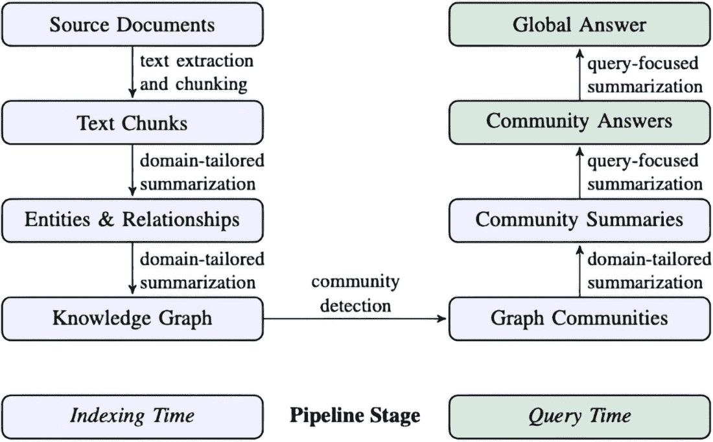
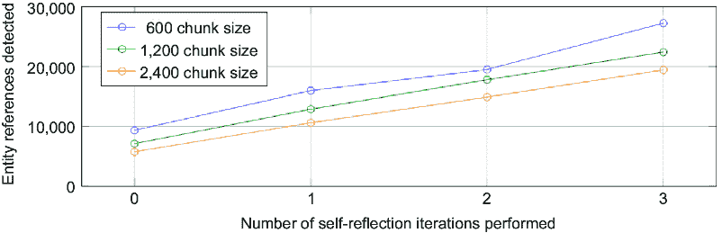
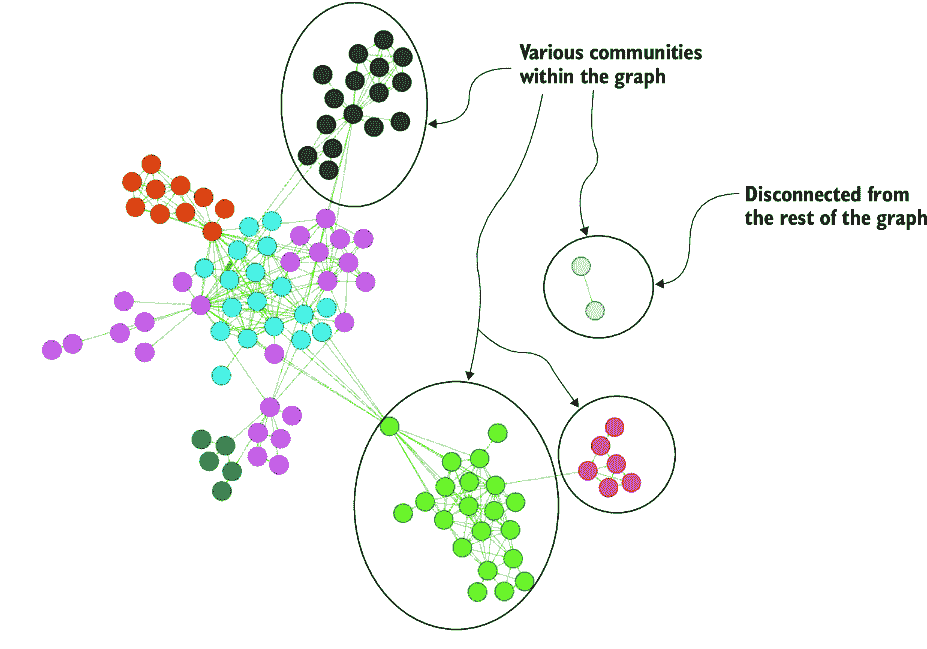
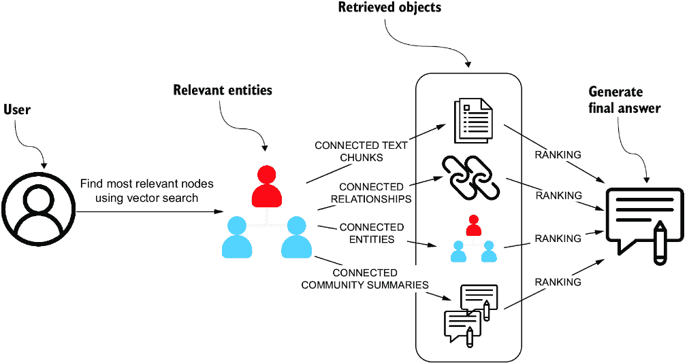

# 7 微软的 GraphRAG 实现

### 本章涵盖

+   介绍微软的 GraphRAG

+   提取和总结实体及其关系

+   计算和总结实体社区

+   实施全局和局部搜索技术

在第六章中，你学习了如何从法律文件中提取结构化信息来构建知识图谱。在本章中，你将探索使用微软的 GraphRAG（Edge 等人，2024）方法的一个略有不同的提取和处理管道。这个端到端示例仍然构建知识图谱，但更侧重于实体及其关系的自然语言摘要。整个管道在图 7.1 中进行了可视化。



##### **图 7.1 微软的 GraphRAG 管道。（图片来自 Edge 等人，2024 年，CC BY 4.0 许可）**

微软的 GraphRAG（MS GraphRAG：[`github.com/microsoft/graphrag`](https://github.com/microsoft/graphrag)）的一个关键创新是它使用一个 LLM 通过两阶段过程构建知识图谱。在第一阶段，从源文档中提取和总结实体及其关系，形成知识图谱的基础，如图 7.1 中的步骤所示。MS GraphRAG 的独特之处在于，一旦知识图谱构建完成，就会检测图社区，并为紧密相关的实体组生成特定领域的总结。这种分层方法将来自各种文本片段的碎片化信息转化为关于指定实体、关系和社区的信息的连贯和组织化表示。

这些实体和社区层面的总结可以用于在 RAG 应用中响应用户查询提供相关信息。拥有这样一个结构化的知识图谱，可以应用多种检索方法。在本章中，你将探索 MS GraphRAG 论文中描述的全局和局部搜索检索方法。

## 7.1 数据集选择

MS GraphRAG 旨在通过提取关键实体并生成连接多个文本片段信息的摘要来处理非结构化文本文档。为了确保有意义的见解，我们的数据集不仅应该包含丰富的实体信息，还应该包含跨多个片段的实体数据。由于实体类型是 MS GraphRAG 的可配置方面之一，因此必须在事先定义。相关的实体通常包括人、组织和地点，但也可以扩展到医学中的基因和通路或法律中的法律条款等特定领域的概念。

为了对实体类型做出明智的决策，探索数据集并确定你想要回答的问题类型非常重要。实体类型的选择决定了整个下游过程，影响提取、链接和总结的质量。

例如，MS GraphRAG 论文使用了播客和新闻文章的数据集。在两种情况下，人们、组织、地点等实体都经常被提及。此外，根据主题，如游戏或健康生活方式播客，你可能还想包括特定领域的实体，如游戏标题、健康状况或营养概念，以确保全面提取和分析。

在这里，我们使用 *《奥德赛》* 来评估 MS GraphRAG，因为它包含丰富的叙事，涉及人、神、神秘武器等等。此外，像尤利西斯这样的关键实体出现在多个文本块中，使其成为测试实体提取和跨块摘要的合适数据集。

在本章剩余部分，你将实现 MS GraphRAG 方法。为了跟上进度，你需要访问一个运行中的空白 Neo4j 实例。这可以是一个本地安装或云托管实例；只需确保它是空的。你可以在附带的 Jupyter 笔记本中直接跟随实现，该笔记本位于 [`github.com/tomasonjo/kg-rag/blob/main/notebooks/ch07.ipynb`](https://github.com/tomasonjo/kg-rag/blob/main/notebooks/ch07.ipynb)。

让我们开始吧。

## 7.2 图索引

在这里，你将构建知识图谱并生成实体和社区摘要。在整个构建过程中，你将探索每个步骤的关键考虑因素，包括实体选择、图连通性以及这些选择如何影响摘要和查询的质量。

首先，从古腾堡项目加载 *《奥德赛》* ([`www.gutenberg.org/ebooks/1727`](https://www.gutenberg.org/ebooks/1727))。

##### 列表 7.1 加载《奥德赛》

```py
url = "https://www.gutenberg.org/cache/epub/1727/pg1727.txt"
response = requests.get(url)
```

文本准备就绪后，你现在可以遍历 MS GraphRAG 管道。

### 7.2.1 块分割

*《奥德赛》* 由 24 本不同长度的书籍组成。你的第一个任务是移除前言和脚注，然后将文本分割成单独的书籍，如下面的列表所示。这种方法遵循叙事的自然分割，为文本提供了一种语义上有意义的结构化方式。

##### 列表 7.2 移除前言和脚注并将文本分割成书籍

```py
def chunk_into_books(text: str) -> List[str]:
    return (
        text.split("PREFACE TO FIRST EDITION")[2]
        .split("FOOTNOTES")[0]
        .strip()
        .split("\nBOOK")[1:]
    )

books = chunk_into_books(response.text)
```

现在，你需要检查每本书中的标记数，以确定是否需要进一步的块分割。以下列表中的代码提供了书籍标记计数的基本统计信息。

##### 列表 7.3 计算书籍中的标记数

```py
token_count = [num_tokens_from_string(el) for el in books]
print(
    f"""There are {len(token_count)} books with token sizes:
- avg {sum(token_count) / len(token_count)}
- min {min(token_count)}
- max {max(token_count)}
"""
)
```

在 24 本书中的标记数差异很大，平均为 6,515 个标记，最小为 4,459，最大为 10,760。鉴于这个范围，进一步的块分割是必要的，以确保没有单个部分超过合理的标记限制。

但合理的块大小是多少呢？MS GraphRAG 背后的研究人员比较了不同的块大小，并分析了它们对提取实体总数的影响。这种比较的结果如图 7.2 所示。



##### 图 7.2 分块大小和自我反思迭代对实体提取的影响。（图片来自 Edge 等人，2024 年，根据 CC BY 4.0 许可）

图 7.2 中的结果显示，较小的分块大小通常提取更多的实体引用。表示 600 个标记分块大小的线条始终是最高的，而 2,400 个标记分块大小是最低的。这表明将文本分成更小的块可以让 LLM 检测到比使用更大的块更多的实体。此外，图 7.2 还显示，增加自我反思迭代的次数，即在同一文档上的额外提取遍历，会导致所有分块大小下检测到的实体引用更多。这种模式表明重复遍历使 LLM 能够提取在早期迭代中可能被遗漏的更多实体。

假设你已经决定使用 1,000 字限制（基于空格分割）并重叠 40 个单词来分块书籍，如下所示。

##### 列表 7.4 分块书籍

```py
chunked_books = [chunk_text(book, 1000, 40) for book in books]
```

书籍已经分块，你可以进行下一步。

### 7.2.2 实体和关系提取

第一步是提取实体和关系。我们可以从他们论文的附录中借用 MS GraphRAG 提示。实体和关系提取提示的指令部分在“实体和关系提取指令”中显示。

**实体和关系提取指令**

-目标-

给定一个可能与此活动相关的文本文档和实体类型列表，从文本中识别出那些类型的所有实体以及识别出的实体之间的关系。

-步骤-

1.  识别所有实体。对于每个识别的实体，提取以下信息：

    +   entity_name: 实体的名称，首字母大写

    +   entity_type: 以下类型之一：[{entity_types}]

    +   entity_description: 实体属性和活动的全面描述

1.  将每个实体格式化为（"entity"{tuple_delimiter}<entity_name>{tuple_delimiter} <entity_type>{tuple_delimiter}<entity_description>）

1.  2. 从步骤 1 中识别的实体中，识别所有（源实体，目标实体）对，它们彼此**明显相关**。对于每一对相关实体，提取以下信息：

    +   source_entity: 源实体的名称，如步骤 1 中识别的那样

    +   target_entity: 目标实体的名称，如步骤 1 中识别的那样

    +   relationship_description: 解释为什么你认为源实体和目标实体彼此相关

    +   relationship_strength: 表示源实体和目标实体之间关系强度的数值分数

1.  将每个关系格式化为（"relationship"{tuple_delimiter}<source_entity> {tuple_delimiter}<target_entity>{tuple_delimiter}<relationship_description> {tuple_delimiter}<relationship_strength>）

1.  3. 以英文形式返回输出，作为步骤 1 和 2 中识别的所有实体和关系的单个列表。使用**{record_delimiter}**作为列表分隔符。

1.  4. 完成后，输出{completion_delimiter}

实体和关系提取的说明侧重于通过识别指定类型的实体及其关系，从文本文档中提取结构化知识。实体类型的列表作为变量`entity_types`传入。提示指示 LLM 提取实体，按类型分类，并提供详细描述。然后，它识别明显相关的实体对，解释它们之间的关系，并分配关系强度分数。最后，它以结构化、分隔的格式返回所有提取的实体和关系。这只是完整提示的一部分，它还包括少量示例和输出示例，但那些内容过于广泛，无法包含在本书中。

##### 练习 7.1

在运行提取之前，花点时间考虑对《奥德赛》来说哪些实体类型最有用。由于实体类型的列表必须预先定义，请考虑叙事的关键元素，如您想要提取的角色、地点、物体和事件。尝试定义一组实体类型，以捕捉文本中最有意义的关系。

要从《奥德赛》中提取有意义的实体，假设您已决定使用以下实体类型：

+   `PERSON`

+   `ORGANIZATION`

+   `LOCATION`

+   `GOD`

+   `EVENT`

+   `CREATURE`

+   `WEAPON_OR_TOOL`

一些实体类型，如`PERSON`和`GOD`，相对明确，因为它们指的是人类和神祇的明确类别。然而，其他类型，如`EVENT`和`LOCATION`，则更为模糊。一个`EVENT`可以指从单一动作到整个战争，这使得建立严格的分类边界变得困难。同样，`LOCATION`可以指一个广泛的类别，如一个国家、一个特定的城市，甚至是一个城市内的特定地点。这种可变性使得一致的分类更具挑战性，但也为 LLM 提供了更多的灵活性。

使用这些预定义的实体类型，您现在将实现提取函数。

##### 列表 7.5 实体和关系提取

```py
 ENTITY_TYPES = ["PERSON", "ORGANIZATION", "LOCATION",
  "GOD", "EVENT", "CREATURE", "WEAPON_OR_TOOL"]
def extract_entities(text: str) -> List[Dict]:      #1
    messages = [
        {"role": "user",
        "content": ch07_tools.create_extraction_prompt(ENTITY_TYPES, text)},  #2
    ]

    output = chat(messages, model = "gpt-4o") #3

    return ch07_tools.parse_extraction_output(output) #4
```

#1 选择实体类型

#2 将提取提示作为用户消息传递

#3 LLM API 调用

#4 将输出解析为字典

列表 7.5 中的代码通过首先定义要识别的实体类型来提取实体和关系。然后，它使用这些类型和输入文本生成一个提取提示，将提示发送到 LLM，并将响应处理成结构化的字典格式。

使用 7.5 列表中的函数，您将只为《奥德赛》的第一本书提取实体和关系。如果需要，您可以增加要分析的书籍数量以分析文本的更大部分。此提取的代码如下所示。

##### 列表 7.6 提取实体和关系

```py
 number_of_books = 1
for book_i, book in enumerate(                                      #1
    tqdm(chunked_books[:number_of_books], desc="Processing Books")  #1
):                                                                  #1
    for chunk_i, chunk in enumerate(tqdm(book, desc=f"Book {book_i}", leave=False)):

        nodes, relationships = extract_entities(chunk) #2

        neo4j_driver.execute_query( #3
            ch07_tools.import_nodes_query,
            data=nodes,
            book_id=book_i,
            text=chunk,
            chunk_id=chunk_i,
        )

        neo4j_driver.execute_query( #4
            ch07_tools.import_relationships_query,
            data=relationships
        )
```

#1 定义要处理的书籍数量

#2 提取实体和关系

#3 导入实体

#4 导入关系

列表 7.6 中的函数处理一组书籍，从每个片段中提取实体和关系。然后它将实体导入 Neo4j，接着是它们的关系，构建文本的结构化图表示。

首先回顾提取的实体和关系。您可以使用以下列表中的代码计算实体和关系的总数。

##### 列表 7.7 计算提取的节点和关系数量

```py
data, _, _ = neo4j_driver.execute_query(
    """MATCH (:`__Entity__`)
    RETURN 'entity' AS type, count(*) AS count
    UNION
    MATCH ()-[:RELATIONSHIP]->()
    RETURN 'relationship' AS type, count(*) AS count
    """
)
print([el.data() for el in data])
```

图中包含 66 个实体和 182 个关系，尽管这些数字可能在执行之间有所不同。MS GraphRAG 专注于提取实体及其关系的详细描述。例如，让我们检查对角色`ORESTES`提取的描述。

##### 列表 7.8 检查生成的`ORESTES`描述

```py
data, _, _ = neo4j_driver.execute_query(
    """MATCH (n:PERSON)
WHERE n.name = "ORESTES"
RETURN n.description AS description"""
)
print([el.data()['description'] for el in data])
```

当检查角色`ORESTES`的提取描述时，如列表 7.8 所示，结果可能如下所示：

+   奥雷斯特斯是阿伽门农的儿子，他杀死了埃癸斯托斯。

+   奥雷斯特斯是一个被期望向埃癸斯托斯复仇的人。

+   奥雷斯特斯因杀死埃癸斯托斯为父亲复仇而受到赞扬。

+   奥雷斯特斯是阿伽门农的儿子，他杀死了埃癸斯托斯。

+   奥雷斯特斯是一个被期望向埃癸斯托斯复仇的人。

+   奥雷斯特斯因杀死埃癸斯托斯为父亲复仇而受到赞扬。

虽然一些描述重复了相同的事实，但它们共同包含了所有关键细节，并确保在特定实体的不同文本片段中不会丢失重要信息。

类似地，一对实体可以有多种关系。您可以使用以下列表中的代码探索具有最多关系的实体对。

##### 列表 7.9 检查生成的关系描述

```py
data, _, _ = neo4j_driver.execute_query(
    """MATCH (n:__Entity__)-[:RELATIONSHIP]-(m:__Entity__)
WITH n,m, count(*) AS countOfRels
ORDER BY countOfRels DESC LIMIT 1
MATCH (n)-[r:RELATIONSHIP]-(m)
RETURN n.name AS source, m.name AS target, countOfRels, collect(r.description) AS descriptions
"""
)
print([el.data() for el in data])
```

具有最多关系的实体对是忒勒玛科斯和雅典娜，总共有 14 个关系。他们的互动贯穿了叙事的各个时刻，突出了雅典娜作为忒勒玛科斯的神圣向导和导师的角色。

以下是从中提取的五条关系描述：

+   忒勒玛科斯在宴会上悄悄地对雅典娜说话。

+   雅典娜化身为他人，向忒勒玛科斯提供建议和鼓励，给他勇气，并让他想起他的父亲。

+   雅典娜让忒勒玛科斯的母亲入睡，显示了她的神圣影响力。

+   雅典娜正在对忒勒玛科斯说话，为他提供指导和安慰。

+   雅典娜化身为门特斯，在门口受到忒勒玛科斯的欢迎。

虽然一些描述包含重叠的细节，但它们加强了雅典娜作为导师和神圣保护者的角色，逐渐塑造了忒勒玛科斯的旅程。

### 7.2.3 实体和关系摘要

为了避免提取知识中的不一致性、冗余和碎片化，MS GraphRAG 使用 LLM 合并同一实体或关系的多个描述以生成简洁的摘要。该模型不是单独处理每个描述，而是综合所有描述的信息，确保关键上下文细节在一个单一、丰富的表示中得以保留。这种方法提高了清晰度，减少了重复，并提供了对实体及其关系的更全面的理解。

再次强调，您可以像“实体和关系摘要说明”中所示的那样重用论文中的摘要提示。

**实体和关系摘要说明**

你是一个负责生成以下提供的数据的全面摘要的有用助手。给定一个或两个实体，以及一系列描述，所有这些都与同一个实体或实体组相关。请将这些描述合并成一个单一、全面的描述。确保包含从所有描述中收集的信息。如果提供的描述存在矛盾，请解决这些矛盾并提供一个单一、连贯的摘要。确保以第三人称撰写，并包含实体名称，以便我们有完整的背景信息。

#######

-数据-

实体：{entity_name}

描述列表：{description_list}

#######

输出：

“实体和关系摘要说明”中的提示指导 LLM 通过合并一个实体或一对实体的多个描述来生成一个单一、连贯的摘要。它确保包含所有相关细节，同时解决矛盾和消除冗余。输出以第三人称撰写，并明确命名实体以保持清晰和上下文。

使用“实体和关系摘要说明”中的提示，您可以生成具有多个描述的所有实体的摘要。摘要实体描述的代码可以在以下列表中找到。

##### 列表 7.10 实体摘要

```py
 candidates_to_summarize, _, _ = neo4j_driver.execute_query(
    """MATCH (e:__Entity__) WHERE size(e.description) > 1    #1
    RETURN e.name AS entity_name, e.description AS description_list"""
)
summaries = []
for candidate in tqdm(candidates_to_summarize, desc="Summarizing entities"):

    messages = [ #2
        {
            "role": "user",
            "content": ch07_tools.get_summarize_prompt(
                candidate["entity_name"], candidate["description_list"]
            ),
        },
    ]

    summary = chat(messages, model="gpt-4o") #3
    summaries.append(
        {"entity": candidate["entity_name"], "summary": summary}
    )
ch07_tools.import_entity_summary(neo4j_driver, summaries)
```

#1 获取具有多个描述的实体

#2 构建提示

#3 生成实体摘要

列表 7.10 中的代码查询 Neo4j 数据库以找到具有多个描述的实体，然后使用 LLM 生成统一的摘要。您可以通过运行以下列表中的代码来查看`ORESTES`的摘要描述。

##### 列表 7.11 检查`ORESTOS`生成的摘要

```py
summary, _, _ = neo4j_driver.execute_query(
    """MATCH (n:PERSON)
WHERE n.name = "ORESTES"
RETURN n.summary AS summary""")
print(summary[0]['summary'])
```

结果显示在“ORESTES 生成的摘要”中。

**ORESTES 生成的摘要**

奥雷斯特斯是阿伽门农的儿子，以杀死埃癸斯托斯来为父亲的死亡报仇而闻名。他本应向埃癸斯托斯报仇，因为埃癸斯托斯是阿伽门农谋杀的凶手。奥雷斯特斯因履行这一期望并成功杀死埃癸斯托斯，他的父亲凶手，而受到赞扬。

摘要过程已成功生成一个连贯且丰富的实体描述，正如“ORESTES 的生成摘要”所示。通过合并多个描述，我们确保了关键细节得到保留，同时减少了冗余。

接下来，我们将应用相同的摘要方法到关系上，将多个关系描述合并成一个单一、全面的摘要。结果如下所示。

##### 列表 7.12 关系摘要

```py
 rels_to_summarize, _, _ = neo4j_driver.execute_query(
    """MATCH (s:__Entity__)-[r:RELATIONSHIP]-(t:__Entity__)  #1
    WHERE id(s) < id(t)
    WITH s.name AS source, t.name AS target,
           collect(r.description) AS description_list,
           count(*) AS count
    WHERE count > 1
    RETURN source, target, description_list"""
)
rel_summaries = []
for candidate in tqdm(rels_to_summarize, desc="Summarizing relationships"):
    entity_name = f"{candidate['source']} relationship to {candidate['target']}"

    messages = [ #2
        {
            "role": "user",
            "content": ch07_tools.get_summarize_prompt(
                entity_name, candidate["description_list"]
            ),
        },
    ]

    summary = chat(messages, model="gpt-4o") #3
    rel_summaries.append({"source": candidate["source"], "target": candidate["target"], "summary": summary})  
ch07_tools.import_rels_summary(neo4j_driver, summaries) #4
```

#1 检索具有多个关系的节点对

#2 构建提示

#3 使用 LLM 生成关系摘要

#4 将结果存储到 Neo4j

列表 7.12 中的代码识别数据库中共享多个关系的实体对，并使用 LLM 将它们的描述合并成一个摘要。通过合并关系描述，该过程确保了实体之间关键交互的全面捕捉，同时消除了冗余。一旦生成，摘要关系将存储回数据库。

你可以评估生成的`TELEMACHUS`和`MINERVA`之间的关系，如下所示。

##### **列表 7.13 评估`TELEMACHUS`和`MINERVA`之间摘要的关系**

```py
data, _, _ = neo4j_driver.execute_query(
    """MATCH (n:__Entity__)-[r:SUMMARIZED_RELATIONSHIP]-(m:__Entity__)
WHERE n.name = 'TELEMACHUS' AND m.name = 'MINERVA'
RETURN r.summary AS description
"""
)
print(data[0]["description"])
```

列表 7.13 中的代码结果可以在“TELEMACHUS 和 MINERVA 之间关系的生成摘要”中找到。

**TELEMACHUS 和 MINERVA 之间关系的生成摘要**

Minerva 在 Telemachus 的生活中扮演着至关重要的角色，在他踏上寻找父亲 Ulysses 的旅程时提供指导和支持。在一次宴会上，Telemachus 安静地对 Minerva 说话，表明他们之间有着亲密和信任的关系。Minerva 经常以 Mentes 等伪装身份出现，向 Telemachus 提供建议和鼓励，在他心中灌输寻求父亲信息的勇气和决心。她就他打算的航行提供建议，展示了她对这一事业的承诺。此外，当 Minerva 让 Telemachus 的母亲入睡时，她的神圣影响显而易见，进一步展示了她在 Telemachus 生活中的保护和支持角色。

通过对实体和关系的综合摘要，你已经成功完成了 MS GraphRAG 索引的第一阶段。通过跨文本块合并信息，你创建了一个更连贯和丰富的提取知识表示。

##### 实体和关系摘要的考虑因素

当处理大型数据集时，你可能会遇到所谓的超级节点。超级节点是在多个数据块中出现的实体，并且拥有大量的关系。例如，如果你要处理全部的古希腊历史，像“雅典”这样的节点就会积累大量的关系和描述。如果没有排名机制，总结这样的节点可能会导致输出过长，或者更糟糕的是，一些描述甚至可能无法完全包含在提示中。为了处理这种情况，你需要实现一个过滤或排名策略，以优先考虑最相关的描述，确保总结既简洁又具有信息性。

现在你可以继续进行下一阶段。

### 7.2.4 社区检测和总结

图索引过程的第二阶段专注于社区检测和总结。社区是一组实体，它们彼此之间比与其他图中的实体连接得更紧密。社区检测的结果如图 7.3 所示。



##### 图 7.3 社区检测结果的示例

图 7.3 展示了节点被分组到不同的社区中，每个社区代表了一组紧密连接的实体，它们内部关系更强。一些社区很好地融入了整个图，而其他社区则显得更加孤立，形成了不连接的子图。识别这些集群有助于揭示数据集中的潜在结构、主题或关键群体。例如，在像《奥德赛》这样的叙事中，一个社区可能会围绕参与特定事件或地点的角色形成。通过检测和总结这些社区，我们可以捕捉到超越单个实体连接的高级关系和洞察。

列表 7.14 中的代码应用了 Louvain 方法，这是一种社区检测算法，用于在图中识别紧密连接的实体组。（原始论文实现中使用了 Leiden，并在 GDS 库中也可用）然后，检测到的社区被存储为节点属性，以便进行下游处理。

##### 列表 7.14 使用 Louvain 算法计算社区

```py
community_distribution = ch07_tools.calculate_communities(neo4j_driver)
print(f"""There are {community_distribution['communityCount']} communities with distribution:
  {community_distribution['communityDistribution']}""")
```

在图中使用了 Louvain 方法检测到 9 个社区，社区的大小从 2 到 13 个节点不等。从列表 7.14 中检测到的社区的数量和大小可能会根据图结构的变化而变化，例如提取的实体和关系的数量。此外，Louvain 方法不是确定性的，这意味着即使输入相同，由于算法的优化过程，检测到的社区在运行之间可能会有轻微的变化。

##### 层次社区结构

MS GraphRAG 论文利用 Louvain 算法的层次性质，在多个粒度级别上捕捉社区结构。这允许在大型图中分析广泛的和细粒度的社区。然而，由于我们正在处理一个较小的图，我们将专注于单一级别的社区检测，并跳过层次方面。

现在您可以将总结提示应用于生成每个检测到的社区的简洁概述。提示的说明部分可在“社区总结说明”中找到。

**社区总结说明**

您是一个 AI 助手，帮助人类分析师执行一般信息发现。信息发现是识别和评估与网络中某些实体（例如组织和个人）相关联的相关信息的过程。

# 目标：根据属于社区的实体列表以及它们之间的关系和可选的关联声明，编写一个社区的全面报告。该报告将用于向决策者通报与社区及其潜在影响相关的信息。报告内容包括社区关键实体的概述，它们的法律合规性、技术能力、声誉和值得注意的声明。

# 报告结构

报告应包括以下部分：

+   标题：代表社区关键实体的社区名称 - 标题应简短但具体。在可能的情况下，将代表性的命名实体包含在标题中。

+   摘要：社区整体结构的执行摘要，其实体之间的关系，以及与其实体相关的显著信息。

+   影响严重性评级：表示社区内实体造成的影响严重性的 0-10 之间的浮点分数。影响是社区评分的重要性。

+   评级说明：给出一个单句解释 IMPACT 严重性评级的含义。

+   详细发现：关于社区的 5-10 个关键见解的列表。每个见解应有一个简短的摘要，后跟根据以下扎根规则解释的多个段落。

“社区总结说明”中的提示指导 AI 助手生成检测到的社区的有序总结，确保它们捕捉到关键实体、关系和显著的见解。目标是生成高质量的总结，这些总结可以有效地用于下游的 RAG。

社区总结的完整提示包括输出说明和几个示例，以保持生成的总结的一致性和相关性。

在确定了社区并建立了结构化总结提示后，我们现在可以为每个检测到的社区生成全面的总结。这些社区总结综合了关键实体、关系和重要的见解。

下面的列表中的代码处理检测到的社区，并将摘要提示应用于生成有意义的描述。

##### 列表 7.15 生成社区摘要

```py
community_info, _, _ = neo4j_driver.execute_query(ch07_tools.community_info_query) #1

communities = []
for community in tqdm(community_info, desc="Summarizing communities"):

    messages = [ #2
        {
            "role": "user",
            "content": ch07_tools.get_summarize_community_prompt(
                community["nodes"], community["rels"]
            ),
        },
    ]

    summary = chat(messages, model="gpt-4o") #3
    communities.append(
        {    
            "community": json.loads(ch07_tools.extract_json(summary)), #4
            "communityId": community["communityId"],
            "nodes": [el["id"] for el in community["nodes"]],
        }
    )  
neo4j_driver.execute_query(ch07_tools.import_community_query, data=communities) #5
```

#1 从数据库检索社区信息

#2 构建提示

#3 LLM 调用

#4 将输出解析为字典

#5 将结果存储到数据库

您现在可以使用列表 7.16 中显示的代码检查生成的社区摘要示例。这将提供一个具体的例子，说明摘要过程如何捕捉社区中的关键实体、关系和洞察。

##### 列表 7.16 检索示例社区摘要

```py
data, _, _ = neo4j_driver.execute_query(
    """MATCH (c:__Community__)
WITH c, count {(c)<-[:IN_COMMUNITY]-()} AS size
ORDER BY size DESC LIMIT 1
RETURN c.title AS title, c.summary AS summary
"""
)
print(f"Title: {data[0]['title']})
print(f"Summary: {data[0]["summary"]}")
```

结果可以在“生成的摘要”中找到，涉及`TELEMACHUS`和`MINERVA`之间的关系。

**生成的社区摘要**

米涅瓦、忒勒玛科斯和伊萨卡家庭 该社区以米涅瓦、忒勒玛科斯和尤利西斯的家庭为中心，涉及重要的互动，包括神圣的指导、家庭忠诚和求婚者的挑战。米涅瓦在向忒勒玛科斯提供建议方面扮演着关键角色，他决心找到他的父亲并恢复家园的秩序。这些实体之间的关系突出了智慧、勇气和坚韧的主题。

##### 在更大的图中处理大型社区

当处理更大的图时，社区可能会变得太大而无法有效处理。如果一个社区包含太多实体和关系，包括所有这些在摘要提示中可能会超过令牌限制或产生过长的摘要。为了解决这个问题，应实施一个排名机制，以仅选择最相关的实体和关系。这确保了摘要保持简洁、信息丰富，并且对下游 RAG 应用有用。

恭喜！您已成功完成图索引步骤。

## 7.3 图检索器

图索引过程完成后，我们现在进入图检索阶段。此阶段专注于从结构化图中检索相关信息以有效回答查询。虽然有许多可能的检索策略，但我们将关注两种主要方法：局部搜索和全局搜索。局部搜索从检测到的社区中紧密相连的实体检索信息，而全局搜索则考虑整个图结构以找到最相关的信息。

### 7.3.1 全局搜索

在 GraphRAG 中，全局搜索使用社区摘要作为中间响应，以有效地回答需要在整个数据集上聚合信息的查询。这种方法不是基于向量相似性检索单个文本块，而是利用预先计算的社区级摘要来生成结构化响应。全局搜索的流程图在图 7.4 中可视化。


##### 图 7.4 全局搜索

图 7.4 中的过程遵循 map-reduce 方法：

+   *地图步骤*—给定用户查询和可选的对话历史，GraphRAG 从图社区层次结构中的指定级别检索由 LLM 生成的社区报告。在您的实现中，图结构只有一个社区级别，这意味着所有检测到的组都存在于相同的层次深度。这些报告被分割成可管理的文本块，每个块都由 LLM 处理以生成中间响应。每个响应都包含一个要点列表，每个要点都附有数值重要性评分。

+   *减少步骤*—过滤和汇总所有中间响应中最重要的一点。然后，这些精炼的见解作为 LLM 的最终上下文，综合回答用户查询。通过将数据集结构化为语义上有意义的集群，GraphRAG 能够实现高效且连贯的检索，即使对于广泛的主题查询也是如此。

##### 社区层次结构结构

响应的质量取决于用于获取社区报告的社区层次结构的级别。低级别社区提供详细报告，导致更全面的响应，但它们也增加了 LLM 调用次数和处理时间。高级别社区，具有更抽象的总结，可能更有效率，但风险丢失细节。平衡细节和效率是优化全局搜索性能的关键。

地图步骤使用以下系统提示，如“检索器地图部分的系统提示”所示。

**检索器地图部分的系统提示**

—角色—

您是一个有用的助手，回答有关提供的数据表中的问题的提问。

—目标—

生成一个由要点列表组成的响应，以响应用户的问题，总结输入数据表中的所有相关信息。

您应将下表中提供的数据作为生成响应的主要上下文。如果您不知道答案，或者输入的数据表不包含足够的信息来提供答案，只需说明即可。不要编造任何内容。

响应中的每个要点应包含以下元素：

+   描述：对该点的全面描述。

+   重要性评分：一个介于 0-100 之间的整数评分，表示该要点在回答用户问题中的重要性。一种“我不知道”类型的响应应得 0 分。

响应应按以下格式 JSON 格式化：{{ "points": [ {{"description": "点 1 的描述 [数据：报告（报告 ID）]", "score": score_value}}, {{"description": "点 2 的描述 [数据：报告（报告 ID）]", "score": score_value}} ] }}

响应应保留原意和使用诸如“应当”、“可以”或“将会”之类的情态动词。

支持数据的要点应列出相关报告作为参考，如下所示：“这是一个由数据参考支持的示例句子 [数据：报告（报告 ID）]”

**不要在单个引用中列出超过 5 个记录 ID**。相反，列出前 5 个最相关的记录 ID，并添加“+更多”以表明还有更多。

例如：“X 先生是 Y 公司的所有者，并受到许多不当行为的指控[数据：报告（2，7，64，46，34，+更多）]。他也是 X 公司的 CEO[数据：报告（1，3）]”

其中 1，2，3，7，34，46 和 64 代表在提供的表中相关数据报告的 ID。

不要包含没有提供支持证据的信息。

—数据表—

{context_data}

地图系统提示指导 LLM 根据用户查询从提供的上下文中提取关键点。每个关键点包括一个描述和一个重要性分数（0-100），反映其与查询的相关性。响应格式为 JSON，并引用支持数据报告 ID。如果信息不足，响应必须表明这一点，而不进行推测。

现在你将检查检索器的减少步骤，如“检索器减少部分的系统提示”所示。

**检索器减少部分的系统提示**

—角色—

你是一个有用的助手，通过综合多位分析师的观点来回答关于数据集的问题。

—目标—

生成目标长度和格式的响应，以回答用户的问题，总结多位分析师从数据集的不同部分关注的报告。

注意，以下提供的分析师报告按**重要性递减顺序**排列。

如果你不知道答案，或者提供的报告没有足够的信息来提供答案，只需说明即可。不要编造任何内容。

最终响应应从分析师报告中删除所有无关信息，并将清洗后的信息合并成一个综合答案，提供所有关键点和适当于响应长度和格式的含义解释。

根据长度和格式适当添加章节和评论到响应中。以 Markdown 格式编排响应。

响应应保留原句中“应当”、“可以”或“将会”等情态动词的原意和用法。

响应还应保留分析师报告中先前包含的所有数据引用，但不要提及分析过程中的多位分析师的角色。

**不要在单个引用中列出超过 5 个记录 ID**。相反，列出前 5 个最相关的记录 ID，并添加“+更多”以表明还有更多。

例如：

“X 先生是 Y 公司的所有者，并受到许多不当行为的指控[数据：报告（2，7，34，46，64，+更多）]。他也是 X 公司的 CEO[数据：报告（1，3）]”

其中 1，2，3，7，34，46 和 64 代表相关数据记录的 ID（不是索引）。

不要包含没有提供支持证据的信息。

—目标响应长度和格式—

{response_type}

减少系统提示指导 LLM 综合多个分析师报告的关键要点，这些报告按重要性排序。回应必须以 Markdown 格式呈现，适当结构化以适应目标长度和格式，并排除无关细节。它保留所有引用的数据，同时避免推测性答案。最终输出将报告中的见解整合和提炼成一个连贯、全面的回应。

现在我们可以将地图和减少提示合并成一个全局搜索函数。

##### 列表 7.17 全局搜索

```py
def global_retriever(query: str, rating_threshold: float = 5) -> str:

    community_data, _, _ = neo4j_driver.execute_query( #1
        """
    MATCH (c:__Community__)
    WHERE c.rating >= $rating
    RETURN c.summary AS summary
    """,
        rating=rating_threshold,
    )
    print(f"Got {len(community_data)} community summaries")
    intermediate_results = []
    for community in tqdm(community_data, desc="Processing communities"):

        intermediate_messages = [ #2
            {
                "role": "system",
                "content": ch07_tools.get_map_system_prompt(community["summary"]),
            },
            {
                "role": "user",
                "content": query,
            },
        ]
        intermediate_response = chat(intermediate_messages, model="gpt-4o")
        intermediate_results.append(intermediate_response)

    final_messages = [ #3
        {
            "role": "system",
            "content": ch07_tools.get_reduce_system_prompt(intermediate_results),
        },
        {"role": "user", "content": query},
    ]
    summary = chat(final_messages, model="gpt-4o")
    return summary
```

#1 获取所有评分高于阈值的社区

#2 对于每个社区，获取一个中间回应

#3 使用所有中间回应作为上下文生成最终答案

列表 7.17 中的`global_retriever`函数通过使用社区摘要来生成结构化回应，实现了全局搜索方法。它遵循以下三个步骤：

1.  *检索相关社区*——该函数查询 Neo4j 数据库，检索评分达到或超过指定阈值的社区摘要。这确保只有最相关的社区对最终答案做出贡献。

1.  *生成中间回应*——对于每个社区，使用地图系统提示生成一个中间回应。模型在处理社区摘要的同时，与用户的查询一起提取关键点。

1.  *聚合并生成最终答案*——然后应用减少系统提示来综合所有中间回应，形成一个连贯的最终答案，确保保留最重要的要点并正确地组织结构。

现在我们可以用一个例子来测试这个函数。

##### 列表 7.18 全局搜索示例

```py
print(global_retriever("What is this story about?"))
```

列表 7.18 的结果可以在“使用全局搜索对‘这个故事是关于什么的？’的回应”中找到。

**使用全局搜索对‘这个故事是关于什么的？’的回应**

这个故事围绕着涉及米涅瓦、忒勒玛科斯和尤利西斯家庭的复杂社区动态展开。主要主题包括神灵的指引、家族忠诚和求婚者的挑战。米涅瓦在向忒勒玛科斯提供建议方面扮演着关键角色，忒勒玛科斯决心找到他的父亲尤利西斯，并恢复家园的秩序。人物之间的关系强调了智慧、勇气和坚韧的主题。

此外，叙事还突出了门特斯的作用，他是塔菲亚人的首领，被认为是安基阿卢斯的儿子。门特斯参与了一次前往铁矿石闻名的特梅萨的航行，并声称对塔菲亚人拥有王权[数据：报告（1）]。故事还围绕着希腊神话中的关键人物奥德修斯，以及他与其他重要实体（如阿开亚人、莱尔提斯和神灵）的联系。故事中的人物关系突出了神灵对人类事务的影响，展示了神灵如何影响希腊英雄的生活[数据：报告（1，2，3，4，5）]。

此外，叙述探索了涉及奥林匹斯神宙斯、埃癸斯托斯、阿伽门农、奥雷斯特斯和墨丘利的神话元素。它突出了神干预、背叛和复仇的主题。奥林匹斯神宙斯讨论了埃癸斯托斯的行为，他因背叛和谋杀阿伽门农而臭名昭著，而奥雷斯特斯在墨丘利的警告下，通过杀死埃癸斯托斯为父亲的死报仇 [数据：报告（1，2，3，4，5）]。这些相互关联的故事编织了一幅丰富的神话和英雄元素图案，强调了这些传奇人物持久的历史遗产和面临的挑战。

由全局搜索方法生成的“使用全局搜索对‘这个故事是关于什么的？’的响应”提供了故事的有序总结，通过综合多个片段中的关键主题和关系。它突出了主要人物密涅瓦、忒勒玛科斯和尤利西斯——以及他们在叙事中的角色，强调了神的指引、家族忠诚和尤利西斯家庭的挑战。

##### 练习 7.2

尝试使用全局搜索功能运行不同类型的查询。提出需要综合多个社区摘要信息的问题，例如：“这个故事中的主要冲突是什么？”

### 7.3.2 本地搜索

本地搜索方法通过将结构化知识图谱数据与源文档中的非结构化文本相结合，增强了 LLM 的响应。这种方法对于以实体为中心的查询特别有效，例如“矢车菊有什么治疗特性？”在这种情况下，需要深入了解特定实体及其关系。本地搜索方法可以在图 7.5 中找到。



##### 图 7.5 本地搜索

当用户提交查询时，图 7.5 中可视化的系统首先使用向量搜索在知识图谱中识别语义相关的实体。这些实体作为检索相关信息（包括直接连接的实体、关系和社区报告的摘要）的入口点。此外，还提取了与这些实体相关的输入文档中的文本块。检索到的数据被排序和过滤，以确保最终响应中只包含最相关的信息。

要实现本地搜索，我们首先需要计算实体的文本嵌入并创建一个向量索引。这使我们能够根据用户的查询高效地检索最相关的实体。通过将实体描述和关系嵌入到向量空间中，我们可以使用相似性搜索来识别哪些实体与输入最密切相关。一旦找到这些相关实体，它们就作为检索更多结构和非结构化数据的入口点。计算这些嵌入和构建向量索引的代码如下所示。

##### 列表 7.19 为数据库中所有实体生成文本嵌入

```py
 entities, _, _ = neo4j_driver.execute_query(
    """
MATCH (e:__Entity__)
RETURN e.summary AS summary, e.name AS name   #1
"""
)  
data = [{"name": el["name"], "embedding": embed(el["summary"])[0]} for el in entities]     #2
neo4j_driver.execute_query( #3
    """
UNWIND $data AS row
MATCH (e:__Entity__ {name: row.name})
CALL db.create.setNodeVectorProperty(e, 'embedding', row.embedding)
""",
    data=data,
)    #4
neo4j_driver.execute_query(
    """
CREATE VECTOR INDEX entities IF NOT EXISTS
FOR (n:__Entity__)
ON (n.embedding)
""",
    data=data,
)
```

#1 获取实体及其摘要

#2 基于实体摘要计算嵌入

#3 将嵌入存储到数据库中

#4 创建向量索引实体

列表 7.19 中的代码从数据库中检索所有实体及其摘要，根据每个实体的摘要计算文本嵌入，并将嵌入存储回数据库。最后，它创建一个向量索引以实现实体嵌入上的高效相似性搜索。

本地搜索最终实现为一个 Cypher 语句，该语句通过向量搜索扩展了初始的相关节点集，包括它们的连接实体、文本片段、摘要和关系。此 Cypher 语句在以下列表中显示。

##### 列表 7.20 本地搜索的 Cypher 语句

```py
local_search_query = """
CALL db.index.vector.queryNodes('entities', $k, $embedding)
YIELD node, score
WITH collect(node) as nodes   #1
WITH collect {
    UNWIND nodes as n
    MATCH (n)<-[:HAS_ENTITY]->(c:__Chunk__)
    WITH c, count(distinct n) as freq
    RETURN c.text AS chunkText
    ORDER BY freq DESC
    LIMIT $topChunks
} AS text_mapping,  
collect { #2
    UNWIND nodes as n
    MATCH (n)-[:IN_COMMUNITY]->(c:__Community__)
    WITH c, c.rank as rank, c.weight AS weight
    RETURN c.summary
    ORDER BY rank, weight DESC
    LIMIT $topCommunities
} AS report_mapping,  
collect { #3
    UNWIND nodes as n
    MATCH (n)-[r:SUMMARIZED_RELATIONSHIP]-(m)
    WHERE m IN nodes
    RETURN r.summary AS descriptionText
    ORDER BY r.rank, r.weight DESC
    LIMIT $topInsideRels
} as insideRels,  
collect { #4
    UNWIND nodes as n
    RETURN n.summary AS descriptionText
} as entities
RETURN {Chunks: text_mapping, Reports: report_mapping,
       Relationships: insideRels,
       Entities: entities} AS text
"""
```

#1 获取相关文本片段

#2 获取相关社区描述

#3 获取相关关系

#4 获取实体摘要

列表 7.20 中检索到的所有对象，如文本片段、社区描述、关系和实体摘要，都进行了排序并限制数量，以确保提示信息保持可管理。文本片段根据与相关实体的关联频率进行排序，并限制在 `topChunks` 的顶部。社区描述按排名和权重排序，仅选择 `topCommunities`。关系按其重要性进行排序，并限制在 `topInsideRels` 内。最后，实体摘要没有额外的排名约束被检索。这确保了只包含最相关的信息在响应中。

最后，你需要定义总结提示，这再次借鉴自论文，并在“本地搜索的系统提示”中展示。

**本地搜索的系统提示**

—角色—

你是一个响应关于提供的表格中数据的询问的有帮助的助手。

—目标—

生成一个目标长度和格式的响应，该响应针对用户的问题，总结输入数据表中适当长度和格式的所有信息，并融入任何相关的通用知识。

如果你不知道答案，只需说“不知道”。不要编造任何内容。

由数据支持的项目应按以下方式列出其数据引用：

“这是一个由多个数据引用支持的示例句子 [数据：<数据集名称> (记录 ID); <数据集名称> (记录 ID)]。”

不要在单个引用中列出超过 5 个记录 ID。相反，列出前 5 个最相关的记录 ID，并添加“+更多”以表明还有更多。

例如：

“X 人是 Y 公司的所有者，并受到许多不当行为的指控 [数据：来源 (15, 16), 报告 (1), 实体 (5, 7); 关系 (23); 陈述 (2, 7, 34, 46, 64, +更多)]。”

其中 15、16、1、5、7、23、2、7、34、46 和 64 代表相关数据记录的 ID（不是索引）。

不要包含没有提供支持证据的信息。

—目标响应长度和格式—

{response_type}

—数据表—

{context_data}

“本地搜索的系统提示”中的这个系统提示旨在根据结构化数据表生成响应，同时保持准确性和透明度。它指示助手综合与用户查询相关的信息，确保主张有明确的数据参考支持。引用数据源格式的格式强制执行结构化方法，限制每个参考的记录 ID 数量，并在适用时指出额外的支持记录。提示还强调，如果答案在提供的数据中找不到，助手应明确指出，而不是编造信息。

在此基础上，你现在可以实施本地搜索。

##### 列表 7.21 本地搜索实现

```py
def local_search(query: str) -> str:

    context, _, _ = neo4j_driver.execute_query( #1
        local_search_query,
        embedding=embed(query)[0],
        topChunks=topChunks,
        topCommunities=topCommunities,
        topInsideRels=topInsideRels,
        k=k_entities,
    )

    context_str = str(context[0]["text"]) #2

    local_messages = [ #3
        {
            "role": "system",
            "content": ch07_tools.get_local_system_prompt(context_str),
        },
        {
            "role": "user",
            "content": query,
        },
    ]

    final_answer = chat(local_messages, model="gpt-4o") #4
    return final_answer
```

#1 使用本地搜索 Cypher 语句获取上下文

#2 将上下文字符串化

#3 构建提示

#4 生成最终答案

列表 7.21 通过首先使用向量搜索和 Cypher 查询从知识图谱中检索相关上下文来实现本地搜索。然后，提取的上下文被转换为字符串，并纳入一个旨在指导 LLM 生成有见地响应的结构化提示中。最后，将提示发送到模型以生成最终答案。

你现在可以使用这个实现进行测试。

##### 列表 7.22 本地搜索实现

```py
print(local_search("Who is Ulysses?"))
```

列表 7.22 的结果可以在“使用本地搜索对‘尤利西斯是谁？’的响应”中找到。

**使用本地搜索对“尤利西斯是谁？”的响应**

这个故事围绕着以米涅瓦、忒勒玛科斯和尤利西斯的家族为核心人物的社区错综复杂的动态。主要主题包括神灵的指引、家族的忠诚以及求婚者带来的挑战。米涅瓦在向忒勒玛科斯提供建议方面扮演着至关重要的角色，忒勒玛科斯决心找到他的父亲尤利西斯，并恢复家园的秩序。人物之间的关系强调了智慧、勇气和坚韧的主题。

此外，叙事还突出了门特斯的作用，他是泰菲亚人的首领，被认为是安基阿卢斯的儿子。门特斯参与了一次前往以铁矿石货物闻名的特梅萨的航行，并声称对泰菲亚人拥有王权[数据：报告（1）]。故事还围绕着希腊神话中的关键人物奥德修斯，以及他与其他重要实体（如阿开亚人、莱耳忒斯和神祇）的联系。故事中的人物关系突出了神灵干预对人类事务的影响，展示了神祇如何影响希腊英雄的生活[数据：报告（1，2，3，4，5）]。

此外，叙事探讨了涉及奥林匹斯神宙斯、埃癸斯托斯、阿伽门农、奥雷斯特斯和墨丘利的神话元素。它突出了神干预、背叛和复仇的主题。奥林匹斯神宙斯讨论了埃癸斯托斯的行为，他因背叛和谋杀阿伽门农而臭名昭著，而奥雷斯特斯在墨丘利的警告下，通过杀死埃癸斯托斯为父亲的死报仇[数据：报告（1，2，3，4，5）]。这些相互关联的故事编织了一幅丰富的神话和英雄元素画卷，强调了这些传奇人物持久的历史遗产和面临的挑战。

在“使用本地搜索对‘尤利西斯是谁？’进行响应”的示例中，展示了本地搜索如何从知识图谱中检索和综合相关信息，以提供详细、有充分支持的答案。通过整合连接的实体、关系和社区摘要，系统确保响应既包含叙事背景，又包含事实深度。

##### 练习 7.3

尝试使用本地搜索功能运行不同类型的查询。

在这样的图索引中，可以实现不同的检索策略。例如，社区摘要可以单独嵌入并用作独立的向量检索器，根据查询的焦点进行更有针对性的检索。

恭喜！您已成功实现完整的 MS GraphRAG。

## 摘要

+   MS GraphRAG 使用两阶段过程，首先从源文档中提取和总结实体和关系，然后进行社区检测和总结，以创建一致的知识表示。

+   提取过程使用 LLM 来识别实体，根据预定义的类型（例如，`PERSON`，`GOD`，`LOCATION`）对它们进行分类，并生成实体及其关系的详细描述，包括关系强度分数。

+   通过基于 LLM 的摘要，将来自多个文本块中的实体和关系描述合并，以创建统一、非冗余的表示，同时保留关键信息。

+   该系统使用类似 Louvain 方法的算法检测紧密连接的实体社区，然后生成社区级别的摘要以捕捉更高层次的主题和关系。

+   全局搜索使用社区摘要通过映射-归约方法来回答广泛的、主题性的查询。

+   本地搜索结合向量相似性搜索和图遍历来回答以实体为中心的查询。

+   检索的有效性取决于因素，如块大小、实体类型选择和社区检测参数，较小的块通常会导致更全面的实体提取。

+   系统通过排名机制处理潜在的扩展挑战，在保持上下文相关性的同时管理大量实体、关系和社区。
