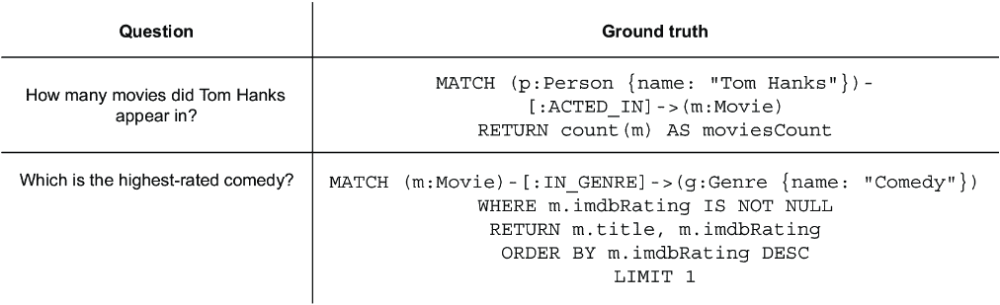

# 8 RAG 应用评估

### 本章涵盖

+   基准测试 RAG 应用和代理能力

+   设计评估数据集

+   应用 RAGAS 度量：召回率、忠实度、正确性

在本章中，您将探讨使用精心构建的基准问题评估 RAG 应用性能的重要性。随着您的 RAG 管道变得更加复杂和高级，确保代理的答案在广泛的查询中既准确又连贯变得至关重要。基准评估提供了衡量代理能力所需的系统，同时也有助于明确定义和界定代理的范围。

评估 RAG 应用涉及多种方法，每种方法都针对应用的各个步骤，如图 8.1 所示，它展示了由具有检索能力的 LLM 驱动的问答系统的管道的高级概述。它从用户向系统提出问题开始。然后 LLM 确定最合适的检索工具来获取必要的信息。这一步至关重要，可以评估工具选择过程的准确性。


##### 图 8.1 评估 RAG 管道的不同步骤

在本书中，您已经实现了各种检索工具设计，从向量搜索开始，逐步发展到更结构化的方法，如 text2cypher 和 Cypher 模板。每种检索方法都满足不同的需求：

+   向量搜索有效地检索语义相关的文档。

+   Cypher 模板允许对数据库进行精确、结构化的查询。

+   Text2cypher 允许动态和灵活的查询，得益于基于图检索的表达能力。

评估 LLM 选择的工具以及它如何与查询需求相匹配对于优化检索性能至关重要。

一旦选择了适当的工具，它就会从知识库中检索相关的上下文或数据。检索到的上下文与用户问题的相关性是另一个关键的评估点。一个精心选择的检索方法应确保检索到的上下文既准确又足以回答查询。

使用检索到的上下文，LLM 生成一个答案，然后将其呈现给用户。在这个阶段，我们不仅可以评估生成的响应的连贯性和准确性，还可以评估模型理解和有效整合提供上下文的能力。一个特别重要的评估标准是 LLM 在给定正确上下文时是否产生正确的答案。这使我们能够将模型的推理和综合能力与检索性能分开来衡量。

此外，可以整体评估整个管道，以衡量其在提供准确和上下文相关答案方面的有效性。通过分析不同阶段的失败——工具选择、检索相关性和最终响应生成——我们可以迭代地改进检索机制以及 LLM 利用检索信息的能力。

假设你负责评估第五章中实现的 LLM 代理的性能。为了更深入地了解其有效性，你将使用 RAGAS Python 库来设计和执行基准分析。但首先，你需要设计基准数据集。在本章的剩余部分，我们将从概念到代码，逐步介绍实现过程。为了跟上进度，你需要访问一个运行的 Neo4j 实例。这可以是一个本地安装或云托管实例。在本章的实现中，我们使用所谓的“电影数据集”。有关数据集的更多信息以及各种加载方式，请参阅附录。你可以直接在附带的 Jupyter 笔记本中跟随实现，笔记本链接如下：[`github.com/tomasonjo/kg-rag/blob/main/notebooks/ch08.ipynb`](https://github.com/tomasonjo/kg-rag/blob/main/notebooks/ch08.ipynb)。

让我们深入探讨。

## 8.1 设计基准数据集

创建基准数据集需要设计输入查询，以测试系统决策和响应生成的各个方面。由于 RAG 管道中的每一步都发挥着至关重要的作用，数据集应包括各种挑战不同组件的多样化问题：

+   *工具选择评估* — 一些查询应评估系统是否选择了正确的检索方法，确保它识别出最相关的信息来源。

+   *实体和值映射* — 其他查询可能专注于测试特定任务，例如将用户输入中的实体或值映射到数据库中的相应条目。

+   *多步检索场景* — 一些代理具有执行多个检索步骤的能力，其中最初检索的数据作为第二个检索步骤的输入。基准测试应包括系统需要细化或扩展第一个检索以完全回答查询的场景。这些场景对于回答依赖于动态链式多个查询的复杂问题尤为重要。

+   *边缘情况和功能覆盖* — 要全面理解系统性能，基准测试必须涵盖所有功能以及已知的边缘情况。这包括处理模糊查询、长尾概念以及可能适用多种检索方法的场景。

+   *对话可用性* — 此外，评估代理处理问候、澄清模糊查询以及有效地传达其能力以确保流畅且用户友好的体验可能也很有用。

通过系统地基准测试这些方面，我们能够更清楚地了解代理在不同条件下的表现。这允许我们进行有针对性的改进，确保在实际部署中的鲁棒性和可靠性。

### 8.1.1 设计测试示例

为了全面评估系统，您需要定义良好的端到端测试示例。每个示例都包含一个问题及其相应的真实响应，如图 8.2 所示，以确保系统的输出可以可靠地评估。


##### 图 8.2 基准测试示例

我们可以不提供静态字符串作为预期的答案，而是使用 Cypher 查询来动态定义真实响应。由于我们处理的是图数据库，这种方法提供了一个显著的优势：即使底层数据发生变化，基准测试仍然有效。这确保了如图 8.3 所示的测试用例在时间上保持准确，无需不断更新。



##### 图 8.3 以 Cypher 语句作为真实响应的基准测试示例

在设计基准数据集时，您应包括多样化的示例以评估代理性能的不同方面。例如，您可以评估代理如何对“你好”这样的问候做出响应，如何向用户提供指导，或如何处理无关查询，如表 8.1 所示。

##### 表 8.1 测试简单问候和无关问题的基准示例

| 问题 | Cypher |
| --- | --- |
| Hello | `RETURN “问候并提醒它只能回答与电影相关的问题。”` |
| 你能做什么？ | `RETURN “回答与电影及其演员相关的问题。”` |
| 西班牙的天气怎么样？ | `RETURN “无关问题，因为我们只能回答与电影及其演员相关的问题。”` |

此表提供了代理对简单问候、用户指导请求和无关查询的响应示例。它展示了您如何使用简单的`RETURN` Cypher 语句来定义不需要在数据库中查找信息的静态答案。例如，当被问候“你好”时，代理会回复一个问候并提醒其范围。如果被问及它能做什么，它会澄清它回答有关电影及其演员的问题。对于关于天气等无关查询，代理会简单地声明它只处理与电影相关的问题。

接下来，我们可以定义一组问题来评估工具的使用以及 LLM 使用这些工具生成准确答案的能力。示例如表 8.2 所示。

##### 表 8.2 测试工具使用和价值映射的基准示例

| 问题 | Cypher |
| --- | --- |
| Who acted in Top Gun? | `RETURN "MATCH (p:Person)-[:ACTED_IN]→(m:Movie {title: "Top Gun"}) RETURN p.name"` |
| 谁在《壮志凌云》中出演？ | `RETURN "MATCH (p:Person)-[:ACTED_IN]→(m:Movie {title: "Top Gun"}) RETURN p.name"` |
| 在哪些电影中汤姆·汉克斯出演过？ | `MATCH (p:Person {name: "Tom Hanks"})-[:ACTED_IN]→(m:Movie) RETURN m.title`  |
| 在哪些电影中汤姆·汉克斯出演过？ | `MATCH (p:Person {name: "Tom Hanks"})-[:ACTED_IN]→(m:Movie) RETURN m.title`  |

表 8.2 中的示例展示了 LLM 需要使用现有工具从数据库中检索相关数据的情况。在这里，LLM 应利用两个关键工具：一个用于通过演员查找电影，另一个用于通过电影查找演员，以确保快速和可靠的响应。

此外，这些示例使我们能够评估代理将用户输入映射到数据库值的效果。对于知名电影和演员，LLM 通常能够基于其预训练直接生成正确的查询。然而，对于不太知名或私人数据集，一个专门的映射系统对于准确实体解析至关重要。实施这样一个系统确保用户输入正确地链接到数据库条目，从而提高准确性和可靠性。

您还应包括一些 LLM 需要使用 text2cypher 工具的示例，如表 8.3 所示。

##### 表 8.3 测试涉及聚合和过滤的查询的基准示例

| 问题 | Cypher |
| --- | --- |
| 哪位演员出演的电影最多？ | `MATCH (p:Person)-[:ACTED_IN]→(m:Movie) RETURN p.name, COUNT(m) AS movieCount ORDER BY movieCount DESC LIMIT 1`  |
| 列出在 1940 年之前出生的人。 | `MATCH (p:Person) WHERE p.born < 1940 RETURN p.name`  |
| 1965 年出生并执导过电影的有哪些人？ | `MATCH (p:Person)-[:DIRECTED]→(m:Movie) WHERE p.born = 1965 RETURN p.name`  |

表 8.3 包括涉及聚合、过滤和关系的查询，例如找到电影角色最多的演员、列出在特定年份之前出生的人，以及识别在特定年份出生的导演。由于没有实现专门的工具来处理这些查询，LLM 必须依赖 text2cypher 根据提供的图模式构建适当的 Cypher 语句。

您还应该测试边缘情况，例如在表 8.4 中展示的，相关数据缺失但仍在域内的查询。

##### 表 8.4 测试数据缺失的查询的基准示例

| 问题 | Cypher |
| --- | --- |
| 哪部电影获得了最多的奥斯卡奖？ | `RETURN “This information is missing”`  |

基准测试将非常依赖于您代理的功能。具体能力，如检索策略、推理方法和结构化输出处理，将影响基准在评估性能方面的有效性。在设计基准时，确保全面覆盖代理的功能至关重要。通过结合各种示例，您可以有效地测试代理处理不同挑战的能力。

基准测试总共有 17 个示例，其中一些未在此展示。您现在可以评估它们。

## 8.2 评估

为了评估你的基准性能，你将使用 RAGAS，这是一个为评估 RAG 系统而设计的框架。如前所述，评估重点在于三个关键指标，接下来将讨论。

### 8.2.1 上下文回忆

上下文回忆衡量使用“上下文回忆评估”中的提示成功检索到的相关信息数量。高分表示检索系统有效地捕捉了回答查询所需的所有必要上下文。

**上下文回忆评估**

目标：给定一个上下文和一个答案，分析答案中的每一句话，并判断这句话是否可以归因于给定的上下文。使用仅包含'Yes'（1）或'No'（0）的二进制分类。输出带有理由的 JSON。

“上下文回忆评估”中的提示确保生成的答案中的每一句话都明确地得到了检索到的上下文的支持。通过这样做，它有助于评估检索系统捕捉相关信息的有效性。

接下来，忠实度评估确保生成的响应与检索到的内容保持事实一致。

### 8.2.2 忠实度

忠实度评估是否生成的响应与检索到的上下文保持事实一致。如果一个响应的所有主张都可以直接由提供的文档支持，则认为它是忠实的，从而最小化幻觉的风险。忠实度评估使用两步过程。在第一步中，它使用“忠实度语句分解”中的提示将答案分解为原子语句，确保每个信息单元都是清晰和自包含的，从而使得验证变得更容易。

**忠实度语句分解**

目标：给定一个问题和一个答案，分析答案中每一句话的复杂性。将每一句话分解为一个或多个完全可理解的语句。确保任何语句中都不使用代词。以 JSON 格式输出。

一旦生成语句，它将使用“忠实度评估”中的提示来评估它们的忠实度。

**忠实度评估**

目标：根据给定的上下文判断一系列语句的忠实度。对于每个语句，如果可以从上下文中直接推断出该语句，则返回 1，如果无法直接从上下文中推断出该语句，则返回 0。

“忠实度评估”中的提示检查生成的响应中的语句是否在检索到的上下文中具有事实基础。它确保模型不会引入未经支持的断言。

最后，我们通过将生成的响应与基准事实进行比较来评估答案的正确性。

### 8.2.3 答案正确性

答案正确性评估了响应如何准确地、完整地回答用户的查询。它考虑了事实准确性以及相关性，以确保响应与问题的意图一致。答案正确性使用与忠实度相同的过程生成陈述，然后使用“答案正确性评估”中的提示进行评估。

**答案正确性评估**

目标：给定一个真实响应和一个答案陈述，分析每个陈述并将其分类到以下类别之一：

TP（真阳性）：答案中存在的陈述也在真实响应中的一个或多个陈述中得到直接支持。FP（假阳性）：答案中存在的陈述但在真实响应中的任何陈述都没有得到直接支持。FN（假阴性）：在真实响应中找到但在答案中不存在的陈述。

每个陈述只能属于这些类别之一。为每个分类提供理由。

“答案正确性评估”中的提示确保通过系统地比较生成的陈述与真实响应，响应既在事实上正确又与预期的答案一致。

通过分析这些指标，你可以确定系统检索相关数据、保持事实一致性和生成正确响应的程度。这种评估将有助于识别潜在的弱点，如缺失的上下文、不一致或不准确的答案，从而实现迭代改进和性能提升。

### 8.2.4 加载数据集

基准数据集以 CSV 文件的形式提供在附带的存储库中，这使得加载和使用变得容易，如下面的列表所示。

##### 列表 8.1 从 CSV 加载基准数据集

```py
test_data = pd.read_csv("../data/benchmark_data.csv", delimiter=";")
```

### 8.2.5 运行评估

为了评估系统的性能，你需要为基准数据集生成答案，并将它们与预期的真实响应进行比较。首先，你需要通过执行相应的 Cypher 语句并使用代理生成答案来获取真实响应，如列表 8.2 所示。此外，你必须记录延迟和检索到的上下文，以分析系统的效率和相关性。

##### 列表 8.2 生成答案和真实响应

```py
answers = []
ground_truths = []
latencies = []
contexts = []

for i, row in tqdm(test_data.iterrows(), total=len(test_data), desc="Processing rows"):
    ground_truth, _, _ = neo4j_driver.execute_query(row["cypher"])   #1
    ground_truths.append([str(el.data()) for el in ground_truth])
    start = datetime.now()
    try:
        answer, context = get_answer(row["question"])   #2
        context = [el['content'] for el in context]
    except Exception:
        answer, context = None, []
    latencies.append((datetime.now() - start).total_seconds())   #3
    answers.append(answer)
    contexts.append(context)
 #4
test_data['ground_truth'] = [str(el) for el in ground_truths]
test_data['answer'] = answers
test_data['latency'] = latencies
test_data['retrieved_contexts'] = contexts
```

#1 提供的 Cypher 语句返回真实响应。

#2 执行代理以生成对问题的响应

#3 计算延迟

#4 将结果存储回数据框

现在我们已经收集了所有必要的输入数据，包括生成的答案和真实响应，我们可以继续进行评估。

##### 列表 8.3 评估生成的答案和检索到的上下文

```py
dataset = Dataset.from_pandas(test_data.fillna("I don't know"))   #1

result = evaluate( #2
    dataset,

    metrics=[ #3
        answer_correctness,
        context_recall,
        faithfulness,
    ],
)
```

#1 将缺失的响应答案更改为“我不知道”

#2 使用 RAGAS 框架运行评估

#3 相关指标

列表 8.3 中的此代码使用 RAGAS 框架运行评估，该框架需要非空值，因此您用“我不知道”填充缺失的响应。然后根据答案正确性、上下文召回和忠实度评估生成的答案。

最后一步是分析结果，以了解系统的性能。

### 8.2.6 观察结果

您可以通过查看 8.5 中的整体总结来了解代理的性能概述。

##### 表 8.5 基准总结

| **`answer_correctness`** | **`context_recall`** | **`faithfulness`** |
| --- | --- | --- |
| 0.7774  | 0.7941  | 0.9657  |

表 8.5 中的结果提供了基于三个关键指标的系统性能的整体评估。答案正确性得分为 0.7774，模型大多数时候都能正确回答，但仍有大约四分之一的情况未能命中目标。上下文召回得分为 0.7941 表明，虽然检索系统做得相当不错，但它偶尔无法检索到所有必要的信息，这可能会影响整体准确性。另一方面，忠实度得分为 0.9657 非常出色，这意味着模型很少编造信息，并始终忠于检索到的上下文。

总体而言，高忠实度得分表明模型不会引入错误信息，但答案正确性和上下文召回的较低得分表明，改进检索机制可以提高响应准确性。增强检索覆盖范围和改进 LLM 构建答案的方式可以提高整体性能。这些见解可以指导进一步的优化，例如改进检索系统、改进查询重构或为模糊查询实现更好的实体映射。

您可以使用以下列表中的代码进一步分析每个响应，以识别改进的区域。

##### 列表 8.4 提取指标并将它们添加到数据框中

```py
for key in ["answer_correctness", "context_recall", "faithfulness"]:
    test_data[key] = [el[key] for el in result.scores]
test_data
```

由于完整的响应太大，无法包含在书中，但通过分析个别示例，我们可以得出几个关键结论。一个明显的模式是，对于不需要 text2cypher 的查询，延迟显著降低，因为避免额外的 LLM 调用可以加快响应速度。另一个观察结果是，由于我们依赖 LLM 作为评判者，一些分数可能看起来不一致，例如在 Hello 示例中。

一个明显的局限性是，系统无法回答“在所有演员中，谁的名字最长？”这个问题。这是因为模型没有生成适当 Cypher 查询的能力。为了解决这个问题，您可以添加一些示例来指导 text2cypher，或者实施一个专门用于处理此类查询的工具。

此分析展示了基准如何帮助我们评估结果并就未来的改进做出明智的决定。随着系统的发展，基准数据集应继续增长，以确保持续的改进和更好的性能。

在整本书中，你探索了如何构建知识图谱 RAG 系统。你学习了不同的检索策略如何使你的代理从结构化或非结构化数据中检索相关信息。了解何时使用向量搜索或 Cypher 模板等方法对于设计高效且准确系统至关重要。

通过实施和改进检索策略，你现在有了构建基于知识图谱的强大代理的基础。你已经看到了结构化查询如何提高精确性，以及检索选择如何影响答案质量，你还学会了如何系统地评估性能。本章介绍了基准测试作为衡量准确性、召回率和忠实度的一种方式，为你提供了持续改进代理的工具。

## 8.3 下一步

你现在拥有了构建和改进由知识图谱驱动的智能检索系统的知识和工具。无论你是创建复杂的问答代理，还是为特定领域定制检索管道，你都有设计稳健、高性能、知识驱动 AI 系统的坚实基础。

LLMs 正在迅速改进，不仅在于它们理解和生成语言的能力，还在于它们如何有效地使用外部工具进行数据检索、转换和处理。随着这些模型能力的增强，它们将能够以最小的提示完成越来越复杂的任务。然而，它们的有效性仍然取决于你提供的工具的质量、设计和集成。你的任务是深思熟虑且高效地实施这些工具，确保它们非常适合你系统的目标和限制。

在这个基础上，你现在可以开始构建自己的代理 GraphRAG 系统。你能够以各种方式处理非结构化数据：你可以直接嵌入文本以实现基于相似性的快速检索，或者更进一步，提取结构化信息——如实体、关系和事件——以填充支持更精确、语义和跨跳查询的知识图谱。通过结合这些方法，你可以构建不仅找到相关信息，而且真正理解它的检索系统，为强大的、具有上下文感知的 AI 应用铺平道路。

## 摘要

+   评估 RAG 管道对于确保答案的准确性和一致性至关重要。基准评估有助于衡量性能并定义代理的能力。

+   评估过程涉及评估各个阶段：检索工具选择、上下文检索相关性、答案生成质量以及整体系统有效性。

+   一个结构良好的基准数据集应包括多样化的查询，以测试检索准确性、实体映射、问候语的处理、无关查询以及各种基于 Cypher 的数据库查找。

+   与静态预期答案不同，使用 Cypher 查询作为基准确保即使底层数据发生变化，基准仍然有效。

+   环境回忆衡量系统检索相关信息的能力。

+   忠实度评估生成的答案是否与检索到的内容在事实上保持一致。

+   回答正确性评估响应是否完全准确地回答了查询。
