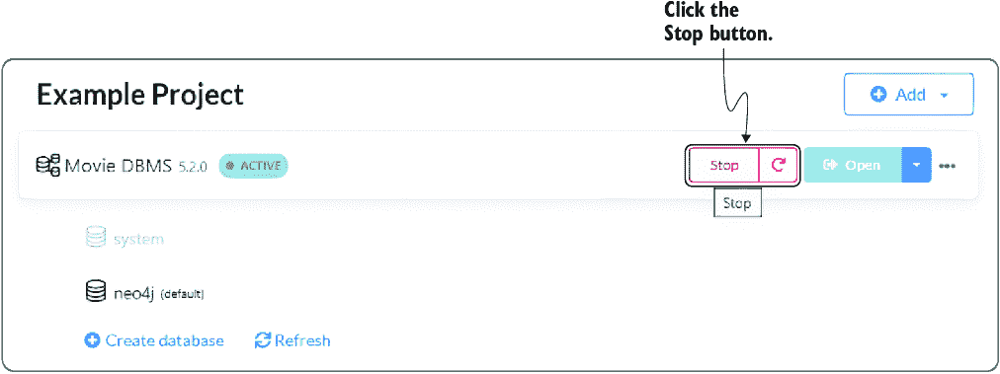
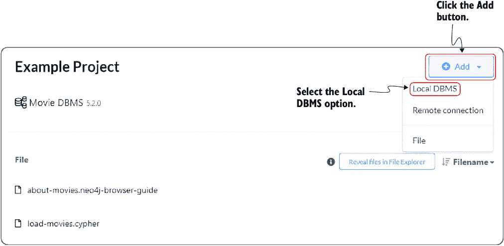
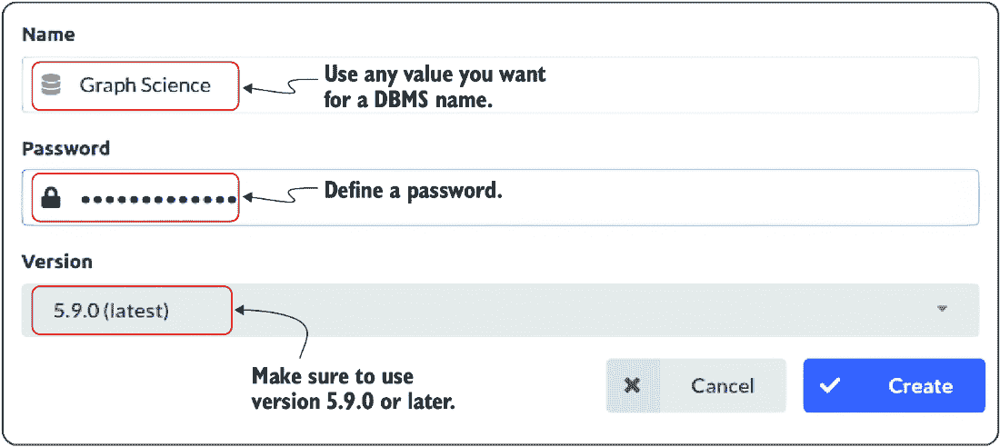
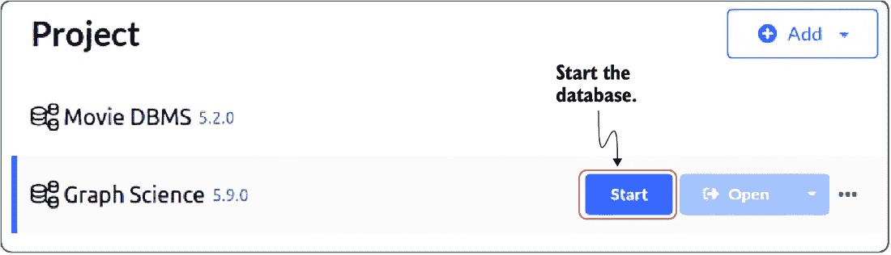
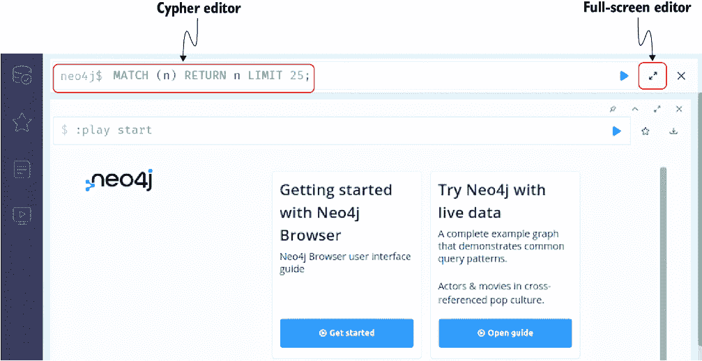

# 附录 A Neo4j 环境

在这本书中，你将通过使用 Neo4j 的实际示例学习图论和算法。我（Oskar）选择 Neo4j 是因为我有超过五年的使用经验，构建和分析图。

Neo4j 是一个原生图数据库，从头开始构建以存储、查询和操作图数据。它使用 Java 实现，可以通过 Cypher 查询语言从其他语言编写的软件中访问，通过事务性 HTTP 端点或二进制 Bolt 协议。在 Neo4j 中，数据以节点和关系的形式存储，它们在数据库中都是一等公民。节点代表实体，如人或企业，而关系代表这些实体之间的连接。节点和关系可以具有属性，这些属性是键值对，提供了关于节点和关系的额外信息。

Neo4j 设计为高度可扩展。它使用灵活的索引系统来高效地查询和操作数据，并支持原子性、一致性、隔离性和持久性事务，以确保数据一致性。它还内置了一种查询语言，称为 Cypher，该语言旨在易于表达且易于使用，用于查询和操作图数据。

使用 Neo4j 的另一个好处是它有两个有用的插件，你将使用它们：

+   *Cypher 神奇过程 (APOC) 插件*——一个为 Neo4j 提供各种功能的程序、函数和插件库，包括数据导入和导出、数据转换和处理、日期时间区间处理、地理空间处理、文本处理等。

+   *图数据科学 (GDS) 插件*——一组针对 Neo4j 的图算法和程序，允许用户对其图数据进行高级分析。GDS 提供了常见图算法（如最短路径、PageRank 和社区检测）的高效并行实现。此外，该插件还包括节点嵌入算法和机器学习工作流程，支持节点分类和链接预测工作流程。

## A.1 Cypher 查询语言

Cypher 是一种用于图数据库的声明式查询语言，用于检索和操作存储在图数据库中的数据。Cypher 查询使用简单、易于阅读的语法编写。以下列表是一个简单的 Cypher 查询示例，它使用 ASCII 艺术风格的图表来展示所查询的关系。

##### 列表 A.1 一个示例 Cypher 语句

```py
MATCH (a:Person)-[:FOLLOWS]->(b:Person)
WHERE a.name = "Alice"
RETURN b.name
```

openCypher 创新项目是 Neo4j 与其他几个组织之间的合作，旨在推广 Cypher 查询语言作为处理图数据的标准。该项目的目标是创建一种通用的语言，可以用于查询任何图数据库，无论其底层技术如何。为了实现这一目标，openCypher 创新项目正在将 Cypher 语言规范和相关资源以开源许可证的形式提供，并鼓励各种组织开发 Cypher 实现。到目前为止，Cypher 查询语言已被 Amazon、AgensGraph、Katana Graph、Memgraph、RedisGraph 和 SAP HANA（openCypher Implementers Group，n.d.）采用。

此外，还有一个官方的 ISO 项目提议一个统一的图查询语言（GQL）来与图数据库交互（GQL 标准委员会，n.d.）。GQL 的目标是建立在 SQL 的基础上，并整合现有图查询语言中的成熟想法，包括 Cypher。这使得学习 Cypher 成为与图数据库交互的绝佳起点，因为它已经与许多数据库集成，并将成为官方 ISO 图查询语言的一部分。有关更多信息，请参阅 GQL 的图模式匹配提案（Deutsch 等人，2022）。

## A.2 Neo4j 安装

设置您的 Neo4j 环境有几种不同的选项：

+   Neo4j Desktop

+   Neo4j Docker

+   Neo4j Aura

### A.2.1 Neo4j Desktop 安装

Neo4j Desktop 是一个本地的 Neo4j 图数据库管理应用程序。它允许您只需几步点击即可创建数据库实例和安装官方插件。如果您决定使用 Neo4j Desktop，请按照以下步骤成功启动一个已安装 APOC 和 GDS 插件的 Neo4j 数据库实例：

1.  从官方网站下载 Neo4j 桌面应用程序（[`neo4j.com/download`](https://neo4j.com/download)；图 A.1）。


##### 图 A.1 下载 Neo4j Desktop。

1.  2. 在您的计算机上安装 Neo4j Desktop 应用程序，然后打开它。

1.  3. 完成注册步骤。您可以在下载应用程序时分配的软件密钥输入，或者通过点击“稍后注册”（图 A.2）跳过此步骤。


##### 图 A.2 输入您的个人信息或跳过注册步骤。

1.  4. 在首次执行 Neo4j Desktop 时，Movies 数据库管理系统（DBMS）会自动启动。如果正在运行，请停止 Movies DBMS（图 A.3）。



##### 图 A.3 停止默认的 Movie DBMS 数据库。

1.  5. 添加一个新的本地 DBMS（图 A.4）。



##### 图 A.4 添加本地 DBMS。

1.  6. 为 DBMS 名称和密码输入任何值。请确保选择版本 5.9.0 或更高版本（图 A.5）。



##### 图 A.5 定义 DBMS 密码和版本。

1.  7. 通过选择 DBMS 安装 APOC 和 GDS 插件，这将打开一个包含详细信息、插件和升级标签的右侧面板。选择插件标签，然后安装 APOC 和 GDS 插件（图 A.6）。


##### 图 A.6 安装 APOC 和 GDS 插件。

1.  8. 启动数据库（图 A.7）。



##### 图 A.7 启动数据库。

1.  9. 打开 Neo4j 浏览器（图 A.8）。


##### 图 A.8 打开 Neo4j 浏览器。

1.  10. 通过在 Cypher 编辑器中键入它们来执行 Cypher 查询。对于较长的 Cypher 语句，你可以使用全屏编辑器选项（图 A.9）。



##### 图 A.9 Neo4j 浏览器中的 Cypher 查询编辑器

### A.2.2 Neo4j Docker 安装

如果你选择了 Neo4j Docker 安装，你需要在命令提示符中运行以下列表中的命令。

##### 列表 A.2 启动 Neo4j Docker

```py
docker run \
  -p 7474:7474 -p 7687:7687 \
  -d \
  -v $HOME/neo4j/data:/data \
  -e NEO4J_AUTH=neo4j/password \
  -e 'NEO4J_PLUGINS=["apoc", "graph-data-science"]' \
    neo4j:5.26.0
```

此命令在后台启动 Docker 化的 Neo4j。通过定义 `NEO4J_PLUGINS` 环境变量，APOC 和 GDS 插件会自动添加。将 `data` 卷挂载以持久化数据库文件是一个好习惯。数据库用户名和密码由 `NEO4J_AUTH` 变量指定。

在执行了列表 A.2 中的命令后，在你的网页浏览器中访问 http://localhost:7474。输入由 `NEO4J_AUTH` 变量指定的密码。示例中的密码是 `password`。

### A.2.3 Neo4j Aura

Neo4j Aura 是 Neo4j 数据库的托管云实例。你可以用它来学习所有章节，除了第七章，它需要 GDS 库。不幸的是，免费版本不提供 GDS 库。如果你想使用云托管的 Neo4j Aura 来跟随本书中的示例，你需要使用 AuraDS 版本，它提供了对 GDS 算法的支持。你可以在 Neo4j 的官方网站上找到更多信息：[`neo4j.com/product/auradb/`](https://neo4j.com/product/auradb/).

## A.3 Neo4j 浏览器配置

Neo4j 浏览器有一个面向初学者的功能，可以可视化所有结果节点之间的关系，即使这些关系不是查询结果的一部分。为了避免混淆，请取消选中连接结果节点功能，如图 A.10 所示。


##### 图 A.10 在 Neo4j 浏览器中取消选中连接结果节点。

## A.4 电影数据集

在某些章节中，我们使用了电影数据集，这是一个小型且易于加载的示例数据集。以下是如何将电影数据集加载到你的 Neo4j 实例中的说明。

### A.4.1 通过 Neo4j 查询指南加载数据

当你在 Neo4j 查询或 Neo4j 浏览器中时，你可以通过在指南侧边栏中找到的“电影图指南”或通过在 Neo4j 浏览器中执行 `:play movies` 来加载电影数据集。

### A.4.2 尝试在线版本

该数据集还有一个在线只读版本，可在[`demo.neo4jlabs.com:7473/browser/`](https://demo.neo4jlabs.com:7473/browser/)（或者使用 Bolt，[`demo.neo4jlabs.com:7687`](https://demo.neo4jlabs.com:7687)）访问。数据库名称、用户名和密码均为“movies”。

### A.4.3 通过 Cypher 加载

如果您想直接使用 Cypher 加载数据集，请使用以下列表中的查询。

##### 列表 A.3 通过 Cypher 加载电影数据集

```py
CREATE CONSTRAINT movie_title IF NOT EXISTS FOR (m:Movie)
REQUIRE m.title IS UNIQUE;
CREATE CONSTRAINT person_name IF NOT EXISTS FOR (p:Person)
REQUIRE p.name IS UNIQUE;

MERGE (TheMatrix:Movie {title:'The Matrix'}) ON CREATE SET
TheMatrix.released=1999, TheMatrix.tagline='Welcome to the Real World'

MERGE (Keanu:Person {name:'Keanu Reeves'}) ON CREATE SET Keanu.born=1964
MERGE (Carrie:Person {name:'Carrie-Anne Moss'})
ON CREATE SET Carrie.born=1967

MERGE (Laurence:Person {name:'Laurence Fishburne'})
ON CREATE SET Laurence.born=1961

MERGE (Hugo:Person {name:'Hugo Weaving'}) ON CREATE SET Hugo.born=1960
MERGE (LillyW:Person {name:'Lilly Wachowski'})
ON CREATE SET LillyW.born=1967
MERGE (LanaW:Person {name:'Lana Wachowski'}) ON CREATE SET LanaW.born=1965
MERGE (JoelS:Person {name:'Joel Silver'}) ON CREATE SET JoelS.born=1952

MERGE (Keanu)-[:ACTED_IN {roles:['Neo']}]->(TheMatrix)
MERGE (Carrie)-[:ACTED_IN {roles:['Trinity']}]->(TheMatrix)
MERGE (Laurence)-[:ACTED_IN {roles:['Morpheus']}]->(TheMatrix)
MERGE (Hugo)-[:ACTED_IN {roles:['Agent Smith']}]->(TheMatrix)
MERGE (LillyW)-[:DIRECTED]->(TheMatrix)
MERGE (LanaW)-[:DIRECTED]->(TheMatrix)
MERGE (JoelS)-[:PRODUCED]->(TheMatrix)
MERGE (Emil:Person {name:'Emil Eifrem'}) ON CREATE SET Emil.born=1978
MERGE (Emil)-[:ACTED_IN {roles:["Emil"]}]->(TheMatrix);

MERGE (TheMatrixReloaded:Movie {title:'The Matrix Reloaded'}) ON CREATE SET
TheMatrixReloaded.released=2003, TheMatrixReloaded.tagline='Free your mind'

MERGE (Keanu:Person {name:'Keanu Reeves'}) ON CREATE SET Keanu.born=1964
MERGE (Carrie:Person {name:'Carrie-Anne Moss'})
ON CREATE SET Carrie.born=1967

MERGE (Laurence:Person {name:'Laurence Fishburne'})
ON CREATE SET Laurence.born=1961

MERGE (Hugo:Person {name:'Hugo Weaving'}) ON CREATE SET Hugo.born=1960
MERGE (LillyW:Person {name:'Lilly Wachowski'})
ON CREATE SET LillyW.born=1967

MERGE (LanaW:Person {name:'Lana Wachowski'}) ON CREATE SET LanaW.born=1965
MERGE (JoelS:Person {name:'Joel Silver'}) ON CREATE SET JoelS.born=1952

MERGE (Keanu)-[:ACTED_IN {roles:['Neo']}]->(TheMatrixReloaded)
MERGE (Carrie)-[:ACTED_IN {roles:['Trinity']}]->(TheMatrixReloaded)
MERGE (Laurence)-[:ACTED_IN {roles:['Morpheus']}]->(TheMatrixReloaded)
MERGE (Hugo)-[:ACTED_IN {roles:['Agent Smith']}]->(TheMatrixReloaded)
MERGE (LillyW)-[:DIRECTED]->(TheMatrixReloaded)
MERGE (LanaW)-[:DIRECTED]->(TheMatrixReloaded)
MERGE (JoelS)-[:PRODUCED]->(TheMatrixReloaded);

MERGE (TheMatrixRevolutions:Movie {title:'The Matrix Revolutions'})
ON CREATE SET TheMatrixRevolutions.released=2003,
TheMatrixRevolutions.tagline='Everything that has a beginning has an end'

MERGE (Keanu:Person {name:'Keanu Reeves'}) ON CREATE SET Keanu.born=1964
MERGE (Carrie:Person {name:'Carrie-Anne Moss'})
ON CREATE SET Carrie.born=1967

MERGE (Laurence:Person {name:'Laurence Fishburne'})
ON CREATE SET Laurence.born=1961

MERGE (Hugo:Person {name:'Hugo Weaving'}) ON CREATE SET Hugo.born=1960
MERGE (LillyW:Person {name:'Lilly Wachowski'})
ON CREATE SET LillyW.born=1967

MERGE (LanaW:Person {name:'Lana Wachowski'}) ON CREATE SET LanaW.born=1965
MERGE (JoelS:Person {name:'Joel Silver'}) ON CREATE SET JoelS.born=1952

MERGE (Keanu)-[:ACTED_IN {roles:['Neo']}]->(TheMatrixRevolutions)
MERGE (Carrie)-[:ACTED_IN {roles:['Trinity']}]->(TheMatrixRevolutions)
MERGE (Laurence)-[:ACTED_IN {roles:['Morpheus']}]->(TheMatrixRevolutions)
MERGE (Hugo)-[:ACTED_IN {roles:['Agent Smith']}]->(TheMatrixRevolutions)
MERGE (LillyW)-[:DIRECTED]->(TheMatrixRevolutions)
MERGE (LanaW)-[:DIRECTED]->(TheMatrixRevolutions)
MERGE (JoelS)-[:PRODUCED]->(TheMatrixRevolutions);

MERGE (TheDevilsAdvocate:Movie
{
  title:"The Devil's Advocate",
  released:1997,
  tagline:'Evil has its winning ways'
})

MERGE (Keanu:Person {name:'Keanu Reeves'}) ON CREATE SET Keanu.born=1964
MERGE (Charlize:Person {name:'Charlize Theron'})
ON CREATE SET Charlize.born=1975
MERGE (Al:Person {name:'Al Pacino'}) ON CREATE SET Al.born=1940
MERGE (Taylor:Person {name:'Taylor Hackford'})
ON CREATE SET Taylor.born=1944

MERGE (Keanu)-[:ACTED_IN {roles:['Kevin Lomax']}]->(TheDevilsAdvocate)
MERGE (Charlize)-[:ACTED_IN {roles:['Mary Ann Lomax']}]->(TheDevilsAdvocate)
MERGE (Al)-[:ACTED_IN {roles:['John Milton']}]->(TheDevilsAdvocate)
MERGE (Taylor)-[:DIRECTED]->(TheDevilsAdvocate);

MERGE (AFewGoodMen:Movie {title:'A Few Good Men'})
ON CREATE SET
AFewGoodMen.released=1992,
AFewGoodMen.tagline='In the heart of the nation\'s capital,↪
↪ in a courthouse of the U.S. government, one man will stop at nothing to
↪ keep his honor, and one will stop at nothing to find the truth.'

MERGE (TomC:Person {name:'Tom Cruise'}) ON CREATE SET TomC.born=1962
MERGE (JackN:Person {name:'Jack Nicholson'}) ON CREATE SET JackN.born=1937
MERGE (DemiM:Person {name:'Demi Moore'}) ON CREATE SET DemiM.born=1962
MERGE (KevinB:Person {name:'Kevin Bacon'}) ON CREATE SET KevinB.born=1958
MERGE (KieferS:Person {name:'Kiefer Sutherland'})
ON CREATE SET KieferS.born=1966

MERGE (NoahW:Person {name:'Noah Wyle'}) ON CREATE SET NoahW.born=1971
MERGE (CubaG:Person {name:'Cuba Gooding Jr.'}) ON CREATE SET CubaG.born=1968
MERGE (KevinP:Person {name:'Kevin Pollak'}) ON CREATE SET KevinP.born=1957
MERGE (JTW:Person {name:'J.T. Walsh'}) ON CREATE SET JTW.born=1943
MERGE (JamesM:Person {name:'James Marshall'}) ON CREATE SET JamesM.born=1967
MERGE (ChristopherG:Person {name:'Christopher Guest'})
ON CREATE SET ChristopherG.born=1948

MERGE (RobR:Person {name:'Rob Reiner'}) ON CREATE SET RobR.born=1947
MERGE (AaronS:Person {name:'Aaron Sorkin'}) ON CREATE SET AaronS.born=1961

MERGE (TomC)-[:ACTED_IN {roles:['Lt. Daniel Kaffee']}]->(AFewGoodMen)
MERGE (JackN)-[:ACTED_IN {roles:['Col. Nathan R. Jessup']}]->(AFewGoodMen)

MERGE (DemiM)-[:ACTED_IN {
  roles:['Lt. Cdr. JoAnne Galloway']
}]->(AFewGoodMen)

MERGE (KevinB)-[:ACTED_IN {
  roles:['Capt. Jack Ross']
}]->(AFewGoodMen)
MERGE (KieferS)-[:ACTED_IN {roles:['Lt. Jonathan Kendrick']}]->(AFewGoodMen)
MERGE (NoahW)-[:ACTED_IN {roles:['Cpl. Jeffrey Barnes']}]->(AFewGoodMen)
MERGE (CubaG)-[:ACTED_IN {roles:['Cpl. Carl Hammaker']}]->(AFewGoodMen)
MERGE (KevinP)-[:ACTED_IN {roles:['Lt. Sam Weinberg']}]->(AFewGoodMen)
MERGE (JTW)-[:ACTED_IN {
  roles:['Lt. Col. Matthew Andrew Markinson']
}]->(AFewGoodMen)

MERGE (JamesM)-[:ACTED_IN {roles:['Pfc. Louden Downey']}]->(AFewGoodMen)
MERGE (ChristopherG)-[:ACTED_IN {roles:['Dr. Stone']}]->(AFewGoodMen)
MERGE (AaronS)-[:ACTED_IN {roles:['Man in Bar']}]->(AFewGoodMen)
MERGE (RobR)-[:DIRECTED]->(AFewGoodMen)
MERGE (AaronS)-[:WROTE]->(AFewGoodMen);

MERGE (TopGun:Movie {title:'Top Gun'}) ON CREATE SET
TopGun.released=1986, TopGun.tagline='I feel the need, the need for speed.'

MERGE (TomC:Person {name:'Tom Cruise'}) ON CREATE SET TomC.born=1962
MERGE (KellyM:Person {name:'Kelly McGillis'}) ON CREATE SET KellyM.born=1957
MERGE (ValK:Person {name:'Val Kilmer'}) ON CREATE SET ValK.born=1959
MERGE (AnthonyE:Person {name:'Anthony Edwards'})
ON CREATE SET AnthonyE.born=1962

MERGE (TomS:Person {name:'Tom Skerritt'}) ON CREATE SET TomS.born=1933
MERGE (MegR:Person {name:'Meg Ryan'}) ON CREATE SET MegR.born=1961
MERGE (TonyS:Person {name:'Tony Scott'}) ON CREATE SET TonyS.born=1944
MERGE (JimC:Person {name:'Jim Cash'}) ON CREATE SET JimC.born=1941

MERGE (TomC)-[:ACTED_IN {roles:['Maverick']}]->(TopGun)
MERGE (KellyM)-[:ACTED_IN {roles:['Charlie']}]->(TopGun)
MERGE (ValK)-[:ACTED_IN {roles:['Iceman']}]->(TopGun)
MERGE (AnthonyE)-[:ACTED_IN {roles:['Goose']}]->(TopGun)
MERGE (TomS)-[:ACTED_IN {roles:['Viper']}]->(TopGun)
MERGE (MegR)-[:ACTED_IN {roles:['Carole']}]->(TopGun)
MERGE (TonyS)-[:DIRECTED]->(TopGun)
MERGE (JimC)-[:WROTE]->(TopGun);

MERGE (JerryMaguire:Movie {title:'Jerry Maguire'}) ON CREATE SET
JerryMaguire.released=2000,
JerryMaguire.tagline='The rest of his life begins now.'

MERGE (TomC:Person {name:'Tom Cruise'}) ON CREATE SET TomC.born=1962
MERGE (CubaG:Person {name:'Cuba Gooding Jr.'}) ON CREATE SET CubaG.born=1968
MERGE (ReneeZ:Person {name:'Renee Zellweger'})
ON CREATE SET ReneeZ.born=1969
MERGE (KellyP:Person {name:'Kelly Preston'}) ON CREATE SET KellyP.born=1962
MERGE (JerryO:Person {name:'Jerry O\'Connell'})
ON CREATE SET JerryO.born=1974
MERGE (JayM:Person {name:'Jay Mohr'}) ON CREATE SET JayM.born=1970
MERGE (BonnieH:Person {name:'Bonnie Hunt'}) ON CREATE SET BonnieH.born=1961
MERGE (ReginaK:Person {name:'Regina King'}) ON CREATE SET ReginaK.born=1971
MERGE (JonathanL:Person {name:'Jonathan Lipnicki'})
ON CREATE SET JonathanL.born=1996
MERGE (CameronC:Person {name:'Cameron Crowe'})
ON CREATE SET CameronC.born=1957

MERGE (TomC)-[:ACTED_IN {roles:['Jerry Maguire']}]->(JerryMaguire)
MERGE (CubaG)-[:ACTED_IN {roles:['Rod Tidwell']}]->(JerryMaguire)
MERGE (ReneeZ)-[:ACTED_IN {roles:['Dorothy Boyd']}]->(JerryMaguire)
MERGE (KellyP)-[:ACTED_IN {roles:['Avery Bishop']}]->(JerryMaguire)
MERGE (JerryO)-[:ACTED_IN {roles:['Frank Cushman']}]->(JerryMaguire)
MERGE (JayM)-[:ACTED_IN {roles:['Bob Sugar']}]->(JerryMaguire)
MERGE (BonnieH)-[:ACTED_IN {roles:['Laurel Boyd']}]->(JerryMaguire)
MERGE (ReginaK)-[:ACTED_IN {roles:['Marcee Tidwell']}]->(JerryMaguire)
MERGE (JonathanL)-[:ACTED_IN {roles:['Ray Boyd']}]->(JerryMaguire)
MERGE (CameronC)-[:DIRECTED]->(JerryMaguire)
MERGE (CameronC)-[:PRODUCED]->(JerryMaguire)
MERGE (CameronC)-[:WROTE]->(JerryMaguire);

MERGE (StandByMe:Movie {title:'Stand By Me'})
ON CREATE SET StandByMe.released=1986,
StandByMe.tagline='For some, it\'s the last real taste of innocence, and↪
↪ the first real taste of life. But for everyone, it\'s the time that↪
↪ memories are made of.'

MERGE (RiverP:Person {name:'River Phoenix'}) ON CREATE SET RiverP.born=1970
MERGE (CoreyF:Person {name:'Corey Feldman'}) ON CREATE SET CoreyF.born=1971
MERGE (JerryO:Person {name:'Jerry O\'Connell'})
ON CREATE SET JerryO.born=1974
MERGE (WilW:Person {name:'Wil Wheaton'}) ON CREATE SET WilW.born=1972
MERGE (KieferS:Person {name:'Kiefer Sutherland'})
ON CREATE SET KieferS.born=1966
MERGE (JohnC:Person {name:'John Cusack'}) ON CREATE SET JohnC.born=1966
MERGE (MarshallB:Person {name:'Marshall Bell'})
ON CREATE SET MarshallB.born=1942
MERGE (RobR:Person {name:'Rob Reiner'}) ON CREATE SET RobR.born=1947

MERGE (WilW)-[:ACTED_IN {roles:['Gordie Lachance']}]->(StandByMe)
MERGE (RiverP)-[:ACTED_IN {roles:['Chris Chambers']}]->(StandByMe)
MERGE (JerryO)-[:ACTED_IN {roles:['Vern Tessio']}]->(StandByMe)
MERGE (CoreyF)-[:ACTED_IN {roles:['Teddy Duchamp']}]->(StandByMe)
MERGE (JohnC)-[:ACTED_IN {roles:['Denny Lachance']}]->(StandByMe)
MERGE (KieferS)-[:ACTED_IN {roles:['Ace Merrill']}]->(StandByMe)
MERGE (MarshallB)-[:ACTED_IN {roles:['Mr. Lachance']}]->(StandByMe)
MERGE (RobR)-[:DIRECTED]->(StandByMe);

MERGE (AsGoodAsItGets:Movie {title:'As Good as It Gets'})
ON CREATE SET AsGoodAsItGets.released=1997,
AsGoodAsItGets.tagline='A comedy from the heart that goes for the throat.'

MERGE (JackN:Person {name:'Jack Nicholson'}) ON CREATE SET JackN.born=1937
MERGE (HelenH:Person {name:'Helen Hunt'}) ON CREATE SET HelenH.born=1963
MERGE (GregK:Person {name:'Greg Kinnear'}) ON CREATE SET GregK.born=1963
MERGE (JamesB:Person {name:'James L. Brooks'})
ON CREATE SET JamesB.born=1940
MERGE (CubaG:Person {name:'Cuba Gooding Jr.'}) ON CREATE SET CubaG.born=1968

MERGE (JackN)-[:ACTED_IN {roles:['Melvin Udall']}]->(AsGoodAsItGets)
MERGE (HelenH)-[:ACTED_IN {roles:['Carol Connelly']}]->(AsGoodAsItGets)
MERGE (GregK)-[:ACTED_IN {roles:['Simon Bishop']}]->(AsGoodAsItGets)
MERGE (CubaG)-[:ACTED_IN {roles:['Frank Sachs']}]->(AsGoodAsItGets)
MERGE (JamesB)-[:DIRECTED]->(AsGoodAsItGets);

MERGE (WhatDreamsMayCome:Movie {title:'What Dreams May Come'})
ON CREATE SET WhatDreamsMayCome.released=1998,
WhatDreamsMayCome.tagline='After life there is more. The end is just the↪
↪ beginning.'

MERGE (AnnabellaS:Person {name:'Annabella Sciorra'})
ON CREATE SET AnnabellaS.born=1960
MERGE (MaxS:Person {name:'Max von Sydow'}) ON CREATE SET MaxS.born=1929
MERGE (WernerH:Person {name:'Werner Herzog'})
ON CREATE SET WernerH.born=1942
MERGE (Robin:Person {name:'Robin Williams'}) ON CREATE SET Robin.born=1951
MERGE (VincentW:Person {name:'Vincent Ward'})
ON CREATE SET VincentW.born=1956
MERGE (CubaG:Person {name:'Cuba Gooding Jr.'}) ON CREATE SET CubaG.born=1968

MERGE (Robin)-[:ACTED_IN {roles:['Chris Nielsen']}]->(WhatDreamsMayCome)
MERGE (CubaG)-[:ACTED_IN {roles:['Albert Lewis']}]->(WhatDreamsMayCome)
MERGE (AnnabellaS)-[:ACTED_IN {
  roles:['Annie Collins-Nielsen']
}]->(WhatDreamsMayCome)
MERGE (MaxS)-[:ACTED_IN {roles:['The Tracker']}]->(WhatDreamsMayCome)
MERGE (WernerH)-[:ACTED_IN {roles:['The Face']}]->(WhatDreamsMayCome)
MERGE (VincentW)-[:DIRECTED]->(WhatDreamsMayCome);

MERGE (SnowFallingonCedars:Movie {title:'Snow Falling on Cedars'})
ON CREATE SET SnowFallingonCedars.released=1999,
SnowFallingonCedars.tagline='First loves last. Forever.'

MERGE (EthanH:Person {name:'Ethan Hawke'}) ON CREATE SET EthanH.born=1970
MERGE (RickY:Person {name:'Rick Yune'}) ON CREATE SET RickY.born=1971
MERGE (JamesC:Person {name:'James Cromwell'}) ON CREATE SET JamesC.born=1940
MERGE (ScottH:Person {name:'Scott Hicks'}) ON CREATE SET ScottH.born=1953
MERGE (MaxS:Person {name:'Max von Sydow'}) ON CREATE SET MaxS.born=1929

MERGE (EthanH)-[:ACTED_IN {
  roles:['Ishmael Chambers']
}]->(SnowFallingonCedars)
MERGE (RickY)-[:ACTED_IN {roles:['Kazuo Miyamoto']}]->(SnowFallingonCedars)
MERGE (MaxS)-[:ACTED_IN {roles:['Nels Gudmundsson']}]->(SnowFallingonCedars)
MERGE (JamesC)-[:ACTED_IN {roles:['Judge Fielding']}]->(SnowFallingonCedars)
MERGE (ScottH)-[:DIRECTED]->(SnowFallingonCedars);

MERGE (YouveGotMail:Movie {title:'You\'ve Got Mail'}) ON CREATE SET
YouveGotMail.released=1998,
YouveGotMail.tagline='At odds in life... in love on-line.'

MERGE (TomH:Person {name:'Tom Hanks'}) ON CREATE SET TomH.born=1956
MERGE (MegR:Person {name:'Meg Ryan'}) ON CREATE SET MegR.born=1961
MERGE (GregK:Person {name:'Greg Kinnear'}) ON CREATE SET GregK.born=1963
MERGE (ParkerP:Person {name:'Parker Posey'}) ON CREATE SET ParkerP.born=1968
MERGE (DaveC:Person {name:'Dave Chappelle'}) ON CREATE SET DaveC.born=1973
MERGE (SteveZ:Person {name:'Steve Zahn'}) ON CREATE SET SteveZ.born=1967
MERGE (NoraE:Person {name:'Nora Ephron'}) ON CREATE SET NoraE.born=1941

MERGE (TomH)-[:ACTED_IN {roles:['Joe Fox']}]->(YouveGotMail)
MERGE (MegR)-[:ACTED_IN {roles:['Kathleen Kelly']}]->(YouveGotMail)
MERGE (GregK)-[:ACTED_IN {roles:['Frank Navasky']}]->(YouveGotMail)
MERGE (ParkerP)-[:ACTED_IN {roles:['Patricia Eden']}]->(YouveGotMail)
MERGE (DaveC)-[:ACTED_IN {roles:['Kevin Jackson']}]->(YouveGotMail)
MERGE (SteveZ)-[:ACTED_IN {roles:['George Pappas']}]->(YouveGotMail)
MERGE (NoraE)-[:DIRECTED]->(YouveGotMail);

MERGE (SleeplessInSeattle:Movie {title:'Sleepless in Seattle'})
ON CREATE SET SleeplessInSeattle.released=1993,
SleeplessInSeattle.tagline='What if someone you never met, someone you never↪
↪ saw, someone you never knew was the only someone for you?'

MERGE (TomH:Person {name:'Tom Hanks'}) ON CREATE SET TomH.born=1956
MERGE (MegR:Person {name:'Meg Ryan'}) ON CREATE SET MegR.born=1961
MERGE (RitaW:Person {name:'Rita Wilson'}) ON CREATE SET RitaW.born=1956
MERGE (BillPull:Person {name:'Bill Pullman'})
ON CREATE SET BillPull.born=1953
MERGE (VictorG:Person {name:'Victor Garber'})
ON CREATE SET VictorG.born=1949
MERGE (RosieO:Person {name:'Rosie O\'Donnell'})
ON CREATE SET RosieO.born=1962
MERGE (NoraE:Person {name:'Nora Ephron'}) ON CREATE SET NoraE.born=1941

MERGE (TomH)-[:ACTED_IN {roles:['Sam Baldwin']}]->(SleeplessInSeattle)
MERGE (MegR)-[:ACTED_IN {roles:['Annie Reed']}]->(SleeplessInSeattle)
MERGE (RitaW)-[:ACTED_IN {roles:['Suzy']}]->(SleeplessInSeattle)
MERGE (BillPull)-[:ACTED_IN {roles:['Walter']}]->(SleeplessInSeattle)
MERGE (VictorG)-[:ACTED_IN {roles:['Greg']}]->(SleeplessInSeattle)
MERGE (RosieO)-[:ACTED_IN {roles:['Becky']}]->(SleeplessInSeattle)
MERGE (NoraE)-[:DIRECTED]->(SleeplessInSeattle);

MERGE (JoeVersustheVolcano:Movie {title:'Joe Versus the Volcano'})
ON CREATE SET JoeVersustheVolcano.released=1990,
JoeVersustheVolcano.tagline='A story of love, lava and burning desire.'

MERGE (TomH:Person {name:'Tom Hanks'}) ON CREATE SET TomH.born=1956
MERGE (MegR:Person {name:'Meg Ryan'}) ON CREATE SET MegR.born=1961
MERGE (JohnS:Person {name:'John Patrick Stanley'})
ON CREATE SET JohnS.born=1950
MERGE (Nathan:Person {name:'Nathan Lane'}) ON CREATE SET Nathan.born=1956

MERGE (TomH)-[:ACTED_IN {roles:['Joe Banks']}]->(JoeVersustheVolcano)
MERGE (MegR)-[:ACTED_IN {
  roles:['DeDe', 'Angelica Graynamore', 'Patricia Graynamore']
}]->(JoeVersustheVolcano)
MERGE (Nathan)-[:ACTED_IN {roles:['Baw']}]->(JoeVersustheVolcano)
MERGE (JohnS)-[:DIRECTED]->(JoeVersustheVolcano);

MERGE (WhenHarryMetSally:Movie {title:'When Harry Met Sally'}) ON CREATE SET
 WhenHarryMetSally.released=1998,
 WhenHarryMetSally.tagline='Can two friends sleep together and still love
 ↪ each other in the morning?'

MERGE (MegR:Person {name:'Meg Ryan'}) ON CREATE SET MegR.born=1961
MERGE (BillyC:Person {name:'Billy Crystal'}) ON CREATE SET BillyC.born=1948
MERGE (CarrieF:Person {name:'Carrie Fisher'})
ON CREATE SET CarrieF.born=1956
MERGE (BrunoK:Person {name:'Bruno Kirby'}) ON CREATE SET BrunoK.born=1949
MERGE (RobR:Person {name:'Rob Reiner'}) ON CREATE SET RobR.born=1947
MERGE (NoraE:Person {name:'Nora Ephron'}) ON CREATE SET NoraE.born=1941

MERGE (BillyC)-[:ACTED_IN {roles:['Harry Burns']}]->(WhenHarryMetSally)
MERGE (MegR)-[:ACTED_IN {roles:['Sally Albright']}]->(WhenHarryMetSally)
MERGE (CarrieF)-[:ACTED_IN {roles:['Marie']}]->(WhenHarryMetSally)
MERGE (BrunoK)-[:ACTED_IN {roles:['Jess']}]->(WhenHarryMetSally)
MERGE (RobR)-[:DIRECTED]->(WhenHarryMetSally)
MERGE (RobR)-[:PRODUCED]->(WhenHarryMetSally)
MERGE (NoraE)-[:PRODUCED]->(WhenHarryMetSally)
MERGE (NoraE)-[:WROTE]->(WhenHarryMetSally);

MERGE (ThatThingYouDo:Movie {title:'That Thing You Do'})
ON CREATE SET ThatThingYouDo.released=1996,
ThatThingYouDo.tagline='In every life there comes a time when that thing you↪
↪ dream becomes that thing you do'

MERGE (TomH:Person {name:'Tom Hanks'}) ON CREATE SET TomH.born=1956
MERGE (LivT:Person {name:'Liv Tyler'}) ON CREATE SET LivT.born=1977
MERGE (Charlize:Person {name:'Charlize Theron'})
ON CREATE SET Charlize.born=1975

MERGE (TomH)-[:ACTED_IN {roles:['Mr. White']}]->(ThatThingYouDo)
MERGE (LivT)-[:ACTED_IN {roles:['Faye Dolan']}]->(ThatThingYouDo)
MERGE (Charlize)-[:ACTED_IN {roles:['Tina']}]->(ThatThingYouDo)
MERGE (TomH)-[:DIRECTED]->(ThatThingYouDo);

MERGE (TheReplacements:Movie {title:'The Replacements'}) ON CREATE SET
TheReplacements.released=2000,
TheReplacements.tagline='Pain heals, Chicks dig scars... Glory lasts forever'

MERGE (Keanu:Person {name:'Keanu Reeves'}) ON CREATE SET Keanu.born=1964
MERGE (Brooke:Person {name:'Brooke Langton'}) ON CREATE SET Brooke.born=1970
MERGE (Gene:Person {name:'Gene Hackman'}) ON CREATE SET Gene.born=1930
MERGE (Orlando:Person {name:'Orlando Jones'})
ON CREATE SET Orlando.born=1968
MERGE (Howard:Person {name:'Howard Deutch'}) ON CREATE SET Howard.born=1950

MERGE (Keanu)-[:ACTED_IN {roles:['Shane Falco']}]->(TheReplacements)
MERGE (Brooke)-[:ACTED_IN {roles:['Annabelle Farrell']}]->(TheReplacements)
MERGE (Gene)-[:ACTED_IN {roles:['Jimmy McGinty']}]->(TheReplacements)
MERGE (Orlando)-[:ACTED_IN {roles:['Clifford Franklin']}]->(TheReplacements)
MERGE (Howard)-[:DIRECTED]->(TheReplacements);

MERGE (RescueDawn:Movie {title:'RescueDawn'}) ON CREATE SET
RescueDawn.released=2006,
RescueDawn.tagline='Based on the extraordinary true story of one man\'s↪
↪ fight for freedom'

MERGE (ChristianB:Person {name:'Christian Bale'})
ON CREATE SET ChristianB.born=1974
MERGE (ZachG:Person {name:'Zach Grenier'}) ON CREATE SET ZachG.born=1954
MERGE (MarshallB:Person {name:'Marshall Bell'})
ON CREATE SET MarshallB.born=1942
MERGE (SteveZ:Person {name:'Steve Zahn'}) ON CREATE SET SteveZ.born=1967
MERGE (WernerH:Person {name:'Werner Herzog'})
ON CREATE SET WernerH.born=1942

MERGE (MarshallB)-[:ACTED_IN {roles:['Admiral']}]->(RescueDawn)
MERGE (ChristianB)-[:ACTED_IN {roles:['Dieter Dengler']}]->(RescueDawn)
MERGE (ZachG)-[:ACTED_IN {roles:['Squad Leader']}]->(RescueDawn)
MERGE (SteveZ)-[:ACTED_IN {roles:['Duane']}]->(RescueDawn)
MERGE (WernerH)-[:DIRECTED]->(RescueDawn);

MERGE (TheBirdcage:Movie {title:'The Birdcage'}) ON CREATE SET
TheBirdcage.released=1996, TheBirdcage.tagline='Come as you are'

MERGE (MikeN:Person {name:'Mike Nichols'}) ON CREATE SET MikeN.born=1931
MERGE (Robin:Person {name:'Robin Williams'}) ON CREATE SET Robin.born=1951
MERGE (Nathan:Person {name:'Nathan Lane'}) ON CREATE SET Nathan.born=1956
MERGE (Gene:Person {name:'Gene Hackman'}) ON CREATE SET Gene.born=1930

MERGE (Robin)-[:ACTED_IN {roles:['Armand Goldman']}]->(TheBirdcage)
MERGE (Nathan)-[:ACTED_IN {roles:['Albert Goldman']}]->(TheBirdcage)
MERGE (Gene)-[:ACTED_IN {roles:['Sen. Kevin Keeley']}]->(TheBirdcage)
MERGE (MikeN)-[:DIRECTED]->(TheBirdcage);

MERGE (Unforgiven:Movie {title:'Unforgiven'}) ON CREATE SET
Unforgiven.released=1992,
Unforgiven.tagline='It\'s a hell of a thing, killing a man'

MERGE (Gene:Person {name:'Gene Hackman'}) ON CREATE SET Gene.born=1930
MERGE (RichardH:Person {name:'Richard Harris'})
ON CREATE SET RichardH.born=1930
MERGE (ClintE:Person {name:'Clint Eastwood'}) ON CREATE SET ClintE.born=1930

MERGE (RichardH)-[:ACTED_IN {roles:['English Bob']}]->(Unforgiven)
MERGE (ClintE)-[:ACTED_IN {roles:['Bill Munny']}]->(Unforgiven)
MERGE (Gene)-[:ACTED_IN {roles:['Little Bill Daggett']}]->(Unforgiven)
MERGE (ClintE)-[:DIRECTED]->(Unforgiven);

MERGE (JohnnyMnemonic:Movie {title:'Johnny Mnemonic'}) ON CREATE SET
JohnnyMnemonic.released=1995,
JohnnyMnemonic.tagline='The hottest data on earth. In the coolest head in↪
↪ town'

MERGE (Keanu:Person {name:'Keanu Reeves'}) ON CREATE SET Keanu.born=1964
MERGE (Takeshi:Person {name:'Takeshi Kitano'})
ON CREATE SET Takeshi.born=1947
MERGE (Dina:Person {name:'Dina Meyer'}) ON CREATE SET Dina.born=1968
MERGE (IceT:Person {name:'Ice-T'}) ON CREATE SET IceT.born=1958
MERGE (RobertL:Person {name:'Robert Longo'}) ON CREATE SET RobertL.born=1953

MERGE (Keanu)-[:ACTED_IN {roles:['Johnny Mnemonic']}]->(JohnnyMnemonic)
MERGE (Takeshi)-[:ACTED_IN {roles:['Takahashi']}]->(JohnnyMnemonic)
MERGE (Dina)-[:ACTED_IN {roles:['Jane']}]->(JohnnyMnemonic)
MERGE (IceT)-[:ACTED_IN {roles:['J-Bone']}]->(JohnnyMnemonic)
MERGE (RobertL)-[:DIRECTED]->(JohnnyMnemonic);

MERGE (CloudAtlas:Movie {title:'Cloud Atlas'}) ON CREATE SET
CloudAtlas.released=2012, CloudAtlas.tagline='Everything is connected'

MERGE (TomH:Person {name:'Tom Hanks'}) ON CREATE SET TomH.born=1956
MERGE (Hugo:Person {name:'Hugo Weaving'}) ON CREATE SET Hugo.born=1960
MERGE (HalleB:Person {name:'Halle Berry'}) ON CREATE SET HalleB.born=1966
MERGE (JimB:Person {name:'Jim Broadbent'}) ON CREATE SET JimB.born=1949
MERGE (TomT:Person {name:'Tom Tykwer'}) ON CREATE SET TomT.born=1965
MERGE (DavidMitchell:Person {name:'David Mitchell'})
ON CREATE SET DavidMitchell.born=1969
MERGE (StefanArndt:Person {name:'Stefan Arndt'})
ON CREATE SET StefanArndt.born=1961
MERGE (LillyW:Person {name:'Lilly Wachowski'})
ON CREATE SET LillyW.born=1967
MERGE (LanaW:Person {name:'Lana Wachowski'}) ON CREATE SET LanaW.born=1965

MERGE (TomH)-[:ACTED_IN {
  roles:['Zachry', 'Dr. Henry Goose', 'Isaac Sachs', 'Dermot Hoggins']
}]->(CloudAtlas)
MERGE (Hugo)-[:ACTED_IN {
  roles:[
    'Bill Smoke',
    'Haskell Moore',
    'Tadeusz Kesselring',
    'Nurse Noakes',
    'Boardman Mephi',
    'Old Georgie'
  ]
}]->(CloudAtlas)
MERGE (HalleB)-[:ACTED_IN {
  roles:['Luisa Rey', 'Jocasta Ayrs', 'Ovid', 'Meronym']
}]->(CloudAtlas)
MERGE (JimB)-[:ACTED_IN {
  roles:['Vyvyan Ayrs', 'Captain Molyneux', 'Timothy Cavendish']
}]->(CloudAtlas)
MERGE (TomT)-[:DIRECTED]->(CloudAtlas)
MERGE (LillyW)-[:DIRECTED]->(CloudAtlas)
MERGE (LanaW)-[:DIRECTED]->(CloudAtlas)
MERGE (DavidMitchell)-[:WROTE]->(CloudAtlas)
MERGE (StefanArndt)-[:PRODUCED]->(CloudAtlas);

MERGE (TheDaVinciCode:Movie {title:'The Da Vinci Code'}) ON CREATE SET
TheDaVinciCode.released=2006, TheDaVinciCode.tagline='Break The Codes'

MERGE (TomH:Person {name:'Tom Hanks'}) ON CREATE SET TomH.born=1956
MERGE (IanM:Person {name:'Ian McKellen'}) ON CREATE SET IanM.born=1939
MERGE (AudreyT:Person {name:'Audrey Tautou'})
ON CREATE SET AudreyT.born=1976
MERGE (PaulB:Person {name:'Paul Bettany'}) ON CREATE SET PaulB.born=1971
MERGE (RonH:Person {name:'Ron Howard'}) ON CREATE SET RonH.born=1954

MERGE (TomH)-[:ACTED_IN {roles:['Dr. Robert Langdon']}]->(TheDaVinciCode)
MERGE (IanM)-[:ACTED_IN {roles:['Sir Leight Teabing']}]->(TheDaVinciCode)
MERGE (AudreyT)-[:ACTED_IN {roles:['Sophie Neveu']}]->(TheDaVinciCode)
MERGE (PaulB)-[:ACTED_IN {roles:['Silas']}]->(TheDaVinciCode)
MERGE (RonH)-[:DIRECTED]->(TheDaVinciCode);

MERGE (VforVendetta:Movie {title:'V for Vendetta'}) ON CREATE SET
VforVendetta.released=2006, VforVendetta.tagline='Freedom! Forever!'

MERGE (Hugo:Person {name:'Hugo Weaving'}) ON CREATE SET Hugo.born=1960
MERGE (NatalieP:Person {name:'Natalie Portman'})
ON CREATE SET NatalieP.born=1981
MERGE (StephenR:Person {name:'Stephen Rea'})
ON CREATE SET StephenR.born=1946
MERGE (JohnH:Person {name:'John Hurt'}) ON CREATE SET JohnH.born=1940
MERGE (BenM:Person {name:'Ben Miles'}) ON CREATE SET BenM.born=1967
MERGE (LillyW:Person {name:'Lilly Wachowski'})
ON CREATE SET LillyW.born=1967
MERGE (LanaW:Person {name:'Lana Wachowski'}) ON CREATE SET LanaW.born=1965
MERGE (JamesM:Person {name:'James Marshall'}) ON CREATE SET JamesM.born=1967
MERGE (JoelS:Person {name:'Joel Silver'}) ON CREATE SET JoelS.born=1952

MERGE (Hugo)-[:ACTED_IN {roles:['V']}]->(VforVendetta)
MERGE (NatalieP)-[:ACTED_IN {roles:['Evey Hammond']}]->(VforVendetta)
MERGE (StephenR)-[:ACTED_IN {roles:['Eric Finch']}]->(VforVendetta)
MERGE (JohnH)-[:ACTED_IN {
  roles:['High Chancellor Adam Sutler']
}]->(VforVendetta)
MERGE (BenM)-[:ACTED_IN {roles:['Dascomb']}]->(VforVendetta)
MERGE (JamesM)-[:DIRECTED]->(VforVendetta)
MERGE (LillyW)-[:PRODUCED]->(VforVendetta)
MERGE (LanaW)-[:PRODUCED]->(VforVendetta)
MERGE (JoelS)-[:PRODUCED]->(VforVendetta)
MERGE (LillyW)-[:WROTE]->(VforVendetta)
MERGE (LanaW)-[:WROTE]->(VforVendetta);

MERGE (SpeedRacer:Movie {title:'Speed Racer'}) ON CREATE SET
SpeedRacer.released=2008, SpeedRacer.tagline='Speed has no limits'

MERGE (EmileH:Person {name:'Emile Hirsch'}) ON CREATE SET EmileH.born=1985
MERGE (JohnG:Person {name:'John Goodman'}) ON CREATE SET JohnG.born=1960
MERGE (SusanS:Person {name:'Susan Sarandon'}) ON CREATE SET SusanS.born=1946
MERGE (MatthewF:Person {name:'Matthew Fox'})
ON CREATE SET MatthewF.born=1966
MERGE (ChristinaR:Person {name:'Christina Ricci'})
ON CREATE SET ChristinaR.born=1980
MERGE (Rain:Person {name:'Rain'}) ON CREATE SET Rain.born=1982
MERGE (BenM:Person {name:'Ben Miles'}) ON CREATE SET BenM.born=1967
MERGE (LillyW:Person {name:'Lilly Wachowski'})
ON CREATE SET LillyW.born=1967
MERGE (LanaW:Person {name:'Lana Wachowski'}) ON CREATE SET LanaW.born=1965
MERGE (JoelS:Person {name:'Joel Silver'}) ON CREATE SET JoelS.born=1952

MERGE (EmileH)-[:ACTED_IN {roles:['Speed Racer']}]->(SpeedRacer)
MERGE (JohnG)-[:ACTED_IN {roles:['Pops']}]->(SpeedRacer)
MERGE (SusanS)-[:ACTED_IN {roles:['Mom']}]->(SpeedRacer)
MERGE (MatthewF)-[:ACTED_IN {roles:['Racer X']}]->(SpeedRacer)
MERGE (ChristinaR)-[:ACTED_IN {roles:['Trixie']}]->(SpeedRacer)
MERGE (Rain)-[:ACTED_IN {roles:['Taejo Togokahn']}]->(SpeedRacer)
MERGE (BenM)-[:ACTED_IN {roles:['Cass Jones']}]->(SpeedRacer)
MERGE (LillyW)-[:DIRECTED]->(SpeedRacer)
MERGE (LanaW)-[:DIRECTED]->(SpeedRacer)
MERGE (LillyW)-[:WROTE]->(SpeedRacer)
MERGE (LanaW)-[:WROTE]->(SpeedRacer)
MERGE (JoelS)-[:PRODUCED]->(SpeedRacer);

MERGE (NinjaAssassin:Movie {title:'Ninja Assassin'}) ON CREATE SET
 NinjaAssassin.released=2009,
 NinjaAssassin.tagline='Prepare to enter a secret world of assassins'

MERGE (NaomieH:Person {name:'Naomie Harris'})
MERGE (Rain:Person {name:'Rain'}) ON CREATE SET Rain.born=1982
MERGE (BenM:Person {name:'Ben Miles'}) ON CREATE SET BenM.born=1967
MERGE (LillyW:Person {name:'Lilly Wachowski'})
ON CREATE SET LillyW.born=1967
MERGE (LanaW:Person {name:'Lana Wachowski'}) ON CREATE SET LanaW.born=1965
MERGE (RickY:Person {name:'Rick Yune'}) ON CREATE SET RickY.born=1971
MERGE (JamesM:Person {name:'James Marshall'}) ON CREATE SET JamesM.born=1967
MERGE (JoelS:Person {name:'Joel Silver'}) ON CREATE SET JoelS.born=1952

MERGE (Rain)-[:ACTED_IN {roles:['Raizo']}]->(NinjaAssassin)
MERGE (NaomieH)-[:ACTED_IN {roles:['Mika Coretti']}]->(NinjaAssassin)
MERGE (RickY)-[:ACTED_IN {roles:['Takeshi']}]->(NinjaAssassin)
MERGE (BenM)-[:ACTED_IN {roles:['Ryan Maslow']}]->(NinjaAssassin)
MERGE (JamesM)-[:DIRECTED]->(NinjaAssassin)
MERGE (LillyW)-[:PRODUCED]->(NinjaAssassin)
MERGE (LanaW)-[:PRODUCED]->(NinjaAssassin)
MERGE (JoelS)-[:PRODUCED]->(NinjaAssassin);

MERGE (TheGreenMile:Movie {title:'The Green Mile'}) ON CREATE SET
TheGreenMile.released=1999,
TheGreenMile.tagline='Walk a mile you\'ll never forget.'

MERGE (TomH:Person {name:'Tom Hanks'}) ON CREATE SET TomH.born=1956
MERGE (JamesC:Person {name:'James Cromwell'}) ON CREATE SET JamesC.born=1940
MERGE (BonnieH:Person {name:'Bonnie Hunt'}) ON CREATE SET BonnieH.born=1961
MERGE (MichaelD:Person {name:'Michael Clarke Duncan'})
ON CREATE SET MichaelD.born=1957
MERGE (DavidM:Person {name:'David Morse'}) ON CREATE SET DavidM.born=1953
MERGE (SamR:Person {name:'Sam Rockwell'}) ON CREATE SET SamR.born=1968
MERGE (GaryS:Person {name:'Gary Sinise'}) ON CREATE SET GaryS.born=1955
MERGE (PatriciaC:Person {name:'Patricia Clarkson'})
ON CREATE SET PatriciaC.born=1959
MERGE (FrankD:Person {name:'Frank Darabont'}) ON CREATE SET FrankD.born=1959

MERGE (TomH)-[:ACTED_IN {roles:['Paul Edgecomb']}]->(TheGreenMile)
MERGE (MichaelD)-[:ACTED_IN {roles:['John Coffey']}]->(TheGreenMile)
MERGE (DavidM)-[:ACTED_IN {
  roles:['Brutus "Brutal" Howell']
}]->(TheGreenMile)
MERGE (BonnieH)-[:ACTED_IN {roles:['Jan Edgecomb']}]->(TheGreenMile)
MERGE (JamesC)-[:ACTED_IN {roles:['Warden Hal Moores']}]->(TheGreenMile)
MERGE (SamR)-[:ACTED_IN {roles:['"Wild Bill" Wharton']}]->(TheGreenMile)
MERGE (GaryS)-[:ACTED_IN {roles:['Burt Hammersmith']}]->(TheGreenMile)
MERGE (PatriciaC)-[:ACTED_IN {roles:['Melinda Moores']}]->(TheGreenMile)
MERGE (FrankD)-[:DIRECTED]->(TheGreenMile);

MERGE (FrostNixon:Movie {title:'Frost/Nixon'}) ON CREATE SET
FrostNixon.released=2008,
FrostNixon.tagline='400 million people were waiting for the truth.'

MERGE (FrankL:Person {name:'Frank Langella'}) ON CREATE SET FrankL.born=1938
MERGE (MichaelS:Person {name:'Michael Sheen'})
ON CREATE SET MichaelS.born=1969
MERGE (OliverP:Person {name:'Oliver Platt'}) ON CREATE SET OliverP.born=1960
MERGE (KevinB:Person {name:'Kevin Bacon'}) ON CREATE SET KevinB.born=1958
MERGE (SamR:Person {name:'Sam Rockwell'}) ON CREATE SET SamR.born=1968
MERGE (RonH:Person {name:'Ron Howard'}) ON CREATE SET RonH.born=1954

MERGE (FrankL)-[:ACTED_IN {roles:['Richard Nixon']}]->(FrostNixon)
MERGE (MichaelS)-[:ACTED_IN {roles:['David Frost']}]->(FrostNixon)
MERGE (KevinB)-[:ACTED_IN {roles:['Jack Brennan']}]->(FrostNixon)
MERGE (OliverP)-[:ACTED_IN {roles:['Bob Zelnick']}]->(FrostNixon)
MERGE (SamR)-[:ACTED_IN {roles:['James Reston, Jr.']}]->(FrostNixon)
MERGE (RonH)-[:DIRECTED]->(FrostNixon);

MERGE (Hoffa:Movie {title:'Hoffa'}) ON CREATE SET
Hoffa.released=1992, Hoffa.tagline='He didn\'t want law. He wanted justice.'

MERGE (DannyD:Person {name:'Danny DeVito'}) ON CREATE SET DannyD.born=1944
MERGE (JohnR:Person {name:'John C. Reilly'}) ON CREATE SET JohnR.born=1965
MERGE (JackN:Person {name:'Jack Nicholson'}) ON CREATE SET JackN.born=1937
MERGE (JTW:Person {name:'J.T. Walsh'}) ON CREATE SET JTW.born=1943

MERGE (JackN)-[:ACTED_IN {roles:['Hoffa']}]->(Hoffa)
MERGE (DannyD)-[:ACTED_IN {roles:['Robert "Bobby" Ciaro']}]->(Hoffa)
MERGE (JTW)-[:ACTED_IN {roles:['Frank Fitzsimmons']}]->(Hoffa)
MERGE (JohnR)-[:ACTED_IN {roles:['Peter "Pete" Connelly']}]->(Hoffa)
MERGE (DannyD)-[:DIRECTED]->(Hoffa);

MERGE (Apollo13:Movie {title:'Apollo 13'}) ON CREATE SET
Apollo13.released=1995, Apollo13.tagline='Houston, we have a problem.'
MERGE (TomH:Person {name:'Tom Hanks'}) ON CREATE SET TomH.born=1956
MERGE (EdH:Person {name:'Ed Harris'}) ON CREATE SET EdH.born=1950
MERGE (BillPax:Person {name:'Bill Paxton'}) ON CREATE SET BillPax.born=1955
MERGE (KevinB:Person {name:'Kevin Bacon'}) ON CREATE SET KevinB.born=1958
MERGE (GaryS:Person {name:'Gary Sinise'}) ON CREATE SET GaryS.born=1955
MERGE (RonH:Person {name:'Ron Howard'}) ON CREATE SET RonH.born=1954

MERGE (TomH)-[:ACTED_IN {roles:['Jim Lovell']}]->(Apollo13)
MERGE (KevinB)-[:ACTED_IN {roles:['Jack Swigert']}]->(Apollo13)
MERGE (EdH)-[:ACTED_IN {roles:['Gene Kranz']}]->(Apollo13)
MERGE (BillPax)-[:ACTED_IN {roles:['Fred Haise']}]->(Apollo13)
MERGE (GaryS)-[:ACTED_IN {roles:['Ken Mattingly']}]->(Apollo13)
MERGE (RonH)-[:DIRECTED]->(Apollo13);

MERGE (Twister:Movie {title:'Twister'}) ON CREATE SET
Twister.released=1996, Twister.tagline='Don\'t Breathe. Don\'t Look Back.'

MERGE (PhilipH:Person {name:'Philip Seymour Hoffman'})
ON CREATE SET PhilipH.born=1967
MERGE (JanB:Person {name:'Jan de Bont'}) ON CREATE SET JanB.born=1943
MERGE (BillPax:Person {name:'Bill Paxton'}) ON CREATE SET BillPax.born=1955
MERGE (HelenH:Person {name:'Helen Hunt'}) ON CREATE SET HelenH.born=1963
MERGE (ZachG:Person {name:'Zach Grenier'}) ON CREATE SET ZachG.born=1954

MERGE (BillPax)-[:ACTED_IN {roles:['Bill Harding']}]->(Twister)
MERGE (HelenH)-[:ACTED_IN {roles:['Dr. Jo Harding']}]->(Twister)
MERGE (ZachG)-[:ACTED_IN {roles:['Eddie']}]->(Twister)
MERGE (PhilipH)-[:ACTED_IN {roles:['Dustin "Dusty" Davis']}]->(Twister)
MERGE (JanB)-[:DIRECTED]->(Twister);

MERGE (CastAway:Movie {title:'Cast Away'}) ON CREATE SET
CastAway.released=2000,
CastAway.tagline='At the edge of the world, his journey begins.'

MERGE (TomH:Person {name:'Tom Hanks'}) ON CREATE SET TomH.born=1956
MERGE (HelenH:Person {name:'Helen Hunt'}) ON CREATE SET HelenH.born=1963
MERGE (RobertZ:Person {name:'Robert Zemeckis'})
ON CREATE SET RobertZ.born=1951

MERGE (TomH)-[:ACTED_IN {roles:['Chuck Noland']}]->(CastAway)
MERGE (HelenH)-[:ACTED_IN {roles:['Kelly Frears']}]->(CastAway)
MERGE (RobertZ)-[:DIRECTED]->(CastAway);

MERGE (OneFlewOvertheCuckoosNest:Movie {
  title:'One Flew Over the Cuckoo\'s Nest'
}) ON CREATE SET
OneFlewOvertheCuckoosNest.released=1975,
OneFlewOvertheCuckoosNest.tagline='If he\'s crazy, what does that make you?'

MERGE (MilosF:Person {name:'Milos Forman'}) ON CREATE SET MilosF.born=1932
MERGE (JackN:Person {name:'Jack Nicholson'}) ON CREATE SET JackN.born=1937
MERGE (DannyD:Person {name:'Danny DeVito'}) ON CREATE SET DannyD.born=1944

MERGE (JackN)-[:ACTED_IN {
  roles:['Randle McMurphy']
}]->(OneFlewOvertheCuckoosNest)
MERGE (DannyD)-[:ACTED_IN {roles:['Martini']}]->(OneFlewOvertheCuckoosNest)
MERGE (MilosF)-[:DIRECTED]->(OneFlewOvertheCuckoosNest);

MERGE (SomethingsGottaGive:Movie {title:'Something\'s Gotta Give'})
ON CREATE SET SomethingsGottaGive.released=2003

MERGE (JackN:Person {name:'Jack Nicholson'}) ON CREATE SET JackN.born=1937
MERGE (DianeK:Person {name:'Diane Keaton'}) ON CREATE SET DianeK.born=1946
MERGE (NancyM:Person {name:'Nancy Meyers'}) ON CREATE SET NancyM.born=1949
MERGE (Keanu:Person {name:'Keanu Reeves'}) ON CREATE SET Keanu.born=1964

MERGE (JackN)-[:ACTED_IN {roles:['Harry Sanborn']}]->(SomethingsGottaGive)
MERGE (DianeK)-[:ACTED_IN {roles:['Erica Barry']}]->(SomethingsGottaGive)
MERGE (Keanu)-[:ACTED_IN {roles:['Julian Mercer']}]->(SomethingsGottaGive)
MERGE (NancyM)-[:DIRECTED]->(SomethingsGottaGive)
MERGE (NancyM)-[:PRODUCED]->(SomethingsGottaGive)
MERGE (NancyM)-[:WROTE]->(SomethingsGottaGive);

MERGE (BicentennialMan:Movie {title:'Bicentennial Man'}) ON CREATE SET
BicentennialMan.released=1999,
BicentennialMan.tagline='One robot\'s 200 year journey to become an ordinary↪
↪ man.'

MERGE (ChrisC:Person {name:'Chris Columbus'}) ON CREATE SET ChrisC.born=1958
MERGE (Robin:Person {name:'Robin Williams'}) ON CREATE SET Robin.born=1951
MERGE (OliverP:Person {name:'Oliver Platt'}) ON CREATE SET OliverP.born=1960

MERGE (Robin)-[:ACTED_IN {roles:['Andrew Marin']}]->(BicentennialMan)
MERGE (OliverP)-[:ACTED_IN {roles:['Rupert Burns']}]->(BicentennialMan)
MERGE (ChrisC)-[:DIRECTED]->(BicentennialMan);

MERGE (CharlieWilsonsWar:Movie {title:'Charlie Wilson\'s War'})
ON CREATE SET CharlieWilsonsWar.released=2007,
CharlieWilsonsWar.tagline='A stiff drink. A little mascara. A lot of nerve.↪
↪ Who said they couldn\'t bring down the Soviet empire.'

MERGE (TomH:Person {name:'Tom Hanks'}) ON CREATE SET TomH.born=1956
MERGE (PhilipH:Person {name:'Philip Seymour Hoffman'})
ON CREATE SET PhilipH.born=1967
MERGE (JuliaR:Person {name:'Julia Roberts'}) ON CREATE SET JuliaR.born=1967
MERGE (MikeN:Person {name:'Mike Nichols'}) ON CREATE SET MikeN.born=1931

MERGE (TomH)-[:ACTED_IN {
  roles:['Rep. Charlie Wilson']
}]->(CharlieWilsonsWar)
MERGE (JuliaR)-[:ACTED_IN {roles:['Joanne Herring']}]->(CharlieWilsonsWar)
MERGE (PhilipH)-[:ACTED_IN {roles:['Gust Avrakotos']}]->(CharlieWilsonsWar)
MERGE (MikeN)-[:DIRECTED]->(CharlieWilsonsWar);

MERGE (ThePolarExpress:Movie {title:'The Polar Express'}) ON CREATE SET
ThePolarExpress.released=2004,
ThePolarExpress.tagline='This Holiday Season... Believe'

MERGE (TomH:Person {name:'Tom Hanks'}) ON CREATE SET TomH.born=1956
MERGE (RobertZ:Person {name:'Robert Zemeckis'})
ON CREATE SET RobertZ.born=1951

MERGE (TomH)-[:ACTED_IN {
  roles:[
    'Hero Boy',
    'Father',
    'Conductor',
    'Hobo',
    'Scrooge',
    'Santa Claus'
  ]
}]->(ThePolarExpress)
MERGE (RobertZ)-[:DIRECTED]->(ThePolarExpress);

MERGE (ALeagueofTheirOwn:Movie {title:'A League of Their Own'})
ON CREATE SET ALeagueofTheirOwn.released=1992,
ALeagueofTheirOwn.tagline='Once in a lifetime you get a chance to do↪
↪ something different.'

MERGE (TomH:Person {name:'Tom Hanks'}) ON CREATE SET TomH.born=1956
MERGE (Madonna:Person {name:'Madonna'}) ON CREATE SET Madonna.born=1954
MERGE (GeenaD:Person {name:'Geena Davis'}) ON CREATE SET GeenaD.born=1956
MERGE (LoriP:Person {name:'Lori Petty'}) ON CREATE SET LoriP.born=1963
MERGE (PennyM:Person {name:'Penny Marshall'}) ON CREATE SET PennyM.born=1943
MERGE (RosieO:Person {name:'Rosie O\'Donnell'})
ON CREATE SET RosieO.born=1962
MERGE (BillPax:Person {name:'Bill Paxton'}) ON CREATE SET BillPax.born=1955

MERGE (TomH)-[:ACTED_IN {roles:['Jimmy Dugan']}]->(ALeagueofTheirOwn)
MERGE (GeenaD)-[:ACTED_IN {roles:['Dottie Hinson']}]->(ALeagueofTheirOwn)
MERGE (LoriP)-[:ACTED_IN {roles:['Kit Keller']}]->(ALeagueofTheirOwn)
MERGE (RosieO)-[:ACTED_IN {roles:['Doris Murphy']}]->(ALeagueofTheirOwn)
MERGE (Madonna)-[:ACTED_IN {
  roles:['"All the Way" Mae Mordabito']
}]->(ALeagueofTheirOwn)
MERGE (BillPax)-[:ACTED_IN {roles:['Bob Hinson']}]->(ALeagueofTheirOwn)
MERGE (PennyM)-[:DIRECTED]->(ALeagueofTheirOwn);

MATCH (CloudAtlas:Movie {title:'Cloud Atlas'})
MATCH (TheReplacements:Movie {title:'The Replacements'})
MATCH (Unforgiven:Movie {title:'Unforgiven'})
MATCH (TheBirdcage:Movie {title:'The Birdcage'})
MATCH (TheDaVinciCode:Movie {title:'The Da Vinci Code'})
MATCH (JerryMaguire:Movie {title:'Jerry Maguire'})

MERGE (PaulBlythe:Person {name:'Paul Blythe'})
MERGE (AngelaScope:Person {name:'Angela Scope'})
MERGE (JessicaThompson:Person {name:'Jessica Thompson'})
MERGE (JamesThompson:Person {name:'James Thompson'})

MERGE (JamesThompson)-[:FOLLOWS]->(JessicaThompson)
MERGE (AngelaScope)-[:FOLLOWS]->(JessicaThompson)
MERGE (PaulBlythe)-[:FOLLOWS]->(AngelaScope)

MERGE (JessicaThompson)-[:REVIEWED {
  summary:'An amazing journey', rating:95
}]->(CloudAtlas)
MERGE (JessicaThompson)-[:REVIEWED {
  summary:'Silly, but fun', rating:65
}]->(TheReplacements)
MERGE (JamesThompson)-[:REVIEWED {
  summary:'The coolest football movie ever', rating:100
}]->(TheReplacements)
MERGE (AngelaScope)-[:REVIEWED {
  summary:'Pretty funny at times', rating:62
}]->(TheReplacements)
MERGE (JessicaThompson)-[:REVIEWED {
  summary:'Dark, but compelling', rating:85
}]->(Unforgiven)
MERGE (JessicaThompson)-[:REVIEWED {
  summary:"Slapstick redeemed only by the Robin Williams and Gene Hackman's
  ↪ stellar performances",
  rating:45
}]->(TheBirdcage)
MERGE (JessicaThompson)-[:REVIEWED {
  summary:'A solid romp', rating:68
}]->(TheDaVinciCode)
MERGE (JamesThompson)-[:REVIEWED {
  summary:'Fun, but a little far fetched', rating:65
}]->(TheDaVinciCode)
MERGE (JessicaThompson)-[:REVIEWED {
  summary:'You had me at Jerry', rating:9
2}]->(JerryMaguire);
```
