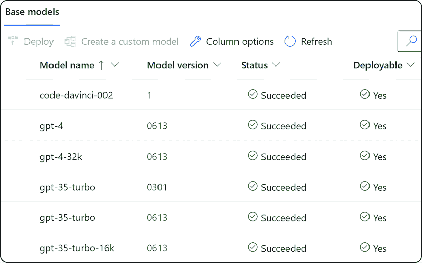
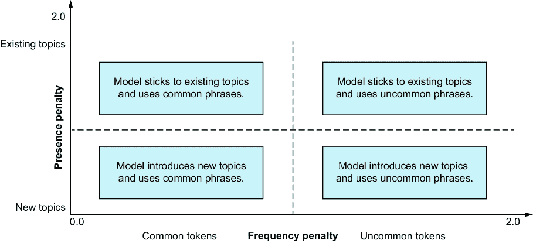

# 3 通过 API 工作：生成文本

### 本章涵盖了

+   根据特定应用对生成式 AI 模型及其分类

+   列出可用的模型、了解它们的功能以及选择合适的模型的过程

+   OpenAI 提供的完成 API 和聊天完成 API

+   完成 API 和聊天完成 API 的高级选项，帮助我们引导模型并因此控制生成

+   在对话中管理令牌以改善用户体验和成本效益的重要性

我们已经看到，大型语言模型（LLMs）提供了一套强大的机器学习工具，这些工具专门设计用于增强自然语言理解和生成。OpenAI 提供了两个显著的 API：完成 API 和聊天完成 API。这些 API 以其动态和有效的文本生成能力而独树一帜，其输出类似于人类。此外，它们还为开发者提供了独特的机遇，可以构建从聊天机器人到写作助手的各种应用。OpenAI 是第一个引入完成 API 和聊天完成 API 模式的公司，现在这一模式几乎包含了所有实现，尤其是在公司想要构建由生成式 AI 驱动的工具和产品时。

OpenAI 的完成 API 是一个高级工具，它生成与上下文相关且连贯的文本以完成用户提示。相反，聊天完成 API 被设计成模拟与机器学习模型的交互，保持对话在多次交流中的上下文，这使得它适合交互式应用。

第三章为企业的扩展奠定了基础。这些 API 可以显著加速智能应用的开发，从而缩短价值实现的时间。我们将主要使用 OpenAI 和 Azure OpenAI 作为示例，经常互换使用。代码模型保持一致，API 也大体相似。许多企业可能会因为 Azure OpenAI 提供的控制而倾向于它，而其他人可能会更偏好 OpenAI。重要的是要注意，我们在这里假设 Azure OpenAI 实例已经作为您 Azure 订阅的一部分部署，我们将在示例的上下文中引用它。

本章概述了完成 API 和聊天完成 API 的基本知识，包括它们之间的区别以及何时使用每个 API。我们将看到如何在应用中实现它们，以及我们如何引导模型生成及其随机性。我们还将看到如何管理令牌，这在部署到生产环境时是关键的操作考虑因素。这些都是构建关键任务应用所需的基本方面。但在开始之前，让我们先了解不同的模型类别及其优势。

## 3.1 模型类别

根据其特定的应用，生成式人工智能模型可以划分为各种类别，每个类别都包含不同类型的模型。我们首先通过了解生成式人工智能中模型的分类来开始我们的讨论。这种理解将帮助我们确定可用的模型范围，并选择在特定情况下最合适的一个。

不同类型和模型的可用性可能因所使用的 API 而异。例如，Azure OpenAI 和 OpenAI 提供了不同版本的 LLM。一些版本可能会被淘汰，一些可能会受限，而另一些可能仅限于特定组织。

不同的模型具有独特的特性和能力，这直接影响了它们的成本和计算需求。因此，为每个用例选择正确的模型至关重要。在传统的计算机科学中，更大的就是更好的这一观念常常应用于内存、存储、CPU 或带宽。然而，在大型语言模型（LLM）的情况下，这一原则并不总是适用。OpenAI 提供了一系列分类的模型，如表 3.1 所示。请注意，这些模型在 OpenAI 和 Azure OpenAI 中都是相同的，因为底层模型是相同的。

##### 表 3.1 OpenAI 模型类别

| 模型类别 | 描述 |
| --- | --- |
| GPT-4  | 最新且最强大的版本是一组多模态模型。GPT-4 在更大的数据集和更多参数上进行了训练，使其能力进一步增强。它可以执行之前模型无法完成的任务。GPT-4 系列中包含各种模型——GPT-4.0、GPT-4 Turbo 和最新的 GPT-4o（全能），这是在发布时该系列中最强大的多模态模型。  |
| GPT-3.5  | 一组在 GPT-3 的基础上进行改进的模型，能够理解和生成自然语言或代码。在不确定的情况下，这些应该是大多数企业的默认模型。  |
| DALL.E  | 一种在给定提示时能够生成图像的模型  |
| Whisper  | 一种用于语音转文本的模型，将音频转换为文本  |
| Embeddings  | 一组将文本转换为数值形式的模型  |
| GPT-3 (Legacy)  | 一组能够生成和理解自然语言的模型。这些是现在被认为是遗留的原始模型集合。在大多数情况下，我们希望从较新的模型开始，例如 3.5 或 4.0，这些模型源自 GPT-3。  |

每个模型类别都包含一些变体，这些变体通过某些特征（如令牌大小）进一步区分。如前一章所述，令牌大小决定了模型的内容窗口，这定义了它可以处理的输入和输出量。例如，原始 GPT-3 模型的最大令牌大小为 2K。GPT-3.5 Turbo，GPT-3.5 类别中的模型子集，有两个版本——一个令牌大小为 4K，另一个令牌大小为 16K。这是原始 GPT-3 模型令牌大小的两倍和四倍。表 3.2 概述了更受欢迎的模型及其功能。

##### 表 3.2 模型描述和功能

| 模型 | 功能 |
| --- | --- |
| Ada (旧版) | 简单的文本分类、解析和格式化。这个模型是 GPT-3 旧版的一部分。 |
| Babbage (旧版) | 语义搜索排名、中等复杂度的分类。这个模型是 GPT-3 旧版的一部分。 |
| Curie (旧版) | 回答问题、高度复杂的分类。这个模型是 GPT-3 旧版的一部分。 |
| Davinci (旧版) | 摘要、生成创意内容。这个模型是 GPT-3 旧版的一部分。 |
| Cushman-Codex (旧版) | GPT-3 系列的后代，在自然语言和数十亿行代码上进行训练。它在 Python 中最强大，并且精通十多种其他编程语言。 |
| Davinci-Codex | Cushman-codex 的更强大模型 |
| GPT3.5-Turbo | 专为聊天用例优化的最强大的 GPT-3.5 模型，比 GPT-3 Davinci 便宜 90% 且更有效。 |
| GPT-4, GPT-4 Turbo | 比任何 GPT-3.5 模型都更强大。它能够执行更复杂的任务，并针对聊天模型进行了优化。 |
| GPT-4o | 最新 GPT-4o 模型比 GPT-4 和 GPT-4 Turbo 更强大，但速度也快一倍，且便宜 50%。 |
| text-embedding-ada-002, text-embedding-ada-003 | 这个新的嵌入模型取代了五个单独的模型，用于文本搜索、相似度和代码搜索，在大多数任务中表现优于它们；此外，它还便宜了 99.8%。 |

注意，提到的旧版模型仍然可用，并且按预期工作。然而，新模型更好，拥有更多的市场份额和更长的支持。大多数人应该从 GPT-3.5 Turbo 作为默认模型开始，并根据具体情况使用 GPT-4。有时，甚至是一个较小、较旧的模型，如 GPT-3 Curie，也是好的。这提供了模型能力、成本和整体性能之间的正确平衡。

在生成式 AI 的早期，所有模型都只对某些人开放。这些将因公司、地区以及 Azure 的情况（例如，您的订阅类型）等因素而有所不同。我们必须列出可用的模型及其功能。然而，在列出模型之前，让我们看看要使一切正常工作所需的依赖项。

### 3.1.1 依赖项

在本节中，我们概述了运行时依赖项和所需的高级配置。为了使一切正常工作，我们至少需要以下项目：

+   *开发 IDE*—我们使用 Visual Studio Code 作为我们的示例，但您可以使用您感到舒适的任何东西。

+   *Python*—本书中使用的是 v3.11.3，但只要它是 v3.7.1 或更高版本，您可以使用任何版本。如果您需要安装 Python，安装说明可在[`www.python.org/`](https://www.python.org/)找到。

+   *OpenAI Python 库**—*我们大多数代码和演示使用 Python 库。OpenAI Python 库可以通过 conda 简单安装，使用`conda install -c conda-forge openai`。如果您使用 pip，请使用`pip install --upgrade openai`。如果您更喜欢使用特定语言的软件开发工具包（SDKs）而不是 Python 包，也有相应的 SDKs。

+   *Azure 订阅或 OpenAI API 访问**—*我们交替使用 OpenAI 的端点和 Azure OpenAI (AOAI)端点；在大多数情况下，任选其一即可。鉴于本书对企业的高度重视，我们倾向于使用 Azure OpenAI 服务：

    +   要使用带有 Azure 端点的库，我们需要`api_key`。

    +   我们还需要设置`api_type`、`api_base`和`api_version`属性。`api_type`必须设置为`azure`，`api_base`指向我们部署的端点，而 API 的相应版本通过`api_version`指定。

    +   Azure OpenAI 使用`'engine'`作为参数来指定模型的名称。当在您的 Azure 订阅中部署模型时，此名称需要设置为您的选择名称。例如，图 3.1 是某个订阅中部署的截图。然而，OpenAI 使用参数`model`来指定模型的名称。这些模型名称是标准的，因为它们是发布的。您可以在[`mng.bz/yoYd`](https://mng.bz/yoYd)和[`platform.openai.com/docs/`](https://platform.openai.com/docs/)找到更多关于 Azure OpenAI 和 OpenAI 的详细信息。

注意：本书配套的 GitHub 代码库([`bit.ly/GenAIBook`](https://bit.ly/GenAIBook))包含了代码的详细信息，包括依赖项和说明。

将端点和密钥硬编码不是一种推荐的做法。有多种方法可以完成这项任务，其中一种包括使用环境变量。我们将在以下步骤中演示这种方法。其他替代方案可以是从密钥库或环境文件中获取它们。为了简单起见，我们将在这份指南中坚持使用环境变量。然而，我们鼓励您遵循您企业的最佳实践和建议。设置环境变量可以通过以下命令实现。

对于 Windows，这些是

```py
setx AOAI_KEY "your-openai-key"
setx AOAI_ENDPOINT "your-openai-endpoint"
```

注意：您可能需要重新启动终端以读取新变量。

在 Linux/Mac 上，我们有

```py
export AOAI_ENDPOINT=your-openai-endpoint
export AOAI_KEY=your-openai- key
```

Bash 使用

```py
echo export AOAI_KEY="YOUR_KEY" >> /etc/environment && source /etc/environment
echo export AOAI_ENDPOINT="YOUR_ENDPOINT" >> /etc/environment && 
      ↪source /etc/environment
```

注意：在本书中，我们将使用 conda，一个开源的包管理器，来管理我们的特定运行时版本和依赖项。技术上，使用像 conda 这样的包管理器不是强制性的，但它对于隔离和解决问题非常有帮助，并且强烈推荐。在此上下文中，我们不会深入介绍如何安装 conda；有关如何安装的详细、分步说明，请参阅官方文档[`docs.conda.io/`](https://docs.conda.io/)。

首先，让我们创建一个新的 conda 环境并安装所需的 OpenAI Python 库：

```py
$ conda create -n openai python=3.11.3
(base) $ conda activate openai
(openai) $ conda install -c conda-forge openai
```

现在我们已经安装了依赖项，让我们连接到 Azure OpenAI 端点并获取可用模型的详细信息。

### 3.1.2 列出模型

正如我们之前概述的，每个组织可能都有不同的模型可供使用。我们将首先了解我们有哪些模型可以使用；我们将使用 API 来帮助我们设置基本环境并使其运行。然后，我将向您展示如何使用 Azure OpenAI Python SDK 来完成这项工作，并概述使用 OpenAI API 时的差异。

如下所示，我们连接到 Azure OpenAI 端点，获取所有可用模型的列表，遍历这些模型，并将每个模型的详细信息打印到控制台。

##### 列表 3.1 列出可用的 Azure OpenAI 模型

```py
import os
import json
from openai import AzureOpenAI                  #1

client = AzureOpenAI(
    azure_endpoint=os.getenv("AOAI_ENDPOINT"),  #2
    api_version="2023-05-15",                   #3
    api_key=os.getenv("AOAI_KEY")   #4
    )

# Call the models API to retrieve a list of available models
models = client.models.list()

# save to file
with open('azure-oai-models.json', 'w') as file:
    models_dict = [model.__dict__ for model in models]
    json.dump(models_dict, file)

# Print out the names of all the available models, and their capabilities
for model in models:
    print("ID:", model.id)
    print("Current status:", model.lifecycle_status)
    print("Model capabilities:", model.capabilities)
    print("-------------------")
```

#1 必须用于 Azure OpenAI 端点

#2 这是指向通过 Azure 门户发布的端点的环境变量。

#3 从多个选项中选择我们想要使用的 API 版本。

#4 这是包含 API 密钥的环境变量。

运行此代码将向我们展示可用模型的列表。以下列表显示了可用模型的示例；您的确切列表可能会有所不同。

##### 列表 3.2 列出 Azure OpenAI 模型的输出

```py
{
    "id": "gpt-4-vision-preview",
    "created": null,
    "object": "model",
    "owned_by": null
},
{
    "id": "dall-e-3",
    "created": null,
    "object": "model",
    "owned_by": null
  },
  {
    "id": "gpt-35-turbo",
    "created": null,
    "object": "model",
    "owned_by": null
},
…
```

每个模型都有其独特的功能，这表明了它针对的使用场景——特别是用于聊天补全、补全（即常规文本补全）、嵌入和微调。例如，在需要大量对话交流的基于聊天的交互中，聊天补全模型将是理想的选择。相反，补全模型将最适合文本生成。我们可以在图 3.1 中查看 Azure AI Studio 中的 OpenAI 基础模型。



##### 图 3.1 列出的基础模型

此功能是 Azure AI Studio 的一部分，您可以在登录 Azure 订阅并访问您的 Azure OpenAI 部署时访问它。您也可以直接通过门户[`oai.azure.com/portal`](https://oai.azure.com/portal)访问它。现在我们已经知道了要使用哪个模型，让我们生成一些文本。我们将使用补全 API 和一个支持补全的模型。

## 3.2 补全 API

完成 API 是一个复杂的工具，用于生成文本以完成用户提供的提示。它是 OpenAI API 的核心，提供了一个简单但强大且灵活的 API。它旨在生成与给定提示一致且上下文合适的文本。

许多非聊天型结构的生成示例都使用完成 API。我们必须使用完成 API 来生成非聊天风格的文本。完成 API 的一些好处包括

+   *上下文理解*—完成 API 可以理解提示的上下文并生成相关文本。

+   *多功能性*—它可以用于各种应用，从创建内容到回答问题，使其成为多种应用的宝贵工具。

+   *多语言理解*—完成 API 能够理解和生成多种语言的内容，使其成为全球资源。

+   *易于实现*—完成 API 简单直接，这使得它对各种技能水平的开发者都易于访问。

API 的结构非常简单，如下面的代码片段所示。输入（提示）和输出（完成）都是文本格式。API 响应是一个 JSON 对象，可以使用 text 键从中提取生成的文本。这个响应被称为文本完成。完成试图遵循提示和上下文中提供的内容，并且是潜在输出之一：

```py
from openai import OpenAI
client = OpenAI()

response = client.completions.create(
  model="gpt-3.5-turbo-instruct",
  prompt="Write a few bullets on why pets are so awesome ",
  max_tokens=100,
  temperature=0.8 
)
print(response.choices[0].text.strip())
```

我们从一个指令开始，即指定我们想要生成的提示。在我们的例子中，指令要求模型生成几个要点，概述为什么宠物很棒。完成 API 有许多参数，但最重要的参数在表 3.3 中详细说明。我们在本章和书中讨论了许多其他参数（例如，提示、标记和温度）。然而，停止序列是一个新概念。我们可以使用这些序列使模型在某个特定点停止生成标记，例如在句子的末尾或列表的末尾。

##### 表 3.3 完成 API

| 参数 | 类型 | 默认值 | 描述 |
| --- | --- | --- | --- |
| `prompt`  | 字符串或数组  | `<\&#124;endoftext\&#124;>`  | 一个字符串或字符串数组是用于生成这些完成的提示。  |
| `max_tokens`  | 整数  | 16  | 这是在完成中生成的最大标记数，包括提示。`max_tokens`不能超过模型的上下文长度。  |
| `temperature`  | 数字（浮点数）  | 1  | 这个值介于 0 和 2 之间。更高的值意味着模型承担更多风险并更具创造性。  |
| `stop`  | 字符串或数组  | Null  | 这可以是多达四个序列，API 会在这些序列处停止生成更多标记。返回的文本将不包含停止序列。  |
| `n`  | 整数  | 1 (可选)  | 这定义了为每个提示生成多少个完成。这会生成许多完成，并可能快速消耗令牌限制；我们应该为 `max_tokens` 设置一个合理的值并停止管理成本。  |
| `stream`  | 布尔值  | False (可选)  | 这是一个标志，用于控制是否在生成标记时流回部分进度。如果设置，流将通过数据 `[DONE]` 消息终止。  |
| `best_of`  | 整数  | 1 (可选)  | 这将在服务器端生成 `best_of` 完成并返回最佳完成。此参数不能与 gpt-35-turbo 一起使用。  |
| `top_p`  | 数值 (浮点数)  | 1 (可选)  | 这通过称为核采样（nucleus sampling）的技术控制随机性，是 `temperature` 设置的替代方案，其值介于 0 和 1 之间。  |
| `logit_bias`  | 映射  | Null (可选)  | 这定义了指定标记在完成中出现的可能性。它使用标记到偏差值的映射（从禁止的 -100 到独家选择的 100）。  |
| `user`  | 字符串  | Null (可选)  | 此参数是一个代表最终用户的唯一 ID；它可以帮助调试、监控和检测滥用。  |
| `logprobs`  | 整数  | Null (可选)  | 这是一个可选的日志概率数组，表示考虑用于完成的替代标记及其可能性。此参数不能与 gpt-35-turbo 一起使用。  |
| `suffix`  | 字符串  | Null (可选)  | 此参数可以是一个最多 40 个字符的字符串，作为后缀添加到生成的文本中。  |
| `echo`  | 布尔值  | False (可选)  | 这确定是否将提示包含在完成中。这对于需要捕获提示和用于调试目的的情况很有用。它不能与 gpt-35-turbo 一起使用。  |
| `presence_ penalty`  | 数值 (浮点数)  | 0 (可选)  | 此参数引导模型的趋势并帮助概述其行为，以便将新主题或想法引入生成的文本。其范围在 0.0 到 1.0 之间。  |
| `frequency_ penalty`  | 数值 (浮点数)  | 0 (可选)  | 这是另一个帮助引导模型并改进生成结果的参数。它控制生成文本中常见或不常见单词的水平，可以设置为 0.0 到 1.0 之间的值。  |
| `function_ call`  |  |  | 这控制模型在需要函数调用时的响应方式。它仅适用于 OpenAI 模型的 0613 或更高版本。  |
| `functions`  |  |  | 这是一系列模型可能使用的函数。  |

注意，该表仅列出最常用的参数。它帮助我们理解一些流程和概念。一些参数，如函数，有更高级的使用，这些将在后续章节中关于提示工程中介绍。

我们继续以宠物为主题，并使用模型帮助我们为宠物沙龙业务建议名称。我们要求提供三个名称，并且说明也概述了一些重要的特性。这些说明的特性帮助我们引导模型向一些期望的属性发展。请参阅 API 文档以获取参数的完整列表。让我们调用完成 API 并了解它。

##### 列表 3.3 调用完成 API

```py
import os
from openai import AzureOpenAI

client = AzureOpenAI(
    azure_endpoint=os.getenv("AOAI_ENDPOINT"),
    api_version="2024-05-01-preview",
    api_key=os.getenv("AOAI_KEY"))

prompt_startphrase = "Suggest three names for a new pet salon business.
↪The generated name ideas should evoke positive emotions and the 
↪following key features: Professional, friendly, Personalized Service."

response = client.completions.create(        #1
    model="gpt35",    #2
    prompt=prompt_startphrase,                #3

    temperature=0.7,                          #4
    max_tokens=100,                         
    suffix="\nThats all folks!",            
    stop=None)

responsetext = response.choices[0].text      #5

print("Prompt:" + prompt_startphrase + "\nResponse:" + responsetext)
```

#1 用于生成文本的完成 API 调用

#2 指定要使用的模型；请注意，此名称将根据您在部署中设置的值而更改

#3 提示

#4 模型配置

#5 从响应中提取生成的文本

恭喜！我们使用了 API 进行第一次文本生成。由于 AI，特别是生成式 AI 的非确定性，运行此操作时您将看到的输出与

```py
$ python .\petsalon.py
```

输出如下。

****为新的宠物沙龙业务建议三个名称。生成的名称想法应唤起积极的情绪，并具有以下关键特性：专业、友好、个性化服务。

1.  ****1. Pawsitively 专业宠物沙龙

1.  2. 毛皮与羽毛友好宠物沙龙

1.  3. Happy Tails 定制宠物宠爱

注意：LLM 和大多数其他生成式 AI 模型是非确定性的，这意味着相同的输入可能会产生不同的输出。将温度设置更改为零可以使输出更确定，但可能仍会保留一些可变性。

### 3.2.1 扩展完成

让我们看看 API 的完整响应是什么样的，并了解其结构。以下列表显示了 API 的完整响应。`choices`字段是最有趣的，因为它包含完成文本。选择属性是一个数组，其中每个项目都有一个`index`，表示生成结束的原因（`finish_reason`），以及生成的文本（通过`text`属性）。

##### 列表 3.4 完成 API 的 API 响应

```py
{
  "choices": [                      #1
    {
      "finish_reason": "stop",
      "index": 0,
      "logprobs": null,
      "text": "\n\n1\. Pawfect Professionals \n 
              ↪2\. Purrsonalized Pet Pampering\n 
              ↪3\. Friendly Fur Services",
              "content_filter_results"={...}
    }
  ],
  "created": 1689007663,                       #2
  "id": "cmpl-7aoL1MaUEf2j3ZLfSvsUOR7EFyjqC",    #3
  "model": "gpt-35-turbo",                 #4
  "object": "text_completion",
  "usage": {                #5
    "completion_tokens": 26,
    "prompt_tokens": 32,
    "total_tokens": 58
  }
}
```

#1 完成数据数组

#2 响应创建日期时间戳

#3 响应的唯一 ID

#4 生成响应所使用的模型 ID

#5 此请求中使用的标记计数

表 3.4 显示了剩余的属性。使用属性概述了使用的标记（`total_tokens`），包括提示和响应标记。因为我们按标记付费，所以对提示进行结构化是很重要的——首先，只返回所需的内容，最小化标记使用，其次，最初限制生成的标记数量。

##### 表 3.4 完成响应属性

| 属性 | 描述 |
| --- | --- |
| `choices`  | 一个可以包含一个或多个完成数据的数组 |
| `created`  | 响应创建时的 UNIX 日期时间戳 |
| `id`  | 当我们需要跟踪响应时，响应的唯一标识符很有用 |
| `model`  | 表示用于生成的模型 |
| `object`  | 描述响应的数据类型（例如，在本例中，它是`text_completion`，概述了完成 API）  |
| `usage`  | 计算此请求使用的标记数量  |

一个名为`logprobs`的属性指定为响应中的每个标记生成多少个对数概率。对数概率对于生成更多样化和有趣的响应很有用。它返回响应中每个标记的前*n*个标记的对数概率。对数概率以数组的形式返回，其中每个子数组对应于响应中的一个标记，并包含该标记的前*n*个标记的对数概率。

### 3.2.2 Azure 内容安全过滤器

有时，API 返回一个`null`响应，如列表 3.5 所示。当这种情况发生时，我们应该检查`finish_reason`字段的值。如果其值设置为`content_filter`，则与模型一起工作的内容过滤系统已被触发。`finish_reason`字段指示 API 为何返回了它所返回的输出，并且每个响应都将包括此字段。这个主题将在本章后面更详细地介绍。

过滤系统使用特定类别来识别和针对输入提示和生成的完成项中的潜在有害内容采取行动。使用这些 API 的应用程序必须处理这种情况，并在适当的退避期间后重试。内容安全过滤器和道德 AI 将在第十三章中更详细地介绍。

##### 列表 3.5 显示`null`响应的输出

```py
$ python .\petsalon.py 
Prompt:Suggest three names for a new pet salon business. The generated 
       ↪name ideas should evoke positive emotions and the following key 
       ↪features: Professional, friendly, Personalized Service.
Response:                                    #1
{
  "choices": [
    {
      "finish_reason": "content_filter",      #2
      "index": 0,
      "logprobs": null,
      "text": "",
      "content_filter_results"={...}
    }
  ],
  "created": 1689006467,
  "id": "cmpl-7ao1jIACW1v8mYH879EE1trbT9Ua6",
  "model": "gpt35",
  "object": "text_completion",
  "usage": {
    "completion_tokens": 31,
    "prompt_tokens": 32,
    "total_tokens": 63
  }
}
```

#1 无响应

#2 内容过滤器是响应结束的原因。

### 3.2.3 多重完成

我们可能有多个完成项的几个原因。有时，我们需要为相同的提示生成多个消息选择。在其他时候，API 由于容量原因被限制，我们可能希望从相同的 API 调用中获得更多，而不是受到速率限制。完成 API 可以返回多个响应；这是通过将`n`参数设置为大于默认值 1 来完成的。例如，我们可以将此参数添加到完成调用中：

```py
response = client.completions.create(
    model="gpt-35-turbo",
    prompt=prompt_startphrase,
    temperature=0.7,
    max_tokens=100,
    n=3,
    stop=None)

# loop through the response choices
for choice in response.choices:
    print(choice.text)
```

当我们运行此更新后的代码时，我们得到列表 3.6 中所示的响应。属性选择是一个数组，我们有三项，索引从零开始。每一项都为我们提供了生成的文本。根据使用情况，在挑选多个完成项时这很有帮助。

##### 列表 3.6 显示多个响应的输出

```py
1\. Pet Pampering Palace
2\. Pet Grooming Haven
3\. Perfect Pet Parlor

1\. Pawsitive Pet Spa
2\. Fur-Ever Friends Pet Salon
3\. Purrfection Pet Care

1\. Pampered Paws Professional Pet Care
2\. Personalized Pet Pampering
3\. Friendly Furrific Pet Care
```

另一个类似但更强大的参数是`best_of`参数。与`n`参数类似，它生成多个完成项，允许选择最佳项。`best_of`是每个标记具有最高对数概率的完成项。使用此选项时，我们不能流式传输结果。然而，它可以与`n`参数结合使用，其中`best_of`需要大于`n`。

如以下列表所示，如果我们将`n`设置为 5，我们会得到预期的五个完成项；为了简洁，我们这里不展示所有五个完成项，但请注意，这个调用使用了 184 个标记。

##### 列表 3.7 显示多个响应的输出

```py
{
  "choices": [
    {
      …
  ],
  "created": 1689097645,
  "id": "cmpl-7bBkLk60mA8R9crAKXqTmTwzx2IEI",
  "model": "gpt-35-turbo",
  "object": "text_completion",
  "usage": {
    "completion_tokens": 152,
    "prompt_tokens": 32,
    "total_tokens": 184
  }
}
```

如果我们使用`best_of`参数运行类似的调用，不要指定`n`参数：

```py
response = client.completions.create(
    model="gpt-35-turbo",
    prompt=prompt_startphrase,
    temperature=0.7,
    max_tokens=100,
    best_of=5,
    stop=None)
```

当我们运行此代码时，我们只得到一个完成项，如列表 3.8 所示；然而，我们使用的标记数量与之前相似（171 比 184）。这是因为服务在服务器端生成五个完成项，并返回最佳的一个。API 使用每个标记的对数概率来选择最佳选项。对数概率越高，模型对其预测的信心就越大。

##### 列表 3.8 使用`best_of`五个完成项的输出生成

```py
{
  "choices": [
    {
      "finish_reason": "stop",
      "index": 0,
      "logprobs": null,

      "text": "\n\n1\. Pawsitively Professional Pet Salon\n 
         ↪2\. Friendly Furr Friends Pet Salon\n 
         ↪3\. Personalized Pampered Pets Salon",
               "content_filter_results"={...}
    }
  ],
  "created": 1689098048,
  "id": "cmpl-7bBqqpfuoV5nrgHrahuWGVAiM50Aj",
  "model": "gpt35",
  "object": "text_completion",
  "usage": {
    "completion_tokens": 139,
    "prompt_tokens": 32,
    "total_tokens": 171
  }
}
```

影响许多响应的一个参数是温度设置。让我们看看这如何改变输出。

### 3.2.4 控制随机性

如前一章所述，`temperature`设置影响生成输出的随机性。较低的温度会产生更重复和确定性的响应，而较高的温度会产生更多创新的响应。从根本上说，没有正确的设置——一切都取决于用例。

对于企业来说，更有创意的输出是在对多样化输出感兴趣并创建用于内容生成、故事、诗歌、歌词、笑话等用例的文本时。这些通常需要创造力。然而，企业在需要更可靠和精确的答案的用例，如发票生成、提案、代码生成等时，需要更多。这些设置适用于每个 API 调用，因此在同一工作流程中结合不同的温度级别是可能的。

如前例所示，我们建议创意响应的温度设置为 0.8。相反，建议将设置调整为 0.2 以获得更可预测的响应。通过一个例子，让我们看看这些设置如何改变输出，并观察多次调用之间的变化。

当温度设置为 0.8 时，我们从三个连续调用中收到了以下响应。输出如预期的那样改变，提供了本章中看到的建议。重要的是要注意，我们不需要进行三个单独的 API 调用。我们可以在单个 API 调用中将`n`参数设置为 3 以生成多个响应。以下是我们的 API 调用示例：

```py
response = client.completions.create(
    model="gpt-35-turbo",
    prompt=prompt_startphrase,
    temperature=0.8,
    max_tokens=100,
    n=3,
    stop=None)
```

以下列表展示了三种响应的创意生成。

##### 列表 3.9 温度设置为 0.8 时的完成输出

```py
{
  "choices": [
    {
      "finish_reason": "content_filter",
      "index": 0,            #1
      "logprobs": null,
      "text": "",
      "content_filter_results"={...}
    },
    {
      "finish_reason": "stop",
      "index": 1,            #2
      "logprobs": null,
      "text": "\n\n1\. Pawsitively Professional Pet Styling\n 
                 ↪2\. Fur-Ever Friendly Pet Groomers \n 
                 ↪3\. Tailored TLC Pet Care",
      "content_filter_results"={...}
    },
    {
      "finish_reason": "stop",
      "index": 2,            #3
      "logprobs": null,
      "text": "\n\n1\. Pawsitively Professional Pet Salon \n 
                 ↪2\. Friendly Fur-ternity Pet Care \n 
                 ↪3\. Personalized Pup Pampering Place",
      "content_filter_results"={...}
    }
  ],
  "created": 1689123394,
  "id": "cmpl-7bIRe6Ponn8y1198flJFfagq64r2E",
  "model": "gpt35",
  "object": "text_completion",
  "usage": {
    "completion_tokens": 96,
    "prompt_tokens": 32,
    "total_tokens": 128
  }
}
```

#1 第一个响应：被内容过滤器阻止

#2 第三个响应

#3 具有非常不同生成文本的最终响应

让我们更改设置以使其更加确定，并再次运行。请注意，API 调用中唯一的更改是`temperature=0.2`。输出是可预测和确定的，三个回答之间生成的文本非常相似。

##### 列表 3.10 温度为 0.2 时的完成输出

```py
{
  "choices": [
    {
      "finish_reason": "stop",
      "index": 0,                #1
      "logprobs": null,
      "text": "\n\n1\. Pawsitively Professional Pet Salon\n 
                 ↪2\. Friendly Furr Salon\n 
                 ↪3\. Personalized Pet Pampering",
      "content_filter_results"={...}
    },
    {
      "finish_reason": "stop",
      "index": 1,                #2
      "logprobs": null,
      "text": "\n\n1\. Pawsitively Professional Pet Salon\n 
                 ↪2\. Friendly Fur-Ever Pet Salon\n 
                 ↪3\. Personalized Pet Pampering Salon",
      "content_filter_results"={...}
    },
    {
      "finish_reason": "stop",
      "index": 2,               #3
      "logprobs": null,
      "text": "\n\n1\. Pampered Paws Pet Salon\n 
                 ↪2\. Friendly Fur Salon\n
                 ↪3\. Professional Pet Pampering"
    }
  ],
  ...
}
```

#1 三个回答中的一个

#2 三个回答中的两个；生成的文本非常相似

#3 最终的回答，生成的文本非常相似

温度值可以高达 2，但并不建议设置得那么高，因为模型开始产生更多幻觉并创建无意义的文本。如果我们想要更多的创造力，通常希望它设置为 0.8，最多为 1.2。让我们看看当温度值变为 1.8 时的例子。在这个例子中，我们甚至没有完成第三次生成，因为我们达到了标记限制并停止了生成。

##### 列表 3.11 温度为 1.8 时的完成输出

```py
{
  "choices": [
    {
      "finish_reason": "stop",
      "index": 0,                #1
      "logprobs": null,
      "text": "\n\n1\. ComfortGroom Pet Furnishing \n2\. Pampered TreaBankant Carers \n3\. Toptech Sunny Haven Promotion.",
      "content_filter_results"={...}
    },
    {
      "finish_reason": "stop",
      "index": 1,               #2
      "logprobs": null,
      "text": "\n\n1: Naturalistov ClearlywowGroomingz 
                    ↪Pet Luxusia \n2: VipalMinderers Pet 
                    ↪Starencatines grooming \n3: Brisasia 
                    ↪Crownsnus Take Care Buddsroshesipalising",
      "content_filter_results"={...}
    },
    {
      "finish_reason": "length",
      "index": 2,
      "logprobs": null,
      "text": "\n\n1\. TrustowStar Pet Salon\n 
              ↪2\. Hartipad TailTagz Grooming & Styles\n 
              ↪3\. LittleLoft Millonista Cosmania DipSavez 
                 ↪Hubopolis ShineBright Princessly 
                 ↪Prosnoiffarianistics Kensoph Cowlosophy 
                 ↪Expressionala Navixfordti Mundulante Effority 
                 ↪DivineSponn BordloveDV EnityzBFA Prestageinato 
                 ↪SuperGold Cloutoilyna Critinarillies 
                 ↪Prochromomumphance Toud",
                 ↪"content_filter_results"={...}
    }
  ],
  ...
}
```

#1 三个回答中的一个，名称不是很清晰

#2 第二和第三个回答，名称不清晰

### 3.2.5 使用 top_p 控制随机性

用于管理随机性的`temperature`参数的替代方法是`top_p`参数。它对生成的影响与温度参数相同，但它使用了一种称为*核心采样*的不同技术。本质上，核心采样只允许概率等于或低于`top_p`值的标记被视为生成的一部分。

核心采样通过从具有最高累积概率的一小部分最可能出现的单词中挑选单词来创建文本。`top_p`值决定了这个小组的大小，基于单词出现在其中的总概率。小组的大小可以根据下一个单词的概率而变化。核心采样可以帮助避免重复，并生成比其他方法更多样化和清晰的文本。

例如，如果我们把`top_p`值设置为 0.9，那么只有组成 90%概率分布的标记会被采样用于文本生成。这使我们能够避免最后 10%，这部分通常非常随机且多样化，最终导致无意义的幻觉。

`top_p`的值较低时，模型在生成时选择较少的标记，因此更加一致且创造力较低。相反，较高的值使生成更加有创造力和多样化，因为它有更大的标记集可供操作。较大的值也使其更容易出现错误和随机性。`top_p`的确切值取决于用例；在大多数情况下，`top_p`的理想值介于 0.7 和 0.95 之间。我们应该更改温度属性或`top_p`，但不能同时更改两者。表 3.5 概述了两者之间的关系。

##### 表 3.5 温度和`top_p`之间的关系

| 温度 | top_p | 影响 |
| --- | --- | --- |
| 低  | 低  | 生成符合常见语言模式的可预测文本 |
| 低  | 高  | 生成的文本可预测，但偶尔会出现不太常见的单词或短语 |
| 高  | 低  | 生成的文本通常连贯，但具有创造性和意外的词汇使用 |
| 高  | 高  | 生成的文本高度多样且不可预测，具有各种词汇选择和想法；具有非常创造性和多样化的输出，但可能包含许多错误 |

让我们看看一些针对特定场景的高级 API 选项。

## 3.3 高级完成 API 选项

现在我们已经检查了完成 API 的基本结构并了解了它们的工作原理，我们需要考虑完成 API 的更高级方面。其中许多可能看起来并不复杂，但它们给系统架构增加了许多更多责任，从而复杂了整体实现。

### 3.3.1 流式完成

完成 API 允许流式响应，提供在信息准备好后立即访问信息的能力，而不是等待完整响应。对于企业来说，在某些情况下，实时内容生成和较低延迟是关键，流式传输在这种情况下可能很重要。此功能可以通过及时处理传入的响应来增强用户体验。

要从 API 的角度启用流式传输，将`stream`参数修改为`true`。默认情况下，此可选参数设置为`false`。

流式传输使用服务器发送事件（SSE），这需要在客户端实现。SSE 是一种标准协议，允许服务器在建立初始连接后继续向客户端传输数据。它是从服务器到客户端的长期单向连接。SSE 提供诸如低延迟、减少带宽消耗和简单的配置设置等优势。

列表 3.12 演示了如何调整我们的示例以利用流式传输。尽管 API 修改很简单，但描述和请求的多个生成（使用`n`属性）已调整。这使得我们可以人为地生成更多文本，从而更容易观察流式生成。

##### 列表 3.12 流式完成

```py
import os
import sys
from openai import AzureOpenAI

client = AzureOpenAI(
    azure_endpoint=os.getenv("AOAI_ENDPOINT"),
    api_version="2024-05-01-preview",
    api_key=os.getenv("AOAI_KEY"))

prompt_startphrase = "Suggest three names and a tagline  
↪which is at least 3 sentences for a new pet salon business. 
↪The generated name ideas should evoke positive emotions and the 
↪followingkey features: Professional, friendly, Personalized Service."   #1

for response in client.completions.create(         #2
    model="gpt-35-turbo",
    prompt=prompt_startphrase,
    temperature=0.8,
    max_tokens=500,
    stream=True,                                   #3
    stop=None):
    for choice in response.choices:       #4
        sys.stdout.write(str(choice.text)+"\n")
        sys.stdout.flush()
```

#1 稍微调整了提示以添加描述

#2 我们需要在客户端处理流式响应。

#3 启用流式传输

#4 我们需要遍历数组并处理多个生成。

在管理流式调用时，我们必须特别注意`finish_reason`属性。随着消息的流式传输，每个消息都表现为标准完成，其中的文本代表新生成的标记。在这些情况下，`finish_reason`保持为 null。然而，最后一条消息不同；它的`finish_reason`可以是`stop`或`length`，具体取决于触发它的原因。

##### 列表 3.13 流式完成原因

```py
...
{
  "finish_reason": null,
  "index": 0,
  "logprobs": null,
  "text": " Pet"
}
{
  "finish_reason": null,
  "index": 0,
  "logprobs": null,
  "text": " Pam"
}
{
  "finish_reason": null,
  "index": 0,
  "logprobs": null,
  "text": "pering"
}
{
  "finish_reason": "stop",
  "index": 0,
  "logprobs": null,
  "text": ""
}
```

### 3.3.2 影响标记概率：logit_bias

`logit_bias`参数是我们影响输出完成的一种方式。在 API 中，此参数允许我们操纵模型在响应中生成的某些标记（可以是单词或短语）的概率。它被称为`logit_bias`，因为它直接影响了模型在生成过程中为每个潜在标记计算的 log odds 或 logits。偏差值被添加到这些 log-odds 中，在将它们转换为概率之前，改变模型可以从中选择的标记的最终分布。

此功能的重要性在于其引导模型输出的能力。比如说我们正在创建一个聊天机器人，并希望它避免某些单词或短语。我们可以使用`logit_bias`降低这些标记被模型选择的概率。相反，如果我们希望模型优先考虑某些单词或短语，我们可以使用`logit_bias`增加它们的可能性。此参数的范围是从-100 到 100，它作用于单词的标记。将标记设置为-100 实际上禁止它在生成中出现，而将其设置为 100 则使其成为独家。

要使用`logit_bias`，我们提供了一个字典，其中键是标记，值是需要应用于这些标记的偏差。要获取标记，我们使用`tiktoken`库。一旦你有了适当的标记，你可以分配一个正偏差使其更有可能出现，或者分配一个负偏差使其不太可能出现，如图 3.2 所示。这些块显示了不同标记在不同禁止或独家生成概率下的概率程度。对标记值的较小更改会增加或减少这些标记在生成输出中的概率。


##### 图 3.2 `logit_bias`参数

让我们用一个例子来看看我们如何使这起作用。对于我们的宠物沙龙名称，我们不希望使用“purr”、“purrs”或“meow”这些词。我们首先想做的事情是为这些词创建标记。我们还希望添加带有前导空格的单词，并将它们作为空格大写。大写字母都是不同的标记。所以“Meow”和“Meow”（带有空格）以及“meow”（再次带有空格）对我们来说可能听起来相同，但就标记而言，这些词都是不同的。输出显示了相应单词的标记：

```py
'Purr Purrs Meow Purr purr purrs meow:[30026, 81, 9330, 
↪3808, 42114, 9330, 81, 1308, 81, 1308, 3808, 502, 322]'
```

现在我们有了标记，我们可以将它们添加到完成调用中。请注意，我们为每个标记分配了一个-100 的偏差，将模型引导远离这些词。

##### 列表 3.14 `logit_bias`实现

```py
import os
from openai import AzureOpenAI

client = AzureOpenAI(
    azure_endpoint=os.getenv("AOAI_ENDPOINT"),
    api_version="2024-05-01-preview",
    api_key=os.getenv("AOAI_KEY"))

GPT_MODEL = "gpt-35-turbo"

prompt_startphrase = "Suggest three names for a new pet salon 
↪business. The generated name ideas should evoke positive 
↪emotions and the following key features: Professional, 
↪friendly, Personalized Service."

response = client.completions(  
  model=GPT_MODEL,  
  prompt=prompt_startphrase,  
  temperature=0.8,  
  max_tokens=100,  
  logit_bias={
      30026:-100,               #1
      81:-100,                 #1
      9330:-100,               #1
      808:-100,                #1
      42114:-100,              #1
      1308:-100,               #1 
      3808:-100,               #1 
      502:-100,                #1 
      322:-100                 #1
  }  
)  

responsetext =response.choices[0].text

print("Prompt:" + prompt_startphrase + "\nResponse:" + responsetext)
```

#1 包含标记及其对应偏差值以引导模型在这些特定标记上的字典

在运行此代码时，我们没有想要避免的任何单词。

##### 列表 3.15 `logit_bias`生成输出

```py
{
  "choices": [
    {
      "finish_reason": "stop",
      "index": 0,
      "logprobs": null,
      "text": "\n\n1\. Paw Prints Pet Pampering\n2\. Furry Friends Fussing\n3\. Posh Pet Pooches"
    }
  ],
...
}
```

我们可以采取相反的做法，并对标记进行正偏差。比如说，我们想要过分强调并引导模型向“Furry”这个词靠拢。我们可以使用之前看到的 `tiktoken` 库，并找到“Furry”的标记是 `[37, 16682]`。我们可以用这个更新之前的 API 调用，在这种情况下，一个正偏差值为 5。

##### 列表 3.16 `logit_bias`：正实现

```py
GPT_MODEL = "gpt-35-turbo"

response = client.completions.create(
    model=GPT_MODEL,
    prompt=prompt_startphrase,
    temperature=0.8,
    max_tokens=100,
    logit_bias={
        30026:-100,
        81:-100,
        9330:-100,
        808:-100,
        42114:-100,
        1308:-100, 
        3808:-100,
        502:-100,
        322:-100,
        37:5,
        16682:5
    }
)
```

当我们运行此代码时，我们得到以下列表中显示的输出。正如我们所见，在我们的生成中，“Furry”的强调程度要强得多。完成也花费了更长的时间，因为模型在生成某些标记时与偏差竞争。

##### 列表 3.17 输出 `logit_bias`：正实现

```py
{
  "choices": [
    {
      "finish_reason": "stop",
      "index": 0,
      "logprobs": null,
      "text": "\n\n1.FurryFrendz Pet Salon\n2.FurryFurFection Pet Pampering\n3.FurryFurFam Pet Spa"
    }
  ],
  …
}
```

`logit_bias` 功能应谨慎使用；它是一个强大的工具，用于引导模型的输出。然而，过度或不恰当的使用可能导致以意想不到的方式产生无意义、过度重复或带有偏见的输出。

### 3.3.3 存在性和频率惩罚

在 API 中，我们还有两个额外的参数，称为 *存在性* 和 *频率* 惩罚，通过控制生成的重复性来帮助引导语言模型的输出。这两个参数影响单词（技术上是一系列标记）在完成中再次出现的可能性。更高的存在性惩罚鼓励模型专注于提示并避免使用已经出现在那里的标记。相比之下，更高的频率惩罚会阻止模型重复自己。让我们更详细地看看这两个参数。

#### 存在性惩罚参数

存在性惩罚参数影响相同标记在输出中出现的频率。这可以通过在每次生成标记时将其作为从标记概率中减去的值来实现。这意味着一个标记被使用的越多，它再次被使用的可能性就越小。这有助于使模型在生成过程中使用更多样化的标记并探索新主题。此参数的值可以从 0 到 2。

默认值是 0，意味着模型不关心一个标记是否重复。高存在性惩罚（1.0）使得模型不太可能再次使用相同的标记，并且更高的值使得模型在输出中引入新的主题。低存在性惩罚（0）使得模型坚持文本中的现有主题。每次生成一个标记时，参数值都会从该标记的对数概率中减去。

我们可以通过防止相同的文本被多次重复来提高生成的质量，帮助控制流程，并使输出更具吸引力。现在让我们看看频率惩罚参数。

#### 频率惩罚参数

此参数控制模型在输出中避免重复的程度。频率惩罚（1.0）越高，模型尝试使用不同单词和短语的程度就越高，这导致生成更加多样化。频率惩罚（0.0）越低，模型可以重复相同的单词和短语，输出就越可预测。这与存在惩罚不同，存在惩罚鼓励模型使用新单词和短语。频率惩罚会在标记在输出中每次出现时添加到标记的对数概率中。

这两个参数的最佳值取决于您想通过输出实现什么。通常，选择介于 0.1 和 1.0 之间的值会更好，这会明显影响输出。如果您想要更强的效果，可以将值增加到 2.0，但这可能会降低输出质量。

注意，调整这些参数需要一些尝试和错误才能得到期望的结果，因为模型输出还受到许多其他因素的影响，包括您提供的提示和其他微调参数。图 3.3 显示了存在和频率惩罚参数的相关性。



##### 图 3.3 惩罚存在参数

### 3.3.4 对数概率

当一个 LLM 生成一个标记时，它会为下一个考虑的标记分配一个概率，并使用各种技术从这些选项中选择用于完成的标记。完成 API 的`logprobs`属性暴露了每个步骤这些概率的自然对数。

这是一个整数（最大值为 5），表示在完成过程中考虑的每个标记的备用标记。如果此值设置为 3，API 将返回生成中每个选定标记最有可能的三个标记列表。请注意，API 始终返回采样标记的`logprobs`，因此响应中我们可能会在数组中结束于`logprobs + 1`个元素。

基本上，我们使用这种方法来帮助调试和改进提示。如果模型没有生成我们喜欢的文本，我们可以使用这个来查看模型考虑了哪些其他单词（技术上称为标记）。这使我们能够调整一些其他设置来引导模型。相反，我们也可以用同样的方法来控制模型生成中的随机性，使输出更加确定。最后，我们还可以使用这个来了解模型有多自信。如果几个不同单词的概率相同，这意味着模型不确定下一个单词是什么。

假设我们想为一个白色的狗取一个名字；我们可以调用完成 API。在这个例子中，我们得到了名字 Cotton，这还不错：

```py
response = client.completions.create(
    model=GPT_MODEL,
    prompt="Suggest a one word name for a white miniature poodle.",
    temperature=0.8,max_tokens=100,
    stop=None)
```

如果我们想查看为该名称考虑的其他标记，我们可以添加`logprobs`属性：

```py
response = client.completions.create(
    model=GPT_MODEL,
    prompt="Suggest a one word name for a white miniature poodle.",
    temperature=0.8,max_tokens=100,
    logprobs=3,
    stop=None)
```

如以下列表中的完成输出所示，模型考虑了以下标记：Casper、Coco 和 Snow。

##### 列表 3.18 输出对数概率

```py
{
  "id": "cmpl-7giPQGlKc6c7BaWmHgOLyZqabIruw",
  "object": "text_completion",
  "created": 1690414840,
  "model": "gpt-35-turbo",
  "choices": [
    {
      "text": "\n\nCotton",
      "index": 0,
      "finish_reason": "stop",
      "logprobs": {
        "tokens": [
          "\n",
          "\n",
          "C",
          "otton"
        ],
        "token_logprobs": [
          -0.0008873215,
          -4.361666e-06,
          -1.026479,
          -0.56846446
        ],
        "top_logprobs": [
          {
            "\n": -0.0008873215,
            "\n\n": -7.660001,
            " Angel": -10.180796
          },
          {
            "\n": -4.361666e-06,
            "\n\n": -12.970553,
            "<|endoftext|>": -15.136529
          },
          {
            "C": -1.026479,
            "P": -2.255978,
            "Snow": -2.1068947
          },
          {
            "asper": -2.001854,
            "oco": -1.957575,
            "otton": -0.56846446
          }
        ],
        "text_offset": [
          54,
          55,
          56,
          57
        ]
      }
    }
  ],
  "usage": {
    "completion_tokens": 4,
    "prompt_tokens": 12,
    "total_tokens": 16
  }
}
```

作为提醒，我们应该谨慎使用此属性，并且仅在需要时使用。这不仅会增加生成的 token 数量，从而增加 API 调用的成本，而且还会消耗时间，增加 API 调用的耗时，从而增加整体延迟。

现在我们已经了解了用于文本生成的完成 API，接下来让我们看看如何使用聊天完成 API。

## 3.4 聊天完成 API

聊天完成 API 被设计用于促进交互性和动态对话。它是完成 API 的演变，为用户提供更对话性和吸引人的体验。使用此 API，开发者可以创建与用户进行对话的应用程序，非常适合创建聊天机器人、写作助手等。

聊天完成 API 相较于完成 API 的关键优势包括

+   *增强的交互性*—聊天完成 API 允许与用户进行更动态和交互式的对话，使用户体验更加吸引人和自然。

+   *上下文理解*—API 维护对话的上下文，确保响应相关且连贯。

+   *多轮对话*—与更适合单轮任务的完成 API 不同，多轮对话 API 允许开发者模拟包含多个交换的对话。

+   *经济高效*—完成 API 使用 GPT-3.5 Turbo 或 GPT-4 模型，其性能与 text-davinci-003 相似，但每个 token 的价格仅为 10%，这使得它成为开发者更经济的选择。

在高层次上，使用聊天完成 API 与完成 API 类似。API 接收一系列消息作为输入，形成与模型交互的基础。消息的顺序很重要，因为它概述了逐个回合的交互。

每条消息有两个属性：角色和内容。角色参数有以下三个选项：`system`、`user`或`assistant`。内容包含来自角色的消息文本。表 3.6 概述了每个角色的详细信息及其目的。

##### 表 3.6 聊天完成 API 角色描述

| 角色参数 | 描述 |
| --- | --- |
| `system`  | `system`角色通常用于设置助手的行性行为，并向模型提供在整个对话中引导行为的指导性指令。这包括描述助手的个性，告诉它应该和不应该回答什么，以及如何格式化回复。虽然没有 token 限制，但它包含在每个 API 调用中，并作为整体 token 限制的一部分。  |
| `user`  | 这代表对话中用户的输入；这些消息包含用户对助手的指令或查询，助手将对此做出回应。  |
| `assistant`  | 这代表对话中助手的先前消息。将其视为帮助模型和提供对话上下文的持续记忆，逐个回合地提供。  |

列表 3.19 展示了聊天完成 API。正如我们之前提到的，数组中消息的顺序很重要，因为它代表了对话的流程。通常，对话以设置助手行为的 `system` 消息开始，然后随着对话的进行，交替出现 `user` 和 `assistant` 消息。助手的回复基于对话历史生成。

##### 列表 3.19 聊天完成 API

```py
import os
from openai import AzureOpenAI

client = AzureOpenAI(
    azure_endpoint=os.getenv("AOAI_ENDPOINT"),
    api_version="2024-05-01-preview",
    api_key=os.getenv("AOAI_KEY"))

GPT_MODEL = "gpt-35-turbo"

response = client.chat.completions.create(     #1
    model=GPT_MODEL,                         #2
    messages = [                             #3
      ↪{"role":"system","content":"You are an AI assistant 
                 ↪that helps people find information."},
      ↪{"role":"user","content":"Hello world"},
      ↪{"role":"assistant","content":"Hello! How can I assist you today?"},
        {"role":"user","content":"I want to know more 
                 ↪about pets and why dogs are good for humans?"}],
    temperature=0.8,
    max_tokens=800,                              #4
    user="amit",                                #4
    top_p=0.95,                                 #4 
    frequency_penalty=0,                        #4
    presence_penalty=0,                         #4
    stop=None                                   #4 
)

print(response.choices[0].message.content)
```

#1 聊天完成 API 调用

#2 与完成 API 相比，需要不同的模型（Turbo）

#3 构成 API 核心的消息列表

#4 这些参数与完成 API 相同。

我们需要更新引擎参数以使用一个兼容聊天的模型。正如本章前面所展示的，并非所有模型都支持聊天风格，我们需要选择具有 `chat_completion` 功能的模型（GPT-3.5 Turbo、GPT-4、GPT-4 Turbo）。所有其他参数与本章前面介绍的完成 API 相同，我们不会再次详细介绍这些细节。

备注：在新的 GPT-35 Turbo 和 GPT-4 模型中，以下参数不可用：`logprobs`、`best_of` 和 `echo`。尝试设置这些参数之一将引发异常。

上一个示例的输出显示在下一条列表中。用户首先说“Hello, World!”，然后系统通过助手消息回应，询问如何帮助。关于狗的细节是下一个对话回合。

##### 列表 3.20 聊天完成 API 输出

```py
{
  "id": "chatcmpl-7c9HOaRHmaut94oZacjdUqxOL96H3",
  "object": "chat.completion",
  "created": 1689326490,
  "model": "gpt-35-turbo",
  "choices": [
    {
      "index": 0,
      "finish_reason": "stop",
      "message": {
        "role": "assistant",
        "content": "Dogs are often considered man's best 
             ↪friend for good reason. They provide 
             ↪companionship, protection, and loyalty to 
             ↪their owners. Here are some reasons why dogs are 
             ↪good for humans:\n\n1\. They reduce stress: Dogs 
             ↪have been shown to reduce stress and anxiety in 
             ↪their owners. Petting a dog can release endorphins, 
                      ↪which are feel-good hormones that can help to 
                      ↪reduce stress.\n\n2\. They provide companionship..."
      }
    }
  ],
  "usage": {
    "completion_tokens": 238,
    "prompt_tokens": 60,
    "total_tokens": 298
  }
}
```

### 3.4.1 系统角色

系统角色（有些人也称其为系统消息）包含在消息数组的开头。此消息为模型提供初始指令，我们可以在系统角色中提供各种信息，包括

+   对助手的简要描述

+   助手的个性特征

+   您希望助手遵循的规则和指令

+   模型需要的附加信息（例如，来自常见问题解答的相关问题）

我们自定义系统角色，并包括用例的基本指令。从 API 的角度来看，尽管系统角色是可选的，但强烈建议您明确指定，以获得最佳结果。例如，如果我们扩展之前的宠物和宠物美容院聊天示例，我们可以指示模型只以押韵的形式回复。

##### 列表 3.21 聊天完成系统消息示例

```py
GPT_MODEL = "gpt-35-turbo"

response = client.chat.completions.create( 
  engine=GPT_MODEL,
  messages = [
    {"role": "system", "content": "You are a helpful AI 
              ↪assistant that provides truthful information. 
              ↪You answer all questions in rhyme."},  #1
    {"role": "user", "content": "Hi"},
    {"role": "assistant", "content": "Hello there, how can 
              ↪I assist?\nAsk me a question, don't resist!"},
    {"role": "user", "content": "who are the founders of Microsoft?"},
    {"role": "assistant", "content": "Bill Gates and Paul Allen,
              ↪it's true,\nAre the founders of Microsoft, 
              ↪through and through."},
    {"role": "user", "content": "what is a good name for a pet salon?"},
    {"role": "assistant","content": "For a pet salon [
              ↪that's simply divine,\nHere's a name that's [
              ↪sure to shine:\n\"Paws and Pamper\" is what I 
              ↪propose,\nA name that's catchy and easy to compose."}],
  temperature=0.7,
  max_tokens=800,
  top_p=0.95,
  frequency_penalty=0,
  presence_penalty=0,
  stop=None)
```

#1 指示以押韵的形式回答

在示例中，我们可以进行预期的对话，话题可以轮流变化，但所有答案都是押韵的。

当我们想要给模型提供额外的数据作为对话的上下文时，这被称为数据接地。如果数据量较少，这可以成为 `system` 角色的一部分，如下一列表所示。然而，如果数据量较大，我们应该使用嵌入并使用语义搜索（例如，Azure 认知搜索）检索最相关的信息。

##### 列表 3.22 基础系统消息示例

```py
{"role": "system", "content": Assistant is an intelligent chatbot designed to help users answer technical questions about Azure OpenAI service. Only answer questions using the context below. Don’t make up the answer. If you are unsure of an answer, say 'I don't know'.

Context:
- Azure OpenAI Service provides REST API access to OpenAI's powerful language models including the GPT-3, Codex and Embeddings model series.
- Azure OpenAI Service gives customers advanced language AI with OpenAI GPT-3, Codex, and DALL-E models with the security and enterprise promise of Azure.
..."
},
{"role": "user", "content": "What is Azure OpenAI Service?"}
```

### 3.4.2 完成原因

每个聊天完成 API 响应都有一个编码在 `finish_reason` 字段中的完成原因。在这种情况下，跟踪很重要，因为它有助于我们了解 API 为什么返回了这样的响应。这有助于调试和改进应用程序。例如，如果你由于 `length` 完成原因收到不完整的响应，你可能想要调整 `max_tokens` 参数以生成更完整的响应。`finish_reason` 的可能值包括

+   `stop`—API 完成生成并返回了一条完整消息或由使用 stop 参数提供的停止序列终止的消息。

+   `length—`API 由于 `max_tokens` 参数或标记限制停止了模型输出。

+   `function_call—`模型决定调用一个函数。

+   `content_filter—`由于有害内容，部分内容被过滤。

### 3.4.3 非聊天场景的聊天完成 API

OpenAI 的聊天完成可用于非聊天场景。该 API 非常相似，设计成一个灵活的工具，可以适应各种用例，而不仅仅是对话。在大多数情况下，推荐的方法是使用聊天完成 API，就像它是完成 API 一样。主要原因是因为较新的模型（Chat 3.5-Turbo 和 GPT-4）比早期模型更高效、更便宜、更强大。我们看到的完成用例，如分析和生成文本以及从知识库中回答问题，都可以使用聊天完成 API。

实现聊天完成 API 的非聊天场景通常涉及使用一系列消息和一个系统消息来结构化对话，以设置助手的行为了。例如，如以下列表所示，系统消息设置助手的角色，用户消息提供任务。

##### 列表 3.23 作为完成 API 示例的聊天完成

```py
GPT_MODEL = "gpt-35-turbo"

response = client.chat.completions.create(  
  model=GPT_MODEL,  
  messages=[  
        {"role": "system", "content": "You are a helpful assistant."},  
        {"role": "user", "content": "Translate the following 
                 ↪English text to Spanish: 'Hello, how are you?'"}  
    ]  
)
```

我们也可以使用一系列用户消息来提供更多上下文或完成更复杂的任务，如下一列表所示。在这个例子中，第一条用户消息设置任务，第二条用户消息提供更具体的细节。助手生成一个尝试在用户消息中完成任务的响应。

##### 列表 3.24 作为完成 API 示例的聊天完成

```py
GPT_MODEL = "gpt-35-turbo"

response = client.chat.completions.create(  
  model=GPT_MODEL,  
  messages=[  
        {"role": "system", "content": "You are a helpful assistant."},  
        {"role": "user", "content": "I need to write a Python function."},  
        {"role": "user", "content": "This function should take two 
                          ↪numbers as input and return their sum."}  
    ]  
)
```

### 3.4.4 管理对话

我们的示例一直在运行，但随着对话的继续，对话将触及模型的标记限制。随着每次对话的回合（即提出的问题和收到的答案），消息列表会增长。提醒一下，GPT-35 Turbo 的标记限制为 4K 标记，而 GPT-4 和 GPT-4 32K 分别为 8K 和 32K；这些包括发送的消息列表的总数和模型响应。如果总数超过相关模型限制，我们会得到一个异常。

没有任何现成的选项可以为我们跟踪这个令牌计数并确保它不超过令牌限制。作为企业应用程序设计的一部分，我们需要跟踪令牌计数，并且只发送不超过限制的提示。

许多企业正在使用聊天 API 实施 ChatGPT 的企业版本。以下是一些可以帮助企业管理这些对话的最佳实践。记住，获取所需输出的最佳方式涉及迭代测试和改进你的指令：

+   *使用系统消息设置行为*—你应该在对话开始时使用系统消息来引导模型的行为，以及企业调整以反映其品牌或知识产权。

+   *提供明确的指令*—如果模型没有生成你期望的输出，请使你的指令更加明确。想想看，就像你告诉一个幼儿不要做什么一样。

+   *分解复杂任务*—如果你有一个复杂任务，将其分解为几个更简单的任务，并将它们作为单独的用户消息发送。你通常需要展示而不是解释。这被称为思维链（CoT），将在第六章中详细介绍。

+   *实验*—自由地尝试参数以获取所需的输出。更高的温度值（例如，0.8）会使生成更加随机，而较低的值（例如，0.2）会使生成更加确定。你还可以使用最大令牌值来限制响应长度。

+   *管理令牌*—注意对话中的总令牌数，因为输入和输出令牌都计入总数。如果对话中的令牌太多，无法适应模型的最高限制，你必须截断、省略或缩短你的文本。

+   *处理敏感内容*—如果你正在处理可能不安全的内容，你应该查看 Azure OpenAI 的负责任 AI 指南 ([`mng.bz/pxVK`](https://mng.bz/pxVK))。然而，如果你正在使用 OpenAI 的 API，那么 OpenAI 的审核指南对于为聊天 API 的输出添加审核层是有帮助的 ([`mng.bz/OmEw`](https://mng.bz/OmEw))。

#### 跟踪令牌

如前所述，在使用对话 API 时跟踪令牌至关重要。如果我们超过总令牌大小，体验将受到影响，API 中的总令牌数也会直接影响延迟和调用所需的时间。最后，我们使用的令牌越多，我们支付的越多。以下是一些你可以管理令牌的方法：

+   *计数令牌*。使用 `tiktoken` 库，它允许我们在不进行 API 调用的前提下计算字符串中的令牌数量。

+   *限制响应长度*。在发起 API 调用时，使用 `max_tokens` 属性来限制模型的响应长度。

+   *截断长对话*。如果对话中的令牌太多，无法适应模型的最高限制，我们必须截断、省略或缩短我们的文本。

+   *限制轮数**。* 限制对话中的轮数是截断或缩短文本的好方法。这也帮助在对话变长并倾向于开始产生幻觉时更好地引导模型。

+   *检查 API 响应中的* `usage`*字段**。* 在进行 API 调用后，我们可以检查 API 响应中的使用字段，以查看使用的总标记数。这是一个持续的过程，包括输入和输出标记。这是一种跟踪标记并通过某些用户体验向用户展示的好方法。

+   *降低温度**。* 降低温度参数可以使模型的输出更加专注和简洁，这有助于减少响应中使用的标记数。

假设我们想要为我们的宠物沙龙构建一个聊天应用程序，并允许客户询问有关宠物、美容和需求的问题。我们可以构建一个控制台聊天应用程序，如列表 3.25 所示。它还展示了跟踪和管理标记的可能方法。在这个例子中，我们有一个名为`num_tokens_from_messages`的函数，正如其名称所暗示的，用于计算对话中的标记数。

随着对话逐轮进行，我们计算使用的标记数，一旦达到模型限制，旧消息将从对话中移除。请注意，我们从索引 1 开始。这确保我们始终保留索引 0 的系统消息，并且只移除用户/助手消息。

##### 列表 3.25 `ConsoleChatApp:` 标记管理

```py
import os
from openai import AzureOpenAI
import tiktoken

client = AzureOpenAI(                                 #1
    azure_endpoint=os.getenv("AOAI_ENDPOINT"),      #1
    api_version=”2024-05-01-preview”,               #1         
    api_key=os.getenv(“AOAI_KEY”))                  #1

GPT_MODEL = "gpt-35-turbo"

system_message = {"role": "system", "content": "You are 
                           ↪a helpful assistant        #2
max_response_tokens = 250
token_limit = 4096
conversation = []
conversation.append(system_message)                #2

def num_tokens_from_messages(messages):              #3
    encoding= tiktoken.get_encoding("cl100k_base")    #4
    num_tokens = 0
    for message in messages:                 #5
        num_tokens += 4
        for key, value in message.items():
            num_tokens += len(encoding.encode(value))
            if key == "name":
                num_tokens += -1 
    num_tokens += 2 

print("I am a helpful assistant. I can talk about pets and salons.")

while True:                                        #6
    user_input = input("")     
    conversation.append({"role": "user", "content": user_input})
    conv_history_tokens = num_tokens_from_messages(conversation)

    while conv_history_tokens + max_response_tokens >= token_limit:
        del conversation[1]                      #7
        conv_history_tokens = num_tokens_from_messages(conversation)

    response = client.chat.completions.create(     #8
        model=GPT_MODEL,
        messages=conversation,
        temperature=0.8,
        max_tokens=max_response_tokens)

    conversation.append({"role": "assistant", "content":
    ↪response.choices[0].message.content})
    print("\n" + response.choices[0].message.content)
    print("(Tokens used: " + str(response.usage.total_tokens)  + ")")
```

#1 设置 OpenAI 环境和配置细节

#2 设置聊天系统消息

#3 函数用于计算对话中所有消息的总标记数

#4 使用 tiktoken 库来计算标记

#5 遍历消息

#6 捕获用户输入

#7 当总标记数超过标记限制时，我们移除第二个标记。第一个标记是系统标记，我们总是想要的。

#8 聊天完成 API 调用

#### 聊天完成与完成 API

聊天完成和完成 API 都旨在生成类似人类的文本，并用于不同的上下文。完成 API 旨在处理单轮任务，为用户提供提示的完成。它最适合只需要单个响应的任务。

相比之下，聊天完成 API 旨在处理多轮对话，在多次交流中保持对话的上下文。这使得它更适合交互式应用程序，如聊天机器人。聊天完成 API 是用于与 GPT-35-Turbo 和 GPT-4 模型交互的新专用 API，是首选方法。聊天完成 API 更侧重于聊天机器人，通过使用不同的角色（`system`、`user`和`assistant`），我们可以获取先前消息的内存并组织少量示例。

### 3.4.5 管理标记的最佳实践

对于 LLM，令牌是新的货币。随着大多数企业从试水转向业务关键用例，管理令牌将成为计算、成本和整体体验的一个重点。从企业应用的角度来看，以下是管理令牌的一些考虑因素：

+   *简洁提示*—尽可能使用简洁的提示并限制最大令牌数量，这将减少令牌的使用，使其更具成本效益。

+   *停止序列*—使用停止序列来停止生成，以避免生成不必要的令牌。

+   *计数令牌*—我们可以使用前面概述的`tiktoken`库来计数令牌，以避免 API 调用重复进行相同的操作。

+   *小型模型*—一般来说，在计算中，更大、更新的硬件和软件被认为是更快、更便宜、更好的；然而，对于 LLM 来说，情况并不一定如此。尽可能首先考虑使用较小的模型，如 GPT-3.5 Turbo，如果它们不适合，再考虑下一个。小型模型计算量较小，因此更具经济性。

+   *使用缓存*—对于既静态又频繁重复的提示，实施缓存策略将有助于节省令牌并避免重复调用 API。在更复杂的场景中，可以考虑使用向量搜索和存储来缓存嵌入，例如 Azure 认知搜索、Pinecone 等。上一章介绍了嵌入的概念，我们将在第七章和第八章中详细介绍嵌入和搜索，届时我们将讨论 RAG 和与数据聊天。

### 3.4.6 其他 LLM 提供商

其他供应商现在也提供了企业级 LLM。这些 LLM 可以通过 API 获取，或者在某些情况下，作为企业可以自行托管模型权重。表 3.7 概述了在出版时的一些著名 LLM。请注意，从商业许可的角度来看，存在一些限制。

##### 表 3.7 其他 LLM 提供商

| 模型 | 描述 |
| --- | --- |
| Llama 2  | Meta 发布了 Llama 2，这是一个开源的 LLM，有三种大小（70 亿、130 亿和 700 亿参数），用于研究和商业目的免费。公司可以通过云选项访问它，例如 Azure AI 的模型目录、Hugging Face 或 AWS。希望使用自己的计算和 GPU 托管它的企业可以通过[`ai.meta.com/llama/`](https://ai.meta.com/llama/)从 Meta 请求访问。  |
| PaLM  | PaLM 是谷歌的一个 130 亿参数模型，是它们为开发者产品提供的生成式 AI 的一部分。该模型可以执行文本摘要、对话生成和自然语言推理任务。在出版时，有一个 API 密钥的等待列表；详细信息可在[`developers.generativeai.google/`](https://developers.generativeai.google/)找到。  |
| BLOOM | Bloom 是一个 223 亿参数的开源多语言模型，通过与超过 250 个机构中的 1000 多名研究人员合作，可以在 100 多种语言中理解和生成文本。它可以通过 Hugging Face 进行部署。更多详情请见[`huggingface.co/bigscience/bloom`](https://huggingface.co/bigscience/bloom)。 |
| Claude | Claude 是由 Anthropic 开发的 12 亿参数模型。它可以通过开发者的控制台中的游乐场界面和 API 进行开发和评估。在发布时，为了生产使用，企业必须联系 Claude 进行商业讨论。更多详情请见[`mng.bz/YVqz`](https://mng.bz/YVqz)。 |
| Gemini | 谷歌最近发布了一个名为 Gemini 的新 LLM，它是 PaLM 2 的后继产品，针对不同大小进行了优化：超大型、专业型和纳米型。它被设计得比其前身更强大，可以用来生成新内容。谷歌声称这是他们迄今为止最强大的 AI 模型。更多详情请见[`mng.bz/GNxD`](https://mng.bz/GNxD)。 |

有趣的是，所有这些供应商都遵循与 OpenAI 建立的概念和 API 相似的方法。例如，根据他们的文档，谷歌完成 API 等价的 PaLM 模型在下一列表中展示。

##### 列表 3.26 PaLM 生成的文本 API 签名

```py
google.generativeai.generate_text(*,
    model: Optional[model_types.ModelNameOptions] = 'models/text-bison-001',
    prompt: str,
    temperature: Optional[float] = None,
    max_output_tokens: Optional[int] = None,
    top_p: Optional[float] = None,
    top_k: Optional[float] = None,
    stop_sequences: Union[str, Iterable[str]] = None,
) -> text_types.Completion
```

虽然这些选项存在，并且其中一些来自信誉良好的领先科技公司，但对于大多数企业来说，Azure OpenAI 和 OpenAI 是最成熟的，拥有最多的企业控制和所需的支持。下一章将涉及图像，我们将学习如何从文本过渡到图像，并在此模式中生成内容。

## 摘要

+   GenAI 模型根据类型被分为各种类别，每个模型都有额外的功能和特性。为当前的使用案例选择正确的模型非常重要。并且与计算机科学不同，在我们的情况下，最大的模型并不一定是更好的。

+   完成 API 是一个复杂的工具，可以生成文本，可用于完成用户提供的提示，并构成了文本生成范式的基础。

+   完成 API 相对容易使用，只需几个关键参数，例如提示、要生成的标记数、帮助引导模型的温度参数以及要生成的补全数。

+   API 提供了许多高级选项来引导模型和控制随机性和生成的文本，例如`logit_bias`、存在惩罚和频率惩罚。所有这些协同工作，有助于生成更好的输出。

+   当使用 Azure OpenAI 时，内容安全过滤器可以帮助过滤特定类别，以识别和应对潜在有害内容，这既包括输入提示也包括生成的补全。

+   聊天完成 API 建立在完成 API 的基础上，从一组指令和 API 转变为与用户在逐个回合的交互中进行对话。聊天完成由多个系统、用户和辅助角色组成。对话从设置辅助者行为的`system`消息开始，随着对话的逐个回合进行，交替出现`user`和`assistant`消息。

+   系统角色包含在消息数组的开头。它为模型提供初始指令，包括个性特征、辅助者应遵循的指令和规则，以及我们希望作为模型背景信息提供的额外信息；这些额外信息被称为数据接地。

+   每个完成和聊天完成 API 的响应都有一个完成原因，这有助于我们理解 API 为什么返回了这样的响应。这可以用于调试和改进应用程序。

+   语言学习模型都有一个有限的范围窗口，并且相当昂贵。管理令牌对我们来说变得很重要，以便我们能够在合理的成本和 API 允许的范围内运行。这也帮助我们管理对话中的令牌，以改善用户体验和成本效益。

+   除了 Azure OpenAI 和 OpenAI 之外，还有其他 LLM 提供商，例如 Meta 的 Llama 2、Google 的 Gemini 和 PaLM、BigScience 的 Bloom 以及 Anthropic 的 Claude。他们的服务类似，遵循完成和聊天完成的范式，包括类似的 API。
