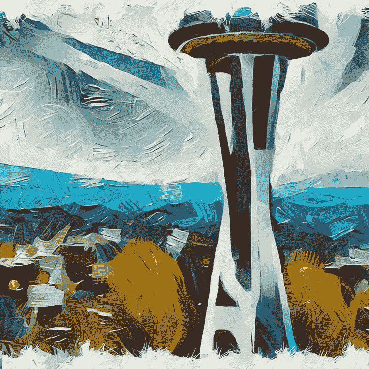
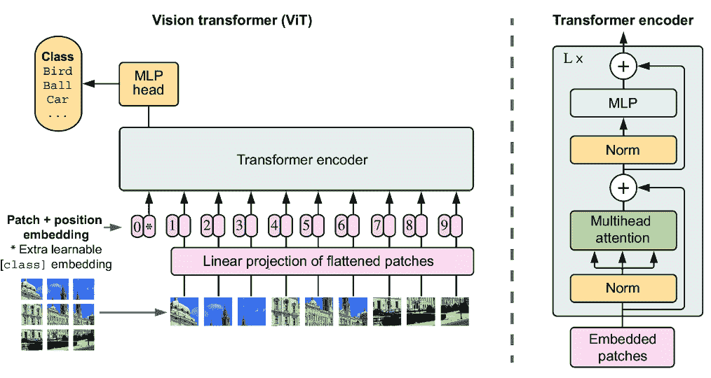
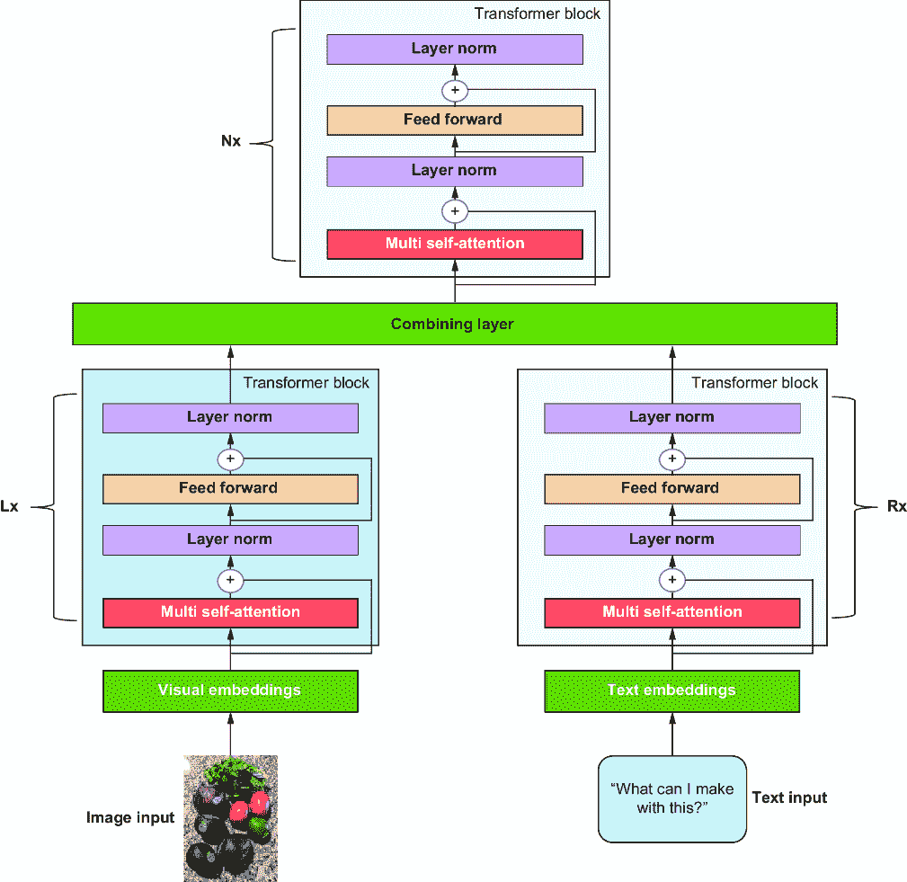
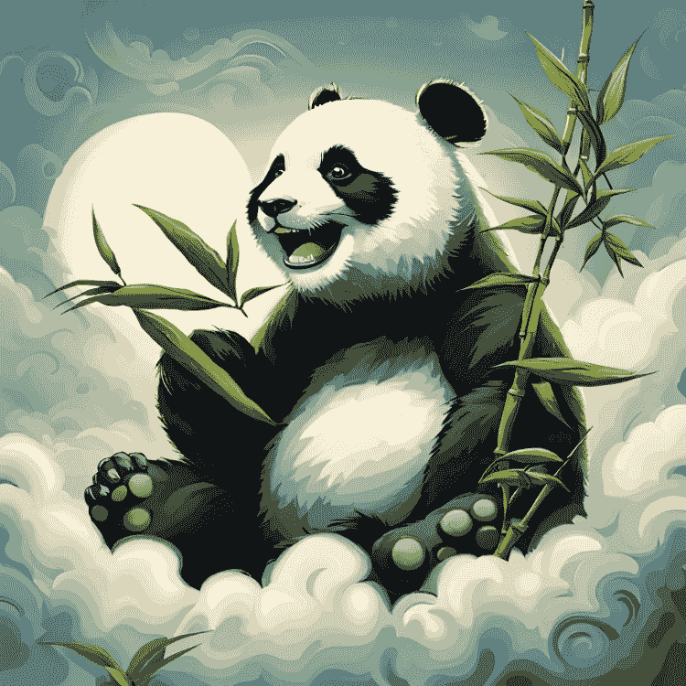
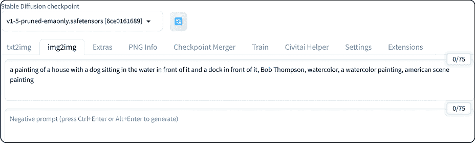
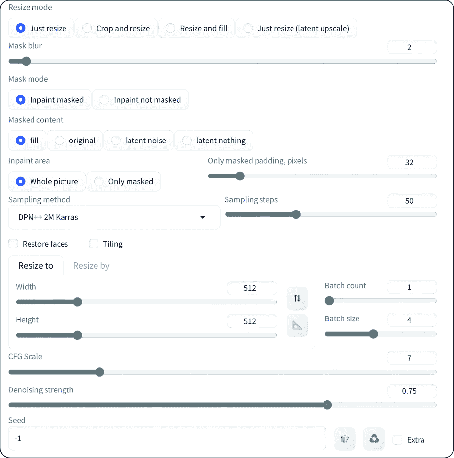
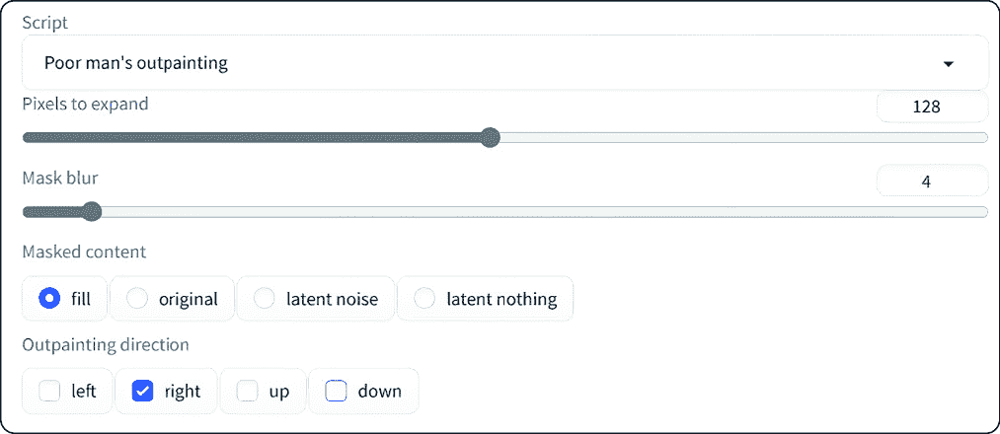

# 第四章：从像素到图片：生成图像

### 本章涵盖

+   生成式 AI 视觉模型，其模型架构以及企业关键应用场景

+   使用 Stable Diffusion 的 GUI 和 API 进行图像生成和编辑

+   使用高级编辑技术，如修复、扩展和图像变体

+   企业应考虑的实际图像生成技巧

生成图像是生成式 AI 的多种用途之一，只需一个提示就能生成独特且逼真的内容。企业越来越多地采用生成式 AI 来开发创新的图像生成和编辑解决方案，这导致了众多创新用例的出现——从为创新建筑设计提供 AI 驱动的架构，到时尚设计、头像生成、虚拟试衣和用于医疗培训的虚拟病人，仅举几例。这些用例伴随着令人兴奋的产品，如 Microsoft Designer 和 Adobe Firefly，它们将在本章中介绍。

在前几章中，我们讨论了生成式 AI 的基础以及使我们能够生成文本的技术，包括补全和聊天。然而，在本章中，我们将转变方向，探讨如何利用生成式 AI 来生成和调整图像。我们将看到创建图像是一个简单的过程，并强调一些确保图像正确性的复杂性。

最初，本章重点在于理解促进新图像生成和整体工作流程的生成式 AI 方法，这些技术的应用范围广泛，尤其在电子商务、娱乐和医疗保健领域尤为有用。此外，我们还将探讨各种用于图像处理的生成式 AI 产品和服务的应用。让我们深入探讨！

## 4.1 视觉模型

生成式 AI 视觉模型可以从提示中生成逼真的新图像和新的概念。让我们首先看看一些企业用例和示例，了解这些生成式 AI 视觉模型如何帮助：

+   *内容创作和编辑*——在多个行业中，生成式 AI 视觉模型可以帮助媒体和营销专业人士生成新的主题和场景，从图像中移除不必要的或不希望存在的东西，或应用风格迁移。具体用例因行业而异。

+   *医疗保健*——在医疗领域，图像生成式 AI 有多个用例，从教育和培训医学生或使用新技术（见下一条）到通过帮助增强和清晰医疗图像来改善患者的诊断和预后。它还通过分析新的分子、复杂的分子相互作用及其预测，以及优化配方和合成来加速药物发现和开发。

+   *教育*—我们可以根据学生的进度和当前学习情况即时创建交互式视觉内容。这包括现实且多样化的场景、使用数据增强的训练模拟，以及帮助提高教师和学生的教学质量。

+   *研究与开发*—我们可以创建更可解释的复杂数据结构和关系的视觉表示，这些结构在其他情况下可能不明显。这些核心元素有助于基于趋势、独特的视觉元素、品牌和布局创建新产品设计，并能在数据中发现细微的模式。

+   *营销*—生成式 AI 视觉模型生成针对特定个人或人群的特定视觉内容，这也可以包括用于 A/B 测试的不同视觉内容集，以了解成功的营销活动。

+   *制造业*—生成式 AI 视觉模型能够快速迭代和可视化新材料和组件，包括组装过程。

+   *个性化*—这种横向用例可以通过允许我们生成个性化视觉内容来跨越不同的维度，例如在电子商务环境中，购物者可以可视化商品、内容、服装等，为游戏和社交平台创建高度定制和个性化的头像。最后，时尚和创意领域创造了新的图案、布局、服装和家具设计。

这里有一些如何生成并使部分内容生动起来的真实示例：

+   *创意内容*—生成式 AI 视觉模型可以产生新颖且多样化的图像或视频，用于艺术、娱乐或营销目的。其中一些模型创建出看似真实但实际不存在的人脸，或者修改现有的人脸以考虑不同的特征，如年龄、性别、发型等。图 4.1 展示了使用草莓生成的熊猫。


##### 图 4.1 草莓熊猫

+   *图像编辑、内容改进和风格迁移*—我们可以使用生成式 AI 视觉模型来增强现有图像。这些模型可以解决各种问题，如提高分辨率和质量，以及移除不需要的元素。我们还可以将一张图像的风格和技术转移到另一张图像上。例如，图 4.2 展示了以梵高风格绘制的西雅图太空针油画。



##### 图 4.2 范·高风格下的西雅图太空针油画

+   *合成数据*—我们可以使用生成式 AI 视觉模型创建逼真但合成的图像。这些合成图像可以用作其他 AI 模型的训练和验证数据。例如，网站[`thispersondoesnotexist.com/`](https://thispersondoesnotexist.com/)生成现实生活中不存在的人脸。合成数据带来了挑战；我们将在本书后面讨论生成式 AI 挑战时再讨论这些问题。

+   *生成工程和设计*—我们可以生成新的设计选项，包括新的物体和结构，这有助于我们优化某些标准或约束，如功能性、性能或美学。这些模型可以为产品或数字资产生成独特、新颖的设计，从而减少手动设计所需的时间和资源。图 4.3 显示了针对材料、美学等设计特性进行优化的椅子。这些椅子的形状独特且具有未来感，与传统的椅子不同。


##### 图 4.3 为强度、美学、材料和重量优化的椅子

四种主要的生成式 AI 模型架构类型使得这些用例和示例成为可能：变分自编码器（VAEs）、生成对抗网络（GANs）、扩散模型和视觉 Transformer。每种技术都有其优势和劣势，我们概述了适用于其场景的正确方法：

+   *变分自编码器*—VAEs 可以生成逼真但简单的动物、面孔和其他物体的图像。它们适用于需要数据生成的场景，即与原始数据相似但有所变化的新数据点。这一特性还允许 VAEs 用于异常检测和推荐系统。

+   *生成对抗网络*—GANs 用于数据复杂且多样化的场景，需要高度的真实感。这使得它们适用于高质量图像、数据增强和风格迁移。

+   *扩散*—基于扩散的模型用于数据高维且连续的场景，我们需要以高质量、快速生成的方式对复杂数据分布进行建模。这些模型适用于生成语音和视频，其中一些将在下一章中涉及。

+   *视觉 Transformer*—当我们想要生成基于序列的任务图像时，这些模型非常出色，它们具有高度灵活性和适应性，适用于许多任务；它们需要大量的计算资源。

让我们更详细地探讨这些架构的每一个。

### 4.1.1 变分自编码器

VAEs 是一种具有关键作用的特定生成模型。它们通过结合深度学习、概率理论和统计力学的方面来表示复杂的数据分布。

VAEs 包括两个神经网络：编码器和解码器（图 4.4）。编码器将输入图像映射到一个低维潜在向量（潜在空间），该空间捕捉其基本特征。它不仅找到一个潜在空间中的单一点，还可以找到一个分布。相比之下，解码器从潜在空间中抽取样本并重建原始输入图像，同时添加一些随机性以使其更加多样化。这种随机性使我们能够添加新的数据点，如输入数据。

以下两个参数定义了潜在状态：均值和方差。正如其名所示，均值是潜在状态的平均值，方差是潜在状态与均值的差异度量。VAE 使用这些参数从正态分布中采样不同的潜在状态，这是一个描述不同值发生的可能性的数学函数。通过采样不同的潜在状态，VAE 可以生成与输入数据相似的不同输出数据。统计力学为我们提供了一个框架，根据观察数据推断潜在变量中变量的概率分布。


##### 图 4.4 变分自编码器架构

VAEs 允许的一些关键用途包括

+   *图像生成*—变分自编码器（VAEs）被广泛用于图像生成，以创建与训练数据相似的独特图像，无论是类似人类的面孔、时尚设计还是艺术作品。

+   *图像重建和修复*—通过学习图像数据的底层结构，VAEs 可以重建图像的缺失或损坏部分。这些重建或填补缺失方面的特性在某些领域非常有用，例如医学成像、恢复古老和考古学上有重要意义的照片等。

+   *风格迁移*—VAEs 允许我们将图像内容与风格分离，并将风格元素从一个图像转移到另一个图像，如图 4.2 所示。

+   *语义图像处理*—这与图像重建类似。由于学习到的潜在空间，VAEs 可以通过调整生成图像的特定方面（如面部表情）来提供对生成图像中特征的更精细的控制，而不会影响其他无关特征。

尽管功能强大，VAEs 也有一些缺点，例如模糊、缺乏多样性和难以建模复杂分布。训练它们可能要求很高且不稳定，导致模式崩溃。尽管存在这些挑战，VAEs 在视觉人工智能研究的前沿仍取得了成就和潜力，这建立在数据、数学和创造力之间复杂关系的基础上。

注意：潜在空间以更简单、更有意义的方式表示复杂数据。将其想象成一个地图，其中相似的项目彼此靠近，不同的项目则相距甚远。这有助于我们找到相似之处，生成新的数据，并更好地理解数据。

### 4.1.2 生成对抗网络

GANs [1] 是创建生成人工智能图像最受欢迎的技术之一。它们由两个神经网络组成：一个生成器，用于创建新示例，一个判别器，试图区分真实和生成的示例。

生成器试图从随机噪声或输入数据（如文本或草图）中创建看起来像真实图像的假图像。判别器接受真实和假图像，并试图区分两者。

这两个网络通过同时以博弈论的方式竞争来提高其性能而进行训练。GANs 通过一个最小-最大博弈来工作，其中生成器试图最大化判别器的错误，而判别器则试图最小化这些错误。

GANs 将提示作为输入传递给生成器，以及一些随机噪声。然后，生成器生成一个试图匹配提示的图像，并将其发送给判别器。判别器将生成的图像与来自同一提示的真实图像进行比较，给出一个分数，表示它认为图像有多逼真。然后，该分数被用来通过反向传播和梯度下降更新两个网络的权重。这个过程会重复进行，直到生成器可以创建满足提示并欺骗判别器的图像。

GAN 的目标是让生成器产生可以欺骗判别器的逼真图像。图 4.5 展示了 GAN 模型架构在高级别上的样子。潜在空间代表生成器的可能输入，而微调允许调整判别器和生成器的参数。


##### 图 4.5 GAN 模型架构

GANs 提供了许多与 VAEs 类似的使用案例，但它们在以下方面特别擅长：

+   *图像生成*—从噪声中创建逼真的图像，在娱乐、设计和艺术等特定应用中，允许生成高质量图像。

+   *风格迁移*—使艺术风格可以从一个图像转移到另一个图像；这与 VAEs 相同。

+   *超分辨率*—GANs 可以帮助提高分辨率，使图像更加详细和清晰。这在某些行业中非常有用，例如医疗和空间成像。

+   *数据增强*—类似于 VAEs 用于创建合成数据，GANs 帮助创建训练数据，无论是针对边缘情况还是数据不足或数据多样性不足的情况。

GANs 可以生成与真实图像难以区分的高质量图像。然而，它们也存在一些缺点，例如模式崩溃（即模型反复产生相同的输出）、不稳定性和难以控制输出。它们还引发了伦理问题，因为它们可以很容易地被用来创建可能导致隐私侵犯、潜在错误信息和误导的 deepfakes。最后，与许多其他 AI 模型一样，GANs 可能会无意中在生成的输出中延续训练数据中存在的偏差。

### 4.1.3 视觉 Transformer 模型

Transformers 是另一种可以创建图像的模型架构。我们之前在自然语言处理（NLP）任务的上下文中看到了相同的架构。Transformers 也可以在视觉相关任务上运行，被称为视觉 Transformer（ViT）[2]。

Transformer 是一种使用注意力机制处理序列数据的神经网络，如文本或语音，并且可以用于生成图像提示。它们在特定任务（如图像识别）中也非常有效，并且已经超越了之前的领先模型架构。

ViT 模型的架构类似于 NLP，尽管有一些不同——它有更多的自注意力层和一个全局注意力机制，允许模型同时关注图像的所有部分。Transformer 计算每个输入标记与每个其他输入标记的相关程度。这被称为注意力。标记越多，所需的注意力计算就越多。注意力计算的次数随着标记数量的平方增长，即二次方。

对于图像而言，基本的分析单位是像素而不是标记。在典型图像中，每对像素之间的关系在计算上是不可行的。相反，ViT 在图像的各个小部分（通常为 16 × 16 像素大小）中计算像素之间的关系，这有助于降低计算成本。这些 16 × 16 像素大小的部分及其位置嵌入被放置在线性序列中，并作为 transformer 的输入。

如图 4.6 所示，ViT 模型由三个主要部分组成：左侧、中间和右侧。左侧部分显示了输入类别，如`类别`、`鸟`、`球`、`汽车`等。这些是模型可以分配给图像的可能标签。中间部分显示了展平补丁的线性投影，它将输入图像转换为可以输入到 transformer 编码器的一系列向量。最后一部分是 transformer 编码器。这包括多个多头注意力和归一化层，用于学习不同图像部分之间的关系。



##### 图 4.6 视觉 Transformer（ViT）架构 [2]

ViT 被用于各种图像用例，如分割、分类和检测，并且通常比以前的技术更准确。它们还支持微调，可以在小数据集上以少量样本的方式使用，这使得它们在企业用例中非常有用，在这些用例中我们可能没有太多数据。ViT 模型旨在为类别标记生成一个最终的向量表示，其中包含有关整个图像的信息。

ViT 也面临一些挑战，如高计算成本、数据稀缺和伦理问题。它们在训练和推理方面都计算复杂，并且可解释性低——都是活跃的研究领域。具有 ViT（如 GPT-4）的多模态模型有很大的希望，并解锁了新的企业可能性。

### 4.1.4 扩散模型

扩散模型是生成式机器学习模型，可以从随机噪声（如图像或音频）中创建真实数据。它们的目标是通过模拟数据点如何通过潜在空间扩散来学习数据集的潜在结构。模型通过逐渐向图像添加噪声并学习通过从输入中去除噪声来反转这一过程进行训练，直到它类似于期望的输出。例如，扩散模型可以从一个随机图像开始，然后逐渐去除噪声，直到它看起来像一只熊猫。

视觉扩散模型通常由两部分组成：前向和反向扩散过程。前向扩散过程负责逐渐向图像的潜在表示添加噪声，从而损坏该潜在空间。反向扩散过程正好相反——它负责从损坏的潜在表示中重建原始图像。

前向扩散过程通常被实现为一个马尔可夫链（即一个没有记忆其过去状态的系统，下一步的概率取决于当前状态）。这意味着每个步骤的损坏潜在表示只依赖于前一步的潜在表示，这使得前向扩散过程高效且易于训练。

反向扩散过程通常被实现为一个神经网络，这意味着神经网络通过预测从损坏的表示中恢复原始潜在表示来学习反向前向扩散过程。这个反向扩散过程很慢，因为它是一步一步重复的。

扩散模型的一些优点如下：

+   它们可以生成与 GAN 生成的图像相匹配或超越的高质量图像，尤其是在复杂场景中，但生成时间要长得多。

+   它们不会受到模式崩溃的影响，这是 GANs 的常见问题。模式崩溃发生在生成器只产生有限种类的输出时，忽略了数据分布的一些模式。

+   扩散模型可以通过使用向输入数据添加噪声的马尔可夫链过程来捕捉数据分布的全貌。

+   扩散模型可以与其他模型（如自然语言模型）结合，以创建文本引导的生成系统。

稳定扩散是图像生成中最受欢迎的基于扩散的模型之一。其架构由三个主要部分组成（见图 4.7）：

+   文本编码器，它将用户的提示转换为向量表示。

+   一个用于从延迟空间重建图像的降噪自动编码器（称为 UNet），以及一个调度算法，它有助于重建原始图像。我们称之为*图像信息创建器*。UNet 是一个降噪自动编码器，因为它学会了从输入图像中去除噪声并产生一个干净的输出图像。它是一个具有编码器-解码器结构的神经网络。编码器部分降低输入图像的分辨率并提取其特征。另一方面，解码器部分增加分辨率并重建输出图像。

+   一个变分自动编码器（VAE），它创建的图像尽可能接近正态分布。


##### 图 4.7 稳定扩散逻辑架构

这些模型的选择取决于具体应用、计算资源的可用性、训练数据和诸如图像质量、速度等非功能性要求。表 4.1 列出了可以创建文本图像的一些更常见的生成式 AI 视觉系统。

##### 表 4.1 最常见的 AI 视觉工具

| AI 视觉工具 | 描述 |
| --- | --- |
| Imagen | Imagen 是谷歌的文本到图像扩散模型，可以从文本描述生成逼真的图像。它目前处于有限预览中，并已被证明可以生成与真实照片难以区分的图像。 |
| DALL-E | OpenAI 开发了一个转换语言模型，用于根据提示创建多样化的、原创的、逼真的和创意图像和艺术。它可以基于上下文编辑图像，例如添加、删除或更改特定部分。它已生成各种图像，从日常物体到超现实主义艺术，从简单的文本提示中。DALL-E 3 是一个改进版本，可以以 4 倍更高的分辨率生成更真实、更准确的图像。 |
| Midjourney | 基于 AI 的艺术生成器，使用深度学习和神经网络根据提示和其他图像、视频创建艺术品。这仅可通过 Discord 服务器访问，结果可以根据任何美学定制，从抽象到现实，从而为创意表达提供无限可能。 |
| Adobe Firefly | Adobe Firefly 是一系列创意生成式 AI 扩散模型，旨在帮助设计师和创意专业人士创建图像和文本效果，以及编辑和重新着色。它易于与 Adobe 的其他工具（如 Photoshop 和 Illustrator）一起使用。Adobe 拥有文本到图像模型和生成式填充模型。 |
| 稳定扩散 | 流行模型包括稳定扩散 XL 和 v1.6 版本，这是一个使用扩散模型通过具有更高级别照片逼真能力的提示来创建高质量图像的图像生成模型。它还可以根据文本描述生成新颖的图像。较新的 v3 系列模型分别具有 8B 和 2B 参数的大中小版本。 |

表 4.1 中列出的许多 AI 视觉模型仅对受邀测试它们的人可用。这仍然是一个新领域，大多数提供商都在缓慢地进行，在为数不多的客户中学习，然后再推出这些产品。

使用生成式 AI 创建和操作图像是一个既令人兴奋又具有挑战性的研究领域，具有许多潜在的应用和影响。然而，它也引发了关于生成内容所有权、真实性和影响力的伦理和社会问题。因此，负责任和道德地使用生成式 AI，并考虑其对社会的利益和风险是很重要的。

### 4.1.5 多模态模型

多模态模型可以处理不同类型的输入数据。“模态”指的是数据模式或类型，“多模态”指的是多种数据类型。这些类型包括文本、图像、音频、视频等。例如，GPT-4 有一个多模态模型变体，它接受图像和相关提示来做出预测或推断。

必应聊天最近启用了这项多模态功能，允许我们使用图像和文本作为提示。例如，如图 4.8 所示，我们向模型提供了两样东西：一张图像和与图像相关的提示。在这种情况下，我们展示了一些产品并询问模型可以用它做什么。


##### 图 4.8 使用图像和提示的多模态示例

在这种情况下，模型必须理解图像和不同的部分（即我们例子中的成分），并将其与提示相关联以生成答案。我们在阴影文本中看到响应，显示我们可以制作鳄梨酱、莎莎酱、鳄梨吐司等等。

多模态模型通常使用不同的 AI 技术。虽然它们可以使用不同的模型架构组合，但在我们的例子中，GPT-4 结合了不同的变压器块（如图 4.9）。



##### 图 4.9 多模态模型设计

注意：在展示如图 4.9 所示的变压器块时，惯例是使用 Nx，表示变压器块重复多次；换句话说，它堆叠了 x 次。在我们的多模态示例中，这适用于所有三个变压器块：左侧的图像（Lx）、右侧的文本（Rx）和组合层（Nx）。

多模态模型在复杂现实世界应用中特别有用，其中数据以各种形式出现。例如：

+   *网络*—分析文本和图像进行内容审核和情感分析

+   *电子商务*—使用照片和文本描述推荐产品

+   *医疗保健*—使用文本数据（患者病历）和医学影像（图像数据）进行诊断

+   *自动驾驶*—将传感器数据（雷达和激光雷达）与视觉数据（摄像头）集成，以实现情境感知和决策

既然我们已经看到了一些模型、它们的输出以及视觉 AI 模型工作的一般感觉，让我们用 Stable Diffusion 生成图像。

## 4.2 使用 Stable Diffusion 生成图像

稳定扩散背后的公司 Stability AI，已经推出了先进的基于扩散的模型，其中 SDXL 是迄今为止最新且最强大的模型。他们为我们提供了多种选择：

+   *自托管*——模型及其相关权重已发布，并通过 Hugging Face（[`huggingface.co/stabilityai`](https://huggingface.co/stabilityai)）提供。它们可以自托管，需要适当的计算硬件，包括 GPU。

+   *DreamStudio*——这是 StabilityAI 面向消费者的应用程序。它是一个简单的网页界面，用于生成图像。该公司还有一个名为 StableStudio 的开源版本，由社区驱动。有关 DreamStudio 的更多详细信息，请参阅[`dreamstudio.ai`](https://dreamstudio.ai)。

+   *平台 API*——Stability AI 有一个平台 API（[`platform.stability.ai`](https://platform.stability.ai)），我们将在本书中使用它，因为大多数企业更倾向于一个可以更好地进行规模管理的 API。在此示例中，我们将使用 REST API，因为它在所有平台上都显示出最大的灵活性。稳定扩散还有一个 gRPC API，非常相似。

### 4.2.1 依赖项

我们将在第三章中早期需要的软件包的基础上构建，并假设以下都已安装：Python、开发 IDE 和虚拟环境（如`conda`）。对于稳定扩散，我们需要以下内容：

+   一个 Stability AI 账户及其关联的 API 密钥；这可以通过[`platform.stability.ai/account/keys`](https://platform.stability.ai/account/keys)的账户页面获取。同样，也需要在该处设置账单详情。我们使用 pip 安装`stability-sdk` Python 软件包：`pip` `install` `stability-sdk`。

+   保密 API 密钥，并遵循管理秘密的最佳实践。我们将使用环境变量来安全地存储密钥，配置如下：

    +   *Windows*——`setx` `STABILITY` `API` `KEY` `“your-openai-key”`

    +   *Linux/Mac*——`export` `STABILITY` `API` `KEY=your-openai-endpoint`

    +   *Bash*——`echo` `export` `STABILITY_API_KEY="YOUR_KEY"` `>>` `/etc/environment &&` `source` `/etc/environment`

我们首先使用引擎 API 获取所有可用的模型列表，包括所有可用的引擎（即模型）。

##### 列表 4.1 稳定扩散：列出模型

```py
import os
import requests
import json

api_host = "https://api.stability.ai"
url = f"{api_host}/v1/engines/list"           #1

response = requests.get(url, headers={
    "Authorization": f"Bearer {api_key}"      #2
})

payload = response.json()                     #3

# format the payload for printing
payload = json.dumps(payload, indent=2)       #4
print(payload)
```

#1 获取模型的 REST API 调用

#2 授权的 HTTP 头

#3 API 的响应

#4 使 JSON 更易于阅读

此代码的输出将在下一列表中展示。这显示了我们必须使用的引擎，并有助于测试端到端，以确认 API 调用是否工作，并且我们可以进行身份验证并获得响应。

##### 列表 4.2 输出：稳定扩散模型列表

```py
[
  {
    "description": "Real-ESRGAN_x2plus upscaler model",
    "id": "esrgan-v1-x2plus",
    "name": "Real-ESRGAN x2",
    "type": "PICTURE"
  },
  {
    "description": "Stability-AI Stable Diffusion XL v1.0",
    "id": "stable-diffusion-xl-1024-v1-0",
    "name": "Stable Diffusion XL v1.0",
    "type": "PICTURE"
  },
  {
    "description": "Stability-AI Stable Diffusion v1.5",
    "id": "stable-diffusion-v1-5",
    "name": "Stable Diffusion v1.5",
    "type": "PICTURE"
  },
  …
]
```

### 4.2.2 生成图像

我们使用稳定扩散图像生成端点（REST API）进行图像生成。在本文发表时，我们将使用最新的模型，即 SDXL 模型。该模型的对应引擎 ID 为 `stable-diffusion-xl-1024-v1-0`，如前例中的模型列表所示。此引擎 ID 是 REST API 路径参数的一部分，可在 https://api.stability.ai/v1/generation/{engine_id}/text-to-image 获取。

列表 4.3 展示了使用此 API 生成图像的示例。请注意，我们在此章的示例中使用 API 的 v1.0 版本。要使用较新的模型，在大多数情况下我们只需要更改 REST API 路径。例如，要使用最近宣布的较新模型，即目前处于 Beta 测试阶段的稳定扩散 3，切换到以下引擎 ID：`https://api.stability.ai/v2beta/stable-image/generate/sd3`。

##### 列表 4.3 稳定扩散：图像生成

```py
import base64
import os
import requests
import datetime
import re

engine_id = "stable-diffusion-xl-1024-v1-0"                   #1
api_host = "https://api.stability.ai"
api_key = os.getenv("STABILITY_API_KEY")

prompt = "Laughing panda in the clouds eating bamboo"           #2

# Set the folder to save the image; make sure it exists
image_dir = os.path.join(os.curdir, 'images')
if not os.path.isdir(image_dir):
    os.mkdir(image_dir)

# Function to clean up filenames
def valid_filename(s):                                         #3
    s = re.sub(r'[^\w_.)( -]', '', s).strip()
    return re.sub(r'[\s]+', '_', s)

response = requests.post(                                      #4
    f"{api_host}/v1/generation/{engine_id}/text-to-image",      #5
    headers={
        "Content-Type": "application/json",
        "Accept": "application/json",
        "Authorization": f"Bearer {api_key}"
    },
    json={
        "text_prompts": [
            {
                "text": f"{prompt}",
            }
        ],
        "cfg_scale": 7,                                         #6
        "height": 1024,                                        #6
        "width": 1024,                                         #6
        "samples": 1,                                          #6
        "steps": 50,                                           #6
    },
)

data = response.json()                                  #7

for i, image in enumerate(data["artifacts"]):
    filename = f"sd_{valid_filename(prompt)}_{i}_{ [CR]
               datetime.datetime.now().strftime('%Y%m%d_%H%M%S')}.png"
    image_path = os.path.join(image_dir, filename)
    with open(image_path, "wb") as f:
        f.write(base64.b64decode(image["base64"]))            #8
```

#1 选择我们想要使用的模型。

#2 生成图像时使用的提示

#3 创建文件名的辅助函数

#4 生成图像的 API 调用

#5 REST API 端点包括引擎 ID。

#6 控制模型生成的参数

#7 生成完成后 API 的响应

#8 本地保存图像

生成了一个“云中吃竹子的笑熊猫”的图像，如图 4.10 所示。这是一只非常快乐且逼真的熊猫。



##### 图 4.10 稳定扩散生成的图像

稳定扩散 API 的一些参数与我们之前看到的类似。然而，由于底层模型架构与表 4.2 中展示的不同，一些参数也有所不同。因为我们使用的是 REST API，所以也有两组参数——一组是头部参数，另一组是主体参数。

##### 表 4.2 稳定扩散头部参数：图像创建 API

| 参数 | 类型 | 默认值 | 描述 |
| --- | --- | --- | --- |
| `Accept`  | 字符串  | 空白 `(application/json)`  | 响应格式可以是默认（空白）JSON，或者设置为 `image/png` 以生成 PNG 图像。  |
| `Organization`  | 字符串  | 空值（可选）  | 一个标签，允许请求被限制在用户默认组织之外的组织。此参数可以帮助调试、监控或检测滥用。  |
| `Stability-Client-ID`  | 字符串  | 空值（可选）  | 此参数用于识别请求的来源，例如客户端应用程序或子组织。它可以帮助调试、监控和检测滥用。  |
| `Stability-Client-Version`  | 字符串  | 空值（可选）  | 此参数标识发出请求的应用程序或服务的版本。它可以帮助调试、监控和检测滥用。  |
| `Authorization`  | 字符串  | Bearer `API_KEY`  | 认证 API 调用的密钥  |

表 4.3 概述了构成 API 调用主体的参数。这些参数可以微调模型，使其更接近我们想要生成的结果。

##### 表 4.3 稳定扩散体参数：图像创建 API

| 参数 | 类型 | 默认值 | 描述 |
| --- | --- | --- | --- |
| `height`和`width`  | 整数  | 512 (可选)  | 图像的高度和宽度（以像素为单位）必须是 64 的倍数，并且必须是以下组合之一：1024 x 1024、1152 x 896、1216 x 832、1344 x 768、1536 x 640、640 x 1536、768 x 1344、832 x 1216 和 896 x 1152。注意，其中一些取决于使用的引擎。  |

| `text_prompts`  | 字符串  | Null (必需)  | 使用文本提示数组来生成图像。每个数组元素由两个属性组成——一个是提示本身，另一个是与该提示相关联的权重。对于负面提示，权重应该是负数。例如：`"text_prompts": [{`

`"text": "A dog on a mat",`

`"weight": 0.7`

`}]`

文本属性最多可达 2,000 个字符。

|

| `cfg_scale`  | 字符串  | 7 (可选)  | 这可以在 0 到 35 之间变化；它定义了扩散过程遵循提示的严格程度。更高的值使图像更接近提示。  |
| --- | --- | --- | --- |
| `clip_guidance_preset`  | 字符串  | `None` (可选)  | 不同的值控制使用的 CLIP 指导程度，并控制生成图像的质量和相关性。值有`NONE`、`FAST_BLUE`、`FAST_GREEN`、`SIMPLE`、`SLOW`、`SLOWER`和`SLOWEST`。  |
| `sampler`  | 字符串  | Null (可选)  | 这定义了用于扩散过程的采样器。如果省略此值，API 将自动为您选择一个合适的采样器。值有`DDIM`、`DDPM`、`K_DPMPP_2M`、`K_DPM_2`、`K_EULER K_DPMPP_2S_ANCESTRAL`、`K_HEUN`、`K_DPM_2_ANCESTRAL`、`K_LMS`、`K_EULER_ANCESTRAL`。  |
| `samples`  | 整数  | 1 (可选)  | 指定要生成的图像数量。值需要在 1 到 10 之间。  |
| `seed`  | 整数  | 0 (可选)  | 随机种子是一个数字，它决定了噪声的外观。留空 0 以使用随机种子值。可能的值范围在 0 到 4294967295 之间。  |
| `steps`  | 整数  | 50 (可选)  | 定义要运行的扩散步骤数。值在 10 到 150 之间。  |

| `style_preset`  | 字符串  | Null (可选)  | 用于引导图像模型向特定预设风格。值有`3d-model`、`analog-film`、`anime`、`cinematic`、`comic-book`、`digital-art`、`enhance`、`fantasy-art`、`isometric`、`line-art`、`low-poly`、`modeling-compound`、`neon-punk`、`origami`、`photographic`、`pixel-art`和`tile-texture`。注意：这个风格预设列表可能会随时间变化。

|

现在我们来看看其他我们可以创建图像的方法。

## 4.3 使用其他提供商进行图像生成

当我们想要生成图像时，一些其他供应商也有生成式 AI 视觉模型；然而，它们没有平台或 API。在本节中，我们将展示其他允许创建图像但无 API 的平台，在大多数情况下，它们需要通过它们的 GUI 访问。

### 4.3.1 OpenAI DALLE 3

DALLE 3 是 OpenAI 的新图像生成模型，可以从提示中创建图像。它是第一个大多数人都能够与之交互的图像生成模型之一。DALLE 代表离散自动编码器语言潜在编码器，这意味着它使用一种特殊的神经网络来编码图像和文本为标记，然后使用这些标记来创建图像。DALLE 可以通过 API 和 GUI 两种方式使用。

由于使用 DALLE 生成的图像与 Stable Diffusion 类似，我们在此不深入讲解 API 的细节。本书附带的 GitHub 代码仓库（[`bit.ly/GenAIBook`](https://bit.ly/GenAIBook)）包含了 DALLE 的 API 和代码示例。

### 4.3.2 Bing 图像创建器

Bing 拥有一个使用 DALLE 内部技术的图像创建应用程序，但它创建的图像经过了增强，并且略有不同。我们只需要一个网络浏览器就可以使用它；没有暴露 API。我们可以通过访问 [`www.bing.com/create`](https://www.bing.com/create) 并输入提示来生成图像。除了提示中指定的那些调整之外，我们无法进行很多其他调整。图 4.11 展示了生成一幅“宁静的度假湖屋，带有狗的水彩画”的过程。我们将在稍后使用这些图像之一来展示如何编辑图像。


##### 图 4.11 Bing Create：创建一幅水彩画风格的图像

### 4.3.3 Adobe Firefly

Adobe 拥有一套生成式 AI 工具，其中 Firefly 是其生成式 AI 模型系列。它正在集成到各种 Adobe 产品中，如 Photoshop，并且可以通过 [`firefly.adobe.com/`](https://firefly.adobe.com/) 访问。

虽然没有 API，但整个过程和模式与我们在 OpenAI 中看到的相同。一旦我们登录，就会看到一个 UI，我们可以在其中输入提示并生成图像。让我们使用一个之前的例子：“云中的笑熊猫吃竹子。”默认情况下创建了四幅图像（图 4.12）。


##### 图 4.12 Adobe Firefly 生成视觉

注意：谷歌最近宣布了其名为 Vertex AI 的生成式 AI API 套件；在本书出版时，基于扩散模型的视觉 API 尚未开放使用。

现在我们已经创建了一张图像，接下来让我们看看如何编辑和增强它。

## 4.4 使用 Stable Diffusion 编辑和增强图像

除了生成图像，Stable Diffusion 还允许我们编辑和增强图像。我们使用 Stable Diffusion 的网络 UI，这是 Stable Diffusion 的开源网络界面之一，来展示如何使用修复和增强图像。网络界面是模型的一个包装器，虽然它不调用 API，但它具有相同的属性。

我们首先使用我们之前生成的一幅水彩画图像。在这个例子中，我们遮罩了两个区域：图像左下角的不同颜色和狗（图 4.13）。


##### 图 4.13 修复草图

当我们将图像上传到 Inpaint 时，该网络应用程序的一个功能是使用 CLIP 模型来调查图像并猜测提示。尽管我们知道原始生成的提示，但这是一个不同的模型，因此建议让 Stable Diffusion 确定提示。结果如图 4.14 所示。



##### 图 4.14 使用 CLIP 模型猜测图像提示

##### CLIP 模型

CLIP（对比语言-图像预训练）是由 OpenAI 创建的一种神经网络，它将文本和图像联系起来。它能够理解和分类图像，以匹配自然语言描述。这是通过一种称为**对比学习**的技术实现的，模型从互联网上收集的大量图像和相关文本对中学习。

CLIP 的独特能力进行“零样本”学习意味着它可以根据文本准确地对它以前从未见过的图像进行标记，而无需对该特定任务进行直接微调。例如，CLIP 可以给出视觉类别的名称，并在图像中识别它们，即使它没有专门针对它们进行训练。

CLIP 将文本和图像编码到公共表示空间中。它可以估计最适合图像的文本片段或反之亦然。这赋予它很大的灵活性，能够处理不同类型的视觉任务，而无需针对每个任务特定的训练数据。

如图 4.15 所示，修复的附加设置允许进行更精细的控制。其中一些与图像生成相同，同样重要，例如采样步骤的数量和方法。



##### 图 4.15 Stable Diffusion 修复选项

扩展是一种额外的设置，它可以在我们选择的方向上生成和扩展图像。此选项通过同一设置选项卡上的脚本下拉菜单选择（图 4.16）。



##### 图 4.16 Stable Diffusion 的扩展设置

我们通过使用遮罩去除我们想要删除的区域，进行再生，然后添加新元素，来完成修复的迭代过程。这些迭代的最终结果如图 4.17 所示。


##### 图 4.17 使用 Stable Diffusion 的修复最终编辑

备注：关于 Stable Diffusion 网络用户界面的详细信息，包括设置、配置和部署，超出了本书的范围；然而，它是一个非常流行的应用程序，允许用户在 Windows、Linux 和 MacOS 上自行托管。更多详细信息可以在他们的 GitHub 仓库中找到（[`mng.bz/znx1`](https://mng.bz/znx1)）。

### 4.4.1 使用图像到图像 API 生成

图像到图像是一个强大的工具，用于生成或修改新图像，它以现有图像作为起点和文本提示。我们可以使用这个 API 生成新图像，但可以改变风格和情绪，添加或删除某些方面。

让我们使用之前提到的宁静的湖泊示例，然后使用图像到图像 API 生成新的图像。我们基于之前看到的两个示例——我们使用宁静的湖泊作为输入，并要求模型生成“天空中一只快乐地吃竹子的熊猫。”

##### 列表 4.4 图像到图像生成

```py
import base64
import os
import requests
import datetime
import re

engine_id = "stable-diffusion-xl-1024-v1-0"
api_host = "https://api.stability.ai"
api_key = os.getenv("STABILITY_API_KEY")

orginal_image = "images/serene_vacation_lake_house.jpg"

#helper functions 
...

response = requests.post(
    f"{api_host}/v1/generation/{engine_id}/image-to-image",
    headers={
        "Accept": "application/json",
        "Authorization": f"Bearer {api_key}"
    },
    files={
        "init_image": open(orginal_image, "rb")
    },
    data={
        "image_strength": 0.35,
        "init_image_mode": "IMAGE_STRENGTH",
        "text_prompts[0][text]": "A happy panda eating bamboo in the sky",
        "cfg_scale": 7,
        "samples": 1,
        "steps": 50,
        "sampler": "K_DPMPP_2M"
    }
)

data = response.json()

for i, image in enumerate(data["artifacts"]):
    filename = f"{valid_filename(os.path.basename(orginal_image))}_
        ↪img2img_{i}_{datetime.datetime.now(). 
        ↪strftime('%Y%m%d_%H%M%S')}.png"
    image_path = os.path.join(image_dir, filename)

    with open(image_path, "wb") as f:
        f.write(base64.b64decode(image["base64"]))
```

我们可以看到如图 4.18 左侧所示的图像到图像 API 调用生成的图像；我们看到熊猫和竹子以及如何使用输入图像设置场景和生成图像的类型和美学。然而，它并不符合提示中的云元素。

我们可以调整参数，使其更符合提示，而不是输入图像，如图 4.18 右侧所示。一个例子是当我们看到天空中有一只熊猫在吃竹子；整体上，图像的美学遵循输入图像。


##### 图 4.18 Stable Diffusion 图像到图像生成

### 4.4.2 使用 masking API

Stable Diffusion 还有一个 masking API，允许我们以编程方式编辑图像的一部分。该 API 与创建 API 非常相似，如图 4.5 中的示例所示。它确实有一些限制：mask 图像需要与原始图像具有相同的尺寸，并且是 PNG 格式，大小小于 4MB。当我们在本章讨论图像生成时，API 具有与之前概述的相同标题参数；我们将避免重复。

##### 列表 4.5 Stable Diffusion masking API 示例

```py
import base64
import os
import requests
import datetime
import re

engine_id = "stable-inpainting-512-v2-0"                          #1
api_host = "https://api.stability.ai"
api_key = os.getenv("STABILITY_API_KEY")

orginal_image = "images/serene_vacation_lake_house.jpg"            #2
mask_image = "images/mask_serene_vacation_lake_house.jpg"           #3
prompt = " boat with a person fishing and a dog in the boat"

# helper functions
...

response = requests.post(
    f"{api_host}/v1/generation/{engine_id}/image-to-image/masking",   #4
    headers={
        "Accept": 'application/json',
        "Authorization": f"Bearer {api_key}"
    },
    files={
        'init_image': open(orginal_image, 'rb'),
        'mask_image': open(mask_image, 'rb'),
    },
    data={
        "mask_source": "MASK_IMAGE_BLACK",                           #5
        "text_prompts[0][text]": prompt,                             #6
        "cfg_scale": 7,
        "clip_guidance_preset": "FAST_BLUE",
        "samples": 4,                                        #7
        "steps": 50,  #8
    }
)

data = response.json()                                            #9

for i, image in enumerate(data["artifacts"]):
    filename = f"{valid_filename(os.path.basename(orginal_image))}_ 
                  ↪masking_{i}_{datetime.datetime.now(). 
                  ↪strftime('%Y%m%d_%H%M%S')}.png"
    image_path = os.path.join(image_dir, filename)
    with open(image_path, "wb") as f:
        f.write(base64.b64decode(image["base64"]))                #10
```

#1 选择我们想要使用的 inpainting 模型

#2 我们想要编辑的图像

#3 我们想要应用的 mask

#4 Masks API 调用

#5 选择要替换的图像的黑色像素

#6 生成提示

#7 指定要生成的图像数量

#8 确定每个图像的步骤数量

#9 从 API 获取响应

#10 将编辑后的图像保存到磁盘

表 4.4 概述了所有 API 参数。在引导模型方面，大部分与之前的图像创建相似。

##### 表 4.4 Stable Diffusion masking API 参数

| 参数 | 类型 | 默认值 | 描述 |
| --- | --- | --- | --- |
| `init_image`  | 字符串  | 二进制（必需）  | 我们想要编辑的初始图像 |

| `mask_source`  | 字符串  | 空值（必需）  | 确定生成区域及其相关强度的 mask 细节。它可以有以下之一：`MASK_IMAGE_WHITE`—使用白色像素作为 mask；白色像素被修改；黑色像素保持不变。

`MASK_IMAGE_BLACK`—使用黑色像素作为 mask；黑色像素被修改；白色像素保持不变

`INIT_IMAGE_ALPHA`—使用 alpha 通道作为 mask。编辑完全透明的像素，并保持完全不透明的像素不变。

|

| `mask_image`  | 字符串  | 二进制（必需）  | 引导模型确定哪些像素需要修改的 mask 图像。此参数仅在`mask_source`为`MASK_IMAGE_BLACK`或`MASK_IMAGE_WHITE`时使用。 |
| --- | --- | --- | --- |
| `text_prompts`  | 字符串  | 空值（必需）  | 使用文本提示数组来生成图像。数组中的每个元素包含两个属性——提示本身及其关联的权重。对于负面提示，权重应为负数。提示需要遵循以下格式：`text_prompts[index][text | weight]`，其中索引是唯一的，不需要是连续的。  |
| `cfg_scale`  | 字符串  | 7（可选）  | 可以在 0 到 35 之间取值；它定义了扩散过程遵循提示的严格程度。值越高，图像越接近提示。  |
| `clip_guidance_preset`  | 字符串  | 无（可选）  | 不同的值控制了使用的 CLIP 指导程度，并影响生成图像的质量和相关性。可能的值有 `NONE`、`FAST_BLUE`、`FAST_GREEN`、`SIMPLE`、`SLOW`、`SLOWER` 和 `SLOWEST`。  |

| `sampler`  | 字符串  | 空值（可选）  | 定义用于扩散过程的采样器。如果省略此值，API 会自动为您选择合适的采样器。可能的值有 `DDIM`、`DDPM`、`K_DPMPP_2M`、`K_DPM_2`、`K_EULER K_DPMPP_2S_ANCESTRAL`、`K_HEUN`、`K_DPM_2_ANCESTRAL`、`K_LMS` 和 `K_EULER_ANCESTRAL`。

|

| `samples`  | 整数  | 1（可选）  | 定义要生成的图像数量。值需要在 1 到 10 之间。  |
| --- | --- | --- | --- |
| `seed`  | 整数  | 0（可选）  | 随机种子是一个数字，它决定了噪声的外观。留空值为随机种子值。可能的值范围在 0 到 4294967295 之间。  |
| `steps`  | 整数  | 50（可选）  | 定义要运行的扩散步骤数。可能的值范围在 10 到 150 之间。  |

| `style_preset`  | 字符串  | 空值（可选）  | 用于引导图像模型向特定预设样式发展。可能的值有 `3d-model`、`analog-film`、`anime`、`cinematic`、`comic-book`、`digital-art`、`enhance`、`fantasy-art`、`isometric`、`line-art`、`low-poly`、`modeling-compound`、`neon-punk`、`origami`、`photographic`、`pixel-art` 和 `tile-texture`。注意：这个样式预设列表可能会随时间变化。

|

### 4.4.3 使用 upscale API 进行缩放

我们要介绍的最后一个稳定扩散 API 用于放大图像，即生成给定图像的高分辨率版本。默认情况下，将输入图像放大两倍，最大像素数为 4,194,304，相当于最大尺寸为 2,048x2,048 和 4,096x4,096。

API 使用起来很简单，如下一列表所示。需要注意的主要是使用 `engine_id` 参数通过正确的模型。

##### 列表 4.6 稳定扩散缩放 API

```py
import base64
import os
import requests
import datetime
import re

engine_id = "esrgan-v1-x2plus"
api_host = "https://api.stability.ai"
api_key = os.getenv("STABILITY_API_KEY")

orginal_image = "images/serene_vacation_lake_house.jpg"

# helper functions
...

response = requests.post(
    f"{api_host}/v1/generation/{engine_id}/image-to-image/upscale",
    headers={
        "Accept": "image/png",
        "Authorization": f"Bearer {api_key}"
    },
    files={
        "image": open(orginal_image, "rb")
    },
    data={
        "width": 2048,
    }
)

filename = f"{valid_filename(os.path.basename(orginal_image))}_
                             ↪upscale_{datetime.datetime.now().
                             ↪strftime('%Y%m%d_%H%M%S')}.png"
image_path = os.path.join(image_dir, filename)

with open(image_path, "wb") as f:
    f.write(response.content)
```

现在我们已经检查了使用 GUI 和 API 的多种图像生成选项，让我们来看看企业的一些最佳实践。

##### AI 生成图像的水印

由于 AI 生成的图像越来越好，我们往往无法区分真实图像和 AI 生成的图像，因此有人推动在 AI 生成的图像上添加水印。目前主要有两种方式：可见水印，如 Bing 和 DALLE 所做的那样，以及不可见水印，对我们来说是不可见的，但嵌入在图像中，可以使用特殊工具检测到。

Google 更进一步，开发了一种名为 SynthID 的新类型的水印。一个不可见的水印嵌入到每个图像像素中，使其对图像操作（如滤镜、调整大小和裁剪）更具抵抗力。它这样做而不以任何明显的方式降低图像质量，也不会显著改变图像大小。

为 AI 生成的图像添加水印有多种好处。除了表明图像的来源和可能的所有权外，它们有助于阻止未经授权的使用和分发，并有助于防止错误信息的传播。第十三章更详细地介绍了与 GenAI 相关的风险，包括缓解策略和相关工具。

### 4.4.4 图像生成技巧

本节概述了图像生成的最佳实践。在企业环境中，除了图形设计师和艺术家等一些职能之外，许多具有不同技能的人需要帮助。这些建议将帮助他们开始。我们将在本书后面讨论提示工程时详细介绍更多细节：

+   *详细描述*——详细描述你想要生成的主题。我们想象或想要的可视元素可能与模型解释它们的方式不匹配，因此添加细节和提示可以帮助模型更接近你想要的结果。许多人也忘记了描述背景；添加这些细节同样重要。

+   *氛围与艺术风格*—指定你想要的感觉或艺术风格；例如，我们在之前的提示中概述了一幅画。这个列表是无限的，并且在某些方面取决于你的想象力，从油画到蒸汽朋克再到动作摄影。

+   *设定情感、能量和氛围*—添加形容词和动词来表达情绪、能量和整体情感——例如，生成的图像旨在积极且充满活力，或者积极但能量较低，等等。

+   *手和面部生成*——这对许多模型来说都是一个问题，尽管它们正在变得更好，但有时在生成的图像中添加库存或其他图像会更好。

+   *结构、尺寸、光线和观看角度*——在思考目标图像的氛围和风格时，也要考虑文物的尺寸和结构。例如，我们期望的是小巧精致的东西还是庞大且独立的东西？文物是从什么角度被观察的——是特写、远景、广角、户外还是在自然光下？当然，鉴于我们正在讨论提示，它可以结合许多这些因素。

+   *文字、标志和字符*——图像模型不是大型语言模型，通常在需要生成文字的图像（例如，宠物沙龙外面有它的名字）方面表现不佳。在编辑图像时最好手动添加这些内容。一旦添加，我们可以使用修复功能。

+   *避免多个字符同时出现*——如果你在同一个提示和生成任务中添加许多字符，模型可能会感到困惑。可能更好的方法是从小任务开始，然后使用修复或手动编辑这些元素。

下一章将展示除了文本和图像之外还可以生成的内容。我们将涵盖音频、视频和代码生成器。

## 摘要

+   基于视觉的生成式 AI 模型使我们能够从简单的提示中创建独特且逼真的内容。这些模型可以生成新的内容，编辑和增强现有图像，并使用简单的提示。

+   生成式 AI 视觉模型在创意内容、图像编辑、合成数据创建和生成式设计等多个用例中都有应用。

+   有四种主要的生成式 AI 模型架构，每种架构都有其优势和挑战。我们解释了变分自编码器（VAEs）、生成对抗网络（GANs）、视觉 Transformer 模型（ViT）和扩散模型。

+   多模态模型是不同的生成式 AI 模型，允许我们同时处理不同类型的输入数据，包括文本、图像、音频和视频。

+   OpenAI 的 DALLE、Bing、Adobe 以及 Stability AI 的 Stable Diffusion 是一些更著名且常见的用于图像生成和编辑的企业级生成式 AI 图像模型。大多数通过 API 暴露的内容也有相关的 GUI 界面。

+   许多生成式 AI 视觉模型支持修复（修改图像内的部分）、扩展（扩展图像超出原始边界）和创建图像变体。

+   扩散模型在建模崩溃和支持各种输出方面更稳健。

+   最后，当涉及到图像时，我们需要考虑场景、主要角色、结构和文本、面部等元素，这些最好手动完成并编辑到图像中。这些方面必须添加到生成提示中。本书后面我们将讨论这一主题作为提示工程的一部分。
