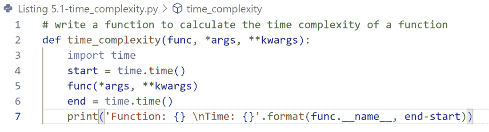
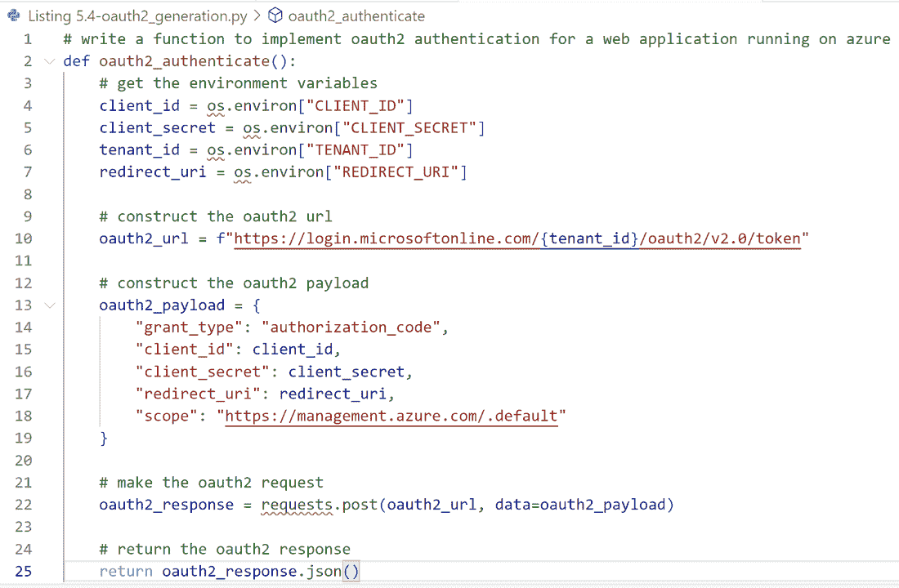
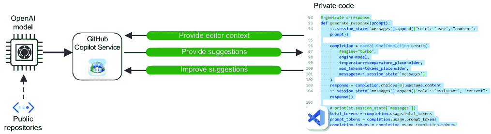
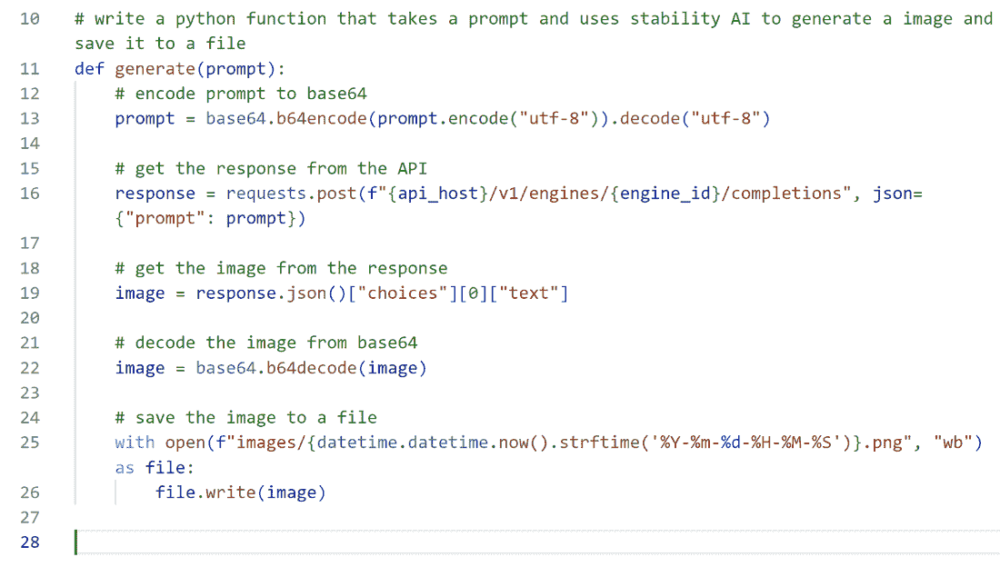
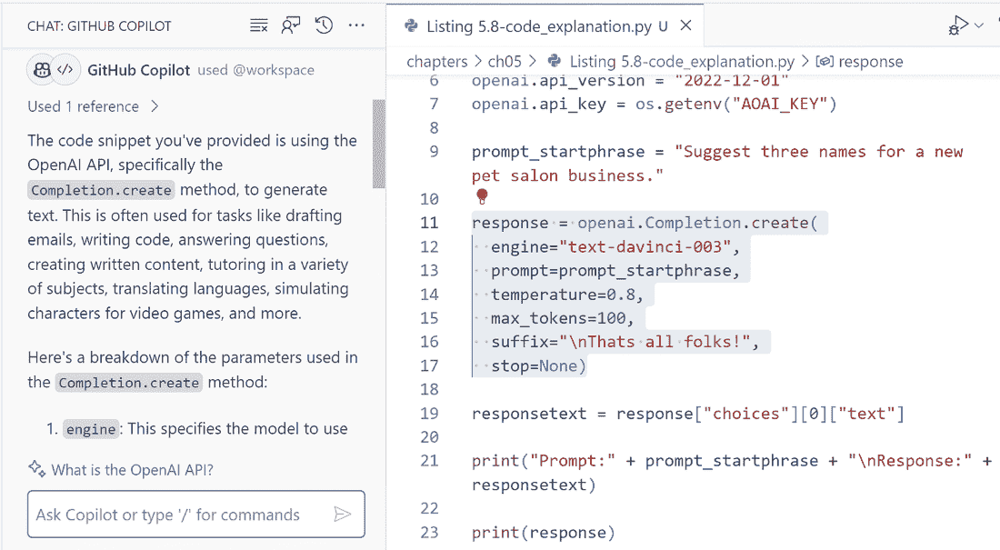
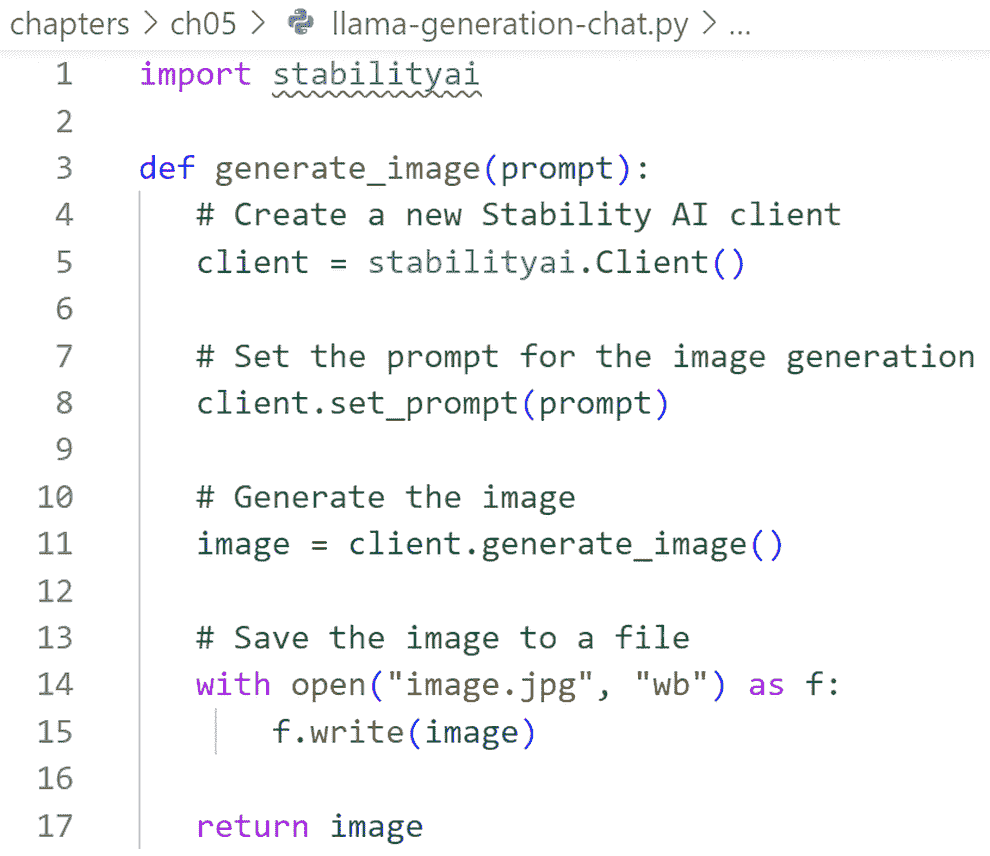

# 第五章：AI 还能生成什么？

### 本章涵盖

+   使用生成式 AI 进行代码创建和相关任务

+   允许代码生成的工具及其使用方法

+   最佳代码生成实践

+   生成视频和相关工具

+   生成音频、音乐和相关工具

几乎不需要提示和输入就能自动编写的代码看起来很神奇，至少对那些从事计算工作的人来说如此，它类似于圣杯。鉴于人工智能（AI）和生成式 AI 的进步，这项努力在今天似乎成为可能。我们已经看到了一些令人惊叹和有趣的事情，AI 可以生成从语言到图像，甚至进行多轮对话，并且许多这些都拥有强大的企业用例。本章概述了我们还可以使用 AI 生成的事物。

我们将首先讨论代码生成，它的含义，如何进行，以及企业使用的工具。例如，OpenAI 的联合创始人之一安德烈·卡帕西，曾领导特斯拉的 AI 和视觉团队，最近表示 GitHub Copilot 帮助他编写了大约 80%的代码，这极大地提高了生产力。然后，我们将探讨一些非常早期的生成式，并探索其在视频和音乐中的应用。让我们看看代码生成是如何工作的。

## 5.1 代码生成

生成式 AI 不仅仅是关于完成、聊天或生成图像。它是一种可以显著提高开发者生产力并改善企业软件开发流程的技术。其最引人入胜的方面之一是生成代码并帮助理解代码和文档。从开发生命周期角度来看，“代码生成”这个术语可能会误导，因为它不仅包括代码生成本身，还涵盖了软件开发的各种方面。以下是企业如何使用代码生成的一些示例：

+   *代码生成*—通过为给定提示生成代码来增强开发。这不是正在构建的任何内容的完整代码，而是函数级别的代码。

+   *提高生产力*—基于生成式 AI 的工具可以帮助提高开发者的生产力，尤其是在使用对开发者可能来说是新的库和软件开发套件（SDKs）或编程语言时。我们还可以提高许多企业应用需要实现的大量框架（如 AI 包装器、数据库查询等）的实施速度，例如访问控制、加密和安全等。

+   *新员工入职*—对于企业来说，拥有内部专有开发标准、内部库和 SDK 是很常见的，这些 SDK 和库封装了大量领域和机构知识以及知识产权。生成式 AI 工具可以帮助新全职员工（FTEs）快速熟悉并使用这些 SDK 和库进行培训。新 FTEs 还可以作为模型来解释代码片段，帮助开发者快速学习。

+   *自动化*——许多开发任务是重复性的，许多开发者通常会跳过它们或走捷径，这可能会在将来造成问题。生成式 AI 可以帮助自动化诸如代码审查、测试、文档、设计迭代、UI 原型等重复性任务。

+   *培养创造力*——生成式 AI 工具可以帮助开发者看到在编码或快速原型设计时不同的方法和想法，鼓励他们探索可能更好并有助于教学的新的技术。

在我们深入细节之前，我们将从代码生成示例开始。假设我们想要编写一个函数来计算其时间复杂度。时间复杂度衡量函数执行所需的时间长度（即时间）。它通常使用大 O 符号表示——常数、线性、二次和指数时间。

备注：为了简洁，我们在这里不会展示完整的测试代码生成；这可以在 GitHub 仓库附带的书籍中找到，[`bit.ly/GenAIBook`](https://bit.ly/GenAIBook)。

让我们从使用我们 IDE 中的 GitHub Copilot 的一个简单玩具示例开始。注释是提示，模型完成代码生成，如图 5.1 所示。关于开发者的体验，这可能会看起来像是自动完成的一个更花哨的版本，但它远不止于此。我们可以将代码生成看作是我们之前看到的完成 API，区别在于将要生成的是代码。


##### 图 5.1 计算时间复杂度的代码生成

在灰色文本（也称为幽灵文本）中的第一个建议看起来不错；如果我们愿意，我们可以获得多达 10 个建议并找到一个更好的。图 5.2 显示了这些替代生成的一个片段。


##### 图 5.2 GitHub Copilot 代码完成建议

在这种情况下，最后一个建议（第 10 个）看起来更好，这就是我们将要使用的，如图 5.3 所示。



##### 图 5.3 AI 生成的计算函数时间复杂性的代码

### 5.1.1 我能信任这段代码吗？

在代码生成的背景下，许多企业正在考虑的一个领域是如何信任生成的代码。让我们以生成复杂代码的例子为例，例如为 Web 应用实现 OAuth2，如图 5.4 所示。一般来说，代码生成工具正变得越来越可靠和准确。然而，仍然重要的是要意识到代码的限制；是否可以信任生成的代码取决于几个因素，包括



##### 图 5.4 显示 OAuth2 实现的代码生成

+   工具的质量和支撑该代码生成工具的底层模型。

+   代码生成所针对的任务的复杂性；有些工具更适合定义明确的任务，而不是可能导致错误的复杂逻辑和推理任务。

+   当使用 AI 生成的代码时，信任和审查至关重要。代码和相关工具应始终与其他开发工具和流程一起使用，例如代码审查和单元测试，以确保生成的代码符合所需标准且无错误或漏洞。

需要注意的是，GitHub Copilot 不能保证它生成的代码是正确的、无错误的或安全的。开发者在使用代码之前仍需负责审查、测试和验证代码。

GitHub Copilot 确实提供了一些功能来帮助开发者确保代码质量，例如代码审查、测试和反馈。此外，它还设置了几个安全措施来帮助防止生成错误或有害的代码。例如，GitHub Copilot 有过滤器可以阻止冒犯性词汇和可能存在偏见或歧视的代码。

此外，GitHub Copilot 在生成代码之前也会执行几个安全检查，例如潜在的语法错误和安全漏洞。GitHub Copilot 基于 AI 的漏洞预防系统是一个旨在使代码建议更加安全并帮助开发者避免代码中的常见安全缺陷的功能。它通过一个能够实时检测不安全编码模式并阻止其被建议的机器学习模型来工作。它还会生成一个不包含漏洞的新建议。该系统可以保护的一些漏洞包括

+   *硬编码凭证*——这是指敏感信息，如密码、API 密钥或令牌被嵌入到源代码中，这意味着攻击者可以轻易访问它。系统可以识别硬编码凭证并将它们替换为占位符或环境变量。

+   *SQL 注入*——这是指用户输入被直接插入到 SQL 查询中，允许攻击者在数据库上执行恶意命令。系统可以识别 SQL 注入漏洞并建议使用参数化查询或预编译语句代替。

+   *路径注入*——这发生在用户输入被用来构造文件路径时，允许攻击者访问或修改预期范围之外的文件。系统可以识别路径注入漏洞并建议在使用输入之前使用净化函数或验证检查。

代码生成工具可以成为企业开发者的强大盟友，但需要谨慎和负责任地使用。根据国家标准与技术研究院的概述，确保代码的最佳方式之一是使用安全的软件开发生命周期。

现在我们已经看到了一个简单的例子，展示了可能实现的内容，接下来我们将探讨一些常见的工具，如 Tabnine、Code Llama 和亚马逊的 CodeWhisperer。然而，在本节中，我们将讨论 GitHub Copilot。

### 5.1.2 GitHub Copilot

目前已有一些工具可用于代码生成。大多数企业使用 GitHub Copilot，这是市场上最早的代码生成工具之一。GitHub Copilot 是一款基于云的生成式 AI 工具，通过根据自然语言提示生成代码来帮助开发者。它使用 OpenAI 的模型，经过数十亿行代码的训练，定位为我们新的 AI 代码伙伴——帮助我们更好地编写代码、解决问题、理解新的 API 以及编写测试，无需在大量信息和网站上搜索答案。高级流程如图 5.5 所示。



##### 图 5.5 使用 Visual Studio Code 的 GitHub Copilot 高级流程

GitHub Copilot 作为插件运行，并支持许多领先的 IDE（例如 Visual Studio、Visual Studio Code、Neovim 和 JetBrains）中的一些主要编程语言。它支持大约十种主要编程语言，如 C、C++、Java、C#、Python、Go、Ruby 等，以及次要和相对较少支持的编程语言（如 COBOL）。GitHub Copilot 支持的所有语言均列在[`docs.github.com/`](https://docs.github.com/)。

正如我们所见，GitHub Copilot 的当前版本通过注释接收提示，考虑开发者在 IDE 中工作的文件上下文，然后帮助在代码中提出建议。对于所有开发者的结果都令人惊叹。根据 GitHub 发布的研究，96%的开发者在重复性任务上更快，88%感觉更有效率，近 75%专注于更令人满意的事情。代码生成不仅仅是创建完整的解决方案或端到端代码，而是创建可以帮助特定功能或函数中某些核心逻辑的代码部分。

Copilot 需要订阅，并提供两种版本，一种针对个人用户，另一种针对企业用户。两者背后的模型相同，主要区别在于企业版具有额外的控制功能，用于管理遥测数据，并且企业可以强制执行组织范围内的政策。

在考虑隐私和数据保护时，GitHub Copilot（商业版）在以下三个领域收集信息，具体如下。这些信息有助于整体服务健康、体验延迟和功能参与，并有助于微调和改进排序和排序的算法。此外，它们还可以帮助检测服务滥用和政策违规：

+   *终端用户参与数据*——GitHub Copilot 收集终端用户在使用 Copilot 时与 IDE 的交互。这包括使用情况和错误详情，以及用户采取的行动的数据，例如哪些生成的补全被接受。可能包含一些个人数据，但并不直接与用户相关。

+   *提示*——对于企业用户，提示是短暂的，仅在使用服务时使用，并且不会被保留。对于个人用户，提示会保留，但用户可以选择禁用它们。

+   *完成（即建议）*——与提示类似，完成是短暂的，被传输回在 IDE 中运行的 Copilot 扩展，并且不会被持久化。

Copilot 在尝试创建建议时不仅仅使用提示。除了提示之外，它还会考虑编辑的文件以及为上下文而打开的其他选项卡和文件。此外，它将所有这些信息作为基础和上下文信息结合起来，以便进行更有意义和更好的生成。这种生成不仅限于代码、风格模式和语法糖。

让我们用一个简单的例子来说明。假设我们想要生成一个函数，我们将使用这个函数来使用稳定性 AI 生成图像，就像我们在上一章中做的那样。我们使用以下提示。

** 编写一个 Python 函数，该函数接受一个提示并使用稳定性 AI 生成图像并将其保存到文件中。

当我们有一个仅包含几行代码的空解决方案来开始时，我们得到了图 5.6 中由 GitHub Copilot 生成的`generate()`函数。正如我们所见，这相当简单，它首先将提示编码为`base64`格式。它调用完成 API，从 API 响应中提取图像，将其从`base64`解码，然后最终使用日期-时间戳作为文件名将其保存到文件中。这在上一章中已有详细讨论，代码没有问题。这是一个相当简单的实现。



##### 图 5.6 GitHub Copilot 代码生成

然而，我们必须遵循编程标准、架构模式和开发方法。否则，前一个示例中显示的代码将无法工作，并且需要更多的手动工作。那么我们该如何解决这个问题呢？

让我们使用相同的提示生成另一个函数。这次，我们打开我们在上一章中用于图像生成的现有解决方案中的一个文件。列表 5.1 显示了生成的代码。这段代码看起来相当熟悉，因为它与我们上一章中生成图像的语法和模式非常相似。

在这个例子中，有趣的是 GitHub Copilot 如何生成了检查路径、清理文件名等辅助函数，即使我们没有明确要求。这种模式在图像生成解决方案的几个文件中很常见（来自上一章），并被作为上下文捕捉。更新后的代码将提示作为文件名的一部分保存，而不仅仅是日期-时间戳。同样，这并不是明确要求的，尽管它可能看起来像是语法糖，但这样的模式和架构要求使得代码库在企业环境中易于维护、健壮且熟悉。

##### 列表 5.1 GitHub Copilot 在现有解决方案中的生成

```py
# write a python function that takes a prompt and uses stability AI 
# to generate a image and save it to a file
def generate_image(prompt):
    if api_key is None:
        raise Exception("Missing Stability API key.")

    # Set the directory where we'll store the image
    image_dir = os.path.join(os.curdir, 'images')

    # Make sure the directory exists
    if not os.path.isdir(image_dir):
        os.mkdir(image_dir)

    # Function to clean up filenames
    def valid_filename(s):
        s = re.sub(r'[^\w_.)( -]', '', s).strip()
        return re.sub(r'[\s]+', '_', s)

    response = requests.post(
        f"{api_host}/v1/generation/{engine_id}/text-to-image",
        headers={
            "Content-Type": "application/json",
            "Accept": "application/json",
            "Authorization": f"Bearer {api_key}"
        },
        json={
            "text_prompts": [{ "text": f"{prompt}", "weight": 1.0}],
            "cfg_scale": 7, "height": 1024, "width": 1024,
            "samples": 1, "steps": 50,
        },
    )

    if response.status_code != 200:
        raise Exception("Non-200 response: " + str(response.text))

    data = response.json()

    for i, image in enumerate(data["artifacts"]):

filename = f"sd_{valid_filename(prompt)}_{i}_{
                      ↪datetime.datetime.now().strftime(
                      ↪'%Y%m%d_%H%M%S')}.png"
        image_path = os.path.join(image_dir, filename)"
        image_path = os.path.join(image_dir, filename)
        with open(image_path, "wb") as f:
            f.write(base64.b64decode(image["base64"]))
```

### 5.1.3 Copilot 的工作原理

当 GitHub Copilot 首次发布时，GitHub 与 OpenAI 紧密合作，创建了一个名为 Codex 的特殊版本的 GPT3。这个版本在自然语言和数十亿行代码上进行了训练。Codex 支持多种编程语言，可用于多种与代码相关的任务。如今，Codex 已被弃用，因为同样的学习成果已经被整合到主线 GPT 模型中。

Copilot 一直在后台构建一个单独的提示，这也是我们为什么不仅在提示时看到补全，在整个编写代码的过程中也能看到补全的原因之一——从提示行和相应的代码文件使用 Codex 开始，这只是个开始。现在，Copilot 在建议生成时会考虑几个方面。提示库是算法考虑开发者所做事情更广泛上下文的地方，并创建模型使用的提示。除了代码文件和输入的提示外，这还考虑了其他打开的标签页和更广泛的解决方案，如我们之前的演示所示。图 5.7 展示了这一高级流程和生命周期。

一个特别有趣的行为是被称为“填充中间”（或 FIM）的功能。正如其名所示，代码不是在文件末尾生成，而是在中间生成。在 FIM 实现之前，光标当前位置之后的代码被忽略；现在，它有助于填补缺失的代码，考虑到插入点之前和之后的代码，在完整上下文中进行。


##### 图 5.7 Copilot 补全生命周期

新版本，Copilot Chat，使用类似于 ChatGPT 的聊天界面。这种聊天功能从开发者的角度来看提供了更加丰富和多样的体验，并使我们能够接收不仅仅是提示或代码。它帮助我们获得更丰富的上下文（代码和错误），并让我们发现任何可能的问题。这一特性也可以扩展到开发者日常使用的其他方面——从帮助理解遗留代码到单元测试生成。Copilot 的原始版本使用的是 Codex，这是 GPT-3 的一个微调版本。现在，Codex 已经退役，Copilot Chat 的新版本使用的是更新的模型。让我们更深入地考察这些领域。

## 5.2 其他与代码相关的任务

除了代码生成外，还有一些其他可以在代码和提升开发者生产力方面使用的用例。其中一些是生成其他方面，如单元测试或文档。让我们从一个被称为代码解释的功能开始。

### 5.2.1 代码解释

GitHub Copilot Chat 的一个强大功能是它提供了一个更丰富的媒介来与代码交互。一个例子就是能够在 IDE 中聊天并请求对所选代码的解释。

图 5.8 展示了一个代码解释示例，我们使用我们之前的一个完成结果，并自然地与 AI 互动和使用，以帮助我们生成解释。截图没有显示，但 GitHub Copilot Chat 解释了不同的参数及其含义。



##### 图 5.8 GitHub Copilot 解释示例

如前所述，Copilot 还可以帮助解释遗留代码，如图 5.9 所示，这些代码可能是在遗留语言（如 COBOL）中。


##### 图 5.9 Copilot Chat 解释 COBOL 代码

### 5.2.2 生成测试

我们可以基于之前的示例来演示如何为给定的代码集生成测试，如图 5.10 所示。此功能帮助开发者节省宝贵的时间和精力来编写单元测试，使他们更有效率。它还可以帮助产生新颖且多样化的测试用例，这些测试用例涵盖了与大多数开发者自己创建的相比不同的场景和边缘情况。


##### 图 5.10 生成单元测试

GitHub Copilot Chat 帮助生成单元测试，并检查 `openai .completion.create()` 方法是否按预期工作，如果打印语句输出了正确的字符串。单元测试可以通过模拟来处理 AI 的非确定性行为，按照以下步骤进行：

1.  导入测试所需的必要模块，例如 `unittest` 和 `mock`。

1.  为测试用例创建一个新的类，继承自 `unittest.TestCase`。

1.  在这个类中，创建一个设置方法来初始化测试环境。

1.  创建一个测试方法来测试 `openai.completion.create()` 方法。使用 `'mock'` 来模拟来自 OpenAI API 的响应。

1.  创建一个测试方法来测试 `print` 语句的输出。

1.  在脚本末尾添加一行，以便在执行脚本时运行所有测试。

当然，开发者仍然需要检查测试，并确保它们符合目的。生成的测试可能存在许多限制，从只覆盖一些可能的场景（例如，复杂的数据行为或考虑用户交互）一端到代码的可维护性。

### 5.2.3 代码引用

代码引用是一个帮助开发者检测 Copilot 生成的代码与 GitHub 公共仓库中任何匹配的功能。此操作不是默认的，需要在 Copilot 配置中启用此设置。代码引用的优势在于它帮助开发者做出更明智的代码决策。代码引用显示代码建议与 GitHub 上的公共代码匹配，并提供有关该代码出现在哪些存储库及其许可证的信息。

这样，开发者可以从他人的工作中学习，发现文档，避免潜在的法律问题，并为类似的工作给予或接受认可。此外，代码引用还允许开发者要求 GitHub Copilot 重新编写代码，如果他们想要不同的实现。

GitHub Copilot 自动将其生成的（大约 150 个字符）代码与存储库进行匹配。它找到类似的代码并概述其相关的许可条款（如果有）。这允许我们接受或拒绝代码建议。我们还可以要求 Copilot 重写并创建一个与匹配的代码不同的新版本。

根据 GitHub [1] 发布的研究，不到 1% 的代码生成最终匹配，虽然这是一个很小的比例，但它并不是均匀分布在整个范围内。大多数情况发生在代码文件是新的且为空的时候，因为解决方案的上下文很少。在存在多个文件和现有解决方案的情况下，这种情况很少见，因为代码生成更具体于情况和建议。

此外，许多这些匹配都是库的模式，这些代码片段被发布到像 Stack Overflow 这样的流行网站上，通常没有注明出处。经常，其中许多也是许多项目中使用的常见库的核心 API，这些项目依赖于这些特定的库。从企业和开发者的角度来看，使用代码引用有以下几个好处：

+   它帮助企业通过了解他们是否可以依赖现有的开源库来减少对新业务逻辑和成本的需求来做出构建或购买的决定。

+   它帮助开发者提高他们的编码技能，特别是通过检查他人如何解决类似问题。

+   对于许多企业来说，通常的立场是避免与公共存储库匹配代码；因此，代码引用允许他们适当选择来源并给予作者应有的认可。

+   它帮助开发者在使用依赖项和接受与公共代码匹配的建议之前，理解代码的相关性和质量。

+   当主题或库是新的时，它帮助开发者探索新项目并与其他开发者合作。

### 5.2.4 代码重构

GitHub Copilot Chat 通过在整个解决方案中提供智能建议来帮助代码重构，从而提高代码的结构、可读性和可维护性。以下是一些它可以协助代码重构的方法

+   简化复杂表达式或语句

+   将重复的代码提取到函数或方法中

+   添加注释或文档来解释代码逻辑

+   重命名变量或函数以遵循命名约定

Copilot 另一套实验性功能被称为 Labs，在那里我们可以使用不同的方面来理解代码并帮助重构它——无论是使其更易读、更健壮、更不易出错，甚至帮助我们隔离和理解现有代码中的错误（图 5.11）。


##### 图 5.11 Copilot 重构工具

## 5.3 其他代码生成工具

GitHub Copilot 是最早且目前最常用的代码生成工具之一，尤其是在企业中。然而，其他代码生成工具正在从 Copilot 学习并开始出现。虽然每个工具的工作细节略有不同，但它们在高级别上使用不同的语言学习模型（LLM），它们的操作方式与我们之前在章节中概述的非常相似。本节简要概述了市场上一些其他代码生成工具。目的是展示企业如何评估和选择最适合其环境和与组织发展文化更易协作的工具。

### 5.3.1 亚马逊代码建议者

亚马逊拥有代码建议者，这是 AWS 对 GitHub Copilot 的回应。它可以基于提示生成代码并帮助编写函数。它支持的编程语言集合比 Copilot 和类似的 IDE 更窄。代码建议者可通过 AWS 工具包扩展获得，如图 5.12 所示。

我们不知道代码建议者如何工作的技术细节，因此无法直接将其与 GitHub Copilot 进行比较。然而，我们可以说代码建议者和 GitHub Copilot 关注的点不同。代码建议者更专注于 AWS 服务（如 EC2、S3、Lambda 等），而 GitHub Copilot 则更通用。


##### 图 5.12 亚马逊代码建议者

有关亚马逊代码建议者的更多详细信息，请参阅[`aws.amazon.com/codewhisperer/`](https://aws.amazon.com/codewhisperer/)。

#### 亚马逊 Q AI 助手

亚马逊最近宣布亚马逊 Q 作为针对企业客户的新 AWS AI 助手。它不仅能帮助进行编码，还能交谈、提供建议、创建内容，并访问不同的数据源和系统。开发者可以使用它来修复、改进和理解代码。

亚马逊 Q 是一个帮助进行编码和 AWS 任务的 AI 助手。它依赖于代码建议者。要使用亚马逊 Q，您必须支付亚马逊代码建议者专业版费用并安装最新的 AWS 工具包。亚马逊 Q 对 AWS 的理解优于代码建议者，后者主要帮助进行编码。有关亚马逊 Q 的更多详细信息，请参阅[`aws.amazon.com/q`](https://aws.amazon.com/q)。

### 5.3.2 代码骆驼

Meta 最近发布了代码骆驼，这是一个类似于 Codex 的面向编码的 LLM 模型。代码骆驼通过在更多针对代码的特定数据集上训练 Llama 2 来构建。它可以生成代码并理解关于代码的自然语言。像 Codex 和 GPT4 一样，它支持一些更流行的编程语言——Python、C++、Java、C# 等等。

Code Llama 作为一个开源模型发布，包括权重，并且对商业和研究目的免费，尽管它有一个特殊的许可证。它有三种大小：7B-、13B-和 30B 参数的基础模型。每个基础模型都进一步微调，并提供两种变体——一个专门用于 Python，另一个用于 Instruct。Code Llama 还支持 100K 个 token 的输入序列，允许发送更长的应用程序代码库作为上下文。

注意：Meta 选择在 Llama 2 相同的许可证下发布 Code Llama，这是一个许可宽松的许可证。这也确保了爱好者、研究人员和商业公司可以在学术研究和商业应用中使用这些模型而无需限制。然而，该许可证禁止使用 Llama 2 训练其他 LLM，如果模型用于拥有超过 7 亿月活跃用户的 app 或服务，则需要从 Meta 获得特殊许可证。

在生产部署中体积较小，7B 和 13B 的基础模型在计算能力（GPU）、内存和电力方面的资源需求更少；因此，这些模型在推理速度上可以更快，更适合需要快速响应的低延迟场景。需要注意的是，低延迟的确切定义当然会取决于具体的使用案例和场景。这两个基础模型及其微调版本也支持 FIM 功能，Meta 将其称为填充。

注意：消费级 GPU 是针对希望玩游戏或编辑视频的一般消费者。它们价格较低，功耗更低，内存也少于数据中心级 GPU。数据中心级 GPU 是为需要高性能和可靠性的专业人士设计的。它们价格更高，性能更强，内存更大，并且具有比消费级 GPU 更多的特殊功能。

这是模型本身，截至出版时，还没有像 GitHub Copilot 这样的工具集。企业和其他公司需要自行托管该模型，并需要 GPU 进行推理和管理生命周期。当模型量化后，小型模型可以在消费级 GPU 上运行。量化是一种减少表示模型参数所使用的位数的技术，可以节省内存、加快推理速度并提高能源效率。然而，如果操作不当，量化也可能导致精度损失或硬件效率低下。

图 5.13 展示了使用 Code Llama 的聊天完成功能进行生成。虽然略有不同，但仍然与我们迄今为止所见相似。完整的生成代码可以在 GitHub 仓库附带的书籍中找到，链接为[`bit.ly/GenAIBook`](https://bit.ly/GenAIBook)。



##### 图 5.13 Code Llama 生成函数

你可以在 Meta 网站上找到更多关于 Code LLama 的详细信息([`llama.meta.com/code-llama`](https://llama.meta.com/code-llama))。

### 5.3.3 Tabnine

Tabnine 是另一个类似于 GitHub Copilot 的 AI 辅助工具，它帮助开发者，最近还宣布了类似聊天的功能。Tabnine 可以帮助完成代码块和函数（见图 5.14）。作为一个优势，Tabnine 提供了本地或云端运行的选择，尽管其默认模式是混合模式（即使用两者）。Tabnine 支持更多的 IDE 和相同的编程语言，包括 C、C++、C#、Java、Python、React、NodeJS 等等。Tabnine 使用基于 OSS 库训练的专有 LLM，企业可以在本地 Kubernetes 集群中运行。更多关于 Tabnine 的详细信息可以在 [`www.tabnine.com/install`](https://www.tabnine.com/install) 找到。


##### 图 5.14 Visual Studio Code 中的 Tabnine 代码生成

注意，这并不是企业开发者可以使用作为基于 AI 的代码生成和其他代码相关任务的工具的完整列表。它确实显示了在企业环境中更常用的工具。一些额外的值得注意的工具包括

+   *Codey**——谷歌的基础代码生成模型支持超过 20 种语言。*

**Gemini**——谷歌对 ChatGPT 的回应，现在支持代码生成。在出版时，它还没有提供集成到 IDE 中。它是一个独立的聊天范式，允许将代码复制并导出到 Google Colab 笔记本中。谷歌将这个功能命名为 Bard，并重新命名，由一个名为 Gemini 的新多模态模型提供支持。***   *CodeT5+**——Salesforce 有一个新的代码 LLM 家族，是 OSS 的，可以支持生成和理解；这些可以适应下游任务。***   *StableCode**——Stability AI 公司，我们之前看到的视觉模型背后的公司，最近宣布了一个基于代码的基础 LLM。这是一个支持多种编程语言的 OSS 模型。除了基础模型外，还有一个指令模型，对大多数开发者来说更有用。它出厂时没有 IDE 集成。****

***注意** 许多没有 IDE 集成的 OSS 模型可以托管在 Hugging Face 上，并通过另一个 Visual Studio Code 扩展——`huggingface-vscode` 调用。这个代码补全扩展允许我们使用大多数 OSS 模型。更多关于这个扩展的详细信息可以在 GitHub 仓库中找到 ([`github.com/huggingface/huggingface-vscode`](https://github.com/huggingface/huggingface-vscode))。这个扩展也可以配置为调用一个自定义端点，该端点不是 Hugging Face 干扰 API。

### 5.3.4 自我检查

代码生成工具对企业的开发者非常有帮助，因为它们可以节省时间，减少错误，并提高生产力。然而，代码生成工具并不完美，需要人工监督和验证。以下是一些关于如何信任和有效使用这些代码生成工具的提示：

+   *选择适合任务的正确工具*。代码生成工具在功能、质量和适合领域和语言方面各不相同。开发者应评估可用的工具，并选择最适合他们需求和偏好的工具。例如，某些工具可能更适合生成 UI 组件，而其他工具可能更适合生成业务逻辑或数据访问层。

+   *遵循代码生成的最佳实践和指南*。代码生成工具通常提供有关如何正确和高效使用它们的文档和示例。开发者应遵循这些最佳实践和指南，以确保生成的代码的质量和一致性。例如，某些工具可能需要特定的命名约定、注释或模板才能正确工作。

+   *审查、测试和验证生成的代码*。代码生成工具不能替代人类的专长和判断。开发者应在生产前始终审查、测试和验证生成的代码。他们应检查错误、漏洞、安全漏洞、性能问题、可读性、可维护性以及是否符合标准和法规。他们还应将生成的代码与类似的片段进行比较，并在必要时提出改进建议。

+   *向工具提供商提供反馈并报告问题*。代码生成工具不断从新的代码和开发者的反馈中学习。开发者应向工具提供商提供反馈并报告问题，以帮助他们改进他们的产品和服务。他们还应跟踪工具的更新和改进，并学习如何有效地使用它们。

### 5.3.5 代码生成的最佳实践

不论我们使用什么工具，使用 LLMs 进行代码生成和其他与代码相关的任务的概念仍然非常新颖。在考虑使用生成 AI 和 LLMs 时，企业应考虑以下最佳实践

+   *为不完美而设计*——LLMs 可能会出错并产生幻觉。生成的代码可能概述看起来不错的 API，但可能不是真实的。它们也可能出错并生成无法编译和执行的代码。除了不正确之外，有时生成的代码可能效率低下。重要的是要意识到这些限制并采取措施减轻它们，包括检查自己，如前所述，并使用一种称为提示工程的技术，我们将在第六章中介绍。

+   *明确和具体的目标*——对于代码生成任务，确保目标是明确和具体的。考虑所需的代码、输入和输出以及特定的质量标准。对期望结果的清晰愿景可以帮助我们的代码生成更有效地进行。这包括在代码应使用特定库和包但不是显而易见的情况下添加详细信息，因为它无法猜测我们的意图。

+   *迭代提示*—提示中的微小变化可以显著改变生成结果。因此，通过小步骤迭代提示及其生成的结果对于管理这一点非常重要。提示越模糊，生成的代码质量越差。理解提示是艺术和科学的结合。本书稍后我们将讨论提示工程的细节。

+   *评估*—使用多个指标和方法来评估生成的代码质量。这有许多属性，例如语法、语义、功能、可读性和可维护性。在可能的情况下，我们应该使用自动指标的不同维度（例如 BLEU、ROUGE）、人工评估（例如调查、访谈）、测试（例如单元测试、集成测试）、调试（例如静态分析、动态分析）等等。

+   *开发标准*—遵循您想要为其生成代码的目标编程语言或框架的编码标准和最佳实践；如果存在企业或行业标准，将它们纳入现有的代码解决方案中将为生成的代码提供上下文和提示。

让我们转换一下模式，概述一下视频和音乐生成的一些仍相当新颖的领域，并涵盖科学和研究。鉴于创新的步伐，这些领域很快就会更加普遍可用。生成式 AI 音乐和视频生成都有可能彻底改变企业创造和分发内容的方式。随着技术的持续发展和变得更加易于获取，我们可以期待越来越多的企业使用它为客户和员工创造创新和吸引人的体验。

## 5.4 视频生成

使用生成式 AI 进行视频生成是一个年轻但快速发展的领域，具有许多潜在应用。一些组织使用视频生成通过生成新颖和原创的内容来增强创造力和创新，这些内容可以吸引和吸引客户。其他人则通过根据个别客户的偏好和需求（如情绪、品味、位置或行为）创建视频内容来个性化客户体验。

一些公司已经开始在生产中使用这项技术。YouTube 正在使用生成式 AI 为创作者创建个性化的视频缩略图。沃尔玛正在使用生成式 AI 为客户创建个性化的视频广告。一些用例甚至更加引人注目。例如，ALICE 接待员是一家为商业提供虚拟接待员服务的企业。他们使用生成式 AI 创建多语言客户支持代理的视频，可以在不同语言中问候和协助访客。Ran 是一家覆盖各种体育赛事和联赛的体育广播公司。他们使用生成式 AI 创建带有虚拟主播的体育报道，这些主播可以实时评论和分析比赛。视频生成的一些关键用例包括

+   *营销内容*—生成式 AI 可以用来创建更加个性化和有针对性的营销视频，例如根据受众的兴趣向特定受众推广产品的视频。

+   *娱乐内容*—生成式 AI 可以用来创建更具创造性和创新性的娱乐视频。例如，可以创建帮助增强电影或电视节目、讲述故事或玩游戏的视频。

+   *教育内容*—生成式 AI 可以用来创建比传统教育视频更具吸引力和互动性的教育视频。例如，可以使用生成式 AI 模型创建一个视频，通过动画和旁白解释复杂的概念，并可以根据学生的难度水平使用。

+   *合成数据*—生成式 AI 能够生成非真实数据（即合成数据），这些数据可以用作其他机器学习模型创建的输入训练数据。这在真实数据无法获取或不切实际的情况下非常有用。例如，NVIDIA 使用生成式 AI 为其自动驾驶汽车创建合成训练数据，使它们能够获取各种边缘情况的数据。迪士尼正在使用合成数据来开发新的游乐设施和景点概念，并优化其主题公园的布局，这使得它能够在向公众发布之前，使用合成数据测试和改进新产品和服务。

允许这种视频生成的最常见方法包括

+   *文本到视频合成*—这种方法遵循我们之前看到的范式：使用提示信息生成视频。与图像生成类似，模型学会将单词和短语与视觉概念关联起来，然后利用这些知识来创建与文本描述相匹配的视频。

+   *图像到视频合成*—这种方法从源图像生成视频，而不是从提示信息生成。模型学会将图像特征与视觉概念关联起来，然后利用这些知识来创建与图像相匹配的视频。

+   *视频到视频合成*—与早期方法类似，这种方法使用源视频来创建新的视频。模型学会识别原始视频的底层结构，然后利用这些知识来创建具有相同结构但不同内容的视频。

+   *基于 GAN 的视频生成*—这种方法使用生成对抗网络（GAN）来创建视频。

有几种 AI 视频生成器可供使用，可以帮助您轻松创建视频。以下是一些使用生成式 AI 的 AI 视频生成器示例：

+   *Sora*—一个与通常的视频生成方法不同的扩散模型，它不是直接预测每一帧。OpenAI 宣布了这一新的 AI 模型，可以从文本指令生成逼真和富有创意的视频场景。Sora 从一个基本的静态噪声模式开始，逐渐将其转换为详细的视频，一帧一帧。它从噪声视频帧开始。每一步都会去除噪声以产生精细的细节。这个过程确保视频在视觉上令人愉悦，并且基于输入文本在上下文中正确。当 Sora 发布时，它没有得到 Open AI 的访问权限。

+   *Pictory*—一个 AI 驱动的视频创作工具，允许用户从文本、图像和视频创建视频。它提供各种编辑和自定义视频的功能，如添加字幕、过渡和音乐。Pictory 还可以帮助将长视频总结成更短的版本。

+   *Synthesia*—一个基于云的平台，允许用户使用 AI 生成的演讲者创建视频。用户可以从各种头像和声音中选择，并在视频中添加文本、图像和手势。

+   *NVIDIA Canvas*—一个基于云的 AI 工具，允许用户根据文本描述创建逼真的绘画。它使用基于 GAN 的方法生成绘画，可以用于创建各种主题的绘画。

+   *Meta Make-a-Video*—一个生成式 AI 系统，可以从文本或图像输入创建视频。它使用许多文本-图像对和无标签视频来学习如何生成与给定提示相匹配的逼真且多样化的视频。它还可以创建现有视频的变体或为静态图像添加动作。

+   *Viddyoze*—一款桌面应用程序，允许用户从文本、图像和音频创建视频。Viddyoze 使用各种 AI 技术生成逼真的视频，使用户能够更好地控制创作过程，包括过渡、效果、图形等功能。

+   *Powtoon*—一个基于云的平台，允许用户从文本、图像和音频创建视频。它使用各种 AI 技术，利用多种模板和功能来生成适用于不同目的的视频。

+   *Dream*—WOMBO 开发的一款应用程序，使用 AI 根据用户输入的关键词或短语生成图像和视频。Wombo Dream 将生成一个创意丰富且视觉上吸引人的图像或视频。

+   *Wochit*—一个基于云的平台，允许用户从文本、图像和视频创建视频。它专注于使创作过程尽可能协作。Wochit 允许用户共同创作视频，并提供各种视频分享和分发功能。

这些工具中的一些使得通过 GUI 与视频交互和编辑变得非常简单。图 5.15 显示，通过使用 Wochit，我们可以编辑场景，包括使用的音乐、文本的外观和感觉以及生成视频中任何其他元素。在我们的示例中，我们使用了以下提示：

****西雅图旅行时应访问的五大景点。

生成的视频可以在 GitHub 存储库附带的书籍中找到，[`bit.ly/GenAIBook`](https://bit.ly/GenAIBook)。


##### 图 5.15 Wochit AI 视频生成

这些只是生成式 AI 用于创建视频的几个例子。现在让我们来探索音乐生成。

## 5.5 音频和音乐生成

如果我们认为视频生成还处于初级阶段，那么在企业的背景下，音频和音乐生成在其生命周期中还要早得多。生成式 AI 可以生成音频、语音、音乐或音效。音频和音乐生成共享许多相同的 AI 方法，例如自回归模型、GAN 和 Transformer 模型。

尽管音频和音乐生成是一个非常新的领域，但生成式 AI 音频生成的某些潜在应用对企业来说非常有趣，值得探索：

+   为娱乐生成逼真的音效，如电影和视频游戏

+   为用户创建个性化的音频体验

+   为电影、视频游戏和其他媒体生成音乐

+   提高语音识别和翻译系统的质量

+   开发新的与计算机交流的方式，无论是通过使用新的模态还是帮助有不同能力的人

生成式 AI 音乐和音频工具的一些例子

+   *OpenAI 的 Jukebox*—Jukebox 是一个可以创作古典、爵士和流行风格音乐的生成式 AI 模型。它是在庞大的音乐数据集上训练的，能够生成与人类创作音乐难以区分的新音乐。这建立在 OpenAI 对 MuseNet 的工作之上；有关 Jukebox 的更多详细信息，请访问[`openai.com/research/jukebox`](https://openai.com/research/jukebox)。

+   *OpenAI 的 MuseNet*—MuseNet 是另一个可以创作多种风格音乐的生成式 AI 模型。它是在超过 150 万首歌曲的数据集上训练的，能够生成既具有创意又原创的新音乐。

+   *Meta 的 AudioCraft*—AudioCraft 是一个生成式 AI 工具，可以从文本提示创建音乐。它是在超过 20,000 小时的音频数据集上训练的，能够根据特定的文本提示生成音乐。

+   *NVIDIA 的 Vocoder*—Vocoder 是一个生成式 AI 工具，可以从文本提示生成逼真的语音。它是在人类语音数据集上训练的，能够生成自然且易于理解的语音。

+   *Google MusicLM*—这个语言模型是由谷歌创建的，可以根据文本提示生成音乐作品。这是一个实验性工具，在出版时，它仅作为谷歌 AI 测试厨房计划的一部分提供，这个计划本质上是一个谷歌及其客户尝试新事物的游乐场（[`mng.bz/0MmJ`](https://mng.bz/0MmJ)）。

+   *MusicGen*—这个语言模型使用提示词根据提供的提示创建和生成音乐。Meta 将其作为其 AudioCraft 研究项目的一部分开发，是一个开源工具，任何人都可以使用 Hugging Face Spaces 来创建自己的音乐。您可以在[`ai.honu.io/papers/musicgen/`](https://ai.honu.io/papers/musicgen/)听到演示并了解更多详情。

+   *Riffusion*—这个音频和音乐生成库与稳定扩散一起工作。它本质上是一个微调后的稳定扩散版本，其中库创建的不是图像，而是声谱图；这些声谱图随后可以转换为音频剪辑。Riffusion 支持不同风格的音乐生成，如放克、爵士乐等。更多详情可在[`about.riffusion.com/`](https://about.riffusion.com/)找到。

+   *Mo**û**sai*—这个文本转音乐生成系统使用扩散模型，通过提示词创建高质量的音乐。它包含两套扩散模型——一套用于生成旋律和和声，另一套用于生成音色和动态。将它们结合起来，我们可以处理复杂的音乐音符，并帮助生成各种风格和流派的音乐。更多信息可在[`mng.bz/j04a`](https://mng.bz/j04a)找到。

## 摘要

+   生成式 AI 允许我们使用提示词生成代码片段和函数。

+   代码生成受到软件解决方案上下文的影响，包括使用的库、编程语言、代码和实现的设计模式。

+   生成式 AI 还可以生成其他软件开发生命周期工件，如代码理解、文档、测试代码和代码重构。

+   代码生成可以通过增强开发者、提高生产力、入职新员工、自动化重复性任务和激发创造力来帮助企业。

+   GitHub Copilot 和 Copilot Chat 是企业使用的领先工具，并提供了巨大的生产力提升。

+   此外，还有其他代码生成工具和开源模型，例如 AWS 的 CodeWhisperer、Tabine 和 Code Lama，这些工具企业也可以使用。

+   视频生成还处于起步阶段，但 Pictory 和 Synethica 等几个 AI 视频生成工具允许企业使用它们。

+   同样，音频和声音生成仍处于早期发展阶段，但许多工具和相关模型，如 Jukebox、MuseNet 和 AudioCraft，可供企业使用。
