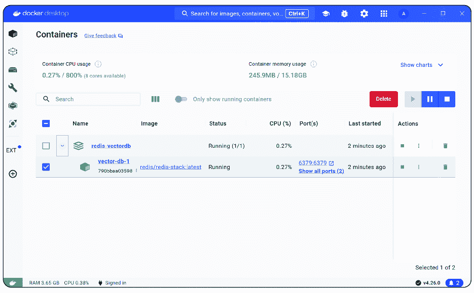
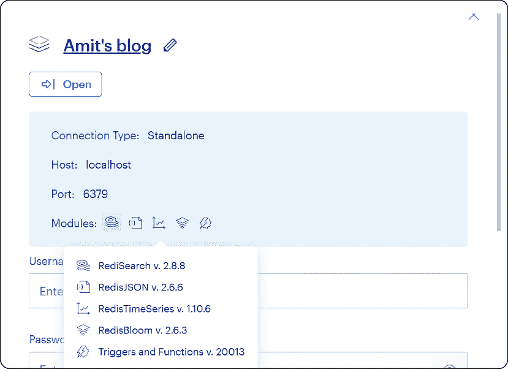
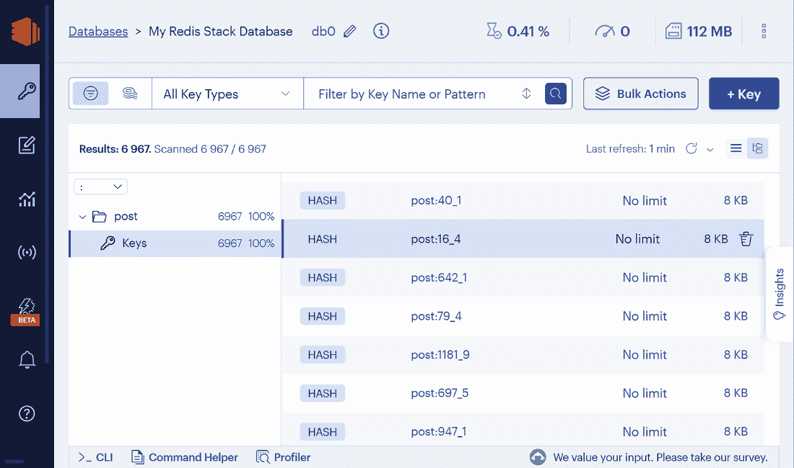
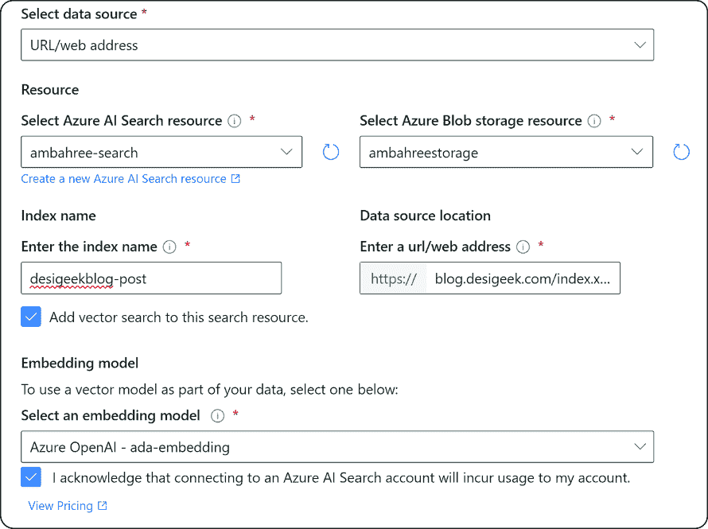

# 第八章：与您的数据聊天

### 本章涵盖

+   将您的数据引入企业的好处

+   安装和使用向量数据库和向量索引

+   规划和检索您的专有数据

+   使用向量数据库进行搜索

+   如何使用向量数据库和 LLM 实现端到端聊天

+   将您的数据和 RAG 联合起来的好处

+   RAG 如何为企业的人工智能安全性带来益处

利用大型语言模型（LLMs）进行数据交互实现是一种有希望的策略，特别适合那些寻求利用生成人工智能（AI）力量满足其特定商业需求的企业。通过将 LLM 的能力与企业特定的数据源和工具相结合，企业可以打造智能且具有情境意识的聊天机器人，为他们的客户和利益相关者提供宝贵的见解和建议。

在高层次上，使用 LLM 与数据聊天有两种方式——一种是通过采用检索增强生成（RAG）模式实现的检索引擎，另一种是为您的数据定制训练 LLM。后者更为复杂且大多数用户无法使用。

本章基于上一章中使用的 RAG 模式，用于增强 LLMs 与您的数据，特别是当企业希望在生产工作负载的规模上实施时。当企业使用 RAG 模式与 LLMs 整合其数据时，他们可以解锁许多优势，增强这些 AI 系统在其独特商业环境中的功能性和适用性。本章概述了这些差异，以及在许多情况下，它们比更大的上下文窗口更好。让我们首先确定企业在希望引入其数据时可以获得的优势。

## 8.1 企业使用其数据的优势

在商业技术动态领域，将 LLMs 集成到企业数据系统中预示着一个互动和直观过程的变革时代。正如我们之前所探讨的，这些尖端的人工智能驱动工具正在重塑企业与其数据互动的方式，从而开辟了前所未有的效率和可访问性途径。

大型语言模型（LLMs）在各种自然语言处理（NLP）任务中取得了令人印象深刻的成果，例如问答、摘要、翻译和对话。然而，LLMs 存在局限性和挑战，如数据质量、伦理问题和可扩展性。因此，许多企业对使用 LLMs 实现与数据交互的聊天功能感兴趣，这对他们的商业目标具有多项优势。

使用 LLM 为此目的的主要优势之一是它们可以提供智能和上下文感知的聊天机器人，能够以类似人类的熟练程度处理客户查询和关注。LLM 可以理解用户的输入的意义和意图，生成相关且连贯的响应，并在需要时通过调用 API 采取行动。这提高了客户满意度，并使人工代理能够专注于更复杂的工作。使用 LLM 进行数据聊天实现的另一个优势是它们可以用企业特定的数据进行定制，这导致更准确和相关的 AI 生成见解和建议。

最后，使用 LLM 进行数据聊天实现可以使得数据分析更加高效和有效。LLM 可以生成数据分析结果的自然语言摘要或解释，这有助于用户理解关键发现和影响。此外，LLM 可以生成交互式图表或图形，突出数据中的模式或趋势。这些功能可以增强用户体验，并促进组织内部的数据驱动决策。

### 8.1.1 关于大上下文窗口怎么办？

OpenAI 最新的模型——例如，具有 128K 上下文窗口的 GPT-4 Turbo 和谷歌最新的 Gemini Pro 1.5，具有 150 万个标记的内容窗口——已经引起了极大的热情和兴趣。然而，仅仅更大的上下文窗口是不够的。在您的数据上训练 LLM，与仅使用具有更大上下文窗口的 LLM 相比，有以下好处：

+   *更准确和有信息量的答案*——当与你的数据聊天时，LLM 可以访问比仅使用更大的上下文窗口多得多的信息。这使得 LLM 能够为你提供更准确和有信息量的答案。

+   *更个性化的答案*——LLM 还可以根据你的数据学习个性化其答案。例如，如果你与一个针对你的客户数据进行微调的 LLM 聊天，它可以学习提供更相关的答案来满足你的特定客户和他们的需求。例如，我们可以使用检索引擎来索引其客户数据，然后将检索引擎连接到 LLM。这将使公司能够以更个性化和信息化的方式与客户聊天。

+   *更具创造性的答案*——LLM 还可以使用你的数据来生成更具创造性和有趣的问题答案。例如，如果你与一个针对你的产品数据进行微调的 LLM 聊天，LLM 可以学习生成新的产品想法或营销活动。

当然，具有更大上下文窗口的 LLM 有其自身的好处，但它们也可能是一把双刃剑，存在一些限制。更大的上下文窗口允许我们在一次 API 调用中传递更多信息，并且不必过多担心应用程序的块化。例如，最近宣布的 GPT-4.5 Turbo 具有 128K 的上下文窗口，允许在一个提示中包含大约 300 页的文本，相比之下，早期的 GPT-4 32K 模型大约只能包含 75 页。

反之，拥有更大的上下文窗口也带来挑战。例如，更大的上下文窗口的 LLM 在训练和部署时可能更昂贵。它们也可能更容易产生幻觉或错误的答案，因为大的上下文窗口增加了模型输出的复杂性和不确定性。LLM 是在包含不完整、矛盾或噪声信息的大型、多样化数据集上训练的。当模型被赋予一个长的上下文窗口时，它必须处理更多信息并决定接下来要生成什么，这可能导致输出中的错误、不一致或虚构，尤其是如果模型依赖于启发式或记忆而不是推理或理解。

相比之下，与您的数据聊天可能更有效率且更不容易出错，主要是因为当我们与我们的数据聊天时，我们是在基于那些数据，并引导模型去使用。LLM 可以访问更广泛的信息，并学会根据您的数据个性化其答案。最终，选择更大的上下文窗口 LLM 与与您的数据聊天之间的最佳方式将取决于您的具体需求和资源。

### 8.1.2 使用我们的数据构建聊天应用程序

我们将基于上一章的 RAG 实现构建一个聊天应用程序，我们可以用它来与我们的数据聊天。正如我们之前看到的，向量数据库对企业至关重要，它使企业能够在一个生产环境中管理、安全和扩展嵌入。对于许多企业来说，用于语义搜索的向量数据库解决了生产系统所需的性能和安全要求。图 8.1 展示了在数据上集成 LLM 的高层次方法。


##### 图 8.1 Azure OpenAI 在您的数据上

例如，我们将使用我的博客([`blog.desigeek.com`](https://blog.desigeek.com))作为专有数据源。它包含 20 年以上的各种主题和技术帖子。如果我们对用户提出的每个问题都回到博客，加载所有帖子，创建嵌入，搜索这些帖子，然后使用 RAG 来回答问题，这个过程将非常耗时且不可扩展。此外，还将产生额外的成本，因为我们将使用更多的标记在每个对话回合或新的一组对话中。更好的方法是将以下四个阶段作为我们将要经历的：

+   阅读和注入信息（即检索）

+   创建嵌入并将细节保存到 Redis

+   使用博客文章的保存细节进行问答实现搜索（即增强）

+   将此与 LLM 生成相结合

让我们先设置一个向量数据库。

## 8.2 使用向量数据库

如我们之前所见，向量数据库已被设计用于在嵌入向量上运行。对于大多数企业用例，它们是 RAG 实现的绝佳补充，并允许我们使用我们的数据。如今，许多向量数据库可供使用，随着 LLM 和生成式 AI 的日益流行，每天对语义搜索的支持也在增加。让我们看看我们如何实现这一点。

在我们的学习环境中，我们希望有一个快速且易于设置和运行的工具，主要是为了理解部署向量数据库所需的不同概念和步骤，以及如何将其集成到我们的 RAG 实现中。为此，我们将使用 Redis 作为向量数据库，并在本地 Docker 容器中运行它。

Redis 是一个开源的内存键值数据存储，可以用作数据库、缓存、消息代理等。它支持字符串、列表、集合、哈希和流等数据结构。Redis 快速、可扩展且可靠，这使得它在需要低延迟和高吞吐量的许多用例中非常受欢迎。

Redis 通过模块的概念扩展其核心功能。Redis Search 是一个模块，它通过强大的文本搜索和二级索引功能扩展了 Redis。它允许你在 Redis 数据上创建索引，并使用丰富的查询语言进行查询。你还可以使用 Redis Search 进行向量相似度搜索，这使基于嵌入的语义搜索成为可能。

部署 Redis 有几种方法。对于本地开发，最快的方法是使用 Redis Stack Docker 容器，我们将使用这种方法。Redis Stack 包含几个 Redis 模块，对于我们来说，可以一起使用来创建一个快速的多模型数据存储和查询引擎。有关 Redis Stack Docker 容器的更多详细信息，请参阅 [`hub.docker.com/r/redis/redis-stack`](https://hub.docker.com/r/redis/redis-stack)。

注意：这里的主要先决条件是 Docker 应已安装并配置好，以便你可以使用。Docker 安装的详细信息超出了本书的范围，因为有一些书籍专门介绍 Docker 及其管理。如果你没有安装 Docker，请参阅 Docker Desktop 安装文档以获得更易于管理的体验，或者至少是 Docker 引擎。更多详细信息请参阅 [`docs.docker.com/desktop/`](https://docs.docker.com/desktop/)。

除了 OpenAI 包之外，我们还需要以下先决条件来运行 Redis：

+   Docker 必须已安装并本地运行。

+   当使用 conda 时，可以使用 `conda install -c conda-forge redis-py` 安装 `redis-py` 包。如果我们使用 pip，则使用 `pip install redis`。

我们将使用 docker-compose 文件来配置 Docker，如列表 8.1 所示。我们没有更改默认端口，但您可以根据您的环境需要配置它们。在这个例子中，我们从 Docker 仓库中拉取最新的 `redis-stack` 镜像，并暴露两个端口——6379 和 8001。我们还设置了一个数据卷来持久化数据库中填充的信息。最后，我们设置了一些初始的健康检查来检查基本事项，例如服务是否正在运行，并且可以通过配置的端口访问。如果您更改了端口，请确保在健康检查中更新测试。

##### 列表 8.1 `redis-stack` 的 docker-compose 文件

```py
version: '3.7'
services:

  vector-db:
    image: redis/redis-stack:latest
    ports:
      - 6379:6379
      - 8001:8001
    environment:
      - REDISEARCH_ARGS=CONCURRENT_WRITE_MODE
    volumes:
      - vector-db:/var/lib/redis
      - ./redis.conf:/usr/local/etc/redis/redis.conf
    healthcheck:
      test: ["CMD", "redis-cli", "-h", "localhost", "-p", "6379", "ping"]
      interval: 2s
      timeout: 1m30s
      retries: 5
      start_period: 5s

volumes:
  vector-db:
```

根据 Docker 的惯例，我们必须确保此文件以 `docker-compose.yml` 文件保存。您可以从保存文件的同一路径输入以下命令来启动它：`docker compose up -d`。在我们的例子中，容器通过 Docker Desktop GUI 运行，如图 8.2 所示。



##### 图 8.2 Docker Desktop 运行 Redis 容器

这也包括 Redis Insight，它是管理我们的 Redis 数据库的图形用户界面。一旦 Docker 容器运行，我们可以在本地通过 `http://localhost:8001` 访问它。如果一切设置正确，我们可以看到数据库和安装的模块（图 8.3）。



##### 图 8.3 在容器中本地运行的带有搜索功能的 Redis 数据库

现在我们已经启动并运行了矢量数据库，让我们继续下一步，检索信息。

注意：在本章中，我们以 Redis 为例，因为对于企业来说，在本地容器中运行它相对容易，可以尝试相关概念并掌握其复杂性。鉴于它是在本地容器中运行的，这也帮助缓解了关于数据进入云端的初始问题，至少在开发的早期阶段可能会引起关注。除了 Redis 之外，还有一些其他矢量数据库变得越来越受欢迎。一些更受欢迎的矢量数据库包括 Azure AI Search、Pinecone 和 Milvus。

##### Azure AI Search

尽管我们使用的是本地运行的 Redis，但对于需要扩展到更大数据集、索引和产品级工作负载以及可用性的企业来说，情况开始变得更加复杂。在这种情况下，Azure AI Search 是一个好的选择。

Azure AI Search 是一种基于云的服务，为构建搜索应用程序提供各种功能。除了提供向量搜索，允许您根据其向量嵌入找到并检索与给定查询在语义上相似的数据对象之外，它还支持混合搜索。混合搜索结合了全文和向量查询，这些查询针对包含可搜索纯文本内容和生成嵌入的搜索索引执行。在单个搜索请求中，混合查询可以使用现有功能，例如过滤、分面、排序、评分配置文件和语义排名。查询响应仅提供一个结果集，使用互逆排名融合（RRF）来确定哪些匹配项被包含。

Azure AI Search 在使用 LLM 进行向量搜索方面比 Redis 提供更多优势。它是一个完全管理的搜索服务，可以索引和搜索结构化、半结构化和非结构化数据。Azure AI Search 具有高度的可扩展性，可以轻松处理大量数据。它支持企业所需的各种强大安全功能，例如端到端加密、基于角色的访问控制（RBAC）等。更多详细信息请参阅[`learn.microsoft.com/en-us/azure/search/`](https://learn.microsoft.com/en-us/azure/search/)。

## 8.3 信息检索规划

首先，我们必须了解我们试图检索和索引的内容。这有助于我们制定方法并确定哪些信息是必要的，哪些是冗余的并且可以忽略。作为这项练习的一部分，我们还需要考虑技术方面，例如我们如何连接到源系统以及任何技术或实际限制。我们还必须了解数据格式和工程要求（包括数据清理和转换）。

在我们从博客获取数据之前，请查看表 8.1 中概述的详细信息。

##### 表 8.1 我们感兴趣的博客文章数据项

| 数据 | 描述 |
| --- | --- |
| URL | 单个博客文章的 URL |
| 标题 | 博客文章的标题 |
| 描述 | 几句话描述该特定博客文章的内容 |
| 发布日期 | 文章发布的日期 |
| 内容 | 博客文章的实际内容 |

尽管我们使用博客文章作为源系统，但它是一个整体示例，代表了大多数 RAG 方面，并帮助我们了解最佳实践以及如何处理它们。我们从远程系统中检索信息以阅读博客文章。这与企业读取各种业务系统信息的基本原理相似。根据源系统，他们通过 API、导出文件或连接到各种数据库和数据源来读取这些信息。

在我们的示例中，我们将使用博客的 RSS 源读取所有帖子。RSS 代表“真正简单的聚合”，这是一种标准网站内容分发方法，常用于发布更改。博客可以在[`blog.desigeek.com/`](https://blog.desigeek.com/)找到，相应的 RSS 源在[`blog.desigeek.com/index.xml`](https://blog.desigeek.com/index.xml)。

首先，我们假设 Redis 像之前展示的那样在本地容器中运行。我们将连接到 Redis 并创建一个新的索引，称为`posts`。索引的模式在下一列表中显示，并代表我们之前看到的数据结构。除了博客文章的主要内容外，我们还捕获了相关的元数据，这将帮助我们回答问题或更好地理解上下文。

##### 列表 8.2 Redis 索引模式

```py
SCHEMA = [
    TagField("url"),
    TextField("title"), 
    TextField("description"),
    TextField("publish_date"),
    TextField("content"),
    VectorField("embedding", "HNSW",
                {"TYPE": "FLOAT32",
                 "DIM": 1536,
                 "DISTANCE_METRIC": "COSINE"}),
   ]
```

此模式包含以下类型的字段：

+   `TagField`—用于存储标签，这些是简短、描述性的关键词，可以用来分类和组织数据。标签通常存储为字符串列表，Redis 搜索支持使用布尔运算符（如`AND`、`OR`和`NOT`）搜索标签。

+   `TextField`—用于存储文本数据，例如博客文章的标题、描述和内容。Redis 搜索支持对`TextField`进行全文搜索，这意味着您可以在文本中搜索单词和短语。

+   `VectorField`—存储用于执行机器学习任务（如图像分类和自然语言处理）的数据的向量的数学表示。Redis 搜索支持向量相似性搜索，这意味着您可以搜索与给定向量相似的向量。

大多数字段名称都是不言自明的，除了`VectorField`类型的`"embedding"`字段，它用于存储高维向量。Redis 支持两种相似性搜索算法，FLAT 和 HSNW；在我们的示例中，我们使用 HSNW。

HSNW 代表**分层可导航小世界**。它是一种用于多维空间中最近邻搜索的算法，在此用作嵌入类型。HSNW 算法特别适用于诸如相似性搜索或高维空间中的聚类等任务。它以其效率、准确性以及较低的计算开销而闻名。HSNW 将向量组织成图结构。

FLAT 代表**快速线性近似变换**。它是一种暴力算法和直接的方法，其中所有向量都在单个树或列表结构中索引。查询点的最近邻通常是通过计算查询点与其他索引的距离来实现的暴力搜索。这使得它更加准确，但计算密集且较慢。

嵌入是浮点数，如 FLOAT32 所示。我们将维度设置为与 Azure OpenAI 模型的 1536 维相匹配，这必须与 LLM 的架构相匹配。最后，我们使用余弦距离度量来衡量相似度。Redis 支持三种类型的距离度量（见表 8.2）。

##### 表 8.2 HNSW 距离度量选项

| HNSW 距离度量 | 描述 |
| --- | --- |
| 欧几里得距离 | 欧几里得空间中两点之间的直线距离。当所有维度相似时（例如，所有距离以米为单位测量），这是一个不错的选择。 |
| 点积 | 计算两个向量之间的点积。点积是两个序列数对应项乘积之和。 |
| 余弦 | 计算两个向量之间角度的余弦值。无论它们的幅度如何，它衡量向量之间的相似度。这在文本分析中经常使用，其中向量的方向（角度）比向量的长度更重要。 |

##### 标签字段与文本字段

`URL`字段是一个`TagField`而不是`TextField`。虽然一开始这可能看起来有些奇怪，但有一个很好的原因。使用`TagField`，整个 URL 被视为一个单独的标签。如果想要使用精确 URL 搜索文档，这个属性很有用。但是，如果您想搜索包含其 URL 中某些单词的文档，这将毫无用处，因为 URL 不会被分词。

相反，如果将 URL 字段定义为`TextField`，它将被分词，URL 的每个部分将分别索引。如果您搜索包含其 URL 中某些单词的文档，这将很有用。但是，如果您想通过精确 URL 搜索文档，这将没有用，因为 URL 将被分词。

在此情况下，如果我们运行了一个需要分词的搜索（即搜索包含特定单词的 URL 的文档），搜索将不会返回预期的结果。同样，如果您将`URL`定义为`TextField`，然后尝试执行一个需要精确匹配的搜索（即通过精确 URL 搜索文档），搜索也不会返回预期的结果。

现在我们已经了解了所需的数据和相关模式，让我们在 Redis 中创建索引以开始。我们首先连接到 Redis 数据库，在我们的例子中，它在本地的 Docker 上运行，可以通过端口 6379 访问，如列表 8.3 所示。

我们需要以下环境变量指向服务器主机、端口和要设置的密码，分别如下：

对于 Windows，使用

```py
setx REDIS_HOST "your-host-details"
setx REDIS_PORT "Port-number-exposed"
setx REDIS_PASSWORD "Password-required-to-connect"
```

注意：您必须重新启动您的终端以读取新变量。

在 Linux/Mac 上，使用

```py
export REDIS_HOST="your-host-details"
export REDIS_PORT="Port-number-exposed"
export REDIS_ PASSWORD="Password-required-to-connect"Bash:
echo export REDIS_HOST="your-host-details" >> /etc/environment && source /etc/environment
echo export REDIS_PORT="Port-number-exposed" >> /etc/environment && source /etc/environment
echo export REDIS_ PASSWORD="Password-required-to-connect" >> /etc/environment && source /etc/environment
```

我们首先需要与 Redis 服务器建立连接，这相当简单：

```py
# Connect to the Redis server
conn = redis.Redis(host=redis_host, 
                   port=redis_port,
                   password=redis_password, 
                   encoding='utf-8', 
                   decode_responses=True)
```

由于我们已经定义了模式，如列表 8.2 所示，创建向量索引是直接的。我们调用`create_index`函数，并传递一个名称、模式和可选的前缀。只支持两种索引——`HASH`（默认）或`JSON`——我们需要一个单独的模块。在我们的情况下，我们将使用默认的`HASH`：

```py
conn.ft(index_name).create_index(
     fields=schema,
     definition=IndexDefinition(prefix=["post:"],
                                       index_type=IndexType.HASH))
```

当然，我们可以删除索引并查看其详情。此辅助函数的完整代码如下所示。

##### 列表 8.3 Redis 搜索索引操作

```py
import redis
from redis.commands.search.field import VectorField, TextField
from redis.commands.search.query import Query
from redis.commands.search.indexDefinition import 
     ↪IndexDefinition, IndexType
from redis.commands.search.field import TagField

redis_host = os.getenv('REDIS_HOST')           #1
redis_port = os.getenv('REDIS_PORT')          #1
redis_password = os.getenv('REDIS_PASSWORD')  #1

conn = redis.Redis(host=redis_host,           #2
                   port=redis_port,          #2
                   password=redis_password,  #2
                   encoding='utf-8',         #2          
                   decode_responses=True)    #2          

SCHEMA = [
    TagField("url"),
    TextField("title"), 
    TextField("description"),
    TextField("publish_date"),
    TextField("content"),
    VectorField("embedding", "HNSW",
                {"TYPE": "FLOAT32",
                 "DIM": 1536,                       #3
                 "DISTANCE_METRIC": "COSINE"}),
]

def create_index(conn, schema, index_name="posts"):
    try:
        conn.ft(index_name).create_index(
            fields=schema,
            definition=IndexDefinition(prefix=["post:"],
                                       index_type=IndexType.HASH))
    except Exception as e:
        print("Index already exists")

def delete_index(conn, index_name="posts"):            #4
    try:
        conn.execute_command('FT.DROPINDEX', index_name)
    except Exception as e:
        print("Failed to delete index: ", e)

def delete_all_keys_from_index(conn, index_name="posts"):    #5
    try:
        # 1\. Retrieve all document IDs from the index.
        # This assumes the total number of documents isn't large. 
        # If it is, you might want to paginate the query.
        result = conn.execute_command('FT.SEARCH',
                                      index_name,
                                      '*', 
                                      'NOCONTENT')

        # 2\. Parse the result to get document IDs.
        # Skip the first element which is the total count.
        # Taking every second element starting from the first.
        doc_ids = result[1::2]

        # 3\. Delete each document key.
        for doc_id in doc_ids:
            conn.delete(doc_id)

    except Exception as e:
        print("Failed to delete keys: ", e))

def view_index(conn, index_name="posts"):                 #6
    try:
        info = conn.execute_command('FT.INFO', index_name)
        for i in range(0, len(info), 2):
            print(f"{info[i]}: {info[i+1]}")
    except Exception as e:
        print("Failed to retrieve index details: ", e)

def main():
    while True:                                       #7
        print("1\. View index details")
        print("2\. Create index")
        print("3\. Delete index")
        print("4\. Exit")
        choice = input("Enter your choice: ")

        if choice == '1':
            # Call the function to view index
            view_index(conn)
            pass
        elif choice == '2':
            # Call the function to create index
            create_index(conn, SCHEMA)
        elif choice == '3':
            # Call the function to delete index
            delete_all_keys_from_index(conn)
            delete_index(conn)
        elif choice == '4':
            break
        else:
            print("Invalid choice. Please enter a valid option.")

if __name__ == "__main__":
    main()
```

#1 Redis 连接详情

#2 连接到 Redis 服务器

#3 设置维度以匹配 LLM 设计

#4 删除索引的函数

#5 从索引中删除键的函数

#6 创建索引的函数

#7 运行主循环的函数

图 8.4 展示了该代码在本地运行的示例。索引类型是 HASH，键的前缀以“post.”开头。



##### 图 8.4 Redis Insight 在本地作为示例运行

在我们的情况下，索引已经填充，当我们执行此操作以查看索引时，我们获得类似于以下列表的输出。请注意，为了简洁起见，输出已被截断：

##### 列表 8.4 Redis 搜索索引详情

```py
index_name: posts
index_options: []
index_definition: ['key_type', 'HASH', 'prefixes', ['post:'], 'default_score', '1']
attributes: [['identifier', 'url', 'attribute', 'url', 'type', 
    ↪'TAG', 'SEPARATOR', ','], ['identifier', 'title', 'attribute', 
    ↪'title', 'type', 'TEXT', 'WEIGHT', '1'], ['identifier', 
    ↪'description', 'attribute', 'description', 'type', 'TEXT', 
    ↪'WEIGHT', '1'], ['identifier', 'publish_date', 'attribute', 
    ↪'publish_date', 'type', 'TEXT', 'WEIGHT', '1'], ['identifier', 
    ↪'embedding', 'attribute', 'embedding', 'type', 'VECTOR']]
num_docs: 1304
max_doc_id: 1304
num_terms: 3047
num_records: 14092
vector_index_sz_mb: 12.586814880371094
total_inverted_index_blocks: 4370
offset_vectors_sz_mb: 0.011086463928222656
doc_table_size_mb: 0.09221076965332031
key_table_size_mb: 0.03916168212890625
total_indexing_time: 708.988
...
```

图 8.5 展示了使用 Redis Insight（一个允许我们进行一些基本数据库管理的图形用户界面）查看索引项细节的情况。我们可以看到在设置索引时确定的字段。嵌入是二进制表示，因此看起来像是乱码。


##### 图 8.5 索引详情

现在我们已经设置了索引，让我们看看我们如何检索数据（即博客文章），将其分块，填充向量数据库，并最终更新我们创建的索引。

## 8.4 获取数据

从高层次来看，这个过程相当简单。我们开始使用`feedparser`库加载 RSS 源；然后，我们检索找到的每篇博客文章，解析我们感兴趣的内容，创建相应的嵌入，并将所有详细信息保存到 Redis 中。列表 8.5 显示了此流程。

由于每篇博客文章都是一个 HTML 页面，我们使用`BeautifulSoup`，一个 Python 库，来解析 HTML 页面，这样我们就可以选择所需的内容。如列表 8.5 所示，我们需要清理一些东西，并通过匹配博客文章的风格和生成的 HTML 来解析内容。对各种属性和类（如`post-title`等）的搜索取决于传入数据的形式和我们试图解决的问题的使用场景。在这个例子中，如果博客更改了主题或渲染方式，代码必须进行更新。

##### 列表 8.5 从 HTML 中提取内容

```py
    r = requests.get(post.link)
    soup = BeautifulSoup(r.text, 'html.parser')

    # Get the title
    try:    
        article_title = soup.find('h1', {'class': 'post-title'}).text
        article_title = article_title.replace("| Amit Bahree's  
                                ↪(useless?) insight!", "")
    except AttributeError:
        article_title = ""
    print("\tTitle:" + article_title)

    # get the post description
    try:
        article_desc = soup.find('div', {'class': 'post-description'}).text
    except AttributeError as e:
        #print("Error getting description: ", e)
        article_desc = ""

    # get the publish date
    try:
        temp = soup.find('div', {'class': 'post-meta'}, {'span', 'title'}).text
        match = re.search(r"(\w+\s\d+,\s\d+)", temp)
        if match:
            publish_date = match.group(1)
    except AttributeError:
        publish_date = ""

    # get the article body
    try:
        article_body = soup.find('div', {'class': 'post-content'}).text
    except AttributeError:
        article_body = ""
```

对于现实世界的企业用例，检索器必须了解源系统的内容和结构，这可能相当复杂且令人畏惧。在大多数情况下，这需要通过数据管道运行。此数据管道将帮助解决所需的所有数据工程方面——所有这些都是在相关用例的背景下进行的。有关更多详细信息，请参阅 8.4.1 节：

```py
    chunks = split_sentences_by_spacy(article, max_tokens=3000, overlap=10)
    print(f"Number of chunks: {len(chunks)}")
```

我们创建一个新的索引哈希，添加我们感兴趣的信息的细节作为嵌入—URL、标题、发布日期和博客文章。我们还关联了具有相同上下文创建的不同块。

注意，在接下来的列表中，我们只展示了代码的关键部分，并且为了避免严重性，我们避免使用之前见过的辅助函数。完整的代码示例可以在本书的 GitHub 代码仓库中找到（[`bit.ly/GenAIBook`](https://bit.ly/GenAIBook)）。

##### 列表 8.6 检索博客文章并将其保存到 Redis

```py
# OpenAI API key
openai.api_key = os.getenv('OPENAI_API_BOOK_KEY')

# Redis connection details
redis_host = os.getenv('REDIS_HOST')
redis_port = os.getenv('REDIS_PORT')
redis_password = os.getenv('REDIS_PASSWORD')

def split_sentences_by_spacy(text, max_tokens, 
                        overlap=0, 
                        model="en_core_web_sm"):
...

# count tokens
def count_tokens(...)
...

def get_embedding(text):
...

# Connect to the Redis server
conn = redis.Redis(...)

SCHEMA = [ ... ]
# URL of the RSS feed to parse
url = https://blog.desigeek.com/index.xml

# Parse the RSS feed with feedparser
print("Parsing RSS feed...")
feed = feedparser.parse(url)

# get number of blog posts in feed
blog_posts = len(feed.entries)
print("Number of blog posts: ", blog_posts)

p = conn.pipeline(transaction=False)
for i, post in enumerate(feed.entries):
    # report progress
    print("Create embedding and save for entry #", i, " of ", blog_posts)

    # Extract the content – using BeautifulSoup
    r = requests.get(post.link)
    soup = BeautifulSoup(r.text, 'html.parser')

    # Get the title
...

    # get the post description
    ...

    # get the publish date
    ...

    # get the article body
    try:
        article_body = soup.find('div', {'class': 'post-content'}).text
    except AttributeError:
        article_body = ""

    # This should be chunked up
    article = article_body

    total_token_count = 0
    chunks = []

    # split the text into chunks by sentences
    chunks = split_sentences_by_spacy(article, max_tokens=3000, overlap=10)
    print(f"Number of chunks: {len(chunks)}")

    for j, chunk in enumerate(tqdm(chunks))
        vector = get_embedding(chunk)
        # convert to numpy array
        vector = np.array(vector).astype(np.float32).tobytes()

        # Create a new hash with the URL and embedding
        post_hash = {
            "url": post.link,
            "title": article_title,
            "description": article_desc,
            "publish_date": publish_date,
            "content": chunk,
            "embedding": vector
        }

        conn.hset(name=f"post:{i}_{j}", mapping=post_hash)

p.execute()
print("Vector upload complete.")
```

一旦我们获取到博客文章的内容，我们需要将其分块，正如前一章所讨论的。在这个例子中，我们使用 spaCy 对博客文章进行分块，并且不同块之间存在一些重叠。

### 8.4.1 检索器管道最佳实践

在实现 RAG 模式时，对源系统内容及其结构的深入了解至关重要。RAG 模型的成功取决于其访问和解释正确数据的能力，这需要构建良好的数据管道。这个管道不仅仅是数据流动的渠道，而是一个复杂的框架，确保数据被提取、转换、索引和存储，以符合模型的要求和定义的使用案例。

在企业中实施 GPTs 和 LLMs 的第一步是对源系统有深刻的理解。这包括彻底分析数据结构，包括实体关系图、数据类型和数据分布。数据概要分析工具在理解内容性质方面可以起到关键作用。

注意：为了使 RAG 运作良好，仔细规划在检索器管道中需要进行的预处理非常重要，而不仅仅是使用一切，不考虑是否更好。如果没有良好规划，这在使用搜索作为 RAG 实现的一部分时将造成问题。

下一个阶段定义了用例，这包括创建一个详细的需求文档，概述问题、潜在解决方案、预期结果和成功指标。此文档还应详细说明用户的信息需求以及 RAG 模型将被应用到的场景。

此后，重点转向数据提取和转换。这个过程涉及使用 ETL（提取、转换、加载）工具从源系统提取数据并将其转换为 RAG 模型可以理解的形式。这可能涉及自然语言处理技术，如分词、停用词去除和词形还原。

数据转换完成后，需要对其进行索引以实现高效检索。Azure AI Search、Elasticsearch、Solr 和 Lucene 对于此目的非常理想，因为它们提供全文搜索功能，并且可以有效地处理大量数据集。

与数据索引并行，选择合适的数据存储解决方案也很重要。根据数据大小、速度和类型的特定需求，这可能是一个传统的 SQL 数据库，如 Cosmos DB，或一个分布式文件系统，如 Hadoop HDFS。

最关键的阶段之一是预处理规划。这涉及到对预处理步骤的仔细规划，可能包括噪声消除、归一化和降维等技术。目标是保留与用例相关的信息，同时降低模型的复杂性。

下一个阶段是模型集成，这涉及到使用 AI 模型供应商提供的 API 或 SDK 将 RAG 模型集成到应用程序中。检索器必须配置正确的查询参数，生成器应设置所需的输出结构。

微调和监控对于提高模型性能和确保系统健康至关重要。这涉及到使用验证数据集进行微调和应用程序性能管理（APM）工具进行监控。

关于可扩展性和可靠性，应使用 AWS、Google Cloud 或 Azure 等云平台按需扩展系统。Docker 和 Kubernetes 等容器化平台可以帮助扩展和管理应用程序。冗余和故障转移策略对于确保系统可靠性至关重要。

此外，安全和合规性不容忽视。实施数据加密、用户身份验证、访问控制和定期系统审计可以确保数据安全并符合数据保护法规，如 GDPR 或 CCPA。

在部署之前，严格的测试和验证是必不可少的，以确保管道和 RAG 模型符合用例中概述的期望。一旦系统上线，应提供全面的文档和技术培训，以便团队进行有效的管理、维护和故障排除。

最后，确保检索语料库的质量控制至关重要，实施信息安全和个人隐私措施，定期更新检索语料库，并有效地分配资源。通过遵循这些步骤，企业可以有效地构建和维护 AI 驱动的应用程序。

## 8.5 使用 Redis 进行搜索

现在我们已经摄取了数据并准备好了索引，我们可以对其进行搜索。我们创建了一个简单的控制台应用程序，它接受用户的查询，将其矢量化，并根据返回给用户的三个最相似帖子进行搜索。这是一个语义搜索。以下列表显示了当我们询问“Longhorn”时生成的输出示例。

##### 列表 8.7 搜索结果

```py
$  python .\search.py
Connected to Redis
Enter your query: Tell me about Longhorn
Vectorizing query...
Searching for similar posts...
Found 3 results:
You probably already heard this, but <strong>Chris Sells</strong> 
   ↪has a new column on MSDN called <strong>Longhorn Foghorn</strong>
, that describes each of the â
<strong>Pillars of Longhorn</strong>
â - This is something that IMHO developers would understand and 
↪appreciate. In the first article he explains the âPillarsâ and then 
↪in the next two goes onto build Solitaire. You can download the sample 
↪and play with it too.
From OSNews: Microsft has made <em>hard statements about perfomance 
↪improvements in Longhorn ...
```

注意：Windows Longhorn 曾经是最终成为 Windows Vista 的操作系统代号。

让我们来看看使用 Redis 实现搜索的代码。我们首先获取一个用户查询，例如“告诉我关于 Longhorn 的事情”，创建一个向量，并使用余弦相似度获取一组可比较的结果。

##### 列表 8.8 使用 Redis 进行搜索

```py
def hybrid_search(query_vector, client, top_k=3, hybrid_fields="*"):
    base_query = f"{hybrid_fields}=>
                        [KNN {top_k} 
                        @embedding $vector AS vector_score]"  #1
    query = Query(base_query).return_fields(
        "url",                                               #2
        "title",                                            #2
        "publish_date",                                     #2
        "description",                                      #2
        "content",                                          #2
        "vector_score").sort_by("vector_score").dialect(2)   #3
    try:
        results = client.ft("posts").search(
            query, query_params={"vector": query_vector})  #4
    except Exception as e:
        print("Error calling Redis search: ", e)
        return None

    if results.total == 0:
        print("No results found for the given query vector.")
        return None

    return results

# Connect to the Redis server
conn = redis.Redis(...)

query = input("Enter your query: ")      #5

print("Vectorizing query...")
query_vector = get_embedding(query)    #6

query_vector = np.array(query_vector).astype(              #7

                        np.float32).tobytes()
print("Searching for similar posts...")
results = hybrid_search(query_vector, conn)                #8

if results:
    print(f"Found {results.total} results:")
    for i, post in enumerate(results.docs):
        score = 1 - float(post.vector_score)
        print(post.content)
else:
    print("No results found")
```

#1 一个基础查询，它通过 KNN 搜索预先过滤字段

#2 选择我们感兴趣的搜索的不同字段

#3 按余弦相似度降序排序

#4 执行查询

#5 从用户那里捕获查询

#6 向量化输入

#7 将向量转换为 NumPy 数组

#8 执行相似度搜索

如其名所示，`hybrid_search()`函数执行混合搜索查询的重头戏。混合搜索查询将多种类型的搜索组合成一个单一的查询。这可以包括将基于文本的搜索与其他类型相结合，例如数值、分类或甚至是基于向量的搜索。请注意，确切的搜索类型将取决于信息和需求。

在我们的例子中，我们将嵌入向量上的 K-Nearest Neighbors (KNN)搜索与其他搜索字段相结合。KNN 搜索找到与给定项目最相关的项目，在这种情况下，与给定查询向量最相似的帖子。查询结果按向量分数排序，这意味着基于余弦相似度的高到低排序。换句话说，首先显示相似度最高的结果。我们还通过`top_k`参数将其限制为前三个项目。

请注意，搜索的确切性质和类型也取决于搜索引擎和数据类型。有关 Redis 搜索类型和 KNN 的更多详细信息，请参阅[`mng.bz/o0Gp`](https://mng.bz/o0Gp)上的文档。

现在我们已经看到了搜索，让我们将所有维度结合起来，并使用 LLM 将其集成到聊天体验中。

## 8.6 由 RAG 驱动的端到端聊天实现

在本章和上一章中，我们讨论和检查了所有这些部分，以帮助我们理解一些核心概念；现在，我们可以将它们全部结合起来，构建一个端到端的聊天应用。在应用中，我们可以提出问题以获取有关我们的数据（即博客文章）的详细信息。图 8.6 显示了应用流程。


##### 图 8.6 端到端聊天应用

用户首先提出的问题被转换为嵌入，然后在 Redis 中使用混合搜索索引进行搜索以找到类似的片段，这些片段作为搜索结果返回。正如我们之前看到的，博客文章已经注入到 Redis 数据库并进行了索引。一旦我们得到结果，我们就通过结合原始问题和检索到的片段来回答，形成 LLM 提示。这些被传递到提示本身，最后调用 LLM 生成响应。

在搜索方面，我们在本地部署了 Redis 并创建了一个向量索引。我们读取了近 20 年的所有博客文章。我们为这些文章创建了相关的片段及其对应的嵌入，并填充了我们的向量数据库。我们还对这些嵌入实现了向量搜索。唯一剩下的事情是将所有这些集成到我们的应用程序中，并将其与 LLM 连接起来，以完成我们 RAG 实现的最后阶段。

列表 8.9 展示了如何实现这一点。几个辅助函数，例如`get_search_results()`，接收用户的查询，调用另一个辅助函数来搜索 Redis，并返回找到的任何结果。调用 GPT 的实际 API 调用在`ask_gpt()`函数中，它是一个`ChatCompletion()` API，就像我们之前看到的。

与之前的示例一样，为了简洁，我们省略了代码的辅助函数和其他方面。完整的代码示例可在本书配套的 GitHub 代码仓库中找到（[`bit.ly/GenAIBook`](https://bit.ly/GenAIBook)）。

##### 列表 8.9 端到端 RAG 驱动的聊天

```py
def hybrid_search(query_vector, client, top_k=5, hybrid_fields="*"):
...
    return results

def get_search_results(query:str, max_token=4096, 
                       ↪debug_message=False) -> str:
    query_vector = get_embedding(query)    #1

    query_vector = np.array(query_vector).astype(
        np.float32).tobytes()    #2

    print("Searching for similar posts...")
    results = hybrid_search(query_vector, conn, top_k=5)   #3

    token_budget = max_token - count_tokens(query)        #4
    if debug_message:
        print(f"Token budget: {token_budget}")

    message = 'Use the blog post below to answer the subsequent 
               ↪question. If the answer cannot be found in the 
               ↪articles, write "Sorry, I could not find an answer in 
               ↪the blog posts."'
    question = f"\n\nQuestion: {query}"

    if results:
        for i, post in enumerate(results.docs):          #5
            next_post = f'\n\nBlog post:\n"""\n{post.content}\n"""'
            new_token_usage = count_tokens(message + question + next_post)
            if new_token_usage < token_budget:
                if debug_message:
                    print(f"Token usage: {new_token_usage}")
                message += next_post
            else:
                break
    else:
        print("No results found")

    return message + question

def ask_gpt(query : str, max_token = 4096, debug_message = False) -> str:
    message = get_search_results(                      #6
        query,
        max_token,
        debug_message=debug_message)

    messages = [                                   #7
        {"role": 
         "system", 
         "content": "You answer questions in summary from the [CA]
                     blog posts."},
        {"role":
          "user",
            "content": message},]

    response = openai.ChatCompletion.create(           #8
        model="gpt-3.5-turbo-16k",
        messages=messages,
        temperature=0.7,
        max_tokens=2000,
        top_p=0.95
    )
    response_message = response["choices"][0]["message"]["content"]
    return response_message

if __name__ == "__main__":
    # Enter a query
    while True:
        query = input("Please enter your query: ")
        print(ask_gpt(query, max_token=15000, debug_message=False))
        print("=="*20)
```

#1 将查询向量化

#2 将向量转换为 numpy 数组

#3 执行相似性搜索

#4 管理 token 预算

#5 在保持 token 预算的同时循环遍历结果

#6 运行向量搜索以获取嵌入

#7 设置聊天完成调用

#8 调用 LLM

当我们运行它并与博客进行聊天时，我们可以看到所有这些功能是如何结合在一起的。它理解查询，创建嵌入，使用向量数据库和相关向量索引来检索前五个匹配结果，将这些结果添加到提示中，并使用 LLM 来生成响应（图 8.7）。

在我们迄今为止看到的示例中，我们负责一切——从设置 Docker 容器到部署 Redis 和摄取数据。这对企业来说不足以投入生产。还需要更多的系统工程，例如设置各种机器集群，根据需要扩展或缩减它们，管理 Redis，安全要求，整体运营等等。这需要大量的时间、努力、成本和技能，并非每个组织都具备。另一种选择是使用 Azure OpenAI，它可以做到许多事情，并且可以让组织更快地进入市场，可能成本更低。让我们看看 Azure OpenAI 如何以更快的速度实现相同的结果。


##### 图 8.7 使用 GPT-3.5 Turbo 的博客数据问答

## 8.7 在您的数据上使用 Azure OpenAI

许多企业使用 Azure，将 Azure OpenAI 作为其数据策略的一部分，代表了在业务转型中利用生成式 AI 力量的关键一步。Azure OpenAI 提供了一个企业级平台，将高级 AI 模型如 ChatGPT 集成到您的数据工作流程中。

“Azure OpenAI 在您的数据上”是一项服务，它使您能够在您的数据上运行这些强大的聊天模型，并获得企业生产工作负载所需的即用型功能：可扩展性、安全性、更新和与其他系统的集成。您可以使用 Azure OpenAI Studio（见图 8.8）或 REST API 连接您的数据源。

注意 Azure AI Studio 是一个结合了多个 Azure AI 服务功能的平台。它旨在为开发者提供一个企业级平台，用于构建生成式 AI 应用。您可以通过 Azure AI SDK 和 Azure AI CLI 首先与项目代码进行交互，并使用最前沿的 AI 工具和 ML 模型无缝探索、构建、测试和部署。

Azure OpenAI 的吸引力在于其与更广泛的 Azure 生态系统的无缝集成。将这些强大的 AI 模型连接到您的数据存储库，可以释放更复杂的数据分析、自然语言处理和预测洞察的潜力。这种集成对于在 Azure 上拥有显著足迹的企业尤其有益，使他们能够在最小干扰的情况下增强现有基础设施。


##### 图 8.8 将您的数据添加到 Azure OpenAI

Azure AI Studio 支持从现有的 Azure AI 搜索索引、Blob 存储、Cosmos DB 等选项。其中之一是一个 URL，我们将用它来摄取博客文章（见图 8.9）。我们还可以将 RSS 源本地保存并作为文件上传。使用我们自己的 Azure AI 搜索索引的一个优点是，它能够从源系统保持数据摄取的更新，这可以替代 Redis，并在需要时全球分布到云规模。


##### 图 8.9 Azure AI Studio：添加数据源

我们可以在这里配置和设置大多数事情，包括将保存这些数据的存储资源、Azure AI 搜索资源、索引详情、嵌入详情等等（见图 8.10）。只需几点击，所有这些就设置好了，并准备好供我们使用。



##### 图 8.10 配置数据摄取的详细信息

在信息安全方面，Azure 强大的安全和合规框架简化了这一过程，确保您的数据在与 AI 模型交互的整个过程中都得到保护。Azure OpenAI 支持您数据上的两个关键功能：基于角色的和文档级别的访问控制。这个功能与 Azure AI 搜索安全过滤器协同工作，可以用来限制只有那些根据其允许的组和 LDAP 成员资格应该有权访问的用户，这对于许多企业，尤其是在受监管的行业中，是一个关键要求。

最后，Azure 处理和分析大量云规模非结构化数据的能力的可扩展性是另一个显著优势。例如，OpenAI 的 ChatGPT 内部使用 Azure AI Search，并且每天的工作负载超过 1 亿用户。Azure 的云基础设施允许随着数据需求的增长轻松扩展 AI 能力。有关 Azure OpenAI 的更多详细信息，请参阅[`mng.bz/n022`](https://mng.bz/n022)。

## 8.8 使用 RAG 引入数据的优势

企业通常难以从电子邮件、客户反馈或社交媒体互动等非结构化数据源中提取有意义的见解。当企业使用 LLMs 中的 RAG 整合他们的数据时，他们可以解锁许多优势，增强这些 AI 系统在其独特业务环境中的功能和适用性。

此功能在仅扩展这些模型的上下文窗口方面提供了独特的优势。这种模式增强了 LLM 输出的相关性和准确性，并提供了仅靠更大的上下文窗口无法比拟的战略优势。LLMs 可以分析这些数据，以类似人类的方式解释它，并在极短的时间内提供可操作的见解。

将 RAG 与实时企业数据进行整合确保了检索并包含在响应中的信息是相关且最新的，这在快速发展的行业中是一个关键因素。这种定制化导致更精确和适用的答案，这对于具有专门知识领域的行业，如法律、医疗或技术领域，尤其有益。

使用企业特定数据结合 RAG 模型的关键优势在于模型响应的定制准确性和适用性。具有更大上下文窗口的 LLMs 可以在单个实例中处理更多信息，但它们可能仍然缺乏在专业领域的知识深度。当企业引入他们的数据时，LLMs 可以生成与组织特定行业、术语和运营复杂性复杂对齐的响应。这种特定性对于专业知识至关重要的行业至关重要，并且超出了更大上下文窗口所能提供的范围。

虽然更大的上下文窗口允许在模型的响应中考虑更广泛的现有信息，但它并不一定包含最新或企业特定的数据。此外，上下文窗口越大，模型需要处理的数据就越多，速度也就越慢。

此外，整合专有数据比仅仅扩展上下文窗口更有效地增强决策过程。这种整合使得大型语言模型（LLMs）能够提供深深植根于企业历史数据和战略目标的见解和分析。相比之下，更大的上下文窗口可能提供更广泛的信息，但缺乏精确性和对企业战略问题和挑战的直接相关性。

关于数据安全和隐私，将专有数据置于企业控制之下比依赖于可能通过更大的上下文窗口访问的公共或通用数据更容易管理。通过控制数据输入，企业可以更有效地确保符合数据隐私法规。

在企业环境中实施 RAG 与您的数据相结合提供了显著的 AI 安全性优势，主要是通过提高信息的准确性和可靠性。这种将 LLM 的生成能力与全面的数据语料库相结合的方法，使模型能够访问最新的、事实性的数据，这对于处理时间敏感和准确性关键信息的企业至关重要。此外，通过从多样化的来源检索数据，RAG 可以减轻 LLM 训练数据中固有的偏差，这对于做出无偏、数据驱动的决策至关重要。企业可以定制检索语料库，确保与行业法规和内部政策保持一致。此外，纳入最新信息和提供生成内容的来源，提供了改进的透明度和决策支持。

虽然扩大 LLM（大型语言模型）的上下文窗口提供了一定的好处，但将专有数据与 RAG 模型集成提供了特定性、当前相关性、战略一致性、个性化、数据安全性和创新潜力，这是仅仅增加上下文窗口所无法比拟的。这种方法使企业能够更有效地利用 LLM 满足其独特的商业需求和目标。

## 摘要

+   将专有数据与 RAG 模型集成的好处是增强了 AI 系统的特定性、相关性、战略一致性、个性化、数据安全性和创新潜力。

+   与仅仅扩大 LLM 的上下文窗口相比，使用专有数据提供了多个优势，因为前者提供了更准确、相关和个性化的答案。

+   在生产环境中，使用向量数据库和向量索引来管理、安全和扩展嵌入对于性能和成本至关重要。

+   获取专有数据、将其分块、创建嵌入并将详细信息保存到向量数据库中的过程取决于现有数据的形状。这可能需要大量的规划和数据工程工作。

+   将 RAG 模式与源系统集成是复杂的，需要规划、稳健的工程和数据结构细节的理解。

+   使用 RAG、提示工程、嵌入和搜索的端到端应用对于组织来说可能非常强大。然而，它也很复杂，如果不正确设计，在部署到生产环境中时可能会减慢速度。

+   本章重点介绍了如何使用向量数据库进行搜索，根据给定项的向量嵌入检索与其最相似的项目。它还展示了将向量数据库和 RAG（检索即生成）集成对于实现端到端聊天应用的重要性。

+   “Azure OpenAI on your data”是一种 PaaS 服务，它使企业能够在他们的数据上运行 AI 模型，并具有诸如可扩展性、安全性和集成到其他 Azure 服务等功能。
